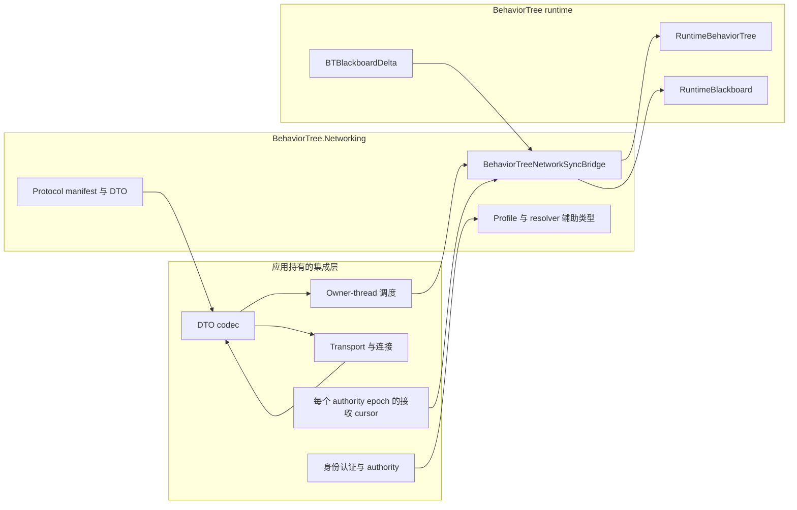

# CycloneGames.BehaviorTree.Networking

[English](./README.md) | 简体中文

`CycloneGames.BehaviorTree.Networking` 是 [CycloneGames.BehaviorTree](../CycloneGames.BehaviorTree/README.SCH.md) 与 [CycloneGames.Networking](../CycloneGames.Networking/README.SCH.md) 之间的可选接入 adapter。它定义版本化协议、行为树同步 profile、状态 payload DTO、authority generation 与 observer 辅助类型，以及处理 snapshot、delta、hash 和 tick control 的 runtime bridge。

基础 BehaviorTree 包不依赖本包。只有 managed behavior tree 状态需要跨越 `CycloneGames.Networking` 边界时，才应接入本包。

## 模块职责

本包负责行为树专用的网络契约和转换边界：

- 协议保留范围 `14000-14999`，其中内置消息使用 `14000-14005`；
- 不可变 `BehaviorTreeNetworkProfile` 值和内置 profile factory；
- handshake、state payload、desync report、tick control 和 authority transfer 消息 DTO；
- 用于 capture、提交前接收校验、状态应用和 hash 比对的 `BehaviorTreeNetworkSyncBridge`；
- 每条 `(TargetNetworkId, TreeTemplateHash, AuthorityGeneration)` 复制 stream 由调用方持有的接收 cursor `BehaviorTreePayloadReceiveState`；
- server-authoritative role 解析和基于 interest 的 observer 选择辅助类型。

本包有意不提供 transport socket、连接管理、packet encoding、身份认证、rate limiting、重传、后端 SDK 集成或网络 tick loop。`BehaviorTreeNetworkProfile`、authority resolver 和 observer resolver 只描述或计算 policy；应用与 transport adapter 必须实际执行这些 policy。

## 五分钟接入

### 1. 添加显式 Assembly 引用

三个 assembly 均使用 `autoReferenced: false`。

| Assembly | 何时添加 | Unity API |
| --- | --- | --- |
| `CycloneGames.BehaviorTree.Networking.Core` | 注册协议元数据，或使用 profile 和消息 DTO | 无（`noEngineReferences: true`） |
| `CycloneGames.BehaviorTree.Networking.Runtime` | Capture 或应用 managed behavior tree 状态，或使用 authority/observer 辅助类型 | 通过 managed behavior tree runtime 使用（`noEngineReferences: false`） |
| `CycloneGames.BehaviorTree.Networking.Tests.Editor` | 运行本包 EditMode tests | Editor test assembly |

Runtime assembly 引用 `CycloneGames.BehaviorTree.Runtime`、`CycloneGames.BehaviorTree.Networking.Core` 和 `CycloneGames.Networking.Core`。Core 与 Runtime assembly 没有平台 include/exclude filter，但每个发布平台和后端仍必须通过目标 Player build 建立兼容性证据。

### 2. 注册协议

在网络 composition root 中注册一次完整 manifest：

```csharp
using CycloneGames.BehaviorTree.Networking;
using CycloneGames.Networking;

public static class BehaviorTreeNetworkInstaller
{
    public static void Configure(INetworkMessageCatalog catalog)
    {
        BehaviorTreeNetworkProtocol.RegisterMessageCatalog(catalog);
    }
}
```

`RegisterMessageCatalog` 会注册完整保留范围和全部内置 descriptor。如果当前持有 `INetworkMessageEndpoint`，也可以调用 `TryRegisterMessageCatalog` 并根据返回值判断注册是否成功。

### 3. 为每条 Stream 创建一个接收 Cursor

必须在 managed tree 的 owner thread 创建、使用并释放 bridge。每个 `(TargetNetworkId, TreeTemplateHash, AuthorityGeneration)` stream 保留一个接收 cursor：

```csharp
using System;
using CycloneGames.BehaviorTree.Networking;
using CycloneGames.BehaviorTree.Runtime.Core;

public sealed class BehaviorTreeReplicationSession : IDisposable
{
    private readonly BehaviorTreeNetworkSyncBridge _bridge;
    private readonly uint _networkId;
    private readonly ulong _treeTemplateHash;
    private BehaviorTreePayloadReceiveState _receiveState;
    private uint _authorityGeneration;

    public BehaviorTreeReplicationSession(
        uint networkId,
        ulong treeTemplateHash,
        uint authorityGeneration)
    {
        _bridge = new BehaviorTreeNetworkSyncBridge(
            BehaviorTreeNetworkProfiles.ServerAuthoritative);
        _networkId = networkId;
        _treeTemplateHash = treeTemplateHash;
        _authorityGeneration = authorityGeneration;
        _receiveState = new BehaviorTreePayloadReceiveState(
            networkId,
            treeTemplateHash,
            authorityGeneration);
    }

    public BehaviorTreeStatePayloadMessage Capture(
        RuntimeBehaviorTree tree,
        int tick,
        ushort sequence)
    {
        return _bridge.CaptureSnapshot(
            _networkId,
            tree,
            tick,
            sequence,
            _treeTemplateHash,
            _authorityGeneration);
    }

    public bool Receive(
        RuntimeBehaviorTree tree,
        in BehaviorTreeStatePayloadMessage message)
    {
        return _bridge.TryApplyPayload(tree, message, ref _receiveState);
    }

    public void BeginAuthorityEpoch(uint authorityGeneration)
    {
        _authorityGeneration = authorityGeneration;
        _receiveState.ResetProgress(authorityGeneration);
    }

    public void Dispose()
    {
        _bridge.Dispose();
    }
}
```

Transport adapter 负责序列化 DTO、选择 profile channel、发送数据、在接收端解码，并把接收操作调度到 tree owner thread。simulation tick 必须非负并单调递增。Capture 和对应 cursor 必须使用相同 authority generation。不要为每个 packet 新建 cursor，否则会失去 duplicate 和 replay 防护。只有接收端已具有相同 managed execution-state 投影时，full snapshot 才会被接收；该示例只同步 Blackboard，不恢复 node 私有状态。

### 4. 连接 Transport 边界

应用持有的 adapter 按以下流程工作：

1. 检查 authority、身份认证、速率、target identity 和已启用的 profile feature。
2. 在 tree owner thread capture snapshot、delta 或 hash-only message。
3. 通过选定的 networking backend 编码并发送 DTO。
4. 使用相同的版本化契约解码传入数据。
5. 把已解码消息排队到 tree owner thread。
6. 调用 `TryApplyPayload`；只有在 live commit 前拒绝 packet 时才把返回值视为 `false`，再由集成层决定忽略、上报或启动项目自有的协调 reset/resynchronization 流程。异常必须单独处理：跨线程和 owner 已释放错误发生在修改前，而 snapshot/delta commit、observer、提交后 hash 或 wake-up 故障可能发生在 live state 已改变之后。只有完整操作成功时 receive cursor 才会推进。

## 架构与所有权



推荐的所有权和关闭顺序如下：

1. Network session 或 replicated-agent owner 在 tree owner thread 为当前 authority generation 创建 bridge 和 receive cursor。
2. 使用 delta 时，每个 blackboard 或复制 stream 在单一 owner thread 创建并控制一个 tracker；track、attach/detach、flush 和 dispose 都保留在该线程。
3. 关闭时停止传入调度，并排空 owner-thread 队列中的操作。
4. 在 blackboard 之前释放 delta tracker，以移除 observer。
5. 在 owner thread 释放 bridge，然后丢弃 receive cursor。
6. Tree 由它自己的 owner 释放；bridge 从不拥有 tree。

首次调用 `BehaviorTreeNetworkSyncBridge.Dispose` 必须位于 owner thread；重复释放是 no-op。之后从 owner thread 调用其他操作会抛出 `ObjectDisposedException`，而跨线程操作会在检查释放状态前被拒绝。

`BehaviorTreeNetworkProfile` 会在构造时复制 builder setting。`IntSettings` 和 `StringSettings` 返回缓存的只读 view，调用方无法把这些 view 强制转换为可写 dictionary 后修改运行中的 policy。如需更改配置，应调用 `ToBuilder()`，修改 builder，再构建替换 profile。

## 协议契约

本包保留 `14000-14999`。当前 protocol version 和 minimum supported version 均为 2，只分配以下内置 ID：

| Constant | ID | Contract identity | 固定 schema hash | 默认 channel |
| --- | ---: | --- | --- | --- |
| `MSG_MANIFEST_HANDSHAKE` | `14000` | `BehaviorTreeManifestHandshakeMessage:v1` | `0x059263302E9505CD` | Reliable |
| `MSG_FULL_SNAPSHOT` | `14001` | `BehaviorTreeStatePayloadMessage.FullSnapshot:v2` | `0x750F7F22C73B0946` | Reliable |
| `MSG_BLACKBOARD_DELTA` | `14002` | `BehaviorTreeStatePayloadMessage.BlackboardDelta:v2` | `0x5528AAF0A310630D` | UnreliableSequenced |
| `MSG_DESYNC_REPORT` | `14003` | `BehaviorTreeDesyncReportMessage:v2` | `0x566A9F2B1C5C9202` | Reliable |
| `MSG_TICK_CONTROL` | `14004` | `BehaviorTreeTickControlMessage:v1` | `0x6299F932DCE53765` | Reliable |
| `MSG_AUTHORITY_TRANSFER` | `14005` | `BehaviorTreeAuthorityTransferMessage:v1` | `0x94B78D8EED490D89` | Reliable |

Schema hash 是固定 wire identity，不是 CLR type name 的 hash。Full snapshot 与 delta 使用相互独立的 domain。Snapshot identity 覆盖完整 `BTS2` layout，包括有序且带 scope 的 `RuntimeBlackboard` payload；delta identity 覆盖完整 `BTDP1` frame 和 tag table。任何不兼容的 layout 或语义变更都必须使用新的 contract identity 并协调迁移。当前 v2 protocol fingerprint 为 `0x633B1F15F69258AB`，与 v1 和早期未发布的 v2 fingerprint 明确不兼容。`BehaviorTreeManifestHandshakeMessage.IsCompatibleWithLocalProtocol` 只比较 protocol fingerprint；应用还必须检查 tree template hash 和 required feature 的兼容性。

项目专用消息应放入项目自有 protocol manifest 和 message range，不得占用本包的保留范围。

## 接收顺序与 Stream Identity

`BehaviorTreePayloadReceiveState` 是可变值类型 cursor。Target 和 tree-template identity 保持固定；authority generation 标识当前排序 epoch：

| Member | 含义 |
| --- | --- |
| `TargetNetworkId` | 此 stream 对应的网络实体或 replicated-agent identity |
| `TreeTemplateHash` | 预期的 behavior-tree template identity |
| `AuthorityGeneration` | 传入 state payload 必须匹配的 authority epoch |
| `HasAcceptedPayload` | Cursor 是否已有已接收 baseline |
| `LastSequence` | 最后接收的 16-bit sequence |
| `LastTick` | 最后接收的非负 simulation tick |
| `ResetProgress()` | 清除接收进度，但保留当前 authority generation |
| `ResetProgress(uint)` | 更改 authority generation 并清除接收进度 |

当传入 state payload 的 target、template 或 authority generation 不一致、tick 为负数、tick 早于已接收 tick，或 sequence 重复/过旧时，消息会被拒绝。Sequence 比较使用标准 unsigned half-range 规则：`(ushort)(candidate - baseline)` 的结果在 `1` 至 `0x7FFF` 时视为更新，`0` 视为重复，`0x8000` 至 `0xFFFF` 视为过旧或有歧义。因此 `65535 -> 0` 可以正常回绕。

每条独立排序的 `(TargetNetworkId, TreeTemplateHash, AuthorityGeneration)` stream 必须恰好使用一个 cursor。Target 或 template identity 改变时应替换该 struct。Authority handoff 时，只有新 epoch 已通过身份认证并被接受后，才调用 `ResetProgress(newAuthorityGeneration)`；无参数 `ResetProgress()` 只用于同一 authority epoch 内已协调的排序重置。Resolver 与 cursor 都会拒绝不同 authority generation 的 payload，但身份认证和权限校验仍由应用负责。

## 状态同步

Blackboard 序列化和 hash 使用显式可见性 scope：

| `RuntimeBlackboardNetworkScope` | 包含的 schema entry | 使用位置 |
| --- | --- | --- |
| `Snapshot` | 带 `Snapshot` bit 的 primitive key（`Snapshot` 或 `Networked`） | Full snapshot capture、校验与 desync 比对 |
| `Networked` | 所有非 `LocalOnly` primitive key（`Snapshot`、`Delta` 或 `Networked`） | Delta 后状态、hash-only message 及其 desync 比对 |

未绑定 schema 时，两个 scope 都包含全部 primitive entry。Object entry 永远不会跨越网络边界。Scope 和 value type 都属于 blackboard hash domain，因此各 peer 必须使用一致的 schema、flag、key hash 和 value type。

### Full Snapshot

`CaptureSnapshot` 记录 managed node state 的信息性投影和 `Snapshot` scope 的 blackboard value。它会先检查 traversal node budget、精确 blackboard byte budget 和精确 encoded snapshot size，再把 byte 复制到 message 自有的 `byte[]`。接收语义是“验证 execution state 后同步 Blackboard”。Node state 和 composite index 不会被写回 managed tree；它们不会恢复 node 私有状态，也不会续跑尚未结束的 activation。

序列化 snapshot 以 `BTS2` format marker 开头。由于 v2 tree-state hash 包含 composite 执行游标，`BTS1` 数据会被拒绝。Validity byte 只接受 `0` 或 `1`。解码器会在分配 node 或 blackboard array 前，证明声明的 count 和 length 能装入 frame 剩余 byte。

接收时，bridge 会校验 envelope identity 与顺序、payload kind 与精确大小预算、entry 与 node limit、snapshot framing、trailing bytes、tree-state hash，以及 candidate blackboard 的 blackboard hash。在任何 live Blackboard 修改前，它使用有界、可复用的 scratch 遍历本地 tree，并要求 node count、每个 node state 和每个 composite auxiliary cursor 完全一致；只有匹配后才同步 Blackboard 部分。`MaxTrackedBlackboardKeys` 是 full snapshot 每种 primitive 类型以及全部 primitive entry 的传入上限。不匹配会在无修改且不推进 receive cursor 的情况下失败。这是 consistency gate，不是通用 managed execution-state 恢复。需要从执行状态分歧中恢复的产品，应先使用项目自有的协调 reset/restart 或显式版本化状态模型，再重试同步。

Snapshot 应用会在取得 live write lock 前解析并校验全部远端 value 与 stamp。每个已序列化 primitive 必须恰好有一个 stamp entry，stamp key 不得重复，并且每个 stamp 必须非零且不大于声明的远端 sequence；这些远端 stamp 不会被安装为本地 stamp。单次锁内提交会重建单调本地 stamp，并且只替换 `Snapshot` scope，保留 delta-only 与 local value，包括 object entry。Primitive/object key 冲突会在修改前被拒绝。

经过校验的 live commit 会有意在不可信 payload 的 catch 边界之外执行。Observer callback 在提交后、storage lock 外执行。Observer 或其他 owner-state 异常会传播给调用方；已提交 value 不会回滚，receive cursor 保持不变。Commit 后，bridge 会在可选 wake-up 和 cursor 推进前重新计算 `Snapshot` scope hash。如果应用 callback 改写同步状态，导致 hash 不再匹配已校验 message，`TryApplyPayload` 会抛出 `InvalidOperationException`；它不得返回 `false`，从而造成“状态未修改”的错误判断。

### Blackboard Delta

所有 peer 必须定义相同 schema 和 string-hash provider。Object value 始终为 `LocalOnly`，不能通过 snapshot 或 delta 同步。

```csharp
using System;
using CycloneGames.BehaviorTree.Networking;
using CycloneGames.BehaviorTree.Runtime.Core;
using CycloneGames.BehaviorTree.Runtime.Core.Networking;

RuntimeBlackboardSchema schema = new RuntimeBlackboardSchemaBuilder()
    .AddInt("Health", 100, RuntimeBlackboardSyncFlags.Networked)
    .AddBool("HasTarget", false, RuntimeBlackboardSyncFlags.Delta)
    .AddObject("TargetObject") // Always LocalOnly.
    .Build();

tree.Blackboard.BindSchema(schema, applyDefaults: true);

BehaviorTreeNetworkProfile profile = BehaviorTreeNetworkProfiles.BlackboardReplicated;
if (schema.DeltaKeyCount > profile.MaxTrackedBlackboardKeys)
{
    throw new InvalidOperationException("The delta schema exceeds the configured tracking budget.");
}

using BTBlackboardDelta tracker = BTBlackboardDelta.CreateForSchema(schema);
tracker.Attach(tree.Blackboard);

if (bridge.TryCreateBlackboardDelta(
        targetNetworkId,
        tree,
        tracker,
        tick,
        sequence,
        treeTemplateHash,
        out BehaviorTreeStatePayloadMessage deltaMessage,
        authorityGeneration))
{
    SendThroughProjectTransport(deltaMessage);
}
```

`MaxTrackedBlackboardKeys` 会限制传入 snapshot 和 delta 的 entry 数量。Bridge 无法查看或调整传出 tracker 的私有容量，因此 integration owner 还必须在创建 tracker 前拒绝 `DeltaKeyCount` 超过 profile 的 schema。Blackboard 覆盖 `StringHashFunc` 时，应使用 `CreateForSchema`、已 hash 的 key，或 `TrackKey(string, RuntimeBlackboard)`，确保发送端和接收端解析到相同 key。

Delta byte 使用版本化 `BTDP1` frame：`BTDP` magic、version `1`、固定 header size `16`、精确 body length、entry count，以及带 tag 的 little-endian entry。Delta capture 的精确两阶段 byte count 会包含 frame。如果 size 计算或 encoding 失败，包括 patch 超过 `MaxDeltaPayloadBytes`，last-sent stamp 不会被消费；attached 模式还会重新置位 pending dirty signal。接收时，`BTBlackboardDelta.Apply` 会校验 magic、version、header 与 body framing，在租用 mutation storage 前证明声明 count 能装入剩余 byte，解析全部 entry，拒绝非规范 bool byte与 trailing input，排序并拒绝 duplicate key，并在修改前校验 key、type、`Delta` sync flag 和 primitive/object 冲突。Bridge 会 clone 完整 `Networked` scope、对 candidate 应用 delta，并校验声明的后状态 blackboard hash 与 live tree-state hash。未带 frame 的旧 delta byte 会被拒绝。

随后，live delta commit 会检查 clone 时同时取得的 blackboard revision，并在一个 write lock 内应用完整 batch。Revision 不匹配会在 live mutation 前抛出 `InvalidOperationException`；此时应重新 capture 当前状态，不得重试过期 candidate。发生变化的 key 会取得新的本地单调 stamp。Observer callback 会在提交后、锁外同步执行。如果一个或多个 callback 失败，系统会尝试全部 callback 并传播 `AggregateException`；已提交 value 不会回滚，此时 receive cursor 尚未推进。应将该异常视为应用 callback 故障，不能据此判断状态未改变。Observer 不得在接收期间修改同步状态；如果应用 callback 在原 batch 提交后改写已校验的 `Networked` state 或 tree-state 投影，最终 hash 复查会抛出 `InvalidOperationException`。该提交后完整性故障会继续传播并保持 cursor 不变，绝不会变成表示坏 packet 的 `false`。

### Hash-Only Message 与 Desync Report

`CreateHashOnlyMessage` 不携带 payload byte。它的 blackboard hash 覆盖 `Networked` scope，tree-state hash 覆盖全部 live node state、composite auxiliary index 和该 blackboard hash。只有两个 hash 都与本地状态匹配时，`TryApplyPayload` 才会接收该消息。`IsDesynced` 与 `CreateDesyncReport` 对 full-snapshot message 使用 `Snapshot` scope，对 delta/hash-only message 使用 `Networked` scope；desync report 同时包含两端 tree hash 和远端 authority generation。Transport owner 决定 report rate、传输、日志和 full-resync policy。

## Profile、Authority 与 Observer

`BehaviorTreeNetworkProfiles` 提供以下内置 profile：

- `ServerAuthoritative`
- `BlackboardReplicated`
- `DeterministicHashValidated`

调用 `Create...Builder` 或 `ToBuilder()` 可以在 `Build()` 前自定义 profile。构建后的 profile 不可变。构造时会校验 interval 和 capacity 为正数，并校验 desync report limit 为非负数。

Bridge 会直接执行 snapshot/delta byte limit、通过 `MaxTrackedBlackboardKeys` 执行传入 entry limit，以及 `WakeTreeOnRemoteDelta`。默认 transport payload 预算是 `1200` byte。State DTO 为固定字段和 byte-array length prefix 保留 `43` byte，因此默认且最大的 bridge 内层 payload 预算为 `1157` byte。`EffectiveMaxSnapshotPayloadBytes` 与 `EffectiveMaxDeltaPayloadBytes` 会暴露实际 cap；把 profile 配成更大并不表示存在 fragmentation。所选 transport 上限更低或 codec 还有额外开销时，应把 profile 配成经过验证的更小内层预算。Integration owner 必须执行 feature flag、channel、发送 interval、传出 tracker capacity、`MaxDesyncReportsPerWindow`、client-write policy 和 authority-transfer snapshot policy。Profile 本身不会调度 packet、授权 sender 或拆分 packet。

`ServerAuthoritativeBehaviorTreeAuthorityResolver` 计算本地 role 和基本 apply/tick eligibility。它的 remote-payload 检查要求 context、agent 与 payload 的 authority generation 完全一致；capture 或 apply 前应先调用它。`BehaviorTreeNetworkObserverResolver` 根据 policy、身份认证状态、owner/team/area interest 和距离筛选调用方提供的 connection list；发送消息仍由调用方负责。这些辅助类型都不会建立连接、编码或传输数据。

`ApplyTickControl` 会直接调用 managed tree lifecycle API。调用前必须校验 sender authority、`TargetNetworkId`、authority generation、sequence/tick 顺序、已启用 feature 和速率，并调度到 tree owner thread。Authority-transfer 处理同理：message 只是 DTO，不会自动改变 ownership。

## 线程与失败行为

`RuntimeBehaviorTree` 和 `BehaviorTreeNetworkSyncBridge` 都是 owner-thread object。Bridge 在构造函数中 capture `Environment.CurrentManagedThreadId`，并拒绝来自其他线程的运行操作，包括首次释放。Network callback 必须先把工作排队到对应 owner，再访问 bridge、tree、blackboard、receive cursor 或 delta tracker。

`RuntimeBehaviorTree.WakeUp` 是 managed tree 唯一有意提供的跨线程 producer 入口。这个例外并不表示 `TryApplyPayload`、`ApplyTickControl`、`Play`、`Stop`、blackboard 或 bridge 是 thread-safe。只有接收 snapshot 或 delta 成功且 profile 启用相应选项后，bridge 才会调用 `WakeUp`。

`BTBlackboardDelta` 会在构造时 capture owner thread。`TrackKey`、`Attach`、`Detach`、`TryFlush` 和 `Dispose` 必须在该 owner 上执行。已 attach blackboard 的 observer 可以在其他写入线程执行，但它只设置一个 atomic dirty signal，不会访问 tracker dictionary、key array、stamp 或 serialization buffer。确需 off-owner 写入时，应在初始化阶段调用 `RuntimeBlackboard.EnableConcurrentStorageAccess()`，并继续让 tree execution 与 Unity object 留在各自有效 owner thread。Revision check 可以防止中间 blackboard 写入污染 live commit，但不能替代 tracker ownership 或 bridge dispatch。

失败行为如下：

- malformed、oversized、stale、duplicate、target 错误、template 错误、authority generation 错误、hash 不匹配或 execution state 不匹配的 state payload 会在 live commit 和 receive progress 推进前返回 `false`；
- 无效 capture 参数、传出 payload 超限、跨线程访问和释放后使用会抛出异常；delta size/encoding 错误会保留 last-sent stamp，attached 模式还会重新置位 dirty signal，便于之后重试；
- delta revision 不匹配会在 live mutation 前抛出异常，并要求重新 capture 和校验；
- receive state 只在校验、live commit、提交后 hash 复查与可选 wake-up 全部成功后推进；
- snapshot 与 delta observer callback 会在 live commit 后、storage lock 外执行；失败会向外传播，不会回滚已提交 value，并且发生在 cursor 推进前；
- 应用侧修改使已校验的提交后 hash 失效时，会在原始 commit 之后、cursor 推进之前抛出 `InvalidOperationException`；调用方不得把该异常转换成 `false`；
- authorization、abuse prevention、日志、重试、resync 和断开连接 policy 仍由应用负责。

## 性能与内存

应复用长生命周期 bridge 和 delta tracker，不要按 packet 重建。同一 owner thread、相同 profile 下的多个 tree 可以通过顺序且非重入的调用共享一个 bridge；禁止跨 owner thread 共享或并发调用。Bridge 复用内部 `BTStateSnapshotBuffer`，已 attach 的 `BTBlackboardDelta` 复用 tracking array 和 flush buffer。没有 dirty signal 时，attached `TryFlush` 以 O(1) 返回；收到 signal 后会扫描有界 tracked-key set 并比较 stamp，因此 changed-key lookup 在配置的最坏情况下为 O(`MaxTrackedBlackboardKeys`)。

端到端 bridge 不是 zero-allocation：

- snapshot 和 delta message 会分配 `byte[]` 副本，使 message 拥有稳定的 payload byte；
- 传入 snapshot 校验会在 count-to-remaining-byte 检查后分配 decoded array 和 candidate blackboard collection；
- 传入 delta 校验会在 frame/count 检查后 clone `Networked` blackboard scope，并可能租用 pooled mutation/key storage；
- profile 构造会分配 setting dictionary 副本和两个缓存的只读 wrapper；
- 所选 codec、transport、queue 和日志路径各自也有成本。

应限制 snapshot 和 delta 大小、预先确定 tracked-key capacity、限制更新频率，并按最大生产 blackboard 测量 candidate-state 内存。复用 bridge 和 tracker buffer 可以减少 steady-state scratch churn，但 message 自有 payload copy 和 receive candidate 仍会分配。仓库测试结果不代表通用吞吐、zero-GC、长时间稳定性或不同硬件上的性能一致性。必须使用模块 benchmark 和目标设备 profile 为具体配置建立证据。

## 持久化

本包不执行文件 I/O，也不提供持久化存储。

| 数据 | Owner | 生命周期 | 清理与迁移 |
| --- | --- | --- | --- |
| `BehaviorTreePayloadReceiveState` | Network session 或 replicated agent | 一个有效的有序 authority epoch | Despawn/disconnect 时丢弃；target/template 改变时替换；authority handoff 时使用已认证 generation 重置；通常不从磁盘恢复过期 sequence 状态 |
| `BehaviorTreeNetworkSyncBridge` | Network composition 或 replicated-agent runtime owner | 有效 runtime session | 停止 ingress 后在 owner thread 释放 |
| `BTBlackboardDelta` | Blackboard replication owner | 已 attach blackboard 的生命周期 | 在 blackboard 前释放以移除 observer |
| `BehaviorTreeNetworkProfile` 源数据 | 项目 composition/configuration owner | 由项目定义 | 如需持久化，使用项目自有的显式版本化 asset 或 file，并提供 migration |
| Payload history、reconnect state 和 authority epoch | Transport/session layer | 由项目定义 | 按 transport 安全与重连 policy 限制容量并清理 |

不要使用 `PlayerPrefs`、`EditorPrefs` 或 `SessionState` 作为 protocol、profile 或接收顺序状态的权威存储。

## 平台、AOT 与 Transport 约束

Core assembly 不依赖 Unity，本包依靠显式类型和协议注册，也不包含 transport backend 或平台专用 native plugin。这些性质有利于 adapter 移植，但不构成发布平台认证。

- Windows、Linux、macOS、iOS、Android、WebGL、Dedicated Server 和主机平台都必须运行目标 Player build 与 transport-specific test。
- IL2CPP/AOT 和 managed stripping 需要所选 serializer/transport 提供显式 codec 注册和必要的 preservation。
- WebGL 集成应把所有 tree 和 bridge 工作保留在 Unity main thread，不得假设存在后台线程网络支持。
- Dedicated Server 应使用显式 owner-loop dispatcher 和有界 ingress queue。
- 主机 SDK、挂起/恢复、内存、MTU 和认证要求应由独立 platform transport adapter 处理。
- 本包不提供 fragmentation 或 reassembly。完整编码后的 state DTO 必须保持在所选 transport 已验证的 payload 上限内。
- Client 与 server 必须使用相同 protocol fingerprint、contract codec、blackboard schema、sync flag、key hash provider、tree-template identity、authority-generation 规则以及 simulation tick/sequence 规则。

## Breaking Migration：当前 Protocol v2 契约

由于该契约尚未发布，当前 protocol 仍保持 version 2，但它与 v1 和全部早期未发布的 v2 契约都不兼容。Full snapshot 使用 domain-separated schema `0x750F7F22C73B0946`；blackboard delta 使用 `0x5528AAF0A310630D`；desync report 使用 `0x566A9F2B1C5C9202`；protocol fingerprint 为 `0x633B1F15F69258AB`。上一 fingerprint `0x7C552922C201913B`、共享 state schema `0xC082D6C4D26DBD72`、更早的 v2 fingerprint `0x98ED78E931B2FECF`、desync v1 schema `0x7CA942FF64163207` 和 state schema `0xA5D8559342EA1BA5` 都会被拒绝。

Snapshot byte 仍使用 `BTS2`，`BTS1` 继续不受支持。Delta byte 现在必须使用 `BTDP1`，不再支持以 count 开头的 raw patch。Client 与 server 必须协调部署匹配 build，丢弃旧序列化 snapshot、delta 和已排队 payload，使用已接受的 authority generation 重置 receive baseline；managed execution state 不一致时应先协调，再同步 Blackboard。默认内层 payload 预算现在是 `1157` byte，使固定 `43`-byte state envelope 能在默认 `1200`-byte transport payload 内传输，而不依赖 fragmentation。本模块不提供 legacy decoder、hash downgrade 或内置 fragmentation 路径。

旧的无状态接收调用已移除：

```csharp
// Removed
bridge.ApplyPayload(tree, message);
```

迁移到调用方持有的 cursor：

```csharp
private BehaviorTreePayloadReceiveState _receiveState =
    new BehaviorTreePayloadReceiveState(
        targetNetworkId,
        treeTemplateHash,
        authorityGeneration);

bool accepted = bridge.TryApplyPayload(tree, message, ref _receiveState);
```

对于 state payload，`false` 现在具有严格的提交前语义。不要用宽泛 catch 包裹 `TryApplyPayload`，再把 observer、owner-state、wake-up 或提交后完整性异常转换为 `false`：snapshot 或 delta value 可能已经提交，而 receive cursor 仍保持不变。应把异常暴露给 stream owner，停止该 stream 的正常 packet 推进，检查已提交状态，并选择项目自有的显式 retry、reset 或 resynchronization policy。

`TryCreateBlackboardDelta` 现在接收 `RuntimeBehaviorTree`，不再接收 `RuntimeBlackboard`，因为 tree-state hash 包含 live node 与 composite state。必须更新所有 sender、receiver、codec、test、backend adapter、重连路径和 authority-transfer 路径。Cursor 应跟随 stream 保存，不能按 message 重建。Target 或 template identity 改变时替换 cursor；已接受 handoff 使用 `ResetProgress(newAuthorityGeneration)`，无参数 `ResetProgress()` 只用于同一 authority epoch 内明确的排序重置。

## 故障排查

| 现象 | 原因 | 处理方式 |
| --- | --- | --- |
| `TryApplyPayload` 始终返回 `false` | Cursor target/template/authority generation 与 envelope 不一致 | 使用三项 stream identity 构造 cursor；仅在接受 handoff 后调用 `ResetProgress(newAuthorityGeneration)` |
| 第一个 payload 成功，后续 packet 失败 | Sequence 重复/过旧、tick 倒退，或 cursor 被错误重建/复制 | 每条 stream 保存一个可变 cursor 并通过 `ref` 传入；检查 half-range sequence 生成 |
| Full snapshot 有效但被拒绝 | 本地 managed node state 或 composite cursor 与 snapshot 不一致 | 通过项目自有流程协调 execution reset/restart，投影一致后再重试 Blackboard 同步 |
| 看似有效的 delta 被拒绝 | Schema key/type/sync flag 或 hash provider 不一致 | 所有 peer 使用相同版本化 schema 和 `StringHashFunc` |
| 远端没有 object reference | Object key 为 `LocalOnly` | 同步稳定 primitive ID，并在本地解析 object |
| 抛出跨线程异常 | Transport callback 直接调用 bridge | 把操作排队到 bridge/tree owner thread |
| Delta capture 因 payload size 抛出异常 | 精确 patch 大小超过 `MaxDeltaPayloadBytes` | 增加经过批准的预算，或减少/按 cadence 拆分 tracked state；last-sent stamp 会保留，已 attach tracker 还会重新置位 dirty signal |
| Delta commit 抛出 revision mismatch | Candidate capture 后 local blackboard 又发生变化 | 丢弃过期 candidate，并在 owner thread 重新执行 capture/validation |
| Receive 从 observer 抛出 `AggregateException` | 一个或多个 post-commit callback 失败 | 将状态视为已提交，修复 callback，并显式决定 cursor/resync policy |
| Receive 抛出提交后 hash `InvalidOperationException` | 应用 callback 在已校验 snapshot 或 delta 提交后改写了同步状态 | 将原 batch 视为已提交且 cursor 保持不变；停止正常 stream 推进，修复 callback mutation，并执行显式 reset 或 resynchronization policy |
| 传出方向的 profile limit 看似未生效 | Tracker capacity、interval、channel 或 feature policy 由 integration 持有 | 在 composition 层执行传出 tracking 与调度；bridge 会执行传入 entry 和 payload limit |
| Bridge 接受 payload，但 transport 拒绝 | Backend limit 或 codec overhead 低于框架默认 `1200` byte | 测量完整编码 DTO，并配置更小的 profile 内层预算；不得假设存在 fragmentation |
| 协议注册或 handshake 失败 | Range 冲突、descriptor 不匹配或版本化 identity 不一致 | 比较 manifest/fingerprint 并部署匹配的 v2 codec；未来不兼容契约继续升级版本 |
| 接收时内存峰值过高 | Candidate validation 和 payload copy 随状态大小增长 | 缩小有界 payload/schema 范围、降低频率，并在目标硬件 profile |

## 验证

在 Unity Test Runner 中运行本包 EditMode tests：

```text
Window > General > Test Runner
EditMode > CycloneGames.BehaviorTree.Networking.Tests.Editor
```

Batchmode 示例；请用本机路径替换占位符：

```text
<UnityEditor> -batchmode -nographics -quit \
  -projectPath <repo-root>/UnityStarter \
  -runTests -testPlatform EditMode \
  -assemblyNames CycloneGames.BehaviorTree.Networking.Tests.Editor \
  -testResults <output>/behavior-tree-networking-editmode.xml
```

Networking test assembly 覆盖协议范围和固定 v2 identity、domain-separated 内层 schema、保守 transport 预算、幂等注册、authority-generation 拒绝、authority 与 observer 辅助类型、owner-thread/disposal 行为、execution-state gate 下的 full snapshot、delta 应用、提交后 observer failure 传播且 cursor 不推进、live node/composite hash 参与、count-to-byte 上限、strict bool 解码、framing、malformed 和 oversized payload、envelope/hash 在修改前拒绝、object-key 冲突、duplicate 与 stale 顺序、sequence wrap，以及 blackboard schema/hash-provider 规则。基础 BehaviorTree EditMode assembly 另行覆盖 scoped serialization/hash、远端 stamp 校验与本地单调重建、精确超预算 delta 重试、revision-mismatch 拒绝和 snapshot format 检查。这些是测试覆盖说明，不代表 Player 或平台认证。

发布前还应运行：

1. 基础 BehaviorTree 和 Networking test assembly。
2. 使用实际 codec 和 transport 的 Player integration test。
3. Reconnect、authority transfer、sequence wrap、丢包/乱序和 full-resync 场景。
4. Malformed、oversized、unauthorized 和 rate-limit 安全场景。
5. 使用生产 schema 和 payload cadence 的长时间内存与吞吐 profile。
6. 所有发布平台的 Mono 和 IL2CPP build；适用时包含 WebGL 与 Dedicated Server 执行。

必须分别记录每个平台和 backend 的结果。EditMode 通过不能证明 Player、IL2CPP、主机、长时间运行或通用性能兼容。
