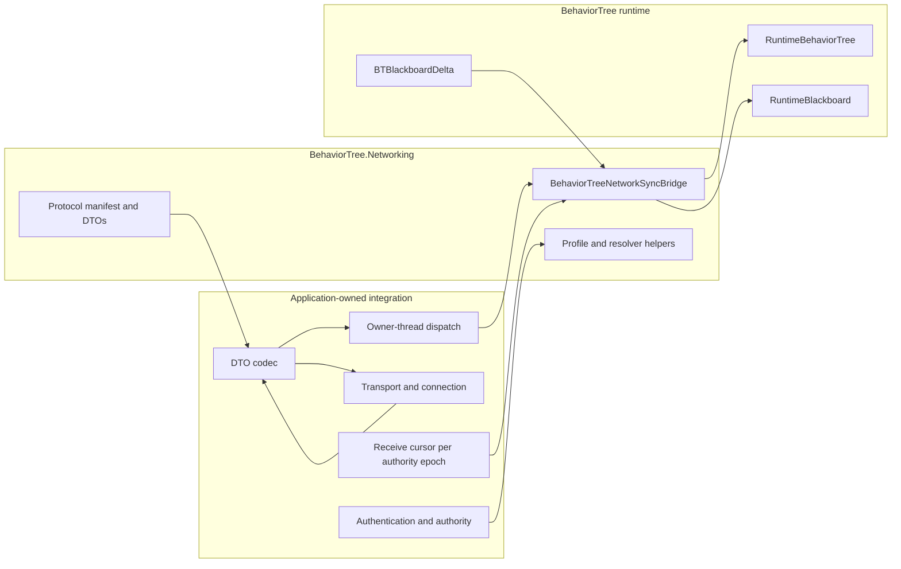

# CycloneGames.BehaviorTree.Networking

English | [简体中文](./README.SCH.md)

`CycloneGames.BehaviorTree.Networking` is the opt-in adapter between [CycloneGames.BehaviorTree](../CycloneGames.BehaviorTree/README.md) and [CycloneGames.Networking](../CycloneGames.Networking/README.md). It defines a versioned protocol, behavior-tree replication profiles, state payload DTOs, authority-generation and observer helpers, and a runtime bridge for snapshots, deltas, hashes, and tick-control operations.

The base behavior-tree package does not require this package. Add it only when managed behavior-tree state must cross a `CycloneGames.Networking` boundary.

## What This Package Owns

The package owns the behavior-tree-specific network contract and conversion boundary:

- protocol range `14000-14999`, with built-in messages `14000-14005`;
- immutable `BehaviorTreeNetworkProfile` values and built-in profile factories;
- message DTOs for handshake, state payload, desync reporting, tick control, and authority transfer;
- `BehaviorTreeNetworkSyncBridge` for capture, pre-commit receive validation, state application, and hash comparison;
- `BehaviorTreePayloadReceiveState`, a caller-owned receive cursor for one `(TargetNetworkId, TreeTemplateHash, AuthorityGeneration)` stream;
- server-authoritative role resolution and interest-based observer selection helpers.

It intentionally does not provide transport sockets, connection management, packet encoding, authentication, rate limiting, retransmission, backend SDK integration, or a network tick loop. `BehaviorTreeNetworkProfile`, authority resolvers, and observer resolvers describe or calculate policy; the application and transport adapter must execute that policy.

## Five-Minute Setup

### 1. Add Explicit Assembly References

All three assemblies use `autoReferenced: false`.

| Assembly | Add when | Unity API |
| --- | --- | --- |
| `CycloneGames.BehaviorTree.Networking.Core` | Registering protocol metadata or using profiles and message DTOs | None (`noEngineReferences: true`) |
| `CycloneGames.BehaviorTree.Networking.Runtime` | Capturing or applying managed behavior-tree state, or using authority/observer helpers | Yes through the managed behavior-tree runtime (`noEngineReferences: false`) |
| `CycloneGames.BehaviorTree.Networking.Tests.Editor` | Running package EditMode tests | Editor test assembly |

The runtime assembly references `CycloneGames.BehaviorTree.Runtime`, `CycloneGames.BehaviorTree.Networking.Core`, and `CycloneGames.Networking.Core`. The Core and Runtime assemblies have no platform include/exclude filter, but a target Player build is still required to establish compatibility for each shipping platform and backend.

### 2. Register the Protocol

Register the complete manifest once in the networking composition root:

```csharp
using CycloneGames.BehaviorTree.Networking;
using CycloneGames.Networking;

public static class BehaviorTreeNetworkInstaller
{
    public static void Configure(INetworkMessageCatalog catalog)
    {
        BehaviorTreeNetworkProtocol.RegisterMessageCatalog(catalog);
    }
}
```

`RegisterMessageCatalog` registers the complete reserved range and all built-in descriptors. When an `INetworkMessageEndpoint` is available instead, `TryRegisterMessageCatalog` returns whether registration succeeded.

### 3. Create One Receive Cursor per Stream

Create, use, and dispose the bridge on the managed tree's owner thread. Keep one receive cursor for each `(TargetNetworkId, TreeTemplateHash, AuthorityGeneration)` stream:

```csharp
using System;
using CycloneGames.BehaviorTree.Networking;
using CycloneGames.BehaviorTree.Runtime.Core;

public sealed class BehaviorTreeReplicationSession : IDisposable
{
    private readonly BehaviorTreeNetworkSyncBridge _bridge;
    private readonly uint _networkId;
    private readonly ulong _treeTemplateHash;
    private BehaviorTreePayloadReceiveState _receiveState;
    private uint _authorityGeneration;

    public BehaviorTreeReplicationSession(
        uint networkId,
        ulong treeTemplateHash,
        uint authorityGeneration)
    {
        _bridge = new BehaviorTreeNetworkSyncBridge(
            BehaviorTreeNetworkProfiles.ServerAuthoritative);
        _networkId = networkId;
        _treeTemplateHash = treeTemplateHash;
        _authorityGeneration = authorityGeneration;
        _receiveState = new BehaviorTreePayloadReceiveState(
            networkId,
            treeTemplateHash,
            authorityGeneration);
    }

    public BehaviorTreeStatePayloadMessage Capture(
        RuntimeBehaviorTree tree,
        int tick,
        ushort sequence)
    {
        return _bridge.CaptureSnapshot(
            _networkId,
            tree,
            tick,
            sequence,
            _treeTemplateHash,
            _authorityGeneration);
    }

    public bool Receive(
        RuntimeBehaviorTree tree,
        in BehaviorTreeStatePayloadMessage message)
    {
        return _bridge.TryApplyPayload(tree, message, ref _receiveState);
    }

    public void BeginAuthorityEpoch(uint authorityGeneration)
    {
        _authorityGeneration = authorityGeneration;
        _receiveState.ResetProgress(authorityGeneration);
    }

    public void Dispose()
    {
        _bridge.Dispose();
    }
}
```

The transport adapter serializes the DTO, selects the profile channel, sends it, decodes it on the receiver, and dispatches the receive operation to the tree owner thread. Use a non-negative, monotonic simulation tick. Pass the same authority generation into captures and the corresponding cursor. Do not construct a new cursor for every packet: doing so removes duplicate and replay protection. A full snapshot is accepted only when the receiver already has the same managed execution-state projection; the example synchronizes Blackboard state and does not restore node-private state.

### 4. Connect the Transport Boundary

The application-owned adapter performs these steps:

1. Check authority, authentication, rate, target identity, and enabled profile features.
2. Capture a snapshot, delta, or hash-only message on the tree owner thread.
3. Encode and send the DTO through the chosen networking backend.
4. Decode incoming bytes using the same versioned contract.
5. Queue the decoded message to the tree owner thread.
6. Call `TryApplyPayload`; treat `false` only as a packet rejected before live commit, then decide whether to ignore, report, or start a project-owned coordinated reset/resynchronization flow. Handle exceptions separately: wrong-thread and disposed-owner failures occur before mutation, while snapshot/delta commit, observer, post-commit hash, or wake-up failures can occur after live state has changed. The receive cursor advances only when the complete operation succeeds.

## Architecture and Ownership



Recommended ownership and shutdown order:

1. The network session or replicated-agent owner creates a bridge and receive cursor for the current authority generation on the tree owner thread.
2. A delta tracker, when used, is created and controlled on one owner thread per blackboard or replicated stream; tracking, attach/detach, flush, and disposal stay on that thread.
3. During shutdown, stop incoming dispatch and drain queued owner-thread operations.
4. Dispose the delta tracker before its blackboard so observers are detached.
5. Dispose the bridge on its owner thread, then discard the receive cursor.
6. Dispose the tree through its own owner; the bridge never owns the tree.

The first `BehaviorTreeNetworkSyncBridge.Dispose` call must run on the owner thread; repeated disposal is a no-op. Later operational calls on the owner thread throw `ObjectDisposedException`, while wrong-thread operational calls are rejected before the disposal-state check.

`BehaviorTreeNetworkProfile` clones builder settings during construction. `IntSettings` and `StringSettings` return cached read-only views, so callers cannot cast those views to a writable dictionary and mutate live policy. Use `ToBuilder()`, change the builder, and build a replacement profile when configuration must change.

## Protocol Contract

The package reserves `14000-14999`. Protocol version 2, with minimum supported version 2, assigns only the following built-in IDs:

| Constant | ID | Contract identity | Frozen schema hash | Default channel |
| --- | ---: | --- | --- | --- |
| `MSG_MANIFEST_HANDSHAKE` | `14000` | `BehaviorTreeManifestHandshakeMessage:v1` | `0x059263302E9505CD` | Reliable |
| `MSG_FULL_SNAPSHOT` | `14001` | `BehaviorTreeStatePayloadMessage.FullSnapshot:v2` | `0x750F7F22C73B0946` | Reliable |
| `MSG_BLACKBOARD_DELTA` | `14002` | `BehaviorTreeStatePayloadMessage.BlackboardDelta:v2` | `0x5528AAF0A310630D` | UnreliableSequenced |
| `MSG_DESYNC_REPORT` | `14003` | `BehaviorTreeDesyncReportMessage:v2` | `0x566A9F2B1C5C9202` | Reliable |
| `MSG_TICK_CONTROL` | `14004` | `BehaviorTreeTickControlMessage:v1` | `0x6299F932DCE53765` | Reliable |
| `MSG_AUTHORITY_TRANSFER` | `14005` | `BehaviorTreeAuthorityTransferMessage:v1` | `0x94B78D8EED490D89` | Reliable |

The schema hashes are frozen wire identities, not hashes of CLR type names. Full-snapshot and delta contracts have separate domains. The snapshot identity covers the complete `BTS2` layout, including the ordered scoped `RuntimeBlackboard` payload; the delta identity covers the complete `BTDP1` frame and tag table. Any incompatible layout or semantic change requires a new contract identity and coordinated migration. The current v2 protocol fingerprint is `0x633B1F15F69258AB`; v1 and earlier pre-release v2 fingerprints are intentionally incompatible. `BehaviorTreeManifestHandshakeMessage.IsCompatibleWithLocalProtocol` compares the protocol fingerprint only; the application must also check the tree template hash and required feature compatibility.

Project-owned messages belong in a project-owned protocol manifest and message range. Do not allocate project messages inside this package's reserved range.

## Receive Ordering and Stream Identity

`BehaviorTreePayloadReceiveState` is a mutable value-type cursor. Target and tree-template identity remain fixed; authority generation identifies the current ordering epoch:

| Member | Meaning |
| --- | --- |
| `TargetNetworkId` | Network entity or replicated-agent identity for this stream |
| `TreeTemplateHash` | Expected behavior-tree template identity |
| `AuthorityGeneration` | Authority epoch that incoming state payloads must match |
| `HasAcceptedPayload` | Whether the cursor has an accepted baseline |
| `LastSequence` | Last accepted 16-bit sequence |
| `LastTick` | Last accepted non-negative simulation tick |
| `ResetProgress()` | Clears accepted progress while retaining the current authority generation |
| `ResetProgress(uint)` | Changes authority generation and clears accepted progress |

An incoming state payload is rejected when its target, template, or authority generation differs, its tick is negative, its tick is older than the accepted tick, or its sequence is duplicate/old. Sequence comparison uses the standard unsigned half-range rule: `(ushort)(candidate - baseline)` from `1` through `0x7FFF` is newer, `0` is duplicate, and `0x8000` through `0xFFFF` is old or ambiguous. This permits `65535 -> 0` wrap.

Use exactly one cursor per independently ordered `(TargetNetworkId, TreeTemplateHash, AuthorityGeneration)` stream. If target or template identity changes, replace the struct. For an authority handoff, call `ResetProgress(newAuthorityGeneration)` only after the new epoch is authenticated and accepted; use parameterless `ResetProgress()` only for a coordinated ordering reset within the same authority epoch. The resolver and cursor both reject payloads from a different authority generation, but the application still owns authentication and permission checks.

## State Synchronization

Blackboard serialization and hashing use an explicit visibility scope:

| `RuntimeBlackboardNetworkScope` | Included schema entries | Used by |
| --- | --- | --- |
| `Snapshot` | Primitive keys with the `Snapshot` bit (`Snapshot` or `Networked`) | Full snapshot capture, validation, and desync comparison |
| `Networked` | Every non-`LocalOnly` primitive key (`Snapshot`, `Delta`, or `Networked`) | Delta post-state, hash-only messages, and their desync comparison |

With no bound schema, both scopes include every primitive entry. Object entries never cross the network boundary. Scope and value type are part of the blackboard hash domain, so peers must agree on schema, flags, key hashes, and value types.

### Full Snapshots

`CaptureSnapshot` records an informational projection of managed node states and `Snapshot`-scope blackboard values. It checks the traversal node budget, exact blackboard byte budget, and exact encoded snapshot size before copying bytes into the message-owned `byte[]`. Receive semantics are **validate execution state, then synchronize the Blackboard**. Node states and composite indices are never written into the managed tree; they do not restore private node state or resume an in-flight activation.

Serialized snapshots start with the `BTS2` format marker. `BTS1` bytes are rejected because v2 tree-state hashes include composite execution cursors. The validity byte accepts only `0` or `1`. Before allocating node or blackboard arrays, the decoder proves that declared counts and lengths fit the remaining frame bytes.

On receive, the bridge validates envelope identity and ordering, payload kind and exact size budgets, entry and node limits, snapshot framing, trailing bytes, tree-state hash, and blackboard hash against a candidate blackboard. Before any live Blackboard mutation, it traverses the local tree with bounded reusable scratch and requires an exact match for node count, every node state, and every composite auxiliary cursor. Only then does it synchronize the Blackboard portion. `MaxTrackedBlackboardKeys` is the inbound maximum per type and total primitive-entry count for full snapshots. A mismatch fails without mutation and without advancing the receive cursor. This is a consistency gate, not generic managed execution-state restoration. A product that needs recovery from divergent execution state must first use a project-owned coordinated reset/restart or an explicit versioned state model, then retry synchronization.

Snapshot application parses and validates all remote values and stamps before taking the live write lock. Every serialized primitive must have exactly one stamp entry, stamp keys cannot repeat, and each stamp must be non-zero and no greater than the declared remote sequence; remote stamps are never installed as local stamps. The single-lock commit rebuilds monotonic local stamps and replaces only the `Snapshot` scope, preserving delta-only and local values, including object entries. Primitive/object key collisions are rejected before mutation.

The validated live commit deliberately runs outside the untrusted-payload catch boundary. Observer callbacks run after the commit and outside the storage lock. Observer or other owner-state exceptions propagate to the caller, committed values are not rolled back, and the receive cursor remains unchanged. After commit, the bridge recomputes the `Snapshot`-scope hash before optional wake-up and cursor advancement. If application-side callback work rewrites synchronized state and the hash no longer matches the validated message, `TryApplyPayload` throws `InvalidOperationException`; it must not return `false` and imply that no mutation occurred.

### Blackboard Deltas

Define the same schema and string-hash provider on every peer. Object values are always `LocalOnly` and cannot be snapshot- or delta-synchronized.

```csharp
using System;
using CycloneGames.BehaviorTree.Networking;
using CycloneGames.BehaviorTree.Runtime.Core;
using CycloneGames.BehaviorTree.Runtime.Core.Networking;

RuntimeBlackboardSchema schema = new RuntimeBlackboardSchemaBuilder()
    .AddInt("Health", 100, RuntimeBlackboardSyncFlags.Networked)
    .AddBool("HasTarget", false, RuntimeBlackboardSyncFlags.Delta)
    .AddObject("TargetObject") // Always LocalOnly.
    .Build();

tree.Blackboard.BindSchema(schema, applyDefaults: true);

BehaviorTreeNetworkProfile profile = BehaviorTreeNetworkProfiles.BlackboardReplicated;
if (schema.DeltaKeyCount > profile.MaxTrackedBlackboardKeys)
{
    throw new InvalidOperationException("The delta schema exceeds the configured tracking budget.");
}

using BTBlackboardDelta tracker = BTBlackboardDelta.CreateForSchema(schema);
tracker.Attach(tree.Blackboard);

if (bridge.TryCreateBlackboardDelta(
        targetNetworkId,
        tree,
        tracker,
        tick,
        sequence,
        treeTemplateHash,
        out BehaviorTreeStatePayloadMessage deltaMessage,
        authorityGeneration))
{
    SendThroughProjectTransport(deltaMessage);
}
```

`MaxTrackedBlackboardKeys` caps inbound snapshot and delta entry counts. It cannot inspect or resize an outbound tracker's private capacity, so the integration owner must also reject a schema whose `DeltaKeyCount` exceeds the profile before creating the tracker. When a blackboard overrides `StringHashFunc`, use `CreateForSchema`, hashed keys, or `TrackKey(string, RuntimeBlackboard)` so sender and receiver resolve identical keys.

Delta bytes use the versioned `BTDP1` frame: `BTDP` magic, version `1`, fixed header size `16`, exact body length, entry count, and tagged little-endian entries. Delta capture includes the frame in its exact two-phase byte count. If sizing or encoding fails, including when the patch exceeds `MaxDeltaPayloadBytes`, last-sent stamps are not consumed; attached mode also re-arms its pending dirty signal. On receive, `BTBlackboardDelta.Apply` validates magic, version, header and body framing, proves the declared count can fit the remaining bytes before renting mutation storage, parses every entry, rejects non-canonical bool bytes and trailing input, sorts and rejects duplicate keys, and validates key, type, `Delta` sync flag, and primitive/object collisions before mutation. The bridge clones the complete `Networked` scope, applies the candidate delta, and verifies the declared post-state blackboard and live tree-state hashes. Unframed legacy delta bytes are rejected.

The live delta commit then checks the blackboard revision captured with the clone and applies the complete batch under one write lock. A revision mismatch throws `InvalidOperationException` before live mutation; recapture current state rather than retrying the stale candidate. Changed keys receive new local monotonic stamps. Observer callbacks run synchronously after the commit and outside the lock. If one or more callbacks fail, all callbacks are attempted and an `AggregateException` is propagated; committed values are not rolled back and the receive cursor has not yet advanced. Treat such an exception as an application callback failure, not as evidence that state remained unchanged. Observers must not mutate synchronized state during receive: if application-side callback work changes the validated `Networked` state or tree-state projection after the original batch commits, the final hash recheck throws `InvalidOperationException`. This post-commit integrity failure propagates and leaves the cursor unchanged; it never becomes a `false` bad-packet result.

### Hash-Only Messages and Desync Reports

`CreateHashOnlyMessage` sends no payload bytes. Its blackboard hash covers the `Networked` scope, while its tree-state hash covers all live node states, composite auxiliary indices, and that blackboard hash. `TryApplyPayload` accepts it only when both hashes match local state. `IsDesynced` and `CreateDesyncReport` use `Snapshot` scope for full-snapshot messages and `Networked` scope for delta/hash-only messages; desync reports include both tree hashes and the remote authority generation. The transport owner decides report rate, delivery, logging, and full-resync policy.

## Profiles, Authority, and Observers

Built-in profiles are available through `BehaviorTreeNetworkProfiles`:

- `ServerAuthoritative`
- `BlackboardReplicated`
- `DeterministicHashValidated`

Call a `Create...Builder` method or `ToBuilder()` to customize a profile before `Build()`. Built profiles are immutable. Positive intervals and capacities, and non-negative desync report limits, are validated during construction.

The bridge directly enforces snapshot/delta byte limits, inbound entry limits through `MaxTrackedBlackboardKeys`, and `WakeTreeOnRemoteDelta`. The default transport payload budget is `1200` bytes. A state DTO reserves `43` bytes for its fixed fields and byte-array length prefix, so the default and maximum bridge inner-payload budget is `1157` bytes. `EffectiveMaxSnapshotPayloadBytes` and `EffectiveMaxDeltaPayloadBytes` expose the applied cap; setting a larger profile value does not imply fragmentation. When a selected transport has a lower payload limit or additional codec overhead, configure the profile to that smaller verified inner budget. The integration owner must enforce feature flags, channels, send intervals, outbound tracker capacity, `MaxDesyncReportsPerWindow`, client-write policy, and authority-transfer snapshot policy. A profile does not schedule packets, authorize a sender, or fragment packets by itself.

`ServerAuthoritativeBehaviorTreeAuthorityResolver` calculates the local role and basic apply/tick eligibility. Its remote-payload check requires the context, agent, and payload authority generations to match. Call it before capture or apply. `BehaviorTreeNetworkObserverResolver` filters a caller-supplied connection list by policy, authentication state, owner/team/area interest, and distance; the caller still sends the messages. Neither helper connects, encodes, or transmits data.

`ApplyTickControl` directly calls managed-tree lifecycle APIs. Before calling it, validate sender authority, `TargetNetworkId`, authority generation, sequence/tick ordering, enabled features, and rate. Dispatch it to the tree owner thread. The same applies to authority-transfer handling: the message is a DTO, not an automatic ownership transition.

## Threading and Failure Behavior

`RuntimeBehaviorTree` and `BehaviorTreeNetworkSyncBridge` are owner-thread objects. The bridge captures `Environment.CurrentManagedThreadId` in its constructor and rejects operational calls, including the first disposal, from another thread. Network callbacks must queue work to that owner before accessing the bridge, tree, blackboard, receive cursor, or delta tracker.

`RuntimeBehaviorTree.WakeUp` is the managed tree's only intentional cross-thread producer entry. That exception does not make `TryApplyPayload`, `ApplyTickControl`, `Play`, `Stop`, the blackboard, or the bridge thread-safe. The bridge itself invokes `WakeUp` only after an accepted snapshot or delta when the profile enables it.

`BTBlackboardDelta` captures its owner thread at construction. `TrackKey`, `Attach`, `Detach`, `TryFlush`, and `Dispose` must run on that owner. An attached blackboard observer may execute on another writing thread, but its only action is one atomic dirty signal; it does not access the tracker's dictionary, key arrays, stamps, or serialization buffer. When off-owner writes are required, call `RuntimeBlackboard.EnableConcurrentStorageAccess()` during setup and keep tree execution and Unity objects on their valid owner thread. The revision check protects the live commit from intervening blackboard writes, but it is not a replacement for tracker ownership or bridge dispatch.

Expected failure behavior:

- malformed, oversized, stale, duplicate, wrong-target, wrong-template, wrong-authority-generation, hash-mismatched, or execution-state-mismatched state payloads return `false` before live commit and before receive progress advances;
- invalid capture arguments, outgoing payload overflow, wrong-thread access, and use after disposal throw; a delta sizing/encoding error keeps last-sent stamps, and attached mode re-arms its dirty signal for a later retry;
- a delta revision mismatch throws before live mutation and requires a fresh capture/validation cycle;
- receive state advances only after successful validation, live commit, post-commit hash verification, and optional wake-up;
- snapshot and delta observer callbacks run after the live commit, outside the storage lock; failures propagate, do not roll back committed values, and occur before the cursor advances;
- application-side mutation that invalidates the verified post-commit hash throws `InvalidOperationException` after the original commit and before cursor advancement; callers must not translate this exception into a `false` result;
- authorization, abuse prevention, logging, retry, resync, and disconnect policy remain application responsibilities.

## Performance and Memory

Reuse long-lived bridges and delta trackers instead of creating them per packet. Trees on the same owner thread and profile can share one bridge through sequential, non-reentrant calls; never share it across owner threads or invoke it concurrently. The bridge reuses an internal `BTStateSnapshotBuffer`, and an attached `BTBlackboardDelta` reuses tracking arrays and a flush buffer. With no dirty signal, attached `TryFlush` returns in O(1); after a signal it scans the bounded tracked-key set and compares stamps, so the changed-key lookup cost is O(`MaxTrackedBlackboardKeys`) in the configured worst case.

The end-to-end bridge is not zero-allocation:

- snapshot and delta messages allocate a `byte[]` copy so the message owns stable payload bytes;
- incoming snapshot validation allocates decoded arrays and candidate blackboard collections after count-to-remaining-byte checks;
- incoming delta validation clones the `Networked` blackboard scope and can rent pooled mutation/key storage after frame/count checks;
- profile construction allocates cloned setting dictionaries and two cached read-only wrappers;
- the selected codec, transport, queue, and logging path have their own costs.

Bound snapshot and delta sizes, pre-size tracked-key capacity, limit update frequency, and measure candidate-state memory against the largest production blackboard. Reused bridge and tracker buffers reduce steady-state scratch churn, but message-owned payload copies and receive candidates still allocate. No repository test result establishes universal throughput, zero-GC behavior, long-session stability, or performance parity across hardware. Use package benchmarks and target-specific profiling as evidence for a chosen configuration.

## Persistence

This package performs no file I/O and has no persistent store.

| Data | Owner | Lifetime | Cleanup and migration |
| --- | --- | --- | --- |
| `BehaviorTreePayloadReceiveState` | Network session or replicated agent | One live ordered authority epoch | Discard on despawn/disconnect; replace when target/template changes; reset with an authenticated generation on authority handoff; normally do not restore stale sequence state from disk |
| `BehaviorTreeNetworkSyncBridge` | Network composition or replicated-agent runtime owner | Active runtime session | Dispose on owner thread after ingress stops |
| `BTBlackboardDelta` | Blackboard replication owner | Attached blackboard lifetime | Dispose before the blackboard to detach observers |
| `BehaviorTreeNetworkProfile` source data | Project composition/configuration owner | Project-defined | If persisted, use an explicit versioned asset or file with project-owned migration |
| Payload history, reconnect state, and authority epochs | Transport/session layer | Project-defined | Bound and clear according to transport security and reconnect policy |

Do not use `PlayerPrefs`, `EditorPrefs`, or `SessionState` as authoritative storage for protocol, profile, or receive-order state.

## Platform, AOT, and Transport Constraints

The Core assembly is Unity-free, and the package relies on explicit types and protocol registration. It contains no transport backend or platform-specific native plugin. These properties keep the adapter portable, but they do not certify a shipping target.

- Windows, Linux, macOS, iOS, Android, WebGL, dedicated servers, and consoles require target Player builds and transport-specific tests.
- IL2CPP/AOT and managed stripping require explicit codec registration and any necessary preservation supplied by the chosen serializer/transport.
- WebGL integrations should keep all tree and bridge work on the Unity main thread; do not assume background-thread networking support.
- Dedicated servers should use an explicit owner-loop dispatcher and bounded ingress queues.
- Console SDK, suspension/resume, memory, MTU, and certification behavior belongs in a separate platform transport adapter.
- This package provides no fragmentation or reassembly. Keep the complete encoded state DTO within the selected transport's verified payload limit.
- Client and server must use matching protocol fingerprints, contract codecs, blackboard schemas, sync flags, key hash providers, tree-template identity, authority-generation rules, and simulation tick/sequence rules.

## Breaking Migration: Current Protocol v2 Contract

The current protocol remains version 2 because this contract has not been released, but it is wire-incompatible with v1 and all earlier pre-release v2 contracts. Full snapshots now use the domain-separated schema `0x750F7F22C73B0946`; blackboard deltas use `0x5528AAF0A310630D`; desync reports use `0x566A9F2B1C5C9202`; and the protocol fingerprint is `0x633B1F15F69258AB`. The previous fingerprint `0x7C552922C201913B`, shared state schema `0xC082D6C4D26DBD72`, earlier v2 fingerprint `0x98ED78E931B2FECF`, desync v1 schema `0x7CA942FF64163207`, and state schema `0xA5D8559342EA1BA5` are rejected.

Snapshot bytes still use `BTS2`; `BTS1` remains unsupported. Delta bytes now require `BTDP1`; raw count-first patches are unsupported. Deploy matching client and server builds together, discard old serialized snapshots, deltas, and queued payloads, reset receive baselines with the accepted authority generation, coordinate managed execution state when it differs, and then synchronize the Blackboard. The default inner payload budget is now `1157` bytes so the fixed `43`-byte state envelope fits the `1200`-byte default transport payload without relying on fragmentation. There is no legacy decoder, hash downgrade, or built-in fragmentation path.

The old stateless receive call is removed:

```csharp
// Removed
bridge.ApplyPayload(tree, message);
```

Migrate to a caller-owned cursor:

```csharp
private BehaviorTreePayloadReceiveState _receiveState =
    new BehaviorTreePayloadReceiveState(
        targetNetworkId,
        treeTemplateHash,
        authorityGeneration);

bool accepted = bridge.TryApplyPayload(tree, message, ref _receiveState);
```

`false` now has a strict pre-commit meaning for state payloads. Do not wrap `TryApplyPayload` in a broad catch that converts observer, owner-state, wake-up, or post-commit integrity exceptions to `false`: snapshot or delta values may already be committed while the receive cursor remains unchanged. Surface the exception to the stream owner, stop normal packet advancement for that stream, inspect the committed state, and choose an explicit project-owned retry, reset, or resynchronization policy.

`TryCreateBlackboardDelta` now accepts `RuntimeBehaviorTree` instead of `RuntimeBlackboard` because its tree-state hash includes live node and composite state. Update every sender, receiver, codec, test, backend adapter, reconnect path, and authority-transfer path. Keep the cursor with the stream rather than rebuilding it per message. Replace it when target or template identity changes; call `ResetProgress(newAuthorityGeneration)` for an accepted handoff, or parameterless `ResetProgress()` only for a deliberate ordering reset in the same authority epoch.

## Troubleshooting

| Symptom | Cause | Resolution |
| --- | --- | --- |
| `TryApplyPayload` always returns `false` | Cursor target/template/authority generation does not match the envelope | Create the cursor with all three stream identities; use `ResetProgress(newAuthorityGeneration)` only after an accepted handoff |
| First payload succeeds, later packets fail | Duplicate/old sequence, older tick, or cursor recreated/copied incorrectly | Store one mutable cursor per stream and pass it by `ref`; verify half-range sequence generation |
| Full snapshot is valid but rejected | Local managed node state or a composite cursor differs from the snapshot | Coordinate a project-owned execution reset/restart until the projections match; then retry Blackboard synchronization |
| Valid-looking delta is rejected | Schema key/type/sync flags or hash provider differ | Use the same versioned schema and `StringHashFunc` on every peer |
| Remote object reference is absent | Object keys are `LocalOnly` | Replicate a stable primitive ID and resolve the object locally |
| Wrong-thread exception | Transport callback called the bridge directly | Queue the operation to the bridge/tree owner thread |
| Delta capture throws for payload size | Exact patch size exceeds `MaxDeltaPayloadBytes` | Increase the approved budget or reduce/cadence-split tracked state; last-sent stamps remain, and an attached tracker also re-armed its dirty signal |
| Delta commit throws a revision mismatch | Local blackboard changed after candidate capture | Discard the stale candidate and repeat capture/validation on the owner thread |
| Receive throws `AggregateException` from observers | One or more post-commit callbacks failed | Treat state as committed, fix the callbacks, and choose an explicit cursor/resync policy |
| Receive throws a post-commit hash `InvalidOperationException` | Application callback work rewrote synchronized state after the validated snapshot or delta committed | Treat the original batch as committed and the cursor as unchanged; stop normal stream advancement, fix the callback mutation, and run an explicit reset or resynchronization policy |
| Profile limit appears ignored outbound | Tracker capacity, intervals, channels, or feature policy is integration-owned | Enforce outbound tracking and scheduling at composition; the bridge enforces inbound entry and payload limits |
| Transport rejects a payload accepted by the bridge | Backend limit or codec overhead is below the framework's `1200`-byte default | Measure the complete encoded DTO and configure a smaller profile inner budget; do not assume fragmentation |
| Protocol registration or handshake fails | Range collision, descriptor mismatch, or versioned identity mismatch | Compare manifests/fingerprints and deploy matching v2 codecs; version future incompatible contracts |
| Memory spikes during receive | Candidate validation and payload copies scale with state size | Reduce bounded payloads/schema scope, lower cadence, and profile on the target hardware |

## Validation

Run the package's EditMode tests in Unity Test Runner:

```text
Window > General > Test Runner
EditMode > CycloneGames.BehaviorTree.Networking.Tests.Editor
```

Example batchmode invocation; replace placeholders with local paths:

```text
<UnityEditor> -batchmode -nographics -quit \
  -projectPath <repo-root>/UnityStarter \
  -runTests -testPlatform EditMode \
  -assemblyNames CycloneGames.BehaviorTree.Networking.Tests.Editor \
  -testResults <output>/behavior-tree-networking-editmode.xml
```

The networking test assembly covers protocol range and frozen v2 identities, domain-separated inner schemas, conservative transport budgeting, idempotent registration, authority-generation rejection, authority and observer helpers, owner-thread/disposal behavior, execution-state-gated snapshots, delta application, post-commit observer failure propagation without cursor advancement, live node/composite hash participation, count-to-byte bounds, strict bool decoding, framing, malformed and oversized payloads, envelope/hash rejection before mutation, object-key collisions, duplicate and stale ordering, sequence wrap, and blackboard schema/hash-provider rules. The base BehaviorTree EditMode assembly separately covers scoped serialization and hashing, remote-stamp validation with local monotonic reconstruction, exact over-budget delta retry, revision-mismatch rejection, and snapshot format checks. These are test coverage statements, not Player or platform certification.

Before release, also run:

1. The base BehaviorTree and Networking test assemblies.
2. A Player integration test using the actual codec and transport.
3. Reconnect, authority-transfer, sequence-wrap, packet-loss/reordering, and full-resync scenarios.
4. Malformed, oversized, unauthorized, and rate-limit security cases.
5. Long-session memory and throughput profiling with production schemas and payload cadence.
6. Mono and IL2CPP builds for every shipping platform; include WebGL and dedicated-server execution where applicable.

Record each platform and backend result separately. EditMode success is not evidence of Player, IL2CPP, console, long-session, or universal performance compatibility.
