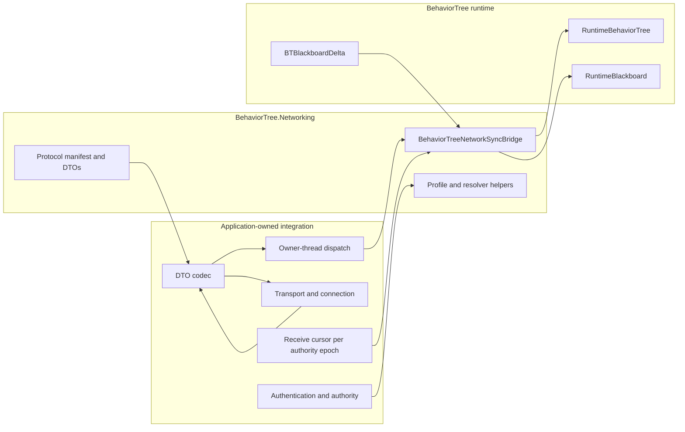

# CycloneGames.BehaviorTree.Networking

English | [简体中文](./README.SCH.md)

`CycloneGames.BehaviorTree.Networking` bridges [CycloneGames.BehaviorTree](../CycloneGames.BehaviorTree/README.md) and [CycloneGames.Networking](../CycloneGames.Networking/README.md). It defines a versioned protocol, network replication profiles, state payload DTOs, authority-generation helpers, and a runtime bridge for snapshots, deltas, hashes, and tick-control operations. The base BehaviorTree package does not require this package.

## Table of Contents

- [Overview](#overview)
- [Quick Start](#quick-start)
- [Protocol Contract](#protocol-contract)
- [State Synchronization](#state-synchronization)
- [Threading and Failure Behavior](#threading-and-failure-behavior)
- [Performance and Memory](#performance-and-memory)
- [Troubleshooting](#troubleshooting)

## Overview

### What syncs

The bridge synchronizes `RuntimeBlackboard` state across the network. Full snapshots carry a projection of managed node states and `Snapshot`-scope blackboard values. Blackboard deltas carry incremental changes to `Delta`-scope or `Networked`-scope keys. Hash-only messages carry no payload -- only blackboard and tree-state hashes for lightweight validation. Object keys are always `LocalOnly`.

### Assemblies

| Assembly | `autoReferenced` | `noEngineReferences` | Use when |
| --- | --- | --- | --- |
| `CycloneGames.BehaviorTree.Networking.Core` | `false` | `true` | Registering protocol metadata, using profiles and message DTOs |
| `CycloneGames.BehaviorTree.Networking.Runtime` | `false` | `false` | Capturing or applying managed behavior-tree state, authority/observer helpers |
| `CycloneGames.BehaviorTree.Networking.Tests.Editor` | N/A | N/A | Running EditMode tests |

The Runtime assembly references `CycloneGames.BehaviorTree.Runtime`, `CycloneGames.BehaviorTree.Networking.Core`, and `CycloneGames.Networking.Core`.



## Quick Start

### 1. Add assembly references

All three assemblies use `autoReferenced: false`. Reference `CycloneGames.BehaviorTree.Networking.Core` for protocol registration and DTOs; reference `CycloneGames.BehaviorTree.Networking.Runtime` for the bridge and runtime helpers.

### 2. Register the protocol

```csharp
using CycloneGames.BehaviorTree.Networking;
using CycloneGames.Networking;

public static class BehaviorTreeNetworkInstaller
{
    public static void Configure(INetworkMessageCatalog catalog)
    {
        BehaviorTreeNetworkProtocol.RegisterMessageCatalog(catalog);
    }
}
```

`RegisterMessageCatalog` registers the complete reserved range and all built-in descriptors. When an `INetworkMessageEndpoint` is available, `TryRegisterMessageCatalog` returns whether registration succeeded.

### 3. Create a bridge and receive cursor

Create, use, and dispose the bridge on the managed tree's owner thread. Keep one receive cursor per `(TargetNetworkId, TreeTemplateHash, AuthorityGeneration)` stream:

```csharp
using System;
using CycloneGames.BehaviorTree.Networking;
using CycloneGames.BehaviorTree.Runtime.Core;

public sealed class BehaviorTreeReplicationSession : IDisposable
{
    private readonly BehaviorTreeNetworkSyncBridge _bridge;
    private readonly uint _networkId;
    private readonly ulong _treeTemplateHash;
    private BehaviorTreePayloadReceiveState _receiveState;
    private uint _authorityGeneration;

    public BehaviorTreeReplicationSession(
        uint networkId,
        ulong treeTemplateHash,
        uint authorityGeneration)
    {
        _bridge = new BehaviorTreeNetworkSyncBridge(
            BehaviorTreeNetworkProfiles.ServerAuthoritative);
        _networkId = networkId;
        _treeTemplateHash = treeTemplateHash;
        _authorityGeneration = authorityGeneration;
        _receiveState = new BehaviorTreePayloadReceiveState(
            networkId,
            treeTemplateHash,
            authorityGeneration);
    }

    public BehaviorTreeStatePayloadMessage Capture(
        RuntimeBehaviorTree tree,
        int tick,
        ushort sequence)
    {
        return _bridge.CaptureSnapshot(
            _networkId, tree, tick, sequence,
            _treeTemplateHash, _authorityGeneration);
    }

    public bool Receive(
        RuntimeBehaviorTree tree,
        in BehaviorTreeStatePayloadMessage message)
    {
        return _bridge.TryApplyPayload(tree, message, ref _receiveState);
    }

    public void BeginAuthorityEpoch(uint authorityGeneration)
    {
        _authorityGeneration = authorityGeneration;
        _receiveState.ResetProgress(authorityGeneration);
    }

    public void Dispose()
    {
        _bridge.Dispose();
    }
}
```

The transport adapter serializes the DTO, selects the profile channel, sends it, decodes it on the receiver, and dispatches the receive operation to the tree owner thread.

### 4. Connect the transport boundary

1. Check authority, authentication, rate, target identity, and enabled profile features.
2. Capture a snapshot, delta, or hash-only message on the tree owner thread.
3. Encode and send the DTO through the networking backend.
4. Decode incoming bytes using the same versioned contract.
5. Queue the decoded message to the tree owner thread.
6. Call `TryApplyPayload`; treat `false` only as a packet rejected before live commit. Handle exceptions separately -- they can occur after live state has changed.

## Protocol Contract

The package reserves message range `14000-14999`. Protocol version 2, with minimum supported version 2:

| Constant | ID | Contract identity | Frozen schema hash | Default channel |
| --- | ---: | --- | --- | --- |
| `MSG_MANIFEST_HANDSHAKE` | `14000` | `BehaviorTreeManifestHandshakeMessage:v1` | `0x059263302E9505CD` | Reliable |
| `MSG_FULL_SNAPSHOT` | `14001` | `BehaviorTreeStatePayloadMessage.FullSnapshot:v2` | `0x750F7F22C73B0946` | Reliable |
| `MSG_BLACKBOARD_DELTA` | `14002` | `BehaviorTreeStatePayloadMessage.BlackboardDelta:v2` | `0x5528AAF0A310630D` | UnreliableSequenced |
| `MSG_DESYNC_REPORT` | `14003` | `BehaviorTreeDesyncReportMessage:v2` | `0x566A9F2B1C5C9202` | Reliable |
| `MSG_TICK_CONTROL` | `14004` | `BehaviorTreeTickControlMessage:v1` | `0x6299F932DCE53765` | Reliable |
| `MSG_AUTHORITY_TRANSFER` | `14005` | `BehaviorTreeAuthorityTransferMessage:v1` | `0x94B78D8EED490D89` | Reliable |

Schema hashes are frozen wire identities. The current v2 protocol fingerprint is `0x633B1F15F69258AB`. `BehaviorTreeManifestHandshakeMessage.IsCompatibleWithLocalProtocol` compares the protocol fingerprint; the application must also check the tree template hash and required feature compatibility.

Project-owned messages belong in a project-owned protocol manifest and message range. Do not allocate project messages inside this package's reserved range.

### Receive ordering

`BehaviorTreePayloadReceiveState` is a mutable value-type cursor:

| Member | Meaning |
| --- | --- |
| `TargetNetworkId` | Network entity or replicated-agent identity |
| `TreeTemplateHash` | Expected behavior-tree template identity |
| `AuthorityGeneration` | Authority epoch that incoming state payloads must match |
| `HasAcceptedPayload` | Whether the cursor has an accepted baseline |
| `LastSequence` | Last accepted 16-bit sequence |
| `LastTick` | Last accepted non-negative simulation tick |
| `ResetProgress()` | Clears accepted progress while retaining the current authority generation |
| `ResetProgress(uint)` | Changes authority generation and clears accepted progress |

An incoming state payload is rejected when its target, template, or authority generation differs, its tick is negative, its tick is older than the accepted tick, or its sequence is duplicate/old. Sequence comparison uses the standard unsigned half-range rule: `(ushort)(candidate - baseline)` from `1` through `0x7FFF` is newer, `0` is duplicate, and `0x8000` through `0xFFFF` is old or ambiguous.

## State Synchronization

### Visibility scopes

| `RuntimeBlackboardNetworkScope` | Included entries | Used by |
| --- | --- | --- |
| `Snapshot` | Primitive keys with the `Snapshot` bit (`Snapshot` or `Networked`) | Full snapshot capture, validation, desync comparison |
| `Networked` | Every non-`LocalOnly` primitive key (`Snapshot`, `Delta`, or `Networked`) | Delta post-state, hash-only messages, desync comparison |

With no bound schema, both scopes include every primitive entry. Object entries never cross the network boundary.

### Full snapshots

`CaptureSnapshot` records a projection of managed node states and `Snapshot`-scope blackboard values. Serialized snapshots use the `BTS2` format marker.

On receive, the bridge validates envelope identity, ordering, payload kind, size budgets, entry limits, framing, tree-state hash, and blackboard hash against a candidate blackboard. It traverses the local tree with bounded reusable scratch and requires an exact match for node count, every node state, and every composite auxiliary cursor. Only then does it synchronize the Blackboard portion. A mismatch fails without mutation and without advancing the receive cursor.

Snapshot application parses and validates all remote values and stamps before taking the live write lock. The single-lock commit rebuilds monotonic local stamps and replaces only the `Snapshot` scope. After commit, the bridge recomputes the hash; if application-side callbacks change synchronized state, `TryApplyPayload` throws `InvalidOperationException`.

### Blackboard deltas

Define the same schema and string-hash provider on every peer:

```csharp
RuntimeBlackboardSchema schema = new RuntimeBlackboardSchemaBuilder()
    .AddInt("Health", 100, RuntimeBlackboardSyncFlags.Networked)
    .AddBool("HasTarget", false, RuntimeBlackboardSyncFlags.Delta)
    .AddObject("TargetObject") // Always LocalOnly.
    .Build();

tree.Blackboard.BindSchema(schema, applyDefaults: true);

using BTBlackboardDelta tracker = BTBlackboardDelta.CreateForSchema(schema);
tracker.Attach(tree.Blackboard);

if (bridge.TryCreateBlackboardDelta(
        targetNetworkId, tree, tracker, tick, sequence,
        treeTemplateHash, out var deltaMessage, authorityGeneration))
{
    SendThroughProjectTransport(deltaMessage);
}
```

Delta bytes use the versioned `BTDP1` frame. On receive, the bridge clones the `Networked` scope, applies the candidate delta, validates hashes, then commits under one write lock. A revision mismatch throws before live mutation. Observer callbacks run after the commit, outside the lock.

### Hash-only messages and desync reports

`CreateHashOnlyMessage` sends no payload bytes. Its blackboard hash covers the `Networked` scope; its tree-state hash covers all live node states and composite indices. `TryApplyPayload` accepts it only when both hashes match local state. `IsDesynced` and `CreateDesyncReport` compare local and remote hashes under the appropriate scope.

### Profiles

Built-in profiles from `BehaviorTreeNetworkProfiles`:
- `ServerAuthoritative`
- `BlackboardReplicated`
- `DeterministicHashValidated`

Call `Create...Builder` or `ToBuilder()` to customize before `Build()`. Built profiles are immutable.

The bridge enforces snapshot/delta byte limits, inbound entry limits through `MaxTrackedBlackboardKeys`, and `WakeTreeOnRemoteDelta`. The default transport payload budget is `1200` bytes; a state DTO reserves `43` bytes for fixed fields, so the default inner-payload budget is `1157` bytes.

## Threading and Failure Behavior

`RuntimeBehaviorTree` and `BehaviorTreeNetworkSyncBridge` are owner-thread objects. The bridge captures `Environment.CurrentManagedThreadId` at construction and rejects operational calls from another thread. Network callbacks must queue work to that owner before accessing the bridge, tree, blackboard, receive cursor, or delta tracker.

`RuntimeBehaviorTree.WakeUp` is the managed tree's only cross-thread producer entry. The bridge invokes `WakeUp` only after an accepted snapshot or delta when the profile enables it.

`BTBlackboardDelta` captures its owner thread at construction. An attached blackboard observer may execute on another writing thread, but its only action is one atomic dirty signal.

Expected failure behavior:
- Malformed, oversized, stale, duplicate, wrong-target, wrong-template, wrong-authority, hash-mismatched, or execution-state-mismatched payloads return `false` before live commit and before receive progress advances.
- Invalid capture arguments, outgoing payload overflow, wrong-thread access, and use after disposal throw.
- A delta revision mismatch throws before live mutation; recapture current state rather than retrying.
- Receive state advances only after successful validation, live commit, post-commit hash verification, and optional wake-up.
- Observer callbacks run after the live commit, outside the storage lock; failures propagate without rolling back committed values, and the cursor has not yet advanced.
- Application-side mutation that invalidates the verified post-commit hash throws `InvalidOperationException` after the original commit and before cursor advancement.
- Authorization, abuse prevention, logging, retry, resync, and disconnect policy remain application responsibilities.

## Performance and Memory

Reuse long-lived bridges and delta trackers instead of creating them per packet. Trees on the same owner thread and profile can share one bridge through sequential, non-reentrant calls.

The end-to-end bridge is not zero-allocation:
- Snapshot and delta messages allocate a `byte[]` copy.
- Incoming snapshot validation allocates decoded arrays and candidate blackboard collections.
- Incoming delta validation clones the `Networked` blackboard scope.
- Profile construction allocates cloned setting dictionaries.

Bound snapshot and delta sizes, pre-size tracked-key capacity, and limit update frequency. Measure candidate-state memory against the largest production blackboard.

### Data ownership

| Data | Owner | Lifetime |
| --- | --- | --- |
| `BehaviorTreePayloadReceiveState` | Network session or replicated agent | One live ordered authority epoch; discard on despawn/disconnect |
| `BehaviorTreeNetworkSyncBridge` | Network composition or replicated-agent owner | Active runtime session; dispose on owner thread after ingress stops |
| `BTBlackboardDelta` | Blackboard replication owner | Attached blackboard lifetime; dispose before the blackboard |
| `BehaviorTreeNetworkProfile` source data | Project composition owner | Project-defined |

Do not use `PlayerPrefs`, `EditorPrefs`, or `SessionState` for protocol, profile, or receive-order state.

## Troubleshooting

| Symptom | Cause | Resolution |
| --- | --- | --- |
| `TryApplyPayload` always returns `false` | Cursor target/template/authority does not match envelope | Create the cursor with all three stream identities; use `ResetProgress(newAuthorityGeneration)` only after an accepted handoff |
| First payload succeeds, later packets fail | Duplicate/old sequence, older tick, or cursor recreated incorrectly | Store one mutable cursor per stream and pass it by `ref`; verify half-range sequence generation |
| Full snapshot is valid but rejected | Local managed node state or a composite cursor differs | Coordinate a project-owned execution reset/restart, then retry |
| Valid-looking delta is rejected | Schema key/type/sync flags or hash provider differ | Use the same versioned schema and `StringHashFunc` on every peer |
| Remote object reference is absent | Object keys are `LocalOnly` | Replicate a stable primitive ID and resolve the object locally |
| Wrong-thread exception | Transport callback called the bridge directly | Queue the operation to the bridge/tree owner thread |
| Delta capture throws for payload size | Exact patch size exceeds `MaxDeltaPayloadBytes` | Increase the budget or reduce tracked state |
| Delta commit throws revision mismatch | Local blackboard changed after candidate capture | Discard the stale candidate and recapture on the owner thread |
| Receive throws `AggregateException` from observers | Post-commit callbacks failed | Treat state as committed, fix the callbacks, choose an explicit cursor/resync policy |
| Receive throws post-commit hash `InvalidOperationException` | Application callback rewrote synchronized state after commit | Treat batch as committed, cursor unchanged; stop stream advancement, fix callbacks, run explicit reset/resync |
| Transport rejects payload accepted by bridge | Backend limit or codec overhead below `1200`-byte default | Measure the complete encoded DTO and configure a smaller profile inner budget |
| Protocol registration or handshake fails | Range collision or identity mismatch | Compare manifests/fingerprints and deploy matching v2 codecs |
| Memory spikes during receive | Candidate validation and payload copies scale with state size | Reduce bounded payloads/schema scope, lower cadence, profile on target hardware |

## Validation

Run EditMode tests in Unity Test Runner:

```text
Window > General > Test Runner
EditMode > CycloneGames.BehaviorTree.Networking.Tests.Editor
```

Batchmode example:

```text
<UnityEditor> -batchmode -nographics -quit \
  -projectPath <repo-root>/UnityStarter \
  -runTests -testPlatform EditMode \
  -assemblyNames CycloneGames.BehaviorTree.Networking.Tests.Editor \
  -testResults <output>/behavior-tree-networking-editmode.xml
```

Before release, also run the base BehaviorTree and Networking test assemblies, a Player integration test with the actual codec and transport, reconnect/authority-transfer/sequence-wrap/packet-loss/full-resync scenarios, malformed/oversized/unauthorized/rate-limit security cases, long-session profiling with production schemas, and Mono/IL2CPP builds for each shipping platform.
