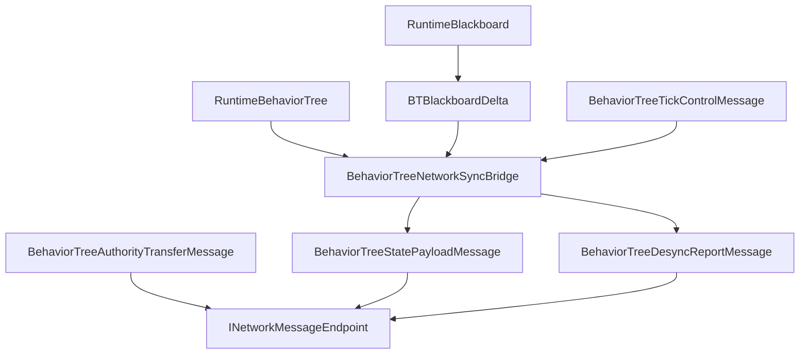

# CycloneGames.BehaviorTree.Networking

English | [简体中文](./README.SCH.md)

`CycloneGames.BehaviorTree.Networking` bridges `CycloneGames.BehaviorTree` to `CycloneGames.Networking`. It provides protocol metadata, blackboard snapshot and delta messages, desync reports, tick control messages, authority transfer messages, profile configuration, and a runtime sync bridge. The base BehaviorTree package is usable without `CycloneGames.Networking`; this bridge is only required when behavior tree state crosses a Cyclone network boundary.

## Table of Contents

- [Overview](#overview)
- [Architecture](#architecture)
- [Quick Start](#quick-start)
- [Core Concepts](#core-concepts)
- [Usage Guide](#usage-guide)
- [Advanced Topics](#advanced-topics)
- [Common Scenarios](#common-scenarios)
- [Performance and Memory](#performance-and-memory)
- [Troubleshooting](#troubleshooting)

## Overview

This bridge adapter connects BT runtime state to the network layer through protocol-defined messages and a profile-driven sync bridge. It does not own transport, encoding, connection management, or backend SDK types. Incoming payloads are validated against the active `BehaviorTreeNetworkProfile` before deserialization; malformed or oversized payloads are rejected without mutating runtime state.

### Key Features

- **Protocol manifest** with StableHash contract identity and message IDs `14000-14999`.
- **State sync bridge** for snapshot capture, delta creation, payload application, and drift checking.
- **Built-in profiles** for server-authoritative, blackboard-replicated, and deterministic-hash flows.
- **Tick control and authority transfer** message support.
- **Pure C# Core assembly** with no Unity dependency.

## Architecture

| Assembly | Role | Unity dependency |
| --- | --- | --- |
| `CycloneGames.BehaviorTree.Networking.Core` | Protocol manifest, message DTOs, profile configuration | No |
| `CycloneGames.BehaviorTree.Networking.Runtime` | Runtime sync bridge, authority resolver, observer resolver | No |
| `CycloneGames.BehaviorTree.Networking.Tests.Editor` | EditMode coverage | No |

All assemblies use `autoReferenced: false`. Consumer asmdefs must reference Core explicitly, and Runtime when using the bridge.



## Quick Start

Register the protocol in a composition root:

```csharp
using CycloneGames.BehaviorTree.Networking;
using CycloneGames.Networking;

public static class BehaviorTreeNetworkInstaller
{
    public static void Configure(INetworkMessageCatalog catalog)
    {
        BehaviorTreeNetworkProtocol.RegisterMessageCatalog(catalog);
    }
}
```

Create a sync bridge and capture a snapshot:

```csharp
using CycloneGames.BehaviorTree.Networking;
using CycloneGames.BehaviorTree.Runtime.Core;

public sealed class BehaviorTreeSnapshotEndpoint
{
    private readonly BehaviorTreeNetworkSyncBridge _bridge;

    public BehaviorTreeSnapshotEndpoint()
    {
        _bridge = new BehaviorTreeNetworkSyncBridge(BehaviorTreeNetworkProfiles.ServerAuthoritative);
    }

    public BehaviorTreeStatePayloadMessage Capture(
        uint targetNetworkId, RuntimeBehaviorTree tree,
        int tick, ushort sequence)
    {
        return _bridge.CaptureSnapshot(targetNetworkId, tree, tick, sequence);
    }

    public bool Apply(RuntimeBehaviorTree tree, BehaviorTreeStatePayloadMessage message)
    {
        return _bridge.ApplyPayload(tree, message);
    }
}
```

## Core Concepts

| Type | Purpose |
| --- | --- |
| `BehaviorTreeNetworkProfile` | Immutable runtime profile: channels, intervals, feature flags, payload limits |
| `BehaviorTreeNetworkProfiles` | Built-in profile factories |
| `BehaviorTreeNetworkProtocol` | Owns message range `14000-14999` and default protocol manifest |
| `BehaviorTreeStatePayloadMessage` | Carries full snapshot, blackboard delta, or hash-only state payloads |
| `BehaviorTreeDesyncReportMessage` | Reports local and remote blackboard/tree hashes for drift diagnostics |
| `BehaviorTreeTickControlMessage` | Carries play, stop, wake-up, and tick interval control data |
| `BehaviorTreeAuthorityTransferMessage` | Carries authority handoff data and snapshot reference data |
| `BehaviorTreeNetworkSyncBridge` | Captures snapshots, creates deltas, applies payloads, checks drift |

### Protocol Messages

| Message | ID | Channel | Payload |
| --- | ---: | --- | --- |
| `MSG_MANIFEST_HANDSHAKE` | `14000` | Reliable | `BehaviorTreeManifestHandshakeMessage` |
| `MSG_FULL_SNAPSHOT` | `14001` | Reliable | `BehaviorTreeStatePayloadMessage` |
| `MSG_BLACKBOARD_DELTA` | `14002` | UnreliableSequenced | `BehaviorTreeStatePayloadMessage` |
| `MSG_DESYNC_REPORT` | `14003` | Reliable | `BehaviorTreeDesyncReportMessage` |
| `MSG_TICK_CONTROL` | `14004` | Reliable | `BehaviorTreeTickControlMessage` |
| `MSG_AUTHORITY_TRANSFER` | `14005` | Reliable | `BehaviorTreeAuthorityTransferMessage` |

Every descriptor declares an explicit printable-ASCII `ContractId` (e.g., `BehaviorTreeStatePayloadMessage:v1`) with an FNV-1a 64-bit `SchemaHash`. CLR type names are not protocol identity. Payload layout or semantic changes require a new contract identity.

## Usage Guide

### Blackboard Delta Replication

```csharp
// Maintain a BTBlackboardDelta tracker next to the runtime blackboard
var delta = new BTBlackboardDelta();
delta.TrackKey("Health");
delta.TrackKey("Position");
delta.Attach(serverBlackboard);

if (delta.TryFlush(serverBlackboard, out ArraySegment<byte> patch))
    SendToClients(patch);
```

### Profile Configuration

```csharp
using CycloneGames.BehaviorTree.Networking;

public static class BehaviorTreeProfileFactory
{
    public static BehaviorTreeNetworkProfile Create()
    {
        return BehaviorTreeNetworkProfiles
            .CreateBlackboardReplicatedBuilder()
            .SetInt("project.max_remote_blackboard_keys", 24)
            .Build();
    }
}
```

## Advanced Topics

### Protocol Identity

`BehaviorTreeNetworkProtocol.CreateProtocolManifest` builds the complete manifest. `RegisterMessageCatalog` atomically commits the full range and all descriptors; partial registration is rejected. The protocol fingerprint includes range, message IDs, contract identities, schema hashes, channels, and payload limits.

Project-specific messages belong in a separate project-owned manifest using `NetworkMessageRanges.User`.

### Extension Points

- Implement `IBehaviorTreeNetworkAuthorityResolver` for custom authority ownership.
- Implement `IBehaviorTreeNetworkObserverSource` for external observer data.
- Keep concrete backend transport code in adapters that send and receive the DTOs.

## Common Scenarios

### Server-Authoritative Snapshot Sync

```csharp
// Server: capture and send
var snapshot = BTNetworkSync.CaptureSnapshot(serverTree);
byte[] data = BTNetworkSync.SerializeSnapshot(snapshot);
SendToClient(data);

// Client: deserialize and apply
var snap = BTNetworkSync.DeserializeSnapshot(data);
BTNetworkSync.ApplyBlackboardSnapshot(clientTree, snap);
```

### Hash-Based Desync Detection

```csharp
ulong serverHash = serverBlackboard.ComputeHash();
SendToClient(serverHash);

if (BTNetworkSync.CheckDesync(clientTree, serverHash))
{
    // Request full resync
    var snapshot = BTNetworkSync.CaptureSnapshot(serverTree);
    BTNetworkSync.ApplyBlackboardSnapshot(clientTree, snapshot);
}
```

## Performance and Memory

This package performs no file I/O, allocates no managed memory on hot paths, and does not own threads or native containers. Profile objects are runtime-only; transport encoding and network I/O are external concerns. Payload limits in the profile bound snapshot and delta sizes before serialization.

## Troubleshooting

| Symptom | Likely cause | Resolution |
| --- | --- | --- |
| `ApplyPayload` returns `false` | Oversized or malformed incoming payload | Verify client/server profiles agree on payload limits; check serialization schema version |
| Protocol manifest registration fails | Incompatible `SchemaHash` or overlapping message IDs | Ensure all peers use the same contract identity; check message range conflicts |
| Delta sync drops changes | Same value written repeatedly without advancing stamp | Writing the same value does not emit a delta patch |
| Desync reports flood | Client/server blackboard schemas diverge | Verify schema parity; ensure `Snapshot` and `Delta` key flags match on both sides |

## Validation

```text
Unity Test Runner > EditMode > CycloneGames.BehaviorTree.Networking.Tests.Editor
Unity Test Runner > EditMode > CycloneGames.BehaviorTree.Tests.Editor
Unity Test Runner > EditMode > CycloneGames.Networking.Tests.Editor
```
