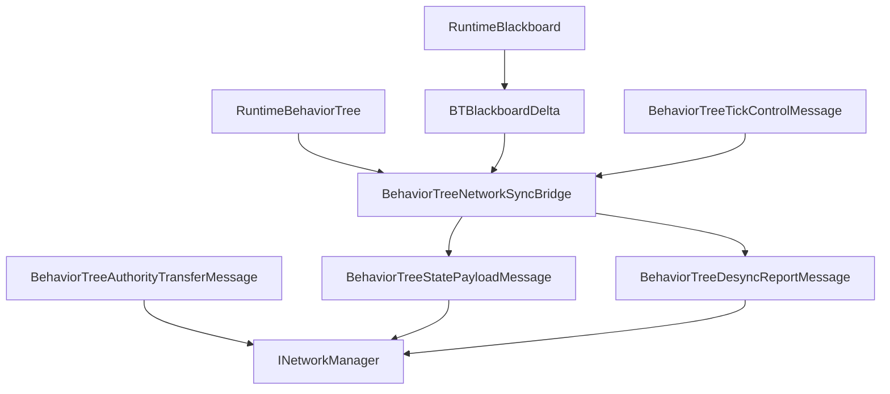

# CycloneGames.BehaviorTree.Networking

English | [Simplified Chinese](./README.SCH.md)

`CycloneGames.BehaviorTree.Networking` connects `CycloneGames.BehaviorTree` to `CycloneGames.Networking`. It provides protocol metadata, blackboard snapshot and delta messages, desync reports, tick control messages, authority transfer messages, profile configuration, authority helpers, observer resolution helpers, and a runtime sync bridge.

The base BehaviorTree package remains usable without `CycloneGames.Networking`. This bridge is only required when behavior tree state crosses a Cyclone network boundary.

## Package Layout

```text
CycloneGames.BehaviorTree.Networking/
  Core/
    BehaviorTreeNetworkMessages.cs
    BehaviorTreeNetworkProfile.cs
    BehaviorTreeNetworkProtocol.cs
    CycloneGames.BehaviorTree.Networking.Core.asmdef
  Runtime/
    BehaviorTreeNetworkAuthority.cs
    BehaviorTreeNetworkReplication.cs
    BehaviorTreeNetworkSyncBridge.cs
    CycloneGames.BehaviorTree.Networking.Runtime.asmdef
  Tests/Editor/
    BehaviorTreeNetworkingIntegrationTests.cs
    CycloneGames.BehaviorTree.Networking.Tests.Editor.asmdef
```

## Assembly Boundary

| Assembly | Role | Unity dependency |
| --- | --- | --- |
| `CycloneGames.BehaviorTree.Networking.Core` | Protocol manifest, message DTOs, and profile configuration. | No |
| `CycloneGames.BehaviorTree.Networking.Runtime` | Runtime sync bridge, authority resolver, and observer resolver. | No |
| `CycloneGames.BehaviorTree.Networking.Tests.Editor` | EditMode coverage for protocol, profiles, bridge, and authority helpers. | No |

The package references BehaviorTree runtime assemblies and `CycloneGames.Networking.Core`. It does not reference backend SDK types, PlayerSettings scripting define symbols, or a DI container.

## Core Concepts

| Type | Purpose |
| --- | --- |
| `BehaviorTreeNetworkProfile` | Immutable runtime profile containing channels, intervals, feature flags, and payload limits. |
| `BehaviorTreeNetworkProfiles` | Built-in profile factories for server-authoritative, blackboard-replicated, and deterministic-hash flows. |
| `BehaviorTreeNetworkProtocol` | Owns the BehaviorTree message range and default protocol manifest. |
| `BehaviorTreeStatePayloadMessage` | Carries full snapshot, blackboard delta, or hash-only state payloads. |
| `BehaviorTreeDesyncReportMessage` | Reports local and remote blackboard/tree hashes for drift diagnostics. |
| `BehaviorTreeTickControlMessage` | Carries play, stop, wake-up, and tick interval control data. |
| `BehaviorTreeAuthorityTransferMessage` | Carries authority handoff data and snapshot reference data. |
| `BehaviorTreeNetworkSyncBridge` | Captures snapshots, creates blackboard deltas, applies payloads, checks drift, and applies tick control. |

## State Sync Flow



## Protocol

`BehaviorTreeNetworkProtocol` owns message ids `14000-14999` in the Cyclone module range.

| Message | ID | Channel | Payload |
| --- | ---: | --- | --- |
| `MSG_MANIFEST_HANDSHAKE` | `14000` | Reliable | `BehaviorTreeManifestHandshakeMessage` |
| `MSG_FULL_SNAPSHOT` | `14001` | Reliable | `BehaviorTreeStatePayloadMessage` |
| `MSG_BLACKBOARD_DELTA` | `14002` | UnreliableSequenced | `BehaviorTreeStatePayloadMessage` |
| `MSG_DESYNC_REPORT` | `14003` | Reliable | `BehaviorTreeDesyncReportMessage` |
| `MSG_TICK_CONTROL` | `14004` | Reliable | `BehaviorTreeTickControlMessage` |
| `MSG_AUTHORITY_TRANSFER` | `14005` | Reliable | `BehaviorTreeAuthorityTransferMessage` |

Register the protocol in a composition root:

```csharp
using CycloneGames.BehaviorTree.Networking;
using CycloneGames.Networking;

public static class BehaviorTreeNetworkInstaller
{
    public static void Configure(INetworkMessageCatalog catalog)
    {
        BehaviorTreeNetworkProtocol.RegisterMessageCatalog(catalog);
    }
}
```

## Sync Bridge Workflow

Create a sync bridge with a profile, then capture and apply state payloads at the adapter boundary:

```csharp
using CycloneGames.BehaviorTree.Networking;
using CycloneGames.BehaviorTree.Runtime.Core;

public sealed class BehaviorTreeSnapshotEndpoint
{
    private readonly BehaviorTreeNetworkSyncBridge _bridge;

    public BehaviorTreeSnapshotEndpoint()
    {
        _bridge = new BehaviorTreeNetworkSyncBridge(BehaviorTreeNetworkProfiles.ServerAuthoritative);
    }

    public BehaviorTreeStatePayloadMessage Capture(
        uint targetNetworkId,
        RuntimeBehaviorTree tree,
        int tick,
        ushort sequence)
    {
        return _bridge.CaptureSnapshot(targetNetworkId, tree, tick, sequence);
    }

    public bool Apply(RuntimeBehaviorTree tree, BehaviorTreeStatePayloadMessage message)
    {
        return _bridge.ApplyPayload(tree, message);
    }
}
```

For blackboard delta replication, maintain a `BTBlackboardDelta` tracker next to the runtime blackboard and call `TryCreateBlackboardDelta`.

## Profile Configuration

Use `BehaviorTreeNetworkProfileBuilder` when the built-in profiles need adjusted intervals, limits, or channels:

```csharp
using CycloneGames.BehaviorTree.Networking;

public static class BehaviorTreeProfileFactory
{
    public static BehaviorTreeNetworkProfile Create()
    {
        return BehaviorTreeNetworkProfiles
            .CreateBlackboardReplicatedBuilder()
            .SetInt("project.max_remote_blackboard_keys", 24)
            .Build();
    }
}
```

## Extension Points

- Implement `IBehaviorTreeNetworkAuthorityResolver` for custom authority ownership.
- Implement `IBehaviorTreeNetworkObserverSource` when observer data is owned by another system.
- Register project-specific behavior tree messages through a project-owned `NetworkMessageKind.User` manifest.
- Keep concrete backend transport code in adapters that send and receive the DTOs declared here.

## Persistence

This package does not write files, assets, preferences, caches, or runtime save data. Profiles are runtime objects; project assets or configuration files that create them are owned outside this package.

## Validation

Run these checks after changing the package:

```text
Unity Test Runner > EditMode > CycloneGames.BehaviorTree.Networking.Tests.Editor
Unity Test Runner > EditMode > CycloneGames.BehaviorTree.Tests.Editor
Unity Test Runner > EditMode > CycloneGames.Networking.Tests.Editor
```
