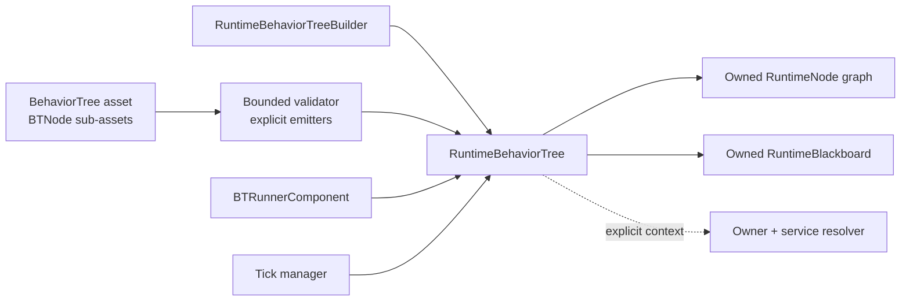
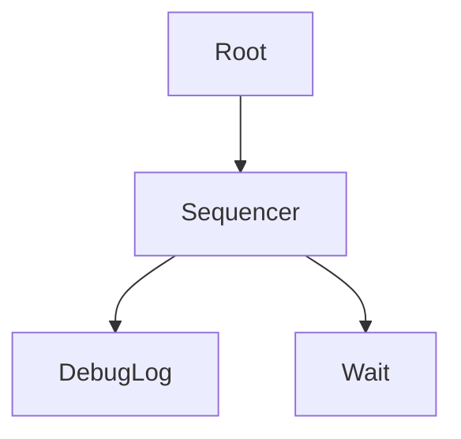
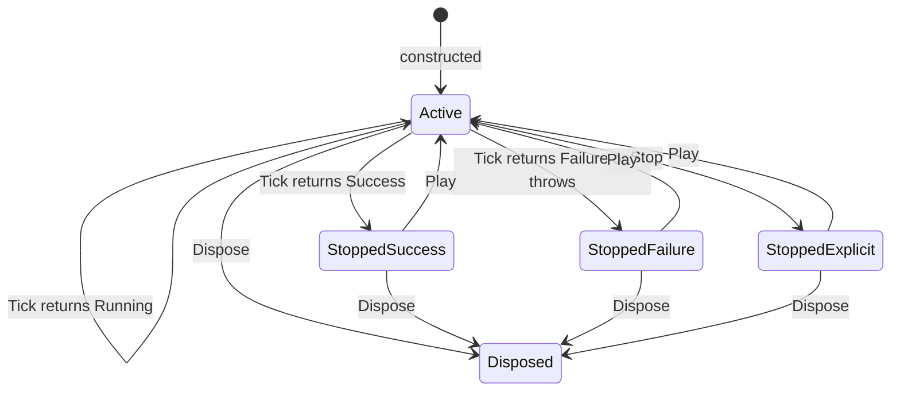

# CycloneGames.BehaviorTree

[English](README.md) | 简体中文

CycloneGames.BehaviorTree 是 Unity 行为树模块，提供 ScriptableObject 创作、托管运行时执行、有界调度、Graph 工具，以及可选的 Burst/Jobs 执行 assembly。

## 目录

- [概览](#概览)
- [架构](#架构)
- [快速上手](#快速上手)
- [核心概念](#核心概念)
- [使用指南](#使用指南)
- [高级主题](#高级主题)
- [常见场景](#常见场景)
- [性能与内存](#性能与内存)
- [故障排查](#故障排查)

## 概览

本模块提供：

- ScriptableObject 行为树资产与 GraphView 编辑器。
- 由 `RuntimeNode` 对象和 `RuntimeBlackboard` 状态组成的托管运行时图。
- 不依赖创作资产的纯代码 `RuntimeBehaviorTreeBuilder` 路径。
- 明确的节点激活、完成、中止、故障、重置和释放语义。
- Self、Manual、Managed 和 PriorityManaged Tick 所有权模型。
- 强类型 Blackboard 值、schema、snapshot、delta、变更 stamp 和 observer。
- 有界创作编译器，以及显式、无反射的 built-in emitter。
- 可选、受限的 DOD assembly，用于 Burst job 执行的同构平面树。
- 隔离在可选 benchmark assembly 中的 Editor 与 PlayMode 性能工具。

### 核心特性

- **ScriptableObject 创作**——支持 Undo 的 GraphView 编辑器，含校验与修复命令。
- **纯代码 API**——通过 `RuntimeBehaviorTreeBuilder` 提供 compositor、decorator 与 leaf 的流式方法。
- **丰富的节点库**——15+ compositor、15+ decorator、condition strategy 与 action 边界。
- **强类型 Blackboard**——`int`、`float`、`bool`、`Vector3`、`long`、`Long2`、`Long3`、`object`；FNV-1a 字符串 key。
- **有界编译**——迭代校验、精确 emitter 分发、无 private-field 反射。
- **托管调度**——轮询与 8 桶 priority/LOD tick manager。
- **可选 DOD 路径**——Burst/Jobs 平面树调度器，含 `BTAgentHandle` 代际安全。
- **Runtime `object` owner**——核心 API 中通过 `GetOwner<T>()` 契约不暴露 Unity 类型。

## 架构



### Assembly

| Assembly | 默认引用 | 职责 |
| --- | --- | --- |
| `CycloneGames.BehaviorTree.Runtime` | 是 | 创作资产、托管运行时、Blackboard、编译器、Runner 和托管调度器 |
| `CycloneGames.BehaviorTree.Editor` | 仅 Editor | Graph 编辑器、Inspector、校验和 benchmark 窗口 |
| `CycloneGames.BehaviorTree.Benchmarks` | 否 | Benchmark 模型、session、场景 runner 和导出工具 |
| `CycloneGames.BehaviorTree.Runtime.DOD` | 否 | Burst/Jobs 平面树调度器与 NativeArray 状态 |
| `CycloneGames.BehaviorTree.Integrations.DeterministicMath` | 否 | 两个本地模块之间的显式随机数 provider bridge |

Runtime assembly 依赖 `com.cyclone-games.hash`。DOD assembly 只在 Burst、Collections 和 Mathematics 均存在时启用，使用方 asmdef 还必须显式引用 `CycloneGames.BehaviorTree.Runtime.DOD`。DeterministicMath bridge 为 `autoReferenced: false`，并直接引用两个本地 assembly。

### 所有权规则

- 一个 `RuntimeBehaviorTree` 只拥有一份 runtime node graph 和一个 Blackboard。
- Runtime node graph 必须无环，每个 node 只能有一个 parent 和一个 owning tree。
- Tree owner 必须在创建 tree 的线程调用生命周期方法。
- `RuntimeBehaviorTree.Dispose()` 会中止活动工作、释放 node-owned resource、释放 Blackboard，并清除 termination subscriber。
- 同一份 `BehaviorTree` 创作资产可创建多个相互独立的运行时实例。
- `BehaviorTree.Root`、`BehaviorTree.Nodes` 和每条创作 node link 是序列化创作数据。只能在 Edit Mode 中通过支持 Undo 的工具写入；Play Mode 使用已编译的 runtime instance。
- `BTRunnerComponent` 拥有并释放它编译的运行时实例。
- `BTTickScheduler` 拥有自己的 NativeArray，但只借用 `FlatBehaviorTree`；调用方必须让 flat tree 存活到 scheduler 释放之后。

## 快速上手

### 使用资产创作行为树

1. 在 Project 窗口选择 `Create > CycloneGames > AI > BehaviorTree`。
2. 双击资产，或打开 `Tools > CycloneGames > Behavior Tree > Behavior Tree Editor`。
3. 资产没有 root 时，单击 `Repair Root`。
4. 在 Graph 右键菜单中创建 `SequencerNode`，再创建 `DebugLogNode`、`WaitNode` 等 action，并将它们连接到 root 下方。
5. 单击 `Validate`。解决全部诊断，然后单击 `Save`。
6. 为 GameObject 添加 `BTRunnerComponent`，指定 tree，选择 Tick mode，并启用 `Start On Awake`。
7. 进入 Play Mode。选择 runner 或资产即可在 Graph 和 runner Inspector 中查看运行状态。

最小 Graph 如下：



Runner 会编译出一个新的运行时实例。资产始终是创作数据；节点执行状态和 Blackboard 状态属于该运行时实例。

### 使用纯代码构建行为树

```csharp
using CycloneGames.BehaviorTree.Runtime.Core;

private static readonly int HasTargetKey =
    RuntimeBlackboard.DefaultStringHashFunc("HasTarget");
private static readonly int AttackCountKey =
    RuntimeBlackboard.DefaultStringHashFunc("AttackCount");

RuntimeBehaviorTree tree = new RuntimeBehaviorTreeBuilder()
    .Selector()
        .Sequence()
            .Condition(bb => bb.GetBool(HasTargetKey), "HasTarget")
            .CoolDown(0.75f)
                .Action(bb =>
                {
                    bb.SetInt(AttackCountKey, bb.GetInt(AttackCountKey) + 1);
                    return RuntimeState.Success;
                }, "Attack")
            .End()
        .End()
        .Action(bb => RuntimeState.Success, "Idle")
    .End()
    .Build();

tree.Terminated += state => HandleTreeTermination(state);
tree.Tick();
tree.Dispose();
```

Builder 可以接收已有 Blackboard、`RuntimeBlackboardSchema`、`RuntimeBTContext` 或 `IRuntimeBTServiceResolver`。一个 builder 只能使用一次；`Build()` 会闭合未结束的 builder scope，并拒绝缺少 root child 的树。

`RuntimeBTContext.Owner` 和 `WithOwner(...)` 通过 `object` 接收任意引用类型 owner。Core consumer 通过 `GetOwner<T>()` 取得 owner：

```csharp
public sealed class AgentRuntimeOwner { }

var owner = new AgentRuntimeOwner();
RuntimeBehaviorTree ownedTree = new RuntimeBehaviorTreeBuilder(owner)
    .Action(_ => RuntimeState.Success)
    .Build();

AgentRuntimeOwner resolvedOwner = ownedTree.GetOwner<AgentRuntimeOwner>();
ownedTree.Dispose();
```

当 `RuntimeBTContext.Owner` 是 Unity `GameObject` 时，`GetOwner<GameObject>()` 会返回该对象，`GetOwner<TComponent>()` 会执行 component lookup。`BTRunnerComponent` 仍会注入自己的 GameObject。

对于可复用行为，应优先使用具名 command 或 condition 对象，不要捕获 lambda：

```csharp
public sealed class AttackCommand : IRuntimeBTCommand
{
    public RuntimeState Execute(RuntimeBlackboard blackboard)
    {
        return RuntimeState.Success;
    }
}

RuntimeBehaviorTree tree = new RuntimeBehaviorTreeBuilder()
    .Sequence()
        .Condition(new HasTargetCondition(), "HasTarget")
        .Command(new AttackCommand(), "Attack")
    .End()
    .Build();
```

## 核心概念

### 运行时生命周期



- 新建 tree 处于 active 状态。调用 `Tick()` 时，root 会按需开始 activation。
- 构造时会校验 runtime graph 无环、node owner 唯一，并保证 runtime GUID 唯一。`RuntimeBehaviorTreeLimits` 为 code-first node count（默认 4096，硬上限 65536）和 depth（默认 256，硬上限 256）设置边界。
- 如果构造在返回前抛出异常，调用方传入的 Blackboard 会恢复原 Context 并继续由调用方拥有；内部创建的 Blackboard 会被释放。构造成功后，tree 会拥有并负责释放其 Blackboard。
- `Success` 和 `Failure` 都是 tree 的终态结果。Tree 会设置 `IsStopped`、清除调度唤醒状态，并在本次 activation 中只发布一次 `Terminated`。
- `Stop()` 会中止活动调用栈、将 tree state 设为 `NotEntered`，并发布一次 `Terminated(NotEntered)`。
- 对 stopped tree 调用 `Play()` 会重置 node graph 并开始新的 activation。
- 生命周期操作拒绝重入。不要从 node callback 或 `Terminated` callback 中调用 `Tick`、`Play`、`Stop` 或 `SetContext`。
- `Dispose()` 后，公开操作抛出 `ObjectDisposedException`（延迟到达的 `WakeUp()` 会被忽略）。Runtime node instance 是一次性 owner。

### Node 生命周期

| Hook 或方法 | 契约 |
| --- | --- |
| `OnAwake()` | Runtime graph 获得 owner 后调用一次的 setup hook |
| `OnStart(bb)` | 每次 activation 开始时调用一次 |
| `OnRun(bb)` | 每个执行 step 调用；必须返回 `Running`、`Success` 或 `Failure` |
| `OnExit(bb, Completed, null)` | 正常返回 `Success` 或 `Failure` 后调用一次 |
| `OnExit(bb, Aborted, null)` | 活动 node 被 parent 或 tree owner 停止时调用一次 |
| `OnExit(bb, Faulted, exception)` | 执行抛出异常时调用一次 |
| `OnReset(bb)` | 为新 activation 清除持久运行状态 |
| `OnDispose(bb)` | 释放 node 拥有的资源 |

`RuntimeStatefulActionNode` 将操作分为 `OnActionStart`、`OnActionRunning`、`OnActionHalted` 和 `OnActionFaulted`。仅当 action 已进入 `Running` 后被中止时，才用 `OnActionHalted` 取消操作；正常完成不会调用 halt hook。

前置和后置 condition 在 setup 阶段注册。`FailWhenFalse`、`SucceedWhenFalse` 和 `AbortWhenFalse` 显式表达 false 路径结果。当 condition 变为 false 时，会先中止已经运行的 activation，再返回 policy 结果。

### Blackboard

`RuntimeBlackboard` 分别存储 `int`、`float`、`bool`、`Vector3`、`long`、`RuntimeBlackboardLong2`、`RuntimeBlackboardLong3` 和 `object`。强类型访问不会装箱 primitive 值。

字符串 key overload 使用稳定的 `RuntimeBlackboard.DefaultStringHashFunc`，其实现是 `BTHash.FNV1A`。高频 key 应预先 hash 一次：

```csharp
private static readonly int HealthKey =
    RuntimeBlackboard.DefaultStringHashFunc("Health");

blackboard.SetInt(HealthKey, 100);
int health = blackboard.GetInt(HealthKey);
```

Schema 将 key 是否存在、类型、默认值和同步 flag 固化为显式契约：

```csharp
RuntimeBlackboardSchema schema = new RuntimeBlackboardSchemaBuilder()
    .AddInt("Health", 100, RuntimeBlackboardSyncFlags.Networked)
    .AddBool("IsAlert", false, RuntimeBlackboardSyncFlags.Delta)
    .AddObject("Target")
    .Build();

var blackboard = new RuntimeBlackboard(schema: schema);
```

绑定 schema 后，未知 key 和类型不匹配的写入都会被拒绝。

- 读取会沿 `Parent` 回退；写入只影响当前 Blackboard。
- 只有本地值实际变化时 key stamp 才会变化。可用 `GetStamp` 进行低成本变更检测。
- Key observer 和 global observer 会在 write lock 释放后同步运行。
- 订阅变化会分配新的 callback array。应在 setup 阶段注册、owner shutdown 时取消。
- `SubTreeNode` 拥有可复用的 scoped Blackboard。`RuntimeSubTreePortDirection.Input` 每个 child step 前刷新，`Output` 正常完成时提交，`InOut` 捕获初始值和最终值。

### 编译

`BehaviorTreeCompiler` 会在创建可变 runtime node 前校验创作 graph。结构校验会拒绝缺少 root、cycle、共享 child ownership、null link、无效 arity、重复 GUID、超出 size/depth 限制，以及无效 built-in node 配置。

`BehaviorTreeCompiler.Analyze(...)` 每次调用都会执行有界迭代校验和精确 authoring type emitter 预检，并返回 `BehaviorTreeCompileArtifact`。`EmitRuntimeRoot()` 会重新校验当前可变 source，再创建新的 runtime graph。

每个显式 `SubTreeNode` asset reference 都是一个 occurrence boundary。同一 subtree asset 可以在 graph 的多个位置引用；校验会独立展开和计数，生成过程会创建互不共享的 runtime node，嵌套 runtime GUID 会获得确定性的 occurrence 前缀。

`BehaviorTree.Compile(...)` 会捕获 `BehaviorTreeCompileException`、针对资产记录日志，并返回 `null`。需要结构化失败信息的 composition root 应先调用 `BehaviorTreeCompiler.Analyze(...)`。

Built-in emitter 通过显式只读配置属性读取数据，不使用 private-field 反射。Emitter lookup 按 authoring type 精确匹配；派生 authoring node 必须注册自己的 emitter。

## 使用指南

### Runner 与调度

```csharp
BTRunnerComponent runner = GetComponent<BTRunnerComponent>();

runner.BTSetData("Health", 100);
runner.WakeUp(boostedTicks: 2);
runner.Pause();
runner.Resume();
runner.Stop();
runner.Play();
```

- 自然 `Success` 或 `Failure`、显式 `Stop` 和运行时 fault 都会将 runner 标为 stopped、从托管调度中注销，并只触发一次 `OnTreeStopped`。
- `Pause()` 保留 node 与 Blackboard 状态，并从 managed mode 注销。`Resume()` 继续未终止的 tree；stopped runner 会开始新的 activation。
- 对已有 runtime 调用 `Play()` 会停止旧 activation、重置 graph、清空 Blackboard，并重新应用 Inspector 的 `Initial Objects`。
- `SetTree(...)` 在 `LateUpdate` 应用；旧 runtime 会被释放，再编译新 runtime。
- Node stack 活动期间，`RuntimeBehaviorTree.SetContext` 会拒绝修改。

### Tick mode

| Mode | Owner | Policy |
| --- | --- | --- |
| `Self` | `BTRunnerComponent.Update` | 每帧由 component 提供一次 Tick 机会 |
| `Manual` | 调用方 | 调用方执行 `ManualTick()` |
| `Managed` | `BTTickManagerComponent` | 有界 round-robin scan |
| `PriorityManaged` | `BTPriorityTickManagerComponent` | 8 个 priority bucket，加 distance/marker LOD |

`BTTickManager.TickBudget` 计算一次 pass 中扫描的 tree 数；被扫描的 tree 仍可能因 `TickInterval` 跳过执行。Tick 期间请求的注册和移除会延迟到 pass 结束。Terminal tree 会自动移除。

`BTPriorityTickManager` 使用 8 个 bucket。每个 budget 限制该 bucket 的扫描量；设为零会禁用该 bucket。首次访问 `Instance` 时，每种场景 component 都会在创建 persistent fallback GameObject 前执行一次 cold-path 查询。

### LOD 配置

`BTLODConfig` 要求 distance 为严格递增的有限值、tick interval 至少为一、priority 为 `0` 到 `7`、budget 非负，并为每个被引用的 priority 提供 budget entry。Distance check 使用预先平方的 threshold。

### Blackboard 操作

```csharp
// 强类型访问，使用 int hash key
blackboard.SetInt(HealthKey, 100);
blackboard.SetFloat(SpeedKey, 5.5f);
blackboard.SetBool(AlertKey, true);
blackboard.SetVector3(PositionKey, transform.position);

// 字符串 key 便利方法
blackboard.SetInt("Health", 100);

// 变更检测，通过 stamp
ulong stamp = blackboard.GetStamp(HealthKey);

// Observer 注册
blackboard.AddObserver(HealthKey, (key, bb) => Debug.Log($"Health changed: {bb.GetInt(key)}"));
```

### Composite node

| Node | 终止规则与重要行为 |
| --- | --- |
| `RuntimeSequencer` | 从左到右运行 child；第一个 failure 使其失败；全部 success 才成功 |
| `RuntimeSequenceWithMemory` | 从上一个 running child 继续，不重复检查已完成的前置 child |
| `RuntimeSelector` | 从左到右运行 child；第一个 success 使其成功；全部 failure 才失败 |
| `RuntimeSelectorRandom` | 使用 setup 阶段 index array 洗牌，然后执行 selector 语义。`Seed` 与 `ShuffleOnStart` 随 owned graph 一同冻结 |
| `RuntimeReactiveSequence` | 每步重新检查高优先级 child，并中止被取代的 running branch |
| `RuntimeReactiveFallback` | 每步重新检查 fallback priority，并中止被取代的 running branch |
| `RuntimeIfThenElseNode` | Child 0 是 condition，child 1 是 then，child 2 是 else |
| `RuntimeWhileDoElseNode` | 按 condition/body/else 位置使用 child |
| `RuntimeSwitchNode` | 使用 Blackboard integer 作为从零开始的 case；最后一个 child 是 default |
| `RuntimeProbabilityBranch` | 每次 activation 根据已校验的非负权重选择一次 |
| `RuntimeUtilitySelector` | 根据配置的 Blackboard score key 选择 |
| `RuntimeServiceNode` | Child 执行期间按 interval 运行配置的 service callback |

### Parallel node

Parallel node 在同一个 tree owner thread 的 Tick 内交错执行多个 branch。它不会创建 thread、task 或 job。

`RuntimeParallelNode` 会保留每个 child 的终态，同一 activation 中不会再次运行已经终止的 child：

| Mode | Success | Failure |
| --- | --- | --- |
| `Default` | 所有 child 成功 | 任意 child 失败 |
| `UntilAnyFailure` | 所有 child 成功 | 任意 child 失败 |
| `UntilAnySuccess` | 任意 child 成功 | 所有 child 失败 |
| `UntilAnyComplete` | 首个观察到的 child 成功 | 首个观察到的 child 失败 |

`RuntimeParallelAllNode` 每个 step 会 Tick 每个尚未完成的 child 一次。`SuccessThreshold` 和 `FailureThreshold` 可设为 `-1` 表示全部 child，或设为 `1` 到 child count。若同一步同时达到两个 threshold，failure 优先。

### Decorator 与 leaf

| 类别 | 包含的行为 |
| --- | --- |
| Result | `Inverter`、`Succeeder`、`ForceFailure`、`KeepRunningUntilFailure` |
| Repetition | `Repeat`、`Retry`、`RunOnce` |
| Time | `Wait`、`Delay`、`Timeout`、`CoolDown`、`WaitSuccess` |
| Blackboard | `BBComparison`、`BlackBoardNode`、`SubTreeNode`、message pass/remove/receive |
| Branch support | `OnOff`、`RandomChance`、纯代码 condition strategy |
| 项目 action 边界 | `IRuntimeBTCommand`、`RuntimeStatefulActionNode`、lambda action |

时间相关托管 node 会先从 runtime context 解析 `IRuntimeBTTimeProvider`。随机 node 可以解析 `IRuntimeBTRandomProvider`，否则使用自身的确定性 generator 契约。

## 高级主题

### 纯 Runtime node

使用 `RuntimeStatefulActionNode` 处理启动一次、running 期间轮询，且必须在 abort 时取消的操作：

```csharp
public sealed class RuntimeMoveAction : RuntimeStatefulActionNode
{
    protected override RuntimeState OnActionStart(RuntimeBlackboard blackboard)
    {
        return StartMove(blackboard)
            ? RuntimeState.Running
            : RuntimeState.Failure;
    }

    protected override RuntimeState OnActionRunning(RuntimeBlackboard blackboard)
    {
        return HasArrived(blackboard)
            ? RuntimeState.Success
            : RuntimeState.Running;
    }

    protected override void OnActionHalted(RuntimeBlackboard blackboard)
    {
        CancelMove();
    }
}
```

### 自定义创作 node

创作 node 需要一个 ScriptableObject 类型，以及在 composition root 显式注册的 emitter：

```csharp
var emitters = BehaviorTreeNodeEmitterRegistry.CreateWithBuiltInFallback();
emitters.Register<MoveToTargetNode>((source, context) =>
    context.WithGuid(
        source,
        new RuntimeMoveToTarget(
            RuntimeBlackboard.DefaultStringHashFunc(source.TargetKey),
            source.ArrivalRadius)));

var options = new BehaviorTreeCompileOptions
{
    Emitters = emitters
};

RuntimeBehaviorTree tree = BehaviorTreeCompiler.Compile(asset, context, options);
```

Emitter 注册必须显式且可被 AOT 看见。自定义 authoring 配置应通过有意设计的只读属性暴露，不要用 reflection 读取 private serialized field。`Analyze` 会确认精确 custom emitter 存在。

### DOD 执行

`CycloneGames.BehaviorTree.Runtime.DOD` 是需要显式选择的 assembly，且 `autoReferenced: false`。它只支持受限的 flat node set，以及固定的 `int`/`float`/`bool` Blackboard slot：

```csharp
using CycloneGames.BehaviorTree.Runtime.Core;
using CycloneGames.BehaviorTree.Runtime.DOD;

var nodes = new[]
{
    new FlatNodeDef
    {
        Type = FlatNodeType.Root,
        ChildStartIndex = 0,
        ChildCount = 1
    },
    new FlatNodeDef
    {
        Type = FlatNodeType.BlackboardCondition,
        BBKey = 0,
        Compare = CompareOp.Greater,
        CompareValue = 0
    }
};
using var flatTree = new FlatBehaviorTree(nodes, new[] { 1 });

using var scheduler = new BTTickScheduler(
    flatTree,
    bbSlotCount: 1,
    actionSlotCount: 0,
    initialCapacity: 256);

BTAgentHandle agent = scheduler.AddAgent(tickInterval: 1);
scheduler.SetBBInt(agent, 0, 10);
scheduler.ScheduleTick(deltaTime: 0.016f, batchSize: 64);
scheduler.CompleteTick();
RuntimeState result = scheduler.GetRootState(agent);
```

DOD 关键契约：

- `FlatBehaviorTree` 拥有 persistent native storage。必须先释放所有 scheduler，再释放共享 definition。
- `BTAgentHandle` 包含 slot index 和 generation。被移除或回收的 slot 会拒绝 stale handle。
- Terminal agent 会保持终态，后续 Tick 会跳过它。开始新 activation 时调用 `ResetAgent(handle, clearBlackboard)`。
- External action 使用 `BTActionRequestHandle`。先通过 `TryGetActionRequest` 取得它，再通过 `TrySetActionStatus` 完成。
- Scheduler 具有 creator/owner-thread affinity。
- `BTTickScheduler` 是唯一公开的调度入口。其 Burst `BTTickJob` 为 internal。
- 每个公开状态访问都会先完成尚未结束的 scheduled job，再访问 NativeArray。

### 持久化

| 数据 | Owner 与位置 | 格式与生命周期 |
| --- | --- | --- |
| Behavior-tree 创作数据 | 项目，位于 `Assets/` | 包含 node sub-asset 的 Unity `.asset` |
| Graph layout | 同一 behavior-tree asset | Serialized node position |
| Compile analysis artifact | 调用方 | 短生命周期的内存包装 |
| Runtime tree/Blackboard | Runner 或 composition scope | 内存可变状态 |
| Blackboard snapshot/delta byte | 调用方 | 版本化的 `BTS2` snapshot 与 `BTDP1` delta frame |
| Benchmark export | 用户指定路径 | CSV 与 JSON |

### 平台

- 托管 runtime 使用 C#、UnityEngine 和 managed collection，不含 native plugin。
- DOD 路径使用 Burst、Jobs、Collections、Mathematics 和 persistent NativeArray。
- Built-in authoring emission 使用直接属性访问与显式注册。
- `RuntimeBehaviorTree`、managed node、runner component 和 managed scheduler 都具有 single-owner-thread affinity。
- `WakeUp()` 是显式 cross-thread producer signal。它携带有界的 immediate-tick budget。
- Dedicated Server 可使用纯代码或资产编译的 runtime tree。

## 常见场景

### 状态机集成

`BTStateMachineComponent` 将 behavior-tree asset 与 FSM state 关联。状态机转换到新 state 时，component 会编译并启动对应的 tree。返回到先前 state 时，会从干净的 activation 重放其 tree。状态机与行为树运行时共享同一个 Blackboard，使状态转换可以传递数据。

### 基于 LOD 的 AI 调度

`BTPriorityTickManagerComponent` 将基于距离的 LOD 级别映射到八个 priority bucket。近距离 agent 获得高优先级 bucket 且 tick budget 更大；远距离 agent 执行频率更低。`BTLODConfig` 强制要求严格递增的 distance、有效 priority 和非负 budget。配合 `BTDistanceLODProvider` 使用可实现基于距离的自动 LOD 级别分配。

### 纯代码 composition root

当行为树由项目配置而非 Graph 编辑生成时，使用 `RuntimeBehaviorTreeBuilder` 构建：

```csharp
var blackboard = new RuntimeBlackboard(schema: mySchema);
var context = new RuntimeBTContext(owner);
context.ServiceResolver = new MyServiceResolver();

var tree = new RuntimeBehaviorTreeBuilder(context)
    .WithBlackboard(blackboard)
    .WithTickInterval(2)
    .Selector()
        .Sequence()
            .Condition(new HasTargetCondition())
            .CoolDown(0.5f)
                .Command(new AttackCommand())
            .End()
        .End()
        .Action(_ => RuntimeState.Success, "Idle")
    .End()
    .Build();
```

### 网络同步 Blackboard

使用 `RuntimeBlackboard.WriteTo(BinaryWriter, RuntimeBlackboardNetworkScope)` 生成有界 snapshot payload，在远端使用 `ReadFrom(BinaryReader)` 应用。Snapshot 使用版本化的 `BTS2` 帧，delta 使用 `BTDP1` 帧。Schema 的 `RuntimeBlackboardSyncFlags` 控制每个 key 参与哪个 scope。`ComputeHash()` 使用 FNV-1a hash 进行快速反同步检测。

## 性能与内存

### 成本模型

| 操作 | 预期成本与分配边界 |
| --- | --- |
| 托管 node Tick | Tree traversal 与实际访问的 node 数成比例；setup array 复用 |
| 强类型 Blackboard get/set | 平均 dictionary lookup；primitive 不装箱；扩容可能分配 |
| String-key access | 增加 hash 成本；热 key 应预 hash |
| Observer notification | 同步 callback dispatch；subscription 变化会分配 array |
| Managed registration | 可能扩展 manager storage；steady-state scan 复用 storage |
| Compiler analysis | Cold-path 有界 graph 校验与诊断分配 |
| Runtime graph emission | Cold-path 显式 emitter 分发及新可变 node graph 的分配 |
| DOD Tick | Burst job 内按 agent 执行 flat traversal；schedule 和 complete 有固定开销 |
| Snapshot/delta | 未使用可复用 buffer API 时可能分配 |

模块包含 steady-state low-allocation 路径。Dictionary growth、首次 array、subscription、compile 和 capacity growth 都会分配。

### 调优顺序

1. 确定具有代表性的 tree shape、active-agent 分布、Tick cadence 和 frame budget。
2. 预 hash key，缓存注入 service，预分配 manager 和 DOD capacity，移除每 Tick subscription 或 closure。
3. 使用 `Managed` 调度限制 scan work；只有存在真实 LOD/priority policy 时才引入 `PriorityManaged`。
4. 在 observable behavior 相同的条件下比较 managed 与 DOD 路径。对小型或异构 workload，DOD 不一定更快。
5. 在每档硬件上测量 release Player build。记录 average、percentile、GC、retained memory 和 scene change 后的恢复情况。

Benchmark 代码隔离在 `CycloneGames.BehaviorTree.Benchmarks`。

## 故障排查

| 现象 | 原因 | 处理方式 |
| --- | --- | --- |
| 新资产没有 root | Root 创建是显式操作 | 单击 `Repair Root`，再保存资产 |
| `BehaviorTree.Compile()` 返回 `null` | Compiler 拒绝资产并记录了诊断 | 使用 `Validate` 或 `BehaviorTreeCompiler.Analyze`，修复全部 error |
| Tree Tick 一次后停止 | Root 返回 `Success` 或 `Failure` | 调用 `Play()` 开始新 activation，或让目标 branch 保持 `Running` |
| `Play()` 后丢失 runtime Blackboard 值 | Runner replay 会清空 Blackboard | 重新应用初始化，或将持久状态移交外部 owner |
| String key 不再匹配旧 integer key | 默认 hash 改为 FNV1A | 迁移 Graph 创作与持久化 key space |
| `SetContext` 抛出异常 | Node stack 正在活动或发生重入 | 在 Tick 前或 tree 停止后设置 context |
| Managed tree 从不 Tick | Manager 不存在、runner paused/stopped/disabled，或 bucket budget 为零 | 检查 runner state、manager component、Tick mode、interval 和 budget |
| Parallel 没有使用多个 CPU thread | Managed Parallel 只表达 branch policy | 只有受支持且经过测量的 workload 才使用 Jobs/DOD |
| Respawn 后 DOD handle 抛出异常 | Slot 已回收，handle 已 stale | 用最新 `AddAgent` 返回值替换保存的 handle |
| DOD action completion 被拒绝 | Request 已 timeout、cancel/reset，或属于旧 generation | 丢弃 stale completion，使用下一次 request token |
| DOD asmdef 无法解析 | 缺少可选 package 或显式 assembly reference | 确认 Burst/Collections/Mathematics，并在 consumer 中添加 DOD asmdef reference |
| Editor layout 不可用 | 无法解析 Editor-only asset GUID | Reimport package，并确认 Editor asset 及其 `.meta` 完整 |

## 验证

### Unity Test Runner

按需运行以下 assembly：

```text
EditMode  CycloneGames.BehaviorTree.Tests.Editor
EditMode  CycloneGames.BehaviorTree.Runtime.DOD.Tests.Editor
PlayMode  CycloneGames.BehaviorTree.Tests.PlayMode
EditMode  CycloneGames.BehaviorTree.Integrations.DeterministicMath.Tests.Editor
```

### 最小编辑器手动检查

1. 创建 asset，使用 `Repair Asset` 和 `Repair Root`，创建、连接、删除和粘贴 node，再分别执行 Undo 与 Redo。
2. 保存、关闭并重新打开，确认 node 配置和 position。
3. 尝试创建 cycle、第二个 parent，以及 root/decorator 的第二个 child，确认 Editor 拒绝每条 link。使用聚焦 fixture 引用第二个 asset 中的 node，再确认 `Validate` 会报告该问题且 `Repair Asset` 会拒绝。
4. 进入 Play Mode，确认 selection、pan、search、focus 与 live state 仍可使用，同时创作操作为只读。
5. 根据产品实际用法，分别以 `Self`、`Managed`、`PriorityManaged` 和 `Manual` ownership 进入 Play Mode。
6. 确认自然完成会注销 runner，`Play` 会创建新 activation，disable/enable 不会重复注册。
7. 在运行 matrix 或 soak 前先执行一个有界 benchmark case。

## 参考资料

- [Tests/README.SCH.md](Tests/README.SCH.md)——batchmode command 与 benchmark 结果解释。
