# CycloneGames.BehaviorTree

[English | 简体中文](README.md)

Unity 行为树框架，提供 ScriptableObject 编辑、纯代码运行时构建、托管调度、可选 Burst/DOD 执行、传输无关同步和 GraphView 工具。

## 目录

- [概述](#概述)
- [架构](#架构)
- [快速上手](#快速上手)
- [核心概念](#核心概念)
- [使用指南](#使用指南)
- [进阶主题](#进阶主题)
- [常见场景](#常见场景)
- [性能与内存](#性能与内存)
- [故障排查](#故障排查)

## 概述

行为树回答一个问题：给定黑板中的世界状态，当前智能体应该做什么？CycloneGames.BehaviorTree 通过可组合节点——Sequence、Selector、Decorator 和叶子 Action——逐帧 Tick 直到成功或失败来做出决策。

框架将编辑与执行分离。ScriptableObject 资产在 GraphView 编辑器里设计；`Compile()` 生成纯 C# 运行时节点。运行时路径支持自 Tick、集中预算的托管 Tick、优先级/LOD 调度，以及可选的 Burst/DOD 并行层。

### 主要特性

| 分类 | 亮点 |
| --- | --- |
| **架构** | 双层设计（SO 编辑层 → 纯 C# 运行层），外加 `RuntimeBehaviorTreeBuilder` 纯代码构建 |
| **节点库** | Sequence、Selector、SelectorRandom、Parallel、Reactive、Utility AI、Service、SubTree、ProbabilityBranch 等 |
| **调度** | Self Tick、托管轮询+预算、Priority/LOD、可选 Burst `IJobParallelFor` |
| **网络** | 有界 snapshot、状态 hash、blackboard delta；transport 与 authority 位于外部 |
| **黑板** | 类型化字典、int 键哈希、父链、观察者通知、时间戳、按需锁 |
| **时间 API** | `double` 精度运行时计时，`IRuntimeBTTimeProvider` + Unity 回退 |
| **编辑器** | GraphView 流动粒子动画边、状态着色、进度条、运行时可视化 |
| **DI/IoC** | `IRuntimeBTServiceResolver` 兼容 VContainer、Zenject 或自定义容器 |

### 依赖

- Unity 2022.3 LTS+
- `com.cyclone-games.hash`（必需）— 确定性黑板与状态哈希
- Burst + Collections + Mathematics（可选）— DOD 执行层

## 架构

### 双层设计

```mermaid
flowchart TB
    subgraph EditorTime["编辑期"]
        SO["ScriptableObject 层<br>BTNode · CompositeNode · DecoratorNode"]
        SOFeature["• GraphView 可视化编辑器<br>• 序列化为 .asset 文件<br>• 支持 Undo/Redo"]
    end

    subgraph RuntimeExec["运行期"]
        RT["托管 Runtime 层<br>RuntimeNode · RuntimeBlackboard"]
        RTFeature["• 类型化热路径数据<br>• 显式生命周期<br>• 可选 Burst DOD 层"]
    end

    SO -->|"BehaviorTree.Compile()"| RT

    style EditorTime fill:#2d2d3d,stroke:#666
    style RuntimeExec fill:#1a3a1a,stroke:#4a4
```

| 维度 | ScriptableObject 层 | Runtime 层 |
| --- | --- | --- |
| **用途** | 编辑、序列化、编辑器 UI | 游戏执行 |
| **分配策略** | Editor authoring 允许分配 | 复用运行时状态，测量热路径 |
| **Unity 依赖** | 需要（ScriptableObject, SerializeField） | 小桥接面（`Animator.StringToHash`、`Vector3`、Time 回退） |
| **时机** | 设计时 + Compile() | 每一帧 |

### 执行模型

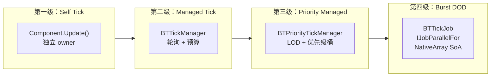

## 快速上手

### 5 分钟 Demo

**第 1 步：** 创建行为树资产 — Project 窗口 → **Create → CycloneGames → AI → BehaviorTree**。命名 `PatrolTree`。

**第 2 步：** 打开编辑器 — 双击资产或 **Tools → CycloneGames → Behavior Tree Editor**。

**第 3 步：** 搭建巡逻树：

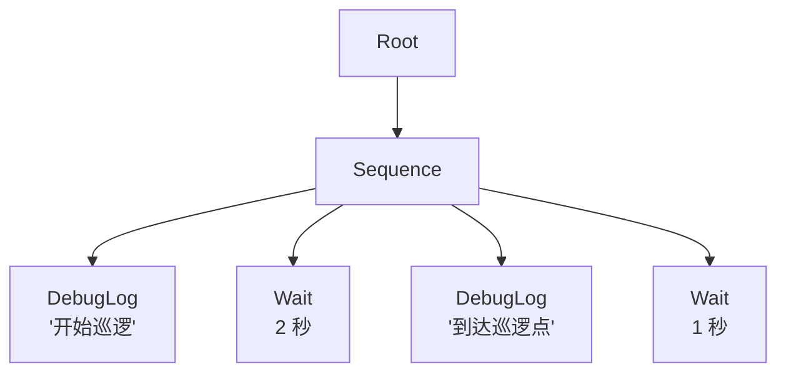

右键添加节点：CompositeNode → Base → SequencerNode，ActionNode → Base → DebugLogNode，ActionNode → Base → WaitNode。

**第 4 步：** 挂载到 GameObject — Add Component → BTRunnerComponent，拖入资产，勾选 **Start On Awake**，Press Play。

**第 5 步：** 观察 — 绿色光晕=Running，绿色边框=Success，红色边框=Failure，边线流动粒子，WaitNode 进度条。

### 纯代码运行时树

```csharp
using CycloneGames.BehaviorTree.Runtime.Core;

static readonly int HasTargetKey = Animator.StringToHash("HasTarget");
static readonly int AttackCountKey = Animator.StringToHash("AttackCount");

RuntimeBehaviorTree tree = new RuntimeBehaviorTreeBuilder(ownerGameObject)
    .WithServiceResolver(new RuntimeBTContext.ServiceProviderResolver(serviceProvider))
    .WithTickInterval(1)
    .Selector()
        .Sequence()
            .Condition(bb => bb.GetBool(HasTargetKey), "HasTarget")
            .CoolDown(0.75f)
                .Action(bb =>
                {
                    bb.SetInt(AttackCountKey, bb.GetInt(AttackCountKey) + 1);
                    return RuntimeState.Success;
                }, "Attack")
            .End()
        .End()
        .Action(bb => RuntimeState.Success, "Idle")
    .End()
    .Build();

tree.Play();
tree.Tick();
```

可复用的玩法规则使用 command 和 strategy 对象：

```csharp
public sealed class AttackCommand : IRuntimeBTCommand
{
    public RuntimeState Execute(RuntimeBlackboard blackboard) => RuntimeState.Success;
}

public sealed class HasTargetCondition : IRuntimeBTConditionStrategy
{
    public bool Evaluate(RuntimeBlackboard blackboard) => blackboard.GetBool(HasTargetKey);
}

RuntimeBehaviorTree tree = new RuntimeBehaviorTreeBuilder()
    .Sequence()
        .Condition(new HasTargetCondition(), "HasTarget")
        .Command(new AttackCommand(), "Attack")
    .End()
    .Build();
```

## 核心概念

### BTRunnerComponent

运行行为树的核心 MonoBehaviour。

```csharp
BTRunnerComponent runner = GetComponent<BTRunnerComponent>();

// 生命周期
runner.Play();       // 启动或重启
runner.Pause();      // 暂停
runner.Resume();     // 继续
runner.Stop();       // 停止并重置

// 黑板数据
runner.BTSetData("Health", 100);
runner.BTSetData("Speed", 5.5f);
runner.BTSendMessage("EnemySpotted");

// 运行时热替换
runner.SetTree(anotherBehaviorTreeAsset);

// Tick 模式
runner.SetTickMode(TickMode.PriorityManaged);

// 事件驱动唤醒
runner.WakeUp(boostedTicks: 2);
```

**Tick 模式：**

| 模式 | 适用场景 | 工作方式 |
| --- | --- | --- |
| `Self` | 独立 owner | 每个组件在 `Update()` 中自行 Tick |
| `Managed` | 简单批处理 | `BTTickManager` 轮询 + 预算上限 |
| `PriorityManaged` | Priority/LOD policy | 距离 LOD + 8 优先级桶 + 每桶预算 |
| `Manual` | 完全控制 | 自行调用 `runner.ManualTick()` |

### 黑板

黑板是供所有节点共享的类型化键值存储。不同类型使用独立字典避免装箱。

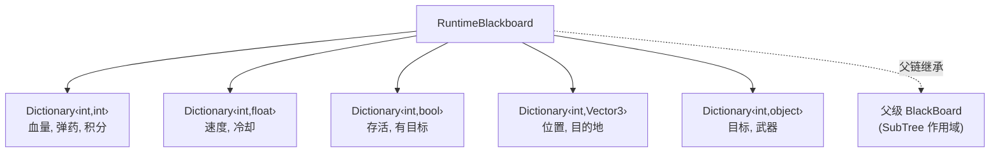

**键寻址：**

```csharp
// 字符串键（内部通过 Animator.StringToHash 转换）
blackboard.SetInt("Health", 100);

// 整数键（初始化时预哈希）
static readonly int k_Health = Animator.StringToHash("Health");
blackboard.SetInt(k_Health, 100);
```

**观察者**（推送式变更通知）：

```csharp
blackboard.AddObserver("Health", (keyHash, bb) => {
    int hp = bb.GetInt(keyHash);
    if (hp <= 0) OnDeath();
});
```

**变更检测**（基于时间戳的轮询）：

```csharp
ulong stamp = blackboard.GetStamp("EnemyCount");
if (stamp != lastStamp) { /* EnemyCount 变化 */ }
```

**线程安全**（按需启用）：

```csharp
blackboard.EnableThreadSafety(); // 一次性分配 ReaderWriterLockSlim
```

### 节点生命周期

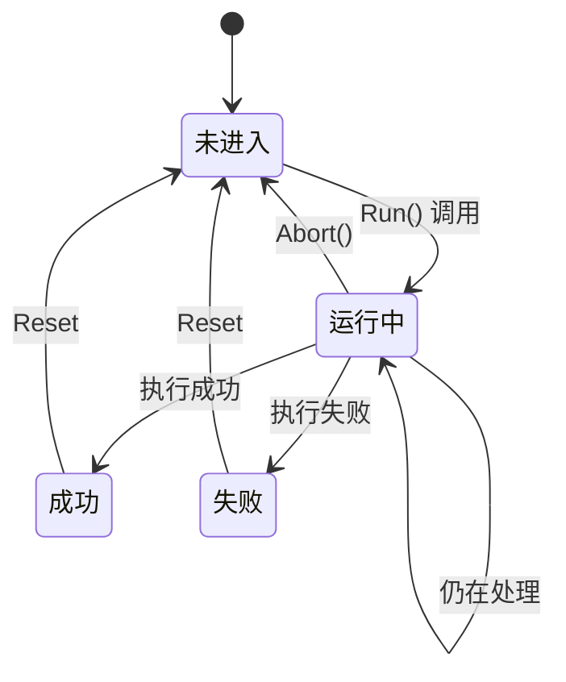

| 钩子 | 调用时机 | 用途 |
| --- | --- | --- |
| `OnAwake()` | 编译时调用一次 | 缓存引用 |
| `OnStart()` | 每次开始 Running | 初始化本次运行状态 |
| `OnRun()` | Running 期间每帧调用 | 核心逻辑 → 返回 `Success`/`Failure`/`Running` |
| `OnStop()` | 节点结束或被中止 | 清理 |
| `ResetState()` | 父节点重启子节点时 | 重置计数器 |

### 运行时时间 API

时间敏感节点通过 `RuntimeBTTime.GetTime(...)` 以 `double` 精度计时：

```csharp
public interface IRuntimeBTTimeProvider
{
    double TimeAsDouble { get; }
    double UnscaledTimeAsDouble { get; }
}
```

解析顺序：1) service resolver 提供的 `IRuntimeBTTimeProvider`，2) `UnityEngine.Time`，3) DateTime 回退。DOD/Burst Job 使用 `float deltaTime` 保证吞吐。

## 使用指南

### 组合节点 (Composite)

组合节点控制子节点的执行流程。

#### SequencerNode（顺序节点）

从左到右依次执行。**全部**成功返回 `Success`；任一失败立即返回 `Failure`。

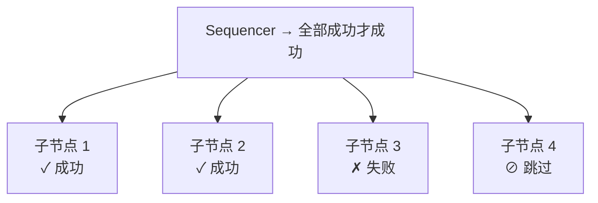

#### SelectorNode（选择节点）

从左到右依次执行。**任一**成功立即返回 `Success`。

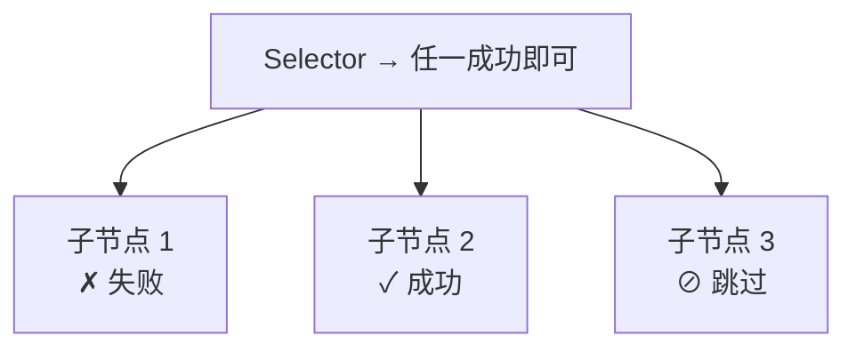

#### 其他组合节点

| 节点 | 行为 | 适用场景 |
| --- | --- | --- |
| **SelectorRandom** | 随机打乱顺序后 selector 回退 | 无权重表的等价行为分发 |
| **SequenceWithMemory** | 从上次 Running 子节点恢复 | 多步骤任务目标 |
| **Parallel** | 同时执行所有子节点；多种完成模式 | 攻击+动画并行 |
| **ParallelAll** | 所有子节点 Tick；可配阈值 | "3 个中 2 个成功即算成功" |
| **ReactiveSequence** | 每帧从头重新评估 | 必须持续满足的条件守卫 |
| **ReactiveFallback** | 每帧重新评估；中断低优先级子节点 | 优先级行为切换 |
| **IfThenElse** | `[0]`=条件，`[1]`=then，`[2]`=else | 条件分支 |
| **WhileDoElse** | 条件成功时循环执行主体 | "在射程内→射击" |
| **SwitchNode** | 按黑板 int 键 N 路分支 | 状态驱动 AI |
| **ProbabilityBranch** | 按权重随机选子节点（确定性 xorshift32） | 随机 NPC 行为 |
| **UtilitySelector** | 最高黑板 float 评分胜出 | 动态效用 AI |
| **ServiceNode** | 周期性执行副作用回调 | 更新瞄准方向 |

### 装饰节点 (Decorator)

装饰节点修改单个子节点的行为。

| 节点 | 行为 |
| --- | --- |
| **InvertNode** | 翻转 `Success` ↔ `Failure` |
| **SucceederNode** | 始终返回 `Success` |
| **ForceFailureNode** | 始终返回 `Failure` |
| **RepeatNode** | 重复 N 次或无限循环 |
| **RetryNode** | 失败重试最多 N 次 |
| **TimeoutNode** | 超时返回 `Failure` |
| **DelayNode** | 延迟后运行子节点 |
| **CoolDownNode** | 冷却期结束前阻止执行 |
| **RunOnceNode** | 执行一次，缓存复用结果 |
| **WaitSuccessNode** | 等待成功或超时 |
| **BlackBoardNode** | 创建作用域子黑板 |
| **SubTreeNode** | 引用另一 BehaviorTree 资产，支持端口映射 |
| **BBComparisonNode** | 比较黑板键（`==`, `!=`, `<`, `>`, `<=`, `>=`, `IsSet`, `IsNotSet`） |

### 行为与条件节点

**行为节点**（叶子，执行实际工作）：

| 节点 | 行为 |
| --- | --- |
| **DebugLogNode** | 输出日志 |
| **WaitNode** | 等待一段时长（固定或随机），返回 `Success` |
| **MessagePassNode** | 在黑板键上设置字符串 |
| **MessageRemoveNode** | 从黑板移除键 |
| **BTChangeNode** | 触发 `BTStateMachineComponent` 状态转换 |

**条件节点**（评估后返回 `Success`/`Failure`，永远不返回 `Running`）：

| 节点 | 行为 |
| --- | --- |
| **OnOffNode** | 固定 `Success` 或 `Failure` 开关 |
| **MessageReceiveNode** | 检查键是否等于特定字符串 |
| **RandomChanceNode** | 按 `chance/outOf` 概率返回 `Success` |

### 自定义节点

编辑数据和运行时执行分离。编辑节点是 ScriptableObject；运行时节点执行热路径工作。

```csharp
// === ScriptableObject 编辑层 ===
[BTInfo("Custom/Movement", "Moves agent toward target position")]
public sealed class MoveToTargetNode : ActionNode
{
    [SerializeField] private string _targetKey = "TargetPosition";
    [SerializeField] private float _arrivalRadius = 0.5f;
    public string TargetKey => _targetKey;
    public float ArrivalRadius => _arrivalRadius;
}

// === 纯 C# 运行时执行层 ===
public sealed class RuntimeMoveToTarget : RuntimeStatefulActionNode
{
    private readonly int _targetKey;
    private readonly float _arrivalRadiusSqr;

    public RuntimeMoveToTarget(int targetKey, float arrivalRadius)
    {
        _targetKey = targetKey;
        _arrivalRadiusSqr = arrivalRadius * arrivalRadius;
    }

    protected override RuntimeState OnActionRunning(RuntimeBlackboard bb)
    {
        var target = bb.GetVector3(_targetKey);
        var agent = bb.GetService<IMovementAgent>();
        if (agent == null) return RuntimeState.Failure;
        float speed = bb.GetFloat("Speed", 5f);
        return agent.MoveToward(target, _arrivalRadiusSqr, speed)
            ? RuntimeState.Success : RuntimeState.Running;
    }
}

// 在 composition root 注册
var emitters = BehaviorTreeNodeEmitterRegistry.CreateWithBuiltInFallback();
emitters.Register<MoveToTargetNode>((source, context) =>
{
    int key = RuntimeBlackboard.DefaultStringHashFunc(source.TargetKey);
    return context.WithGuid(source, new RuntimeMoveToTarget(key, source.ArrivalRadius));
});
```

## 进阶主题

### SubTree 组合

将大型行为树拆分为可复用模块。

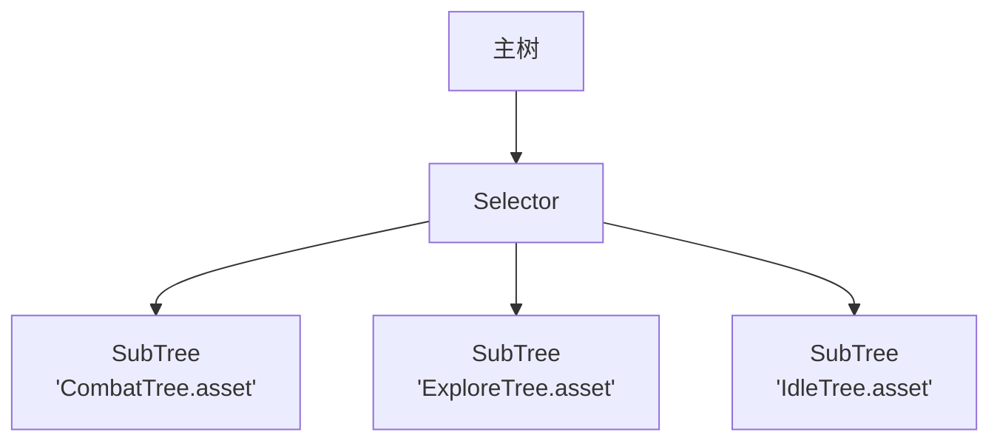

端口映射：`父 "EnemyPosition" → 子 "TargetPos"`。SubTree 在从父级继承的作用域黑板上运行。

### 行为树 + 状态机

使用 `BTStateMachineComponent` 在行为树之间进行高级状态转换。通过 `BTChangeNode` 或 `stateMachine.SetState("Combat")` 触发。

### 条件中止

| 中止类型 | 行为 |
| --- | --- |
| `None` | 不中断 |
| `Self` | 条件变化时中止自身子树 |
| `LowerPriority` | 条件成立时中止低优先级兄弟节点 |
| `Both` | Self + LowerPriority |

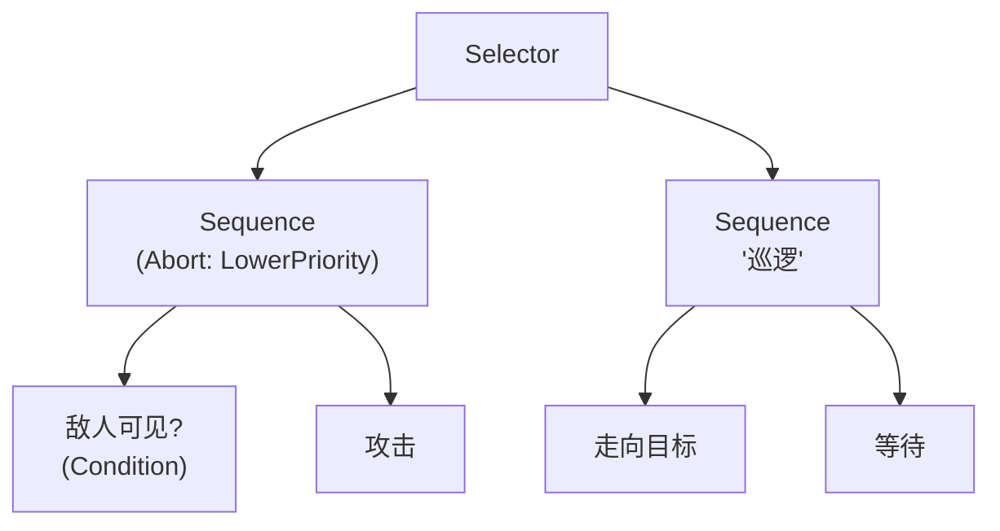

### 事件驱动执行

```csharp
// 在自定义 RuntimeNode 中
protected override RuntimeState OnRun(RuntimeBlackboard bb)
{
    if (significantEventOccurred)
        EmitWakeUpSignal();
    return RuntimeState.Running;
}

// 外部唤醒
runner.WakeUp(boostedTicks: 2);
```

### 确定性随机

```csharp
var rng = new RuntimeDeterministicRandom(seed: 42);
int index = rng.NextInt(0, 5); // 服务端和客户端结果相同
```

消费随机值的节点从 service registry 解析 `IRuntimeBTRandomProvider`。如果有 `CycloneGames.DeterministicMath`，可注册 `DeterministicMathRandomProvider` 以支持随机状态的保存/恢复。

### DOD / Burst 执行

可选 DOD assembly 为受支持的平坦节点类型提供面向数据执行路径。

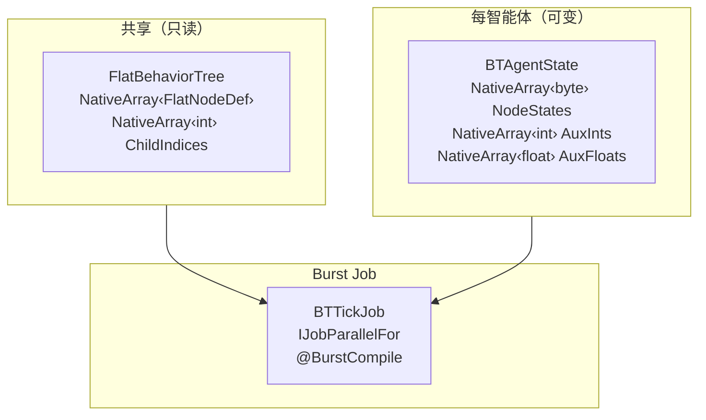

```csharp
FlatBehaviorTree flatTree = FlatTreeCompiler.Compile(runtimeTree);
var scheduler = new BTTickScheduler(flatTree, initialCapacity: 1024, bbSlotCount: 8);
int agentId = scheduler.AddAgent(tickInterval: 2);
scheduler.SetBBInt(agentId, slotIndex: 0, value: 100);
JobHandle handle = scheduler.ScheduleTick(Time.deltaTime, batchSize: 64);
scheduler.CompleteTick();
```

| 判断标准 | Managed | Burst DOD |
| --- | --- | --- |
| 树复杂度 | 任意 | 简单到中等（仅支持上表节点） |
| 自定义行为 | 是（C#） | 外部回调 slot |
| object 黑板 | 是 | 否（仅 int/float/bool）|

### 多人网络同步

三种同步模式：

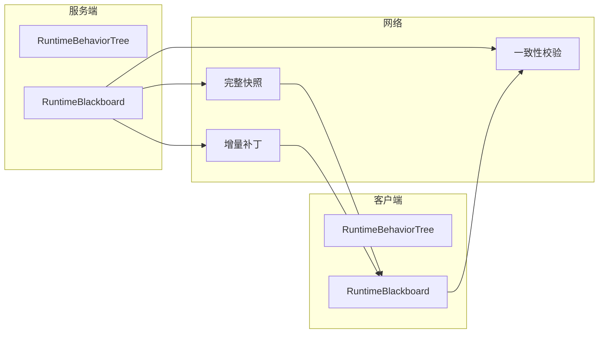

**服务端权威快照：**

```csharp
var snapshot = BTNetworkSync.CaptureSnapshot(serverTree);
byte[] data = BTNetworkSync.SerializeSnapshot(snapshot);
SendToClient(data);
// 客户端：
var snap = BTNetworkSync.DeserializeSnapshot(data);
BTNetworkSync.ApplyBlackboardSnapshot(clientTree, snap);
```

**客户端预测 + 哈希校验：**

```csharp
ulong serverHash = serverBlackboard.ComputeHash();
if (BTNetworkSync.CheckDesync(clientTree, serverHash))
    BTNetworkSync.ApplyBlackboardSnapshot(clientTree, BTNetworkSync.CaptureSnapshot(serverTree));
```

**增量黑板同步：**

```csharp
var delta = new BTBlackboardDelta();
delta.TrackKey("Health");
delta.Attach(serverBlackboard);

if (delta.TryFlush(serverBlackboard, out ArraySegment<byte> patch))
    SendToClients(patch);
// 客户端：
BTBlackboardDelta.Apply(clientBlackboard, patch);
```

## 常见场景

### FPS / 第三人称射击

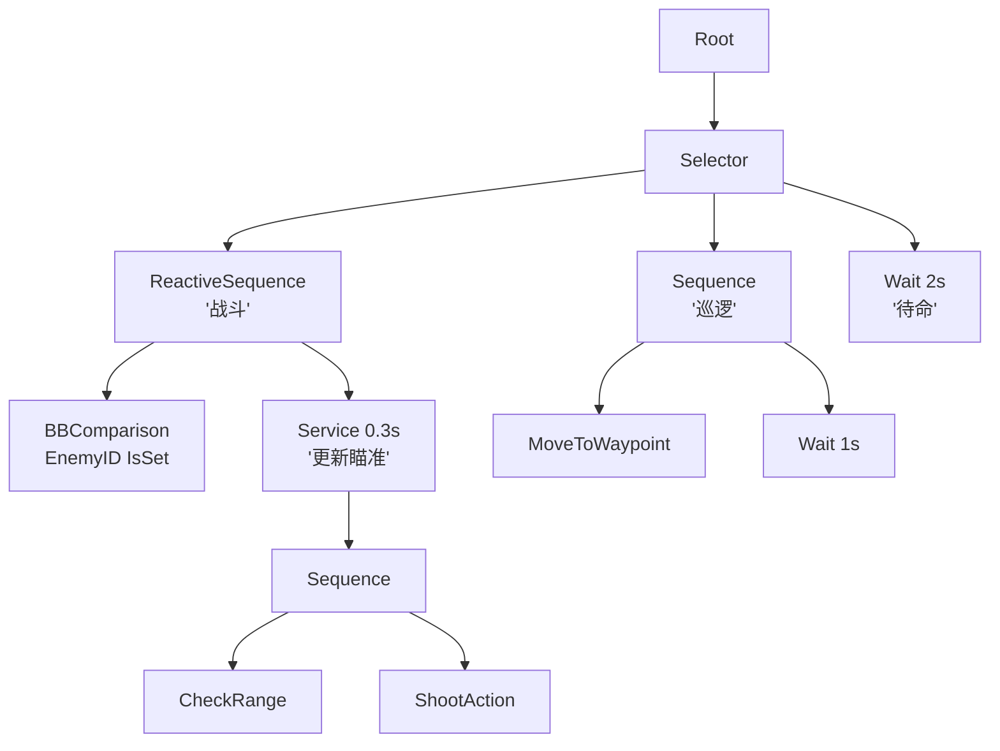

关键设计：`ReactiveSequence` 用于战斗重新评估，`ServiceNode` 周期更新瞄准，`BBComparison` 使用 `IsSet`。

### 开放世界 RPG

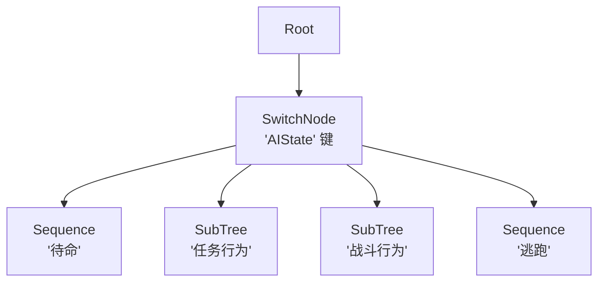

关键设计：`SwitchNode` 驱动 `AIState`，`SubTreeNode` 实现模块化行为资产，`UtilitySelectorNode` 评估世界状态。

### RTS / 殖民模拟

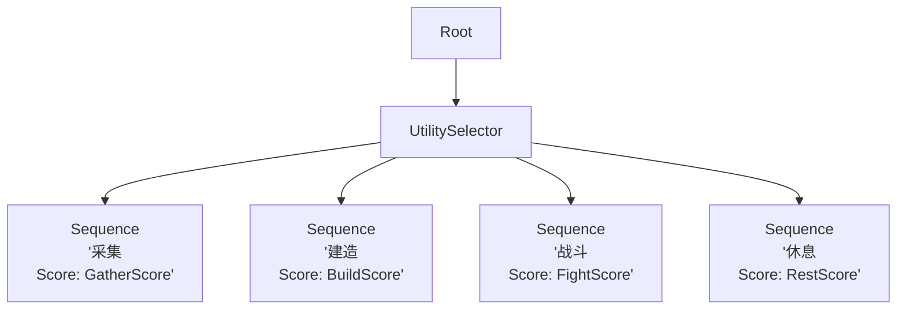

关键设计：`UtilitySelectorNode` 动态优先级，`PriorityManaged` Tick 模式，Burst DOD 用于万级单位。

### 潜行 / 恐怖 AI

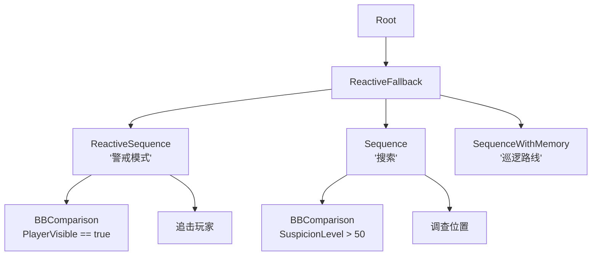

关键设计：`ReactiveFallbackNode` 即时警戒切换，`SequenceWithMemory` 恢复巡逻。

### Boss 战（多阶段）

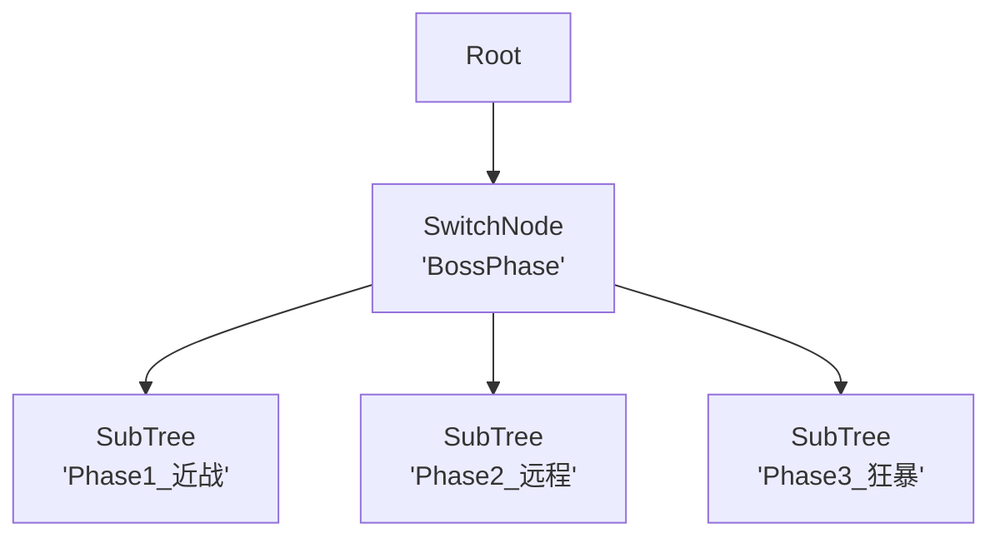

关键设计：`SwitchNode` 阶段切换，独立 `SubTreeNode` 每阶段，`ProbabilityBranch` 多样化攻击，`BossAIMarker` P0 优先级。

## 性能与内存

### Tick 模式选择

| 需求 | 方案 |
| --- | --- |
| 独立 ownership，简单调度 | `TickMode.Self` |
| 集中轮询 + 帧预算 | `TickMode.Managed` |
| 距离/优先级 + 分桶预算 | `TickMode.PriorityManaged` |
| 受支持平坦节点，显式 Native memory | Burst DOD |
| 混合复杂度 | 复杂树用 Managed，简单测量负载用 DOD |

### 热路径指引

- 预哈希键：`static readonly int k = Animator.StringToHash("Key")`
- 在 `OnAwake()` 中缓存引用，不在 `OnRun()` 中
- 使用 `blackboard.GetInt(key)` 而非装箱 `(int)blackboard.Get("key")`
- 使用 `sqrMagnitude` 距离检查而非 `Vector3.Distance()`

### 内存优化

- `RuntimeCompositeNode.Seal()` 冻结子列表为数组，释放列表内存
- `BTTreePool` 编译树实例池化，O(1) 空闲列表回收
- `BTDistanceLODProvider` 使用并行数组而非 Dictionary 遍历
- `RuntimeBlackboard` 实现 `IDisposable` — 释放 `ReaderWriterLockSlim`

### 线程安全

- `RuntimeBlackboard.EnableThreadSafety()` — 按需 `ReaderWriterLockSlim`
- 观察者通知在写锁外部触发
- `BTTickJob` 使用 Burst `IJobParallelFor`；调用方必须遵守 per-agent 分区
- `RuntimeBehaviorTree` 仅对 wake-up flag 使用 `Interlocked`/`Volatile`

### 优先级 LOD 系统

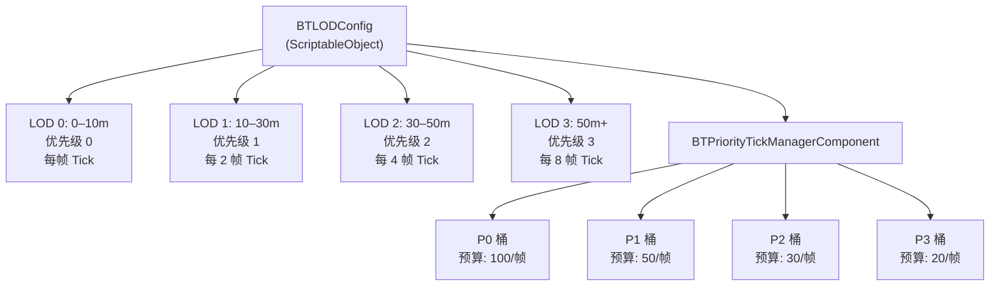

优先级标记：`BossAIMarker`（P0）、`EliteAIMarker`（P0）、`VIPNPCMarker`（P1）。实现 `IBTPriorityMarker` 动态优先级。使用 `runner.BoostPriority(2f)` 事件驱动优先级提升。

### 开放世界优化

1. 远处 NPC 距离 LOD
2. 任务 NPC 优先级标记
3. 分组覆盖（`IBTAgentGroupProvider`）
4. 区块激活 `BTRunnerComponent`
5. `BTTreePool` 模板池化：

```csharp
var pool = new BTTreePool();
int guardTemplate = pool.RegisterTemplate(guardTreeAsset);
int instanceId = pool.Allocate(guardTemplate);
RuntimeBehaviorTree instance = pool.GetInstance(instanceId);
pool.TickAll();
pool.Release(instanceId);
```

### Benchmark 工具

`Tools > CycloneGames > Behavior Tree > Behavior Tree Benchmark` 提供从 `AiBattle500` 到 `AiExtreme10000` 的预设、调度策略对比、CSV/JSON 导出和内存/GC 指标。

## 故障排查

| 现象 | 可能原因 | 解决方法 |
| --- | --- | --- |
| 树编译但节点不 Tick | 树未启动或已暂停 | 调用 `tree.Play()` 或检查 `IsPaused` |
| 自定义节点在 GraphView 中找不到 | 节点未在 emitter registry 注册 | 在 `BehaviorTreeNodeEmitterRegistry` 中注册 |
| 黑板键返回错误值 | 键哈希碰撞或使用错误类型访问器 | 使用类型化访问器（`GetInt` 而非 `GetObject`） |
| SubTree 黑板未继承 | 端口映射未配置 | 在 SubTreeNode Inspector 中设置端口映射 |
| Reactive 节点未重新评估 | Abort type 设置为 `None` | 设置为 `Self` 或 `Both` |
| Tick 期间 GC 过高 | 通过无类型黑板 API 装箱 | 使用类型化 `GetInt`/`GetFloat`/`GetBool`/`GetVector3` |
| Burst Job 编译失败 | 缺少 Burst/Collections/Mathematics | 安装所需包；DOD assembly 为可选 |
| LOS 检查误报 | Obstacle layer 包含目标所在层 | 将 LayerMask 只设置为环境层 |

## 验证

```text
CycloneGames.BehaviorTree.Tests.Editor                 (EditMode)
CycloneGames.BehaviorTree.Tests.Performance             (EditMode + PlayMode)
CycloneGames.BehaviorTree.Networking.Tests.Editor       (EditMode)
```

分别在 Domain Reload 启用和禁用时测试 Play Mode。在 release Player 设置下运行 benchmark matrix。在所有目标平台验证，包括 IL2CPP/AOT。
