# CycloneGames.BehaviorTree

面向生产环境的零 GC 行为树框架 —— 双层架构、三级扩容（1 到 10,000+ 智能体）、多人网络同步、Burst/DOD 大规模模拟、专业 GraphView 编辑器实时可视化。

<p align="left"><br> <a href="README.md">English</a> | 简体中文</p>

---

## 目录

- [功能概览](#功能概览)
- [架构设计](#架构设计)
- [安装](#安装)
- [快速上手 — 最小 Demo](#快速上手--最小-demo)
- [核心概念](#核心概念)
  - [BTRunnerComponent](#btrunnercomponent)
  - [黑板 (BlackBoard)](#黑板-blackboard)
    - [运行时时间服务（double API）](#运行时时间服务double-api)
  - [节点生命周期](#节点生命周期)
- [Benchmark 与性能工作流](#benchmark-与性能工作流)
- [节点参考手册](#节点参考手册)
  - [组合节点 (Composite)](#组合节点-composite)
  - [装饰节点 (Decorator)](#装饰节点-decorator)
  - [行为节点 (Action)](#行为节点-action)
  - [条件节点 (Condition)](#条件节点-condition)
- [自定义节点开发](#自定义节点开发)
- [游戏场景实战](#游戏场景实战)
- [大规模 AI（1,000+ 智能体）](#大规模-ai1000-智能体)
- [DOD / Burst — 万级模拟（10,000+）](#dod--burst--万级模拟10000)
- [多人网络同步](#多人网络同步)
- [进阶用法](#进阶用法)
- [编辑器可视化](#编辑器可视化)
- [优化指南](#优化指南)
- [API 参考](#api-参考)

---

## 功能概览

| 分类         | 特性                                                                                                       |
| ------------ | ---------------------------------------------------------------------------------------------------------- |
| **架构**     | 双层设计（SO 编辑层 → 纯 C# 运行层），一次编译零 GC 执行                                                   |
| **节点库**   | 30+ 内置节点：Sequence、Selector、Parallel、Reactive、Utility AI、Service、SubTree、Switch、Probability 等 |
| **扩容**     | Self Tick → BTTickManager（百级）→ BTPriorityTickManager + LOD（千级）→ Burst DOD Jobs（万级+）            |
| **网络**     | 服务端权威快照、客户端预测哈希比对、增量黑板同步                                                           |
| **黑板**     | 5 类型字典（int/float/bool/Vector3/object）、int 键哈希、父链继承、观察者推送、时间戳、线程安全            |
| **时间 API** | `double` 精度运行时计时（`IRuntimeBTTimeProvider`、`RuntimeBTTime.GetTime`），并带 Unity 回退              |
| **事件驱动** | `EmitWakeUpSignal()` + 外部 `WakeUp()` 入口，支持短时增强立即 Tick 预算                                     |
| **分组 LOD** | `IBTAgentGroupProvider` 支持在距离 LOD 之上按组覆盖优先级 / Tick 间隔                                       |
| **Benchmark**| 预设 × 复杂度矩阵、调度策略对比、soak 采样、CSV/JSON 导出                                                     |
| **编辑器**   | GraphView 流动粒子动画边、状态着色、进度条、信息标签、运行时实时可视化                                     |
| **DI/IoC**   | `IRuntimeBTServiceResolver` 接口 — 兼容 VContainer、Zenject 或自定义容器                                   |
| **ECS 桥接** | `IBTEntityBridge`、`BTEntityRef`、`BTTreePool` 实现托管 + DOD 双模式                                       |
| **平台**     | Windows、Mac、Linux、Android、iOS、WebGL、Server                                                           |

---

## 架构设计

### 双层架构

```mermaid
flowchart TB
    subgraph EditorTime["编辑期"]
        SO["ScriptableObject 层<br>BTNode · CompositeNode · DecoratorNode"]
        SOFeature["• GraphView 可视化编辑器<br>• 序列化为 .asset 文件<br>• 支持 Undo/Redo"]
    end

    subgraph RuntimeExec["运行期"]
        RT["纯 C# 层<br>RuntimeNode · RuntimeBlackboard"]
        RTFeature["• 零 GC 分配<br>• 热路径无 Unity API<br>• 兼容 Burst DOD"]
    end

    SO -->|"BehaviorTree.Compile()"| RT

    style EditorTime fill:#2d2d3d,stroke:#666
    style RuntimeExec fill:#1a3a1a,stroke:#4a4
```

| 维度           | ScriptableObject 层                      | Runtime 层                       |
| -------------- | ---------------------------------------- | -------------------------------- |
| **用途**       | 编辑、序列化、编辑器 UI                  | 游戏执行                         |
| **GC**         | 可接受（仅编辑时）                       | **零分配**                       |
| **Unity 依赖** | 需要（ScriptableObject, SerializeField） | 极少（仅 Animator.StringToHash） |
| **时机**       | 设计时 + Compile() 调用                  | 每一帧                           |

### 三级扩容体系

```mermaid
flowchart LR
    subgraph Tier1["第一级：Self Tick"]
        A1["1–50 智能体<br>Component.Update()"]
    end

    subgraph Tier2["第二级：Managed Tick"]
        A2["100–1,000 智能体<br>BTTickManager<br>轮询 + 预算"]
    end

    subgraph Tier3["第三级：Burst DOD"]
        A3["10,000+ 智能体<br>BTTickJob<br>IJobParallelFor<br>NativeArray SoA"]
    end

    Tier1 --> Tier2 --> Tier3

    style Tier1 fill:#2a3a2a,stroke:#4a4
    style Tier2 fill:#2a2a3a,stroke:#66a
    style Tier3 fill:#3a2a2a,stroke:#a44
```

---

## 安装

### 环境要求

- Unity 2022.3 LTS 或更高版本
- .NET Standard 2.1 / .NET Framework 4.x

### 可选依赖

| 包                                                                                                                                                | 用途           |
| ------------------------------------------------------------------------------------------------------------------------------------------------- | -------------- |
| [Burst](https://docs.unity3d.com/Packages/com.unity.burst@latest) + [Collections](https://docs.unity3d.com/Packages/com.unity.collections@latest) | DOD 万级模拟   |
| [Mathematics](https://docs.unity3d.com/Packages/com.unity.mathematics@latest)                                                                     | Burst Job 调度 |

### 安装方式

1. 将 `CycloneGames.BehaviorTree` 文件夹复制到 `Assets/` 或 `Packages/`
2. 或使用 Package Manager → "Add package from disk" → 选择 `package.json`

---

## 快速上手 — 最小 Demo

跟随以下步骤，5 分钟内完成一个完整的行为树示例。

### 第 1 步：创建行为树资产

在 Project 窗口右键 → **Create → CycloneGames → AI → BehaviorTree**

命名为 `PatrolTree`。

### 第 2 步：打开编辑器

双击 `PatrolTree` 或前往 **Tools → CycloneGames → Behavior Tree Editor**。

### 第 3 步：搭建简单巡逻树

在画布空白处右键创建节点：

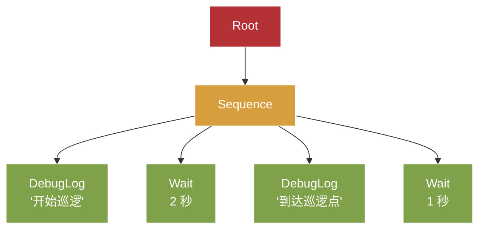

1. **Root** 节点自动创建
2. 右键 → **CompositeNode → Base → SequencerNode** → 连接到 Root
3. 右键 → **ActionNode → Base → DebugLogNode** → 连接到 Sequencer，设置消息 `"开始巡逻"`
4. 右键 → **ActionNode → Base → WaitNode** → 连接到 Sequencer，设置时长 `2`
5. 再添加一个 DebugLogNode 和 WaitNode 如上图

### 第 4 步：挂载到 GameObject

1. 创建空 GameObject 命名 `PatrolAgent`
2. **Add Component → BTRunnerComponent**
3. 将 `PatrolTree` 资产拖入 **Behavior Tree** 字段
4. 勾选 **Start On Awake**
5. 点击 **Play** → 观察 Console 输出和编辑器可视化

### 第 5 步：观察编辑器

选中 `PatrolTree` 资产并打开行为树编辑器：

- **绿色光晕** = 节点正在运行 (Running)
- **绿色边框** = 节点成功 (Success)
- **红色边框** = 节点失败 (Failure)
- **流动粒子** 沿边线 = 数据流方向
- **进度条** 在 WaitNode 上 = 倒计时

---

## 核心概念

### BTRunnerComponent

挂载行为树的核心 MonoBehaviour。负责编译、Tick 管理、暂停/恢复和黑板访问。

```csharp
// 获取 Runner
BTRunnerComponent runner = GetComponent<BTRunnerComponent>();

// 生命周期控制
runner.Play();       // 启动或重启
runner.Pause();      // 暂停执行
runner.Resume();     // 从暂停处继续
runner.Stop();       // 停止并重置

// 黑板数据
runner.BTSetData("Health", 100);          // 自动检测 int
runner.BTSetData("Speed", 5.5f);          // 自动检测 float
runner.BTSetData("IsAlive", true);        // 自动检测 bool
runner.BTSendMessage("EnemySpotted");     // 设置 "Message" 键
runner.BTRemoveData("TargetPosition");    // 移除键

// 运行时热替换行为树
runner.SetTree(anotherBehaviorTreeAsset);

// Tick 模式（默认：Self）
runner.SetTickMode(TickMode.PriorityManaged);

// 优先级提升 2 秒（PriorityManaged 模式下有效）
runner.BoostPriority(2f);

// 事件驱动唤醒（紧急重新 Tick）
runner.WakeUp(boostedTicks: 2);

// 可选：注入服务（时间/随机/自定义）
runner.SetServiceResolver(new RuntimeBTContext.ServiceProviderResolver(serviceProvider));
```

**Tick 模式说明：**

| 模式              | 适用场景      | 工作方式                            |
| ----------------- | ------------- | ----------------------------------- |
| `Self`            | < 100 智能体  | 每个组件在自己的 `Update()` 中 Tick |
| `Managed`         | 简单批处理    | `BTTickManager` 轮询 + 预算上限     |
| `PriorityManaged` | 1,000+ 智能体 | 距离 LOD + 8 优先级桶 + 每桶预算    |
| `Manual`          | 完全控制      | 自行调用 `runner.ManualTick()`      |

### 黑板 (BlackBoard)

黑板是一个**类型化键值存储**，供树中所有节点共享。通过为每种类型使用独立字典来避免装箱 → 值类型访问**零 GC**。

```mermaid
flowchart TB
    BB["RuntimeBlackboard"]
    BB --> IntDict["Dictionary‹int,int›<br>血量, 弹药, 积分"]
    BB --> FloatDict["Dictionary‹int,float›<br>速度, 冷却"]
    BB --> BoolDict["Dictionary‹int,bool›<br>存活, 有目标"]
    BB --> VecDict["Dictionary‹int,Vector3›<br>位置, 目的地"]
    BB --> ObjDict["Dictionary‹int,object›<br>目标, 武器"]

    BB -.->|"父链继承"| ParentBB["父级 BlackBoard<br>(SubTree 作用域)"]

    style BB fill:#2a2a3a,stroke:#66a
```

**键寻址方式：**

```csharp
// 字符串键（便捷，内部通过 Animator.StringToHash 转换）
blackboard.SetInt("Health", 100);
int health = blackboard.GetInt("Health");

// 整数键（最高性能，初始化时预哈希）
static readonly int k_Health = Animator.StringToHash("Health");
blackboard.SetInt(k_Health, 100);
int health = blackboard.GetInt(k_Health);
```

**观察者系统**（推送式变更通知）：

```csharp
// 监听特定键的变化
blackboard.AddObserver("Health", (keyHash, bb) => {
    int hp = bb.GetInt(keyHash);
    if (hp <= 0) OnDeath();
});

// 监听任意键变化（适用于网络同步）
blackboard.AddGlobalObserver((keyHash, bb) => {
    MarkDirtyForSync();
});
```

**变更检测**（基于时间戳的轮询）：

```csharp
ulong lastStamp = 0;
// 在 Tick 中：
ulong stamp = blackboard.GetStamp("EnemyCount");
if (stamp != lastStamp) {
    lastStamp = stamp;
    // EnemyCount 发生了变化 → 重新评估策略
}
```

**线程安全**（按需启用）：

```csharp
blackboard.EnableThreadSafety(); // 一次性分配 ReaderWriterLockSlim
// 现在可以安全地从后台线程读写
```

### 运行时时间服务（double API）

运行时里所有时间敏感节点（Wait/Delay/Timeout/Service/CoolDown/WaitSuccess 等）
统一通过 `RuntimeBTTime.GetTime(...)` 取时，并以 `double` 保存内部时间戳。

```csharp
public interface IRuntimeBTTimeProvider
{
    double TimeAsDouble { get; }
    double UnscaledTimeAsDouble { get; }
}

// RuntimeBTTime.GetTime(...) 的解析顺序：
// 1) 从 blackboard/context 的 service resolver 取 IRuntimeBTTimeProvider
// 2) 使用 UnityEngine.Time.timeAsDouble / unscaledTimeAsDouble
// 3) 在极老运行时目标上回退到 DateTime
```

典型用途：

- 确定性模拟时钟
- 服务端权威虚拟时间
- 需要避免 float 漂移的回放 / 回滚系统

说明：DOD/Burst 的 Job Tick 仍然采用 `float deltaTime`，以保证吞吐和数据体积。

### 节点生命周期

每个节点遵循以下状态机：

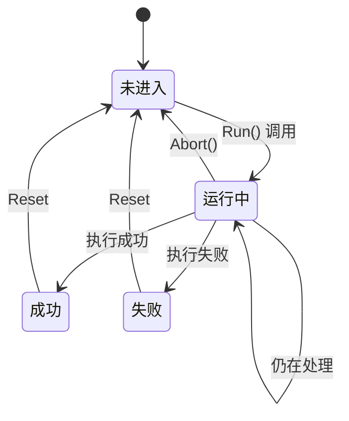

**RuntimeNode 生命周期钩子：**

| 钩子           | 调用时机             | 用途                                              |
| -------------- | -------------------- | ------------------------------------------------- |
| `OnAwake()`    | 编译时调用一次       | 缓存引用（0GC）                                   |
| `OnStart()`    | 每次节点开始 Running | 初始化本次运行状态                                |
| `OnRun()`      | Running 期间每帧调用 | 核心逻辑 → 返回 `Success`、`Failure` 或 `Running` |
| `OnStop()`     | 节点结束或被中止     | 清理                                              |
| `ResetState()` | 父节点重启子节点时   | 重置内部计数器                                    |

---

## Benchmark 与性能工作流

模块内置了覆盖 Editor 与 PlayMode 的完整 benchmark 管线。

### 关键能力

- Runner 模式：`Single`、`RecommendedMatrix`、`FullMatrix`、`PriorityComparison`
- 预设规模：从 `AiBattle500` 到 `AiExtreme10000`，并包含网络与 soak 场景
- 调度策略：`FullRate`、`LodCrowd`、`PriorityLod`、`NetworkMixed`、`FarCrowd`、`UltraLod`、`PriorityManaged`
- 通过 `BehaviorTreeBenchmarkExportUtility` 自动导出 CSV/JSON
- 内存与 GC 指标（`ManagedMemoryDeltaBytes`、`PeakManagedMemoryBytes`、`Gen0/1/2Collections`）
- Tick 效率指标（`EffectiveTickRatio`、`AverageActiveAgentsPerFrame`、`TicksPerSecond`）

### 主要 API

```csharp
// 单次 benchmark
BehaviorTreeBenchmarkResult result = BehaviorTreeBenchmarkSession.RunImmediate(config);

// 场景内 Runner（支持矩阵与优先级对比模式）
BehaviorTreeBenchmarkRunner runner = gameObject.AddComponent<BehaviorTreeBenchmarkRunner>();
runner.RunnerMode = BehaviorTreeBenchmarkRunnerMode.FullMatrix;
runner.SetConfig(config);
runner.BeginBenchmark();
```

### 入口

- `Tools > CycloneGames > Behavior Tree > Behavior Tree Benchmark`
- `Runtime/PerformanceTest` 下的运行时组件
- `Tests` 目录下的 Editor + PlayMode 校验

---

## 节点参考手册

### 组合节点 (Composite)

组合节点控制子节点的**执行流程**。

#### SequencerNode（顺序节点）

**从左到右**依次执行子节点。只有**全部**子节点成功时返回 `Success`。任一子节点失败时立即返回 `Failure`。

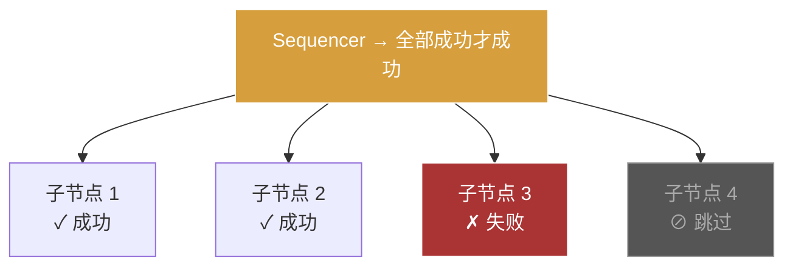

**适用场景：** "走到目标 AND 攻击 AND 播放动画" → 所有步骤必须成功。

#### SelectorNode（选择节点）

**从左到右**依次执行子节点。**任一**子节点成功时立即返回 `Success`。只有全部失败才返回 `Failure`。

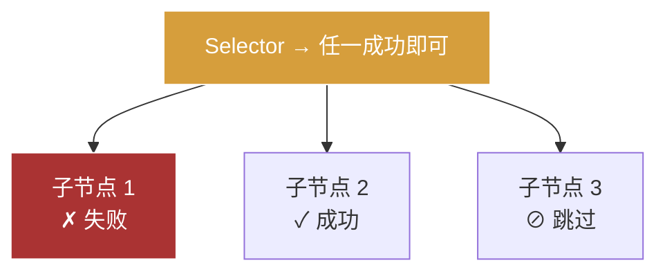

**适用场景：** "尝试攻击 OR 逃跑 OR 待命" → 回退链。

#### SequenceWithMemoryNode（记忆顺序节点）

类似 Sequencer，但**记住**上次处于 Running 状态的子节点，从该位置恢复执行而不是从第 0 个重新开始。

**适用场景：** 多步骤任务目标，不想重复检查已完成的步骤。

#### ParallelNode（并行节点）

每帧**同时**执行所有子节点。多种完成模式：

- `Default` → 等待全部完成
- `UntilAnyComplete` → 任一子节点完成即返回
- `UntilAnyFailure` → 首个失败即返回 `Failure`
- `UntilAnySuccess` → 首个成功即返回 `Success`

**适用场景：** "攻击的同时播放动画" → 并行行为。

#### ParallelAllNode（全并行节点）

每帧 Tick 所有子节点。可配置成功/失败阈值（例如 "3 个中 2 个成功即算成功"）。

**适用场景：** "3 个条件：有弹药、敌人可见、在射程内 → 至少满足 2 个才继续。"

#### ReactiveSequenceNode（响应式顺序节点）

类似 Sequence，但**每帧从头重新评估所有子节点**。如果之前已成功的子节点现在失败了，整个序列失败。

**适用场景：** 必须持续满足的条件守卫："敌人存活 AND 在射程 AND 有弹药" → 每帧检查。

#### ReactiveFallbackNode（响应式回退节点）

类似 Selector，但**每帧从头重新评估**。如果更高优先级的子节点变得可用，正在运行的低优先级子节点被中断。

**适用场景：** 优先级行为切换："附近有敌人 → 战斗，否则 → 巡逻，否则 → 待命" → 即时切换。

#### IfThenElseNode（条件分支节点）

三个子节点：`[0]` = 条件，`[1]` = then 分支，`[2]` = else 分支。每帧重新评估条件。

**适用场景：** "如果有目标 → 攻击，否则 → 巡逻。"

#### WhileDoElseNode（循环分支节点）

三个子节点：`[0]` = 条件（循环判断），`[1]` = do 主体，`[2]` = else 主体。条件成功时执行主体。

**适用场景：** "当敌人在射程内 → 持续射击，否则 → 寻找掩体。"

#### SwitchNode（分支切换节点）

基于**黑板 int 键**的 N 路分支。int 值对应索引的子节点运行；最后一个子节点为默认分支。

```csharp
// 黑板："AIState" = 0 → child[0], = 1 → child[1], 以此类推
// 最后一个子节点作为默认分支
```

**适用场景：** 无需外部状态机的状态驱动 AI："0=待命，1=巡逻，2=战斗，3=逃跑。"

#### ProbabilityBranch（概率分支节点）

根据可配置权重**随机选择一个**子节点。使用确定性 RNG (xorshift32) 保证网络可复现的随机性。

**适用场景：** NPC 随机选择对话内容或巡逻路线。

#### UtilitySelectorNode（效用选择节点）

**效用 AI** 模式。每个子节点对应一个**黑板 float 键**作为效用评分。评分最高的子节点运行。

```csharp
// 黑板键："AttackScore"=0.8, "FleeScore"=0.3, "HealScore"=0.9
// → HealScore 最高 → child[2] 运行
```

**适用场景：** 基于世界状态评估的动态 AI 决策。

#### SimpleParallelNode（简单并行节点）

每帧 Tick 所有子节点。始终返回 `Success`。

**适用场景：** 即发即忘型并行行为。

#### ServiceNode（服务节点）

**虚幻引擎风格的 Service**：包裹单个子节点，以可配置间隔定期执行副作用回调，独立于子节点的 Tick。

**适用场景：** "每 0.5 秒更新黑板中的目标位置"，同时子节点攻击行为正常运行。

### 装饰节点 (Decorator)

装饰节点**修改**单个子节点的行为。

| 节点                            | 行为                                                                                                                                    |
| ------------------------------- | --------------------------------------------------------------------------------------------------------------------------------------- |
| **InvertNode**                  | 翻转 `Success` ↔ `Failure`                                                                                                              |
| **SucceederNode**               | 始终返回 `Success`（即使子节点失败）                                                                                                    |
| **ForceFailureNode**            | 始终返回 `Failure`（即使子节点成功）                                                                                                    |
| **RepeatNode**                  | 重复执行子节点 N 次或无限循环。支持随机次数                                                                                             |
| **RetryNode**                   | 失败时重试子节点最多 N 次                                                                                                               |
| **TimeoutNode**                 | 子节点超时则返回 `Failure`（单位：秒）                                                                                                  |
| **DelayNode**                   | 等待 N 秒后才运行子节点                                                                                                                 |
| **CoolDownNode**                | 冷却期结束前阻止重复执行                                                                                                                |
| **RunOnceNode**                 | 仅执行子节点一次，后续调用返回缓存结果                                                                                                  |
| **KeepRunningUntilFailureNode** | 循环执行子节点直到返回 `Failure`，然后返回 `Success`                                                                                    |
| **WaitSuccessNode**             | 等待子节点成功或超时，超时返回 `Failure`                                                                                                |
| **BlackBoardNode**              | 创建**作用域子黑板**（从当前黑板继承）                                                                                                  |
| **SubTreeNode**                 | 引用另一个 BehaviorTree 资产。端口映射：父黑板键 → 子黑板键                                                                             |
| **BBComparisonNode**            | 黑板条件比较：支持 int/float/bool 和运算符（`==`、`!=`、`<`、`>`、`<=`、`>=`、`IsSet`、`IsNotSet`）。支持键对键或键对常量。支持中止类型 |

### 行为节点 (Action)

行为节点是**叶子节点**，执行实际工作。

| 节点                  | 行为                                                           |
| --------------------- | -------------------------------------------------------------- |
| **DebugLogNode**      | 向控制台输出日志（仅编辑器）                                   |
| **WaitNode**          | 等待一段时间（固定或随机范围），返回 `Success`。支持不缩放时间 |
| **MessagePassNode**   | 在黑板键上设置字符串值                                         |
| **MessageRemoveNode** | 从黑板中移除一个键                                             |
| **BTChangeNode**      | 触发 `BTStateMachineComponent` 的状态转换（按 ID 设置状态）    |

### 条件节点 (Condition)

条件节点**评估**后返回 `Success` 或 `Failure`（永远不返回 `Running`）。可用于条件中止重新评估。

| 节点                   | 行为                                            |
| ---------------------- | ----------------------------------------------- |
| **OnOffNode**          | 返回固定的 `Success` 或 `Failure`（可配置开关） |
| **MessageReceiveNode** | 检查黑板键是否等于特定字符串                    |

---

## 自定义节点开发

### 自定义行为节点（双层架构）

```csharp
using CycloneGames.BehaviorTree.Runtime.Attributes;
using CycloneGames.BehaviorTree.Runtime.Core;
using CycloneGames.BehaviorTree.Runtime.Core.Nodes.Actions;
using UnityEngine;

// === SO 层（编辑器） ===
[BTInfo("Custom/Movement", "向目标位置移动")]
public class MoveToTargetNode : ActionNode
{
    [SerializeField] private string _targetKey = "TargetPosition";
    [SerializeField] private float _arrivalRadius = 0.5f;

    protected override BTState OnRun(IBlackBoard bb)
    {
        return BTState.SUCCESS; // SO 层回退 → Compile 时创建 RuntimeNode
    }

    public override RuntimeNode CreateRuntimeNode()
    {
        return new RuntimeMoveToTarget(
            Animator.StringToHash(_targetKey),
            _arrivalRadius
        ) { GUID = this.GUID };
    }
}

// === Runtime 层（0GC 执行） ===
public class RuntimeMoveToTarget : RuntimeStatefulActionNode
{
    private readonly int _targetKey;
    private readonly float _arrivalRadiusSqr;

    public RuntimeMoveToTarget(int targetKey, float arrivalRadius)
    {
        _targetKey = targetKey;
        _arrivalRadiusSqr = arrivalRadius * arrivalRadius;
    }

    protected override void OnActionStart(RuntimeBlackboard bb)
    {
        // 节点开始运行时的一次性初始化
    }

    protected override RuntimeState OnActionRunning(RuntimeBlackboard bb)
    {
        var target = bb.GetVector3(_targetKey);
        var go = bb.GetContextOwner<GameObject>();
        if (go == null) return RuntimeState.Failure;

        var pos = go.transform.position;
        if ((target - pos).sqrMagnitude <= _arrivalRadiusSqr)
            return RuntimeState.Success;

        var dir = (target - pos).normalized;
        go.transform.position = pos + dir
            * bb.GetFloat(Animator.StringToHash("Speed"), 5f)
            * Time.deltaTime;
        return RuntimeState.Running;
    }

    protected override void OnActionHalted(RuntimeBlackboard bb)
    {
        // 节点被中止时的清理
    }
}
```

### 自定义条件节点

```csharp
[BTInfo("Custom/Checks", "血量是否高于阈值")]
public class CheckHealthNode : ConditionNode
{
    [SerializeField] private string _healthKey = "Health";
    [SerializeField] private int _threshold = 30;

    public override BTState Evaluate(IBlackBoard bb)
    {
        return bb.GetInt(_healthKey) >= _threshold
            ? BTState.SUCCESS
            : BTState.FAILURE;
    }

    public override RuntimeNode CreateRuntimeNode()
    {
        return new RuntimeCheckHealth(
            Animator.StringToHash(_healthKey), _threshold
        ) { GUID = this.GUID };
    }
}
```

---

## 游戏场景实战

### FPS / 第三人称射击

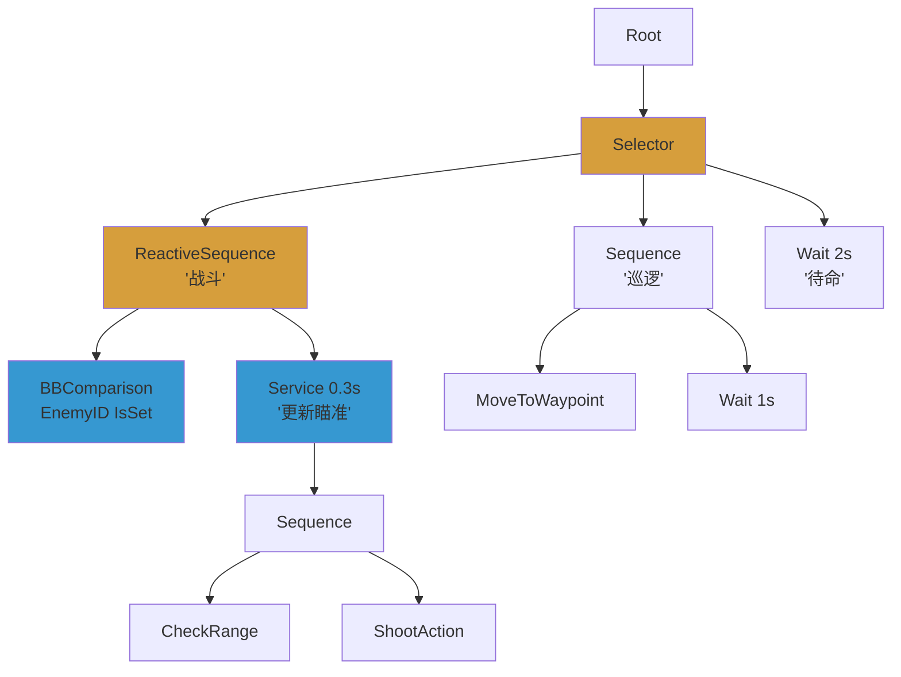

**关键设计：**

- `ReactiveSequence` 用于战斗 → 每帧重新评估 "HasEnemy"
- `ServiceNode` 每 0.3 秒更新瞄准方向，不阻塞攻击
- `BBComparisonNode` 使用 `IsSet` 检查目标是否存在

### 开放世界 RPG

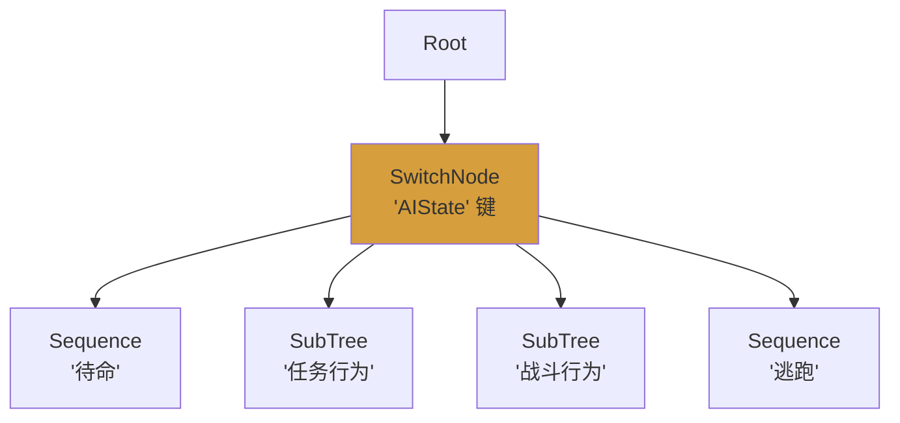

**关键设计：**

- `SwitchNode` 由黑板 int "AIState" 驱动 → 分支到不同行为子树
- `SubTreeNode` 实现模块化、可复用的行为资产（战斗树、任务树等）
- `BTStateMachineComponent` 实现多棵树之间的高级状态转换
- `UtilitySelectorNode` 评估世界状态（饥饿、危险、好奇心）来选择行为

### RTS / 殖民模拟

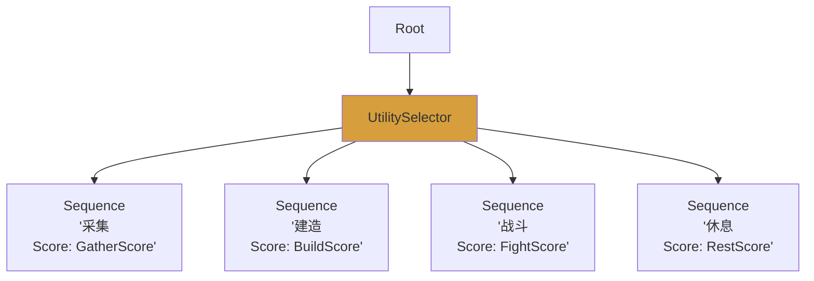

**关键设计：**

- `UtilitySelectorNode` 实现动态优先级 → 外部更新评分（如 "饥饿增加 RestScore"）
- `PriorityManaged` Tick 模式用于数百个单位
- Burst DOD 层用于万级单位的简化平坦树

### 潜行 / 恐怖 AI

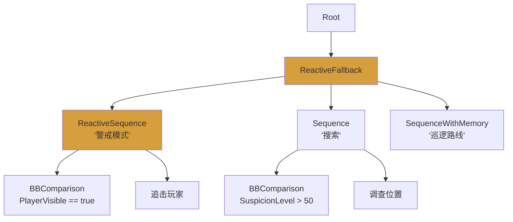

**关键设计：**

- `ReactiveFallbackNode` → 持续重新评估：巡逻中玩家变得可见时，立即切换到警戒
- `SequenceWithMemoryNode` 用于巡逻 → 调查结束后从上次的路点恢复
- `BBComparisonNode` 使用 `>` 运算符进行阈值检查

### Boss 战（多阶段）

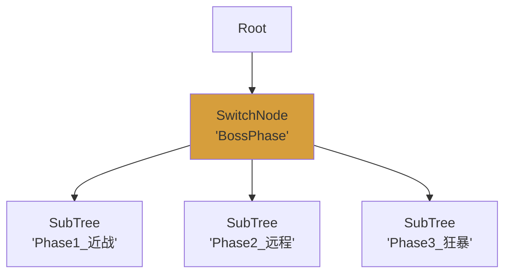

**关键设计：**

- `SwitchNode` 基于 "BossPhase" 黑板键切换阶段
- 每个阶段是单独的 `SubTreeNode` 资产，保持清晰分离
- `BossAIMarker` 组件确保始终 P0 优先级，每帧 Tick
- `ProbabilityBranch` 用于阶段内的多样化攻击模式

---

## 大规模 AI（1,000+ 智能体）

### 优先级 LOD 系统

```mermaid
flowchart TB
    Config["BTLODConfig<br>(ScriptableObject)"]
    Config --> LOD0["LOD 0: 0–10m<br>优先级 0<br>每帧 Tick"]
    Config --> LOD1["LOD 1: 10–30m<br>优先级 1<br>每 2 帧 Tick"]
    Config --> LOD2["LOD 2: 30–50m<br>优先级 2<br>每 4 帧 Tick"]
    Config --> LOD3["LOD 3: 50m+<br>优先级 3<br>每 8 帧 Tick"]

    Manager["BTPriorityTickManagerComponent"]
    Config --> Manager

    Manager --> Bucket0["P0 桶<br>预算: 100/帧"]
    Manager --> Bucket1["P1 桶<br>预算: 50/帧"]
    Manager --> Bucket2["P2 桶<br>预算: 30/帧"]
    Manager --> Bucket3["P3 桶<br>预算: 20/帧"]

    style Config fill:#2a2a3a,stroke:#66a
    style Manager fill:#2a3a2a,stroke:#4a4
```

### 配置步骤

**步骤 1：创建 LOD 配置**

Project 窗口 → **Create → CycloneGames → AI → BT LOD Config**

**步骤 2：配置 AI 智能体**

```csharp
// 在 Inspector 中：设置 TickMode 为 PriorityManaged
// 或在代码中：
runner.SetTickMode(TickMode.PriorityManaged);
```

**步骤 3：优先级标记（可选）**

对于无论距离远近都应高优先级 Tick 的 AI 类型：

| 组件            | 优先级 | Tick 间隔 | 用途      |
| --------------- | ------ | --------- | --------- |
| `BossAIMarker`  | 0      | 1         | Boss 敌人 |
| `EliteAIMarker` | 0      | 1         | 精英单位  |
| `VIPNPCMarker`  | 1      | 2         | 任务 NPC  |

或实现 `IBTPriorityMarker` 接口实现动态优先级：

```csharp
public class CombatantAI : MonoBehaviour, IBTPriorityMarker
{
    private bool _inCombat;
    public int Priority => _inCombat ? 0 : 3;
    public int TickInterval => _inCombat ? 1 : 8;
}
```

**步骤 4：事件优先级提升**

```csharp
// AI 被攻击时提升优先级 2 秒
runner.BoostPriority(2f);
```

### 性能数据

| 智能体数量 | Self Tick | PriorityManaged | 备注             |
| ---------- | --------- | --------------- | ---------------- |
| 100        | ✅ 正常   | 无需使用        | 简单配置         |
| 500        | ⚠️ 较重   | ✅ 推荐         | LOD 节省 CPU     |
| 1,000      | ❌ 掉帧   | ✅ 必须         | 预算上限至关重要 |
| 5,000+     | ❌ 不可能 | ✅ 需 LOD 调优  | 可考虑 Burst DOD |

---

## DOD / Burst — 万级模拟（10,000+）

面向 10,000+ 智能体，系统提供基于 Unity Burst 编译器和 Job System 的**面向数据**层。

### 架构

```mermaid
flowchart TB
    subgraph Shared["共享（只读）"]
        FBT["FlatBehaviorTree<br>NativeArray‹FlatNodeDef›<br>NativeArray‹int› ChildIndices"]
    end

    subgraph PerAgent["每智能体（可变）"]
        State["BTAgentState<br>NativeArray‹byte› NodeStates<br>NativeArray‹int› AuxInts<br>NativeArray‹float› AuxFloats<br>NativeArray‹int/float/byte› BB slots"]
    end

    subgraph Execution["Burst Job"]
        Job["BTTickJob<br>IJobParallelFor<br>@BurstCompile"]
    end

    Shared --> Job
    PerAgent --> Job

    Scheduler["BTTickScheduler<br>AddAgent / RemoveAgent<br>ScheduleTick / CompleteTick"]
    Scheduler --> Shared
    Scheduler --> PerAgent
    Scheduler --> Job

    style Shared fill:#2a2a3a,stroke:#66a
    style PerAgent fill:#2a3a2a,stroke:#4a4
    style Execution fill:#3a2a2a,stroke:#a44
```

**核心概念：**

- **FlatBehaviorTree** = 共享的不可变树定义（享元模式）。每种 BT 模板只创建一次
- **BTAgentState** = 每智能体的可变执行状态（SoA NativeArrays）
- **BTTickJob** = Burst 编译的 `IJobParallelFor` → 并行处理数千智能体
- **FlatTreeCompiler** = 将托管 RuntimeBehaviorTree → 平坦 NativeArray 表示

### DOD 支持的节点类型

| 组合节点         | 装饰节点              | 叶子节点              |
| ---------------- | --------------------- | --------------------- |
| Sequence         | Inverter              | ActionSlot (外部回调) |
| Selector         | Repeater              | BlackboardCondition   |
| Parallel         | Succeeder             | WaitTicks             |
| ReactiveSequence | ForceFailure          |                       |
| ReactiveSelector | Retry, Timeout, Delay |                       |
|                  | RunOnce, CoolDown     |                       |

### 使用方法

```csharp
// 1. 从 RuntimeBehaviorTree 编译平坦树
FlatBehaviorTree flatTree = FlatTreeCompiler.Compile(runtimeTree);

// 2. 创建调度器
var scheduler = new BTTickScheduler(flatTree, initialCapacity: 1024, bbSlotCount: 8);

// 3. 添加智能体
int agentId = scheduler.AddAgent(tickInterval: 2);

// 4. 设置智能体黑板值
scheduler.SetBBInt(agentId, slotIndex: 0, value: 100);
scheduler.SetBBFloat(agentId, slotIndex: 1, value: 5.0f);

// 5. 调度 Tick（每帧调用一次）
JobHandle handle = scheduler.ScheduleTick(Time.deltaTime, batchSize: 64);

// 6. 完成并读取结果
scheduler.CompleteTick();
var rootState = scheduler.GetRootState(agentId);
var actionStatus = scheduler.GetActionStatus(agentId, actionId: 0);

// 7. 清理
scheduler.Dispose();
flatTree.Dispose();
```

### 何时用 DOD 还是 Managed

| 判断标准         | 使用 Managed Tick | 使用 Burst DOD               |
| ---------------- | ----------------- | ---------------------------- |
| 智能体数量       | < 5,000           | 5,000 → 100,000+             |
| 树复杂度         | 任意              | 简单到中等（仅支持上表节点） |
| 需要自定义行为   | 是（C# 代码）     | 外部 Action Slot 回调        |
| 需要 object 黑板 | 是                | 否（仅 int/float/bool）      |

---

## 多人网络同步

系统提供三种多人同步模式。

### 架构

```mermaid
flowchart LR
    subgraph Server["服务端"]
        STree["RuntimeBehaviorTree"]
        SBB["RuntimeBlackboard"]
    end

    subgraph Network["网络"]
        Snap["完整快照<br>(CaptureSnapshot)"]
        Delta["增量补丁<br>(BTBlackboardDelta)"]
        Hash["一致性校验<br>(ComputeHash)"]
    end

    subgraph Client["客户端"]
        CTree["RuntimeBehaviorTree"]
        CBB["RuntimeBlackboard"]
    end

    SBB --> Snap --> CBB
    SBB --> Delta --> CBB
    SBB --> Hash
    CBB --> Hash

    style Server fill:#2a3a2a,stroke:#4a4
    style Client fill:#2a2a3a,stroke:#66a
    style Network fill:#3a2a2a,stroke:#a44
```

### 模式 1：服务端权威快照

完整状态传输。服务端序列化整个黑板 + 树状态 → 客户端应用。

```csharp
// 服务端
var snapshot = BTNetworkSync.CaptureSnapshot(serverTree);   // → BTStateSnapshot
byte[] data = BTNetworkSync.SerializeSnapshot(snapshot);     // → byte[] 用于网络传输
SendToClient(data);

// 客户端
var snapshot = BTNetworkSync.DeserializeSnapshot(data);
BTNetworkSync.ApplyBlackboardSnapshot(clientTree, snapshot); // 恢复黑板状态
```

### 模式 2：客户端预测 + 哈希校验

客户端运行本地副本，服务端发送哈希校验。不一致时 → 全量重同步。

```csharp
// 服务端每帧发送黑板哈希
uint serverHash = serverBlackboard.ComputeHash();
SendToClient(serverHash);

// 客户端检测不同步
if (BTNetworkSync.CheckDesync(clientTree, serverHash))
{
    // 哈希不匹配 → 请求全量重同步
    var snapshot = BTNetworkSync.CaptureSnapshot(serverTree);
    BTNetworkSync.ApplyBlackboardSnapshot(clientTree, snapshot);
}
```

### 模式 3：增量黑板同步

仅传输发生变化的键。使用池化 `MemoryStream` 实现稳态零分配。

```csharp
// 初始化：注册需要追踪的键（仅一次）
var delta = new BTBlackboardDelta();
delta.TrackKey("Health");
delta.TrackKey("Position");
delta.TrackKey("AlertLevel");

// 服务端：刷新自上次同步以来的变化
byte[] patch = delta.Flush(serverBlackboard);
if (patch != null && patch.Length > 0)
    SendToClients(patch);

// 客户端：应用增量
BTBlackboardDelta.Apply(clientBlackboard, patch);
```

### 确定性随机

为保证网络可复现性，使用 `BTDeterministic.DeterministicRNG`：

```csharp
var rng = new BTDeterministic.DeterministicRNG(seed: 42);
int index = rng.NextInt(0, 5); // 相同种子在服务端和客户端产生相同结果
```

---

## 进阶用法

### SubTree（子树）组合

将大型行为树拆分为可复用的模块：

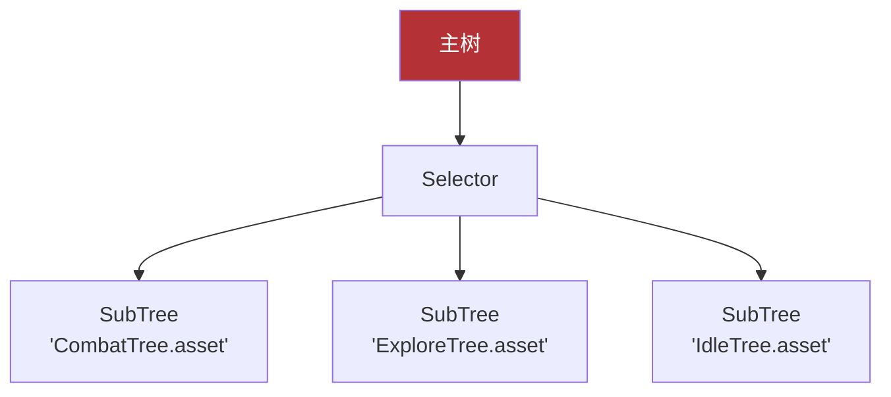

SubTree 端口映射将父黑板键映射到子黑板键：

```
父 "EnemyPosition" → 子 "TargetPos"
父 "PlayerHealth"   → 子 "HP"
```

子树在独立的作用域黑板上运行，该黑板从父级继承。

### 行为树 + 状态机

使用 `BTStateMachineComponent` 实现多棵行为树之间的高级状态转换：

```csharp
// 在 Inspector 中定义状态：
// 状态 "Patrol"  → PatrolTree.asset
// 状态 "Combat"  → CombatTree.asset
// 状态 "Retreat" → RetreatTree.asset

// 在树内使用 BTChangeNode 触发转换：
// 或编程方式：
stateMachine.SetState("Combat");
```

### 条件中止 (Conditional Abort)

当条件变化时中断正在运行的行为：

| 中止类型        | 行为                           |
| --------------- | ------------------------------ |
| `None`          | 不中断                         |
| `Self`          | 条件变化时中止自身子树         |
| `LowerPriority` | 条件成立时中止低优先级兄弟节点 |
| `Both`          | Self + LowerPriority 组合      |

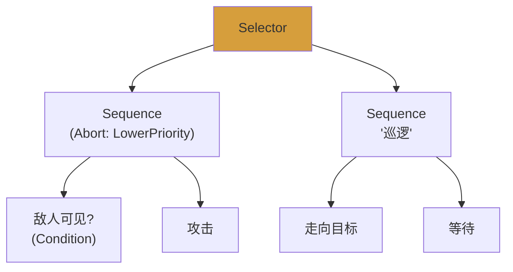

当巡逻正在运行时如果 `EnemyVisible` 变为 true，`LowerPriority` 中止巡逻并切换到攻击。

### 事件驱动执行

节点可通过唤醒信号请求立即重新 Tick：

```csharp
// 在自定义 RuntimeNode 中
protected override RuntimeState OnRun(RuntimeBlackboard bb)
{
    if (significantEventOccurred)
    {
        EmitWakeUpSignal(); // 即使 LOD 说 "跳过" 也触发立即 Tick
    }
    return RuntimeState.Running;
}
```

外部系统也可以直接唤醒树：

```csharp
// 例如感知、受击、网络消息或事件总线回调
runner.WakeUp(boostedTicks: 2);
```

在 `PriorityManaged` 模式下，唤醒请求会先按增强优先级/间隔提升，再进入常规 LOD 流程。

### 开放世界 → 大地图优化

面向拥有数千 NPC 的开放世界游戏：

1. **距离 LOD** → 远处 NPC 降低 Tick 频率（每 4–8 帧）
2. **优先级标记** → 任务相关 NPC 始终全速 Tick
3. **分组覆盖** → 小队/阵营可共享固定优先级与 Tick 间隔
4. **区块激活** → 仅为已加载区块激活 `BTRunnerComponent`
5. **SubTree 共享** → 公共行为树以资产形式共享，按实例编译
6. **BTTreePool** → 模板池化，实现类 ECS 的批量实例化：

```csharp
// 创建池并注册模板（仅一次）
var pool = new BTTreePool();
int guardTemplate = pool.RegisterTemplate(guardTreeAsset); // → 模板索引

// 分配实例 O(1) — 每个实例拥有独立的节点图和黑板
int instanceId = pool.Allocate(guardTemplate);
RuntimeBehaviorTree instance = pool.GetInstance(instanceId);

// Tick 单个实例，或批量 Tick 所有活跃实例
pool.Tick(instanceId);
pool.TickAll();

// 释放回池 O(1)
pool.Release(instanceId);
```

分组提供器示例：

```csharp
public class SquadGroupProvider : MonoBehaviour, IBTAgentGroupProvider
{
    public int GroupId => 7;
    public int GroupPriority => 1;
    public int GroupTickInterval => 2;
}
```

---

## 编辑器可视化

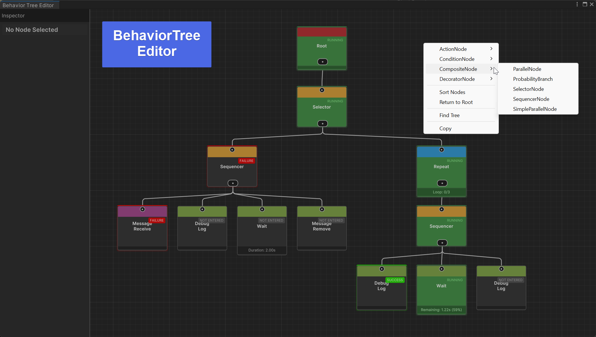

### 功能

| 功能             | 说明                                                                  |
| ---------------- | --------------------------------------------------------------------- |
| **状态着色**     | 绿色光晕 = 运行中，绿色边框 = 成功，红色边框 = 失败                   |
| **动画边线**     | 流动粒子沿贝塞尔曲线展示数据流方向                                    |
| **进度条**       | WaitNode 实时显示倒计时和剩余秒数                                     |
| **信息标签**     | Sequencer 显示 "3/5"，Repeat 显示 "Count: 7"，BBComparison 显示 "✓ ✗" |
| **状态标签**     | 每个节点显示 "RUNNING" / "SUCCESS" / "FAILURE" 覆盖层                 |
| **边线状态颜色** | 运行中边线绿色发光，成功边线亮绿，失败边线红色                        |
| **复制/粘贴**    | 选中节点 → 右键 → Copy/Paste                                          |
| **自动排列**     | 右键 → Sort Nodes 按层级排列树                                        |
| **Alt+点击**     | Alt+点击边线删除连接                                                  |
| **检查器面板**   | 左侧面板通过 IMGUI 显示选中节点的属性                                 |
| **编辑器 0GC**   | FieldInfo 缓存、StringBuilder 复用、10Hz 节流                         |

### 打开编辑器

- **菜单**：Tools → CycloneGames → Behavior Tree Editor
- **双击**任意 BehaviorTree 资产
- **选中**挂载 BTRunnerComponent 的 GameObject

---

## 优化指南

### 零 GC 最佳实践

| ✅ 推荐                                                          | ❌ 避免                                                  |
| ---------------------------------------------------------------- | -------------------------------------------------------- |
| `blackboard.GetInt(key)`                                         | `(int)blackboard.Get("key")`（装箱）                     |
| 预哈希键：`static readonly int k = Animator.StringToHash("Key")` | 每帧哈希：在 OnRun 中调用 `Animator.StringToHash("Key")` |
| 在 `OnAwake()` 中缓存组件引用                                    | 在 `OnRun()` 中调用 `GetComponent<T>()`                  |
| 使用 `RuntimeStatefulActionNode` 模式                            | 手动 `_wasRunning` 标志跟踪                              |
| `sqrMagnitude` 距离检查                                          | `Vector3.Distance()`（含开方）                           |

### 扩容建议

| 场景                       | 推荐方案                                     |
| -------------------------- | -------------------------------------------- |
| < 100 智能体，复杂树       | `TickMode.Self` → 最简配置                   |
| 100–500 智能体，混合复杂度 | `TickMode.Managed` + 预算上限                |
| 500–5,000 智能体           | `TickMode.PriorityManaged` + LOD 配置        |
| 5,000–100,000 简单智能体   | Burst DOD（`BTTickScheduler` + `BTTickJob`） |
| 复杂 + 简单智能体混合      | 关键 NPC 用 PriorityManaged + 群众用 DOD     |

### 内存优化

- `RuntimeCompositeNode.Seal()` 冻结子列表为数组，释放列表内存
- `BTTreePool` 的编译树实例池化，O(1) 空闲列表回收
- `BTDistanceLODProvider` 使用并行数组（非 Dictionary 遍历）实现 0GC LOD 更新
- `RuntimeBlackboard` 实现 `IDisposable` → 树停止时自动释放 `ReaderWriterLockSlim`

### 线程安全

- `RuntimeBlackboard.EnableThreadSafety()` → 按需启用 `ReaderWriterLockSlim` 多线程访问
- 观察者通知在写锁**外部**触发 → 回调可安全读写黑板
- `BTTickJob` 使用 Burst `IJobParallelFor` → NativeArray 保证线程隔离
- `RuntimeBehaviorTree` 中的 `volatile _wakeUpRequested` → 支持跨线程安全唤醒

---

## API 参考

### 核心类型

```csharp
// 运行时状态（0GC 执行层）
public enum RuntimeState { NotEntered, Running, Success, Failure }

// 编辑器状态（SO 层）
public enum BTState { NOT_ENTERED, RUNNING, SUCCESS, FAILURE }

// Tick 模式
public enum TickMode { Self, Managed, PriorityManaged, Manual }

// 条件中止类型
public enum ConditionalAbortType { NONE, SELF, LOWER_PRIORITY, BOTH }

// Benchmark Runner 模式
public enum BehaviorTreeBenchmarkRunnerMode
{
    Single, RecommendedMatrix, FullMatrix, PriorityComparison
}
```

### 运行时时间服务

```csharp
public interface IRuntimeBTTimeProvider
{
    double TimeAsDouble { get; }
    double UnscaledTimeAsDouble { get; }
}

public static class RuntimeBTTime
{
    public static double GetTime(RuntimeBlackboard blackboard, bool useUnscaledTime);
    public static double GetUnityTime(bool useUnscaledTime);
    public static double GetUnityDeltaTime(bool useUnscaledTime);
}
```

### RuntimeBehaviorTree（事件驱动）

```csharp
public class RuntimeBehaviorTree : IRuntimeBTContext
{
    bool HasWakeUpRequest { get; }
    int WakeUpTickBudget { get; }

    void WakeUp(int boostedTicks = 1);
    bool ConsumeWakeUp();
    bool ShouldTick();
}
```

### 基于分组的 LOD 覆盖

```csharp
public interface IBTAgentGroupProvider
{
    int GroupId { get; }
    int GroupPriority { get; }
    int GroupTickInterval { get; }
}
```

### RuntimeBlackboard

```csharp
public class RuntimeBlackboard : IDisposable
{
    // 类型化访问（0GC）
    void SetInt(int key, int value);
    int GetInt(int key, int defaultValue = 0);
    void SetFloat(int key, float value);
    float GetFloat(int key, float defaultValue = 0f);
    void SetBool(int key, bool value);
    bool GetBool(int key, bool defaultValue = false);
    void SetVector3(int key, Vector3 value);
    Vector3 GetVector3(int key, Vector3 defaultValue = default);
    void SetObject(int key, object value);
    T GetObject<T>(int key);

    // TryGet（精确类型探测）
    bool TryGetInt(int key, out int value);
    bool TryGetFloat(int key, out float value);
    bool TryGetBool(int key, out bool value);
    bool TryGetVector3(int key, out Vector3 value);
    bool TryGetObject<T>(int key, out T value) where T : class;

    // 字符串键便捷方法（上述所有方法也接受 string）

    // 存在性与移除
    bool HasKey(int key);
    void Remove(int key);
    void Clear();

    // 变更检测
    ulong GetStamp(int key);

    // 观察者系统
    void AddObserver(int keyHash, BlackboardObserverCallback callback);
    void RemoveObserver(int keyHash, BlackboardObserverCallback callback);
    void AddGlobalObserver(BlackboardObserverCallback callback);
    void RemoveGlobalObserver(BlackboardObserverCallback callback);
    void ClearAllObservers();

    // 线程安全
    void EnableThreadSafety();

    // 序列化（网络）
    void WriteTo(BinaryWriter writer);
    void ReadFrom(BinaryReader reader);
    uint ComputeHash();

    // 层级
    RuntimeBlackboard Parent { get; set; }
    IRuntimeBTContext Context { get; set; }
    T GetContextOwner<T>() where T : class;
    T GetService<T>() where T : class;

    // IDisposable
    void Dispose();
}
```

### RuntimeNode

```csharp
public abstract class RuntimeNode
{
    public RuntimeState State { get; }
    public bool IsStarted { get; }
    public string GUID { get; set; }
    public RuntimeBehaviorTree OwnerTree { get; set; }

    public RuntimeState Run(RuntimeBlackboard blackboard);
    public void Abort(RuntimeBlackboard blackboard);
    public virtual void ResetState();

    protected virtual void OnAwake();
    protected virtual void OnStart(RuntimeBlackboard blackboard);
    protected abstract RuntimeState OnRun(RuntimeBlackboard blackboard);
    protected virtual void OnStop(RuntimeBlackboard blackboard);

    // 前置/后置条件
    public NodeCondition[] PreConditions { get; set; }
    public NodeCondition[] PostConditions { get; set; }

    // 事件驱动
    protected void EmitWakeUpSignal();
}
```

### BTRunnerComponent

```csharp
public class BTRunnerComponent : MonoBehaviour
{
    // 属性
    BehaviorTree Tree { get; }
    RuntimeBehaviorTree RuntimeTree { get; }
    TickMode TickMode { get; }
    bool IsPaused { get; }
    bool IsStopped { get; }

    // 生命周期
    void Play();
    void Pause();
    void Resume();
    void Stop();
    RuntimeState ManualTick();

    // 数据
    void BTSetData(string key, object value);
    void BTSendMessage(string message);
    void BTRemoveData(string key);

    // 配置
    void SetTree(BehaviorTree newTree);
    void SetContext(RuntimeBTContext context);
    void SetServiceResolver(IRuntimeBTServiceResolver resolver);
    void SetTickMode(TickMode mode);
    void SetTickInterval(int interval);
    void BoostPriority(float duration);
    void WakeUp(int boostedTicks = 1);

    // 静态
    static IReadOnlyList<BTRunnerComponent> ActiveRunners { get; }
    event Action OnTreeStopped;
}
```

---
