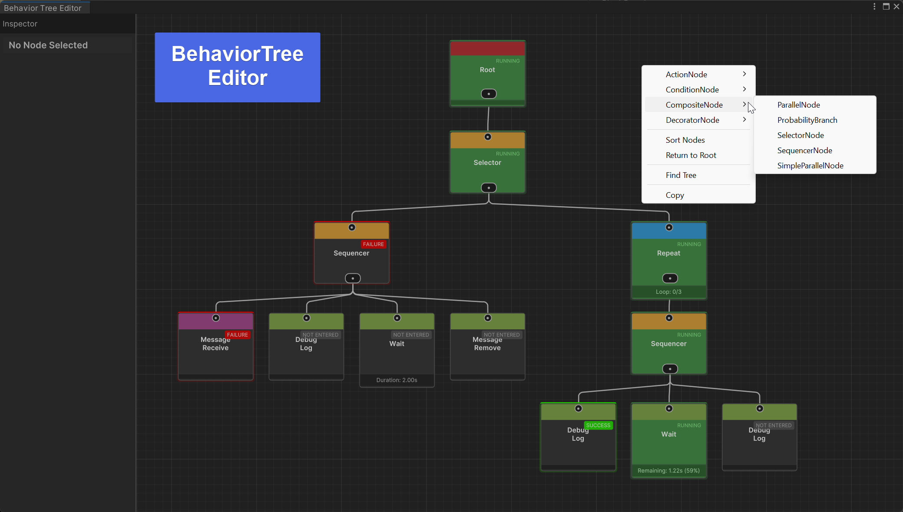

# CycloneGames.BehaviorTree

A high-performance, zero-GC behavior tree system for Unity AI with dual-layer architecture.

<p align="left"><br> English | <a href="README.SCH.md">简体中文</a></p>

## Features

- ✅ **Dual-Layer Architecture**: ScriptableObject authoring + Pure C# runtime for 0GC execution
- ✅ **Component-Based Design**: Use `BTRunnerComponent` for easy setup and lifecycle management
- ✅ **ScriptableObject Trees**: Visual tree authoring with Unity's built-in tools
- ✅ **Hierarchical BlackBoard**: Type-safe data sharing between nodes with parent inheritance
- ✅ **Rich Node Library**: Composite, Decorator, Condition, and Action nodes
- ✅ **DI/IoC Ready**: Dependency injection support for seamless integration
- ✅ **Editor Visualization**: Real-time tree visualization during Play mode
- ✅ **Multi-Platform**: Windows, Mac, Linux, Android, iOS, WebGL, and server-side support

## Architecture

The system uses a **dual-layer architecture** to achieve both ease of use and maximum runtime performance:

```
┌─────────────────────────────────────────────────────────────┐
│                  Editor Time (Authoring)                    │
│  ┌──────────────────────────────────────────────────────┐   │
│  │  ScriptableObject Layer (BTNode, CompositeNode...)   │   │
│  │  • Visual editor drag-and-drop                       │   │
│  │  • Serialized to .asset files                        │   │
│  │  • Supports Undo/Redo                                │   │
│  └──────────────────────────────────────────────────────┘   │
│                           ↓ Compile()                        │
├─────────────────────────────────────────────────────────────┤
│                     Runtime (Execution)                      │
│  ┌──────────────────────────────────────────────────────┐   │
│  │  Pure C# Layer (RuntimeNode, RuntimeBlackboard...)   │   │
│  │  • Zero GC allocations                               │   │
│  │  • No Unity dependency (server-side capable)         │   │
│  │  • Maximum performance                               │   │
│  └──────────────────────────────────────────────────────┘   │
└─────────────────────────────────────────────────────────────┘
```

### Why Dual-Layer?

| Aspect | ScriptableObject Layer | Runtime Layer |
|--------|------------------------|---------------|
| **Purpose** | Editor authoring, serialization | Game execution |
| **GC** | Acceptable (editor only) | **Zero allocations** |
| **Unity Dependency** | Required | Optional |
| **Performance** | Standard | **Optimized** |

When you call `BTRunnerComponent.Play()`, the system **compiles** the ScriptableObject tree into an optimized pure C# runtime tree. This happens once at startup, then all execution uses the zero-GC runtime nodes.

## Installation

### As Unity Package

1. Copy the `CycloneGames.BehaviorTree` folder to your project's `Packages` directory
2. Or add via Package Manager → "Add package from disk" → select `package.json`

### Dependencies

- Unity 2022.3 or later
- [UniTask](https://github.com/Cysharp/UniTask) 2.5.0+

## Quick Start

### 1. Create a Behavior Tree Asset

Right-click in Project window → `Create > CycloneGames > AI > BehaviorTree`

### 2. Design Your Tree

Open the tree asset in Inspector and use the built-in editor to:
- Create root node
- Add composite nodes (Sequence, Selector, Parallel)
- Add decorator nodes (Repeater, Inverter, UntilFail)
- Add action nodes (custom logic)
- Add condition nodes (decision making)



### 3. Attach to GameObject

Add `BTRunnerComponent` to your AI GameObject:

**Option A: In Inspector**
1. Select your AI GameObject
2. Add Component → `BTRunnerComponent`
3. Assign your BehaviorTree asset to the `Behavior Tree` field
4. (Optional) Add initial BlackBoard data in `Initial Objects`
5. Check `Start On Awake` to auto-start the tree

**Option B: From Code**
```csharp
using CycloneGames.BehaviorTree.Runtime;
using CycloneGames.BehaviorTree.Runtime.Components;
using UnityEngine;

public class AIAgent : MonoBehaviour
{
    [SerializeField] private BehaviorTree behaviorTreeAsset;
    private BTRunnerComponent runner;

    void Start()
    {
        // Add and configure runner component
        runner = gameObject.AddComponent<BTRunnerComponent>();
        runner.SetTree(behaviorTreeAsset);
        
        // Set initial BlackBoard data
        runner.BTSetData("TargetPosition", Vector3.zero);
        runner.BTSetData("Speed", 5f);
        
        // Start the tree
        runner.Play();
    }
}
```

**Direct BlackBoard Access** (advanced):
```csharp
// Access BlackBoard directly for typed operations (Zero-GC)
BTRunnerComponent runner = GetComponent<BTRunnerComponent>();
runner.BlackBoard.SetInt("Health", 100);
runner.BlackBoard.SetFloat("Speed", 5.5f);
runner.BlackBoard.SetBool("IsAlive", true);
```

## Core Concepts

### BTRunnerComponent

The **recommended way** to use behavior trees. This MonoBehaviour component manages the lifecycle of a BehaviorTree ScriptableObject.

**Key Features**:
- Automatically compiles tree to optimized runtime representation
- Handles Update loop and tree execution
- Manages BlackBoard data with Inspector support
- Provides Play/Pause/Stop/Resume controls
- Supports hot-swapping trees at runtime

**Inspector Configuration**:
- `Behavior Tree`: The ScriptableObject tree asset to use
- `Start On Awake`: Auto-start tree when component awakens
- `Initial Objects`: Set initial BlackBoard values from Inspector

**Runtime Control**:
```csharp
BTRunnerComponent runner = GetComponent<BTRunnerComponent>();

// Control execution
runner.Play();      // Start/restart tree
runner.Pause();     // Pause execution
runner.Resume();    // Resume from pause
runner.Stop();      // Stop and reset tree

// Set BlackBoard data
runner.BTSetData("Key", value);
runner.BTSendMessage("EventName");
runner.BTRemoveData("Key");  // Remove data from blackboard

// Access tree/blackboard directly (advanced)
BehaviorTree tree = runner.Tree;
BlackBoard bb = runner.BlackBoard;
```

### Behavior Tree (ScriptableObject)

The tree asset created in the Project window. This is a **template** that gets compiled by `BTRunnerComponent` into an optimized runtime tree.

**Important**: While you *can* use `BehaviorTree` directly in code, it's **not recommended** for most use cases. Use `BTRunnerComponent` instead for automatic lifecycle management.

### BlackBoard

Type-safe data storage shared between nodes with hierarchical inheritance.

**Zero-GC Typed Access**:
```csharp
// Specialized dictionaries avoid boxing
blackBoard.SetInt("Health", 100);
blackBoard.SetFloat("Speed", 5.5f);
blackBoard.SetBool("IsAlive", true);
blackBoard.SetVector3("Position", transform.position);

int health = blackBoard.GetInt("Health");
float speed = blackBoard.GetFloat("Speed", defaultValue: 1f);
```

**Generic Access** (for reference types):
```csharp
blackBoard.Set("Target", targetTransform);
Transform target = blackBoard.Get<Transform>("Target");
```

**Remove Data**:
```csharp
blackBoard.Remove("Key");  // Remove specific key
blackBoard.Clear();        // Clear all data
```

### Node Types

#### Composite Nodes
Control child execution flow:
- **SequenceNode**: Execute children in order, fail on first failure
- **SelectorNode**: Execute children until one succeeds
- **ParallelNode**: Execute all children simultaneously
- **RandomSelectorNode**: Select random child to execute

#### Decorator Nodes
Modify child behavior:
- **RepeaterNode**: Repeat child N times or infinitely
- **InverterNode**: Invert child result (success ↔ failure)
- **UntilFailNode**: Repeat child until it fails
- **TimeoutNode**: Fail child if it exceeds time limit
- **CooldownNode**: Prevent execution until cooldown expires

#### Action Nodes
Perform actual behaviors:
- Custom logic implementation
- Can return Success, Failure, or Running
- Support async execution with UniTask

#### Condition Nodes
Make decisions:
- Evaluate blackboard data
- Return Success or Failure (never Running)
- Used for branching logic

## Runtime Core (Advanced)

For users who need to understand the internal architecture or build custom runners.

### RuntimeNode

The base class for all runtime nodes. Designed for **zero-GC execution**.

```csharp
public abstract class RuntimeNode
{
    public RuntimeState State { get; protected set; }
    public bool IsStarted { get; private set; }
    public string GUID { get; set; }  // Maps back to BTNode for debugging

    public RuntimeState Run(RuntimeBlackboard blackboard);
    protected virtual void OnStart(RuntimeBlackboard blackboard);
    protected abstract RuntimeState OnRun(RuntimeBlackboard blackboard);
    protected virtual void OnStop(RuntimeBlackboard blackboard);
    public void Abort(RuntimeBlackboard blackboard);
}
```

**Key Design Points**:
- State machine: `NotEntered → Running → Success/Failure`
- Lifecycle hooks: `OnStart` / `OnRun` / `OnStop`
- No allocations during execution

### GUID Purpose

Each node has a GUID that serves two purposes:
1. **Editor Debugging**: Maps RuntimeNode back to BTNode for state visualization
2. **Runtime Lookup**: `RuntimeBehaviorTree.GetNodeByGUID()` for programmatic access

### RuntimeBlackboard

Optimized blackboard using **int hash keys** instead of strings:

```csharp
// Int-key access (maximum performance, 0GC)
int keyHash = Animator.StringToHash("Health");
blackboard.SetInt(keyHash, 100);
int health = blackboard.GetInt(keyHash);

// String-key convenience (slightly slower, still 0GC)
blackboard.SetInt("Health", 100);
int health = blackboard.GetInt("Health");
```

**Why Int Keys?**
- Dictionary lookup with int keys is faster than string keys
- No string allocations during runtime
- `Animator.StringToHash` is cached internally

## Creating Custom Nodes

### Action Node Example

```csharp
using CycloneGames.BehaviorTree.Runtime.Attributes;
using CycloneGames.BehaviorTree.Runtime.Data;
using CycloneGames.BehaviorTree.Runtime.Interfaces;
using CycloneGames.BehaviorTree.Runtime.Nodes.Actions;
using UnityEngine;

[BTInfo("Custom/Move To Target", "Moves agent toward target position")]
public class MoveToTargetNode : ActionNode
{
    [SerializeField] private string targetKey = "TargetPosition";
    [SerializeField] private string speedKey = "Speed";
    [SerializeField] private float arrivalRadius = 0.5f;

    protected override BTState OnRun(IBlackBoard blackBoard)
    {
        Vector3 target = blackBoard.GetVector3(targetKey);
        float speed = blackBoard.GetFloat(speedKey, 1f);
        
        Transform agentTransform = Tree.Owner.transform;
        float distance = Vector3.Distance(agentTransform.position, target);
        
        if (distance <= arrivalRadius)
        {
            return BTState.SUCCESS;
        }
        
        Vector3 direction = (target - agentTransform.position).normalized;
        agentTransform.position += direction * speed * Time.deltaTime;
        
        return BTState.RUNNING;
    }
}
```

### Condition Node Example

```csharp
using CycloneGames.BehaviorTree.Runtime.Attributes;
using CycloneGames.BehaviorTree.Runtime.Data;
using CycloneGames.BehaviorTree.Runtime.Interfaces;
using CycloneGames.BehaviorTree.Runtime.Conditions;

[BTInfo("Custom/Check Health", "Check if health is above threshold")]
public class CheckHealthNode : ConditionNode
{
    [SerializeField] private string healthKey = "Health";
    [SerializeField] private int threshold = 50;

    protected override bool Evaluate(IBlackBoard blackBoard)
    {
        int health = blackBoard.GetInt(healthKey);
        return health >= threshold;
    }
}
```

## Performance Optimization

### Zero-GC Guarantees

| Operation | GC Allocation |
|-----------|---------------|
| Tree tick (per frame) | **0 bytes** |
| BlackBoard typed access | **0 bytes** |
| Node state transitions | **0 bytes** |
| Tree compilation | One-time only |

### Best Practices

1. **Use typed BlackBoard methods** for value types:
   ```csharp
   // Good - Zero GC
   int value = blackBoard.GetInt("Key");
   
   // Bad - Boxing allocation
   int value = (int)blackBoard.Get("Key");
   ```

2. **Cache references in OnAwake/OnStart**:
   ```csharp
   private Transform cachedTransform;
   
   protected override void OnAwake()
   {
       cachedTransform = Tree.Owner.transform;
   }
   ```

3. **Avoid allocations in OnRun**:
   - Don't create new objects
   - Don't use LINQ
   - Don't concatenate strings

## Dependency Injection

Inject services into nodes using your DI container:

```csharp
// In your composition root
behaviorTree.Inject(container);

// In your custom node
public class ServiceDependentNode : ActionNode
{
    private IPathfindingService pathfinder;
    
    public override void Inject(object container)
    {
        // VContainer example
        if (container is IObjectResolver resolver)
        {
            pathfinder = resolver.Resolve<IPathfindingService>();
        }
    }
}
```

## API Reference

### BTState Enum

```csharp
public enum BTState
{
    SUCCESS,    // Node completed successfully
    FAILURE,    // Node failed
    RUNNING,    // Node is still executing
    NOT_ENTERED // Node hasn't started yet
}
```

### RuntimeState Enum (Runtime Layer)

```csharp
public enum RuntimeState
{
    Success,
    Failure,
    Running,
    NotEntered
}
```

### IBlackBoard Interface

```csharp
public interface IBlackBoard
{
    // Generic access
    object Get(string key);
    T Get<T>(string key);
    void Set(string key, object value);
    
    // Zero-GC typed access
    int GetInt(string key, int defaultValue = 0);
    void SetInt(string key, int value);
    float GetFloat(string key, float defaultValue = 0f);
    void SetFloat(string key, float value);
    bool GetBool(string key, bool defaultValue = false);
    void SetBool(string key, bool value);
    Vector3 GetVector3(string key, Vector3 defaultValue = default);
    void SetVector3(string key, Vector3 value);
    
    // Utilities
    bool Contains(string key);
    void Remove(string key);
    void Clear();
}
```