# CycloneGames.BehaviorTree

[English | 简体中文](README.SCH.md)

A behavior tree framework for Unity with ScriptableObject authoring, code-first runtime construction, managed scheduling, optional Burst/DOD execution, transport-neutral synchronization, and GraphView tooling.

## Table of Contents

- [Overview](#overview)
- [Architecture](#architecture)
- [Quick Start](#quick-start)
- [Core Concepts](#core-concepts)
- [Usage Guide](#usage-guide)
- [Advanced Topics](#advanced-topics)
- [Common Scenarios](#common-scenarios)
- [Performance and Memory](#performance-and-memory)
- [Troubleshooting](#troubleshooting)

## Overview

A behavior tree answers one question: given the current world state in a blackboard, what should this agent do next? CycloneGames.BehaviorTree makes that decision through composable nodes — sequences, selectors, decorators, and leaf actions — that tick every frame until they succeed or fail.

The framework separates authoring from execution. ScriptableObject assets are designed in a GraphView editor; `Compile()` produces pure C# runtime nodes. The runtime path supports self-tick, centrally budgeted managed tick, priority/LOD scheduling, and an optional Burst/DOD parallel tier.

### Key Features

| Category | Highlights |
| --- | --- |
| **Architecture** | Dual-layer (SO authoring → pure C# runtime) plus `RuntimeBehaviorTreeBuilder` for code-first trees |
| **Node Library** | Sequence, Selector, SelectorRandom, Parallel, Reactive, Utility AI, Service, SubTree, ProbabilityBranch, and more |
| **Scheduling** | Self Tick, managed round-robin with budget cap, priority/LOD scheduling, optional Burst `IJobParallelFor` |
| **Networking** | Bounded snapshots, state hashes, blackboard deltas; transport and authority remain external |
| **Blackboard** | Typed dictionaries, int-key hashing, parent chain, observer notifications, stamps, opt-in locking |
| **Time API** | `double`-precision runtime time with `IRuntimeBTTimeProvider` and Unity fallback |
| **Editor** | GraphView with animated flowing-dot edges, state coloring, progress bars, runtime visualization |
| **DI/IoC** | `IRuntimeBTServiceResolver` compatible with VContainer, Zenject, or custom containers |

### Dependencies

- Unity 2022.3 LTS+
- `com.cyclone-games.hash` (required) — deterministic blackboard and state hashing
- Burst + Collections + Mathematics (optional) — for DOD execution assembly

## Architecture

### Dual-Layer Design


```mermaid
flowchart TB
    subgraph EditorTime["Editor Time"]
        SO["ScriptableObject Layer<br>BTNode · CompositeNode · DecoratorNode"]
        SOFeature["• Visual GraphView editor<br>• Serialized .asset files<br>• Undo/Redo support"]
    end

    subgraph RuntimeExec["Runtime"]
        RT["Managed Runtime Layer<br>RuntimeNode · RuntimeBlackboard"]
        RTFeature["• Typed hot-path data<br>• Explicit lifecycle<br>• Optional Burst DOD tier"]
    end

    SO -->|"BehaviorTree.Compile()"| RT

    style EditorTime fill:#2d2d3d,stroke:#666
    style RuntimeExec fill:#1a3a1a,stroke:#4a4
```

| Aspect | ScriptableObject Layer | Runtime Layer |
| --- | --- | --- |
| **Purpose** | Authoring, serialization, editor UI | Game execution |
| **Allocation policy** | Editor authoring may allocate | Reuse runtime state; profile hot paths |
| **Unity Dependency** | Required (ScriptableObject, SerializeField) | Small bridge (`Animator.StringToHash`, `Vector3`, Time fallback) |
| **When** | Design time + Compile() call | Every frame |

### Execution Models

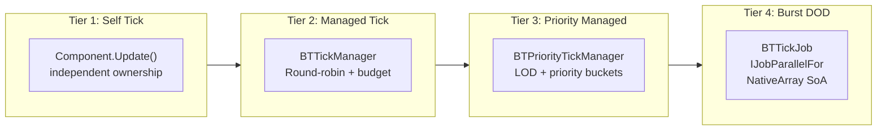
```mermaid
flowchart LR
    subgraph Tier1["Tier 1: Self Tick"]
        A1["Component.Update()<br>independent ownership"]
    end
    subgraph Tier2["Tier 2: Managed Tick"]
        A2["BTTickManager<br>Round-robin + budget"]
    end
    subgraph Tier3["Tier 3: Priority Managed"]
        A3["BTPriorityTickManager<br>LOD + priority buckets"]
    end
    subgraph Tier4["Tier 4: Burst DOD"]
        A4["BTTickJob<br>IJobParallelFor<br>NativeArray SoA"]
    end
    Tier1 --> Tier2 --> Tier3 --> Tier4
```

## Quick Start

### 5-Minute Demo

**Step 1:** Create a Behavior Tree asset — Project window → **Create → CycloneGames → AI → BehaviorTree**. Name it `PatrolTree`.

**Step 2:** Open the editor — double-click the asset or go to **Tools → CycloneGames → Behavior Tree Editor**.

**Step 3:** Build a patrol tree:

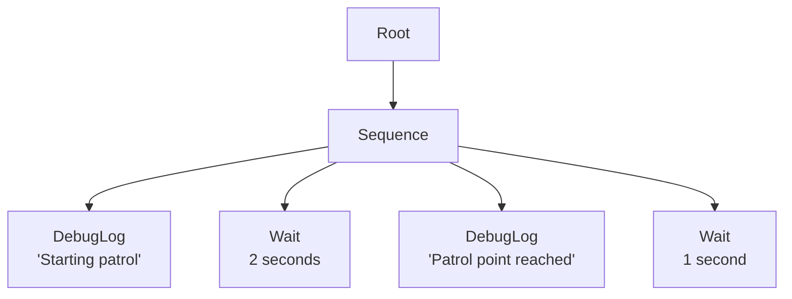
```mermaid
flowchart TB
    Root["Root"] --> Seq["Sequence"]
    Seq --> Log1["DebugLog<br>'Starting patrol'"]
    Seq --> Wait1["Wait<br>2 seconds"]
    Seq --> Log2["DebugLog<br>'Patrol point reached'"]
    Seq --> Wait2["Wait<br>1 second"]
```

Right-click to add: CompositeNode → Base → SequencerNode, ActionNode → Base → DebugLogNode, ActionNode → Base → WaitNode.

**Step 4:** Attach to a GameObject — Add Component → BTRunnerComponent, drag the asset in, check **Start On Awake**, press Play.

**Step 5:** Observe — Green glow = Running, green border = Success, red border = Failure, flowing dots on edges, progress bar on WaitNode.

### Code-First Runtime Trees

```csharp
using CycloneGames.BehaviorTree.Runtime.Core;

static readonly int HasTargetKey = Animator.StringToHash("HasTarget");
static readonly int AttackCountKey = Animator.StringToHash("AttackCount");

RuntimeBehaviorTree tree = new RuntimeBehaviorTreeBuilder(ownerGameObject)
    .WithServiceResolver(new RuntimeBTContext.ServiceProviderResolver(serviceProvider))
    .WithTickInterval(1)
    .Selector()
        .Sequence()
            .Condition(bb => bb.GetBool(HasTargetKey), "HasTarget")
            .CoolDown(0.75f)
                .Action(bb =>
                {
                    bb.SetInt(AttackCountKey, bb.GetInt(AttackCountKey) + 1);
                    return RuntimeState.Success;
                }, "Attack")
            .End()
        .End()
        .Action(bb => RuntimeState.Success, "Idle")
    .End()
    .Build();

tree.Play();
tree.Tick();
```

For reusable gameplay rules, use command and strategy objects:

```csharp
public sealed class AttackCommand : IRuntimeBTCommand
{
    public RuntimeState Execute(RuntimeBlackboard blackboard)
    {
        return RuntimeState.Success;
    }
}

public sealed class HasTargetCondition : IRuntimeBTConditionStrategy
{
    public bool Evaluate(RuntimeBlackboard blackboard)
    {
        return blackboard.GetBool(HasTargetKey);
    }
}

RuntimeBehaviorTree tree = new RuntimeBehaviorTreeBuilder()
    .Sequence()
        .Condition(new HasTargetCondition(), "HasTarget")
        .Command(new AttackCommand(), "Attack")
    .End()
    .Build();
```

## Core Concepts

### BTRunnerComponent

The primary MonoBehaviour for running behavior trees.

```csharp
BTRunnerComponent runner = GetComponent<BTRunnerComponent>();

// Lifecycle
runner.Play();       // Start or restart
runner.Pause();      // Pause execution
runner.Resume();     // Resume from paused
runner.Stop();       // Stop and reset

// Blackboard data
runner.BTSetData("Health", 100);
runner.BTSetData("Speed", 5.5f);
runner.BTSendMessage("EnemySpotted");

// Hot-swap tree at runtime
runner.SetTree(anotherBehaviorTreeAsset);

// Tick mode
runner.SetTickMode(TickMode.PriorityManaged);

// Event-driven wake-up
runner.WakeUp(boostedTicks: 2);
```

**Tick Modes:**

| Mode | Use Case | How It Works |
| --- | --- | --- |
| `Self` | Independent ownership | Each component ticks in its own `Update()` |
| `Managed` | Simple batching | `BTTickManager` round-robin with budget cap |
| `PriorityManaged` | Priority and LOD policy | Distance LOD + 8 priority buckets + per-bucket budget |
| `Manual` | Full control | Call `runner.ManualTick()` yourself |

### Blackboard

The blackboard is a typed key-value store shared by all nodes. Separate dictionaries avoid boxing per type.

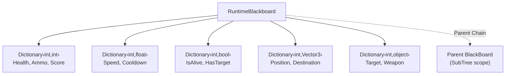
```mermaid
flowchart TB
    BB["RuntimeBlackboard"]
    BB --> IntDict["Dictionary‹int,int›<br>Health, Ammo, Score"]
    BB --> FloatDict["Dictionary‹int,float›<br>Speed, Cooldown"]
    BB --> BoolDict["Dictionary‹int,bool›<br>IsAlive, HasTarget"]
    BB --> VecDict["Dictionary‹int,Vector3›<br>Position, Destination"]
    BB --> ObjDict["Dictionary‹int,object›<br>Target, Weapon"]
    BB -.->|"Parent Chain"| ParentBB["Parent BlackBoard<br>(SubTree scope)"]
```

**Key addressing:**

```csharp
// String keys (convenient, hashed via Animator.StringToHash)
blackboard.SetInt("Health", 100);

// Int keys (pre-hash during initialization)
static readonly int k_Health = Animator.StringToHash("Health");
blackboard.SetInt(k_Health, 100);
```

**Observers** (push-based notifications):

```csharp
blackboard.AddObserver("Health", (keyHash, bb) => {
    int hp = bb.GetInt(keyHash);
    if (hp <= 0) OnDeath();
});
```

**Change detection** (stamp-based polling):

```csharp
ulong stamp = blackboard.GetStamp("EnemyCount");
if (stamp != lastStamp) { /* EnemyCount changed */ }
```

**Thread safety** (opt-in):

```csharp
blackboard.EnableThreadSafety(); // allocates ReaderWriterLockSlim once
```

### Node Lifecycle

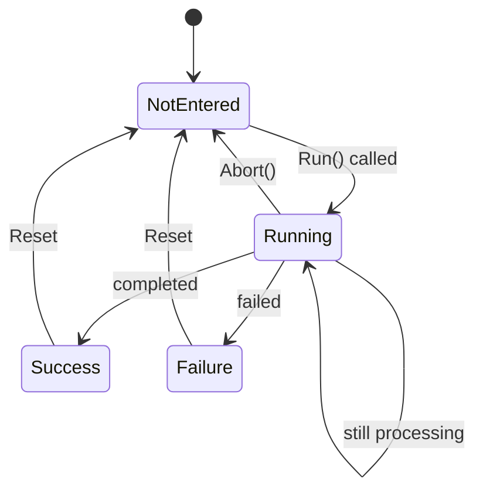
```mermaid
stateDiagram-v2
    [*] --> NotEntered
    NotEntered --> Running : Run() called
    Running --> Running : still processing
    Running --> Success : completed
    Running --> Failure : failed
    Success --> NotEntered : Reset
    Failure --> NotEntered : Reset
    Running --> NotEntered : Abort()
```

| Hook | When | Use For |
| --- | --- | --- |
| `OnAwake()` | Once at compile time | Cache references |
| `OnStart()` | Each time node begins Running | Initialize per-run state |
| `OnRun()` | Every tick while Running | Core logic — return `Success`, `Failure`, or `Running` |
| `OnStop()` | Node finishes or is aborted | Cleanup |
| `ResetState()` | Parent restarts children | Reset counters |

### Runtime Time API

Time-sensitive nodes use `double`-precision via `RuntimeBTTime.GetTime(...)`:

```csharp
public interface IRuntimeBTTimeProvider
{
    double TimeAsDouble { get; }
    double UnscaledTimeAsDouble { get; }
}
```

Resolution order: 1) `IRuntimeBTTimeProvider` from service resolver, 2) `UnityEngine.Time`, 3) DateTime fallback. DOD/Burst jobs use `float deltaTime` for throughput.

## Usage Guide

### Composite Nodes

Composite nodes control execution flow of their children.

#### SequencerNode

Executes children left to right. Returns `Success` if **all** succeed; returns `Failure` as soon as any child fails.

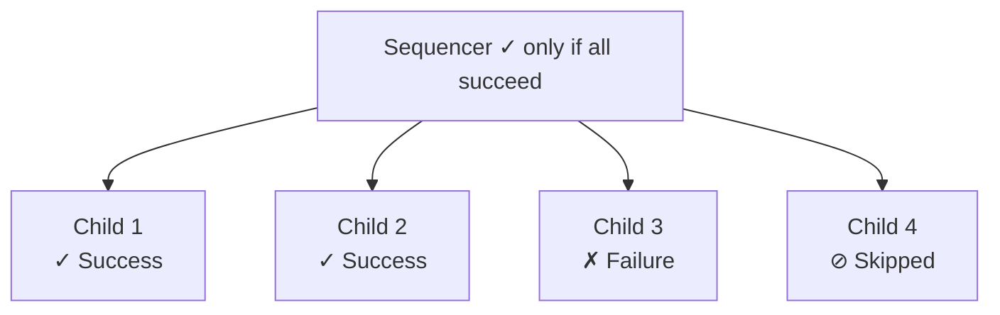
```mermaid
flowchart TB
    S["Sequencer ✓ only if all succeed"] --> C1["Child 1<br>✓ Success"]
    S --> C2["Child 2<br>✓ Success"]
    S --> C3["Child 3<br>✗ Failure"]
    S --> C4["Child 4<br>⊘ Skipped"]
```

#### SelectorNode

Executes children left to right. Returns `Success` as soon as **any** child succeeds.

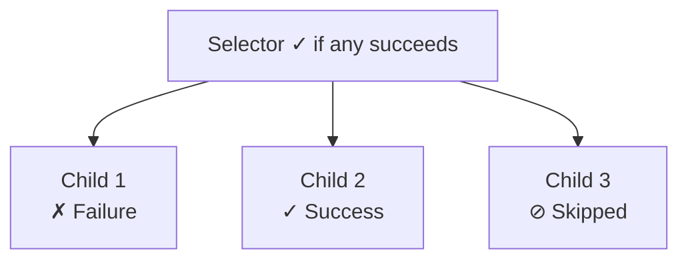
```mermaid
flowchart TB
    S["Selector ✓ if any succeeds"] --> C1["Child 1<br>✗ Failure"]
    S --> C2["Child 2<br>✓ Success"]
    S --> C3["Child 3<br>⊘ Skipped"]
```

#### Other Composite Nodes

| Node | Behavior | Use Case |
| --- | --- | --- |
| **SelectorRandom** | Randomizes child order before selector fallback | Distribute equivalent behaviors without weight tables |
| **SequenceWithMemory** | Resumes from last Running child | Multi-step objectives |
| **Parallel** | Executes all children simultaneously; multiple completion modes | Simultaneous attack + animation |
| **ParallelAll** | Ticks all children; configurable thresholds | "2 of 3 conditions must pass" |
| **ReactiveSequence** | Re-evaluates from start every tick | Guard conditions that must stay true |
| **ReactiveFallback** | Re-evaluates from start; interrupts lower-priority children | Priority-based behavior switching |
| **IfThenElse** | `[0]`=condition, `[1]`=then, `[2]`=else | Branching logic |
| **WhileDoElse** | Loops body while condition succeeds | "While in range → shoot" |
| **SwitchNode** | N-way branch on blackboard int key | State-driven AI |
| **ProbabilityBranch** | Randomly selects child by weights (deterministic xorshift32) | Randomized NPC behavior |
| **UtilitySelector** | Highest blackboard float score wins | Dynamic utility AI |
| **ServiceNode** | Periodically executes side-effect callback alongside child | Update aim direction while attacking |

### Decorator Nodes

Decorator nodes modify a single child's behavior.

| Node | Behavior |
| --- | --- |
| **InvertNode** | Flip `Success` ↔ `Failure` |
| **SucceederNode** | Always returns `Success` |
| **ForceFailureNode** | Always returns `Failure` |
| **RepeatNode** | Repeat child N times or forever |
| **RetryNode** | Retry on failure up to N times |
| **TimeoutNode** | Fail if child exceeds time limit |
| **DelayNode** | Wait before running child |
| **CoolDownNode** | Block re-execution until cooldown expires |
| **RunOnceNode** | Execute once; cache and reuse result |
| **WaitSuccessNode** | Wait for success or timeout |
| **BlackBoardNode** | Create scoped child blackboard |
| **SubTreeNode** | Reference another BehaviorTree asset with port remapping |
| **BBComparisonNode** | Compare blackboard keys with operators (`==`, `!=`, `<`, `>`, `<=`, `>=`, `IsSet`, `IsNotSet`) |

### Action and Condition Nodes

**Action nodes** (leaves that perform work):

| Node | Behavior |
| --- | --- |
| **DebugLogNode** | Log message to console |
| **WaitNode** | Wait for duration (fixed or random), return `Success` |
| **MessagePassNode** | Set string value on blackboard key |
| **MessageRemoveNode** | Remove key from blackboard |
| **BTChangeNode** | Trigger state transition on `BTStateMachineComponent` |

**Condition nodes** (evaluate, return `Success`/`Failure` never `Running`):

| Node | Behavior |
| --- | --- |
| **OnOffNode** | Fixed `Success` or `Failure` toggle |
| **MessageReceiveNode** | Check if key equals specific string |
| **RandomChanceNode** | Return `Success` with `chance/outOf` probability |

### Creating Custom Nodes

Keep authoring data and runtime execution separate. Authoring nodes are ScriptableObjects; runtime nodes perform hot-path work.

```csharp
// === ScriptableObject authoring layer ===
[BTInfo("Custom/Movement", "Moves agent toward target position")]
public sealed class MoveToTargetNode : ActionNode
{
    [SerializeField] private string _targetKey = "TargetPosition";
    [SerializeField] private float _arrivalRadius = 0.5f;
    public string TargetKey => _targetKey;
    public float ArrivalRadius => _arrivalRadius;
}

// === Pure C# runtime execution layer ===
public sealed class RuntimeMoveToTarget : RuntimeStatefulActionNode
{
    private readonly int _targetKey;
    private readonly float _arrivalRadiusSqr;

    public RuntimeMoveToTarget(int targetKey, float arrivalRadius)
    {
        _targetKey = targetKey;
        _arrivalRadiusSqr = arrivalRadius * arrivalRadius;
    }

    protected override RuntimeState OnActionRunning(RuntimeBlackboard bb)
    {
        var target = bb.GetVector3(_targetKey);
        var agent = bb.GetService<IMovementAgent>();
        if (agent == null) return RuntimeState.Failure;
        float speed = bb.GetFloat("Speed", 5f);
        return agent.MoveToward(target, _arrivalRadiusSqr, speed)
            ? RuntimeState.Success : RuntimeState.Running;
    }
}

// Register at composition root
var emitters = BehaviorTreeNodeEmitterRegistry.CreateWithBuiltInFallback();
emitters.Register<MoveToTargetNode>((source, context) =>
{
    int key = RuntimeBlackboard.DefaultStringHashFunc(source.TargetKey);
    return context.WithGuid(source, new RuntimeMoveToTarget(key, source.ArrivalRadius));
});
```

## Advanced Topics

### SubTree Composition

Split large behavior trees into reusable modules.

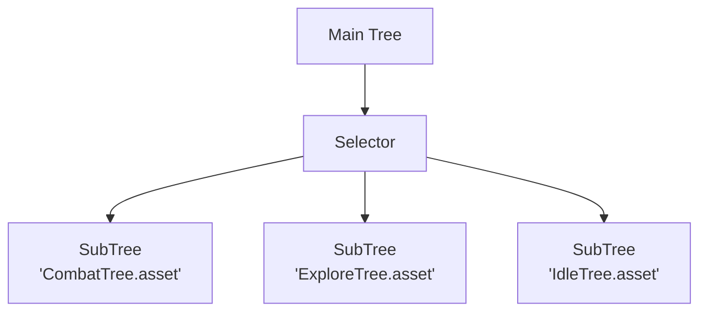
```mermaid
flowchart TB
    Main["Main Tree"] --> Sel["Selector"]
    Sel --> Combat["SubTree<br>'CombatTree.asset'"]
    Sel --> Explore["SubTree<br>'ExploreTree.asset'"]
    Sel --> Idle["SubTree<br>'IdleTree.asset'"]
```

Port remapping: `Parent "EnemyPosition" → Child "TargetPos"`. SubTree runs on a scoped blackboard inheriting from parent.

### Behavior Tree + State Machine

Use `BTStateMachineComponent` for high-level state transitions between entire trees. Define states in Inspector, transition via `BTChangeNode` or `stateMachine.SetState("Combat")`.

### Conditional Abort

| Abort Type | Behavior |
| --- | --- |
| `None` | No interruption |
| `Self` | Abort own subtree when condition changes |
| `LowerPriority` | Abort lower-priority siblings when condition becomes true |
| `Both` | Self + LowerPriority |

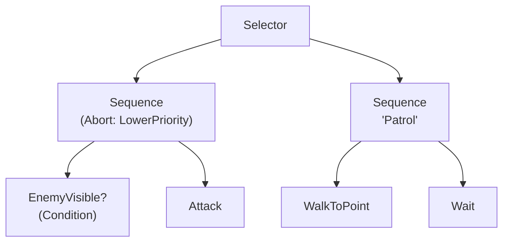
```mermaid
flowchart TB
    Sel["Selector"] --> Seq1["Sequence<br>(Abort: LowerPriority)"]
    Sel --> Seq2["Sequence<br>'Patrol'"]
    Seq1 --> Cond["EnemyVisible?<br>(Condition)"]
    Seq1 --> Attack["Attack"]
    Seq2 --> WalkTo["WalkToPoint"]
    Seq2 --> Wait["Wait"]
```

### Event-Driven Execution

```csharp
// Inside a custom RuntimeNode
protected override RuntimeState OnRun(RuntimeBlackboard bb)
{
    if (significantEventOccurred)
        EmitWakeUpSignal();
    return RuntimeState.Running;
}

// External wake-up
runner.WakeUp(boostedTicks: 2);
```

### Deterministic Random

```csharp
var rng = new RuntimeDeterministicRandom(seed: 42);
int index = rng.NextInt(0, 5); // same result on server and client
```

Nodes that consume random values resolve `IRuntimeBTRandomProvider` from the service registry. With `CycloneGames.DeterministicMath`, register `DeterministicMathRandomProvider` for savable/restorable random state.

### DOD / Burst Execution

The optional DOD assembly provides a data-oriented path for supported flat node types.

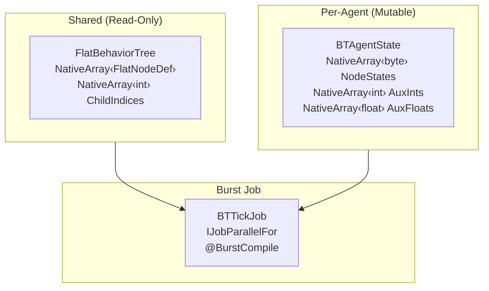
```mermaid
flowchart TB
    subgraph Shared["Shared (Read-Only)"]
        FBT["FlatBehaviorTree<br>NativeArray‹FlatNodeDef›<br>NativeArray‹int› ChildIndices"]
    end
    subgraph PerAgent["Per-Agent (Mutable)"]
        State["BTAgentState<br>NativeArray‹byte› NodeStates<br>NativeArray‹int› AuxInts<br>NativeArray‹float› AuxFloats"]
    end
    subgraph Execution["Burst Job"]
        Job["BTTickJob<br>IJobParallelFor<br>@BurstCompile"]
    end
    Shared --> Job
    PerAgent --> Job
```

```csharp
FlatBehaviorTree flatTree = FlatTreeCompiler.Compile(runtimeTree);
var scheduler = new BTTickScheduler(flatTree, initialCapacity: 1024, bbSlotCount: 8);
int agentId = scheduler.AddAgent(tickInterval: 2);
scheduler.SetBBInt(agentId, slotIndex: 0, value: 100);
JobHandle handle = scheduler.ScheduleTick(Time.deltaTime, batchSize: 64);
scheduler.CompleteTick();
```

| Criteria | Use Managed | Use Burst DOD |
| --- | --- | --- |
| Tree complexity | Any | Simple to medium (supported nodes only) |
| Custom actions | Yes (C#) | External callback slots |
| Object blackboard | Yes | No (int/float/bool only) |

### Multiplayer Networking

Three synchronization patterns:

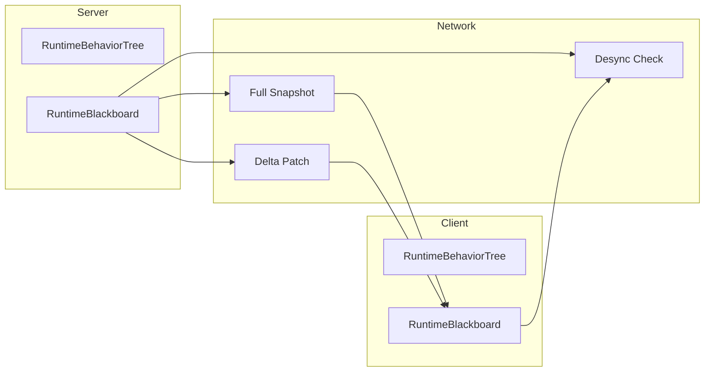
```mermaid
flowchart LR
    subgraph Server
        STree["RuntimeBehaviorTree"]
        SBB["RuntimeBlackboard"]
    end
    subgraph Network
        Snap["Full Snapshot"]
        Delta["Delta Patch"]
        Hash["Desync Check"]
    end
    subgraph Client
        CTree["RuntimeBehaviorTree"]
        CBB["RuntimeBlackboard"]
    end
    SBB --> Snap --> CBB
    SBB --> Delta --> CBB
    SBB --> Hash
    CBB --> Hash
```

**Server-Authoritative Snapshot:**

```csharp
var snapshot = BTNetworkSync.CaptureSnapshot(serverTree);
byte[] data = BTNetworkSync.SerializeSnapshot(snapshot);
SendToClient(data);
// Client:
var snap = BTNetworkSync.DeserializeSnapshot(data);
BTNetworkSync.ApplyBlackboardSnapshot(clientTree, snap);
```

**Client-Predicted with Hash:**

```csharp
ulong serverHash = serverBlackboard.ComputeHash();
if (BTNetworkSync.CheckDesync(clientTree, serverHash))
    BTNetworkSync.ApplyBlackboardSnapshot(clientTree, BTNetworkSync.CaptureSnapshot(serverTree));
```

**Delta Blackboard Sync:**

```csharp
var delta = new BTBlackboardDelta();
delta.TrackKey("Health");
delta.Attach(serverBlackboard);

if (delta.TryFlush(serverBlackboard, out ArraySegment<byte> patch))
    SendToClients(patch);
// Client:
BTBlackboardDelta.Apply(clientBlackboard, patch);
```

## Common Scenarios

### FPS / Third-Person Shooter

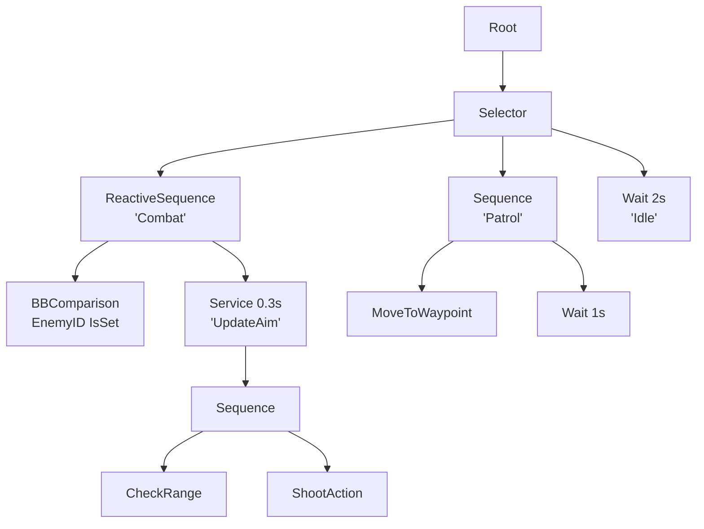
```mermaid
flowchart TB
    Root --> Sel["Selector"]
    Sel --> Combat["ReactiveSequence<br>'Combat'"]
    Sel --> Patrol["Sequence<br>'Patrol'"]
    Sel --> Idle["Wait 2s<br>'Idle'"]
    Combat --> HasEnemy["BBComparison<br>EnemyID IsSet"]
    Combat --> Service["Service 0.3s<br>'UpdateAim'"]
    Service --> Attack["Sequence"]
    Attack --> InRange["CheckRange"]
    Attack --> Shoot["ShootAction"]
    Patrol --> WalkTo["MoveToWaypoint"]
    Patrol --> Wait["Wait 1s"]
```

Key patterns: `ReactiveSequence` for combat re-evaluation, `ServiceNode` for periodic aim updates, `BBComparison` with `IsSet`.

### Open World RPG

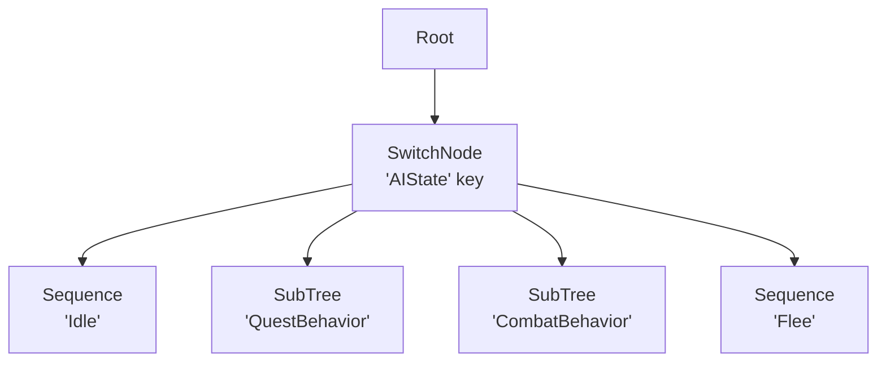
```mermaid
flowchart TB
    Root --> FSM["SwitchNode<br>'AIState' key"]
    FSM --> Idle["Sequence<br>'Idle'"]
    FSM --> Quest["SubTree<br>'QuestBehavior'"]
    FSM --> Combat["SubTree<br>'CombatBehavior'"]
    FSM --> Flee["Sequence<br>'Flee'"]
```

Key patterns: `SwitchNode` on `AIState`, `SubTreeNode` for modular behavior assets, `UtilitySelectorNode` for world-state evaluation.

### RTS / Colony Sim

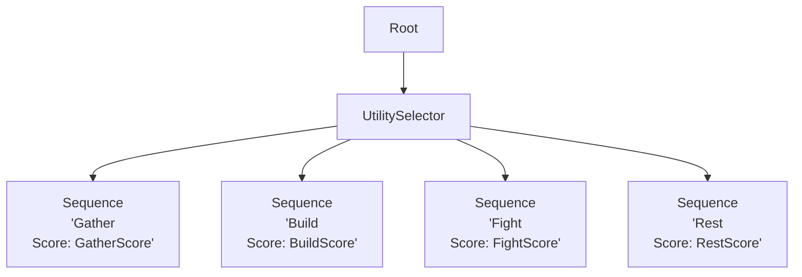
```mermaid
flowchart TB
    Root --> Utility["UtilitySelector"]
    Utility --> Gather["Sequence<br>'Gather<br>Score: GatherScore'"]
    Utility --> Build["Sequence<br>'Build<br>Score: BuildScore'"]
    Utility --> Fight["Sequence<br>'Fight<br>Score: FightScore'"]
    Utility --> Rest["Sequence<br>'Rest<br>Score: RestScore'"]
```

Key patterns: `UtilitySelectorNode` for dynamic priority, `PriorityManaged` tick mode, Burst DOD for 10K+ units.

### Stealth / Horror AI

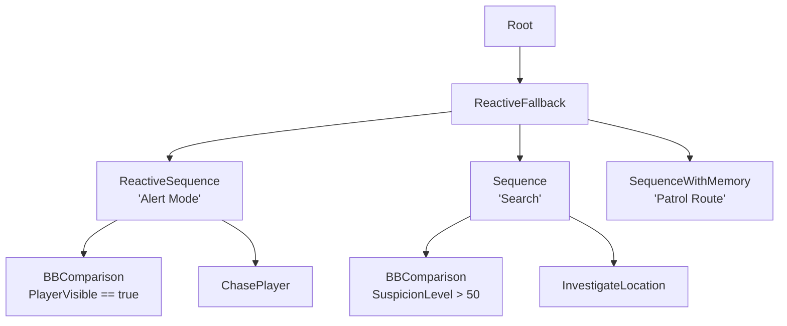
```mermaid
flowchart TB
    Root --> Reactive["ReactiveFallback"]
    Reactive --> Alert["ReactiveSequence<br>'Alert Mode'"]
    Reactive --> Search["Sequence<br>'Search'"]
    Reactive --> PatrolRoute["SequenceWithMemory<br>'Patrol Route'"]
    Alert --> SeePlayer["BBComparison<br>PlayerVisible == true"]
    Alert --> Chase["ChasePlayer"]
    Search --> HeardNoise["BBComparison<br>SuspicionLevel > 50"]
    Search --> Investigate["InvestigateLocation"]
```

Key patterns: `ReactiveFallbackNode` for instant alert switching, `SequenceWithMemory` for patrol resumption.

### Boss Fight (Multi-Phase)

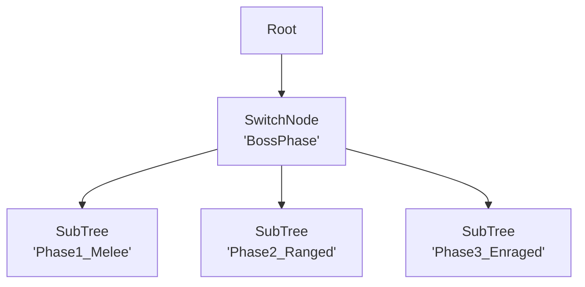
```mermaid
flowchart TB
    Root --> Switch["SwitchNode<br>'BossPhase'"]
    Switch --> P1["SubTree<br>'Phase1_Melee'"]
    Switch --> P2["SubTree<br>'Phase2_Ranged'"]
    Switch --> P3["SubTree<br>'Phase3_Enraged'"]
```

Key patterns: `SwitchNode` on `BossPhase`, separate `SubTreeNode` per phase, `ProbabilityBranch` for varied attacks, `BossAIMarker` for P0 priority.

## Performance and Memory

### Tick Mode Selection

| Requirement | Candidate |
| --- | --- |
| Independent ownership, simple scheduling | `TickMode.Self` |
| Central round-robin with frame budget | `TickMode.Managed` |
| Distance/priority policy with per-bucket budgets | `TickMode.PriorityManaged` |
| Flat supported nodes, explicit Native memory | Burst DOD |
| Mixed complexity | Managed for complex trees, DOD for measured simple workloads |

### Hot-Path Guidelines

- Pre-hash keys: `static readonly int k = Animator.StringToHash("Key")`
- Cache component references in `OnAwake()`, not `OnRun()`
- Use `blackboard.GetInt(key)` instead of boxing `(int)blackboard.Get("key")`
- Use `sqrMagnitude` for distance checks instead of `Vector3.Distance()`

### Memory Optimization

- `RuntimeCompositeNode.Seal()` freezes child list to array, releases list memory
- `BTTreePool` pools compiled tree instances with O(1) free-list recycle
- `BTDistanceLODProvider` uses parallel arrays instead of Dictionary iteration
- `RuntimeBlackboard` implements `IDisposable` — releases `ReaderWriterLockSlim`

### Thread Safety

- `RuntimeBlackboard.EnableThreadSafety()` — opt-in `ReaderWriterLockSlim`
- Observer notifications fire outside the write lock
- `BTTickJob` uses Burst `IJobParallelFor`; callers must respect per-agent partitioning
- `RuntimeBehaviorTree` uses `Interlocked`/`Volatile` only for wake-up flags

### Priority LOD System

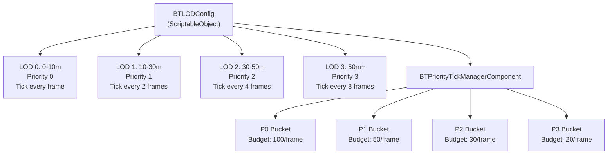
```mermaid
flowchart TB
    Config["BTLODConfig<br>(ScriptableObject)"]
    Config --> LOD0["LOD 0: 0-10m<br>Priority 0<br>Tick every frame"]
    Config --> LOD1["LOD 1: 10-30m<br>Priority 1<br>Tick every 2 frames"]
    Config --> LOD2["LOD 2: 30-50m<br>Priority 2<br>Tick every 4 frames"]
    Config --> LOD3["LOD 3: 50m+<br>Priority 3<br>Tick every 8 frames"]
    Manager["BTPriorityTickManagerComponent"]
    Config --> Manager
    Manager --> Bucket0["P0 Bucket<br>Budget: 100/frame"]
    Manager --> Bucket1["P1 Bucket<br>Budget: 50/frame"]
    Manager --> Bucket2["P2 Bucket<br>Budget: 30/frame"]
    Manager --> Bucket3["P3 Bucket<br>Budget: 20/frame"]
```

Priority markers: `BossAIMarker` (P0), `EliteAIMarker` (P0), `VIPNPCMarker` (P1). Implement `IBTPriorityMarker` for dynamic priority. Use `runner.BoostPriority(2f)` for event-driven priority boost.

### Open World Optimization

1. Distance LOD for far-away NPCs
2. Priority markers for quest-relevant NPCs
3. Group provider overrides (`IBTAgentGroupProvider`)
4. Chunk-based `BTRunnerComponent` activation
5. `BTTreePool` template pooling:

```csharp
var pool = new BTTreePool();
int guardTemplate = pool.RegisterTemplate(guardTreeAsset);
int instanceId = pool.Allocate(guardTemplate);
RuntimeBehaviorTree instance = pool.GetInstance(instanceId);
pool.TickAll();
pool.Release(instanceId);
```

### Benchmark Tools

`Tools > CycloneGames > Behavior Tree > Behavior Tree Benchmark` provides presets from `AiBattle500` to `AiExtreme10000`, scheduling profile comparison, CSV/JSON export, and memory/GC metrics.

## Troubleshooting

| Symptom | Likely cause | Resolution |
| --- | --- | --- |
| Tree compiles but nodes don't tick | Tree not started or paused | Call `tree.Play()` or check `IsPaused` |
| Custom node not found in GraphView | Node not registered in emitter registry | Register in `BehaviorTreeNodeEmitterRegistry` |
| Blackboard key returns wrong value | Key hash collision or wrong type accessor | Use typed accessors (`GetInt`, not `GetObject`) |
| SubTree blackboard not inheriting | Port remapping not configured | Set port mappings in SubTreeNode Inspector |
| Reactive node not re-evaluating | Abort type set to `None` | Set abort type to `Self` or `Both` |
| High GC during tick | Boxing via untyped blackboard API | Use typed `GetInt`/`GetFloat`/`GetBool`/`GetVector3` |
| Burst job does not compile | Missing Burst/Collections/Mathematics packages | Install required packages; DOD assembly is optional |
| LOS check reports false positive | Obstacle layer includes target's layer | Restrict mask to environment layers only |

## Validation

```text
CycloneGames.BehaviorTree.Tests.Editor                 (EditMode)
CycloneGames.BehaviorTree.Tests.Performance             (EditMode + PlayMode)
CycloneGames.BehaviorTree.Networking.Tests.Editor       (EditMode)
```

Test Play Mode with Domain Reload enabled and disabled. Run benchmark matrix in release Player settings. Verify on all target platforms including IL2CPP/AOT.
