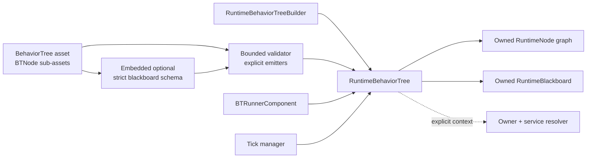
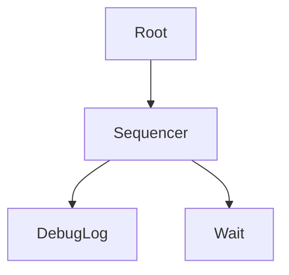
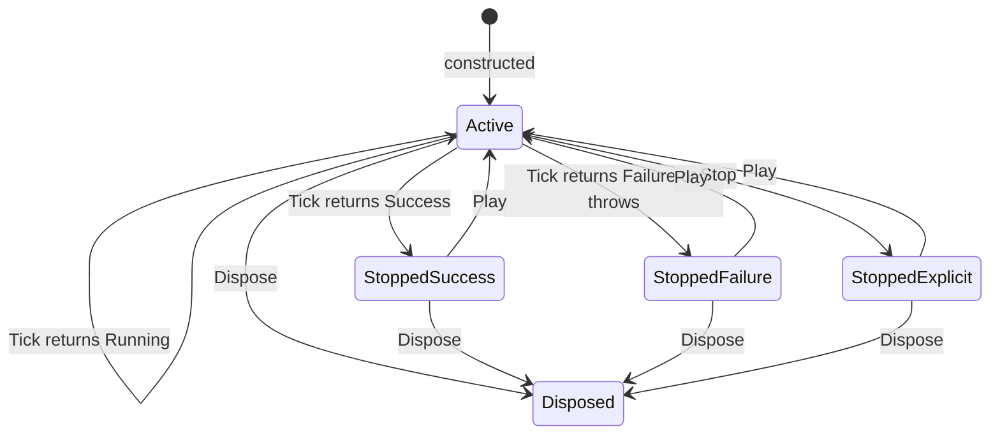

# CycloneGames.BehaviorTree

[English | 简体中文](README.SCH.md)

CycloneGames.BehaviorTree is a Unity behavior-tree module. Author trees as ScriptableObject assets with a GraphView editor, or build them in code with `RuntimeBehaviorTreeBuilder`. The module includes a managed runtime, typed blackboard, bounded scheduling, and an opt-in Burst/Jobs DOD path.

## Table of Contents

- [Overview](#overview)
- [Architecture](#architecture)
- [Quick Start](#quick-start)
- [Core Concepts](#core-concepts)
- [Usage Guide](#usage-guide)
- [Advanced Topics](#advanced-topics)
- [Common Scenarios](#common-scenarios)
- [Performance and Memory](#performance-and-memory)
- [Troubleshooting](#troubleshooting)

## Overview

The module provides:

- ScriptableObject behavior-tree assets and a GraphView editor.
- A managed runtime graph of `RuntimeNode` objects and `RuntimeBlackboard` state.
- A code-first `RuntimeBehaviorTreeBuilder` path that does not require an authored tree asset.
- Explicit node activation, completion, abort, fault, reset, and disposal.
- Self, Manual, Managed, and PriorityManaged tick ownership models.
- Typed blackboard values, an embedded opt-in strict authoring schema, snapshots, deltas, change stamps, and observers.
- A bounded authoring compiler with explicit, reflection-free built-in emitters.
- An opt-in DOD assembly for homogeneous flat trees executed by Burst jobs.
- Editor and PlayMode benchmark tooling in an opt-in benchmark assembly.

### Key features

- **ScriptableObject authoring** with Undo-aware GraphView editor, validation, and repair commands.
- **Code-first API** via `RuntimeBehaviorTreeBuilder` with compositor, decorator, and leaf fluent methods.
- **Node library** — 15+ compositors, 15+ decorators, condition strategies, and action boundaries.
- **Typed blackboard** — `int`, `float`, `bool`, `Vector3`, `long`, `Long2`, `Long3`, `object`; FNV-1a string keys and an opt-in strict contract.
- **Bounded compilation** — iterative validation, exact emitter dispatch, no private-field reflection.
- **Managed scheduling** — round-robin and 8-bucket priority/LOD tick managers.
- **Opt-in DOD path** — Burst/Jobs flat-tree scheduler with `BTAgentHandle` generations.
- **Runtime `object` owner** — `GetOwner<T>()` contract without Unity type exposure in core APIs.

## Architecture


```mermaid
flowchart LR
    Asset["BehaviorTree asset\nBTNode sub-assets"] --> Compiler["Bounded validator\nexplicit emitters"]
    Asset --> Contract["Embedded optional\nstrict blackboard schema"]
    Contract --> Compiler
    Builder["RuntimeBehaviorTreeBuilder"] --> Runtime["RuntimeBehaviorTree"]
    Compiler --> Runtime
    Runtime --> Root["Owned RuntimeNode graph"]
    Runtime --> Blackboard["Owned RuntimeBlackboard"]
    Runner["BTRunnerComponent"] --> Runtime
    Manager["Tick manager"] --> Runtime
    Runtime -. "explicit context" .-> Services["Owner + service resolver"]
```

### Assemblies

| Assembly | Default reference | Responsibility |
| --- | --- | --- |
| `CycloneGames.BehaviorTree.Runtime` | Yes | Authoring assets, managed runtime, blackboard, compiler, runner, and managed schedulers |
| `CycloneGames.BehaviorTree.Editor` | Editor only | Graph editor, inspectors, validation, and benchmark window |
| `CycloneGames.BehaviorTree.Benchmarks` | No | Benchmark models, sessions, scene runners, and export utilities |
| `CycloneGames.BehaviorTree.Runtime.DOD` | No | Burst/Jobs flat-tree scheduler and NativeArray state |
| `CycloneGames.BehaviorTree.Integrations.DeterministicMath` | No | Explicit random-provider bridge between the two local modules |

The runtime assembly requires `com.cyclone-games.hash`. The DOD assembly is enabled only when Burst, Collections, and Mathematics are present, and a consumer asmdef must reference `CycloneGames.BehaviorTree.Runtime.DOD` explicitly. The DeterministicMath bridge is `autoReferenced: false` and has direct references to both local assemblies.

### Ownership rules

- One `RuntimeBehaviorTree` owns exactly one runtime node graph and one blackboard.
- A runtime node graph must be acyclic, each node must have one parent and one owning tree.
- The tree owner calls lifecycle methods on the thread that constructed the tree.
- `RuntimeBehaviorTree.Dispose()` aborts active work, disposes node-owned resources, disposes the blackboard, and removes termination subscribers.
- An authored `BehaviorTree` asset can create multiple independent runtime instances.
- `BehaviorTree.Root`, `BehaviorTree.Nodes`, and each authored node link are serialized authoring data. Write them only in Edit Mode through Undo-aware tooling; Play Mode consumes a compiled runtime instance.
- `BTRunnerComponent` owns and disposes the runtime instance that it compiles.
- `BTTickScheduler` owns its NativeArrays but borrows its `FlatBehaviorTree`; the caller keeps the flat tree alive until the scheduler is disposed.

## Quick Start

### Asset-authored tree

1. In the Project window, choose `Create > CycloneGames > AI > BehaviorTree`.
2. Double-click the asset, or open `Tools > CycloneGames > Behavior Tree > Behavior Tree Editor`.
3. If the asset has no root, click `Repair Root`.
4. In the graph context menu, create a `SequencerNode`, one or more actions such as `DebugLogNode` or `WaitNode`, and connect them below the root.
5. Click `Validate`. Resolve all diagnostics, then click `Save`.
6. Add `BTRunnerComponent` to a GameObject, assign the tree, choose a tick mode, and enable `Start On Awake`.
7. Enter Play Mode. Select the runner or asset to view runtime state in the graph and runner Inspector.

A minimal graph is:


```mermaid
flowchart TB
    Root["Root"] --> Sequence["Sequencer"]
    Sequence --> Log["DebugLog"]
    Sequence --> Wait["Wait"]
```

The runner compiles a fresh runtime instance. The asset remains authoring data; node execution state and blackboard state live in that runtime instance.

### Five-minute strict blackboard setup

Strict schema authoring is embedded in each `BehaviorTree` asset and is opt-in. Existing assets remain in Legacy Open mode until explicitly enabled.

1. Select the behavior-tree asset in the Project window.
2. In **Blackboard Contract**, enable **Strict Schema**.
3. Keep the read-only **Format Version** unchanged. Start **Contract Version** at `1` for a new contract.
4. Add the keys used by the graph. For example, add `HasTarget` as `Bool` with default `false`, `Health` as `Int` with default `100`, and `Target` as `Object` without a default.
5. Keep **Sync Flags** at `LocalOnly` unless an implemented persistence or networking path owns the synchronization policy.
6. Open the graph. Supported key fields keep manual text editing and add a schema-backed dropdown; typed fields show only compatible entries.
7. Add `Target` to the runner's **Initial Objects** when the instance needs a scene object.
8. Select the tree again, click **Validate Tree**, resolve every diagnostic, then enter Play Mode.

On compile, root schema defaults are applied first. `BTRunnerComponent` then applies **Initial Objects** in array order, so the last duplicate Object entry wins. Replaying the runner restores root defaults and reapplies the same initial Object entries before the next activation.

### Code-first tree

```csharp
using CycloneGames.BehaviorTree.Runtime.Core;

private static readonly int HasTargetKey =
    RuntimeBlackboard.DefaultStringHashFunc("HasTarget");
private static readonly int AttackCountKey =
    RuntimeBlackboard.DefaultStringHashFunc("AttackCount");

RuntimeBehaviorTree tree = new RuntimeBehaviorTreeBuilder()
    .Selector()
        .Sequence()
            .Condition(bb => bb.GetBool(HasTargetKey), "HasTarget")
            .CoolDown(0.75f)
                .Action(bb =>
                {
                    bb.SetInt(AttackCountKey, bb.GetInt(AttackCountKey) + 1);
                    return RuntimeState.Success;
                }, "Attack")
            .End()
        .End()
        .Action(bb => RuntimeState.Success, "Idle")
    .End()
    .Build();

tree.Terminated += state => HandleTreeTermination(state);
tree.Tick();
tree.Dispose();
```

The builder can receive an existing blackboard, a `RuntimeBlackboardSchema`, a `RuntimeBTContext`, or an `IRuntimeBTServiceResolver`. It may be used only once; `Build()` closes open builder scopes and rejects a missing root child.

`RuntimeBTContext.Owner` and `WithOwner(...)` accept any reference-type owner through `object`. Retrieve it with `GetOwner<T>()`:

```csharp
public sealed class AgentRuntimeOwner { }

var owner = new AgentRuntimeOwner();
RuntimeBehaviorTree ownedTree = new RuntimeBehaviorTreeBuilder(owner)
    .Action(_ => RuntimeState.Success)
    .Build();

AgentRuntimeOwner resolvedOwner = ownedTree.GetOwner<AgentRuntimeOwner>();
ownedTree.Dispose();
```

When `RuntimeBTContext.Owner` is a Unity `GameObject`, `GetOwner<GameObject>()` returns that object and `GetOwner<TComponent>()` performs a component lookup. `BTRunnerComponent` continues to inject its own GameObject.

For reusable behavior, prefer named command or condition objects over captured lambdas:

```csharp
public sealed class AttackCommand : IRuntimeBTCommand
{
    public RuntimeState Execute(RuntimeBlackboard blackboard)
    {
        return RuntimeState.Success;
    }
}

RuntimeBehaviorTree tree = new RuntimeBehaviorTreeBuilder()
    .Sequence()
        .Condition(new HasTargetCondition(), "HasTarget")
        .Command(new AttackCommand(), "Attack")
    .End()
    .Build();
```

## Core Concepts

### Runtime lifecycle


```mermaid
stateDiagram-v2
    [*] --> Active: constructed
    Active --> Active: Tick returns Running
    Active --> StoppedSuccess: Tick returns Success
    Active --> StoppedFailure: Tick returns Failure or throws
    Active --> StoppedExplicit: Stop
    StoppedSuccess --> Active: Play
    StoppedFailure --> Active: Play
    StoppedExplicit --> Active: Play
    Active --> Disposed: Dispose
    StoppedSuccess --> Disposed: Dispose
    StoppedFailure --> Disposed: Dispose
    StoppedExplicit --> Disposed: Dispose
```

- A newly constructed tree is active. `Tick()` starts root activation as needed.
- Construction validates an acyclic, single-owner runtime graph with unique runtime GUIDs. `RuntimeBehaviorTreeLimits` bounds code-first node count (default 4096, hard ceiling 65,536) and depth (default 256, hard ceiling 256).
- If construction throws before returning, a caller-supplied blackboard has its previous context restored and remains caller-owned; an internally created blackboard is disposed. After successful construction, the tree owns and disposes its blackboard.
- `Success` and `Failure` are terminal tree results. The tree sets `IsStopped`, clears scheduling wake-up state, and publishes `Terminated` exactly once.
- `Stop()` aborts an active stack, sets tree state to `NotEntered`, and publishes `Terminated(NotEntered)` once.
- `Play()` on a stopped tree resets the node graph and begins a new activation.
- Lifecycle operations reject reentrant calls. Do not call `Tick`, `Play`, `Stop`, or `SetContext` from a node callback or `Terminated` callback.
- After `Dispose()`, public operations throw `ObjectDisposedException` (late `WakeUp()` is ignored). Runtime node instances are single-use owners.

### Node lifecycle

| Hook or method | Contract |
| --- | --- |
| `OnAwake()` | Setup hook invoked once after the runtime graph receives its owner |
| `OnStart(bb)` | Invoked once at the beginning of an activation |
| `OnRun(bb)` | Invoked for each execution step; must return `Running`, `Success`, or `Failure` |
| `OnExit(bb, Completed, null)` | Invoked once after normal `Success` or `Failure` |
| `OnExit(bb, Aborted, null)` | Invoked once when an active node is halted by its parent or tree owner |
| `OnExit(bb, Faulted, exception)` | Invoked once when execution throws |
| `OnReset(bb)` | Clears persistent state for a new activation |
| `OnDispose(bb)` | Releases resources owned by the node |

`RuntimeStatefulActionNode` separates `OnActionStart`, `OnActionRunning`, `OnActionHalted`, and `OnActionFaulted`. Use `OnActionHalted` to cancel an operation only when the action had entered `Running`; normal completion does not call the halt hook.

Pre- and post-conditions are registered during setup. `FailWhenFalse`, `SucceedWhenFalse`, and `AbortWhenFalse` make the false-path result explicit. A false condition aborts an already-running activation before returning its policy result.

### Blackboard

`RuntimeBlackboard` has separate typed stores for `int`, `float`, `bool`, `Vector3`, `long`, `RuntimeBlackboardLong2`, `RuntimeBlackboardLong3`, and `object`. Typed access avoids boxing primitive values.

String-key overloads use `RuntimeBlackboard.DefaultStringHashFunc`, which is stable `BTHash.FNV1A`. Pre-hash frequently used keys once:

```csharp
private static readonly int HealthKey =
    RuntimeBlackboard.DefaultStringHashFunc("Health");

blackboard.SetInt(HealthKey, 100);
int health = blackboard.GetInt(HealthKey);
```

A schema turns key existence, type, defaults, and synchronization flags into an explicit contract:

```csharp
RuntimeBlackboardSchema schema = new RuntimeBlackboardSchemaBuilder()
    .AddInt("Health", 100, RuntimeBlackboardSyncFlags.Networked)
    .AddBool("IsAlert", false, RuntimeBlackboardSyncFlags.Delta)
    .AddObject("Target")
    .Build();

var blackboard = new RuntimeBlackboard(schema: schema);
```

Schema-bound writes reject unknown keys and type mismatches.

- Reads fall back through `Parent`; writes affect the current blackboard only.
- A key stamp changes only when its local value changes. Use `GetStamp` for low-cost change detection.
- Key and global observers run synchronously after the write lock is released.
- Subscription changes allocate new callback arrays. Register during setup, unregister at owner shutdown.
- `SubTreeNode` owns a reusable scoped blackboard. `RuntimeSubTreePortDirection.Input` refreshes a local port before every child step, `Output` commits at normal completion, and `InOut` captures initial and final values.

### Asset-authored strict blackboard schema

The authoring schema belongs to the `BehaviorTree` asset; it is not a separate project asset or global registry. The compiler converts it into one immutable `RuntimeBlackboardSchema` for the root runtime blackboard.

| Mode | Inspector state | Empty key list | Runtime contract |
| --- | --- | --- | --- |
| Legacy Open | **Strict Schema** off | Ignored | Dynamic string/hash keys remain allowed; this preserves existing assets |
| Strict Empty | **Strict Schema** on | Valid | No Blackboard key is permitted; useful for trees that intentionally have no Blackboard dependency |
| Strict Populated | **Strict Schema** on | One or more entries | Authored keys must exist with the required type; runtime writes reject unknown keys and type mismatches |

Enabling strict mode is therefore a behavior change even when the list is empty. Do not use an empty strict schema as a temporary placeholder on a tree that already reads or writes Blackboard data.

The Inspector supports all eight runtime value types:

| Type | Authoring default | Important rule |
| --- | --- | --- |
| `Int`, `Bool`, `Long`, `Long2`, `Long3` | Optional | Serialized directly in the tree asset |
| `Float`, `Vector3` | Optional | Every default component must be finite; `NaN` and infinity are rejected |
| `Object` | None | Must remain `LocalOnly`; inject instance references through runner **Initial Objects** or code |

Every new entry starts as `Int`, `LocalOnly`, with no default. The schema compiler rejects null entries, blank or edge-whitespace names, names longer than 256 UTF-16 code units, duplicate names, FNV-1a collisions, the reserved zero hash, unsupported enum values, invalid synchronization flags, more than 4,096 entries, non-finite defaults, synchronized Object keys, and Object authoring defaults.

The key picker reads the selected tree's schema directly. It does not replace the serialized string field: manual editing remains available, while missing declarations, hash collisions, and incompatible types produce an Inspector warning. `SwitchNode` accepts `Int`, `UtilitySelectorNode` scores accept `Float`, message pass/receive and runner **Initial Objects** accept `Object`, and `BBComparison` follows its selected comparison value type. The compiler remains authoritative even if a field has no custom picker.

Use the public cache-backed query when a composition root needs to inspect the authoring contract before compilation:

```csharp
if (!treeAsset.TryGetRuntimeBlackboardSchema(
        out RuntimeBlackboardSchema schema,
        out string schemaError))
{
    throw new InvalidOperationException(schemaError);
}

// Legacy Open mode succeeds with schema == null.
RuntimeBehaviorTree runtime = treeAsset.Compile(context);
```

`Format Version` and `Contract Version` serve different owners:

- **Format Version** identifies the module's serialized authoring layout. It is read-only in the Inspector, and the compiler accepts only the current format. Do not edit it as a gameplay or release version.
- **Contract Version** is project-controlled metadata and must be at least `1`. Increment it when a released name, type, synchronization policy, or default changes incompatibly. It does not perform data migration or network negotiation by itself.

Key names are contract identities because their stable FNV-1a hashes are used at runtime and across applicable persistence/network boundaries. Treat a rename as removal plus addition. For a released contract, keep both names during a transition, copy or migrate data explicitly, coordinate every producer and consumer, and remove the old key only after compatibility is no longer required.

Migrate an existing asset in this order:

1. Leave **Strict Schema** off while inventorying every authored key, code-driven write, runner Initial Object, subtree dependency, snapshot/save field, and network consumer.
2. Add the complete root contract with `LocalOnly` as the default policy. Set defaults only for values owned by a new activation.
3. Add optional strict subset declarations to reusable subtrees, then validate every root that embeds them.
4. Fix all key/type diagnostics and add explicit data migration for renamed or retired keys.
5. Coordinate persistence and network releases, increment **Contract Version** for incompatible released changes, then enable strict mode.
6. Test reload, replay, save/load, network mismatch, and rollback before changing production assets in bulk.

Disabling **Strict Schema** is a reversible authoring rollback to Legacy Open behavior, but it does not reverse already-written save data, network payloads, or key renames.

### Compilation

`BehaviorTreeCompiler` validates the authoring graph before creating mutable runtime nodes. The structural pass rejects a missing root, cycles, shared child ownership, null links, invalid arity, duplicate GUIDs, excessive size/depth, invalid built-in node configuration, and strict-schema key/type violations.

`BehaviorTreeCompiler.Analyze(...)` performs bounded iterative validation and exact authoring-type emitter preflight, then returns a `BehaviorTreeCompileArtifact`. `EmitRuntimeRoot()` revalidates the current mutable source before creating a new runtime graph.

Each explicit `SubTreeNode` asset reference is an occurrence boundary. The same subtree asset can be referenced at multiple graph positions; validation counts each expansion independently, emission creates independent runtime nodes, and nested runtime GUIDs receive a deterministic occurrence prefix.

The root tree is the only runtime schema authority for the complete expanded occurrence graph:

- An open subtree under a strict root is validated against the root schema.
- A strict subtree under a strict parent must be an exact subset of that parent contract and therefore of the root contract. For every subtree entry, name, type, sync flags, default-presence flag, and default value must match. Nested subtrees cannot borrow a root-only key omitted by their direct reusable parent declaration.
- A strict subtree under a Legacy Open root is rejected because it would introduce a second authority.
- Only root schema defaults initialize or reset the root runtime Blackboard. Scoped Blackboard instances retain their distinct local key space, including code-first port remapping; values crossing back into the root are validated by the root schema. Subtree declarations validate authored reusable dependencies, and their defaults are not applied a second time.

`BehaviorTree.Compile(...)` catches `BehaviorTreeCompileException`, logs against the asset, and returns `null`. Composition roots that need structured failure should call `BehaviorTreeCompiler.Analyze(...)` first.

Built-in emitters read explicit, read-only configuration properties and do not use private-field reflection. Emitter lookup is exact by authoring type: a derived authoring node must register its own emitter.

## Usage Guide

### Runners and scheduling

```csharp
BTRunnerComponent runner = GetComponent<BTRunnerComponent>();

runner.BTSetData("Health", 100);
runner.WakeUp(boostedTicks: 2);
runner.Pause();
runner.Resume();
runner.Stop();
runner.Play();
```

- Natural `Success` or `Failure`, explicit `Stop`, and runtime faults all mark the runner stopped, unregister it from managed scheduling, and raise `OnTreeStopped` once.
- `Pause()` preserves node and blackboard state and unregisters managed modes. `Resume()` continues a non-terminal tree; a stopped runner starts a new activation.
- `Play()` on an existing runtime stops the old activation, resets the graph, resets the Blackboard to root schema defaults (or empty state in Legacy Open mode), and then reapplies Inspector `Initial Objects`.
- Every **Initial Objects** key is an `Object` write. Strict trees must declare each key as `Object`; later duplicate entries overwrite earlier entries. Object keys are always `LocalOnly` and cannot have authoring defaults.
- `SetTree(...)` is applied in `LateUpdate`; the old runtime is disposed and a new runtime is compiled.
- Set context and service resolver before active execution. `RuntimeBehaviorTree.SetContext` rejects changes while a node stack is active.

### Tick modes

| Mode | Owner | Policy |
| --- | --- | --- |
| `Self` | `BTRunnerComponent.Update` | One component tick opportunity per frame |
| `Manual` | Caller | Caller invokes `ManualTick()` |
| `Managed` | `BTTickManagerComponent` | Bounded round-robin scan |
| `PriorityManaged` | `BTPriorityTickManagerComponent` | Eight priority buckets plus distance/marker LOD |

`BTTickManager.TickBudget` counts trees scanned in one pass; a scanned tree may skip execution because of `TickInterval`. Registration and removal requested during a tick are deferred until the pass ends. Terminal trees are removed automatically.

`BTPriorityTickManager` uses eight buckets. Each budget limits scans in that bucket; zero disables that bucket. On first `Instance` access, each scene component performs one cold-path query for already loaded authored manager components before creating a persistent fallback GameObject.

### LOD configuration

`BTLODConfig` requires strictly increasing finite distances, tick intervals of at least one, priorities from `0` through `7`, non-negative budgets, and a budget entry for every referenced priority. Distance checks use pre-squared thresholds.

### Blackboard operations

```csharp
// Typed access via int hash keys
blackboard.SetInt(HealthKey, 100);
blackboard.SetFloat(SpeedKey, 5.5f);
blackboard.SetBool(AlertKey, true);
blackboard.SetVector3(PositionKey, transform.position);

// String key convenience
blackboard.SetInt("Health", 100);

// Change detection via stamps
ulong stamp = blackboard.GetStamp(HealthKey);

// Observer registration
blackboard.AddObserver(HealthKey, (key, bb) => Debug.Log($"Health changed: {bb.GetInt(key)}"));
```

### Composite nodes

| Node | Terminal rule and important behavior |
| --- | --- |
| `RuntimeSequencer` | Runs children from left to right; first failure fails; all success succeeds |
| `RuntimeSequenceWithMemory` | Continues from the last running child instead of rechecking completed predecessors |
| `RuntimeSelector` | Runs children from left to right; first success succeeds; all failure fails |
| `RuntimeSelectorRandom` | Shuffles a setup-time index array, then applies selector semantics. `Seed` and `ShuffleOnStart` freeze with the owned graph |
| `RuntimeReactiveSequence` | Re-evaluates high-priority children each step and aborts a displaced running branch |
| `RuntimeReactiveFallback` | Re-evaluates fallback priority each step and aborts a displaced running branch |
| `RuntimeIfThenElseNode` | Child 0 is the condition; child 1 is then; child 2 is else |
| `RuntimeWhileDoElseNode` | Uses condition/body/else child positions |
| `RuntimeSwitchNode` | Uses a blackboard integer as a zero-based case; the last child is the default |
| `RuntimeProbabilityBranch` | Selects once per activation from validated non-negative weights |
| `RuntimeUtilitySelector` | Selects by configured blackboard score keys |
| `RuntimeServiceNode` | Runs a configured service callback on an interval while its child executes |

### Parallel nodes

Parallel nodes interleave branches during one tree-owner-thread tick. They do not create threads, tasks, or jobs.

`RuntimeParallelNode` retains each child's terminal state and does not rerun that child within the same activation:

| Mode | Success | Failure |
| --- | --- | --- |
| `Default` | All children succeed | Any child fails |
| `UntilAnyFailure` | All children succeed | Any child fails |
| `UntilAnySuccess` | Any child succeeds | All children fail |
| `UntilAnyComplete` | First observed child success | First observed child failure |

`RuntimeParallelAllNode` ticks every unfinished child once per step. `SuccessThreshold` and `FailureThreshold` accept `-1` for all children or a value from `1` through child count. Failure has precedence when both thresholds are reached in one step.

### Decorators and leaves

| Family | Included behavior |
| --- | --- |
| Result | `Inverter`, `Succeeder`, `ForceFailure`, `KeepRunningUntilFailure` |
| Repetition | `Repeat`, `Retry`, `RunOnce` |
| Time | `Wait`, `Delay`, `Timeout`, `CoolDown`, `WaitSuccess` |
| Blackboard | `BBComparison`, `BlackBoardNode`, `SubTreeNode`, message pass/remove/receive |
| Branch support | `OnOff`, `RandomChance`, code-first condition strategies |
| Project action boundary | `IRuntimeBTCommand`, `RuntimeStatefulActionNode`, lambda actions |

Time-sensitive managed nodes resolve `IRuntimeBTTimeProvider` from the runtime context. Randomized nodes can resolve `IRuntimeBTRandomProvider`; otherwise they use their local deterministic generator contract.

## Advanced Topics

### Runtime-only node

Use `RuntimeStatefulActionNode` for an operation that begins once, polls while running, and must cancel on abort:

```csharp
public sealed class RuntimeMoveAction : RuntimeStatefulActionNode
{
    protected override RuntimeState OnActionStart(RuntimeBlackboard blackboard)
    {
        return StartMove(blackboard)
            ? RuntimeState.Running
            : RuntimeState.Failure;
    }

    protected override RuntimeState OnActionRunning(RuntimeBlackboard blackboard)
    {
        return HasArrived(blackboard)
            ? RuntimeState.Success
            : RuntimeState.Running;
    }

    protected override void OnActionHalted(RuntimeBlackboard blackboard)
    {
        CancelMove();
    }
}
```

### Authored custom node

An authored node needs a ScriptableObject type and an emitter registered at the composition root:

```csharp
var emitters = BehaviorTreeNodeEmitterRegistry.CreateWithBuiltInFallback();
emitters.Register<MoveToTargetNode>((source, context) =>
    context.WithGuid(
        source,
        new RuntimeMoveToTarget(
            RuntimeBlackboard.DefaultStringHashFunc(source.TargetKey),
            source.ArrivalRadius)));

var options = new BehaviorTreeCompileOptions
{
    Emitters = emitters
};

RuntimeBehaviorTree tree = BehaviorTreeCompiler.Compile(asset, context, options);
```

Emitter registration must be explicit and AOT-visible. Custom authoring configuration should use deliberate read-only properties rather than reading private serialized fields by reflection. `Analyze` verifies that an exact custom emitter exists.

### DOD execution

`CycloneGames.BehaviorTree.Runtime.DOD` is opt-in and `autoReferenced: false`. It supports a restricted flat node set and fixed `int`/`float`/`bool` blackboard slots:

```csharp
using CycloneGames.BehaviorTree.Runtime.Core;
using CycloneGames.BehaviorTree.Runtime.DOD;

var nodes = new[]
{
    new FlatNodeDef
    {
        Type = FlatNodeType.Root,
        ChildStartIndex = 0,
        ChildCount = 1
    },
    new FlatNodeDef
    {
        Type = FlatNodeType.BlackboardCondition,
        BBKey = 0,
        Compare = CompareOp.Greater,
        CompareValue = 0
    }
};
using var flatTree = new FlatBehaviorTree(nodes, new[] { 1 });

using var scheduler = new BTTickScheduler(
    flatTree,
    bbSlotCount: 1,
    actionSlotCount: 0,
    initialCapacity: 256);

BTAgentHandle agent = scheduler.AddAgent(tickInterval: 1);
scheduler.SetBBInt(agent, 0, 10);
scheduler.ScheduleTick(deltaTime: 0.016f, batchSize: 64);
scheduler.CompleteTick();
RuntimeState result = scheduler.GetRootState(agent);
```

Key DOD contracts:

- `FlatBehaviorTree` owns persistent native storage. Dispose every scheduler before disposing the shared definition.
- `BTAgentHandle` contains slot index plus generation. Removed or recycled slots reject stale handles.
- Terminal agents remain terminal and are skipped by later ticks. Call `ResetAgent(handle, clearBlackboard)` to begin a new activation.
- External actions use `BTActionRequestHandle`. Obtain it with `TryGetActionRequest`, complete with `TrySetActionStatus`.
- The scheduler has creator/owner-thread affinity.
- `BTTickScheduler` is the only public scheduling entry point. Its Burst `BTTickJob` is internal.
- Every public state access completes the outstanding scheduled job before touching NativeArrays.

### Persistence

| Data | Owner and location | Format and lifetime |
| --- | --- | --- |
| Behavior-tree authoring | Project, under `Assets/` | Unity `.asset` with node sub-assets and optional embedded strict Blackboard schema |
| Graph layout | Same behavior-tree asset | Serialized node positions |
| Compile analysis artifacts | Caller | Short-lived in-memory wrapper |
| Runtime tree/blackboard | Runner or composition scope | In-memory mutable state |
| Blackboard snapshot/delta bytes | Caller | Versioned `BTS2` snapshot and `BTDP1` delta frames |
| Benchmark exports | User-selected path | CSV and JSON |

### Platforms

- The managed runtime uses C#, UnityEngine, and managed collections; it contains no native plugin.
- The DOD path uses Burst, Jobs, Collections, Mathematics, and persistent NativeArrays.
- Built-in authoring emission uses direct property access and explicit registrations.
- `RuntimeBehaviorTree`, managed nodes, runner components, and managed schedulers have single-owner-thread affinity.
- `WakeUp()` is the explicit cross-thread producer signal. It carries a bounded immediate-tick budget.
- Dedicated Server can use code-first or asset-compiled runtime trees.

## Common Scenarios

### State machine integration

`BTStateMachineComponent` associates behavior-tree assets with FSM states. When the state machine transitions to a new state, the component compiles and starts the corresponding tree. Returns to a previous state replay its tree from a clean activation. The state machine and the behavior-tree runtime share one blackboard so state transitions can seed data.

### LOD-based AI scheduling

`BTPriorityTickManagerComponent` maps distance-based LOD levels to eight priority buckets. Near agents receive high-priority buckets with larger tick budgets; distant agents run less frequently. `BTLODConfig` enforces strictly increasing distances, valid priorities, and non-negative budgets. Combine with `BTDistanceLODProvider` for automatic LOD level assignment based on distance to a target.

### Code-first composition root

When behavior trees are authored by project configuration rather than graph editing, use `RuntimeBehaviorTreeBuilder` in a composition root:

```csharp
var blackboard = new RuntimeBlackboard(schema: mySchema);
var context = new RuntimeBTContext(owner);
context.ServiceResolver = new MyServiceResolver();

var tree = new RuntimeBehaviorTreeBuilder(context)
    .WithBlackboard(blackboard)
    .WithTickInterval(2)
    .Selector()
        .Sequence()
            .Condition(new HasTargetCondition())
            .CoolDown(0.5f)
                .Command(new AttackCommand())
            .End()
        .End()
        .Action(_ => RuntimeState.Success, "Idle")
    .End()
    .Build();
```

### Network-synchronized blackboard

Use `RuntimeBlackboard.WriteTo(BinaryWriter, RuntimeBlackboardNetworkScope)` to produce bounded snapshot payloads, and `ReadFrom(BinaryReader)` to apply them on the remote side. Snapshots carry versioned `BTS2` frames and deltas carry `BTDP1` frames. Schema `RuntimeBlackboardSyncFlags` control which keys participate in which scope. `ComputeHash()` provides FNV-1a hashes for fast desync detection.

Authoring entries default to `LocalOnly`. Choose `Snapshot`, `Delta`, or `Networked` only when the owning integration defines authority, ordering, rate limits, payload limits, resynchronization, and failure recovery. Sync flags filter serialization; they do not create a transport or make the Blackboard multi-thread safe. `Object` keys never participate in synchronization.

Clients, servers, replay tools, and save/load consumers must coordinate the same released key names, hashes, types, flags, defaults, and contract version before exchanging state. `Contract Version` is available on `RuntimeBlackboardSchema`, but it is not an automatic wire handshake. The networking composition root must reject or migrate incompatible manifests/templates before applying snapshot or delta payloads.

## Performance and Memory

### Cost model

| Operation | Expected cost and allocation boundary |
| --- | --- |
| Managed node tick | Tree traversal proportional to nodes visited; setup arrays reused |
| Typed blackboard get/set | Average dictionary lookup; no primitive boxing; growth can allocate |
| String-key access | Adds hashing cost; pre-hash hot keys |
| Observer notification | Synchronous callback dispatch; subscription changes allocate arrays |
| Managed registration | May grow manager storage; steady-state scan reuses storage |
| Compiler analysis | Cold-path bounded graph validation and diagnostic allocations |
| Strict schema compilation | Cold-path array/dictionary construction and sort; cached per authoring asset until validation or deserialization invalidates it |
| Runtime graph emission | Cold-path explicit emitter dispatch plus allocation of a new mutable node graph |
| DOD tick | Per-agent flat traversal in a Burst job; scheduling and completion have fixed overhead |
| Snapshot/delta | Serialization may allocate unless reusable buffer APIs are used |

The module contains steady-state low-allocation paths. Dictionary growth, first-time arrays, subscriptions, compile operations, schema compilation, and capacity growth allocate. Strict schema parsing is not performed during `Tick`; runtime access continues through typed stores and precomputed integer hashes. Schema-bound writes add a dictionary contract lookup before mutation.

The embedded authoring schema has a hard limit of 4,096 entries. Default snapshot/delta limits remain 4,096 entries per value type and 16,384 total entries. These are safety ceilings, not sizing targets: keep each tree contract narrow, pre-hash hot keys, and measure representative Player builds.

`BehaviorTree` authoring data and its schema cache are Unity main-thread owned. `TryGetRuntimeBlackboardSchema`, Inspector editing, graph validation, and asset compilation must remain on the main thread. The compiled managed runtime retains its existing single-owner-thread affinity; strict mode adds no background worker and no new lock. The DOD flat-tree path has its own fixed-slot Blackboard contract and does not consume this embedded authoring schema.

### Tuning sequence

1. Establish a representative tree shape, active-agent distribution, tick cadence, and frame budget.
2. Pre-hash keys, cache injected services, pre-size managers and DOD capacity, and remove per-tick subscriptions or closures.
3. Enable strict schemas after inventorying real keys; do not create speculative global contracts or fill the 4,096-entry ceiling.
4. Use `Managed` scheduling to bound scan work; add `PriorityManaged` only when a real LOD/priority policy exists.
5. Compare managed and DOD paths with the same observable behavior. DOD is not automatically faster for small or heterogeneous workloads.
6. Measure release Player builds on each hardware tier. Record average, percentiles, GC, retained memory, and recovery after scene changes.

Benchmark code is isolated in `CycloneGames.BehaviorTree.Benchmarks`.

## Troubleshooting

| Symptom | Cause | Resolution |
| --- | --- | --- |
| New asset shows no root | Root creation is explicit | Click `Repair Root`, then save the asset |
| `BehaviorTree.Compile()` returns `null` | Compiler rejected the asset and logged diagnostics | Use `Validate` or `BehaviorTreeCompiler.Analyze` and fix every error |
| Strict Empty tree rejects an existing node key | Strict mode with zero entries permits no Blackboard dependency | Declare every required key, or disable strict mode until migration is complete |
| Key picker is disabled | The tree is Legacy Open, the strict schema is invalid, or no compatible key exists | Select the tree asset, enable/fix its strict schema, and add an entry of the required type |
| Strict subtree is incompatible | The root is open or the child declaration is not an exact root subset | Make the root authoritative and copy exact child definitions into the root contract |
| Runner fails while applying `Initial Objects` | A strict schema does not declare that key as `Object` | Add a matching LocalOnly Object entry or remove the runner entry |
| Tree ticks once and stops | Root returned `Success` or `Failure` | Call `Play()` for a new activation or keep the intended branch `Running` |
| `Play()` lost runtime Blackboard values | Runner replay intentionally restores root defaults, then Initial Objects | Store activation-persistent data in an external owner and inject it explicitly |
| String key no longer matches an old integer key | Default hash changed to FNV1A | Migrate Graph-authored and persisted key spaces |
| `SetContext` throws | A node stack is active or the call is reentrant | Set context before ticking or after the tree stops |
| Managed tree is never ticked | Manager is absent, runner is paused/stopped/disabled, or bucket budget is zero | Inspect runner state, manager component, tick mode, interval, and budgets |
| Parallel work is not using multiple CPU threads | Managed Parallel expresses branch policy only | Use Jobs/DOD only for a supported, measured workload |
| DOD handle throws after respawn | The slot was recycled and the handle is stale | Replace stored handles with the value returned by the latest `AddAgent` |
| DOD action completion is rejected | Request timed out, was canceled/reset, or belongs to an old generation | Drop the stale completion and use the next request token |
| DOD asmdef cannot resolve | Optional packages or explicit assembly reference are missing | Confirm Burst/Collections/Mathematics and add the DOD asmdef reference in the consumer |
| Editor layout is unavailable | An Editor-only asset GUID cannot be resolved | Reimport the package and verify Editor assets and their `.meta` files are intact |

## Validation

### Unity Test Runner

Run these assemblies as applicable:

```text
EditMode  CycloneGames.BehaviorTree.Tests.Editor
EditMode  CycloneGames.BehaviorTree.Runtime.DOD.Tests.Editor
PlayMode  CycloneGames.BehaviorTree.Tests.PlayMode
EditMode  CycloneGames.BehaviorTree.Integrations.DeterministicMath.Tests.Editor
```

### Minimum manual Editor checks

1. Create an asset, use `Repair Asset` and `Repair Root`, create/connect/delete/paste nodes, then Undo and Redo each operation.
2. Confirm a pre-existing asset remains Legacy Open. Enable Strict Schema on a copy, leave it empty, and confirm a Blackboard-using node fails validation.
3. Add correctly typed keys, use each available dropdown, save, close, reopen, and confirm entries, defaults, sync flags, node configuration, and positions persist through Undo/Redo.
4. Change one key to an incompatible type and create one duplicate name; confirm the Inspector and `Validate Tree` report errors and compilation refuses the asset.
5. Compile a strict tree and confirm root defaults are present. Set runner Initial Objects, call `Play()` twice, and confirm defaults reset before Object entries are reapplied.
6. Reference a reusable subtree. Confirm an exact strict subset passes, an incompatible child definition fails, a strict child under an open root fails, and child defaults are not applied independently.
7. Attempt a cycle, second parent, and second decorator/root child; confirm the editor refuses each link. Use a focused fixture to reference a node from a second asset, then confirm `Validate` reports it and `Repair Asset` refuses it.
8. Enter Play Mode and confirm selection, pan, search, focus, and live state remain available while authoring operations are read-only.
9. Enter Play Mode with `Self`, `Managed`, `PriorityManaged`, and `Manual` ownership as used by the product.
10. Confirm natural completion unregisters the runner, `Play` creates a new activation, and disable/enable does not double-register.
11. For synchronized keys, validate matching client/server manifests and an intentional mismatch before sending state. Confirm the integration rejects or migrates the mismatch.
12. Run a bounded benchmark case before any matrix or soak run.

## References

- [Tests/README.md](Tests/README.md) -- batchmode commands and benchmark interpretation.
