# CycloneGames.BehaviorTree

A production-grade, zero-GC behavior tree framework for Unity — featuring dual-layer authoring/runtime architecture, code-first runtime building, four-tier scaling (1 to 10,000+ agents), multiplayer networking, optional Burst/DOD mass simulation, and a professional GraphView editor with animated runtime visualization.

<p align="left"><br> English | <a href="README.SCH.md">简体中文</a></p>

---

## Table of Contents

- [Feature Overview](#feature-overview)
- [Architecture](#architecture)
- [Installation](#installation)
- [Quick Start — Minimal Demo](#quick-start--minimal-demo)
- [Code-First Runtime Trees](#code-first-runtime-trees)
- [Core Concepts](#core-concepts)
  - [BTRunnerComponent](#btrunnercomponent)
  - [BlackBoard](#blackboard)
    - [Runtime Time Services (double API)](#runtime-time-services-double-api)
  - [Node Lifecycle](#node-lifecycle)
- [Benchmark & Performance Workflow](#benchmark--performance-workflow)
- [Node Reference](#node-reference)
  - [Composite Nodes](#composite-nodes)
  - [Decorator Nodes](#decorator-nodes)
  - [Action Nodes](#action-nodes)
  - [Condition Nodes](#condition-nodes)
- [Creating Custom Nodes](#creating-custom-nodes)
- [Game Scenario Cookbook](#game-scenario-cookbook)
- [Large-Scale AI (1,000+ Agents)](#large-scale-ai-1000-agents)
- [DOD / Burst — Mass Simulation (10,000+)](#dod--burst--mass-simulation-10000)
- [Multiplayer Networking](#multiplayer-networking)
- [Advanced Patterns](#advanced-patterns)
- [Editor Visualization](#editor-visualization)
- [Optimization Guide](#optimization-guide)
- [API Reference](#api-reference)

---

## Feature Overview

| Category         | Features                                                                                                                    |
| ---------------- | --------------------------------------------------------------------------------------------------------------------------- |
| **Architecture** | Dual-layer (SO authoring → Pure C# runtime), plus `RuntimeBehaviorTreeBuilder` for code-first trees                         |
| **Node Library** | 35+ built-in nodes: Sequence, Selector, SelectorRandom, Parallel, Reactive, Utility AI, Service, SubTree, RandomChance, etc. |
| **Scaling**      | Self Tick → BTTickManager (100s) → BTPriorityTickManager with LOD (1,000s) → Burst DOD Jobs (10,000+)                       |
| **Networking**   | Server-authoritative snapshots, client-predicted hash comparison, delta blackboard sync                                     |
| **BlackBoard**   | 5 typed dictionaries (int/float/bool/Vector3/object), int-key hashing, parent chain, observer system, stamps, thread safety |
| **Time API**     | `double`-precision runtime time (`IRuntimeBTTimeProvider`, `RuntimeBTTime.GetTime`) with Unity fallback                     |
| **Event-Driven** | `EmitWakeUpSignal()` + external `WakeUp()` entry with boosted immediate-tick budget                                          |
| **Group LOD**    | `IBTAgentGroupProvider` supports per-group priority / tick-interval overrides on top of distance LOD                         |
| **Benchmark**    | Preset+complexity matrix, scheduling profile comparison, soak sampling, CSV/JSON export                                      |
| **Editor**       | GraphView with animated flowing-dot edges, state coloring, progress bars, info labels, real-time runtime visualization      |
| **DI/IoC**       | `IRuntimeBTServiceResolver` interface — compatible with VContainer, Zenject, or custom containers                           |
| **ECS Bridge**   | `IBTEntityBridge`, `BTEntityRef`, `BTTreePool` for managed + DOD dual-mode                                                  |
| **Platforms**    | Windows, Mac, Linux, Android, iOS, WebGL, Server                                                                            |

---

## Architecture

### Dual-Layer Design


```mermaid
flowchart TB
    subgraph EditorTime["Editor Time"]
        SO["ScriptableObject Layer<br>BTNode · CompositeNode · DecoratorNode"]
        SOFeature["• Visual GraphView editor<br>• Serialized .asset files<br>• Undo/Redo support"]
    end

    subgraph RuntimeExec["Runtime"]
        RT["Pure C# Layer<br>RuntimeNode · RuntimeBlackboard"]
        RTFeature["• Zero GC allocations<br>• No Unity API in hot path<br>• Burst-compatible DOD tier"]
    end

    SO -->|"BehaviorTree.Compile()"| RT

    style EditorTime fill:#2d2d3d,stroke:#666
    style RuntimeExec fill:#1a3a1a,stroke:#4a4
```

| Aspect               | ScriptableObject Layer                      | Runtime Layer                        |
| -------------------- | ------------------------------------------- | ------------------------------------ |
| **Purpose**          | Authoring, serialization, editor UI         | Game execution                       |
| **GC**               | Acceptable (editor only)                    | **Zero**                             |
| **Unity Dependency** | Required (ScriptableObject, SerializeField) | Small bridge (`Animator.StringToHash`, `Vector3`, Time/Random fallback) |
| **When**             | Design time + Compile() call                | Every frame                          |

### Four-Tier Scaling


```mermaid
flowchart LR
    subgraph Tier1["Tier 1: Self Tick"]
        A1["1–50 agents<br>Component.Update()"]
    end

    subgraph Tier2["Tier 2: Managed Tick"]
        A2["100–1,000 agents<br>BTTickManager<br>Round-robin + budget"]
    end

    subgraph Tier3["Tier 3: Priority Managed"]
        A3["1,000+ agents<br>BTPriorityTickManager<br>LOD + priority buckets"]
    end

    subgraph Tier4["Tier 4: Burst DOD"]
        A4["10,000+ agents<br>BTTickJob<br>IJobParallelFor<br>NativeArray SoA"]
    end

    Tier1 --> Tier2 --> Tier3 --> Tier4

    style Tier1 fill:#2a3a2a,stroke:#4a4
    style Tier2 fill:#2a2a3a,stroke:#66a
    style Tier3 fill:#2a332f,stroke:#4aa
    style Tier4 fill:#3a2a2a,stroke:#a44
```

---

## Installation

### Requirements

- Unity 2022.3 LTS or later
- .NET Standard 2.1 / .NET Framework 4.x
- `com.cyclone-games.hash` (required) — deterministic blackboard and runtime state hashing

### Optional Dependencies

| Package                                                                                                                                           | Required For                         |
| ------------------------------------------------------------------------------------------------------------------------------------------------- | ------------------------------------ |
| [Burst](https://docs.unity3d.com/Packages/com.unity.burst@latest) + [Collections](https://docs.unity3d.com/Packages/com.unity.collections@latest) | DOD mass simulation (10,000+ agents) |
| [Mathematics](https://docs.unity3d.com/Packages/com.unity.mathematics@latest)                                                                     | Burst job tick scheduling            |
| `com.cyclone-games.deterministic-math`                                                                                                            | Optional fixed-point blackboard integration |

`CycloneGames.BehaviorTree.Runtime.DOD` is guarded by asmdef `versionDefines` and `defineConstraints`. It compiles only when Burst, Collections, and Mathematics are present. The core runtime package does not require UniTask.

`CycloneGames.BehaviorTree.Integrations.DeterministicMath` is also guarded by asmdef `versionDefines` and `defineConstraints`:

- UPM usage: installing `com.cyclone-games.deterministic-math` automatically emits `CYCLONEGAMES_HAS_DETERMINISTIC_MATH`.
- Local `Assets/ThirdParty` usage: Unity cannot auto-detect sibling package manifests, so define `CYCLONEGAMES_HAS_DETERMINISTIC_MATH` in a visible project configuration such as `Assets/csc.rsp`.
- Missing dependency: when the symbol is absent, Unity skips the integration assembly and BehaviorTree core still compiles.

### Setup

1. Copy `CycloneGames.BehaviorTree` folder into `Assets/` or `Packages/`
2. Or use Package Manager → "Add package from disk" → select `package.json`

---

## Quick Start — Minimal Demo

This section walks you through a complete working example in 5 minutes.

### Step 1: Create a Behavior Tree Asset

Right-click in the Project window → **Create → CycloneGames → AI → BehaviorTree**

Name it `PatrolTree`.

### Step 2: Open the Editor

Double-click `PatrolTree` or go to **Tools → CycloneGames → Behavior Tree Editor**.

### Step 3: Build a Simple Patrol Tree

Right-click the graph canvas and create nodes:

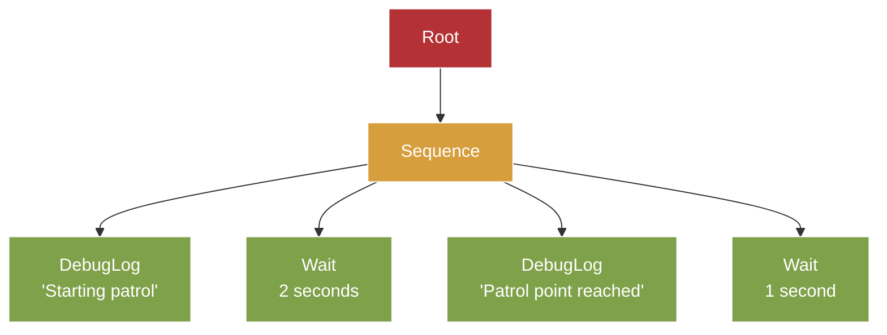
```mermaid
flowchart TB
    Root["Root"] --> Seq["Sequence"]
    Seq --> Log1["DebugLog<br>'Starting patrol'"]
    Seq --> Wait1["Wait<br>2 seconds"]
    Seq --> Log2["DebugLog<br>'Patrol point reached'"]
    Seq --> Wait2["Wait<br>1 second"]

    style Root fill:#b43236,stroke:#fff,color:#fff
    style Seq fill:#d69e3c,stroke:#fff,color:#fff
    style Log1 fill:#7fa14a,stroke:#fff,color:#fff
    style Wait1 fill:#7fa14a,stroke:#fff,color:#fff
    style Log2 fill:#7fa14a,stroke:#fff,color:#fff
    style Wait2 fill:#7fa14a,stroke:#fff,color:#fff
```

1. The **Root** node is created automatically
2. Right-click → **CompositeNode → Base → SequencerNode** → connect it to Root
3. Right-click → **ActionNode → Base → DebugLogNode** → connect to Sequencer, set message `"Starting patrol"`
4. Right-click → **ActionNode → Base → WaitNode** → connect to Sequencer, set duration `2`
5. Add another DebugLogNode and WaitNode as shown above

### Step 4: Attach to a GameObject

1. Create a new empty GameObject named `PatrolAgent`
2. **Add Component → BTRunnerComponent**
3. Drag the `PatrolTree` asset into the **Behavior Tree** field
4. Check **Start On Awake**
5. Press **Play** — watch the Console output and the editor visualization

### Step 5: Observe the Editor

With the `PatrolTree` asset selected and the Behavior Tree Editor open:

- **Green glow** = node is Running
- **Green border** = node Succeeded
- **Red border** = node Failed
- **Flowing dots** along edges = data flow direction
- **Progress bar** on WaitNode = countdown timer

---

## Code-First Runtime Trees

Use `RuntimeBehaviorTreeBuilder` when a tree should be generated by code, created in tests, assembled from data, or hosted outside a serialized `BehaviorTree` asset. The builder is a runtime factory: it creates a `RuntimeRootNode`, seals composite children, wires the `RuntimeBlackboard`, and returns a ready-to-tick `RuntimeBehaviorTree`.

```csharp
using CycloneGames.BehaviorTree.Runtime.Core;

static readonly int HasTargetKey = UnityEngine.Animator.StringToHash("HasTarget");
static readonly int AttackCountKey = UnityEngine.Animator.StringToHash("AttackCount");

RuntimeBehaviorTree tree = new RuntimeBehaviorTreeBuilder(ownerGameObject)
    .WithServiceResolver(new RuntimeBTContext.ServiceProviderResolver(serviceProvider))
    .WithTickInterval(1)
    .Selector()
        .Sequence()
            .Condition(bb => bb.GetBool(HasTargetKey), "HasTarget")
            .CoolDown(0.75f)
                .Action(bb =>
                {
                    bb.SetInt(AttackCountKey, bb.GetInt(AttackCountKey) + 1);
                    return RuntimeState.Success;
                }, "Attack")
            .End()
        .End()
        .Action(bb => RuntimeState.Success, "Idle")
    .End()
    .Build();

tree.Play();
tree.Tick();
```

For reusable gameplay rules, prefer command and strategy objects over large inline lambdas:

```csharp
public sealed class AttackCommand : IRuntimeBTCommand
{
    public RuntimeState Execute(RuntimeBlackboard blackboard)
    {
        // Call a domain service, update blackboard state, or enqueue an animation request.
        return RuntimeState.Success;
    }
}

public sealed class HasTargetCondition : IRuntimeBTConditionStrategy
{
    public bool Evaluate(RuntimeBlackboard blackboard)
    {
        return blackboard.GetBool(HasTargetKey);
    }
}

RuntimeBehaviorTree tree = new RuntimeBehaviorTreeBuilder()
    .Sequence()
        .Condition(new HasTargetCondition(), "HasTarget")
        .Command(new AttackCommand(), "Attack")
    .End()
    .Build();
```

The code-first path shares the same runtime nodes as compiled assets. Use it for tests, procedural assembly, server/headless flows, and data-driven factories. Use `BehaviorTree` assets when designers need GraphView authoring, serialized references, and visual runtime inspection.

---

## Core Concepts

### BTRunnerComponent

The primary MonoBehaviour for running behavior trees. Handles compilation, tick management, pause/resume, and blackboard access.

```csharp
// Get the runner
BTRunnerComponent runner = GetComponent<BTRunnerComponent>();

// Lifecycle control
runner.Play();       // Start or restart
runner.Pause();      // Pause execution
runner.Resume();     // Resume from paused state
runner.Stop();       // Stop and reset

// BlackBoard data
runner.BTSetData("Health", 100);          // auto-detects int
runner.BTSetData("Speed", 5.5f);          // auto-detects float
runner.BTSetData("IsAlive", true);        // auto-detects bool
runner.BTSendMessage("EnemySpotted");     // sets "Message" key
runner.BTRemoveData("TargetPosition");    // removes key

// Hot-swap tree at runtime
runner.SetTree(anotherBehaviorTreeAsset);

// Tick mode (default: Self)
runner.SetTickMode(TickMode.PriorityManaged);

// Priority boost for 2 seconds (PriorityManaged mode)
runner.BoostPriority(2f);

// Event-driven wake-up (urgent re-tick)
runner.WakeUp(boostedTicks: 2);

// Optional: inject services (time/random/custom)
runner.SetServiceResolver(new RuntimeBTContext.ServiceProviderResolver(serviceProvider));
```

**Tick Modes:**

| Mode              | Use Case        | How It Works                                            |
| ----------------- | --------------- | ------------------------------------------------------- |
| `Self`            | < 100 agents    | Each component ticks in its own `Update()`              |
| `Managed`         | Simple batching | `BTTickManager` round-robin with budget cap             |
| `PriorityManaged` | 1,000+ agents   | Distance LOD + 8 priority buckets + budget per priority |
| `Manual`          | Full control    | You call `runner.ManualTick()` yourself                 |

### BlackBoard

The blackboard is a **typed key-value store** shared by all nodes in the tree. It uses separate dictionaries per type to avoid boxing — achieving **zero GC** for value type access.


```mermaid
flowchart TB
    BB["RuntimeBlackboard"]
    BB --> IntDict["Dictionary‹int,int›<br>Health, Ammo, Score"]
    BB --> FloatDict["Dictionary‹int,float›<br>Speed, Cooldown"]
    BB --> BoolDict["Dictionary‹int,bool›<br>IsAlive, HasTarget"]
    BB --> VecDict["Dictionary‹int,Vector3›<br>Position, Destination"]
    BB --> ObjDict["Dictionary‹int,object›<br>Target, Weapon"]

    BB -.->|"Parent Chain"| ParentBB["Parent BlackBoard<br>(SubTree scope)"]

    style BB fill:#2a2a3a,stroke:#66a
```

**Key addressing:**

```csharp
// String keys (convenient, hashed internally via Animator.StringToHash)
blackboard.SetInt("Health", 100);
int health = blackboard.GetInt("Health");

// Int keys (maximum performance, pre-hash at init time)
static readonly int k_Health = Animator.StringToHash("Health");
blackboard.SetInt(k_Health, 100);
int health = blackboard.GetInt(k_Health);
```

**Schema-first blackboards** (recommended for production):

```csharp
RuntimeBlackboardSchema schema = new RuntimeBlackboardSchemaBuilder()
    .AddInt("Health", 100, RuntimeBlackboardSyncFlags.Networked)
    .AddBool("HasTarget", RuntimeBlackboardSyncFlags.Delta)
    .AddVector3("SpawnPoint", RuntimeBlackboardSyncFlags.Snapshot)
    .AddObject("Target") // object keys are always local-only
    .Build();

var tree = new RuntimeBehaviorTreeBuilder()
    .WithBlackboardSchema(schema)
    .Action(blackboard =>
    {
        int healthKey = RuntimeBlackboard.DefaultStringHashFunc("Health");
        blackboard.SetInt(healthKey, blackboard.GetInt(healthKey) - 1);
        return RuntimeState.Success;
    })
    .Build();

BTBlackboardDelta delta = BTBlackboardDelta.CreateForSchema(schema);
delta.Attach(tree.Blackboard);
```

When a schema is bound, unknown keys and wrong value types fail fast. `Snapshot` keys are included in full snapshots, `Delta` keys are tracked by schema-created delta trackers, and local-only keys are excluded from network serialization and hash checks.

For deterministic network data, the core blackboard exposes raw `long`, `RuntimeBlackboardLong2`, and `RuntimeBlackboardLong3` slots. These slots are serialized, delta-synced, and hashed without boxing, and are intended for fixed-point, tick-quantized, or externally deterministic values.

When `CycloneGames.DeterministicMath` is present, use the optional `CycloneGames.BehaviorTree.Integrations.DeterministicMath` assembly:

```csharp
using CycloneGames.BehaviorTree.Integrations.DeterministicMath;
using CycloneGames.DeterministicMath;

RuntimeBlackboardSchema schema = new RuntimeBlackboardSchemaBuilder()
    .AddFPInt64("Cooldown", FPInt64.FromString("1.25"))
    .AddFPVector3("Position", RuntimeBlackboardSyncFlags.Networked)
    .Build();

blackboard.SetFPVector3("Position", new FPVector3(
    FPInt64.FromInt(10),
    FPInt64.Zero,
    FPInt64.FromString("3.5")));
```

The integration stores `FPInt64`, `FPVector2`, and `FPVector3` as raw long slots, so BehaviorTree core remains independent of the deterministic math package while network payloads remain bit-stable.

If the define is not active, this namespace and assembly are intentionally absent. Use the raw `SetLong`, `SetLong2`, and `SetLong3` APIs from core when you need deterministic payloads without the fixed-point package.

**Observer system** (push-based change notifications):

```csharp
// React to a specific key change
blackboard.AddObserver("Health", (keyHash, bb) => {
    int hp = bb.GetInt(keyHash);
    if (hp <= 0) OnDeath();
});

// React to ANY key change (useful for network sync)
blackboard.AddGlobalObserver((keyHash, bb) => {
    MarkDirtyForSync();
});
```

**Change detection** (stamp-based polling):

```csharp
ulong lastStamp = 0;
// In tick:
ulong stamp = blackboard.GetStamp("EnemyCount");
if (stamp != lastStamp) {
    lastStamp = stamp;
    // EnemyCount changed — re-evaluate strategy
}
```

**Thread safety** (opt-in):

```csharp
blackboard.EnableThreadSafety(); // allocates ReaderWriterLockSlim once
// Now safe to read/write from background threads
```

### Runtime Time Services (double API)

Runtime time-sensitive nodes (Wait/Delay/Timeout/Service/CoolDown/WaitSuccess, etc.) use
`RuntimeBTTime.GetTime(...)` and store internal timestamps as `double`.

```csharp
public interface IRuntimeBTTimeProvider
{
    double TimeAsDouble { get; }
    double UnscaledTimeAsDouble { get; }
}

// RuntimeBTTime.GetTime(...) resolves in this order:
// 1) IRuntimeBTTimeProvider from blackboard/context service resolver
// 2) UnityEngine.Time.timeAsDouble / unscaledTimeAsDouble
// 3) DateTime fallback on very old runtime targets
```

Practical use cases:

- deterministic simulation clocks
- server-authoritative virtual time
- replay or rollback systems that must avoid float drift

Note: DOD/Burst tick jobs still use `float deltaTime` by design for job throughput and data size.

### Node Lifecycle

Every node follows this state machine:

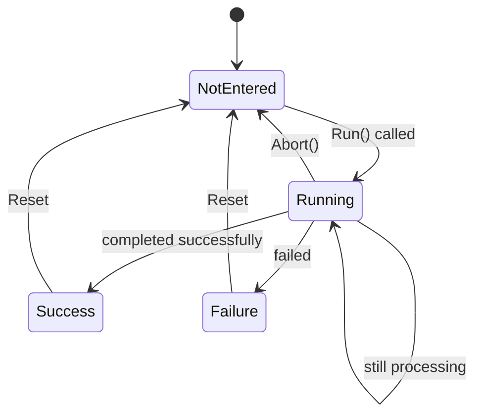
```mermaid
stateDiagram-v2
    [*] --> NotEntered
    NotEntered --> Running : Run() called
    Running --> Running : still processing
    Running --> Success : completed successfully
    Running --> Failure : failed
    Success --> NotEntered : Reset
    Failure --> NotEntered : Reset
    Running --> NotEntered : Abort()
```

**RuntimeNode lifecycle hooks:**

| Hook           | When Called                      | Use For                                                |
| -------------- | -------------------------------- | ------------------------------------------------------ |
| `OnAwake()`    | Once at compile time             | Cache references (0GC)                                 |
| `OnStart()`    | Each time node begins Running    | Initialize per-run state                               |
| `OnRun()`      | Every tick while Running         | Core logic — return `Success`, `Failure`, or `Running` |
| `OnStop()`     | When node finishes or is aborted | Cleanup                                                |
| `ResetState()` | When parent restarts children    | Reset internal counters                                |

**Pre/Post Conditions** (evaluated before/after child execution):

```csharp
// ConditionPolicy options:
// - SkipWhenFalse  → Skip this node, return Failure
// - SucceedWhenFalse → Skip this node, return Success
// - AbortWhenFalse → Abort running child immediately
```

---

## Benchmark & Performance Workflow

The module includes a full benchmark pipeline for editor and PlayMode scenarios.

### Key capabilities

- Runner modes: `Single`, `RecommendedMatrix`, `FullMatrix`, `PriorityComparison`
- Presets: from `AiBattle500` up to `AiExtreme10000`, plus network and soak presets
- Scheduling profiles: `FullRate`, `LodCrowd`, `PriorityLod`, `NetworkMixed`, `FarCrowd`, `UltraLod`, `PriorityManaged`
- Automatic CSV/JSON export via `BehaviorTreeBenchmarkExportUtility`
- Memory and GC metrics (`ManagedMemoryDeltaBytes`, `PeakManagedMemoryBytes`, `Gen0/1/2Collections`)
- Tick efficiency metrics (`EffectiveTickRatio`, `AverageActiveAgentsPerFrame`, `TicksPerSecond`)

### Main APIs

```csharp
// Single-pass benchmark
BehaviorTreeBenchmarkResult result = BehaviorTreeBenchmarkSession.RunImmediate(config);

// Scene runner (supports matrix and priority comparison modes)
BehaviorTreeBenchmarkRunner runner = gameObject.AddComponent<BehaviorTreeBenchmarkRunner>();
runner.RunnerMode = BehaviorTreeBenchmarkRunnerMode.FullMatrix;
runner.SetConfig(config);
runner.BeginBenchmark();
```

### Entry points

- `Tools > CycloneGames > Behavior Tree > Behavior Tree Benchmark`
- Runtime components under `Runtime/PerformanceTest`
- Validation coverage in the `Tests` folder (Editor + PlayMode)

---

## Node Reference

### Composite Nodes

Composite nodes control the **execution flow** of their children.

#### SequencerNode

Executes children **left to right**. Returns `Success` only if **all** children succeed. Returns `Failure` as soon as any child fails.

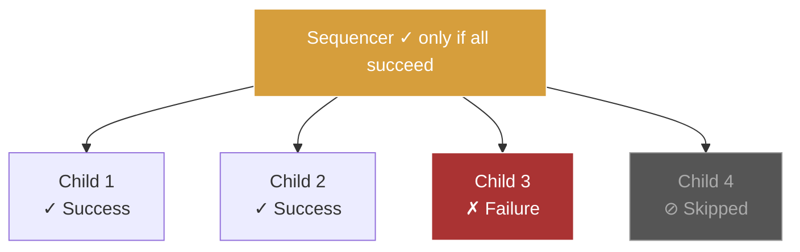
```mermaid
flowchart TB
    S["Sequencer ✓ only if all succeed"] --> C1["Child 1<br>✓ Success"]
    S --> C2["Child 2<br>✓ Success"]
    S --> C3["Child 3<br>✗ Failure"]
    S --> C4["Child 4<br>⊘ Skipped"]

    style S fill:#d69e3c,stroke:#fff,color:#fff
    style C3 fill:#a33,stroke:#fff,color:#fff
    style C4 fill:#555,stroke:#999,color:#aaa
```

**Use case:** "Walk to target AND attack AND play animation" — all steps must succeed.

#### SelectorNode

Executes children **left to right**. Returns `Success` as soon as **any** child succeeds. Returns `Failure` only if **all** children fail.

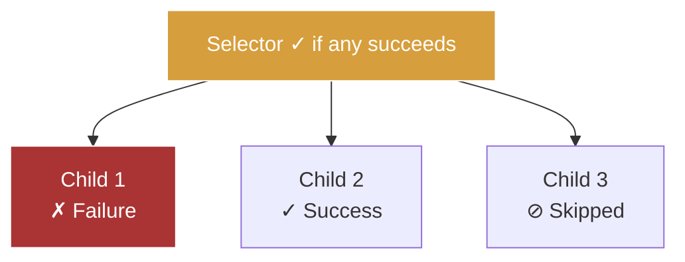
```mermaid
flowchart TB
    S["Selector ✓ if any succeeds"] --> C1["Child 1<br>✗ Failure"]
    S --> C2["Child 2<br>✓ Success"]
    S --> C3["Child 3<br>⊘ Skipped"]

    style S fill:#d69e3c,stroke:#fff,color:#fff
    style C1 fill:#a33,stroke:#fff,color:#fff
```

**Use case:** "Try attack OR flee OR idle" — fallback chain.

#### SelectorRandomNode

Randomizes child order before trying the selector fallback chain. It is useful when several equivalent behaviors should be distributed without building a separate probability table. A seed can be supplied for deterministic replay or networked flows.

**Use case:** "Try one of several patrol points, but fall back to the next available point if the first choice fails."

#### SequenceWithMemoryNode

Like Sequencer, but **remembers** which child was last Running and resumes from there instead of restarting from child 0.

**Use case:** Multi-step quest objectives where you don't want to re-check completed steps.

#### ParallelNode

Executes **all** children simultaneously every tick. Multiple completion modes:

- `Default` — waits for all to finish
- `UntilAnyComplete` — returns as soon as any child finishes
- `UntilAnyFailure` — returns `Failure` on first child failure
- `UntilAnySuccess` — returns `Success` on first child success

**Use case:** "Attack while playing animation" — simultaneous behaviors.

#### ParallelAllNode

Ticks **all** children every frame. Configurable success/failure thresholds (e.g., "succeed if 2 of 3 children succeed").

**Use case:** "3 conditions must pass: has ammo, enemy visible, in range — need at least 2 to proceed."

#### ReactiveSequenceNode

Like Sequence, but **re-evaluates all children from the start every tick**. If a previously-succeeded child now fails, the whole sequence fails.

**Use case:** Guard conditions that must remain true: "Is enemy alive AND in range AND has ammo" — checked every frame.

#### ReactiveFallbackNode

Like Selector, but **re-evaluates from the start every tick**. If a higher-priority child becomes available, lower-priority running children are interrupted.

**Use case:** Priority-based behavior switching: "Combat if enemy near, ELSE patrol, ELSE idle" — transitions instantly.

#### IfThenElseNode

Three children: `[0]` = condition, `[1]` = then branch, `[2]` = else branch. Re-evaluates condition each tick.

**Use case:** "If HasTarget → attack, else → patrol."

#### WhileDoElseNode

Three children: `[0]` = condition (loops), `[1]` = do body, `[2]` = else body. Runs body while condition succeeds.

**Use case:** "While enemy in range → keep shooting, else → seek cover."

#### SwitchNode

N-way branch based on a **blackboard int key**. Child at index matching the int value runs; last child is the default case.

```csharp
// BlackBoard: "AIState" = 0 → child[0], = 1 → child[1], etc.
// Last child is default (fallback)
```

**Use case:** State-driven AI without external state machines: "0=Idle, 1=Patrol, 2=Combat, 3=Flee."

#### ProbabilityBranch

Randomly selects **one** child based on configurable weights. Uses a deterministic RNG (xorshift32) for network-reproducible randomness.

**Use case:** NPCs randomly choosing between dialogue lines or patrol routes.

#### UtilitySelectorNode

**Utility AI** pattern. Each child has a corresponding **blackboard float key** as its score. The child with the highest score runs.

```csharp
// BlackBoard keys: "AttackScore"=0.8, "FleeScore"=0.3, "HealScore"=0.9
// → HealScore highest → child[2] runs
```

**Use case:** Dynamic AI decision-making based on world state evaluation.

#### SimpleParallelNode

Ticks all children every frame. Always returns `Success`.

**Use case:** Fire-and-forget parallel behaviors.

#### ServiceNode

**Unreal Engine–style service**: wraps a single child and periodically executes a side-effect callback at a configurable interval, independent of the child's tick.

**Use case:** "Every 0.5s update target position in blackboard" while child attack behavior runs.

### Decorator Nodes

Decorator nodes **modify the behavior** of a single child.

| Node                            | Behavior                                                                                                                                                                         |
| ------------------------------- | -------------------------------------------------------------------------------------------------------------------------------------------------------------------------------- |
| **InvertNode**                  | Flips `Success` ↔ `Failure`                                                                                                                                                      |
| **SucceederNode**               | Always returns `Success` (even if child fails)                                                                                                                                   |
| **ForceFailureNode**            | Always returns `Failure` (even if child succeeds)                                                                                                                                |
| **RepeatNode**                  | Repeats child N times, or forever. Optionally random repeat count                                                                                                                |
| **RetryNode**                   | Retries child up to N times on failure                                                                                                                                           |
| **TimeoutNode**                 | Fails if child exceeds time limit (in seconds)                                                                                                                                   |
| **DelayNode**                   | Waits N seconds before running child                                                                                                                                             |
| **CoolDownNode**                | Blocks re-execution until cooldown expires                                                                                                                                       |
| **RunOnceNode**                 | Executes child once, caches and returns result on subsequent calls                                                                                                               |
| **KeepRunningUntilFailureNode** | Loops child until it returns `Failure`, then returns `Success`                                                                                                                   |
| **WaitSuccessNode**             | Waits for child to succeed or timeout, returns `Failure` on timeout                                                                                                              |
| **BlackBoardNode**              | Creates a **scoped child blackboard** (parent inherits from current)                                                                                                             |
| **SubTreeNode**                 | References another BehaviorTree asset. Port remapping maps parent BB keys → child BB keys                                                                                        |
| **BBComparisonNode**            | Blackboard conditional: compares int/float/bool keys with operators (`==`, `!=`, `<`, `>`, `<=`, `>=`, `IsSet`, `IsNotSet`). Key-to-key or key-to-constant. Supports abort types |

### Action Nodes

Action nodes are the **leaves** — they perform actual work.

| Node                  | Behavior                                                                                |
| --------------------- | --------------------------------------------------------------------------------------- |
| **DebugLogNode**      | Logs a message to the console (editor only)                                             |
| **WaitNode**          | Waits for a duration (fixed or random range), returns `Success`. Supports unscaled time |
| **MessagePassNode**   | Sets a string value on a blackboard key                                                 |
| **MessageRemoveNode** | Removes a key from the blackboard                                                       |
| **BTChangeNode**      | Triggers a state transition on `BTStateMachineComponent` (sets state by ID)             |

### Condition Nodes

Condition nodes **evaluate** and return `Success` or `Failure` (never `Running`). They are re-evaluable for conditional abort.

| Node                   | Behavior                                                     |
| ---------------------- | ------------------------------------------------------------ |
| **OnOffNode**          | Returns a fixed `Success` or `Failure` (configurable toggle) |
| **MessageReceiveNode** | Checks if a blackboard key equals a specific string          |
| **RandomChanceNode**   | Returns `Success` with `chance / outOf` probability          |

---

## Creating Custom Nodes

### Custom Action Node (Dual-Layer)

```csharp
using CycloneGames.BehaviorTree.Runtime.Attributes;
using CycloneGames.BehaviorTree.Runtime.Core;
using CycloneGames.BehaviorTree.Runtime.Core.Nodes.Actions;
using CycloneGames.BehaviorTree.Runtime.Nodes.Actions;
using UnityEngine;

// === ScriptableObject authoring layer ===
[BTInfo("Custom/Movement", "Moves agent toward target position")]
public class MoveToTargetNode : ActionNode
{
    [SerializeField] private string _targetKey = "TargetPosition";
    [SerializeField] private float _arrivalRadius = 0.5f;

    public override RuntimeNode CreateRuntimeNode()
    {
        return new RuntimeMoveToTarget(
            Animator.StringToHash(_targetKey),
            _arrivalRadius
        ) { GUID = GUID };
    }
}

// === Pure C# runtime execution layer ===
public class RuntimeMoveToTarget : RuntimeStatefulActionNode
{
    private readonly int _targetKey;
    private readonly float _arrivalRadiusSqr;

    public RuntimeMoveToTarget(int targetKey, float arrivalRadius)
    {
        _targetKey = targetKey;
        _arrivalRadiusSqr = arrivalRadius * arrivalRadius;
    }

    protected override RuntimeState OnActionStart(RuntimeBlackboard bb)
    {
        return RuntimeState.Running;
    }

    protected override RuntimeState OnActionRunning(RuntimeBlackboard bb)
    {
        var target = bb.GetVector3(_targetKey);
        var go = bb.GetContextOwner<GameObject>();
        if (go == null) return RuntimeState.Failure;

        var pos = go.transform.position;
        if ((target - pos).sqrMagnitude <= _arrivalRadiusSqr)
            return RuntimeState.Success;

        var dir = (target - pos).normalized;
        go.transform.position = pos + dir
            * bb.GetFloat(Animator.StringToHash("Speed"), 5f)
            * Time.deltaTime;
        return RuntimeState.Running;
    }

    protected override void OnActionHalted(RuntimeBlackboard bb)
    {
        // Cleanup when node is aborted.
    }
}
```

### Custom Condition Node

```csharp
using CycloneGames.BehaviorTree.Runtime.Attributes;
using CycloneGames.BehaviorTree.Runtime.Core;
using CycloneGames.BehaviorTree.Runtime.Conditions;
using CycloneGames.BehaviorTree.Runtime.Nodes;
using UnityEngine;

[BTInfo("Custom/Checks", "Is health above threshold")]
public class CheckHealthNode : ConditionNode
{
    [SerializeField] private string _healthKey = "Health";
    [SerializeField] private int _threshold = 30;

    public override RuntimeNode CreateRuntimeNode()
    {
        return new RuntimeCheckHealth(
            Animator.StringToHash(_healthKey), _threshold
        ) { GUID = GUID };
    }
}

public sealed class RuntimeCheckHealth : RuntimeNode
{
    private readonly int _healthKey;
    private readonly int _threshold;

    public RuntimeCheckHealth(int healthKey, int threshold)
    {
        _healthKey = healthKey;
        _threshold = threshold;
    }

    public override bool CanEvaluate => true;

    public override bool Evaluate(RuntimeBlackboard blackboard)
    {
        return blackboard.GetInt(_healthKey) >= _threshold;
    }

    protected override RuntimeState OnRun(RuntimeBlackboard blackboard)
    {
        return Evaluate(blackboard) ? RuntimeState.Success : RuntimeState.Failure;
    }
}
```

---

## Game Scenario Cookbook

### FPS / Third-Person Shooter

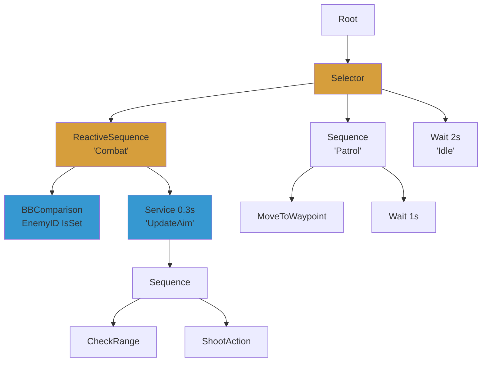
```mermaid
flowchart TB
    Root --> Sel["Selector"]
    Sel --> Combat["ReactiveSequence<br>'Combat'"]
    Sel --> Patrol["Sequence<br>'Patrol'"]
    Sel --> Idle["Wait 2s<br>'Idle'"]

    Combat --> HasEnemy["BBComparison<br>EnemyID IsSet"]
    Combat --> Service["Service 0.3s<br>'UpdateAim'"]
    Service --> Attack["Sequence"]

    Attack --> InRange["CheckRange"]
    Attack --> Shoot["ShootAction"]

    Patrol --> WalkTo["MoveToWaypoint"]
    Patrol --> Wait["Wait 1s"]

    style Sel fill:#d69e3c
    style Combat fill:#d69e3c
    style HasEnemy fill:#3698d1
    style Service fill:#3698d1
```

**Key patterns:**

- `ReactiveSequence` for combat — re-evaluates "HasEnemy" every tick
- `ServiceNode` updates aim direction every 0.3s without blocking attack
- `BBComparisonNode` with `IsSet` checks if target exists

### Open World RPG

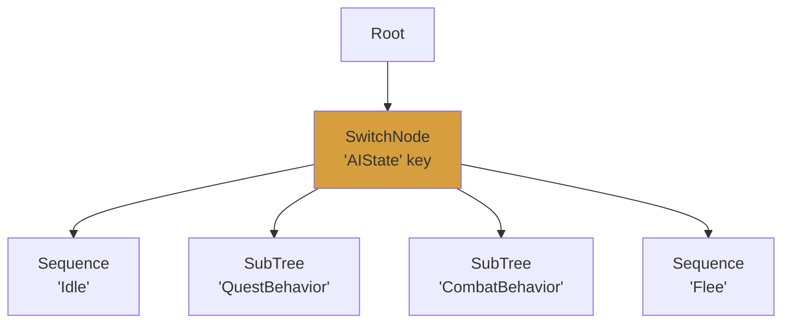
```mermaid
flowchart TB
    Root --> FSM["SwitchNode<br>'AIState' key"]
    FSM --> Idle["Sequence<br>'Idle'"]
    FSM --> Quest["SubTree<br>'QuestBehavior'"]
    FSM --> Combat["SubTree<br>'CombatBehavior'"]
    FSM --> Flee["Sequence<br>'Flee'"]

    style FSM fill:#d69e3c
```

**Key patterns:**

- `SwitchNode` driven by blackboard int "AIState" → branches to different behavior subtrees
- `SubTreeNode` for modular, reusable behavior assets (combat tree, quest tree, etc.)
- `BTStateMachineComponent` for higher-level state transitions between tree assets
- `UtilitySelectorNode` evaluates world state (hunger, danger, curiosity) to pick behavior

### RTS / Colony Sim

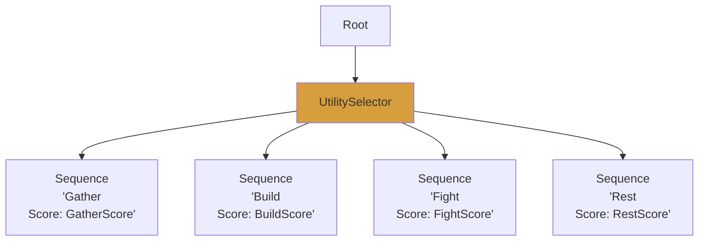
```mermaid
flowchart TB
    Root --> Utility["UtilitySelector"]
    Utility --> Gather["Sequence<br>'Gather<br>Score: GatherScore'"]
    Utility --> Build["Sequence<br>'Build<br>Score: BuildScore'"]
    Utility --> Fight["Sequence<br>'Fight<br>Score: FightScore'"]
    Utility --> Rest["Sequence<br>'Rest<br>Score: RestScore'"]

    style Utility fill:#d69e3c
```

**Key patterns:**

- `UtilitySelectorNode` for dynamic priority — scores updated externally (e.g., "hunger increases RestScore")
- `PriorityManaged` tick mode for hundreds of units
- Burst DOD tier for 10K+ units with simplified flat trees

### Stealth / Horror AI

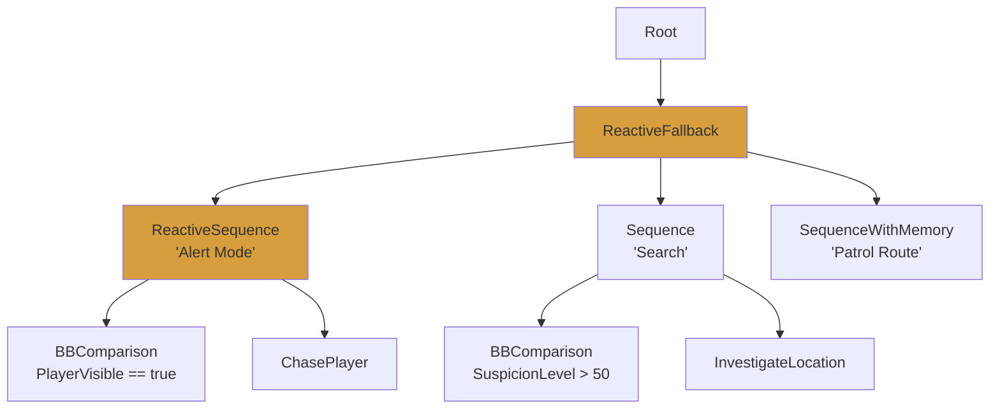
```mermaid
flowchart TB
    Root --> Reactive["ReactiveFallback"]
    Reactive --> Alert["ReactiveSequence<br>'Alert Mode'"]
    Reactive --> Search["Sequence<br>'Search'"]
    Reactive --> PatrolRoute["SequenceWithMemory<br>'Patrol Route'"]

    Alert --> SeePlayer["BBComparison<br>PlayerVisible == true"]
    Alert --> Chase["ChasePlayer"]

    Search --> HeardNoise["BBComparison<br>SuspicionLevel > 50"]
    Search --> Investigate["InvestigateLocation"]

    style Reactive fill:#d69e3c
    style Alert fill:#d69e3c
```

**Key patterns:**

- `ReactiveFallbackNode` — constantly re-evaluates: if player becomes visible during patrol, instantly switches to alert
- `SequenceWithMemoryNode` for patrol — resumes from last waypoint after investigation
- `BBComparisonNode` with `>` operator for threshold checks

### Boss Fight (Multi-Phase)

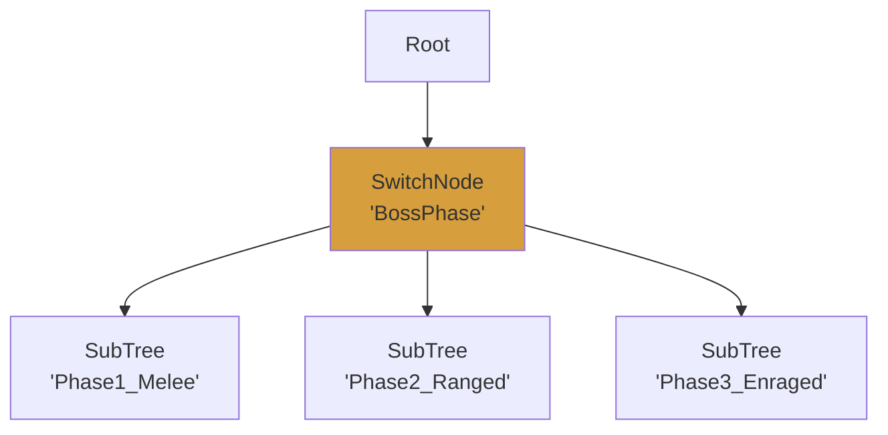
```mermaid
flowchart TB
    Root --> Switch["SwitchNode<br>'BossPhase'"]
    Switch --> P1["SubTree<br>'Phase1_Melee'"]
    Switch --> P2["SubTree<br>'Phase2_Ranged'"]
    Switch --> P3["SubTree<br>'Phase3_Enraged'"]

    style Switch fill:#d69e3c
```

**Key patterns:**

- `SwitchNode` on "BossPhase" blackboard key
- Each phase is a separate `SubTreeNode` asset for clean separation
- `BossAIMarker` component ensures always P0 priority, ticking every frame
- `ProbabilityBranch` within phases for varied attack patterns

---

## Large-Scale AI (1,000+ Agents)

### Priority LOD System


```mermaid
flowchart TB
    Config["BTLODConfig<br>(ScriptableObject)"]
    Config --> LOD0["LOD 0: 0-10m<br>Priority 0<br>Tick every frame"]
    Config --> LOD1["LOD 1: 10-30m<br>Priority 1<br>Tick every 2 frames"]
    Config --> LOD2["LOD 2: 30-50m<br>Priority 2<br>Tick every 4 frames"]
    Config --> LOD3["LOD 3: 50m+<br>Priority 3<br>Tick every 8 frames"]

    Manager["BTPriorityTickManagerComponent"]
    Config --> Manager

    Manager --> Bucket0["P0 Bucket<br>Budget: 100/frame"]
    Manager --> Bucket1["P1 Bucket<br>Budget: 50/frame"]
    Manager --> Bucket2["P2 Bucket<br>Budget: 30/frame"]
    Manager --> Bucket3["P3 Bucket<br>Budget: 20/frame"]

    style Config fill:#2a2a3a,stroke:#66a
    style Manager fill:#2a3a2a,stroke:#4a4
```

### Setup Steps

**Step 1: Create LOD Config**

Project window → **Create → CycloneGames → AI → BT LOD Config**

**Step 2: Configure AI agents**

```csharp
// In Inspector: set TickMode to PriorityManaged
// Or in code:
runner.SetTickMode(TickMode.PriorityManaged);
```

**Step 3: Priority markers (optional)**

For AI types that should always tick at high priority regardless of distance:

| Component       | Priority | Tick Interval | Use For          |
| --------------- | -------- | ------------- | ---------------- |
| `BossAIMarker`  | 0        | 1             | Boss enemies     |
| `EliteAIMarker` | 0        | 1             | Elite units      |
| `VIPNPCMarker`  | 1        | 2             | Quest-giver NPCs |

Or implement `IBTPriorityMarker` for dynamic priority:

```csharp
public class CombatantAI : MonoBehaviour, IBTPriorityMarker
{
    private bool _inCombat;
    public int Priority => _inCombat ? 0 : 3;
    public int TickInterval => _inCombat ? 1 : 8;
}
```

**Step 4: Priority boost for events**

```csharp
// When an AI gets hit, boost its priority for 2 seconds
runner.BoostPriority(2f);
```

### Performance Numbers

| Agent Count | Self Tick     | PriorityManaged    | Notes                               |
| ----------- | ------------- | ------------------ | ----------------------------------- |
| 100         | ✅ Fine       | Overkill           | Simple setup                        |
| 500         | ⚠️ Heavy      | ✅ Recommended     | LOD saves CPU                       |
| 1,000       | ❌ Drops FPS  | ✅ Required        | Budget caps essential               |
| 5,000+      | ❌ Impossible | ✅ With LOD tuning | Consider Burst DOD for simple trees |

---

## DOD / Burst — Mass Simulation (10,000+)

For 10,000+ agents, the system provides a **data-oriented** tier using Unity's Burst compiler and Job System.

### Architecture


```mermaid
flowchart TB
    subgraph Shared["Shared (Read-Only)"]
        FBT["FlatBehaviorTree<br>NativeArray‹FlatNodeDef›<br>NativeArray‹int› ChildIndices"]
    end

    subgraph PerAgent["Per-Agent (Mutable)"]
        State["BTAgentState<br>NativeArray‹byte› NodeStates<br>NativeArray‹int› AuxInts<br>NativeArray‹float› AuxFloats<br>NativeArray‹int/float/byte› BB slots"]
    end

    subgraph Execution["Burst Job"]
        Job["BTTickJob<br>IJobParallelFor<br>@BurstCompile"]
    end

    Shared --> Job
    PerAgent --> Job

    Scheduler["BTTickScheduler<br>AddAgent / RemoveAgent<br>ScheduleTick / CompleteTick"]
    Scheduler --> Shared
    Scheduler --> PerAgent
    Scheduler --> Job

    style Shared fill:#2a2a3a,stroke:#66a
    style PerAgent fill:#2a3a2a,stroke:#4a4
    style Execution fill:#3a2a2a,stroke:#a44
```

**Key concepts:**

- **FlatBehaviorTree** = shared, immutable tree definition (flyweight pattern). Created once per BT template
- **BTAgentState** = per-agent mutable execution state (SoA NativeArrays)
- **BTTickJob** = Burst-compiled `IJobParallelFor` — processes thousands of agents in parallel
- **FlatTreeCompiler** = compiles managed RuntimeBehaviorTree → flat NativeArray representation

### Supported DOD Node Types

| Composites       | Decorators            | Leaves                         |
| ---------------- | --------------------- | ------------------------------ |
| Sequence         | Inverter              | ActionSlot (external callback) |
| Selector         | Repeater              | BlackboardCondition            |
| Parallel         | Succeeder             | WaitTicks                      |
| ReactiveSequence | ForceFailure          |                                |
| ReactiveSelector | Retry, Timeout, Delay |                                |
|                  | RunOnce, CoolDown     |                                |

### Usage

```csharp
// 1. Compile a flat tree from a RuntimeBehaviorTree
FlatBehaviorTree flatTree = FlatTreeCompiler.Compile(runtimeTree);

// 2. Create a scheduler
var scheduler = new BTTickScheduler(flatTree, initialCapacity: 1024, bbSlotCount: 8);

// 3. Add agents
int agentId = scheduler.AddAgent(tickInterval: 2);

// 4. Set agent blackboard values
scheduler.SetBBInt(agentId, slotIndex: 0, value: 100);
scheduler.SetBBFloat(agentId, slotIndex: 1, value: 5.0f);

// 5. Schedule tick (call once per frame)
JobHandle handle = scheduler.ScheduleTick(Time.deltaTime, batchSize: 64);

// 6. Complete and read results
scheduler.CompleteTick();
var rootState = scheduler.GetRootState(agentId);
var actionStatus = scheduler.GetActionStatus(agentId, actionId: 0);

// 7. Cleanup
scheduler.Dispose();
flatTree.Dispose();
```

### When to Use DOD vs Managed

| Criteria                | Use Managed Tick | Use Burst DOD                                |
| ----------------------- | ---------------- | -------------------------------------------- |
| Agent count             | < 5,000          | 5,000 – 100,000+                             |
| Tree complexity         | Any              | Simple to medium (supported node types only) |
| Needs custom actions    | Yes (C# code)    | External action slot callbacks               |
| Needs object blackboard | Yes              | No (int/float/bool only)                     |

---

## Multiplayer Networking

The system provides three synchronization patterns for multiplayer.

Incoming snapshot and delta reads are bounded. `BTNetworkSync.DeserializeSnapshot`, `RuntimeBlackboard.ReadFrom`, `BTBlackboardDelta.Apply`, and `BehaviorTreeNetworkSyncBridge.ApplyPayload` reject oversized or malformed payloads before mutating runtime state. Blackboard `object` values are intentionally local-only and are not serialized, hashed, or replicated.

### Architecture


```mermaid
flowchart LR
    subgraph Server
        STree["RuntimeBehaviorTree"]
        SBB["RuntimeBlackboard"]
    end

    subgraph Network
        Snap["Full Snapshot<br>(CaptureSnapshot)"]
        Delta["Delta Patch<br>(BTBlackboardDelta)"]
        Hash["Desync Check<br>(ComputeHash)"]
    end

    subgraph Client
        CTree["RuntimeBehaviorTree"]
        CBB["RuntimeBlackboard"]
    end

    SBB --> Snap --> CBB
    SBB --> Delta --> CBB
    SBB --> Hash
    CBB --> Hash

    style Server fill:#2a3a2a,stroke:#4a4
    style Client fill:#2a2a3a,stroke:#66a
    style Network fill:#3a2a2a,stroke:#a44
```

### Pattern 1: Server-Authoritative Snapshot

Full state transfer. Server serializes entire blackboard + tree state → client applies.

```csharp
// Server side
var snapshot = BTNetworkSync.CaptureSnapshot(serverTree);   // → BTStateSnapshot
byte[] data = BTNetworkSync.SerializeSnapshot(snapshot);     // → byte[] for network
SendToClient(data);

// Client side
var snapshot = BTNetworkSync.DeserializeSnapshot(data);
BTNetworkSync.ApplyBlackboardSnapshot(clientTree, snapshot); // restores blackboard
```

### Pattern 2: Client-Predicted with Hash Comparison

Client runs its own copy, server sends hash to verify. On mismatch → full resync.

```csharp
// Server sends its blackboard hash each tick
ulong serverHash = serverBlackboard.ComputeHash();
SendToClient(serverHash);

// Client checks for desync
if (BTNetworkSync.CheckDesync(clientTree, serverHash))
{
    // Hashes don't match — request full snapshot resync
    var snapshot = BTNetworkSync.CaptureSnapshot(serverTree);
    BTNetworkSync.ApplyBlackboardSnapshot(clientTree, snapshot);
}
```

### Pattern 3: Delta Blackboard Sync

Only changed keys are transmitted. Bind the tracker to the source blackboard with `Attach` so dirty keys are captured through blackboard observers, then use `TryFlush` in hot paths. The returned patch is an `ArraySegment<byte>` over the tracker-owned pooled buffer and stays valid until the next flush. Writing the same value does not advance the blackboard stamp and does not emit a patch.

```csharp
// Setup: register keys to track (once)
var delta = new BTBlackboardDelta();
delta.TrackKey("Health");
delta.TrackKey("Position");
delta.TrackKey("AlertLevel");
delta.Attach(serverBlackboard);

// Server: flush changes since last sync
if (delta.TryFlush(serverBlackboard, out ArraySegment<byte> patch))
{
    SendToClients(patch);
}

// Client: apply delta
BTBlackboardDelta.Apply(clientBlackboard, patch);
```

### Deterministic RNG

For network reproducibility, use `BTDeterministic.DeterministicRNG`:

```csharp
var rng = new BTDeterministic.DeterministicRNG(seed: 42);
int index = rng.NextInt(0, 5); // same result on server and client with same seed
```

Runtime nodes that consume random values (`RuntimeWaitNode`, `RuntimeWaitSuccessNode`, `RuntimeRepeatNode`, `RuntimeServiceNode`, `RuntimeSelectorRandom`, `RuntimeRandomChanceNode`, and the weighted `RuntimeProbabilityBranch` fallback path) resolve an optional `IRuntimeBTRandomProvider` from the blackboard service registry. Register a deterministic provider for networked or replayed trees; when none is registered they fall back to `UnityEngine.Random` (non-deterministic, editor/standalone default).

If `CycloneGames.DeterministicMath` is available, `DeterministicMathRandomProvider` can be registered as that service and can save/restore its random state for rollback:

```csharp
var randomProvider = new DeterministicMathRandomProvider(seed: 12345UL);
DeterministicRandomState checkpoint = randomProvider.SaveState();
randomProvider.RestoreState(checkpoint);
```

---

## Advanced Patterns

### SubTree Composition

Split large behavior trees into reusable modules:

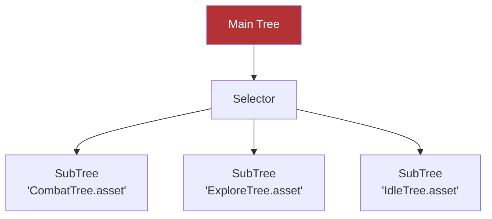
```mermaid
flowchart TB
    Main["Main Tree"] --> Sel
    Sel["Selector"] --> Combat["SubTree<br>'CombatTree.asset'"]
    Sel --> Explore["SubTree<br>'ExploreTree.asset'"]
    Sel --> Idle["SubTree<br>'IdleTree.asset'"]

    style Main fill:#b43236,color:#fff
```

SubTree port remapping maps parent blackboard keys to child blackboard keys:

```
Parent "EnemyPosition" → Child "TargetPos"
Parent "PlayerHealth"   → Child "HP"
```

The child tree operates on its own scoped blackboard that inherits from the parent.

### Behavior Tree + State Machine

Use `BTStateMachineComponent` for high-level state transitions between entire trees:

```csharp
// Define states in Inspector:
// State "Patrol"  → PatrolTree.asset
// State "Combat"  → CombatTree.asset
// State "Retreat" → RetreatTree.asset

// Transition from within a tree using BTChangeNode:
// Or programmatically:
stateMachine.SetState("Combat");
```

### Conditional Abort

Interrupt running behaviors when conditions change:

| Abort Type      | Behavior                                                   |
| --------------- | ---------------------------------------------------------- |
| `None`          | No interruption                                            |
| `Self`          | Aborts own subtree when condition changes                  |
| `LowerPriority` | Aborts lower-priority siblings when condition becomes true |
| `Both`          | Combines Self + LowerPriority                              |

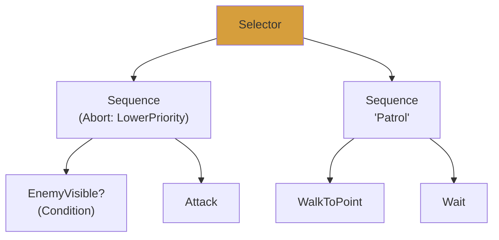
```mermaid
flowchart TB
    Sel["Selector"] --> Seq1["Sequence<br>(Abort: LowerPriority)"]
    Sel --> Seq2["Sequence<br>'Patrol'"]

    Seq1 --> Cond["EnemyVisible?<br>(Condition)"]
    Seq1 --> Attack["Attack"]

    Seq2 --> WalkTo["WalkToPoint"]
    Seq2 --> Wait["Wait"]

    style Sel fill:#d69e3c
```

If `EnemyVisible` becomes true while Patrol is running, `LowerPriority` abort interrupts Patrol and switches to Attack.

### Event-Driven Execution

Nodes can request immediate re-tick via wake-up signals:

```csharp
// Inside a custom RuntimeNode
protected override RuntimeState OnRun(RuntimeBlackboard bb)
{
    if (significantEventOccurred)
    {
        EmitWakeUpSignal(); // triggers immediate tick even if LOD says "skip"
    }
    return RuntimeState.Running;
}
```

External systems can wake trees directly:

```csharp
// e.g. called by perception, damage, netcode, or gameplay event bus
runner.WakeUp(boostedTicks: 2);
```

In `PriorityManaged` mode, wake-up requests are promoted using boosted priority/tick interval before normal LOD updates.

### Open World — Large Map Optimization

For open-world games with thousands of spread-out NPCs:

1. **Distance LOD** — far-away NPCs tick less frequently (every 4–8 frames)
2. **Priority markers** — quest-relevant NPCs always tick at full speed
3. **Group provider overrides** — coordinated squads share explicit priority and interval
4. **Chunk-based activation** — only activate `BTRunnerComponent` for loaded chunks
5. **SubTree sharing** — common behavior trees shared as assets, compiled per-instance
6. **BTTreePool** — template pool for ECS-like mass instantiation:

```csharp
// Create pool and register template (once)
var pool = new BTTreePool();
int guardTemplate = pool.RegisterTemplate(guardTreeAsset); // → template index

// Allocate instance O(1) — each has its own node graph & blackboard
int instanceId = pool.Allocate(guardTemplate);
RuntimeBehaviorTree instance = pool.GetInstance(instanceId);

// Tick a single instance, or batch-tick all active instances
pool.Tick(instanceId);
pool.TickAll();

// Release back to pool O(1)
pool.Release(instanceId);
```

Group provider example:

```csharp
public class SquadGroupProvider : MonoBehaviour, IBTAgentGroupProvider
{
    public int GroupId => 7;
    public int GroupPriority => 1;
    public int GroupTickInterval => 2;
}
```

---

## Editor Visualization


### Features

| Feature               | Description                                                                     |
| --------------------- | ------------------------------------------------------------------------------- |
| **State Coloring**    | Green glow = Running, Green border = Success, Red border = Failure              |
| **Animated Edges**    | Flowing dot particles along bezier curves show data flow direction              |
| **Progress Bars**     | WaitNode shows real-time countdown with remaining seconds                       |
| **Info Labels**       | Sequencer shows "3/5", Repeat shows "Count: 7", BBComparison shows "≥ ✓"        |
| **State Labels**      | Each node shows "RUNNING" / "SUCCESS" / "FAILURE" overlay                       |
| **Edge State Colors** | Running edges glow green, success edges are bright green, failure edges are red |
| **Copy/Paste**        | Select nodes → right-click → Copy/Paste                                         |
| **Auto Sort**         | Right-click → Sort Nodes arranges tree hierarchically                           |
| **Alt+Click**         | Delete edges by Alt+clicking them                                               |
| **Inspector**         | Left panel shows selected node properties via IMGUI                             |
| **0GC in Editor**     | FieldInfo caching, StringBuilder reuse, 10Hz throttling                         |

### Opening the Editor

- **Menu**: Tools → CycloneGames → Behavior Tree Editor
- **Double-click** any BehaviorTree asset
- **Select** a GameObject with BTRunnerComponent

---

## Optimization Guide

### Zero-GC Best Practices

| Do                                                                    | Don't                                                     |
| --------------------------------------------------------------------- | --------------------------------------------------------- |
| `blackboard.GetInt(key)`                                              | `(int)blackboard.Get("key")` (boxing)                     |
| Pre-hash keys: `static readonly int k = Animator.StringToHash("Key")` | Hash every frame: `Animator.StringToHash("Key")` in OnRun |
| Cache component references in `OnAwake()`                             | `GetComponent<T>()` in `OnRun()`                          |
| Use `RuntimeStatefulActionNode` pattern                               | Manual `_wasRunning` flag tracking                        |
| `sqrMagnitude` for distance checks                                    | `Vector3.Distance()` (sqrt)                               |

### Scaling Recommendations

| Scenario                         | Recommendation                                |
| -------------------------------- | --------------------------------------------- |
| < 100 agents, complex trees      | `TickMode.Self` — simplest setup              |
| 100–500 agents, mixed complexity | `TickMode.Managed` with budget cap            |
| 500–5,000 agents                 | `TickMode.PriorityManaged` + LOD config       |
| 5,000–100,000 simple agents      | Burst DOD (`BTTickScheduler` + `BTTickJob`)   |
| Mix of complex + simple agents   | PriorityManaged for key NPCs + DOD for crowds |

### Memory Optimization

- `RuntimeCompositeNode.Seal()` freezes child list → array, releases list memory
- `BTTreePool` pools compiled tree instances with O(1) free-list recycle
- `BTDistanceLODProvider` uses parallel arrays (not Dictionary iteration) for 0GC LOD updates
- `RuntimeBlackboard` implements `IDisposable` — automatically disposes `ReaderWriterLockSlim` when tree stops

### Thread Safety

- `RuntimeBlackboard.EnableThreadSafety()` — opt-in `ReaderWriterLockSlim` for multi-threaded access
- Observer notifications fire **outside** the write lock — callbacks can safely read/write the blackboard
- `BTTickJob` uses Burst `IJobParallelFor` — NativeArray guarantees thread isolation
- `RuntimeBehaviorTree` uses `Interlocked` and `Volatile` for wake-up flags and boosted tick budget — safe for cross-thread wake-up signals

---

## API Reference

### Core Types

```csharp
// Runtime state (0GC execution layer)
public enum RuntimeState { NotEntered, Running, Success, Failure }

// Editor state (SO layer)
public enum BTState { NOT_ENTERED, RUNNING, SUCCESS, FAILURE }

// Tick modes
public enum TickMode { Self, Managed, PriorityManaged, Manual }

// Conditional abort types
public enum ConditionalAbortType { NONE, SELF, LOWER_PRIORITY, BOTH }

// Benchmark runner modes
public enum BehaviorTreeBenchmarkRunnerMode
{
    Single, RecommendedMatrix, FullMatrix, PriorityComparison
}
```

### Runtime Time Services

```csharp
public interface IRuntimeBTTimeProvider
{
    double TimeAsDouble { get; }
    double UnscaledTimeAsDouble { get; }
}

public static class RuntimeBTTime
{
    public static double GetTime(RuntimeBlackboard blackboard, bool useUnscaledTime);
    public static double GetUnityTime(bool useUnscaledTime);
    public static double GetUnityDeltaTime(bool useUnscaledTime);
}
```

### RuntimeBehaviorTree (event-driven)

```csharp
public class RuntimeBehaviorTree : IRuntimeBTContext
{
    bool HasWakeUpRequest { get; }
    int WakeUpTickBudget { get; }

    void WakeUp(int boostedTicks = 1);
    bool ConsumeWakeUp();
    bool ShouldTick();
}
```

### Code-First Runtime Construction

```csharp
public sealed class RuntimeBehaviorTreeBuilder
{
    RuntimeBehaviorTreeBuilder WithContext(RuntimeBTContext context);
    RuntimeBehaviorTreeBuilder WithOwner(GameObject owner);
    RuntimeBehaviorTreeBuilder WithServiceResolver(IRuntimeBTServiceResolver resolver);
    RuntimeBehaviorTreeBuilder WithBlackboard(RuntimeBlackboard blackboard);
    RuntimeBehaviorTreeBuilder WithTickInterval(int tickInterval);

    RuntimeBehaviorTreeBuilder Sequence(Action<RuntimeSequencer> configure = null);
    RuntimeBehaviorTreeBuilder Selector(Action<RuntimeSelector> configure = null);
    RuntimeBehaviorTreeBuilder SelectorRandom(uint seed = 0u, Action<RuntimeSelectorRandom> configure = null);
    RuntimeBehaviorTreeBuilder Action(Func<RuntimeBlackboard, RuntimeState> run, string name = null);
    RuntimeBehaviorTreeBuilder Command(IRuntimeBTCommand command, string name = null);
    RuntimeBehaviorTreeBuilder Condition(Func<RuntimeBlackboard, bool> predicate, string name = null);
    RuntimeBehaviorTreeBuilder Condition(IRuntimeBTConditionStrategy strategy, string name = null);
    RuntimeBehaviorTreeBuilder RandomChance(float chance, float outOf = 1f, uint seed = 0u, string name = null);
    RuntimeBehaviorTreeBuilder End();
    RuntimeBehaviorTree Build();
}

public interface IRuntimeBTCommand
{
    RuntimeState Execute(RuntimeBlackboard blackboard);
}

public interface IRuntimeBTConditionStrategy
{
    bool Evaluate(RuntimeBlackboard blackboard);
}
```

### Group-based LOD Override

```csharp
public interface IBTAgentGroupProvider
{
    int GroupId { get; }
    int GroupPriority { get; }
    int GroupTickInterval { get; }
}
```

### RuntimeBlackboard

```csharp
public class RuntimeBlackboard : IDisposable
{
    // Typed access (0GC)
    void SetInt(int key, int value);
    int GetInt(int key, int defaultValue = 0);
    void SetFloat(int key, float value);
    float GetFloat(int key, float defaultValue = 0f);
    void SetBool(int key, bool value);
    bool GetBool(int key, bool defaultValue = false);
    void SetVector3(int key, Vector3 value);
    Vector3 GetVector3(int key, Vector3 defaultValue = default);
    void SetObject(int key, object value);
    T GetObject<T>(int key);

    // TryGet (precise type probing)
    bool TryGetInt(int key, out int value);
    bool TryGetFloat(int key, out float value);
    bool TryGetBool(int key, out bool value);
    bool TryGetVector3(int key, out Vector3 value);
    bool TryGetObject<T>(int key, out T value) where T : class;

    // String-key convenience (all methods above also accept string)

    // Existence & removal
    bool HasKey(int key);
    void Remove(int key);
    void Clear();

    // Change detection
    ulong GetStamp(int key);

    // Observer system
    void AddObserver(int keyHash, BlackboardObserverCallback callback);
    void RemoveObserver(int keyHash, BlackboardObserverCallback callback);
    void AddGlobalObserver(BlackboardObserverCallback callback);
    void RemoveGlobalObserver(BlackboardObserverCallback callback);
    void ClearAllObservers();

    // Thread safety
    void EnableThreadSafety();

    // Serialization (network)
    void WriteTo(BinaryWriter writer);
    void ReadFrom(BinaryReader reader);
    void ReadFrom(BinaryReader reader, RuntimeBlackboardSerializationLimits limits);
    ulong ComputeHash();

    // Hierarchy
    RuntimeBlackboard Parent { get; set; }
    IRuntimeBTContext Context { get; set; }
    T GetContextOwner<T>() where T : class;
    T GetService<T>() where T : class;

    // IDisposable
    void Dispose();
}
```

### RuntimeNode

```csharp
public abstract class RuntimeNode
{
    public RuntimeState State { get; }
    public bool IsStarted { get; }
    public string GUID { get; set; }
    public RuntimeBehaviorTree OwnerTree { get; set; }

    public RuntimeState Run(RuntimeBlackboard blackboard);
    public void Abort(RuntimeBlackboard blackboard);
    public virtual void ResetState();

    protected virtual void OnAwake();
    protected virtual void OnStart(RuntimeBlackboard blackboard);
    protected abstract RuntimeState OnRun(RuntimeBlackboard blackboard);
    protected virtual void OnStop(RuntimeBlackboard blackboard);

    // Pre/Post conditions
    public NodeCondition[] PreConditions { get; set; }
    public NodeCondition[] PostConditions { get; set; }

    // Event-driven
    protected void EmitWakeUpSignal();
}
```

### BTRunnerComponent

```csharp
public class BTRunnerComponent : MonoBehaviour
{
    // Properties
    BehaviorTree Tree { get; }
    RuntimeBehaviorTree RuntimeTree { get; }
    TickMode TickMode { get; }
    bool IsPaused { get; }
    bool IsStopped { get; }

    // Lifecycle
    void Play();
    void Pause();
    void Resume();
    void Stop();
    RuntimeState ManualTick();

    // Data
    void BTSetData(string key, object value);
    void BTSendMessage(string message);
    void BTRemoveData(string key);

    // Configuration
    void SetTree(BehaviorTree newTree);
    void SetContext(RuntimeBTContext context);
    void SetServiceResolver(IRuntimeBTServiceResolver resolver);
    void SetTickMode(TickMode mode);
    void SetTickInterval(int interval);
    void BoostPriority(float duration);
    void WakeUp(int boostedTicks = 1);

    // Static
    static IReadOnlyList<BTRunnerComponent> ActiveRunners { get; }
    event Action OnTreeStopped;
}
```

---
