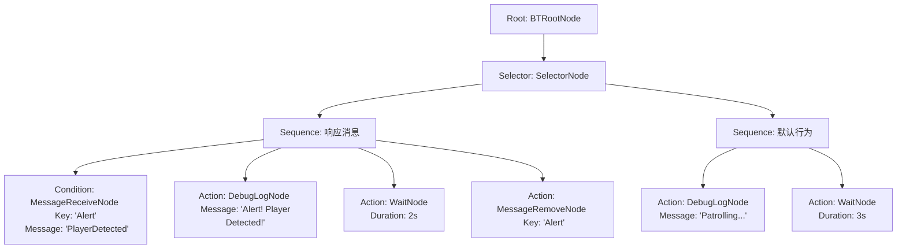

## This is Sample BehaviorTree design mermaid

```mermaid
graph TD
    Root[Root: BTRootNode] --> Selector[Selector: SelectorNode]
    
    %% 优先分支：响应消息
    Selector --> ResponseSeq[Sequence: 响应消息]
    %% 备用分支：默认行为
    Selector --> DefaultSeq[Sequence: 默认行为]
    
    %% 响应消息分支：检查是否有消息，如果有则处理
    ResponseSeq --> CheckMessage[Condition: MessageReceiveNode <br/> Key: 'Alert' <br/> Message: 'PlayerDetected']
    ResponseSeq --> LogResponse[Action: DebugLogNode <br/> Message: 'Alert! Player Detected!']
    ResponseSeq --> WaitResponse[Action: WaitNode <br/> Duration: 2s]
    ResponseSeq --> ClearMessage[Action: MessageRemoveNode <br/> Key: 'Alert']
    
    %% 默认行为分支：正常巡逻/待机
    DefaultSeq --> LogDefault[Action: DebugLogNode <br/> Message: 'Patrolling...']
    DefaultSeq --> WaitDefault[Action: WaitNode <br/> Duration: 3s]
```

