# CycloneGames.Cheat

[English | 简体中文](README.md)

CycloneGames.Cheat 是面向内部调试、QA、GM、自动化和 live-ops 工具的命令层。模块通过 VitalRouter 路由强类型命令，把包级中性契约放在 `Core` assembly、Unity-facing runtime 服务放在 `Runtime` assembly，并用 `ENABLE_CHEAT` 构建符号把关，让发布版本以 no-op runtime 运行。

## 目录

- [概述](#概述)
- [架构](#架构)
- [快速上手](#快速上手)
- [核心概念](#核心概念)
- [使用指南](#使用指南)
- [进阶主题](#进阶主题)
- [常见场景](#常见场景)
- [性能与内存](#性能与内存)
- [故障排查](#故障排查)

## 概述

Cheat 命令回答一个问题：哪个内部操作应该在哪个 router 上、用哪个 payload 运行？CycloneGames.Cheat 用小型 `ICheatCommand` struct 通过 `CheatCommandRuntime` 派发回答它。Runtime 按 `Router` 跟踪在飞命令，应用重复策略，支持取消，并暴露计数器供 QA 面板和 live-ops dashboard 读取。

模块分为两个 runtime assembly 加可选的 VContainer integration。`Core` 携带命令 payload、重复策略、metrics struct 和 `ICheatLogger` 契约，不引用 `UnityEngine`。`Runtime` 添加 `CheatCommandRuntime`、`CheatCommandExecutionOptions` 和 `UnityDebugCheatLogger`。当 `ENABLE_CHEAT` 未定义时，runtime 编译为 no-op，所有 publish 立即完成，不派发、不累加 metrics、不写日志。

适用场景：为调试控制台、测试运行器、GM 工具和自动化提供一个统一的强类型入口。不要用作反作弊——商业多人项目仍必须在服务端验证权威操作，通过环境和身份限制高权限命令，审计使用记录，并不把客户端调试命令当作玩法事实来源。

### 主要特性

- **`ICheatCommand` payload**：`CheatCommand`、`CheatCommand<T>`、`CheatCommand<T1,T2>`、`CheatCommand<T1,T2,T3>` 与 `CheatCommandClass<T>`（用于引用类型 payload）。
- **`CheatCommandRuntime`**：显式 owner 的 runtime，含按 router 跟踪、重复策略、取消和 metrics。
- **`CheatCommandExecutionOptions`**：值类型选项，在调用处指定 `Router`、`DuplicatePolicy` 和 `Source`。
- **`ENABLE_CHEAT` 构建开关**：未定义时 runtime 成为 no-op，派发零开销。
- **`UnityDebugCheatLogger`**：默认 `ICheatLogger`，写入 `UnityEngine.Debug`。
- **可选 VContainer installer**：把 `ICheatCommandRuntime`、`ICheatCommandPublisher` 与 `ICheatCommandControl` 注册为单例。

## 架构

| 程序集 | 路径 | 用途 |
| --- | --- | --- |
| `CycloneGames.Cheat.Core` | `Core/` | 命令 payload、`CheatDuplicatePolicy`、`CheatRuntimeMetrics`、`ICheatLogger`。`noEngineReferences: true`；仅引用 `VitalRouter.dll`。 |
| `CycloneGames.Cheat.Runtime` | `Runtime/` | `CheatCommandRuntime`、`ICheatCommandRuntime` / `ICheatCommandPublisher` / `ICheatCommandControl`、`CheatCommandExecutionOptions`、`UnityDebugCheatLogger`。引用 `UniTask`、`VitalRouter.Unity` 与 `CycloneGames.Cheat.Core`。 |
| `CycloneGames.Cheat.Runtime.Integrations.VContainer` | `Runtime/Integrations/DI/VContainer/` | `CheatVContainerInstaller`。仅当 `VCONTAINER_PRESENT` 定义时编译。 |
| `CycloneGames.Cheat.Tests.Editor` | `Tests/Editor/` | Core 与 Runtime 契约测试。 |
| `CycloneGames.Cheat.Sample` | `Samples/` | 可选示例与基准。 |

```mermaid
flowchart LR
    Caller["Caller\nGM console, test runner, automation"] --> Publisher["ICheatCommandPublisher"]
    Publisher --> Runtime["CheatCommandRuntime"]
    Runtime --> Policy{"DuplicatePolicy"}
    Policy -->|Drop| Register["Register state\nkeyed by CommandId+Router+Type"]
    Policy -->|AllowParallel| Sequence["Allocate per-call sequence"]
    Sequence --> Register
    Register --> Router["VitalRouter Router\n(default or scoped)"]
    Router --> Handler["Handler\n[Routes] + [Route]"]
    Handler --> Metrics["CheatRuntimeMetrics"]
    Register --> Metrics

    classDef core fill:#dbeafe,stroke:#1d4ed8,color:#111827;
    classDef adapter fill:#fef3c7,stroke:#b45309,color:#111827;
    classDef external fill:#dcfce7,stroke:#15803d,color:#111827;
    class Runtime,Register,Metrics core;
    class Publisher,Handler adapter;
    class Router external;
```



调用方决定哪个 `Router` 接收命令，runtime 用 `(CommandId, Router, CommandTypeHandle, Sequence)` 作为 key 跟踪状态，VitalRouter 派发到 source-generated handler，runtime 记录 metrics 并在 handler 退出时释放状态。

## 快速上手

在你的 asmdef 中引用 `CycloneGames.Cheat.Runtime`，然后导入命名空间：

```csharp
using CycloneGames.Cheat.Core;
using CycloneGames.Cheat.Runtime;
using Cysharp.Threading.Tasks;
```

### 创建 runtime 并 publish 命令

```csharp
var runtime = new CheatCommandRuntime(new UnityDebugCheatLogger());
await runtime.PublishAsync("World_ReloadConfig");
runtime.Dispose();
```

### 用 VitalRouter source generation 定义 handler

```csharp
using System.Threading;
using Cysharp.Threading.Tasks;
using UnityEngine;
using VitalRouter;

[Routes]
public partial class DebugWorldCheatHandler : MonoBehaviour
{
    private void Awake() => MapTo(Router.Default);
    private void OnDestroy() => UnmapRoutes();

    [Route]
    private async UniTask OnReload(CheatCommand command, CancellationToken cancellationToken)
    {
        if (command.CommandId != "World_ReloadConfig")
        {
            return;
        }

        await UniTask.Yield(cancellationToken);
    }
}
```

`ENABLE_CHEAT` 定义时，runtime 通过 `Router.Default` 派发命令，handler 接收并执行，metrics 反映派发。未定义时，同一调用返回 `UniTask.CompletedTask`，不发生派发。

## 核心概念

### 命令

每个 payload 实现 `ICheatCommand`，后者又实现 `VitalRouter.ICommand`：

| 类型 | 用途 |
| --- | --- |
| `CheatCommand` | 只有 command ID。 |
| `CheatCommand<T>` | 一个 struct payload。 |
| `CheatCommand<T1, T2>` | 两个 struct payload。 |
| `CheatCommand<T1, T2, T3>` | 三个 struct payload。 |
| `CheatCommandClass<T>` | 一个引用类型 payload。热路径优先使用 struct payload。 |

稳定生产工作流建议定义实现 `ICheatCommand` 的专用 command struct，而不是用字符串分支处理所有操作。专用类型让 VitalRouter 提供更强的路由，并减少 handler 内部分支。

### Runtime 所有权

`CheatCommandRuntime` 由调用方显式持有。非 DI 项目可以直接创建；DI 项目可以注册 `ICheatCommandRuntime`、`ICheatCommandPublisher` 和 `ICheatCommandControl`。释放 runtime 会停止新的 publish 请求，对运行中的命令请求取消，并由对应 publish 操作在 handler 退出时释放命令状态。

模块不提供全局 static facade。长期项目应在 scene root、工具 owner、service composition root 或 DI lifetime scope 中显式表达所有权。

### 重复策略

`CheatDuplicatePolicy` 控制同一 command ID 在同一 `Router` 上、前一命令仍在运行时第二次 publish 的处理方式：

| 策略 | 行为 |
| --- | --- |
| `Drop`（默认） | 第二次 publish 被丢弃并计入 `DroppedDuplicateCount`。 |
| `AllowParallel` | 第二次 publish 获得新 sequence number，与第一次并行运行。 |

`Drop` 适合 "reload config" 或 "reset inventory" 这类有状态操作。`AllowParallel` 适合 "spawn enemy at point" 这类无状态触发，多次执行相互独立。

### 构建开关

`ENABLE_CHEAT` 控制 `CheatCommandRuntime` 是否可用：

| 状态 | 行为 |
| --- | --- |
| 已定义 | Publish 通过 VitalRouter 派发，metrics 累加，runtime 记录错误与异常。 |
| 未定义 | Publish 立即返回 `UniTask.CompletedTask`，metrics 保持为零，不派发，不写日志。 |

Disabled 路径保持相同的 public API 和 assembly 引用，调用方不需要 `#if` 守卫。Sample 和工具 UI 如果需要解释 disabled runtime，应在自身启动诊断中提示。

## 使用指南

### 带参数 publish

```csharp
await runtime.PublishAsync("Player_SetHealth", 50);
await runtime.PublishAsync("Player_SetPosition", 12.5f, 7.0f);
await runtime.PublishAsync("Inventory_AddItem", itemId: 42, count: 1, rarity: 3);
```

每个重载把参数包装到对应的 `CheatCommand<T>`、`CheatCommand<T1, T2>` 或 `CheatCommand<T1, T2, T3>` struct。

### 引用类型 payload

```csharp
public sealed class InventoryBatch
{
    public int[] ItemIds;
}

await runtime.PublishClassAsync("Inventory_AddBatch", new InventoryBatch { ItemIds = new[] { 1, 2, 3 } });
```

`PublishClassAsync` 拒绝 null 参数并在派发前记录错误。

### 自定义 command struct

```csharp
public readonly struct ReloadConfigCommand : ICheatCommand
{
    public string CommandId => "World_ReloadConfig";
    public readonly string Profile;
    public ReloadConfigCommand(string profile) => Profile = profile;
}

await runtime.PublishAsync(new ReloadConfigCommand(profile: "Live"));
```

自定义命令与内置变体经过同样的路由、重复与取消管线，VitalRouter 可以派发到专用 handler 方法。

### 使用 execution options

```csharp
var options = new CheatCommandExecutionOptions(
    router: myRouter,
    duplicatePolicy: CheatDuplicatePolicy.AllowParallel,
    source: "AutomationSuite");

await runtime.PublishAsync(new ReloadConfigCommand("Live"), options);

// 或增量构建：
var options2 = default(CheatCommandExecutionOptions)
    .WithRouter(myRouter)
    .WithDuplicatePolicy(CheatDuplicatePolicy.AllowParallel)
    .WithSource("GMConsole");
```

`Router` 为 null 时默认为 `Router.Default`。`Source` 对 runtime 透明——是 owner 产品可用于审计或 UI 分组的 tag。

### 查看与取消运行中命令

```csharp
CheatRuntimeMetrics metrics = runtime.Metrics;
Console.WriteLine($"running={metrics.RunningCommandCount}");
Console.WriteLine($"published={metrics.PublishedCommandCount}");
Console.WriteLine($"dropped={metrics.DroppedDuplicateCount}");
Console.WriteLine($"faulted={metrics.FaultedCommandCount}");

if (runtime.IsCommandRunning("World_ReloadConfig"))
{
    runtime.CancelCommand("World_ReloadConfig");
}

runtime.ClearAll();
```

`CancelCommand` 通过匹配状态拥有的 `CancellationTokenSource` 请求取消。Handler 通过 VitalRouter route 参数接收 token，应迅速退出。

## 进阶主题

### 作用域 Router

命令不应跨系统泄漏时，为不同工具、场景、world 或权限边界使用专用 `Router`：

```csharp
private readonly Router _sceneRouter = new Router();

void Awake()
{
    var runtime = new CheatCommandRuntime(new UnityDebugCheatLogger());
    var options = new CheatCommandExecutionOptions(_sceneRouter);
    await runtime.PublishAsync("Scene_SkipIntro", options);
}
```

`CancelCommand` 与 `IsCommandRunning` 接受可选的 `Router` 参数以限定范围：

```csharp
runtime.CancelCommand("World_ReloadConfig", _sceneRouter);
```

### VContainer 集成

可选的 `CheatVContainerInstaller` 位于受 `VCONTAINER_PRESENT` 约束的 assembly 中。没有安装 VContainer 的项目可以移除或忽略该目录，不会影响核心 runtime。

```csharp
using CycloneGames.Cheat.Runtime.Integrations.VContainer;
using VContainer;
using VContainer.Unity;

public sealed class GameLifetimeScope : LifetimeScope
{
    protected override void Configure(IContainerBuilder builder)
    {
        var installer = new CheatVContainerInstaller(
            loggerFactory: resolver => new UnityDebugCheatLogger());
        installer.Install(builder);

        builder.Register<DebugWorldCheatHandler>(Lifetime.Singleton);
    }
}
```

Installer 把 `ICheatCommandRuntime`、`ICheatCommandPublisher` 与 `ICheatCommandControl` 注册为单例，并挂接 dispose callback，使 runtime 随 lifetime scope 一起释放。

### 自定义 logger

实现 `ICheatLogger` 把错误和异常路由到远程 sink、文件或分析服务：

```csharp
public sealed class RemoteTelemetryLogger : ICheatLogger
{
    public void LogError(string message) => Telemetry.Record("cheat.error", message);
    public void LogException(Exception exception) => Telemetry.Record("cheat.exception", exception.ToString());
}

var runtime = new CheatCommandRuntime(new RemoteTelemetryLogger());
```

Logger 用 `Volatile.Read` 读取、`Volatile.Write` 写入，可以在运行时从其他线程切换。

### Build 与 CI

`BuildData` 暴露 `Cheat Build Mode`：

| 模式 | 行为 |
| --- | --- |
| `Disabled` | `BuildScript` player 构建期间移除 `ENABLE_CHEAT`。 |
| `DevelopmentBuilds` | 仅在 debug/development 构建中启用 `ENABLE_CHEAT`。 |
| `Enabled` | 所有 `BuildScript` 构建都启用 `ENABLE_CHEAT`。仅用于受保护的内部构建。 |

CI 可以用 `-enableCheat` 或 `-disableCheat` 覆盖资产设置。Build 支持位于本包之外：Build 模块通过字符串 symbol、反射和 Unity 编译元数据检测 `CycloneGames.Cheat.Runtime` assembly 契约，而不是任何 package 路径。模块可以位于 `Assets`、嵌入式 UPM package、package cache 或其他 Unity 支持的源码位置。如果 player 编译域中不存在 runtime assembly，Build 不会应用 `ENABLE_CHEAT`，普通打包继续执行。

## 常见场景

### 带 per-scene Router 的 GM 控制台

GM 控制台面板把命令 publish 到当前场景的 router，避免其他场景的 handler 干扰：

```csharp
public sealed class GMConsolePanel : MonoBehaviour
{
    private readonly Router _router = new Router();
    private ICheatCommandRuntime _runtime;

    void Awake()
    {
        _runtime = new CheatCommandRuntime(new UnityDebugCheatLogger());
    }

    public void OnReloadConfigButton() =>
        _runtime.PublishAsync(
            "World_ReloadConfig",
            new CheatCommandExecutionOptions(_router)).Forget();

    public void OnGiveItemButton(int itemId, int count) =>
        _runtime.PublishAsync(
            "Inventory_AddItem",
            itemId,
            count,
            new CheatCommandExecutionOptions(_router)).Forget();

    void OnDestroy()
    {
        _runtime.CancelCommand("World_ReloadConfig", _router);
        _runtime.Dispose();
    }
}
```

Handler 映射到 `_router` 而不是 `Router.Default`，GM 控制台的命令只到达当前场景的 handler。

### 带取消的测试运行器

测试运行器 publish 一个长时间运行的 cheat 并在测试完成时取消：

```csharp
[UnityTest]
public IEnumerator ReloadConfig_CompletesWithinFrame()
{
    var runtime = new CheatCommandRuntime(new UnityDebugCheatLogger());
    UniTask publishTask = runtime.PublishAsync("World_ReloadConfig");

    yield return publishTask.ToCoroutine();

    Assert.AreEqual(0, runtime.Metrics.RunningCommandCount);
    Assert.Greater(runtime.Metrics.CompletedCommandCount, 0);

    runtime.Dispose();
}
```

`Dispose` 取消所有在飞命令，测试 teardown 因此确定性。

### 并行触发的自动化

自动化套件并行触发 "spawn enemy"，不丢弃任何一次：

```csharp
var options = new CheatCommandExecutionOptions(
    router: automationRouter,
    duplicatePolicy: CheatDuplicatePolicy.AllowParallel,
    source: "NightlyAutomation");

for (int i = 0; i < 16; i++)
{
    runtime.PublishAsync("Enemy_SpawnAt", i * 1.0f, i * 0.5f, options).Forget();
}
```

`AllowParallel` 给每次 publish 分配独立的 sequence number，所以 16 个命令全部注册并并发运行。

## 性能与内存

| 路径 | 行为 | 分配 |
| --- | --- | --- |
| Disabled publish（`ENABLE_CHEAT` 未定义） | 返回 `UniTask.CompletedTask` | 0 字节 |
| Enabled publish，无 handler | 派发后返回 completed task | 每个命令一个 `CancellationTokenSource` |
| Enabled publish，有 handler | await handler，然后释放状态 | 每个命令一个 `CancellationTokenSource` |
| `Metrics` 读取 | 构造 `CheatRuntimeMetrics` readonly struct | 0 字节 |
| `IsCommandRunning` | 在飞状态线性扫描 | 0 字节 |

状态以 struct (`CommandStateKey`) 为 key，字典查找避免装箱。计数器在 `long` 字段上使用 `Interlocked` 操作。Runtime 每个在飞命令持有一个 `CancellationTokenSource`，handler 退出时释放。

### 线程

- `CheatCommandRuntime` 可以从任意线程调用。
- 非 WebGL 平台，在飞状态存储在 `ConcurrentDictionary`。
- WebGL 平台，在飞状态存储在 `Dictionary` 并由 lock 保护，因为单线程 WebGL runtime 不支持 `ConcurrentDictionary`。
- `PublishAsync` await VitalRouter 的派发，遵循 `Router` 的调度配置。
- `Logger` 属性用 `Volatile.Read` / `Volatile.Write` 读写，可以从其他线程切换而无需外部同步。

### 持久化

Cheat 模块不写 runtime 文件、存档、偏好、缓存或资产。它只持有内存中的命令状态和 logger 引用。GM 控制台历史、审计记录、远程授权和跨设备同步由 owner 产品负责，应具备显式存储、schema version、访问控制和迁移策略。

## 故障排查

| 现象 | 可能原因 | 解决方法 |
| --- | --- | --- |
| 出现 `Publishing` 日志但没有 `Received` | `ENABLE_CHEAT` 未定义、目标 `Router` 错误、listener 已 unmap 或 VitalRouter source generation 失败 | 检查 compile symbol、目标 `Router`、命令 payload 类型、listener 生命周期与 VitalRouter 构建输出 |
| 第二次 publish 被丢弃 | 设置了 `CheatDuplicatePolicy.Drop` 且前一命令仍在运行 | 切换为 `AllowParallel`、await 前一命令或先取消它 |
| Metrics 显示 `FaultedCommandCount > 0` | Handler 抛出了 `OperationCanceledException` 以外的异常 | 检查 `ICheatLogger` 输出，保护 handler |
| `IsCommandRunning` 在 publish 后立即返回 `false` | Handler 同步完成于检查之前 | 改查 `Metrics.CompletedCommandCount` |
| `CancelCommand` 没有停止 handler | Handler 没有观察 `CancellationToken` | 把 token 传入 `UniTask.Yield`、网络调用与 async 原语 |
| VContainer installer 不编译 | 未定义 `VCONTAINER_PRESENT` | 安装 VContainer 或移除 integration 目录 |
| publish 时 `ObjectDisposedException` | publish 完成前调用了 `Dispose` | 先 await 未完成的 publish 再 dispose，或让 runtime 取消它们 |

## 验证

通过 Unity Test Runner 运行聚焦测试：

```text
<UnityEditor> -batchmode -nographics -projectPath <repo-root>/UnityStarter -runTests -testPlatform EditMode -assemblyNames CycloneGames.Cheat.Tests.Editor -testResults <result-path> -quit
```

Editor 测试套件覆盖命令派发、重复策略、取消、metrics 与 disabled-runtime 的 no-op 行为。构建模式开关必须在 Player build 中以目标 `ENABLE_CHEAT` 配置验证。

## 参考

- [VitalRouter](https://github.com/hadashiA/VitalRouter)
- [UniTask](https://github.com/Cysharp/UniTask)
