# CycloneGames.Cheat

[English | 简体中文](README.SCH.md)

CycloneGames.Cheat is an internal command layer for debug, QA, GM, automation, and live-ops tooling. It routes typed commands through VitalRouter, isolates package-neutral contracts in a `Core` assembly from Unity-facing runtime services, and gates every dispatch behind an `ENABLE_CHEAT` build symbol so production builds ship with a no-op runtime.

## Table of Contents

- [Overview](#overview)
- [Architecture](#architecture)
- [Quick Start](#quick-start)
- [Core Concepts](#core-concepts)
- [Usage Guide](#usage-guide)
- [Advanced Topics](#advanced-topics)
- [Common Scenarios](#common-scenarios)
- [Performance and Memory](#performance-and-memory)
- [Troubleshooting](#troubleshooting)

## Overview

A cheat command answers one question: which internal operation should run, on which router, with which payload? CycloneGames.Cheat answers that with small `ICheatCommand` structs dispatched through a `CheatCommandRuntime`. The runtime tracks in-flight commands per `Router`, applies a duplicate policy, supports cancellation, and exposes counters that QA panels and live-ops dashboards can read.

The module is split into two runtime assemblies plus an optional VContainer integration. `Core` carries the command payloads, duplicate policy, metrics struct, and the `ICheatLogger` contract with no `UnityEngine` reference. `Runtime` adds `CheatCommandRuntime`, `CheatCommandExecutionOptions`, and `UnityDebugCheatLogger`. When `ENABLE_CHEAT` is undefined, the runtime compiles to a no-op that completes every publish without dispatch, without incrementing metrics, and without logging on the hot path.

Use this module to give debug consoles, test runners, GM tools, and automation a single typed entry point into the game. Do not use it as an anti-cheat — multiplayer projects must still validate authority on the server, restrict high-privilege commands by environment and identity, audit use, and never trust client-side debug commands as gameplay truth.

### Key Features

- **`ICheatCommand` payloads** — `CheatCommand`, `CheatCommand<T>`, `CheatCommand<T1,T2>`, `CheatCommand<T1,T2,T3>`, and `CheatCommandClass<T>` for reference-type payloads.
- **`CheatCommandRuntime`** — explicit-owner runtime with per-router tracking, duplicate policy, cancellation, and metrics.
- **`CheatCommandExecutionOptions`** — value-type options for `Router`, `DuplicatePolicy`, and `Source` at the call site.
- **`ENABLE_CHEAT` build gate** — when undefined, the runtime becomes a no-op with zero dispatch overhead.
- **`UnityDebugCheatLogger`** — default `ICheatLogger` writing to `UnityEngine.Debug`.
- **Optional VContainer installer** — registers `ICheatCommandRuntime`, `ICheatCommandPublisher`, and `ICheatCommandControl` as singletons.

## Architecture

| Assembly | Path | Purpose |
| --- | --- | --- |
| `CycloneGames.Cheat.Core` | `Core/` | Command payloads, `CheatDuplicatePolicy`, `CheatRuntimeMetrics`, `ICheatLogger`. `noEngineReferences: true`; references `VitalRouter.dll` only. |
| `CycloneGames.Cheat.Runtime` | `Runtime/` | `CheatCommandRuntime`, `ICheatCommandRuntime` / `ICheatCommandPublisher` / `ICheatCommandControl`, `CheatCommandExecutionOptions`, `UnityDebugCheatLogger`. References `UniTask`, `VitalRouter.Unity`, and `CycloneGames.Cheat.Core`. |
| `CycloneGames.Cheat.Runtime.Integrations.VContainer` | `Runtime/Integrations/DI/VContainer/` | `CheatVContainerInstaller`. Compiled only when `VCONTAINER_PRESENT` is defined. |
| `CycloneGames.Cheat.Tests.Editor` | `Tests/Editor/` | Core and Runtime contract tests. |
| `CycloneGames.Cheat.Sample` | `Samples/` | Opt-in samples and benchmarks. |

```mermaid
flowchart LR
    Caller["Caller\nGM console, test runner, automation"] --> Publisher["ICheatCommandPublisher"]
    Publisher --> Runtime["CheatCommandRuntime"]
    Runtime --> Policy{"DuplicatePolicy"}
    Policy -->|Drop| Register["Register state\nkeyed by CommandId+Router+Type"]
    Policy -->|AllowParallel| Sequence["Allocate per-call sequence"]
    Sequence --> Register
    Register --> Router["VitalRouter Router\n(default or scoped)"]
    Router --> Handler["Handler\n[Routes] + [Route]"]
    Handler --> Metrics["CheatRuntimeMetrics"]
    Register --> Metrics

    classDef core fill:#dbeafe,stroke:#1d4ed8,color:#111827;
    classDef adapter fill:#fef3c7,stroke:#b45309,color:#111827;
    classDef external fill:#dcfce7,stroke:#15803d,color:#111827;
    class Runtime,Register,Metrics core;
    class Publisher,Handler adapter;
    class Router external;
```



The caller decides which `Router` receives the command; the runtime tracks state keyed by `(CommandId, Router, CommandTypeHandle, Sequence)`; VitalRouter dispatches to source-generated handlers; the runtime records metrics and disposes state when the handler unwinds.

## Quick Start

Reference `CycloneGames.Cheat.Runtime` from your asmdef and import the namespaces:

```csharp
using CycloneGames.Cheat.Core;
using CycloneGames.Cheat.Runtime;
using Cysharp.Threading.Tasks;
```

### Create the runtime and publish a command

```csharp
var runtime = new CheatCommandRuntime(new UnityDebugCheatLogger());
await runtime.PublishAsync("World_ReloadConfig");
runtime.Dispose();
```

### Define a handler with VitalRouter source generation

```csharp
using System.Threading;
using Cysharp.Threading.Tasks;
using UnityEngine;
using VitalRouter;

[Routes]
public partial class DebugWorldCheatHandler : MonoBehaviour
{
    private void Awake() => MapTo(Router.Default);
    private void OnDestroy() => UnmapRoutes();

    [Route]
    private async UniTask OnReload(CheatCommand command, CancellationToken cancellationToken)
    {
        if (command.CommandId != "World_ReloadConfig")
        {
            return;
        }

        await UniTask.Yield(cancellationToken);
    }
}
```

When `ENABLE_CHEAT` is defined, the runtime publishes the command through `Router.Default`, the handler receives it, and metrics reflect the dispatch. When `ENABLE_CHEAT` is undefined, the same call returns `UniTask.CompletedTask` without dispatch.

## Core Concepts

### Commands

Every payload implements `ICheatCommand`, which in turn implements `VitalRouter.ICommand`:

| Type | Use |
| --- | --- |
| `CheatCommand` | Command ID only. |
| `CheatCommand<T>` | One struct payload. |
| `CheatCommand<T1, T2>` | Two struct payloads. |
| `CheatCommand<T1, T2, T3>` | Three struct payloads. |
| `CheatCommandClass<T>` | One reference-type payload. Prefer struct payloads on hot paths. |

For stable production workflows, prefer dedicated command structs implementing `ICheatCommand` over string-heavy catch-all handlers. Dedicated types give VitalRouter stronger routing and reduce handler-side branching.

### Runtime ownership

`CheatCommandRuntime` is explicitly owned. Create it directly for non-DI projects, or register `ICheatCommandRuntime`, `ICheatCommandPublisher`, and `ICheatCommandControl` in a DI container. Disposing the runtime stops new publishes, requests cancellation for running commands, and leaves each in-flight command state to be disposed by its publishing operation when the handler unwinds.

The package does not expose a global static facade. Long-lived projects keep ownership explicit at a scene root, tool owner, service composition root, or DI lifetime scope.

### Duplicate policy

`CheatDuplicatePolicy` controls how a second publish of the same command ID on the same `Router` is handled while the first is still running:

| Policy | Behavior |
| --- | --- |
| `Drop` (default) | The second publish is dropped and counted in `DroppedDuplicateCount`. |
| `AllowParallel` | The second publish gets a fresh sequence number and runs in parallel with the first. |

`Drop` is the right default for stateful operations like "reload config" or "reset inventory". `AllowParallel` is appropriate for stateless triggers like "spawn enemy at point" where parallel executions are independent.

### Build gate

`ENABLE_CHEAT` controls whether `CheatCommandRuntime` is functional:

| State | Behavior |
| --- | --- |
| Defined | Publish dispatches through VitalRouter, metrics increment, the runtime logs errors and exceptions. |
| Undefined | Publish returns `UniTask.CompletedTask` immediately, metrics stay at zero, no dispatch, no logging on the hot path. |

The disabled path keeps the same public API and assembly references, so callers do not need `#if` guards. Samples and tool UIs that need to explain a disabled runtime should show their own startup diagnostics.

## Usage Guide

### Publish with arguments

```csharp
await runtime.PublishAsync("Player_SetHealth", 50);
await runtime.PublishAsync("Player_SetPosition", 12.5f, 7.0f);
await runtime.PublishAsync("Inventory_AddItem", itemId: 42, count: 1, rarity: 3);
```

Each overload wraps the arguments in the matching `CheatCommand<T>`, `CheatCommand<T1, T2>`, or `CheatCommand<T1, T2, T3>` struct.

### Publish a reference-type payload

```csharp
public sealed class InventoryBatch
{
    public int[] ItemIds;
}

await runtime.PublishClassAsync("Inventory_AddBatch", new InventoryBatch { ItemIds = new[] { 1, 2, 3 } });
```

`PublishClassAsync` rejects a null argument and logs an error before dispatch.

### Publish a custom command struct

```csharp
public readonly struct ReloadConfigCommand : ICheatCommand
{
    public string CommandId => "World_ReloadConfig";
    public readonly string Profile;
    public ReloadConfigCommand(string profile) => Profile = profile;
}

await runtime.PublishAsync(new ReloadConfigCommand(profile: "Live"));
```

Custom commands flow through the same routing, duplicate, and cancellation pipeline as the built-in variants, and VitalRouter can dispatch them to dedicated handler methods.

### Use execution options

```csharp
var options = new CheatCommandExecutionOptions(
    router: myRouter,
    duplicatePolicy: CheatDuplicatePolicy.AllowParallel,
    source: "AutomationSuite");

await runtime.PublishAsync(new ReloadConfigCommand("Live"), options);

// Or build incrementally:
var options2 = default(CheatCommandExecutionOptions)
    .WithRouter(myRouter)
    .WithDuplicatePolicy(CheatDuplicatePolicy.AllowParallel)
    .WithSource("GMConsole");
```

`Router` defaults to `Router.Default` when null. `Source` is opaque to the runtime — it is a tag the owning product can use for audit trails or UI grouping.

### Inspect and cancel running commands

```csharp
CheatRuntimeMetrics metrics = runtime.Metrics;
Console.WriteLine($"running={metrics.RunningCommandCount}");
Console.WriteLine($"published={metrics.PublishedCommandCount}");
Console.WriteLine($"dropped={metrics.DroppedDuplicateCount}");
Console.WriteLine($"faulted={metrics.FaultedCommandCount}");

if (runtime.IsCommandRunning("World_ReloadConfig"))
{
    runtime.CancelCommand("World_ReloadConfig");
}

runtime.ClearAll();
```

`CancelCommand` requests cancellation through the `CancellationTokenSource` owned by the matching state. Handlers receive the token via the VitalRouter route parameter and are expected to unwind promptly.

## Advanced Topics

### Scoped routers

Use a dedicated `Router` per tool, scene, world, or authority boundary when commands should not leak across systems:

```csharp
private readonly Router _sceneRouter = new Router();

void Awake()
{
    var runtime = new CheatCommandRuntime(new UnityDebugCheatLogger());
    var options = new CheatCommandExecutionOptions(_sceneRouter);
    await runtime.PublishAsync("Scene_SkipIntro", options);
}
```

`CancelCommand` and `IsCommandRunning` accept an optional `Router` argument to scope the lookup:

```csharp
runtime.CancelCommand("World_ReloadConfig", _sceneRouter);
```

### VContainer integration

The optional `CheatVContainerInstaller` lives in an assembly constrained by `VCONTAINER_PRESENT`. Projects without VContainer can remove or ignore that folder without affecting the core runtime.

```csharp
using CycloneGames.Cheat.Runtime.Integrations.VContainer;
using VContainer;
using VContainer.Unity;

public sealed class GameLifetimeScope : LifetimeScope
{
    protected override void Configure(IContainerBuilder builder)
    {
        var installer = new CheatVContainerInstaller(
            loggerFactory: resolver => new UnityDebugCheatLogger());
        installer.Install(builder);

        builder.Register<DebugWorldCheatHandler>(Lifetime.Singleton);
    }
}
```

The installer registers `ICheatCommandRuntime`, `ICheatCommandPublisher`, and `ICheatCommandControl` as singletons and hooks a dispose callback so the runtime is torn down with the lifetime scope.

### Custom logger

Implement `ICheatLogger` to route errors and exceptions to a remote sink, file, or analytics service:

```csharp
public sealed class RemoteTelemetryLogger : ICheatLogger
{
    public void LogError(string message) => Telemetry.Record("cheat.error", message);
    public void LogException(Exception exception) => Telemetry.Record("cheat.exception", exception.ToString());
}

var runtime = new CheatCommandRuntime(new RemoteTelemetryLogger());
```

The logger is read with `Volatile.Read` and written with `Volatile.Write`, so it can be swapped at runtime from another thread.

### Build and CI

`BuildData` exposes `Cheat Build Mode`:

| Mode | Behavior |
| --- | --- |
| `Disabled` | Removes `ENABLE_CHEAT` during `BuildScript` player builds. |
| `DevelopmentBuilds` | Enables `ENABLE_CHEAT` only for debug/development builds. |
| `Enabled` | Enables `ENABLE_CHEAT` for all `BuildScript` builds. Use only for protected internal builds. |

CI can override the asset setting with `-enableCheat` or `-disableCheat`. Build support is implemented outside this package: the Build module detects the `CycloneGames.Cheat.Runtime` assembly contract through string symbols, reflection, and Unity compilation metadata, not by package path. The module can live under `Assets`, an embedded UPM package, the package cache, or another Unity-supported source location. If the runtime assembly is not present in the player compilation domain, `ENABLE_CHEAT` is not applied and normal builds continue.

## Common Scenarios

### GM console with per-scene router

A GM console panel publishes commands to the active scene's router so handlers from other scenes do not interfere:

```csharp
public sealed class GMConsolePanel : MonoBehaviour
{
    private readonly Router _router = new Router();
    private ICheatCommandRuntime _runtime;

    void Awake()
    {
        _runtime = new CheatCommandRuntime(new UnityDebugCheatLogger());
    }

    public void OnReloadConfigButton() =>
        _runtime.PublishAsync(
            "World_ReloadConfig",
            new CheatCommandExecutionOptions(_router)).Forget();

    public void OnGiveItemButton(int itemId, int count) =>
        _runtime.PublishAsync(
            "Inventory_AddItem",
            itemId,
            count,
            new CheatCommandExecutionOptions(_router)).Forget();

    void OnDestroy()
    {
        _runtime.CancelCommand("World_ReloadConfig", _router);
        _runtime.Dispose();
    }
}
```

Handlers map to `_router` instead of `Router.Default`, so the GM console's commands only reach the scene's handlers.

### Test runner with cancellation

A test runner publishes a long-running cheat and cancels it when the test completes:

```csharp
[UnityTest]
public IEnumerator ReloadConfig_CompletesWithinFrame()
{
    var runtime = new CheatCommandRuntime(new UnityDebugCheatLogger());
    UniTask publishTask = runtime.PublishAsync("World_ReloadConfig");

    yield return publishTask.ToCoroutine();

    Assert.AreEqual(0, runtime.Metrics.RunningCommandCount);
    Assert.Greater(runtime.Metrics.CompletedCommandCount, 0);

    runtime.Dispose();
}
```

`Dispose` cancels any in-flight commands, so test teardown is deterministic.

### Automation with parallel triggers

An automation suite fires parallel "spawn enemy" triggers without dropping any:

```csharp
var options = new CheatCommandExecutionOptions(
    router: automationRouter,
    duplicatePolicy: CheatDuplicatePolicy.AllowParallel,
    source: "NightlyAutomation");

for (int i = 0; i < 16; i++)
{
    runtime.PublishAsync("Enemy_SpawnAt", i * 1.0f, i * 0.5f, options).Forget();
}
```

`AllowParallel` gives each publish a distinct sequence number, so all 16 commands register and run concurrently.

## Performance and Memory

| Path | Behavior | Allocation |
| --- | --- | --- |
| Disabled publish (`ENABLE_CHEAT` undefined) | Returns `UniTask.CompletedTask` | 0 bytes |
| Enabled publish, no handler | Returns completed task after dispatch | One `CancellationTokenSource` per command |
| Enabled publish with handler | Awaits handler, then disposes state | One `CancellationTokenSource` per command |
| `Metrics` read | Constructs `CheatRuntimeMetrics` readonly struct | 0 bytes |
| `IsCommandRunning` | Linear scan of in-flight states | 0 bytes |

State is keyed by a struct (`CommandStateKey`) so dictionary lookups avoid boxing. Counters use `Interlocked` operations on `long` fields. The runtime holds one `CancellationTokenSource` per in-flight command and disposes it when the handler unwinds.

### Threading

- `CheatCommandRuntime` is safe to call from any thread.
- On non-WebGL platforms, in-flight state is stored in a `ConcurrentDictionary`.
- On WebGL, in-flight state is stored in a `Dictionary` guarded by a lock, because `ConcurrentDictionary` is not available on the single-threaded WebGL runtime.
- `PublishAsync` awaits VitalRouter's dispatch, which respects the `Router`'s scheduling configuration.
- The `Logger` property is read and written with `Volatile.Read` / `Volatile.Write`, so it can be swapped from another thread without external synchronization.

### Persistence

The Cheat module does not write runtime files, save data, preferences, caches, or assets. It owns only in-memory command state and logger references. GM console history, audit trails, remote authorization, and cross-device synchronization are the owning product's responsibility and should be implemented with explicit storage, schema versioning, access control, and migration.

## Troubleshooting

| Symptom | Likely cause | Resolution |
| --- | --- | --- |
| `Publishing` log appears but no `Received` follows | `ENABLE_CHEAT` is undefined, the wrong `Router` is targeted, the listener was unmapped, or VitalRouter source generation failed | Verify the compile symbol, the target `Router`, the command payload type, listener lifetime, and VitalRouter build output |
| A second publish is dropped | `CheatDuplicatePolicy.Drop` is set and a previous command is still running | Switch to `AllowParallel`, await the previous command, or cancel it first |
| Metrics show `FaultedCommandCount > 0` | A handler threw an exception other than `OperationCanceledException` | Inspect the `ICheatLogger` output for the exception; guard the handler |
| `IsCommandRunning` returns `false` immediately after publish | The handler completed synchronously before the check | Inspect `Metrics.CompletedCommandCount` instead |
| `CancelCommand` does not stop the handler | The handler does not observe the `CancellationToken` | Pass the token to `UniTask.Yield`, network calls, and async primitives |
| VContainer installer does not compile | `VCONTAINER_PRESENT` is undefined | Install VContainer or remove the integration folder |
| `ObjectDisposedException` on publish | `Dispose` was called before the publish completed | Await outstanding publishes before disposing, or let the runtime cancel them |

## Validation

Run focused tests from Unity Test Runner:

```text
<UnityEditor> -batchmode -nographics -projectPath <repo-root>/UnityStarter -runTests -testPlatform EditMode -assemblyNames CycloneGames.Cheat.Tests.Editor -testResults <result-path> -quit
```

The Editor test suite covers command dispatch, duplicate policy, cancellation, metrics, and disabled-runtime no-op behavior. Build-mode gating must be validated in a Player build with the target `ENABLE_CHEAT` configuration.

## References

- [VitalRouter](https://github.com/hadashiA/VitalRouter)
- [UniTask](https://github.com/Cysharp/UniTask)
