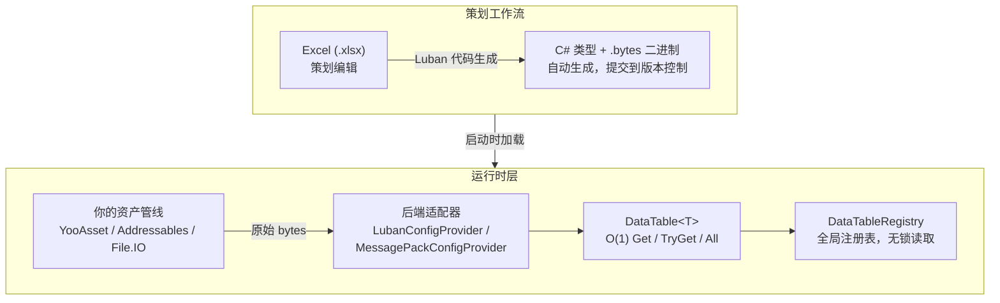
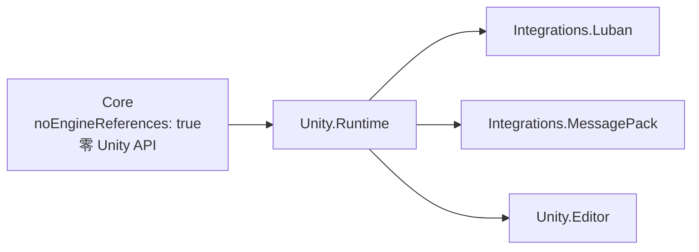

# CycloneGames.DataTable

[English](./README.md) | 简体中文

面向 Unity 的模块化数据表管线。策划通过 Excel/Luban 编辑配置，运行时零 GC 查询，后端可插拔。**模块不内置加载逻辑——加载完全由开发者掌控。**

## 目录

- [CycloneGames.DataTable](#cyclonegamesdatatable)
  - [目录](#目录)
  - [概述](#概述)
    - [适用场景](#适用场景)
    - [不适用场景](#不适用场景)
  - [架构](#架构)
    - [程序集分层（Pattern C）](#程序集分层pattern-c)
  - [安装](#安装)
    - [依赖](#依赖)
    - [可选程序集](#可选程序集)
  - [快速上手](#快速上手)
    - [方式 A：纯代码（无工具依赖）](#方式-a纯代码无工具依赖)
    - [方式 B：MessagePack 后端](#方式-bmessagepack-后端)
    - [方式 C：Luban 后端（Excel → 代码）](#方式-cluban-后端excel--代码)
  - [API 参考](#api-参考)
    - [IDataRow 与 IDataTable\<T\>](#idatarow-与-idatatablet)
    - [DataTable\<T\>](#datatablet)
    - [DataTableRegistry](#datatableregistry)
    - [DataTableLogger](#datatablelogger)
      - [默认行为（零配置）](#默认行为零配置)
      - [桥接到 CycloneGames.Logger（或任意自定义日志系统）](#桥接到-cyclonegameslogger或任意自定义日志系统)
      - [独立 .NET 服务端（无 Unity）](#独立-net-服务端无-unity)
  - [后端适配器](#后端适配器)
    - [Luban 集成](#luban-集成)
    - [MessagePack 集成](#messagepack-集成)
    - [编写自定义后端](#编写自定义后端)
    - [与 CycloneGames.AssetManagement 集成](#与-cyclonegamesassetmanagement-集成)
      - [YooAsset / Raw File（生产环境推荐）](#yooasset--raw-file生产环境推荐)
      - [Addressables / TextAsset（与所有 Provider 兼容）](#addressables--textasset与所有-provider-兼容)
      - [完整启动管线示例](#完整启动管线示例)
  - [编辑器工具](#编辑器工具)
    - [Luban 构建](#luban-构建)
      - [配置](#配置)
    - [配置校验（计划中）](#配置校验计划中)
  - [性能设计](#性能设计)
  - [最佳实践](#最佳实践)
    - [1. 自己掌控加载](#1-自己掌控加载)
    - [2. 注册所有表后调用 MarkInitialized](#2-注册所有表后调用-markinitialized)
    - [3. 缓存高频访问的表引用](#3-缓存高频访问的表引用)
    - [4. 对玩家输入或网络消息使用 TryGet](#4-对玩家输入或网络消息使用-tryget)
    - [5. 保持行类型简单](#5-保持行类型简单)
    - [6. 不要在运行时修改行数据](#6-不要在运行时修改行数据)
  - [常见问题排查](#常见问题排查)
    - ["如何加载 .bytes 文件？"](#如何加载-bytes-文件)
    - ["Luban build script not found"](#luban-build-script-not-found)
    - ["Duplicate Id X in DataTable\<T\>"](#duplicate-id-x-in-datatablet)
    - [CS0234: ByteBuf 命名空间错误](#cs0234-bytebuf-命名空间错误)
    - [MessagePack 反序列化失败](#messagepack-反序列化失败)

---

## 概述

每个游戏都需要配置数据——道具属性、技能参数、关卡边界、对话树。随着项目规模增长，管理这些数据会逐渐成为瓶颈：

| 痛点 | CycloneGames.DataTable 如何解决 |
| --- | --- |
| Excel 与代码同步脱节 | Luban 一键从 Excel 生成 C# 类型和二进制数据 |
| 配置读取产生 GC 压力 | `Get(id)` 零分配——可安全用于热路径，无 LINQ、无装箱 |
| 大表查询慢 | `Dictionary<int, T>` 底层存储，保证 O(1) |
| 配置管线绑定特定引擎/工具 | 可插拔后端：Luban、MessagePack 或自定义 |
| 配置代码与 Unity 强耦合 | `Core` 程序集目标 `netstandard2.0`，零 Unity API 引用 |
| 启动时全量加载所有表 | 开发者完全掌控加载——用你自己的方式加载 bytes，传给适配器 |

### 适用场景

- 项目有 10 张以上由策划维护的数据表
- 希望策划在 Excel 中工作，而非 JSON 或代码
- 需要运行时配置查询零分配
- 希望配置管线可跨游戏引擎移植
- 正在开发 MMO、RPG、卡牌游戏等重内容项目

### 不适用场景

- 只有 2-3 张小配置表 → `ScriptableObject` 更简单
- 需要运行时写回数据（玩家可修改的配置）→ 本模块只读
- 重度依赖 Unity 特定编辑器功能 → Core 故意不依赖 Unity

---

## 架构



### 程序集分层（Pattern C）



| 程序集 | 层级 | 依赖 | 职责 |
| --- | --- | --- | --- |
| `CycloneGames.DataTable.Core` | 核心 | *无* | `IDataRow`、`IDataTable<T>`、`DataTable<T>`、`DataTableRegistry`、`DataTableLogger` |
| `CycloneGames.DataTable.Unity.Runtime` | Unity 适配 | Core | `DataTableUnityBootstrap` |
| `CycloneGames.DataTable.Unity.Editor` | 编辑器 | Unity.Runtime | `DataTableLubanRunner`（Luban 构建菜单） |
| `CycloneGames.DataTable.Unity.Runtime.Integrations.Luban` | 集成 | Core + Unity.Runtime | `LubanConfigProvider` |
| `CycloneGames.DataTable.Unity.Runtime.Integrations.MessagePack` | 集成 | Core + Unity.Runtime + MessagePack | `MessagePackConfigProvider` |

**核心原则**：`Core` 零引擎引用（`noEngineReferences: true`）。Unity 适配程序集在启动时通过 `DataTableLogger` 委托注入平台日志实现。模块不包含任何加载逻辑——加载完全由开发者选择最适合自己项目的方案。

---

## 安装

本模块是 CycloneGames 框架的一部分，位于 `Assets/ThirdParty/CycloneGames/CycloneGames.DataTable/`。

### 依赖

| 依赖 | 是否必须 | 说明 |
| --- | --- | --- |
| *无* | — | Core 零外部依赖。Unity.Runtime 仅依赖 Unity。 |
| `Luban` | 可选 | Excel → 代码工作流。[luban](https://github.com/focus-creative-games/luban) |
| `MessagePack-CSharp` | 可选 | MessagePack 二进制后端，通过 NuGet 或 UPM 安装 |

### 可选程序集

如不需要，直接删除对应目录即可：

- `Unity.Runtime/Integrations/Luban/` — 不使用 Luban 则删除
- `Unity.Runtime/Integrations/MessagePack/` — 不使用 MessagePack 则删除

模块在不包含任何集成程序集时仍可正常编译和运行。

---

## 快速上手

### 方式 A：纯代码（无工具依赖）

适合快速原型或配置表较少的项目。直接在 C# 中定义行数据。

**第一步——定义行类型**

```csharp
using CycloneGames.DataTable;

public class ItemRow : IDataRow
{
    public int Id { get; set; }
    public string Name { get; set; }
    public int Price { get; set; }
    public float Weight { get; set; }
}
```

**第二步——构建并注册表**

```csharp
var table = new DataTable<ItemRow>(new[]
{
    new ItemRow { Id = 1, Name = "铁剑",   Price = 100, Weight = 3.5f },
    new ItemRow { Id = 2, Name = "钢盾",   Price = 250, Weight = 6.0f },
    new ItemRow { Id = 3, Name = "生命药水", Price = 50,  Weight = 0.3f },
});

DataTableRegistry.Register(table);
```

**第三步——随处查询**

```csharp
var items = DataTableRegistry.Get<DataTable<ItemRow>>();

var sword = items.Get(1);             // 键缺失时抛异常
Debug.Log(sword.Name);                // "铁剑"

if (items.TryGet(99, out var rare))   // 安全查询
    Debug.Log(rare.Name);

foreach (var row in items.All)        // 遍历所有行
    Debug.Log($"{row.Name}: {row.Price} 金币");
```

**完整最小示例（无 Unity 依赖）：**

```csharp
using CycloneGames.DataTable;

// 定义行
public class SkillRow : IDataRow
{
    public int Id { get; set; }
    public string Name { get; set; }
    public int Damage { get; set; }
    public float Cooldown { get; set; }
}

// 构建表
var skills = new DataTable<SkillRow>(new[]
{
    new SkillRow { Id = 101, Name = "火球术", Damage = 80, Cooldown = 1.5f },
    new SkillRow { Id = 102, Name = "冰锥术", Damage = 60, Cooldown = 0.8f },
    new SkillRow { Id = 103, Name = "治疗术", Damage = 0,  Cooldown = 5.0f },
});

// 注册并查询
DataTableRegistry.Register(skills);

var fireball = DataTableRegistry.Get<DataTable<SkillRow>>().Get(101);
// fireball.Damage == 80, fireball.Cooldown == 1.5f
```

---

### 方式 B：MessagePack 后端

适合中等规模配置表数量、需要二进制加载但不想引入 Luban 复杂度的项目。

**第一步——为行类型添加注解**

```csharp
using CycloneGames.DataTable;
using MessagePack;

[MessagePackObject]
public class MonsterRow : IDataRow
{
    [Key(0)] public int Id { get; set; }
    [Key(1)] public string Name { get; set; }
    [Key(2)] public int Hp { get; set; }
    [Key(3)] public int Attack { get; set; }
    [Key(4)] public float MoveSpeed { get; set; }
}
```

**第二步——将数据序列化为 .bytes 文件**

写一个小型编辑器脚本或控制台工具来转换数据：

```csharp
var monsters = new MonsterRow[]
{
    new MonsterRow { Id = 1, Name = "史莱姆", Hp = 50,  Attack = 10, MoveSpeed = 1.2f },
    new MonsterRow { Id = 2, Name = "哥布林", Hp = 120, Attack = 25, MoveSpeed = 2.5f },
};
var bytes = MessagePackSerializer.Serialize<MonsterRow[]>(monsters);
File.WriteAllBytes("Assets/StreamingAssets/monster.bytes", bytes);
```

**第三步——启动时加载并注册**

加载是你的责任——用任何适合你项目的管线。得到 bytes 后，调用 `Build()` 即可：

```csharp
using CycloneGames.DataTable;
using CycloneGames.DataTable.Unity.Integrations.MessagePack;

// 1. 用你的方式加载 bytes（YooAsset / Addressables / File.IO / 任何方式）
var bytes = File.ReadAllBytes(Path.Combine(Application.streamingAssetsPath, "monster.bytes"));

// 2. 构建并注册——纯同步，无隐藏加载
MessagePackConfigProvider.Build<MonsterRow>(bytes, GeneratedResolverOptions);

// 3. 查询
var slime = DataTableRegistry.Get<DataTable<MonsterRow>>().Get(1);
Debug.Log($"史莱姆 HP: {slime.Hp}"); // 50
```

---

### 方式 C：Luban 后端（Excel → 代码）

面向有专职策划团队的生产项目的推荐方案。Luban 通过一次构建步骤，从 Excel 生成 C# 类型和二进制数据。

**第一步——搭建 Luban 项目**

在仓库根目录（Unity 项目文件夹的同级目录）创建 `DataTable/`：

```text
your-repo/
├── UnityStarter/          ← Unity 项目
├── DataTable/             ← Luban 项目（手动创建）
│   ├── Excel/             ← 放置 .xlsx 文件
│   │   └── item.xlsx
│   ├── gen_code_bin_to_project_lazyload.bat
│   ├── gen_code_bin_to_project_lazyload.sh
│   └── ...
```

目录名 `DataTable` 可通过构建配置资产修改（参见[编辑器工具](#编辑器工具)）。

**第二步——设计 Excel 表格**

创建 `DataTable/Excel/item.xlsx`：

| Id | Name | Price | Weight |
| --- | --- | --- | --- |
| 1 | 铁剑 | 100 | 3.5 |
| 2 | 钢盾 | 250 | 6.0 |
| 3 | 生命药水 | 50 | 0.3 |

**第三步——运行构建**

在 Unity Editor 中：**Tools → CycloneGames → DataTable → Run Luban Build**

Luban 将生成：
- `Assets/.../Generated/Item.cs` — 实现了 `IDataRow` 的 C# 行类型
- `Assets/StreamingAssets/item.bytes` — 运行时加载的二进制数据

**第四步——启动时加载**

加载是你的责任——用任何适合你项目的资产管线。得到 bytes 后，构建 Luban 的 Tables 对象并注册：

```csharp
using CycloneGames.DataTable.Unity.Integrations.Luban;

public void InitializeConfigs()
{
    // 1. 用你的方式加载 bytes（YooAsset / Addressables / File.IO / 任何方式）
    var itemBytes = File.ReadAllBytes(
        Path.Combine(Application.streamingAssetsPath, "item.bytes"));

    // 2. 构建 Luban 生成的 Tables（Luban 代码生成产物）
    var tables = new Tables(fileName =>
        new global::Luban.ByteBuf(
            File.ReadAllBytes(Path.Combine(Application.streamingAssetsPath, fileName))));

    // 3. 注册到 DataTableRegistry
    LubanConfigProvider.RegisterLubanTable(tables.TbItem);
    // ... 注册更多表 ...

    // 4. 查询
    var sword = DataTableRegistry.Get<TbItem>().Get(1);
}
```

**自定义 Luban 项目路径：**

创建构建配置资产（**Assets → Create → CycloneGames → DataTable → Luban Settings**）并在 Inspector 中编辑 Luban 字段。配置资产可以放在 `Assets/` 下任意位置；默认工具会按类型发现它。首次使用时，系统会自动在 `Assets/Editor/DataTable/` 下创建默认配置。

编程覆写（例如 CI 流水线）：

```csharp
DataTableLubanRunner.LubanProjectDirOverride = "MyConfigs/GameData";
DataTableLubanRunner.LubanScriptNameOverride = "my_build_script";
// 设为 null 恢复为 SO 配置
```

**独立构建（不使用 Unity Editor）：**

```bash
# Windows
cd DataTable
gen_code_bin_to_project_lazyload.bat

# macOS / Linux
cd DataTable
./gen_code_bin_to_project_lazyload.sh
```

---

## API 参考

### IDataRow 与 IDataTable\<T\>

定义数据表契约的两个核心接口，均位于 `CycloneGames.DataTable.Core`。

**`IDataRow`**——每行配置数据必须实现此接口：

```csharp
public interface IDataRow
{
    int Id { get; }
}
```

`Id` 是主键，在表内必须唯一。重复的 `Id` 将输出警告，只保留首次出现的行。

**`IDataTable<T>`**——对类型化表的只读、零分配访问：

| 成员 | 返回值 | 说明 |
| --- | --- | --- |
| `Get(int id)` | `T` | O(1) 查找。键不存在时抛出 `KeyNotFoundException`。适用于确定存在的键。 |
| `GetOrDefault(int id)` | `T` | O(1) 查找。键不存在时返回 `default(T)`。适用于可选配置。 |
| `TryGet(int id, out T row)` | `bool` | O(1) 查找。键不存在时返回 `false`。推荐用于外部输入。 |
| `All` | `IReadOnlyList<T>` | 返回所有行。底层 `T[]` 是共享引用——禁止修改。 |
| `Count` | `int` | 行数。 |

**如何选择查询方法：**

```csharp
var table = DataTableRegistry.Get<DataTable<ItemRow>>();

// 确定键存在时用 Get()——代码干净，出错立即暴露
var sword = table.Get(1);

// 玩家输入、网络消息、软引用场景用 TryGet()
if (table.TryGet(playerInput.itemId, out var item))
    GiveItem(item);
else
    SendError($"道具 {playerInput.itemId} 不存在");

// 可选配置字段用 GetOrDefault()
var config = table.GetOrDefault(specificId) ?? table.Get(DEFAULT_CONFIG_ID);
```

---

### DataTable\<T\>

`IDataTable<T>` 的具体实现。底层使用 `Dictionary<int, T>` 实现 O(1) 查询，`T[]` 实现零拷贝 `All` 访问。

**构造函数：**

```csharp
// 从数组构建——零拷贝。数组被直接存储。
public DataTable(T[] rows);

// 从 List 构建——内部 .ToArray() 复制一次。
public DataTable(List<T> rows);

// 从 IEnumerable 构建——来源不是数组或 List 时会物化一次。
public static DataTable<T> FromEnumerable(IEnumerable<T> rows);
```

**性能提示**：优先使用数组构造，避免 `List<T>` 分配和 `.ToArray()` 复制：

```csharp
// 推荐：预构建数组
var rows = new ItemRow[expectedCount];
// ... 填充 rows
var table = new DataTable<ItemRow>(rows);

// 可接受：数据源本身是 List
var list = new List<ItemRow>();
// ... 填充 list
var table = new DataTable<ItemRow>(list);

// 可接受：一次性初始化，数据源不确定
var table = DataTable<ItemRow>.FromEnumerable(someLinqResult);
```

---

### DataTableRegistry

全局注册中心。所有表在启动时注册，之后以无锁方式并发读取。

```csharp
// 注册（仅限启动阶段）
DataTableRegistry.Register(myTable);

// 查询（任意位置、任意线程——注册完成后只读访问）
var table = DataTableRegistry.Get<DataTable<ItemRow>>();
if (DataTableRegistry.TryGet<DataTable<ItemRow>>(out var t)) { ... }

// 检查初始化状态
if (DataTableRegistry.IsInitialized) { ... }

// 标记所有表已注册（阻止后续注册）
DataTableRegistry.MarkInitialized();

// 重置（测试拆解 / 热重载）
DataTableRegistry.Reset();
```

**线程安全性**：读取是无锁的。写入（`Register`、`Reset`）必须在初始化阶段的单一线程中调用。调用 `MarkInitialized()` 后，任意线程的读取均安全，无需同步。

---

### DataTableLogger

内部日志桥接。Core 默认为 `Console.WriteLine`。启动时，`DataTableUnityBootstrap` 会路由到 Unity 的 `Debug.Log*`——但仅在委托仍为默认值时生效。最后一次写入者胜出。

**本模块故意不提供加载 API。** 加载 `.bytes` 文件完全由开发者负责——用 YooAsset、Addressables、Resources 或原始 File.IO。拿到 bytes 后，传给后端适配器或直接构建 `DataTable<T>`。

#### 默认行为（零配置）

```csharp
// 默认：Core 写入 Console；Unity Bootstrap 覆写为 Debug.Log*
DataTableLogger.LogWarning("Duplicate Id 5 in DataTable<ItemRow>.");  // → Debug.LogWarning
DataTableLogger.LogError("Failed to deserialize skill.bytes.");       // → Debug.LogError
DataTableLogger.LogInfo("Registered DataTable<ItemRow> (42 rows).");  // → Debug.Log
```

#### 桥接到 CycloneGames.Logger（或任意自定义日志系统）

在 Unity 初始化之前或之后设置委托即可。Bootstrap 会检测到它们已被覆写并跳过自身注入：

```csharp
// 在你的游戏初始化器中：
DataTableLogger.LogWarning = msg => CycloneGames.Logger.Log.Warn(msg);
DataTableLogger.LogError   = msg => CycloneGames.Logger.Log.Error(msg);
DataTableLogger.LogInfo    = msg => CycloneGames.Logger.Log.Info(msg);
```

#### 独立 .NET 服务端（无 Unity）

```csharp
// 不存在 Bootstrap——Core 默认使用 Console。可按需覆写：
DataTableLogger.LogWarning = msg => logger.Warn(msg);
DataTableLogger.LogError   = msg => logger.Error(msg);
DataTableLogger.LogInfo    = msg => logger.Info(msg);
```

---

## 后端适配器

### Luban 集成

**程序集：** `CycloneGames.DataTable.Unity.Runtime.Integrations.Luban`  
**命名空间：** `CycloneGames.DataTable.Unity.Integrations.Luban`  
**依赖：** 来自 `com.code-philosophy.luban` 的 `Luban.Runtime`。DataTable 不再内置 Luban runtime 类型。

**`LubanConfigProvider`** 是一个轻量注册助手。你需要自己加载 `.bytes` 文件并构建 Luban 的 `Tables` 对象：

```csharp
// 1. 用你的方式加载 bytes
var bytes = YourAssetPipeline.Load("item.bytes");

// 2. 构建 Luban 生成的 Tables（Luban 代码生成产物）
var tables = new Tables(fileName =>
    new global::Luban.ByteBuf(YourAssetPipeline.Load(fileName)));

// 3. 注册到 DataTableRegistry
LubanConfigProvider.RegisterLubanTable(tables.TbItem);

// 批量注册
LubanConfigProvider.RegisterLubanTables(
    (typeof(TbItem),   tables.TbItem),
    (typeof(TbSkill),  tables.TbSkill),
    (typeof(TbMonster), tables.TbMonster)
);
```

此类不执行任何加载操作。它仅负责注册表实例。

---

### MessagePack 集成

**程序集：** `CycloneGames.DataTable.Unity.Runtime.Integrations.MessagePack`  
**命名空间：** `CycloneGames.DataTable.Unity.Integrations.MessagePack`  
**依赖：** `com.github.messagepack-csharp`（外部包）

此程序集仅在安装了 MessagePack 包时编译（通过 `defineConstraints: ["MESSAGEPACK"]` 和 `versionDefines` 守卫）。

**`MessagePackConfigProvider`** 是纯同步构建器——将 bytes 反序列化为 `DataTable<T>` 并注册：

```csharp
// 1. 用你的方式加载 bytes
var bytes = YourAssetPipeline.Load("monster.bytes");

// 2. 一步构建并注册——同步，无隐藏加载
var table = MessagePackConfigProvider.Build<MonsterRow>(bytes, GeneratedResolverOptions);

// 3. 查询
var slime = DataTableRegistry.Get<DataTable<MonsterRow>>().Get(1);
```

**行类型要求：**
- 必须实现 `IDataRow`
- 必须标注 `[MessagePackObject]` 和 `[Key(n)]` 注解
- 属性必须具有 `{ get; set; }`

---

### 编写自定义后端

如果 Luban 和 MessagePack 不适用你的管线，可以实现自己的适配器：

```csharp
// 1. 编写一个静态 Provider 类
public static class JsonConfigProvider
{
    public static void BuildAndRegister<TRow>(byte[] jsonBytes)
        where TRow : IDataRow
    {
        var json = Encoding.UTF8.GetString(jsonBytes);
        var rows = JsonSerializer.Deserialize<List<TRow>>(json);
        var table = new DataTable<TRow>(rows);
        DataTableRegistry.Register(table);
    }
}

// 2. 启动时调用
var bytes = YourAssetPipeline.Load("Configs/items.json");
JsonConfigProvider.BuildAndRegister<ItemRow>(bytes);

// 3. 统一查询
var items = DataTableRegistry.Get<DataTable<ItemRow>>();
```

你的适配器只需要接收 bytes、产出实现了 `IDataRow` 的行数据，并调用 `DataTableRegistry.Register()` 即可。模块的其余部分不关心序列化格式或加载方式。

---

### 与 CycloneGames.AssetManagement 集成

如果你的项目使用了 `CycloneGames.AssetManagement`，DataTable 模块可以无缝对接——**不需要任何适配代码**。DataTable 接收原始 `byte[]`；AssetManagement 通过 `IRawFileHandle.ReadBytes()` 或 `TextAsset.bytes` 提供字节数据。两个模块天然组合。

#### YooAsset / Raw File（生产环境推荐）

```csharp
using CycloneGames.DataTable;
using CycloneGames.DataTable.Unity.Integrations.MessagePack;
using CycloneGames.AssetManagement.Runtime;

public async UniTask InitializeConfigs()
{
    var package = AssetManagementLocator.DefaultPackage;

    // 异步：通过 YooAsset raw file API 加载 .bytes 文件
    var handle = package.LoadRawFileAsync("monster.bytes");
    await handle.Task;
    var bytes = handle.ReadBytes();
    handle.Dispose();

    MessagePackConfigProvider.Build<MonsterRow>(bytes, GeneratedResolverOptions);
}

// 同步变体（仅 YooAsset）：
public void InitializeConfigsSync()
{
    var package = AssetManagementLocator.DefaultPackage;
    var handle = package.LoadRawFileSync("monster.bytes");
    var bytes = handle.ReadBytes();
    handle.Dispose();

    MessagePackConfigProvider.Build<MonsterRow>(bytes, GeneratedResolverOptions);
}
```

#### Addressables / TextAsset（与所有 Provider 兼容）

```csharp
public async UniTask InitializeConfigs()
{
    var package = AssetManagementLocator.DefaultPackage;

    // 以 TextAsset 形式加载（兼容 Addressables、Resources、YooAsset）
    var handle = package.LoadAssetAsync<TextAsset>("monster.bytes");
    await handle.Task;
    var bytes = handle.Asset.bytes;
    handle.Dispose();

    MessagePackConfigProvider.Build<MonsterRow>(bytes, GeneratedResolverOptions);
}
```

#### 完整启动管线示例

```csharp
public async UniTask BootstrapGameConfigs()
{
    var package = AssetManagementLocator.DefaultPackage;

    // 加载所有配置表
    var tasks = new[]
    {
        LoadTable<ItemRow>(package, "item.bytes"),
        LoadTable<SkillRow>(package, "skill.bytes"),
        LoadTable<MonsterRow>(package, "monster.bytes"),
    };
    await UniTask.WhenAll(tasks);

    // 锁定写入——此后只读
    DataTableRegistry.MarkInitialized();
}

private async UniTask LoadTable<TRow>(IAssetPackage package, string fileName)
    where TRow : IDataRow
{
    var handle = package.LoadRawFileAsync(fileName);
    await handle.Task;
    var bytes = handle.ReadBytes();
    handle.Dispose();

    MessagePackConfigProvider.Build<TRow>(bytes, GeneratedResolverOptions);
}
```

没有中间层，没有隐藏加载，没有耦合。DataTable 收 bytes；AssetManagement 供 bytes。

---

## 编辑器工具

所有编辑器工具位于 `CycloneGames.DataTable.Unity.Editor`，在 **Tools → CycloneGames → DataTable** 菜单下可用。

### Luban 构建

**菜单：** `Tools/CycloneGames/DataTable/Run Luban Build`

运行 Luban 代码生成脚本并刷新 AssetDatabase。

#### 配置

构建设置存储在一个可见的 **`DataTableLubanSettings`** ScriptableObject 中。配置资产可以放在 `Assets/` 下任意位置；默认工具按类型发现它，不写入隐藏的编辑器偏好。首次访问时，如果不存在配置资产，系统会自动在 `Assets/Editor/DataTable/` 下创建默认配置。

**手动创建配置：** Assets → Create → CycloneGames → DataTable → Luban Settings

**配置字段：**

| 字段 | 默认值 | 说明 |
| --- | --- | --- |
| `LubanProjectDir` | `../DataTable` | Luban 项目路径，相对于仓库根目录 |
| `LubanScriptName` | `gen_code_bin_to_project_lazyload` | 脚本名称（不含扩展名，自动追加 `.bat`/`.sh`） |
| `LubanScriptArguments` | 空 | 追加在脚本路径后的可选命令行参数 |
| `LubanTimeoutSeconds` | `0` | 外部进程最大等待秒数。小于等于 0 表示不限制 |
| `RefreshAssetsAfterLubanBuild` | `true` | 构建成功后是否自动调用 `AssetDatabase.Refresh()`。注意：这并不会自动触发 Luban 构建本身——你仍然需要手动运行菜单命令或调用 `DataTableLubanRunner.Run()`。 |

配置资产有**自定义 Inspector**，会显示：
- 配置目录和构建脚本解析后的绝对路径
- 实时校验：目录和脚本是否真实存在于磁盘上
- 重复配置警告、已发现的 `.bat`/`.sh` 脚本，以及打开目录或运行构建的快捷操作

**解析后的脚本路径：**

```text
{repoRoot}/{LubanProjectDir}/{LubanScriptName}.bat   // Windows
{repoRoot}/{LubanProjectDir}/{LubanScriptName}.sh    // macOS / Linux
```

**编程覆写**（用于 CI 流水线或编辑器脚本）：

```csharp
// 以下覆写 SO 中的值。设为 null 恢复为 SO 配置。
DataTableLubanRunner.LubanProjectDirOverride = "MyConfigs";
DataTableLubanRunner.LubanScriptNameOverride = "build_all";
```

**安全保障：**
- 默认工具使用 `AssetDatabase.FindAssets("t:DataTableLubanSettings")` 发现配置；不使用 `EditorPrefs` 或隐藏活动配置
- 项目中应只保留一个配置资产；重复配置会触发警告并列出所有路径
- 查找后缓存配置；调用 `DataTableLubanSettings.InvalidateCache()` 强制重新扫描
- 如果配置资产被删除或损坏，自动重建默认配置
- 脚本路径缺失时输出详细错误，包含发现到的配置资产路径

构建过程捕获 stdout/stderr 并输出到 Unity Console。成功（`exit code 0`）后自动调用 `AssetDatabase.Refresh()`（除非 `RefreshAssetsAfterLubanBuild` 关闭）。

### 配置校验（计划中）

计划实现的 `DataTableValidatorWindow` 用于校验：
- 跨表主键重复
- 外键完整性（例如角色表中引用的技能 ID 是否存在）
- 数值范围检查（例如伤害值非负）
- 必填字段缺失

---

## 性能设计

本模块为运行时零 GC 查询而设计：

| 操作 | 分配 | 复杂度 | 说明 |
| --- | --- | --- | --- |
| `Get(id)` | **0 B** | O(1) | `Dictionary.TryGetValue` + 返回 |
| `GetOrDefault(id)` | **0 B** | O(1) | 同 Get，无抛出路径 |
| `TryGet(id, out T)` | **0 B** | O(1) | 直接委托给 `Dictionary.TryGetValue` |
| `.All` | **0 B** | O(1) | 返回内部 `T[]` 的引用 |
| `.Count` | **0 B** | O(1) | 返回 `_rowsArray.Length` |
| 表构造 | **1 次分配** | O(n) | 精确容量的 `Dictionary<int, T>` |
| Registry 读取 (`Get<T>`) | **0 B** | O(1) | 无锁字典引用读取 |

**设计决策：**
- 构造函数直接接收 `T[]`——零拷贝，无 `ToList()`，无 LINQ
- `DataTableRegistry` 使用无锁读取模式：写入仅在启动时，`Volatile.Write` 保证发布可见性
- `Dictionary<int, T>` 预分配精确行数——零扩容，碰撞率最低
- 所有热路径方法为 non-virtual（默认 sealed），便于去虚拟化
- 模块不内置加载逻辑——加载由开发者自由选择方案，模块不强制异步/同步/特定管线

---

## 最佳实践

### 1. 自己掌控加载

本模块不提供加载 API。根据项目需求选择最适合的方案：

```csharp
// 轻量原型：直接 File.ReadAllBytes
var bytes = File.ReadAllBytes(Path.Combine(Application.streamingAssetsPath, "item.bytes"));

// 生产环境 YooAsset：
var handle = YooAssets.LoadAssetSync<TextAsset>("item.bytes");
var bytes = ((TextAsset)handle.AssetObject).bytes;

// 生产环境 Addressables：
var handle = Addressables.LoadAssetAsync<TextAsset>("item.bytes");
await handle.Task;
var bytes = handle.Result.bytes;
```

### 2. 注册所有表后调用 MarkInitialized

```csharp
public void BootstrapConfigs()
{
    MessagePackConfigProvider.Build<ItemRow>(itemBytes);
    MessagePackConfigProvider.Build<SkillRow>(skillBytes);
    DataTableRegistry.MarkInitialized();
}
```

注册完成后调用 `MarkInitialized()` 锁定写入。标记后的读取保证线程安全。

### 3. 缓存高频访问的表引用

```csharp
// 启动时
private DataTable<ItemRow> _items;

void Awake()
{
    _items = DataTableRegistry.Get<DataTable<ItemRow>>();
}

// 热路径中——无需 Registry 查找，直接字段访问
void Update()
{
    var item = _items.Get(currentItemId);
}
```

`DataTableRegistry.Get<T>()` 是 O(1)，但缓存可以省去 Registry 自身的字典查询。

### 4. 对玩家输入或网络消息使用 TryGet

```csharp
public void HandleUseItem(int itemId)
{
    if (!_items.TryGet(itemId, out var item))
    {
        SendError($"道具 {itemId} 不存在");
        return;
    }
    ApplyItemEffect(item);
}
```

永远不要信任玩家输入——`Get()` 在键缺失时会抛异常。

### 5. 保持行类型简单

```csharp
// 好的做法：纯数据
public class ItemRow : IDataRow
{
    public int Id { get; set; }
    public string Name { get; set; }
    public int Price { get; set; }
}

// 避免：逻辑、引用、Unity 对象
public class BadItemRow : IDataRow  // 不要这样做
{
    public int Id { get; set; }
    public GameObject Prefab { get; set; }  // 错误——配置中不应有 Unity 对象
    public void CalculatePrice() { ... }    // 错误——数据类不应有逻辑
}
```

行类型是纯数据。逻辑应放在使用这些行的独立系统中。

### 6. 不要在运行时修改行数据

内部数组是共享的。多个调用方修改行数据会导致竞态条件和 bug。如需运行时可变数据，维护一个单独的字典：

```csharp
// 配置数据：只读
var baseItems = DataTableRegistry.Get<DataTable<ItemRow>>();

// 运行时状态：可变
private Dictionary<int, int> _playerInventory = new();

public void AddItem(int itemId)
{
    if (!baseItems.TryGet(itemId, out _)) return;  // 先校验配置存在
    _playerInventory.TryGetValue(itemId, out var count);
    _playerInventory[itemId] = count + 1;
}
```

---

## 常见问题排查

### "如何加载 .bytes 文件？"

本模块故意不提供加载 API。加载是你的责任——用任何适合你项目的方式：

```csharp
// 方案 A：原始 File.IO（原型开发）
var bytes = File.ReadAllBytes(Path.Combine(Application.streamingAssetsPath, "monster.bytes"));

// 方案 B：YooAsset（生产环境）
var handle = YooAssets.LoadAssetAsync<TextAsset>("monster.bytes");
await handle;
var bytes = ((TextAsset)handle.AssetObject).bytes;

// 方案 C：Addressables（生产环境）
var handle = Addressables.LoadAssetAsync<TextAsset>("monster.bytes");
await handle.Task;
var bytes = handle.Result.bytes;

// 方案 D：Unity Resources（仅原型阶段）
var ta = Resources.Load<TextAsset>("DataTable/monster");
var bytes = ta.bytes;
```

拿到 bytes 后，调用 `MessagePackConfigProvider.Build<T>(bytes, options)` 或直接构建 `DataTable<T>`。

### "Luban build script not found"

**原因：** 配置的 Luban 脚本路径下没有找到脚本文件。

**修复：** 以下方案任选其一：

1. 在配置的路径（默认 `../DataTable/`，相对于仓库根目录）下搭建 Luban 项目
2. 在 Inspector 中编辑 `DataTableLubanSettings` 资产，指向你的 Luban 项目位置
   （若无配置资产：Assets → Create → CycloneGames → DataTable → Luban Settings）
3. 如果不使用 Luban，忽略该菜单项即可——模块在没有 Luban 时也能正常工作

### "Duplicate Id X in DataTable\<T\>"

**原因：** 两行数据共享了相同的 `Id` 值。

**修复：** 检查 Excel 或数据源。首次出现的行被保留，后续重复行输出警告。

### CS0234: ByteBuf 命名空间错误

**原因：** Luban 集成模块的命名空间 `CycloneGames.DataTable.Unity.Integrations.Luban` 与全局 `Luban` 命名空间冲突。

**修复：** 此问题已在模块中解决——使用 `global::Luban.ByteBuf` 消除歧义。

### MessagePack 反序列化失败

**原因：** 行类型缺少 `[MessagePackObject]` 或 `[Key(n)]` 注解，或者 `.bytes` 文件内容与调用的 API 期望格式不一致。

**修复：**
1. 注解行类型：`[MessagePackObject] public class MyRow : IDataRow`
2. 注解所有属性：`[Key(0)] public int Id { get; set; }`
3. 调用 `Build<TRow>()` 时，使用 `MessagePackSerializer.Serialize<TRow[]>(rows)` 序列化 `TRow[]`
4. 旧的 `List<TRow>` payload 使用 `MessagePackConfigProvider.BuildList<TRow>()`

---
