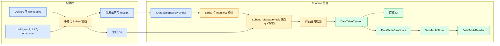
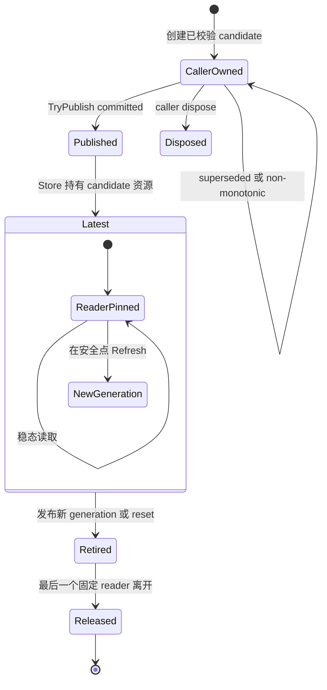

# CycloneGames.DataTable

[English](./README.md) | 简体中文

CycloneGames.DataTable 是面向 Unity、纯 C# Host、工具和服务器的强类型不可变配置数据底座。它把载荷获取、解码、业务校验和发布拆成独立环节，产品可以自选数据来源与序列化格式，Gameplay 代码不必和这些实现耦合。Core assembly 不依赖 `UnityEngine`。

本文档是方案设计与 Runtime API 的参考。事务化 Luban 构建管线见 [DataTable/Luban 构建手册](../../../../../DataTable/Luban/README.SCH.md)。

## 目录

- [从这里开始](#从这里开始)
- [架构](#架构)
- [五分钟 Core 教程](#五分钟-core-教程)
- [构建概览](#构建概览)
- [Runtime 加载管线](#runtime-加载管线)
- [所有权与生命周期](#所有权与生命周期)
- [性能与平台注意事项](#性能与平台注意事项)
- [安全与持久化](#安全与持久化)
- [扩展点](#扩展点)
- [故障排查](#故障排查)
- [验证](#验证)
- [API 导航](#api-导航)

## 从这里开始

### 模块解决什么问题

DataTable 面向按来源顺序排列、以读取为主的配置：物品定义、能力参数、成长曲线、本地化元数据、生成式 schema table 等。它提供：

- 结构不可变、`O(1)` key 查询的 `DataTable<TKey, TRow>`；
- 以精确 contract type 为索引的 `DataTableCatalog` snapshot；
- 载荷 limit、可移植名称、location、manifest、长度与 SHA-256 校验；
- 不依赖 Runtime 反射的生成表注册；
- 带 reader 固定与延迟资源退役的版本化 `DataTableStore` 发布；
- 相互独立的 Luban、MessagePack、AssetManagement 与 Logging integration。

可变游戏状态、存档、网络复制、数据库查询、schema 特定业务规则、签名与产品信任策略都不在本模块范围内。DataTable 也不会自动读取文件，更不会替生成输出挑选 Runtime Provider。

### 在三个轴上组合方案

三个轴相互独立。每一行选择一项；diagnostics 是可选的正交能力。

| 轴 | 可选项 | 决策内容 |
| --- | --- | --- |
| 1. 获取 | 已物化 row；`DataTableBytesCache`；自定义 `IDataTableBytesProvider`；AssetManagement integration | 字节位于何处、由哪个线程持有、怎样结束其生命周期。 |
| 2. 解码 | 不需要 decoder；Luban；MessagePack；自定义 decoder | 哪种载荷格式转换为强类型 row 或生成 table set。 |
| 3. 发布 | 直接组合 `DataTableCatalog`；`DataTableStore` + `DataTableReader` | Consumer 使用固定 catalog，还是显式切换 generation。 |

常见组合：

| 场景 | 获取 | 解码 | 发布 |
| --- | --- | --- | --- |
| 小型固定项目 | 手写或生成的 row array | 无 | 直接注入一个 catalog。 |
| Luban Client 配置 | 产品 Provider 或有界 cache | Luban integration | 是否需要 reload 决定使用直接 catalog 或 Store。 |
| MessagePack 配置 | 产品 Provider 或有界 cache | MessagePack integration | 直接 catalog 或 Store。 |
| Unity asset package | AssetManagement TextAsset 或 raw-file loader | Luban、MessagePack 或产品 decoder | asset handle 需要随 generation 退役时通常使用 Store。 |
| Server 或测试 Host | 文件系统、网络或内存自定义 Provider | Host 可用的任意纯 C# decoder | 直接 catalog 或由实例持有的 Store。 |

### 当前 assembly 与启用状态

下表来自当前 asmdef、package manifest、本地 package 和编译约束。增加 asmdef 引用无法补足未满足的 `defineConstraints` 或 `versionDefines` 条件。

| Assembly | 当前状态 | 引用与启用规则 |
| --- | --- | --- |
| `CycloneGames.DataTable.Core` | 可用 | 纯 C#、`noEngineReferences: true`、`autoReferenced: true`。 |
| `CycloneGames.DataTable.Unity.Editor` | Editor 中可用 | 引用 Core 和 UniTask；`autoReferenced: false`。当前项目 manifest 包含 UniTask。 |
| `CycloneGames.DataTable.Integrations.Logging` | 可用，按需启用 | 引用 Core 和本地 `CycloneGames.Logging.Core`；`autoReferenced: false`。 |
| `CycloneGames.DataTable.Integrations.Logging.Editor` | Editor 中可用 | 自动引用的 Editor bootstrap。仅在 DataTable diagnostics sink 未被占用时安装 Logging adapter。 |
| `CycloneGames.DataTable.Unity.Runtime.Integrations.Luban` | 当前 checkout 未启用 | 需要 `[1.2.0,2.0.0)` 范围内的 `com.code-philosophy.luban`，使 Unity 生成 `LUBAN`；当前 manifest 不含该 package。 |
| `CycloneGames.DataTable.Unity.Runtime.Integrations.MessagePack` | 当前 checkout 未启用 | 需要 `[3.1.8,4.0.0)` 范围内的 `com.github.messagepack-csharp`，使 Unity 生成 `MESSAGEPACK`，并引用 `MessagePack.dll`；当前 package 和 binary 均不存在。 |
| `CycloneGames.DataTable.Unity.Runtime.Integrations.AssetManagement` | 当前 asset-style 布局中未启用 | 需要从 UPM package ID `com.cyclone-games.asset-management` 生成 `CYCLONE_ASSET_MANAGEMENT`。目标模块位于 `Assets` 下，其 `package.json` 不会激活这条 `versionDefines`。 |

不要通过 PlayerSettings scripting symbol 掩盖未启用的 integration。把依赖安装或放置到 assembly 级启用规则成立的位置，或者直接基于 Core 实现产品 Provider。

## 架构

### 端到端数据路径


```mermaid
flowchart LR
    subgraph Build["构建时"]
        S["Defines 与 workbooks"] --> P["事务化 Luban 管线"]
        C["build_config.ini 与 luban.conf"] --> P
        P --> GC["生成 C#"]
        P --> GB["生成载荷与 receipt"]
    end

    subgraph Runtime["Runtime 组合"]
        BP["IDataTableBytesProvider"] --> MV["Limits 与 manifest 校验"]
        MV --> DE["Luban、MessagePack 或自定义解码"]
        DE --> BV["产品业务校验"]
        BV --> CA["DataTableCatalog"]
        CA --> DI["直接 DI"]
        CA --> CD["DataTableCandidate"]
        CD --> ST["DataTableStore"]
        ST --> RD["DataTableReader"]
    end

    GC --> DE
    GB --> BP

    classDef source fill:#dbeafe,stroke:#2563eb,color:#172554
    classDef guard fill:#fef3c7,stroke:#d97706,color:#451a03
    classDef snapshot fill:#dcfce7,stroke:#16a34a,color:#052e16
    class S,C,GC,GB,BP source
    class P,MV,DE,BV guard
    class CA,DI,CD,ST,RD snapshot
```

构建时生成与 Runtime 加载是两套独立契约。管线产出代码与载荷文件；Runtime composition root 决定载荷如何获取、认证、解码、校验、发布和退役。

### Generation 与 reader 生命周期


```mermaid
stateDiagram-v2
    [*] --> CallerOwned: 创建已校验 candidate
    CallerOwned --> Published: TryPublish committed
    CallerOwned --> CallerOwned: superseded 或 non-monotonic
    CallerOwned --> Disposed: caller dispose
    Published --> Latest: Store 持有 candidate 资源
    Latest --> Retired: 发布新 generation 或 reset
    Retired --> Released: 最后一个固定 reader 离开
    Released --> [*]

    state Latest {
        [*] --> ReaderPinned
        ReaderPinned --> ReaderPinned: 稳态读取
        ReaderPinned --> NewGeneration: 在安全点 Refresh
    }
```

发布成功会消费 candidate；被拒绝时 candidate 仍归 caller。发布不会移动现有 reader，`Refresh()` 才是切换 generation 的边界。已退役的 generation 要等最后一个固定 reader 离开才释放 resource owner。

### Core 边界

- Core 包含 table、catalog、limit、manifest、byte cache、生成 descriptor、Store/Reader 发布、名称、location、hash 与模块内 diagnostics。
- Core 不引用 Unity、Logging、Luban、MessagePack、AssetManagement、DI container 或 service locator。
- Integration assembly 向内依赖 Core；Core 永远不依赖 integration。
- 不使用 Runtime 类型发现。生成模型通过显式 `DataTableGeneratedTableCollector.TableDescriptor<TTableSet>` 进入 catalog。

## 五分钟 Core 教程

### 1. 引用 Core

使用 asmdef 的 Consumer 增加 Core assembly：

```json
{
  "references": [
    "CycloneGames.DataTable.Core"
  ]
}
```

### 2. 定义 row 并构建 table

`IDataRow` 是 `int` key 的便捷 contract。已发布 row 的值和引用对象要保持不可变。

```csharp
using CycloneGames.DataTable;

public sealed class ItemRow : IDataRow
{
    public ItemRow(int id, string name, int maxStack)
    {
        Id = id;
        Name = name;
        MaxStack = maxStack;
    }

    public int Id { get; }
    public string Name { get; }
    public int MaxStack { get; }
}

var items = new DataTable<ItemRow>(new[]
{
    new ItemRow(1001, "Health Potion", 20),
    new ItemRow(1002, "Mana Potion", 20),
});
```

Array constructor 会复制来源、保留 row 顺序并构建 key-to-index dictionary。Null row、null key、重复 key 或 row count 超限都会使构建失败。

当 row 无法实现 `IDataRow<TKey>` 时，传入 selector 和 comparer：

```csharp
var texts = new DataTable<string, LocalizedTextRow>(
    decodedRows,
    static row => row.Key,
    StringComparer.Ordinal);
```

### 3. 查询并组合 table

```csharp
ItemRow required = items.Get(1001);

if (items.TryGet(1002, out ItemRow optional))
{
    Use(optional);
}

var catalog = new DataTableCatalogBuilder(capacity: 1)
    .Add<IDataTable<ItemRow>>(items)
    .Build();

IDataTable<ItemRow> itemTable = catalog.Get<IDataTable<ItemRow>>();
```

Key 或 contract 不存在时 `Get` 抛出 `KeyNotFoundException`，`TryGet` 是非抛出路径。Catalog 以传给 `Add` 的精确 contract type 查询；一次性 builder 在 `Build()` 后不能复用。

### 4. 选择直接组合或发布

一个 catalog 在整个 scope 内固定不变时，直接注入 `DataTableCatalog`。需要以完整已校验 generation 替换旧 generation、同时让现有 Consumer 在固定 snapshot 上收尾时，使用 `DataTableStore`。不要只为了拿到全局访问而给固定配置加 Store；Store 必须显式构造和持有。

## 构建概览

### 当前初始配置状态

仓库包含事务化管线、launcher、`build_config.ini` 与 `luban.conf`。仓库不会预创建 `DataTableLubanSettings.asset`；使用 Unity Editor 工作流的项目需要显式创建并保存且只保存一个该资产。当前 checkout 同样不包含 `DataTable/Luban/Defines`、`DataTable/Luban/Datas`、经批准的 Luban executable/DLL 或生成输出根。`build_config.ini` 中的 Luban identity 与 source fingerprint 字段仍是占位值，也不存在 generation receipt。补齐这些输入并审查 identity 之前，generation 保持 fail closed。

### 规范输入

| 输入 | 用途 |
| --- | --- |
| `<repo-root>/DataTable/Luban/Defines/` | Luban schema 定义。 |
| `<repo-root>/DataTable/Luban/Datas/` | Workbooks，包括 `__tables__.xlsx`、`__beans__.xlsx` 和 `__enums__.xlsx`。 |
| `<repo-root>/DataTable/Luban/luban.conf` | Group、schema file、target、manager name 和 top module。 |
| `<repo-root>/DataTable/Luban/build_config.ini` | 已批准工具 identity、template、CodeGen 设置和输出 profile。 |
| `<repo-root>/UnityStarter/Assets/ThirdParty/CycloneGames/CycloneGames.DataTable/Tools~/CodeGen/` | 事务化管线与 string-constant generator。 |

已配置的 group 是 Client 使用的 `c`、Server 使用的 `s`，以及 `all` target 使用的 `c+s`。所有 target 的 manager 都是 `Tables`，top module 都是 `UnityStarter.GameConfig`。

### 事务化生成

正常顺序如下：

1. 对所选 profile 执行 `inspect`，并以 `canGenerate`、`canCheck` 和 `canRecover` 作为操作依据。
2. 校验 config、必需 workbook、输出 containment、tool hash、Luban hash 和 source fingerprint。
3. 取得单 writer lock 并捕获 live-output baseline。
4. 只在 transaction candidate 目录运行 Luban 和 string-constant generation。
5. 要求至少一个 code file 和一个 data file，然后 hash candidate 并创建 generation receipt。
6. 使用 journal 和 backup 仅发布有变化的文件。移除 transaction evidence 前必须验证 commit 或 rollback。
7. 运行 `check`，将 receipt 与 live code/data 的精确文件集合和 hash 比较。`check` 不运行 Luban，也不重写 receipt。

不要手工删除 `.cyclonegames-datatable-writer.lock` 或 `.cyclonegames-datatable-transactions`。先执行 `inspect`，仅在 `canRecover` 为 true 时执行 `recover --run-id <id>`。

### Profile 与 Runtime Provider 对齐

Profile output path 与 Runtime Provider 是两个独立决策。生成 C# 和生成 bytes 面向不同 Consumer。

| Profile | Code output | Data output | Runtime 对齐方式 |
| --- | --- | --- | --- |
| `client` | `UnityStarter/Assets/UnityStarter/Scripts/Generated/DataTable/` | `UnityStarter/Assets/StreamingAssets/DataTable/` | Unity 编译 C#。Core 没有 StreamingAssets loader；产品必须使用平台适用的 I/O 填充 cache/custom Provider。AssetManagement 不会自动消费该目录。 |
| `server` | `DataTable/Luban/Generated/Server/Code/` | `DataTable/Luban/Generated/Server/Data/` | 将两个 root 与 Server artifact 打包，并提供 Host 特定的获取实现。 |
| `all` | `DataTable/Luban/Generated/All/Code/` | `DataTable/Luban/Generated/All/Data/` | 用于组合的 `c+s` target；使用显式 Host Provider。 |

使用 AssetManagement 时，必须把生成载荷导入或路由到其 package 持有的 location，并让 `IDataTableLocationResolver` 解析到相同位置。DataTable AssetManagement integration 必须同时处于启用状态；它在当前 asset-style checkout 中未启用。

### Editor 与 CLI 入口

Editor assembly 提供：

- `Tools > CycloneGames > DataTable > Create Default Settings`；
- 同一菜单下的 `Open Settings`、`Generate`、`Check` 与 `Recover`；
- 创建可见 settings asset，默认指向 `../DataTable/Luban/build_config.ini` 与 profile `client`。

使用 Editor 操作时，项目中必须恰好存在一个已保存的 `DataTableLubanSettings` asset；仅使用 CLI/CI 时不需要。Generate 与 Recover 成功后可以刷新 AssetDatabase，Check 不刷新。

Windows 下从仓库根目录运行：

```powershell
DataTable\Luban\gen_code_bin_to_project_lazyload.bat inspect --profile client --format json
DataTable\Luban\gen_code_bin_to_project_lazyload.bat generate --profile client
DataTable\Luban\gen_code_bin_to_project_lazyload.bat check --profile client
DataTable\Luban\gen_code_bin_to_project_lazyload.bat recover --run-id <32-hex-run-id>
```

macOS 或 Linux 使用 `.sh` launcher 和相同参数。`inspect`、`generate`、`check` 必须提供 `--profile`；`recover` 接收 run ID，不接收 profile。全部配置键、exit code、transaction state 与 CI workflow 见 [Luban 构建手册](../../../../../DataTable/Luban/README.SCH.md)。

## Runtime 加载管线

按以下顺序执行。把业务校验或 manifest 检查移到发布之后，会暴露不完整或不可信的 generation。

### 1. 定义经过测量的 limit

```csharp
var limits = new DataTableLoadLimits(
    maxTableCount: 128,
    maxBytesPerTable: 8 * 1024 * 1024,
    maxTotalBytes: 64L * 1024 * 1024,
    maxRowsPerTable: 250_000,
    maxTableNameLength: 96,
    maxLocationLength: 256);
```

`DataTableLoadLimits.Default` 允许 4,096 个 table、每表 64 MiB、总计 512 MiB、每表 2,000,000 个 row、table name 256 个 UTF-16 code unit、location 2,048 个。它们是宽泛的 fail-fast guardrail，不是生产预算。应根据生成内容测量结果和最低支持硬件收紧这些值。

### 2. 获取并校验载荷

`IDataTableBytesProvider` 返回借用的 `ReadOnlyMemory<byte>`。该 memory 只在 Provider 声明的生命周期内有效。manifest 需要证明不存在未知载荷时，还应实现 `IDataTableBytesInventory`。

#### 对齐输出与 Provider location

构建输出、AssetManagement runtime location、resolver 结果与可选 manifest `Location` 必须描述同一个 payload。获取方案要显式选定：

| 来源或 package | Provider 方案 | Location 契约 | 分配边界 |
| --- | --- | --- | --- |
| `StreamingAssets/DataTable` | 产品持有的平台异步 I/O 生成 owned `byte[]`，再通过 `DataTableBytesCache.AddOwned` 转移。 | 使用生成的相对文件名。Core 没有 StreamingAssets Provider。 | I/O layer 在 `AddOwned` 应用 DataTable admission limit 前已经分配 array。平台可提供长度时，产品 I/O layer 应先做 size preflight。 |
| Resources `TextAsset` | 通过 Resources package 使用 `AssetManagementDataTableBytesLoader`。 | Location 相对 `Resources/` folder，且省略扩展名。使用 `DataTableLocationResolver(..., dataExtension: "")`；manifest location 必须遵守同一规则。 | Unity/Provider 先加载 asset，`TextAsset.bytes` 在 DataTable 校验前创建第一个 byte array。 |
| Addressables `TextAsset` | 通过 Addressables package 使用 `AssetManagementDataTableBytesLoader`。 | Resolver 或 manifest location 必须与 authoring 的 Addressables address 完全一致，包括是否包含扩展名。 | Provider asset allocation 发生在 DataTable admission 前。 |
| YooAsset `TextAsset` | 通过 YooAsset package 使用 `AssetManagementDataTableBytesLoader`。 | Resolver 或 manifest location 必须与 YooAsset runtime location 完全一致。 | Provider asset allocation 发生在 DataTable admission 前。 |
| YooAsset raw file | 使用 `AssetManagementDataTableRawFileBytesLoader`。 | Resolver 或 manifest location 必须与 raw-file runtime location 完全一致。 | `IRawFileHandle.ReadBytes()` 在 DataTable 校验并转移到私有 cache 前返回一个 caller-owned defensive copy。 |

Android 与 WebGL 上不能把 StreamingAssets 当普通 filesystem directory 用。应使用平台支持的异步 URI/archive/web 获取方式，应用上游 size 与 timeout policy，再把完成的 owned bytes 转移进 `DataTableBytesCache`。DataTable limit 属于 admission limit：它能把超限结果挡在 DataTable cache 和 decoder 之外，但无法撤销 Provider 的首次分配、下载、解压或 Unity asset load。

当前 Resources、Addressables、YooAsset 的 Provider contract 都支持普通 `TextAsset` 加载。Raw loading 需要 `IAssetRawFileLoader`；这三个 Provider 中只有 YooAsset 实现它。Raw loader 会拒绝缺少该 capability 的 package，也不回退到 TextAsset，所以 Resources 和 Addressables 走 TextAsset loader。

#### AssetManagement TextAsset 骨架

以下骨架使用 Resources location。只有当精确 Addressables 或 YooAsset runtime address 要求时，才调整 base directory 与 extension。

```csharp
var manifest = new DataTableManifest(
    schemaVersion: 1,
    entries: manifestEntries,
    limits: limits,
    requireKnownTables: true);

manifest.EnsureSchemaVersionSupported(1, 1);

var locations = new DataTableLocationResolver(
    baseDirectory: "Config/DataTable",
    dataExtension: "", // Resources runtime location 省略文件扩展名。
    limits: limits);

using var loader = new AssetManagementDataTableBytesLoader(
    assetPackage,
    new DataTableAssetLoadContext(
        bucket: "Config.DataTable.Client",
        owner: "DataTableBootstrap"),
    locations,
    enableEditorFileFallback: false,
    initialCapacity: manifest.Entries.Count,
    manifest: manifest,
    limits: limits);

await loader.LoadAsync(tableNames, cancellationToken);

// 在当前 owner-thread scope dispose loader 前，将它作为
// IDataTableBytesProvider 完成 manifest/decode/catalog 工作。
```

两个 AssetManagement loader 都由 main thread 持有，每个实例只允许一个 in-flight load。每次 load 复制完 bytes 后释放 Provider handle。handle disposal 失败时，loader 会保留该精确 handle 并阻止下一次 load；在 owner thread 检查 `HasPendingHandleDisposal` 并调用 `RetryPendingHandleDisposal()`。`Dispose()` 会退役 loader 的 handle 与私有 byte cache，但不会清理 AssetManagement bucket 或销毁 package。bucket 命名、共享、`Clear`/`ClearHierarchy` 时机和 package shutdown 由产品负责；需要独立清理 DataTable 内容时，优先使用专用 bucket。

该 integration 在当前 checkout 中未启用。只有 AssetManagement integration assembly 的依赖与 capability 条件满足、且 Consumer 引用了该 assembly，骨架才能编译。

向 AssetManagement loader 传入 manifest 后，它的 list `LoadAsync` 会在内部校验每个 payload 与最终 inventory，不要重复 hash 同一批 payload。对于不自行负责 manifest 校验的 custom Provider 或 cache，按下面的顺序执行：

```csharp
for (int i = 0; i < manifest.Entries.Count; i++)
{
    DataTableManifestEntry entry = manifest.Entries[i];
    if (bytesProvider.TryGetBytes(entry.TableName, out ReadOnlyMemory<byte> bytes))
    {
        manifest.ValidatePayload(entry.TableName, bytes);
    }
}

manifest.ValidateInventory(bytesProvider);
```

每个已获取 payload 都应在解码前调用一次 `ValidatePayload`。它应用单表 limit，并校验已配置的长度与 SHA-256。随后 `ValidateInventory` 校验 required presence、table count、aggregate bytes、Provider consistency 与未知名称，不会再次 hash 每个 payload。`RequireKnownTables=true` 要求 Provider 支持 inventory。

### 3. 使用已启用 integration 或产品 decoder 解码

Luban 同步消费生成 factory：

```csharp
TTableSet tableSet = LubanDataTableDecoder.Decode(
    bytesProvider,
    lubanLoader => createGeneratedTableSet(lubanLoader),
    limits,
    cancellationToken);
```

Callback 只在 factory 调用期间、当前调用线程上同步有效。Adapter 会规范化并限制每次请求，限制 aggregate bytes 与 table count，并在创建 `ByteBuf` 前把每个请求的 payload 复制到私有存储。生成 parser 内部的任意分配它无法限制。

MessagePack 以显式 options 和 security 构建未压缩的顶层 row array：

```csharp
DataTable<ItemRow> items = MessagePackDataTableDecoder.Build<ItemRow>(
    bytes,
    serializerOptions,
    security,
    limits,
    cancellationToken);
```

MessagePack adapter 要求 `MessagePackCompression.None`，拒绝损坏、截断或带 trailing data 的 bytes，预检顶层 row count，并要求 decompressed-size limit 为正数且不大于 `MaxBytesPerTable`。IL2CPP/AOT 使用 source-generated resolver 与 formatter。

这些示例只有在对应 integration assembly 已启用并被引用时才能编译。当前 checkout 中 Luban 与 MessagePack integration 都未启用。

### 4. 校验产品规则

序列化成功不等于业务有效。创建 candidate 前要校验全部产品 invariant，包括：

- table key 未表达的 key 范围与语义唯一性；
- 必需的跨表引用；
- enum 与 feature flag 组合；
- 数值范围、顺序与互斥字段；
- 产品持有的 content version、signature 与 authorization policy。

校验必须针对完整 candidate set 完成。reader 需要一致 generation 时，不要逐表发布。

### 5. 构建 catalog 与 candidate

对生成 table set 显式注册精确 contract：

```csharp
DataTableCatalog catalog = DataTableGeneratedTableCollector.CreateCatalog(
    tableSet,
    descriptors,
    new DataTableBuildContext(limits, cancellationToken));

ValidateBusinessRules(catalog);

using var candidate = new DataTableCandidate(
    catalog,
    new DataTableRevision(sequence, contentIdentity),
    backingResourceOwner);
```

`descriptors` 是 `IReadOnlyList<DataTableGeneratedTableCollector.TableDescriptor<TTableSet>>`。Collector 在调用任何 getter 前会 snapshot 并校验所有 descriptor，拒绝重复 contract，不做反射发现。Revision sequence 必须大于零并严格超过 Store 已接受的 high-water mark。Identity 使用稳定且非空的值，例如已经认证的 content-release ID。

可选 `backingResourceOwner` 必须被独占持有。Thread-affine owner 要包装进显式 dispatch adapter。

### 6. 发布与读取

```csharp
DataTableStoreMetadata before = store.Metadata;
DataTablePublishResult result = store.TryPublish(candidate, before.Generation);

if (!result.IsCommitted)
{
    HandleRejectedCandidate(result.Status);
    return; // using 会 dispose 仍由 caller 持有的 candidate
}

// 长期存活的 subsystem 只注册一次。
using DataTableReader reader = store.RegisterReader();
IDataTable<ItemRow> currentItems = reader.Get<IDataTable<ItemRow>>();
```

`Committed` 把 candidate 所有权转移给 Store。`Superseded` 与 `NonMonotonicRevision` 保持 caller ownership。Commit 后注册的 reader 立即固定该 generation；现有 reader 在安全点调用以下方法前停留在旧 generation：

```csharp
if (reader.Refresh())
{
    RebuildDerivedRuntimeState(reader);
}
```

不要让一个 reader 上的读取与它的 `Refresh()` 或 `Dispose()` 竞争。不同并发 execution context 应各自持有 reader。`TryReset` 发布空、未初始化的 generation，但不会降低 revision high-water mark。

## 所有权与生命周期

### Table 与 catalog

- Array 与 list constructor 复制来源 row；`FromEnumerable` 在 row-count guard 下物化一次。
- `FromOwnedArray` 不复制 array，转移所有权。成功后任何 writable alias 都不得再修改它。
- 结构不可变不会 deep clone class row 或其引用对象；content owner 必须保持这些对象不可变。
- `All` 是按来源顺序排列的 `IReadOnlyList`。`AsSpan()` 是无分配的借用同步 view；不要保存它，也不要跨越 `await`、`yield`、reader refresh 或 disposal。
- `DataTableCatalog` 不持有 table resource。backing lifetime 由直接 composition scope 或 Store generation 持有。

### Byte cache 生命周期

`DataTableBytesCache` 是单 owner 的有界 Provider 与 inventory：

- `Add` 与 `Set` 复制 bytes；`AddOwned` 与 `SetOwned` 转移 `byte[]`。
- 名称经规范化后用 `OrdinalIgnoreCase` 比较。
- `Seal()` 禁止继续修改，并启用协调读取。
- Cache 没有 eviction policy。
- `Close()` 是 O(1)，拒绝后续读取/修改，开始只向前的释放流程。
- `ReleaseStep()` 只能在 close 后调用，并遵守 payload-count 与可选 byte-clearing budget。
- `Dispose()` 同步释放剩余内容。

```csharp
payloadCache.Close();

var releaseBudget = new DataTableBytesCacheReleaseBudget(
    maxPayloads: 16,
    maxBytesToClear: 256L * 1024L);

DataTableBytesCacheReleaseResult release;
do
{
    release = payloadCache.ReleaseStep(in releaseBudget);
}
while (!release.IsComplete);
```

启用 byte clearing 时，一个大 array 可能跨多次调用。清零能降低从该 managed buffer 恢复数据的可能性，但抹不掉已有副本、native buffer、crash dump 或 Runtime 内部数据。

### Store 关闭

先停止 writer 与新 request、dispose reader，再 dispose Store。Resource-owner disposal failure 会被保留；检查 `FailedRetirementCount`，并在允许的线程调用 `RetryFailedRetirements()`。Store disposal 阻止新注册与发布，但已注册 reader 会继续持有固定 generation，直到离开。

## 性能与平台注意事项

- 构建、hash、decode、业务校验、发布、refresh 与 retirement 都属于 cold path。
- 成功 dictionary read 为 `O(1)`，且不会有意分配。已注册 reader 的稳态读取与 no-op refresh 也不会有意分配。
- 对经过测量的整表热扫描，`AsSpan()` 是具体 table 的首选 API。
- Cold reload 可能同时保留 source bytes、decoder copy、decompressed data、row object、key-index dictionary 与新旧 generation。Size limit 不能替代峰值内存分析。
- `DataTableBuildContext` 以 2 的幂次间隔采样 cancellation，默认每 1,024 个 row 一次。间隔越小取消延迟越低，越大检查越少。
- 只有 row object 与 comparer 同样不可变且线程安全时，已发布不可变 table 才能安全并发读取。
- Unity object 与 AssetManagement loader 具有 main-thread affinity。Luban factory request 在 owner thread 同步执行。
- IL2CPP 与 stripping 使用 generated serializer 与显式 table descriptor。必须验证精确 Player backend；Editor 或静态分析不能证明 AOT 行为。
- WebGL 不能依赖后台线程或直接 filesystem 访问 `StreamingAssets`。使用平台适用的异步获取，并为同步 decode 工作设置预算。

## 安全与持久化

文件、远程配置、patch、mod、命令行选择与用户控制的路径都应视为不可信输入。在昂贵操作前限制 payload count、bytes、row、名称、location、decompression、parser depth、string、diagnostics 与处理时间。可移植名称规范化会拒绝 rooted path、traversal、空 segment、control/surrogate/format character、平台无效字符与 reserved name。

SHA-256 检测损坏与标识内容，不提供认证。远程 manifest 与 payload identity 必须先经产品持有的 signature 与 trust policy 认证，再发布。不要记录完整恶意 payload 或 secret。

Core 不写文件，也不使用 `EditorPrefs`、`PlayerPrefs` 或 `SessionState`。需要持久化的东西都是显式 artifact：

| Artifact | Owner、生命周期与 Git 策略 |
| --- | --- |
| `DataTable/Luban/Defines`、`Datas`、`luban.conf`、`build_config.ini` | 来源和已审查的生成配置；通常纳入版本控制。 |
| 生成 C# 与 payload root | 可重建管线输出。产品决定由 Git 提交还是在 CI 生成；不得手工编辑带 receipt 的输出。 |
| `.cyclonegames-datatable-generation-receipt.json` | 管线持有的证明，位于 profile code-output root；必须与生成文件保持一致。 |
| `.cyclonegames-datatable-writer.lock` 与 `.cyclonegames-datatable-transactions` | 位于 `DataTable/Luban` 下的可恢复临时状态；Git 忽略，只能通过管线命令管理。 |
| `DataTableLubanSettings.asset` | 显式 Unity 项目 authoring asset；恰好一个已保存 asset 是 Editor invocation preference 的规范来源。 |
| Runtime Provider/cache state | 当前 composition 或 content generation 持有的内存；不持久化。 |
| Trusted revision-sequence floor | 产品持有、传给 Store constructor 的 anti-rollback 状态；Core 不负责持久化。 |

## 扩展点

### 自定义 Provider

bytes 来自产品 service、network cache、encrypted container、server filesystem 或其他 asset system 时，实现 `IDataTableBytesProvider`。返回借用只读 memory，记录 owner thread 与有效窗口，分配前执行 limit，并显式关闭。仅当 `Count` 与 indexed name 在校验期间稳定、完整、唯一且为 `O(1)` 时，才增加 `IDataTableBytesInventory`。

### 自定义 decoder

自定义 decoder 放在 Core 之外。接收 `IDataTableBytesProvider`、`DataTableLoadLimits` 与 `CancellationToken`；分配前校验 envelope；消费完整 payload；拒绝 trailing data；返回不可变 row 或生成 table set。不要通过 Core public contract 暴露第三方 serializer type。

### 生成 table 注册

在生成代码或 composition code 中创建显式 `DataTableGeneratedTableCollector.TableDescriptor<TTableSet>`。这让 IL2CPP 行为确定，也让 optional table 在代码审查中可见。Descriptor contract type 必须是引用类型，同一精确 type 只能出现一次。

### Diagnostics

Core 默认使用静默的 `NullDataTableDiagnostics`。Host 可通过 owner-checked `DataTableDiagnostics.TryInstall`/`TryReset` 安装 process sink，也可以向 Store 注入显式 `DataTableDiagnosticChannel`。可选 `DataTableLogWriterAdapter` 桥接 CycloneGames.Logging。普通 sink exception 与 DataTable control flow 隔离；`OutOfMemoryException` 继续传播。

### 相关组合

| 组件 | 当前契约 | 不可见内容 |
| --- | --- | --- |
| `CycloneGames.GameplayTags.DataTable` | 消费 Core `IDataTableRows<TRow>` 或 `IReadOnlyList<TRow>`。File I/O 和 decoding 仍由产品 composition root 负责。 | 不绑定 Luban、MessagePack、AssetManagement 或其他 decoder。 |
| `CycloneGames.GameplayAbilities.Runtime.Integrations.DataTable` | 将 Core `IDataTable<TRow>` 或 lookup delegate 适配为 level-value provider、modifier calculation 和 attribute initialization。该 assembly 为 opt-in 且 `autoReferenced: false`。 | 不负责 payload acquisition、decode 或 publication；其 UPM `versionDefines` 条件不会被当前 asset-style DataTable checkout 激活。 |
| MemoryGovernance DataTable companion | 只操作 caller 显式传入并持有的 `DataTableBytesCache`，使用其 memory snapshot 和 bounded close/release contract。Caller 保持所有权并协调 reader quiescence。 | 无法发现 AssetManagement loader 私有 cache、decoded row 或 `DataTableStore` 保留的 generation。 |

## 验证

### Core 与 integration 测试

通过 Unity Test Runner 或仓库 batchmode 入口运行以下 EditMode assembly：

- `CycloneGames.DataTable.Tests.Editor`；
- `CycloneGames.DataTable.Tests.Editor.Tools.Luban`；
- 包含 Logging bridge 时运行 `CycloneGames.DataTable.Tests.Editor.Integrations.Logging`；
- 仅在 Luban 启用时运行 `CycloneGames.DataTable.Tests.Editor.Integrations.Luban`；
- 仅在 MessagePack 启用时运行 `CycloneGames.DataTable.Tests.Editor.Integrations.MessagePack`；
- 仅在 AssetManagement 启用时运行 `CycloneGames.DataTable.Tests.Editor.Integrations.AssetManagement`；
- 满足 performance-test package 条件时运行 `CycloneGames.DataTable.Tests.Performance`。

### CodeGen 工具

在 `<repo-root>/UnityStarter/Assets/ThirdParty/CycloneGames/CycloneGames.DataTable/Tools~/CodeGen` 下运行，确保发现固定的 `global.json`：

```powershell
dotnet build --configuration Release
dotnet format --verify-no-changes --no-restore
dotnet run --configuration Release --no-build -- --self-test
```

工具面向 `net8.0`、使用 C# 12、无 NuGet package dependency，并固定 SDK `10.0.302`、禁用 roll-forward。缺少该精确 SDK 的机器无法执行工具验证。

### Pipeline 与 Player

1. 运行 `inspect`，并要求目标 action flag 为 true。
2. 运行 `generate`，审查生成文件和 receipt 的变化，再运行 `check`。
3. 打开 Unity，要求 clean compilation 和相关 EditMode test 通过。
4. 在目标 Player 加载最小、代表性和最大内容。
5. 覆盖损坏、缺失、取消、superseded、non-monotonic、rollback、reader quiescence 和 disposal retry 路径。
6. 使用 shipping scripting backend 与 stripping 设置测量 cold-load 时间、峰值/保留内存和稳态分配。

当前 checkout 在补齐缺失来源输入与经批准的 Luban identity 前无法通过 pipeline generation。CLI、Editor、Player、IL2CPP、stripping 与平台验证应分别标记为 `Passed`、`Failed`、`Not run` 或 `Not applicable`。

## API 导航

| 区域 | 主要 API |
| --- | --- |
| Row 与查询 | `IDataRow<TKey>`、`IDataRow`、`IDataTableRows<TRow>`、`IDataTable<TKey,TRow>`、`DataTable<TKey,TRow>` |
| 构建预算 | `DataTableLoadLimits`、`DataTableBuildContext` |
| Catalog | `DataTableCatalog`、`DataTableCatalogBuilder`、`DataTableGeneratedTableCollector`、`DataTableGeneratedTableCollector.TableDescriptor<TTableSet>` |
| 发布 | `DataTableRevision`、`DataTableCandidate`、`DataTableStore`、`DataTableStoreMetadata`、`DataTablePublishResult`、`DataTableReader`、`DataTableSnapshot` |
| Payload | `IDataTableBytesProvider`、`IDataTableBytesInventory`、`DataTableBytesCache`、`DataTableBytesCacheReleaseBudget`、`DataTableBytesCacheMemorySnapshot` |
| 完整性与 Location | `DataTableManifest`、`DataTableManifestEntry`、`DataTableHashUtility`、`DataTableNameUtility`、`IDataTableLocationResolver`、`DataTableLocationResolver` |
| Diagnostics | `IDataTableDiagnostics`、`DataTableDiagnostics`、`DataTableDiagnosticChannel`、`DataTableLogWriterAdapter` |
| 解码 | `LubanDataTableDecoder`、`MessagePackDataTableDecoder` |
| Unity 获取 | `AssetManagementDataTableBytesLoader`、`AssetManagementDataTableRawFileBytesLoader`、`DataTableAssetLoadContext` |
| Unity authoring | `DataTableLubanSettings` 与 `Tools > CycloneGames > DataTable` |

相关 integration：[CycloneGames.GameplayTags.DataTable](../CycloneGames.GameplayTags.DataTable/README.SCH.md) 与 [CycloneGames.GameplayAbilities](../CycloneGames.GameplayAbilities/README.SCH.md)。
