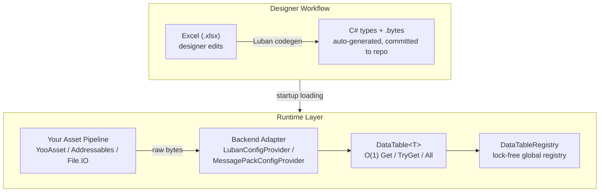
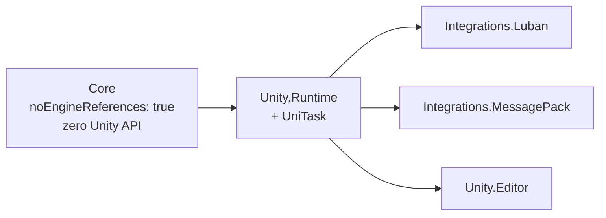

# CycloneGames.DataTable

English | [简体中文](./README.SCH.md)

A modular, backend-agnostic data table pipeline for Unity. Designers edit Excel files; developers query tables at runtime with zero-GC, O(1) lookups. The Core assembly is engine-agnostic — ready for Godot or standalone .NET servers.

---

## Table of Contents

- [CycloneGames.DataTable](#cyclonegamesdatatable)
  - [Table of Contents](#table-of-contents)
  - [Overview](#overview)
    - [When to Use](#when-to-use)
    - [When NOT to Use](#when-not-to-use)
  - [Architecture](#architecture)
    - [Assembly Layering (Pattern C)](#assembly-layering-pattern-c)
  - [Installation](#installation)
    - [Dependencies](#dependencies)
    - [Optional Assemblies](#optional-assemblies)
  - [Quick Start](#quick-start)
    - [Approach A: Pure Code (no tooling)](#approach-a-pure-code-no-tooling)
    - [Approach B: MessagePack Backend](#approach-b-messagepack-backend)
    - [Approach C: Luban Backend (Excel → Code)](#approach-c-luban-backend-excel--code)
  - [API Reference](#api-reference)
    - [IDataRow \& IDataTable\<T\>](#idatarow--idatatablet)
    - [DataTable\<T\>](#datatablet)
    - [DataTableRegistry](#datatableregistry)
    - [DataTableLogger](#datatablelogger)
      - [Default behavior (zero config)](#default-behavior-zero-config)
      - [Bridging to CycloneGames.Logger (or any custom logger)](#bridging-to-cyclonegameslogger-or-any-custom-logger)
      - [Standalone .NET server (no Unity)](#standalone-net-server-no-unity)
  - [Backend Adapters](#backend-adapters)
    - [Luban Integration](#luban-integration)
    - [MessagePack Integration](#messagepack-integration)
    - [Writing a Custom Backend](#writing-a-custom-backend)
    - [Integration with CycloneGames.AssetManagement](#integration-with-cyclonegamesassetmanagement)
      - [YooAsset / Raw File (recommended for production)](#yooasset--raw-file-recommended-for-production)
      - [Addressables / TextAsset (compatible with all providers)](#addressables--textasset-compatible-with-all-providers)
      - [Bootstrapping the full pipeline](#bootstrapping-the-full-pipeline)
  - [Editor Tools](#editor-tools)
    - [Luban Build](#luban-build)
      - [Configuration](#configuration)
    - [Data Validation (Planned)](#data-validation-planned)
  - [Performance Design](#performance-design)
  - [Best Practices](#best-practices)
    - [1. Register all tables at startup](#1-register-all-tables-at-startup)
    - [2. Cache table references for frequent access](#2-cache-table-references-for-frequent-access)
    - [3. Use TryGet for player-driven or network input](#3-use-tryget-for-player-driven-or-network-input)
    - [4. Keep row types simple](#4-keep-row-types-simple)
    - [5. Extension methods for derived data](#5-extension-methods-for-derived-data)
    - [6. Don't modify rows at runtime](#6-dont-modify-rows-at-runtime)
  - [Troubleshooting](#troubleshooting)
    - ["How do I load .bytes files?"](#how-do-i-load-bytes-files)
    - ["Luban build script not found"](#luban-build-script-not-found)
    - ["Duplicate Id X in DataTable\<T\>"](#duplicate-id-x-in-datatablet)
    - [CS0234: ByteBuf namespace error](#cs0234-bytebuf-namespace-error)
    - [MessagePack deserialization fails](#messagepack-deserialization-fails)

---

## Overview

Every game needs configuration data — item stats, skill parameters, level boundaries, dialogue trees. As projects grow, managing this data becomes a bottleneck:

| Pain Point | How CycloneGames.DataTable Solves It |
| --- | --- |
| Excel → code synchronization | Luban generates C# types and binary data from Excel in one step |
| Runtime GC pressure from config reads | Zero-allocation `Get(id)` — hot-path safe, no LINQ, no boxing |
| Slow lookups with large tables | `Dictionary<int, T>` backing, guaranteed O(1) |
| Locking Unity into one config tool | Pluggable backends: Luban, MessagePack, or custom |
| Config tightly coupled to Unity | `Core` assembly targets `netstandard2.0` with zero Unity API references |
| All tables loaded at startup | Developer controls loading entirely — load bytes your way, pass to adapters |

### When to Use

- Your project has 10+ data tables managed by designers
- You want designers to work in Excel, not JSON or code
- You need runtime config queries that never allocate
- You want to keep your config pipeline portable across game engines
- You are building an MMO, RPG, card game, or any content-heavy title

### When NOT to Use

- You have 2-3 tiny config files → `ScriptableObject` is simpler
- You need write-back (player-modifiable data) → this module is read-only by design
- You heavily depend on Unity-specific editor tooling → Core is deliberately Unity-free

---

## Architecture



### Assembly Layering (Pattern C)



| Assembly | Layer | Dependencies | Purpose |
| --- | --- | --- | --- |
| `CycloneGames.DataTable.Core` | Core | *none* | `IDataRow`, `IDataTable<T>`, `DataTable<T>`, `DataTableRegistry`, `DataTableLogger` |
| `CycloneGames.DataTable.Unity.Runtime` | Unity Adapter | Core | `DataTableUnityBootstrap`, `LubanLib/*` |
| `CycloneGames.DataTable.Unity.Editor` | Editor | Unity.Runtime | `DataTableLubanRunner` (Luban build menu) |
| `CycloneGames.DataTable.Unity.Runtime.Integrations.Luban` | Integration | Core + Unity.Runtime | `LubanConfigProvider` |
| `CycloneGames.DataTable.Unity.Runtime.Integrations.MessagePack` | Integration | Core + Unity.Runtime + MessagePack | `MessagePackConfigProvider` |

**Key principle**: `Core` has zero Unity references (`noEngineReferences: true`). The Unity adapter assemblies inject platform specifics via `DataTableLogger` delegates at startup. This is the same pattern used by `CycloneGames.GameplayTags`.

---

## Installation

This module is part of the CycloneGames framework. It lives under `Assets/ThirdParty/CycloneGames/CycloneGames.DataTable/`.

### Dependencies

| Dependency | Required? | Notes |
| --- | --- | --- |
| *none* | — | Core has zero external dependencies. Unity.Runtime only needs Unity. |
| `Luban` | Optional | For Excel → code workflow. [luban](https://github.com/focus-creative-games/luban) |
| `MessagePack-CSharp` | Optional | For MessagePack binary backend. Install via NuGet or UPM. |

### Optional Assemblies

Delete the folders you don't need:

- `Unity.Runtime/Integrations/Luban/` — remove if not using Luban
- `Unity.Runtime/Integrations/MessagePack/` — remove if not using MessagePack

The module compiles and works fine without either integration.

---

## Quick Start

### Approach A: Pure Code (no tooling)

Best for prototyping or when you have few tables. Define rows in C# directly.

**Step 1 — Define a row type**

```csharp
using CycloneGames.DataTable;

public class ItemRow : IDataRow
{
    public int Id { get; set; }
    public string Name { get; set; }
    public int Price { get; set; }
    public float Weight { get; set; }
}
```

**Step 2 — Build and register the table**

```csharp
var table = new DataTable<ItemRow>(new[]
{
    new ItemRow { Id = 1, Name = "Iron Sword",  Price = 100, Weight = 3.5f },
    new ItemRow { Id = 2, Name = "Steel Shield", Price = 250, Weight = 6.0f },
    new ItemRow { Id = 3, Name = "Health Potion", Price = 50,  Weight = 0.3f },
});

DataTableRegistry.Register(table);
```

**Step 3 — Query anywhere**

```csharp
var items = DataTableRegistry.Get<DataTable<ItemRow>>();

var sword = items.Get(1);             // Throws if missing
Debug.Log(sword.Name);                // "Iron Sword"

if (items.TryGet(99, out var rare))   // Safe lookup
    Debug.Log(rare.Name);

foreach (var row in items.All)        // Iterate all rows
    Debug.Log($"{row.Name}: {row.Price} gold");
```

**Full minimal example (no Unity dependencies):**

```csharp
using CycloneGames.DataTable;

// Define row
public class SkillRow : IDataRow
{
    public int Id { get; set; }
    public string Name { get; set; }
    public int Damage { get; set; }
    public float Cooldown { get; set; }
}

// Build table
var skills = new DataTable<SkillRow>(new[]
{
    new SkillRow { Id = 101, Name = "Fireball",  Damage = 80, Cooldown = 1.5f },
    new SkillRow { Id = 102, Name = "Ice Shard",  Damage = 60, Cooldown = 0.8f },
    new SkillRow { Id = 103, Name = "Heal",       Damage = 0,  Cooldown = 5.0f },
});

// Register and query
DataTableRegistry.Register(skills);

var fireball = DataTableRegistry.Get<DataTable<SkillRow>>().Get(101);
// fireball.Damage == 80, fireball.Cooldown == 1.5f
```

---

### Approach B: MessagePack Backend

Best for moderate table counts where you want binary loading without Luban's complexity. Designers can write JSON and convert to MessagePack.

**Step 1 — Annotate your row type**

```csharp
using CycloneGames.DataTable;
using MessagePack;

[MessagePackObject]
public class MonsterRow : IDataRow
{
    [Key(0)] public int Id { get; set; }
    [Key(1)] public string Name { get; set; }
    [Key(2)] public int Hp { get; set; }
    [Key(3)] public int Attack { get; set; }
    [Key(4)] public float MoveSpeed { get; set; }
}
```

**Step 2 — Serialize your data to .bytes**

Write a small editor script or console tool to convert your data:

```csharp
var monsters = new List<MonsterRow>
{
    new MonsterRow { Id = 1, Name = "Slime",   Hp = 50,  Attack = 10, MoveSpeed = 1.2f },
    new MonsterRow { Id = 2, Name = "Goblin",  Hp = 120, Attack = 25, MoveSpeed = 2.5f },
};
var bytes = MessagePackSerializer.Serialize(monsters);
File.WriteAllBytes("Assets/StreamingAssets/monster.bytes", bytes);
```

**Step 3 — Load and register at startup**

```csharp
using CycloneGames.DataTable;
using CycloneGames.DataTable.Unity.Integrations.MessagePack;

// Loading is YOUR responsibility — use whatever pipeline fits your project.
// Here we load synchronously from StreamingAssets for a minimal example:
var bytes = File.ReadAllBytes(Path.Combine(Application.streamingAssetsPath, "monster.bytes"));

// Build and register — pure, synchronous, no hidden loading
MessagePackConfigProvider.Build<MonsterRow>(bytes);

var slime = DataTableRegistry.Get<DataTable<MonsterRow>>().Get(1);
Debug.Log($"Slime HP: {slime.Hp}"); // 50
```

---

### Approach C: Luban Backend (Excel → Code)

The recommended approach for production projects with dedicated designers. Luban generates C# types and binary data from Excel files with a single build step.

**Step 1 — Set up a Luban project**

Create a `DataTable/` directory at your repository root (sibling to the Unity project folder):

```text
your-repo/
├── UnityStarter/          ← Unity project
├── DataTable/             ← Luban project (create this)
│   ├── Excel/             ← .xlsx files go here
│   │   └── item.xlsx
│   ├── gen_code_bin_to_project_lazyload.bat
│   ├── gen_code_bin_to_project_lazyload.sh
│   └── ...
```

The directory name `DataTable` can be changed via the build config asset (see [Editor Tools](#editor-tools)).

**Step 2 — Design your Excel table**

Create `DataTable/Excel/item.xlsx`:

| Id | Name | Price | Weight |
| --- | --- | --- | --- |
| 1 | Iron Sword | 100 | 3.5 |
| 2 | Steel Shield | 250 | 6.0 |
| 3 | Health Potion | 50 | 0.3 |

**Step 3 — Run the build**

In Unity Editor: **Tools → CycloneGames → DataTable → Run Luban Build**

Luban generates:
- `Assets/.../Generated/Item.cs` — C# row type with proper `IDataRow` implementation
- `Assets/StreamingAssets/item.bytes` — binary data for runtime loading

**Step 4 — Load at startup**

Loading is entirely your responsibility. Use whatever asset pipeline fits your project — YooAsset, Addressables, Resources, or raw File.IO. Once you have the bytes, construct Luban's generated Tables object and register:

```csharp
// Example: loading synchronously from StreamingAssets (you should use your own pipeline)
using CycloneGames.DataTable.Unity.Integrations.Luban;

public void InitializeConfigs()
{
    // 1. Load bytes YOUR way
    var itemBytes = File.ReadAllBytes(
        Path.Combine(Application.streamingAssetsPath, "item.bytes"));

    // 2. Build Luban's generated Tables (Luban codegen output)
    var tables = new Tables(fileName =>
        new global::Luban.ByteBuf(
            File.ReadAllBytes(Path.Combine(Application.streamingAssetsPath, fileName))));

    // 3. Register into DataTableRegistry
    LubanConfigProvider.RegisterLubanTable(tables.TbItem);
    // ... register more tables ...

    // 4. Query
    var sword = DataTableRegistry.Get<TbItem>().Get(1);
}
```

**Customizing the Luban project path:**

Create a build config asset (**Assets → Create → CycloneGames → DataTable → Settings**) and edit the fields in the Inspector. On first use, a default config is auto-created at `Assets/Editor/DataTableSettings.asset`.

For programmatic overrides (e.g., CI pipelines):

```csharp
DataTableLubanRunner.ProjectDirOverride = "MyConfigs/GameData";
DataTableLubanRunner.ScriptNameOverride = "my_build_script";
// Set to null to restore SO-driven behavior
```

**Portable standalone build (no Unity Editor):**

```bash
# Windows
cd DataTable
gen_code_bin_to_project_lazyload.bat

# macOS / Linux
cd DataTable
./gen_code_bin_to_project_lazyload.sh
```

---

## API Reference

### IDataRow & IDataTable\<T\>

The two interfaces that define the data table contract. Both live in `CycloneGames.DataTable.Core`.

**`IDataRow`** — every config row must implement this:

```csharp
public interface IDataRow
{
    int Id { get; }
}
```

The `Id` is the primary key. It must be unique within a table. Duplicate `Id` values log a warning and the first occurrence is kept.

**`IDataTable<T>`** — read-only, zero-allocation access to a typed table:

| Member | Returns | Notes |
| --- | --- | --- |
| `Get(int id)` | `T` | O(1). Throws `KeyNotFoundException` if missing. Use when the key is known valid. |
| `GetOrDefault(int id)` | `T` | O(1). Returns `default(T)` if missing. Safe for conditional access chains. |
| `TryGet(int id, out T row)` | `bool` | O(1). Returns `false` if missing. The "tell, don't ask" pattern. |
| `All` | `IReadOnlyList<T>` | All rows. The underlying `T[]` is shared — do not modify. |
| `Count` | `int` | Number of rows. |

**Choosing the right lookup method:**

```csharp
var table = DataTableRegistry.Get<DataTable<ItemRow>>();

// Use Get() when you expect the key to exist — clean code, loud on error
var sword = table.Get(1);

// Use TryGet() for player input, network messages, or soft references
if (table.TryGet(playerInput.itemId, out var item))
    GiveItem(item);
else
    SendError($"Item {playerInput.itemId} not found");

// Use GetOrDefault() for optional fields like "fallback config"
var config = table.GetOrDefault(specificId) ?? table.Get(DEFAULT_CONFIG_ID);
```

---

### DataTable\<T\>

The concrete implementation of `IDataTable<T>`. Backed by `Dictionary<int, T>` for O(1) lookup and `T[]` for zero-copy `All` access.

**Constructors:**

```csharp
// From array — zero copy. Array is stored directly.
public DataTable(T[] rows);

// From List — internal .ToArray() copies once.
public DataTable(List<T> rows);

// From IEnumerable — uses pooled List internally.
public static DataTable<T> FromEnumerable(IEnumerable<T> rows);
```

**Performance note:** Prefer the array constructor. It avoids both the `List<T>` allocation and the `.ToArray()` copy:

```csharp
// Preferred: pre-build the array
var rows = new ItemRow[expectedCount];
// ... populate rows
var table = new DataTable<ItemRow>(rows);

// OK: when source is naturally a List
var list = new List<ItemRow>();
// ... populate list
var table = new DataTable<ItemRow>(list);

// Acceptable: one-off initialization from unknown source
var table = DataTable<ItemRow>.FromEnumerable(someLinqResult);
```

---

### DataTableRegistry

The central registry. All tables are registered at startup, then read concurrently without locks.

```csharp
// Register (startup only)
DataTableRegistry.Register(myTable);

// Query (anywhere, any thread — read-only after registration)
var table = DataTableRegistry.Get<DataTable<ItemRow>>();
if (DataTableRegistry.TryGet<DataTable<ItemRow>>(out var t)) { ... }

// Check initialization state
if (DataTableRegistry.IsInitialized) { ... }

// Mark all tables registered (prevents further registrations)
DataTableRegistry.MarkInitialized();

// Reset (test teardown / hot-reload)
DataTableRegistry.Reset();
```

**Thread safety:** Reads are lock-free. Writes (`Register`, `Reset`) must be called from a single thread during initialization. After `MarkInitialized()`, all reads are safe from any thread without synchronization.

---

### DataTableLogger

Internal logging bridge. Core defaults to `Console.WriteLine`. At startup, `DataTableUnityBootstrap` routes to Unity's `Debug.Log*` — but only if the delegates are still at their defaults. The last write always wins.

**The module intentionally has no loading API.** Loading `.bytes` files is entirely the developer's responsibility — use YooAsset, Addressables, Resources, or raw File.IO. Once you have bytes, pass them to a backend adapter or construct `DataTable<T>` directly.

#### Default behavior (zero config)

```csharp
// By default, Core writes to Console; Unity Bootstrap overrides to Debug.Log*
DataTableLogger.LogWarning("Duplicate Id 5 in DataTable<ItemRow>.");  // → Debug.LogWarning
DataTableLogger.LogError("Failed to deserialize skill.bytes.");       // → Debug.LogError
DataTableLogger.LogInfo("Registered DataTable<ItemRow> (42 rows).");  // → Debug.Log
```

#### Bridging to CycloneGames.Logger (or any custom logger)

Just set the delegates before or after Unity initializes. The bootstrap will detect they're already overridden and skip its own injection:

```csharp
// In your game initializer:
DataTableLogger.LogWarning = msg => CycloneGames.Logger.Log.Warn(msg);
DataTableLogger.LogError   = msg => CycloneGames.Logger.Log.Error(msg);
DataTableLogger.LogInfo    = msg => CycloneGames.Logger.Log.Info(msg);
```

#### Standalone .NET server (no Unity)

```csharp
// No bootstrap runs — Core defaults to Console. Override as needed:
DataTableLogger.LogWarning = msg => logger.Warn(msg);
DataTableLogger.LogError   = msg => logger.Error(msg);
DataTableLogger.LogInfo    = msg => logger.Info(msg);
```

---

## Backend Adapters

### Luban Integration

**Assembly:** `CycloneGames.DataTable.Unity.Runtime.Integrations.Luban`  
**Namespace:** `CycloneGames.DataTable.Unity.Integrations.Luban`  
**Dependency:** `LubanLib` classes bundled in `Unity.Runtime/LubanLib/` (ByteBuf, BeanBase, ITypeId, StringUtil)

**`LubanConfigProvider`** is a thin registration helper. You are responsible for loading `.bytes` files and constructing Luban's generated `Tables` object:

```csharp
// 1. Load bytes YOUR way (YooAsset / Addressables / File.IO / whatever)
var bytes = YourAssetPipeline.Load("item.bytes");

// 2. Construct Luban's generated Tables (from Luban codegen output)
var tables = new Tables(fileName =>
    new global::Luban.ByteBuf(YourAssetPipeline.Load(fileName)));

// 3. Register into DataTableRegistry
LubanConfigProvider.RegisterLubanTable(tables.TbItem);

// Bulk register
LubanConfigProvider.RegisterLubanTables(
    (typeof(TbItem),   tables.TbItem),
    (typeof(TbSkill),  tables.TbSkill),
    (typeof(TbMonster), tables.TbMonster)
);
```

This class does NOT load anything. It only registers table instances.

---

### MessagePack Integration

**Assembly:** `CycloneGames.DataTable.Unity.Runtime.Integrations.MessagePack`  
**Namespace:** `CycloneGames.DataTable.Unity.Integrations.MessagePack`  
**Dependency:** `com.github.messagepack-csharp` (external package)

This assembly only compiles when the MessagePack package is installed (guarded by `defineConstraints: ["MESSAGEPACK"]` and `versionDefines`).

**`MessagePackConfigProvider`** is a pure synchronous builder — deserializes bytes into `DataTable<T>` and registers it:

```csharp
// 1. Load bytes YOUR way
var bytes = YourAssetPipeline.Load("monster.bytes");

// 2. Build and register in one call — synchronous, no hidden loading
var table = MessagePackConfigProvider.Build<MonsterRow>(bytes);

// 3. Query
var slime = DataTableRegistry.Get<DataTable<MonsterRow>>().Get(1);
```

**Requirements for row types:**
- Must implement `IDataRow`
- Must be annotated with `[MessagePackObject]` and `[Key(n)]` attributes
- Properties must have `{ get; set; }`

---

### Writing a Custom Backend

If Luban and MessagePack don't fit your pipeline, implement your own adapter:

```csharp
// 1. Write a static provider class
public static class JsonConfigProvider
{
    public static void LoadAndRegister<TRow>(string filePath)
        where TRow : IDataRow
    {
        // Load and deserialize
        var json = File.ReadAllText(filePath);
        var rows = JsonSerializer.Deserialize<List<TRow>>(json);

        // Register into the registry
        var table = new DataTable<TRow>(rows);
        DataTableRegistry.Register(table);
    }
}

// 2. Call during startup
JsonConfigProvider.LoadAndRegister<ItemRow>("Configs/items.json");
JsonConfigProvider.LoadAndRegister<SkillRow>("Configs/skills.json");

// 3. Query uniformly
var items = DataTableRegistry.Get<DataTable<ItemRow>>();
```

Your adapter only needs to produce rows implementing `IDataRow` and call `DataTableRegistry.Register()`. The rest of the module doesn't care about the serialization format.

---

### Integration with CycloneGames.AssetManagement

If your project uses `CycloneGames.AssetManagement`, the DataTable module integrates seamlessly — **no adapter code needed**. DataTable accepts raw `byte[]`; AssetManagement provides `ReadBytes()` on any raw file or TextAsset handle. The two modules are designed to compose directly.

#### YooAsset / Raw File (recommended for production)

```csharp
using CycloneGames.DataTable;
using CycloneGames.DataTable.Unity.Integrations.MessagePack;
using CycloneGames.AssetManagement.Runtime;

public async UniTask InitializeConfigs()
{
    var package = AssetManagementLocator.DefaultPackage;

    // Async: load raw .bytes file via YooAsset raw file API
    var handle = package.LoadRawFileAsync("monster.bytes");
    await handle.Task;
    var bytes = handle.ReadBytes();
    handle.Dispose();

    MessagePackConfigProvider.Build<MonsterRow>(bytes);
}

// Sync variant (YooAsset only):
public void InitializeConfigsSync()
{
    var package = AssetManagementLocator.DefaultPackage;
    var handle = package.LoadRawFileSync("monster.bytes");
    var bytes = handle.ReadBytes();
    handle.Dispose();

    MessagePackConfigProvider.Build<MonsterRow>(bytes);
}
```

#### Addressables / TextAsset (compatible with all providers)

```csharp
public async UniTask InitializeConfigs()
{
    var package = AssetManagementLocator.DefaultPackage;

    // Load as TextAsset (works with Addressables, Resources, and YooAsset)
    var handle = package.LoadAssetAsync<TextAsset>("monster.bytes");
    await handle.Task;
    var bytes = handle.Asset.bytes;
    handle.Dispose();

    MessagePackConfigProvider.Build<MonsterRow>(bytes);
}
```

#### Bootstrapping the full pipeline

```csharp
public async UniTask BootstrapGameConfigs()
{
    var package = AssetManagementLocator.DefaultPackage;

    // Load all config tables
    var tasks = new[]
    {
        LoadTable<ItemRow>(package, "item.bytes"),
        LoadTable<SkillRow>(package, "skill.bytes"),
        LoadTable<MonsterRow>(package, "monster.bytes"),
    };
    await UniTask.WhenAll(tasks);

    // Lock down writes — read-only from here
    DataTableRegistry.MarkInitialized();
}

private async UniTask LoadTable<TRow>(IAssetPackage package, string fileName)
    where TRow : IDataRow
{
    var handle = package.LoadRawFileAsync(fileName);
    await handle.Task;
    var bytes = handle.ReadBytes();
    handle.Dispose();

    MessagePackConfigProvider.Build<TRow>(bytes);
}
```

No intermediate layer, no hidden loading, no coupling. DataTable receives bytes; AssetManagement supplies bytes.

---

## Editor Tools

All editor tools live in `CycloneGames.DataTable.Unity.Editor` and are available under the **Tools → CycloneGames → DataTable** menu.

### Luban Build

**Menu:** `Tools/CycloneGames/DataTable/Run Luban Build`

Runs the Luban code-generation script and refreshes the AssetDatabase.

#### Configuration

Build settings are stored in a **`DataTableSettings`** ScriptableObject. On first access, if no config asset exists, a default one is created at `Assets/Editor/DataTableSettings.asset`.

**Creating a config manually:** Assets → Create → CycloneGames → DataTable → Settings

**Config fields:**

| Field | Default | Description |
| --- | --- | --- |
| `DataTableProjectDir` | `../DataTable` | Path to Luban project, relative to repo root |
| `ScriptName` | `gen_code_bin_to_project_lazyload` | Script name without extension (`.bat`/`.sh` appended automatically) |
| `AutoRefreshAssets` | `true` | Whether to call `AssetDatabase.Refresh()` after a successful build. Does NOT trigger the build itself — you must still run the menu command or call `DataTableLubanRunner.Run()`. |

The config asset has a **custom Inspector** that shows:
- Resolved absolute paths for the config directory and build script
- Live validation: whether the directory and script actually exist on disk
- Quick-action buttons to open directories or run the build

**Resolved script path:**

```text
{repoRoot}/{DataTableProjectDir}/{ScriptName}.bat   // Windows
{repoRoot}/{DataTableProjectDir}/{ScriptName}.sh    // macOS / Linux
```

**Programmatic overrides** (for CI pipelines or editor scripts):

```csharp
// These override the SO values. Set to null to restore SO-driven behavior.
DataTableLubanRunner.ProjectDirOverride = "MyConfigs";
DataTableLubanRunner.ScriptNameOverride = "build_all";
```

**Safety guarantees:**
- Exactly one config asset is enforced — duplicates trigger a warning with all paths listed
- Config is cached after first lookup; call `DataTableSettings.InvalidateCache()` to force re-scan
- If the config asset is deleted or corrupted, a fresh default is auto-created
- Missing script path logs a detailed error referencing the active config asset path

The build process captures stdout/stderr and logs them to the Unity Console. On success (`exit code 0`), `AssetDatabase.Refresh()` is called automatically (unless `AutoRefreshAssets` is disabled).

### Data Validation (Planned)

A `DataTableValidatorWindow` is planned to validate:
- No duplicate primary keys across tables
- Foreign key integrity (e.g., skill IDs referenced in character tables exist)
- Data range checks (e.g., damage values are non-negative)
- Missing required fields

---

## Performance Design

The module is engineered for zero-GC runtime queries:

| Operation | Allocation | Complexity | Notes |
| --- | --- | --- | --- |
| `Get(id)` | **0 B** | O(1) | `Dictionary.TryGetValue` + return |
| `GetOrDefault(id)` | **0 B** | O(1) | Same as Get, no throw path |
| `TryGet(id, out T)` | **0 B** | O(1) | Direct delegate to `Dictionary.TryGetValue` |
| `.All` | **0 B** | O(1) | Returns reference to internal `T[]` |
| `.Count` | **0 B** | O(1) | Returns `_rowsArray.Length` |
| Table construction | **1 alloc** | O(n) | `Dictionary<int, T>` with exact capacity |
| Registry read (`Get<T>`) | **0 B** | O(1) | Lock-free dictionary reference read |

**Design decisions:**
- Constructor accepts `T[]` directly — no copy, no `ToList()`, no LINQ
- `DataTableRegistry` uses lock-free read pattern: writes only at startup, `Volatile.Write` for publication
- `Dictionary<int, T>` is pre-sized to exact row count — zero resize, minimal collision rate
- All hot-path methods are non-virtual (sealed by default), enabling devirtualization

---

## Best Practices

### 1. Register all tables at startup

```csharp
public async UniTask BootstrapConfigs()
{
    await MessagePackConfigProvider.LoadAndRegisterAsync<ItemRow>("item.bytes");
    await MessagePackConfigProvider.LoadAndRegisterAsync<SkillRow>("skill.bytes");
    DataTableRegistry.MarkInitialized();
}
```

Call `MarkInitialized()` after registration to lock down writes. Read-after-mark is guaranteed thread-safe.

### 2. Cache table references for frequent access

```csharp
// At startup
private DataTable<ItemRow> _items;

void Awake()
{
    _items = DataTableRegistry.Get<DataTable<ItemRow>>();
}

// In hot paths — no Registry lookup, direct field access
void Update()
{
    var item = _items.Get(currentItemId);
}
```

`DataTableRegistry.Get<T>()` is O(1), but caching avoids the dictionary lookup on the registry itself.

### 3. Use TryGet for player-driven or network input

```csharp
public void HandleUseItem(int itemId)
{
    if (!_items.TryGet(itemId, out var item))
    {
        SendError($"Item {itemId} does not exist");
        return;
    }
    ApplyItemEffect(item);
}
```

Never trust player input — `Get()` throws on missing keys.

### 4. Keep row types simple

```csharp
// Good: plain data
public class ItemRow : IDataRow
{
    public int Id { get; set; }
    public string Name { get; set; }
    public int Price { get; set; }
}

// Avoid: logic, references, Unity objects
public class BadItemRow : IDataRow  // Don't do this
{
    public int Id { get; set; }
    public GameObject Prefab { get; set; }  // Wrong — Unity objects in config
    public void CalculatePrice() { ... }    // Wrong — logic in data class
}
```

Row types are pure data. Logic belongs in separate systems that consume these rows.

### 5. Extension methods for derived data

Instead of putting logic in rows, use extension methods:

```csharp
public static class ItemRowExtensions
{
    public static bool IsExpensive(this ItemRow row) => row.Price > 1000;
    public static bool IsEquippable(this ItemRow row) => row.ItemType == ItemType.Weapon;
}

// Usage
if (item.IsExpensive())
    ShowPremiumEffect();
```

### 6. Don't modify rows at runtime

The internal array is shared. Mutating row data from multiple callers causes race conditions and bugs. If you need runtime-mutable data, maintain a separate dictionary:

```csharp
// Config data: read-only
var baseItems = DataTableRegistry.Get<DataTable<ItemRow>>();

// Runtime state: mutable
private Dictionary<int, int> _playerInventory = new();

public void AddItem(int itemId)
{
    if (!baseItems.TryGet(itemId, out _)) return;  // Validate config exists
    _playerInventory.TryGetValue(itemId, out var count);
    _playerInventory[itemId] = count + 1;
}
```

---

## Troubleshooting

### "How do I load .bytes files?"

This module intentionally does not provide a loading API. Loading is your responsibility — use whatever fits your project:

```csharp
// Option A: Raw File.IO (prototyping)
var bytes = File.ReadAllBytes(Path.Combine(Application.streamingAssetsPath, "monster.bytes"));

// Option B: YooAsset
var handle = YooAssets.LoadAssetAsync<TextAsset>("monster.bytes");
await handle;
var bytes = ((TextAsset)handle.AssetObject).bytes;

// Option C: Addressables
var handle = Addressables.LoadAssetAsync<TextAsset>("monster.bytes");
await handle.Task;
var bytes = handle.Result.bytes;

// Option D: Unity Resources (prototyping only)
var ta = Resources.Load<TextAsset>("DataTable/monster");
var bytes = ta.bytes;
```

Once you have the bytes, pass them to `MessagePackConfigProvider.Build<T>(bytes)` or construct `DataTable<T>` directly.

```

### "Luban build script not found"

**Cause:** The configured Luban script path doesn't exist on disk.

**Fix:** Either:

1. Set up a Luban project at the configured path (default: `../DataTable/` relative to repo root)
2. Edit the `DataTableSettings` asset in the Inspector to point to your Luban project
   (Assets → Create → CycloneGames → DataTable → Settings if none exists)
3. If you don't use Luban, ignore the menu item — the module works fine without it

### "Duplicate Id X in DataTable\<T\>"

**Cause:** Two rows share the same `Id` value.

**Fix:** Check your Excel or data source. The first occurrence is kept; subsequent duplicates log a warning.

### CS0234: ByteBuf namespace error

**Cause:** The `Luban` namespace in `LubanConfigProvider.cs` conflicts with the integration's own `Luban` namespace segment.

**Fix:** This has been resolved in the module — `LubanConfigProvider.Initialize()` uses `global::Luban.ByteBuf` to disambiguate.

### MessagePack deserialization fails

**Cause:** Row type is missing `[MessagePackObject]` or `[Key(n)]` attributes, or the `.bytes` file doesn't contain `List<TRow>`.

**Fix:**
1. Annotate your row: `[MessagePackObject] public class MyRow : IDataRow`
2. Annotate all properties: `[Key(0)] public int Id { get; set; }`
3. Ensure the serialized format matches — use `MessagePackSerializer.Serialize<List<TRow>>(rows)`

---
