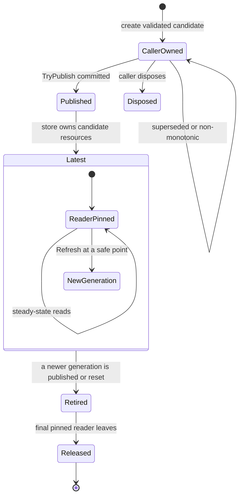

# CycloneGames.DataTable

English | [简体中文](./README.SCH.md)

CycloneGames.DataTable is a typed, immutable configuration-data layer for Unity, pure C# hosts, tools, and servers. It keeps payload acquisition, decoding, business validation, and publication as separate concerns, so a product can pick its own data source and serialization format without coupling gameplay code to them. The Core assembly has no `UnityEngine` dependency.

This README is the solution-design and runtime reference. The transactional Luban build pipeline is documented in the [DataTable/Luban build handbook](../../../../../DataTable/Luban/README.md).

## Table of Contents

- [Start Here](#start-here)
- [Architecture](#architecture)
- [Five-Minute Core Tutorial](#five-minute-core-tutorial)
- [Build Overview](#build-overview)
- [Runtime Loading Pipeline](#runtime-loading-pipeline)
- [Ownership and Lifetime](#ownership-and-lifetime)
- [Performance and Platform Notes](#performance-and-platform-notes)
- [Security and Persistence](#security-and-persistence)
- [Extension Points](#extension-points)
- [Troubleshooting](#troubleshooting)
- [Validation](#validation)
- [API Navigation](#api-navigation)

## Start Here

### What the module solves

DataTable targets source-ordered, read-mostly configuration: item definitions, ability parameters, progression curves, localization metadata, or generated schema tables. It provides:

- structurally immutable `DataTable<TKey, TRow>` instances with `O(1)` key lookup;
- `DataTableCatalog` snapshots keyed by the exact contract type;
- payload limits, portable names, locations, manifests, lengths, and SHA-256 checks;
- generated-table registration that never relies on runtime reflection;
- versioned `DataTableStore` publication with pinned readers and delayed resource retirement;
- Luban, MessagePack, AssetManagement, and Logging integrations, each isolated in its own assembly.

Mutable game state, saves, network replication, database queries, schema-specific business rules, signatures, and product trust policy stay outside this module. DataTable also never reads files on its own and never picks a runtime Provider for generated output.

### Compose the solution on three axes

The three axes are independent. Choose one entry from each row; diagnostics are an optional fourth dimension.

| Axis | Choices | Decision |
| --- | --- | --- |
| 1. Acquire | Already materialized rows; `DataTableBytesCache`; a custom `IDataTableBytesProvider`; AssetManagement integration | Where bytes live, which thread owns them, and how their lifetime is closed. |
| 2. Decode | No decoder; Luban; MessagePack; a custom decoder | Which payload format becomes typed rows or a generated table set. |
| 3. Publish | Direct `DataTableCatalog` composition; `DataTableStore` plus `DataTableReader` | Whether consumers need one fixed catalog or explicit generation changes. |

Common combinations:

| Use case | Acquire | Decode | Publish |
| --- | --- | --- | --- |
| Small fixed project | Handwritten or generated row arrays | None | Inject one catalog directly. |
| Luban client configuration | Product Provider or bounded cache | Luban integration | Direct catalog or Store, depending on reload requirements. |
| MessagePack configuration | Product Provider or bounded cache | MessagePack integration | Direct catalog or Store. |
| Unity asset package | AssetManagement TextAsset or raw-file loader | Luban, MessagePack, or a product decoder | Usually Store when asset handles must retire with a generation. |
| Server or test host | Filesystem, network, or in-memory custom Provider | Any pure C# decoder available to that host | Direct catalog or one instance-owned Store. |

### Current assembly and activation status

The status below comes from the current asmdefs, package manifest, local packages, and compiler constraints. Adding an asmdef reference does not satisfy an unmet `defineConstraints` or `versionDefines` condition.

| Assembly | Current status | Reference and activation rule |
| --- | --- | --- |
| `CycloneGames.DataTable.Core` | Available | Pure C#, `noEngineReferences: true`, `autoReferenced: true`. |
| `CycloneGames.DataTable.Unity.Editor` | Available in Editor | References Core and UniTask; `autoReferenced: false`. The current project manifest contains UniTask. |
| `CycloneGames.DataTable.Integrations.Logging` | Available, opt-in | References Core and the local `CycloneGames.Logging.Core`; `autoReferenced: false`. |
| `CycloneGames.DataTable.Integrations.Logging.Editor` | Available in Editor | Auto-referenced Editor bootstrap. It installs the Logging adapter only when the DataTable diagnostics sink is unclaimed. |
| `CycloneGames.DataTable.Unity.Runtime.Integrations.Luban` | Inactive in this checkout | Requires `com.code-philosophy.luban` in `[1.2.0,2.0.0)` so Unity emits `LUBAN`; that package is not present in the current manifest. |
| `CycloneGames.DataTable.Unity.Runtime.Integrations.MessagePack` | Inactive in this checkout | Requires `com.github.messagepack-csharp` in `[3.1.8,4.0.0)` so Unity emits `MESSAGEPACK`, and references `MessagePack.dll`; neither package nor binary is present. |
| `CycloneGames.DataTable.Unity.Runtime.Integrations.AssetManagement` | Inactive in the current asset-style layout | Requires `CYCLONE_ASSET_MANAGEMENT` emitted from UPM package ID `com.cyclone-games.asset-management`. The target module exists under `Assets`, where its `package.json` does not activate this `versionDefines` entry. |

Do not add a PlayerSettings scripting symbol to hide an inactive integration. Install or place the dependency so the assembly-level activation rule holds, or implement a product Provider against Core.

## Architecture

### End-to-end data path


```mermaid
flowchart LR
    subgraph Build["Build time"]
        S["Defines and workbooks"] --> P["Transactional Luban pipeline"]
        C["build_config.ini and luban.conf"] --> P
        P --> GC["Generated C#"]
        P --> GB["Generated payloads and receipt"]
    end

    subgraph Runtime["Runtime composition"]
        BP["IDataTableBytesProvider"] --> MV["Limits and manifest validation"]
        MV --> DE["Luban, MessagePack, or custom decode"]
        DE --> BV["Product business validation"]
        BV --> CA["DataTableCatalog"]
        CA --> DI["Direct DI"]
        CA --> CD["DataTableCandidate"]
        CD --> ST["DataTableStore"]
        ST --> RD["DataTableReader"]
    end

    GC --> DE
    GB --> BP

    classDef source fill:#dbeafe,stroke:#2563eb,color:#172554
    classDef guard fill:#fef3c7,stroke:#d97706,color:#451a03
    classDef snapshot fill:#dcfce7,stroke:#16a34a,color:#052e16
    class S,C,GC,GB,BP source
    class P,MV,DE,BV guard
    class CA,DI,CD,ST,RD snapshot
```

Build-time generation and runtime loading are separate contracts. The pipeline creates code and payload files; the runtime composition root decides how payloads are acquired, authenticated, decoded, validated, published, and retired.

### Generation and reader lifetime


```mermaid
stateDiagram-v2
    [*] --> CallerOwned: create validated candidate
    CallerOwned --> Published: TryPublish committed
    CallerOwned --> CallerOwned: superseded or non-monotonic
    CallerOwned --> Disposed: caller disposes
    Published --> Latest: store owns candidate resources
    Latest --> Retired: a newer generation is published or reset
    Retired --> Released: final pinned reader leaves
    Released --> [*]

    state Latest {
        [*] --> ReaderPinned
        ReaderPinned --> ReaderPinned: steady-state reads
        ReaderPinned --> NewGeneration: Refresh at a safe point
    }
```

A successful publication consumes the candidate. A rejected publication leaves it caller-owned. Publication never moves an existing reader; `Refresh()` is the generation boundary. A retired generation releases its resource owner only after its final pinned reader leaves.

### Core boundaries

- Core contains tables, catalogs, limits, manifests, byte caching, generated descriptors, Store/Reader publication, names, locations, hashes, and module-local diagnostics.
- Core does not reference Unity, Logging, Luban, MessagePack, AssetManagement, a DI container, or a service locator.
- Integration assemblies depend inward on Core. Core never depends on an integration.
- Runtime type discovery is not used. Generated models enter a catalog through explicit `DataTableGeneratedTableCollector.TableDescriptor<TTableSet>` values.

## Five-Minute Core Tutorial

### 1. Reference Core

For an asmdef-based consumer, add the Core assembly:

```json
{
  "references": [
    "CycloneGames.DataTable.Core"
  ]
}
```

### 2. Define a row and build a table

`IDataRow` is the convenience contract for an `int` key. Keep published row values and referenced objects immutable.

```csharp
using CycloneGames.DataTable;

public sealed class ItemRow : IDataRow
{
    public ItemRow(int id, string name, int maxStack)
    {
        Id = id;
        Name = name;
        MaxStack = maxStack;
    }

    public int Id { get; }
    public string Name { get; }
    public int MaxStack { get; }
}

var items = new DataTable<ItemRow>(new[]
{
    new ItemRow(1001, "Health Potion", 20),
    new ItemRow(1002, "Mana Potion", 20),
});
```

The array constructor copies the source, preserves row order, and builds a key-to-index dictionary. A null row, null key, duplicate key, or row-count violation fails construction.

For rows that cannot implement `IDataRow<TKey>`, pass a selector and comparer:

```csharp
var texts = new DataTable<string, LocalizedTextRow>(
    decodedRows,
    static row => row.Key,
    StringComparer.Ordinal);
```

### 3. Query and group tables

```csharp
ItemRow required = items.Get(1001);

if (items.TryGet(1002, out ItemRow optional))
{
    Use(optional);
}

var catalog = new DataTableCatalogBuilder(capacity: 1)
    .Add<IDataTable<ItemRow>>(items)
    .Build();

IDataTable<ItemRow> itemTable = catalog.Get<IDataTable<ItemRow>>();
```

`Get` throws `KeyNotFoundException` when a key or contract is absent; `TryGet` is the non-throwing path. Catalog lookup uses the exact contract type supplied to `Add`, and the one-shot builder cannot be reused after `Build()`.

### 4. Choose direct composition or publication

Inject `DataTableCatalog` directly when one catalog lives for the whole scope. Use `DataTableStore` when a complete validated generation must replace another while existing consumers finish against their pinned snapshot. Do not add Store to a fixed configuration only to obtain global access; it is constructed and owned explicitly.

## Build Overview

### Current bootstrap state

The repository contains the transactional pipeline, launchers, `build_config.ini`, `luban.conf`, and one `UnityStarter/Assets/Editor/DataTable/DataTableLubanSettings.asset` selecting profile `client`. The current checkout does not contain `DataTable/Luban/Defines`, `DataTable/Luban/Datas`, the approved Luban executable/DLL, or generated output roots. The Luban identity and source-fingerprint fields in `build_config.ini` are placeholders, and there is no generation receipt. Generation fails closed until those inputs and reviewed identities are supplied.

### Authoritative inputs

| Input | Purpose |
| --- | --- |
| `<repo-root>/DataTable/Luban/Defines/` | Luban schema definitions. |
| `<repo-root>/DataTable/Luban/Datas/` | Workbooks, including `__tables__.xlsx`, `__beans__.xlsx`, and `__enums__.xlsx`. |
| `<repo-root>/DataTable/Luban/luban.conf` | Groups, schema files, targets, manager name, and top module. |
| `<repo-root>/DataTable/Luban/build_config.ini` | Approved tool identity, templates, CodeGen settings, and output profiles. |
| `<repo-root>/UnityStarter/Assets/ThirdParty/CycloneGames/CycloneGames.DataTable/Tools~/CodeGen/` | Transactional pipeline and string-constant generator. |

The configured groups are `c` for client, `s` for server, and `c+s` for the `all` target. All targets use manager `Tables` and top module `UnityStarter.GameConfig`.

### Transactional generation

The normal order is:

1. Run `inspect` for the chosen profile and use `canGenerate`, `canCheck`, and `canRecover` as the authority.
2. Validate the config, required workbooks, output containment, tool hash, Luban hash, and source fingerprint.
3. Acquire the single writer lock and capture the live-output baseline.
4. Run Luban and string-constant generation only into a transaction candidate directory.
5. Require at least one code file and one data file, then hash the candidate and create a generation receipt.
6. Publish only changed files with a journal and backups. Verify commit or rollback before removing transaction evidence.
7. Run `check` to compare the receipt with the exact live code/data file sets and hashes. `check` does not run Luban or rewrite the receipt.

Do not manually delete `.cyclonegames-datatable-writer.lock` or `.cyclonegames-datatable-transactions`. Run `inspect` first, then `recover --run-id <id>` only when `canRecover` is true.

### Profiles and runtime Provider alignment

The profile output path and the runtime Provider are independent decisions. Generated C# and generated bytes serve different consumers.

| Profile | Code output | Data output | Runtime alignment |
| --- | --- | --- | --- |
| `client` | `UnityStarter/Assets/UnityStarter/Scripts/Generated/DataTable/` | `UnityStarter/Assets/StreamingAssets/DataTable/` | Unity compiles the C#. Core has no StreamingAssets loader; the product must use platform-appropriate I/O to populate a cache/custom Provider. AssetManagement does not consume this directory automatically. |
| `server` | `DataTable/Luban/Generated/Server/Code/` | `DataTable/Luban/Generated/Server/Data/` | Package both roots with the server artifact and provide host-specific acquisition. |
| `all` | `DataTable/Luban/Generated/All/Code/` | `DataTable/Luban/Generated/All/Data/` | Intended for the combined `c+s` target; use an explicit host Provider. |

To use AssetManagement, generated payloads must be imported or routed into locations owned by its package, and `IDataTableLocationResolver` must resolve those same locations. The DataTable AssetManagement integration must also be active; it is inactive in the current asset-style checkout.

### Editor and CLI entry points

The Editor assembly provides:

- `Tools > CycloneGames > DataTable > Create Default Settings`;
- `Open Settings`, `Generate`, `Check`, and `Recover` under the same menu;
- a visible settings asset whose defaults point to `../DataTable/Luban/build_config.ini` and profile `client`.

Exactly one saved `DataTableLubanSettings` asset is required when using the Editor operations. CLI/CI-only workflows do not require it. Generate and Recover may refresh AssetDatabase after success; Check does not.

From the repository root on Windows:

```powershell
DataTable\Luban\gen_code_bin_to_project_lazyload.bat inspect --profile client --format json
DataTable\Luban\gen_code_bin_to_project_lazyload.bat generate --profile client
DataTable\Luban\gen_code_bin_to_project_lazyload.bat check --profile client
DataTable\Luban\gen_code_bin_to_project_lazyload.bat recover --run-id <32-hex-run-id>
```

Use the `.sh` launcher with the same arguments on macOS or Linux. `--profile` is required for `inspect`, `generate`, and `check`; `recover` accepts a run ID and no profile. See the [Luban build handbook](../../../../../DataTable/Luban/README.md) for every configuration key, exit code, transaction state, and CI workflow.

## Runtime Loading Pipeline

Work through the stages in this order. Moving business validation or manifest checks after publication exposes a partial or untrusted generation.

### 1. Define measured limits

```csharp
var limits = new DataTableLoadLimits(
    maxTableCount: 128,
    maxBytesPerTable: 8 * 1024 * 1024,
    maxTotalBytes: 64L * 1024 * 1024,
    maxRowsPerTable: 250_000,
    maxTableNameLength: 96,
    maxLocationLength: 256);
```

`DataTableLoadLimits.Default` allows 4,096 tables, 64 MiB per table, 512 MiB total, 2,000,000 rows per table, 256 UTF-16 code units per table name, and 2,048 per location. These are broad fail-fast guardrails, not production budgets. Set tighter values from generated-content measurements and the lowest supported hardware tier.

### 2. Acquire and validate payloads

`IDataTableBytesProvider` returns borrowed `ReadOnlyMemory<byte>`. The memory remains valid only for the Provider's documented lifetime. Implement `IDataTableBytesInventory` as well when a manifest must prove that no unknown payload exists.

#### Match output and Provider locations

The build output, AssetManagement runtime location, resolver result, and optional manifest `Location` must describe the same payload. Choose the acquisition recipe explicitly:

| Source or package | Provider recipe | Location contract | Allocation boundary |
| --- | --- | --- | --- |
| `StreamingAssets/DataTable` | Product-owned platform-asynchronous I/O produces an owned `byte[]`, then transfers it with `DataTableBytesCache.AddOwned`. | Use the generated relative file name. Core has no StreamingAssets Provider. | The I/O layer allocates the array before `AddOwned` applies DataTable admission limits. Preflight size in the product I/O layer when the platform exposes it. |
| Resources `TextAsset` | `AssetManagementDataTableBytesLoader` through a Resources package. | Location is relative to a `Resources/` folder and omits the file extension. Use `DataTableLocationResolver(..., dataExtension: "")`; a manifest location must follow the same rule. | Unity/Provider loads the asset and `TextAsset.bytes` creates the first byte array before DataTable validates it. |
| Addressables `TextAsset` | `AssetManagementDataTableBytesLoader` through an Addressables package. | The resolver or manifest location must equal the authored Addressables address, including or omitting an extension exactly as that address does. | Provider asset allocation occurs before DataTable admission. |
| YooAsset `TextAsset` | `AssetManagementDataTableBytesLoader` through a YooAsset package. | The resolver or manifest location must equal the YooAsset runtime location. | Provider asset allocation occurs before DataTable admission. |
| YooAsset raw file | `AssetManagementDataTableRawFileBytesLoader`. | The resolver or manifest location must equal the raw-file runtime location. | `IRawFileHandle.ReadBytes()` returns a caller-owned defensive copy before DataTable validates and transfers it into its private cache. |

On Android and WebGL, StreamingAssets must not be treated as an ordinary filesystem directory. Use the platform's supported asynchronous URI/archive/web acquisition, apply upstream size and timeout policy, then transfer the completed owned bytes into `DataTableBytesCache`. DataTable limits are admission limits: they keep an oversized result out of the DataTable cache and decoder, but cannot undo a Provider's first allocation, download, decompression, or Unity asset load.

Normal `TextAsset` loading is available through the current Resources, Addressables, and YooAsset Provider contracts. Raw loading requires `IAssetRawFileLoader`; among those three Providers, only YooAsset implements it. The raw loader rejects a package without that capability and does not fall back to TextAsset, so Resources and Addressables stick to the TextAsset loader.

#### AssetManagement TextAsset skeleton

The following skeleton uses a Resources location. Change the base directory and extension only when the exact Addressables or YooAsset runtime address requires it.

```csharp
var manifest = new DataTableManifest(
    schemaVersion: 1,
    entries: manifestEntries,
    limits: limits,
    requireKnownTables: true);

manifest.EnsureSchemaVersionSupported(1, 1);

var locations = new DataTableLocationResolver(
    baseDirectory: "Config/DataTable",
    dataExtension: "", // Resources runtime locations omit the file extension.
    limits: limits);

using var loader = new AssetManagementDataTableBytesLoader(
    assetPackage,
    new DataTableAssetLoadContext(
        bucket: "Config.DataTable.Client",
        owner: "DataTableBootstrap"),
    locations,
    enableEditorFileFallback: false,
    initialCapacity: manifest.Entries.Count,
    manifest: manifest,
    limits: limits);

await loader.LoadAsync(tableNames, cancellationToken);

// Use loader as IDataTableBytesProvider for manifest/decode/catalog work
// before this owner-thread scope disposes it.
```

Both AssetManagement loaders are main-thread-owned and allow one in-flight load per instance. Each load releases its Provider handle after copying the bytes. If handle disposal fails, the loader retains that exact handle and blocks another load; inspect `HasPendingHandleDisposal` and call `RetryPendingHandleDisposal()` on the owner thread. The loader's `Dispose()` retires its handles and private byte cache, but does not clear the AssetManagement bucket or destroy the package. The product owns bucket naming, sharing, `Clear`/`ClearHierarchy` timing, and package shutdown; prefer a dedicated bucket when DataTable content must be cleared independently.

This integration is inactive in the current checkout. The skeleton compiles only after the AssetManagement integration assembly's dependency and capability conditions are satisfied and the consumer references that assembly.

When a manifest is passed to an AssetManagement loader, its list `LoadAsync` validates every payload and the final inventory internally. Do not hash the same payloads again. For a custom Provider or cache that does not own manifest validation, use the sequence below:

```csharp
for (int i = 0; i < manifest.Entries.Count; i++)
{
    DataTableManifestEntry entry = manifest.Entries[i];
    if (bytesProvider.TryGetBytes(entry.TableName, out ReadOnlyMemory<byte> bytes))
    {
        manifest.ValidatePayload(entry.TableName, bytes);
    }
}

manifest.ValidateInventory(bytesProvider);
```

Call `ValidatePayload` once for each acquired payload before decoding. It applies the per-table limit and checks configured length and SHA-256. `ValidateInventory` then checks required presence, table count, aggregate bytes, Provider consistency, and unknown names; it deliberately does not rehash every payload. `RequireKnownTables=true` requires an inventory-capable Provider.

### 3. Decode with an active integration or product decoder

Luban consumes a generated factory synchronously:

```csharp
TTableSet tableSet = LubanDataTableDecoder.Decode(
    bytesProvider,
    lubanLoader => createGeneratedTableSet(lubanLoader),
    limits,
    cancellationToken);
```

The callback is valid only synchronously, on the calling thread, and during the factory call. The adapter normalizes and bounds each request, enforces aggregate byte and table-count limits, and copies every requested payload into private storage before creating `ByteBuf`. It cannot bound arbitrary allocations performed inside generated parsers.

MessagePack builds an uncompressed top-level row array with explicit options and security:

```csharp
DataTable<ItemRow> items = MessagePackDataTableDecoder.Build<ItemRow>(
    bytes,
    serializerOptions,
    security,
    limits,
    cancellationToken);
```

The MessagePack adapter requires `MessagePackCompression.None`, rejects corrupt, truncated, or trailing bytes, preflights the top-level row count, and requires a positive decompressed-size limit no larger than `MaxBytesPerTable`. Use a source-generated resolver and formatters for IL2CPP/AOT.

These snippets compile only when their integration assembly is active and referenced. In the current checkout, neither Luban nor MessagePack integration is active.

### 4. Validate product rules

Serialization success is not business validity. Before constructing a candidate, validate all product invariants, including:

- key ranges and semantic uniqueness not represented by the table key;
- required cross-table references;
- enum and feature-flag combinations;
- numeric ranges, ordering, and mutually exclusive fields;
- content version, signature, and authorization policy owned by the product.

Validation must finish against the complete candidate set. Do not publish one table at a time when readers require a coherent generation.

### 5. Build a catalog and candidate

For generated sets, register exact contracts explicitly:

```csharp
DataTableCatalog catalog = DataTableGeneratedTableCollector.CreateCatalog(
    tableSet,
    descriptors,
    new DataTableBuildContext(limits, cancellationToken));

ValidateBusinessRules(catalog);

using var candidate = new DataTableCandidate(
    catalog,
    new DataTableRevision(sequence, contentIdentity),
    backingResourceOwner);
```

`descriptors` is an `IReadOnlyList<DataTableGeneratedTableCollector.TableDescriptor<TTableSet>>`. The collector snapshots and validates all descriptors before invoking any getter, rejects duplicate contracts, and performs no reflection discovery. A revision sequence must be greater than zero and strictly exceed the Store's accepted high-water mark. Use a stable non-empty identity such as an authenticated content-release ID.

The optional `backingResourceOwner` must be exclusively owned. Wrap thread-affine owners in an explicit dispatch adapter.

### 6. Publish and read

```csharp
DataTableStoreMetadata before = store.Metadata;
DataTablePublishResult result = store.TryPublish(candidate, before.Generation);

if (!result.IsCommitted)
{
    HandleRejectedCandidate(result.Status);
    return; // using disposes the still caller-owned candidate
}

// A long-lived subsystem registers once.
using DataTableReader reader = store.RegisterReader();
IDataTable<ItemRow> currentItems = reader.Get<IDataTable<ItemRow>>();
```

`Committed` transfers candidate ownership to the Store. `Superseded` and `NonMonotonicRevision` leave it caller-owned. A reader registered after the commit pins that generation immediately. An existing reader remains on its old generation until a safe point calls:

```csharp
if (reader.Refresh())
{
    RebuildDerivedRuntimeState(reader);
}
```

Do not race reads performed through one reader with that reader's `Refresh()` or `Dispose()`. Separate concurrent execution contexts should own separate readers. `TryReset` publishes an empty uninitialized generation but does not lower the revision high-water mark.

## Ownership and Lifetime

### Tables and catalogs

- Array and list constructors copy source rows. `FromEnumerable` materializes once with a row-count guard.
- `FromOwnedArray` transfers the array without a copy. After success, no writable alias may mutate it.
- Structural immutability does not deep-clone class rows or objects they reference; the content owner keeps them immutable.
- `All` is a source-ordered `IReadOnlyList`. `AsSpan()` is an allocation-free borrowed synchronous view; never store it or carry it across `await`, `yield`, reader refresh, or disposal.
- `DataTableCatalog` does not own table resources. The direct composition scope or Store generation owns their backing lifetime.

### Byte cache lifecycle

`DataTableBytesCache` is a single-owner bounded Provider and inventory:

- `Add` and `Set` copy bytes; `AddOwned` and `SetOwned` transfer a `byte[]`.
- Names are normalized and compared with `OrdinalIgnoreCase`.
- `Seal()` prevents further mutation and enables coordinated reads.
- The cache has no eviction policy.
- `Close()` is O(1), rejects further reads/mutation, and starts forward-only release.
- `ReleaseStep()` is valid only after close and obeys payload-count and optional byte-clearing budgets.
- `Dispose()` synchronously releases the remainder.

```csharp
payloadCache.Close();

var releaseBudget = new DataTableBytesCacheReleaseBudget(
    maxPayloads: 16,
    maxBytesToClear: 256L * 1024L);

DataTableBytesCacheReleaseResult release;
do
{
    release = payloadCache.ReleaseStep(in releaseBudget);
}
while (!release.IsComplete);
```

When byte clearing is enabled, one large array can span multiple calls. Clearing reduces recoverability from that managed buffer but cannot erase existing copies, native buffers, crash dumps, or runtime internals.

### Store shutdown

Stop writers, stop new requests, dispose readers, then dispose the Store. A resource-owner disposal failure is retained; inspect `FailedRetirementCount` and call `RetryFailedRetirements()` on an allowed thread. Store disposal prevents new registration and publication, but already registered readers keep their pinned generation until they leave.

## Performance and Platform Notes

- Construction, hashing, decoding, business validation, publication, refresh, and retirement are cold-path work.
- Successful dictionary reads are `O(1)` and do not intentionally allocate. A registered reader's steady-state reads and no-op refreshes do not intentionally allocate.
- `AsSpan()` is the preferred concrete-table API for measured hot full-table scans.
- A cold reload can simultaneously retain source bytes, decoder copies, decompressed data, row objects, key-index dictionaries, and old/new generations. Size limits do not replace peak-memory profiling.
- `DataTableBuildContext` samples cancellation every power-of-two interval, 1,024 rows by default. Smaller intervals improve cancellation latency; larger intervals reduce checks.
- Published immutable tables are safe for concurrent reads only when row objects and comparers are also immutable/thread-safe.
- Unity objects and AssetManagement loaders have main-thread affinity. Luban factory requests remain synchronous on their owner thread.
- For IL2CPP and stripping, use generated serializers and explicit table descriptors. Validate the exact Player backend; Editor or static analysis does not prove AOT behavior.
- WebGL must not depend on background threads or direct filesystem access to `StreamingAssets`. Use platform-appropriate asynchronous acquisition and budget synchronous decode work.

## Security and Persistence

Treat files, remote configuration, patches, mods, command-line selections, and user-controlled paths as untrusted. Bound payload count, bytes, rows, names, locations, decompression, parser depth, strings, diagnostics, and processing time before expensive work. Portable name normalization rejects rooted paths, traversal, empty segments, control/surrogate/format characters, platform-invalid characters, and reserved names.

SHA-256 detects corruption and identifies content; it is not authentication. Authenticate remotely supplied manifests and payload identities with a product-owned signature and trust policy before publication. Never log complete hostile payloads or secrets.

Core writes no files and uses no `EditorPrefs`, `PlayerPrefs`, or `SessionState`. Persistence is always explicit:

| Artifact | Owner, lifecycle, and Git policy |
| --- | --- |
| `DataTable/Luban/Defines`, `Datas`, `luban.conf`, `build_config.ini` | Source and reviewed generation configuration; normally version controlled. |
| Generated C# and payload roots | Rebuildable pipeline output. The product decides whether build artifacts are committed or produced in CI; never hand-edit receipted output. |
| `.cyclonegames-datatable-generation-receipt.json` | Pipeline-owned proof stored in the profile code-output root; keep it aligned with its generated files. |
| `.cyclonegames-datatable-writer.lock` and `.cyclonegames-datatable-transactions` | Recoverable temporary state below `DataTable/Luban`; ignored by Git and managed only through pipeline commands. |
| `DataTableLubanSettings.asset` | Explicit Unity project authoring asset; exactly one saved asset is authoritative for Editor invocation preferences. |
| Runtime Provider/cache state | Memory owned by the current composition or content generation; not persistent. |
| Trusted revision-sequence floor | Product-owned anti-rollback state supplied to the Store constructor; Core does not persist it. |

## Extension Points

### Custom Provider

Implement `IDataTableBytesProvider` when bytes come from a product service, network cache, encrypted container, server filesystem, or another asset system. Return borrowed read-only memory, document the owner thread and validity window, enforce limits before allocation, and make closure explicit. Add `IDataTableBytesInventory` only when `Count` and indexed names are stable, complete, unique, and `O(1)` during validation.

### Custom decoder

Keep a custom decoder outside Core. Accept an `IDataTableBytesProvider`, `DataTableLoadLimits`, and `CancellationToken`; validate the envelope before allocation; consume the entire payload; reject trailing data; and return immutable rows or a generated set. Do not expose third-party serializer types through Core public contracts.

### Generated table registration

Create explicit `DataTableGeneratedTableCollector.TableDescriptor<TTableSet>` values in generated or composition code. This keeps IL2CPP behavior deterministic and makes optional tables visible in code review. The descriptor contract type must be a reference type and each exact type may appear once.

### Diagnostics

Core defaults to silent `NullDataTableDiagnostics`. A host can install a process sink with owner-checked `DataTableDiagnostics.TryInstall`/`TryReset`, or inject an explicit `DataTableDiagnosticChannel` into a Store. The optional `DataTableLogWriterAdapter` bridges to CycloneGames.Logging. Ordinary sink exceptions are isolated from DataTable control flow; `OutOfMemoryException` propagates.

### Related composition

| Component | Current contract | What it does not see |
| --- | --- | --- |
| `CycloneGames.GameplayTags.DataTable` | Consumes Core `IDataTableRows<TRow>` or `IReadOnlyList<TRow>` values. File I/O and decoding remain in the product composition root. | It does not bind to Luban, MessagePack, AssetManagement, or another decoder. |
| `CycloneGames.GameplayAbilities.Runtime.Integrations.DataTable` | Adapts Core `IDataTable<TRow>` values or lookup delegates into level-value providers, modifier calculations, and attribute initialization. The assembly is opt-in and `autoReferenced: false`. | It does not acquire, decode, or publish payloads. Its UPM `versionDefines` condition is not activated by this asset-style DataTable checkout. |
| MemoryGovernance DataTable companion | Operates only on a caller-owned `DataTableBytesCache` supplied explicitly, using its memory snapshot and bounded close/release contract. The caller retains ownership and coordinates reader quiescence. | It cannot discover an AssetManagement loader's private cache, decoded rows, or generations retained by `DataTableStore`. |

## Validation

### Core and integration tests

Run these EditMode assemblies through Unity Test Runner or the repository batchmode entry point:

- `CycloneGames.DataTable.Tests.Editor`;
- `CycloneGames.DataTable.Tests.Editor.Tools.Luban`;
- `CycloneGames.DataTable.Tests.Editor.Integrations.Logging` when the Logging bridge is included;
- `CycloneGames.DataTable.Tests.Editor.Integrations.Luban` only when Luban is active;
- `CycloneGames.DataTable.Tests.Editor.Integrations.MessagePack` only when MessagePack is active;
- `CycloneGames.DataTable.Tests.Editor.Integrations.AssetManagement` only when AssetManagement is active;
- `CycloneGames.DataTable.Tests.Performance` when the performance-test package condition is satisfied.

### CodeGen tool

Run from `<repo-root>/UnityStarter/Assets/ThirdParty/CycloneGames/CycloneGames.DataTable/Tools~/CodeGen` so the pinned `global.json` is discovered:

```powershell
dotnet build --configuration Release
dotnet format --verify-no-changes --no-restore
dotnet run --configuration Release --no-build -- --self-test
```

The tool targets `net8.0`, uses C# 12, has no NuGet package dependency, and pins SDK `10.0.302` with roll-forward disabled. A machine without that exact SDK cannot run the tool validation.

### Pipeline and Player

1. Run `inspect` and require the intended action flag to be true.
2. Run `generate`, review the changed generated files and receipt, then run `check`.
3. Open Unity and require clean compilation plus the relevant EditMode tests.
4. Load minimum, representative, and maximum content in the target Player.
5. Exercise corrupt, missing, canceled, superseded, non-monotonic, rollback, reader-quiescence, and disposal-retry paths.
6. Measure cold-load time, peak and retained memory, and steady-state allocations with the shipping scripting backend and stripping settings.

The current checkout cannot pass pipeline generation until the missing source inputs and approved Luban identities are supplied. Report CLI, Editor, Player, IL2CPP, stripping, and platform validation separately as `Passed`, `Failed`, `Not run`, or `Not applicable`.

## API Navigation

| Area | Primary APIs |
| --- | --- |
| Rows and lookup | `IDataRow<TKey>`, `IDataRow`, `IDataTableRows<TRow>`, `IDataTable<TKey,TRow>`, `DataTable<TKey,TRow>` |
| Construction budgets | `DataTableLoadLimits`, `DataTableBuildContext` |
| Catalogs | `DataTableCatalog`, `DataTableCatalogBuilder`, `DataTableGeneratedTableCollector`, `DataTableGeneratedTableCollector.TableDescriptor<TTableSet>` |
| Publication | `DataTableRevision`, `DataTableCandidate`, `DataTableStore`, `DataTableStoreMetadata`, `DataTablePublishResult`, `DataTableReader`, `DataTableSnapshot` |
| Payloads | `IDataTableBytesProvider`, `IDataTableBytesInventory`, `DataTableBytesCache`, `DataTableBytesCacheReleaseBudget`, `DataTableBytesCacheMemorySnapshot` |
| Integrity and locations | `DataTableManifest`, `DataTableManifestEntry`, `DataTableHashUtility`, `DataTableNameUtility`, `IDataTableLocationResolver`, `DataTableLocationResolver` |
| Diagnostics | `IDataTableDiagnostics`, `DataTableDiagnostics`, `DataTableDiagnosticChannel`, `DataTableLogWriterAdapter` |
| Decoding | `LubanDataTableDecoder`, `MessagePackDataTableDecoder` |
| Unity acquisition | `AssetManagementDataTableBytesLoader`, `AssetManagementDataTableRawFileBytesLoader`, `DataTableAssetLoadContext` |
| Unity authoring | `DataTableLubanSettings` and `Tools > CycloneGames > DataTable` |

Related integrations: [CycloneGames.GameplayTags.DataTable](../CycloneGames.GameplayTags.DataTable/README.md) and [CycloneGames.GameplayAbilities](../CycloneGames.GameplayAbilities/README.md).
