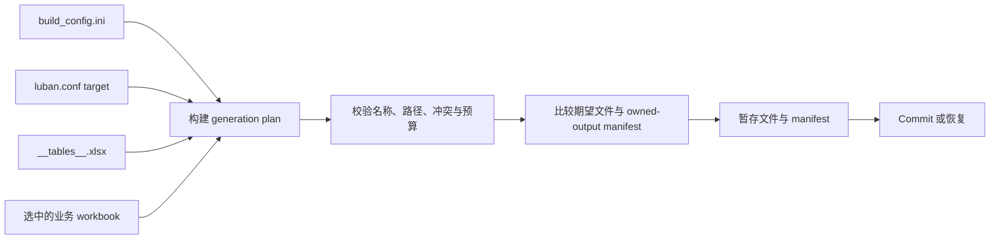

# CycloneGames.DataTable.CodeGen

[English](./README.md) | 简体中文

一个 .NET 8 CLI 工具，读取 Luban workbook、生成强命名 C# 字符串常量——用 `GameplayTags.Ability_Fireball` 代替字符串字面量 `"Ability.Fireball"`。在 `build_config.ini` 里指定表和列，跑管线，每个常量作为类型安全的文件发布，归 owned-output manifest 管理。

Luban 管 table model 和二进制 payload。CodeGen 只管常量文件——不碰 schema、序列化或 Unity `.meta`。每次运行是一个原子事务：先校验所有输出再发布，自动调和上次运行留下的过期文件。

## 目录

- [前置条件](#前置条件)
- [处理流程](#处理流程)
- [五分钟快速上手](#五分钟快速上手)
- [Workbook 规则](#workbook-规则)
- [配置参考](#配置参考)
- [命令行参考](#命令行参考)
- [输入与输出安全](#输入与输出安全)
- [Owned-output manifest](#owned-output-manifest)
- [发布事务](#发布事务)
- [并发](#并发)
- [恢复](#恢复)
- [持久化与版本控制](#持久化与版本控制)
- [CI 集成](#ci-集成)
- [故障排查](#故障排查)
- [验证清单](#验证清单)

## 前置条件

- .NET 8 SDK；
- `luban.conf` 和 `build_config.ini` 的 Luban 配置；
- `Datas/__tables__.xlsx` 和每份选中的业务 workbook；
- 含 `[codegen]` section 的 `build_config.ini`；
- 位于 data directory 外的专用 C# output directory；
- 每个 output root 同时只有一个 process writer。

Project：

```text
UnityStarter/Assets/ThirdParty/CycloneGames/CycloneGames.DataTable/Tools~/CodeGen/CycloneGames.DataTable.CodeGen.csproj
```

该 project 以 `net8.0` 为 target，只使用 SDK project 声明的 .NET framework library。

## 处理流程



Commit 开始前，会先解析全部选中的 workbook，并准备好所有 generated source。

## 五分钟快速上手

### 1. 配置一张表

在 `DataTable/Luban/build_config.ini` 中配置：

```ini
[codegen]
codegen_project=../../UnityStarter/Assets/ThirdParty/CycloneGames/CycloneGames.DataTable/Tools~/CodeGen/CycloneGames.DataTable.CodeGen.csproj
string_constant_tables=GameplayTags.TbGameplayTagDefinition
string_constant_value_column=name
string_constant_comment_column=comment
string_constant_enabled_column=enabled
string_constant_scope_column=scope
string_constant_generated_comment_language=en
```

`string_constant_tables` 使用精确的 Luban `full_name`。多张表可使用逗号或分号分隔。

### 2. 准备 table declaration

`Datas/__tables__.xlsx` 的第一个 worksheet 必须声明：

| 必需 column | 示例 | 用途 |
| --- | --- | --- |
| `full_name` | `GameplayTags.TbGameplayTagDefinition` | `string_constant_tables` 选择的精确 table name |
| `input` | `GameplayTags/GameplayTagDefinition.xlsx` | 相对于 `--data-dir` 的业务 workbook path |

配置的 table name 和 column name 区分大小写。

### 3. 准备业务 workbook

CodeGen 读取第一个 worksheet，查找第一个 cell 精确等于 `##var` 的 row，并把其后第四行作为第一条 data row。

最小概念布局：

| A | B | C | D | E |
| --- | --- | --- | --- | --- |
| `##var` | `name` | `comment` | `enabled` | `scope` |
| `##type` | `string` | `string` | `bool` | `string` |
| `##group` | `c` | `c` | `c` | `c` |
| `##` |  |  |  |  |
|  | `Ability.Fireball` | 施放火球。 | `true` | `Ability` |
|  | `Ability.IceBlast` | 施放冰霜冲击。 | `true` | `Ability` |

第一列是 Luban marker column。CodeGen 只 materialize `##var` row 声明的 column。

### 4. 不写入地校验

从 `<repo-root>` 执行：

```text
dotnet run --project UnityStarter/Assets/ThirdParty/CycloneGames/CycloneGames.DataTable/Tools~/CodeGen/CycloneGames.DataTable.CodeGen.csproj -- --config DataTable/Luban/build_config.ini --luban-conf DataTable/Luban/luban.conf --data-dir DataTable/Luban/Datas --target client --code-output UnityStarter/Assets/UnityStarter/Scripts/Generated/DataTable --line-ending crlf --validate-only
```

命令会报告 prepared file 数量、将被移除的 stale owned file 数量，以及将从 manifest 清理的 missing stale registration 数量。它不会创建、移动、替换或删除文件。

仓库日常使用优先通过受保护 Luban wrapper 运行。Wrapper 会获取 writer lock，并在正确阶段调用 CodeGen：

```bat
DataTable\Luban\gen_code_bin_to_project_lazyload.bat --no-pause --validate-only
```

```bash
bash DataTable/Luban/gen_code_bin_to_project_lazyload.sh --validate-only
```

### 5. 生成

从直接命令中移除 `--validate-only`，或者运行不带该参数的受保护 wrapper，然后在 Unity 中编译 generated C#。

当 `topModule=UnityStarter.GameConfig`、table 为 `GameplayTags.TbGameplayTagDefinition`、scope 为 `Ability` 时，示例会生成：

```csharp
namespace UnityStarter.GameConfig.GameplayTags
{
    public static class GameplayTagAbilityNames
    {
        /// <summary>
        /// 施放火球。
        /// </summary>
        public const string FIREBALL = "Ability.Fireball";

        /// <summary>
        /// 施放冰霜冲击。
        /// </summary>
        public const string ICE_BLAST = "Ability.IceBlast";
    }
}
```

文件路径为：

```text
<code-output>/GameplayTags/GameplayTagAbilityNames.cs
```

## Workbook 规则

### Table 选择

对于每张已配置 table，CodeGen 会：

1. 读取 `Datas/__tables__.xlsx`；
2. 查找精确匹配的 `full_name`；
3. 把 `input` 解析为 `--data-dir` 下的相对严格子路径；
4. 读取该 workbook 的第一个 worksheet；
5. 校验每个已配置 column；
6. 收集 row，并为每个最终 scope 生成一个文件。

重复 table declaration 和重复 configured table name 会使生成失败。

### Row 纳入规则

| 条件 | 结果 |
| --- | --- |
| Value column 缺失、为空或只有空白 | 跳过该 row |
| Enabled column 为空 | 启用该 row |
| Enabled value 为 `0`、`false` 或 `no`，忽略大小写 | 跳过该 row |
| 其他 enabled value | 启用该 row |
| Enabled-column 配置为空 | 禁用筛选 |
| Comment-column 配置为空 | 禁用 XML documentation |
| Scope-column 配置为空或 row scope 为空 | Constant 使用 table 默认 class |

Workbook reader 会忽略全部已声明值均为空的 row。

### Namespace 与 class 命名

Generated namespace 为：

```text
<target.topModule>.<table namespace>
```

对于 `GameplayTags.TbGameplayTagDefinition`：

- table namespace：`GameplayTags`；
- table type：`TbGameplayTagDefinition`；
- 移除 `Tb` prefix 和 `Definition` suffix 后，class base 为 `GameplayTag`；
- 空 scope class：`GameplayTagNames`；
- `Ability` scope class：`GameplayTagAbilityNames`。

可识别的 class-name suffix 包括 `Definitions`、`Definition`、`Table` 和 `Data`。Namespace segment、class name 和 constant name 必须是保守的 ASCII C# identifier，且不能是 C# keyword。

### Constant 命名

Constant identifier 从配置的 value 推导：

| Value | Scope | Constant |
| --- | --- | --- |
| `Ability.Fireball` | `Ability` | `FIREBALL` |
| `Ability.IceBlast` | `Ability` | `ICE_BLAST` |
| `Item.MaxStack` | 空 | `ITEM_MAX_STACK` |
| `3D.Mode` | 空 | `VALUE_3_D_MODE` |

当 value 中出现 dot-separated scope sequence 且其后仍有内容时，identifier 会从该 scope sequence 后的 suffix 生成。标点会变为下划线，camel-case boundary 会插入下划线，字母使用 invariant casing 转换。

同一 scope 中两个生成相同 identifier 的 value 会使生成失败。生成相同 class name 的 scope 也会失败。

Constant value 会原样保留并转义为 C# string；XML documentation 会规范为单行并执行 XML escape。

## 配置参考

| Key | 是否必需 | 默认值 | 含义 |
| --- | --- | --- | --- |
| `codegen_project` | Wrapper 需要 CodeGen 时必需 | 无 | CodeGen `.csproj` path |
| `string_constant_tables` | 否 | 空 | 以逗号或分号分隔的 Luban `full_name` |
| `string_constant_value_column` | 否 | `name` | Source string value 和 constant-name input |
| `string_constant_comment_column` | 否 | `comment` | XML documentation source；为空则禁用 comment |
| `string_constant_enabled_column` | 否 | `enabled` | Row filter；为空则禁用筛选 |
| `string_constant_scope_column` | 否 | 空 | 把 table 拆为多个 class；为空则使用一个 class |
| `string_constant_generated_comment_language` | 否 | `en` | Generated file header language |

`en` 生成英文 header；`zh`、`zh-CN`、`sch` 和 `cn` 生成简体中文 header。该设置只改变 generated file header，row comment 仍来自 workbook。

当 `string_constant_tables` 为空时，直接运行 CodeGen 会把期望 output 设为空集合。如果 owned-output manifest 存在，其中登记的 `.cs` 会成为 stale output 并被收敛。仓库 wrapper 检测到 manifest 时会为此场景调用 CodeGen。

## 命令行参考

### 生成参数

| 参数 | 是否必需 | 说明 |
| --- | --- | --- |
| `--config <file>` | 是 | 现有 `build_config.ini` path |
| `--luban-conf <file>` | 是 | 现有 `luban.conf` path |
| `--data-dir <directory>` | 是 | 现有 Luban data directory |
| `--target <name>` | 是 | 从 `luban.conf` 读取 `topModule` 的 target |
| `--code-output <directory>` | 是 | Generated C# root |
| `--line-ending <crlf\|lf>` | 否 | Generated line ending，默认 `crlf` |
| `--validate-only` | 否 | 准备并报告 plan，不修改 filesystem |

`--target` 可包含字母、数字、下划线、连字符和点，最大长度 128；该名称必须存在于 `luban.conf`。

### 独立命令

帮助：

```text
dotnet run --project UnityStarter/Assets/ThirdParty/CycloneGames/CycloneGames.DataTable/Tools~/CodeGen/CycloneGames.DataTable.CodeGen.csproj -- --help
```

内置安全测试：

```text
dotnet run --project UnityStarter/Assets/ThirdParty/CycloneGames/CycloneGames.DataTable/Tools~/CodeGen/CycloneGames.DataTable.CodeGen.csproj -- --self-test
```

`--help`/`-h` 和 `--self-test` 都必须是唯一 tool argument。未知参数、重复参数、缺少 value 和非法 path 返回 exit code `1`。成功 generation、validation、help 与 self-test 返回 `0`。

## 输入与输出安全

Configuration 和 workbook file 均按不可信输入处理。

| 资源 | 限制 |
| --- | ---: |
| 单个 configuration file | 1 MiB |
| Configuration line 数量 | 16,384 |
| 单行 configuration character | 16,384 |
| Configured table | 1,024 |
| 单个 workbook file | 64 MiB |
| ZIP entry | 4,096 |
| 单个 uncompressed ZIP entry | 64 MiB |
| 总 uncompressed ZIP content | 128 MiB |
| 大于 1 MiB entry 的 compression ratio | 200:1 |
| 单个 document 的 XML character | 64 MiB |
| Workbook row | 100,000 |
| 单行 cell | 4,096 |
| Workbook 总 cell | 2,097,152 |
| Shared string | 500,000 |
| Shared-string 总字符 | 64 Mi |
| 单个 cell | 65,536 字符 |
| 单个 generated file | 16 Mi 字符 |
| 全部 generated source | 64 Mi 字符 |
| Owned output file | 8,192 |
| 单个 owned relative path | 1,024 字符 |
| Owned-output manifest | 1 MiB |

XLSX reader 会：

- 禁止 DTD processing 和 external XML resolution；
- 拒绝 external worksheet relationship；
- 拒绝 rooted、traversal 和仅大小写冲突的 ZIP entry path；
- 限制 compressed 与 uncompressed materialization；
- 在 containment check 前解析现有 filesystem link；
- 拒绝 filesystem root 或与 data directory 重叠的 code output；
- 校验每个 generated path 都是 output root 的严格子路径。

这些预算只适用于 CodeGen，不是 Luban decode limit、Unity import budget 或 Runtime DataTable limit。

## Owned-output manifest

Output root 包含：

```text
.cyclonegames-datatable-codegen-manifest.json
```

它记录 CodeGen 拥有的相对 `.cs` path。Manifest 使用固定 schema 和 version，限制 file count 与 size，对 path 排序，并检查大小写冲突。

所有权规则：

- 确定性的期望 output path 由 CodeGen 保留。如果该 path 已存在文件，CodeGen 会先备份，再替换并把 generated path 登记到 manifest。手写 source 应放在 generated output subtree 外，并在生成前解决命名冲突。
- 只有 stale `.cs` 已登记在 manifest 中，CodeGen 才会移除它。
- 已登记但不存在的 file 会从下一份 manifest 清理，不会额外删除内容。
- 既不是期望 output、也不是 stale manifest entry 的文件不会被扫描、接管或移除。
- 永不删除 Unity `.meta`。
- 拒绝仅大小写不同的 file 或 directory 变更。

禁止手工编辑 manifest。它应与 generated constant 使用相同版本控制政策。

## 发布事务

执行写入的运行会在同一 output root 创建 staging directory：

```text
<code-output>/.datatable-codegen-<id>/
  files/
  backup/
  manifest/
```

Commit 顺序：

1. 把全部期望 source 和下一份 manifest 写入 staging；
2. 把 stale owned file 移到 `backup/`；
3. 把将被替换的 owned file 移到 `backup/`；
4. 把 staged source 移到最终 path；
5. 替换 owned-output manifest；
6. 成功后移除 staging directory。

Recoverable commit error 发生时，CodeGen 会按相反顺序恢复已 commit 内容。完整 rollback 会让 output 回到 commit 前状态；rollback 不完整时会保留 staging directory，并报告其准确路径。

如果 commit 成功但 staging cleanup 失败，命令会输出 warning，并可能留下可重建的 staging data。确认最终文件和 manifest 已完成 commit 后再移除该目录。

该 transaction 只覆盖 CodeGen-owned C# 和 manifest，不覆盖 Luban output、bridge file、Unity import 或其他写入同一目录的 process。

## 并发

直接 CodeGen run 不会获取 writer lock。同一时间只能有一个 direct process、wrapper 或 Unity Editor generation process 写入指定 output root。

仓库日常生成使用受保护 Luban wrapper。它会在 CodeGen 之前获取 `DataTable/Luban/.cyclonegames-datatable-writer.lock`。Custom caller 必须提供等价串行化。并行 CI job 使用独立 checkout 或不同 output root。

## 恢复流程

### Rollback 不完整

当错误报告 rollback 不完整时：

1. 停止所有以该 output root 为目标的 writer；
2. 保留报告的 `.datatable-codegen-<id>/` directory；
3. 检查最终 output 与 `backup/` tree；
4. 按相对于 output root 的匹配 path 恢复每个 generated `.cs` backup；
5. 如果存在 `backup/manifest/.cyclonegames-datatable-codegen-manifest.json`，把它恢复到 output root；
6. 编译恢复结果，并与版本控制或 known-good artifact 比较；
7. 验证后再移除 recovery directory；
8. 再次生成前运行 `--validate-only`。

不要把 `backup/manifest/` directory 本身复制到 generated namespace，只把 manifest file 恢复到 output root。

### 保守重置 manifest

1. 停止所有 writer；
2. 把 manifest 移到 output root 外并保留为 backup；
3. 检查它登记的 generated `.cs`；
4. 运行 `--validate-only`；
5. 生成新的 manifest；
6. 人工评审未登记的 generated file。

重置 manifest 会移除所有权信息。CodeGen 不会仅因为未登记 file 类似 generated output 就删除它。

## 持久化与版本控制

| 内容 | 作用 | 政策 |
| --- | --- | --- |
| Workbook、`luban.conf`、`build_config.ini` | 权威输入 | 版本化并评审，不能当作 cache |
| Generated constant `.cs` | 可重建 output | 从已评审 input 重新生成 |
| Owned-output manifest | 所有权账本 | 与 generated constant 一起保存，禁止手改 |
| `.datatable-codegen-*/` | Transaction/recovery state | 本地内容；成功 commit 或验证恢复后删除 |
| `bin/`、`obj/` | .NET build cache | 可重建 |
| Unity `.meta` | Asset identity | 通过 Unity 与版本控制管理 |

## CI 集成

聚焦 CodeGen job 应：

1. 恢复固定的 .NET 8 SDK；
2. 执行 Release build；
3. 校验 formatting；
4. 运行 `--self-test`；
5. 对代表性 fixture 运行 `--validate-only`；
6. 生成到 disposable output root；
7. 编译 generated C#；
8. 在 fixture 中移除或重命名 row、scope 和 selected table；
9. 确认只改变 manifest-owned stale `.cs`；
10. 执行 rollback/recovery fixture；
11. 在出现非预期 generated-output 差异时失败。

命令：

```text
dotnet build UnityStarter/Assets/ThirdParty/CycloneGames/CycloneGames.DataTable/Tools~/CodeGen/CycloneGames.DataTable.CodeGen.csproj --configuration Release
dotnet format UnityStarter/Assets/ThirdParty/CycloneGames/CycloneGames.DataTable/Tools~/CodeGen/CycloneGames.DataTable.CodeGen.csproj --verify-no-changes --no-restore
dotnet run --project UnityStarter/Assets/ThirdParty/CycloneGames/CycloneGames.DataTable/Tools~/CodeGen/CycloneGames.DataTable.CodeGen.csproj --configuration Release --no-build -- --self-test
```

## 故障排查

| 错误或现象 | 处理方式 |
| --- | --- |
| Table 未声明 | 把精确 `full_name` 加入 `__tables__.xlsx`，并检查 `input`。 |
| Workbook 不存在 | 保持 `input` 相对于 `--data-dir`，并确认文件位于该 root 内。 |
| 找不到 `##var` row | 在第一个 worksheet 的 header row 第一个 cell 写入精确 `##var`。 |
| Configured column 缺失 | 在 `##var` 增加精确 column，或清空可选 comment/enabled/scope key。 |
| 未生成 constant | 检查 value cell、enabled value、selected table、scope 和第一个 worksheet。 |
| Constant 重复 | 重命名 value 或 scope，确保 class 内每个 generated identifier 唯一。 |
| Identifier 被拒绝 | 使用能映射为合法 C# identifier 的稳定 ASCII-compatible table namespace、scope 和 value。 |
| Output root 被拒绝 | 放在 `--data-dir` 外，不能是 filesystem root，并移除基于 link 的逃逸路径。 |
| 仅大小写 rename 被拒绝 | 通过明显不同的临时名称执行两步 rename，再收敛 manifest。 |
| Manifest 非法 | 恢复已评审 manifest，或执行保守重置流程。 |
| Wrapper 跳过 CodeGen | 至少配置一张 table，或保留需要收敛的 owned-output manifest。 |
| Recovery directory 残留 | 下一次写入前执行 rollback 不完整恢复流程。 |

## 验证清单

- `dotnet build` 在 Release 下成功，且无 warning/error。
- `dotnet format --verify-no-changes --no-restore` 成功。
- `--self-test` 成功。
- `--help` 与每个文档参数和 executable 一致。
- 有效 fixture 通过 `--validate-only`，且 filesystem 不发生变更。
- 非法 path、ZIP/XML、size、column、identifier 和 case-collision fixture 会失败。
- Generated code 可以编译。
- Stale-file reconciliation 只影响 manifest-owned `.cs`。
- CodeGen 永不删除 Unity `.meta`。
- Commit-failure fixture 能完整恢复，或保留可用 recovery directory。
- 为每种支持的生成主机记录原生 Windows、macOS 和 Linux 运行结果。
