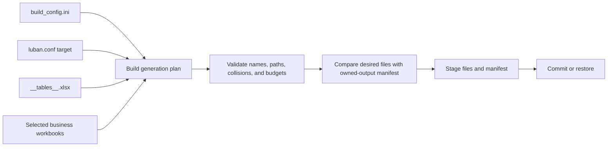

# CycloneGames.DataTable.CodeGen

English | [简体中文](./README.SCH.md)

A .NET 8 CLI tool that reads Luban workbooks and generates strongly-named C# string constants — `GameplayTags.Ability_Fireball` instead of the string literal `"Ability.Fireball"`. Pick a table and column in `build_config.ini`, run the pipeline, and every constant is published as a type-safe file tracked in an owned-output manifest.

Luban owns the table models and binary payloads. CodeGen only produces constant files — it doesn't touch schemas, serialization, or Unity `.meta` files. Each run is an atomic transaction that validates every output before publishing and reconciles stale files from previous runs.

## Table of Contents

- [Overview](#overview)
- [Quick Start](#quick-start)
- [Configuration](#configuration)
- [Output and Recovery](#output-and-recovery)
- [Troubleshooting](#troubleshooting)

## Prerequisites

- .NET 8 SDK;
- the Luban configuration with `luban.conf` and `build_config.ini`;
- `Datas/__tables__.xlsx` and every selected business workbook;
- a `build_config.ini` with a `[codegen]` section;
- a dedicated C# output directory outside the data directory;
- one process writer per output root.

Project:

```text
UnityStarter/Assets/ThirdParty/CycloneGames/CycloneGames.DataTable/Tools~/CodeGen/CycloneGames.DataTable.CodeGen.csproj
```

The project targets `net8.0` and uses only .NET framework libraries declared by the SDK project.

## Processing flow



All selected workbook content is parsed and every generated source is prepared before commit begins.

## Five-minute quick start

### 1. Configure one table

In `DataTable/Luban/build_config.ini`:

```ini
[codegen]
codegen_project=../../UnityStarter/Assets/ThirdParty/CycloneGames/CycloneGames.DataTable/Tools~/CodeGen/CycloneGames.DataTable.CodeGen.csproj
string_constant_tables=GameplayTags.TbGameplayTagDefinition
string_constant_value_column=name
string_constant_comment_column=comment
string_constant_enabled_column=enabled
string_constant_scope_column=scope
string_constant_generated_comment_language=en
```

`string_constant_tables` uses exact Luban `full_name` values. Multiple tables may be separated with commas or semicolons.

### 2. Prepare the table declaration

The first worksheet of `Datas/__tables__.xlsx` must declare:

| Required column | Example | Purpose |
| --- | --- | --- |
| `full_name` | `GameplayTags.TbGameplayTagDefinition` | Exact table name selected by `string_constant_tables` |
| `input` | `GameplayTags/GameplayTagDefinition.xlsx` | Business workbook path relative to `--data-dir` |

The configured table name and column names are case-sensitive.

### 3. Prepare the business workbook

CodeGen reads the first worksheet. It finds the row whose first cell is exactly `##var` and treats the row four positions later as the first data row.

A minimal conceptual layout:

| A | B | C | D | E |
| --- | --- | --- | --- | --- |
| `##var` | `name` | `comment` | `enabled` | `scope` |
| `##type` | `string` | `string` | `bool` | `string` |
| `##group` | `c` | `c` | `c` | `c` |
| `##` |  |  |  |  |
|  | `Ability.Fireball` | Casts a fireball. | `true` | `Ability` |
|  | `Ability.IceBlast` | Casts an ice blast. | `true` | `Ability` |

The first column is the Luban marker column. CodeGen materializes only columns declared by the `##var` row.

### 4. Validate without writing

From `<repo-root>`:

```text
dotnet run --project UnityStarter/Assets/ThirdParty/CycloneGames/CycloneGames.DataTable/Tools~/CodeGen/CycloneGames.DataTable.CodeGen.csproj -- --config DataTable/Luban/build_config.ini --luban-conf DataTable/Luban/luban.conf --data-dir DataTable/Luban/Datas --target client --code-output UnityStarter/Assets/UnityStarter/Scripts/Generated/DataTable --line-ending crlf --validate-only
```

The command reports the number of prepared files, stale owned files that would be removed, and missing stale manifest registrations that would be pruned. It does not create, move, replace, or delete files.

For normal repository use, prefer the guarded Luban wrapper, which acquires the writer lock and invokes CodeGen at the correct stage:

```bat
DataTable\Luban\gen_code_bin_to_project_lazyload.bat --no-pause --validate-only
```

```bash
bash DataTable/Luban/gen_code_bin_to_project_lazyload.sh --validate-only
```

### 5. Generate

Remove `--validate-only` from the direct command, or run the guarded wrapper without that option. Then compile the generated C# in Unity.

With `topModule=UnityStarter.GameConfig`, table `GameplayTags.TbGameplayTagDefinition`, and scope `Ability`, the example generates:

```csharp
namespace UnityStarter.GameConfig.GameplayTags
{
    public static class GameplayTagAbilityNames
    {
        /// <summary>
        /// Casts a fireball.
        /// </summary>
        public const string FIREBALL = "Ability.Fireball";

        /// <summary>
        /// Casts an ice blast.
        /// </summary>
        public const string ICE_BLAST = "Ability.IceBlast";
    }
}
```

The file is placed at:

```text
<code-output>/GameplayTags/GameplayTagAbilityNames.cs
```

## Workbook rules

### Table selection

For each configured table, CodeGen:

1. reads `Datas/__tables__.xlsx`;
2. finds an exact `full_name` match;
3. resolves `input` as a relative strict child of `--data-dir`;
4. reads the first worksheet of that workbook;
5. validates every configured column;
6. collects rows and generates one file per resulting scope.

Duplicate table declarations and duplicate configured table names fail generation.

### Row inclusion

| Condition | Result |
| --- | --- |
| Value column is missing, empty, or whitespace | Row is skipped |
| Enabled column is empty | Row is enabled |
| Enabled value is `0`, `false`, or `no`, ignoring case | Row is skipped |
| Any other enabled value | Row is enabled |
| Enabled-column config is empty | Filtering is disabled |
| Comment-column config is empty | XML documentation is disabled |
| Scope-column config is empty or a row scope is empty | Constants use the table's default class |

Rows whose declared values are all blank are ignored by the workbook reader.

### Namespace and class naming

The generated namespace is:

```text
<target.topModule>.<table namespace>
```

For `GameplayTags.TbGameplayTagDefinition`:

- table namespace: `GameplayTags`;
- table type: `TbGameplayTagDefinition`;
- class base: `GameplayTag` after removing the `Tb` prefix and `Definition` suffix;
- empty scope class: `GameplayTagNames`;
- `Ability` scope class: `GameplayTagAbilityNames`.

Recognized class-name suffixes are `Definitions`, `Definition`, `Table`, and `Data`. Namespace segments, class names, and constant names must be conservative ASCII C# identifiers and cannot be C# keywords.

### Constant naming

Constant identifiers are derived from the configured value:

| Value | Scope | Constant |
| --- | --- | --- |
| `Ability.Fireball` | `Ability` | `FIREBALL` |
| `Ability.IceBlast` | `Ability` | `ICE_BLAST` |
| `Item.MaxStack` | empty | `ITEM_MAX_STACK` |
| `3D.Mode` | empty | `VALUE_3_D_MODE` |

When a dot-separated scope sequence appears in the value and a suffix remains, the identifier is generated from the suffix after that scope sequence. Punctuation becomes an underscore, camel-case boundaries become underscores, and letters are converted with invariant casing.

Two values that produce the same identifier in one scope fail generation. Scope names that produce the same class name also fail.

The constant value is preserved and escaped as a C# string. XML documentation is normalized to one line and XML-escaped.

## Configuration reference

| Key | Required | Default | Meaning |
| --- | --- | --- | --- |
| `codegen_project` | By wrapper when CodeGen is required | none | Path to the CodeGen `.csproj` |
| `string_constant_tables` | No | empty | Comma- or semicolon-separated Luban `full_name` values |
| `string_constant_value_column` | No | `name` | Source string value and constant-name input |
| `string_constant_comment_column` | No | `comment` | XML documentation source; empty disables comments |
| `string_constant_enabled_column` | No | `enabled` | Row filter; empty disables filtering |
| `string_constant_scope_column` | No | empty | Splits a table into classes; empty uses one class |
| `string_constant_generated_comment_language` | No | `en` | Generated file-header language |

Use `en` for an English generated header. `zh`, `zh-CN`, `sch`, and `cn` select the Simplified Chinese header. This setting changes only the generated file header; row comments come from the workbook.

When `string_constant_tables` is empty, a direct CodeGen run uses an empty desired output set. If an owned-output manifest exists, its registered `.cs` files become stale and are reconciled. The repository wrapper invokes CodeGen for this case whenever it detects the manifest.

## Command-line reference

### Generation arguments

| Argument | Required | Description |
| --- | --- | --- |
| `--config <file>` | Yes | Existing `build_config.ini` path |
| `--luban-conf <file>` | Yes | Existing `luban.conf` path |
| `--data-dir <directory>` | Yes | Existing Luban data directory |
| `--target <name>` | Yes | Target whose `topModule` is read from `luban.conf` |
| `--code-output <directory>` | Yes | Generated C# root |
| `--line-ending <crlf\|lf>` | No | Generated line endings; default `crlf` |
| `--validate-only` | No | Prepare and report the plan without filesystem mutation |

`--target` accepts letters, digits, underscore, hyphen, and dot, with a maximum length of 128. The named target must exist in `luban.conf`.

### Standalone commands

Help:

```text
dotnet run --project UnityStarter/Assets/ThirdParty/CycloneGames/CycloneGames.DataTable/Tools~/CodeGen/CycloneGames.DataTable.CodeGen.csproj -- --help
```

Built-in safety tests:

```text
dotnet run --project UnityStarter/Assets/ThirdParty/CycloneGames/CycloneGames.DataTable/Tools~/CodeGen/CycloneGames.DataTable.CodeGen.csproj -- --self-test
```

`--help`/`-h` and `--self-test` must each be the only tool argument. Unknown arguments, duplicate arguments, missing values, and invalid paths return exit code `1`. Successful generation, validation, help, and self-tests return `0`.

## Input and output safety

Configuration and workbook files are treated as untrusted input.

| Resource | Limit |
| --- | ---: |
| One configuration file | 1 MiB |
| Configuration lines | 16,384 |
| Characters in one configuration line | 16,384 |
| Configured tables | 1,024 |
| One workbook file | 64 MiB |
| ZIP entries | 4,096 |
| One uncompressed ZIP entry | 64 MiB |
| Total uncompressed ZIP content | 128 MiB |
| Compression ratio for an entry over 1 MiB | 200:1 |
| XML characters per document | 64 MiB |
| Workbook rows | 100,000 |
| Cells in one row | 4,096 |
| Total workbook cells | 2,097,152 |
| Shared strings | 500,000 |
| Total shared-string characters | 64 Mi |
| One cell | 65,536 characters |
| One generated file | 16 Mi characters |
| All generated source | 64 Mi characters |
| Owned output files | 8,192 |
| One owned relative path | 1,024 characters |
| Owned-output manifest | 1 MiB |

The XLSX reader:

- prohibits DTD processing and external XML resolution;
- rejects external worksheet relationships;
- rejects rooted, traversal, and case-colliding ZIP entry paths;
- limits compressed and uncompressed materialization;
- resolves existing filesystem links before containment checks;
- rejects code output that is a filesystem root or overlaps the data directory;
- validates every generated path as a strict child of the output root.

These budgets apply to CodeGen. They do not define Luban decode limits, Unity import budgets, or runtime DataTable limits.

## Owned-output manifest

The output root contains:

```text
.cyclonegames-datatable-codegen-manifest.json
```

It records the relative `.cs` files owned by CodeGen. The manifest has a fixed schema and version, bounded file count and size, sorted paths, and case-collision validation.

Ownership rules:

- A deterministic desired output path is reserved for CodeGen. If a file already exists at that path, CodeGen backs it up, replaces it, and registers the generated path in the manifest. Keep handwritten source outside the generated output subtree and resolve naming collisions before generation.
- CodeGen removes stale `.cs` files only when they are registered in the manifest.
- A missing registered file is pruned from the next manifest without deleting anything else.
- Files that are neither desired outputs nor stale manifest entries are not scanned, adopted, or removed.
- Unity `.meta` files are never deleted.
- Case-only file or directory changes are rejected.

Do not hand-edit the manifest. Keep it with generated constants under the same version-control policy.

## Publication transaction

For a mutating run, CodeGen creates a same-output-root staging directory:

```text
<code-output>/.datatable-codegen-<id>/
  files/
  backup/
  manifest/
```

Commit order:

1. write every desired source and the next manifest to staging;
2. move stale owned files into `backup/`;
3. move replaced owned files into `backup/`;
4. move staged sources to final paths;
5. replace the owned-output manifest;
6. remove the staging directory after success.

If a recoverable commit error occurs, CodeGen restores committed items in reverse order. A complete rollback leaves the output at its pre-commit state. An incomplete rollback preserves the staging directory and reports its exact path.

If commit succeeds but staging cleanup fails, the command prints a warning and may leave rebuildable staging data. Verify that final files and the manifest were committed before removing that directory.

This transaction covers CodeGen-owned C# and its manifest. It does not cover Luban output, bridge files, Unity import, or other processes writing the same directory.

## Concurrency

Direct CodeGen runs do not acquire a writer lock. Only one direct process, wrapper, or Unity Editor generation process may write a given output root at a time.

Use the guarded Luban wrapper for normal repository generation. It acquires `DataTable/Luban/.cyclonegames-datatable-writer.lock` before CodeGen. A custom caller must provide equivalent serialization. Parallel CI jobs use independent checkouts or distinct output roots.

## Recovery

### Incomplete rollback

When the error reports an incomplete rollback:

1. stop every writer targeting the output root;
2. preserve the reported `.datatable-codegen-<id>/` directory;
3. inspect the final output and `backup/` tree;
4. restore each generated `.cs` backup to the matching path relative to the output root;
5. restore `backup/manifest/.cyclonegames-datatable-codegen-manifest.json` to the output root when present;
6. compile and compare the restored output with version control or a known-good artifact;
7. remove the recovery directory only after verification;
8. run `--validate-only` before generating again.

Do not copy the `backup/manifest/` directory itself into generated namespaces. Restore only the manifest file to the output root.

### Conservative manifest reset

1. stop all writers;
2. move the manifest outside the output root and retain it as a backup;
3. inspect the generated `.cs` files it registered;
4. run `--validate-only`;
5. generate a new manifest;
6. review unregistered generated files manually.

Resetting the manifest removes ownership knowledge. CodeGen will not delete unregistered files merely because they resemble generated output.

## Persistence and version control

| Artifact | Role | Policy |
| --- | --- | --- |
| Workbooks, `luban.conf`, `build_config.ini` | Authoritative input | Version and review; never treat as cache |
| Generated constant `.cs` | Rebuildable output | Regenerate from reviewed input |
| Owned-output manifest | Ownership ledger | Keep with generated constants; do not hand-edit |
| `.datatable-codegen-*/` | Transaction/recovery state | Local; delete after successful commit or verified recovery |
| `bin/`, `obj/` | .NET build cache | Rebuildable |
| Unity `.meta` | Asset identity | Manage through Unity and version control |

## CI integration

A focused CodeGen job should:

1. restore the pinned .NET 8 SDK;
2. build Release;
3. verify formatting;
4. run `--self-test`;
5. run `--validate-only` against a representative fixture;
6. generate into a disposable output root;
7. compile generated C#;
8. remove or rename a row, scope, and selected table in fixtures;
9. verify that only manifest-owned stale `.cs` files change;
10. exercise rollback/recovery fixtures;
11. fail on unexpected generated-output differences.

Commands:

```text
dotnet build UnityStarter/Assets/ThirdParty/CycloneGames/CycloneGames.DataTable/Tools~/CodeGen/CycloneGames.DataTable.CodeGen.csproj --configuration Release
dotnet format UnityStarter/Assets/ThirdParty/CycloneGames/CycloneGames.DataTable/Tools~/CodeGen/CycloneGames.DataTable.CodeGen.csproj --verify-no-changes --no-restore
dotnet run --project UnityStarter/Assets/ThirdParty/CycloneGames/CycloneGames.DataTable/Tools~/CodeGen/CycloneGames.DataTable.CodeGen.csproj --configuration Release --no-build -- --self-test
```

## Troubleshooting

| Error or symptom | Resolution |
| --- | --- |
| Table is not declared | Add the exact `full_name` to `__tables__.xlsx` and verify `input`. |
| Workbook not found | Keep `input` relative to `--data-dir` and ensure the file exists inside that root. |
| `##var` row not found | Put exact `##var` in the first cell of the workbook header row on the first worksheet. |
| Configured column is missing | Add the exact column to `##var` or clear an optional comment/enabled/scope key. |
| No constants are generated | Check value cells, enabled values, selected tables, scopes, and the first worksheet. |
| Duplicate constant | Rename values or scopes so each generated identifier is unique in its class. |
| Identifier is rejected | Use stable ASCII-compatible table namespaces, scopes, and values that map to valid C# identifiers. |
| Output root is rejected | Keep it outside `--data-dir`, away from filesystem roots, and free of link-based escape. |
| Case-only rename is rejected | Perform an explicit two-step rename through a distinct temporary name, then reconcile the manifest. |
| Manifest is invalid | Restore the reviewed manifest or perform the conservative reset procedure. |
| Wrapper skips CodeGen | Configure at least one table or retain an owned-output manifest requiring reconciliation. |
| Recovery directory remains | Follow the incomplete rollback procedure before another mutating run. |

## Verification checklist

- `dotnet build` succeeds in Release with no warnings or errors.
- `dotnet format --verify-no-changes --no-restore` succeeds.
- `--self-test` succeeds.
- `--help` and every documented argument match the executable.
- A valid fixture passes `--validate-only` without filesystem mutation.
- Invalid path, ZIP/XML, size, column, identifier, and case-collision fixtures fail.
- Generated code compiles.
- Stale-file reconciliation affects only manifest-owned `.cs`.
- CodeGen never deletes Unity `.meta`.
- Commit-failure fixtures either restore completely or retain a usable recovery directory.
- Native Windows, macOS, and Linux runs are recorded for every supported generation host.
