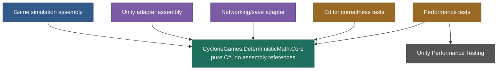
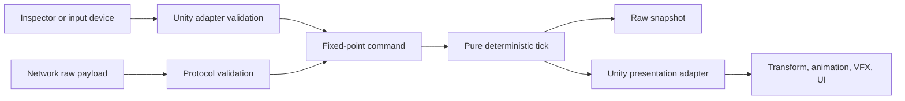

# CycloneGames.DeterministicMath

[English | 简体中文](README.md)

CycloneGames.DeterministicMath 是一个纯 C# 确定性数学底座，适用于必须根据相同有序输入重现完全相同 raw 数值状态的模拟。它提供有符号 Q32.32 定点数运算、向量、三角函数、旋转、矩阵、2D/3D 几何查询，以及由调用方持有的确定性随机数流。

## 目录

- [概述](#概述)
- [架构](#架构)
- [快速上手](#快速上手)
- [核心概念](#核心概念)
- [使用指南](#使用指南)
- [进阶主题](#进阶主题)
- [常见场景](#常见场景)
- [性能与内存](#性能与内存)
- [故障排查](#故障排查)

## 概述

浮点数适合渲染、authoring 和许多本地效果。同步模拟有不同要求：每个参与者必须在每个有序 tick 结束时得到完全一致的状态。细小的数值差异可能逐步累积，最终导致位置、决策、碰撞结果或随机调用路径发生分歧。DeterministicMath 为这个问题提供数值层：`FPInt64` 使用一个 `long` 保存有符号 Q32.32 值；`FPVector2` 与 `FPVector3` 提供定点向量运算；`FPMath` 提供确定性三角函数与角度函数；`FPQuaternion` 与 `EulerOrder` 提供 3D 旋转；`FPMatrix4x4` 提供 affine 与 projective 变换并显式区分 point 和 direction；`FPGeometry2D` 与 `FPGeometry3D` 提供带校验的图元和 value-based query；`DeterministicRandom` 提供可保存状态的显式 xoshiro256** 随机数流。

Core 程序集不引用 Unity 引擎，也不依赖外部 package。Unity 玩法代码、服务器进程、命令行工具、replay 校验器和测试运行器都可以使用同一套 value contract。网络、物理、调度、持久化、加密、渲染和密码学随机数生成由各自的模块负责。DeterministicMath 为它们提供精确的数值底座。

### 主要特性

- **Q32.32 定点**算术，存储于一个有符号 `long`，提供显式 factory 与 wrapping operator。
- **向量**采用 scaled-intermediate magnitude 与三种归一化策略（`Normalized`、`NormalizedOrZero`、`TryNormalize`）。
- **确定性 CORDIC 三角函数**位于 `FPMath`（Sin/Cos/Tan/Atan2/Asin/Acos）。
- **Quaternion** 支持六种 Euler 顺序的构造、axis-angle、look rotation 与 Slerp/Nlerp。
- **4x4 矩阵**采用 column-vector 约定，提供 TRS、affine point/direction 变换、projective point 与 checked inverse。
- **2D/3D 几何**提供带校验的图元（circle、AABB、sphere、OBB）与 `TryRay*` 查询。
- **xoshiro256** 随机数流支持 state save/restore 与 rejection-sampled bounded range。
- **纯 C# Core**：`noEngineReferences: true`，无 unsafe code，无 assembly reference，无全局状态。

## 架构



| 程序集 | 用途 |
| --- | --- |
| `CycloneGames.DeterministicMath.Core` | 所有 public math 类型。纯 C#，`noEngineReferences: true`，无 assembly reference，无 unsafe code，无 conditional compilation symbol。 |
| `CycloneGames.DeterministicMath.Tests.Editor` | Editor 正确性测试；只引用 Core 与 Unity test assembly。 |
| `CycloneGames.DeterministicMath.Tests.Performance` | 性能测试；只有 Unity Performance Testing 满足 asmdef capability 时才参与。 |

| 关注点 | 设计 |
| --- | --- |
| 标量表示 | `FPInt64.RawValue` 中的有符号 Q32.32 |
| 标量存储 | 一个有符号 64-bit integer |
| Public 构造 | 显式 factory；raw constructor 为 private |
| 算术热路径 | 显式 two's-complement wrapping operator |
| Checked 算术 | 成组 `Try*` 方法，常规失败不抛异常 |
| 角度 | Radians（弧度） |
| 坐标基 | +X right、+Y up、+Z forward |
| 矩阵约定 | Column vector；`left * right` 先应用 `right` |
| 几何 | 带 invariant 校验的 value-type shape 与静态查询类 |
| 随机数所有权 | 推进随机流的模拟对象持有 mutable struct |
| Runtime 持久化 | 无；调用方序列化显式 raw 字段与 state word |
| Runtime 全局状态 | 无 |

绝大多数 public 数据类型是 immutable value type。`DeterministicRandom` 是有意设计的 mutable struct，因为生成数值会推进它的四个 state word。

## 快速上手

在消费者 asmdef 中引用 `CycloneGames.DeterministicMath.Core`，然后导入 namespace：

```csharp
using CycloneGames.DeterministicMath;
```

### Fixed-tick 移动

下面的类接收定点输入，以安全方式归一化，并按每秒 60 tick 推进位置：

```csharp
public sealed class FixedTickMover
{
    private static readonly FPInt64 TickDelta = FPInt64.One / 60;
    private static readonly FPInt64 MoveSpeed = FPInt64.FromInt(6);

    public FPVector3 Position { get; private set; }
    public FPVector3 Velocity { get; private set; }

    public FixedTickMover(FPVector3 initialPosition)
    {
        Position = initialPosition;
        Velocity = FPVector3.Zero;
    }

    public void Tick(FPVector2 moveInput)
    {
        FPVector2 planarDirection = moveInput.NormalizedOrZero;
        FPVector3 worldDirection = new FPVector3(
            planarDirection.X,
            FPInt64.Zero,
            planarDirection.Y);

        Velocity = worldDirection * MoveSpeed;
        Position += Velocity * TickDelta;
    }
}
```

使用 integer tick index 和定点输入驱动：

```csharp
FixedTickMover mover = new FixedTickMover(FPVector3.Zero);

for (int tick = 0; tick < 120; tick++)
{
    FPVector2 input = tick < 60 ? FPVector2.Right : FPVector2.Up;
    mover.Tick(input);
}

long authoritativeX = mover.Position.X.RawValue;
long authoritativeY = mover.Position.Y.RawValue;
long authoritativeZ = mover.Position.Z.RawValue;
```

Tick duration、输入、速度、位置与 velocity 在整个模拟过程中都保持为定点数。权威 tick 完成后，presentation layer 仍可使用 Unity vector 或浮点 interpolation。

### 为什么它可以重现

当以下条件完全相同时，另一个进程会得到相同的 raw position：Core 实现与数值契约；初始 raw state；tick 数量与 tick 顺序；每个输入值及其应用 tick；分支与 collection iteration order；随机调用的顺序与次数；注入模拟的所有外部查询结果。定点算术不能修复不确定的 update order、无序输入源、job race，或每个 peer 独立计算出的浮点值。确定性是建立在显式 raw contract 之上的完整模拟属性。

## 核心概念

### Q32.32 基础

`FPInt64` 将一个有符号 `long` 分成 32 个整数位和 32 个小数位：

```text
numericValue = RawValue / 4294967296
RawValue     = numericValue * 4294967296
```

分辨率精确为 `2^-32`，约为 `2.3283064365386963e-10`。数值范围为 `[-2147483648, 2147483647.99999999976716935634613037109375]`。`FPInt64` constructor 是 private——请使用能够明确表达数据来自 integer、decimal text、floating-point boundary 还是 raw protocol 的 factory。

| 常量 | 类型 | 含义 |
| --- | --- | --- |
| `FPInt64.FractionalBits` | `int` | 32 |
| `FPInt64.RAW_ONE` | `long` | 数值 1 的 raw 表示 |
| `FPInt64.RAW_HALF` | `long` | 数值 0.5 的 raw 表示 |
| `FPInt64.Zero` | `FPInt64` | 数值 0 |
| `FPInt64.One` | `FPInt64` | 数值 1 |
| `FPInt64.Half` | `FPInt64` | 数值 0.5 |
| `FPInt64.MinusOne` | `FPInt64` | 数值 -1 |

### 构造数值

```csharp
FPInt64 whole = FPInt64.FromInt(12);
FPInt64 fraction = FPInt64.Parse("3.125");
FPInt64 authored = FPInt64.FromDouble(0.75);
FPInt64 protocolValue = FPInt64.FromRaw(13_421_772_800L);

FPInt64 implicitWhole = 5;
```

只有 `int` 支持 implicit conversion。浮点值必须使用显式 factory，使边界在 code review 中清晰可见。`FromFloat` 与 `FromDouble` 会拒绝 NaN、infinity 以及超出 Q32.32 范围的值。对应的 `TryFromFloat` 与 `TryFromDouble` 返回 `false` 与 default result。

Decimal text 使用 invariant period。`ToString()` 输出能够恢复相同 raw bits 的精确十进制展开。人类可读配置和诊断使用 decimal text；紧凑 snapshot 与 protocol 使用 `RawValue`。

### 算术策略

普通标量 operator 是低开销路径：

```csharp
FPInt64 sum = left + right;
FPInt64 difference = left - right;
FPInt64 product = left * right;
FPInt64 quotient = left / right;
FPInt64 remainder = left % right;
```

Addition、subtraction、negation、multiplication 以及可表示范围 overflow 使用显式 unchecked two's-complement wrapping。这一行为不依赖消费项目的 checked compiler setting。在 authored data、protocol、save 与范围不确定的边界使用 checked method：

```csharp
public static bool TryCalculateScaledDamage(
    FPInt64 baseDamage,
    FPInt64 multiplier,
    FPInt64 divisor,
    out FPInt64 result)
{
    return FPInt64.TryMultiplyDivide(baseDamage, multiplier, divisor, out result);
}
```

可用的 checked scalar method 包括 `TryAdd`、`TrySubtract`、`TryNegate`、`TryMultiply`、`TryDivide`、`TryMultiplyDivide`、`TryAbs`、`TryCeil`、`TryRound` 与 `TrySqrt`。`TryMultiplyDivide(a, b, divisor)` 使用 full-width intermediate 计算 `(a * b) / divisor`——如果最终结果可表示，但先做 wrapping multiplication 会丢失结果，应使用此方法。

### 失败策略

API 区分三种意图：用于模拟已证明范围的 wrapping operator；用于 programmer error 或 configuration error 的 fail-fast method；用于预期边界失败的 `Try*` method。

| 操作 | 失败行为 |
| --- | --- |
| `FromFloat`、`FromDouble` | 非 finite 或超出范围时抛 `ArgumentOutOfRangeException` |
| `Parse` | 文本无效或超范围时抛 `FormatException` |
| 除数或 remainder divisor 为零 | `DivideByZeroException` |
| `Abs(MinValue)`、不可表示的 `Ceil`/`Round` | `OverflowException` |
| 对负数执行 `Sqrt` | `ArgumentOutOfRangeException` |
| `Tan` 位于精确渐近线或超出 Q32.32 | `InvalidOperationException` |
| `Asin`/`Acos` 超出 `[-1, 1]` | `ArgumentOutOfRangeException` |
| 对无定义 vector 使用 `Normalized` | `InvalidOperationException` |
| 对无定义 vector 使用 `NormalizedOrZero` | 返回 zero |
| Quaternion normalization 或 inverse 无效 | `InvalidOperationException` |
| Matrix inverse 为 singular 或不受支持 | `InvalidOperationException` |
| Projective point 无效 | `InvalidOperationException` |
| Ray 未命中、退化、shape 无效或数值失败 | `TryRay*` 返回 `false` 和 default output |
| Random stream 未初始化 | `InvalidOperationException` |
| Random state 全零 | `ArgumentException` |

调用 `Try*` 时，只能在 Boolean result 为 `true` 后消费 output。

## 使用指南

### 向量

```csharp
FPVector2 input = new FPVector2(3, 4);
FPVector3 position = new FPVector3(10, 2, -5);

FPVector3 up = FPVector3.Up;
FPVector3 forward = FPVector3.Forward;
FPVector3 right = FPVector3.Right;
```

`FPVector2` 提供 `Zero`、`One`、`Right` 与 `Up`。`FPVector3` 还提供 `Down`、`Forward`、`Back` 与 `Left`。两种 vector 都支持 value equality。

Magnitude 与 normalization：

```csharp
FPVector3 velocity = new FPVector3(3, 4, 0);

FPInt64 squaredSpeed = velocity.SqrMagnitude; // 25
FPInt64 speed = velocity.Magnitude;           // 5
FPVector3 direction = velocity.Normalized;
```

三种 normalization policy 表达领域意图：

- `Normalized` 要求 vector 非零且可归一化，否则 fail fast。
- `NormalizedOrZero` 显式选择 zero 作为 fallback。
- `TryNormalize` 把决定权交给调用方。

Magnitude 使用 scaled intermediate，避免大 vector 在平方时 wrap，也不会把 raw-1 micro vector 错判为 zero。当精确 squared result 无法放入 Q32.32 时，`SqrMagnitude` 与 `DistanceSqr` 饱和为 `FPInt64.MaxValue`。

Dot、Cross、Projection 与 Reflection：

```csharp
FPVector3 velocity = new FPVector3(4, -3, 2);
FPVector3 unitNormal = FPVector3.Up;

if (!FPVector3.TryDot(velocity, unitNormal, out FPInt64 normalSpeed))
    throw new OverflowException("Dot product is outside the numeric domain.");

if (!FPVector3.TryProject(velocity, unitNormal, out FPVector3 verticalPart))
    throw new InvalidOperationException("Projection is undefined.");

if (!FPVector3.TryReflect(velocity, unitNormal, out FPVector3 reflected))
    throw new OverflowException("Reflection is outside the numeric domain.");

FPVector3 tangent = FPVector3.Cross(unitNormal, FPVector3.Forward);
```

Reflection 公式要求 unit normal。调用前应归一化 authored 或 calculated normal。Projection 接受非单位 target vector，但拒绝 zero target。`Lerp` 将 `t` clamp 到 `[0, 1]`；`LerpUnclamped` 允许 extrapolation。Vector 与 quaternion interpolation 遵循相同命名规则。

### 三角函数与角度

`FPMath` 使用确定性 integer CORDIC 实现。输入与输出均为 radians。

```csharp
FPInt64 degrees = 45;
FPInt64 radians = degrees * FPInt64.Deg2Rad;

FPMath.SinCos(radians, out FPInt64 sin, out FPInt64 cos);
```

Output 顺序是 `sin`，然后是 `cos`。同时需要两个结果时使用 `SinCos`，从而共享一次 CORDIC pass。`Atan2` 参数顺序为 `(y, x)`，返回 `[-Pi, Pi]`；原点 `Atan2(0, 0)` 被定义为 zero。`Tan` 在精确渐近线或 quotient 超出 Q32.32 时 fail fast——`TryTan` 用于预期失败。`Asin` 和 `Acos` 要求输入位于 `[-1, 1]`。

`NormalizeAngle` 返回 `[-Pi, Pi]`。`NormalizeAnglePositive` 返回 `[0, TwoPi)`。

### Quaternion 与 Euler Angle

Axis-angle 与 vector rotation：

```csharp
FPInt64 quarterTurn = 90 * FPInt64.Deg2Rad;
FPQuaternion yaw = FPQuaternion.AngleAxis(quarterTurn, FPVector3.Up);

if (!FPQuaternion.TryRotate(yaw, FPVector3.Forward, out FPVector3 rotatedForward))
    throw new InvalidOperationException("Rotation result is outside the domain.");

FPVector3 fastResult = yaw * FPVector3.Forward; // wrapping hot path
```

`AngleAxis` 会归一化 axis，并拒绝 zero axis。正角度遵循 right-hand rule。Quaternion-vector operator 是面向 normalized quaternion 的 wrapping hot path；quaternion 或 vector 来自不可信边界时使用 `TryRotate`。

Euler 构造：

```csharp
FPQuaternion rotation = FPQuaternion.Euler(
    xRadians: 20 * FPInt64.Deg2Rad,
    yRadians: 35 * FPInt64.Deg2Rad,
    zRadians: -10 * FPInt64.Deg2Rad,
    order: EulerOrder.ZXY);

FPVector3 extracted = rotation.ToEuler(EulerOrder.ZXY);
```

三个参数始终表示 X、Y、Z angle。`EulerOrder` 控制 intrinsic composition order，而不改变参数含义。可用顺序为 `XYZ`、`XZY`、`YXZ`、`YZX`、`ZXY` 和 `ZYX`。不指定 order 的 overload 使用 `ZXY`。Euler triple 不唯一——接近 gimbal lock 时，应比较最终 rotation 或旋转后的 basis vector，而不是比较提取出的 angle component。

Direction constructor（`TryFromToRotation`、`TryLookRotation`）拒绝 zero direction，并在 supplied up vector 为 zero 或与 forward 共线时使用确定性的 orthogonal reference。`Normalized`、`Inverse`/`TryInverse`、`Slerp`、`Nlerp` 及其 `Unclamped` 变体遵循与 vector 相同的命名约定。Quaternion equality 比较 raw component——一个 quaternion 与其 negation 描述同一个空间旋转，但 raw value 不相等。

### 矩阵

`FPMatrix4x4` 使用 column vector。矩阵组合 `left * right` 先应用右侧 matrix。

```csharp
FPMatrix4x4 localToWorld = FPMatrix4x4.TRS(
    new FPVector3(10, -4, 7),
    FPQuaternion.Euler(10 * FPInt64.Deg2Rad, 25 * FPInt64.Deg2Rad, 0),
    new FPVector3(2, 3, 4));

FPVector3 worldPoint = localToWorld.TransformPoint(new FPVector3(1, 2, 3));
FPVector3 worldDirection = localToWorld.TransformDirection(FPVector3.Forward);
```

- `TransformPoint` 应用 affine 3x4 transform，包含 translation。
- `TransformDirection` 应用上方 3x3 transform，忽略 translation。
- `ProjectPoint` 执行 homogeneous transform，并除以 `w`。

`TryTransformPoint` 与 `TryTransformDirection` 是 checked form。`Perspective` 使用 right-handed view space，可见点位于 negative Z，depth range 为 `[0, 1]`；要求 `0 < fovRadians < Pi`、`aspect > 0`、`near > 0`、`far > near`。Element 命名为 `M00` 到 `M33`，第一个数字是 row，第二个是 column；indexer 同样接受 `[row, column]`。`TryInverse` 拒绝 singular 和 near-singular matrix，并在接受 candidate 前使用 checked arithmetic 校验两个 multiplication order 是否都接近 identity。

### 2D/3D 几何

```csharp
FPCircle circle = new FPCircle(new FPVector2(10, 0), FPInt64.FromInt(2));
FPAABB2D bounds = new FPAABB2D(new FPVector2(8, -3), new FPVector2(12, 3));

FPSphere sphere = new FPSphere(new FPVector3(0, 0, 10), FPInt64.FromInt(2));
FPAABB3D bounds3D = new FPAABB3D(new FPVector3(-5, -5, 5), new FPVector3(5, 5, 15));
FPOBB3D orientedBox = new FPOBB3D(
    center: new FPVector3(0, 0, 10),
    halfExtents: new FPVector3(2, 1, 4),
    orientation: FPQuaternion.AngleAxis(30 * FPInt64.Deg2Rad, FPVector3.Up));
```

- Circle 和 sphere radius 必须非负。
- AABB minimum component 不能超过 maximum component。
- OBB half-extents 必须非负；orientation 必须非零，并由 constructor 归一化。
- Default `FPOBB3D` 的 orientation 为零，因此无效。
- 边界接触计入 overlap 与 containment。

Overlap、containment、closest-point 与 ray query 作为静态方法暴露在 `FPGeometry2D` 与 `FPGeometry3D` 上。OBB overlap 使用完整 15-axis separating-axis test。所有 ray method 都是 `TryRay*`——失败时 output 保持 default。Circle distance decision 使用 full-width integer intermediate，不依赖已饱和的 public squared-magnitude display value。

### Ray 参数语义

每个 ray result 都满足 `point(t) = Origin + Direction * t`。只有 `Direction` magnitude 为 1 时，返回的 `t` 才是 world-space distance——将 direction 加倍会让同一点对应的 parameter 减半。Ray query 接受 `t >= 0` 的 forward intersection。当 origin 位于闭合 shape 内部时，结果是第一个 forward exit parameter，而不是 zero。

### 确定性随机数流

`DeterministicRandom` 实现 xoshiro256**。SplitMix64 expansion 将一个 `ulong` seed 展开为四个 state word。

```csharp
DeterministicRandom random = DeterministicRandom.Create(0xC0FFEEUL);

ulong raw = random.NextULong();
int cardIndex = random.NextInt(52);    // [0, 52)
int die = random.NextInt(1, 7);        // [1, 7)
FPInt64 unit = random.NextFP();        // [0, 1)
FPInt64 spread = random.NextFP(-1, 1); // [-1, 1)
```

所有 range maximum 都是 exclusive。Integer bounded sampling 使用 rejection sampling，因此 mapping 无偏。Generator 是 mutable struct——模拟 owner 必须保留自己推进的 instance。Helper 需要推进 caller stream 时使用 `ref` 传递。赋值 struct 会复制四个 state word 并创建一个有意的相同分支。不要并发修改同一个 logical stream。

```csharp
DeterministicRandomState checkpoint = random.SaveState();
ulong first = random.NextULong();
random.RestoreState(checkpoint);
ulong repeated = random.NextULong();

bool exactReplay = first == repeated;
```

四个 word 全零的 state 无效。`TryRestoreState` 会报告失败，且不会替换当前 state。持久化 `ALGORITHM_ID`、`ALGORITHM_VERSION`、`S0`、`S1`、`S2`、`S3` 必须同时保存；replay 还要求 sampling call 的种类、顺序和次数一致。Bounded call 可能因 rejection sampling 重试而消费多个 raw output。

## 进阶主题

### Rollback 与 Resimulation

Rollback snapshot 必须保存继续模拟所需的每个 authoritative field，包括 random state：

```csharp
public readonly struct MoverSnapshot
{
    public readonly int Tick;
    public readonly long PositionXRaw;
    public readonly long PositionYRaw;
    public readonly long PositionZRaw;
    public readonly long VelocityXRaw;
    public readonly long VelocityYRaw;
    public readonly long VelocityZRaw;
    public readonly DeterministicRandomState RandomState;

    public MoverSnapshot(int tick, FPVector3 position, FPVector3 velocity,
                         DeterministicRandomState randomState)
    {
        Tick = tick;
        PositionXRaw = position.X.RawValue;
        PositionYRaw = position.Y.RawValue;
        PositionZRaw = position.Z.RawValue;
        VelocityXRaw = velocity.X.RawValue;
        VelocityYRaw = velocity.Y.RawValue;
        VelocityZRaw = velocity.Z.RawValue;
        RandomState = randomState;
    }

    public FPVector3 RestorePosition() => new FPVector3(
        FPInt64.FromRaw(PositionXRaw),
        FPInt64.FromRaw(PositionYRaw),
        FPInt64.FromRaw(PositionZRaw));
}
```

Bounded history 可以使用 tick 作为 ring-buffer key：

```csharp
MoverSnapshot[] history = new MoverSnapshot[128];

history[currentTick % history.Length] = CaptureSnapshot(currentTick);

MoverSnapshot rewind = history[correctedTick % history.Length];
RestoreSnapshot(rewind);

for (int tick = correctedTick; tick < currentTick; tick++)
{
    SimulateTick(tick, recordedInputs[tick]);
}
```

Application 负责 entity existence、collection order、input history、resimulation 期间的 event suppression，以及 side-effect reconciliation。如果这些状态会影响后续 tick，只保存数值 snapshot 并不足够。

### 序列化契约

显式序列化 signed raw value：

```csharp
long positionX = position.X.RawValue;
FPVector3 restored = new FPVector3(
    FPInt64.FromRaw(positionX),
    FPInt64.FromRaw(positionY),
    FPInt64.FromRaw(positionZ));
```

Quaternion 与 matrix state 应按明确记录的顺序序列化每个 named component：`Quaternion: X, Y, Z, W`；`Matrix: M00..M33` 按 row-major 顺序。所属 serializer 必须定义 schema identifier 与 version、signed integer encoding、byte order、field order、optional compression、payload length limit、integrity validation、unknown schema value 的处理方式，以及 corruption/recovery policy。不要序列化 private struct memory，不要依赖 runtime padding，不要保存 `GetHashCode()`，也不要让 authoritative value 经过 float 转换。通过 public constructor 重建带校验的 shape，从而拒绝无效 payload。

Random state 持久化 `ALGORITHM_ID`、`ALGORITHM_VERSION`、`S0`、`S1`、`S2`、`S3`。恢复 stream 前校验 algorithm identity、algorithm version、payload schema 以及非零 state。

### Unity Adapter Pattern

Core 有意不暴露 `UnityEngine.Vector2`、`UnityEngine.Vector3`、`Quaternion`、`Matrix4x4`、`MonoBehaviour` 或 `ScriptableObject`。转换代码应位于 Unity-facing adapter assembly：

```csharp
using CycloneGames.DeterministicMath;
using UnityEngine;

public static class DeterministicVectorAdapter
{
    public static FPVector3 ToDeterministic(Vector3 value) => new FPVector3(
        FPInt64.FromFloat(value.x),
        FPInt64.FromFloat(value.y),
        FPInt64.FromFloat(value.z));

    public static Vector3 ToUnity(FPVector3 value) => new Vector3(
        value.X.ToFloat(),
        value.Y.ToFloat(),
        value.Z.ToFloat());
}
```



Authoring data 进入 authoritative state 前只转换一次。模拟结果转换为 Unity value 用于显示。只要 rendering interpolation 永不写回模拟，它可以继续使用浮点。同步模拟使用显式 integer tick scheduler——Unity frame rate 与 `FixedUpdate` scheduling 属于表现或 orchestration，除非产品正式将其定义为 authoritative tick source。

## 常见场景

### Lockstep 单位移动

策略游戏以 lockstep 移动单位。每个 peer 发送定点 move command；所有 peer 按相同 tick 顺序应用：

```csharp
public void ApplyMoveCommand(int unitId, FPVector2 destination, int tick)
{
    FPVector3 current = _units[unitId].Position;
    FPVector3 target = new FPVector3(destination.X, FPInt64.Zero, destination.Y);
    FPVector3 delta = target - current;
    FPInt64 distance = delta.Magnitude;
    FPInt64 travelPerTick = _units[unitId].Speed * TickDelta;

    if (distance <= travelPerTick)
    {
        _units[unitId].Position = target;
    }
    else
    {
        _units[unitId].Position += delta.Normalized * travelPerTick;
    }
}
```

两个 peer 计算出相同位置，因为所有操作都使用 Q32.32 定点。这里使用 `Normalized`，因为 zero delta 表示单位已到达目的地——调用方在调用前处理这种情况。

### 确定性掉落

掉落系统需要相同 seed 产生相同掉落序列，可在客户端与服务器之间重现：

```csharp
public sealed class LootRoller
{
    private readonly DeterministicRandom _random;

    public LootRoller(ulong seed)
    {
        _random = DeterministicRandom.Create(seed);
    }

    public int RollIndex(int itemCount) => _random.NextInt(itemCount);

    public DeterministicRandomState SaveState() => _random.SaveState();
    public void RestoreState(DeterministicRandomState state) => _random.RestoreState(state);
}
```

在每个 checkpoint 保存和恢复 stream state，使 rollback 可以重放相同的掉落。把 `ALGORITHM_ID` 与 `ALGORITHM_VERSION` 与 `S0..S3` 一起持久化，让未来的算法变更被显式检测。

### 3D 射线选择

点击选择系统对 OBB 投射确定性射线：

```csharp
public bool TrySelectEntity(FPRay3D worldRay, FPOBB3D obb, out FPVector3 hitPoint)
{
    if (!FPGeometry3D.TryRayOBB(worldRay, obb, out FPInt64 t))
    {
        hitPoint = FPVector3.Zero;
        return false;
    }

    hitPoint = worldRay.Origin + worldRay.Direction * t;
    return true;
}
```

如果 `t` 必须是 world-space distance，先归一化 `worldRay.Direction`。该 query 在 peer 间确定性，所以相同的选择结果可以在服务器端校验。

### 透视相机剔除

模拟在序列化可见实体到客户端前，对确定性透视视锥剔除实体：

```csharp
FPMatrix4x4 projection = FPMatrix4x4.Perspective(
    60 * FPInt64.Deg2Rad,
    FPInt64.FromInt(16) / 9,
    FPInt64.Parse("0.1"),
    FPInt64.FromInt(1000));

foreach (Entity entity in _entities)
{
    if (!projection.TryProjectPoint(entity.Position - cameraPosition, out FPVector3 ndc))
        continue;

    if (ndc.X >= -FPInt64.One && ndc.X <= FPInt64.One &&
        ndc.Y >= -FPInt64.One && ndc.Y <= FPInt64.One &&
        ndc.Z >= FPInt64.Zero && ndc.Z <= FPInt64.One)
    {
        visibleEntities.Add(entity);
    }
}
```

把 `16 / 9` 写成 `FPInt64.FromInt(16) / 9`，不要写成 integer expression——integer 结果是 `1`。透视使用 right-handed view space，depth range 为 `[0, 1]`。

## 性能与内存

### 成本模型

- Addition、subtraction、comparison 与 raw conversion 是较小的 integer operation。
- Multiplication 使用 full-width integer decomposition。
- General division 与 square root 明显更昂贵。
- `SinCos` 使用 iterative CORDIC；需要两个结果时只调用一次。
- Vector normalization 组合 scaling、square root 与 division。
- Quaternion construction 与 interpolation 组合多次 vector 和 trigonometric operation。
- OBB overlap 最多检查 15 个 separating axis。
- Matrix inverse 适合 setup 或低频查询，不适合作为未审查的 inner loop。

### 热路径建议

1. 在 tick loop 外转换 constant 与 authored value。
2. 缓存不会改变的 normalized direction。
3. 当其 saturation domain 可接受时，用 squared distance 做排序或 threshold。
4. 大范围碰撞判定使用完整 geometry query。
5. 同时需要两个结果时共享一次 `SinCos`。
6. 只有在范围已确立后才使用 wrapping operator。
7. 不确定数据进入 inner loop 前用 `Try*` 校验。
8. 热路径避免 `ToString`、boxing、interface dispatch、LINQ 和 exception-driven control flow。
9. 避免无意复制大型 matrix 和 mutable random stream。
10. 使用代表性游戏数据测量真实 Player/backend。

即使选定 arithmetic batch 不分配，formatting、exception creation、boxing、caller collection、delegate 与 Unity adapter 仍可能分配。Performance suite 使用包含 10,240 个变化 operand 的确定性 array，每项 benchmark 执行 5 次 warmup 和 20 次 measurement。随包提供的 benchmark workload 不是 release 性能基线——制定 release budget 或 allocation 要求前，必须在选定 Player backend、目标架构、compiler setting 和代表性 workload 下重新测量。

### 所有权、生命周期与线程

| 资源 | Owner | 生命周期规则 |
| --- | --- | --- |
| Scalar/vector/quaternion/matrix/shape | Caller value | 可以复制；value immutable |
| Random stream | Simulation subsystem 或 stable entity | 保留并推进一个 owned mutable instance |
| Random checkpoint | Snapshot/replay owner | 持久化所有 state word 与 algorithm identity |
| CORDIC lookup data | Core static initialization | 初始化后 read-only |
| Native memory | 无 | 无需 dispose |
| Worker thread | 无 | Scheduling 属于 caller |

独立 immutable value 和独立 owned random stream 可以并发处理。对同一个 logical random stream 或 shared simulation container 的并发写入，需要 caller 定义同步与确定性 scheduling。

### 持久化行为

模块不使用 `PlayerPrefs`、`EditorPrefs`、`SessionState`、registry key、environment variable、scene、Prefab 或 ScriptableObject setting。磁盘上没有需要清理的 module-owned 内容。Fixed-point snapshot 只暴露 raw value；random checkpoint 暴露四个 state word；持久化由所属层处理。

## 故障排查

| 现象 | 可能原因 | 解决方法 |
| --- | --- | --- |
| 两个 peer 位置不同 | Nondeterministic update order、无序输入或独立浮点计算 | 校验 tick 顺序、输入顺序，并确认没有 `float`/`double` 写回 authoritative state |
| `FromDouble` 抛 `ArgumentOutOfRangeException` | NaN、infinity 或超出 Q32.32 范围 | 校验来源；边界数据使用 `TryFromDouble` |
| `Normalized` 抛 `InvalidOperationException` | Zero 或不可归一化 vector | 若 zero 是合法 fallback 用 `NormalizedOrZero`，或用 `TryNormalize` 分支 |
| `Tan` 抛 `InvalidOperationException` | 输入位于精确渐近线或 quotient 超出 Q32.32 | 边界输入使用 `TryTan` |
| `Atan2` 返回意外符号 | 参数顺序颠倒 | `Atan2` 取 `(y, x)`，不是 `(x, y)` |
| Euler 比较在 gimbal lock 附近失败 | Euler triple 不唯一 | 比较最终 rotation 或旋转后的 basis vector，而不是提取的 angle |
| `TransformPoint` 对 direction 产生错误结果 | Homogeneous intent 错误 | direction 使用 `TransformDirection`；需要 perspective divide 时使用 `ProjectPoint` |
| `TryRay*` 在 `false` 后 output 是垃圾 | 失败后消费 output | 只有方法返回 `true` 时才消费 `t` |
| Ray `t` 与 world-space distance 不匹配 | Direction 非 unit magnitude | 若 `t` 必须是 distance，先归一化 `Direction` |
| OBB 构造抛异常 | Default orientation 为零 | 用非零 orientation 构造（例如 `FPQuaternion.Identity`） |
| `DeterministicRandom` 产生与预期不同的值 | Stream 被复制并推进了副本 | 保留并推进一个 owned instance；helper 用 `ref` 传递 |
| Rollback 后 replay 分歧 | Random state 未保存，或 sampling call 顺序不同 | 保存 `S0..S3` 加 `ALGORITHM_ID`/`ALGORITHM_VERSION`；按相同顺序 replay 调用 |
| `16 / 9` 产生 `1` | 定点转换前先做了 integer division | 先转换至少一个 operand：`FPInt64.FromInt(16) / 9` |
| `RAW_ONE` 当作 `FPInt64`，或 `One` 当作 `long` | 混淆 raw 与 typed constant | `RAW_ONE` 是 `long`；`One` 是 `FPInt64` |

## 验证

### Unity Editor

1. 使用 `ProjectSettings/ProjectVersion.txt` 声明的 Unity 版本打开 `<repo-root>/UnityStarter`。
2. 打开 **Window > General > Test Runner**，选择 EditMode。
3. 运行 `CycloneGames.DeterministicMath.Tests.Editor`。
4. 如果已安装 Unity Performance Testing，运行 `CycloneGames.DeterministicMath.Tests.Performance`。
5. 确认 active consumer assembly 没有编译错误。

### Batch Mode

```text
<Unity-executable> -batchmode -nographics -quit \
  -projectPath <repo-root>/UnityStarter \
  -runTests -testPlatform EditMode \
  -assemblyNames CycloneGames.DeterministicMath.Tests.Editor \
  -testResults <repo-root>/Artifacts/DeterministicMath.EditMode.xml \
  -logFile <repo-root>/Artifacts/DeterministicMath.EditMode.log
```

运行命令前创建 artifact directory。

### 生产验收

将模块用作 authoritative cross-process contract 前：

- 对 minimum、maximum、negative、fractional、vector、quaternion 与 matrix raw value 做 round-trip；
- 分别关闭和启用 overflow checking 编译 Core，并对两个 build 运行同一套正确性测试；
- 在每个支持的 runtime 与 architecture 比较 raw golden vector；
- 校验 overflow、zero、invalid-domain 与每个 `Try*` path；
- 校验 clamped 与 unclamped interpolation；
- 校验全部六种 Euler order、gimbal-lock case 与 basis-vector rotation；
- 校验 affine point、direction、projective point 与 inverse 行为；
- 校验大范围 circle、sphere、AABB、OBB、closest-point 与 ray query；
- 校验 RNG seed expansion、golden sequence、bounded range 与 state restore；
- Capture 并 replay 一个代表性 rollback window；
- Resimulation 后比较完整 authoritative snapshot；
- 使用生产规模数据 profile 实际 Player/backend。

Release claim 应明确写出已验证的具体 platform、runtime、test corpus、raw contract 与 performance budget。
