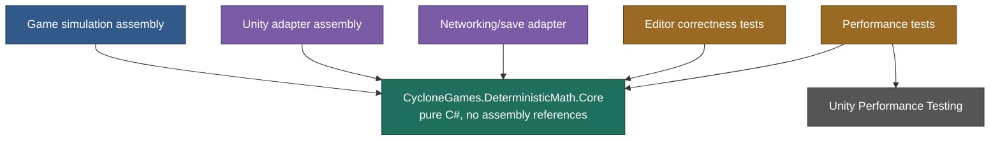
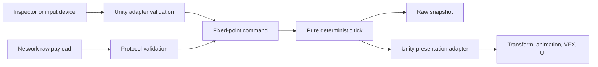

# CycloneGames.DeterministicMath

[English | 简体中文](README.SCH.md)

CycloneGames.DeterministicMath is a pure C# deterministic math foundation for simulations that must reproduce the same raw numeric state from the same ordered inputs. It provides signed Q32.32 fixed-point arithmetic, vectors, trigonometry, rotations, matrices, 2D and 3D geometry queries, and a caller-owned deterministic random stream.

## Table of Contents

- [Overview](#overview)
- [Architecture](#architecture)
- [Quick Start](#quick-start)
- [Core Concepts](#core-concepts)
- [Usage Guide](#usage-guide)
- [Advanced Topics](#advanced-topics)
- [Common Scenarios](#common-scenarios)
- [Performance and Memory](#performance-and-memory)
- [Troubleshooting](#troubleshooting)

## Overview

Floating-point arithmetic is appropriate for rendering, authoring, and many local effects. A synchronized simulation has a different requirement: every participant must agree on the exact state after every ordered tick. Small numeric differences can otherwise accumulate into different positions, decisions, collision results, or random call paths. DeterministicMath provides the numeric layer for that problem: `FPInt64` stores signed Q32.32 values in one `long`; `FPVector2` and `FPVector3` provide fixed-point vector operations; `FPMath` provides deterministic trigonometric and angle functions; `FPQuaternion` and `EulerOrder` provide 3D rotations; `FPMatrix4x4` provides affine and projective transforms with explicit point and direction methods; `FPGeometry2D` and `FPGeometry3D` provide validated shapes and value-based queries; `DeterministicRandom` provides an explicit xoshiro256** stream with saveable state.

The Core assembly has no Unity engine references and no external package dependencies. It can be used by Unity gameplay code, server processes, command-line tools, replay validators, and test runners through the same value contracts. Networking, physics, scheduling, persistence, encryption, rendering, and cryptographic random generation live in their own modules. DeterministicMath gives them a precise numeric foundation.

### Key Features

- **Q32.32 fixed-point** arithmetic in one signed `long` with explicit factories and wrapping operators.
- **Vectors** with scaled-intermediate magnitude and three normalization policies (`Normalized`, `NormalizedOrZero`, `TryNormalize`).
- **Deterministic CORDIC trigonometry** in `FPMath` (Sin/Cos/Tan/Atan2/Asin/Acos).
- **Quaternions** with Euler construction in six orders, axis-angle, look rotation, and Slerp/Nlerp.
- **4x4 matrices** with column-vector convention, TRS, affine point/direction transforms, projective point, and checked inverse.
- **2D and 3D geometry** with validated shapes (circle, AABB, sphere, OBB) and `TryRay*` queries.
- **xoshiro256** random stream with state save/restore and rejection-sampled bounded ranges.
- **Pure C# Core** with `noEngineReferences: true`, no unsafe code, no assembly references, no global state.

## Architecture



| Assembly | Purpose |
| --- | --- |
| `CycloneGames.DeterministicMath.Core` | All public math types. Pure C#, `noEngineReferences: true`, no assembly references, no unsafe code, no conditional compilation symbols. |
| `CycloneGames.DeterministicMath.Tests.Editor` | Editor correctness tests; references only Core and Unity test assemblies. |
| `CycloneGames.DeterministicMath.Tests.Performance` | Performance tests; present only when Unity Performance Testing satisfies the asmdef capability. |

| Concern | Design |
| --- | --- |
| Scalar representation | Signed Q32.32 in `FPInt64.RawValue` |
| Scalar storage | One signed 64-bit integer |
| Public construction | Explicit factories; the raw constructor is private |
| Arithmetic hot path | Explicit two's-complement wrapping operators |
| Checked arithmetic | Additive `Try*` methods with no exception on ordinary failure |
| Angles | Radians |
| Coordinate basis | +X right, +Y up, +Z forward |
| Matrix convention | Column vectors; `left * right` applies `right` first |
| Geometry | Validated value-type shapes and static query classes |
| Random ownership | Mutable struct owned by the simulation object that advances it |
| Runtime persistence | None; callers serialize explicit raw fields and state words |
| Runtime global state | None |

Most public data types are immutable value types. `DeterministicRandom` is deliberately mutable because generating a value advances its four-word stream state.

## Quick Start

Reference `CycloneGames.DeterministicMath.Core` from the consuming asmdef, then import the namespace:

```csharp
using CycloneGames.DeterministicMath;
```

### Fixed-tick movement

The following class accepts a fixed-point input, normalizes it safely, and advances position at 60 ticks per second:

```csharp
public sealed class FixedTickMover
{
    private static readonly FPInt64 TickDelta = FPInt64.One / 60;
    private static readonly FPInt64 MoveSpeed = FPInt64.FromInt(6);

    public FPVector3 Position { get; private set; }
    public FPVector3 Velocity { get; private set; }

    public FixedTickMover(FPVector3 initialPosition)
    {
        Position = initialPosition;
        Velocity = FPVector3.Zero;
    }

    public void Tick(FPVector2 moveInput)
    {
        FPVector2 planarDirection = moveInput.NormalizedOrZero;
        FPVector3 worldDirection = new FPVector3(
            planarDirection.X,
            FPInt64.Zero,
            planarDirection.Y);

        Velocity = worldDirection * MoveSpeed;
        Position += Velocity * TickDelta;
    }
}
```

Drive it with an integer tick index and fixed-point input:

```csharp
FixedTickMover mover = new FixedTickMover(FPVector3.Zero);

for (int tick = 0; tick < 120; tick++)
{
    FPVector2 input = tick < 60 ? FPVector2.Right : FPVector2.Up;
    mover.Tick(input);
}

long authoritativeX = mover.Position.X.RawValue;
long authoritativeY = mover.Position.Y.RawValue;
long authoritativeZ = mover.Position.Z.RawValue;
```

The tick duration, input, speed, position, and velocity remain fixed-point throughout the simulation. Unity vectors or floating-point interpolation can still be used in the presentation layer after the authoritative tick completes.

### What makes this reproducible

Another process produces the same raw position when all of the following are the same: the Core implementation and numeric contracts; the initial raw state; the tick count and tick order; every input value and the tick where it is applied; branch and collection iteration order; the order and number of random calls; any external query result injected into the simulation. Fixed-point arithmetic cannot correct a nondeterministic update order, an unordered input source, a race between jobs, or a floating-point value generated independently on each peer. Determinism is a whole-simulation property built on explicit raw contracts.

## Core Concepts

### Q32.32 fundamentals

`FPInt64` divides one signed `long` into 32 integer bits and 32 fractional bits:

```text
numericValue = RawValue / 4294967296
RawValue     = numericValue * 4294967296
```

The resolution is exactly `2^-32`, approximately `2.3283064365386963e-10`. The range is `[-2147483648, 2147483647.99999999976716935634613037109375]`. The `FPInt64` constructor is private — use a factory that states whether the source is an integer, decimal text, floating-point boundary value, or raw protocol value.

| Constant | Type | Meaning |
| --- | --- | --- |
| `FPInt64.FractionalBits` | `int` | 32 |
| `FPInt64.RAW_ONE` | `long` | Raw representation of 1 |
| `FPInt64.RAW_HALF` | `long` | Raw representation of 0.5 |
| `FPInt64.Zero` | `FPInt64` | Numeric 0 |
| `FPInt64.One` | `FPInt64` | Numeric 1 |
| `FPInt64.Half` | `FPInt64` | Numeric 0.5 |
| `FPInt64.MinusOne` | `FPInt64` | Numeric -1 |

### Construct values

```csharp
FPInt64 whole = FPInt64.FromInt(12);
FPInt64 fraction = FPInt64.Parse("3.125");
FPInt64 authored = FPInt64.FromDouble(0.75);
FPInt64 protocolValue = FPInt64.FromRaw(13_421_772_800L);

FPInt64 implicitWhole = 5;
```

Only `int` has an implicit conversion. Floating-point values require an explicit factory so that the boundary is visible in code review. `FromFloat` and `FromDouble` reject NaN, infinity, and values outside the Q32.32 range. Their `TryFromFloat` and `TryFromDouble` forms return `false` and a default result.

Decimal text uses an invariant period. `ToString()` emits the exact decimal expansion needed to restore the same raw bits. Use decimal text for human-readable configuration and diagnostics; use `RawValue` for compact snapshots and protocols.

### Arithmetic policies

The ordinary scalar operators are the low-overhead path:

```csharp
FPInt64 sum = left + right;
FPInt64 difference = left - right;
FPInt64 product = left * right;
FPInt64 quotient = left / right;
FPInt64 remainder = left % right;
```

Addition, subtraction, negation, multiplication, and representable-range overflow use explicit unchecked two's-complement wrapping. This behavior does not depend on the consumer's checked compiler setting. Use checked methods at authored-data, protocol, save, and uncertain-range boundaries:

```csharp
public static bool TryCalculateScaledDamage(
    FPInt64 baseDamage,
    FPInt64 multiplier,
    FPInt64 divisor,
    out FPInt64 result)
{
    return FPInt64.TryMultiplyDivide(baseDamage, multiplier, divisor, out result);
}
```

Available checked scalar methods include `TryAdd`, `TrySubtract`, `TryNegate`, `TryMultiply`, `TryDivide`, `TryMultiplyDivide`, `TryAbs`, `TryCeil`, `TryRound`, and `TrySqrt`. `TryMultiplyDivide(a, b, divisor)` evaluates `(a * b) / divisor` with a full-width intermediate — useful when a representable final result would be lost by first performing a wrapping multiplication.

### Failure strategy

The API distinguishes three intentions: wrapping operators for ranges already proven by the simulation; fail-fast methods for programmer or configuration errors; `Try*` methods for expected boundary failure.

| Operation | Failure behavior |
| --- | --- |
| `FromFloat`, `FromDouble` | `ArgumentOutOfRangeException` for non-finite or out-of-range input |
| `Parse` | `FormatException` for invalid or out-of-range text |
| Division or remainder by zero | `DivideByZeroException` |
| `Abs(MinValue)`, unrepresentable `Ceil`/`Round` | `OverflowException` |
| `Sqrt` of a negative value | `ArgumentOutOfRangeException` |
| `Tan` at an exact asymptote or outside Q32.32 | `InvalidOperationException` |
| `Asin`/`Acos` outside `[-1, 1]` | `ArgumentOutOfRangeException` |
| `Normalized` for an undefined vector | `InvalidOperationException` |
| `NormalizedOrZero` for an undefined vector | Returns zero |
| Invalid quaternion normalization or inverse | `InvalidOperationException` |
| Singular or unsupported matrix inverse | `InvalidOperationException` |
| Invalid projective point | `InvalidOperationException` |
| Ray miss, degenerate ray, invalid shape, or numeric failure | `TryRay*` returns `false` and default output |
| Uninitialized random stream | `InvalidOperationException` |
| All-zero random state | `ArgumentException` |

For a `Try*` call, consume the output only when the returned Boolean is `true`.

## Usage Guide

### Vectors

```csharp
FPVector2 input = new FPVector2(3, 4);
FPVector3 position = new FPVector3(10, 2, -5);

FPVector3 up = FPVector3.Up;
FPVector3 forward = FPVector3.Forward;
FPVector3 right = FPVector3.Right;
```

`FPVector2` provides `Zero`, `One`, `Right`, and `Up`. `FPVector3` also provides `Down`, `Forward`, `Back`, and `Left`. Both vector types support value equality.

Magnitude and normalization:

```csharp
FPVector3 velocity = new FPVector3(3, 4, 0);

FPInt64 squaredSpeed = velocity.SqrMagnitude; // 25
FPInt64 speed = velocity.Magnitude;           // 5
FPVector3 direction = velocity.Normalized;
```

Three normalization policies express domain intent:

- `Normalized` requires a normalizable non-zero vector and fails fast otherwise.
- `NormalizedOrZero` explicitly chooses zero as the fallback.
- `TryNormalize` exposes the decision to the caller.

Magnitude uses scaled intermediates so that large vectors do not wrap during squaring and raw-1 micro vectors are not mistaken for zero. `SqrMagnitude` and `DistanceSqr` saturate to `FPInt64.MaxValue` when the exact squared result cannot fit Q32.32.

Dot, cross, projection, and reflection:

```csharp
FPVector3 velocity = new FPVector3(4, -3, 2);
FPVector3 unitNormal = FPVector3.Up;

if (!FPVector3.TryDot(velocity, unitNormal, out FPInt64 normalSpeed))
    throw new OverflowException("Dot product is outside the numeric domain.");

if (!FPVector3.TryProject(velocity, unitNormal, out FPVector3 verticalPart))
    throw new InvalidOperationException("Projection is undefined.");

if (!FPVector3.TryReflect(velocity, unitNormal, out FPVector3 reflected))
    throw new OverflowException("Reflection is outside the numeric domain.");

FPVector3 tangent = FPVector3.Cross(unitNormal, FPVector3.Forward);
```

The reflection formula expects a unit normal. Normalize authored or calculated normals before calling it. Projection accepts a non-unit target vector but rejects a zero target. `Lerp` clamps `t` to `[0, 1]`; `LerpUnclamped` permits extrapolation. The same naming rule applies to vector and quaternion interpolation.

### Trigonometry and angles

`FPMath` uses a deterministic integer CORDIC implementation. Inputs and outputs are radians.

```csharp
FPInt64 degrees = 45;
FPInt64 radians = degrees * FPInt64.Deg2Rad;

FPMath.SinCos(radians, out FPInt64 sin, out FPInt64 cos);
```

The output order is `sin`, then `cos`. Use `SinCos` when both results are needed so the CORDIC pass is shared. `Atan2` takes `(y, x)` and returns a value in `[-Pi, Pi]`; the origin `Atan2(0, 0)` is defined as zero. `Tan` fails fast at an exact asymptote or when the quotient is outside Q32.32 — `TryTan` is the expected-failure form. `Asin` and `Acos` require input in `[-1, 1]`.

`NormalizeAngle` returns `[-Pi, Pi]`. `NormalizeAnglePositive` returns `[0, TwoPi)`.

### Quaternions and Euler angles

Axis-angle and vector rotation:

```csharp
FPInt64 quarterTurn = 90 * FPInt64.Deg2Rad;
FPQuaternion yaw = FPQuaternion.AngleAxis(quarterTurn, FPVector3.Up);

if (!FPQuaternion.TryRotate(yaw, FPVector3.Forward, out FPVector3 rotatedForward))
    throw new InvalidOperationException("Rotation result is outside the domain.");

FPVector3 fastResult = yaw * FPVector3.Forward; // wrapping hot path
```

`AngleAxis` normalizes its axis and rejects a zero axis. Positive angles follow the right-hand rule. The quaternion-vector operator is a wrapping hot path intended for a normalized quaternion; use `TryRotate` when the quaternion or vector comes from an untrusted boundary.

Euler construction:

```csharp
FPQuaternion rotation = FPQuaternion.Euler(
    xRadians: 20 * FPInt64.Deg2Rad,
    yRadians: 35 * FPInt64.Deg2Rad,
    zRadians: -10 * FPInt64.Deg2Rad,
    order: EulerOrder.ZXY);

FPVector3 extracted = rotation.ToEuler(EulerOrder.ZXY);
```

The three parameters always represent X, Y, and Z angles. `EulerOrder` controls intrinsic composition order; it does not reorder the parameter meanings. Available orders are `XYZ`, `XZY`, `YXZ`, `YZX`, `ZXY`, and `ZYX`. The overload without an order uses `ZXY`. Euler triples are not unique — near gimbal lock, compare the resulting rotation or rotated basis vectors instead of comparing extracted angle components.

Direction constructors (`TryFromToRotation`, `TryLookRotation`) reject zero directions and use a deterministic orthogonal reference when the supplied up vector is zero or collinear with forward. `Normalized`, `Inverse`/`TryInverse`, `Slerp`, `Nlerp`, and their `Unclamped` variants follow the same naming conventions as vectors. Quaternion equality compares raw components — a quaternion and its negation describe the same spatial rotation but are different raw values.

### Matrices

`FPMatrix4x4` uses column vectors. Matrix composition `left * right` applies `right` first.

```csharp
FPMatrix4x4 localToWorld = FPMatrix4x4.TRS(
    new FPVector3(10, -4, 7),
    FPQuaternion.Euler(10 * FPInt64.Deg2Rad, 25 * FPInt64.Deg2Rad, 0),
    new FPVector3(2, 3, 4));

FPVector3 worldPoint = localToWorld.TransformPoint(new FPVector3(1, 2, 3));
FPVector3 worldDirection = localToWorld.TransformDirection(FPVector3.Forward);
```

- `TransformPoint` applies the affine 3x4 transform, including translation.
- `TransformDirection` applies the upper 3x3 transform and ignores translation.
- `ProjectPoint` performs a homogeneous transform and divides by `w`.

`TryTransformPoint` and `TryTransformDirection` are the checked forms. `Perspective` uses a right-handed view space with visible points along negative Z and a depth range of `[0, 1]`; it requires `0 < fovRadians < Pi`, `aspect > 0`, `near > 0`, and `far > near`. Elements are named `M00` through `M33`, where the first digit is the row and the second is the column; the indexer also accepts `[row, column]`. `TryInverse` rejects singular and near-singular matrices and checks both multiplication orders against identity with checked arithmetic before accepting the candidate.

### 2D and 3D geometry

```csharp
FPCircle circle = new FPCircle(new FPVector2(10, 0), FPInt64.FromInt(2));
FPAABB2D bounds = new FPAABB2D(new FPVector2(8, -3), new FPVector2(12, 3));

FPSphere sphere = new FPSphere(new FPVector3(0, 0, 10), FPInt64.FromInt(2));
FPAABB3D bounds3D = new FPAABB3D(new FPVector3(-5, -5, 5), new FPVector3(5, 5, 15));
FPOBB3D orientedBox = new FPOBB3D(
    center: new FPVector3(0, 0, 10),
    halfExtents: new FPVector3(2, 1, 4),
    orientation: FPQuaternion.AngleAxis(30 * FPInt64.Deg2Rad, FPVector3.Up));
```

- Circle and sphere radius must be non-negative.
- AABB minimum components must not exceed maximum components.
- OBB half-extents must be non-negative; orientation must be non-zero and is normalized by the constructor.
- A default `FPOBB3D` is invalid because its orientation is zero.
- Boundary contact counts as overlap and containment.

Overlap, containment, closest-point, and ray queries are exposed as static methods on `FPGeometry2D` and `FPGeometry3D`. OBB overlap uses the complete 15-axis separating-axis test. All ray methods are `TryRay*` — failure leaves the output at default. Circle distance decisions use full-width integer intermediates; they do not rely on a saturated public squared-magnitude display value.

### Ray parameter semantics

Every ray result satisfies `point(t) = Origin + Direction * t`. The returned `t` is a world-space distance only when `Direction` has unit magnitude — doubling the direction halves the parameter for the same point. Ray queries accept forward intersections where `t >= 0`. When the origin is inside a closed shape, the result is the first forward exit parameter rather than zero.

### Deterministic random streams

`DeterministicRandom` implements xoshiro256**. A SplitMix64 expansion turns one `ulong` seed into four state words.

```csharp
DeterministicRandom random = DeterministicRandom.Create(0xC0FFEEUL);

ulong raw = random.NextULong();
int cardIndex = random.NextInt(52);    // [0, 52)
int die = random.NextInt(1, 7);        // [1, 7)
FPInt64 unit = random.NextFP();        // [0, 1)
FPInt64 spread = random.NextFP(-1, 1); // [-1, 1)
```

All range maximums are exclusive. Integer bounded sampling uses rejection sampling so the mapping is unbiased. The generator is a mutable struct — the simulation owner must retain the instance that it advances. When a helper must advance the caller's stream, pass it by `ref`. Assigning the struct copies all four state words and creates an intentional identical branch. Do not concurrently mutate one logical stream.

```csharp
DeterministicRandomState checkpoint = random.SaveState();
ulong first = random.NextULong();
random.RestoreState(checkpoint);
ulong repeated = random.NextULong();

bool exactReplay = first == repeated;
```

The all-zero four-word state is invalid. `TryRestoreState` reports failure without replacing the current state. Persist `ALGORITHM_ID`, `ALGORITHM_VERSION`, `S0`, `S1`, `S2`, and `S3` together; replay also depends on making the same sampling calls in the same order. A bounded call may consume more than one raw output because rejection sampling retries rejected values.

## Advanced Topics

### Rollback and resimulation

A rollback snapshot stores every authoritative field needed to continue the simulation, including random state:

```csharp
public readonly struct MoverSnapshot
{
    public readonly int Tick;
    public readonly long PositionXRaw;
    public readonly long PositionYRaw;
    public readonly long PositionZRaw;
    public readonly long VelocityXRaw;
    public readonly long VelocityYRaw;
    public readonly long VelocityZRaw;
    public readonly DeterministicRandomState RandomState;

    public MoverSnapshot(int tick, FPVector3 position, FPVector3 velocity,
                         DeterministicRandomState randomState)
    {
        Tick = tick;
        PositionXRaw = position.X.RawValue;
        PositionYRaw = position.Y.RawValue;
        PositionZRaw = position.Z.RawValue;
        VelocityXRaw = velocity.X.RawValue;
        VelocityYRaw = velocity.Y.RawValue;
        VelocityZRaw = velocity.Z.RawValue;
        RandomState = randomState;
    }

    public FPVector3 RestorePosition() => new FPVector3(
        FPInt64.FromRaw(PositionXRaw),
        FPInt64.FromRaw(PositionYRaw),
        FPInt64.FromRaw(PositionZRaw));
}
```

A bounded history can use the tick as a ring-buffer key:

```csharp
MoverSnapshot[] history = new MoverSnapshot[128];

history[currentTick % history.Length] = CaptureSnapshot(currentTick);

MoverSnapshot rewind = history[correctedTick % history.Length];
RestoreSnapshot(rewind);

for (int tick = correctedTick; tick < currentTick; tick++)
{
    SimulateTick(tick, recordedInputs[tick]);
}
```

The application owns entity existence, collection order, input history, event suppression during resimulation, and side-effect reconciliation. A numeric snapshot alone is insufficient if those states influence future ticks.

### Serialization contract

Serialize signed raw values explicitly:

```csharp
long positionX = position.X.RawValue;
FPVector3 restored = new FPVector3(
    FPInt64.FromRaw(positionX),
    FPInt64.FromRaw(positionY),
    FPInt64.FromRaw(positionZ));
```

For quaternion and matrix state, serialize each named component in an explicitly documented order: `Quaternion: X, Y, Z, W`; `Matrix: M00..M33` in row-major order. The owning serializer must define schema identifier and version, signed integer encoding, byte order, field order, optional compression, payload length limits, integrity validation, handling for unknown schema values, and corruption/recovery policy. Do not serialize private struct memory, rely on runtime padding, store `GetHashCode()`, or convert authoritative values through float. Reconstruct validated shapes through their constructors so invalid payloads are rejected.

For random state, persist `ALGORITHM_ID`, `ALGORITHM_VERSION`, `S0`, `S1`, `S2`, `S3`. Validate the algorithm identity, algorithm version, payload schema, and non-zero state before restoring a stream.

### Unity adapter pattern

Core intentionally does not expose `UnityEngine.Vector2`, `UnityEngine.Vector3`, `Quaternion`, `Matrix4x4`, `MonoBehaviour`, or `ScriptableObject`. Place conversion code in a Unity-facing adapter assembly:

```csharp
using CycloneGames.DeterministicMath;
using UnityEngine;

public static class DeterministicVectorAdapter
{
    public static FPVector3 ToDeterministic(Vector3 value) => new FPVector3(
        FPInt64.FromFloat(value.x),
        FPInt64.FromFloat(value.y),
        FPInt64.FromFloat(value.z));

    public static Vector3 ToUnity(FPVector3 value) => new Vector3(
        value.X.ToFloat(),
        value.Y.ToFloat(),
        value.Z.ToFloat());
}
```



Convert authoring data once, before it enters authoritative state. Convert simulation results to Unity values for display. Rendering interpolation can remain floating-point if it never feeds back into the simulation. Use an explicit integer tick scheduler for synchronized simulation — Unity frame rate and `FixedUpdate` scheduling are presentation or orchestration concerns unless the product formally defines them as the authoritative tick source.

## Common Scenarios

### Lockstep unit movement

A strategy game moves units in lockstep. Each peer sends fixed-point move commands; every peer applies them in the same tick order:

```csharp
public void ApplyMoveCommand(int unitId, FPVector2 destination, int tick)
{
    FPVector3 current = _units[unitId].Position;
    FPVector3 target = new FPVector3(destination.X, FPInt64.Zero, destination.Y);
    FPVector3 delta = target - current;
    FPInt64 distance = delta.Magnitude;
    FPInt64 travelPerTick = _units[unitId].Speed * TickDelta;

    if (distance <= travelPerTick)
    {
        _units[unitId].Position = target;
    }
    else
    {
        _units[unitId].Position += delta.Normalized * travelPerTick;
    }
}
```

Both peers compute identical positions because every operation uses Q32.32 fixed-point. `Normalized` is used here because a zero delta means the unit is already at the destination — the caller handles that case before calling.

### Deterministic loot rolls

A loot system needs the same drop sequence for the same seed, reproducible across client and server:

```csharp
public sealed class LootRoller
{
    private readonly DeterministicRandom _random;

    public LootRoller(ulong seed)
    {
        _random = DeterministicRandom.Create(seed);
    }

    public int RollIndex(int itemCount) => _random.NextInt(itemCount);

    public DeterministicRandomState SaveState() => _random.SaveState();
    public void RestoreState(DeterministicRandomState state) => _random.RestoreState(state);
}
```

Save and restore the stream state at each checkpoint so a rollback can replay the same rolls. Persist `ALGORITHM_ID` and `ALGORITHM_VERSION` alongside `S0..S3` so a future algorithm change is detected explicitly.

### Raycast selection in 3D

A click-to-select system casts a deterministic ray against oriented bounding boxes:

```csharp
public bool TrySelectEntity(FPRay3D worldRay, FPOBB3D obb, out FPVector3 hitPoint)
{
    if (!FPGeometry3D.TryRayOBB(worldRay, obb, out FPInt64 t))
    {
        hitPoint = FPVector3.Zero;
        return false;
    }

    hitPoint = worldRay.Origin + worldRay.Direction * t;
    return true;
}
```

Normalize `worldRay.Direction` first if `t` must be a world-space distance. The query is deterministic across peers, so the same selection result can be validated server-side.

### Perspective camera culling

A simulation culls entities against a deterministic perspective frustum before serializing visible entities to the client:

```csharp
FPMatrix4x4 projection = FPMatrix4x4.Perspective(
    60 * FPInt64.Deg2Rad,
    FPInt64.FromInt(16) / 9,
    FPInt64.Parse("0.1"),
    FPInt64.FromInt(1000));

foreach (Entity entity in _entities)
{
    if (!projection.TryProjectPoint(entity.Position - cameraPosition, out FPVector3 ndc))
        continue;

    if (ndc.X >= -FPInt64.One && ndc.X <= FPInt64.One &&
        ndc.Y >= -FPInt64.One && ndc.Y <= FPInt64.One &&
        ndc.Z >= FPInt64.Zero && ndc.Z <= FPInt64.One)
    {
        visibleEntities.Add(entity);
    }
}
```

Convert `16 / 9` as `FPInt64.FromInt(16) / 9`, not as an integer expression — the integer result is `1`. The projection uses a right-handed view space with depth range `[0, 1]`.

## Performance and Memory

### Cost model

- Addition, subtraction, comparison, and raw conversion are small integer operations.
- Multiplication uses full-width integer decomposition.
- General division and square root are substantially more expensive.
- `SinCos` uses iterative CORDIC work; call it once when both outputs are needed.
- Vector normalization combines scaling, square root, and division.
- Quaternion construction and interpolation combine multiple vector and trigonometric operations.
- OBB overlap evaluates up to 15 separating axes.
- Matrix inverse is intended for setup or infrequent queries, not an unchecked inner loop.

### Hot-path guidance

1. Convert constants and authored values before the tick loop.
2. Cache normalized directions that remain unchanged.
3. Prefer squared distance for ordering or thresholds when its saturation domain is acceptable.
4. Use full geometry queries for large-range collision decisions.
5. Share one `SinCos` call when both values are needed.
6. Use wrapping operators only after ranges are established.
7. Validate uncertain data with `Try*` before it reaches the inner loop.
8. Avoid `ToString`, boxing, interface dispatch, LINQ, and exception-driven control flow in hot paths.
9. Avoid accidental copies of large matrices and mutable random streams.
10. Measure the real Player/backend with representative game data.

Formatting, exception creation, boxing, caller collections, delegates, and Unity adapters can allocate even when the selected arithmetic batch does not. The performance suite uses deterministic arrays of 10,240 varying operands with five warmups and twenty measurements per benchmark. The included benchmark workloads are not release performance baselines — measure the selected Player backend, target architecture, compiler settings, and representative workload before setting release budgets.

### Ownership, lifetime, and threading

| Resource | Owner | Lifetime rule |
| --- | --- | --- |
| Scalar/vector/quaternion/matrix/shape | Caller value | Copy freely; values are immutable |
| Random stream | Simulation subsystem or stable entity | Retain and advance one owned mutable instance |
| Random checkpoint | Snapshot/replay owner | Persist all state words and algorithm identity |
| CORDIC lookup data | Core static initialization | Read-only after initialization |
| Native memory | None | No disposal |
| Worker threads | None | Scheduling belongs to the caller |

Independent immutable values and independently owned random streams can be processed concurrently. Concurrent writes to one logical random stream or shared simulation container require caller-defined synchronization and deterministic scheduling.

### Persistence behavior

The module does not use `PlayerPrefs`, `EditorPrefs`, `SessionState`, registry keys, environment variables, scenes, Prefabs, or ScriptableObject settings. There is nothing module-owned to clean from disk. Fixed-point snapshots expose raw values only; random checkpoints expose four state words; the owning layer handles persistence.

## Troubleshooting

| Symptom | Likely cause | Resolution |
| --- | --- | --- |
| Two peers produce different positions | Nondeterministic update order, unordered input, or independent float computation | Verify tick order, input order, and that no `float`/`double` feeds back into authoritative state |
| `FromDouble` throws `ArgumentOutOfRangeException` | NaN, infinity, or value outside Q32.32 range | Validate the source; use `TryFromDouble` for boundary data |
| `Normalized` throws `InvalidOperationException` | Zero or unnormalizable vector | Use `NormalizedOrZero` if zero is a valid fallback, or `TryNormalize` to branch |
| `Tan` throws `InvalidOperationException` | Input at an exact asymptote or quotient outside Q32.32 | Use `TryTan` for boundary input |
| `Atan2` returns unexpected sign | Arguments reversed | `Atan2` takes `(y, x)`, not `(x, y)` |
| Euler comparison fails near gimbal lock | Euler triples are not unique | Compare the resulting rotation or rotated basis vectors, not extracted angles |
| `TransformPoint` produces wrong result on a direction | Wrong homogeneous intent | Use `TransformDirection` for directions; use `ProjectPoint` when perspective divide is required |
| `TryRay*` output is garbage after `false` | Output consumed after failure | Only consume `t` when the method returns `true` |
| Ray `t` does not match world-space distance | Direction is not unit magnitude | Normalize `Direction` before querying if `t` must be distance |
| OBB construction throws | Default orientation is zero | Construct with a non-zero orientation (e.g. `FPQuaternion.Identity`) |
| `DeterministicRandom` produces different values than expected | Stream was copied and the copy advanced | Retain and advance one owned instance; pass by `ref` to helpers |
| Replay diverges after rollback | Random state not saved, or sampling call order differs | Save `S0..S3` plus `ALGORITHM_ID`/`ALGORITHM_VERSION`; replay calls in the same order |
| `16 / 9` produces `1` | Integer division before fixed-point conversion | Convert at least one operand first: `FPInt64.FromInt(16) / 9` |
| `RAW_ONE` used as `FPInt64` or `One` used as `long` | Confused raw vs. typed constant | `RAW_ONE` is `long`; `One` is `FPInt64` |

## Validation

### Unity Editor

1. Open `<repo-root>/UnityStarter` with the Unity version declared in `ProjectSettings/ProjectVersion.txt`.
2. Open **Window > General > Test Runner**, select EditMode.
3. Run `CycloneGames.DeterministicMath.Tests.Editor`.
4. If Unity Performance Testing is installed, run `CycloneGames.DeterministicMath.Tests.Performance`.
5. Confirm active consumer assemblies compile without errors.

### Batch mode

```text
<Unity-executable> -batchmode -nographics -quit \
  -projectPath <repo-root>/UnityStarter \
  -runTests -testPlatform EditMode \
  -assemblyNames CycloneGames.DeterministicMath.Tests.Editor \
  -testResults <repo-root>/Artifacts/DeterministicMath.EditMode.xml \
  -logFile <repo-root>/Artifacts/DeterministicMath.EditMode.log
```

Create the artifact directory before running the command.

### Production acceptance

Before using the module as an authoritative cross-process contract:

- round-trip minimum, maximum, negative, fractional, vector, quaternion, and matrix raw values;
- compile Core with overflow checking both disabled and enabled, then run the same correctness suite against each build;
- compare raw golden vectors on every supported runtime and architecture;
- verify overflow, zero, invalid-domain, and every `Try*` path;
- verify clamped and unclamped interpolation;
- verify all six Euler orders, gimbal-lock cases, and basis-vector rotation;
- verify affine point, direction, projective point, and inverse behavior;
- verify large-range circle, sphere, AABB, OBB, closest-point, and ray queries;
- verify the RNG seed expansion, golden sequence, bounded ranges, and state restore;
- capture and replay a representative rollback window;
- compare complete authoritative snapshots after resimulation;
- profile the actual Player/backend with production-scale data.

The release claim should name the exact platforms, runtimes, test corpus, raw contracts, and performance budgets that were verified.
