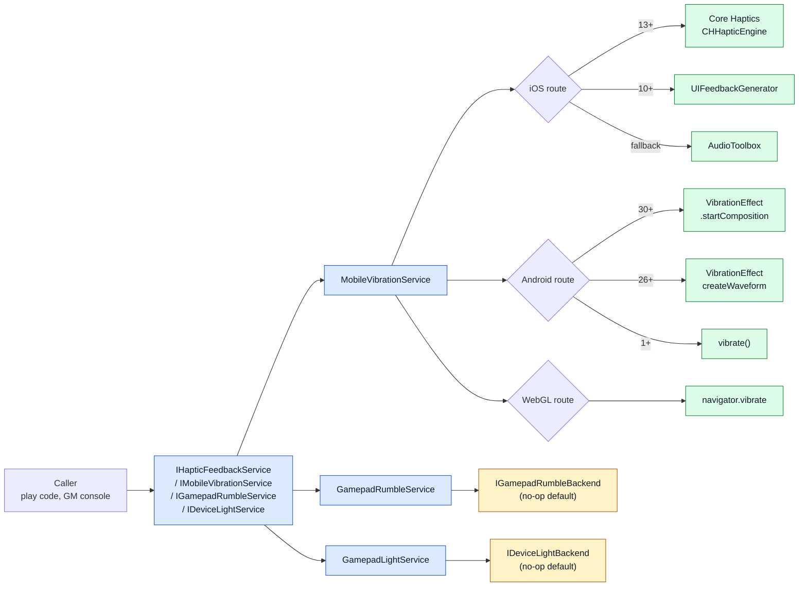

# CycloneGames.DeviceFeedback

[English | 简体中文](README.md)

CycloneGames.DeviceFeedback 为 Unity 提供硬件反馈抽象与手机振动实现。模块打包了 Android、iOS、WebGL 的触觉路径、用于曲线和事件创作的 `HapticClip` 资产，以及可注入的游戏手柄震动与设备灯光控制接口，默认提供安全的 no-op backend。

## 目录

- [概述](#概述)
- [架构](#架构)
- [快速上手](#快速上手)
- [核心概念](#核心概念)
- [使用指南](#使用指南)
- [进阶主题](#进阶主题)
- [常见场景](#常见场景)
- [性能与内存](#性能与内存)
- [故障排查](#故障排查)

## 概述

设备反馈调用回答一个问题：哪个硬件输出应该触发、强度多少、持续多久？CycloneGames.DeviceFeedback 用一组小型接口回答它——`IHapticFeedbackService`、`IMobileVibrationService`、`IGamepadRumbleService`、`IDeviceLightService`，由平台相关实现按运行时选择最强可用的原生路径。

手机触觉开箱即用：Android 使用 `VibrationEffect`（API 26+）并支持 API 30+ composition primitives，iOS 使用 Core Haptics（iOS 13+）并回退到 `UIFeedbackGenerator` 和 `AudioToolbox`，WebGL 使用 `navigator.vibrate`。游戏手柄震动和设备灯光控制使用可注入 backend 与显式 no-op 默认，因此不支持的硬件平台或未安装 backend 的项目保持确定性。

适用场景：项目需要用统一 API 跨平台触觉、需要设计师友好的 `HapticClip` 资产工作流，或需要干净边界接入平台专用的手柄和灯光 backend。游戏手柄震动和设备灯光的真实硬件输出需要单独的平台 integration assembly，模块只提供契约和 no-op 回退。

### 主要特性

- **`IHapticFeedbackService`**：通用接口，含 `IsAvailable`、`IsActive`、`Initialize`、`PlayPreset`、`Play`、`PlayCurve`、`PlayClip` 与 `Cancel`。
- **`IMobileVibrationService`**：手机扩展，含 pattern 振动、iOS 专用 impact/notification/selection 和实时持续参数调制。
- **`MobileVibration` 静态门面**：与 service 相同的 API，作为非 DI 项目的 singleton 入口。
- **`HapticClip` ScriptableObject**：设计师资产，支持曲线或离散事件两种模式。
- **`IGamepadRumbleService` / `IDeviceLightService`**：可注入 backend 的契约，含显式 `NoopGamepadRumbleBackend` / `NoopDeviceLightBackend` 默认。
- **iOS Core Haptics（iOS 13+）**：瞬态与持续事件、参数曲线、复合模式与实时调制。
- **Android API 30+ primitives**：CLICK、TICK、LOW_TICK 与 THUD 的 composition 路径，回退到振幅。

## 架构

| 程序集 | 路径 | 用途 |
| --- | --- | --- |
| `CycloneGames.DeviceFeedback.Runtime` | `Runtime/` | 所有公开契约、`MobileVibrationService`、`GamepadRumbleService`、`GamepadLightService`、no-op backend 与 `HapticClip`。引用 `UnityEngine`。 |
| `CycloneGames.DeviceFeedback.Tests.Editor` | `Tests/Editor/` | `GamepadRumbleService` 与 `GamepadLightService` 的 guard 和 no-op 行为测试。 |

Runtime assembly 在 Android、iOS、WebGL、tvOS、VisionOS、Editor 和桌面 standalone 平台启用。手机原生插件（iOS 的 `HapticFeedback.mm`、`CoreHaptics.mm`；Android 的 JNI 调用）与 C# 源码并列，由 `#if UNITY_IOS` / `#if UNITY_ANDROID` 块选择。



调用方调用 service；service 在手机上路由到最强可用的原生路径，或在游戏手柄震动和设备灯光上转发到注入的 backend。手机回退是自动的，控制器和灯光 backend 是显式注入的。

## 快速上手

在你的 asmdef 中引用 `CycloneGames.DeviceFeedback.Runtime`，然后导入命名空间：

```csharp
using CycloneGames.DeviceFeedback.Runtime;
using UnityEngine;
```

### 使用静态门面

```csharp
void Awake() => MobileVibration.Init();

void OnPlayerHit() => MobileVibration.PlayPreset(HapticPreset.Heavy);
void OnCollect()   => MobileVibration.Play(0.3f, 0.1f, sharpness: 0.8f);
void OnCancel()    => MobileVibration.Cancel();

void OnApplicationQuit() => MobileVibration.Shutdown();
```

`Init()` 懒构造并初始化单例 `MobileVibrationService`。`Shutdown()` 释放原生资源（JNI、Core Haptics engine），可安全用于 `OnApplicationQuit` 或测试 teardown。

### 使用依赖注入

```csharp
public sealed class GameManager
{
    private readonly IHapticFeedbackService _haptics;

    public GameManager(IHapticFeedbackService haptics)
    {
        _haptics = haptics;
        _haptics.Initialize();
    }

    public void OnPlayerHit() => _haptics.PlayPreset(HapticPreset.Heavy);
    public void OnCollect()   => _haptics.Play(0.3f, 0.1f, sharpness: 0.8f);
    public void OnExplosion() => _haptics.PlayClip(explosionClip);
}
```

在你的 container 中把 `MobileVibrationService` 注册为 `IMobileVibrationService` 或 `IHapticFeedbackService`。

## 核心概念

### 强度、时长与锐度

三个参数描述每个平台的触觉：

- **`intensity`**：`0.0` 到 `1.0`，归一化。在 Android 26+ 上映射到振幅，在 iOS 13+ 上映射到 `CHHapticEventParameterIntensity`，在 WebGL 上映射到 `navigator.vibrate` 总时长。
- **`durationSeconds`**：秒。在 Android 上映射到 `VibrationEffect` 波形长度，在 iOS 13+ 上映射到持续 `CHHapticEvent`，在 WebGL 上映射到毫秒调用。
- **`sharpness`**：`0.0`（深沉/宽广）到 `1.0`（锋利/清脆）。在 iOS 13+ 通过 `CHHapticEventParameterSharpness` 原生消费。其他平台近似或忽略。

```csharp
MobileVibration.Play(intensity: 0.8f, durationSeconds: 0.3f, sharpness: 0.9f);
```

### 预设

`HapticPreset` 是所有反馈设备共享的枚举：

| 预设 | 典型用途 |
| --- | --- |
| `Light` | 轻触、选择确认。 |
| `Medium` | UI 按钮按下。 |
| `Heavy` | 撞击、玩家受击。 |
| `Success` | 操作成功完成。 |
| `Warning` | 可恢复错误或警告。 |
| `Error` | 失败、拒绝。 |
| `Selection` | 滚动或旋转时的 tick。 |

```csharp
MobileVibration.PlayPreset(HapticPreset.Success);
```

### HapticClip

`HapticClip` 是 `ScriptableObject`，通过 **Assets > Create > CycloneGames > Device Feedback > Haptic Clip** 创建。两种模式：

**曲线模式（默认）** —— 定义 `intensityCurve` 与 `sharpnessCurve`（X 轴：归一化时间 `0–1`，Y 轴：值 `0–1`）以及 `duration`：

```csharp
[CreateAssetMenu] public HapticClip explosionClip;
MobileVibration.PlayClip(explosionClip);
```

**事件模式** —— 在 `events` 数组中填入离散 `HapticEvent` 条目：

| 字段 | 说明 |
| --- | --- |
| `type` | `Transient`（瞬态敲击）或 `Continuous`（持续）。 |
| `time` | 相对片段起始的时间（秒）。 |
| `duration` | 持续时长（秒），仅 Continuous 使用。 |
| `intensity` | `0.0`–`1.0`。 |
| `sharpness` | `0.0`–`1.0`。 |

`events` 非空时忽略曲线。事件在 iOS 13+ 直接映射为 `CHHapticEvent`，实现采样精确播放。

### 主开关与可用性

```csharp
if (!MobileVibration.IsAvailable) return;

MobileVibration.SetActive(false);  // 主开关；后续调用变 no-op
MobileVibration.SetActive(true);   // 重新启用
```

`IsActive = false` 短路每个调用，不触碰原生代码。每个 service 还暴露 `IsAvailable` 查询硬件是否存在并已初始化。

## 使用指南

### Pattern 振动（仅手机）

```csharp
MobileVibration.Vibrate(200);                       // 200 ms
MobileVibration.Vibrate(new long[] { 0, 100, 50, 100 }, repeat: -1);  // 一次性 pattern
MobileVibration.Vibrate(new long[] { 0, 100, 50, 100 }, repeat: 0);   // 从 index 0 循环
```

`repeat = -1` 播放一次。其他 index 从该位置循环。调用 `Cancel()` 停止循环 pattern。

### iOS 专用反馈

```csharp
MobileVibration.VibrateIOS(IOSImpactStyle.Heavy);
MobileVibration.VibrateIOS(IOSNotificationStyle.Success);
MobileVibration.VibrateIOSSelection();
```

iOS 13+ 上路由到 Core Haptics 瞬态事件。iOS 10+ 回退到 `UIFeedbackGenerator`。非 iOS 平台为 no-op。

### 实时调制（iOS 13+）

```csharp
MobileVibration.Play(intensity: 0.5f, durationSeconds: 5.0f, sharpness: 0.5f);

void Update()
{
    float intensity = Mathf.PingPong(Time.time, 1f);
    MobileVibration.UpdateContinuousParameters(intensity, sharpness: 0.7f);
}
```

`UpdateContinuousParameters` 向活跃的持续 player 发送 `CHHapticDynamicParameter` 更新。在没有 Core Haptics 的平台上是 no-op。

### 手柄震动

```csharp
var rumble = new GamepadRumbleService();  // 默认 no-op
rumble.Rumble(lowFrequency: 0.6f, highFrequency: 0.4f, durationSeconds: 0.2f);
rumble.SetMotorSpeeds(0.5f, 0.5f);
rumble.Cancel();
rumble.Dispose();
```

`GamepadRumbleService` 默认使用 `NoopGamepadRumbleBackend`。通过构造函数安装真实 backend：

```csharp
var rumble = new GamepadRumbleService(new MyDualSenseBackend(), ownsBackend: true);
```

Backend 拥有设备发现、player loop hook 和原生/Input System 调用。`Play` 与 `PlayPreset` 通过 `CalculateMotorSpeeds` 把 intensity 与 sharpness 映射到双马达转速；`PlayCurve` 采样曲线并播放峰值。

### 设备灯光

```csharp
var light = new GamepadLightService();  // 默认 no-op
light.SetColor(Color.red);
light.Flash(Color.red, Color.black, onDurationSeconds: 0.1f, offDurationSeconds: 0.1f);
light.PlayGradient(myGradient, durationSeconds: 2.0f, sampleIntervalMs: 50);
light.PlayIntensityCurve(Color.blue, pulseCurve, durationSeconds: 1.5f);
light.CancelAnimation();
light.Reset();
```

通过构造函数安装真实的 `IDeviceLightBackend`（DualSense、DualShock、键盘 RGB）。Service 在 guard 检查后 clamp 颜色、清理采样间隔并转发。

## 进阶主题

### iOS Core Haptics 架构

iOS 13+ 上，runtime 把每个触觉调用升级到 Core Haptics：

- **瞬态事件** —— `VibratePop`、`VibratePeek`、`VibrateIOS(Impact)`、`PlayPreset` 使用 `CHHapticEventTypeHapticTransient` 配合精确的 intensity/sharpness 对。
- **持续事件** —— `Play(intensity, duration, sharpness)` 使用 `CHHapticEventTypeHapticContinuous` 实现精确控制的持续触觉。
- **复合模式** —— `VibrateNope`、`PlayClip(events)` 构建多事件 `CHHapticPattern` 一次性发送给 engine。
- **参数曲线** —— `PlayCurve` 把采样点转换为 `CHHapticParameterCurve`，由 OS 处理控制点之间的平滑插值。
- **实时调制** —— `UpdateContinuousParameters` 每帧发送 `CHHapticDynamicParameter` 更新。

Core Haptics 不可用时自动回退到 `UIFeedbackGenerator`（iOS 10+）。

### 原生播放器生命周期策略

原生实现把初始化、瞬态播放和持续播放分开，让调用方可以控制初始化工作发生的时机。

**iOS：预热 UIFeedbackGenerator** —— `HapticFeedback.mm` 在初始化期间创建 7 个静态生成器实例（Light、Medium、Heavy、Rigid、Soft impact + Notification + Selection）。每个生成器在首次使用前调用 `[prepare]`，触发后再次 prepare，把生成器创建移出触发调用。OS 调度、engine 状态、硬件、温度和电源策略仍决定实际延迟。

**iOS：即发即忘瞬态播放器** —— `CoreHaptics.mm` 使用两种 player 策略：

- **瞬态触觉**（`PlayTransient`）为每次点击创建临时 player，通过 `CHHapticTimeImmediate` 启动，完成后由 engine 释放，不会停止持续 player。
- **持续、模式、曲线效果** 使用持久化的 `s_continuousPlayer`，支持 `UpdateParameters` 实时调制。新持续效果启动前会停止上一个。

分离的 player slot 允许瞬态调用不替换被追踪的持续 player；设备层混合行为仍由平台控制。

### Android API 30+ Composition Primitives

Android API 30+ 上，`PlayPreset` 使用 `VibrationEffect.startComposition()` 配合平台 primitives（CLICK=1、TICK=7、LOW_TICK=8、THUD=3）。Android 把这些 primitives 定义为由设备实现；请求的 primitive 不支持时，service 回退到振幅路径。

### 平台回退链

```text
iOS:     Core Haptics (13+) → UIFeedbackGenerator (10+) → AudioToolbox
Android: Composition API (30+) → VibrationEffect (26+) → vibrate()（1–25）
WebGL:   navigator.vibrate()
```

### 平台实现矩阵

此表描述源码中存在的路由，不代表硬件验证结果。浏览器策略、OS 版本、设备能力、Player backend 和原生插件导入设置都会改变实际行为。

| 功能 | Android | iOS (< 13) | iOS (13+) | WebGL | Editor |
| --- | --- | --- | --- | --- | --- |
| 基础振动 | 是 | 是 | 是 | 是 | No-op |
| 时长控制 | 是 | 否 | 是（持续事件） | 是 | No-op |
| 振幅/强度 | 是（API 26+） | 否 | 是（原生） | 否 | No-op |
| 锐度 | 否 | 否 | 是（原生） | 否 | No-op |
| 振动序列 | 是 | 否 | 是（复合模式） | 否 | No-op |
| AnimationCurve 波形 | 是（API 26+） | 仅峰值 | 是（原生曲线） | 总时长 | No-op |
| HapticClip 事件 | 是（波形） | 否 | 是（CHHapticEvent） | 总时长 | No-op |
| 触觉预设 | 是 | 是（原生） | 是（Core Haptics） | 回退 | No-op |
| API 30+ primitives | 是（CLICK/TICK/THUD） | — | — | — | No-op |
| 实时调制 | 否 | 否 | 是 | 否 | No-op |
| 取消振动 | 是 | 否 | 是 | 是 | No-op |
| 手柄震动 | 需要 backend | 需要 backend | 需要 backend | 需要 backend | 默认 no-op |
| 设备灯光 | 需要 backend | 需要 backend | 需要 backend | 需要 backend | 默认 no-op |

## 常见场景

### 通过 DI 触发 gameplay 触觉

```csharp
public sealed class CombatController
{
    private readonly IHapticFeedbackService _haptics;
    [SerializeField] private HapticClip _explosionClip;

    public CombatController(IHapticFeedbackService haptics) => _haptics = haptics;

    public void OnLightHit()  => _haptics.Play(0.3f, 0.05f, sharpness: 0.9f);
    public void OnHeavyHit()  => _haptics.Play(0.9f, 0.15f, sharpness: 0.2f);
    public void OnExplosion() => _haptics.PlayClip(_explosionClip);
    public void OnDeath()     => _haptics.PlayPreset(HapticPreset.Error);
}
```

单个 `IHapticFeedbackService` 覆盖手机、手柄（安装 backend）和任何未来触觉设备——gameplay 层不按平台分支。

### 设计师创作的触觉 pattern

设计师创建一个心跳节奏的 `HapticClip` 资产：

```text
events:
  - Transient  t=0.00  intensity=0.6  sharpness=0.4
  - Transient  t=0.15  intensity=0.6  sharpness=0.4
  - Transient  t=0.30  intensity=0.6  sharpness=0.4
duration: 0.45
```

Gameplay 在 boss 攻击预备时触发：

```csharp
MobileVibration.PlayClip(heartbeatClip);
```

iOS 13+ 上事件直接映射到 `CHHapticEvent`，采样精确。Android 26+ 上 runtime 把事件采样为 `VibrationEffect` 波形。

### 实时参数调制

充能机制在玩家按住扳机时增加强度：

```csharp
public sealed class ChargeAttack : MonoBehaviour
{
    [SerializeField] private float _maxChargeSeconds = 2f;
    private float _chargeTime;

    void Update()
    {
        if (Input.GetButton("Fire1"))
        {
            if (_chargeTime == 0f)
            {
                MobileVibration.Play(intensity: 0.2f, durationSeconds: _maxChargeSeconds, sharpness: 0.3f);
            }

            _chargeTime = Mathf.Min(_chargeTime + Time.deltaTime, _maxChargeSeconds);
            float intensity = _chargeTime / _maxChargeSeconds;
            MobileVibration.UpdateContinuousParameters(intensity, sharpness: 0.3f + intensity * 0.4f);
        }
        else if (_chargeTime > 0f)
        {
            _chargeTime = 0f;
            MobileVibration.Cancel();
        }
    }
}
```

此 pattern 只在 iOS 13+ 上调制；其他平台上 `Play` 触发初始触觉，`UpdateContinuousParameters` 为 no-op。

### 带平台 backend 的手柄震动

```csharp
public sealed class DualSenseRumbleBackend : IGamepadRumbleBackend
{
    private readonly DualSenseGamepad _gamepad;

    public DualSenseRumbleBackend(DualSenseGamepad gamepad) => _gamepad = gamepad;

    public bool IsAvailable => _gamepad != null;

    public void Rumble(float low, float high, float duration)
    {
        _gamepad.SetMotorSpeeds(low, high);
        // 在 player loop 或 coroutine 中调度自动停止。
    }

    public void SetMotorSpeeds(float low, float high) => _gamepad.SetMotorSpeeds(low, high);
    public void Stop() => _gamepad.SetMotorSpeeds(0f, 0f);
    public void Initialize() { }
    public void Dispose() { }
}

// 在 composition root：
var rumble = new GamepadRumbleService(new DualSenseRumbleBackend(dualSense), ownsBackend: true);
rumble.Rumble(0.6f, 0.4f, 0.2f);
```

高层 service clamp 输入、应用主开关，并通过 `CalculateMotorSpeeds` 把 `HapticPreset` 与 `Play` 调用翻译为双马达转速。

### 无障碍开关

设置面板允许玩家禁用所有触觉：

```csharp
public void SetHapticsEnabled(bool enabled)
{
    MobileVibration.SetActive(enabled);
    _gamepadRumble.IsActive = enabled;
    _deviceLight.IsActive = enabled;
}
```

`IsActive` 为 `false` 时，每个 service 在到达原生代码前短路，玩家可以禁用反馈而无需修改 gameplay 代码。

## 性能与内存

| 路径 | 分配 |
| --- | --- |
| `MobileVibration.Play` / `PlayPreset` | 一次 JNI/Core Haptics 调用；托管 buffer 复用 |
| `MobileVibration.PlayCurve` | 采样复用 `s_intensityBuf` / `s_sharpnessBuf` |
| `MobileVibration.PlayClip(events)` | 事件编组复用 `s_typeBuf` / `s_timeBuf` / `s_durationBuf` |
| `MobileVibration.Vibrate(pattern)` | 一次 JNI 调用；pattern 数组按引用传递 |
| `GamepadRumbleService` / `GamepadLightService` 调用 | 零分配；转发到 backend |
| `MobileVibration.Shutdown` | 释放原生 engine 和 JNI handle |

波形采样和事件编组使用共享托管 buffer，按需扩容且不收缩：

```text
s_timingBuf, s_amplitudeBuf, s_floatTimeBuf,
s_intensityBuf, s_sharpnessBuf, s_typeBuf, s_durationBuf
```

`EnsureBuffers(count)` 为后续等量或更小量的调用复用托管数组。长生命周期的 Android vibrator 与 `VibrationEffect` class handle 在 service 生命周期内缓存。单次 effect、composition 和部分平台查询会创建并释放 `AndroidJavaObject` 或 `AndroidJavaClass` wrapper。原生编组使用的枚举名称保存在静态 readonly 数组中，而不是每次调用 `ToString()` 生成。

手柄震动和设备灯光 service 在 guard 检查后转发到注入的 backend，分配行为取决于该 backend。原生手机插件、JNI、IL2CPP 编组、浏览器交互和 buffer 扩容必须分别在目标平台上分析。

### 线程

- `MobileVibration` 静态门面在 lock 下懒构造单例 service。
- `MobileVibrationService` 原生调用面向 Unity 主线程；JNI 和 Core Haptics engine 调用有各自的线程亲和性要求。
- `GamepadRumbleService` 与 `GamepadLightService` 非线程安全；假设 Unity 主线程或单一 owner。

### 平台与 AOT

Runtime assembly 目标 Unity 2019.3+，iOS 原生插件用 Objective-C（`HapticFeedback.mm`、`CoreHaptics.mm`），Android JNI 调用通过 `AndroidJavaClass` / `AndroidJavaObject`。IL2CPP 和 AOT 目标需要独立 Player 证据；Editor 测试不证明手机硬件输出、延迟、GC 行为、WebGL 浏览器策略或主机 backend。

## 故障排查

| 现象 | 可能原因 | 解决方法 |
| --- | --- | --- |
| iOS 设备无触觉 | `IsAvailable` 为 false 或 Core Haptics engine 启动失败 | 在 play 前调用 `Initialize()`；检查 `IsAvailable` 与设备日志中的 engine 错误 |
| `Play` 有效但 `UpdateContinuousParameters` 无反应 | 目标平台没有 Core Haptics（iOS < 13、Android、WebGL） | 用 `Play` 指定有限时长；调制仅 iOS 13+ 支持 |
| Android 旧设备忽略振幅 | 设备 API level < 26 | `VibrationEffect.CreateWaveform` 要求 API 26+；旧设备回退到 `vibrate()` |
| Sharpness 无效 | 平台不暴露 sharpness | 仅 iOS 13+ Core Haptics 原生消费 sharpness |
| 手柄震动无声 | 未安装 backend 或 backend `IsAvailable` 为 false | 通过构造函数安装真实 `IGamepadRumbleBackend` |
| 设备灯光不变化 | 未安装 backend | 安装真实 `IDeviceLightBackend` |
| `Vibrate(pattern, repeat)` 永远循环 | `repeat` 不是 `-1` 且未调用 `Cancel` | 在应停止时调用 `MobileVibration.Cancel()` |
| WebGL 触觉静默失败 | 浏览器阻止 `navigator.vibrate` | 调用前需要用户手势，或将 WebGL 视为无触觉 |
| 触觉触发一次后停止 | `IsActive` 被设为 `false` 或 service 被 dispose | 检查 `IsActive`，确保 `Shutdown` 仅在 teardown 调用 |

## 验证

通过 Unity Test Runner 运行聚焦测试：

```text
<UnityEditor> -batchmode -nographics -projectPath <repo-root>/UnityStarter -runTests -testPlatform EditMode -assemblyNames CycloneGames.DeviceFeedback.Tests.Editor -testResults <result-path> -quit
```

Editor 测试套件覆盖 `GamepadRumbleService` 与 `GamepadLightService` 的 guard 与 no-op 行为。手机硬件输出、延迟、GC 行为、WebGL 浏览器策略与主机 backend 必须在目标设备上单独验证。

## 参考

- [Core Haptics](https://developer.apple.com/documentation/corehaptics) —— iOS 触觉引擎。
- [Android VibrationEffect](https://developer.android.com/reference/android/os/VibrationEffect) —— Android 振动 API。
- [Web Vibration API](https://developer.mozilla.org/en-US/docs/Web/API/Vibration_API) —— 浏览器振动标准。
