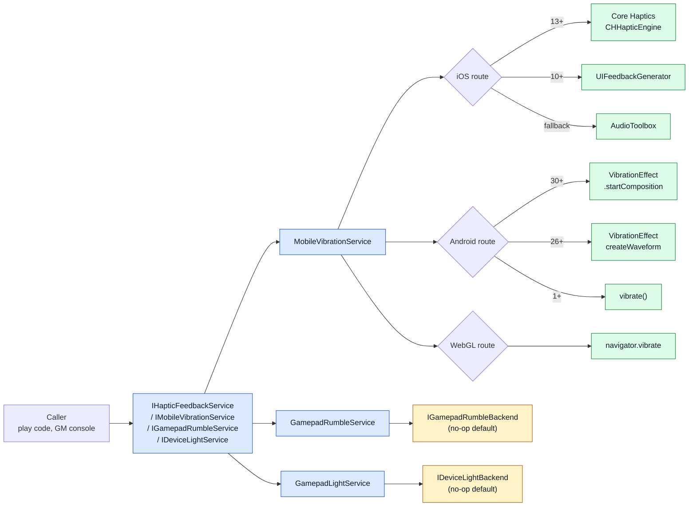

# CycloneGames.DeviceFeedback

[English | 简体中文](README.SCH.md)

CycloneGames.DeviceFeedback provides hardware-feedback abstractions and mobile vibration implementations for Unity. It packages Android, iOS, and WebGL haptic routes, a `HapticClip` asset for curve- and event-based authoring, and injectable interfaces for gamepad rumble and device light control with safe no-op defaults.

## Table of Contents

- [Overview](#overview)
- [Architecture](#architecture)
- [Quick Start](#quick-start)
- [Core Concepts](#core-concepts)
- [Usage Guide](#usage-guide)
- [Advanced Topics](#advanced-topics)
- [Common Scenarios](#common-scenarios)
- [Performance and Memory](#performance-and-memory)
- [Troubleshooting](#troubleshooting)

## Overview

A device feedback call answers one question: which hardware output should fire, at what intensity, for how long? CycloneGames.DeviceFeedback answers that with a small set of interfaces — `IHapticFeedbackService`, `IMobileVibrationService`, `IGamepadRumbleService`, `IDeviceLightService` — backed by platform-specific implementations that pick the strongest available native route at runtime.

Mobile haptics ship ready-to-use: Android uses `VibrationEffect` (API 26+) with API 30+ composition primitives, iOS uses Core Haptics (iOS 13+) with `UIFeedbackGenerator` and `AudioToolbox` fallbacks, and WebGL uses `navigator.vibrate`. Gamepad rumble and device light control use injectable backends with explicit no-op defaults so unsupported platforms and projects without a hardware backend remain deterministic.

Use this module when a project needs cross-platform haptics from one API, a designer-authored `HapticClip` asset workflow, or a clean boundary for plugging in platform-specific controller and lighting backends. Real hardware output for gamepad rumble and device light requires a separate platform integration assembly; the module only ships the contracts and a no-op fallback.

### Key Features

- **`IHapticFeedbackService`** — common interface for `IsAvailable`, `IsActive`, `Initialize`, `PlayPreset`, `Play`, `PlayCurve`, `PlayClip`, and `Cancel`.
- **`IMobileVibrationService`** — mobile extensions: pattern vibration, iOS-specific impact/notification/selection, and real-time continuous parameter modulation.
- **`MobileVibration` static facade** — same API as a singleton-style entry point for non-DI projects.
- **`HapticClip` ScriptableObject** — designer-authored asset with curve or discrete-event modes.
- **`IGamepadRumbleService` / `IDeviceLightService`** — backend-injectable contracts with explicit `NoopGamepadRumbleBackend` / `NoopDeviceLightBackend` defaults.
- **iOS Core Haptics (iOS 13+)** — transient and continuous events, parameter curves, composite patterns, and real-time modulation.
- **Android API 30+ primitives** — CLICK, TICK, LOW_TICK, and THUD composition routes with amplitude fallback.

## Architecture

| Assembly | Path | Purpose |
| --- | --- | --- |
| `CycloneGames.DeviceFeedback.Runtime` | `Runtime/` | All public contracts, `MobileVibrationService`, `GamepadRumbleService`, `GamepadLightService`, no-op backends, and `HapticClip`. References `UnityEngine`. |
| `CycloneGames.DeviceFeedback.Tests.Editor` | `Tests/Editor/` | Guard and no-op behavior tests for `GamepadRumbleService` and `GamepadLightService`. |

The runtime assembly is included on Android, iOS, WebGL, tvOS, VisionOS, Editor, and desktop standalone platforms. Mobile native plugins (`HapticFeedback.mm`, `CoreHaptics.mm` on iOS; JNI calls on Android) live alongside the C# sources and are selected by `#if UNITY_IOS` / `#if UNITY_ANDROID` blocks.



The caller invokes a service; the service routes to the strongest available native path on mobile, or forwards to an injected backend for gamepad rumble and device light. Mobile fallbacks are automatic; controller and lighting backends are explicit injections.

## Quick Start

Reference `CycloneGames.DeviceFeedback.Runtime` from your asmdef and import the namespace:

```csharp
using CycloneGames.DeviceFeedback.Runtime;
using UnityEngine;
```

### Use the static facade

```csharp
void Awake() => MobileVibration.Init();

void OnPlayerHit() => MobileVibration.PlayPreset(HapticPreset.Heavy);
void OnCollect()   => MobileVibration.Play(0.3f, 0.1f, sharpness: 0.8f);
void OnCancel()    => MobileVibration.Cancel();

void OnApplicationQuit() => MobileVibration.Shutdown();
```

`Init()` lazily constructs and initializes the singleton `MobileVibrationService`. `Shutdown()` disposes native resources (JNI, Core Haptics engine) and is safe to call from `OnApplicationQuit` or test teardown.

### Use dependency injection

```csharp
public sealed class GameManager
{
    private readonly IHapticFeedbackService _haptics;

    public GameManager(IHapticFeedbackService haptics)
    {
        _haptics = haptics;
        _haptics.Initialize();
    }

    public void OnPlayerHit() => _haptics.PlayPreset(HapticPreset.Heavy);
    public void OnCollect()   => _haptics.Play(0.3f, 0.1f, sharpness: 0.8f);
    public void OnExplosion() => _haptics.PlayClip(explosionClip);
}
```

Register `MobileVibrationService` as `IMobileVibrationService` or `IHapticFeedbackService` in your container of choice.

## Core Concepts

### Intensity, duration, and sharpness

Three parameters describe a haptic across every platform:

- **`intensity`** — `0.0` to `1.0`, normalized. Maps to amplitude on Android 26+, `CHHapticEventParameterIntensity` on iOS 13+, and `navigator.vibrate` total duration on WebGL.
- **`durationSeconds`** — seconds. Maps to a `VibrationEffect` waveform length on Android, a continuous `CHHapticEvent` on iOS 13+, and a millisecond call on WebGL.
- **`sharpness`** — `0.0` (deep/broad) to `1.0` (sharp/crisp). Native on iOS 13+ via `CHHapticEventParameterSharpness`. Approximated or ignored on other platforms.

```csharp
MobileVibration.Play(intensity: 0.8f, durationSeconds: 0.3f, sharpness: 0.9f);
```

### Presets

`HapticPreset` is a shared enum used by all feedback devices:

| Preset | Typical use |
| --- | --- |
| `Light` | Soft tap, selection confirmation. |
| `Medium` | UI button press. |
| `Heavy` | Impact, player hit. |
| `Success` | Action completed successfully. |
| `Warning` | Recoverable error or caution. |
| `Error` | Failure, denial. |
| `Selection` | Tick while scrolling or rotating. |

```csharp
MobileVibration.PlayPreset(HapticPreset.Success);
```

### HapticClip

`HapticClip` is a `ScriptableObject` created via **Assets > Create > CycloneGames > Device Feedback > Haptic Clip**. It has two modes:

**Curve mode (default)** — `intensityCurve` and `sharpnessCurve` (X: normalized time `0–1`, Y: value `0–1`) plus `duration`:

```csharp
[CreateAssetMenu] public HapticClip explosionClip;
MobileVibration.PlayClip(explosionClip);
```

**Event mode** — populate the `events` array with discrete `HapticEvent` entries:

| Field | Description |
| --- | --- |
| `type` | `Transient` (sharp tap) or `Continuous` (sustained). |
| `time` | Start time in seconds from clip start. |
| `duration` | Duration in seconds (Continuous only). |
| `intensity` | `0.0`–`1.0`. |
| `sharpness` | `0.0`–`1.0`. |

When `events` is non-empty, curves are ignored. Events map directly to `CHHapticEvent` on iOS 13+ for sample-accurate playback.

### Master switch and availability

```csharp
if (!MobileVibration.IsAvailable) return;

MobileVibration.SetActive(false);  // master switch; subsequent calls become no-ops
MobileVibration.SetActive(true);   // re-enable
```

`IsActive = false` short-circuits every call without touching native code. Each service also exposes `IsAvailable` to query whether hardware is present and initialized.

## Usage Guide

### Pattern vibration (mobile only)

```csharp
MobileVibration.Vibrate(200);                       // 200 ms
MobileVibration.Vibrate(new long[] { 0, 100, 50, 100 }, repeat: -1);  // one-shot pattern
MobileVibration.Vibrate(new long[] { 0, 100, 50, 100 }, repeat: 0);   // repeat from index 0
```

`repeat = -1` plays the pattern once. Any other index loops the pattern from that offset. Call `Cancel()` to stop a repeating pattern.

### iOS-specific feedback

```csharp
MobileVibration.VibrateIOS(IOSImpactStyle.Heavy);
MobileVibration.VibrateIOS(IOSNotificationStyle.Success);
MobileVibration.VibrateIOSSelection();
```

On iOS 13+, these route through Core Haptics transients. On iOS 10+, they fall back to `UIFeedbackGenerator`. On non-iOS platforms, they are no-ops.

### Real-time modulation (iOS 13+)

```csharp
MobileVibration.Play(intensity: 0.5f, durationSeconds: 5.0f, sharpness: 0.5f);

void Update()
{
    float intensity = Mathf.PingPong(Time.time, 1f);
    MobileVibration.UpdateContinuousParameters(intensity, sharpness: 0.7f);
}
```

`UpdateContinuousParameters` sends `CHHapticDynamicParameter` updates to the active continuous player. It is a no-op on platforms without Core Haptics.

### Gamepad rumble

```csharp
var rumble = new GamepadRumbleService();  // no-op default
rumble.Rumble(lowFrequency: 0.6f, highFrequency: 0.4f, durationSeconds: 0.2f);
rumble.SetMotorSpeeds(0.5f, 0.5f);
rumble.Cancel();
rumble.Dispose();
```

`GamepadRumbleService` defaults to `NoopGamepadRumbleBackend`. Install a real backend through the constructor:

```csharp
var rumble = new GamepadRumbleService(new MyDualSenseBackend(), ownsBackend: true);
```

The backend owns device discovery, player loop hooks, and native/Input System calls. `Play` and `PlayPreset` map intensity and sharpness to dual-motor speeds through `CalculateMotorSpeeds`; `PlayCurve` samples the curve and plays the peak.

### Device light

```csharp
var light = new GamepadLightService();  // no-op default
light.SetColor(Color.red);
light.Flash(Color.red, Color.black, onDurationSeconds: 0.1f, offDurationSeconds: 0.1f);
light.PlayGradient(myGradient, durationSeconds: 2.0f, sampleIntervalMs: 50);
light.PlayIntensityCurve(Color.blue, pulseCurve, durationSeconds: 1.5f);
light.CancelAnimation();
light.Reset();
```

Install a real `IDeviceLightBackend` (DualSense, DualShock, keyboard RGB) through the constructor. The service clamps colors, sanitizes sample intervals, and forwards after guard checks.

## Advanced Topics

### iOS Core Haptics architecture

On iOS 13+, the runtime upgrades every haptic call to Core Haptics:

- **Transient events** — `VibratePop`, `VibratePeek`, `VibrateIOS(Impact)`, `PlayPreset` use `CHHapticEventTypeHapticTransient` with calibrated intensity/sharpness pairs.
- **Continuous events** — `Play(intensity, duration, sharpness)` uses `CHHapticEventTypeHapticContinuous` for sustained haptics with precise control.
- **Composite patterns** — `VibrateNope`, `PlayClip(events)` build multi-event `CHHapticPattern` sent as a single batch.
- **Parameter curves** — `PlayCurve` converts sampled points to `CHHapticParameterCurve`; the OS handles smooth interpolation between control points.
- **Real-time modulation** — `UpdateContinuousParameters` sends `CHHapticDynamicParameter` updates each frame.

Fallback to `UIFeedbackGenerator` (iOS 10+) is automatic when Core Haptics is unavailable.

### Native player lifecycle strategies

Native implementations separate initialization, transient playback, and continuous playback so callers can control when setup work occurs.

**iOS: pre-warmed UIFeedbackGenerators** — `HapticFeedback.mm` creates seven static generator instances (Light, Medium, Heavy, Rigid, Soft impact + Notification + Selection) during initialization. Each calls `[prepare]` before first use and again after a trigger, moving generator creation out of the trigger call. OS scheduling, engine state, hardware, thermal state, and power policy still determine observed latency.

**iOS: fire-and-forget transient players** — `CoreHaptics.mm` uses two player strategies:

- **Transient haptics** (`PlayTransient`) create an ephemeral player per tap, started with `CHHapticTimeImmediate` and released by the engine after completion. They do not stop the continuous player.
- **Continuous, pattern, and curve effects** use a persistent `s_continuousPlayer` that supports `UpdateParameters` for real-time modulation. Previous continuous player is stopped before starting a new one.

The separate player slots allow transient calls without replacing the tracked continuous player; device-level mixing remains platform-controlled.

### Android API 30+ composition primitives

On Android API 30+, `PlayPreset` uses `VibrationEffect.startComposition()` with platform primitives (CLICK=1, TICK=7, LOW_TICK=8, THUD=3). Android defines these primitives for device-specific implementation. If the device does not support the requested primitive, the service falls back to the amplitude path.

### Platform fallback chains

```text
iOS:     Core Haptics (13+) → UIFeedbackGenerator (10+) → AudioToolbox
Android: Composition API (30+) → VibrationEffect (26+) → vibrate() (1–25)
WebGL:   navigator.vibrate()
```

### Platform implementation matrix

This table describes routes present in the source. It is not a hardware-validation result; browser policy, OS version, device capabilities, Player backend, and native plugin import settings can change effective behavior.

| Feature | Android | iOS (< 13) | iOS (13+) | WebGL | Editor |
| --- | --- | --- | --- | --- | --- |
| Basic vibration | Yes | Yes | Yes | Yes | No-op |
| Duration control | Yes | No | Yes (continuous) | Yes | No-op |
| Amplitude/Intensity | Yes (API 26+) | No | Yes (native) | No | No-op |
| Sharpness | No | No | Yes (native) | No | No-op |
| Vibration pattern | Yes | No | Yes (composite) | No | No-op |
| AnimationCurve waveform | Yes (API 26+) | Peak only | Yes (native curves) | Total ms | No-op |
| HapticClip events | Yes (waveform) | No | Yes (CHHapticEvent) | Total ms | No-op |
| Haptic presets | Yes | Yes (native) | Yes (Core Haptics) | Fallback | No-op |
| API 30+ primitives | Yes (CLICK/TICK/THUD) | — | — | — | No-op |
| Real-time modulation | No | No | Yes | No | No-op |
| Cancel | Yes | No | Yes | Yes | No-op |
| Gamepad rumble | Backend required | Backend required | Backend required | Backend required | No-op default |
| Device light | Backend required | Backend required | Backend required | Backend required | No-op default |

## Common Scenarios

### Gameplay haptics through DI

```csharp
public sealed class CombatController
{
    private readonly IHapticFeedbackService _haptics;
    [SerializeField] private HapticClip _explosionClip;

    public CombatController(IHapticFeedbackService haptics) => _haptics = haptics;

    public void OnLightHit()  => _haptics.Play(0.3f, 0.05f, sharpness: 0.9f);
    public void OnHeavyHit()  => _haptics.Play(0.9f, 0.15f, sharpness: 0.2f);
    public void OnExplosion() => _haptics.PlayClip(_explosionClip);
    public void OnDeath()     => _haptics.PlayPreset(HapticPreset.Error);
}
```

A single `IHapticFeedbackService` covers mobile, gamepad (with a backend), and any future haptic device — the gameplay layer never branches on platform.

### Designer-authored haptic pattern

A designer creates a `HapticClip` asset with a heartbeat rhythm:

```text
events:
  - Transient  t=0.00  intensity=0.6  sharpness=0.4
  - Transient  t=0.15  intensity=0.6  sharpness=0.4
  - Transient  t=0.30  intensity=0.6  sharpness=0.4
duration: 0.45
```

Gameplay triggers it on boss attack wind-up:

```csharp
MobileVibration.PlayClip(heartbeatClip);
```

On iOS 13+, the events map directly to `CHHapticEvent` entries with sample-accurate timing. On Android 26+, the runtime samples the events into a `VibrationEffect` waveform.

### Real-time parameter modulation

A charging mechanic ramps intensity while the player holds the trigger:

```csharp
public sealed class ChargeAttack : MonoBehaviour
{
    [SerializeField] private float _maxChargeSeconds = 2f;
    private float _chargeTime;

    void Update()
    {
        if (Input.GetButton("Fire1"))
        {
            if (_chargeTime == 0f)
            {
                MobileVibration.Play(intensity: 0.2f, durationSeconds: _maxChargeSeconds, sharpness: 0.3f);
            }

            _chargeTime = Mathf.Min(_chargeTime + Time.deltaTime, _maxChargeSeconds);
            float intensity = _chargeTime / _maxChargeSeconds;
            MobileVibration.UpdateContinuousParameters(intensity, sharpness: 0.3f + intensity * 0.4f);
        }
        else if (_chargeTime > 0f)
        {
            _chargeTime = 0f;
            MobileVibration.Cancel();
        }
    }
}
```

This pattern only modulates on iOS 13+; on other platforms, `Play` fires the initial haptic and `UpdateContinuousParameters` is a no-op.

### Gamepad rumble with platform backend

```csharp
public sealed class DualSenseRumbleBackend : IGamepadRumbleBackend
{
    private readonly DualSenseGamepad _gamepad;

    public DualSenseRumbleBackend(DualSenseGamepad gamepad) => _gamepad = gamepad;

    public bool IsAvailable => _gamepad != null;

    public void Rumble(float low, float high, float duration)
    {
        _gamepad.SetMotorSpeeds(low, high);
        // Schedule auto-stop in the player loop or a coroutine.
    }

    public void SetMotorSpeeds(float low, float high) => _gamepad.SetMotorSpeeds(low, high);
    public void Stop() => _gamepad.SetMotorSpeeds(0f, 0f);
    public void Initialize() { }
    public void Dispose() { }
}

// In the composition root:
var rumble = new GamepadRumbleService(new DualSenseRumbleBackend(dualSense), ownsBackend: true);
rumble.Rumble(0.6f, 0.4f, 0.2f);
```

The high-level service clamps inputs, applies the master switch, and translates `HapticPreset` and `Play` calls into dual-motor speeds via `CalculateMotorSpeeds`.

### Accessibility toggle

A settings panel lets players disable all haptics:

```csharp
public void SetHapticsEnabled(bool enabled)
{
    MobileVibration.SetActive(enabled);
    _gamepadRumble.IsActive = enabled;
    _deviceLight.IsActive = enabled;
}
```

When `IsActive` is `false`, every service short-circuits before reaching native code, so the player can disable feedback without changing gameplay code.

## Performance and Memory

| Path | Allocation |
| --- | --- |
| `MobileVibration.Play` / `PlayPreset` | One JNI/Core Haptics call; managed buffers reused |
| `MobileVibration.PlayCurve` | Sampling reuses `s_intensityBuf` / `s_sharpnessBuf` |
| `MobileVibration.PlayClip(events)` | Event marshaling reuses `s_typeBuf` / `s_timeBuf` / `s_durationBuf` |
| `MobileVibration.Vibrate(pattern)` | One JNI call; pattern array passed by reference |
| `GamepadRumbleService` / `GamepadLightService` calls | Zero allocation; forwarded to backend |
| `MobileVibration.Shutdown` | Disposes native engine and JNI handles |

Waveform sampling and event marshaling use shared managed buffers that grow on demand and never shrink:

```text
s_timingBuf, s_amplitudeBuf, s_floatTimeBuf,
s_intensityBuf, s_sharpnessBuf, s_typeBuf, s_durationBuf
```

`EnsureBuffers(count)` reuses managed arrays for later calls with equal or smaller counts. The long-lived Android vibrator and `VibrationEffect` class handles are cached for the service lifetime. Individual effects, compositions, and some platform queries create disposable `AndroidJavaObject` or `AndroidJavaClass` wrappers per call. Enum names used for native marshaling are held in static readonly arrays rather than produced with `ToString()` on each call.

The gamepad rumble and device light services forward to an injected backend after guard checks. Allocation behavior depends on that backend. Native mobile plugins, JNI, IL2CPP marshaling, browser interop, and buffer growth must be profiled separately on each target.

### Threading

- `MobileVibration` static facade lazily constructs the singleton service under a lock.
- `MobileVibrationService` native calls are intended for the Unity main thread; JNI and Core Haptics engine calls have their own thread affinity requirements.
- `GamepadRumbleService` and `GamepadLightService` are not thread-safe; they assume the Unity main thread or a single owner.

### Platform and AOT

The runtime assembly targets Unity 2019.3+, with native iOS plugins in Objective-C (`HapticFeedback.mm`, `CoreHaptics.mm`) and Android JNI calls through `AndroidJavaClass` / `AndroidJavaObject`. IL2CPP and AOT targets require their own Player evidence; Editor tests do not certify mobile hardware output, latency, GC behavior, WebGL browser policy, or console backends.

## Troubleshooting

| Symptom | Likely cause | Resolution |
| --- | --- | --- |
| No haptic on iOS device | `IsAvailable` is false or Core Haptics engine failed to start | Call `Initialize()` before play; check `IsAvailable` and the device log for engine errors |
| `Play` works but `UpdateContinuousParameters` does nothing | Target platform lacks Core Haptics (iOS < 13, Android, WebGL) | Use `Play` with a finite duration; modulation is iOS 13+ only |
| Android amplitude ignored on old devices | Device API level < 26 | `VibrationEffect.CreateWaveform` requires API 26+; older devices fall back to `vibrate()` |
| Sharpness has no effect | Platform does not expose sharpness | Only iOS 13+ Core Haptics consumes sharpness natively |
| Gamepad rumble is silent | No backend installed or backend `IsAvailable` is false | Install a real `IGamepadRumbleBackend` through the constructor |
| Device light does not change | No backend installed | Install a real `IDeviceLightBackend` |
| `Vibrate(pattern, repeat)` loops forever | `repeat` is not `-1` and `Cancel` was never called | Call `MobileVibration.Cancel()` when the loop should stop |
| WebGL haptic silently fails | Browser blocked `navigator.vibrate` | Require a user gesture before calling, or treat WebGL as no-haptic |
| Haptic fires once then stops | `IsActive` was set to `false` or service was disposed | Check `IsActive` and ensure `Shutdown` is only called on teardown |

## Validation

Run focused tests from Unity Test Runner:

```text
<UnityEditor> -batchmode -nographics -projectPath <repo-root>/UnityStarter -runTests -testPlatform EditMode -assemblyNames CycloneGames.DeviceFeedback.Tests.Editor -testResults <result-path> -quit
```

The Editor test suite covers guard and no-op behavior for `GamepadRumbleService` and `GamepadLightService`. Mobile hardware output, latency, GC behavior, WebGL browser policy, and console backends must be validated separately on each target device.

## References

- [Core Haptics](https://developer.apple.com/documentation/corehaptics) — iOS haptic engine.
- [Android VibrationEffect](https://developer.android.com/reference/android/os/VibrationEffect) — Android vibration API.
- [Web Vibration API](https://developer.mozilla.org/en-US/docs/Web/API/Vibration_API) — browser vibration standard.
