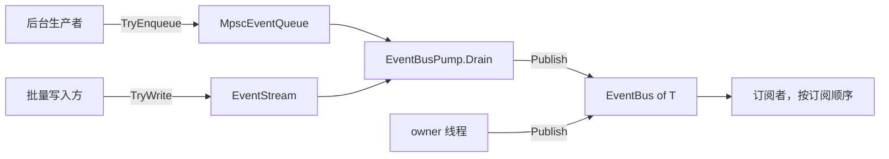

# CycloneGames.EventBus

[English | 简体中文](README.md)

CycloneGames.EventBus 是面向 Unity 与纯 C# 宿主的零分配一对多通知总线。它把通常被混在一起的三件事分开：一条不分配、不加锁的同步派发路径；一座给异线程生产者使用的有界桥；以及一个带显式成本上限的帧调度排空点。总线本身是单线程密闭且无锁的，跨线程是一个显式动作，而不是一种环境属性。

## 目录

- [概述](#概述)
- [架构](#架构)
- [快速上手](#快速上手)
- [核心概念](#核心概念)
- [使用指南](#使用指南)
- [进阶主题](#进阶主题)
- [常见场景](#常见场景)
- [性能与内存](#性能与内存)
- [诊断](#诊断)
- [故障排查](#故障排查)
- [验证](#验证)

## 概述

事件总线回答一个问题：某件事发生时，哪些处理器会运行、按什么顺序、付出多少成本？CycloneGames.EventBus 用一组小类型回答，每一个类型只负责一个答案。

- `EventBus<T>` 负责同步派发。`Publish` 是一棵确定性的调用树：处理器按订阅顺序运行，在所有平台和所有脚本后端上一致，没有优先级、没有重排、没有异步完成。正常路径上派发是零分配的。
- `MpscEventQueue<T>` 负责线程边界。任意数量的后台线程入队，恰好一个 owner 线程排空到总线。有界、无锁、两侧都零分配。
- `EventStream<T>` 负责批处理。写入 N 个事件，在调用方选定的时刻一次性 flush，可选单次 flush 预算。
- `EventBusPump` 负责帧调度。由一个地方决定缓冲源何时排空、一帧允许花多少。

适用场景：

- 多个监听者需要对同一个事件做出反应，而发布者不需要知道它们是谁。
- 通知路径不能分配内存、不能加锁，并且需要能逐帧剖析。
- 异线程生产者（网络、资源加载、Job 完成回调）需要触达主线程 gameplay，但不应把总线变成线程安全的。

不要把它当作异步消息队列、网络传输层或持久化日志使用。它不提供跨进程投递保证、不做持久化，也不提供有界容器之外的背压。

### 主要特性

- **零分配 `Publish`**：派发路径上没有托管分配、没有装箱、没有 LINQ、没有闭包、没有字符串格式化、没有日志。
- **单线程密闭且无锁**：密闭既是安全保证，也是零分配的前提，因此 `Publish` 不加锁。
- **确定性顺序**：处理器按订阅顺序运行；派发期间的结构变更语义有文档、有测试。
- **自动压缩**：退订留下 tombstone，压缩按摊还触发，订阅句柄被池化，因此稳态下订阅/退订抖动是零分配的。
- **有界跨线程桥**：Vyukov 风格的 MPSC 环，并且把"被拒绝"和"已丢失"分开计数。
- **显式错误策略**：单个坏订阅者不会静默地让其他订阅者失去投递。
- **纯 C# 核心**：`noEngineReferences: true`，无 `unsafe`、无反射、无动态代码生成、无 P/Invoke。

## 架构

| 程序集 | 路径 | 职责 |
| --- | --- | --- |
| `CycloneGames.EventBus.Core` | `Core/` | 总线、配置、容器、命令端口、诊断。不引用 `UnityEngine`。 |
| `CycloneGames.EventBus.Runtime` | `Runtime/` | 组合根门面、帧 pump、`MonoBehaviour` 宿主。 |
| `CycloneGames.EventBus.Editor` | `Editor/` | 只读诊断窗口，仅 Editor 平台。 |
| `CycloneGames.EventBus.Integrations.Logging` | `Integrations/Logging/` | `IEventBusLogSink` 到 CycloneGames.Logging 的适配器。 |
| `CycloneGames.EventBus.Runtime.Integrations.R3` | `Runtime/Integrations/R3/` | 双向 `Observable<T>` 桥。仅在存在 `com.cysharp.r3` 时启用。 |
| `CycloneGames.EventBus.Runtime.Integrations.UniTask` | `Runtime/Integrations/UniTask/` | `WaitAsync` 一次性等待器。仅在存在 `com.cysharp.unitask` 时启用。 |
| `CycloneGames.EventBus.Runtime.Integrations.VitalRouter` | `Runtime/Integrations/VitalRouter/` | 基于 VitalRouter `Router` 的适配器。仅在存在该包时启用。 |
| `CycloneGames.EventBus.Tests.EditMode` | `Tests/EditMode/` | 总线、流、环、作用域契约。 |
| `CycloneGames.EventBus.Tests.Integrations` | `Tests/EditMode.Integrations/` | 关闭边界、pump 语义、所有权、集成适配器。 |



从其他线程进入总线唯一受支持的路径是：先入队到容器，再由 pump 在 owner 线程排空。`EventBus<T>` 永远不变为线程安全。

### 依赖方向

`Core` 只依赖 BCL。`Runtime` 依赖 `Core` 与 `UnityEngine`。`Editor` 依赖 `Core` 与 `Runtime`。每个集成程序集依赖 `Core` 加它自己的第三方包，绝不反向。测试程序集通过 `InternalsVisibleTo` 访问内部不变量，从而在不扩大公开 API 的前提下保持可测试性。

## 快速上手

只用总线时引用 `CycloneGames.EventBus.Core`；需要 `MonoBehaviour` 或组合根门面时引用 `CycloneGames.EventBus.Runtime`。

```csharp
using CycloneGames.EventBus.Core;

public struct DamageEvent
{
    public int TargetId;
    public int Amount;
}
```

### 订阅与发布

```csharp
var bus = new EventBus<DamageEvent>();

// 缓存委托：bus.Subscribe(OnDamage) 每次调用都会分配新委托，
// 因为 C# 不会缓存实例方法组转换。
Action<DamageEvent> handler = OnDamage;
IEventSubscription subscription = bus.Subscribe(handler);

bus.Publish(new DamageEvent { TargetId = 7, Amount = 12 });

subscription.Dispose();

static void OnDamage(DamageEvent evt)
{
    // 同步运行，运行在发布者线程上。
}
```

### 一次性释放成组订阅

```csharp
var scope = new SubscriptionScope();
scope.Add(bus, handler);
scope.Add(otherBus, otherHandler);

// 释放作用域会释放它记录的全部订阅。
scope.Dispose();
```

`EventBusScopeMonoBehaviour` 把作用域绑定到 `GameObject` 生命周期，因此模式、窗口或控制器根节点可以通过 `Scope` 订阅，并在销毁时自动释放。

### 跨线程边界

```csharp
var queue = new MpscEventQueue<DamageEvent>(capacity: 1024);
var pump = new EventBusPump();
pump.AddQueue(queue, bus);

// 任意线程：
queue.TryEnqueue(new DamageEvent { TargetId = 7, Amount = 12 });

// owner 线程，每帧一次：
pump.Drain(maxEventsPerTarget: 256, maxEventsPerTick: 2048);
```

环满时 `TryEnqueue` 返回 `false`。此后该事件由调用方决定重试、丢弃还是计数；队列无法知道调用方的意图。

## 核心概念

### 线程模型

`EventBus<T>` 是单线程密闭的。`Subscribe`、`Unsubscribe`、`Publish`、`Compact`、`Clear` 与 `Dispose` 必须全部运行在同一个 owner 线程上——在 Unity 中即主线程。这是硬契约而非偏好：密闭正是 `Publish` 能够无锁且零分配的前提。

触达密闭总线只有两种受支持的方式：

1. **仅 owner 线程**：直接调用 `Publish`。
2. **异线程**：入队到 `MpscEventQueue<T>` 或 `EventStream<T>`，由 `EventBusPump` 在 owner 线程排空。

在异线程上触发、且必须释放订阅的回调，使用 `EventBus<T>.ScheduleRemoval` 而不是直接释放句柄。延迟移除会在 owner 线程的下一个入口点被应用。UniTask 适配器在取消令牌由线程池线程触发时走的正是这条路径。

### 派发期间的结构变更

语义是定义清晰且有测试覆盖的，因此处理器可以安全地修改订阅集合：

| 变更 | 效果 |
| --- | --- |
| 在 `Publish` 中订阅 | 新处理器本轮不会触发；它落在进入时捕获的槽位数量快照之上或之后。 |
| 在 `Publish` 中退订 | 从它的槽位读到 null 的那一刻起被跳过，因此移除后续处理器的处理器可以在同一轮内抑制它。 |
| 在 `Publish` 中压缩 | 永不在派发中途运行。退订会给总线打标记，由最外层派发帧在退出时执行一次原地压缩。 |
| 在 `Publish` 中调用 `Compact()` 或 `Clear()` | 抛出 `InvalidOperationException`：槽位下标会在迭代中发生位移。 |
| 在 `Publish` 中调用 `Dispose()` | 延迟。该轮是原子的（剩余处理器仍会运行），`IsDisposed` 立即变为 true，由最外层派发帧在退出时拆除总线。 |

### 错误策略

`PublishErrorPolicy` 决定订阅者抛异常时的行为。没有任何策略会在不留下计数器或异常的情况下丢弃故障。

| 策略 | 行为 | 适用 |
| --- | --- | --- |
| `Stop` | 首个异常立即传播，剩余处理器被跳过，原始栈保留。 | 小规模总线、需要快速失败的调试。 |
| `Swallow` | 所有处理器都运行，故障被记录并计数，`Publish` 正常返回。 | 尽力而为的表现层监听者：伤害数字、音频、特效。 |
| `ContinueOnError` | 所有处理器都运行，随后首个异常带着原始栈被重新抛出。后续异常只记录和计数，不再抛出。 | 大型项目的默认值。 |

在订阅者超过寥寥几个的总线上，`Stop` 意味着一个坏监听者会静默地让之后每一个监听者失去投递——这是大型项目中最难定位的失败模式。`ContinueOnError` 正是因此成为默认值。

### 重入上限

`MaxDispatchDepth`（默认 `64`）限制递归发布。无界递归发布链是设计错误，其代价是栈溢出，而任何平台都无法从栈溢出中恢复。超过上限的发布会被丢弃、计入 `DroppedReentrantCount`，并以 `Warning` 级别经日志 sink 上报。否则超限在调用点是完全静默的，所以默认值刻意设得宽松：gameplay 事件级联每跳只消耗一层，合法链路不应触及它。

### 命令端口

`ICommandPublisher` 是总线之外的一个定向、且可能异步的对应物：

```csharp
ValueTask PublishAsync<TCommand>(in TCommand command, CancellationToken cancellationToken = default)
    where TCommand : struct;
```

`InProcessCommandPublisher` 是无依赖实现。它立即派发命令；若已有处理器在运行（重入发布），命令会进入有界队列，并在当前处理器完成后按序排空。溢出时应用 `CommandOverflowPolicy`：`Drop` 静默丢弃，`FailFast` 抛异常。

命令负载在重入路径上会被装箱进队列闭包。这是可接受的，因为命令路径不是零分配热路径——`EventBus<T>` 才是。写在这里是为了不让这项成本变成意外。

更换后端通过 builder 而不是配置：

```csharp
using EventBusContext context = new EventBusBuilder()
    .WithConfiguration(configuration)
    .WithCommandPublisherFactory(cfg => new MyRouterPublisher(cfg))
    .Build();
```

## 使用指南

### 选择容器

| 需求 | 类型 | 理由 |
| --- | --- | --- |
| 在 owner 线程上立即触发事件 | `EventBus<T>.Publish` | 同步、确定性、零分配 |
| 把事件从其他线程搬到 owner 线程 | `MpscEventQueue<T>` + `EventBusPump` | 有界、无锁、可观测背压 |
| 一帧内写入大量事件并在选定时刻派发 | `EventStream<T>` + `EventBusPump` | 顺序写入、flush 点显式、可预算 |
| 异步等待一个事件 | `EventBusUniTaskExtensions.WaitAsync` | 一个订阅加一个完成源 |
| 把总线接入响应式管线 | `EventBusObservableExtensions.ToObservable` | R3 桥，只在冷路径分配 |
| 把命令路由到单个处理器 | `ICommandPublisher` | 定向，而非一对多 |

`EventStream<T>` 与 `MpscEventQueue<T>` 看起来相似但不可互换。流是 owner 线程密闭的，存在意义是让 flush 点显式；环是多生产者，存在意义是跨越线程边界。当批量写入方与后台生产者都要喂同一个总线时，两者都会用到。

### 容器容量定档

容量在构造时固定且永不增长；容器满时拒绝并计数，因此失控的生产者无法分配内存。

- `EventBus<T>` 的 `initialCapacity` 按预期稳态订阅者数量定档。这样可以避免订阅路径上的每一次数组增长，并消除预热阶段的 GC 尖峰。用 `PeakSubscriptionCount` 报告的高水位来实测定档。
- 流的容量按最坏帧定档，而不是平均帧。拒绝会计入 `RejectedCount`，它是"容量太小"或"漏了一次 flush"的信号。
- 环的容量按你愿意持有的最大积压定档。满时生产者会观察到 `false`；重试是正常的背压响应，这种模式下 `RejectedCount` 很大是正常的。

### 生命周期与所有权

`EventBusContext` 是带显式释放顺序的组合根门面：先释放订阅，再释放子作用域，再释放自有总线，最后释放命令后端。总线所有权在注册调用点显式可见：

| 方法 | 所有权 |
| --- | --- |
| `RegisterBus<T>` | 调用方所有。Context 不释放它；按契约它的生命周期长于 context。 |
| `RegisterOwnedBus<T>` | 所有权转移给 context。`Dispose` 会释放它。 |
| `GetOrCreateBus<T>` | 由 context 创建并拥有。 |

这里刻意不提供进程级单例。宿主持有一个 context 实例并按需传递。`EventBusGlobal<T>` 的存在是为完全没有组合根的代码，它带有通常的 Service Locator 代价：依赖变得隐式、测试必须重置状态。凡是有组合根的地方，优先使用构造函数注入或 context。

### 退订

两种机制，成本不同，失败模式也不同：

- **句柄**：`Subscribe` 返回一个 `IEventSubscription`，`Dispose` 时退订。O(1)。幂等。总线已释放后再释放句柄是安全的空操作，这正是延迟拆除（`OnDestroy` 晚于 context 结束）安全的原因。
- **标识**：`Unsubscribe(Action<T>)` 移除第一个持有该委托的槽位，返回是否找到，是线性扫描。它同时会解除该槽位所属句柄的绑定，因此之后释放该句柄是空操作，而不会发生第二次移除。以委托本身作键时用标识退订；需要 O(1) 与显式所有权时用句柄。

绝不要持有一个已释放的句柄并期望之后重新订阅。句柄是被池化复用的；一个被保留的已释放句柄会指向另一个订阅。请重新调用 `Subscribe`。

## 进阶主题

### 在长跑总线上回收内存

容量按设计保留：压缩在原地移除 tombstone 且永不缩容，因此稳态下完全不做数组操作。对逐帧总线这是正确的默认值，对一个峰值负载只出现一次、之后不会再出现的进程则是错误的默认值。`Compact()` 可按需回收 tombstone 槽位；模块不提供自动缩容。

### 给病态帧设上界

per-target 排空预算约束单个源的积压——这是公平性属性，用于阻止被灌满的队列饿死邻居。它不约束帧成本，因为它会乘以已注册源的数量。真正约束帧的是 per-tick 预算：

```csharp
// 每个源最多 256 个事件；整次排空最多 4096 个事件。
int published = pump.Drain(maxEventsPerTarget: 256, maxEventsPerTick: 4096);
```

`maxEventsPerTick` 为 `0` 表示暂停发布但不注销任何源。传负值会被拒绝，而不会被解读为"无上限"。

`EventBusPumpMonoBehaviour` 把这两个预算暴露为序列化字段与运行时属性，因此场景或构建可以在不改代码的前提下调整：`MaxEventsPerTargetPerFrame`（默认 1024）与 `MaxEventsPerFrame`（默认 8192）。在宿主上，per-frame 上限为 0 或负值表示**不再额外限流**，而不是"暂停"——暂停请用 `PumpingEnabled`。这样在该字段存在之前就已序列化的组件会保持原有行为，而不会静默地什么都不投递。

### 降低高频事件的投递量

容器提供背压、预算与拒绝；它们都不做合并。如果同一个逻辑事实在一帧内被广播很多次——例如每次伤害结算都会变化的血量值，或被多个系统轮询的进度值——每一次发布都是对每个订阅者的一次完整派发，而中间值在被算出来之后立刻被接收方丢弃。

两个选择，按推荐程度排序：

1. **少发。** 在生产者处用变化值判断或频率门控。
2. **批量写入、一次 flush。** 把生产者接到 `EventStream<T>`，每帧 flush 一次，N 次写入变成一个显式派发点。

合并（取最新值）不属于本模块；需要它的调用方应自己持有槽位并决定哪个值保留下来。

### 被遗弃的总线

`EventBus<T>` 不提供判断委托目标对象是否仍然存活的手段。在 Unity 中，被销毁的 `MonoBehaviour` 作为委托目标依然有效，因此残留处理器会继续被调用，其异常会像其他故障一样由 `PublishErrorPolicy` 路由。请显式释放订阅，优先通过 `ISubscriptionScope` 或 `EventBusScopeMonoBehaviour`。

## 常见场景

### Gameplay 通知

```text
gameplay 系统 -> Publish(EventBus<DamageEvent>) -> 伤害数字、音频、特效、任务、成就
```

使用 `ContinueOnError`，这样坏掉的表现层监听者不会阻止 gameplay 系统接收事件。

### 跨线程入口

```text
网络线程 / Job 线程
    -> MpscEventQueue.TryEnqueue  （有界，满则拒绝）
    -> EventBusPump.Drain         （owner 线程，每帧一次，带预算）
    -> EventBus.Publish           （同步、确定性）
```

总线成为异线程数据进入 gameplay 的唯一入口，排空预算成为该入口的帧成本上限。

### owner 线程批量生产者

```text
生成器在一帧内写入 500 个事件
    -> EventStream.TryWrite        （顺序写入，无逐事件派发成本）
    -> EventBusPump.Drain          （单一 flush 点，可预算）
    -> EventBus.Publish            （按写入顺序）
```

这让派发时机变得显式，而不是与帧内其他工作交错在一起。

### 等待单个事件

```csharp
DamageEvent evt = await bus.WaitAsync(evt => evt.TargetId == 7, cancellationToken);
```

一个订阅加一个完成源。这是序列编排构件，不是逐帧路径。这里刻意不提供对总线的异步可枚举：总线没有完成语义也没有背压，因此一个开放的异步流就是多数调用方会忘记释放的无界订阅。

## 性能与内存

| 路径 | 复杂度 | 模块自有分配 | 说明 |
| --- | --- | --- | --- |
| `Publish` | `O(订阅者数)` | 0 字节 | 每个存活处理器一次间接委托调用 |
| `Subscribe` | 摊还 `O(1)` | 稳态 0 字节 | 句柄池化；无 tombstone 时不扫描 |
| `IEventSubscription.Dispose` | 摊还 `O(1)` | 0 字节 | 每个槽位记录自己的句柄 |
| `Unsubscribe(Action<T>)` | `O(槽位数)` | 0 字节 | 线性标识扫描 |
| `Compact` | `O(槽位数)` | 0 字节 | 原地、不缩容、按退订次数摊还 |
| `TryEnqueue` / `TryDequeue` | `O(1)` | 0 字节 | Vyukov 环，逐槽序号 |
| `EventStream.TryWrite` | `O(1)` | 0 字节 | 环形写入 |
| `EventStream.FlushTo` | `O(已 flush 数)` | 0 字节 | 头指针推进；任意预算下都无元素搬移 |
| `EventBusPump.Drain` | `O(源数量)` | 0 字节 | 加上被排空的事件 |

### 线程

- `EventBus<T>`、`EventStream<T>`、`EventBusPump`、`EventBusContext`、`SubscriptionScope`、`EventBusGlobal<T>` 为单线程密闭。
- `MpscEventQueue<T>` 为多生产者单消费者：`TryEnqueue` 与 `Close` 可从任意线程调用，`TryDequeue`、`FlushTo`、`Clear` 仅限 owner 线程。
- `EventBus<T>.ScheduleRemoval` 可从任意线程调用，是总线上唯一的跨线程成员。
- 同步原语仅限 `Interlocked` 与 `Volatile`。派发路径上没有锁、没有 sleep、没有无界重试自旋、不创建线程。

### 平台行为

`Core` 程序集在所有平台启用，不引用 `UnityEngine`、不引用平台 SDK、无 unsafe 代码、无原生插件、无反射。它不使用动态代码生成，因此在 IL2CPP、AOT 与 managed stripping 下是安全的。在单线程 WebGL 上，`Interlocked`/`Volatile` 屏障会被编译掉，环退化为普通 FIFO；行为不变，只是它原本要保护的并发并不存在。

模块中唯一的引擎耦合是 `Runtime/` 下的两个 `MonoBehaviour` 宿主。非 Unity 宿主用自身的 tick 驱动替换它们，其余 `EventBusPump`、`EventBusContext` 与各容器可直接复用。

发布验证应在目标脚本后端下运行 EditMode 测试套件，并用目标 Player 与 Profiler 确认派发分配与帧成本。Editor 的数字不能替代这些验证。

## 诊断

`IEventBusDiagnostics` 只暴露计数，从不暴露内部集合：

| 计数器 | 含义 |
| --- | --- |
| `SubscriptionCount` | 存活订阅者数。 |
| `TombstoneCount` | 退订留下的死槽位。受压缩比例约束。 |
| `PublishCount` | 自构造以来成功的派发次数。 |
| `DroppedReentrantCount` | 被重入上限拒绝的发布次数。 |
| `SubscriberErrorCount` | 按策略处理过的订阅者异常数。 |
| `PeakSubscriptionCount` | 存活订阅者数最高水位，用于定档 `initialCapacity`。 |
| `DispatchDepth` | 当前嵌套深度；空闲时为 0。 |

`EventBusContext.GetDiagnosticsSnapshot` 跨已注册总线聚合。`Tools/CycloneGames/EventBus/Debugger` 只读渲染它，并采用保留式模型，使 `OnGUI` 重绘不分配内存。

在容器上，`RejectedCount` 与 `DroppedCount` 被刻意分开。被容器拒绝的写入不是丢失——调用方可以重试——而进入容器后未被读取即被丢弃的事件才是确认的丢失。把这两者混为一谈会让线下排查无法进行。

## 故障排查

| 现象 | 可能原因 | 处理 |
| --- | --- | --- |
| `Publish` 抛 `ObjectDisposedException` | 总线已释放但仍有引用被持有 | 通过作用域释放订阅，并在释放宿主前停止发布 |
| 处理器不触发 | 在派发轮内订阅，或订阅的是另一个总线实例 | 轮内订阅的处理器从下一轮开始触发；确认发布的是你订阅的那个总线 |
| `Compact` 或 `Clear` 抛 `InvalidOperationException` | 在处理器内部调用 | 结构压缩会自动延迟；不要在派发期间调用它们 |
| `DroppedReentrantCount` 增长 | 处理器发布了自己所属的事件类型，直接或经由环路 | 打断环路，或拆分事件类型 |
| `EventBusPump.Drain` 抛 "not re-entrant" | flush 回调排空了正在排空它的 pump | 拆成第二个 pump，或推迟到下一 tick |
| 后台线程的事件丢失 | 直接发布到总线而非入队 | 在 owner 线程发布；用 `MpscEventQueue<T>` 加 `EventBusPump` 跨越边界 |
| 反复出现派发深度上限的警告 | 合法级联比 `MaxDispatchDepth` 更深 | 提高 `MaxDispatchDepth`，但先确认是否存在环路 |
| `TombstoneCount` 持续增长 | 订阅者的增删速度快于压缩比例能吸收的速度 | 用活动标志门控订阅，而不要让它抖动 |
| Profiler 里看到分配 | 分配发生在处理器里，而不是 `Publish` 里 | 剖析完整调用路径；`Publish` 本身不分配 |

## 验证

从 Unity Test Runner 运行测试套件，或使用命令行：

```text
<UnityEditor> -batchmode -nographics -projectPath <repo-root>/UnityStarter -runTests -testPlatform EditMode -assemblyNames CycloneGames.EventBus.Tests.EditMode -testResults <result-path> -quit
<UnityEditor> -batchmode -nographics -projectPath <repo-root>/UnityStarter -runTests -testPlatform EditMode -assemblyNames CycloneGames.EventBus.Tests.Integrations -testResults <result-path> -quit
```

`CycloneGames.EventBus.Tests.Integrations` 仅在 `UNITY_INCLUDE_TESTS`、R3 与 UniTask 同时存在时参与编译。

## 内存所有权

除 `EventBusGlobal<T>` 外，本包不保留任何进程级可变引用状态；`EventBusGlobal<T>` 是显式选择加入的持有者，并提供 `ClearIf` 以应对延迟拆除。每个容器在实例生命周期内持有自身存储，并在 `Dispose` 时释放；每个句柄池都是有界的。若要新增进程级可变状态，需要重新做一次所有权与容量评审。
