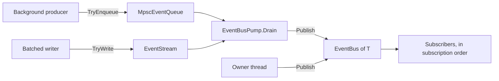

# CycloneGames.EventBus

[English | 简体中文](README.SCH.md)

CycloneGames.EventBus is a zero-allocation one-to-many notification bus for Unity and pure C# hosts. It separates three concerns that are usually conflated: a synchronous dispatch path with no allocation and no locks, a bounded bridge for producers that live on other threads, and a frame-scheduled drain with an explicit cost ceiling. The bus itself is single-thread-confined and lock-free; crossing a thread boundary is an explicit act, not an ambient property.

## Table of Contents

- [Overview](#overview)
- [Architecture](#architecture)
- [Quick Start](#quick-start)
- [Core Concepts](#core-concepts)
- [Usage Guide](#usage-guide)
- [Advanced Topics](#advanced-topics)
- [Common Scenarios](#common-scenarios)
- [Performance and Memory](#performance-and-memory)
- [Diagnostics](#diagnostics)
- [Troubleshooting](#troubleshooting)
- [Validation](#validation)

## Overview

An event bus answers one question: when something happens, which handlers run, in what order, and at what cost? CycloneGames.EventBus answers with a small set of types, each owning one answer.

- `EventBus<T>` owns synchronous dispatch. `Publish` is a deterministic call tree: handlers run in subscription order, on every platform and every scripting backend, with no priority, no reordering and no async completion. Dispatch is zero-allocation on the happy path.
- `MpscEventQueue<T>` owns the thread boundary. Any number of background threads enqueue; exactly one owner thread drains into the bus. Bounded, lock-free, allocation-free on both sides.
- `EventStream<T>` owns batching. Write N events, flush once, at a moment the caller chooses, with an optional per-flush budget.
- `EventBusPump` owns frame scheduling. One place decides when buffered sources are drained and how much a frame may spend.

Use this module when:

- Many listeners must react to one event without the publisher knowing them.
- The notification path must not allocate, must not take a lock, and must be profiled frame by frame.
- Cross-thread producers (networking, asset loading, job completion) must reach main-thread gameplay without the bus becoming thread-safe.

Do not use this module as an async message queue, a networked transport, or a durable log. It has no delivery guarantee across process boundaries, no persistence, and no backpressure beyond what a bounded container provides.

### Key features

- **Zero-allocation `Publish`** — no managed allocation, no boxing, no LINQ, no closure, no string formatting, no logging on the dispatch path.
- **Single-thread-confined and lock-free** — confinement is the safety guarantee and the precondition for zero allocation, so `Publish` takes no lock.
- **Deterministic ordering** — handlers run in subscription order; structural changes during dispatch have documented, tested semantics.
- **Automatic compaction** — unsubscribe leaves tombstones, compaction is amortized, and subscription handles are pooled so subscribe/unsubscribe churn is allocation-free in steady state.
- **Bounded cross-thread bridge** — a Vyukov-style MPSC ring with rejection and drop counters that distinguish "refused" from "lost".
- **Explicit error policy** — one broken subscriber cannot silently cost the others their delivery.
- **Pure C# core** — `noEngineReferences: true`, no `unsafe`, no reflection, no dynamic code generation, no P/Invoke.

## Architecture

| Assembly | Path | Purpose |
| --- | --- | --- |
| `CycloneGames.EventBus.Core` | `Core/` | Bus, configuration, containers, command port, diagnostics. No `UnityEngine` reference. |
| `CycloneGames.EventBus.Runtime` | `Runtime/` | Composition facade, frame pump, and the `MonoBehaviour` hosts. |
| `CycloneGames.EventBus.Editor` | `Editor/` | Read-only diagnostics window. Editor platform only. |
| `CycloneGames.EventBus.Integrations.Logging` | `Integrations/Logging/` | `IEventBusLogSink` adapter for CycloneGames.Logging. |
| `CycloneGames.EventBus.Runtime.Integrations.R3` | `Runtime/Integrations/R3/` | `Observable<T>` bridge, both directions. Enabled only when `com.cysharp.r3` is present. |
| `CycloneGames.EventBus.Runtime.Integrations.UniTask` | `Runtime/Integrations/UniTask/` | `WaitAsync` one-shot waiter. Enabled only when `com.cysharp.unitask` is present. |
| `CycloneGames.EventBus.Runtime.Integrations.VitalRouter` | `Runtime/Integrations/VitalRouter/` | Adapter over a VitalRouter `Router`. Enabled only when the VitalRouter package is present. |
| `CycloneGames.EventBus.Tests.EditMode` | `Tests/EditMode/` | Bus, stream, ring, and scope contracts. |
| `CycloneGames.EventBus.Tests.Integrations` | `Tests/EditMode.Integrations/` | Shutdown edges, pump semantics, ownership, and integration adapters. |



The only supported route from another thread into a bus is enqueue into a container; the pump drains it on the owner thread. `EventBus<T>` never becomes thread-safe.

### Dependency rules

`Core` depends on the BCL only. `Runtime` depends on `Core` and `UnityEngine`. `Editor` depends on `Core` and `Runtime`. Each integration assembly depends on `Core` plus its own third-party package, and never the other way round. Test assemblies use `InternalsVisibleTo` so internal invariants stay testable without widening the public API.

## Quick Start

Add an asmdef reference to `CycloneGames.EventBus.Core` for the bus alone, or `CycloneGames.EventBus.Runtime` when a `MonoBehaviour` or the composition facade is needed.

```csharp
using CycloneGames.EventBus.Core;

public struct DamageEvent
{
    public int TargetId;
    public int Amount;
}
```

### Subscribe and publish

```csharp
var bus = new EventBus<DamageEvent>();

// Cache the delegate: `bus.Subscribe(OnDamage)` allocates a new delegate per call,
// because C# does not cache instance method group conversions.
Action<DamageEvent> handler = OnDamage;
IEventSubscription subscription = bus.Subscribe(handler);

bus.Publish(new DamageEvent { TargetId = 7, Amount = 12 });

subscription.Dispose();

static void OnDamage(DamageEvent evt)
{
    // Runs synchronously, on the publishing thread.
}
```

### Release a group of subscriptions at once

```csharp
var scope = new SubscriptionScope();
scope.Add(bus, handler);
scope.Add(otherBus, otherHandler);

// Disposing the scope releases every subscription it recorded.
scope.Dispose();
```

`EventBusScopeMonoBehaviour` binds a scope to a `GameObject` lifetime, so a mode, window, or controller root can subscribe through `Scope` and be released on destroy.

### Cross a thread boundary

```csharp
var queue = new MpscEventQueue<DamageEvent>(capacity: 1024);
var pump = new EventBusPump();
pump.AddQueue(queue, bus);

// Any thread:
queue.TryEnqueue(new DamageEvent { TargetId = 7, Amount = 12 });

// Owner thread, once per frame:
pump.Drain(maxEventsPerTarget: 256, maxEventsPerTick: 2048);
```

`TryEnqueue` returns `false` when the ring is full. The event is then the caller's to retry, drop, or count; the queue cannot know which was intended.

## Core Concepts

### Thread model

`EventBus<T>` is single-thread-confined. `Subscribe`, `Unsubscribe`, `Publish`, `Compact`, `Clear` and `Dispose` must all run on one owner thread — in Unity, the main thread. This is a hard contract, not a preference: confinement is what allows `Publish` to be lock-free and allocation-free.

There are exactly two sanctioned ways to reach a confined bus:

1. **Owner thread only** — call `Publish` directly.
2. **Foreign threads** — enqueue into an `MpscEventQueue<T>` or `EventStream<T>` and let an `EventBusPump` drain it on the owner thread.

A callback that fires on a foreign thread and must release a subscription uses `EventBus<T>.ScheduleRemoval` instead of disposing the handle directly. Deferred removals are applied on the owner thread at the next entry point. That path is also what the UniTask adapter uses when a cancellation token is cancelled from a thread-pool thread.

### Structural changes during dispatch

The semantics are defined and covered by tests, so a handler can safely mutate the subscription set:

| Change | Effect |
| --- | --- |
| Subscribe during `Publish` | The new handler never fires in that round; it lands at or beyond the slot-count snapshot taken on entry. |
| Unsubscribe during `Publish` | Skipped from the moment its slot reads null, so a handler that removes a later handler suppresses it within the same round. |
| Compaction during `Publish` | Never runs mid-dispatch. An unsubscribe marks the bus and the outermost dispatch frame performs a single in-place compaction on exit. |
| `Compact()` or `Clear()` during `Publish` | Throws `InvalidOperationException`: slot indices would shift under the active iteration. |
| `Dispose()` during `Publish` | Deferred. The round is atomic (remaining handlers still run), `IsDisposed` turns true immediately, and the outermost dispatch frame tears the bus down on exit. |

### Error policy

`PublishErrorPolicy` decides what happens when a subscriber throws. No policy discards a fault without leaving a counter or an exception behind.

| Policy | Behaviour | Use for |
| --- | --- | --- |
| `Stop` | The first exception propagates immediately and the remaining handlers are skipped. Original stack preserved. | Small buses, fail-loud debugging. |
| `Swallow` | Every handler runs, the fault is logged and counted, `Publish` returns normally. | Best-effort presentation listeners: damage numbers, audio, VFX. |
| `ContinueOnError` | Every handler runs, then the first exception is rethrown with its original stack. Later exceptions are logged and counted but not rethrown. | The default for large projects. |

On a bus with more than a handful of subscribers, `Stop` means one broken listener silently costs every later listener its delivery — the failure mode that is hardest to trace. `ContinueOnError` is the default for that reason.

### Re-entrancy ceiling

`MaxDispatchDepth` (default `64`) bounds recursive publish. An unbounded recursive publish chain is a design error whose alternative is a stack overflow, which no platform can recover from. A publish that exceeds the ceiling is dropped, counted in `DroppedReentrantCount`, and reported through the log sink at `Warning`. Exceeding the ceiling is silent at the call site otherwise, so the default is deliberately generous: a cascade of gameplay events costs one level per hop, and it should never be reached by a legitimate chain.

### Command port

`ICommandPublisher` is a directed, possibly asynchronous counterpart to the bus:

```csharp
ValueTask PublishAsync<TCommand>(in TCommand command, CancellationToken cancellationToken = default)
    where TCommand : struct;
```

`InProcessCommandPublisher` is the no-dependency implementation. It dispatches a command immediately; if a handler is already running (re-entrant publish), the command is queued in a bounded queue and drained in order after the running handler completes. Overflow applies `CommandOverflowPolicy`: `Drop` discards silently, `FailFast` throws.

Command payloads are boxed into queue closures on the re-entrant path. That is acceptable because the command path is not the zero-allocation hot path — `EventBus<T>` is. The note is here so the cost is not a surprise.

A different backend is supplied through the builder, not through configuration:

```csharp
using EventBusContext context = new EventBusBuilder()
    .WithConfiguration(configuration)
    .WithCommandPublisherFactory(cfg => new MyRouterPublisher(cfg))
    .Build();
```

## Usage Guide

### Choosing a container

| Requirement | Type | Why |
| --- | --- | --- |
| Fire an event on the owner thread, now | `EventBus<T>.Publish` | Synchronous, deterministic, zero-allocation |
| Move events from another thread to the owner thread | `MpscEventQueue<T>` + `EventBusPump` | Bounded, lock-free, admits backpressure |
| Write many events in a frame and dispatch them at a chosen point | `EventStream<T>` + `EventBusPump` | Sequential writes, explicit flush point, budgetable |
| Wait for one event asynchronously | `EventBusUniTaskExtensions.WaitAsync` | One subscription plus one completion source |
| Adapt a bus to a reactive pipeline | `EventBusObservableExtensions.ToObservable` | R3 bridge, cold-path allocation only |
| Route commands to a single handler | `ICommandPublisher` | Directed, not one-to-many |

`EventStream<T>` and `MpscEventQueue<T>` look similar and are not interchangeable. A stream is owner-thread-confined and exists to make the flush point explicit; a ring is multi-producer and exists to cross a thread boundary. Use both when a batched owner-thread producer and a background producer both feed the same bus.

### Sizing containers

Capacity is fixed at construction and never grows; a full container refuses and counts, so a runaway producer cannot allocate.

- Size `EventBus<T>`'s `initialCapacity` to the expected steady-state subscriber count. This avoids every array growth on the subscribe path and removes a GC spike from warm-up. `PeakSubscriptionCount` reports the high-water mark to size it from measurement.
- Size a stream to the worst-case frame, not the average one. A refusal is counted in `RejectedCount`, which is the signal that the capacity is too small or a flush was skipped.
- Size a ring to the largest backlog you are willing to hold. Producers observe `false` when it is full; retrying is the normal backpressure response, and `RejectedCount` is free to be large in that pattern.

### Lifetime and ownership

`EventBusContext` is a composition-root facade with explicit disposal order: release subscriptions, then child scopes, then owned buses, then the command backend. Bus ownership is explicit at the registration call site:

| Method | Ownership |
| --- | --- |
| `RegisterBus<T>` | Caller-owned. The context does not dispose it; it outlives the context by contract. |
| `RegisterOwnedBus<T>` | Transferred to the context. `Dispose` disposes it. |
| `GetOrCreateBus<T>` | Created by the context, and owned by it. |

There is deliberately no process-global singleton. The host owns a context instance and passes it where needed. `EventBusGlobal<T>` exists for code with no composition root at all, and carries the usual service-locator trade-off: dependencies become implicit and tests must reset state. Prefer constructor injection or a context where one exists.

### Unsubscribing

Two mechanisms, with different costs and different failure modes:

- **Handle** — `Subscribe` returns an `IEventSubscription` that unsubscribes on `Dispose`. O(1). Idempotent. Disposing a handle after the bus was disposed is a safe no-op, which is what makes deferred teardown (`OnDestroy` running after the context ended) safe.
- **Identity** — `Unsubscribe(Action<T>)` removes the first slot holding that delegate, returns whether it found one, and is a linear scan. It also detaches the handle that owned that slot, so disposing that handle afterwards is a no-op rather than a second removal. Use identity unsubscribe when the delegate is the natural key; use a handle when you want O(1) and explicit ownership.

Never retain a released handle expecting to resubscribe. Handles are pooled and reused; a retained released handle would address a different subscription. Call `Subscribe` again instead.

## Advanced Topics

### Recovering memory on a long-running bus

Capacity is retained by design: compaction removes tombstones in place and never shrinks, so the steady state performs no array work at all. That is the right default for a per-frame bus and the wrong default for a process that ran a peak load once and never will again. `Compact()` reclaims tombstone slots on demand; there is no automatic shrink.

### Bounding a pathological frame

A per-target drain budget bounds one source's backlog — the fairness property that stops a flooded queue from starving its neighbours. It does not bound the frame, because it multiplies by the number of registered sources. The per-tick budget is what bounds the frame:

```csharp
// Per source: at most 256 events. Whole drain: at most 4096 events.
int published = pump.Drain(maxEventsPerTarget: 256, maxEventsPerTick: 4096);
```

`maxEventsPerTick` of `0` pauses publishing without unregistering anything. A negative value is rejected rather than read as "no limit".

`EventBusPumpMonoBehaviour` exposes both budgets as serialized fields and runtime properties, so a scene or a build can be tuned without touching code: `MaxEventsPerTargetPerFrame` (default 1024) and `MaxEventsPerFrame` (default 8192). On the host, zero or negative on the per-frame ceiling means *no additional cap* rather than *pause* — use `PumpingEnabled` to pause — so a component serialized before that field existed keeps its previous behaviour instead of silently delivering nothing.

### Reducing delivery for high-frequency events

The containers provide backpressure, budgeting and rejection; none of them coalesces. If one logical fact is broadcast many times in a frame — a health value that changes on every damage tick, a progress value polled by several systems — every publish is a full dispatch to every subscriber, and the intermediate values are discarded by the receiver immediately after being computed.

Two options, in order of preference:

1. **Publish less.** Gate the producer on a changed-value check at the source, or on a rate.
2. **Batch and flush once.** Route the producer through an `EventStream<T>` and flush once per frame, so N writes become one explicit dispatch point.

Coalescing (latest-value-wins) is not part of this module; a caller that needs it should own the slot and the decision of which value survives.

### Abandoned buses

`EventBus<T>` exposes no way to test whether a delegate's target object is still alive. On Unity, a destroyed `MonoBehaviour` still validates as a delegate target, so a stale handler keeps being invoked and its exception is routed through `PublishErrorPolicy` like any other fault. Release subscriptions explicitly, preferably through `ISubscriptionScope` or `EventBusScopeMonoBehaviour`.

## Common Scenarios

### Gameplay notification

```text
Gameplay system -> Publish(EventBus<DamageEvent>) -> damage numbers, audio, VFX, quests, achievements
```

Use `ContinueOnError` so a broken presentation listener cannot stop gameplay systems from receiving the event.

### Cross-thread ingress

```text
Network / job thread
    -> MpscEventQueue.TryEnqueue  (bounded, refuse on full)
    -> EventBusPump.Drain         (owner thread, once per frame, budgeted)
    -> EventBus.Publish           (synchronous, deterministic)
```

The bus becomes the single point where foreign data enters gameplay, and the drain budget becomes the frame cost ceiling for that ingress.

### Batched owner-thread producer

```text
Spawner writes 500 events during a frame
    -> EventStream.TryWrite        (sequential, no per-event dispatch cost)
    -> EventBusPump.Drain          (one flush point, budgetable)
    -> EventBus.Publish            (in write order)
```

This makes the dispatch timing explicit instead of interleaved with whatever else the frame was doing.

### Awaiting one event

```csharp
DamageEvent evt = await bus.WaitAsync(evt => evt.TargetId == 7, cancellationToken);
```

One subscription plus one completion source. This is a sequencing construct, not a per-frame path. There is deliberately no async enumerable over a bus: a bus has no completion and no backpressure, so an open async stream is an unbounded subscription that most callers forget to dispose.

## Performance and Memory

| Path | Complexity | Module-owned allocation | Notes |
| --- | --- | --- | --- |
| `Publish` | `O(subscribers)` | 0 bytes | One indirect delegate call per live handler |
| `Subscribe` | `O(1)` amortized | 0 bytes in steady state | Pooled handle; no scan when no tombstone exists |
| `IEventSubscription.Dispose` | `O(1)` amortized | 0 bytes | Each slot records its own handle |
| `Unsubscribe(Action<T>)` | `O(slots)` | 0 bytes | Linear identity scan |
| `Compact` | `O(slots)` | 0 bytes | In place, non-shrinking, amortized against unsubscribes |
| `TryEnqueue` / `TryDequeue` | `O(1)` | 0 bytes | Vyukov ring, per-slot sequence numbers |
| `EventStream.TryWrite` | `O(1)` | 0 bytes | Ring write |
| `EventStream.FlushTo` | `O(flushed)` | 0 bytes | Head advance; no element moves at any budget |
| `EventBusPump.Drain` | `O(targets)` | 0 bytes | Plus the events drained |

### Threading

- `EventBus<T>`, `EventStream<T>`, `EventBusPump`, `EventBusContext`, `SubscriptionScope`, and `EventBusGlobal<T>` are single-thread-confined.
- `MpscEventQueue<T>` is multi-producer, single-consumer: `TryEnqueue` and `Close` are safe from any thread, `TryDequeue`, `FlushTo` and `Clear` are owner-thread only.
- `EventBus<T>.ScheduleRemoval` is safe from any thread and is the only cross-thread member of the bus.
- Synchronization is limited to `Interlocked` and `Volatile`. There are no locks on the dispatch path, no sleeping, no spinning with an unbounded retry, and no thread creation.

### Platform behavior

The `Core` assembly is enabled for all platforms and references no `UnityEngine`, no platform SDK, no unsafe code, no native plugin, and no reflection. It uses no dynamic code generation, so it is safe under IL2CPP, AOT, and managed stripping. On single-threaded WebGL, the `Interlocked`/`Volatile` barriers compile away and the ring degenerates to a plain FIFO; behaviour is unchanged, only the concurrency it was protecting is absent.

The only engine coupling in the module is the two `MonoBehaviour` hosts in `Runtime/`. A non-Unity host replaces those with its own tick driver and uses `EventBusPump`, `EventBusContext`, and the containers unchanged.

Release validation should run the EditMode suites under the target scripting backend, and confirm dispatch allocation and frame cost with the target Player and Profiler. Editor numbers are not a substitute.

## Diagnostics

`IEventBusDiagnostics` exposes counts only, never internal collections:

| Counter | Meaning |
| --- | --- |
| `SubscriptionCount` | Live subscribers. |
| `TombstoneCount` | Dead slots left by unsubscribe. Bounded by the compaction ratio. |
| `PublishCount` | Successful dispatch entries since construction. |
| `DroppedReentrantCount` | Publishes refused by the re-entrancy ceiling. |
| `SubscriberErrorCount` | Subscriber exceptions handled by the policy. |
| `PeakSubscriptionCount` | Highest live subscriber count, for sizing `initialCapacity`. |
| `DispatchDepth` | Current nesting depth; zero when idle. |

`EventBusContext.GetDiagnosticsSnapshot` aggregates across registered buses. `Tools/CycloneGames/EventBus/Debugger` renders it read-only, with a retained model so `OnGUI` repaints do not allocate.

On the containers, `RejectedCount` and `DroppedCount` are separate on purpose. A write the container refused is not a loss — the caller may retry it — while an event that entered and was discarded unread is a confirmed loss. Conflating the two makes offline triage impossible.

## Troubleshooting

| Symptom | Likely cause | Resolution |
| --- | --- | --- |
| `ObjectDisposedException` from `Publish` | The bus was disposed while something still holds a reference | Release subscriptions through a scope, and stop publishing before disposing the owner |
| Handlers never fire | Subscribed during a dispatch round, or on a different bus instance | A handler subscribed mid-round fires from the next round; check you are publishing on the bus you subscribed to |
| `InvalidOperationException` from `Compact` or `Clear` | Called from inside a handler | Structural compaction is deferred automatically; do not call these during dispatch |
| `DroppedReentrantCount` climbs | A handler publishes its own event type, directly or through a cycle | Break the cycle, or split the event type |
| `EventBusPump.Drain` throws "not re-entrant" | A flush callback drained the pump it is being drained by | Split the work into a second pump, or defer it to the next tick |
| Events from a background thread are lost | Published directly on the bus instead of enqueued | Publish on the owner thread; use `MpscEventQueue<T>` plus a `EventBusPump` to cross the boundary |
| A repeated warning about the dispatch depth ceiling | A legitimate cascade is deeper than `MaxDispatchDepth` | Raise `MaxDispatchDepth`, or check for a cycle first |
| `TombstoneCount` keeps climbing | Subscribers are added and removed faster than the compaction ratio absorbs | Gate the subscription with an activity flag instead of churning it |
| Allocation appears in a Profiler capture | Allocates in the handler, not in `Publish` | Profile the complete call path; `Publish` itself allocates nothing |

## Validation

Run the suites from Unity Test Runner, or from the command line:

```text
<UnityEditor> -batchmode -nographics -projectPath <repo-root>/UnityStarter -runTests -testPlatform EditMode -assemblyNames CycloneGames.EventBus.Tests.EditMode -testResults <result-path> -quit
<UnityEditor> -batchmode -nographics -projectPath <repo-root>/UnityStarter -runTests -testPlatform EditMode -assemblyNames CycloneGames.EventBus.Tests.Integrations -testResults <result-path> -quit
```

`CycloneGames.EventBus.Tests.Integrations` is only compiled when `UNITY_INCLUDE_TESTS`, R3, and UniTask are all present.

## Memory Ownership

The package retains no process-global mutable reference state except `EventBusGlobal<T>`, which is an explicit opt-in holder with a `ClearIf` guard for late teardown. Every container owns its storage for the lifetime of the instance and releases it on `Dispose`; every handle pool is bounded. Adding process-global mutable state would require a new ownership and capacity review.
