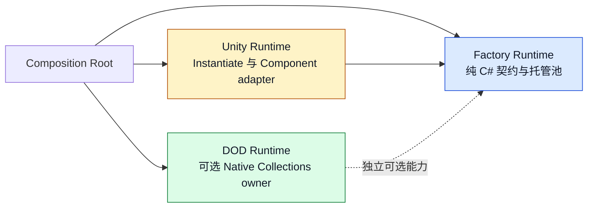
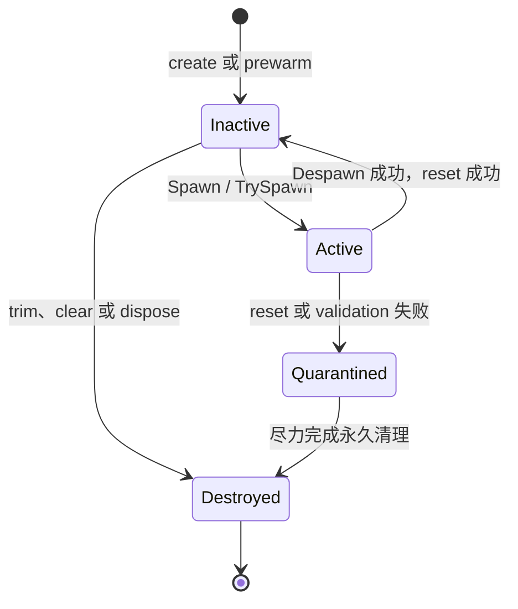

# CycloneGames.Factory

[English | 简体中文](README.md)

CycloneGames.Factory 为纯 C# 与 Unity 提供显式创建契约和有界对象池。纯 C# 核心暴露 `IFactory` 与 `ObjectPool`，包含所有权跟踪、容量策略、诊断和确定性清理；Unity 对象创建隔离在独立 adapter assembly 中；可选的 Native Collections assembly 为高数量 DOD workload 提供基于稳定句柄的密集 unmanaged pool。

## 目录

- [概述](#概述)
- [架构](#架构)
- [快速上手](#快速上手)
- [核心概念](#核心概念)
- [使用指南](#使用指南)
- [进阶主题](#进阶主题)
- [常见场景](#常见场景)
- [性能与内存](#性能与内存)
- [故障排查](#故障排查)

## 概述

Factory 回答一个问题：谁在什么契约下构造这个对象？CycloneGames.Factory 用小型 `IFactory` 接口和托管 `ObjectPool` 回答它。Pool 从创建到销毁拥有每个 item，跟踪 active 与 inactive 状态，执行声明的容量策略，隔离 callback 失败，并以零逐帧分配暴露诊断快照。

模块分为三个 runtime assembly。纯 C# 核心不引用 `UnityEngine`，可用于测试、工具和服务端。Unity adapter 在主线程专用类型背后封装 `Object.Instantiate`、Prefab factory 和 `Component` pool。可选的 DOD assembly 提供基于 `NativeArray` 的密集 pool，使用 slot + generation 句柄服务 Burst/Jobs workload。

适用场景：创建策略需要注入、热路径需要有界复用、或 Unity 对象创建需要经过可验证边界。不要用作 DI container、service registry、全局 pool registry、ECS lifecycle 或持久化格式——composition root 拥有每个 factory 与 pool instance。

### 主要特性

- **`IFactory<TValue>` / `IFactory<TArg, TValue>`**：无参和带参构造的最小创建契约。
- **`ObjectPool<TArg, TValue>`**：single-owner 托管池，含生命周期 callback、容量策略、诊断与失败隔离。
- **`FastObjectPool<T>`**：无参 pool base，适合不需要 spawn 参数的 `Component` 类型 item。
- **`MonoPrefabFactory<T>` / `MonoFastPool<T>`**：Unity 主线程 adapter，用于 prefab 实例化与 `Component` 池化。
- **`NativePool<T>` / `NativeDensePool<T>` / `NativeDenseColumnPool2/3/4`**：unmanaged 密集 pool，含稳定句柄与 SoA 列流。

## 架构

| 程序集 | 路径 | 用途 |
| --- | --- | --- |
| `CycloneGames.Factory.Runtime` | `Runtime/Scripts/`（不含 `Unity/`） | 纯 C# factory、`PoolBase`、`ObjectPool`、`FastObjectPool`。`noEngineReferences: true`。 |
| `CycloneGames.Factory.Unity.Runtime` | `Runtime/Scripts/Unity/` | `IUnityObjectSpawner`、`DefaultUnityObjectSpawner`、`MonoPrefabFactory<T>`、`MonoFastPool<T>`。引用核心 assembly 与 `UnityEngine`。 |
| `CycloneGames.Factory.DOD.Runtime` | `DOD/Runtime/` | `NativePool<T>`、`NativeDensePool<T>`、`NativeDenseColumnPool2/3/4`。仅当已安装的 `com.unity.collections` 包定义 `PRESENT_COLLECTIONS` 时编译。 |
| `CycloneGames.Factory.Tests.Editor` | `Tests/Editor/` | 核心与 Unity adapter 契约测试。 |
| `CycloneGames.Factory.DOD.Tests.Editor` | `DOD/Tests/Editor/` | Native ownership 与 handle 测试。仅在安装 Collections 时启用。 |
| `CycloneGames.Factory.Samples` | `Samples/` | 可选示例。`autoReferenced: false`。 |



所有者把构造与复用策略转换成 `PoolCapacitySettings` 值，pool 据此构建有界生命周期，所有者决定何时 spawn、despawn、trim 与 dispose。容量、溢出与 trim 策略都在调用处可见，绝不隐藏在隐式配置背后。

## 快速上手

在你的 asmdef 中引用 `CycloneGames.Factory.Runtime`，然后导入命名空间：

```csharp
using CycloneGames.Factory.Runtime;
```

### 池化托管对象

```csharp
public readonly struct ProjectileSpawn
{
    public readonly float Speed;
    public ProjectileSpawn(float speed) => Speed = speed;
}

public sealed class Projectile : IPoolable<ProjectileSpawn, Projectile>, IDisposable
{
    private IDespawnableMemoryPool<Projectile> _owner;

    public float Speed { get; private set; }

    public void OnSpawned(ProjectileSpawn data, IDespawnableMemoryPool<Projectile> pool)
    {
        Speed = data.Speed;
        _owner = pool;
    }

    public void OnDespawned()
    {
        Speed = 0f;
        _owner = null;
    }

    public void Return() => _owner?.Despawn(this);

    public void Dispose() => _owner = null;
}

public sealed class ProjectileFactory : IFactory<Projectile>
{
    public Projectile Create() => new Projectile();
}
```

### 构造并使用 pool

```csharp
var settings = new PoolCapacitySettings(
    softCapacity: 128,
    hardCapacity: 512,
    overflowPolicy: PoolOverflowPolicy.ReturnNull,
    trimPolicy: PoolTrimPolicy.TrimOnDespawn);

using var pool = new ObjectPool<ProjectileSpawn, Projectile>(
    new ProjectileFactory(),
    settings);

if (pool.TrySpawn(new ProjectileSpawn(20f), out Projectile projectile))
{
    projectile.Return();
}
```

`SoftCapacity` 预热 inactive item；`HardCapacity` 限制总所有权；`TrimOnDespawn` 在 inactive 数量超过 soft 目标时销毁返回的 item 而不是保留。

## 核心概念

### Factory 创建，Pool 拥有

Factory 是单方法边界。Pool 调用它，调用方从不直接调用。Pool 在永久销毁前拥有每个被创建的 item。

```csharp
public sealed class MessageFactory : IFactory<Message>
{
    public Message Create() => new Message();
}

public sealed class SessionFactory : IFactory<SessionOptions, Session>
{
    public Session Create(SessionOptions options) => new Session(options);
}
```

`IFactory<TValue>` 在 `TValue` 上协变；`IFactory<TArg, TValue>` 在 `TArg` 上逆变。Factory 不执行 ambient resolve，也不隐藏 lifetime scope。

### 容量策略

`PoolCapacitySettings` 是构造时捕获的值类型：

| 设置 | 含义 |
| --- | --- |
| `SoftCapacity` | 预热数量，也是 `TrimOnDespawn` 使用的 inactive 保留目标。 |
| `HardCapacity` | Pool 可拥有的最大 item 数量；`-1` 表示无界。 |
| `OverflowPolicy.Throw` | 达到 hard capacity 时，`Spawn` 抛出异常。 |
| `OverflowPolicy.ReturnNull` | 达到 hard capacity 时，`Spawn` 返回 `null`（或 `default`）。 |
| `TrimPolicy.Manual` | Inactive item 保留到 `TrimInactive`、`Clear` 或 `Dispose`。 |
| `TrimPolicy.TrimOnDespawn` | 返回的 item 超过 `SoftCapacity` 时被永久销毁。 |
| `TrySpawn` | 正常容量耗尽时始终返回 `false`，不受 `OverflowPolicy` 影响。 |

Gameplay、remote input 和 overload-sensitive pool 应配置有限 `HardCapacity`。只有 owner 已通过其他机制证明输入有界时才使用无界 pool。

### 生命周期状态



Pool 用 `ReferenceEquals` 跟踪身份，不依赖用户定义的值相等。Foreign return、duplicate return 与生命周期 callback reentrancy 都被拒绝并计数。Active iteration 可以归还当前正在访问的 item，但不能修改其他 active item。`Dispose` 幂等，即使单个 item 清理失败也会把对外状态设为 `Disposed`。

## 使用指南

### Spawn、Despawn 与 Return

```csharp
// 溢出时抛出：
Projectile p = pool.Spawn(new ProjectileSpawn(20f));
p.Return();                   // 内部调用 Despawn

// 或使用 TrySpawn 优雅处理过载：
if (pool.TrySpawn(new ProjectileSpawn(20f), out Projectile q))
{
    q.Return();
}
```

Spawn 后 item 被调用方借用，且必须准确归还一次。`Return()` 委托 `IDespawnableMemoryPool<TValue>.Despawn`，这是返回 inactive 的唯一支持路径。

### 查看诊断

```csharp
PoolProfile profile = pool.Profile;

Console.WriteLine($"active={profile.CountActive} inactive={profile.CountInactive}");
Console.WriteLine($"peakActive={profile.Diagnostics.PeakCountActive}");
Console.WriteLine($"callbackFailures={profile.Diagnostics.CallbackFailures}");
Console.WriteLine($"quarantined={profile.Diagnostics.QuarantinedItems}");
```

`PoolProfile` 与 `PoolDiagnostics` 是 readonly struct，读取不产生分配。长时间累计值使用 `long`；当前数量和容量仍使用 `int`，因为托管集合容量以 `int` 为上限。

### Prewarm、trim 与 clear

```csharp
pool.Prewarm(64);                // 冷路径：最多创建到剩余容量
int created = pool.WarmupStep(8); // 创建有界批次，返回实际创建数量
pool.TrimInactive(32);           // 销毁超过目标的 inactive item
pool.DespawnAll();               // 归还所有 active item
int n = pool.DespawnStep(16);    // 归还有界批次
pool.Clear();                    // 销毁所有 owned item
```

`WarmupCoroutine` 与 `DespawnAllCoroutine` 是用于分帧 loading/teardown 的便利迭代器，会分配 iterator state，不属于严格 zero-allocation 热路径。

### ForEachActive 迭代

```csharp
pool.ForEachActive(projectile =>
{
    projectile.Tick(Time.deltaTime);
});

// 或带 state 以避免闭包：
pool.ForEachActive(state, (item, s) =>
{
    item.Tick(s.DeltaTime);
});
```

Callback 可以归还当前 item，但不能修改其他 active item。Pool 检测结构版本变化，并在违反 iteration 契约时抛出异常。

### 失败隔离

| 失败 | Pool 行为 |
| --- | --- |
| Factory 返回无效 item | 创建立即失败，item 不会进入 active tracking |
| Spawn callback 失败但 reset 成功 | borrow 回滚，item 可以回到 inactive |
| Spawn callback 与 reset 均失败 | item 进入 quarantine 并永久清理，绝不再次借出 |
| Despawn callback 或 validation 失败 | 移除 active ownership、隔离 item、尝试清理并传播错误 |
| `Clear`/`Dispose` 中一个 item 失败 | 继续处理其余 owned item，最终以 `AggregateException` 报告 |
| Hard capacity 耗尽 | `TrySpawn` 返回 `false`；`Spawn` 遵循 `OverflowPolicy` |

## 进阶主题

### Unity adapter 组合

Unity-facing API 仅允许在 Unity 主线程调用。创建必须通过其他已验证边界时注入自定义 `IUnityObjectSpawner`。

```csharp
using CycloneGames.Factory.Runtime;
using UnityEngine;

IUnityObjectSpawner spawner = new DefaultUnityObjectSpawner();
var factory = new MonoPrefabFactory<Bullet>(spawner, bulletPrefab, poolRoot);
var pool = new ObjectPool<BulletSpawn, Bullet>(
    factory,
    new PoolCapacitySettings(64, 256, PoolOverflowPolicy.ReturnNull));
```

`DefaultUnityObjectSpawner` 拒绝 null origin，并委托 `Object.Instantiate`。`MonoPrefabFactory<T>` 创建 inactive instance，让 pool 控制激活。`MonoFastPool<T>` 是轻量 `Component` pool，处理激活、可选 reparent 和永久清理时的 `Object.Destroy`，不需要 `IFactory`，因为它直接拥有创建。

### 自定义 `FastObjectPool<T>` 子类

Item 不需要 spawn 参数时，从 `FastObjectPool<T>` 派生并重写 `OnSpawn` / `OnDespawn`：

```csharp
public sealed class EffectPool : FastObjectPool<Effect>
{
    public EffectPool(PoolCapacitySettings settings) : base(settings) { }

    protected override Effect CreateNew() => new Effect();
    protected override void OnSpawn(Effect item) => item.Activate();
    protected override void OnDespawn(Effect item) => item.Deactivate();
}
```

需要自定义 validation 或 destruction 时重写 `IsValid` 与 `DestroyItem`。默认 `DestroyItem` 在 item 实现 `IDisposable` 时调用 `Dispose`。

### DOD 密集 pool

只有测量证明连续 unmanaged storage 对 workload 有收益时才使用 DOD pool。每个 pool 都是 sealed owner object，避免复制 pool value 导致 `NativeContainer` 被意外重复拥有。

```csharp
using CycloneGames.Factory.DOD.Runtime;
using Unity.Collections;

using var pool = new NativeDensePool<SimulationItem>(
    capacity: 4096,
    allocator: Allocator.Persistent);

if (pool.TrySpawn(new SimulationItem(), out NativePoolHandle handle, out int denseIndex))
{
    pool.TryWrite(handle, new SimulationItem { Health = 100 });
    pool.Despawn(handle);
}
```

- `NativePool<T>` 使用 compact index；swap-and-pop despawn 会使外部 dense index 失效。
- `NativeDensePool<T>` 使用 slot + generation handle，拒绝 stale access 与 double return。
- `NativeDenseColumnPool2/3/4` 为 SoA workload 保存并行类型流。
- Spawn、despawn、resize、clear、dispose 是 single-owner structural operation。
- 只有 owner 保证期间不执行 structural operation 或 disposal 时，Job 才能借用 active array。执行结构变化前必须完成或正确串联所有 outstanding `JobHandle`。
- `Resize` 属于冷路径分配。应按已声明 workload 预设容量，并把容量耗尽作为正常 overload result。

### 手动与 DI 组合

Core 不引用任何 DI container。手动组装与 container 组装使用相同 public constructor：

```csharp
var spawner = new DefaultUnityObjectSpawner();
var factory = new MonoPrefabFactory<Bullet>(spawner, bulletPrefab, poolRoot);
var pool = new ObjectPool<BulletSpawn, Bullet>(factory, capacitySettings);
```

Container 可以在 composition root 注册这些具体对象。Pool item 和 factory method 不应访问 container。

## 常见场景

### 带参数 spawn 的投射物 pool

Gameplay 系统需要有界、预热的投射物，且每次 spawn 有独立参数：

```csharp
var settings = new PoolCapacitySettings(
    softCapacity: 128,
    hardCapacity: 1024,
    overflowPolicy: PoolOverflowPolicy.ReturnNull,
    trimPolicy: PoolTrimPolicy.TrimOnDespawn);

using var pool = new ObjectPool<ProjectileSpawn, Projectile>(
    new ProjectileFactory(),
    settings);

for (int i = 0; i < 64; i++)
{
    if (pool.TrySpawn(new ProjectileSpawn(speed: 20f + i), out Projectile p))
    {
        p.Launch();
    }
}
```

`TrySpawn` 在 hard capacity 耗尽时返回 `false`，gameplay 循环无需异常处理即可优雅降级。

### 使用 `MonoFastPool<T>` 的 Unity Component pool

VFX 系统需要 `Component` instance pool，激活并在 pool root 下 reparent：

```csharp
var pool = new MonoFastPool<EffectView>(
    effectPrefab,
    new PoolCapacitySettings(
        softCapacity: 32,
        hardCapacity: 256,
        overflowPolicy: PoolOverflowPolicy.Throw),
    root: transform,
    autoSetActive: true);

EffectView effect = pool.Spawn();
pool.Despawn(effect);
```

`MonoFastPool<T>` 在永久清理时调用 `Object.Destroy`，owner 永远不应直接销毁 item。

### 使用 `NativeDensePool<T>` 的 Jobs 友好模拟

模拟需要跨数千 item 的 cache-friendly 迭代，且句柄能在 swap-and-pop despawn 后存活：

```csharp
using var pool = new NativeDensePool<AgentState>(
    capacity: 8192,
    allocator: Allocator.Persistent);

NativeArray<NativePoolHandle> handles = new NativeArray<NativePoolHandle>(batch, Allocator.TempJob);
NativeArray<AgentState> states = new NativeArray<AgentState>(batch, Allocator.TempJob);

// 主线程批量 spawn：
pool.SpawnBatch(states, batch, handles, allowPartial: false);

// 把 ActiveItems 传入 Job：
var job = new SimulationJob { States = pool.ActiveItems };
JobHandle handle = job.Schedule(pool.CountActive, 64);
handle.Complete();

// 归还单个 handle：
pool.Despawn(handles[0]);
```

外部代码绝不能把 `NativePoolHandle` 持久化超过其引用 slot 的生命周期。需要时通过 `GetHandleAtDenseIndex` 获取新 handle。

### 冷路径注册表预热

Loading screen 把预热分散到多帧，让首个 gameplay beat 不卡顿：

```csharp
IEnumerator PrewarmOverFrames(ObjectPool<ProjectileSpawn, Projectile> pool, int total, int batchSize)
{
    IEnumerator routine = pool.WarmupCoroutine(total, batchSize);
    while (routine.MoveNext())
    {
        yield return routine.Current;
    }
}
```

`WarmupCoroutine` 与 `DespawnAllCoroutine` 会分配 iterator state，是分帧 loading 的便利 API，不属于严格 zero-allocation 热路径。

## 性能与内存

| 路径 | 时间复杂度 | 模块级分配 | 工作状态 |
| --- | --- | --- | --- |
| `Spawn` / `TrySpawn`（复用 inactive） | 摊销 `O(1)` | 0 字节 | `List<T>` + identity `Dictionary<T, int>` |
| `Spawn`（新建） | 摊销 `O(1)` | Pool 0 字节；factory 可能分配 | 一次 factory 调用 |
| `Despawn` | `O(1)` | 0 字节 | Active list 上 swap-and-pop |
| `Prewarm` / `WarmupStep` | `O(n)` | 每次创建一个 item | 仅冷路径 |
| `TrimInactive` | `O(n - target)` | Pool 0 字节 | Destroy callback 可能分配 |
| `ForEachActive` | `O(active)` | 0 字节 | 快照校验迭代 |
| DOD `TrySpawn` / `Despawn` | `O(1)` | 0 GC | `NativeArray` + slot map |
| DOD `SpawnBatch` | `O(batch)` | 0 GC | 批量 slot 分配 |

Tracking collection 按 `SoftCapacity` 预设容量。ownership 超出预设数量时，运行时增长可能产生分配。严格热路径前完成预热，并使用有限 hard capacity 避免增长尖峰。

模块没有 static cache、全局 registry、隐藏偏好、后台线程或持久化文件。Pool 保留的 item 是由 pool instance 拥有的有界复用 cache。

### 线程

- 托管池是 single-owner，由外部同步。
- Unity adapter 仅限主线程。
- DOD pool structural operation 是 single-owner。
- 借出的 `NativeArray` 段可在调用方维护的 dependency graph 下由 Job 处理。
- 不要在持有未知外部 lock 时执行 pool 生命周期 callback。Producer 位于其他线程时，应把有界创建/归还意图排入 owner queue，而不是跨线程共享 pool。

### 平台与 AOT

Core 不使用反射、动态代码生成、文件系统、socket、native plugin 或 runtime type discovery。IL2CPP stripping 仍要求产品代码能够静态到达所需 closed generic form。Unity adapter 仅使用标准 Unity object API。DOD 支持范围由当前安装的 Collections 包和目标平台 capability 决定。

Windows、Linux、macOS、iOS、Android、WebGL、Dedicated Server 与主机目标都需要独立 Player/AOT 证据。Editor 编译或 EditMode tests 不能认证这些目标。WebGL 是否具有线程能力取决于部署设置；无论能力如何，single-owner 契约都保持不变。

## 故障排查

| 现象 | 可能原因 | 解决方法 |
| --- | --- | --- |
| `TrySpawn` 返回 `false` | Hard capacity 耗尽或无可复用 item | 检查 `Profile` 和 workload 上限；提升 `HardCapacity` 或降低 spawn 速率 |
| Spawn item 被 quarantine | reset 或 validity 契约失败 | 检查 `CallbackFailures` 与 `QuarantinedItems`；不要复用该 instance |
| 预热后 pool 仍分配 | workload 超过 tracking 或 creation 的预设容量 | 根据测量增加预热，不要设置任意全局默认值 |
| `Spawn` 溢出时抛出异常 | 设置了 `OverflowPolicy.Throw` 且容量耗尽 | 改用 `TrySpawn` 或提升 `HardCapacity` |
| DOD 类型不可用 | 消费项目未解析 `com.unity.collections` | 检查 `Packages/manifest.json` 与 `packages-lock.json`，再确认 DOD asmdef 的 `PRESENT_COLLECTIONS` constraint 是否 active |
| Native handle 失效 | item 已归还、pool 已 clear，或 generation 已改变 | 获取新 handle；禁止持久化 runtime handle |
| Active iteration 抛出异常 | callback 修改了当前 item 以外的 active item | 只归还当前 item；其他修改推迟到迭代之后 |

## 验证

通过 Unity Test Runner 运行聚焦测试：

```text
<UnityEditor> -batchmode -nographics -projectPath <repo-root>/UnityStarter -runTests -testPlatform EditMode -assemblyNames CycloneGames.Factory.Tests.Editor -testResults <result-path> -quit
```

安装 `com.unity.collections` 后，也运行 `CycloneGames.Factory.DOD.Tests.Editor`。托管测试覆盖 reference identity、容量耗尽、duplicate return、spawn rollback、quarantine、callback reentrancy、self-return iteration、dispose，以及预热后的当前线程 allocation assertion。DOD tests 覆盖 handle invalidation、swap-and-pop、batch churn、SoA stream、容量与诊断。

声明性能结论前，在目标 Player build 中测量已定义 workload，并记录 warmup、GC、CPU 分布、peak memory、backend、device 和 Unity 版本。声明 IL2CPP/AOT 支持前，使用当前 stripping 配置构建并 smoke-test 受影响目标。

## 参考

- [Unity Collections 包](https://docs.unity3d.com/Packages/com.unity.collections@latest) —— DOD pool 支持的依赖。
- [UniTask](https://github.com/Cysharp/UniTask)
