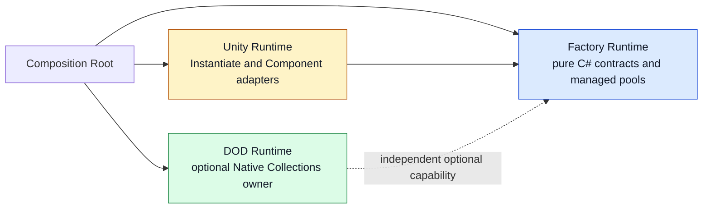
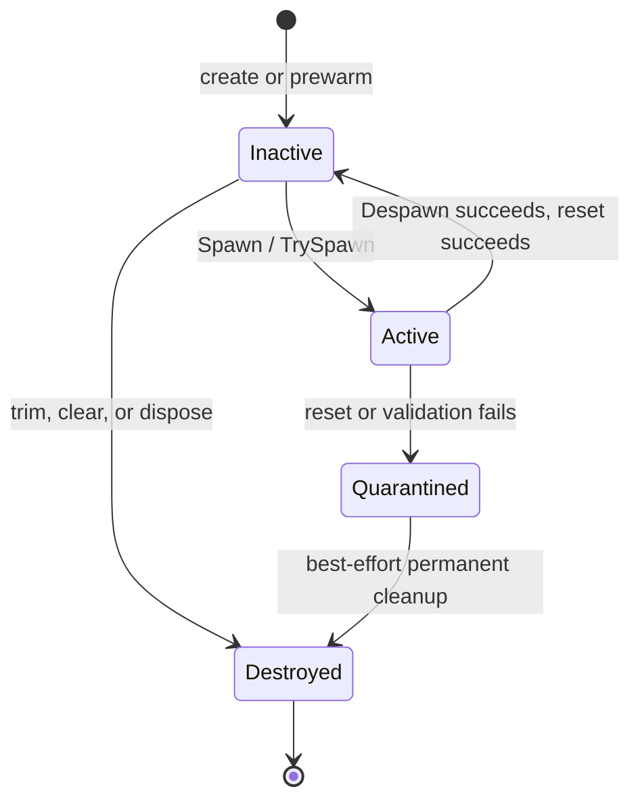

# CycloneGames.Factory

[English | 简体中文](README.SCH.md)

CycloneGames.Factory provides explicit creation contracts and bounded object pools for pure C# and Unity. The pure-C# core exposes `IFactory` and `ObjectPool` with ownership tracking, capacity policy, diagnostics, and deterministic cleanup; Unity object creation is isolated in a dedicated adapter assembly; an optional Native Collections assembly adds dense unmanaged pools with stable handles for high-volume DOD workloads.

## Table of Contents

- [Overview](#overview)
- [Architecture](#architecture)
- [Quick Start](#quick-start)
- [Core Concepts](#core-concepts)
- [Usage Guide](#usage-guide)
- [Advanced Topics](#advanced-topics)
- [Common Scenarios](#common-scenarios)
- [Performance and Memory](#performance-and-memory)
- [Troubleshooting](#troubleshooting)

## Overview

A factory answers one question: who constructs this object, and under what contract? CycloneGames.Factory answers that with small `IFactory` interfaces and a managed `ObjectPool` that owns every item from creation to destruction. The pool tracks active and inactive items, enforces a declared capacity policy, isolates callback failures, and exposes diagnostics snapshots with no per-frame allocation.

The module is split into three runtime assemblies. The pure-C# core has no `UnityEngine` reference and is safe for tests, tools, and servers. The Unity adapter wraps `Object.Instantiate`, prefab factories, and `Component` pools behind main-thread-only types. The optional DOD assembly provides `NativeArray`-backed dense pools with slot-plus-generation handles for Burst/Jobs workloads.

Use this module when creation policy must be injected, when a hot path needs bounded reuse, or when Unity object creation must pass through a verifiable boundary. Do not use it as a DI container, service registry, global pool registry, ECS lifecycle, or persistence format — the composition root owns every factory and pool instance.

### Key Features

- **`IFactory<TValue>` / `IFactory<TArg, TValue>`** — minimal creation contracts for parameterless and argument-based construction.
- **`ObjectPool<TArg, TValue>`** — single-owner managed pool with lifecycle callbacks, capacity policy, diagnostics, and quarantine on failure.
- **`FastObjectPool<T>`** — parameterless pool base for `Component`-style items that do not need spawn arguments.
- **`MonoPrefabFactory<T>` / `MonoFastPool<T>`** — Unity main-thread adapters for prefab instantiation and `Component` pooling.
- **`NativePool<T>` / `NativeDensePool<T>` / `NativeDenseColumnPool2/3/4`** — unmanaged dense pools with stable handles and SoA column streams.

## Architecture

| Assembly | Path | Purpose |
| --- | --- | --- |
| `CycloneGames.Factory.Runtime` | `Runtime/Scripts/` (excludes `Unity/`) | Pure-C# factories, `PoolBase`, `ObjectPool`, `FastObjectPool`. `noEngineReferences: true`. |
| `CycloneGames.Factory.Unity.Runtime` | `Runtime/Scripts/Unity/` | `IUnityObjectSpawner`, `DefaultUnityObjectSpawner`, `MonoPrefabFactory<T>`, `MonoFastPool<T>`. References the core assembly and `UnityEngine`. |
| `CycloneGames.Factory.DOD.Runtime` | `DOD/Runtime/` | `NativePool<T>`, `NativeDensePool<T>`, `NativeDenseColumnPool2/3/4`. Compiled only when `PRESENT_COLLECTIONS` is defined by the installed `com.unity.collections` package. |
| `CycloneGames.Factory.Tests.Editor` | `Tests/Editor/` | Core and Unity adapter contract tests. |
| `CycloneGames.Factory.DOD.Tests.Editor` | `DOD/Tests/Editor/` | Native ownership and handle tests. Active only when Collections is installed. |
| `CycloneGames.Factory.Samples` | `Samples/` | Opt-in examples. `autoReferenced: false`. |



The owner converts construction and reuse policy into a `PoolCapacitySettings` value; the pool turns that into a bounded lifecycle; the owner decides when to spawn, despawn, trim, and dispose. Capacity, overflow, and trim policy are visible at the call site, never hidden behind ambient configuration.

## Quick Start

Reference `CycloneGames.Factory.Runtime` from your asmdef, then import the namespace:

```csharp
using CycloneGames.Factory.Runtime;
```

### Pool a managed object

```csharp
public readonly struct ProjectileSpawn
{
    public readonly float Speed;
    public ProjectileSpawn(float speed) => Speed = speed;
}

public sealed class Projectile : IPoolable<ProjectileSpawn, Projectile>, IDisposable
{
    private IDespawnableMemoryPool<Projectile> _owner;

    public float Speed { get; private set; }

    public void OnSpawned(ProjectileSpawn data, IDespawnableMemoryPool<Projectile> pool)
    {
        Speed = data.Speed;
        _owner = pool;
    }

    public void OnDespawned()
    {
        Speed = 0f;
        _owner = null;
    }

    public void Return() => _owner?.Despawn(this);

    public void Dispose() => _owner = null;
}

public sealed class ProjectileFactory : IFactory<Projectile>
{
    public Projectile Create() => new Projectile();
}
```

### Construct and use the pool

```csharp
var settings = new PoolCapacitySettings(
    softCapacity: 128,
    hardCapacity: 512,
    overflowPolicy: PoolOverflowPolicy.ReturnNull,
    trimPolicy: PoolTrimPolicy.TrimOnDespawn);

using var pool = new ObjectPool<ProjectileSpawn, Projectile>(
    new ProjectileFactory(),
    settings);

if (pool.TrySpawn(new ProjectileSpawn(20f), out Projectile projectile))
{
    projectile.Return();
}
```

`SoftCapacity` prewarms inactive items; `HardCapacity` bounds total ownership; `TrimOnDespawn` destroys returned items above the soft target instead of retaining them.

## Core Concepts

### Factories create, pools own

A factory is a one-method boundary. The pool calls it; the caller never calls it directly. The pool owns every created item until that item is permanently destroyed.

```csharp
public sealed class MessageFactory : IFactory<Message>
{
    public Message Create() => new Message();
}

public sealed class SessionFactory : IFactory<SessionOptions, Session>
{
    public Session Create(SessionOptions options) => new Session(options);
}
```

`IFactory<TValue>` is covariant in `TValue`; `IFactory<TArg, TValue>` is contravariant in `TArg`. Factories do not perform ambient resolution and do not hide lifetime scopes.

### Capacity policy

`PoolCapacitySettings` is a value type captured at construction:

| Setting | Meaning |
| --- | --- |
| `SoftCapacity` | Prewarm count and inactive retention target used by `TrimOnDespawn`. |
| `HardCapacity` | Maximum items owned by the pool; `-1` means unbounded. |
| `OverflowPolicy.Throw` | `Spawn` throws when the hard capacity is exhausted. |
| `OverflowPolicy.ReturnNull` | `Spawn` returns `null` (or `default`) when the hard capacity is exhausted. |
| `TrimPolicy.Manual` | Inactive items remain until `TrimInactive`, `Clear`, or `Dispose`. |
| `TrimPolicy.TrimOnDespawn` | Returned items above `SoftCapacity` are permanently destroyed. |
| `TrySpawn` | Always returns `false` on normal capacity exhaustion, regardless of `OverflowPolicy`. |

Use a finite `HardCapacity` for gameplay, remote-input, and overload-sensitive pools. An unbounded pool is appropriate only when the owner has a separate, proven bound.

### Lifecycle states



The pool tracks identity with `ReferenceEquals`, not user-defined value equality. Foreign returns, duplicate returns, and lifecycle-callback reentrancy are rejected and counted. Active iteration may despawn the item currently being visited but may not mutate unrelated active items. `Dispose` is idempotent and always transitions the exposed state to `Disposed`, even when individual item cleanups fail.

## Usage Guide

### Spawn, despawn, and return

```csharp
// Throw on overflow:
Projectile p = pool.Spawn(new ProjectileSpawn(20f));
p.Return();                   // calls Despawn internally

// Or use TrySpawn for graceful overload:
if (pool.TrySpawn(new ProjectileSpawn(20f), out Projectile q))
{
    q.Return();
}
```

A spawned item is borrowed by the caller and must be returned exactly once. `Return()` delegates to `IDespawnableMemoryPool<TValue>.Despawn`, which is the only supported path back to inactive.

### Inspect diagnostics

```csharp
PoolProfile profile = pool.Profile;

Console.WriteLine($"active={profile.CountActive} inactive={profile.CountInactive}");
Console.WriteLine($"peakActive={profile.Diagnostics.PeakCountActive}");
Console.WriteLine($"callbackFailures={profile.Diagnostics.CallbackFailures}");
Console.WriteLine($"quarantined={profile.Diagnostics.QuarantinedItems}");
```

`PoolProfile` and `PoolDiagnostics` are readonly structs; reading them allocates nothing. Long-running totals use `long`; current counts and capacities remain `int` because managed collection capacity is `int`-bounded.

### Prewarm, trim, and clear

```csharp
pool.Prewarm(64);                // cold path: create up to remaining capacity
int created = pool.WarmupStep(8); // create a bounded batch, return what was created
pool.TrimInactive(32);           // destroy inactive items above target
pool.DespawnAll();               // return all active items
int n = pool.DespawnStep(16);    // despawn a bounded batch
pool.Clear();                    // destroy all owned items
```

`WarmupCoroutine` and `DespawnAllCoroutine` are convenience iterators for frame-spread loading or teardown. They allocate iterator state and are not strict zero-allocation hot paths.

### ForEachActive iteration

```csharp
pool.ForEachActive(projectile =>
{
    projectile.Tick(Time.deltaTime);
});

// Or with state to avoid closures:
pool.ForEachActive(state, (item, s) =>
{
    item.Tick(s.DeltaTime);
});
```

The callback may despawn the current item but may not mutate other active items. The pool detects structural version changes and throws when the iteration contract is violated.

### Failure isolation

| Failure | Pool behavior |
| --- | --- |
| Factory returns an invalid item | Creation fails immediately; the item is never tracked active. |
| Spawn callback fails, reset succeeds | The borrow is rolled back; the item may return inactive. |
| Spawn callback and reset both fail | The item is quarantined and permanently cleaned up; never reused. |
| Despawn callback or validation fails | Active ownership is removed, the item is quarantined, cleanup is attempted, and the error propagates. |
| One item fails during `Clear` or `Dispose` | Remaining owned items are still processed; failures are reported as `AggregateException`. |
| Hard capacity is exhausted | `TrySpawn` returns `false`; `Spawn` follows `OverflowPolicy`. |

## Advanced Topics

### Unity adapter composition

Unity-facing APIs are main-thread-only. Inject a custom `IUnityObjectSpawner` when creation must pass through another verified boundary.

```csharp
using CycloneGames.Factory.Runtime;
using UnityEngine;

IUnityObjectSpawner spawner = new DefaultUnityObjectSpawner();
var factory = new MonoPrefabFactory<Bullet>(spawner, bulletPrefab, poolRoot);
var pool = new ObjectPool<BulletSpawn, Bullet>(
    factory,
    new PoolCapacitySettings(64, 256, PoolOverflowPolicy.ReturnNull));
```

`DefaultUnityObjectSpawner` rejects a null origin and delegates to `Object.Instantiate`. `MonoPrefabFactory<T>` creates inactive instances so the pool controls activation. `MonoFastPool<T>` is a lightweight `Component` pool that handles activation, optional reparenting, and `Object.Destroy` during permanent cleanup — it does not require an `IFactory` because it owns creation directly.

### Custom `FastObjectPool<T>` subclass

When items do not need spawn arguments, derive from `FastObjectPool<T>` and override `OnSpawn` / `OnDespawn`:

```csharp
public sealed class EffectPool : FastObjectPool<Effect>
{
    public EffectPool(PoolCapacitySettings settings) : base(settings) { }

    protected override Effect CreateNew() => new Effect();
    protected override void OnSpawn(Effect item) => item.Activate();
    protected override void OnDespawn(Effect item) => item.Deactivate();
}
```

Override `IsValid` and `DestroyItem` when validation or destruction needs custom behavior. The default `DestroyItem` calls `IDisposable.Dispose` if the item implements it.

### DOD dense pools

Use DOD pools only when a measured workload benefits from contiguous unmanaged storage. Each pool is a sealed owner object so `NativeContainer`s cannot be duplicated by copying a pool value.

```csharp
using CycloneGames.Factory.DOD.Runtime;
using Unity.Collections;

using var pool = new NativeDensePool<SimulationItem>(
    capacity: 4096,
    allocator: Allocator.Persistent);

if (pool.TrySpawn(new SimulationItem(), out NativePoolHandle handle, out int denseIndex))
{
    pool.TryWrite(handle, new SimulationItem { Health = 100 });
    pool.Despawn(handle);
}
```

- `NativePool<T>` uses compact indices; swap-and-pop despawn invalidates external dense indices.
- `NativeDensePool<T>` uses slot-plus-generation handles to reject stale access and double return.
- `NativeDenseColumnPool2/3/4` store parallel typed streams for SoA workloads.
- Spawn, despawn, resize, clear, and dispose are single-owner structural operations.
- Jobs may borrow exposed active arrays only while the owner guarantees no structural operation or disposal. Complete or chain every outstanding `JobHandle` before structural mutation.
- `Resize` is a cold-path allocation. Pre-size from a declared workload and treat capacity exhaustion as a normal overload result.

### Manual and DI composition

The core does not reference a DI container. Manual construction and container construction use the same public constructors:

```csharp
var spawner = new DefaultUnityObjectSpawner();
var factory = new MonoPrefabFactory<Bullet>(spawner, bulletPrefab, poolRoot);
var pool = new ObjectPool<BulletSpawn, Bullet>(factory, capacitySettings);
```

A container may register these concrete objects in its composition root. Do not resolve a container from pool items or factory methods.

## Common Scenarios

### Projectile pool with argument-based spawn

A gameplay system needs bounded, prewarmed projectiles with per-spawn tuning:

```csharp
var settings = new PoolCapacitySettings(
    softCapacity: 128,
    hardCapacity: 1024,
    overflowPolicy: PoolOverflowPolicy.ReturnNull,
    trimPolicy: PoolTrimPolicy.TrimOnDespawn);

using var pool = new ObjectPool<ProjectileSpawn, Projectile>(
    new ProjectileFactory(),
    settings);

for (int i = 0; i < 64; i++)
{
    if (pool.TrySpawn(new ProjectileSpawn(speed: 20f + i), out Projectile p))
    {
        p.Launch();
    }
}
```

`TrySpawn` returns `false` when the hard capacity is exhausted, so the gameplay loop degrades gracefully without exception handling.

### Unity Component pool with `MonoFastPool<T>`

A VFX system needs a pool of `Component` instances that activate and reparent under a pool root:

```csharp
var pool = new MonoFastPool<EffectView>(
    effectPrefab,
    new PoolCapacitySettings(
        softCapacity: 32,
        hardCapacity: 256,
        overflowPolicy: PoolOverflowPolicy.Throw),
    root: transform,
    autoSetActive: true);

EffectView effect = pool.Spawn();
pool.Despawn(effect);
```

`MonoFastPool<T>` handles `Object.Destroy` on permanent cleanup, so the owner never destroys items directly.

### Jobs-friendly simulation with `NativeDensePool<T>`

A simulation needs cache-friendly iteration across thousands of items, with stable handles that survive swap-and-pop despawn:

```csharp
using var pool = new NativeDensePool<AgentState>(
    capacity: 8192,
    allocator: Allocator.Persistent);

NativeArray<NativePoolHandle> handles = new NativeArray<NativePoolHandle>(batch, Allocator.TempJob);
NativeArray<AgentState> states = new NativeArray<AgentState>(batch, Allocator.TempJob);

// Bulk spawn on the main thread:
pool.SpawnBatch(states, batch, handles, allowPartial: false);

// Pass ActiveItems to a Job:
var job = new SimulationJob { States = pool.ActiveItems };
JobHandle handle = job.Schedule(pool.CountActive, 64);
handle.Complete();

// Despawn a single handle:
pool.Despawn(handles[0]);
```

External code must never persist a `NativePoolHandle` past the lifetime of the slot it references. Resolve a fresh handle from `GetHandleAtDenseIndex` when needed.

### Cold-path registry warmup

A loading screen spreads prewarm across frames so the first gameplay beat does not stall:

```csharp
IEnumerator PrewarmOverFrames(ObjectPool<ProjectileSpawn, Projectile> pool, int total, int batchSize)
{
    IEnumerator routine = pool.WarmupCoroutine(total, batchSize);
    while (routine.MoveNext())
    {
        yield return routine.Current;
    }
}
```

`WarmupCoroutine` and `DespawnAllCoroutine` allocate iterator state; they are convenience APIs for frame-spread loading, not strict zero-allocation hot paths.

## Performance and Memory

| Path | Time complexity | Module-owned allocation | Working state |
| --- | --- | --- | --- |
| `Spawn` / `TrySpawn` (reuse inactive) | `O(1)` amortized | 0 bytes | `List<T>` + identity `Dictionary<T, int>` |
| `Spawn` (create new) | `O(1)` amortized | 0 bytes from pool; factory may allocate | One factory call |
| `Despawn` | `O(1)` | 0 bytes | Swap-and-pop on active list |
| `Prewarm` / `WarmupStep` | `O(n)` | One item per creation | Cold path only |
| `TrimInactive` | `O(n - target)` | 0 bytes from pool | Destroy callback may allocate |
| `ForEachActive` | `O(active)` | 0 bytes | Snapshot-validated iteration |
| DOD `TrySpawn` / `Despawn` | `O(1)` | 0 bytes GC | `NativeArray` + slot map |
| DOD `SpawnBatch` | `O(batch)` | 0 bytes GC | Bulk slot allocation |

Tracking collections are pre-sized from `SoftCapacity`. Runtime growth can allocate when ownership exceeds the pre-sized count. Prewarm before a strict hot path and use a finite hard capacity to avoid growth spikes.

The module has no static cache, global registry, hidden preference, background thread, or persistent file. Pool-retained items are a bounded reuse cache owned by the pool instance.

### Threading

- Managed pools are single-owner and externally synchronized.
- Unity adapters are main-thread-only.
- DOD pool structural operations are single-owner.
- Borrowed `NativeArray` segments may be processed by Jobs under the caller's dependency graph.
- Do not call pool lifecycle callbacks while holding an unknown external lock. If producers run on other threads, enqueue bounded creation/return intentions to the owner rather than sharing the pool directly.

### Platform and AOT

The core uses no reflection, dynamic code generation, filesystem, sockets, native plugins, or runtime type discovery. IL2CPP stripping still requires product code to keep the closed generic forms reachable. The Unity adapter relies only on standard Unity object APIs. DOD support follows the installed Collections package and target platform capabilities.

Windows, Linux, macOS, iOS, Android, WebGL, Dedicated Server, and console targets require their own Player/AOT evidence. Editor compilation or EditMode tests do not certify those targets. WebGL receives no special threading assumption because deployment settings can change available capabilities; the single-owner contract remains valid in either case.

## Troubleshooting

| Symptom | Likely cause | Resolution |
| --- | --- | --- |
| `TrySpawn` returns `false` | Hard capacity reached or no reusable item available | Inspect `Profile` and the workload bound; raise `HardCapacity` or reduce the spawn rate |
| A spawned item is quarantined | Its reset or validity contract failed | Inspect `CallbackFailures` and `QuarantinedItems`; do not reuse that instance |
| A pool allocates after warmup | The workload exceeded pre-sized tracking or creation capacity | Increase the measured prewarm, not an arbitrary global default |
| `Spawn` throws on overflow | `OverflowPolicy.Throw` is set and capacity is exhausted | Switch to `TrySpawn` or raise `HardCapacity` |
| DOD types are unavailable | The consuming project does not resolve `com.unity.collections` | Confirm `Packages/manifest.json` and `packages-lock.json`, then verify the DOD asmdef's `PRESENT_COLLECTIONS` constraint is active |
| A Native handle becomes invalid | The item was returned, the pool was cleared, or the generation changed | Resolve a fresh handle; never persist runtime handles |
| Active iteration throws | The callback mutated an active item other than the current one | Despawn only the current item; defer other mutations to after iteration |

## Validation

Run focused tests from Unity Test Runner:

```text
<UnityEditor> -batchmode -nographics -projectPath <repo-root>/UnityStarter -runTests -testPlatform EditMode -assemblyNames CycloneGames.Factory.Tests.Editor -testResults <result-path> -quit
```

When `com.unity.collections` is installed, also run `CycloneGames.Factory.DOD.Tests.Editor`. The managed suite covers reference identity, capacity exhaustion, duplicate return, spawn rollback, quarantine, callback reentrancy, self-return iteration, disposal, and a prewarmed current-thread allocation assertion. DOD tests cover handle invalidation, swap-and-pop, batch churn, SoA streams, capacity, and diagnostics.

For a performance claim, measure a declared workload in the target Player build and record warmup, GC, CPU distribution, peak memory, backend, device, and Unity version. For IL2CPP/AOT support, build and smoke-test the affected target with the current stripping configuration.

## References

- [Unity Collections package](https://docs.unity3d.com/Packages/com.unity.collections@latest) — required for DOD pool support.
- [UniTask](https://github.com/Cysharp/UniTask)
