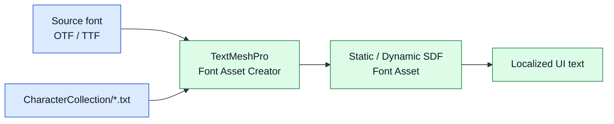

# CycloneGames.FontAssets

[English | 简体中文](README.md)

CycloneGames.FontAssets 为 Unity 项目中的中文（简体与繁体）、日文、韩文和拉丁文本渲染提供精心整理的字符集文本文件。每个文件都是一行 UTF-8 编码的唯一码位，用于给 TextMeshPro `Dynamic SDF` atlas、TextMeshPro Offline Font Asset Creator 以及自定义字形子集化管线提供一个已知且有界的字形集合。

## 目录

- [概述](#概述)
- [架构](#架构)
- [快速上手](#快速上手)
- [核心概念](#核心概念)
- [使用指南](#使用指南)
- [进阶主题](#进阶主题)
- [常见场景](#常见场景)
- [性能与内存](#性能与内存)
- [故障排查](#故障排查)

## 概述

字形 atlas 回答一个问题：哪些字符需要光栅化、代价多少？CycloneGames.FontAssets 用七个文本文件回答它，每个文件包含一种语言的典型项目所需唯一码位。把文件载入 TextMeshPro font asset creator，把 creator 指向源字体，生成的 atlas 就恰好包含文件中列出的字符——不再凭样例字符串猜测，不再因整个 Unicode 区块而膨胀。

本包是纯数据：没有 `Runtime/` 源码、没有 asmdef、没有脚本、没有编译输出。使用方式是把文本文件导入项目，在 TextMeshPro font asset creator 中打开，或在运行时从 build 位置读取。文件使用 UTF-8 无 BOM 编码，只包含字符（必要时只有一个尾随换行），可以按行读取，也可以作为单个字符串读取。

适用场景：项目需要为发布字体提供可预测、按语言界定的字形覆盖。不要用作字体二进制文件的替代——源 OTF/TTF 仍在项目中，字符集只控制 TextMeshPro atlas 光栅化哪些字形。

### 主要特性

- **Latin 字符集**：基本 ASCII 字母、数字、扩展拉丁和常用标点。
- **简体中文字符集**：三个预设：3,500 常用字、7,000 扩展字、含符号的完整常用集。
- **繁体中文字符集**：常用繁体字与符号。
- **日文字符集**：平假名、片假名和常用汉字。
- **韩文字符集**：谚文音节和字母（Jamo）。
- **UTF-8 无 BOM**：在所有 Unity 平台上可以安全使用 `File.ReadAllText` 和 TextMeshPro creator 读取。

## 架构

本包是一个文本文件目录加上 UPM manifest。没有 assembly、没有编辑器代码、没有 runtime 代码。

| 路径 | 用途 |
| --- | --- |
| `package.json` | UPM manifest。`com.cyclone-games.fontassets`。无依赖。 |
| `CharacterCollection/latin.txt` | 拉丁字母、数字和标点。 |
| `CharacterCollection/chinese_amount_3500_with_symbols.txt` | 约 3,500 个最常用简体中文字符及符号。 |
| `CharacterCollection/chinese_amount_7000_with_symbols.txt` | 约 7,000 个扩展简体中文字符及符号。 |
| `CharacterCollection/chinese_all_with_symbols.txt` | 含符号的完整常用简体中文字符集。 |
| `CharacterCollection/chinese-traditional.txt` | 常用繁体中文字符。 |
| `CharacterCollection/ja.txt` | 平假名、片假名和常用汉字。 |
| `CharacterCollection/ko.txt` | 谚文音节和 Jamo。 |



所有者选择源字体和字符集，TextMeshPro Font Asset Creator 把列出的字形光栅化到 SDF atlas，runtime UI 文本基于该 atlas 渲染。本包只提供字符集；字体二进制和生成的 atlas 归项目所有。

## 快速上手

把包导入 Unity 项目，然后通过 **Window > TextMeshPro > Font Asset Creator** 打开 Font Asset Creator。

### 创建中文字体 SDF asset

1. 在 **Source Font File** 拖入源 OTF 或 TTF（如 Noto Sans SC）。
2. 在 **Character Set** 选择 **Characters from File**。
3. 在 **Character File** 拖入 `CharacterCollection/chinese_amount_3500_with_symbols.txt`。
4. 设置 **Atlas Resolution** 为 2048×2048、**Padding** 为 5。
5. 点击 **Generate Font Atlas**，再点击 **Save** 保存生成的 `.asset` 文件。

生成的 `TMP_FontAsset` 恰好包含字符集的 3,500 个字符及常用符号。把它赋给 `TextMeshProUGUI` 组件，本地化文本就能无缺字警告地渲染。

### 在 build pipeline 中使用同一文件

```csharp
using System.IO;
using UnityEngine;
using TMPro;

public static class FontAtlasBuilder
{
    public static void CreateChineseFontAsset(TMP_FontAsset source, string outputPath)
    {
        string collectionPath = "Packages/com.cyclone-games.fontassets/CharacterCollection/chinese_amount_3500_with_symbols.txt";
        string characters = File.ReadAllText(collectionPath);

        // 使用 TMP_FontAsset.CreateFontAsset 或你自己的 atlas baker：
        TMP_FontAsset fontAsset = TMP_FontAsset.CreateFontAsset(source.sourceFontFile, samplingPointSize: 36, atlasPadding: 5);
        fontAsset.AddCharacters(characters);
        AssetDatabase.CreateAsset(fontAsset, outputPath);
    }
}
```

此 pattern 适用于源字体或字符集变化时重新生成 font asset 的编辑器 build pipeline。

## 核心概念

### 字符集

字符集是 UTF-8 文本文件，包含一个项目所需某语言的全部码位，已去重。每个文件是单行字符（可选尾随换行），因此整个文件可以用 `File.ReadAllText` 读取，并直接传给 TextMeshPro 或自定义 atlas baker。

| 文件 | 字符数（约） | 用途 |
| --- | ---: | --- |
| `latin.txt` | 377 | 英文 UI、数字、基本标点。 |
| `chinese_amount_3500_with_symbols.txt` | 3,716 | 面向简体中文市场的休闲手游——覆盖 GB 2312 常用字。 |
| `chinese_amount_7000_with_symbols.txt` | 7,215 | 中等预算简体中文覆盖——覆盖 GB 2312 加扩展常用字。 |
| `chinese_all_with_symbols.txt` | 8,558 | 完整常用简体中文——覆盖 GB 2312 加稀有和历史字符。 |
| `chinese-traditional.txt` | 2,628 | 繁体中文（台湾、香港）常用字符。 |
| `ja.txt` | 6,780 | 日文——平假名、片假名、常用汉字。 |
| `ko.txt` | 866 | 韩文——谚文音节和 Jamo。 |

### 为什么用整理过的字符集

TextMeshPro Font Asset Creator 可以光栅化字体的整个字形表，但大多数项目只需要小子集。完整 CJK 字体包含数万个字形；在 32 pt 下全部光栅化到 2048×2048 atlas 会产生不可读的小字形并破坏 build。整理过的字符集让 atlas 紧凑、build 时间短、runtime 内存有界。

本包中的字符集是为典型 UI 文本和 gameplay 文本挑选的，并不完整覆盖 Unicode：稀有字符、科学符号、emoji 和历史脚本被排除。需要特定稀有字符的项目应把字符追加到项目本地副本，或通过自定义字符集处理。

### 文件格式

每个文件都是 UTF-8 无 BOM。多数文件是单行字符，码位之间没有分隔符。日文文件（`ja.txt`）用多行划分平假名、片假名和汉字段落；用 `File.ReadAllText` 读取整个文件并剥离空白是规范加载方式。

```csharp
string raw = File.ReadAllText(collectionPath);
string characters = new string(raw.Where(c => !char.IsWhiteSpace(c)).ToArray());
```

## 使用指南

### 选择字符集

| 项目画像 | 推荐文件 |
| --- | --- |
| 仅英文 UI | `latin.txt` |
| 简体中文市场休闲手游 | `chinese_amount_3500_with_symbols.txt` |
| 简体中文市场中等预算手游或 PC | `chinese_amount_7000_with_symbols.txt` |
| AAA 质量简体中文、完整覆盖 | `chinese_all_with_symbols.txt` |
| 繁体中文市场（台湾、香港） | `chinese-traditional.txt` |
| 日文市场 | `ja.txt` |
| 韩文市场 | `ko.txt` |
| 多语言 build | 在 build 时合并文件（见 [进阶主题](#进阶主题)） |

### 生成静态 font asset

静态 font asset 预先光栅化字符集的所有字形。当字符集在 build 时固定时是正确选择。

1. 打开 **Window > TextMeshPro > Font Asset Creator**。
2. 把源字体拖入 **Source Font File**。
3. 设置 **Sampling Point Size** 为 runtime 使用的尺寸（通常 36–48）。
4. 设置 **Padding** 为 5 或更高，避免字形相互渗透。
5. 设置 **Atlas Resolution**：拉丁用 1024×1024，CJK 用 2048×2048 或 4096×2048。
6. 设置 **Character Set** 为 **Characters from File**。
7. 把选定的字符集文件拖入 **Character File**。
8. 点击 **Generate Font Atlas** 并确认预览显示所有字形。
9. 点击 **Save**，把生成的 `.asset` 赋给 `TMP_FontAsset` 字段。

### 生成动态 font asset

动态 font asset 按需光栅化字形。当字符集在 build 时不完全已知时使用——例如玩家在聊天框输入任意文本。字符集仍会用最常用字形预热 atlas，使冷启动延迟保持低。

1. 按静态步骤操作，但勾选 **Include Font Features** 并启用 **Multi Atlas Texture** 支持。
2. 生成后，在 Inspector 中把 `TMP_FontAsset` 的 `atlasPopulationMode` 设为 `Dynamic`。
3. 运行时，缺失字形按需从源字体光栅化。

### 运行时读取字符集

```csharp
using System.IO;
using System.Linq;
using UnityEngine;

public sealed class CharacterCollectionLoader
{
    public string Load(string fileName)
    {
        string path = System.IO.Path.Combine(
            Application.streamingAssetsPath,
            "CharacterCollections",
            fileName);

        string raw = File.ReadAllText(path);
        return new string(raw.Where(c => !char.IsWhiteSpace(c)).ToArray());
    }
}
```

把需要的文件复制到 `Assets/StreamingAssets/CharacterCollections/` 并按需加载。此 pattern 在项目支持下载语言包时有用。

## 进阶主题

### 合并字符集

多语言 build 可以把多个字符集文件合并为一个超集：

```csharp
using System.Collections.Generic;
using System.IO;
using System.Linq;

public static class CollectionCombiner
{
    public static string Combine(params string[] paths)
    {
        var set = new HashSet<char>();
        foreach (string path in paths)
        {
            foreach (char c in File.ReadAllText(path))
            {
                if (!char.IsWhiteSpace(c))
                {
                    set.Add(c);
                }
            }
        }

        char[] sorted = set.ToArray();
        System.Array.Sort(sorted);
        return new string(sorted);
    }
}
```

合并字符集适用于一个 font asset 服务所有语言。Atlas 大小随字符数大致平方增长，内存紧张时优先使用按语言分开的 font asset。

### 为体积做子集化

手游 build 常发布 1024×1024 CJK atlas 以保持下载体积低于 100 MB。3,500 字符预设按 36 pt、5 px padding 校准到 2048×2048 atlas。如果 build 必须用 1024×1024 atlas，按频率切分字符集：

```csharp
string[] common = File.ReadAllText("chinese_amount_3500_with_symbols.txt")
    .Distinct().Chunk(1800).Select(c => new string(c)).ToArray();
// common[0] 是最常用的 1,800 个字符；common[1] 是其余。
```

把 `common[0]` 光栅化到静态 atlas，让 `common[1]` 落入动态 atlas。这保持静态 atlas 紧凑，把稀有字符推迟到按需光栅化。

### 自定义字符集

文件是纯文本。需要追加字符（新产品名、未列出符号、缺失标点）的项目可以把文件复制到 `Assets/` 并追加字符：

```text
// 把 chinese_amount_3500_with_symbols.txt 复制到 Assets/Editor/MyChineseSet.txt
// 打开 MyChineseSet.txt 并追加：
★☆※※
```

把 Font Asset Creator 指向项目本地副本。包文件保持不变，包更新不会覆盖项目追加。

### 校验覆盖

本地化字符串包含 atlas 之外的字符，当且仅当 TextMeshPro 在运行时发出缺字警告。在 build 时校验覆盖：

```csharp
using System.Collections.Generic;
using System.IO;
using System.Linq;
using UnityEngine;

public static class FontCoverageValidator
{
    public static IEnumerable<char> FindMissing(string collectionPath, string stringTablePath)
    {
        var collection = new HashSet<char>(
            File.ReadAllText(collectionPath).Where(c => !char.IsWhiteSpace(c)));

        foreach (char c in File.ReadAllText(stringTablePath))
        {
            if (!char.IsWhiteSpace(c) && !collection.Contains(c))
            {
                yield return c;
            }
        }
    }
}
```

在 editor build step 中运行，结果非空时 fail build。这能在缺字到达 QA 前捕获。

## 常见场景

### 三语言本地化手游 UI

手游从同一源字体发布英文、简体中文和日文 UI：

1. 用 `latin.txt`、`chinese_amount_3500_with_symbols.txt` 与 `ja.txt` 生成三个 `TMP_FontAsset`。
2. 在本地化系统中按语言绑定一个 `TMP_FontAsset` 字段。
3. 玩家切换语言时切换字体。

每个 atlas 保持小，避免为非活跃语言光栅化未用字形。

### 带动态回退的聊天框

多人聊天框必须渲染玩家输入的任意字符，包括静态 atlas 之外的：

1. 用 `chinese_amount_3500_with_symbols.txt` 生成静态 atlas（覆盖常用 gameplay 文本）。
2. 把 font asset 的 `atlasPopulationMode` 设为 `Dynamic`。
3. 把源 OTF 赋给 `sourceFontFile` 字段。
4. 运行时，TextMeshPro 从源字体按需光栅化未知字符。

静态 atlas 处理 99% 的文本；动态路径处理长尾。

### Build 时字体重新生成

CI pipeline 在源字体或字符集变化时重新生成 font asset：

```csharp
using UnityEditor;
using UnityEngine;
using TMPro;

public static class FontAssetBuildStep
{
    public static void Regenerate()
    {
        var source = AssetDatabase.LoadAssetAtPath<Font>("Assets/Fonts/NotoSansSC.otf");
        string collection = "Packages/com.cyclone-games.fontassets/CharacterCollection/chinese_amount_7000_with_symbols.txt";

        var fontAsset = TMP_FontAsset.CreateFontAsset(source, samplingPointSize: 36, atlasPadding: 5);
        fontAsset.AddCharacters(System.IO.File.ReadAllText(collection));

        AssetDatabase.CreateAsset(fontAsset, "Assets/Generated/NotoSansSC_7000.asset");
        AssetDatabase.SaveAssets();
    }
}
```

在 build script 中通过 `-executeMethod` 调用，确保 atlas 始终匹配当前字符集。

### 缺失字形遥测

Live-ops build 希望知道玩家输入了哪些 atlas 之外的字符：

```csharp
using System.Collections.Generic;
using System.IO;
using UnityEngine;
using TMPro;

public sealed class MissingGlyphTelemetry : MonoBehaviour
{
    [SerializeField] private TMP_Text _text;
    private HashSet<char> _missing = new HashSet<char>();

    void Update()
    {
        string s = _text.text;
        foreach (char c in s)
        {
            if (!_text.font.HasCharacter(c))
            {
                _missing.Add(c);
            }
        }
    }

    void OnApplicationQuit()
    {
        File.WriteAllText("missing_glyphs.txt", new string(_missing.ToArray()));
    }
}
```

把结果文件喂给下次字符集更新，让缺失字符在下个 build 中发布。

## 性能与内存

| 文件 | 大小（UTF-8 字节，约） | 字符数（约） | 典型 atlas（2048² @ 36 pt，5 px padding） |
| --- | ---: | ---: | --- |
| `latin.txt` | 725 | 377 | 256×256 —— 轻松容纳。 |
| `ko.txt` | 2,594 | 866 | 1024×1024。 |
| `chinese-traditional.txt` | 7,880 | 2,628 | 2048×2048。 |
| `chinese_amount_3500_with_symbols.txt` | 10,957 | 3,716 | 2048×2048。 |
| `ja.txt` | 11,583 | 6,780 | 2048×4096。 |
| `chinese_amount_7000_with_symbols.txt` | 21,454 | 7,215 | 4096×4096 或 multi-atlas。 |
| `chinese_all_with_symbols.txt` | 25,091 | 8,558 | 4096×4096 或 multi-atlas。 |

Atlas 大小随字符数大致平方增长。4,096×4,096 RGBA8 atlas 未压缩占 64 MB GPU 内存；ASTC 6×6 压缩降到约 11 MB。内存紧张时优先使用按语言分开的 font asset，而不是单个巨型 atlas。

### Build 时成本

在 Font Asset Creator 中把 7,000 个 CJK 字形以 36 pt 光栅化到 2048² atlas 通常需要 20–60 秒，取决于源字体复杂度和 editor 机器。CI pipeline 应缓存生成的 `.asset`，只在源字体或字符集文件变化时重新生成。

### 运行时成本

静态 font asset 零逐帧成本——字形在 hash table 中查找并从 atlas 采样。动态 font asset 对每个缺失字形支付一次性光栅化成本，从源字体光栅化并插入 atlas；同一字形的后续使用免费。

### 编码

所有文件为 UTF-8 无 BOM。在所有 Unity 支持的平台上用 `File.ReadAllText` 读取返回正确字符。不要转码为 UTF-16 或 ASCII——两者都会丢失字符并破坏 atlas。

## 故障排查

| 现象 | 可能原因 | 解决方法 |
| --- | --- | --- |
| 运行时缺字警告 | 字符串包含 atlas 之外的字符 | 把缺失字符追加到项目本地字符集副本并重新生成 font asset |
| Font Asset Creator 报告空 atlas | 字符文件路径错误，或文件为空 | 确认路径在 `Packages/com.cyclone-games.fontassets/CharacterCollection/` 下解析且文件非零字节 |
| Atlas 太大无法放入一张纹理 | 字符数在所选 point size 下超过 atlas 容量 | 降低 point size、提高 atlas 分辨率、启用 multi-atlas 或拆分字符集 |
| TextMeshPro 渲染豆腐块 | 源字体不包含请求的字形 | 使用覆盖目标脚本的字体（CJK 用 Noto Sans CJK，拉丁用 Noto Sans） |
| Build 失败提示 `Character is not in the font asset` | 字符表包含静态 atlas 之外的字符 | 运行 build 时覆盖校验，扩展字符集或切换到动态模式 |
| Build 后字符乱码 | 文件被以 BOM 或其他编码重新保存 | 重新导出为 UTF-8 无 BOM；包内文件已是此格式 |
| 同一字符在 atlas 中出现多次 | 字符集文件有重复 | 包内文件已去重；检查项目本地副本是否引入重复 |

## 参考

- [TextMeshPro](https://docs.unity3d.com/Packages/com.unity.textmeshpro@latest) —— font asset 创建与字形渲染。
