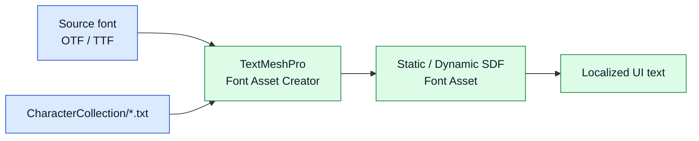

# CycloneGames.FontAssets

[English | 简体中文](README.SCH.md)

CycloneGames.FontAssets ships curated character collection text files for Chinese (simplified and traditional), Japanese, Korean, and Latin text rendering in Unity. Each file is a UTF-8 line of unique code points designed to feed TextMeshPro `Dynamic SDF` atlases, TextMesh Pro Offline Font Asset creators, and custom glyph subsetting pipelines a known, bounded glyph set.

## Table of Contents

- [Overview](#overview)
- [Architecture](#architecture)
- [Quick Start](#quick-start)
- [Core Concepts](#core-concepts)
- [Usage Guide](#usage-guide)
- [Advanced Topics](#advanced-topics)
- [Common Scenarios](#common-scenarios)
- [Performance and Memory](#performance-and-memory)
- [Troubleshooting](#troubleshooting)

## Overview

A glyph atlas answers one question: which characters must be rasterized, and at what cost? CycloneGames.FontAssets answers that with seven text files, each containing the unique code points a typical project needs for one language. Load the file into a TextMeshPro font asset creator, point the creator at the source font, and the produced atlas contains exactly the characters listed — no more guessing from a sample string, no more atlas bloat from a full Unicode block.

The package is data-only: it has no `Runtime/` source, no asmdef, no scripts, and no compiled output. It is consumed by importing the text files into the project, opening them in a TextMeshPro font asset creator, or reading them at runtime from a build location. The files use UTF-8 without BOM and contain only characters (no whitespace beyond a final newline where present), so they are safe to read line-by-line or as a single string.

Use this package when a project needs predictable, language-scoped glyph coverage for shipped fonts. Do not use it as a substitute for the actual font binary files — the source OTF/TTF still ships in the project, and the character collection only controls which glyphs the TextMeshPro atlas rasterizes.

### Key Features

- **Latin collection** — basic ASCII letters, digits, extended Latin, and common punctuation.
- **Simplified Chinese collections** — three presets: 3,500 common characters, 7,000 extended characters, and a full common set with symbols.
- **Traditional Chinese collection** — common traditional characters with symbols.
- **Japanese collection** — Hiragana, Katakana, and common Kanji.
- **Korean collection** — Hangul syllables and Jamo.
- **UTF-8 without BOM** — safe to read with `File.ReadAllText` and TextMeshPro creators on every Unity platform.

## Architecture

The package is one directory of text files plus the UPM manifest. There is no assembly, no editor code, and no runtime code.

| Path | Purpose |
| --- | --- |
| `package.json` | UPM manifest. `com.cyclone-games.fontassets`. No dependencies. |
| `CharacterCollection/latin.txt` | Latin letters, digits, and punctuation. |
| `CharacterCollection/chinese_amount_3500_with_symbols.txt` | ~3,500 most common simplified Chinese characters with symbols. |
| `CharacterCollection/chinese_amount_7000_with_symbols.txt` | ~7,000 extended simplified Chinese characters with symbols. |
| `CharacterCollection/chinese_all_with_symbols.txt` | Full common simplified Chinese set with symbols. |
| `CharacterCollection/chinese-traditional.txt` | Common traditional Chinese characters. |
| `CharacterCollection/ja.txt` | Hiragana, Katakana, and common Kanji. |
| `CharacterCollection/ko.txt` | Hangul syllables and Jamo. |



The owner chooses a source font and a character collection, the TextMeshPro Font Asset Creator rasterizes the listed glyphs into an SDF atlas, and runtime UI text renders against that atlas. The package only contributes the character collection; the font binary and the produced atlas are owned by the project.

## Quick Start

Import the package into a Unity project, then open the Font Asset Creator from **Window > TextMeshPro > Font Asset Creator**.

### Create a Chinese SDF font asset

1. In **Source Font File**, drag in the source OTF or TTF (e.g., Noto Sans SC).
2. In **Character Set**, choose **Characters from File**.
3. In **Character File**, drag in `CharacterCollection/chinese_amount_3500_with_symbols.txt`.
4. Set **Atlas Resolution** to 2048×2048 and **Padding** to 5.
5. Click **Generate Font Atlas**, then **Save** the resulting `.asset` file.

The produced `TMP_FontAsset` contains exactly the 3,500 characters in the collection plus any common symbols. Assign it to a `TextMeshProUGUI` component and the localized text renders without missing-glyph warnings.

### Use the same file in a build pipeline

```csharp
using System.IO;
using UnityEngine;
using TMPro;

public static class FontAtlasBuilder
{
    public static void CreateChineseFontAsset(TMP_FontAsset source, string outputPath)
    {
        string collectionPath = "Packages/com.cyclone-games.fontassets/CharacterCollection/chinese_amount_3500_with_symbols.txt";
        string characters = File.ReadAllText(collectionPath);

        // Use TMP_FontAsset.CreateFontAsset or your own atlas baker:
        TMP_FontAsset fontAsset = TMP_FontAsset.CreateFontAsset(source.sourceFontFile, samplingPointSize: 36, atlasPadding: 5);
        fontAsset.AddCharacters(characters);
        AssetDatabase.CreateAsset(fontAsset, outputPath);
    }
}
```

This pattern works for editor-time build pipelines that regenerate font assets when the source font or character set changes.

## Core Concepts

### Character collections

A character collection is a UTF-8 text file containing every code point a project needs for one language, with duplicates removed. Each file is a single line of characters (with an optional trailing newline) so the entire file can be read with `File.ReadAllText` and passed directly to TextMeshPro or a custom atlas baker.

| File | Approximate character count | Use |
| --- | ---: | --- |
| `latin.txt` | 377 | English UI, numbers, basic punctuation. |
| `chinese_amount_3500_with_symbols.txt` | 3,716 | Mobile casual games targeting simplified Chinese — covers GB 2312 common use. |
| `chinese_amount_7000_with_symbols.txt` | 7,215 | Mid-budget simplified Chinese coverage — covers GB 2312 plus extended common characters. |
| `chinese_all_with_symbols.txt` | 8,558 | Full common simplified Chinese — covers GB 2312 plus rare and historical characters. |
| `chinese-traditional.txt` | 2,628 | Traditional Chinese (Taiwan, Hong Kong) common characters. |
| `ja.txt` | 6,780 | Japanese — Hiragana, Katakana, common Joyo Kanji. |
| `ko.txt` | 866 | Korean — Hangul syllables and Jamo. |

### Why curated collections

The TextMeshPro Font Asset Creator can rasterize a font's entire glyph table, but most projects need only a small subset. A full CJK font contains tens of thousands of glyphs; rasterizing all of them at 32 pt into a 2048×2048 atlas produces unreadable small glyphs and breaks the build. A curated collection keeps the atlas dense, the build time short, and the runtime memory bounded.

The collections in this package were chosen to cover typical UI text and gameplay text. They are not Unicode-complete: rare characters, scientific symbols, emoji, and historic scripts are excluded. Projects that need a specific rare character should append it to a project-local copy of the file or pass it through a custom collection.

### File format

Every file is UTF-8 without BOM. Most files contain a single line of characters with no separator between code points. The Japanese file (`ja.txt`) uses multiple lines for Hiragana, Katakana, and Kanji sections; reading the whole file with `File.ReadAllText` and stripping whitespace is the canonical loading pattern.

```csharp
string raw = File.ReadAllText(collectionPath);
string characters = new string(raw.Where(c => !char.IsWhiteSpace(c)).ToArray());
```

## Usage Guide

### Choose a collection

| Project profile | Recommended file |
| --- | --- |
| English-only UI | `latin.txt` |
| Casual mobile game, simplified Chinese market | `chinese_amount_3500_with_symbols.txt` |
| Mid-budget mobile or PC, simplified Chinese market | `chinese_amount_7000_with_symbols.txt` |
| AAA-quality simplified Chinese, full coverage | `chinese_all_with_symbols.txt` |
| Traditional Chinese market (Taiwan, Hong Kong) | `chinese-traditional.txt` |
| Japanese market | `ja.txt` |
| Korean market | `ko.txt` |
| Multi-language build | Combine files at build time (see [Advanced Topics](#advanced-topics)) |

### Generate a static font asset

Static font assets rasterize every glyph in the collection up front. They are the right choice when the character set is fixed at build time.

1. Open **Window > TextMeshPro > Font Asset Creator**.
2. Drag the source font into **Source Font File**.
3. Set **Sampling Point Size** to the size used at runtime (commonly 36–48).
4. Set **Padding** to 5 or higher to avoid glyph bleeding.
5. Set **Atlas Resolution** to 1024×1024 for Latin, 2048×2048 or 4096×2048 for CJK.
6. Set **Character Set** to **Characters from File**.
7. Drag the chosen collection file into **Character File**.
8. Click **Generate Font Atlas** and verify the preview shows every glyph.
9. Click **Save** and assign the resulting `.asset` to a `TMP_FontAsset` field.

### Generate a dynamic font asset

Dynamic font assets rasterize glyphs on demand. Use them when the character set is not fully known at build time — for example, when players type arbitrary text in a chat box. The character collection still seeds the atlas with the most common glyphs so cold-start latency stays low.

1. Follow the static steps above, but check **Include Font Features** and enable **Multi Atlas Texture** support.
2. After generation, set the `TMP_FontAsset`'s `atlasPopulationMode` to `Dynamic` in the Inspector.
3. At runtime, missing glyphs are rasterized on demand from the source font.

### Read a collection at runtime

```csharp
using System.IO;
using System.Linq;
using UnityEngine;

public sealed class CharacterCollectionLoader
{
    public string Load(string fileName)
    {
        string path = System.IO.Path.Combine(
            Application.streamingAssetsPath,
            "CharacterCollections",
            fileName);

        string raw = File.ReadAllText(path);
        return new string(raw.Where(c => !char.IsWhiteSpace(c)).ToArray());
    }
}
```

Copy the files you need into `Assets/StreamingAssets/CharacterCollections/` and load them on demand. This pattern is useful when the project supports downloadable language packs.

## Advanced Topics

### Combining collections

A multi-language build can combine several collection files into one superset:

```csharp
using System.Collections.Generic;
using System.IO;
using System.Linq;

public static class CollectionCombiner
{
    public static string Combine(params string[] paths)
    {
        var set = new HashSet<char>();
        foreach (string path in paths)
        {
            foreach (char c in File.ReadAllText(path))
            {
                if (!char.IsWhiteSpace(c))
                {
                    set.Add(c);
                }
            }
        }

        char[] sorted = set.ToArray();
        System.Array.Sort(sorted);
        return new string(sorted);
    }
}
```

A combined collection is appropriate for a single font asset that serves every language. The atlas grows quadratically with character count, so prefer per-language font assets when memory is tight.

### Subsetting for size

Mobile builds often ship a 1024×1024 CJK atlas to keep download size under 100 MB. The 3,500-character preset is calibrated to fit a 2048×2048 atlas at 36 pt with 5 px padding. If the build must use a 1024×1024 atlas, split the collection by frequency:

```csharp
string[] common = File.ReadAllText("chinese_amount_3500_with_symbols.txt")
    .Distinct().Chunk(1800).Select(c => new string(c)).ToArray();
// common[0] is the most frequent 1,800 characters; common[1] is the rest.
```

Rasterize `common[0]` into a static atlas and let `common[1]` fall through to a dynamic atlas. This keeps the static atlas dense and defers rare characters to on-demand rasterization.

### Custom collections

The files are plain text. A project that needs to add characters (a new product name, an unlisted symbol, a missing punctuation mark) can copy a file into `Assets/` and append the characters:

```text
// Copy chinese_amount_3500_with_symbols.txt to Assets/Editor/MyChineseSet.txt
// Open MyChineseSet.txt and append:
★☆※※
```

Point the Font Asset Creator at the project-local copy. The package file stays untouched, so updates to the package do not overwrite project additions.

### Validating coverage

A localized string contains characters outside the atlas if and only if TextMeshPro emits a missing-glyph warning at runtime. To validate coverage at build time:

```csharp
using System.Collections.Generic;
using System.IO;
using System.Linq;
using UnityEngine;

public static class FontCoverageValidator
{
    public static IEnumerable<char> FindMissing(string collectionPath, string stringTablePath)
    {
        var collection = new HashSet<char>(
            File.ReadAllText(collectionPath).Where(c => !char.IsWhiteSpace(c)));

        foreach (char c in File.ReadAllText(stringTablePath))
        {
            if (!char.IsWhiteSpace(c) && !collection.Contains(c))
            {
                yield return c;
            }
        }
    }
}
```

Run this in an editor build step and fail the build if the result is non-empty. This catches missing characters before they reach QA.

## Common Scenarios

### Localized mobile UI in three languages

A mobile game ships English, Simplified Chinese, and Japanese UI from the same source font:

1. Generate three `TMP_FontAsset` instances using `latin.txt`, `chinese_amount_3500_with_symbols.txt`, and `ja.txt`.
2. Bind a `TMP_FontAsset` field per language in the localization system.
3. Switch fonts when the player changes language.

This keeps each atlas small and avoids rasterizing unused glyphs for inactive languages.

### Chat box with dynamic fallback

A multiplayer chat box must render any character a player types, including ones outside the static atlas:

1. Generate the static atlas from `chinese_amount_3500_with_symbols.txt` (covers common gameplay text).
2. Set the font asset's `atlasPopulationMode` to `Dynamic`.
3. Assign the source OTF to the `sourceFontFile` field.
4. At runtime, TextMeshPro rasterizes unknown characters on demand from the source font.

The static atlas handles 99% of the text; the dynamic path handles the long tail.

### Build-time font regeneration

A CI pipeline regenerates font assets when the source font or character collection changes:

```csharp
using UnityEditor;
using UnityEngine;
using TMPro;

public static class FontAssetBuildStep
{
    public static void Regenerate()
    {
        var source = AssetDatabase.LoadAssetAtPath<Font>("Assets/Fonts/NotoSansSC.otf");
        string collection = "Packages/com.cyclone-games.fontassets/CharacterCollection/chinese_amount_7000_with_symbols.txt";

        var fontAsset = TMP_FontAsset.CreateFontAsset(source, samplingPointSize: 36, atlasPadding: 5);
        fontAsset.AddCharacters(System.IO.File.ReadAllText(collection));

        AssetDatabase.CreateAsset(fontAsset, "Assets/Generated/NotoSansSC_7000.asset");
        AssetDatabase.SaveAssets();
    }
}
```

Call this from a `-executeMethod` step in your build script to ensure the atlas always matches the current collection.

### Telemetry for missing glyphs

A live-ops build wants to know which characters players type that are not in the atlas:

```csharp
using System.Collections.Generic;
using System.IO;
using UnityEngine;
using TMPro;

public sealed class MissingGlyphTelemetry : MonoBehaviour
{
    [SerializeField] private TMP_Text _text;
    private HashSet<char> _missing = new HashSet<char>();

    void Update()
    {
        string s = _text.text;
        foreach (char c in s)
        {
            if (!_text.font.HasCharacter(c))
            {
                _missing.Add(c);
            }
        }
    }

    void OnApplicationQuit()
    {
        File.WriteAllText("missing_glyphs.txt", new string(_missing.ToArray()));
    }
}
```

Feed the resulting file into the next collection update so the missing characters ship in the next build.

## Performance and Memory

| File | Approximate size (UTF-8 bytes) | Approximate character count | Typical atlas (2048² @ 36 pt, 5 px padding) |
| --- | ---: | ---: | --- |
| `latin.txt` | 725 | 377 | 256×256 — fits comfortably. |
| `ko.txt` | 2,594 | 866 | 1024×1024. |
| `chinese-traditional.txt` | 7,880 | 2,628 | 2048×2048. |
| `chinese_amount_3500_with_symbols.txt` | 10,957 | 3,716 | 2048×2048. |
| `ja.txt` | 11,583 | 6,780 | 2048×4096. |
| `chinese_amount_7000_with_symbols.txt` | 21,454 | 7,215 | 4096×4096 or multi-atlas. |
| `chinese_all_with_symbols.txt` | 25,091 | 8,558 | 4096×4096 or multi-atlas. |

Atlas size grows roughly quadratically with character count. A 4,096×4,096 RGBA8 atlas consumes 64 MB of GPU memory uncompressed; ASTC 6×6 compression brings it to ~11 MB. Prefer per-language font assets over one giant atlas when memory is tight.

### Build-time cost

Rasterizing 7,000 CJK glyphs at 36 pt into a 2048² atlas takes 20–60 seconds in the Font Asset Creator, depending on the source font complexity and editor machine. CI pipelines should cache the produced `.asset` and regenerate only when the source font or collection file changes.

### Runtime cost

A static font asset has zero per-frame cost — glyphs are looked up in a hash table and sampled from the atlas. A dynamic font asset pays a one-time cost per missing glyph to rasterize it from the source font and insert it into the atlas; subsequent uses of the same glyph are free.

### Encoding

Every file is UTF-8 without BOM. Reading the file with `File.ReadAllText` returns the correct characters on every Unity-supported platform. Do not transcode to UTF-16 or ASCII — both lose characters and break the atlas.

## Troubleshooting

| Symptom | Likely cause | Resolution |
| --- | --- | --- |
| Missing-glyph warnings at runtime | The string contains characters not in the atlas | Append the missing characters to a project-local copy of the collection and regenerate the font asset |
| Font Asset Creator reports an empty atlas | The character file path is wrong, or the file is empty | Verify the path resolves under `Packages/com.cyclone-games.fontassets/CharacterCollection/` and the file is not zero bytes |
| Atlas is too large to fit in one texture | The character count exceeds the atlas capacity at the chosen point size | Lower the point size, raise the atlas resolution, enable multi-atlas, or split the collection |
| TextMeshPro renders tofu boxes | The source font does not contain the requested glyph | Use a font that covers the target script (Noto Sans CJK for CJK, Noto Sans for Latin) |
| Build fails with `Character is not in the font asset` | A string table contains characters not in the static atlas | Run a build-time coverage validator and either expand the collection or switch to dynamic mode |
| Characters appear garbled after a build | The file was re-saved with a BOM or different encoding | Re-export as UTF-8 without BOM; the package files are already in this format |
| Same character appears multiple times in the atlas | The collection file has duplicates | The package files are deduplicated; check that a project-local copy has not introduced duplicates |

## References

- [TextMeshPro](https://docs.unity3d.com/Packages/com.unity.textmeshpro@latest) — font asset creation and glyph rendering.
