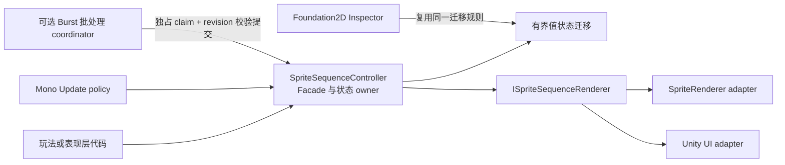

# CycloneGames.Foundation2D

CycloneGames.Foundation2D 为 `SpriteRenderer` 和 Unity UI `Image` 提供生产级序列帧播放能力。模块具有明确的播放所有权，支持 MonoBehaviour 驱动和可选的 Burst 批处理更新，并提供 authoring 工具，用于在进入 Play Mode 前验证 renderer、材质与序列帧组合。

## 目录

- [概述](#概述)
- [架构](#架构)
- [快速上手](#快速上手)
- [核心概念](#核心概念)
- [使用指南](#使用指南)
- [进阶主题](#进阶主题)
- [常见场景](#常见场景)
- [性能与内存](#性能与内存)
- [故障排查](#故障排查)

## 概述

模块处理视觉动画：特效、世界空间装饰物、UI 指示器、角色头像和轻量级群体。权威玩法模拟、动画图、骨骼动画、2D 物理、Tilemap、网络协议和存档格式由各自的模块负责。需要确定性回滚或服务器权威的玩法代码应维护独立的版本化状态，并以已提交的玩法状态驱动表现层。

## 快速上手

### SpriteRenderer

1. 在同一个 GameObject 上添加 `SpriteRendererSequenceRenderer` 和 `SpriteSequenceController`。
2. 按播放顺序把 Sprite 拖入 **Frames**。Inspector 支持一次拖入多个 Sprite 或经过切片的纹理。
3. 把 renderer 组件赋给 **Renderer Component**。留空时，组件也会在初始化阶段执行一次本地组件查找。
4. 保持 **Render Mode** 为 `SpriteSwap`，以获得最广泛的兼容性。
5. 启用 **Play On Enable**，或在代码中调用 `Play()`。

```csharp
using CycloneGames.Foundation2D.Runtime;
using UnityEngine;

public sealed class OneShotEffect : MonoBehaviour
{
    [SerializeField] private SpriteSequenceController sequence;

    private void OnEnable()
    {
        sequence.OnPlayComplete += HandleComplete;
        sequence.Play();
    }

    private void OnDisable()
    {
        sequence.OnPlayComplete -= HandleComplete;
    }

    private void HandleComplete()
    {
        gameObject.SetActive(false);
    }
}
```

一次性特效使用 `Once`，持续重复使用 `Loop`，完成一次往返的动画使用 `PingPong`。

### Unity UI Image

1. 在包含 `Image` 的对象上添加 `UGUISequenceRenderer` 和 `SpriteSequenceController`。
2. 把 `UGUISequenceRenderer` 赋给 **Renderer Component**。
3. 首先使用 `SpriteSwap`。它保留标准 `Image` 行为，适用于无关纹理、经过 trim 的 Sprite、Sliced Image 或几何不同的 Sprite。
4. 只有严格的 flipbook 兼容报告显示就绪时，才使用 Inspector 中的材质工具。

发版前必须在真实 UI 层级中验证 UI Mask、Stencil、CanvasGroup alpha 和目标渲染管线行为。

## 架构



`SpriteSequenceController` 拥有唯一播放状态。只有主线程可以调用它的 public 方法或接收事件。Burst manager 可以 claim controller 的外部更新所有权，但 controller 仍是接收或拒绝批处理结果并提交视觉输出的权威 owner。Command revision 会阻止较早调度的结果覆盖较新的 `Play`、`Pause`、`Resume`、`Stop`、`GoToFrame`、速度或 driver 变更。

`ISpriteSequenceRenderer` 是一个窄 adapter，只负责初始化、应用帧和可见性。Renderer 组件拥有 Unity renderer 绑定、预计算 UV 数据和临时材质覆盖，但不拥有播放 policy。

### 程序集与依赖

| Assembly | 用途 | 激活条件 |
| --- | --- | --- |
| `CycloneGames.Foundation2D.Runtime` | Controller、有界播放状态、SpriteRenderer 与 UGUI adapter | 常规 Editor 和 Player 编译 |
| `CycloneGames.Foundation2D.Integrations.Burst` | Burst/Jobs 批处理 coordinator | 仅在兼容的 Burst 与 Collections 包存在时编译 |
| `CycloneGames.Foundation2D.Editor` | Inspector、校验、预览和材质 authoring | 仅 Editor |
| `CycloneGames.Foundation2D.Sample.Runtime` / `.Editor` | 端到端 benchmark sample | 位于 Assets 下的 Sample assembly 会在条件满足时参与编译；需要 Burst integration 和 Factory Unity adapter |

Runtime 使用 `CycloneGames.Logger` 输出诊断，并通过 Unity UI 支持 `Image` adapter。Burst 和 Collections 是可选 integration 依赖；基础 Runtime assembly 不引用它们。本包位于 `Assets/ThirdParty`，因此 `package.json` 只是 metadata，不会自动安装同级 package。当前 checkout 的 `Packages/manifest.json`、lock file、asmdef 和实际编译结果才是依赖事实来源。

模块不需要 PlayerSettings Scripting Define Symbols。Burst integration 通过 package `versionDefines` 和 assembly `defineConstraints` 激活。

Burst integration 的 `autoReferenced` 为 `false`。`Assembly-CSharp` 等预定义 assembly 中的源码不能直接引用 `SpriteSequenceBurstManager`；应创建 asmdef，并显式引用 `CycloneGames.Foundation2D.Integrations.Burst`。这样不会让未使用 integration 的消费者承担 Burst 与 Collections 依赖。

## 核心概念

播放使用表现层时间，内部累计值为 `double`。

- `Once` 让每个 Sprite 保持一个完整帧时长，并在终止帧停止。
- `Loop` 到达 wrap 边界时完成一个 cycle。有限循环会在完成指定 cycle 数量后停留在终止帧。
- `PingPong` 把“从起始边到对侧边，再返回起始边”的完整往返定义为一个 cycle。因此有限计数为 1 时会停在起始边。
- 单帧序列仍然具有帧时长。`Once` 会在该时长后完成；循环模式会产生有界 cycle 通知，不会永久卡在无法完成的播放状态。
- Loop interval 只发生在已完成的 cycle 之间。`Last`、`First` 和 `Blank` 只控制 interval 期间的视觉状态。
- 一次 Tick 可以跨越多个帧或 cycle 边界。帧通知会合并到本次 Tick 最终提交的帧；loop 通知依据 controller 事件契约表示已完成一个或多个 cycle。
- 负数、NaN 或无限时间输入会被拒绝。**Max Frame Advances Per Update** 对追帧工作设置硬上限。超过预算时会丢弃多余的整帧 backlog，但保留小数余量，从而避免一次 hitch 形成无界恢复尖峰。

追帧预算是稳定性 policy，不是确定性模拟保证。应根据最高 authoring 帧率和可接受的最大视觉追帧窗口设置该值。

### Controller 配置

| 字段 | 含义与失败行为 |
| --- | --- |
| Frames | 按顺序排列的 Sprite 引用。列表为空时 `Play` 不会开始；null 帧会被作为无效视觉输入处理，不会被解引用。 |
| Frame Rate | 每秒帧数。Inspector 与运行时初始化会要求有限正值。 |
| Play Mode | `Once`、`Loop` 或完整 cycle 的 `PingPong`。 |
| Direction | 选择起始边和初始移动方向。 |
| Update Driver | `MonoUpdate` 或 `BurstManaged`。序列化数值保持稳定。 |
| Fallback To Mono Update When Burst Unavailable | 当没有 manager 拥有该 controller 时，允许配置为 Burst 的 controller 继续在主线程更新。只有缺少 batch owner 时必须停止更新，才应关闭。 |
| Play On Enable | 组件启用时调用 `Play`。 |
| Ignore Time Scale | 使用 Unity unscaled time 驱动表现。 |
| Speed Multiplier | 非负播放倍率。零会冻结时间，但不改变播放状态。 |
| Discrete Speed Multiplier | 把速度量化到配置范围和步数，可用于减少视觉上不同的时间变体。 |
| Max Frame Advances Per Update | 对每个 controller 的追帧工作和 callback 聚合设置硬上限。 |
| Loop Interval | 已完成 cycle 之间的非负延迟。 |
| Interval Hold Frame | Interval 期间保留终止帧、显示下一 cycle 的首帧，或隐藏 renderer。 |
| Finite Loop Count | 完成正数个 cycle 后停止。 |
| Renderer Component | 实现 `ISpriteSequenceRenderer` 的本地 `MonoBehaviour`。无效赋值会输出诊断，不会使用反射扫描。 |

运行时控制示例：

```csharp
sequence.Play();
sequence.Pause();
sequence.Resume();
sequence.GoToFrame(7);
sequence.SetSpeedMultiplier(0.5f);
sequence.Stop();
```

`IsPlaying`、`IsPaused`、`CurrentFrame`、`CurrentUpdateDriver`、`RawSpeedMultiplier` 和 `EffectiveSpeedMultiplier` 提供只读诊断。`QuantizeSpeedMultiplier` 允许工具或玩法 UI 在不改变状态的情况下预览离散速度 policy。

事件由主线程发布。只有 renderer 接受新视觉后才会触发 `OnFrameChanged`。`OnLoopComplete` 与 `OnPlayComplete` 表示权威播放状态迁移；即使 renderer 提交失败也会触发，避免表现层故障吞掉完成信号。Callback 若发出新的 controller command，会使旧更新中尚未发布的通知失效。订阅和退订必须与消费者生命周期一致；模块不提供 worker-thread callback 契约。

## 使用指南

### SpriteSwap

`SpriteSwap` 把当前 `Sprite` 赋给 `SpriteRenderer.sprite` 或 `Image.sprite`。它支持不同源纹理和常规 Sprite authoring 差异，是默认路径和 fallback 路径。

### Shared-material flipbook

Flipbook 路径保留基础 Sprite 几何，并把 UV remap 到另一帧。只有每一帧都能证明与基础几何兼容时才会启用。校验至少会拒绝：

- null Sprite 或 texture；
- 不同的 texture object；
- 无法用轴对齐矩形表达的 tight packing 或 rotation；
- 不同的 rect size、pivot、pixels-per-unit、border、vertex layout、triangle layout 或归一化局部几何；
- 使用错误 Shader 或缺少 remap property 的材质；
- 缺失 UGUI mesh effect 或 Canvas UV channel。

Runtime 与 Inspector 使用同一兼容契约。当 atlas `textureRect` 读取失败时，模块不会用 `sprite.rect` 代替，因为这会生成错误的 atlas UV。初始化无法证明兼容性时，renderer 会恢复原材质并安全使用 `SpriteSwap`。

SpriteRenderer 通过复用的 `MaterialPropertyBlock` 写入 remap vector，并保留 block 中的无关 property。UGUI 通过顶点 channel 携带实例 rect。`TexCoord1` 和 `TexCoord2` 是 Canvas 级 authoring 要求，因为启用它们会增加整个 Canvas 的顶点带宽。Runtime 不会静默永久接管该 Canvas 配置。

材质覆盖会在初始化时捕获，并在 renderer 不再拥有 flipbook 材质时恢复。`OnValidate` 不会修改 sibling renderer 的材质，从而保留 Editor 中的 Undo、Prefab Override 和 domain reload 行为。

### Inspector 工作流

Foundation2D Inspector 提供：

- 适配 Editor 主题的分区、紧凑状态 badge、自动换行说明和每个 Inspector 实例保留的 foldout 状态；
- 可响应窄停靠 Inspector 的 action group，长按钮不会被强行挤在同一行；
- 帧拖放、自然名称排序、反转，以及带确认的破坏性操作；
- 分页的帧字段与缩略图，使长序列的 repaint 成本有界；
- 使用与 Runtime 相同的有界播放状态进行预览；
- 普通 SerializedProperty 字段支持多对象编辑，无法安全批量执行的 target-specific 预览和资产操作会被禁用；
- 只在相关序列化变更后或显式请求时刷新的 renderer 兼容报告；
- 紧凑的 Material object field 与显式搜索/创建 action；组件 Inspector 不会嵌入完整 Material Inspector；
- `FlipbookUVMeshEffect` readiness 视图，用于检查启用状态、目标 Graphic、Canvas 和必需 shader channel；显式且支持 Undo 的操作可以启用被禁用的 effect，或在保留 Canvas 现有 flag 的前提下补齐缺失 channel；
- 使用唯一资产路径、Undo 注册和定向保存创建材质，不触发全项目 `AssetDatabase.Refresh`。

Renderer 报告不会在每次 Layout/Repaint 时扫描所有 SpriteAtlas 或 Material。项目范围的候选搜索只通过明确的冷路径按钮触发。

每个核心自定义 Inspector 都会在打开 layout group 前验证自身的序列化字段契约。Runtime 与 Editor schema 漂移时，Inspector 会显示安全 fallback，不会让 IMGUI layout state 处于未闭合状态。EditMode 契约测试覆盖显式 property path、默认与 flipbook 专用状态、mesh-effect 视图、单对象与混合多对象选择，以及代表性窄/宽尺寸下的 Layout 与 Repaint pass。

当 UGUI renderer 显式引用另一个 GameObject 上的 `Image` 时，**Add Flipbook UV Effect** 会在该 Image GameObject 上添加或复用 effect。这与 Runtime 的所有权规则一致：mesh effect 修改其绑定的同一个 Graphic，而 renderer 可以位于其他对象上。

## 进阶主题

只有 Profiler 证明大量 active controller 的状态迁移成本显著时，才应使用 `SpriteSequenceBurstManager`。小数量对象保留在 manager 的 inline 路径，因为 schedule 和 managed/native copy 成本可能高于实际状态迁移。

Manager 拥有可复用的 persistent native buffer，在配置上限内按几何级数增长，并在 disable 或 destroy 时完成已调度工作并释放分配。它不会每帧缩容，因为高频 shrink 会造成 allocator churn。大规模场景应预热预期容量，随后把它视为直到显式 teardown 前的 high-water mark。

Controller 通过显式注册或 manager 子级范围收集。默认不存在 whole-scene search 或静态全局 controller registry。`RegisterController(controller, out registrationAdded)` 可以区分新建的 runtime registration 与已经通过配置源拥有的 controller；`UnregisterControllers` 以一次 ownership rebuild 批量释放注册。一个 controller 只能有一个外部 manager owner。第二个 manager 会跳过冲突 controller 并报告所有权错误，而不是重复更新。

所有 Unity object 读取、结果提交、renderer 调用和事件都保持在主线程。Job 只处理复制的 unmanaged 播放值。对 Unity object 加锁不能使其 API 线程安全，因此模块不会引入这类锁。

## 性能与内存

- 常规播放更新值状态，不使用 LINQ、反射、动态注册、Coroutine allocation 或每帧 Command object。
- 每个 active controller 的追帧复杂度为 `O(min(跨越的帧边界数, 配置预算))`。
- Renderer UV 与几何校验是初始化冷路径。兼容的 UV rect 会被缓存并在播放期间复用。
- SpriteSwap 只改变 Sprite 引用；实际 batching 和 rebuild 行为仍取决于 renderer、Canvas、材质、atlas、渲染管线和平台。
- SpriteRenderer shared-material flipbook 通过 `MaterialPropertyBlock` 写入逐 renderer UV 状态。在 SRP 中，这些 renderer 不参与 SRP Batcher。共享材质可以避免逐实例材质副本，但不能证明 draw-call batching；必须在 Frame Debugger 和目标硬件上与 SpriteSwap 对比。
- Burst integration 会把状态复制到 persistent native buffer。它不保证自动更快；必须通过自带 benchmark 和目标硬件上的 Release Player 决策。
- Editor 静态缓存只保存有界、不可变的 UI 数据。冷路径操作结束后，scratch collection 会清除资源引用。

模块不承诺跨项目统一的“零 GC”或容量数字。只有在目标 backend、内容、renderer 层级和 Profiler 配置下可复现时，才能声称 warmed 播放路径无分配、实例上限或 batching 结果成立。

### 平台说明

基础实现使用项目 Unity 2022.3 版本线可用的 Unity API，不包含 native plugin、unsafe code、运行时反射发现、文件 I/O 或后台线程 Unity object 访问。

| 目标 | 设计契约 | 发版前必须验证 |
| --- | --- | --- |
| Windows、Linux、macOS | 可用于 Mono 和 IL2CPP 的 Unity 表现路径 | Release Player smoke、Profiler capture、Shader variant、目标 Graphics API |
| Android | 有界的移动端状态工作，不从后台线程调用 Unity API | ARM64 IL2CPP、Vulkan/GLES、atlas compression/external alpha、温控与内存压力 |
| iOS | 显式类型、无动态代码生成，适配 AOT | Metal IL2CPP build、Mask、atlas alpha、设备内存与 suspend/resume |
| WebGL | 缺少 Burst integration 时仍可使用基础 Mono-style 更新；benchmark 文件日志被禁用 | WebGL build、浏览器内存、worker 可用性、Shader precision 和 UI Mask |
| Dedicated Server | 可以不包含表现模块；权威模拟不依赖本模块 | 如果仍包含 assembly，检查 headless composition 与 stripping |
| 未来主机 | Core API 不嵌入平台 SDK 假设 | 平台 SDK build、Shader compiler、内存、suspend/resume 与认证检查 |

一次 Editor 测试通过不能证明 Player、IL2CPP、Burst、移动端、WebGL、主机或长时间稳定性。

## 常见场景

Runtime 播放不会写入文件、偏好、registry、存档数据或隐藏全局设置，也不使用 `PlayerPrefs`、`EditorPrefs` 或 `SessionState`。

Editor 只会在用户显式操作后创建 `.mat` 资产。所选路径可见，资产的版本控制所有权属于项目；没有 renderer 引用后可以删除。模块不会自动运行资产迁移。

Benchmark 可以在以下位置写入轮转日志：

```text
Application.persistentDataPath/Logs/SpriteSequenceBenchmark.log
```

叶文件名会被校验，轮转容量有界，WebGL Player 禁用文件日志。Benchmark 日志只是诊断信息，不是真实数据源；没有进程写入时可以安全删除。

### Benchmark 方法

自带 Sample 比较 baseline、MonoUpdate 和 Burst-managed 的端到端帧。Burst 阶段要求显式指定 active `SpriteSequenceBurstManager`；Harness 会临时注册被测 controller，并在所有权或容量失败时取消运行，不会把 MonoUpdate fallback 报告为 Burst。它会缓存 yield instruction，因此测量循环不会每帧创建新的 `WaitForEndOfFrame`。Harness 会恢复现有 controller 的 driver、播放/暂停状态、可见帧和 enabled 状态，但无法重建精确的子帧 elapsed time 或已完成 cycle phase；需要保持线上状态连续时应使用专用 benchmark target。全局 `GC.Alloc`、帧时间、batch 和 SetPass 计数仍包含同一帧中的其他系统，不能把它们解释为 Foundation2D 独立 CPU 成本。

文本报告输出平均值、最小值和最大值。p50、p95 与 p99 必须从 Unity Profiler 数据或外部 trace 获取；Sample 本身不计算 percentile。

获得可用结果的步骤：

1. 使用专用 benchmark scene 和生成目标，不混入无关玩法对象。
2. 指定专用 active Burst manager，并把 prewarm 与最大容量设置为不低于最大被测 controller 数量。
3. 关闭 VSync，并记录 frame cap、backend、Burst 状态、Graphics API、设备、quality setting、分辨率、温控状态和内容配置。
4. 预热到预期最大容量。
5. 同时测量 Development Player 和非 Development Release Player；容量决策采用 Release 结果。
6. 比较 p50、p95、p99 CPU、worker schedule/complete 成本、每帧 GC、native high-water memory、Canvas rebuild、draw call 和 batch。
7. Atlas、材质、Canvas、渲染管线或目标平台变化后重新测量。

Sample 是测量工具，不是通用硬件阈值。

## 验证

在 `<repo-root>` 使用 clean project profile 通过 Unity Test Framework 运行 Foundation2D 测试：

```powershell
& '<UnityEditor>/Unity.exe' -batchmode -nographics `
  -projectPath '<repo-root>/UnityStarter' `
  -runTests -testPlatform EditMode `
  -testResults '<results>/foundation2d-editmode.xml' `
  -logFile '<results>/foundation2d-editmode.log' -quit

& '<UnityEditor>/Unity.exe' -batchmode -nographics `
  -projectPath '<repo-root>/UnityStarter' `
  -runTests -testPlatform PlayMode `
  -testResults '<results>/foundation2d-playmode.xml' `
  -logFile '<results>/foundation2d-playmode.log' -quit
```

最小手动检查：

1. Reimport 模块，确认 Runtime、可选 Burst integration、Editor、Sample 和 Test asmdef 在当前 package profile 下按预期编译。
2. 覆盖 Once、Loop、PingPong、reverse、单帧、interval、有限循环、pause/resume 和 catch-up clamp。
3. 使用 Frame Debugger 和 Profiler 验证 SpriteSwap 与 flipbook 输出。
4. 验证 UGUI Mask、RectMask2D、CanvasGroup alpha、nested Canvas 和 required additional shader channel。
5. 验证材质赋值 Undo/Redo、Prefab Override、多对象编辑、domain reload 和 Editor restart。
6. 在 active work 期间 disable 或 destroy manager，确认 job 完成且 native buffer 释放。
7. 在声明平台支持前构建真实 Player backend 和 Graphics API。

## 故障排查

| 现象 | 检查项 |
| --- | --- |
| Controller 不播放 | Frames 非空、renderer 实现 `ISpriteSequenceRenderer`、组件已启用、effective speed 大于零。 |
| BurstManaged 发生 fallback | Burst/Collections integration 已编译、启用的 manager 显式拥有 controller，且没有第二个 manager 先完成 claim。 |
| Flipbook 报告不兼容 | 使用 SpriteSwap，或统一 texture、packing、rect、pivot、PPU、border 和 geometry。模块会主动拒绝 tight/rotated packing。 |
| UI 帧为空或变形 | 检查 `FlipbookUVMeshEffect`、Canvas `TexCoord1`/`TexCoord2`、正确 Shader、共享 texture 和 Mask 配置。 |
| 编辑后材质仍然改变 | 使用 Inspector 显式材质操作和 Undo。Runtime 只恢复自己拥有的材质；另一个脚本修改同一 renderer 时必须协调所有权。 |
| 大 hitch 后动画跳帧 | 只有在 Profiler 证明可接受后才提高 catch-up 预算，或接受表现时间 backlog 丢弃。不要把本模块作为确定性玩法时钟。 |
| Benchmark 容量不稳定 | 使用 Release Player、隔离场景、预热、重复采样，并检查 Profiler/trace 的 p95 与 p99，而不是依赖单次平均值。 |

## 源码与序列化迁移

本次设计阶段调整有意缩小 public surface：

- 可变的 raw `SpriteSequencePlaybackState`、public batch job 和 job apply hook 变为 internal implementation detail；
- 移除 `ISpriteSequenceRenderer.SetAlpha` 与 `SetScale`，因为 controller 从未调用它们，且不同实现的所有权语义不一致；
- `SpriteSequenceBurstManager` 从 `CycloneGames.Foundation2D.Runtime` assembly 移至 `CycloneGames.Foundation2D.Integrations.Burst`，同时保留 namespace、class name、MonoScript GUID 和迁移 metadata；
- Controller 序列化字段名与 nested enum 数值保持稳定。

仓库内消费者会在同一变更中更新。直接操作 raw state 的仓库外源码应改用 controller command 和只读诊断。引用 `SpriteSequenceBurstManager` 的仓库外 asmdef 必须增加可选 Burst integration assembly 引用及匹配的 package 激活条件。即使保留的 script GUID 能自动解析，已有 Prefab 和 Scene 仍应在发版前执行 clean reimport 验证。
