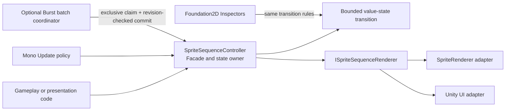

# CycloneGames.Foundation2D

CycloneGames.Foundation2D provides production-oriented sprite-sequence playback for `SpriteRenderer` and Unity UI `Image`. It keeps playback ownership explicit, supports MonoBehaviour-driven and optional Burst-batched updates, and supplies authoring tools for validating renderer and material combinations before entering Play Mode.

## Table of Contents

- [Overview](#overview)
- [Architecture](#architecture)
- [Quick Start](#quick-start)
- [Core Concepts](#core-concepts)
- [Usage Guide](#usage-guide)
- [Advanced Topics](#advanced-topics)
- [Common Scenarios](#common-scenarios)
- [Performance and Memory](#performance-and-memory)
- [Troubleshooting](#troubleshooting)

## Overview

The module handles visual animation: effects, world-space props, UI indicators, portraits, and lightweight crowds. Authoritative gameplay simulation, animation graphs, skeletal animation, 2D physics, tilemaps, networking protocols, and save formats live in their own modules. Gameplay code that requires deterministic rollback or server authority should store its own versioned state and drive presentation from committed gameplay state.

## Quick Start

### SpriteRenderer

1. Add `SpriteRendererSequenceRenderer` and `SpriteSequenceController` to one GameObject.
2. Drag sprites into **Frames** in playback order. The Inspector accepts multiple sprites or a sliced texture.
3. Assign the renderer component to **Renderer Component**. Leaving the field empty also allows a one-time local component lookup during initialization.
4. Keep **Render Mode** set to `SpriteSwap` for the broadest compatibility.
5. Enable **Play On Enable**, or call `Play()` from code.

```csharp
using CycloneGames.Foundation2D.Runtime;
using UnityEngine;

public sealed class OneShotEffect : MonoBehaviour
{
    [SerializeField] private SpriteSequenceController sequence;

    private void OnEnable()
    {
        sequence.OnPlayComplete += HandleComplete;
        sequence.Play();
    }

    private void OnDisable()
    {
        sequence.OnPlayComplete -= HandleComplete;
    }

    private void HandleComplete()
    {
        gameObject.SetActive(false);
    }
}
```

Use `Once` for one-shot effects, `Loop` for repeated playback, and `PingPong` for a complete outward-and-return cycle.

### Unity UI Image

1. Add `UGUISequenceRenderer` and `SpriteSequenceController` to an object containing an `Image`.
2. Assign the `UGUISequenceRenderer` to **Renderer Component**.
3. Start with `SpriteSwap`. It preserves normal `Image` behavior and is the safe choice for unrelated textures, trimmed sprites, sliced images, or different sprite geometry.
4. Use the Inspector's material tools only when the strict flipbook compatibility report is ready.

UI masking, stencil behavior, CanvasGroup alpha, and the target render pipeline must be validated in the actual UI hierarchy before shipping a custom flipbook material.

## Architecture



`SpriteSequenceController` owns one playback state. Only the main thread may call its public methods or receive its events. A Burst manager may claim a controller as its external update owner, but the controller remains the authority that accepts or rejects a batch result and commits visual output. Command revisions prevent an older scheduled result from overwriting a newer `Play`, `Pause`, `Resume`, `Stop`, `GoToFrame`, speed, or driver change.

`ISpriteSequenceRenderer` is a narrow adapter for initialization, frame application, and visibility. Renderer components own Unity renderer bindings, precomputed UV data, and temporary material overrides. They do not own playback policy.

### Assemblies and dependencies

| Assembly | Purpose | Activation |
| --- | --- | --- |
| `CycloneGames.Foundation2D.Runtime` | Controller, bounded playback state, SpriteRenderer and UGUI adapters | Normal Editor and Player compilation |
| `CycloneGames.Foundation2D.Integrations.Burst` | Burst/Jobs batch coordinator | Compiles only when compatible Burst and Collections packages are present |
| `CycloneGames.Foundation2D.Editor` | Inspectors, validation, previews, and material authoring | Editor only |
| `CycloneGames.Foundation2D.Sample.Runtime` / `.Editor` | End-to-end benchmark sample | Asset-hosted sample assemblies compile when their constraints are met; require the Burst integration and Factory Unity adapter |

Runtime uses `CycloneGames.Logger` for diagnostics and Unity UI for the `Image` adapter. Burst and Collections are optional integration dependencies; the base Runtime assembly does not reference them. The package lives under `Assets/ThirdParty`, so its `package.json` is metadata and does not install sibling packages automatically. The current checkout's `Packages/manifest.json`, lock file, asmdefs, and compilation result are the dependency source of truth.

No PlayerSettings scripting define is required. The Burst integration uses package `versionDefines` and assembly `defineConstraints`.

The Burst integration sets `autoReferenced` to `false`. Source in a predefined assembly such as `Assembly-CSharp` cannot name `SpriteSequenceBurstManager` directly; create an asmdef and explicitly reference `CycloneGames.Foundation2D.Integrations.Burst`. This keeps Burst and Collections out of consumers that do not use the integration.

## Core Concepts

Playback is presentation-time based and uses `double` accumulators internally.

- `Once` displays each frame for one frame duration and stops on the terminal frame.
- `Loop` completes a cycle when it reaches the wrap boundary. A finite loop count stops on the terminal frame after the requested number of cycles.
- `PingPong` defines one cycle as a complete trip from the starting edge to the opposite edge and back to the starting edge. A finite count of one therefore ends at the starting edge.
- A one-frame sequence still has a frame duration. `Once` completes after that duration; looping modes produce bounded cycle notifications rather than remaining permanently stuck in an unfinishable state.
- Loop interval time is consumed between completed cycles. `Last`, `First`, and `Blank` control only the interval visual.
- A Tick may cross multiple frame or cycle boundaries. Frame notification is coalesced to the final committed frame for that Tick; loop notification reports that one or more cycles completed according to the controller event contract.
- Negative, NaN, or infinite time input is rejected. Catch-up work is limited by **Max Frame Advances Per Update**. When the budget is exceeded, excess whole-frame backlog is dropped while the fractional remainder is retained, preventing a hitch from creating an unbounded recovery spike.

The catch-up budget is a stability policy, not a deterministic simulation guarantee. Choose it from the highest authored frame rate and the largest acceptable visual catch-up window.

### Controller configuration

| Field | Meaning and failure behavior |
| --- | --- |
| Frames | Ordered sprite references. Empty input prevents `Play`; null frames are handled as invalid visual entries rather than dereferenced. |
| Frame Rate | Frames per second. Inspector and runtime initialization enforce a finite positive value. |
| Play Mode | `Once`, `Loop`, or full-cycle `PingPong`. |
| Direction | Selects the starting edge and initial travel direction. |
| Update Driver | `MonoUpdate` or `BurstManaged`. The serialized numeric values remain stable. |
| Fallback To Mono Update When Burst Unavailable | Allows a Burst-configured controller to continue on the main thread when no manager owns it. Disable only when a missing batch owner must stop updates. |
| Play On Enable | Calls `Play` when the component becomes enabled. |
| Ignore Time Scale | Uses unscaled Unity time for presentation. |
| Speed Multiplier | Non-negative playback multiplier. Zero freezes time without changing the playback status. |
| Discrete Speed Multiplier | Quantizes speed to a configured range and number of steps, useful when reducing visually distinct timing variants. |
| Max Frame Advances Per Update | Hard bound for per-controller catch-up work and callback aggregation. |
| Loop Interval | Non-negative delay between completed cycles. |
| Interval Hold Frame | Keeps the terminal frame, shows the next cycle's first frame, or hides the renderer during the interval. |
| Finite Loop Count | Stops after a positive number of completed cycles. |
| Renderer Component | A local `MonoBehaviour` implementing `ISpriteSequenceRenderer`. Invalid assignments fail with a diagnostic and do not use reflection discovery. |

Runtime controls:

```csharp
sequence.Play();
sequence.Pause();
sequence.Resume();
sequence.GoToFrame(7);
sequence.SetSpeedMultiplier(0.5f);
sequence.Stop();
```

`IsPlaying`, `IsPaused`, `CurrentFrame`, `CurrentUpdateDriver`, `RawSpeedMultiplier`, and `EffectiveSpeedMultiplier` provide read-only diagnostics. `QuantizeSpeedMultiplier` lets tools or gameplay UI preview the configured discrete-speed policy without changing state.

Events are published on the main thread. `OnFrameChanged` is emitted only after the renderer accepts the new visual. `OnLoopComplete` and `OnPlayComplete` describe authoritative playback transitions and are still emitted if a renderer commit fails, so a presentation fault cannot suppress completion. A callback that issues another controller command invalidates remaining notifications from the older update. Subscribe and unsubscribe with the consumer's lifetime; worker-thread callbacks are not part of this module's contract.

## Usage Guide

### SpriteSwap

`SpriteSwap` assigns the current `Sprite` to `SpriteRenderer.sprite` or `Image.sprite`. It supports different source textures and normal sprite authoring differences. It is the default and fallback path.

### Shared-material flipbook

The flipbook path keeps the base sprite geometry and remaps UVs to another frame. It is available only when every frame is provably compatible with that base geometry. Validation rejects at least:

- null sprites or textures;
- different texture objects;
- tight or rotated packing that cannot be represented by an axis-aligned rectangle;
- different rect size, pivot, pixels-per-unit, border, vertex layout, triangle layout, or normalized local geometry;
- a material with the wrong shader or missing remap properties;
- missing UGUI mesh-effect or Canvas UV channels.

The runtime uses the same compatibility contract as the Inspector. It never substitutes `sprite.rect` for failed atlas `textureRect` access because that would produce incorrect atlas UVs. If initialization cannot prove compatibility, the renderer restores its original material and uses `SpriteSwap` safely.

For SpriteRenderer, remap vectors are written through a reused `MaterialPropertyBlock`; unrelated block properties are preserved. For UGUI, per-instance rects are carried in vertex channels. `TexCoord1` and `TexCoord2` are Canvas-level authoring requirements because enabling them changes vertex bandwidth for the whole Canvas. The runtime does not silently take permanent ownership of that Canvas setting.

Material overrides are captured during initialization and restored when the renderer stops owning the flipbook material. `OnValidate` does not mutate a sibling renderer's material. This preserves Undo, Prefab Overrides, and domain-reload behavior in the Editor.

### Inspector workflow

Foundation2D Inspectors provide:

- theme-aware sections, compact status badges, wrapped descriptions, and retained per-Inspector foldout state;
- responsive action groups that remain readable in narrow docked Inspectors;
- drag-and-drop frame collection, natural-name sorting, reversal, and destructive actions with confirmation;
- paged frame fields and thumbnails so repaint cost is bounded for long sequences;
- preview driven by the same bounded playback state as Runtime;
- multi-object editing for ordinary SerializedProperty fields, with target-specific preview and asset actions disabled when they cannot be applied safely;
- renderer compatibility reports that refresh only after relevant serialized changes or an explicit request;
- compact Material object fields and explicit search/create actions; a component Inspector never embeds the full Material Inspector;
- a `FlipbookUVMeshEffect` readiness view for its active state, target Graphic, Canvas, and required shader channels; explicit Undo-aware actions enable a disabled effect or add the missing Canvas flags without discarding existing flags;
- material creation using a unique asset path, Undo registration, and targeted save without a project-wide `AssetDatabase.Refresh`.

The renderer report does not scan every SpriteAtlas or Material on each Layout/Repaint. Project-wide candidate search is a deliberate cold-path button action.

Each core custom Inspector validates its serialized-property contract before opening layout groups. If Runtime and Editor schemas drift, the Inspector shows a safe fallback instead of leaving IMGUI layout state incomplete. EditMode contract tests cover explicit property paths, default and flipbook-specific states, the mesh-effect view, single and mixed multi-object selections, and representative narrow/wide Layout and Repaint passes.

When the UGUI renderer uses an explicitly assigned `Image` on another GameObject, **Add Flipbook UV Effect** adds or reuses the effect on that Image GameObject. This matches the runtime ownership rule: the mesh effect modifies the same Graphic it is bound to, while the renderer may live elsewhere.

## Advanced Topics

Use `SpriteSequenceBurstManager` only after profiling shows that state-transition cost is significant for a large number of active controllers. Small counts stay on the manager's inline path because scheduling and managed/native copy costs can exceed the work itself.

The manager owns reusable persistent native buffers, grows capacity geometrically within its configured limit, and releases scheduled work and allocations on disable or destruction. It does not shrink every frame; frequent shrinking would create allocator churn. Capacity should be prewarmed for predictable large scenes, then treated as a high-water mark until explicit teardown.

Controller registration is explicit or scoped to the manager's children. There is no default whole-scene search or static global controller registry. `RegisterController(controller, out registrationAdded)` distinguishes a new runtime registration from a controller already owned through configured sources; `UnregisterControllers` releases a batch with one ownership rebuild. One controller can have only one external manager owner. A second manager skips the conflicting controller and reports the ownership error instead of updating it twice.

All Unity object reads, result commits, renderer calls, and events remain on the main thread. Jobs operate only on copied unmanaged playback values. Locks around Unity objects would not make their APIs thread-safe and are intentionally absent.

## Performance and Memory

- Normal playback updates a value state and uses no LINQ, reflection, dynamic registration, coroutine allocation, or per-frame command object.
- Catch-up complexity is `O(min(frame boundaries crossed, configured budget))` per active controller.
- Renderer UV and geometry validation is a cold initialization operation. Compatible UV rectangles are cached and reused during playback.
- SpriteSwap changes the sprite reference; actual batching and rebuild behavior remains renderer-, Canvas-, material-, atlas-, pipeline-, and platform-dependent.
- The SpriteRenderer shared-material flipbook writes per-renderer UV state through `MaterialPropertyBlock`. In an SRP, those renderers are not eligible for the SRP Batcher. Sharing the material avoids per-instance material clones, but it does not prove draw-call batching; compare this mode with SpriteSwap in Frame Debugger and on target hardware.
- The Burst integration copies state into persistent native buffers. It is not automatically faster; use the included benchmark and a Release Player on target hardware.
- Editor static caches contain only bounded immutable UI data. Scratch collections clear asset references after each cold-path operation.

No project-wide "zero GC" or capacity number is promised. A zero-allocation warmed playback path, instance limit, or batching claim is valid only when reproduced with the target backend, content, renderer hierarchy, and profiler configuration.

### Platform notes

The base implementation uses Unity APIs available in the project's supported Unity 2022.3 line and contains no native plugin, unsafe code, runtime reflection discovery, file I/O, or background access to Unity objects.

| Target | Design contract | Required validation before release |
| --- | --- | --- |
| Windows, Linux, macOS | Mono and IL2CPP-capable Unity presentation path | Release Player smoke, profiler capture, shader variants, target graphics APIs |
| Android | Mobile-safe bounded state work; no background Unity API calls | ARM64 IL2CPP, Vulkan/GLES, atlas compression/external alpha, thermal and memory pressure |
| iOS | AOT-friendly explicit types and no dynamic code generation | Metal IL2CPP build, masking, atlas alpha, device memory and suspend/resume |
| WebGL | Base Mono-style update remains available without the Burst integration; benchmark file logging is disabled | WebGL build, browser memory, worker availability, shader precision and UI masking |
| Dedicated Server | Presentation module can be omitted; it is not an authoritative simulation dependency | Headless composition and stripping check if the assembly is included |
| Future consoles | No platform SDK assumptions are embedded in the core API | Platform-holder SDK build, shader compiler, memory, suspend/resume and certification checks |

Passing one Editor test run does not establish Player, IL2CPP, Burst, mobile, WebGL, console, or long-duration stability.

## Common Scenarios

Runtime playback writes no files, preferences, registry entries, save data, or hidden global settings. It does not use `PlayerPrefs`, `EditorPrefs`, or `SessionState`.

The Editor can create a `.mat` asset only after an explicit user action. The chosen asset path is visible, version-control ownership belongs to the project, and the asset can be deleted when no renderer references it. No module-owned migration runs automatically.

The benchmark can write a rotating log under:

```text
Application.persistentDataPath/Logs/SpriteSequenceBenchmark.log
```

The leaf filename is validated, rotation is bounded, and file logging is disabled for WebGL Player. Benchmark logs are diagnostics, not a source of truth, and may be deleted safely when no process is writing them.

### Benchmarking

The included sample compares baseline, MonoUpdate, and Burst-managed end-to-end frames. Burst phases require an explicitly assigned, active `SpriteSequenceBurstManager`; the harness temporarily registers measured controllers and cancels the run on an ownership or capacity failure instead of reporting MonoUpdate fallback as Burst. It caches its yield instruction so its measurement loop does not allocate a new `WaitForEndOfFrame` each sample. The harness restores each existing controller's driver, playing/paused status, visible frame, and enabled state, but it cannot reconstruct the exact sub-frame elapsed time or completed-cycle phase. Use dedicated benchmark targets when exact live-game continuity matters. The global `GC.Alloc`, frame time, batch, and SetPass counters still include the rest of the frame; they do not isolate only Foundation2D CPU time.

The text report emits average/minimum/maximum frame values. Capture p50, p95, and p99 from Unity Profiler data or an external trace; the sample does not calculate percentiles.

For a useful result:

1. Use a dedicated benchmark scene and generated targets rather than unrelated gameplay objects.
2. Assign a dedicated active Burst manager and set its prewarm and maximum capacity at or above the largest measured controller count.
3. Disable VSync and record the frame cap, backend, Burst state, graphics API, device, quality settings, resolution, thermal state, and content setup.
4. Prewarm to the maximum intended capacity.
5. Measure a Development and a non-Development Release Player; use the Release result for capacity decisions.
6. Compare p50, p95, and p99 CPU time, worker scheduling/complete cost, GC/frame, native high-water memory, Canvas rebuilds, draw calls, and batches.
7. Repeat after atlas, material, Canvas, render-pipeline, or target-platform changes.

The sample is a measurement harness, not a universal hardware threshold.

## Validation

From `<repo-root>`, run the Foundation2D tests through Unity Test Framework in a clean project profile:

```powershell
& '<UnityEditor>/Unity.exe' -batchmode -nographics `
  -projectPath '<repo-root>/UnityStarter' `
  -runTests -testPlatform EditMode `
  -testResults '<results>/foundation2d-editmode.xml' `
  -logFile '<results>/foundation2d-editmode.log' -quit

& '<UnityEditor>/Unity.exe' -batchmode -nographics `
  -projectPath '<repo-root>/UnityStarter' `
  -runTests -testPlatform PlayMode `
  -testResults '<results>/foundation2d-playmode.xml' `
  -logFile '<results>/foundation2d-playmode.log' -quit
```

Minimum manual checks:

1. Reimport the module and confirm Runtime, optional Burst integration, Editor, Sample, and Test asmdefs compile as expected for the installed-package profile.
2. Exercise Once, Loop, PingPong, reverse, single-frame, interval, finite-loop, pause/resume, and catch-up-clamp cases.
3. Verify SpriteSwap and flipbook output with Frame Debugger and Profiler.
4. Test UGUI Mask, RectMask2D, CanvasGroup alpha, nested Canvas, and required additional shader channels.
5. Confirm material assignment Undo/Redo, Prefab Override, multi-object editing, domain reload, and Editor restart.
6. Disable or destroy a manager during active work and confirm jobs complete and native buffers are released.
7. Build the actual Player backend and graphics API before making platform claims.

## Troubleshooting

| Symptom | Check |
| --- | --- |
| Controller does not play | Frames are non-empty, renderer implements `ISpriteSequenceRenderer`, component is enabled, and effective speed is greater than zero. |
| BurstManaged falls back | Burst and Collections integration compiled, an enabled manager explicitly owns the controller, and no second manager claimed it first. |
| Flipbook reports incompatible | Use SpriteSwap, or align texture, packing, rect, pivot, PPU, border, and geometry. Tight/rotated packing is intentionally rejected. |
| UI frame is blank or distorted | Confirm `FlipbookUVMeshEffect`, Canvas `TexCoord1`/`TexCoord2`, correct shader, shared texture, and masking setup. |
| Material remains changed after editing | Use the Inspector's explicit material action and Undo. Runtime restores only the material it owns; another script assigning the same renderer must coordinate ownership. |
| Large hitch causes skipped animation | Increase the catch-up budget only after profiling, or accept the presentation-time backlog drop. Do not use this module as deterministic gameplay time. |
| Benchmark capacity is unstable | Run a Release Player, isolate the scene, prewarm, repeat samples, and inspect Profiler/trace p95 and p99 rather than relying on one average. |

## Source and serialization migration

This design-stage revision deliberately reduces the public surface:

- raw mutable `SpriteSequencePlaybackState`, the public batch job, and job apply hooks are internal implementation details;
- `ISpriteSequenceRenderer.SetAlpha` and `SetScale` are removed because the controller never used them and their implementations had inconsistent ownership;
- `SpriteSequenceBurstManager` moves from `CycloneGames.Foundation2D.Runtime` assembly to `CycloneGames.Foundation2D.Integrations.Burst` while retaining its namespace, class name, MonoScript GUID, and migration metadata;
- Controller serialized field names and nested enum numeric values remain stable.

Repository consumers are updated in the same change. External source consumers that manipulated raw state must use controller commands and read-only diagnostics. External asmdefs that reference `SpriteSequenceBurstManager` must add the optional Burst integration assembly reference and matching package activation condition. Existing Prefabs and Scenes should be validated through a clean reimport before release even when the preserved script GUID resolves automatically.
