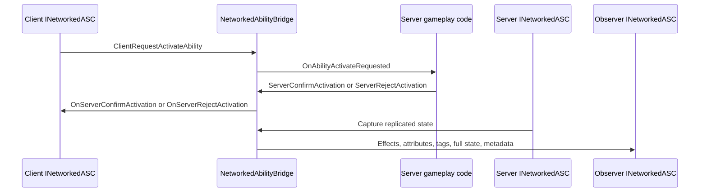

# CycloneGames.GameplayAbilities.Networking

[English](./README.md) | 简体中文

`CycloneGames.GameplayAbilities.Networking` 将 `CycloneGames.GameplayAbilities` 接入 `CycloneGames.Networking`。它提供与传输无关的 ability activation request、prediction confirmation/rejection、replicated gameplay effects、attribute update、gameplay tag update、full-state recovery 和 state synchronization metadata。

本包通过 `INetworkManager` 和 Cyclone runtime service 工作。Ability 代码不直接绑定 Mirror、Mirage、Nakama、Steam 或其他后端 SDK。

## 包结构

```text
CycloneGames.GameplayAbilities.Networking/
  Core/
    AttributeSyncManager.cs
    GASNetworkMessages.cs
    GASNetworkSerializer.cs
    GASNetworkStateChecksum.cs
    NetworkedAbilityBridge.cs
    INetworkedASC.cs
    IGASFullStateAuthorizationPolicy.cs
    OwnerOrObserverWithRateLimitPolicy.cs
    InMemoryTokenBucketRateLimiter.cs
    ...
  Unity.Runtime/
    DefaultGASNetIdRegistry.cs
    GameplayAbilitiesNetworkedASCAdapter.cs
    GASBridgeGameplayAbilitiesExtensions.cs
    UnityGASNetLogger.cs
    UnityGASNetTimeProvider.cs
  Editor/
    Diagnostics preset, diagnostics window, and inspectors
  Tests/Editor/
    Bridge, serializer, checksum, authorization, and adapter tests
```

## 程序集边界

| Assembly | 职责 |
| --- | --- |
| `CycloneGames.GameplayAbilities.Networking.Core` | 纯 C# bridge、message DTO、serializer、checksum、full-state authorization、rate limiting 和接口。 |
| `CycloneGames.GameplayAbilities.Networking.Unity.Runtime` | 将 Unity `AbilitySystemComponent` 适配为 `INetworkedASC`。 |
| `CycloneGames.GameplayAbilities.Networking.Unity.Editor` | Editor diagnostics 和 authoring 支持。 |
| `CycloneGames.GameplayAbilities.Networking.Tests.Editor` | 覆盖 bridge、serializer、security policy 和 runtime adapter 行为的 EditMode 测试。 |

Core 代码依赖 Cyclone Networking 契约和 GameplayAbilities 数据契约。Unity 相关行为隔离在 `Unity.Runtime` 和 `Editor` assembly 中。

## 核心概念

| 类型 | 作用 |
| --- | --- |
| `NetworkedAbilityBridge` | 主消息桥。负责注册 handler、发送 request、路由 replicated state，并按 network id 和 connection id 查找 ASC。 |
| `INetworkedASC` | Ability System Component 的网络侧契约。 |
| `INetworkedASCConnectionScopedFullState` | 可选契约，用于按 connection 过滤 full-state。 |
| `GameplayAbilitiesNetworkedASCAdapter` | Unity runtime adapter，将 `AbilitySystemComponent` state 映射到 `INetworkedASC`。 |
| `GASNetworkSerializer` | Serializer wrapper，用于有界 GAS array 和嵌套消息数据。 |
| `GASNetworkSerializerOptions` | Ability、effect、attribute、tag、set-by-caller entry 的容量限制。 |
| `AttributeSyncManager` | Server-side dirty attribute batching，以及 owner/public observer filtering。 |
| `OwnerOrObserverWithRateLimitPolicy` | Full-state request authorization，支持 owner、observer 和可选 rate limiting。 |
| `GASNetworkStateChecksum` | Full-state 和 drift validation 使用的 checksum helper。 |

## Runtime 流程



## 协议

`NetworkedAbilityBridge` 在 Cyclone module range 中拥有 `10000-10999` 消息 ID。

| Message | ID | Payload |
| --- | ---: | --- |
| `MsgAbilityActivateRequest` | `10000` | `AbilityActivateRequest` |
| `MsgAbilityActivateConfirm` | `10001` | `AbilityActivateConfirm` |
| `MsgAbilityActivateReject` | `10002` | `AbilityActivateReject` |
| `MsgAbilityEnd` | `10003` | `AbilityEndMessage` |
| `MsgAbilityCancel` | `10004` | `AbilityCancelMessage` |
| `MsgEffectApplied` | `10010` | `EffectReplicationData` |
| `MsgEffectRemoved` | `10011` | `EffectRemoveData` |
| `MsgEffectStackChanged` | `10012` | `EffectStackChangeData` |
| `MsgEffectUpdated` | `10013` | `EffectUpdateData` |
| `MsgAttributeUpdate` | `10020` | `AttributeUpdateData` |
| `MsgTagUpdate` | `10025` | `TagUpdateData` |
| `MsgAbilityMulticast` | `10030` | `AbilityMulticastData` |
| `MsgFullState` | `10040` | `GASFullStateData` |
| `MsgFullStateRequest` | `10041` | `FullStateRequest` |
| `MsgStateSyncMetadata` | `10042` | `GASStateSyncMetadata` |

当传入的 `INetworkManager` 暴露 `INetworkRuntimeContextProvider`，且 runtime context 中存在 `INetworkMessageCatalog` 服务时，bridge 会注册 catalog。

## 快速接入

在 networking bootstrap 中创建 bridge，并注册 handler 一次：

```csharp
using System;
using CycloneGames.GameplayAbilities.Networking;
using CycloneGames.Networking;

public sealed class AbilityNetworkBootstrap : IDisposable
{
    private readonly NetworkedAbilityBridge _bridge;

    public AbilityNetworkBootstrap(INetworkManager networkManager)
    {
        _bridge = new NetworkedAbilityBridge(networkManager);
        _bridge.RegisterHandlers();
    }

    public NetworkedAbilityBridge Bridge => _bridge;

    public void Dispose()
    {
        _bridge.Dispose();
    }
}
```

为每个 networked Ability System Component 注册稳定 network id 和 owner connection id：

```csharp
using System;
using CycloneGames.GameplayAbilities.Networking;
using CycloneGames.GameplayAbilities.Runtime;

public sealed class AbilityNetworkOwner : IDisposable
{
    private readonly NetworkedAbilityBridge _bridge;
    private readonly GameplayAbilitiesNetworkedASCAdapter _adapter;

    public AbilityNetworkOwner(
        NetworkedAbilityBridge bridge,
        AbilitySystemComponent asc,
        uint networkId,
        int ownerConnectionId)
    {
        _bridge = bridge;
        _adapter = bridge.RegisterGameplayAbilitiesASC(asc, networkId, ownerConnectionId);
    }

    public void Dispose()
    {
        _bridge.UnregisterASC(_adapter.NetworkId, _adapter.OwnerConnectionId);
        _adapter.Dispose();
    }
}
```

## Ability Activation 流程

拥有者客户端发送 activation request：

```csharp
using CycloneGames.GameplayAbilities.Networking;
using CycloneGames.Networking;

public static class AbilityInputSender
{
    public static void RequestActivation(
        NetworkedAbilityBridge bridge,
        int abilityIndex,
        int predictionKey,
        NetworkVector3 targetPosition,
        NetworkVector3 direction,
        uint targetNetworkId)
    {
        bridge.ClientRequestActivateAbility(
            abilityIndex,
            predictionKey,
            targetPosition,
            direction,
            targetNetworkId);
    }
}
```

Server-side gameplay layer 根据 ability rules 验证请求，然后调用 `ServerConfirmActivation` 或 `ServerRejectActivation`。Bridge 会将结果路由给已注册的 `INetworkedASC`。

## Effect、Attribute 与 Tag 复制

Bridge 暴露 server send 方法用于 replicated GAS state：

```csharp
using System.Collections.Generic;
using CycloneGames.GameplayAbilities.Networking;
using CycloneGames.Networking;

public static class AbilityReplicationSender
{
    public static void SendState(
        NetworkedAbilityBridge bridge,
        IReadOnlyList<INetConnection> observers,
        uint targetNetworkId,
        EffectReplicationData effect,
        AttributeUpdateData attributes,
        TagUpdateData tags)
    {
        bridge.ServerReplicateEffectApplied(observers, targetNetworkId, effect);
        bridge.ServerBroadcastAttributes(observers, targetNetworkId, attributes);
        bridge.ServerSyncTags(observers, targetNetworkId, tags);
    }
}
```

`AttributeSyncManager` 按 network id 保存 dirty attribute，并能区分 owner-only value 和 public observer value。

## Full-State Recovery

Full-state message 为 late join、reconnect 和 drift recovery 提供 baseline。Bridge 支持：

- `ClientRequestFullState(uint targetNetworkId)`
- `ServerSendFullState(INetConnection client, GASFullStateData data)`
- `INetworkedASC.CaptureFullState()`
- `INetworkedASCConnectionScopedFullState.CaptureFullStateForConnection(INetConnection client)`

使用显式 policy 配置 full-state authorization：

```csharp
using System.Collections.Generic;
using CycloneGames.GameplayAbilities.Networking;
using CycloneGames.Networking;

public static class AbilityFullStateSecurity
{
    public static void Configure(
        NetworkedAbilityBridge bridge,
        Func<uint, int> getOwnerConnectionId,
        Func<uint, IReadOnlyList<INetConnection>> getObservers)
    {
        var limiter = new InMemoryTokenBucketRateLimiter(4f, 1f);
        var policy = new OwnerOrObserverWithRateLimitPolicy(limiter);
        bridge.ConfigureFullStateAuthorization(policy, getOwnerConnectionId, getObservers);
    }
}
```

## Serializer Options

`GASNetworkSerializerOptions` 在 serialization 阶段限制动态数组：

```csharp
using CycloneGames.GameplayAbilities.Networking;
using CycloneGames.Networking;

public static class AbilitySerializerInstaller
{
    public static NetworkedAbilityBridge Create(INetworkManager manager)
    {
        GASNetworkSerializerOptions options =
            GASNetworkSerializerOptions.CreateForProfile(GASNetworkCapacityProfile.Balanced);

        return new NetworkedAbilityBridge(manager, options);
    }
}
```

当 manager 实现 `INetworkSerializerConfigurable` 时，constructor 会安装 `GASNetworkSerializer`。

## Drift 与 Metadata

`GASStateSyncMetadata` 携带 target id、sequence、base version、current version、checksum 和 change mask。`GameplayAbilitiesNetworkedASCAdapter` 使用 checksum helper 验证 state transition，并通过 `GASStateDriftReason` 归类 drift。

## Editor Diagnostics

Editor 支持隔离在 editor assembly 中。

```text
Create > CycloneGames > GameplayAbilities > Networking > Diagnostics Preset
Tools > CycloneGames > GameplayAbilities > Networking > Diagnostics
Tools > CycloneGames > GameplayAbilities > Networking > Run Diagnostics Check
```

Diagnostics 会检查 bridge support、Ability runtime support、Cyclone network runtime support、scene-driven `INetworkManager` 是否存在，以及可选 SDK package 的可见性。

## 扩展点

- 为纯 C# ability runtime 或 server simulation 实现 `INetworkedASC`。
- 当 definition id、attribute 和 tag hash 来自项目 registry 时，实现 `IGASNetIdRegistry`。
- 为自定义 visibility 和 moderation rule 实现 `IGASFullStateAuthorizationPolicy`。
- 当 rate limiting 由 backend 或 security service 持有时，实现 `IConnectionRateLimiter`。
- `NetworkedAbilityBridge.RegisterMessage` 只用于 package-owned range 内的消息；项目自有 GAS 消息放入 `NetworkMessageKind.User` manifest。

## 持久化

本包不写入运行时存档。Editor diagnostics preset 是用户通过 editor menu 显式创建的 Unity asset。Runtime bridge state、adapter state、rate limiter bucket 和 dirty attribute buffer 都是由创建方持有的内存数据。

## 验证

修改本包后运行以下检查：

```text
Unity Test Runner > EditMode > CycloneGames.GameplayAbilities.Networking.Tests.Editor
Unity Test Runner > EditMode > CycloneGames.GameplayAbilities.Tests.Editor
Unity Test Runner > EditMode > CycloneGames.Networking.Tests.Editor
```

修改 serializer 或 bridge 时，覆盖 capacity bounds、full-state authorization、checksum drift detection、adapter dispose behavior 和 register/unregister lifecycle。
