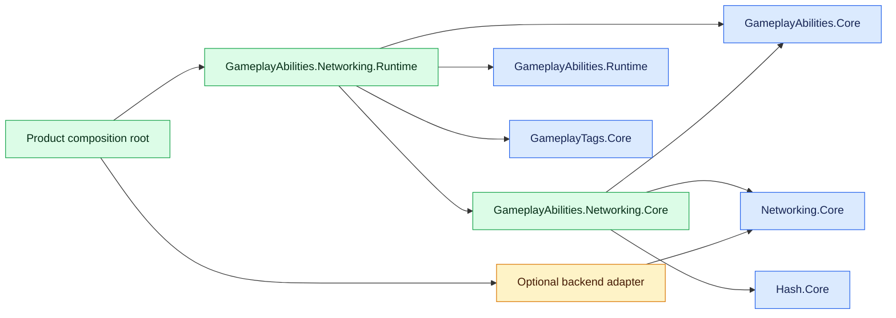
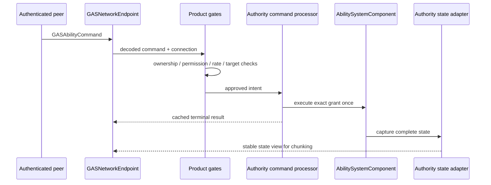

# CycloneGames.GameplayAbilities.Networking

[English](./README.md) | 简体中文

`CycloneGames.GameplayAbilities.Networking` 为 `CycloneGames.GameplayAbilities` 提供后端无关的网络边界。它连接权威 Ability 命令、本地预测、完整状态同步、Gameplay Cue、稳定内容身份和 transport-independent 消息分发，不依赖 Mirror、Mirage、Nakama 或特定 DI 容器。

包版本为 `1.0.0`。

## 能力与边界

本包提供：

- 位于自有消息范围 `10000..10999` 的版本化 little-endian Wire Protocol；
- 对 protocol、wire schema、content catalog、GameplayTags manifest 和必需 feature 的 fail-closed 协商；
- entity、ability grant 实例、active effect、content 和 tag 的稳定 wire identity；
- activation、cancel、input edge、target confirm 和 target cancel 命令；
- 带终态结果缓存的有界 replay protection；
- 本地预测关联，以及 commit、reject、send failure、timeout 和 epoch reset 回滚路径；
- ability grant、attribute、active effect、effect child data 和精确 loose-tag count 的完整状态记录；
- snapshot/delta batch、chunk planning、checksum、acknowledgement 和 resynchronization request；
- 携带 event、magnitude、location、normal、instigator、source effect 和 source command 的 Gameplay Cue 消息；
- 带重试安全 Prepare/Commit Ownership 的固定容量 Authority Cue Adapter；
- 带有界本地预测确认抑制的单 entity 有序 Cue receiver；
- 基于 `INetworkMessageEndpoint` 的后端无关 endpoint facade；
- 面向 `AbilitySystemComponent` 的 authority/replica Runtime adapter；
- 序列化 content catalog asset 和带校验的自定义 Inspector。

产品 composition root 仍负责：

- peer authentication 和 connection-to-account mapping；
- entity ownership、permission、rate limit、interest management 和 anti-cheat policy；
- 对 range、line of sight、collision、target lifetime 和 team rule 的权威世界校验；
- stream epoch 创建、reconnect policy、timeout scheduling 和 session shutdown order；
- 映射 backend 的 reliable route 并发送已规划的 state chunk；GAS endpoint 当前把全部 GAS message 路由到 `NetworkChannel.Reliable`；
- 为 build 选择 content catalog asset，并注册全部可同步 definition；
- 在产品需要时持久化账号或世界状态。

Mirror、Mirage 和 Nakama 是可选的 `CycloneGames.Networking` adapter，不会进入本包的 public contract。

## Assembly

| Assembly | 主要职责 | Unity API | `autoReferenced` |
| --- | --- | --- | --- |
| `CycloneGames.GameplayAbilities.Networking.Core` | Protocol、codec、endpoint、state buffer、identity map、replay、catalog | 否 | `false` |
| `CycloneGames.GameplayAbilities.Networking.Runtime` | ASC bridge、prediction controller、runtime content resolver、catalog asset | 是 | `false` |
| `CycloneGames.GameplayAbilities.Networking.Editor` | Catalog Inspector 和 authoring validation | 仅 Editor | `false` |
| `CycloneGames.GameplayAbilities.Networking.Tests.Editor` | 纯协议与 endpoint 测试 | 否 | `false` |
| `CycloneGames.GameplayAbilities.Networking.Tests.Runtime.Editor` | Runtime bridge、content resolver 和 Inspector 测试 | 仅 Editor | `false` |

Assembly reference 方向如下：



## 同步的 Gameplay State

静态行为由 content catalog 标识，并且必须在 handshake 时一致；运行时状态则被显式传输。

| 状态类别 | 同步数据 |
| --- | --- |
| Ability grant | 稳定 grant ID、definition ID、level、active flag、input-held flag、granting-effect ID |
| Attribute | 稳定 attribute ID、定点 base value、定点 current value |
| Active effect | 稳定 effect ID、definition ID、source entity、source stream epoch、source grant、level、stack count、inhibition、duration、remaining time、period time、prediction correlation |
| Effect child data | 由 tag/name 寻址的 `SetByCaller` value、dynamic granted tag、dynamic asset tag |
| Loose tag | 稳定 tag ID 和精确的正 explicit count |
| Stream state | epoch、batch sequence、base/current version、last processed command、semantic checksum |

非零 source grant 只能通过完整的 `(SourceEntity, SourceStreamEpoch, SourceGrant)` identity 解析，裸 grant ID 永远不足以定位实例。Source entity 轮换 epoch 或替换被外部引用的 grant mapping 时，产品 composition 必须使已退役 binding 失效。如果该变化没有修改 target ASC 本身，其 authority owner 必须先调用 `GASNetworkStateVersion.MarkExternalIdentityChanged`，再重新捕获 target，确保 wire state version 仍然前进。

Authority adapter 捕获 ASC 的完整 process-local state，把 runtime definition 和 local handle 转换为稳定 ID，并返回可复用的只读 state view。该借用 view 只在 adapter 下次成功 capture 前有效；再次 capture 前必须完成 encode、chunk 或 copy。Replica receiver 在准备完全部 chunk 后才交给 Runtime adapter；Runtime adapter 会先解析所有 content、entity、effect 和 grant 引用。只有完全可解析的候选状态才会传入 `AbilitySystemComponent.TryApplyFullStateSnapshot`。

Replica 不会因为远端 ability 的 active flag 为 true 就执行远端 gameplay logic。应用过程只更新同步 bookkeeping，保留 effect-granted ability ownership，恢复 inhibition 和 source-grant provenance，替换精确 loose-tag count，并删除权威 snapshot 中不存在的状态。无效或无法完整解析的输入会 fail closed 并拒绝 prepared state。需要新完整状态时，产品 composition 必须根据该 rejection 创建有界 `GASResyncRequest`，再通过 endpoint 发送。

## 命令与预测

`GASAbilityCommandKind` 支持：

- `Activate`；
- `Cancel`；
- `InputPressed` 和 `InputReleased`；
- `ConfirmTarget` 和 `CancelTarget`。

Target data 可以是有界 actor list 或单个 portable hit record。客户端提供的 hit position、normal、distance、surface 和 target identity 都是不可信提示。`IGASNetworkTargetCommandHandler` 只能在 authentication、产品 authorization、ownership、permission、replay 和 rate gate 通过后运行，并且必须在提交 gameplay 前完成校验。通用 command 不携带没有执行语义的 client-known state 字段。需要 stale-state rejection 的产品应在 authenticated gate 或 target handler 中实现该 policy，因为只有该边界掌握 command kind 与权威世界语义。

`GameplayEventData.OptionalObject` 保持 process-local，本包不会序列化它。任意 object graph 无法提供有界、稳定、AOT-safe 且可信的 wire schema。需要联网的产品 event 必须转换为现有的已校验 command，或转换为产品持有的、显式版本化且有界的 DTO；禁止传输 runtime object identity。

`GASNetworkAuthorityCommandProcessor` 解析精确的稳定 grant，对新命令只执行一次，并把终态结果缓存到有界 replay window。它不是 authorization boundary。意外执行异常仍会生成并缓存一次 `AuthorityUnavailable` result，其中携带异常后真实的 state version；随后设置 `RequiresStreamReset` 并拒绝继续执行。Owner 必须停止 intake，按需捕获并发布 canonical state，把共享 identity map 与 `GASNetworkStateVersion` 一起切换到新 epoch，再 reset processor，之后才能恢复命令接收。Target handler 应避免部分 mutation；该 fail-closed 路径用于防止异常后静默沿用旧 command stream。

当 ability 的 `ExecutionPolicy` 为 `LocalPredicted` 时，`GASNetworkPredictionController` 会确认命令中的 grant 精确解析到提供的本地 spec，然后打开有界 ASC prediction window，并按 command sequence 关联。Accepted result 提交窗口；reject、send failure、timeout、dispose 和 epoch reset 会回滚窗口。

Authoritative snapshot 会携带最后处理的 command sequence。协调式 replica application 会先提交被该 watermark 覆盖的 prediction window，回滚仍 pending 的 window，应用 snapshot，再按 sequence 顺序重放 pending prediction。之后到达、但已经被 snapshot 覆盖的 result 是幂等的。Commit、rollback、snapshot application 或 replay 的部分失败会关闭全部 open window，并要求新的 full state。存在任何 open prediction window 时，绕过 controller 直接应用 snapshot 会被拒绝。

Sequence 合法范围为 `1..GameplayAbilitiesNetworkProtocol.MaxSequence`。耗尽前必须切换到新的、非零且从未复用的 stream epoch。Sequence 或 epoch 回绕均无效。

## Gameplay Cue 发布与接收

`GASNetworkAuthorityCueAdapter` 订阅一个 Authoritative ASC 的 `OnGameplayCueCommitted` Callback，并且只保存有界 Value Record。它具有 Owner-thread Affinity，在构造时分配固定 Queue，不创建 Worker Thread，也不加锁。`PrepareNext` 会返回 Queue Head 的幂等 Wire View。只有 Backend 已接受该消息的 Ownership 后才能调用 `CommitPrepared`；需要重试相同 Head 时调用 `RejectPrepared`。有序 Shutdown 时应先于 ASC Dispose Adapter，以显式移除订阅。

Queue 容量耗尽、Identity-map Epoch 不一致、无法解析非空 Source Entity、非法 Committed Data 或 Local State-version 耗尽，都会进入持久的 Fail-closed Fault。Adapter 不会覆盖较旧 Cue。恢复时，先把共享 `GASAuthorityIdentityMap` 与 `GASNetworkStateVersion` Reset 到新 Epoch，再调用 Adapter 的 `ResetEpoch` 清除 Queue 与 Prepared Work。ASC 从零开始的 Local State Revision 会映射到与 State Snapshot 和 Command Result 相同的非零 Wire Version。

Adapter 绝不会创建 Effect Wire Identity。它会在 Observation 时缓存已有 Mapping，并在 Prepare 时重试 `TryGetEffectId`；Mapping 不存在时，`SourceEffect` 保持为零。需要 Source-effect Correlation 时，应先捕获 Authoritative State，再 Prepare Cue。这样 Identity Creation 始终由 State Adapter 持有，同时也能确定性处理尚未捕获 State 就已 Apply 并 Remove 的 Effect。

自动发布会携带已提交的 Cue Tag、Event、Entity/Instigator、已有 Source-effect Identity、Source-command/Prediction Correlation 和 Authoritative State Version。由于通用 GAS Event 不包含权威 Spatial Payload，其 `Magnitude`、`Location` 与 `Normal` 使用规范零值。需要 Spatial 或 Custom-magnitude Cue 的产品必须为该 Entity/Epoch 选择唯一 Cue-sequence Owner：使用自己的 Enriched Publisher，或完整包装此 Adapter；两个 Publisher 禁止各自递增同一 Cue Stream。

`GASNetworkEndpoint` 解码 Cue 后将其交给 client sink；产品 composition 再把消息路由到目标 entity 与 stream epoch 对应的单个 `GASNetworkCueReceiver`。Receiver 会先校验完整消息、entity、epoch、精确的下一 Cue sequence 和不回退的权威 state version，再调用 `IGASNetworkCueConsumer`。重复、过期、sequence gap、错误 stream、错误 entity 或 state regression 都会 fail closed，且不推进 stream。Consumer 返回 `false` 或抛出异常时也不会推进 sequence，因此同一消息仍可重试。Cue 使用可靠有序 route，所以 gap 表示 stream/session 故障；state resync 不会重放丢失的瞬时 Cue，应按产品恢复策略替换 stream epoch。

预测表现是显式且有界的。提交本地 Cue 表现前先调用 `TryTrackPredictedCue`。带 `GASCueFlags.Predicted` 的权威 Cue 必须携带非零 source command sequence；只有 command、Cue tag、event、instigator、spatial flags、magnitude、location 与 normal 全部精确匹配某条已跟踪记录时才抑制该确认。Payload 不同的 Cue 会作为权威输出交给 consumer。Source-effect identity 不参与表现 fingerprint，因为权威分配 effect identity 前本地可能尚无该 ID。Tracking 因容量耗尽而失败时，调用方不得假设后续确认会被抑制。命令 reject、send failure、timeout、产品定义的 retention 到期或 epoch 替换时，通过 `DiscardPredictedCues` 或 `ResetEpoch` 清理未匹配记录。

Receiver 具有 owner-thread affinity，只在构造时分配 predicted-cue array，并在配置容量内执行有界线性匹配；它不会创建 scheduler，也不会保留无界 command history。

## Content Catalog 与 Inspector

在项目拥有的 settings 或 content 目录中创建 `GASNetworkContentCatalogAsset`，并加入全部网络可见内容：

- ability definition；
- gameplay effect definition；
- attribute name；
- 由 name 寻址的 `SetByCaller` key；
- hit data 使用的 target-surface object。

Gameplay tag 使用自身稳定的 `GameplayTag.StableId`，并通过独立的 GameplayTags manifest hash 协商。

每个 catalog entry 都有 stable key 和 revision source。兼容的 client、server 与 backend build 必须产生一致的 ID 和 revision hash。Grant 与 Apply 应使用 `GASNetworkRuntimeContentResolver` 返回的 canonical definition；`GameplayAbilitySO.GetGameplayAbility()` 和 `GameplayEffectSO.GetGameplayEffect()` 会保持 Authoring Reference 的唯一性。Resolver 会拒绝另外构造的同名对象，不通过名称猜测 identity。Runtime type name、Unity instance ID、scene object identity、registration order 和 process-local handle 都不是 wire identity。

自定义 Inspector 通过 `SerializedObject` 和 `SerializedProperty` 编辑，支持 multi-object editing，并保留 Undo 与 Prefab Override。它会报告重复、缺失或无效 entry，检查可持久 effect reference 与 effect-granted ability，并在内存中校验 deterministic catalog，不写入 asset 或 revision。网络内容的校验错误应作为 build blocker。

持久化行为是显式的：

| 数据 | Owner 与路径 | 格式与 Git | 生命周期、演进、清理与恢复 |
| --- | --- | --- | --- |
| Content catalog authoring | 产品拥有的 asset，位于可见的项目 `Assets/.../Settings` 或 content 路径 | Unity serialized asset 与 `.meta`；两者都提交 | Stable key 是 wire identity，显式 revision 描述语义变化。Client/server build 之间必须评审变更。仅在没有 build 或已保存配置引用时删除；通过版本控制恢复。 |
| Runtime state、identity、replay、prediction、Cue tracking 与 decode storage | Session/composition owner 持有的 managed memory | 有界 array、map 与 buffer；不提交 | Epoch 替换时 reset，shutdown 时 clear/dispose。丢失后从 authoritative state 重建。 |
| 包拥有的 persistent cache 或 preference | 无 | 不写 file、`EditorPrefs`、`PlayerPrefs`、registry 或 plist | 不适用。 |

## Endpoint 组合

底层 `INetworkMessageEndpoint` 就绪后，为每个 network session 和 role 构造一个 `GASNetworkEndpoint`。Endpoint 会注册全部七个 GAS handler、持有对应 lease，并把全部 GAS message 发送到 `NetworkChannel.Reliable`。Backend adapter 必须把该 route 配置为有序可靠，并遵守其文档化 payload ceiling。

```csharp
GASNetworkContentCatalog contentCatalog = contentCatalogAsset.BuildCatalog();

var endpoint = new GASNetworkEndpoint(
    networkMessageEndpoint,
    contentCatalog.ManifestHash,
    gameplayTagManifestHash,
    clientSink,
    OnEndpointFailure);

NetworkSendResult handshakeResult = endpoint.SendHandshakeToAuthority();
```

应在 Unity main thread 的冷路径 composition 中构建 catalog。Authority 使用接收 `IGASNetworkAuthoritySink` 的构造器重载。双方都提交兼容 handshake 后，peer 才进入 ready 状态。Ready 之前收到的 command、state、acknowledgement、resync request 或 cue 会被拒绝。必须先 dispose GAS endpoint，再 dispose 底层 message endpoint 或 transport。

典型 authority 数据流如下：



## 所有权、内存与线程

全部 Runtime bridge、identity map、replay window、prediction controller、receiver 和 endpoint 都具有 owner-thread affinity。它们不创建 worker thread，也不加锁。Backend callback 必须先 marshal 到 ASC/endpoint owner thread，才能调用这些 API。WebGL 使用同一 single-thread path。

每个 Authority ASC 与目标 Stream Epoch 创建一个 `GASNetworkStateVersion`，并把同一实例注入它的 State Adapter、Command Processor 和 Cue Adapter。这个有界的 Owner-thread Clock 把 ASC 本地 Revision 与 Network-visible External Identity Change 置于同一个单调 Version Domain。产品 Composition 只跟踪自身已知的 Dependency Edge；当被引用的 Source Entity 更换 Identity Epoch、但 Target ASC 本身没有 Mutation 时，显式调用 `MarkExternalIdentityChanged`。本包不会创建 Session-global Registry，也不会扫描无界 Dependency Graph。替换 Epoch 时，先停止 Consumer，Reset `GASAuthorityIdentityMap` 和 `GASNetworkStateVersion`，再 Reset Consumer，之后才能恢复流量。

容量是显式的：

- `GASNetworkStateCapacity` 约束每类状态；
- `GASNetworkRuntimeStateCapacity` 约束每个 effect 的 child storage；
- endpoint 构造参数约束 authority peer，并预先分配 decode scratch array；
- identity map、replay/prediction window 和 predicted-cue tracking 在耗尽时拒绝；
- authority cue queue 具有固定容量，满载时进入 Fault 且不覆盖旧消息；
- actor target、chunk 和 explicit loose-tag count 都有协议上限。

State buffer 和 codec 可复用，并避免 reflection、runtime code generation、LINQ 和 per-record object graph。Warmed codec、validation、replay、identity、resolver 和部分 bridge path 具有 allocation test。首次构造、buffer growth、Unity authoring、backend SDK serialization、logging、encryption、queue 和 transport send 仍可能分配。设定 zero-GC 预算前必须测量完整 Player 路径。

ASC 正在修改 active effect、迭代 effect state、分发 callback 或执行 dispose 时，不得调用 bridge。Disconnect 或 shutdown 时，应先停止 intake、使 epoch 失效、回滚 pending prediction、清理 receiver/replay/identity state、dispose GAS endpoint，最后停止 backend endpoint 和 transport。

## Backend 与平台说明

| Backend 或平台 | Integration 契约 |
| --- | --- |
| Mirror | 使用可选 `CycloneGames.Networking` Mirror adapter；验证已安装 SDK/transport 的 payload ceiling、host loopback、dedicated server、reconnect 和 IL2CPP build。 |
| Mirage | 使用具有显式 client/authority route 的可选 Mirage adapter；验证已安装 SDK、authenticated broadcast、transport ceiling 和 dedicated server。 |
| Nakama | 使用 authoritative Nakama match 或 Unity dedicated authority。Relayed match 不是可信 server route。Nakama authoritative runtime 必须实现相同协议与产品校验 gate。 |
| Windows/Linux/macOS | Core protocol 与平台无关；验证所选 transport、socket lifecycle、dedicated-server mode 和硬件预算。 |
| iOS/Android | 验证 suspend/resume、network transition、background policy、IL2CPP、stripping、memory pressure 和移动网络 reconnect。 |
| WebGL | 保持 owner-thread path；在 Player build 中验证 browser transport limit、tab suspension、reconnect、payload size 和 backend interoperability。 |
| 主机平台 | 提供厂商批准的 transport adapter，并验证 certification、suspend/resume、memory、security 和平台网络政策。 |

Mirror、Mirage 与 Nakama adapter 需要对应 SDK package。发布配置启用某个 adapter 前，必须使用产品实际采用的 backend 版本完成编译和聚焦 integration test。

## 验证

最低验证步骤：

1. 运行 `CycloneGames.GameplayAbilities.Networking.Tests.Editor`。
2. 运行 `CycloneGames.GameplayAbilities.Networking.Tests.Runtime.Editor`。
3. 运行 `CycloneGames.GameplayAbilities.Tests.Editor`。
4. 运行 `CycloneGames.Networking.Tests.Editor` 和所有 active backend integration test。
5. 执行 clean project reload 和 script compilation。

发布认证还需要使用真实 backend SDK，完成各目标的 Player/IL2CPP build、payload boundary、hostile input、disconnect/reconnect 与 epoch replacement、packet loss/reordering、capacity exhaustion、allocation profiling、multi-client load 和 long-duration soak。

EditMode 成功不能证明 Player、IL2CPP、WebGL、移动端、主机平台、backend interoperability、长期稳定性或 package-wide zero allocation。

## 故障排查

| 现象 | 检查项 |
| --- | --- |
| Handshake 被拒绝 | Protocol fingerprint、wire schema、content catalog hash、GameplayTags manifest hash 和 required feature 必须精确一致。 |
| Command 在进入 gameplay 前被拒绝 | 检查 ready state、epoch/sequence、authenticated ownership、rate policy、entity mapping、grant mapping 和 target-data structure。 |
| Predicted action 被回滚 | 检查 terminal result、send failure/timeout、grant-to-spec mapping、ASC resync state 和下一份 authoritative snapshot。 |
| Cue 被拒绝或报告 sequence gap | 检查 entity/epoch owner、可靠有序 route、下一 Cue sequence、权威 state version、consumer 原子性与 predicted-cue retention。确认 gap 后替换 stream epoch；state resync 不会重放瞬时 Cue。 |
| Replica 请求 resync | 检查缺失/乱序 chunk、baseline version、checksum、content/entity resolution、capacity 和 source-grant availability。 |
| Effect-granted ability 缺失 | Ability definition 与 granting effect 都必须进入 content catalog，snapshot 也必须携带它们的稳定关联。 |
| 可选 backend assembly 未激活 | 确认准确 SDK 已安装，且 asmdef `versionDefines` 与 `defineConstraints` 满足。不要添加隐藏的 PlayerSettings symbol。 |
