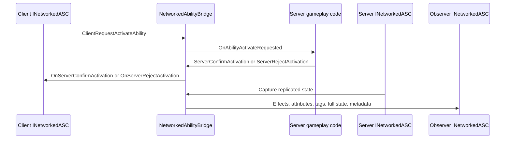

# CycloneGames.GameplayAbilities.Networking

English | [Simplified Chinese](./README.SCH.md)

`CycloneGames.GameplayAbilities.Networking` connects `CycloneGames.GameplayAbilities` to `CycloneGames.Networking`. It provides transport-neutral replication for ability activation requests, prediction confirmation and rejection, replicated gameplay effects, attribute updates, gameplay tag updates, full-state recovery, and state synchronization metadata.

The package talks to `INetworkManager` and Cyclone runtime services. It does not bind ability code directly to Mirror, Mirage, Nakama, Steam, or another backend SDK.

## Assembly Boundary

| Assembly | Role |
| --- | --- |
| `CycloneGames.GameplayAbilities.Networking.Core` | Pure C# bridge, message DTOs, serializer, checksums, full-state authorization, rate limiting, replication planning, and interfaces. |
| `CycloneGames.GameplayAbilities.Networking.Unity.Runtime` | Adapter from Unity `AbilitySystemComponent` to `INetworkedASC`. |
| `CycloneGames.GameplayAbilities.Networking.Unity.Editor` | Editor diagnostics and authoring support. |
| `CycloneGames.GameplayAbilities.Networking.Tests.Editor` | No-engine EditMode tests for the bridge, serializer, checksums, and security policies. |
| `CycloneGames.GameplayAbilities.Networking.Unity.Tests.Editor` | EditMode tests for Unity-facing adapter behavior. |

Core code depends on Cyclone Networking contracts and GameplayAbilities data contracts. Unity-specific behavior is isolated in `Unity.Runtime` and `Editor` assemblies.

## Core Concepts

| Type | Purpose |
| --- | --- |
| `NetworkedAbilityBridge` | Main message bridge. Registers handlers, sends requests, routes replicated state, and owns ASC lookup by network id and connection id. |
| `INetworkedASC` | Network-facing contract for an Ability System Component. |
| `INetworkedASCConnectionScopedFullState` | Optional contract for per-connection full-state filtering. |
| `GameplayAbilitiesNetworkedASCAdapter` | Unity runtime adapter that maps `AbilitySystemComponent` state to `INetworkedASC`. |
| `GASNetworkSerializer` | Serializer wrapper for bounded GAS arrays and nested message data. |
| `GASNetworkSerializerOptions` | Capacity limits for abilities, effects, attributes, tags, and set-by-caller entries. |
| `AttributeSyncManager` | Server-side dirty attribute batching and owner/public observer filtering. |
| `OwnerOrObserverWithRateLimitPolicy` | Full-state request authorization for owners and observers with optional rate limiting. |
| `GASNetworkStateChecksum` | Checksum helper for full-state and drift validation. |
| `GASReplicationSource` | Transport-neutral projection of one ASC into network id, owner, team, layer, position, dirty mask, full-state request, checksum, and send-size data. |
| `GASReplicationPlanner` | Low-allocation facade over `CycloneGames.Networking.Replication.NetworkReplicationPlanner` for owner/team/area/layer filtering and send-budget selection. |

## Runtime Flow



## Protocol

`NetworkedAbilityBridge` owns message ids `10000-10999` in the Cyclone module range.

| Message | ID | Payload |
| --- | ---: | --- |
| `MsgAbilityActivateRequest` | `10000` | `AbilityActivateRequest` |
| `MsgAbilityActivateConfirm` | `10001` | `AbilityActivateConfirm` |
| `MsgAbilityActivateReject` | `10002` | `AbilityActivateReject` |
| `MsgAbilityEnd` | `10003` | `AbilityEndMessage` |
| `MsgAbilityCancel` | `10004` | `AbilityCancelMessage` |
| `MsgEffectApplied` | `10010` | `EffectReplicationData` |
| `MsgEffectRemoved` | `10011` | `EffectRemoveData` |
| `MsgEffectStackChanged` | `10012` | `EffectStackChangeData` |
| `MsgEffectUpdated` | `10013` | `EffectUpdateData` |
| `MsgAttributeUpdate` | `10020` | `AttributeUpdateData` |
| `MsgTagUpdate` | `10025` | `TagUpdateData` |
| `MsgAbilityMulticast` | `10030` | `AbilityMulticastData` |
| `MsgFullState` | `10040` | `GASFullStateData` |
| `MsgFullStateRequest` | `10041` | `FullStateRequest` |
| `MsgStateSyncMetadata` | `10042` | `GASStateSyncMetadata` |

The bridge registers the catalog when the supplied `INetworkManager` exposes an `INetworkRuntimeContextProvider` with an `INetworkMessageCatalog` service.

## Quick Start

Create the bridge during networking bootstrap and register handlers once:

```csharp
using System;
using CycloneGames.GameplayAbilities.Networking;
using CycloneGames.Networking;

public sealed class AbilityNetworkBootstrap : IDisposable
{
    private readonly NetworkedAbilityBridge _bridge;

    public AbilityNetworkBootstrap(INetworkManager networkManager)
    {
        _bridge = new NetworkedAbilityBridge(networkManager);
        _bridge.RegisterHandlers();
    }

    public NetworkedAbilityBridge Bridge => _bridge;

    public void Dispose()
    {
        _bridge.Dispose();
    }
}
```

Register each networked Ability System Component with a stable network id and owner connection id:

```csharp
using System;
using CycloneGames.GameplayAbilities.Networking;
using CycloneGames.GameplayAbilities.Runtime;

public sealed class AbilityNetworkOwner : IDisposable
{
    private readonly NetworkedAbilityBridge _bridge;
    private readonly GameplayAbilitiesNetworkedASCAdapter _adapter;

    public AbilityNetworkOwner(
        NetworkedAbilityBridge bridge,
        AbilitySystemComponent asc,
        uint networkId,
        int ownerConnectionId)
    {
        _bridge = bridge;
        _adapter = bridge.RegisterGameplayAbilitiesASC(asc, networkId, ownerConnectionId);
    }

    public void Dispose()
    {
        _bridge.UnregisterASC(_adapter.NetworkId, _adapter.OwnerConnectionId);
        _adapter.Dispose();
    }
}
```

## Ability Activation Flow

The owning client sends an activation request:

```csharp
using CycloneGames.GameplayAbilities.Networking;
using CycloneGames.Networking;

public static class AbilityInputSender
{
    public static void RequestActivation(
        NetworkedAbilityBridge bridge,
        int abilityIndex,
        int predictionKey,
        NetworkVector3 targetPosition,
        NetworkVector3 direction,
        uint targetNetworkId)
    {
        bridge.ClientRequestActivateAbility(
            abilityIndex,
            predictionKey,
            targetPosition,
            direction,
            targetNetworkId);
    }
}
```

The server-side gameplay layer validates the request through ability rules, then calls `ServerConfirmActivation` or `ServerRejectActivation`. The bridge routes the response to the registered `INetworkedASC`.

## Replicating Effects, Attributes, and Tags

The bridge exposes server send methods for replicated GAS state:

```csharp
using System.Collections.Generic;
using CycloneGames.GameplayAbilities.Networking;
using CycloneGames.Networking;

public static class AbilityReplicationSender
{
    public static void SendState(
        NetworkedAbilityBridge bridge,
        IReadOnlyList<INetConnection> observers,
        uint targetNetworkId,
        EffectReplicationData effect,
        AttributeUpdateData attributes,
        TagUpdateData tags)
    {
        bridge.ServerReplicateEffectApplied(observers, targetNetworkId, effect);
        bridge.ServerBroadcastAttributes(observers, targetNetworkId, attributes);
        bridge.ServerSyncTags(observers, targetNetworkId, tags);
    }
}
```

`AttributeSyncManager` stores dirty attributes by network id and can send owner-only values separately from public observer values.

`GameplayAbilitiesNetworkedASCAdapter.CaptureAndReplicatePendingStateDelta` expects the caller to resolve observers before capture. When the observer list is null or empty, it returns a default delta and does not consume pending ASC state. This is important for room-based games and interest management: a frame with no relevant observers must not drop ability grants, effect removals, attribute changes, tag changes, or state metadata that a later observer still needs.

Recommended server order for large rooms:

1. Update gameplay and mark ASC state dirty.
2. Resolve room, team, owner, spectator, and visibility observers.
3. Call `CaptureAndReplicatePendingStateDelta` only when the observer set is non-empty.
4. Use full-state recovery for late joiners or observers that become relevant after missing deltas.

## Replication Planning and Package Integration

`GASReplicationPlanner` lets the GAS networking layer reuse the shared `CycloneGames.Networking.Replication` interest and send-budget pipeline instead of maintaining a separate observer selector. This keeps ability replication aligned with movement, perception, gameplay framework actors, and other networked modules.

```csharp
using CycloneGames.GameplayAbilities.Networking;
using CycloneGames.Networking;
using CycloneGames.Networking.Replication;

public static class AbilityReplicationPlanning
{
    public static int BuildPlan(
        GASReplicationPlanner planner,
        NetworkReplicationObserver observer,
        GASReplicationSource[] sources,
        int serverTick,
        GASReplicationSelection[] results)
    {
        var budget = new NetworkSendBudget(maxBytes: 64 * 1024, maxMessages: 256);

        return planner.BuildPlan(
            observer,
            sources,
            serverTick,
            ref budget,
            results);
    }
}
```

For `CycloneGames.GameplayFramework.Networking`, project code can map `NetworkedGameplayActor` fields directly into `GASReplicationSource`: use the actor network id, owner connection id, owner player id, team id, interest layer mask, and interest position, then choose a `NetworkReplicationPolicy` matching the gameplay visibility rule. The GAS networking core intentionally does not reference `GameplayFramework.Networking`; that keeps headless servers, pure C# simulations, and projects that do not use GameplayFramework free from optional framework dependencies.

Cyclone packages can be used either under `Assets/ThirdParty` or as UPM packages. Integration code should follow these rules:

- Direct asmdef references are the source of truth when an integration assembly is present and the dependency is required.
- `versionDefines` are useful for UPM package detection, but local `Assets/ThirdParty` packages do not reliably produce those symbols.
- Do not wrap a hard integration assembly in source-level `#if` symbols that can make the assembly compile empty in local package mode.
- Optional integrations should be physically isolated in an integration asmdef or integration package that is only imported when its dependencies are available.
- Do not require users to add PlayerSettings scripting symbols for default package interoperability.

## Full-State Recovery

Full-state messages provide a baseline for late join, reconnect, and drift recovery. The bridge supports:

- `ClientRequestFullState(uint targetNetworkId)`
- `ServerSendFullState(INetConnection client, GASFullStateData data)`
- `INetworkedASC.CaptureFullState()`
- `INetworkedASCConnectionScopedFullState.CaptureFullStateForConnection(INetConnection client)`

Configure full-state authorization with an explicit policy:

```csharp
using System.Collections.Generic;
using CycloneGames.GameplayAbilities.Networking;
using CycloneGames.Networking;

public static class AbilityFullStateSecurity
{
    public static void Configure(
        NetworkedAbilityBridge bridge,
        Func<uint, int> getOwnerConnectionId,
        Func<uint, IReadOnlyList<INetConnection>> getObservers)
    {
        var limiter = new InMemoryTokenBucketRateLimiter(4f, 1f);
        var policy = new OwnerOrObserverWithRateLimitPolicy(limiter);
        bridge.ConfigureFullStateAuthorization(policy, getOwnerConnectionId, getObservers);
    }
}
```

## Serializer Options

`GASNetworkSerializerOptions` bounds dynamic arrays during serialization:

```csharp
using CycloneGames.GameplayAbilities.Networking;
using CycloneGames.Networking;

public static class AbilitySerializerInstaller
{
    public static NetworkedAbilityBridge Create(INetworkManager manager)
    {
        GASNetworkSerializerOptions options =
            GASNetworkSerializerOptions.CreateForProfile(GASNetworkCapacityProfile.Balanced);

        return new NetworkedAbilityBridge(manager, options);
    }
}
```

The constructor installs `GASNetworkSerializer` when the manager implements `INetworkSerializerConfigurable`.

## Drift and Metadata

`GASStateSyncMetadata` carries target id, sequence, base version, current version, checksum, and change mask. `GameplayAbilitiesNetworkedASCAdapter` uses checksum helpers to validate state transitions and classify drift with `GASStateDriftReason`.

## Editor Diagnostics

Editor support is isolated in the editor assembly.

```text
Create > CycloneGames > GameplayAbilities > Networking > Diagnostics Preset
Tools > CycloneGames > GameplayAbilities > Networking > Diagnostics
Tools > CycloneGames > GameplayAbilities > Networking > Run Diagnostics Check
```

Diagnostics inspect bridge support, Ability runtime support, Cyclone network runtime support, scene-driven `INetworkManager` presence, and optional SDK package visibility.

## Extension Points

- Implement `INetworkedASC` for pure C# ability runtimes or server simulations.
- Implement `IGASNetIdRegistry` when definition ids, attributes, and tag hashes come from a project registry.
- Implement `IGASFullStateAuthorizationPolicy` for custom visibility and moderation rules.
- Implement `IConnectionRateLimiter` when rate limiting is owned by a backend or security service.
- Use `NetworkedAbilityBridge.RegisterMessage` only for messages inside the package-owned range; project-owned GAS messages belong in a `NetworkMessageKind.User` manifest.

## Persistence

This package does not write runtime save data. Editor diagnostics presets are Unity assets created explicitly by the user through the editor menu. Runtime bridge state, adapter state, rate limiter buckets, and dirty attribute buffers are in-memory data owned by the creating code.

## Validation

Run these checks after changing the package:

```text
Unity Test Runner > EditMode > CycloneGames.GameplayAbilities.Networking.Tests.Editor
Unity Test Runner > EditMode > CycloneGames.GameplayAbilities.Networking.Unity.Tests.Editor
Unity Test Runner > EditMode > CycloneGames.GameplayAbilities.Tests.Editor
Unity Test Runner > EditMode > CycloneGames.Networking.Tests.Editor
```

For serializer or bridge changes, include tests that cover capacity bounds, full-state authorization, checksum drift detection, adapter dispose behavior, observer-empty dispatch behavior, and register/unregister lifecycle.
