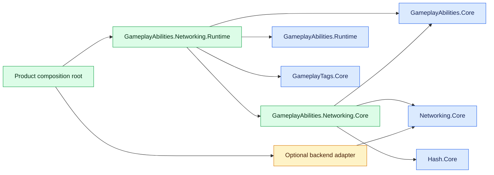
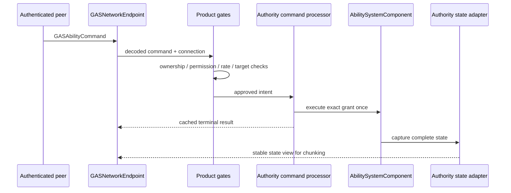

# CycloneGames.GameplayAbilities.Networking

English | [简体中文](./README.SCH.md)

`CycloneGames.GameplayAbilities.Networking` provides the backend-neutral network boundary for `CycloneGames.GameplayAbilities`. It connects authoritative ability commands, local prediction, complete replicated state, gameplay cues, stable content identities, and transport-independent message dispatch without depending on Mirror, Mirage, Nakama, or a DI container.

The package version is `1.0.0`.

## Capabilities and boundaries

The package provides:

- a versioned, little-endian wire protocol in the owned message range `10000..10999`;
- fail-closed negotiation of protocol, wire schema, content catalog, GameplayTags manifest, and required features;
- stable wire identities for entities, granted ability instances, active effects, content, and tags;
- commands for activation, cancellation, input edges, target confirmation, and target cancellation;
- bounded replay protection with cached terminal command results;
- local-prediction correlation with commit, rejection, send-failure, timeout, and epoch-reset rollback paths;
- complete state records for ability grants, attributes, active effects, effect child data, and exact loose-tag counts;
- snapshot and delta batching, chunk planning, checksums, acknowledgements, and resynchronization requests;
- gameplay cue messages with event, magnitude, location, normal, instigator, source effect, and source command data;
- a fixed-capacity authority cue adapter with retry-safe prepare/commit ownership;
- an ordered single-entity cue receiver with bounded local-prediction confirmation suppression;
- a backend-neutral endpoint facade over `INetworkMessageEndpoint`;
- authority and replica Runtime adapters for `AbilitySystemComponent`;
- a serialized content catalog asset and a validated custom Inspector.

The product composition root remains responsible for:

- peer authentication and connection-to-account mapping;
- entity ownership, permissions, rate limits, interest management, and anti-cheat policy;
- authoritative world checks for range, line of sight, collision, target lifetime, and team rules;
- stream-epoch creation, reconnect policy, timeout scheduling, and session shutdown order;
- mapping the backend's reliable route and sending planned state chunks; the GAS endpoint currently routes every GAS message through `NetworkChannel.Reliable`;
- choosing content catalog assets for a build and registering every replicated definition;
- persisting account or world state when the game requires persistence.

Mirror, Mirage, and Nakama are optional `CycloneGames.Networking` adapters. They do not appear in this package's public contracts.

## Assemblies

| Assembly | Main responsibility | Unity API | `autoReferenced` |
| --- | --- | --- | --- |
| `CycloneGames.GameplayAbilities.Networking.Core` | Protocol, codecs, endpoint, state buffers, identity maps, replay, catalog | No | `false` |
| `CycloneGames.GameplayAbilities.Networking.Runtime` | ASC bridges, prediction controller, runtime content resolver, catalog asset | Yes | `false` |
| `CycloneGames.GameplayAbilities.Networking.Editor` | Catalog Inspector and authoring validation | Editor only | `false` |
| `CycloneGames.GameplayAbilities.Networking.Tests.Editor` | Pure protocol and endpoint tests | No | `false` |
| `CycloneGames.GameplayAbilities.Networking.Tests.Runtime.Editor` | Runtime bridge, content resolver, and Inspector tests | Editor only | `false` |

The assembly-reference direction is:



## Replicated gameplay state

Static behavior is identified by the content catalog and must match at handshake time. Runtime state is transmitted explicitly.

| State family | Replicated data |
| --- | --- |
| Ability grants | stable grant ID, definition ID, level, active flag, input-held flag, granting-effect ID |
| Attributes | stable attribute ID, fixed-point base value, fixed-point current value |
| Active effects | stable effect ID, definition ID, source entity, source stream epoch, source grant, level, stack count, inhibition, duration, remaining time, period time, prediction correlation |
| Effect child data | tag- and name-addressed `SetByCaller` values, dynamic granted tags, dynamic asset tags |
| Loose tags | stable tag ID and exact positive explicit count |
| Stream state | epoch, batch sequence, base/current version, last processed command, semantic checksum |

A non-zero source grant is resolved only by the complete `(SourceEntity, SourceStreamEpoch, SourceGrant)` identity. A bare grant ID is never sufficient. When a source entity rotates its epoch or replaces an externally referenced grant mapping, product composition invalidates the retired binding. If that change does not mutate the target ASC, its authority owner calls `GASNetworkStateVersion.MarkExternalIdentityChanged` before capturing the target again so the wire state version still advances.

An authority adapter captures one complete process-local ASC state, translates runtime definitions and local handles to stable IDs, and returns a reusable read-only state view. That borrowed view remains valid only until the adapter's next successful capture; encode, chunk, or copy it before capturing again. A replica receiver validates and prepares all chunks before the Runtime adapter resolves every content, entity, effect, and grant reference. Only a fully resolved candidate is passed to `AbilitySystemComponent.TryApplyFullStateSnapshot`.

Replica application does not execute remote gameplay logic merely because an ability is marked active. It updates replicated activity bookkeeping, preserves effect-granted ability ownership, restores inhibition and source-grant provenance, replaces exact loose-tag counts, and removes state absent from the authoritative snapshot. Invalid or partially resolvable input fails closed and rejects the prepared state. Product composition must create a bounded `GASResyncRequest` from that rejection and send it through the endpoint when another full state is required.

## Commands and prediction

`GASAbilityCommandKind` supports:

- `Activate`;
- `Cancel`;
- `InputPressed` and `InputReleased`;
- `ConfirmTarget` and `CancelTarget`.

Target data is either a bounded actor list or one portable hit record. Client-supplied hit positions, normals, distances, surfaces, and target identities are untrusted hints. `IGASNetworkTargetCommandHandler` runs only after authentication, product authorization, ownership, permission, replay, and rate gates; it must finish validation before committing gameplay. The common command does not carry a decorative client-known state field. A product that needs stale-state rejection implements that policy in its authenticated gate or target handler, where command kind and world semantics are available.

`GameplayEventData.OptionalObject` remains process-local and is never serialized by this package. An arbitrary object graph cannot provide a bounded, stable, AOT-safe, or trustworthy wire schema. A networked product event must be converted into an existing validated command or a product-owned, explicitly versioned and bounded DTO; do not transmit runtime object identity.

`GASNetworkAuthorityCommandProcessor` resolves an exact stable grant, executes a new command once, and caches its terminal result in a bounded replay window. It is not an authorization boundary. An unexpected execution exception still produces one cached `AuthorityUnavailable` result with the actual post-failure state version, then sets `RequiresStreamReset` and rejects subsequent execution. The owner must stop intake, capture and publish canonical state as needed, reset the shared identity map and `GASNetworkStateVersion` to a new epoch, and then reset the processor before accepting more commands. Target handlers should avoid partial mutation, but this fail-closed path prevents an exception from silently continuing the old command stream.

For an ability whose `ExecutionPolicy` is `LocalPredicted`, `GASNetworkPredictionController` verifies that the command grant resolves to the supplied local spec, opens a bounded ASC prediction window, and correlates it with the command sequence. Accepted results commit the window. Rejection, send failure, timeout, disposal, and epoch reset roll it back.

Authoritative snapshots carry the last processed command sequence. Coordinated replica application commits prediction windows covered by that watermark, rolls back still-pending windows, applies the snapshot, and replays pending predictions in sequence order. A later result already covered by the snapshot is idempotent. Partial commit, rollback, snapshot application, or replay failure closes all open windows and requires a new full state. Applying a snapshot without the controller is rejected while any prediction window is open.

The sequence range is `1..GameplayAbilitiesNetworkProtocol.MaxSequence`. Rotate to a new non-zero, never-reused stream epoch before exhaustion. Sequence or epoch wraparound is invalid.

## Gameplay cue publishing and reception

`GASNetworkAuthorityCueAdapter` subscribes to one authoritative ASC's `OnGameplayCueCommitted` callback and stores only bounded value records. It is owner-thread-affine, allocates its fixed queue during construction, creates no worker thread, and takes no lock. `PrepareNext` returns an idempotent wire view of the queue head. Call `CommitPrepared` only after the backend has accepted ownership of that message; call `RejectPrepared` when the same head must be retried. Dispose the adapter before its ASC during orderly shutdown so the subscription is removed explicitly.

Queue capacity exhaustion, an identity-map epoch mismatch, an unresolvable non-null source entity, invalid committed data, or local state-version exhaustion enters a persistent fail-closed fault. The adapter never overwrites an older cue. Recovery first resets the shared `GASAuthorityIdentityMap` and `GASNetworkStateVersion` to a new epoch, then calls the adapter's `ResetEpoch`, which clears queued and prepared work. The ASC's zero-based local state revision is mapped to the same non-zero wire version used by state snapshots and command results.

The adapter never creates an effect wire identity. It caches an existing mapping at observation time and retries `TryGetEffectId` while preparing; if no mapping exists, `SourceEffect` remains zero. Capture authoritative state before preparing the cue when source-effect correlation is required. This keeps identity creation under the state adapter and also gives deterministic behavior to effects applied and removed before any state capture.

Automatic publishing carries committed cue tag, event, entity/instigator, an existing source-effect identity, source-command/prediction correlation, and authoritative state version. Its `Magnitude`, `Location`, and `Normal` are canonical zero values because the generic GAS event has no authoritative spatial payload. A product that requires spatial or custom-magnitude cues must choose one cue-sequence owner for that entity and epoch: either use its own enriched publisher or fully wrap this adapter. Two publishers must not independently increment the same cue stream.

`GASNetworkEndpoint` decodes a cue and passes it to the client sink; product composition routes the message to one `GASNetworkCueReceiver` for the target entity and stream epoch. The receiver verifies the complete message, entity, epoch, exact next cue sequence, and non-regressing authoritative state version before calling `IGASNetworkCueConsumer`. Duplicate, stale, gap, wrong-stream, wrong-entity, and state-regression input fails closed without advancing the stream. A consumer return value of `false`, or an exception, also leaves the sequence retryable. Because cues use the reliable ordered route, a gap indicates stream/session failure; a state resync does not replay missing transient cues, so replace the stream epoch according to product recovery policy.

Predicted presentation is explicit and bounded. Call `TryTrackPredictedCue` before committing a local cue presentation. An authority cue marked `GASCueFlags.Predicted` must carry a non-zero source command sequence and is suppressed only when command, cue tag, event, instigator, spatial flags, magnitude, location, and normal exactly match a tracked occurrence. A payload difference is delivered as authoritative output. Source-effect identity is not part of the presentation fingerprint because it may not exist before authority assigns the effect identity. If tracking is rejected at capacity, the caller must not assume later suppression. Remove unmatched records after command rejection, send failure, timeout, product-defined retention expiry, or epoch replacement by calling `DiscardPredictedCues` or `ResetEpoch`.

The receiver is owner-thread-affine, allocates its predicted-cue array only at construction, and performs bounded linear matching over that configured capacity. It neither creates a scheduler nor retains an unbounded command history.

## Content catalog and Inspector

Create a `GASNetworkContentCatalogAsset` in a project-owned settings or content directory and include every network-visible item:

- ability definitions;
- gameplay effect definitions;
- attribute names;
- name-addressed `SetByCaller` keys;
- target-surface objects used by hit data.

Gameplay tags use their stable `GameplayTag.StableId` and the separate GameplayTags manifest hash.

Each catalog entry has a stable key and revision source. IDs and revision hashes must be identical across compatible client, server, and backend builds. Grant and apply the canonical definitions returned by `GASNetworkRuntimeContentResolver`; `GameplayAbilitySO.GetGameplayAbility()` and `GameplayEffectSO.GetGameplayEffect()` keep authoring references canonical. The resolver rejects separately constructed same-name objects instead of guessing identity. Runtime type names, Unity instance IDs, scene object identities, registration order, and process-local handles are not wire identities.

The custom Inspector uses `SerializedObject` and `SerializedProperty`, supports multi-object editing, preserves Undo and Prefab Override behavior, reports duplicate, missing, or invalid entries, verifies persistent referenced effects and effect-granted abilities, and validates the deterministic catalog in memory without writing assets or revisions. Treat validation errors as build blockers for networked content.

Persistence behavior is explicit:

| Data | Owner and path | Format and Git | Lifecycle, evolution, cleanup, and recovery |
| --- | --- | --- | --- |
| Content catalog authoring | Product-owned asset under a visible project `Assets/.../Settings` or content path | Unity serialized asset plus `.meta`; commit both | Stable keys are wire identity and explicit revisions describe semantic changes. Review changes across client/server builds. Delete only when no build or saved configuration references the asset; restore from version control. |
| Runtime state, identity, replay, prediction, cue tracking, and decode storage | Session/composition owner in managed memory | Bounded arrays, maps, and buffers; never committed | Reset on epoch replacement and clear/dispose during shutdown. Rebuild from authoritative state after loss. |
| Package-owned persistent cache or preference | None | No file, `EditorPrefs`, `PlayerPrefs`, registry, or plist writes | Not applicable. |

## Endpoint composition

Construct one `GASNetworkEndpoint` per network session and role after the underlying `INetworkMessageEndpoint` is ready. The endpoint registers all seven GAS handlers, owns their leases, and sends every GAS message on `NetworkChannel.Reliable`. Configure the backend adapter so that route is ordered and reliable within its documented payload ceiling.

```csharp
GASNetworkContentCatalog contentCatalog = contentCatalogAsset.BuildCatalog();

var endpoint = new GASNetworkEndpoint(
    networkMessageEndpoint,
    contentCatalog.ManifestHash,
    gameplayTagManifestHash,
    clientSink,
    OnEndpointFailure);

NetworkSendResult handshakeResult = endpoint.SendHandshakeToAuthority();
```

Build the catalog on the Unity main thread during cold composition. Authority composition uses the overload that accepts `IGASNetworkAuthoritySink`. A peer becomes ready only after both sides have committed compatible handshakes. Commands, state, acknowledgements, resync requests, and cues received before readiness are rejected. Dispose the GAS endpoint before disposing the underlying message endpoint or transport.

A typical authority data flow is:



## Ownership, memory, and threading

All Runtime bridges, identity maps, replay windows, prediction controllers, receivers, and endpoints are owner-thread-affine. They create no worker threads and take no locks. Backend callbacks must be marshalled to the ASC/endpoint owner thread before calling these APIs. WebGL uses the same single-thread path.

Create one `GASNetworkStateVersion` for each authority ASC and target stream epoch, then inject that same instance into its state adapter, command processor, and cue adapter. This bounded owner-thread clock places local ASC revisions and network-visible external identity changes in one monotonic version domain. Product composition tracks only its known dependency edges and calls `MarkExternalIdentityChanged` when a referenced source entity replaces its identity epoch without mutating the target ASC. The package does not create a session-global registry or scan an unbounded dependency graph. For epoch replacement, stop the consumers, reset both `GASAuthorityIdentityMap` and `GASNetworkStateVersion`, then reset the consumers before resuming traffic.

Capacity is explicit:

- `GASNetworkStateCapacity` bounds each state family;
- `GASNetworkRuntimeStateCapacity` bounds per-effect child storage;
- endpoint construction bounds authority peers and allocates decode scratch arrays;
- identity maps, replay/prediction windows, and predicted-cue tracking reject exhaustion;
- the authority cue queue has a fixed capacity and faults without overwriting when full;
- actor targets, chunks, and explicit loose-tag counts have protocol limits.

State buffers and codecs are reusable and avoid reflection, runtime code generation, LINQ, and per-record object graphs. Warmed codec, validation, replay, identity, resolver, and selected bridge paths have allocation tests. The first construction, buffer growth, Unity authoring, backend SDK serialization, logging, encryption, queues, and transport sends may allocate. Measure the complete Player path before setting a zero-GC budget.

Do not call a bridge while its ASC is mutating active effects, iterating effect state, dispatching callbacks, or being disposed. On disconnect or shutdown, stop intake, invalidate the epoch, roll back pending predictions, clear receiver/replay/identity state, dispose the GAS endpoint, then stop the backend endpoint and transport.

## Backend and platform notes

| Backend or platform | Integration contract |
| --- | --- |
| Mirror | Use the optional `CycloneGames.Networking` Mirror adapter; validate the installed SDK/transport payload ceiling, host loopback, dedicated server, reconnect, and IL2CPP builds. |
| Mirage | Use the optional Mirage adapter with explicit client/authority routes; validate the installed SDK, authenticated broadcast behavior, transport ceiling, and dedicated server. |
| Nakama | Use an authoritative Nakama match or a Unity dedicated authority. A relayed match is not a trusted server route. A Nakama authoritative runtime must implement the same protocol and product validation gates. |
| Windows/Linux/macOS | Core protocol is platform-neutral; validate the selected transport, socket lifecycle, dedicated-server mode, and hardware budgets. |
| iOS/Android | Validate suspend/resume, network transitions, background policy, IL2CPP, stripping, memory pressure, and radio-specific reconnect behavior. |
| WebGL | Keep the owner-thread path; validate browser transport limits, tab suspension, reconnect, payload size, and backend interoperability in a Player build. |
| Consoles | Supply a vendor-approved transport adapter and validate certification, suspend/resume, memory, security, and platform networking policy. |

Mirror, Mirage, and Nakama adapters require their corresponding SDK packages. Compile and run the focused integration tests with the exact backend version used by the product before enabling an adapter in a release configuration.

## Validation

Run at minimum:

1. `CycloneGames.GameplayAbilities.Networking.Tests.Editor`.
2. `CycloneGames.GameplayAbilities.Networking.Tests.Runtime.Editor`.
3. `CycloneGames.GameplayAbilities.Tests.Editor`.
4. `CycloneGames.Networking.Tests.Editor` and every active backend integration test.
5. A clean project reload and script compilation.

Release qualification additionally requires the actual backend SDK, Player and IL2CPP builds for each target, payload-boundary tests, hostile-input tests, disconnect/reconnect and epoch replacement, packet loss and reordering, capacity exhaustion, allocation profiling, multi-client load, and long-duration soak.

EditMode success is not evidence for Player, IL2CPP, WebGL, mobile, console, backend interoperability, long-session stability, or package-wide zero allocation.

## Troubleshooting

| Symptom | Check |
| --- | --- |
| Handshake rejected | Protocol fingerprint, wire schema, content catalog hash, GameplayTags manifest hash, and required feature flags must match exactly. |
| Command rejected before gameplay | Verify readiness, epoch/sequence, authenticated ownership, rate policy, entity mapping, grant mapping, and target-data structure. |
| Predicted action rolls back | Inspect terminal result, send failure/timeout, grant-to-spec mapping, ASC resync state, and the next authoritative snapshot. |
| Cue is rejected or a sequence gap is reported | Verify the entity/epoch owner, reliable ordered route, next cue sequence, authoritative state version, consumer atomicity, and predicted-cue retention. Replace the stream epoch after a confirmed gap; state resync does not replay transient cues. |
| Replica requests resync | Check missing/out-of-order chunks, baseline version, checksum, content/entity resolution, capacities, and source-grant availability. |
| Effect-granted ability is missing | The ability definition and granting effect must both be in the content catalog and the snapshot must carry their stable association. |
| Optional backend assembly is inactive | Confirm the exact SDK is installed and its asmdef `versionDefines` and `defineConstraints` are satisfied. Do not add hidden PlayerSettings symbols. |
