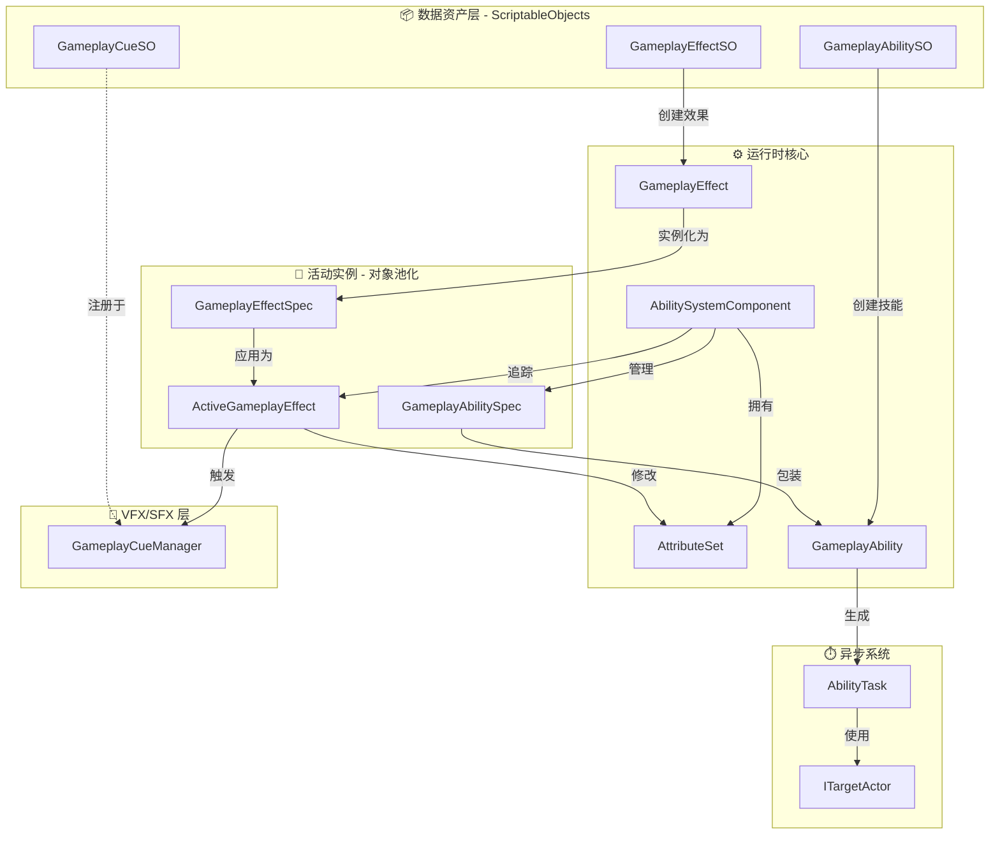
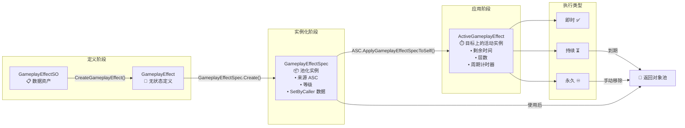
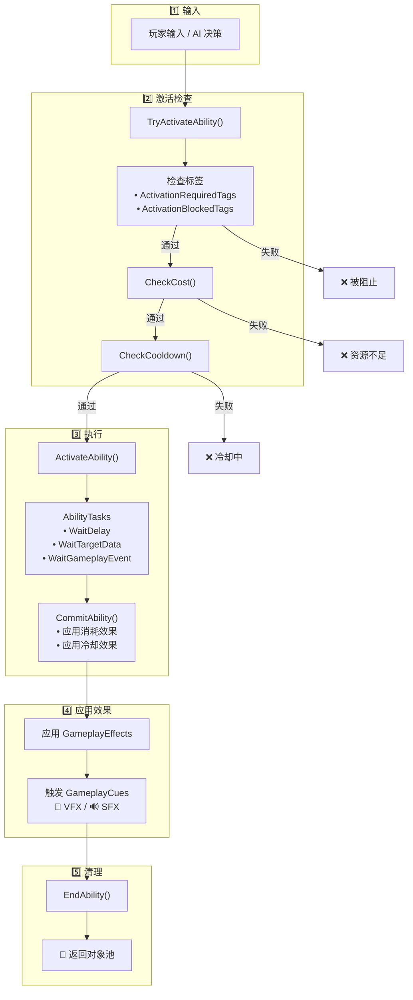

> **注意：** 本文档由 AI 辅助编写，如果你追求绝对精准，请直接阅读模块源码, **源码**以及**示例**皆由作者编写。

[**English**](README.md) | [**简体中文**]

# CycloneGames.GameplayAbilities

为 Unity 打造的强大、数据驱动的游戏性能力系统，灵感来自虚幻引擎的 GAS。

---

## ✨ 核心特性

| 特性                  | 说明                                         |
| --------------------- | -------------------------------------------- |
| 🎮 **数据驱动的技能** | 在 ScriptableObject 中定义技能，无需修改代码 |
| ⚡ **GameplayEffect** | 即时/持续/永久效果，支持叠加和周期性触发     |
| 🏷️ **标签系统**       | 使用 GameplayTag 解耦技能、状态、冷却逻辑    |
| 🎯 **瞄准系统**       | 内置球形范围、射线、地面选择等瞄准方式       |
| 📊 **属性集**         | 灵活的角色属性系统，支持验证钩子             |
| 🎨 **GameplayCue**    | VFX/SFX 与游戏逻辑完全分离                   |
| ⏱️ **AbilityTask**    | 异步技能逻辑（延迟、瞄准、动画）             |
| 🔄 **对象池**         | 零 GC 运行，自动对象池化                     |

---

## 📚 目录

### 快速开始

1. [为什么选择 GAS？](#gas的设计哲学技能系统的范式转移) — 传统方法 vs GAS
2. [架构概览](#架构深度解析) — 核心组件图
3. [快速上手](#综合快速上手指南) — 从零构建治疗技能

### 核心概念

4. [GameplayTag](#gameplay-tags) — GAS 的通用语言
5. [GameplayEffect](#gameplay-effects) — 修改器、持续时间、叠加
6. [属性集](#属性集) — 角色数值系统
7. [技能生命周期](#能力生命周期) — 授予 → 激活 → 提交 → 结束

### 高级特性

8. [AbilityTask](#abilitytasks) — 技能中的异步操作
9. [瞄准系统](#目标系统概览) — 查找和选择目标
10. [GameplayCue](#gameplaycue-系统) — VFX/SFX 管理
11. [执行计算](#执行计算) — 复杂伤害公式

### 参考

12. [示例演练](#示例演练) — 火球术、净化、升级系统
13. [常见问题](#常见问题-faq) — FAQ
14. [故障排除](#故障排除指南) — 调试清单
15. [性能优化](#性能优化) — 零 GC 技巧

---

## GAS 的设计哲学：技能系统的范式转移

在深入技术细节之前，理解 GAS 这类系统为何存在，以及它与传统方法有何根本不同，是至关重要的。

### 传统系统的困境

在许多项目中，能力逻辑起初很简单，但很快就会失控。一个典型的问题演变过程如下：

1.  **硬编码的能力：** `PlayerController` 中有一个 `UseFireball()` 函数。这很简单，但如果敌人也需要用火球术呢？你复制了代码。如果一个陷阱也需要呢？你又复制了一遍。逻辑与角色紧密地耦合在了一起。
2.  **"上帝"控制器：** 为了管理复杂性，开发者会创建一个庞大的 `SkillManager` 或不断扩展 `PlayerController` 来处理每一个技能、增益和交互。这个类变成了一个巨大的状态机，充满了布尔标志位（`isStunned`, `isPoisoned`, `isBurning`）、`Update()` 中的计时器，以及长长的 `switch` 或 `if/else` 链。它变得脆弱、难以调试，并成为团队协作的瓶颈。
3.  **数据与逻辑的纠缠：** 游戏设计师想要微调一个技能的伤害或持续时间。在传统系统中，这通常意味着他们必须冒险深入复杂的代码文件，这很可能引入错误。数据（`damage = 10`）与逻辑（`target.TakeDamage(damage)`）密不可分。

这种方法不具备可扩展性。技能和状态之间的潜在交互数量呈指数级增长，最终导致通常所说的"意大利面条式代码"。

### GAS 的解决方案：将能力和效果视为数据

GAS 通过将能力和效果不视为函数，而是视为**数据**来解决这些问题。这是核心的范式转变。

- **GameplayAbilities 是数据资产 (`GameplayAbilitySO`):** 一个"能力"就是一个 `ScriptableObject`，它封装了自身的逻辑，并链接到定义其消耗、冷却和效果的其他数据资产。你的角色不需要知道"火球术"是什么；它只知道自己拥有一个由 `GameplayTag` 标识的能力。
- **状态效果是数据资产 (`GameplayEffectSO`):** 一个角色不再仅仅是 `isPoisoned`。相反，他身上有一个"中毒"`GameplayEffect`资产的**活动实例**。这个资产*就是*中毒效果本身。它包含了所有相关数据：持续时间、周期性伤害、它赋予的 GameplayTag（`Status.Debuff.Poison`），甚至它如何与其他中毒效果叠加。系统会自动管理其整个生命周期。
- **通过标签解耦 (`GameplayTag`):** 标签是 GAS 的通用语言。它们被用来识别一切：能力（`Ability.Skill.Fireball`）、冷却（`Cooldown.Skill.Fireball`）、状态效果（`Status.Debuff.Poison`）、角色状态（`State.Stunned`），甚至是伤害类型（`Damage.Type.Fire`）。系统使用标签来提问，例如："能力所有者是否拥有`Cooldown.Skill.Fireball`标签？"或"目标是否对`Damage.Type.Fire`标签免疫？"。这创建了一个强大的、解耦的系统，不同的部分可以在没有直接引用的情况下进行交互。

这种以数据为中心的方法赋予了设计师权力，促进了可重用性，简化了调试（你检查的是数据资产，而不是复杂的调用堆栈），并为你的游戏机制创建了一个健壮、可扩展的基础。

### 对比：传统方法 vs. GAS

| 方面           | 传统系统 (痛点)                                                                                                    | CycloneGames.GameplayAbilities (解决方案)                                                                                                                                 |
| :------------- | :----------------------------------------------------------------------------------------------------------------- | :------------------------------------------------------------------------------------------------------------------------------------------------------------------------ |
| **架构**       | 庞大的单体类（`PlayerController`, `SkillManager`），逻辑硬编码。                                                   | 解耦的组件（`AbilitySystemComponent`）和数据资产（`GameplayAbilitySO`）。                                                                                                 |
| **数据与逻辑** | **紧密耦合。** 技能逻辑（`UseFireball()`）和数据（`damage = 10`）混合在同一个 C#文件中。设计师无法安全地平衡游戏。 | **严格分离。** 数据存储在 `ScriptableObject` 资产（`GameplayAbilitySO`）中。逻辑在运行时的 `GameplayAbility` 类中。设计师与资产打交道，程序员与代码打交道。               |
| **状态管理**   | **手动且脆弱。** 依赖布尔标志位（`isStunned`）、`Update()`中的手动计时器，以及难以调试和扩展的复杂状态机。         | **自动且健壮。** 状态效果是自包含的 `GameplayEffect` 实例。系统自动管理其持续时间、周期性应用和清理。状态是一个对象，而不是一个标志位。                                   |
| **可扩展性**   | **侵入式。** 添加新技能或状态效果通常需要修改多个核心类，增加了回归错误的风险。                                    | **模块化。** 通过创建新的 `GameplayAbilitySO` 资产及其对应的 `GameplayAbility` 类来添加新能力。无需更改现有代码。                                                         |
| **可复用性**   | **低。** 为玩家编写的技能通常必须为 AI 重写，因为它与 `PlayerController` 绑定。                                    | **高。** 同一个 `GameplayAbilitySO` 资产可以授予任何 `AbilitySystemComponent`，无论它是在玩家、AI，还是一个可打破的木桶上。                                               |
| **复杂性处理** | **指数级增长。** 随着技能和效果的增加，用于交互的 `if/else` 检查数量呈指数级增长，导致代码无法维护。               | **线性且由标签驱动。** 交互由 `GameplayTags` 管理。一个能力检查"我是否拥有`Cooldown.Fireball`？"而不是`if (skillManager.fireball_cooldown > 0)`。这种方式可以干净地扩展。 |

## 架构深度解析

### 系统架构总览



### GameplayEffect 生命周期



### 技能执行流程



## 综合快速上手指南

本综合指南将逐步引导您从零开始创建一个完整的"治疗"能力。完成后，您将理解核心概念，并准备好创建自己的能力。

### 前置条件

在开始之前，请确保您已具备：

- Unity 2021.3 或更高版本
- 已安装 `CycloneGames.GameplayAbilities` 包
- 已安装所有依赖项（`GameplayTags`, `Logger`, `AssetManagement`, `Factory`, `Service`）

### 步骤 1: 项目设置

**1.1 创建文件夹结构**

使用清晰的文件夹结构组织项目。在 `Assets` 文件夹中创建：

```
Assets/
└── _Project/
    ├── Scripts/
    │   ├── Attributes/
    │   ├── Abilities/
    │   └── Characters/
    ├── Data/
    │   ├── Effects/
    │   └── Abilities/
    └── Prefabs/
```

此结构使代码井然有序，便于后续查找资产。

> **关于 Gameplay Tags 的说明**: `CycloneGames.GameplayTags` 系统会在运行时自动注册标签。标签可以在 `ProjectSettings/GameplayTags/` 目录下的 JSON 文件中定义，或通过代码属性定义。当您使用 `GameplayTagManager.RequestTag("Ability.Action.Heal")` 时，如果标签已定义，系统会自动找到并使用它。您无需在代码中手动注册标签。

### 步骤 2: 创建属性集

属性集定义了角色拥有的属性。这是角色系统的基础。

**2.1 创建 PlayerAttributeSet.cs**

在 `_Project/Scripts/Attributes/` 中，创建 `PlayerAttributeSet.cs`：

```csharp
// _Project/Scripts/Attributes/PlayerAttributeSet.cs
using CycloneGames.GameplayAbilities.Runtime;
using UnityEngine;

/// <summary>
/// 定义玩家角色的所有属性。
/// 属性是能力和效果修改的核心数值。
/// </summary>
public class PlayerAttributeSet : AttributeSet
{
    // 生命值属性
    public readonly GameplayAttribute Health = new GameplayAttribute("Player.Attribute.Health");
    public readonly GameplayAttribute MaxHealth = new GameplayAttribute("Player.Attribute.MaxHealth");

    // 法力值属性
    public readonly GameplayAttribute Mana = new GameplayAttribute("Player.Attribute.Mana");
    public readonly GameplayAttribute MaxMana = new GameplayAttribute("Player.Attribute.MaxMana");

    /// <summary>
    /// 在属性值改变之前调用。使用此方法来限制值或应用约束。
    /// </summary>
    public override void PreAttributeChange(GameplayAttribute attribute, ref float newValue)
    {
        // 将生命值限制在 0 和 MaxHealth 之间
        if (attribute.Name == "Player.Attribute.Health")
        {
            float maxHealth = GetCurrentValue(MaxHealth);
            newValue = Mathf.Clamp(newValue, 0, maxHealth);
        }

        // 将法力值限制在 0 和 MaxMana 之间
        if (attribute.Name == "Player.Attribute.Mana")
        {
            float maxMana = GetCurrentValue(MaxMana);
            newValue = Mathf.Clamp(newValue, 0, maxMana);
        }
    }

    /// <summary>
    /// 在属性值改变之后调用。使用此方法处理副作用，如死亡检测。
    /// </summary>
    public override void PostAttributeChange(GameplayAttribute attribute, float oldValue, float newValue)
    {
        // 示例：当生命值达到 0 时检查死亡
        if (attribute.Name == "Player.Attribute.Health" && newValue <= 0 && oldValue > 0)
        {
            Debug.Log("玩家已死亡！");
            // 在此处触发死亡逻辑
        }
    }
}
```

**关键要点：**

- 属性定义为 `readonly GameplayAttribute` 字段
- 使用 `PreAttributeChange` 验证和限制值
- 使用 `PostAttributeChange` 处理副作用，如死亡检测
- 属性名称是字符串 - 考虑使用常量或集中式标签系统

### 步骤 3: 创建角色控制器

角色控制器初始化能力系统组件并向角色授予能力。

**3.1 创建 PlayerCharacter.cs**

在 `_Project/Scripts/Characters/` 中，创建 `PlayerCharacter.cs`：

```csharp
// _Project/Scripts/Characters/PlayerCharacter.cs
using CycloneGames.GameplayAbilities.Runtime;
using UnityEngine;

/// <summary>
/// 管理能力系统组件的主要角色控制器。
/// 此组件必须与 AbilitySystemComponentHolder 位于同一个 GameObject 上。
/// </summary>
[RequireComponent(typeof(AbilitySystemComponentHolder))]
public class PlayerCharacter : MonoBehaviour
{
    [Header("能力")]
    [Tooltip("要授予此角色的治疗能力资产。")]
    [SerializeField] private GameplayAbilitySO healAbilitySO;

    [Header("初始属性")]
    [Tooltip("在 Start 时应用的初始属性值。")]
    [SerializeField] private float initialHealth = 100f;
    [SerializeField] private float initialMaxHealth = 100f;
    [SerializeField] private float initialMana = 50f;
    [SerializeField] private float initialMaxMana = 50f;

    // 组件引用
    private AbilitySystemComponentHolder ascHolder;
    private PlayerAttributeSet playerAttributes;

    void Awake()
    {
        // 获取能力系统组件持有者
        // 此组件包装了 AbilitySystemComponent 并提供 MonoBehaviour 集成
        ascHolder = GetComponent<AbilitySystemComponentHolder>();

        if (ascHolder == null)
        {
            Debug.LogError("未找到 AbilitySystemComponentHolder！请将其添加到 GameObject。");
        }
    }

    void Start()
    {
        // 关键：初始化能力系统组件
        // 这告诉 ASC 谁是它的所有者（本脚本）以及化身是什么（本 GameObject）
        ascHolder.AbilitySystemComponent.InitAbilityActorInfo(this, this.gameObject);

        // 创建并添加属性集
        // 这是定义所有角色数值的地方
        playerAttributes = new PlayerAttributeSet();
        ascHolder.AbilitySystemComponent.AddAttributeSet(playerAttributes);

        // 设置初始属性值
        SetInitialAttributes();

        // 授予能力
        GrantInitialAbilities();
    }

    /// <summary>
    /// 设置所有属性的初始值。
    /// </summary>
    private void SetInitialAttributes()
    {
        // 创建一个临时效果来设置初始值
        // 这是初始化属性的常见模式
        var initialEffect = new GameplayEffect(
            "GE_InitialAttributes",
            EDurationPolicy.Instant, // Instant 意味着它应用一次就完成
            0, // Instant 不需要持续时间
            0, // Instant 不需要周期
            new System.Collections.Generic.List<ModifierInfo>
            {
                new ModifierInfo(playerAttributes.MaxHealth, EAttributeModifierOperation.Override, initialMaxHealth),
                new ModifierInfo(playerAttributes.Health, EAttributeModifierOperation.Override, initialHealth),
                new ModifierInfo(playerAttributes.MaxMana, EAttributeModifierOperation.Override, initialMaxMana),
                new ModifierInfo(playerAttributes.Mana, EAttributeModifierOperation.Override, initialMana)
            }
        );

        var spec = GameplayEffectSpec.Create(initialEffect, ascHolder.AbilitySystemComponent);
        ascHolder.AbilitySystemComponent.ApplyGameplayEffectSpecToSelf(spec);
    }

    /// <summary>
    /// 授予此角色的所有初始能力。
    /// </summary>
    private void GrantInitialAbilities()
    {
        if (healAbilitySO != null)
        {
            // 从 ScriptableObject 创建能力实例
            var ability = healAbilitySO.CreateAbility();

            // 将其授予此角色的能力系统组件
            ascHolder.AbilitySystemComponent.GrantAbility(ability);

            Debug.Log($"已授予能力: {healAbilitySO.AbilityName}");
        }
    }

    void Update()
    {
        // 示例：按 'H' 键激活治疗能力
        if (Input.GetKeyDown(KeyCode.H))
        {
            ActivateHealAbility();
        }
    }

    /// <summary>
    /// 通过标签查找并激活治疗能力。
    /// </summary>
    private void ActivateHealAbility()
    {
        // 获取所有可激活的能力
        var abilities = ascHolder.AbilitySystemComponent.GetActivatableAbilities();

        // 通过标签查找治疗能力
        foreach (var spec in abilities)
        {
            // 检查此能力是否有治疗标签
            if (spec.Ability.AbilityTags.HasTag("Ability.Action.Heal"))
            {
                // 尝试激活它
                bool success = ascHolder.AbilitySystemComponent.TryActivateAbility(spec);

                if (success)
                {
                    Debug.Log("治疗能力已激活！");
                }
                else
                {
                    Debug.LogWarning("激活治疗能力失败。请检查消耗、冷却时间或标签要求。");
                }

                return; // 找到并尝试激活，退出
            }
        }

        Debug.LogWarning("未找到治疗能力。请确保它已授予并具有正确的标签。");
    }

    /// <summary>
    /// 获取当前生命值的辅助方法（对 UI 等有用）
    /// </summary>
    public float GetCurrentHealth()
    {
        return playerAttributes?.GetCurrentValue(playerAttributes.Health) ?? 0f;
    }

    /// <summary>
    /// 获取当前法力值的辅助方法（对 UI 等有用）
    /// </summary>
    public float GetCurrentMana()
    {
        return playerAttributes?.GetCurrentValue(playerAttributes.Mana) ?? 0f;
    }
}
```

**关键要点：**

- 在使用 ASC 之前始终调用 `InitAbilityActorInfo()`
- 在授予能力之前创建并添加属性集
- 使用 `GrantAbility()` 给角色授予能力
- 使用 `GetActivatableAbilities()` 通过标签查找能力
- 使用 `TryActivateAbility()` 激活能力（它会自动检查消耗、冷却时间等）

### 步骤 4: 创建治疗能力

现在我们将创建实际的能力。一个能力有两个部分：

1. **运行时逻辑** (`HealAbility.cs`) - 激活时运行的代码
2. **数据资产** (`HealAbilitySO.cs`) - 设计师配置的 ScriptableObject

**4.1 创建运行时逻辑**

在 `_Project/Scripts/Abilities/` 中，创建 `HealAbility.cs`：

```csharp
// _Project/Scripts/Abilities/HealAbility.cs
using CycloneGames.GameplayAbilities.Runtime;
using CycloneGames.Logger;

/// <summary>
/// 一个简单的即时治疗能力，为施法者恢复生命值。
/// 这是一个"即时"能力 - 它立即应用效果并结束。
/// </summary>
public class HealAbility : GameplayAbility
{
    /// <summary>
    /// 当能力被激活时调用。
    /// 这是放置能力主要逻辑的地方。
    /// </summary>
    public override void ActivateAbility(
        GameplayAbilityActorInfo actorInfo,
        GameplayAbilitySpec spec,
        GameplayAbilityActivationInfo activationInfo)
    {
        CLogger.LogInfo($"[HealAbility] 由 {actorInfo.OwnerActor} 激活");

        // 关键：提交能力
        // 这会应用在 ScriptableObject 中定义的消耗和冷却效果
        // 它还会应用在 SO 中定义的任何"提交游戏效果"
        CommitAbility(actorInfo, spec);

        // 对于即时治疗，实际的治疗由 ScriptableObject 资产中定义的
        // "提交游戏效果"完成。如果您需要自定义逻辑，可以
        // 手动创建并应用 GameplayEffectSpecs。

        // 由于是即时能力，立即结束
        EndAbility();
    }

    /// <summary>
    /// 对象池系统所需。返回此能力的新实例。
    /// 池化系统使用此方法来高效创建能力实例。
    /// </summary>
    public override GameplayAbility CreatePoolableInstance()
    {
        return new HealAbility();
    }
}
```

**4.2 创建 ScriptableObject 工厂**

在 `_Project/Scripts/Abilities/` 中，创建 `HealAbilitySO.cs`：

```csharp
// _Project/Scripts/Abilities/HealAbilitySO.cs
using UnityEngine;
using CycloneGames.GameplayAbilities.Runtime;

/// <summary>
/// 用于创建治疗能力实例的 ScriptableObject 工厂。
/// 这桥接了编辑器数据（在 Inspector 中配置）和运行时逻辑。
/// </summary>
[CreateAssetMenu(fileName = "GA_Heal", menuName = "CycloneGames/Abilities/Heal")]
public class HealAbilitySO : GameplayAbilitySO
{
    /// <summary>
    /// 从本 ScriptableObject 创建运行时能力实例的工厂方法。
    /// 当能力被授予角色时调用此方法。
    /// </summary>
    public override GameplayAbility CreateAbility()
    {
        // 创建运行时能力类的新实例
        var abilityInstance = new HealAbility();

        // 使用在 Inspector 中配置的所有数据初始化它
        // 这包括：名称、标签、消耗、冷却时间等
        abilityInstance.Initialize(
            AbilityName,                    // 能力的名称
            InstancingPolicy,               // 能力的实例化方式
            NetExecutionPolicy,             // 网络执行策略
            CostEffect?.GetGameplayEffect(), // 定义消耗的效果（例如，法力）
            CooldownEffect?.GetGameplayEffect(), // 定义冷却时间的效果
            AbilityTags,                    // 标识此能力的标签
            ActivationBlockedTags,          // 阻止激活的标签
            ActivationRequiredTags,         // 激活所需的标签
            CancelAbilitiesWithTag,         // 当此能力激活时要取消的能力
            BlockAbilitiesWithTag           // 当此能力激活时要阻止的能力
        );

        return abilityInstance;
    }
}
```

**关键要点：**

- 运行时类（`HealAbility`）包含逻辑
- SO 类（`HealAbilitySO`）是数据资产
- 在 `ActivateAbility()` 中始终调用 `CommitAbility()` - 这会应用消耗和冷却时间
- 使用 `CreatePoolableInstance()` 支持对象池
- `Initialize()` 方法将编辑器数据连接到运行时逻辑

### 步骤 5: 创建游戏效果

游戏效果定义了使用能力时发生的情况。我们需要：

1. **治疗效果** - 恢复生命值
2. **消耗效果** - 消耗法力（可选）
3. **冷却效果** - 防止滥用（可选）

**5.1 创建治疗效果**

1. 在 Unity 中，导航到 `_Project/Data/Effects/`
2. 右键 → `Create → CycloneGames → GameplayAbilities → GameplayEffect`
3. 命名为 `GE_Heal`
4. 在 Inspector 中配置：
   - **Effect Name:** `Heal Effect`
   - **Duration Policy:** `Instant`（立即治疗，无持续时间）
   - **Modifiers:**
     - 点击 `+` 添加修改器
     - **Attribute:** `PlayerAttributeSet.Health`（或手动输入路径）
     - **Operation:** `Add`（添加到当前生命值）
     - **Magnitude:** `25`（治疗 25 HP）

**5.2 创建消耗效果（可选）**

1. 创建另一个名为 `GE_Heal_Cost` 的 GameplayEffect
2. 配置它：
   - **Duration Policy:** `Instant`
   - **Modifiers:**
     - **Attribute:** `PlayerAttributeSet.Mana`
     - **Operation:** `Add`
     - **Magnitude:** `-10`（负值 = 消耗 10 法力）

**5.3 创建冷却效果（可选）**

1. 创建另一个名为 `GE_Heal_Cooldown` 的 GameplayEffect
2. 配置它：
   - **Duration Policy:** `HasDuration`
   - **Duration:** `5.0`（5 秒冷却）
   - **Granted Tags:**
     - 点击 `+` 并添加 `Cooldown.Skill.Heal`
   - **Modifiers:** 无（冷却不修改属性，它们只是授予标签）

**关键要点：**

- **Instant** 效果应用一次就完成
- **HasDuration** 效果持续固定时间
- **Infinite** 效果持续到手动移除
- 使用 **Granted Tags** 标记效果（如冷却）
- 负值幅度减少数值（用于消耗/伤害）

### 步骤 6: 创建能力资产

现在我们将创建将所有内容联系在一起的 ScriptableObject 资产。

**6.1 创建能力资产**

1. 在 Unity 中，导航到 `_Project/Data/Abilities/`
2. 右键 → `Create → CycloneGames → Abilities → Heal`
3. 命名为 `GA_Heal`
4. 在 Inspector 中配置：

   **基本设置：**

   - **Ability Name:** `Simple Heal`
   - **Instancing Policy:** `InstancedPerActor`（每个角色一个实例，重复使用）
   - **Net Execution Policy:** `LocalPredicted`（对于单人游戏，`LocalOnly` 也可以）

   **标签：**

   - **Ability Tags:**
     - 点击 `+` 并添加 `Ability.Action.Heal`
   - **Activation Blocked Tags:** （暂时留空）
   - **Activation Required Tags:** （暂时留空）

   **效果：**

   - **Cost Effect:** 将 `GE_Heal_Cost` 拖到这里（如果没有消耗，留空）
   - **Cooldown Effect:** 将 `GE_Heal_Cooldown` 拖到这里（如果没有冷却，留空）
   - **Commit Gameplay Effects:**
     - 点击 `+` 并将 `GE_Heal` 拖到这里
     - 当调用 `CommitAbility()` 时应用此效果

**关键要点：**

- **Instancing Policy:** `InstancedPerActor` 最常见
- **Ability Tags** 标识能力（用于查找它）
- **Cost Effect** 在激活前检查
- **Cooldown Effect** 防止快速重复使用
- **Commit Gameplay Effects** 在能力提交时应用

### 步骤 7: 在 Unity 中设置角色

**7.1 创建玩家 GameObject**

1. 在场景中，创建一个名为 `Player` 的空 GameObject
2. 添加 `Ability System Component Holder` 组件
3. 添加 `Player Character` 组件（您之前创建的）
4. 在 `Player Character` 组件中：
   - 将项目中的 `GA_Heal` 拖到 `Heal Ability SO` 字段
   - 如果需要，设置初始属性值

**7.2 创建预制体**

1. 将 `Player` GameObject 从 Hierarchy 拖到 `_Project/Prefabs/`
2. 这将创建一个可重用的预制体

### 步骤 8: 测试您的能力

**8.1 运行场景**

1. 按 Play
2. 按 `H` 激活治疗能力
3. 检查控制台日志

**8.2 调试技巧**

如果能力不工作：

1. **检查控制台日志：** 查找错误消息
2. **验证能力已授予：**
   ```csharp
   // 临时添加到 PlayerCharacter.Update()
   var abilities = ascHolder.AbilitySystemComponent.GetActivatableAbilities();
   Debug.Log($"已授予的能力: {abilities.Count}");
   ```
3. **检查标签：** 确保标签已注册
4. **检查消耗：** 如果法力消耗太高，能力不会激活
5. **检查冷却：** 如果在冷却中，能力不会激活

**8.3 查看属性（可选）**

要在 Inspector 中查看属性，可以添加调试组件：

```csharp
// _Project/Scripts/Debug/AttributeDebugger.cs
using CycloneGames.GameplayAbilities.Runtime;
using UnityEngine;

public class AttributeDebugger : MonoBehaviour
{
    [SerializeField] private AbilitySystemComponentHolder holder;

    void OnGUI()
    {
        if (holder == null) return;

        var asc = holder.AbilitySystemComponent;
        if (asc == null) return;

        // 获取属性（调整名称以匹配您的 AttributeSet）
        var healthAttr = asc.GetAttribute("Player.Attribute.Health");
        var manaAttr = asc.GetAttribute("Player.Attribute.Mana");

        if (healthAttr != null)
        {
            GUI.Label(new Rect(10, 10, 200, 20), $"生命值: {healthAttr.CurrentValue}");
        }
        if (manaAttr != null)
        {
            GUI.Label(new Rect(10, 30, 200, 20), $"法力值: {manaAttr.CurrentValue}");
        }
    }
}
```

## 核心概念

### Gameplay Tags

Gameplay Tags 是 GAS 的通用语言。它们无需硬编码引用即可识别一切。

**常见标签模式：**

- `Ability.Skill.Fireball` - 标识能力
- `Cooldown.Skill.Fireball` - 标记冷却状态
- `Status.Debuff.Poison` - 标识状态效果
- `Damage.Type.Fire` - 标识伤害类型
- `Faction.Player` - 标识阵营/团队

**使用标签：**

```csharp
// 检查角色是否有标签
if (asc.CombinedTags.HasTag("Status.Debuff.Poison"))
{
    // 角色已中毒
}

// 创建标签容器
var poisonTag = GameplayTagContainer.FromTag("Status.Debuff.Poison");

// 移除所有带有标签的效果
targetASC.RemoveActiveEffectsWithGrantedTags(poisonTag);
```

### 高级标签特性

除了简单的标识作用，标签还能控制强大的游戏逻辑：

#### ActivationOwnedTags (在技能上)

当技能处于**激活状态**时，自动授予拥有者的标签。

- **适用场景**：释放"流星火雨"时，授予 `State.Casting` 标签。这可用于播放动画或阻止其他技能释放。
- **持续时间**：仅在技能激活期间存在。

#### ImmunityTags (在 AbilitySystemComponent 上)

授予对特定 GameplayEffect 的**完全免疫**。

- **工作原理**：如果 ASC 拥有 `ImmunityTags`（例如 `State.DebuffImmune`），任何传入的 GameplayEffect 若带有匹配的 **AssetTag** 或 **GrantedTag**（例如 `State.Debuff.Poison`），将被**完全阻止**。
- **适用场景**："圣盾"技能授予免疫标签，防止所有负面状态效果。

### Gameplay Effects

Gameplay Effects 是能力的构建块。它们修改属性、授予标签并创建状态效果。

**持续时间策略：**

- **Instant:** 应用一次就完成（伤害、治疗、消耗）
- **HasDuration:** 持续固定时间（增益、减益、冷却）
- **Infinite:** 持续到手动移除（装备属性、光环）

**修改器：**
修改器改变属性值：

- **Override:** 设置为精确值
- **Add:** 添加到当前值
- **Multiply:** 乘以当前值
- **Divide:** 除以当前值

**示例 - 持续伤害：**

```csharp
// 创建中毒 DoT 效果
var poisonEffect = new GameplayEffect(
    "Poison DoT",
    EDurationPolicy.HasDuration, // 持续 10 秒
    10f,                         // 持续时间：10 秒
    1f,                          // 周期：每 1 秒造成伤害
    new List<ModifierInfo>
    {
        new ModifierInfo(healthAttr, EAttributeModifierOperation.Add, -5f) // 每次 -5 HP
    }
);
```

### 能力生命周期

1. **Grant:** 能力被授予角色（`GrantAbility()`）
2. **Activate:** 玩家/AI 尝试使用它（`TryActivateAbility()`）
3. **CanActivate 检查：** 系统检查消耗、冷却时间、标签
4. **Commit:** 应用消耗和冷却时间（`CommitAbility()`）
5. **Execute:** 能力逻辑运行（`ActivateAbility()`）
6. **End:** 能力完成（`EndAbility()`）

### 属性集

属性集定义角色数值。它们：

- 将属性定义为 `GameplayAttribute` 字段
- 在 `PreAttributeChange()` 中验证更改
- 在 `PostAttributeChange()` 中响应更改
- 可以有派生属性（从基础属性计算）

**示例 - 派生属性：**

```csharp
public override float GetCurrentValue(GameplayAttribute attribute)
{
    if (attribute.Name == "Player.Attribute.HealthPercent")
    {
        float health = GetCurrentValue(Health);
        float maxHealth = GetCurrentValue(MaxHealth);
        return maxHealth > 0 ? health / maxHealth : 0f;
    }
    return base.GetCurrentValue(attribute);
}
```

## 高级特性

### AbilityTasks

AbilityTasks 处理能力中的异步操作。它们对复杂能力至关重要。

**内置任务：**

- `AbilityTask_WaitDelay` - 等待持续时间
- `AbilityTask_WaitTargetData` - 等待目标输入

**示例 - 蓄力攻击：**

```csharp
public override async void ActivateAbility(...)
{
    CommitAbility(actorInfo, spec);

    // 等待 2 秒蓄力
    var chargeTask = NewAbilityTask<AbilityTask_WaitDelay>();
    chargeTask.WaitTime = 2.0f;
    await chargeTask.ActivateAsync();

    // 蓄力后应用伤害
    ApplyDamage();
    EndAbility();
}
```

更多详细信息，请参阅 [AbilityTask 深度解析](#abilitytask-深度解析) 部分。

### 目标系统概览

目标系统为能力查找和选择目标。

**内置目标 Actor：**

- `GameplayAbilityTargetActor_SphereOverlap` - 在半径内查找目标
- `GameplayAbilityTargetActor_SingleLineTrace` - 射线投射目标
- `GameplayAbilityTargetActor_ConeTrace` - 锥形目标

**示例：**

```csharp
var targetActor = new GameplayAbilityTargetActor_SphereOverlap(
    5f, // 5 单位半径
    GameplayTagContainer.FromTag("Faction.Enemy") // 仅目标敌人
);

var task = AbilityTask_WaitTargetData.WaitTargetData(this, targetActor);
task.OnValidData = (targetData) =>
{
    foreach (var targetASC in targetData.AbilitySystemComponents)
    {
        ApplyDamageTo(targetASC);
    }
    EndAbility();
};
task.Activate();
```

### 执行计算

对于复杂的伤害公式，使用执行计算而不是简单的修改器。

**何时使用：**

- 伤害 = 攻击力 _ 1.5 - 防御力 _ 0.5
- 治疗 = 基础治疗 + 法术强度 \* 0.3
- 任何涉及多个属性的公式

**示例：**

```csharp
public class ExecCalc_Damage : GameplayEffectExecutionCalculation
{
    public override void Execute(GameplayEffectExecutionCalculationContext context)
    {
        var source = context.Spec.Source;
        var target = context.Target;

        float attackPower = source.GetAttribute("AttackPower")?.CurrentValue ?? 0f;
        float defense = target.GetAttribute("Defense")?.CurrentValue ?? 0f;

        float damage = attackPower * 1.5f - defense * 0.5f;

        context.AddOutputModifier(new ModifierInfo(
            target.GetAttribute("Health"),
            EAttributeModifierOperation.Add,
            -damage // 负值表示伤害
        ));
    }
}
```

### GameplayCue 系统

GameplayCues 处理视觉和音频效果，完全与游戏逻辑分离。

**Cue 事件：**

- **Executed:** 即时效果（冲击 VFX、命中音效）
- **OnActive:** 效果开始时（增益光晕、状态图标）
- **WhileActive:** 激活时持续（燃烧粒子）
- **Removed:** 效果结束时（淡出 VFX）

**示例：**

```csharp
[CreateAssetMenu(menuName = "CycloneGames/GameplayCues/Fireball Impact")]
public class GC_Fireball_Impact : GameplayCueSO
{
    public string ImpactVFXPrefab;
    public string ImpactSound;

    public override async UniTask OnExecutedAsync(GameplayCueParameters parameters, IGameObjectPoolManager poolManager)
    {
        // 生成 VFX
        var vfx = await poolManager.GetAsync(ImpactVFXPrefab, parameters.TargetObject.transform.position, Quaternion.identity);

        // 播放音效
        var audioClip = await GameplayCueManager.Instance.ResourceLocator.LoadAssetAsync<AudioClip>(ImpactSound);
        AudioSource.PlayClipAtPoint(audioClip, parameters.TargetObject.transform.position);
    }
}
```

更多详细信息，请参阅 [GameplayCue 系统](#gameplaycue-系统) 部分。

## 示例详解

`Samples` 文件夹包含一个实用的场景，演示了游戏性能力系统的多项核心功能，包括复杂的能力和升级系统。这提供了数据驱动架构在实际应用中的直观展示。

### 示例场景概览

`SampleScene.unity` 包含一个 **Player**（玩家）和一个 **Enemy**（敌人）角色，每个都配备了 `AbilitySystemComponentHolder`（MonoBehaviour 包装器），它管理其底层的 `AbilitySystemComponent` 和 `CharacterAttributeSet` 实例。`SampleCombatManager` 脚本处理玩家输入并更新 UI，以实时反映每个角色的状态，包括他们的属性、活动游戏效果和游戏标签。

- **玩家控制：**
  - **[1] 键：** 对敌人施放 **火球术 (Fireball)**。
  - **[2] 键：** 对自己施放 **净化 (Purify)** 以移除中毒减益。
  - **[空格] 键：** 给自己增加 50 XP 以测试升级系统。
- **敌人控制：**
  - **[E] 键：** 强制敌人对玩家施放 **淬毒之刃 (PoisonBlade)**。

### 特色能力展示

#### 1. 火球术 (Fireball) - 直接伤害 + 持续伤害 (DoT)

火球术是一个攻击性能力，造成即时伤害并应用持续的燃烧效果。它展示了：

- **数据驱动设计**: 该能力由 `GA_Fireball_SO` 定义。此 ScriptableObject 链接到其他 `GameplayEffectSO` 资产，用于其法力 **消耗**、**冷却时间**、即时 **冲击伤害** 和 **燃烧 DoT**。
- **复杂属性交互**: 最终伤害不只是一个简单的数字。当伤害 `GameplayEffect` 被应用时，目标的 `CharacterAttributeSet` 在其 `PreProcessInstantEffect` 方法中拦截它。然后，它根据目标的 `Defense`（防御）属性计算伤害减免，最后才施加最终的生命值扣减。
- **属性快照 (`SetSetByCallerMagnitude`)**: 当火球术被施放时，它会"快照"玩家那一刻的 `BonusDamageMultiplier`（额外伤害倍率）属性。此值被传入 `GameplayEffectSpec`，确保伤害计算使用施法瞬间的属性，而不是命中瞬间的属性。

#### 2. 淬毒之刃 (PoisonBlade) - 直接伤害 + 减益效果 (Debuff)

这是敌人的主要攻击技能。它是"即时伤害 + 持续性减益"的简单示例。

- **应用多个效果**: `GA_PoisonBlade` 能力依次应用两个独立的 `GameplayEffect`：一个用于初始武器命中伤害，另一个用于施加 `Debuff.Poison` 标签及其关联的周期性毒素伤害。

#### 3. 净化 (Purify) - 范围效果 (AoE) + 驱散

净化是一个防御性能力，用于移除施法者身上的中毒效果。它展示了几个高级概念：

- **异步能力**: 净化的逻辑不是立即执行的。它使用 `AbilityTask_WaitTargetData` 来异步执行其逻辑。
- **目标 Actor (Targeting Actors)**: 它使用 `GameplayAbilityTargetActor_SphereOverlap` 在施法者周围进行球形范围检测，以寻找所有有效的目标。
- **阵营过滤**: 该能力在其 `SO` 资产中被配置为只影响友方目标（拥有 `Faction.Player` 标签的角色），这演示了如何使用标签来进行精确的目标筛选。
- **按标签移除效果**: 驱散的核心逻辑仅需一行代码：`RemoveActiveEffectsWithGrantedTags`。它会移除目标身上任何授予了 `Debuff.Poison` 标签的 `GameplayEffect`。

### 升级系统

示例中包含一个完全由 `GameplayEffect` 驱动的升级系统。

- **获得经验**: 当敌人死亡时，它的 `BountyEffect`（悬赏效果）会被应用给玩家。此效果 (`GE_Bounty_Enemy.asset`) 的作用很简单，就是为玩家增加一定数量的 `Experience`（经验值）属性。
- **触发升级**: `CharacterAttributeSet` 会监听 `Experience` 属性的变化。当经验值增加后，它会调用 `Character` 脚本中的 `CheckForLevelUp` 方法。
- **应用升级属性**: `CheckForLevelUp` 方法会计算角色升了多少级，并在代码中**动态创建**一个新的、临时的 `GameplayEffect`。此效果包含了用于提升 `Level`、`MaxHealth`、`MaxMana` 等多项属性的修改器。这展示了本系统在运行时动态创建并应用效果的灵活性。

## GameplayCue 系统

**GameplayCue 系统**是 GAS 处理**表现效果**的方式，例如 VFX（视觉特效）、SFX（音效）、屏幕震动和画面效果。它完全将游戏逻辑与表现分离，让美术和设计师可以独立工作于视觉反馈，无需修改技能代码。

> **🎨 核心概念**: GameplayCue 仅用于**表现层**。它们绝不应该影响游戏状态（生命值、伤害等）。它们的存在纯粹是为了通过视觉和音频向玩家传达正在发生的事情。

### 为什么使用 GameplayCue？

在传统系统中，您可能会在技能内部看到这样的代码：

```csharp
// ❌ 不好：表现与逻辑紧密耦合
void DealDamage(Target target, float damage)
{
    target.Health -= damage;
    Instantiate(explosionVFX, target.Position);  // VFX 创建与伤害混合
    PlaySound(impactSound);       // 音频与逻辑混合
}
```

使用 GAS 后，变成：

```csharp
// ✅ 好：逻辑与表现分离
void DealDamage(Target target, float damage)
{
    var damageEffect = CreateDamageEffect(damage);
    damageEffect.GameplayCues.Add("GameplayCue.Impact.Explosion"); // 仅标签引用
    target.ASC.ApplyGameplayEffectSpecToSelf(damageEffect);
}
```

`GameplayCueManager` 看到 `"GameplayCue.Impact.Explosion"` 标签后会自动处理所有 VFX/SFX。

### 核心组件

- **`GameplayCueManager`**: 单例，处理提示的注册、加载和执行
- **`GameplayCueSO`**: 定义提示资产的 ScriptableObject 基类
- **`GameplayCueParameters`**: 传递给提示的数据结构，包含上下文（目标、来源、幅度等）
- **`EGameplayCueEvent`**: 枚举，定义提示触发时机：`Executed`、`OnActive`、`WhileActive`、`Removed`

### 提示事件类型

| 事件            | 何时触发                         | 使用场景                       |
| :-------------- | :------------------------------- | :----------------------------- |
| **Executed**    | 即时效果（如伤害）或周期性生效时 | 冲击特效、命中音效、伤害数字   |
| **OnActive**    | 当持续/无限效果首次应用时        | Buff 激活光环、状态图标        |
| **WhileActive** | 持续/无限效果激活期间持续触发    | 燃烧 Debuff 的循环火焰粒子     |
| **Removed**     | 当持续/无限效果过期或被移除时    | Buff 消退特效、Debuff 净化音效 |

### 示例 1：即时冲击提示（火球术）

示例包含 `GC_Fireball_Impact`，当火球效果命中时播放 VFX 和 SFX：

```csharp
// GC_Fireball_Impact.cs（简化版）
[CreateAssetMenu(menuName = "CycloneGames/GameplayCues/Fireball Impact")]
public class GC_Fireball_Impact : GameplayCueSO
{
    public string ImpactVFXPrefab;
    public float VFXLifetime = 2.0f;
    public string ImpactSound;

    public override async UniTask OnExecutedAsync(GameplayCueParameters parameters, IGameObjectPoolManager poolManager)
    {
        if (parameters.TargetObject == null) return;

        // 从池中在目标位置生成 VFX
        if (!string.IsNullOrEmpty(ImpactVFXPrefab))
        {
            var vfx = await poolManager.GetAsync(ImpactVFXPrefab, parameters.TargetObject.transform.position, Quaternion.identity);
            if (vfx != null)
            {
                // 生命期结束后返回池
                ReturnToPoolAfterDelay(poolManager, vfx, VFXLifetime).Forget();
            }
        }

        // 在冲击点播放音效
        if (!string.IsNullOrEmpty(ImpactSound))
        {
            var audioClip = await GameplayCueManager.Instance.ResourceLocator.LoadAssetAsync<AudioClip>(ImpactSound);
            if (audioClip)
            {
                AudioSource.PlayClipAtPoint(audioClip, parameters.TargetObject.transform.position);
            }
        }
    }
}
```

**使用方法：**

1. 在编辑器中创建 `GC_Fireball_Impact` 资产
2. 配置 `ImpactVFXPrefab` 和 `ImpactSound` 路径
3. 在您的 `GameplayEffectSO`（例如 `GE_Fireball_Damage`）中，将标签 `"GameplayCue.Impact.Fireball"` 添加到 `GameplayCues` 容器
4. 注册提示：`GameplayCueManager.Instance.RegisterStaticCue("GameplayCue.Impact.Fireball", cueAsset)`

现在，每当应用火球伤害时，VFX 和 SFX 会自动播放——**无需修改技能代码！**

### 示例 2：持久循环提示（燃烧效果）

对于持续效果如火焰 DoT，您希望循环粒子持续整个持续时间：

```csharp
[CreateAssetMenu(menuName = "CycloneGames/GameplayCues/Burn Loop")]
public class GC_Burn_Loop : GameplayCueSO, IPersistentGameplayCue
{
    public string BurnVFXPrefab;

    // 当燃烧效果首次应用时调用
    public async UniTask<GameObject> OnActiveAsync(GameplayCueParameters parameters, IGameObjectPoolManager poolManager)
    {
        if (parameters.TargetObject == null) return null;

        // 生成附加到目标的循环 VFX
        var vfxInstance = await poolManager.GetAsync(BurnVFXPrefab, parameters.TargetObject.transform.position, Quaternion.identity);
        if (vfxInstance != null)
        {
            vfxInstance.transform.SetParent(parameters.TargetObject.transform);
        }
        return vfxInstance; // GameplayCueManager 跟踪此实例
    }

    // 当燃烧效果被移除时调用
    public async UniTask OnRemovedAsync(GameObject instance, GameplayCueParameters parameters)
    {
        if (instance != null)
        {
            // 可选：销毁前播放"烟雾"效果
            // 然后释放回池
            poolManager.Release(instance);
        }
    }
}
```

通过实现 `IPersistentGameplayCue`，系统会自动跟踪并清理效果结束时的 VFX 实例。

### 注册提示

**静态注册**（游戏启动时）：

```csharp
// 在游戏初始化代码中
GameplayCueManager.Instance.Initialize(resourceLocator, gameObjectPoolManager);

GameplayCueManager.Instance.RegisterStaticCue("GameplayCue.Impact.Fireball", fireballImpactCueAsset);
GameplayCueManager.Instance.RegisterStaticCue("GameplayCue.Buff.Burn", burnLoopCueAsset);
```

**动态运行时注册**（用于代码驱动的提示）：

```csharp
public class MyCustomCueHandler : IGameplayCueHandler
{
    public void HandleCue(GameplayTag cueTag, EGameplayCueEvent eventType, GameplayCueParameters parameters)
    {
        if (eventType == EGameplayCueEvent.Executed)
        {
            Debug.Log($"自定义提示触发：{cueTag}");
            // 您的自定义 VFX/SFX 逻辑
        }
    }
}

// 注册它
var handler = new MyCustomCueHandler();
GameplayCueManager.Instance.RegisterRuntimeHandler(GameplayTagManager.RequestTag("GameplayCue.Custom.Test"), handler);
```

### 最佳实践

1.  **使用描述性标签名称**: `"GameplayCue.Impact.Fire"`、`"GameplayCue.Buff.Shield"`、`"GameplayCue.Debuff.Poison"`
2.  **池化您的 VFX**: 始终使用对象池以提高性能（系统原生支持）
3.  **保持提示无状态**: 每个提示应独立工作，不依赖外部状态
4.  **独立测试**: 创建测试场景，可手动触发提示进行验证
5.  **关注点分离**: 美术可迭代 VFX/SFX 而无需重新编译代码

### 调试提示

如果提示未播放：

- 检查提示标签是否添加到 `GameplayEffect` 的 `GameplayCues` 容器
- 验证提示是否已向 `GameplayCueManager` 注册
- 确保已调用 `GameplayCueManager.Initialize()`
- 检查控制台日志——管理器会在找不到提示时记录
- 验证目标 `GameplayEffectSpec` 的 `parameters.TargetObject` 中有有效的目标对象

## 网络架构

CycloneGames.GameplayAbilities 采用 **网络架构化 (Network-Architected)** 的设计方法，这意味着核心类（`GameplayAbility`, `AbilitySystemComponent`) 的结构支持复制和预测，但它是 **传输层无关 (transport-agnostic)** 的。

> [!IMPORTANT] > **需要集成**: 本包 **不** 包含内置的网络层（如 Mirror, Netcode for GameObjects, 或 Photon）。你必须使用你选择的网络方案自行实现 `ServerTryActivateAbility` 和 `ClientActivateAbilitySucceed/Failed` 的桥接。

#### 执行策略 (`ENetExecutionPolicy`)

- **LocalOnly**: 仅在客户端运行。适用于 UI 或纯装饰性能力。
- **ServerOnly**: 客户端请求激活；服务器运行。安全，但有延迟。
- **LocalPredicted**: 客户端立即运行（预测成功），同时发送请求给服务器。
  - **成功**: 服务器确认，客户端保留结果。
  - **失败**: 服务器拒绝，客户端 **回滚 (rolls back)**（撤销）该能力的效果。

#### 预测键 (Prediction Keys)

系统使用 `PredictionKey` 来追踪预测的行为。当客户端激活一个预测能力时，它会生成一个键。如果服务器验证通过，该键就被"批准"。如果未通过，所有与该键绑定的效果都会被移除。

## AbilityTask 深度解析

**AbilityTasks** 是创建复杂、异步能力的关键。它们处理需要时间或等待输入的操作，例如延迟、等待玩家瞄准、等待动画事件或复杂的多阶段能力逻辑。

> **🔑 核心概念**: 如果没有 AbilityTasks，所有能力逻辑都需要在 `ActivateAbility()` 中同步运行。Tasks 允许你将复杂的能力分解为可管理的异步步骤。

### 为什么使用 AbilityTasks？

考虑一个"蓄力攻击"能力：

1. 播放蓄力动画（等待 2 秒）
2. 等待玩家确认目标位置
3. 冲刺到位置
4. 造成范围伤害
5. 结束能力

如果不使用 Tasks，这需要混乱的协程或状态机。使用 `AbilityTask`，代码会很整洁：

```csharp
public override async void ActivateAbility(...)
{
    CommitAbility(actorInfo, spec);

    // 步骤 1: 等待蓄力时间
    var waitTask = NewAbilityTask<AbilityTask_WaitDelay>();
    waitTask.WaitTime = 2.0f;
    await waitTask.ActivateAsync();

    // 步骤 2: 等待玩家选择目标
    var targetTask = NewAbilityTask<AbilityTask_WaitTargetData>();
    targetTask.TargetActor = new GroundTargetActor();
    var targetData = await targetTask.ActivateAsync();

    // 步骤 3-5: 使用目标数据执行逻辑
    DashAndDamage(targetData);

    EndAbility();
}
```

### 内置 Tasks

#### 1. AbilityTask_WaitDelay

等待指定的持续时间后继续。

```csharp
public class GA_DelayedHeal : GameplayAbility
{
    public override void ActivateAbility(GameplayAbilityActorInfo actorInfo, GameplayAbilitySpec spec, GameplayAbilityActivationInfo activationInfo)
    {
        var waitTask = NewAbilityTask<AbilityTask_WaitDelay>();
        waitTask.WaitTime = 1.5f;
        waitTask.OnFinished = () =>
        {
            // 延迟后应用治疗
            var healSpec = GameplayEffectSpec.Create(healEffect, AbilitySystemComponent, spec.Level);
            AbilitySystemComponent.ApplyGameplayEffectSpecToSelf(healSpec);
            EndAbility();
        };
        waitTask.Activate();
    }
}
```

#### 2. AbilityTask_WaitTargetData

等待来自 `ITargetActor` 的目标数据。这就是像"净化"这样的能力获取目标列表的方式。

**来自示例的完整代码 (`GA_Purify`)：**

```csharp
public class GA_Purify : GameplayAbility
{
    private readonly float radius;
    private readonly GameplayTagContainer requiredTags; // 例如：Faction.Player

    public override void ActivateAbility(...)
    {
        CommitAbility(actorInfo, spec);

        // 创建球形重叠目标 Actor
        var targetActor = new GameplayAbilityTargetActor_SphereOverlap(radius, requiredTags);

        // 创建等待目标的 Task
        var targetTask = AbilityTask_WaitTargetData.WaitTargetData(this, targetActor);

        targetTask.OnValidData = (targetData) =>
        {
            // 处理找到的每个目标
            foreach (var targetASC in targetData.AbilitySystemComponents)
            {
                // 移除所有授予 "Debuff.Poison" 标签的效果
                targetASC.RemoveActiveEffectsWithGrantedTags(GameplayTagContainer.FromTag("Debuff.Poison"));
            }
            EndAbility();
        };

        targetTask.OnCancelled = () =>
        {
            CLogger.LogInfo("净化已取消");
            EndAbility();
        };

        targetTask.Activate();
    }
}
```

### 创建自定义 AbilityTasks

要创建自定义 Task，请继承 `AbilityTask` 并重写生命周期方法：

```csharp
public class AbilityTask_WaitForAttributeChange : AbilityTask
{
    public Action<float> OnAttributeChanged;
    private GameplayAttribute attributeToWatch;
    private AbilitySystemComponent targetASC;

    public static AbilityTask_WaitForAttributeChange WaitForAttributeChange(
        GameplayAbility ability,
        AbilitySystemComponent target,
        GameplayAttribute attribute)
    {
        var task = ability.NewAbilityTask<AbilityTask_WaitForAttributeChange>();
        task.attributeToWatch = attribute;
        task.targetASC = target;
        return task;
    }

    protected override void OnActivate()
    {
        // 订阅属性变更
        // (注意：在实际实现中，你需要将此事件添加到 AttributeSet)
        targetASC.OnAttributeChangedEvent += HandleAttributeChange;
    }

    private void HandleAttributeChange(GameplayAttribute attribute, float oldValue, float newValue)
    {
        if (attribute.Name == attributeToWatch.Name)
        {
            OnAttributeChanged?.Invoke(newValue);
            EndTask(); // 变更一次后任务完成
        }
    }

    protected override void OnDestroy()
    {
        if (targetASC != null)
        {
            targetASC.OnAttributeChangedEvent -= HandleAttributeChange;
        }
        OnAttributeChanged = null;
    }
}
```

**用法：**

```csharp
var task = AbilityTask_WaitForAttributeChange.WaitForAttributeChange(this, targetASC, targetASC.GetAttribute("Health"));
task.OnAttributeChanged = (newHealth) =>
{
    CLogger.LogInfo($"生命值变更为: {newHealth}");
};
task.Activate();
```

### Task 生命周期

1. **创建**: 在所属能力上调用 `NewAbilityTask<T>()`
2. **配置**: 设置属性并订阅事件（如 `OnFinished`, `OnValidData`）
3. **激活**: 调用 `task.Activate()` 开始执行
4. **执行**: Task 逻辑运行（等待、检查条件等）
5. **完成**: 完成时 Task 调用 `EndTask()`
6. **清理**: 调用 `OnDestroy()`，Task 返回池中
7. **所有者清理**: 当能力结束时，所有活动 Tasks 被强制结束

### 池化与性能

所有 Tasks 都是 **自动池化** 的，以实现零 GC 操作：

```csharp
// ✅ 好：使用池
var task = NewAbilityTask<AbilityTask_WaitDelay>(); // 从池中获取

// ❌ 坏：永远不要手动创建 Tasks
var task = new AbilityTask_WaitDelay(); // 绕过池化！
```

`AbilityTask` 基类自动处理池化。当 Task 结束时，它会被返回池中以供重用。

### 最佳实践

1. **始终使用 `NewAbilityTask<T>()`**: 永远不要用 `new` 实例化 Tasks
2. **清理事件**: 在 `OnDestroy()` 中取消订阅所有事件
3. **显式结束 Tasks**: 当 Task 逻辑完成时调用 `EndTask()`
4. **检查 `IsActive`**: 在执行逻辑之前，确保 `IsActive` 为 true
5. **处理取消**: 能力可能被中断；优雅地处理清理

### 常见模式

**模式 1: 等待多个条件**

```csharp
var task1 = NewAbilityTask<AbilityTask_WaitDelay>();
var task2 = NewAbilityTask<AbilityTask_WaitForInput>();
// 当两者都完成时，继续
```

**模式 2: Task 链**

```csharp
taskA.OnFinished = () =>
{
    var taskB = NewAbilityTask<NextTask>();
    taskB.OnFinished = () => EndAbility();
    taskB.Activate();
};
```

**模式 3: 超时**

```csharp
var targetTask = NewAbilityTask<AbilityTask_WaitTargetData>();
var timeoutTask = NewAbilityTask<AbilityTask_WaitDelay>();
timeoutTask.WaitTime = 5.0f;
timeoutTask.OnFinished = () =>
{
    targetTask.Cancel(); // 如果超时则取消瞄准
    EndAbility();
};
```

### 目标系统深度解析

瞄准系统允许能力基于空间查询、标签要求和自定义过滤逻辑来查找和选择目标。它与 `AbilityTask_WaitTargetData` 无缝配合，用于异步瞄准工作流。

### ITargetActor 接口

所有瞄准 Actor 都实现 `ITargetActor`：

```csharp
public interface ITargetActor
{
    void StartTargeting(GameplayAbilityActorInfo actorInfo, onTargetDataReadyDelegate onReady);
    void ConfirmTargeting();
    void CancelTargeting();
    void Destroy();
}
```

### 内置 Target Actors

#### 1. GameplayAbilityTargetActor_SphereOverlap

查找球形半径内的所有目标。

```csharp
public class GameplayAbilityTargetActor_SphereOverlap : ITargetActor
{
    private readonly float radius;
    private readonly GameplayTagRequirements filter; // 可选的标签过滤

    public GameplayAbilityTargetActor_SphereOverlap(float radius, GameplayTagContainer requiredTags = null)
    {
        this.radius = radius;
        if (requiredTags != null)
        {
            filter = new GameplayTagRequirements { RequireTags = requiredTags };
        }
    }

    public void StartTargeting(GameplayAbilityActorInfo actorInfo, Action<TargetData> onReady)
    {
        var casterPosition = (actorInfo.AvatarActor as GameObject).transform.position;
        var hits = Physics.OverlapSphere(casterPosition, radius);

        var targetData = new TargetData();
        foreach (var hit in hits)
        {
            if (hit.TryGetComponent<AbilitySystemComponentHolder>(out var holder))
            {
                // 可选：按标签过滤
                if (filter != null && !filter.RequirementsMet(holder.AbilitySystemComponent.CombinedTags))
                {
                    continue; // 跳过不满足标签要求的目标
                }

                targetData.AbilitySystemComponents.Add(holder.AbilitySystemComponent);
                targetData.HitResults.Add(new RaycastHit()); // 如果需要可以添加实际命中数据
            }
        }

        onReady?.Invoke(targetData);
    }
}
```

**在能力中使用：**

```csharp
var targetActor = new GameplayAbilityTargetActor_SphereOverlap(5f, GameplayTagContainer.FromTag("Faction.Player"));
var task = AbilityTask_WaitTargetData.WaitTargetData(this, targetActor);
task.OnValidData = (data) => {
    // 处理目标
};
task.Activate();
```

#### 2. GameplayAbilityTargetActor_GroundSelect (来自示例)

允许玩家选择一个地面位置，然后查找该区域内的目标。

```csharp
public class GameplayAbilityTargetActor_GroundSelect : MonoBehaviour, ITargetActor
{
    public float radius = 5f;
    public GameObject visualIndicatorPrefab;

    private GameObject indicator;
    private Action<TargetData> onTargetDataReady;
    private bool isActive;

    public void StartTargeting(GameplayAbilityActorInfo actorInfo, Action<TargetData> onReady)
    {
        onTargetDataReady = onReady;
        isActive = true;

        // 生成视觉指示器
        indicator = Instantiate(visualIndicatorPrefab);
        indicator.transform.localScale = Vector3.one * radius * 2;
    }

    private void Update()
    {
        if (!isActive) return;

        // 通过射线将指示器移动到鼠标位置
        Ray ray = Camera.main.ScreenPointToRay(Input.mousePosition);
        if (Physics.Raycast(ray, out RaycastHit hit))
        {
            indicator.transform.position = hit.point;
        }

        // 鼠标点击确认
        if (Input.GetMouseButtonDown(0))
        {
            ConfirmTargeting();
        }
    }

    public void ConfirmTargeting()
    {
        if (!isActive) return;

        var targetData = new TargetData();
        targetData.TargetLocation = indicator.transform.position;

        // 查找位置处的所有目标
        var hits = Physics.OverlapSphere(indicator.transform.position, radius);
        foreach (var hit in hits)
        {
            if (hit.TryGetComponent<AbilitySystemComponentHolder>(out var holder))
            {
                targetData.AbilitySystemComponents.Add(holder.AbilitySystemComponent);
            }
        }

        onTargetDataReady?.Invoke(targetData);
        Destroy();
    }

    public void Destroy()
    {
        if (indicator != null) Destroy(indicator);
        Destroy(gameObject);
    }
}
```

### 自定义瞄准过滤器

使用自定义过滤器创建复杂的瞄准逻辑：

```csharp
public class GameplayAbilityTargetActor_LineTrace : ITargetActor
{
    private readonly float maxDistance;
    private readonly Func<GameObject, bool> customFilter;

    public GameplayAbilityTargetActor_LineTrace(float distance, Func<GameObject, bool> filter = null)
    {
        maxDistance = distance;
        customFilter = filter;
    }

    public void StartTargeting(GameplayAbilityActorInfo actorInfo, Action<TargetData> onReady)
    {
        var caster =  (actorInfo.AvatarActor as GameObject);
        var ray = new Ray(caster.transform.position, caster.transform.forward);

        if (Physics.Raycast(ray, out RaycastHit hit, maxDistance))
        {
            // 自定义过滤逻辑
            if (customFilter != null && !customFilter(hit.collider.gameObject))
            {
                onReady?.Invoke(new TargetData()); // 空目标数据
                return;
            }

            var targetData = new TargetData();
            if (hit.collider.TryGetComponent<AbilitySystemComponentHolder>(out var holder))
            {
                targetData.AbilitySystemComponents.Add(holder.AbilitySystemComponent);
                targetData.HitResults.Add(hit);
            }
            onReady?.Invoke(targetData);
        }
    }
}
```

**用法：**

```csharp
// 仅瞄准低生命值的敌人
var targetActor = new GameplayAbilityTargetActor_LineTrace(10f, (go) =>
{
    if (go.TryGetComponent<AbilitySystemComponentHolder>(out var holder))
    {
        var healthAttr = holder.AbilitySystemComponent.GetAttribute("Health");
        return healthAttr?.CurrentValue < 50f;
    }
    return false;
});
```

## 执行计算

对于超出简单修改器的复杂多属性计算，请使用 `GameplayEffectExecutionCalculation`。

### 何时使用执行计算 vs 修改器

| 特性       | 简单修改器 (Simple Modifiers) | 执行计算 (Execution Calculations)  |
| :--------- | :---------------------------- | :--------------------------------- |
| **用例**   | 单一属性变更                  | 涉及多个属性的复杂公式             |
| **可预测** | 是 (客户端可预测)             | 否 (服务器权威)                    |
| **性能**   | 更快                          | 稍慢                               |
| **复杂性** | 低                            | 高                                 |
| **示例**   | 治疗 50 HP                    | 伤害 = 攻击力 _ 1.5 - 防御力 _ 0.5 |

### 示例：燃烧伤害计算

来自示例的 `ExecCalc_Burn` 演示了一个同时考虑源和目标属性的计算：

```csharp
public class ExecCalc_Burn : GameplayEffectExecutionCalculation
{
    public override void Execute(GameplayEffectExecutionCalculationContext context)
    {
        var spec = context.Spec;
        var target = context.Target;
        var source = spec.Source;

        // 捕获源的法术强度
        float spellPower = source.GetAttributeSet<CharacterAttributeSet>()?.GetCurrentValue(
            source.GetAttributeSet<CharacterAttributeSet>().SpellPower) ?? 0f;

        // 捕获目标的魔法抗性
        float magicResist = target.GetAttributeSet<CharacterAttributeSet>()?.GetCurrentValue(
            target.GetAttributeSet<CharacterAttributeSet>().MagicResistance) ?? 0f;

        // 计算最终燃烧伤害
        float baseDamage = 10f; // 每跳基础燃烧伤害
        float finalDamage = (baseDamage + spellPower * 0.2f) * (1f - magicResist / 100f);

        // 应用伤害到生命值
        var healthAttr = target.GetAttribute("Character.Attribute.Health");
        if (healthAttr != null)
        {
            context.AddOutputModifier(new ModifierInfo
            {
                Attribute = healthAttr,
                ModifierOp = EAttributeModOp.Add,
                Magnitude = -finalDamage // 负值表示伤害
            });
        }
    }
}
```

**创建 ScriptableObject：**

```csharp
[CreateAssetMenu(menuName = "GAS/Execution Calculations/Burn")]
public class ExecCalcSO_Burn : GameplayEffectExecutionCalculationSO
{
    public override GameplayEffectExecutionCalculation CreateExecutionCalculation()
    {
        return new ExecCalc_Burn();
    }
}
```

**在 GameplayEffect 中使用：**

在您的 `GameplayEffectSO` 中，将 `ExecCalcSO_Burn` 资产分配给 `Execution` 字段，而不是使用简单的 `Modifiers`。

### 最佳实践

- 对直接的属性变更使用修改器
- 对伤害公式、复杂的 Buff 缩放或条件逻辑使用执行计算
- 执行计算 **不是网络预测的**——在多人游戏中它们总是在服务器端运行

## 常见问题 (FAQ)

### Q: 何时应该使用 Instant vs Duration vs Infinite 效果?

- **Instant (即时)**: 一次性变更（伤害、治疗、法力消耗、即时属性提升）
- **HasDuration (有持续时间)**: 具有固定时间的临时 Buff/Debuff（加速 10 秒，眩晕 2 秒）
- **Infinite (无限)**: 直到被移除前一直存在的被动效果或状态（装备属性、光环、持久 Debuff）

### Q: 如何调试我的能力为何不激活?

1. 检查 `CanActivate()` 返回值——在每个检查处添加日志：
   ```csharp
   if (!CheckTagRequirements(...)) { CLogger.LogWarning("Tag requirements failed"); return false; }
   if (!CheckCost(...)) { CLogger.LogWarning("Cost check failed"); return false; }
   if (!CheckCooldown(...)) { CLogger.LogWarning("Cooldown active"); return false; }
   ```
2. 验证能力是否已授予：`ASC.GetActivatableAbilities()` 应包含你的能力
3. 检查 `AbilityTags` 是否与你检查的匹配
4. 确保 `AbilitySystemComponent.InitAbilityActorInfo()` 已被调用

### Q: AbilityTags, AssetTags 和 GrantedTags 有什么区别?

- **AbilityTags**: 能力本身的身份（例如 `"Ability.Skill.Fireball"`）
- **AssetTags** (在 GameplayEffect 上): 描述效果的元数据（例如 `"Damage.Type.Fire"`）
- **GrantedTags** (在 GameplayEffect 上): 效果激活期间授予目标的标签（例如 `"Status.Burning"`）

### Q: 如何创建持续伤害 (DoT) 效果?

创建一个 `GameplayEffect` 并设置：

- `DurationPolicy = HasDuration` (例如 10 秒)
- `Period = 1.0f` (每 1 秒造成伤害)
- `Modifiers` 目标为 Health，幅度为负值

系统会在效果的 `Duration` 期间每隔 `Period` 秒自动应用修改器。

### Q: 为什么使用标签而不是直接的组件引用?

标签提供 **松耦合**：

- 能力不需要知道具体的敌人类型
- 效果可以目标"任何带有标签 X 的东西"而无需硬编码引用
- 易于添加新内容而无需修改现有代码
- 支持数据驱动设计——设计师可以在检视面板中配置交互

### Q: 如何处理能力冷却?

冷却只是授予冷却标签的 `GameplayEffect`：

1. 创建一个 `GE_Cooldown_Fireball` 效果：
   - `DurationPolicy = HasDuration`, `Duration = 5.0f`
   - `GrantedTags = ["Cooldown.Skill.Fireball"]`
2. 在你的能力 `GameplayAbilitySO` 中，将其分配为 `CooldownEffect`
3. 能力的 `CanActivate()` 会自动检查所有者是否拥有该冷却标签

### Q: 有哪些性能注意事项?

- **对象池化**: 能力、效果和 Specs 都是池化的——游戏过程中零 GC
- **标签查找**: 标签查询很快（基于哈希），但避免在热路径中进行过多的嵌套检查
- **AttributeSet 大小**: 保持属性集专注——不要创建包含 100+ 属性的庞大集合
- **Cue 池化**: 始终通过 `IGameObjectPoolManager` 使用池化的 VFX/SFX

## 故障排除指南

### 能力不激活

**检查清单：**

- [ ] 能力是否已授予？检查 `ASC.GetActivatableAbilities()`
- [ ] 能力是否通过标签要求？记录 `CanActivate()` 检查
- [ ] 资源是否足够支付消耗？检查法力/耐力值
- [ ] 能力是否在冷却中？检查所有者身上的冷却标签
- [ ] `InitAbilityActorInfo()` 是否在 ASC 上被调用？

**常见错误:** 在 `ActivateAbility()` 中忘记调用 `CommitAbility()`，导致消耗/冷却未应用。

### 效果未应用

**检查清单：**

- [ ] 目标是否满足 `ApplicationTagRequirements`？
- [ ] 效果 Spec 是否正确创建？验证 `GameplayEffectSpec.Create()`
- [ ] 目标的 ASC 是否已初始化？
- [ ] 是否有冲突的 `RemoveGameplayEffectsWithTags` 立即移除了它？

**常见错误:** 应用了一个目标不具备其 `ApplicationTagRequirements` 的效果。

### 标签未按预期工作

**检查清单：**

- [ ] 标签是否已定义？标签会从 JSON 文件或代码属性自动注册，但必须先定义它们
- [ ] 你是否在检查 ASC 上的 `CombinedTags`（而不仅仅是单个效果上的 `GrantedTags`）？
- [ ] 效果是否激活？检查 `ActiveGameplayEffects` 列表
- [ ] 对于标签要求，你是否正确使用了 `RequireTags` vs `IgnoreTags`？

**常见错误:** 在 `GameplayEffect` 上检查标签，而不是在 `AbilitySystemComponent.CombinedTags` 上检查。

### GameplayCue 未播放

**检查清单：**

- [ ] Cue 是否已向 `GameplayCueManager` 注册？
- [ ] `GameplayCueManager.Initialize()` 是否在游戏开始时被调用？
- [ ] Cue 标签是否已添加到效果的 `GameplayCues` 容器？
- [ ] `parameters.TargetObject` 是否存在并具有有效的 Transform？

**常见错误:** 将 Cue 标签添加到 `AssetTags` 而不是 `GameplayCues`。

## 性能优化

本系统专为高性能、零 GC 游戏设计。以下是关键策略：

### 对象池化

每个主要对象都是池化的：

- `GameplayAbilitySpec` - 授予/移除能力时池化
- `GameplayEffectSpec` - 创建/销毁效果时池化
- `ActiveGameplayEffect` - 效果生命周期内池化
- `AbilityTask` - 任务执行期间池化

**你必须使用池化 API：**

```csharp
// ✅ 好
var spec = GameplayEffectSpec.Create(effect, source, level); // 来自池
source.ApplyGameplayEffectSpecToSelf(spec); // 自动返回池

// ❌ 坏
var spec = new GameplayEffectSpec(); // 绕过池，产生垃圾！
```

### 标签查找优化

- 标签使用基于哈希的查找（平均 O(1)）
- `CombinedTags` 被缓存，仅在效果变更时更新
- 避免在热路径中重建 `GameplayTagContainer`：

```csharp
// ✅ 好: 缓存标签容器
private static readonly GameplayTagContainer poisonTag = GameplayTagContainer.FromTag("Debuff.Poison");

public void RemovePoison(AbilitySystemComponent target)
{
    target.RemoveActiveEffectsWithGrantedTags(poisonTag); // 重用缓存容器
}

// ❌ 坏: 每次调用创建新容器
public void RemovePoison(AbilitySystemComponent target)
{
    target.RemoveActiveEffectsWithGrantedTags(GameplayTagContainer.FromTag("Debuff.Poison")); // 分配内存！
}
```

### 属性脏标记

- 属性仅在标记为脏时重新计算
- 修改在效果应用期间批处理
- `RecalculateDirtyAttributes()` 每帧调用一次，而不是每个效果一次

### VFX/SFX 池化

始终为 Cues 使用 `IGameObjectPoolManager`：

```csharp
var vfx = await poolManager.GetAsync(prefabPath, position, rotation); // 来自池
// ... 使用 VFX ...
poolManager.Release(vfx); // 返回池
```

### 分析提示

1. **检查 GC 分配**: 使用 Unity Profiler 的 GC Alloc 列——游戏期间应为零
2. **监控标签更新**: `UpdateCombinedTags()` 应仅在效果应用/移除时运行
3. **观察效果数量**: 一个 Actor 上数百个活动效果会减慢重新计算；考虑效果堆叠限制

### 使用 GASPoolUtility 进行池管理

系统包含一个集中式池管理工具类，提供可扩展的分级预设：

```csharp
// 根据不同的游戏规模配置对象池（在初始化时调用）
GASPoolUtility.ConfigureUltra();     // 终极性能 / 弹幕游戏 (2000+ 活跃实体)
GASPoolUtility.ConfigureHigh();      // 高性能 / 吸血鬼幸存者 (1000+ 实体)
GASPoolUtility.ConfigureMedium();    // 中等 / ARPG (标准)
GASPoolUtility.ConfigureLow();       // 低配 / 冒险游戏
GASPoolUtility.ConfigureMinimal();    // 极简 / 极低内存占用
GASPoolUtility.ConfigureMobile();    // 移动端优化默认值

// 在加载界面预热池（减少首帧卡顿）
GASPoolUtility.WarmAllPools();                // 预热到目标容量
GASPoolUtility.WarmAllPools(64, 128, 64);     // 自定义特定数量

// 场景切换时：释放内存
GASPoolUtility.AggressiveShrinkAll();         // 收缩到最小容量
GASPoolUtility.ClearAllPools();               // 完全重置（谨慎使用）
```

### 池统计和健康监控

在开发版本中调试池性能：

```csharp
// 输出所有池的统计信息
GASPoolUtility.LogAllStatistics();

// 检查池健康状况（命中率 > 80% 为健康）
if (!GASPoolUtility.CheckPoolHealth(out string report))
{
    Debug.LogWarning(report); // 建议增加 MinCapacity 或 WarmPool 数量
}

// 单个池统计
var stats = GameplayEffectSpec.GetStatistics();
Debug.Log($"池: {stats.PoolSize}, 活跃: {stats.ActiveCount}, 命中率: {stats.HitRate:P1}");
```

### 平台自适应池容量

池会根据平台自动配置最佳大小：

| 平台              | 最大容量 | 最小容量 | 原理             |
| ----------------- | -------- | -------- | ---------------- |
| **移动端/Switch** | 较低     | 较低     | 保守的内存使用   |
| **PC/主机**       | 较高     | 较高     | 更好的缓存命中率 |
| **默认**          | 中等     | 中等     | 平衡的回退值     |

### 最佳实践总结

- 缓存标签容器并重用它们
- 独占使用池化 API（永远不要对 specs/tasks 使用 `new`）
- 限制属性集大小（每集最多 20-30 个属性）
- 谨慎使用执行计算（它们比修改器慢）
- 定期分析——系统设计为 0GC，请在你的用例中验证这一点

---

## 示例演练

关于包含的示例（火球术、净化、升级）的综合指南，请阅读 **[示例演练文档](Samples/README.SCH.md)**。

- DemoLink: [https://github.com/MaiKuraki/UnityGameplayAbilitySystemSample](https://github.com/MaiKuraki/UnityGameplayAbilitySystemSample)
- 
- 

## 依赖项

本包依赖于以下外部和内部包：

- `com.cysharp.unitask`: 用于异步操作。
- `com.cyclone-games.assetmanagement`: 资源加载接口。
- `com.cyclone-games.gameplay-tags`: 用于底层的 `GameplayTag` 系统。
- `com.cyclone-games.logger`: 用于调试日志记录。
- `com.cyclone-games.factory`: 用于对象创建和池化。
