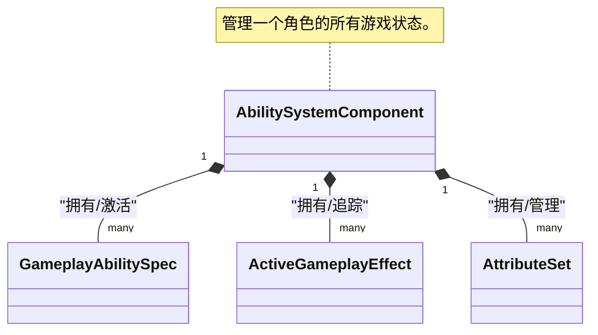
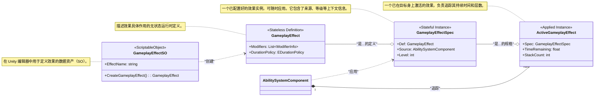
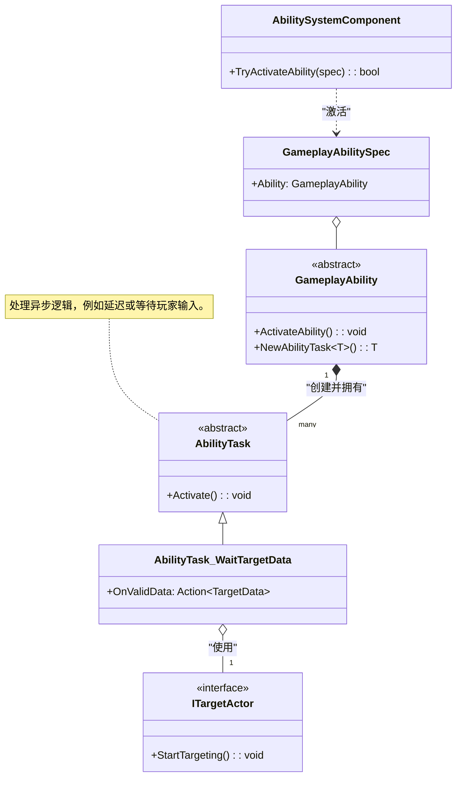

> **注意：** 本文档由AI辅助编写，如果你追求绝对精准，请直接阅读模块源码, **源码**以及**示例**皆由作者编写。

[**English**](README.md) | [**简体中文**]

# CycloneGames.GameplayAbilities

CycloneGames.GameplayAbilities 是一个为 Unity 打造的、功能强大且高度灵活的游戏性能力系统（Gameplay Ability System），其设计深受虚幻引擎（Unreal Engine）著名的 Gameplay Ability System (GAS) 的启发。本系统从零开始构建，以数据驱动为核心，充分利用 Unity 的 `ScriptableObject` 架构，为您提供一个健壮的框架，只需极少的代码即可创建复杂的技能、属性和状态效果。

本系统非常适合开发 RPG、MOBA 或任何需要精细技能和属性系统的游戏。它的设计旨在对初学者友好，同时也能提供专业项目所需的深度。

## GAS的设计哲学：技能系统的范式转移

在深入技术细节之前，理解GAS这类系统为何存在，以及它与传统方法有何根本不同，是至关重要的。

### 传统系统的困境

在许多项目中，能力逻辑起初很简单，但很快就会失控。一个典型的问题演变过程如下：

1.  **硬编码的能力：** `PlayerController` 中有一个 `UseFireball()` 函数。这很简单，但如果敌人也需要用火球术呢？你复制了代码。如果一个陷阱也需要呢？你又复制了一遍。逻辑与角色紧密地耦合在了一起。
2.  **“上帝”控制器：** 为了管理复杂性，开发者会创建一个庞大的 `SkillManager` 或不断扩展 `PlayerController` 来处理每一个技能、增益和交互。这个类变成了一个巨大的状态机，充满了布尔标志位（`isStunned`, `isPoisoned`, `isBurning`）、`Update()` 中的计时器，以及长长的 `switch` 或 `if/else` 链。它变得脆弱、难以调试，并成为团队协作的瓶颈。
3.  **数据与逻辑的纠缠：** 游戏设计师想要微调一个技能的伤害或持续时间。在传统系统中，这通常意味着他们必须冒险深入复杂的代码文件，这很可能引入错误。数据（`damage = 10`）与逻辑（`target.TakeDamage(damage)`）密不可分。

这种方法不具备可扩展性。技能和状态之间的潜在交互数量呈指数级增长，最终导致通常所说的“意大利面条式代码”。

### GAS的解决方案：将能力和效果视为数据

GAS通过将能力和效果不视为函数，而是视为**数据**来解决这些问题。这是核心的范式转变。

*   **GameplayAbilities是数据资产 (`GameplayAbilitySO`):** 一个“能力”就是一个 `ScriptableObject`，它封装了自身的逻辑，并链接到定义其消耗、冷却和效果的其他数据资产。你的角色不需要知道“火球术”是什么；它只知道自己拥有一个由 `GameplayTag` 标识的能力。
*   **状态效果是数据资产 (`GameplayEffectSO`):** 一个角色不再仅仅是 `isPoisoned`。相反，他身上有一个“中毒”`GameplayEffect`资产的**活动实例**。这个资产*就是*中毒效果本身。它包含了所有相关数据：持续时间、周期性伤害、它赋予的GameplayTag（`Status.Debuff.Poison`），甚至它如何与其他中毒效果叠加。系统会自动管理其整个生命周期。
*   **通过标签解耦 (`GameplayTag`):** 标签是GAS的通用语言。它们被用来识别一切：能力（`Ability.Skill.Fireball`）、冷却（`Cooldown.Skill.Fireball`）、状态效果（`Status.Debuff.Poison`）、角色状态（`State.Stunned`），甚至是伤害类型（`Damage.Type.Fire`）。系统使用标签来提问，例如：“能力所有者是否拥有`Cooldown.Skill.Fireball`标签？”或“目标是否对`Damage.Type.Fire`标签免疫？”。这创建了一个强大的、解耦的系统，不同的部分可以在没有直接引用的情况下进行交互。

这种以数据为中心的方法赋予了设计师权力，促进了可重用性，简化了调试（你检查的是数据资产，而不是复杂的调用堆栈），并为你的游戏机制创建了一个健壮、可扩展的基础。

### 对比：传统方法 vs. GAS

| 方面           | 传统系统 (痛点)                                                                                                   | CycloneGames.GameplayAbilities (解决方案)                                                                                                                                 |
| :------------- | :---------------------------------------------------------------------------------------------------------------- | :------------------------------------------------------------------------------------------------------------------------------------------------------------------------ |
| **架构**       | 庞大的单体类（`PlayerController`, `SkillManager`），逻辑硬编码。                                                  | 解耦的组件（`AbilitySystemComponent`）和数据资产（`GameplayAbilitySO`）。                                                                                                 |
| **数据与逻辑** | **紧密耦合。** 技能逻辑（`UseFireball()`）和数据（`damage = 10`）混合在同一个C#文件中。设计师无法安全地平衡游戏。 | **严格分离。** 数据存储在 `ScriptableObject` 资产（`GameplayAbilitySO`）中。逻辑在运行时的 `GameplayAbility` 类中。设计师与资产打交道，程序员与代码打交道。               |
| **状态管理**   | **手动且脆弱。** 依赖布尔标志位（`isStunned`）、`Update()`中的手动计时器，以及难以调试和扩展的复杂状态机。        | **自动且健壮。** 状态效果是自包含的 `GameplayEffect` 实例。系统自动管理其持续时间、周期性应用和清理。状态是一个对象，而不是一个标志位。                                   |
| **可扩展性**   | **侵入式。** 添加新技能或状态效果通常需要修改多个核心类，增加了回归错误的风险。                                   | **模块化。** 通过创建新的 `GameplayAbilitySO` 资产及其对应的 `GameplayAbility` 类来添加新能力。无需更改现有代码。                                                         |
| **可复用性**   | **低。** 为玩家编写的技能通常必须为AI重写，因为它与 `PlayerController` 绑定。                                     | **高。** 同一个 `GameplayAbilitySO` 资产可以授予任何 `AbilitySystemComponent`，无论它是在玩家、AI，还是一个可打破的木桶上。                                               |
| **复杂性处理** | **指数级增长。** 随着技能和效果的增加，用于交互的 `if/else` 检查数量呈指数级增长，导致代码无法维护。              | **线性且由标签驱动。** 交互由 `GameplayTags` 管理。一个能力检查“我是否拥有`Cooldown.Fireball`？”而不是`if (skillManager.fireball_cooldown > 0)`。这种方式可以干净地扩展。 |

## 架构深度解析
- Core Interaction Overview

- Gameplay Effect Lifecycle

- Ability Activation & Tasks


## 示例详解 (Sample Walkthrough)

`Samples` 文件夹包含一个功能齐全的示例场景，演示了本游戏性能力系统的多项核心功能，包括复杂的技能实现和一个完整的升级系统。它直观地展示了数据驱动架构在实际项目中的应用方式。

### 示例场景概览

`SampleScene.unity` 场景中包含一个 **Player** (玩家) 和一个 **Enemy** (敌人) 角色，两者都挂载了 `AbilitySystemComponentHolder`（一个MonoBehaviour包装器），该包装器负责管理其底层的 `AbilitySystemComponent` 和 `CharacterAttributeSet` 实例。场景中的 `SampleCombatManager` 脚本负责处理玩家输入、更新UI界面，以实时显示每个角色的状态，包括他们的属性、当前激活的Gameplay Effect和拥有的Gameplay Tag。

-   **玩家控制:**
    -   **[1] 键:** 对敌人释放 **火球术 (Fireball)**。
    -   **[2] 键:** 对自己释放 **净化 (Purify)**，以移除中毒效果。
    -   **[空格] 键:** 给自己增加50点经验值，用于测试升级系统。
-   **敌人控制:**
    -   **[E] 键:** 强制敌人对玩家释放 **淬毒之刃 (PoisonBlade)**。

### 核心示例组件

-   **`Character.cs`**: 玩家和敌人的基类脚本。它负责初始化 `AbilitySystemComponent`，授予初始能力和效果，并包含处理角色升级的核心逻辑。
-   **`CharacterAttributeSet.cs`**: 定义了示例角色的所有属性（如 `Health`, `Mana`, `AttackPower`, `Defense`, `Level`, `Experience`）。它还包含了更高级的逻辑，例如伤害计算（根据防御力减免伤害）和处理角色死亡。

### 特色能力展示

#### 1. 火球术 (Fireball) - 直接伤害 + 持续伤害 (DoT)

火球术是一个攻击性技能，造成一次性的立即伤害，并附加一个持续的燃烧效果。它主要展示了：

-   **数据驱动设计**: 该能力由 `GA_Fireball_SO` 定义。这个 ScriptableObject 资产文件链接了多个 `GameplayEffectSO` 资产，分别定义了其法力 **消耗**、**冷却时间**、立即**冲击伤害**以及**燃烧DoT**。
-   **复杂的属性交互**: 最终伤害不是一个简单的数字。当伤害 `GameplayEffect` 被应用时，目标的 `CharacterAttributeSet` 会在其 `PreProcessInstantEffect` 方法中拦截它。然后，它会根据目标的 `Defense` (防御) 属性计算伤害减免，最后才施加最终的生命值扣减。
-   **属性快照 (`SetSetByCallerMagnitude`)**: 当火球术被释放时，它会“快照”玩家那一刻的 `BonusDamageMultiplier`（额外伤害倍率）属性。这个值被传入 `GameplayEffectSpec`，确保最终的伤害计算使用的是施法瞬间的属性，而不是命中瞬间的属性。

#### 2. 淬毒之刃 (PoisonBlade) - 直接伤害 + 减益效果 (Debuff)

这是敌人的主要攻击技能。它是一个典型的“立即伤害 + 持续性Debuff”的简单示例。

-   **应用多个效果**: `GA_PoisonBlade` 技能会依次应用两个独立的 `GameplayEffect`：一个用于造成初始的武器命中伤害，另一个用于施加 `Debuff.Poison` 标签及其关联的周期性毒素伤害。

#### 3. 净化 (Purify) - 范围效果 (AoE) + 驱散

净化是一个防御性技能，用于移除施法者身上的中毒效果。它展示了几个高级概念：

-   **异步能力**: 净化的逻辑不是立即执行的。它使用 `AbilityTask_WaitTargetData` 来异步执行其逻辑。
-   **目标Actor (Targeting Actors)**: 它使用 `GameplayAbilityTargetActor_SphereOverlap` 在施法者周围进行球形范围检测，以寻找所有有效的目标。
-   **阵营过滤**: 该能力在其 `SO` 资产中被配置为只影响友方目标（拥有 `Faction.Player` 标签的角色），这演示了如何使用标签来进行精确的目标筛选。
-   **按标签移除效果**: 驱散的核心逻辑仅需一行代码：`RemoveActiveEffectsWithGrantedTags`。它会移除目标身上任何授予了 `Debuff.Poison` 标签的 `GameplayEffect`。

### 升级系统

示例中包含一个完全由 `GameplayEffect` 驱动的升级系统。

-   **获得经验**: 当敌人死亡时，它的 `BountyEffect` (悬赏效果) 会被应用给玩家。这个效果 (`GE_Bounty_Enemy.asset`) 的作用很简单，就是为玩家增加一定数量的 `Experience` (经验值) 属性。
-   **触发升级**: `CharacterAttributeSet` 会监听 `Experience` 属性的变化。当经验值增加后，它会调用 `Character` 脚本中的 `CheckForLevelUp` 方法。
-   **应用升级属性**: `CheckForLevelUp` 方法会计算角色升了多少级，并在代码中**动态创建**一个新的、临时的 `GameplayEffect`。这个Effect包含了用于提升 `Level`、`MaxHealth`、`MaxMana` 等多项属性的修改器。这展示了本系统在运行时动态创建并应用效果的灵活性。

## GameplayCue 系统（游戏提示/表现效果系统）

**GameplayCue 系统**是 GAS 处理**表现效果**的方式，例如VFX（视觉特效）、SFX（音效）、屏幕震动和画面效果。它完全将游戏逻辑与表现分离，让美术和设计师可以独立工作于视觉反馈，无需修改技能代码。

> **🎨 核心概念**: GameplayCue 仅用于**表现层**。它们绝不应该影响游戏状态（生命值、伤害等）。它们的存在纯粹是为了通过视觉和音频向玩家传达正在发生的事情。

### 为什么使用 GameplayCue？

在传统系统中，你可能会在技能内部看到这样的代码：

```csharp
// ❌ 不好：表现与逻辑紧密耦合
void DealDamage(Target target, float damage)
{
    target.Health -= damage;
    Instantiate(explosionVFX, target.Position);  // VFX 创建与伤害混合
    PlaySound(impactSound);       // 音频与逻辑混合
}
```

使用 GAS 后，变成：

```csharp
// ✅ 好：逻辑与表现分离
void DealDamage(Target target, float damage)
{
    var damageEffect = CreateDamageEffect(damage);
    damageEffect.GameplayCues.Add("GameplayCue.Impact.Explosion"); // 仅标签引用
    target.ASC.ApplyGameplayEffectSpecToSelf(damageEffect);
}
```

`GameplayCueManager` 看到 `"GameplayCue.Impact.Explosion"` 标签后会自动处理所有 VFX/SFX。

### 核心组件

-   **`GameplayCueManager`**: 单例，处理提示的注册、加载和执行
-   **`GameplayCueSO`**: 定义提示资产的 ScriptableObject 基类
-   **`GameplayCueParameters`**: 传递给提示的数据结构，包含上下文（目标、来源、幅度等）
-   **`EGameplayCueEvent`**: 枚举，定义提示触发时机：`Executed`、`OnActive`、`WhileActive`、`Removed`

### 提示事件类型

| 事件            | 何时触发                         | 使用场景                     |
| :-------------- | :------------------------------- | :--------------------------- |
| **Executed**    | 即时效果（如伤害）或周期性生效时 | 冲击特效、命中音效、伤害数字 |
| **OnActive**    | 当持续/无限效果首次应用时        | Buff激活光环、状态图标       |
| **WhileActive** | 持续/无限效果激活期间持续触发    | 燃烧Debuff的循环火焰粒子     |
| **Removed**     | 当持续/无限效果过期或被移除时    | Buff消退特效、Debuff净化音效 |

### 示例 1：即时冲击提示（火球术）

示例包含 `GC_Fireball_Impact`，当火球效果命中时播放 VFX 和 SFX：

```csharp
// GC_Fireball_Impact.cs（简化版）
[CreateAssetMenu(menuName = "CycloneGames/GameplayCues/Fireball Impact")]
public class GC_Fireball_Impact : GameplayCueSO
{
    public string ImpactVFXPrefab;
    public float VFXLifetime = 2.0f;
    public string ImpactSound;

    public override async UniTask OnExecutedAsync(GameplayCueParameters parameters, IGameObjectPoolManager poolManager)
    {
        if (parameters.TargetObject == null) return;

        // 从池中在目标位置生成 VFX
        if (!string.IsNullOrEmpty(ImpactVFXPrefab))
        {
            var vfx = await poolManager.GetAsync(ImpactVFXPrefab, parameters.TargetObject.transform.position, Quaternion.identity);
            if (vfx != null)
            {
                // 生命期结束后返回池
                ReturnToPoolAfterDelay(poolManager, vfx, VFXLifetime).Forget();
            }
        }

        // 在冲击点播放音效
        if (!string.IsNullOrEmpty(ImpactSound))
        {
            var audioClip = await GameplayCueManager.Instance.ResourceLocator.LoadAssetAsync<AudioClip>(ImpactSound);
            if (audioClip)
            {
                AudioSource.PlayClipAtPoint(audioClip, parameters.TargetObject.transform.position);
            }
        }
    }
}
```

**使用方法：**
1. 在编辑器中创建 `GC_Fireball_Impact` 资产
2. 配置 `ImpactVFXPrefab` 和 `ImpactSound` 路径
3. 在你的 `GameplayEffectSO`（例如 `GE_Fireball_Damage`）中，将标签 `"GameplayCue.Impact.Fireball"` 添加到 `GameplayCues` 容器
4. 注册提示：`GameplayCueManager.Instance.RegisterStaticCue("GameplayCue.Impact.Fireball", cueAsset)`

现在，每当应用火球伤害时，VFX 和 SFX 会自动播放——**无需修改技能代码！**

### 示例 2：持久循环提示（燃烧效果）

对于持续效果如火焰DoT，您希望循环粒子持续整个持续时间：

```csharp
[CreateAssetMenu(menuName = "CycloneGames/GameplayCues/Burn Loop")]
public class GC_Burn_Loop : GameplayCueSO, IPersistentGameplayCue
{
    public string BurnVFXPrefab;

    // 当燃烧效果首次应用时调用
    public async UniTask<GameObject> OnActiveAsync(GameplayCueParameters parameters, IGameObjectPoolManager poolManager)
    {
        if (parameters.TargetObject == null) return null;

        // 生成附加到目标的循环 VFX
        var vfxInstance = await poolManager.GetAsync(BurnVFXPrefab, parameters.TargetObject.transform.position, Quaternion.identity);
        if (vfxInstance != null)
        {
            vfxInstance.transform.SetParent(parameters.TargetObject.transform);
        }
        return vfxInstance; // GameplayCueManager 跟踪此实例
    }

    // 当燃烧效果被移除时调用
    public async UniTask OnRemovedAsync(GameObject instance, GameplayCueParameters parameters)
    {
        if (instance != null)
        {
            // 可选：销毁前播放"烟雾"效果
            // 然后释放回池
            poolManager.Release(instance);
        }
    }
}
```

通过实现 `IPersistentGameplayCue`，系统会自动跟踪并清理效果结束时的 VFX 实例。

### 注册提示

**静态注册**（游戏启动时）：
```csharp
// 在游戏初始化代码中
GameplayCueManager.Instance.Initialize(resourceLocator, gameObjectPoolManager);

GameplayCueManager.Instance.RegisterStaticCue("GameplayCue.Impact.Fireball", fireballImpactCueAsset);
GameplayCueManager.Instance.RegisterStaticCue("GameplayCue.Buff.Burn", burnLoopCueAsset);
```

**动态运行时注册**（用于代码驱动的提示）：
```csharp
public class MyCustomCueHandler : IGameplayCueHandler
{
    public void HandleCue(GameplayTag cueTag, EGameplayCueEvent eventType, GameplayCueParameters parameters)
    {
        if (eventType == EGameplayCueEvent.Executed)
        {
            Debug.Log($"自定义提示触发：{cueTag}");
            // 您的自定义 VFX/SFX 逻辑
        }
    }
}

// 注册它
var handler = new MyCustomCueHandler();
GameplayCueManager.Instance.RegisterRuntimeHandler(GameplayTagManager.RequestTag("GameplayCue.Custom.Test"), handler);
```

### 最佳实践

1.  **使用描述性标签名称**: `"GameplayCue.Impact.Fire"`、`"GameplayCue.Buff.Shield"`、`"GameplayCue.Debuff.Poison"`
2.  **池化您的 VFX**: 始终使用对象池以提高性能（系统原生支持）
3.  **保持提示无状态**: 每个提示应独立工作，不依赖外部状态
4.  **独立测试**: 创建测试场景，可手动触发提示进行验证
5.  **关注点分离**: 美术可迭代 VFX/SFX 而无需重新编译代码

### 调试提示

如果提示未播放：
- 检查提示标签是否添加到 `GameplayEffect` 的 `GameplayCues` 容器
- 验证提示是否已向 `GameplayCueManager` 注册
- 确保已调用 `GameplayCueManager.Initialize()`
- 检查控制台日志——管理器会在找不到提示时记录
- 验证目标 `GameplayEffectSpec` 的 `parameters.TargetObject` 中有有效的目标对象

## 网络架构 (Networking Architecture)

CycloneGames.GameplayAbilities 采用 **网络架构化 (Network-Architected)** 的设计方法，这意味着核心类（`GameplayAbility`, `AbilitySystemComponent`) 的结构支持复制和预测，但它是 **传输层无关 (transport-agnostic)** 的。

> [!IMPORTANT]
> **需要集成**: 本包 **不** 包含内置的网络层（如 Mirror, Netcode for GameObjects, 或 Photon）。你必须使用你选择的网络方案自行实现 `ServerTryActivateAbility` 和 `ClientActivateAbilitySucceed/Failed` 的桥接。

#### 执行策略 (`ENetExecutionPolicy`)

*   **LocalOnly**: 仅在客户端运行。适用于UI或纯装饰性能力。
*   **ServerOnly**: 客户端请求激活；服务器运行。安全，但有延迟。
*   **LocalPredicted**: 客户端立即运行（预测成功），同时发送请求给服务器。
    *   **成功**: 服务器确认，客户端保留结果。
    *   **失败**: 服务器拒绝，客户端 **回滚 (rolls back)**（撤销）该能力的效果。

#### 预测键 (Prediction Keys)

系统使用 `PredictionKey` 来追踪预测的行为。当客户端激活一个预测能力时，它会生成一个键。如果服务器验证通过，该键就被“批准”。如果未通过，所有与该键绑定的效果都会被移除。

## 综合快速上手指南

本指南将引导你完成创建简单“治疗”能力的每一步。

### 第1部分：项目和文件夹设置

1.  **安装包：** 确保 `CycloneGames.GameplayAbilities` 包及其依赖项（`GameplayTags`, `Logger`等）已安装在你的Unity项目中。
2.  **创建文件夹：** 为了保持整洁，在你的 `Assets` 文件夹内创建以下文件夹结构：
    *   `_Project/Scripts/Attributes`
    *   `_Project/Scripts/Abilities`
    *   `_Project/Data/Effects`
    *   `_Project/Data/Abilities`
    *   `_Project/Prefabs`

### 第2部分：创建核心组件

**步骤2.1：属性集 (AttributeSet)**
这个类将定义你角色所拥有的属性。

1.  在 `_Project/Scripts/Attributes` 文件夹内，创建一个名为 `PlayerAttributeSet.cs` 的新C#脚本。
2.  打开文件，并用以下代码替换其全部内容：

```csharp
// _Project/Scripts/Attributes/PlayerAttributeSet.cs
using CycloneGames.GameplayAbilities.Runtime;
using UnityEngine;

// 这个类定义了我们角色的属性。
public class PlayerAttributeSet : AttributeSet
{
    // 使用字符串名称定义属性，这些名称通常来自一个集中的标签类。
    public readonly GameplayAttribute Health = new GameplayAttribute("Player.Attribute.Health");
    public readonly GameplayAttribute MaxHealth = new GameplayAttribute("Player.Attribute.MaxHealth");
    public readonly GameplayAttribute Mana = new GameplayAttribute("Player.Attribute.Mana");

    public override void PreAttributeChange(GameplayAttribute attribute, ref float newValue)
    {
        // 这个函数在属性的 CurrentValue 被改变之前调用。
        // 这是将数值约束在有效范围内的绝佳位置。
        if (attribute.Name == "Player.Attribute.Health")
        {
            newValue = Mathf.Clamp(newValue, 0, GetCurrentValue(MaxHealth));
        }
    }
}
```

**步骤2.2：角色控制器**
这个简单的脚本将用于授予和激活能力。

1.  在 `_Project/Scripts` 文件夹内，创建一个名为 `PlayerCharacter.cs` 的新C#脚本。
2.  用以下代码替换其内容：

```csharp
// _Project/Scripts/Characters/PlayerCharacter.cs
using CycloneGames.GameplayAbilities.Runtime;
using UnityEngine;

// 该组件要求 AbilitySystemComponentHolder 必须在同一个 GameObject 上。
[RequireComponent(typeof(AbilitySystemComponentHolder))]
public class PlayerCharacter : MonoBehaviour
{
    [SerializeField] private GameplayAbilitySO healAbilitySO;
    
    private AbilitySystemComponentHolder ascHolder;
    private PlayerAttributeSet playerAttributes;

    private void Awake()
    {
        // 获取 Holder 组件。
        ascHolder = GetComponent<AbilitySystemComponentHolder>();
    }

    private void Start()
    {
        // 初始化能力系统组件，告诉它谁是所有者（本脚本）
        // 以及谁是它的化身（本 GameObject）。
        ascHolder.AbilitySystemComponent.InitAbilityActorInfo(this, this.gameObject);

        // 创建我们的 AttributeSet 实例并将其添加到 ASC 中。
        // 这是至关重要的一步！
        playerAttributes = new PlayerAttributeSet();
        ascHolder.AbilitySystemComponent.AddAttributeSet(playerAttributes);

        // 如果在检视面板中指定了治疗能力的SO，就授予该能力。
        if (healAbilitySO != null)
        {
            ascHolder.AbilitySystemComponent.GrantAbility(healAbilitySO.CreateAbility());
        }
    }

    private void Update()
    {
        // 当按下 'H' 键时，尝试激活治疗能力。
        if (Input.GetKeyDown(KeyCode.H))
        {
            // 我们通过查找具有正确标签的已授予能力（spec）来激活它。
            var abilities = ascHolder.AbilitySystemComponent.GetActivatableAbilities();
            foreach (var spec in abilities)
            {
                if (spec.Ability.AbilityTags.HasTag("Ability.Action.Heal"))
                {
                    ascHolder.AbilitySystemComponent.TryActivateAbility(spec);
                    break; // 找到并激活第一个匹配项后停止。
                }
            }
        }
    }
}
```

### 第3部分：创建治疗能力

现在我们将创建我们能力的两个部分：运行时逻辑 (`HealAbility.cs`) 和面向编辑器的的数据资产 (`HealAbilitySO.cs`)。

**步骤3.1：运行时逻辑**
1.  在 `_Project/Scripts/Abilities` 文件夹内，创建一个名为 `HealAbility.cs` 的新C#脚本。
2.  用以下代码替换其内容。这是能力激活时运行的代码。

```csharp
// _Project/Scripts/Abilities/HealAbility.cs
using CycloneGames.GameplayAbilities.Runtime;
using CycloneGames.Logger;

public class HealAbility : GameplayAbility
{
    public override void ActivateAbility(GameplayAbilityActorInfo actorInfo, GameplayAbilitySpec spec, GameplayAbilityActivationInfo activationInfo)
    {
        CLogger.LogInfo("治疗能力已激活");
        
        // 此方法会应用消耗（Cost）和冷却（Cooldown）的GameplayEffect。
        // 如果在SO中还定义了提交时应用的效果，也会在这里被应用。
        CommitAbility(actorInfo, spec);
        
        // 这是一个“即时”能力，所以在完成后立即结束它。
        EndAbility();
    }

    // 这是对象池系统所要求的。它只需要返回一个自己的新实例。
    public override GameplayAbility CreatePoolableInstance()
    {
        return new HealAbility();
    }
}
```

**步骤3.2：ScriptableObject工厂**
这个类将允许你在Unity编辑器中创建数据资产。

1.  在 `_Project/Scripts/Abilities` 文件夹内，创建一个名为 `HealAbilitySO.cs` 的新C#脚本。
2.  用以下代码替换其内容：

```csharp
// _Project/Scripts/Abilities/HealAbilitySO.cs
using UnityEngine;
using CycloneGames.GameplayAbilities.Runtime;

[CreateAssetMenu(fileName = "GA_Heal", menuName = "Cyclone/Abilities/Heal")]
public class HealAbilitySO : GameplayAbilitySO
{
    // 这是工厂方法。它在编辑器数据和运行时逻辑之间架起了一座桥梁。
    public override GameplayAbility CreateAbility()
    {
        var abilityInstance = new HealAbility();
        
        // 这个调用将所有在检视面板中配置的数据
        // 传递给能力的运行时实例。
        abilityInstance.Initialize(
            AbilityName, 
            InstancingPolicy, 
            NetExecutionPolicy, 
            CostEffect?.CreateGameplayEffect(),
            CooldownEffect?.CreateGameplayEffect(),
            AbilityTags,
            ActivationBlockedTags,
            ActivationRequiredTags,
            CancelAbilitiesWithTag,
            BlockAbilitiesWithTag
        );
        
        return abilityInstance;
    }
}
```
*注意：`CostEffect?.CreateGameplayEffect()` 这部分假设你的 `GameplayEffectSO` 有一个方法来创建运行时的 `GameplayEffect` 实例。如果你的方法名不同，请相应调整。*

### 第4部分：在Unity中组装和配置

**步骤4.1：创建效果资产**
1.  在项目窗口中，导航到 `_Project/Data/Effects`。
2.  右键 > `Create > CycloneGames > GameplayAbilities > GameplayEffect`。命名为 `GE_Heal`。
3.  选择 `GE_Heal.asset`。在检视面板中，进行配置：
    *   **Duration Policy:** `Instant`。
    *   **Modifiers:**
        *   点击 `+` 添加一个元素。
        *   **Attribute:** 选择 `PlayerAttributeSet.Health`。
        *   **Operation:** `Add`。
        *   **Magnitude:** 设置为 `25`。

**步骤4.2：创建能力资产**
1.  在项目窗口中，导航到 `_Project/Data/Abilities`。
2.  右键 > `Create > Cyclone > Abilities > Heal`。命名为 `GA_Heal`。
3.  选择 `GA_Heal.asset`。在检视面板中，进行配置：
    *   **Ability Name:** `Simple Heal`
    *   **Instancing Policy:** `InstancedPerActor`
    *   **Ability Tags:**
        *   点击 `+` 并添加标签 `Ability.Action.Heal`。
    *   **Commit Gameplay Effects:** （假设在提交时有一个要应用的效果列表）
        *   点击 `+` 并将 `GE_Heal.asset` 资产拖入该槽位。

**步骤4.3：构建玩家预制件(Prefab)**
1.  在你的场景中创建一个空的 `GameObject` 并命名为 `Player`。
2.  向其添加以下组件：
    * `Ability System Component Holder`
    * `Player Character`
3.  在 `Player Character` 组件中，将你项目文件夹中的 `GA_Heal.asset` 拖到 `Heal Ability SO` 字段中。
4.  将 `Player` GameObject 从层级视图拖到你的 `_Project/Prefabs` 文件夹中以创建预制件。

**步骤4.4：测试！**
运行场景。由于 `PlayerAttributeSet` 是一个纯C#类，你无法在检视面板中直接看到属性。为了测试，你可以在 `PlayerAttributeSet` 的 `PreAttributeChange` 方法中添加一句 Debug.Log 来观察数值变化。按下 `H` 键，你应该会在控制台中看到 "治疗能力已激活" 的日志。

## AbilityTask 深度解析 (AbilityTask Deep Dive)

**AbilityTasks** 是创建复杂、异步能力的关键。它们处理需要时间或等待输入的操作，例如延迟、等待玩家瞄准、等待动画事件或复杂的多阶段能力逻辑。

> **🔑 核心概念**: 如果没有 AbilityTasks，所有能力逻辑都需要在 `ActivateAbility()` 中同步运行。Tasks 允许你将复杂的能力分解为可管理的异步步骤。

### 为什么使用 AbilityTasks?

考虑一个“蓄力攻击”能力：
1. 播放蓄力动画（等待2秒）
2. 等待玩家确认目标位置
3. 冲刺到位置
4. 造成范围伤害
5. 结束能力

如果不使用 Tasks，这需要混乱的协程或状态机。使用 `AbilityTask`，代码会很整洁：

```csharp
public override async void ActivateAbility(...)
{
    CommitAbility(actorInfo, spec);

    // 步骤 1: 等待蓄力时间
    var waitTask = NewAbilityTask<AbilityTask_WaitDelay>();
    waitTask.WaitTime = 2.0f;
    await waitTask.ActivateAsync();

    // 步骤 2: 等待玩家选择目标
    var targetTask = NewAbilityTask<AbilityTask_WaitTargetData>();
    targetTask.TargetActor = new GroundTargetActor();
    var targetData = await targetTask.ActivateAsync();

    // 步骤 3-5: 使用目标数据执行逻辑
    DashAndDamage(targetData);
    
    EndAbility();
}
```

### 内置 Tasks

#### 1. AbilityTask_WaitDelay

等待指定的持续时间后继续。

```csharp
public class GA_DelayedHeal : GameplayAbility
{
    public override void ActivateAbility(GameplayAbilityActorInfo actorInfo, GameplayAbilitySpec spec, GameplayAbilityActivationInfo activationInfo)
    {
        var waitTask = NewAbilityTask<AbilityTask_WaitDelay>();
        waitTask.WaitTime = 1.5f;
        waitTask.OnFinished = () =>
        {
            // 延迟后应用治疗
            var healSpec = GameplayEffectSpec.Create(healEffect, AbilitySystemComponent, spec.Level);
            AbilitySystemComponent.ApplyGameplayEffectSpecToSelf(healSpec);
            EndAbility();
        };
        waitTask.Activate();
    }
}
```

#### 2. AbilityTask_WaitTargetData

等待来自 `ITargetActor` 的目标数据。这就是像“净化”这样的能力获取目标列表的方式。

**来自示例的完整代码 (`GA_Purify`):**

```csharp
public class GA_Purify : GameplayAbility
{
    private readonly float radius;
    private readonly GameplayTagContainer requiredTags; // 例如：Faction.Player

    public override void ActivateAbility(...)
    {
        CommitAbility(actorInfo, spec);

        // 创建球形重叠目标 Actor
        var targetActor = new GameplayAbilityTargetActor_SphereOverlap(radius, requiredTags);
        
        // 创建等待目标的 Task
        var targetTask = AbilityTask_WaitTargetData.WaitTargetData(this, targetActor);
        
        targetTask.OnValidData = (targetData) =>
        {
            // 处理找到的每个目标
            foreach (var targetASC in targetData.AbilitySystemComponents)
            {
                // 移除所有授予 "Debuff.Poison" 标签的效果
                targetASC.RemoveActiveEffectsWithGrantedTags(GameplayTagContainer.FromTag("Debuff.Poison"));
            }
            EndAbility();
        };

        targetTask.OnCancelled = () =>
        {
            CLogger.LogInfo("净化已取消");
            EndAbility();
        };

        targetTask.Activate();
    }
}
```

### 创建自定义 AbilityTasks

要创建自定义 Task，请继承 `AbilityTask` 并重写生命周期方法：

```csharp
public class AbilityTask_WaitForAttributeChange : AbilityTask
{
    public Action<float> OnAttributeChanged;
    private GameplayAttribute attributeToWatch;
    private AbilitySystemComponent targetASC;

    public static AbilityTask_WaitForAttributeChange WaitForAttributeChange(
        GameplayAbility ability, 
        AbilitySystemComponent target, 
        GameplayAttribute attribute)
    {
        var task = ability.NewAbilityTask<AbilityTask_WaitForAttributeChange>();
        task.attributeToWatch = attribute;
        task.targetASC = target;
        return task;
    }

    protected override void OnActivate()
    {
        // 订阅属性变更
        // (注意：在实际实现中，你需要将此事件添加到 AttributeSet)
        targetASC.OnAttributeChangedEvent += HandleAttributeChange;
    }

    private void HandleAttributeChange(GameplayAttribute attribute, float oldValue, float newValue)
    {
        if (attribute.Name == attributeToWatch.Name)
        {
            OnAttributeChanged?.Invoke(newValue);
            EndTask(); // 变更一次后任务完成
        }
    }

    protected override void OnDestroy()
    {
        if (targetASC != null)
        {
            targetASC.OnAttributeChangedEvent -= HandleAttributeChange;
        }
        OnAttributeChanged = null;
    }
}
```

**用法:**
```csharp
var task = AbilityTask_WaitForAttributeChange.WaitForAttributeChange(this, targetASC, targetASC.GetAttribute("Health"));
task.OnAttributeChanged = (newHealth) =>
{
    CLogger.LogInfo($"生命值变更为: {newHealth}");
};
task.Activate();
```

### Task 生命周期

1. **创建**: 在所属能力上调用 `NewAbilityTask<T>()`
2. **配置**: 设置属性并订阅事件（如 `OnFinished`, `OnValidData`）
3. **激活**: 调用 `task.Activate()` 开始执行
4. **执行**: Task 逻辑运行（等待、检查条件等）
5. **完成**: 完成时 Task 调用 `EndTask()`
6. **清理**: 调用 `OnDestroy()`，Task 返回池中
7. **所有者清理**: 当能力结束时，所有活动 Tasks 被强制结束

### 池化与性能

所有 Tasks 都是 **自动池化** 的，以实现零 GC 操作：

```csharp
// ✅ 好：使用池
var task = NewAbilityTask<AbilityTask_WaitDelay>(); // 从池中获取

// ❌ 坏：永远不要手动创建 Tasks
var task = new AbilityTask_WaitDelay(); // 绕过池化！
```

`AbilityTask` 基类自动处理池化。当 Task 结束时，它会被返回池中以供重用。

### 最佳实践

1. **始终使用 `NewAbilityTask<T>()`**: 永远不要用 `new` 实例化 Tasks
2. **清理事件**: 在 `OnDestroy()` 中取消订阅所有事件
3. **显式结束 Tasks**: 当 Task 逻辑完成时调用 `EndTask()`
4. **检查 `IsActive`**: 在执行逻辑之前，确保 `IsActive` 为 true
5. **处理取消**: 能力可能被中断；优雅地处理清理

### 常见模式

**模式 1: 等待多个条件**
```csharp
var task1 = NewAbilityTask<AbilityTask_WaitDelay>();
var task2 = NewAbilityTask<AbilityTask_WaitForInput>();
// 当两者都完成时，继续
```

**模式 2: Task 链**
```csharp
taskA.OnFinished = () =>
{
    var taskB = NewAbilityTask<NextTask>();
    taskB.OnFinished = () => EndAbility();
    taskB.Activate();
};
```

**模式 3: 超时**
```csharp
var targetTask = NewAbilityTask<AbilityTask_WaitTargetData>();
var timeoutTask = NewAbilityTask<AbilityTask_WaitDelay>();
timeoutTask.WaitTime = 5.0f;
timeoutTask.OnFinished = () =>
{
    targetTask.Cancel(); // 如果超时则取消瞄准
    EndAbility();
};
```

## 瞄准系统 (Targeting System)

瞄准系统允许能力基于空间查询、标签要求和自定义过滤逻辑来查找和选择目标。它与 `AbilityTask_WaitTargetData` 无缝配合，用于异步瞄准工作流。

### ITargetActor 接口

所有瞄准 Actor 都实现 `ITargetActor`:

```csharp
public interface ITargetActor
{
    void StartTargeting(GameplayAbilityActorInfo actorInfo, onTargetDataReadyDelegate onReady);
    void ConfirmTargeting();
    void CancelTargeting();
    void Destroy();
}
```

### 内置 Target Actors

#### 1. GameplayAbilityTargetActor_SphereOverlap

查找球形半径内的所有目标。

```csharp
public class GameplayAbilityTargetActor_SphereOverlap : ITargetActor
{
    private readonly float radius;
    private readonly GameplayTagRequirements filter; // 可选的标签过滤

    public GameplayAbilityTargetActor_SphereOverlap(float radius, GameplayTagContainer requiredTags = null)
    {
        this.radius = radius;
        if (requiredTags != null)
        {
            filter = new GameplayTagRequirements { RequireTags = requiredTags };
        }
    }

    public void StartTargeting(GameplayAbilityActorInfo actorInfo, Action<TargetData> onReady)
    {
        var casterPosition = (actorInfo.AvatarActor as GameObject).transform.position;
        var hits = Physics.OverlapSphere(casterPosition, radius);
        
        var targetData = new TargetData();
        foreach (var hit in hits)
        {
            if (hit.TryGetComponent<AbilitySystemComponentHolder>(out var holder))
            {
                // 可选：按标签过滤
                if (filter != null && !filter.RequirementsMet(holder.AbilitySystemComponent.CombinedTags))
                {
                    continue; // 跳过不满足标签要求的目标
                }
                
                targetData.AbilitySystemComponents.Add(holder.AbilitySystemComponent);
                targetData.HitResults.Add(new RaycastHit()); // 如果需要可以添加实际命中数据
            }
        }
        
        onReady?.Invoke(targetData);
    }
}
```

**在能力中使用:**
```csharp
var targetActor = new GameplayAbilityTargetActor_SphereOverlap(5f, GameplayTagContainer.FromTag("Faction.Player"));
var task = AbilityTask_WaitTargetData.WaitTargetData(this, targetActor);
task.OnValidData = (data) => {
    // 处理目标
};
task.Activate();
```

#### 2. GameplayAbilityTargetActor_GroundSelect (来自示例)

允许玩家选择一个地面位置，然后查找该区域内的目标。

```csharp
public class GameplayAbilityTargetActor_GroundSelect : MonoBehaviour, ITargetActor
{
    public float radius = 5f;
    public GameObject visualIndicatorPrefab;
    
    private GameObject indicator;
    private Action<TargetData> onTargetDataReady;
    private bool isActive;

    public void StartTargeting(GameplayAbilityActorInfo actorInfo, Action<TargetData> onReady)
    {
        onTargetDataReady = onReady;
        isActive = true;
        
        // 生成视觉指示器
        indicator = Instantiate(visualIndicatorPrefab);
        indicator.transform.localScale = Vector3.one * radius * 2;
    }

    private void Update()
    {
        if (!isActive) return;

        // 通过射线将指示器移动到鼠标位置
        Ray ray = Camera.main.ScreenPointToRay(Input.mousePosition);
        if (Physics.Raycast(ray, out RaycastHit hit))
        {
            indicator.transform.position = hit.point;
        }

        // 鼠标点击确认
        if (Input.GetMouseButtonDown(0))
        {
            ConfirmTargeting();
        }
    }

    public void ConfirmTargeting()
    {
        if (!isActive) return;
        
        var targetData = new TargetData();
        targetData.TargetLocation = indicator.transform.position;
        
        // 查找位置处的所有目标
        var hits = Physics.OverlapSphere(indicator.transform.position, radius);
        foreach (var hit in hits)
        {
            if (hit.TryGetComponent<AbilitySystemComponentHolder>(out var holder))
            {
                targetData.AbilitySystemComponents.Add(holder.AbilitySystemComponent);
            }
        }
        
        onTargetDataReady?.Invoke(targetData);
        Destroy();
    }

    public void Destroy()
    {
        if (indicator != null) Destroy(indicator);
        Destroy(gameObject);
    }
}
```

### 自定义瞄准过滤器

使用自定义过滤器创建复杂的瞄准逻辑：

```csharp
public class GameplayAbilityTargetActor_LineTrace : ITargetActor
{
    private readonly float maxDistance;
    private readonly Func<GameObject, bool> customFilter;

    public GameplayAbilityTargetActor_LineTrace(float distance, Func<GameObject, bool> filter = null)
    {
        maxDistance = distance;
        customFilter = filter;
    }

    public void StartTargeting(GameplayAbilityActorInfo actorInfo, Action<TargetData> onReady)
    {
        var caster =  (actorInfo.AvatarActor as GameObject);
        var ray = new Ray(caster.transform.position, caster.transform.forward);
        
        if (Physics.Raycast(ray, out RaycastHit hit, maxDistance))
        {
            // 自定义过滤逻辑
            if (customFilter != null && !customFilter(hit.collider.gameObject))
            {
                onReady?.Invoke(new TargetData()); // 空目标数据
                return;
            }

            var targetData = new TargetData();
            if (hit.collider.TryGetComponent<AbilitySystemComponentHolder>(out var holder))
            {
                targetData.AbilitySystemComponents.Add(holder.AbilitySystemComponent);
                targetData.HitResults.Add(hit);
            }
            onReady?.Invoke(targetData);
        }
    }
}
```

**用法:**
```csharp
// 仅瞄准低生命值的敌人
var targetActor = new GameplayAbilityTargetActor_LineTrace(10f, (go) =>
{
    if (go.TryGetComponent<AbilitySystemComponentHolder>(out var holder))
    {
        var healthAttr = holder.AbilitySystemComponent.GetAttribute("Health");
        return healthAttr?.CurrentValue < 50f;
    }
    return false;
});
```

## 执行计算 (Execution Calculations)

对于超出简单修改器的复杂多属性计算，请使用 `GameplayEffectExecutionCalculation`。

### 何时使用执行计算 vs 修改器

| 特性         | 简单修改器 (Simple Modifiers) | 执行计算 (Execution Calculations)              |
| :----------- | :---------------------------- | :--------------------------------------------- |
| **用例**     | 单一属性变更                  | 涉及多个属性的复杂公式                         |
| **可预测**   | 是 (客户端可预测)             | 否 (服务器权威)                                |
| **性能**     | 更快                          | 稍慢                                           |
| **复杂性**   | 低                            | 高                                             |
| **示例**     | 治疗 50 HP                    | 伤害 = 攻击力 * 1.5 - 防御力 * 0.5             |

### 示例：燃烧伤害计算

来自示例的 `ExecCalc_Burn` 演示了一个同时考虑源和目标属性的计算：

```csharp
public class ExecCalc_Burn : GameplayEffectExecutionCalculation
{
    public override void Execute(GameplayEffectExecutionCalculationContext context)
    {
        var spec = context.Spec;
        var target = context.Target;
        var source = spec.Source;

        // 捕获源的法术强度
        float spellPower = source.GetAttributeSet<CharacterAttributeSet>()?.GetCurrentValue(
            source.GetAttributeSet<CharacterAttributeSet>().SpellPower) ?? 0f;

        // 捕获目标的魔法抗性
        float magicResist = target.GetAttributeSet<CharacterAttributeSet>()?.GetCurrentValue(
            target.GetAttributeSet<CharacterAttributeSet>().MagicResistance) ?? 0f;

        // 计算最终燃烧伤害
        float baseDamage = 10f; // 每跳基础燃烧伤害
        float finalDamage = (baseDamage + spellPower * 0.2f) * (1f - magicResist / 100f);

        // 应用伤害到生命值
        var healthAttr = target.GetAttribute("Character.Attribute.Health");
        if (healthAttr != null)
        {
            context.AddOutputModifier(new ModifierInfo
            {
                Attribute = healthAttr,
                ModifierOp = EAttributeModOp.Add,
                Magnitude = -finalDamage // 负值表示伤害
            });
        }
    }
}
```

**创建 ScriptableObject:**
```csharp
[CreateAssetMenu(menuName = "GAS/Execution Calculations/Burn")]
public class ExecCalcSO_Burn : GameplayEffectExecutionCalculationSO
{
    public override GameplayEffectExecutionCalculation CreateExecutionCalculation()
    {
        return new ExecCalc_Burn();
    }
}
```

**在 GameplayEffect 中使用:**

在你的 `GameplayEffectSO` 中，将 `ExecCalcSO_Burn` 资产分配给 `Execution` 字段，而不是使用简单的 `Modifiers`。

### 最佳实践
- 对直接的属性变更使用修改器
- 对伤害公式、复杂的 Buff 缩放或条件逻辑使用执行计算
- 执行计算 **不是网络预测的**——在多人游戏中它们总是在服务器端运行

## 常见问题 (FAQ)

### Q: 何时应该使用 Instant vs Duration vs Infinite 效果?

- **Instant (即时)**: 一次性变更（伤害、治疗、法力消耗、即时属性提升）
- **HasDuration (有持续时间)**: 具有固定时间的临时 Buff/Debuff（加速10秒，眩晕2秒）
- **Infinite (无限)**: 直到被移除前一直存在的被动效果或状态（装备属性、光环、持久 Debuff）

### Q: 如何调试我的能力为何不激活?

1. 检查 `CanActivate()` 返回值——在每个检查处添加日志：
   ```csharp
   if (!CheckTagRequirements(...)) { CLogger.LogWarning("Tag requirements failed"); return false; }
   if (!CheckCost(...)) { CLogger.LogWarning("Cost check failed"); return false; }
   if (!CheckCooldown(...)) { CLogger.LogWarning("Cooldown active"); return false; }
   ```
2. 验证能力是否已授予：`ASC.GetActivatableAbilities()` 应包含你的能力
3. 检查 `AbilityTags` 是否与你检查的匹配
4. 确保 `AbilitySystemComponent.InitAbilityActorInfo()` 已被调用

### Q: AbilityTags, AssetTags 和 GrantedTags 有什么区别?

- **AbilityTags**: 能力本身的身份（例如 `"Ability.Skill.Fireball"`）
- **AssetTags** (在 GameplayEffect 上): 描述效果的元数据（例如 `"Damage.Type.Fire"`）
- **GrantedTags** (在 GameplayEffect 上): 效果激活期间授予目标的标签（例如 `"Status.Burning"`）

### Q: 如何创建持续伤害 (DoT) 效果?

创建一个 `GameplayEffect` 并设置：
- `DurationPolicy = HasDuration` (例如 10 秒)
- `Period = 1.0f` (每 1 秒造成伤害)
- `Modifiers` 目标为 Health，幅度为负值

系统会在效果的 `Duration` 期间每隔 `Period` 秒自动应用修改器。

### Q: 为什么使用标签而不是直接的组件引用?

标签提供 **松耦合**:
- 能力不需要知道具体的敌人类型
- 效果可以目标“任何带有标签 X 的东西”而无需硬编码引用
- 易于添加新内容而无需修改现有代码
- 支持数据驱动设计——设计师可以在检视面板中配置交互

### Q: 如何处理能力冷却?

冷却只是授予冷却标签的 `GameplayEffect`：
1. 创建一个 `GE_Cooldown_Fireball` 效果：
   - `DurationPolicy = HasDuration`, `Duration = 5.0f`
   - `GrantedTags = ["Cooldown.Skill.Fireball"]`
2. 在你的能力 `GameplayAbilitySO` 中，将其分配为 `CooldownEffect`
3. 能力的 `CanActivate()` 会自动检查所有者是否拥有该冷却标签

### Q: 有哪些性能注意事项?

- **对象池化**: 能力、效果和 Specs 都是池化的——游戏过程中零 GC
- **标签查找**: 标签查询很快（基于哈希），但避免在热路径中进行过多的嵌套检查
- **AttributeSet 大小**: 保持属性集专注——不要创建包含 100+ 属性的庞大集合
- **Cue 池化**: 始终通过 `IGameObjectPoolManager` 使用池化的 VFX/SFX

## 故障排除指南 (Troubleshooting Guide)

### 能力不激活

**检查清单:**
- [ ] 能力是否已授予？检查 `ASC.GetActivatableAbilities()`
- [ ] 能力是否通过标签要求？记录 `CanActivate()` 检查
- [ ] 资源是否足够支付消耗？检查法力/耐力值
- [ ] 能力是否在冷却中？检查所有者身上的冷却标签
- [ ] `InitAbilityActorInfo()` 是否在 ASC 上被调用？

**常见错误:** 在 `ActivateAbility()` 中忘记调用 `CommitAbility()`，导致消耗/冷却未应用。

### 效果未应用

**检查清单:**
- [ ] 目标是否满足 `ApplicationTagRequirements`？
- [ ] 效果 Spec 是否正确创建？验证 `GameplayEffectSpec.Create()`
- [ ] 目标的 ASC 是否已初始化？
- [ ] 是否有冲突的 `RemoveGameplayEffectsWithTags` 立即移除了它？

**常见错误:** 应用了一个目标不具备其 `ApplicationTagRequirements` 的效果。

### 标签未按预期工作

**检查清单:**
- [ ] 标签是否已注册？尽早调用 `GameplayTagManager.RequestTag()`
- [ ] 你是否在检查 ASC 上的 `CombinedTags`（而不仅仅是单个效果上的 `GrantedTags`）？
- [ ] 效果是否激活？检查 `ActiveGameplayEffects` 列表
- [ ] 对于标签要求，你是否正确使用了 `RequireTags` vs `IgnoreTags`？

**常见错误:** 在 `GameplayEffect` 上检查标签，而不是在 `AbilitySystemComponent.CombinedTags` 上检查。

### GameplayCue 未播放

**检查清单:**
- [ ] Cue 是否已向 `GameplayCueManager` 注册？
- [ ] `GameplayCueManager.Initialize()` 是否在游戏开始时被调用？
- [ ] Cue 标签是否已添加到效果的 `GameplayCues` 容器？
- [ ] `parameters.TargetObject` 是否存在并具有有效的 Transform？

**常见错误:** 将 Cue 标签添加到 `AssetTags` 而不是 `GameplayCues`。

## 性能优化 (Performance Optimization)

本系统专为高性能、零 GC 游戏设计。以下是关键策略：

### 对象池化 (Object Pooling)

每个主要对象都是池化的：
- `GameplayAbilitySpec` - 授予/移除能力时池化
- `GameplayEffectSpec` - 创建/销毁效果时池化
- `ActiveGameplayEffect` - 效果生命周期内池化
- `AbilityTask` - 任务执行期间池化

**你必须使用池化 API:**
```csharp
// ✅ 好
var spec = GameplayEffectSpec.Create(effect, source, level); // 来自池
source.ApplyGameplayEffectSpecToSelf(spec); // 自动返回池

// ❌ 坏
var spec = new GameplayEffectSpec(); // 绕过池，产生垃圾！
```

### 标签查找优化

- 标签使用基于哈希的查找（平均 O(1)）
- `CombinedTags` 被缓存，仅在效果变更时更新
- 避免在热路径中重建 `GameplayTagContainer`:

```csharp
// ✅ 好: 缓存标签容器
private static readonly GameplayTagContainer poisonTag = GameplayTagContainer.FromTag("Debuff.Poison");

public void RemovePoison(AbilitySystemComponent target)
{
    target.RemoveActiveEffectsWithGrantedTags(poisonTag); // 重用缓存容器
}

// ❌ 坏: 每次调用创建新容器
public void RemovePoison(AbilitySystemComponent target)
{
    target.RemoveActiveEffectsWithGrantedTags(GameplayTagContainer.FromTag("Debuff.Poison")); // 分配内存！
}
```

### 属性脏标记 (Attribute Dirty Flagging)

- 属性仅在标记为脏时重新计算
- 修改在效果应用期间批处理
- `RecalculateDirtyAttributes()` 每帧调用一次，而不是每个效果一次

### VFX/SFX 池化

始终为 Cues 使用 `IGameObjectPoolManager`:
```csharp
var vfx = await poolManager.GetAsync(prefabPath, position, rotation); // 来自池
// ... 使用 VFX ...
poolManager.Release(vfx); // 返回池
```

### 分析提示 (Profiling Tips)

1. **检查 GC 分配**: 使用 Unity Profiler 的 GC Alloc 列——游戏期间应为零
2. **监控标签更新**: `UpdateCombinedTags()` 应仅在效果应用/移除时运行
3. **观察效果数量**: 一个 Actor 上数百个活动效果会减慢重新计算；考虑效果堆叠限制

### 最佳实践总结

- 缓存标签容器并重用它们
- 独占使用池化 API（永远不要对 specs/tasks 使用 `new`）
- 限制属性集大小（每集最多 20-30 个属性）
- 谨慎使用执行计算（它们比修改器慢）
- 定期分析——系统设计为 0GC，请在你的用例中验证这一点

## Demo Preview
-   DemoLink: [https://github.com/MaiKuraki/UnityGameplayAbilitySystemSample](https://github.com/MaiKuraki/UnityGameplayAbilitySystemSample)
-   
-   

## 依赖项

本包依赖于以下外部和内部包：

*   `com.cysharp.unitask`: 用于异步操作。
*   `com.cyclone-games.assetmanagement`: 资源加载接口。
*   `com.cyclone-games.gameplay-tags`: 用于底层的 `GameplayTag` 系统。
*   `com.cyclone-games.logger`: 用于调试日志记录。
*   `com.cyclone-games.factory`: 用于对象创建和池化。
