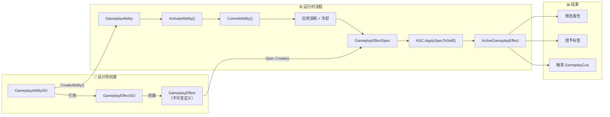
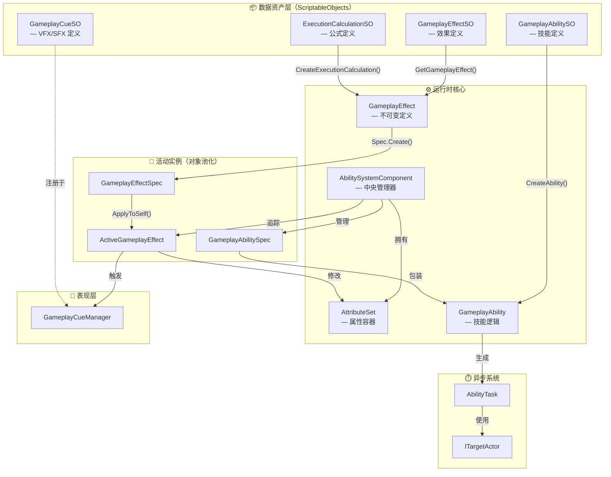
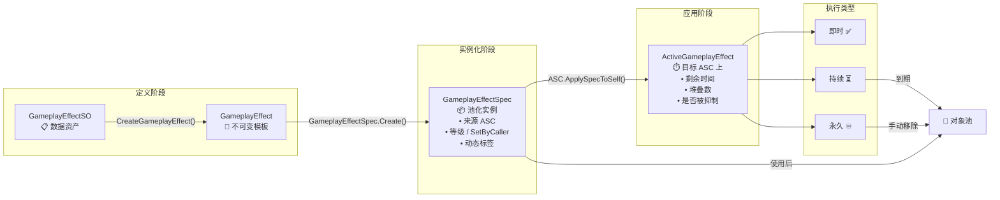
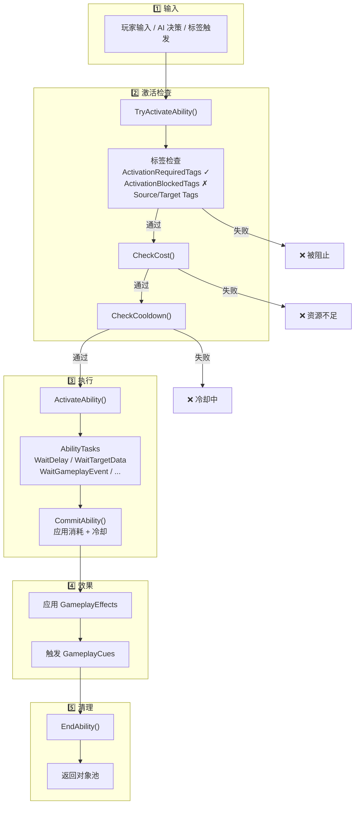
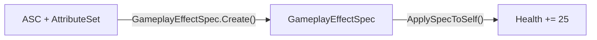

> **注意：** 本文档由 AI 辅助编写，如果你追求绝对精准，请直接阅读模块源码。**源码**以及**示例**皆由作者编写。

[**English**](README.md) | [**简体中文**]

# CycloneGames.GameplayAbilities

为 Unity 打造的强大、数据驱动的游戏性能力系统 (GAS)，灵感来自虚幻引擎 5 的 GAS 架构。

无论你正在开发 RPG、MOBA、动作游戏，或是任何包含复杂角色技能、Buff 和属性的项目——本框架都提供了可投入生产的、可扩展的基础设施。

---

## 核心特性

| 特性               | 说明                                                                |
| ------------------ | ------------------------------------------------------------------- |
| **数据驱动的技能** | 在 ScriptableObject 中定义技能——设计师无需修改代码即可迭代          |
| **GameplayEffect** | 即时 / 持续 / 永久效果，支持叠加、周期性触发和溢出策略              |
| **标签驱动架构**   | 通过层级化 GameplayTag 解耦所有逻辑——技能、状态、冷却、阵营         |
| **属性系统**       | 灵活的角色数值，支持验证钩子、派生属性和修改器聚合                  |
| **AbilityTask**    | 10+ 内置异步任务——延迟、事件等待、属性监听、目标选择、重复执行      |
| **瞄准系统**       | 球形范围、射线检测、锥形检测、地面选择——或实现自定义 `ITargetActor` |
| **GameplayCue**    | VFX/SFX 与游戏逻辑完全分离——美术可独立迭代                          |
| **执行计算**       | 复杂的多属性伤害公式作为可复用的数据资产                            |
| **对象池**         | 零 GC 运行，三级自适应对象池，平台感知容量，健康监控                |
| **网络就绪**       | 传输层无关的预测键和执行策略（本地 / 服务器 / 预测）                |

---

## 目录

**一、理解 GAS**

1. [为什么选择 GAS？](#1-为什么选择-gas) — 它解决什么问题
2. [核心概念](#2-核心概念) — 术语表与各部分如何协作
3. [架构](#3-架构) — 系统图解

**二、快速上手** 4. [快速入门：构建治疗技能](#4-快速入门构建治疗技能) — 从零开始

**三、核心系统** 5. [GameplayTag](#5-gameplaytag) — 通用语言 6. [属性与属性集](#6-属性与属性集) — 角色数值 7. [GameplayEffect](#7-gameplayeffect) — 修改器、持续时间、叠加 8. [GameplayAbility](#8-gameplayability) — 技能生命周期

**四、高级系统** 9. [AbilityTask](#9-abilitytask) — 异步技能逻辑 10. [瞄准系统](#10-瞄准系统) — 查找和选择目标 11. [执行计算](#11-执行计算) — 复杂伤害公式 12. [GameplayCue](#12-gameplaycue) — VFX/SFX 管理 13. [网络](#13-网络) — 预测与同步

**五、生产就绪** 14. [对象池与性能](#14-对象池与性能) — 零 GC 策略 15. [编辑器工具与调试](#15-编辑器工具与调试) — Inspector、调试窗口、运行时 Overlay 16. [示例演练](#16-示例演练) — 火球术、净化、升级系统 17. [常见问题与故障排除](#17-常见问题与故障排除) 18. [依赖项](#18-依赖项)

---

# 一、理解 GAS

## 1. 为什么选择 GAS？

### 传统方法的困境

游戏中的技能系统往往起初很简单——一个 `UseFireball()` 方法、几个布尔标志位——但很快就会演变为无法维护的复杂度：

| 阶段       | 发生了什么                                                                | 问题所在                                              |
| ---------- | ------------------------------------------------------------------------- | ----------------------------------------------------- |
| **初期**   | `PlayerController.UseFireball()` 硬编码                                   | 对一个角色没问题，但敌人也需要同样的技能 → 复制粘贴   |
| **增长期** | 庞大的 `SkillManager`，充满 `isStunned`、`isPoisoned`、`isBurning` 标志位 | 脆弱的状态机；每个新交互都带来指数级的 `if/else` 分支 |
| **后期**   | 设计师无法在不接触 C# 代码的情况下调整 `damage = 10`                      | 迭代速度下降；数据与逻辑混合在一个文件中导致 Bug      |

这种轨迹不可持续。N 个技能和 M 个状态效果之间的潜在交互数量以 O(N×M) 增长，产生经典的"意大利面条式代码"问题。

### GAS 的解决方案

GAS 将技能和效果视为**数据**而非函数来解决这些问题：

- **技能是数据资产** — 一个 `ScriptableObject` 定义技能是什么（消耗、冷却、标签、效果）。你的角色只是"拥有"一个由标签标识的技能。
- **状态效果是数据对象** — 角色不再是 `isPoisoned`；而是身上有一个"中毒" `GameplayEffect` 的活动实例，它自带持续时间、周期触发、标签授予和叠加规则。系统自动管理其生命周期。
- **标签替代布尔值** — 不再是 `if (isCasting && !isStunned)`，系统会问"拥有者是否有 `State.Casting`？"以及"拥有者是否没有 `State.Stunned`？"。标签是层级化的、可查询的，且完全数据驱动。

### 对比

| 方面           | 传统系统                  | GAS                                        |
| -------------- | ------------------------- | ------------------------------------------ |
| **架构**       | 庞大的单体 `SkillManager` | 解耦的 `AbilitySystemComponent` + 数据资产 |
| **数据与逻辑** | 混合在一个 C# 文件中      | 严格分离——SO 存数据，类写逻辑              |
| **状态管理**   | 布尔标志位 + 手动计时器   | 自管理的 `GameplayEffect` 实例             |
| **可扩展性**   | 修改核心类才能添加内容    | 添加新 SO 资产——不改现有代码               |
| **可复用性**   | 代码绑定特定角色          | 同一技能资产可用于玩家、AI、甚至一个木桶   |
| **交互复杂度** | O(N×M) 的 if/else 分支    | O(1) 的标签查询                            |

---

## 2. 核心概念

如果你从未使用过虚幻引擎的 GAS，本节将映射每个关键概念，帮助你在阅读任何代码之前建立清晰的认知框架。

### 术语表

| 概念                             | 它是什么                                                                                  | 类比                   |
| -------------------------------- | ----------------------------------------------------------------------------------------- | ---------------------- |
| **AbilitySystemComponent (ASC)** | 每个 Actor 上的中央管理器。持有技能、效果、属性和标签。                                   | Actor 的"技能大脑"     |
| **GameplayAbility**              | Actor 可以执行的离散动作（攻击、治疗、冲刺）。包含激活逻辑。                              | 手中的"技能卡牌"       |
| **GameplayAbilitySO**            | 定义技能数据的 ScriptableObject（名称、标签、消耗、冷却）。创建运行时 `GameplayAbility`。 | 设计师编辑的"卡牌模板" |
| **GameplayAbilitySpec**          | 跟踪已授予技能状态的运行时包装器（等级、激活状态）。                                      | Actor 的"装备卡槽"     |
| **GameplayEffect**               | 不可变的定义——描述应用于 Actor 的事情（修改属性、授予标签、周期触发）。                   | 写在卡片上的"配方"     |
| **GameplayEffectSO**             | 供设计师在 Inspector 中配置 GameplayEffect 的 ScriptableObject。                          | "配方卡模板"           |
| **GameplayEffectSpec**           | GameplayEffect 的可变运行时实例，携带上下文信息（来源、等级、SetByCaller 值）。           | 填写好的"配方订单"     |
| **ActiveGameplayEffect**         | 当前应用于 ASC 的 GameplayEffectSpec——追踪剩余时间、堆叠数、抑制状态。                    | "正在炉子上烹饪的配方" |
| **GameplayAttribute**            | 单个数值属性（生命值、法力值、攻击力）。由 GameplayEffect 修改的浮点数。                  | 角色属性表上的一行     |
| **AttributeSet**                 | 相关 GameplayAttribute 的分组集合，带有验证钩子。                                         | 角色属性表上的一页     |
| **GameplayTag**                  | 层级化的字符串标识符（`Ability.Skill.Fireball`、`Status.Debuff.Poison`）。                | 一张"便签标签"         |
| **GameplayTagContainer**         | GameplayTag 的集合，用于查询（`HasTag`、`HasAll`、`HasAny`）。                            | 一组"便签标签"         |
| **AbilityTask**                  | 技能内部的异步操作——等待时间、等待输入、监听标签变化。                                    | 配方中的一个"步骤"     |
| **ITargetActor**                 | 执行空间查询（球形检测、射线投射）以寻找目标的对象。                                      | "雷达扫描器"           |
| **TargetData**                   | 瞄准查询的结果——包含命中的 Actor 和物理信息。                                             | "扫描结果"             |
| **GameplayCue**                  | 由标签触发的 VFX/SFX，与游戏逻辑完全解耦。                                                | 配方上的"特效贴纸"     |
| **ExecutionCalculation**         | 计算复杂多属性公式的代码类（伤害 = 攻击 × 1.5 − 防御 × 0.5）。                            | "计算子程序"           |

### 各部分如何协作


```mermaid
flowchart LR
    subgraph Designer["🎨 设计师创建"]
        direction TB
        AbilitySO["GameplayAbilitySO"]
        EffectSO["GameplayEffectSO"]
        EffectDef["GameplayEffect<br/>（不可变定义）"]
        AbilitySO -->|引用| EffectSO
        EffectSO -->|创建| EffectDef
    end

    subgraph Runtime["⚙️ 运行时流程"]
        direction TB
        Ability["GameplayAbility"]
        Activate["ActivateAbility()"]
        Commit["CommitAbility()"]
        CostCD["应用消耗 + 冷却"]
        Spec["GameplayEffectSpec"]
        Apply["ASC.ApplySpecToSelf()"]
        ActiveGE["ActiveGameplayEffect"]
        Ability --> Activate --> Commit --> CostCD
        CostCD --> Spec --> Apply --> ActiveGE
    end

    subgraph Result["📊 结果"]
        direction TB
        ModAttr["修改属性"]
        GrantTag["授予标签"]
        TrigCue["触发 GameplayCue"]
    end

    AbilitySO -->|"CreateAbility()"| Ability
    EffectDef -->|"Spec.Create()"| Spec
    ActiveGE --> ModAttr
    ActiveGE --> GrantTag
    ActiveGE --> TrigCue
```

---

## 3. 架构

### 系统架构总览


```mermaid
flowchart TB
    subgraph Data["📦 数据资产层（ScriptableObjects）"]
        GAbilitySO["GameplayAbilitySO<br/>― 技能定义"]
        GEffectSO["GameplayEffectSO<br/>― 效果定义"]
        GCueSO["GameplayCueSO<br/>― VFX/SFX 定义"]
        ExecCalcSO["ExecutionCalculationSO<br/>― 公式定义"]
    end

    subgraph Runtime["⚙️ 运行时核心"]
        ASC["AbilitySystemComponent<br/>― 中央管理器"]
        AttrSet["AttributeSet<br/>― 属性容器"]
        GAbility["GameplayAbility<br/>― 技能逻辑"]
        GEffect["GameplayEffect<br/>― 不可变定义"]
    end

    subgraph Active["🔄 活动实例（对象池化）"]
        GSpec["GameplayAbilitySpec"]
        GESpec["GameplayEffectSpec"]
        ActiveGE["ActiveGameplayEffect"]
    end

    subgraph Async["⏱️ 异步系统"]
        Task["AbilityTask"]
        Target["ITargetActor"]
    end

    subgraph Cue["🎨 表现层"]
        CueMgr["GameplayCueManager"]
    end

    GAbilitySO -->|"CreateAbility()"| GAbility
    GEffectSO -->|"GetGameplayEffect()"| GEffect
    ExecCalcSO -->|"CreateExecutionCalculation()"| GEffect

    ASC -->|拥有| AttrSet
    ASC -->|管理| GSpec
    ASC -->|追踪| ActiveGE

    GSpec -->|包装| GAbility
    GAbility -->|生成| Task
    Task -->|使用| Target

    GEffect -->|"Spec.Create()"| GESpec
    GESpec -->|"ApplyToSelf()"| ActiveGE
    ActiveGE -->|修改| AttrSet
    ActiveGE -->|触发| CueMgr

    GCueSO -.->|注册于| CueMgr
```

### GameplayEffect 生命周期


```mermaid
flowchart LR
    subgraph Def["定义阶段"]
        SO["GameplayEffectSO<br/>📋 数据资产"]
        GE["GameplayEffect<br/>📝 不可变模板"]
    end

    subgraph Inst["实例化阶段"]
        Spec["GameplayEffectSpec<br/>📦 池化实例<br/>• 来源 ASC<br/>• 等级 / SetByCaller<br/>• 动态标签"]
    end

    subgraph Apply["应用阶段"]
        Active["ActiveGameplayEffect<br/>⏱️ 目标 ASC 上<br/>• 剩余时间<br/>• 堆叠数<br/>• 是否被抑制"]
    end

    subgraph Exec["执行类型"]
        Instant["即时 ✅"]
        Duration["持续 ⏳"]
        Infinite["永久 ♾️"]
    end

    SO -->|"CreateGameplayEffect()"| GE
    GE -->|"GameplayEffectSpec.Create()"| Spec
    Spec -->|"ASC.ApplySpecToSelf()"| Active

    Active --> Instant
    Active --> Duration
    Active --> Infinite

    Duration -->|"到期"| Pool["🔄 对象池"]
    Infinite -->|"手动移除"| Pool
    Spec -->|"使用后"| Pool
```

### 技能执行流程


```mermaid
flowchart TB
    subgraph Input["1️⃣ 输入"]
        Trigger["玩家输入 / AI 决策 / 标签触发"]
    end

    subgraph Check["2️⃣ 激活检查"]
        Try["TryActivateAbility()"]
        Tags["标签检查<br/>ActivationRequiredTags ✓<br/>ActivationBlockedTags ✗<br/>Source/Target Tags"]
        Cost["CheckCost()"]
        CD["CheckCooldown()"]
    end

    subgraph Run["3️⃣ 执行"]
        Activate["ActivateAbility()"]
        Tasks["AbilityTasks<br/>WaitDelay / WaitTargetData<br/>WaitGameplayEvent / ..."]
        Commit["CommitAbility()<br/>应用消耗 + 冷却"]
    end

    subgraph Effects["4️⃣ 效果"]
        ApplyGE["应用 GameplayEffects"]
        Cues["触发 GameplayCues"]
    end

    subgraph End["5️⃣ 清理"]
        EndAbility["EndAbility()"]
        ReturnPool["返回对象池"]
    end

    Trigger --> Try
    Try --> Tags
    Tags -->|通过| Cost
    Tags -->|失败| Blocked["❌ 被阻止"]
    Cost -->|通过| CD
    Cost -->|失败| NoCost["❌ 资源不足"]
    CD -->|通过| Activate
    CD -->|失败| OnCD["❌ 冷却中"]

    Activate --> Tasks
    Tasks --> Commit
    Commit --> ApplyGE
    ApplyGE --> Cues
    Cues --> EndAbility
    EndAbility --> ReturnPool
```

---

# 二、快速上手

## 4. 快速入门：构建治疗技能

本教程将从零开始创建一个完整的治疗技能。完成后你将理解所有核心概念。

### 最简 GAS 流程（无需技能）

在构建完整技能之前，先理解最简数据流。你只需 **ASC + AttributeSet + GameplayEffect** 就能修改属性——不需要创建任何技能：

```csharp
// 1. 获取 ASC
var asc = GetComponent<AbilitySystemComponentHolder>().AbilitySystemComponent;
asc.InitAbilityActorInfo(this, gameObject);

// 2. 添加属性
var attrs = new PlayerAttributeSet();
asc.AddAttributeSet(attrs);

// 3. 创建效果并应用——完成！
var healEffect = new GameplayEffect("Heal", EDurationPolicy.Instant, 0, 0,
    new() { new ModifierInfo(attrs.Health, EAttributeModifierOperation.Add, 25f) });
asc.ApplyGameplayEffectSpecToSelf(GameplayEffectSpec.Create(healEffect, asc));
// 生命值现在 +25。就是这样——3 行核心逻辑。
```


```mermaid
flowchart LR
    A["ASC + AttributeSet"] -->|"GameplayEffectSpec.Create()"| B["GameplayEffectSpec"]
    B -->|"ApplySpecToSelf()"| C["Health += 25"]
```

**GameplayAbility 在此流程之上增加了结构**——激活检查、消耗/冷却、异步任务、瞄准——但核心数据路径始终是：**Effect → Spec → Apply → 属性变化**。

### 前置条件

- Unity 2021.3+
- 已安装 `CycloneGames.GameplayAbilities` 包
- 已安装依赖项：`GameplayTags`、`Logger`、`AssetManagement`、`Factory`

### 步骤 1 — 创建属性集

`AttributeSet` 保存角色属性。每个属性都是一个 `GameplayAttribute`——一个可被效果修改的命名浮点数。

```csharp
using CycloneGames.GameplayAbilities.Runtime;
using UnityEngine;

public class PlayerAttributeSet : AttributeSet
{
    public readonly GameplayAttribute Health    = new("Player.Attribute.Health");
    public readonly GameplayAttribute MaxHealth = new("Player.Attribute.MaxHealth");
    public readonly GameplayAttribute Mana      = new("Player.Attribute.Mana");
    public readonly GameplayAttribute MaxMana   = new("Player.Attribute.MaxMana");

    // 在值变化之前调用——用于限制范围
    public override void PreAttributeChange(GameplayAttribute attribute, ref float newValue)
    {
        if (attribute.Name == Health.Name)
            newValue = Mathf.Clamp(newValue, 0, GetCurrentValue(MaxHealth));
        if (attribute.Name == Mana.Name)
            newValue = Mathf.Clamp(newValue, 0, GetCurrentValue(MaxMana));
    }

    // 在值变化之后调用——用于处理副作用
    public override void PostAttributeChange(GameplayAttribute attribute, float oldValue, float newValue)
    {
        if (attribute.Name == Health.Name && newValue <= 0 && oldValue > 0)
            Debug.Log("角色死亡！");
    }
}
```

### 步骤 2 — 设置角色

```csharp
using CycloneGames.GameplayAbilities.Runtime;
using UnityEngine;

[RequireComponent(typeof(AbilitySystemComponentHolder))]
public class PlayerCharacter : MonoBehaviour
{
    [SerializeField] private GameplayAbilitySO healAbilitySO;

    private AbilitySystemComponentHolder ascHolder;
    private PlayerAttributeSet attributes;

    void Awake()
    {
        ascHolder = GetComponent<AbilitySystemComponentHolder>();
    }

    void Start()
    {
        var asc = ascHolder.AbilitySystemComponent;

        // 1. 初始化 Actor 信息（在任何 ASC 操作之前必须调用）
        asc.InitAbilityActorInfo(this, gameObject);

        // 2. 添加属性
        attributes = new PlayerAttributeSet();
        asc.AddAttributeSet(attributes);

        // 3. 通过即时效果设置初始值
        var initEffect = new GameplayEffect("GE_Init", EDurationPolicy.Instant, 0, 0,
            new() {
                new ModifierInfo(attributes.MaxHealth, EAttributeModifierOperation.Override, 100),
                new ModifierInfo(attributes.Health,    EAttributeModifierOperation.Override, 100),
                new ModifierInfo(attributes.MaxMana,   EAttributeModifierOperation.Override, 50),
                new ModifierInfo(attributes.Mana,      EAttributeModifierOperation.Override, 50),
            });
        asc.ApplyGameplayEffectSpecToSelf(GameplayEffectSpec.Create(initEffect, asc));

        // 4. 授予技能
        if (healAbilitySO != null)
            asc.GrantAbility(healAbilitySO.CreateAbility());
    }

    void Update()
    {
        if (Input.GetKeyDown(KeyCode.H))
        {
            var asc = ascHolder.AbilitySystemComponent;
            foreach (var spec in asc.GetActivatableAbilities())
            {
                if (spec.Ability.AbilityTags.HasTag("Ability.Action.Heal"))
                {
                    asc.TryActivateAbility(spec);
                    break;
                }
            }
        }
    }
}
```

### 步骤 3 — 创建技能（运行时逻辑）

```csharp
using CycloneGames.GameplayAbilities.Runtime;

public class HealAbility : GameplayAbility
{
    public override void ActivateAbility(
        GameplayAbilityActorInfo actorInfo,
        GameplayAbilitySpec spec,
        GameplayAbilityActivationInfo activationInfo)
    {
        // CommitAbility 应用消耗、冷却和提交效果
        CommitAbility(actorInfo, spec);
        EndAbility();
    }

    public override GameplayAbility CreatePoolableInstance() => new HealAbility();
}
```

### 步骤 4 — 创建技能（ScriptableObject）

```csharp
using UnityEngine;
using CycloneGames.GameplayAbilities.Runtime;

[CreateAssetMenu(fileName = "GA_Heal", menuName = "GAS/Abilities/Heal")]
public class HealAbilitySO : GameplayAbilitySO
{
    public override GameplayAbility CreateAbility()
    {
        var ability = new HealAbility();
        InitializeAbility(ability); // 将 Inspector 中的所有数据复制到运行时实例
        return ability;
    }
}
```

### 步骤 5 — 创建 GameplayEffect 资产

在 Unity 编辑器中，创建三个 `GameplayEffectSO` 资产：

| 资产名称           | 持续策略          | 修改器     | 授予标签              |
| ------------------ | ----------------- | ---------- | --------------------- |
| `GE_Heal`          | Instant           | Health +25 | —                     |
| `GE_Heal_Cost`     | Instant           | Mana −10   | —                     |
| `GE_Heal_Cooldown` | HasDuration (5秒) | —          | `Cooldown.Skill.Heal` |

### 步骤 6 — 配置技能资产

创建 `GA_Heal` 资产并在 Inspector 中配置：

- **Ability Tags**：`Ability.Action.Heal`
- **Cost Effect**：`GE_Heal_Cost`
- **Cooldown Effect**：`GE_Heal_Cooldown`
- **Commit Gameplay Effects**：`GE_Heal`

### 步骤 7 — 在场景中连接

1. 创建一个 GameObject，添加 `AbilitySystemComponentHolder` 和 `PlayerCharacter` 组件
2. 将 `GA_Heal` 拖到 `healAbilitySO` 字段
3. 按 Play，按 **H** 键——角色治疗、消耗法力、进入冷却

---

# 三、核心系统

## 5. GameplayTag

GameplayTag 是 GAS 的**通用语言**。所有交互——激活规则、免疫、冷却、瞄准过滤——都通过标签而非直接代码引用来表达。

### 标签命名规范

```
Ability.Skill.Fireball          ← 标识技能
Ability.Passive.Regeneration    ← 被动技能
Cooldown.Skill.Fireball         ← 冷却期间应用
Status.Debuff.Poison            ← 负面状态
Status.Buff.Shield              ← 增益状态
State.Casting                   ← 临时状态
State.Dead                      ← 持久状态
Damage.Type.Fire                ← 伤害分类
Faction.Player                  ← 阵营归属
GameplayCue.Impact.Fireball     ← VFX/SFX 触发
Event.Character.LeveledUp       ← 游戏事件
```

### 使用标签

```csharp
// 检查角色是否有标签
if (asc.CombinedTags.HasTag("Status.Debuff.Poison"))
{
    // 角色已中毒
}

// 通过授予标签移除所有中毒效果
var poisonTag = GameplayTagContainer.FromTag("Status.Debuff.Poison");
targetASC.RemoveActiveEffectsWithGrantedTags(poisonTag);
```

### 不同对象上的标签容器

| 容器                              | 位于            | 用途                                              |
| --------------------------------- | --------------- | ------------------------------------------------- |
| **AbilityTags**                   | GameplayAbility | 标识技能（`Ability.Skill.Fireball`）              |
| **AssetTags**                     | GameplayEffect  | 描述效果的元数据（`Damage.Type.Fire`）            |
| **GrantedTags**                   | GameplayEffect  | 效果激活期间应用于目标的标签（`Status.Burning`）  |
| **ActivationBlockedTags**         | GameplayAbility | 拥有者有这些标签中的任何一个 → 无法激活           |
| **ActivationRequiredTags**        | GameplayAbility | 拥有者必须有所有这些标签 → 否则被阻止             |
| **ActivationOwnedTags**           | GameplayAbility | 技能激活期间授予拥有者的标签                      |
| **CancelAbilitiesWithTag**        | GameplayAbility | 取消带有这些标签的激活中技能                      |
| **BlockAbilitiesWithTag**         | GameplayAbility | 带有这些标签的技能无法激活                        |
| **SourceRequiredTags**            | GameplayAbility | 施法者（ASC）必须有所有这些标签                   |
| **SourceBlockedTags**             | GameplayAbility | 施法者不能有这些标签中的任何一个                  |
| **TargetRequiredTags**            | GameplayAbility | 目标的 ASC 必须有所有这些标签                     |
| **TargetBlockedTags**             | GameplayAbility | 目标不能有这些标签中的任何一个                    |
| **ApplicationTagRequirements**    | GameplayEffect  | 目标必须满足标签要求才能应用效果                  |
| **OngoingTagRequirements**        | GameplayEffect  | 如果条件不再满足，效果会被抑制                    |
| **RemoveGameplayEffectsWithTags** | GameplayEffect  | 应用时，移除 GrantedTags 匹配的效果               |
| **ImmunityTags**                  | ASC             | 传入的效果如果 Asset/GrantedTags 匹配则被完全阻止 |
| **GameplayCues**                  | GameplayEffect  | 通过 GameplayCueManager 触发 VFX/SFX 的标签       |

### 标签事件

你可以响应任何 ASC 上的标签变化：

```csharp
asc.RegisterTagEventCallback("Status.Debuff.Poison", (tag, newCount) =>
{
    if (newCount > 0) ShowPoisonIcon();
    else              HidePoisonIcon();
});
```

---

## 6. 属性与属性集

### GameplayAttribute

`GameplayAttribute` 是一个带有两层数值的命名浮点数：

- **BaseValue** — 永久值，由即时效果或直接赋值设置
- **CurrentValue** — BaseValue 加上所有来自 Duration/Infinite 效果的活动修改器

```csharp
// 监听值变化
attribute.OnCurrentValueChanged += (oldVal, newVal) => UpdateHealthBar(newVal);
attribute.OnBaseValueChanged    += (oldVal, newVal) => { /* ... */ };
```

### AttributeSet

分组相关属性并添加验证逻辑：

```csharp
public class CharacterAttributeSet : AttributeSet
{
    public readonly GameplayAttribute Health      = new("Character.Health");
    public readonly GameplayAttribute MaxHealth   = new("Character.MaxHealth");
    public readonly GameplayAttribute AttackPower = new("Character.AttackPower");
    public readonly GameplayAttribute Defense     = new("Character.Defense");

    // 变化前限制
    public override void PreAttributeChange(GameplayAttribute attribute, ref float newValue)
    {
        if (attribute.Name == Health.Name)
            newValue = Mathf.Clamp(newValue, 0, GetCurrentValue(MaxHealth));
    }

    // 变化后响应
    public override void PostAttributeChange(GameplayAttribute attr, float oldVal, float newVal) { }

    // 拦截即时效果（例如：对伤害应用护甲减免）
    public override void PreProcessInstantEffect(GameplayEffectSpec spec) { }
    public override void PostGameplayEffectExecute(GameplayEffectModCallbackData data) { }

    // 派生属性示例
    public override float GetCurrentValue(GameplayAttribute attribute)
    {
        if (attribute.Name == "Character.HealthPercent")
        {
            float max = GetCurrentValue(MaxHealth);
            return max > 0 ? GetCurrentValue(Health) / max : 0f;
        }
        return base.GetCurrentValue(attribute);
    }
}
```

### 访问属性

```csharp
var healthAttr = asc.GetAttribute("Character.Health");
float current  = healthAttr.CurrentValue;
float baseVal  = healthAttr.BaseValue;
```

---

## 7. GameplayEffect

GameplayEffect 是 GAS 的**构建块**。它们修改属性、授予标签、触发 Cue，并管理自身的生命周期。

### 持续策略

| 策略            | 行为                           | 使用场景                |
| --------------- | ------------------------------ | ----------------------- |
| **Instant**     | 立即应用修改器，一次性消费     | 伤害、治疗、法力消耗    |
| **HasDuration** | 在固定时间内激活，然后自动移除 | Buff、Debuff、冷却、DoT |
| **Infinite**    | 激活直到手动移除               | 装备属性、光环、被动    |

### 修改器

每个修改器针对一个属性执行一种操作：

| 操作         | 效果                        |
| ------------ | --------------------------- |
| **Add**      | `CurrentValue += Magnitude` |
| **Multiply** | `CurrentValue *= Magnitude` |
| **Division** | `CurrentValue /= Magnitude` |
| **Override** | `CurrentValue = Magnitude`  |

> **Duration/Infinite 修改器**会被聚合——它们修改 `CurrentValue` 而 `BaseValue` 保持不变。当效果移除时，修改器自动撤销。
>
> **Instant 修改器**会永久改变 `BaseValue`。

### 在代码中创建效果

```csharp
// 中毒 DoT: 每1秒 -5 HP，持续10秒
var poison = new GameplayEffect(
    name: "Poison DoT",
    durationPolicy: EDurationPolicy.HasDuration,
    duration: 10f,
    period: 1f,
    modifiers: new() { new ModifierInfo(healthAttr, EAttributeModifierOperation.Add, -5f) },
    grantedTags: new GameplayTagContainer { "Status.Debuff.Poison" }
);
```

### 叠加

配置同一效果多次应用时的交互方式：

| 属性                 | 选项                                                                           | 说明                   |
| -------------------- | ------------------------------------------------------------------------------ | ---------------------- |
| **StackingType**     | `None` / `AggregateBySource` / `AggregateByTarget`                             | 分组轴                 |
| **StackLimit**       | int                                                                            | 最大叠加数             |
| **DurationPolicy**   | `RefreshOnSuccessfulApplication` / `NeverRefresh`                              | 新叠加是否重置持续时间 |
| **ExpirationPolicy** | `ClearEntireStack` / `RemoveSingleStackAndRefreshDuration` / `RefreshDuration` | 叠加到期时的行为       |

### 溢出效果

当效果要应用但目标已达到 `StackLimit` 时：

- **OverflowEffects** — 一组替代应用的次要 GameplayEffect
- **DenyOverflowApplication** — 如果为 `true`，原始效果不应用（仅触发溢出效果）

### OngoingTagRequirements 与抑制

Duration/Infinite 效果可以被临时**抑制**（暂停）而非移除：

- 在效果上定义 `OngoingTagRequirements`
- 如果目标的标签不再满足要求，效果的修改器被暂停
- 当重新满足要求时，修改器恢复
- `ActiveGameplayEffect.IsInhibited` 属性和 `OnInhibitionChanged` 事件暴露此状态

### ExecutePeriodicEffectOnApplication

设为 `true` 可在效果应用时立即触发第一次周期性触发，而不是等待一个完整的周期。

### SetByCaller 数值

在运行时向效果传递动态值：

```csharp
var spec = GameplayEffectSpec.Create(damageEffect, sourceASC);
spec.SetByCallerMagnitude("Damage.Base", 50f);
asc.ApplyGameplayEffectSpecToSelf(spec);
```

### DynamicGrantedTags 与 DynamicAssetTags

在运行时向特定的 `GameplayEffectSpec` 实例添加额外标签，超出基础定义的范围：

```csharp
spec.DynamicGrantedTags.AddTag("Status.Buff.Empowered");
spec.DynamicAssetTags.AddTag("Source.Player");
```

### 自定义应用需求

实现 `ICustomApplicationRequirement` 以添加任意逻辑门控：

```csharp
public class RequireMinHealth : ICustomApplicationRequirement
{
    public bool CanApplyGameplayEffect(GameplayEffectSpec spec, AbilitySystemComponent target)
    {
        var health = target.GetAttribute("Character.Health");
        return health != null && health.CurrentValue > 10f;
    }
}
```

### 属性快照

修改器可以在不同时间点捕获属性值：

- **Snapshot** — 在效果创建时捕获来源的属性值
- **NotSnapshot** — 重新计算时实时读取来源的属性值

通过 `ModifierInfo` 上的 `EGameplayEffectAttributeCaptureSnapshot` 配置。

---

## 8. GameplayAbility

### 生命周期

```
GrantAbility()          → 技能被添加到 ASC
  └─ OnGiveAbility()    → （可选）授予时调用一次

TryActivateAbility()    → 运行所有检查
  ├─ 标签要求           → ActivationRequired/Blocked/Source/Target Tags
  ├─ CheckCost()        → 资源是否足够？
  └─ CheckCooldown()    → 是否没有冷却标签？

ActivateAbility()       → 你的逻辑在这里运行
  ├─ AbilityTasks       → 异步操作（延迟、瞄准等）
  └─ CommitAbility()    → 应用消耗 + 冷却效果

EndAbility()            → 清理，返回对象池
  └─ ASC 触发 OnAbilityEndedEvent
```

### 创建技能

每个技能需要两个类：

**1. 运行时逻辑** — 继承 `GameplayAbility`：

```csharp
public class GA_Fireball : GameplayAbility
{
    private GameplayEffect damageEffect;
    private float damageMultiplier;

    public void SetupData(GameplayEffect damage, float multiplier)
    {
        damageEffect = damage;
        damageMultiplier = multiplier;
    }

    public override void ActivateAbility(
        GameplayAbilityActorInfo actorInfo,
        GameplayAbilitySpec spec,
        GameplayAbilityActivationInfo activationInfo)
    {
        CommitAbility(actorInfo, spec);

        // 创建 spec 并传递动态数据
        var dmgSpec = MakeOutgoingGameplayEffectSpec(damageEffect, spec.Level);
        dmgSpec.SetByCallerMagnitude("Damage.Multiplier", damageMultiplier);

        // 应用到目标
        var targetASC = FindTarget();
        ApplyGameplayEffectToTarget(dmgSpec, targetASC);

        EndAbility();
    }

    public override GameplayAbility CreatePoolableInstance() => new GA_Fireball();
}
```

**2. ScriptableObject** — 继承 `GameplayAbilitySO`：

```csharp
[CreateAssetMenu(menuName = "GAS/Abilities/Fireball")]
public class GA_Fireball_SO : GameplayAbilitySO
{
    [SerializeField] private GameplayEffectSO damageEffectSO;
    [SerializeField] private float damageMultiplier = 1.5f;

    public override GameplayAbility CreateAbility()
    {
        var ability = new GA_Fireball();
        InitializeAbility(ability); // 从 Inspector 复制标签、消耗、冷却
        ability.SetupData(damageEffectSO.GetGameplayEffect(), damageMultiplier);
        return ability;
    }
}
```

### 技能触发

技能可以在响应事件或标签变化时自动激活：

```csharp
// 在 GameplayAbilitySO Inspector 中添加 AbilityTriggerData：
// TriggerTag: "Event.Character.Hit"
// TriggerSource: GameplayEvent

// 或通过代码配置：
ability.AbilityTriggers = new List<AbilityTriggerData>
{
    new() { TriggerTag = "Event.Character.Hit", TriggerSource = EAbilityTriggerSource.GameplayEvent },
    new() { TriggerTag = "Status.Debuff.Poison", TriggerSource = EAbilityTriggerSource.OwnedTagAdded },
};
```

| TriggerSource     | 触发时机                                        |
| ----------------- | ----------------------------------------------- |
| `GameplayEvent`   | 当以匹配标签调用 `ASC.HandleGameplayEvent()` 时 |
| `OwnedTagAdded`   | 当触发标签被添加到 ASC 的组合标签时             |
| `OwnedTagRemoved` | 当触发标签从 ASC 被移除时                       |

### Source/Target Tags

除了标准的 `ActivationRequired/BlockedTags`（检查**拥有者**的标签），技能还支持四个额外的标签容器：

| 容器                   | 检查对象     | 用途                                                |
| ---------------------- | ------------ | --------------------------------------------------- |
| **SourceRequiredTags** | 施法者的 ASC | 施法者必须有所有这些标签才能激活                    |
| **SourceBlockedTags**  | 施法者的 ASC | 施法者不能有这些标签中的任何一个                    |
| **TargetRequiredTags** | 目标的 ASC   | 目标必须有所有这些标签（通过 `CanApplyToTarget()`） |
| **TargetBlockedTags**  | 目标的 ASC   | 目标不能有这些标签中的任何一个                      |

**使用案例**：治疗技能可能要求 `SourceRequiredTags = State.InHealingStance`（施法者检查）和 `TargetBlockedTags = State.Dead`（不能治疗已死目标）。

### InputPressed / InputReleased

用于输入驱动技能（如蓄力攻击、持续引导）的虚拟钩子：

```csharp
public override void InputPressed(GameplayAbilitySpec spec)
{
    // 技能激活时按下绑定的输入动作时调用
    StartCharging();
}

public override void InputReleased(GameplayAbilitySpec spec)
{
    // 释放时调用
    ReleaseCharge();
    EndAbility();
}
```

这些方法刻意**输入系统无关**——它们不引用任何特定的输入系统。你的输入层（Unity Input System、CycloneGames.InputSystem 的 R3 Observables 等）负责调用它们。

### ASC 上的生命周期事件

```csharp
asc.OnAbilityActivated += (ability) => { /* 激活时触发 */ };
asc.OnAbilityCommitted += (ability) => { /* 提交时触发 */ };
asc.OnAbilityEndedEvent += (ability) => { /* 结束时触发 */ };
```

### 实例化策略

| 策略                    | 行为                          | 使用场景         |
| ----------------------- | ----------------------------- | ---------------- |
| `NonInstanced`          | 共享实例，无每 Actor 状态     | 简单即时技能     |
| `InstancedPerActor`     | 每个 ASC 一个实例，跨激活复用 | 大多数技能       |
| `InstancedPerExecution` | 每次激活新实例                | 有重叠执行的技能 |

---

# 四、高级系统

## 9. AbilityTask

AbilityTask 实现**异步、多步骤的技能逻辑**。没有它们，所有逻辑都会在 `ActivateAbility()` 中同步运行。

### 内置任务

| 任务                              | 用途                          |
| --------------------------------- | ----------------------------- |
| `AbilityTask_WaitDelay`           | 等待一段时间                  |
| `AbilityTask_WaitTargetData`      | 等待瞄准系统提供目标数据      |
| `AbilityTask_WaitGameplayEvent`   | 等待带有特定标签的游戏事件    |
| `AbilityTask_WaitGameplayTag`     | 等待标签在 ASC 上被添加或移除 |
| `AbilityTask_WaitGameplayEffect`  | 等待效果被应用或移除          |
| `AbilityTask_WaitAttributeChange` | 等待属性值变化                |
| `AbilityTask_WaitConfirmCancel`   | 等待外部确认/取消信号         |
| `AbilityTask_WaitAbilityActivate` | 等待另一个技能被激活          |
| `AbilityTask_WaitAbilityEnd`      | 等待另一个技能结束            |
| `AbilityTask_Repeat`              | 按间隔重复执行逻辑            |

### 使用模式

**回调风格：**

```csharp
public override void ActivateAbility(...)
{
    CommitAbility(actorInfo, spec);

    var waitTask = NewAbilityTask<AbilityTask_WaitDelay>();
    waitTask.WaitTime = 2.0f;
    waitTask.OnFinished = () =>
    {
        ApplyDamage();
        EndAbility();
    };
    waitTask.Activate();
}
```

**Async/Await 风格：**

```csharp
public override async void ActivateAbility(...)
{
    CommitAbility(actorInfo, spec);

    // 步骤 1: 蓄力
    var chargeTask = NewAbilityTask<AbilityTask_WaitDelay>();
    chargeTask.WaitTime = 2.0f;
    await chargeTask.ActivateAsync();

    // 步骤 2: 选择目标
    var targetTask = NewAbilityTask<AbilityTask_WaitTargetData>();
    // ... 配置目标 Actor ...
    var targetData = await targetTask.ActivateAsync();

    // 步骤 3: 应用
    ApplyDamageToTargets(targetData);
    EndAbility();
}
```

**任务链式调用：**

```csharp
taskA.OnFinished = () =>
{
    var taskB = NewAbilityTask<NextTask>();
    taskB.OnFinished = () => EndAbility();
    taskB.Activate();
};
taskA.Activate();
```

**超时模式：**

```csharp
var targetTask = NewAbilityTask<AbilityTask_WaitTargetData>();
var timeoutTask = NewAbilityTask<AbilityTask_WaitDelay>();
timeoutTask.WaitTime = 5.0f;
timeoutTask.OnFinished = () =>
{
    targetTask.Cancel();
    EndAbility();
};
timeoutTask.Activate();
targetTask.Activate();
```

### 创建自定义任务

```csharp
public class AbilityTask_WaitForInput : AbilityTask, IAbilityTaskTick
{
    public Action OnJumpPressed;

    protected override void OnActivate() { /* 订阅 */ }

    public void Tick(float deltaTime)
    {
        if (!IsActive) return;
        if (Input.GetKeyDown(KeyCode.Space))
        {
            OnJumpPressed?.Invoke();
            EndTask();
        }
    }

    protected override void OnDestroy()
    {
        OnJumpPressed = null;
    }
}
```

### 规则

1. **始终**通过 `NewAbilityTask<T>()` 创建任务（永远不要用 `new`——会绕过对象池）
2. 在 `OnDestroy()` 中清理事件订阅
3. 完成时调用 `EndTask()`
4. 执行逻辑前检查 `IsActive`
5. 技能结束时所有活动的任务都会被强制结束

---

## 10. 瞄准系统

瞄准系统将"如何寻找目标"与"对目标做什么"解耦。

### ITargetActor 接口

```csharp
public interface ITargetActor
{
    event Action<TargetData> OnTargetDataReady;
    event Action OnCanceled;

    void Configure(GameplayAbility ability, Action<TargetData> onReady, Action onCancelled);
    void StartTargeting();
    void ConfirmTargeting();
    void CancelTargeting();
    void Destroy();
}
```

### 内置目标 Actor

| Actor                                        | 行为                                   |
| -------------------------------------------- | -------------------------------------- |
| `GameplayAbilityTargetActor_SphereOverlap`   | 在球形范围内查找所有目标，支持标签过滤 |
| `GameplayAbilityTargetActor_SingleLineTrace` | 单条射线检测第一个命中                 |
| `GameplayAbilityTargetActor_ConeTrace`       | 锥形/扇形检测                          |
| `GameplayAbilityTargetActor_GroundSelect`    | 交互式地面放置，带视觉指示器           |

### 目标数据类型

| 类型                                        | 说明                         |
| ------------------------------------------- | ---------------------------- |
| `GameplayAbilityTargetData_ActorArray`      | 目标 Actor 列表              |
| `GameplayAbilityTargetData_SingleTargetHit` | 单个目标带 `RaycastHit` 详情 |
| `GameplayAbilityTargetData_MultiTarget`     | 来自批量物理查询的多个目标   |

### 示例：技能中的球形检测

```csharp
public override void ActivateAbility(...)
{
    CommitAbility(actorInfo, spec);

    var targetActor = new GameplayAbilityTargetActor_SphereOverlap(
        radius: 5f,
        requiredTags: GameplayTagContainer.FromTag("Faction.Player")
    );

    var task = AbilityTask_WaitTargetData.WaitTargetData(this, targetActor);
    task.OnValidData = (targetData) =>
    {
        // 处理每个目标
        // 应用效果、移除减益等
        EndAbility();
    };
    task.OnCancelled = () => EndAbility();
    task.Activate();
}
```

---

## 11. 执行计算

对于涉及来源和目标多个属性的公式，使用 `GameplayEffectExecutionCalculation`。

### 何时使用

| 场景                             | 使用       |
| -------------------------------- | ---------- |
| 治疗 50 HP                       | 简单修改器 |
| 伤害 = 攻击 × 1.5 − 防御 × 0.5   | 执行计算   |
| 治疗 = 基础治疗 + 法术强度 × 0.3 | 执行计算   |

### 示例

```csharp
public class ExecCalc_Damage : GameplayEffectExecutionCalculation
{
    public override void Execute(GameplayEffectExecutionCalculationContext context)
    {
        var source = context.Spec.Source;
        var target = context.Target;

        float atk = source.GetAttribute("Character.AttackPower")?.CurrentValue ?? 0;
        float def = target.GetAttribute("Character.Defense")?.CurrentValue ?? 0;
        float dmg = Mathf.Max(0, atk * 1.5f - def * 0.5f);

        var healthAttr = target.GetAttribute("Character.Health");
        if (healthAttr != null)
        {
            context.AddOutputModifier(new ModifierInfo(
                healthAttr, EAttributeModifierOperation.Add, -dmg
            ));
        }
    }
}
```

创建 `GameplayEffectExecutionCalculationSO` 包装器并将其分配给 `GameplayEffectSO` 的 Execution 字段。

---

## 12. GameplayCue

GameplayCue 将**表现**（VFX、SFX、屏幕震动）与**游戏逻辑**完全分离。

### 为什么？

```csharp
// ❌ 耦合：VFX 与逻辑混合
void DealDamage(float dmg) {
    target.Health -= dmg;
    Instantiate(explosionVFX, target.Position);
}

// ✅ 解耦：VFX 由标签触发
var spec = GameplayEffectSpec.Create(damageEffect, sourceASC);
// damageEffect 的 GameplayCues 标签为 "GameplayCue.Impact.Fire"
targetASC.ApplyGameplayEffectSpecToSelf(spec);
// GameplayCueManager 自动处理 VFX
```

### Cue 事件类型

| 事件          | 触发时机                       | 示例                |
| ------------- | ------------------------------ | ------------------- |
| `Executed`    | 即时效果应用，或周期性触发     | 冲击 VFX、命中音效  |
| `OnActive`    | Duration/Infinite 效果首次应用 | Buff 光晕、状态图标 |
| `WhileActive` | 效果激活期间持续               | 循环燃烧粒子        |
| `Removed`     | 效果到期或被移除               | 淡出 VFX            |

### 创建 Cue

```csharp
[CreateAssetMenu(menuName = "GAS/Cues/Fireball Impact")]
public class GC_Fireball_Impact : GameplayCueSO
{
    public string ImpactVFXPrefab;
    public string ImpactSound;

    public override async UniTask OnExecutedAsync(
        GameplayCueParameters parameters, IGameObjectPoolManager poolManager)
    {
        if (parameters.TargetObject == null) return;

        var vfx = await poolManager.GetAsync(
            ImpactVFXPrefab, parameters.TargetObject.transform.position, Quaternion.identity);

        // 生命期后返回对象池
        ReturnToPoolAfterDelay(poolManager, vfx, 2f).Forget();
    }
}
```

### 持久 Cue

用于循环效果（燃烧粒子、护盾光晕），实现 `IPersistentGameplayCue`：

```csharp
public class GC_Burn_Loop : GameplayCueSO, IPersistentGameplayCue
{
    public string BurnVFXPrefab;

    public async UniTask<GameObject> OnActiveAsync(GameplayCueParameters parameters, IGameObjectPoolManager poolManager)
    {
        var vfx = await poolManager.GetAsync(BurnVFXPrefab, parameters.TargetObject.transform.position, Quaternion.identity);
        vfx.transform.SetParent(parameters.TargetObject.transform);
        return vfx; // 由管理器追踪
    }

    public async UniTask OnRemovedAsync(GameObject instance, GameplayCueParameters parameters)
    {
        poolManager.Release(instance); // 自动清理
    }
}
```

### 注册与调试

```csharp
// 游戏启动时
GameplayCueManager.Instance.Initialize(resourceLocator, poolManager);
GameplayCueManager.Instance.RegisterStaticCue("GameplayCue.Impact.Fireball", cueAsset);
```

**Cue 没有播放？** 检查：(1) 标签在效果的 `GameplayCues` 容器中，(2) Cue 已在管理器中注册，(3) `Initialize()` 已调用，(4) 有效的 `TargetObject`。

---

## 13. 网络

系统采用**网络架构化**但**传输层无关**的设计——提供预测基础设施但不绑定你到特定的网络库。

> **需要集成：** 你必须使用你选择的网络方案（Mirror、Netcode、Photon 等）桥接 `ServerTryActivateAbility` 和 `ClientActivateAbilitySucceed/Failed`。

### 执行策略

| 策略             | 行为                                           |
| ---------------- | ---------------------------------------------- |
| `LocalOnly`      | 仅客户端；无服务器参与（UI 技能、装饰效果）    |
| `ServerOnly`     | 客户端请求，服务器运行；安全但有延迟           |
| `LocalPredicted` | 客户端立即运行（预测），服务器验证；拒绝时回滚 |

### 预测键

每次预测激活生成一个 `PredictionKey`。在该键下应用的效果会被追踪。如果服务器拒绝激活，与该键关联的所有效果都会自动回滚。

---

# 五、生产就绪

## 14. 对象池与性能

### 零 GC 设计

每个主要运行时对象都被池化：

| 类型                    | 池化                                               |
| ----------------------- | -------------------------------------------------- |
| `GameplayAbilitySpec`   | 自动                                               |
| `GameplayEffectSpec`    | `GameplayEffectSpec.Create()` / 自动返回           |
| `ActiveGameplayEffect`  | `ActiveGameplayEffect.Create()` / 自动返回         |
| `AbilityTask`           | `NewAbilityTask<T>()` / 自动返回                   |
| `GameplayEffectContext` | `GameplayEffectContextFactory.Create()` / 自动返回 |

**关键规则：** 永远不要用 `new` 创建这些对象——始终使用工厂/池化 API。

### 池配置

```csharp
// 选择与游戏规模匹配的预设
GASPoolUtility.ConfigureUltra();     // 弹幕游戏（2000+ 实体）
GASPoolUtility.ConfigureHigh();      // 吸血鬼幸存者 / RTS
GASPoolUtility.ConfigureMedium();    // 动作 RPG（默认）
GASPoolUtility.ConfigureLow();       // 冒险 / 休闲
GASPoolUtility.ConfigureMinimal();   // 极简内存
GASPoolUtility.ConfigureMobile();    // 移动端优化

// 在加载界面预热
GASPoolUtility.WarmAllPools();

// 场景切换
GASPoolUtility.AggressiveShrinkAll();
```

### GameObject 池集成（W-TinyLFU）

`GameObjectPoolManager` 与资源管理缓存深度集成：

- **`IdleExpirationTime > 0`** — 池在完全空闲 N 秒后自动销毁，将资源句柄交还给 W-TinyLFU 缓存供逐出
- **`IdleExpirationTime <= 0`** — 永生池，永不自动衰减（用于核心技能如主武器 VFX）

### 性能建议

```csharp
// ✅ 缓存标签容器
private static readonly GameplayTagContainer PoisonTag =
    GameplayTagContainer.FromTag("Debuff.Poison");

// ❌ 每次调用创建新容器（产生分配！）
target.RemoveActiveEffectsWithGrantedTags(GameplayTagContainer.FromTag("Debuff.Poison"));
```

- 属性仅在标记为脏时重新计算（每帧批处理一次）
- 标签查找是 O(1) 基于哈希
- 池健康监控：`GASPoolUtility.CheckPoolHealth(out string report)` — 目标 >80% 命中率

---

## 15. 编辑器工具与调试

框架内置了一套编辑器扩展和运行时调试 Overlay，帮助在开发过程中快速定位问题。

### 工具总览

| 工具 | 类型 | 访问方式 | 用途 |
|---|---|---|---|
| **GAS Debugger** | 编辑器窗口 | `Tools > CycloneGames > GameplayAbilities > GAS Debugger` | 深度检查选定的 ASC — 效果、属性、技能、标签、免疫、对象池、事件日志 |
| **GAS Debug Overlay** | 运行时 IMGUI | `Tools > CycloneGames > GameplayAbilities > GAS Overlay (Play Mode)` 或 `GASDebugOverlay.Toggle()` | 实时浮动面板 — 自动发现场景中所有 ASC，世界坐标追踪，可折叠面板 |
| **GAS Overlay Config** | ScriptableObject | `Tools > CycloneGames > GameplayAbilities > GAS Overlay Config` | 配置 Overlay 外观 — 标签颜色、效果颜色、面板设置、主属性优先级 |
| **GameplayEffectSO Inspector** | 自定义 Editor | 自动（选中任意 `GameplayEffectSO` 资产） | 分组布局、验证警告、摘要文本、条件字段显隐、子类字段自动分组 |
| **GameplayAbilitySO Inspector** | 自定义 Editor | 自动（选中任意 `GameplayAbilitySO` 资产） | 结构化标签视图、激活规则摘要、消耗/冷却验证 |
| **Stacking Drawer** | Property Drawer | 自动（在 `GameplayEffectSO` Inspector 中） | 叠加类型为 `None` 时自动隐藏 Limit / DurationPolicy / ExpirationPolicy 字段 |
| **AttributeNameSelector** | Property Drawer | 在 `string` 字段上添加 `[AttributeNameSelector]` 特性 | 下拉菜单从常量类自动填充 — 替代手动输入标签字符串 |

### GAS Debugger（编辑器窗口）

在 Play Mode 下实时检查任意 `AbilitySystemComponent` 的综合编辑器窗口。

**打开方式：** `Tools > CycloneGames > GameplayAbilities > GAS Debugger`

**功能：**

- **ASC 选择器** — 下拉列表展示场景中所有 ASC，自动刷新
- **工具栏** — 暂停/恢复、可配置刷新频率、[选中 GameObject] 按钮
- **活动效果** — 可展开行显示持续时间进度条、叠加数、修改器、授予标签、抑制状态
- **属性** — 迷你血条可视化，显示基础值/当前值
- **技能** — 激活中、冷却中、就绪状态，附带冷却进度条
- **标签** — 所有组合标签带颜色标记和引用计数
- **免疫标签** — 阻止传入效果的标签
- **对象池统计** — 池大小 / 活跃数 / 命中率（Spec、Effect、Task、Context）
- **事件日志** — 滚动日志记录技能激活、提交、结束事件（上限 64 条）

### GAS Debug Overlay（运行时）

零依赖的运行时 IMGUI 调试覆盖层，直接在 Game 视图中为所有发现的 ASC 渲染浮动调试面板。

**在 Play Mode 中切换：**

```csharp
// 代码方式
GASDebugOverlay.Toggle();

// 菜单方式
// Tools > CycloneGames > GameplayAbilities > GAS Overlay (Play Mode)
```

**功能：**

- **自动发现** — 通过反射扫描所有 `MonoBehaviour` 实例查找 `AbilitySystemComponent` 属性/字段；反射结果按类型缓存，后续扫描零 GC
- **世界坐标追踪** — 面板跟随拥有者的屏幕投影位置移动，并绘制连接线
- **可折叠面板** — 点击面板标题切换展开（属性、效果、技能、标签）和折叠（单行摘要）视图
- **运行时控制** — 覆盖层内置配置面板，可调整透明度、缩放、各区段可见性、最小优先级过滤、全部折叠/展开
- **DPI 自适应** — 双缩放架构：`baseScale`（DPI/分辨率）用于配置 UI，`scale`（baseScale × runtimeScale）用于数据面板
- **零 GC 设计** — `StringBuilder` 复用、`AppendInt` / `AppendFloat1` 字符运算格式化、字典缓存颜色十六进制和短名称、反射元数据缓存

**优先级系统：**

```csharp
// 为重要 ASC 设置优先级（数值越高越靠前显示）
GASDebugOverlay.SetPriority(playerASC, 100);
GASDebugOverlay.SetPriority(bossASC, 50);

// 运行时通过 Overlay 的 MinPriority 滑块过滤低优先级 ASC
```

### GAS Overlay Config

控制 Overlay 外观和行为的 `ScriptableObject`。

**设置方法：** 通过 `Assets > Create > CycloneGames > GAS Overlay Config` 创建，命名为 `GASOverlayConfig`，放入 `Resources` 文件夹。

| 设置 | 默认值 | 说明 |
|---|---|---|
| **TagColorRules** | （空） | 有序的子串→颜色规则列表。首个匹配生效。 |
| **DebuffTagSubstrings** | （空） | 标识减益效果的子串（如 `"Debuff"`） |
| **PrimaryAttributeSubstrings** | Health, HP, Shield, Mana, MP, Stamina, SP, Energy | 折叠面板摘要中优先显示的属性名关键词列表 |
| **PanelAlpha** | 0.8 | 背景透明度（运行时可调） |
| **MaxPanels** | 8 | 同时显示的最大面板数 |
| **PanelWidthRatio** | 0.20 | 面板宽度占屏幕宽度比例 |
| **TrackWorldPosition** | true | 面板跟随拥有者世界坐标 |

### 自定义 Inspector

**GameplayEffectSO** — 自定义 Inspector 将效果属性组织为可折叠区段：

- **核心** — 名称、持续策略、持续时间/周期（无关时自动隐藏）
- **修改器** — 修改器列表，附带验证警告
- **标签** — 所有标签容器集中在专属区段
- **表现** — GameplayCue 引用
- **高级** — 溢出效果、应用时触发周期开关
- **摘要** — 自动生成的完整效果定义文本摘要
- **派生字段** — 子类添加的属性自动归入独立分组

**GameplayAbilitySO** — 技能配置的结构化视图：

- **基础** — 名称、实例化策略、网络执行策略、消耗/冷却效果引用
- **激活** — 授予时激活开关、触发数据
- **标签** — 身份标签、激活需求、交互规则、来源/目标过滤
- **摘要** — 一览所有已配置标签容器的标签总览

---

## 16. 示例演练

`Samples` 文件夹提供了包含**玩家**和**敌人**的完整战斗场景。

**操作：**

- **[1]** — 火球术（伤害 + 燃烧 DoT）
- **[2]** — 净化（AoE 驱散）
- **[空格]** — 获得 50 XP
- **[E]** — 敌人淬毒之刃攻击

### 火球术

演示：数据驱动设计、通过 `PreProcessInstantEffect` 进行复杂属性交互、通过 `SetByCallerMagnitude` 的属性快照。

### 淬毒之刃

演示：依次应用多个效果（武器命中 + 持续中毒减益）。

### 净化

演示：使用 `AbilityTask_WaitTargetData` 的异步技能、`SphereOverlap` 的阵营过滤瞄准、通过标签移除效果（`RemoveActiveEffectsWithGrantedTags`）。

### 升级系统

演示：属性驱动的事件、在代码中动态创建效果、多修改器即时效果。

### 示例技能参考

| 技能     | 类型 | 关键特性                      |
| -------- | ---- | ----------------------------- |
| 火球术   | 攻击 | DoT、快照、执行计算           |
| 淬毒之刃 | 攻击 | 多效果、周期伤害              |
| 净化     | 防御 | AoE 瞄准、标签驱动驱散        |
| 流星     | 攻击 | 区域效果、ActivationOwnedTags |
| 闪电链   | 攻击 | 多目标链式传递                |
| 光之盾   | 防御 | 持续 Buff                     |
| 狂暴     | Buff | 自我增益并承担代价            |
| 护甲叠加 | 防御 | 可叠加效果                    |
| 猛击     | 攻击 | 近战 AoE                      |
| 处决     | 攻击 | 条件触发处决                  |
| 冲击波   | 攻击 | 击退 AoE                      |

- 演示：[https://github.com/MaiKuraki/UnityGameplayAbilitySystemSample](https://github.com/MaiKuraki/UnityGameplayAbilitySystemSample)
- 
- 

---

## 17. 常见问题与故障排除

### 常见问题

**问：Instant vs Duration vs Infinite——何时使用哪个？**

| 类型        | 使用场景                                            |
| ----------- | --------------------------------------------------- |
| Instant     | 一次性：伤害、治疗、消耗、即时属性设置              |
| HasDuration | 临时的：速度 Buff（10秒）、眩晕（2秒）、冷却（5秒） |
| Infinite    | 永久直到移除：装备属性、光环、被动                  |

**问：AbilityTags、AssetTags 和 GrantedTags 有什么区别？**

- **AbilityTags** — 技能的身份标识（`Ability.Skill.Fireball`）
- **AssetTags** — GameplayEffect 的元数据（`Damage.Type.Fire`）
- **GrantedTags** — 效果激活期间应用于目标的标签（`Status.Burning`）

**问：冷却是如何工作的？**
冷却只是一个授予冷却标签的 `HasDuration` GameplayEffect（例如 `Cooldown.Skill.Fireball`）。技能的 `CheckCooldown()` 检查拥有者是否有该标签。

**问：为什么用标签而不是直接引用？**
标签提供松耦合——技能不需要知道具体类型。新内容可以无需修改现有代码即可添加。设计师在 Inspector 中配置交互。

**问：如何创建 DoT？**
创建一个 `HasDuration` 效果，设置 `Period` 和一个对 Health 的负值 `Add` 修改器。

### 故障排除清单

**技能不激活：**

- [ ] `InitAbilityActorInfo()` 已调用？
- [ ] 技能通过 `GrantAbility()` 授予？
- [ ] 标签要求满足？（打印 `CanActivate()` 各项检查）
- [ ] 消耗资源足够？
- [ ] 不在冷却中？
- [ ] `ActivateAbility()` 中调用了 `CommitAbility()`？

**效果未应用：**

- [ ] `ApplicationTagRequirements` 满足？
- [ ] 目标 ASC 已初始化？
- [ ] `RemoveGameplayEffectsWithTags` 没有立即移除它？
- [ ] `ICustomApplicationRequirement` 返回 `true`？

**标签不工作：**

- [ ] 标签在项目设置或代码中定义？
- [ ] 检查的是 `ASC.CombinedTags`（而非单个效果标签）？
- [ ] 效果确实激活？检查活动效果列表

**Cue 没有播放：**

- [ ] 标签在效果的 `GameplayCues` 容器中（不是 `AssetTags`）？
- [ ] Cue 在 `GameplayCueManager` 中注册？
- [ ] `GameplayCueManager.Initialize()` 已调用？
- [ ] `parameters.TargetObject` 有效？

---

## 18. 依赖项

| 包                                  | 用途             |
| ----------------------------------- | ---------------- |
| `com.cysharp.unitask`               | 异步操作         |
| `com.cyclone-games.gameplay-tags`   | GameplayTag 系统 |
| `com.cyclone-games.assetmanagement` | 资源加载         |
| `com.cyclone-games.logger`          | 调试日志         |
| `com.cyclone-games.factory`         | 对象创建与池化   |
