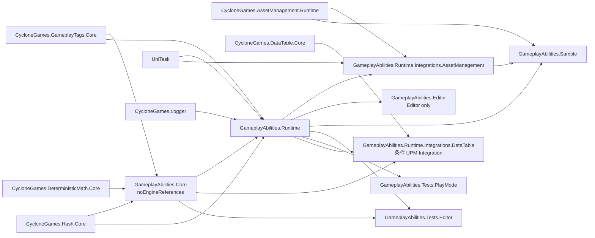
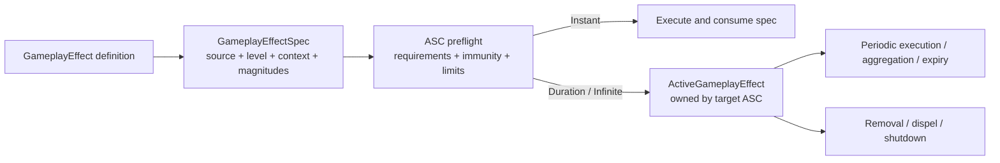

# CycloneGames.GameplayAbilities

[English](./README.md) | 简体中文

以虚幻引擎的 Gameplay Ability System（GAS）为蓝本，CycloneGames.GameplayAbilities 将属性驱动的 Ability 激活、标签状态拦截、堆叠 GameplayEffect、预测记录和表现层 Cue 引入 Unity。如果你用过 GAS，`AbilitySystemComponent`、`GameplayAbility`、`GameplayEffect`、`AttributeSet`、`AbilityTask` 这些概念不会陌生——核心设计直接对应，但实现上为 Unity 生态量身打造，核心状态模型不含 `UnityEngine` 依赖，可以在 headless sim、CLI 测试和 Dedicated Server 中直接运行。

## 目录

- [概述](#概述)
- [架构](#架构)
- [快速上手](#快速上手)
- [核心概念](#核心概念)
- [使用指南](#使用指南)
- [进阶主题](#进阶主题)
- [常见场景](#常见场景)
- [性能与内存](#性能与内存)
- [故障排查](#故障排查)

## 概述

每个动作密集型游戏都会遇到相同的问题：玩家现在能用这个技能吗？消耗什么？怎么改角色属性？效果什么时候过期？什么会拦截什么？GAS 用一条一致的管线回答这些问题——Ability 在激活前检查 Tag 和 Attribute，Effect 随时间修改 Attribute，每一步都留 prediction trail 供权威端提交或回滚。

输入、传输、存档、匹配和动画都在各自的模块中——本框架只处理规则层，也只会处理规则层。

Gameplay 行为具备以下一项或多项需求时，可以使用本模块：

- 可复用的激活规则、Cost、Cooldown、取消和阻塞；
- 由 Instant、Duration、Infinite 或 Periodic Effect 修改的数值 Attribute；
- 由 Tag 驱动的眩晕、免疫、Cooldown、伤害类型或 Ability 分类等状态；
- Stacking、Overflow、Dispel、Ability 授予和 Effect Execution Calculation；
- 具有显式 Commit 与 Rollback 的 Local Prediction Bookkeeping；不提供 Remote-prediction Transport API；
- 与权威 Gameplay 状态隔离的表现层 GameplayCue；
- 具有目标数量上限和 Local Validation 的可复用目标选择任务；
- 用于 Headless 模拟、校验或测试的 Unity-free 状态表示。

本模块不提供特定游戏的战斗模型、输入系统、网络 Transport、账号系统、存档格式、匹配层、动画图或项目级 Service Container。这些职责通过 Composition Code 和窄 Adapter 接入。

通用 API 不假设游戏品类、相机模型、2D/3D 物理、实时/回合制调度、Peer-to-Peer/Server Authority 或固定的实体规模。基于物理的 TargetActor 与视觉 Cue 属于 Unity 表现层；权威规则属于 Attribute、Effect、Ability 和项目 Domain Service。

## 架构

| 路径 | 职责 |
| --- | --- |
| `Core/` | Unity-free 定点数数据、状态/Facade API、稳定 ID、预测记录、Registry、Process-local Reconciliation Buffer 与 Authoritative Activation Result |
| `Runtime/` | `AbilitySystemComponent`、Ability、Effect、Attribute、Task、TargetData、Cue、Unity 创作桥接与运行时诊断 |
| `Editor/` | Inspector、PropertyDrawer、Debugger、Trace Window 与 Overlay 配置工具 |
| `Runtime/Integrations/AssetManagement/` | 从 `CycloneGames.AssetManagement` Handle 到 Cue 侧 `IResourceLocator` 契约的已激活 Adapter |
| `Runtime/Integrations/DataTable/` | 独立 Integration Assembly 中由 UPM 条件激活的可选 DataTable Adapter |
| `Samples/` | 可运行示例、创作资产、TargetActor、手动组合、Headless 组合和可选 DI 组合 |
| `Tests/Editor/` | Core 强化、确定性行为、Attribute 注册、Lease/Cache、Runtime 契约与 Integration 测试 |
| `Tests/PlayMode/` | Runtime Overlay 注册、容量、清理与 Unity 生命周期测试 |

程序集依赖方向如下：


```mermaid
flowchart LR
    Tags["CycloneGames.GameplayTags.Core"]
    Math["CycloneGames.DeterministicMath.Core"]
    Hash["CycloneGames.Hash.Core"]
    Core["GameplayAbilities.Core<br/>noEngineReferences"]
    Asset["CycloneGames.AssetManagement.Runtime"]
    AssetIntegration["GameplayAbilities.Runtime.Integrations.AssetManagement"]
    DataTableCore["CycloneGames.DataTable.Core"]
    UniTask["UniTask"]
    Logger["CycloneGames.Logger"]
    Runtime["GameplayAbilities.Runtime"]
    Editor["GameplayAbilities.Editor<br/>Editor only"]
    DataTable["GameplayAbilities.Runtime.Integrations.DataTable<br/>条件 UPM Integration"]
    Samples["GameplayAbilities.Sample"]
    Tests["GameplayAbilities.Tests.Editor"]
    PlayTests["GameplayAbilities.Tests.PlayMode"]

    Tags --> Core
    Math --> Core
    Hash --> Core
    Core --> Runtime
    Tags --> Runtime
    Hash --> Runtime
    UniTask --> Runtime
    Logger --> Runtime
    Asset --> AssetIntegration
    UniTask --> AssetIntegration
    Runtime --> AssetIntegration
    DataTableCore --> DataTable
    Core --> DataTable
    Runtime --> Editor
    Runtime --> Samples
    Asset --> Samples
    AssetIntegration --> Samples
    Core --> Tests
    Runtime --> Tests
    Runtime --> PlayTests
    Runtime --> DataTable
```

`CycloneGames.GameplayAbilities.Core` 设置了 `noEngineReferences: true`，且不暴露 `UnityEngine` 类型。`CycloneGames.GameplayAbilities.Runtime` 是 Unity Adapter 与创作层。不能仅为复用实现而把 Runtime 代码移入 Core。

`AbilitySpecContainer`、`PredictionManager` 与 `ReplicationStateBuilder` 都是 Runtime Assembly 的 Internal Implementation Type。Public Consumer 通过 `AbilitySystemComponent` Facade、稳定的 `GASReadOnlyListView<T>`、`GASReadOnlySetView<T>`、`GASReadOnlyTagView`、Query Method 与 Diagnostics 工作，不会取得 Mutable Container 或 Builder Access。这些 Internal Type 不是 Extension Point。把 Mutation Authority 收敛在 ASC 可以缩小 Public API 与长期兼容性表面积。

包元数据声明直接 Package 需求。在 `Assets/ThirdParty` checkout 中，`package.json` 是描述性元数据；Unity 是否编译某程序集取决于实际 asmdef 图、已安装 Package、Constraint 和 Symbol。主 Runtime Assembly 不引用 AssetManagement 或 DataTable；这些依赖终止在各自的 Integration Assembly。

## 运行时模型

主要类型采用 GAS 风格的职责划分：

| 类型 | 职责 |
| --- | --- |
| `GASRuntimeContext` | 一个模拟世界或分区的 Composition Root，拥有 Authority/Replica Role、Service、Registry、Entity ID、线程策略、一次性 Runtime Lease 计数和有界 Internal Backing Storage |
| `AbilitySystemComponent`（ASC） | 单个 Gameplay Entity 的稳定 Facade：已授予 Ability、Active Effect、Attribute、Tag、预测、复制状态和 Event |
| `AttributeSet` | 显式注册 Attribute，并提供 Attribute 级校验或后处理 |
| `GameplayAbility` | 一次性初始化的不可变 Definition 配置，以及在受控 Instance 上执行的 Runtime 行为 |
| `GameplayAbilitySpec` | ASC-local 授予状态：Handle、Level、Active State、Template、Instance 和 Granting Effect |
| `GameplayEffect` | Modifier、Duration、Tag、Stacking、Requirement、Cue 与 Granted Ability 的不可变可复用 Runtime Definition |
| `GameplayEffectSpec` | 租用的单次应用数据：Source、Target、Level、计算后 Magnitude、Context、PredictionKey、SetByCaller 值与 Dynamic Tag |
| `ActiveGameplayEffect` | 由目标 ASC 持有的 Duration 或 Infinite Effect |
| `AbilityTask` | 由 Ability 持有的异步或跨帧工作 |
| `TargetData` | 带预测元数据、仅在 Callback 范围有效或显式转移的一次性目标载荷 |
| `IGameplayCueManager` | 表现层 Cue 边界 |
| `GASRuntimeAuthorityMode` | 构造 Runtime Context 时选择且不可变的 `Authority` 或 `Replica` Role |
| `GASAuthorityActivationResult` | Authority 自有 `TryExecuteAuthorityAbility` 边界返回的无分配 Terminal Decision |

ASC 是普通 C# 对象，不是 `MonoBehaviour`。项目 Component 可以持有 ASC 并转发 Unity 生命周期：

```csharp
public sealed class AbilitySystemHost : MonoBehaviour
{
    public AbilitySystemComponent ASC { get; private set; }

    private void Awake()
    {
        ASC = new AbilitySystemComponent();
        ASC.InitAbilityActorInfo(this, gameObject);
    }

    private void Update()
    {
        ASC.Tick(Time.deltaTime, isServer: true);
    }

    private void OnDestroy()
    {
        ASC?.Dispose();
    }
}
```

无参构造函数持有一个私有且具有 Authority 的 `GASRuntimeContext`，适合隔离 Actor、离线玩法和测试。会相互作用的 Actor 通常应共享一个显式 Context，从而共享 Role、Context-local ID、Registry、Process-local Reconciliation Reference、Cue 和内存策略。跨越不同 Context 应用 Effect 会被拒绝。Remote Replica 必须显式构造使用 `GASRuntimeAuthorityMode.Replica` 的 Context。

### Core 状态模式

`GASAbilitySystemRuntimeOptions` 用于选择 ASC 如何使用 Unity-free 状态模型：

- `RuntimeOnly` 是默认模式。项目不使用 Core State 时，它会省略 Mirror，减少重复状态和同步工作。
- `MirrorRuntime` 必须显式选择。Runtime 始终保持权威来源，同时把本地产生的 Ability、Attribute、Effect 和 Modifier Change 镜像到 `GASAbilitySystemState`，供 Core 诊断和 State Checksum 使用。

State Mode 应在组合阶段确定。单次 Session 内不得切换状态所有权。当前验证集合尚未证明 Process-local `GASAbilitySystemStateDeltaBuffer` Apply 能完整同步到 Core Mirror。若没有项目专用的 Parity Test，不得把 `MirrorRuntime` 视为 Reconciled Receiver 仍具有完整 Core State 的证据。

## 组合与生命周期

### 不使用 DI 的显式构造

为一个 Gameplay 世界创建一个 Context，把它注入所有参与交互的 ASC，并按所有权逆序释放：

```csharp
var cacheProfile = new GASRuntimeCacheProfile(
    effectSpecBackingCapacity: 128);

var limits = new GASRuntimeLimits(
    maxAttributeSets: 32,
    maxAttributes: 512,
    maxGrantedAbilities: 256,
    maxActiveEffects: 1024,
    maxPredictionWindows: 128,
    maxTargetsPerTargetData: 128,
    maxPeriodicEffectExecutionsPerTick: 8,
    maxAbilityTaskRepeatExecutionsPerTick: 8);

var options = new GASAbilitySystemRuntimeOptions(
    coreStateMode: GASCoreStateMode.RuntimeOnly,
    limits: limits);

var context = new GASRuntimeContext(
    authorityMode: GASRuntimeAuthorityMode.Authority,
    threadPolicy: GASRuntimeThreadPolicy.Throw,
    cacheProfile: cacheProfile);

var playerASC = new AbilitySystemComponent(context, options);
var enemyASC = new AbilitySystemComponent(context, options);

// During shutdown:
enemyASC.Dispose();
playerASC.Dispose();
context.Dispose();
```

`GASRuntimeCacheProfile` 只控制 `GameplayEffectSpec` 使用的有界 Internal Backing Cache，不保留任何 Public Runtime Object。`GASRuntimeLimits` 控制 Gameplay 与载荷的硬上限。两者解决的问题不同，应分别配置。`cacheProfile` 是 `GASRuntimeContext` Constructor 的最后一个可选参数；`null` 会选择 `GASRuntimeCacheProfile.Default`，最多保留 `64` 个 Backing Record。显式容量范围为 `0..4096`。

### GameplayCue 组合

视觉客户端可以使用显式 GameObject Pool 策略初始化 `GameplayCueManager`，再注入 Context：

```csharp
var cuePoolConfig = new GameObjectPoolManager.PoolConfig(
    maxAssetPools: 128,
    maxActiveLeases: 2048,
    maxActiveLeasesPerPool: 256,
    maxRetainedInstancesPerPool: 128,
    minRetainedInstancesPerPool: 0,
    idleExpirationTime: 60f,
    maxTotalRetainedInstances: 1024);

IResourceLocator cueResources =
    new AssetManagementResourceLocator(assetPackage);

var cueManager = new GameplayCueManager(cuePoolConfig);
cueManager.Initialize(cueResources);

var context = new GASRuntimeContext(cueManager: cueManager);
```

`AssetManagementResourceLocator` 属于 `CycloneGames.GameplayAbilities.Runtime.Integrations.AssetManagement`；主 Runtime Assembly 只感知 `IResourceLocator`。使用其他 Asset System 的项目应提供对应 Adapter。具体资源边界是 `GameplayCueManager.Initialize(IResourceLocator)`；Core `IGameplayCueManager` 契约不暴露 `Initialize`。调用方拥有注入的 Service。先释放所有 ASC，再释放 Context，最后释放 `GameplayCueManager`。Headless 进程应注入 `NullGameplayCueManager.Instance`，且不加载视觉资产。

### DI 组合

Runtime 类型不依赖任何 DI Container。可在项目 Composition Root 中注册具体实例：

```csharp
builder.Register<IResourceLocator>(
    _ => new AssetManagementResourceLocator(assetPackage),
    Lifetime.Singleton);

builder.Register(
        resolver =>
        {
            var manager = new GameplayCueManager(cuePoolConfig);
            manager.Initialize(resolver.Resolve<IResourceLocator>());
            return manager;
        },
        Lifetime.Singleton)
    .As<GameplayCueManager>();

    builder.Register(
        resolver => new GASRuntimeContext(
            authorityMode: GASRuntimeAuthorityMode.Authority,
            cueManager: resolver.Resolve<GameplayCueManager>(),
            cacheProfile: cacheProfile),
        Lifetime.Singleton)
    .As<GASRuntimeContext>();
```

Container 的释放顺序必须保持一致：ASC Owner、Context、注入的 Service。仍有 ASC 注册时，`GASRuntimeContext.Dispose()` 会拒绝执行。

Remote replicated state 应使用独立的 `Replica` Context。Authority 与 Replica 实例不得共享同一个 Mutable Context，Role 在 Context Lifetime 内不能改变。Network session、transport、connection state 与 endpoint lifetime 属于产品 Composition，不属于 `GASRuntimeContext`。

## 教程：一个完整的最小 Ability

以下示例在不依赖 Scene 的情况下创建 Health Attribute、可复用 Healing Effect、Ability 和一个 ASC。

### 1. 定义 AttributeSet

Attribute 采用显式注册，不通过 Reflection 扫描 Property。

```csharp
using CycloneGames.GameplayAbilities.Core;
using CycloneGames.GameplayAbilities.Runtime;

public sealed class CombatAttributes : AttributeSet
{
    public GameplayAttribute Health { get; } =
        new GameplayAttribute("Attribute.Vital.Health");

    public GameplayAttribute MaxHealth { get; } =
        new GameplayAttribute("Attribute.Vital.MaxHealth");

    protected override void RegisterAttributes()
    {
        RegisterAttribute(Health);
        RegisterAttribute(MaxHealth);
    }

    public override void PreAttributeChange(
        GameplayAttribute attribute,
        ref GASFixedValue newValue)
    {
        if (attribute == Health)
        {
            newValue = GASFixedValue.Clamp(
                newValue,
                GASFixedValue.Zero,
                MaxHealth.CurrentFixedValue);
        }
    }
}
```

每个 Attribute Name 必须非空，且在同一个 Set 内唯一。在 Effect 或 Ability 解析 Attribute 之前，应先把 Set 加入 ASC。

`GameplayAttribute.ActiveModifierSourceCount` 是 Active Modifier Contributor 的诊断计数。Attribute 被 Active Effect 或 Open Prediction Snapshot 引用时，`RemoveAttributeSet` 会拒绝 Detach；排查拒绝原因时，应结合该计数、Active Effect 与 Prediction 诊断。该计数只用于可观测性，不承担 Authority 或 Synchronization 职责。

### 2. 定义 Effect

Runtime Definition 可被复用，构造后应视为不可变：

```csharp
using System.Collections.Generic;
using CycloneGames.GameplayAbilities.Runtime;

var healEffect = new GameplayEffect(
    name: "GE_Heal",
    durationPolicy: EDurationPolicy.Instant,
    modifiers: new List<ModifierInfo>
    {
        new ModifierInfo(
            "Attribute.Vital.Health",
            EAttributeModifierOperation.Add,
            new ScalableFloat(baseValue: 25f, scalingFactorPerLevel: 5f))
    });
```

`Instant` Effect 立即执行。`HasDuration` Effect 在正数 Duration 内保持 Active。`Infinite` Effect 持续到显式移除。Instant Effect 不能设置 Period。

### 3. 实现 Ability

`CommitAbility` 执行 Cost/Cooldown Preflight 并返回结构化结果。Commit 失败时必须停止 Gameplay 执行。

```csharp
using CycloneGames.GameplayAbilities.Runtime;
using CycloneGames.GameplayTags.Core;

public sealed class HealAbility : GameplayAbility
{
    private readonly GameplayEffect healEffect;

    public HealAbility(GameplayEffect healEffect)
    {
        this.healEffect = healEffect;

        Initialize(
            name: "GA_Heal",
            instancingPolicy: EGameplayAbilityInstancingPolicy.InstancedPerExecution,
            executionPolicy: EAbilityExecutionPolicy.LocalOnly,
            cost: null,
            cooldown: null,
            abilityTags: new GameplayTagContainer(),
            activationBlockedTags: new GameplayTagContainer(),
            activationRequiredTags: new GameplayTagContainer(),
            cancelAbilitiesWithTag: new GameplayTagContainer(),
            blockAbilitiesWithTag: new GameplayTagContainer());
    }

    public override void ActivateAbility(
        GameplayAbilityActorInfo actorInfo,
        GameplayAbilitySpec spec,
        GameplayAbilityActivationInfo activationInfo)
    {
        GameplayAbilityCommitResult commit = CommitAbility(actorInfo, spec);
        if (!commit.Succeeded)
        {
            EndAbility();
            return;
        }

        GameplayEffectApplicationResult result =
            ApplyGameplayEffectToOwner(healEffect, spec.Level);

        if (!result.Succeeded)
        {
            // Project code may translate result.Code into UI or telemetry.
        }

        EndAbility();
    }

    public override GameplayAbility CreateRuntimeInstance()
    {
        return new HealAbility(healEffect);
    }
}
```

### 4. 授予并激活

```csharp
using var context = new GASRuntimeContext();
using var asc = new AbilitySystemComponent(context);

var attributes = new CombatAttributes();
asc.AddAttributeSet(attributes);
attributes.MaxHealth.SetBaseValue(100f);
attributes.MaxHealth.SetCurrentValue(100f);
attributes.Health.SetBaseValue(50f);
attributes.Health.SetCurrentValue(50f);

asc.InitAbilityActorInfo(owner: playerModel, avatar: playerGameObject);

GameplayAbilitySpec spec = asc.GrantAbility(
    new HealAbility(healEffect),
    level: 1);

bool activationStarted = asc.TryActivateAbility(spec);
```

ASC 拥有已授予的 Spec。调用 `ClearAbility(spec)` 可以撤销授予；Spec 被清除或 ASC 被释放后，不得继续持有该 Spec。

## Ability 工作流

### 授予与实例化

`GameplayAbility.Initialize` 只发布一次配置。Tag Input 使用 `IReadOnlyGameplayTagContainer`；初始化不要求也不会保留调用方 container 的 mutation authority。提交任何 Property 前，它会校验：非空且不超过 `MaxNameLength`（`256`）的 Name、已知 Instancing/Network Policy、Aggregate `MaxAggregateTagCount`（`256`）以内的有效 Tag Data，以及不超过 `MaxTriggerCount`（`64`）的有效 Trigger。Tag 与 Source 相同的 Trigger Pair 会作为 Duplicate 被拒绝。全部校验成功后，它才把 Tag Input 复制到不可变的 `GameplayDefinitionTagSet`，把 Trigger Snapshot 为 Read-only Collection，并通过 Private-set Property 暴露配置。重复初始化会抛出异常；`GrantAbility` 会拒绝从未初始化的 Definition。注册前必须完成整个 Definition；Runtime Activation State 属于 Instance，不属于共享 Definition。

`GrantAbility` 分配 ASC-local Handle 并返回 `GameplayAbilitySpec`。同一个 Ability Definition 可以授予多次，应通过 Spec 或 Handle 定位某次授予，不能使用 List Index 作为稳定身份。

实例化策略如下：

- `NonInstanced`：仅供 Unity-free Core Model 中的无状态模拟使用。Unity Runtime 的 `GrantAbility` 会拒绝该策略，因为共享 `GameplayAbility` Object 无法安全持有 ASC、Activation 或 Task State。
- `InstancedPerActor`：一个 Runtime Instance 在 Grant 的整个生命周期内持有执行状态，Grant 被清除时失效。
- `InstancedPerExecution`：每次激活都取得一个独立 Runtime Instance；该次激活结束时 Instance 失效。

Unity Runtime Ability 必须使用 `InstancedPerActor` 或 `InstancedPerExecution`。Pure Core Consumer 只有在全部 Mutable State 都位于共享 Definition 之外时，才能使用 `GASInstancingPolicy.NonInstanced`。Runtime Memory Owner 会为每个 Runtime Lease 调用 `CreateRuntimeInstance()`，要求返回相同 Runtime Type 的独立 Object，并从 Definition 复制已封存的 Base Configuration。Factory 不能捕获生命周期超过 ASC 的 Scene Owner。

每个 Runtime Instance 都保留创建它的准确 Definition/Template Reference。同一 Derived Type 的两个 Definition 因此可以持有不同的不可变配置，而不会共享 Runtime State。Runtime Instance 是一次性 Lease Object：Release 会使 Object 失效并丢弃，不会把它交给另一个 Grant 或 Activation。

持有 Mutable Reference 或敏感状态的 Derived Ability 应 Override `ResetRuntimeState()`，在 Runtime Lease Release 时关闭这些状态：

```csharp
protected override void ResetRuntimeState()
{
    chargeSeconds = 0f;
    cachedTargetIds.Clear();
}
```

Base Release Path 始终清除 `Spec`、`AbilitySystemComponent`、`ActorInfo`、Activation Data 与 Task Tracking。`ResetRuntimeState()` 不能释放共享 Definition Data。若 `InstancedPerActor` Ability 的某些 Activation-specific Field 不能跨越多次激活，还必须在正常 End Workflow 中重置；Final Release Hook 不是 Activation Reset。若 Hook 抛出异常，Lease 仍会失效且 Object 会被丢弃，同时 `ReleaseFailures` 会记录 Cleanup Failure。应把该异常视为 Lifecycle Defect。

### 激活检查

`TryActivateAbility` 会检查：

- ASC 释放状态、Spec 有效性和 Active State；
- Execution Policy 与 Local Ownership；
- Ability Required/Blocked Tag；
- Source/Target Tag Requirement；
- Ability Blocking 与 Cancellation 关系；
- Cooldown Tag；
- Cost 可支付性；
- Ability 的 `CanActivate` Override。

`CanActivate` 应保持确定性，且不产生外部可见 Side Effect。不可逆工作应在 Commit 成功后的激活阶段执行。

### Commit、Cost 与 Cooldown

Commit 契约分为两个阶段：

1. 构造 Cost 与 Cooldown Spec。
2. 校验 Definition、Tag、Limit、Custom Requirement、Cooldown 与可支付性。
3. 应用 Cooldown。
4. 应用 Instant Cost。
5. Cost 被拒绝时移除已经应用的 Cooldown。
6. 仅在成功后发布 `OnAbilityCommitted`。

Cost Definition 必须是 `Instant`。Cooldown Definition 必须是 `HasDuration` 或 `Infinite`，并通常授予一个 Cooldown Tag。Ability 需要在校验前写入 SetByCaller 数据时，应 Override `CreateCostEffectSpec` 或 `CreateCooldownEffectSpec`。

`GameplayAbilityCommitResult.Code` 可以区分 Owner 缺失、Definition 非法、Cost 不足、Cooldown Active 与 Effect 被拒绝。`EffectResult` 保留底层 Effect 拒绝码。

每条终止路径都必须调用 `EndAbility()` 或 `CancelAbility()`。结束 Ability 会取消其持有的 Task、移除配置的 Ability-owned Effect、释放 Owned Tag，并使 Instanced-per-execution Runtime Instance 失效后丢弃。

### 输入与 Event

项目 Input Adapter 应把 Input Action 映射到已授予 Spec，并在模拟 Owner Thread 调用 `TryActivateAbility`、`InputPressed` 或 `InputReleased`。Gameplay Event 使用 `GameplayEventData` 和基于 Tag 的 Callback；Event Tag 表达 Gameplay 意图，不应携带 Transport 特定对象。

### Runtime Callback 与 Observer 顺序

ASC 的 Ability/Effect/Prediction/Replication Event、Tag Callback、Gameplay-event Callback 与 ASC-bound `GameplayAttribute` Value Event 使用 Owner-thread-confined Typed Callback List。订阅与移除属于 Cold-path Operation：Multicast Expansion、Dictionary Insert 与 List Growth 都可能分配。应在 Composition 或 Ability/Task Activation 阶段注册稳定 Delegate，在对应 Teardown 阶段移除；不得每个 Tick 动态订阅。

Dispatch 会捕获当前 Callback Count。Dispatch 期间移除 Subscriber 会把本轮对应 Entry 标记为 Tombstone，因此它不会在本轮稍后执行；新增 Subscriber 会 Append，并从下一次 Dispatch 开始执行。最外层 Dispatch 结束时会 In-place Compact Tombstone。每个 Subscriber 都有独立 Exception Boundary：单个 Subscriber 失败会记录日志，后续 Subscriber 仍会执行。Attribute、Ability、Effect、Prediction-closure、Replication 与 Tag Observer 都只在对应权威状态提交后运行。Capacity 建立后，Steady-state Dispatch 可以避免 Managed Allocation；Exception Logging 与 Subscription Change 不属于该结果的覆盖范围。

ASC 的内部 Count-container Callback 负责 Tag-trigger Activation、Ongoing-effect Inhibition、Attribute Dirty 与 Replication Tracking 的 Committed-state Reconciliation。该 Reconciliation 抛出异常时，Count Container 仍会交付后续 Subscriber，随后返回 `AggregateException`，并明确 Tag State 已提交。此情况属于完整性异常：不得重试 Tag Mutation；应停止该 Entity 的后续 Authority Change，并从经过校验的权威 Snapshot 恢复，或关闭该 Entity。

`GameplayEvent` Observer 是 Intent Listener，不是 Authority。它们先于 Tag-matched Authority Trigger 执行；Observer Failure 会被隔离，不会阻止 Trigger 激活 Ability。Observer Callback 执行期间不能 Dispose ASC。在 Ability Override 或 `OnAbilityActivated` Delivery 期间不能清除当前 Spec；完整 End Window 内也不能清除 Ending Spec，该 Window 覆盖 `OnAbilityEndedEvent` Delivery 与 Per-execution Instance Cleanup。同一个 Spec Lease 的 End Reentry 也会 Fail Fast。这些 Destructive Operation 必须延后到当前 Activation 或 End Call 返回之后。

## GameplayEffect 工作流

### Definition、Spec 与 Active Effect

`GameplayEffect` 是可复用 Definition。`GameplayEffectSpec` 是租用的单次应用请求。`ActiveGameplayEffect` 是由 Target 持有的持久状态。

`GameplayEffect` Constructor 会在发布 Definition 前校验完整配置：非空 Name；已知 Duration/Stacking Policy；有限的 Duration、Period 与 Magnitude 输入；适用位置要求正数 Duration 与 Stack Limit；合法的 Modifier Operation、Capture Policy、Calculation 与 SetByCaller Key；非空 Requirement/Overflow Entry；以及兼容的 Granted Ability。Instant Definition 不能设置 Period 或授予 Ability，Runtime-granted Ability 不能使用 `NonInstanced`。Definition Collection、Modifier Record 与 Tag Container 会复制为 Runtime 数据。

Runtime State 与 Reconciliation Buffer 中的 Ability/Effect Level 是 `1..65535` 闭区间内的整数，上限通过 `GASRuntimeDataContract.MaxGameplayLevel` 暴露。Ability Grant、Spec Creation、Effect Reconciliation 与 State-delta Validation 会拒绝范围外的值。接受 `-1` 的 Helper Overload 只把它用作“继承当前 Ability Level”的指令，并在创建 Spec 前解析为有效 Level。

发布后的 Collection 以 `IReadOnlyList<T>` 暴露。Definition Tag 使用只实现 `IReadOnlyGameplayTagContainer` 的 `GameplayDefinitionTagSet`；Effect Requirement 使用包含相同只读 Definition Set 的 `GameplayEffectTagRequirements`。这些 Public Definition Value 不暴露 Mutation Authority。只有在需要隔离的 Authoring 或 Composition Value 时，才调用 `ToMutableContainer()` 或 `ToMutableRequirements()`，然后构造另一个 Definition。Execution、Custom Magnitude Calculation 与 Application Requirement 等引用型 Strategy Object 不会 Deep Clone，因此其实现必须在 Definition 构造后保持无状态。

`GameplayEffectSpec.DynamicGrantedTags` 与 `DynamicAssetTags` 返回 `GameplayEffectSpecTagView`。它是指向当前 Spec Lease 所拥有存储的 Generation-checked `readonly struct` View。每次读取或修改都会校验来源 Lease Generation；修改还要求 Caller Ownership。Spec 被消费或 Discard 后，已捕获的 View 会抛出异常，并且不会拥有或延长 Backing Storage 的生命周期。


```mermaid
flowchart LR
    Definition["GameplayEffect definition"] --> Spec["GameplayEffectSpec<br/>source + level + context + magnitudes"]
    Spec --> Validate["ASC preflight<br/>requirements + immunity + limits"]
    Validate -->|"Instant"| Execute["Execute and consume spec"]
    Validate -->|"Duration / Infinite"| Active["ActiveGameplayEffect<br/>owned by target ASC"]
    Active --> Tick["Periodic execution / aggregation / expiry"]
    Active --> Remove["Removal / dispel / shutdown"]
```

`GameplayEffectSpec.Create` 返回 Caller-owned Spec。只有 Caller Ownership 仍有效时，才能配置 SetByCaller、Dynamic Tag、Context Metadata 与 Reserved Capacity。`ApplyGameplayEffectSpecToSelf` 会立即尝试转移 Ownership；转移成功后，无论最终 Result 是否拒绝应用，都会消费 Spec。Spec 传入该方法后，不能继续修改、Discard 或再次提交。Caller-owned Spec 确定不再提交时，必须恰好调用一次 Public `Discard()`；不存在 Public Memory-owner Release API。

`GameplayEffectSpec` 持有可继承的具体类型 `GameplayEffectContext`。`GameplayEffectSpec.Create`、`GameplayEffectSpec.Context`、`AbilitySystemComponent.MakeEffectContext` 与 `IGameplayEffectContextFactory.Create` 都使用该类型。基础 Context 只携带 `Instigator`、`AbilityInstance` 与 `PredictionKey`；Targeting Data 保留在独立的 AbilityTask 与 TargetData Lease 工作流中。把 Context 传给 `GameplayEffectSpec.Create` 会将其 Attach 到 Spec。基础 Context 会把该 Spec 的准确实例记录为 Ownership Token；Attach 后，只有同一个 Spec 才能更新 Prediction State 或释放 Context，而 Caller Mutation、`Reset` 与 `Dispose` 都会抛出异常。Caller 只能 Dispose 从未 Attach 的独立 Context。派生 Context 可以覆盖受保护的 `ResetCustomState()`，但只能清理自己的可变字段；基础类始终负责基础元数据与 Ownership State，该 Hook 不得释放 Context。Discard 或消费 Spec 会释放其 Context；Duration/Infinite 应用会把 Spec 与 Context 转移给 Target-owned Active Effect，直到 Effect 被移除。不能让多个 Spec 共享同一个 Context，也不能从 Cue Callback 保留它。

Application Result 或 ASC Query 返回的 `ActiveGameplayEffect` 是 Target ASC 独占持有的 Borrowed State。Consumer 不能直接 Release。应通过 `TryRemoveActiveEffect` 等 Owner API 请求移除，或由 Stacking、Expiry、Clear 与 ASC Dispose 完成移除。移除后，不能继续访问 Active Effect，也不能访问其 Spec/Context。

`ActiveEffectContainer` 是内部实现状态。公共枚举通过 `AbilitySystemComponent.ActiveEffects` 返回的稳定 `GASReadOnlyListView<ActiveGameplayEffect>` 完成，详细检查则使用公共 Debugger 与诊断 API。View 及其中每个元素都是 Borrowed Reference；Consumer 不得依赖内部 Index、Stacking Map 或 Mutation Order。

`ModifierMagnitudes`、`ModifierMagnitudeRawValues` 与 `TargetAttributes` 是指向 Spec-owned Buffer 的 Borrowed `ReadOnlySpan<T>` View。它们不会暴露 Mutable Array，并且只在当前 Spec Lease 有效期间有效。提交 Spec 或以其他方式结束其 Lease 前，应读取或复制所需值；不得保留 Span，也不得从中派生 Long-lived Reference。

`GameplayEffectApplicationResult.Code` 是完整的应用结果契约：

| 结果分组 | Code |
| --- | --- |
| 已提交成功 | `Applied`、`Executed`、`Stacked` |
| 非法输入或 Context | `InvalidSpec`、`InvalidDefinition`、`RuntimeContextMismatch` |
| Runtime State 或 Phase 拒绝 | `StateResyncRequired`、`ReentrantMutationRejected` |
| 规则拒绝 | `BlockedByImmunity`、`MissingRequiredTags`、`BlockedByForbiddenTags`、`BlockedByCustomRequirement` |
| 容量或 Prediction 拒绝 | `ActiveEffectLimitReached`、`PredictionLimitReached`、`PredictionUnsupported`、`GrantedAbilityLimitReached` |
| Execution 或 Commit Failure | `ExecutionFailed`、`DurationCommitFailed` |

`CanApplyGameplayEffectSpec` 用于 Preflight。它会检查模块持有的 Requirement 与 Budget，但不能证明项目 Callback 不会抛出异常。Preflight 中调用的 Custom Application Requirement 必须是 Pure Function，因为它可能执行多次。

Effect Application 对模块持有的 ASC State 遵循阶段范围内的 Failure-atomic 规则。Validation 与 Capacity Failure 在修改状态前返回。Instant Execution 会 Snapshot 每个涉及的 Attribute；Execution 或 Attribute Hook 抛出异常时恢复这些值。首次插入 Duration Effect 失败时，会先从 Index、Core State、Granted Ability、Tag 与 Modifier Link 中移除未提交 Effect，再使其一次性 Lease 失效，然后返回 `DurationCommitFailed`。Removal Tag 处理与 Cue Dispatch 只在对应 Effect 操作提交后执行。

Definition-granted Tag 与 Spec Dynamic-granted Tag 是独立的 Ownership Edge。Effect Removal、Rollback 与 ASC Shutdown 会分别尝试从 Effect-owned 与 Combined Tag State 移除每条 Edge。某个 Tag-removal Callback 或 Cleanup Step 失败时会记录该 Failure，但不会跳过剩余的 Definition/Dynamic-tag Cleanup、Modifier/Index Cleanup 或 Effect Lease Release。权威 Removal 提交后，再按 Subscriber 分发 Effect Observer。

Effect Mutation Transaction 与 Active-effect Iteration 是不可重入 Phase。在这些 Phase 内直接发起 Apply、Remove、Update、Internal Reconciliation Apply、`Tick`、ASC `Dispose` 或 Ability End，会按照对应 API 的 Result、`false` 或 `InvalidOperationException` 契约立即拒绝。重入调用 `ApplyGameplayEffectSpecToSelf` 时，若 Caller-owned Spec 成功转移 Ownership，该 Spec 会被消费并 Release，方法随后返回 `ReentrantMutationRejected`；提交后不得再对该 Spec 调用 `Discard()`、执行 Mutation 或再次提交。无关工作应排入后续 Owner-thread Phase。

由 `ActivateAbilityOnGranted`、`OwnedTagAdded`、`OwnedTagRemoved` 或 `GameplayEvent` Trigger 请求的 Activation，在上述 Phase 活跃时使用有界 Deferred Path。请求按 Spec Identity 去重，以 `MaxGrantedAbilities` 为容量上限，并且只在外层 Mutation 或 Iteration 提交后 Flush。单次 Flush 使用相同的有界 Budget；剩余请求会记录 Error 并丢弃。该路径不会使任意 Callback 或 Effect Mutation 变为可重入。

这不是覆盖完整 Effect Graph 的事务。Stacking 与 Overflow 会按顺序应用 Child Operation；已经提交的 Child 不会因后续 Stacking 工作失败而撤销。该原子性也不覆盖项目 Callback、Custom Calculation、Observer、Log、Network Send 或外部 Service 执行的不可逆工作。这些 Hook 在 Commit 前应保持无 Side Effect，或由项目提供 Compensation。出现 Rollback-cleanup Failure 表示完整性异常；应停止该 Entity 的后续 Authority Change，并从经过校验的权威 Snapshot 恢复。

### SetByCaller

SetByCaller 为单次应用提供 Magnitude，不修改共享 Definition：

```csharp
GameplayTag damageTag =
    GameplayTagManager.RequestTag("Data.Damage");

GameplayEffectSpec spec =
    GameplayEffectSpec.Create(damageEffect, sourceASC, level: 3);

spec.SetSetByCallerMagnitude(damageTag, 85f);

GameplayEffectApplicationResult result =
    targetASC.ApplyGameplayEffectSpecToSelf(spec);
```

稳定 Gameplay 契约优先使用 Tag Key；本地场景也可以使用 Name Key。Tag 与 Name 条目的总数受 `MaxSetByCallerEntries` 限制。SetByCaller 变化会重新计算受影响的 Modifier Magnitude。

Internal Magnitude Initialization 会静默读取缺失的 SetByCaller Input。提交成功转移 Ownership 时，Spec 会对已创作的 SetByCaller Modifier 执行一次有界检查，并且只发出一次配置要求的 Missing-key Warning。Ownership Transfer 失败或 Caller 调用 `Discard()` 时，不执行该 Warning Pass。显式调用 `GetSetByCallerMagnitude(..., warnIfNotFound: true)` 仍是即时诊断读取，可以独立产生 Warning。

### Magnitude、聚合与 Execution

Modifier Operation 包括 `Add`、`Multiply`、`Division` 和 `Override`。Magnitude 可以采用：

- `ScalableFloat`：使用基于 Level 的固定输入；
- `AttributeBased`：按 Snapshot Policy 捕获 Source 或 Target；
- `SetByCaller`；
- `CustomCalculation`：用于有界计算逻辑。

当 Effect 需要相互独立的 Modifier 通道时，可以使用 Evaluation Channel 进行有序聚合。Execution Calculation 支持涉及多个 Attribute 的 Instant 或 Periodic 逻辑。参与预测的 Execution Calculation 应保持确定性，且不能在内部进行 Transport、Asset Loading 或无界分配。

`GameplayEffectExecutionCalculation.Execute` 接收只能在栈上使用的 `GameplayEffectExecutionOutput`。每个结果通过 `Add` 写入；null 结果或超过 `GASRuntimeLimits.MaxModifiersPerEffect` 的追加会在 Attribute Mutation 开始前失败。Calculation 不能保留或替换该 Output。其 Backing Scratch 与 Instant-effect Rollback Scratch 由 Target ASC 持有，在 `finally` 中清空，并在 ASC Dispose 时释放。Scratch list 一旦增长到超过 256 个元素，操作结束后就会被丢弃，避免异常峰值容量一直保留到 ASC 生命周期结束。

### Stacking 与持续状态

`GameplayEffectStacking` 可以选择不堆叠、按 Source 聚合或按 Target 聚合，同时定义 Stack Limit、Duration Refresh 和 Expiration 行为。Overflow Effect 与 Deny Policy 处理达到上限后的应用。

Application Requirement 在插入前执行。Ongoing Requirement 决定 Active Effect 在 Tag 变化后是否继续贡献。Removal Tag 支持 Dispel。Duration 与 Infinite Effect 可以在 Active Lifetime 内授予 Tag 和 Ability。

## GameplayTags

Tag 是激活、阻塞、取消、免疫、Effect Identity、Granted State、Cooldown、Event、Cue 与 SetByCaller 的共享词汇。

建议的命名空间包括：

```text
Ability.Attack.Primary
Ability.Movement.Dash
Cooldown.Ability.Dash
State.CrowdControl.Stunned
State.Immune.Fire
Effect.Damage.Fire
GameplayCue.Fire.Impact
Data.Damage
Attribute.Vital.Health
```

`CombinedTags` 聚合 Loose Tag 与 Active Effect 授予的 Tag。它和 `ImmunityTags` 都是 Query-only `GASReadOnlyTagView`；Mutation 保留在 `AddLooseGameplayTag`、`RemoveLooseGameplayTag`、`AddImmunityTag` 与 `RemoveImmunityTag` 等 ASC Method。Loose Tag 由项目代码显式持有：每个 `AddLooseGameplayTag` 都必须有明确的移除路径。Effect-granted Tag 由 Active Effect 持有，并随 Effect 一起移除。

Ability 与 Effect 构造阶段会为热路径使用的 Tag Query 建立 Snapshot。Runtime Definition 应视为不可变；配置变化时应重新创建或重新加载创作资产。

## AbilityTask 与目标数据

AbilityTask 用于 Ability-owned 的 Delay、Repeat、Tag Wait、Attribute Wait、Gameplay Event Wait、Effect Wait、Confirm/Cancel 和 Targeting 等工作。通过 Ability Factory 创建 Task，完成订阅后按 Task API 激活。Ability 持有每个 Task 的取消与最终 Release。

Terminal Callback 不持有 Task Teardown。One-shot、Cancellation、Target-data、Delay、Repeat、Tag、Attribute、Gameplay-event、Effect 与 Ability-wait Task 会在调用项目代码前取得 Terminal Ownership，并通过 Guarded Cleanup 关闭。`AbilityTask_WaitTargetData` 对 TargetData Release 与 Task Teardown 使用嵌套 `finally`，因此 Consumer Callback 或 TargetData Reset 抛出异常时仍会尝试执行 `EndTask`。Callback Exception 不会被吞掉，仍可能传播给调用方，但测试覆盖的 Task Lease 会从 Active Ownership 中移除。Reentrant 的第二个 Terminal Signal 会被忽略。

每个 AbilityTask 都是为一次 Lease 全新构造的 Object。Terminal `finally`、`Activate` Failure Cleanup、Tick Failure Cleanup、Prediction-cancellation Snapshot 与 Task Initialization 都会在结束或登记 Task 前比较捕获的 Internal Lease Generation。Generation Exhaustion 与 Release 后访问都会 Fail Closed。该 Generation 只用于 Internal Bookkeeping，不是 Public Handle；`EndTask`、Cancellation、Ability End 或 Owner Dispose 后，不得继续持有 Task 或其 Mutable Callback State。Release 后 Object 会被丢弃，不会用于后续 Lease，因此 Stale Task Reference 不会通过顺序 Object Reuse 指向另一个 Operation。

`AbilityTask_WaitGameplayTagAdded` 与 `AbilityTask_WaitGameplayTagRemoved` 会先订阅，再检查当前 Tag State，因此 Check 与 Registration 之间不会丢失 Edge。当 `triggerOnce: false` 且当前状态已经满足时，Task 会在订阅后立即通知，并把该 Callback 作为 Activation Frame 的最后一个 Operation。若 Callback 结束 Task，先前 Stack 不会再写入 Field，Generation-checked Activation Failure Cleanup 也不会操作已释放的 Lease。

`EndAbility` 会先把 Ability 标记为 Ending，因此 Cancellation Callback 无法创建另一个 Task。即使部分 Callback 抛出异常，它仍会尝试取消并释放每个 Active Task、清空 Task Index，并且只在完成 Teardown 尝试后报告第一个 Failure。ASC Shutdown 期间，每个 Granted Spec 都会在 Active Effect 移除前执行 Removal Path，Spec Release 保留在 `finally`；因此 Ability-owned Task 与 Effect Cleanup 执行期间，Effect State 仍然有效。

### TargetData Lease 规则

`ITargetActor.Configure(ability, onTargetDataReady, onCancelled)` 是单次 Operation 的 Request/Response Boundary。它恰好连接一个 Completion Callback 和一个 Cancellation Callback。对于每次已配置的 Operation，TargetActor 必须在两个 Terminal Callback 中恰好选择一个并调用一次；不得把它们暴露、组合或调用为 Multicast Notification。Completion 会把一个 `TargetData` Lease 恰好转移一次给 Task。TargetActor 在转移后不得继续保留、Release、复用或再次发布该 Lease；Cancellation 不转移 Lease。

`AbilityTask_WaitTargetData` 是已转移 Lease 的唯一 Owner。`OnValidData` 只提供 Callback-scoped Borrowed Access，Task 会在该 Callback 返回后立即于 `finally` 中调用 `TargetData.Release()`。应赋值一个 Result Consumer，不能组合 Delegate；所有需要持久保留的信息必须在 Callback 内读取或复制：

```csharp
task.OnValidData = data =>
{
    var actors = (GameplayAbilityTargetData_ActorArray)data;
    for (int i = 0; i < actors.ActorCount; i++)
    {
        stableTargetIds.Add(targetIdResolver(actors.GetActor(i)));
    }

    // Do not retain data or actor references through the TargetData lease.
};
```

Release 后，受 Lease 保护的操作会抛出异常。每个 `TargetData` Object（包括 Public Standalone Construction）都是 One-shot，并在 `Release()` 成功后永久失效，因此 Stale Raw Reference 不会为后续 Operation 再次变为有效。这关闭了顺序 Raw-reference ABA，但不会延长 Callback Lifetime：Callback 或显式 `Release()` 结束后，绝不能保留或访问 `TargetData`、从中取得的 Actor Reference 或 Mutable Payload State。Target Array 受 `MaxTargetsPerTargetData` 限制。Runtime TargetActor 应使用 `AbilitySystemComponent.RentTargetData<T>()`，让 Context 持有 Lease Accounting 并应用配置后的 Target Limit；Standalone Construction 不计入 Context Memory Statistics。

### Local TargetData 校验

`TargetData` 与 `AbilitySystemComponent.TryValidateTargetData` 保持为 Local Runtime API。Gameplay 消费 One-shot Lease 前，Validation 会检查 Owning ASC/Spec/Prediction Relationship、配置的 Target Count、Object Lifetime、有限 Coordinate，以及调用方提供的有限非负 Range。数据仍由 Context Owner Thread 上唯一 Local Workflow 持有；Owner 必须且只能执行一次最终 `Release()`，禁止 Multicast Publication，也不得在 Scope 后保留。

Local `TargetData` Lease 不会被序列化。可选 `CycloneGames.GameplayAbilities.Networking` 包提供有界 `ActorList`、`SingleHit` Wire Record，以及 Confirm/Cancel Command。Authority Handler 接收稳定 Identity 和 Portable Value，不接收 Unity Object 或 Local Lease。Gameplay 消费该 Intent 前，产品仍必须完成 Authorization，以及权威 Range、Visibility、Collision、Faction、Lifetime 与 Rate 校验。

## GameplayCue

GameplayCue 是表现层 Event，不能决定 Damage、Cost、Cooldown、Authority 或其他 Gameplay Invariant。

Event 包括：

- `OnActive`：持久 Effect 进入 Active；
- `WhileActive`：Active 期间的表现；
- `Executed`：Instant 或 Periodic Execution；
- `Removed`：持久表现结束。

`AbilitySystemComponent.OnGameplayCueCommitted` 是供非表现层 Consumer 使用的同步 Owner-thread Observation Boundary。只有对应 Effect Mutation 已提交后，它才发布 readonly、强类型的 `GameplayCueCommitted` Value。Instant `Executed` Cue 的 Active-effect Reconciliation ID 为零；`OnActive`、`Removed` 与每次实际发生的 Periodic `Executed` 都携带该 Active Effect 相同的正数 Process-local Reconciliation ID。Source Ability Policy、Source Spec Handle、Prediction Key 与 Target ASC State Version 会在长生命周期 Effect 释放 Borrowed Ability-instance Reference 前完成捕获。

每个 Committed-cue Observer 都会独立调用。Observer 异常会被记录，但不能撤销已提交 Effect，也不能阻止后续 Observer；本地 `IGameplayCueManager` 失败同样不会抑制 Committed Observation。该 Callback 不是 Transport 或 Global Event Bus。其 ASC 与 Effect Reference 只在同步调用期间属于 Borrowed Reference；需要跨生命周期或线程的 Consumer 只能复制自己持有的稳定 Value。订阅、移除与 Dispatch 均使用 ASC Owner Thread；Warmed Dispatch 复用现有 Callback Buffer，不会为每条 Cue 创建 Observer Collection。

`GameplayCueManager` 支持静态地址注册、Runtime Handler、Persistent Instance 追踪、预测 Accept/Reject、异步加载和有界 GameObject Pool。同一静态地址的并发请求共享一个 In-flight Load。每次 Await 后，Manager 都会重新校验 Registration、Target Lifetime、Cue Reference State、Cancellation 与 Lease Ownership；过期或非法结果不会发布。异步 Dispatch 会复制不可变 Cue Parameter，不会让 Effect Context Reference 超出其有效生命周期。

`GameObjectPoolManager.PoolConfig` 显式限制 Asset Pool、全局 Active Lease、单 Pool Lease、单 Pool Retained Instance、跨全部 Pool 的 `MaxTotalRetainedInstances`、最小保留量与 Idle Expiration。不同 Asset Key 可以并发 Prewarm，但每个 Asset Pool 最多允许一个 In-flight `PrewarmPoolAsync`；同一 Key 的另一个未满足 Prewarm 会抛出异常。每次 Prewarm 都会在 Await 前预留全局 Retained Budget，因此不同 Key 的操作也无法共同超额保留。全局 `AggressiveShrink()` 会跳过 In-flight Pool；针对该 Key 的 Shrink 或 `ClearPool` 会抛出异常。归还的 Instance 超过任一 Retention Bound 时会被销毁。

`GetAsync`、`PrewarmPoolAsync` 与 Shared Handle Load 都从 Unity Main Thread 进入。External Cancellation 可能使等待中的 Continuation 在 Worker 上恢复，因此这些流程会在 `finally` 中使用不携带已取消 Token 的切换回到 Main Thread，再修改 Pool Accounting。`GetAsync` 会释放 Pending Lease-request Count；Prewarm 会清除 In-flight Flag 并归还全部未使用的 Retained-instance Reservation；Shared-load Waiter 会递减自身 Count。取消一个 Waiter 不会取消仍被其他 Waiter 使用的 Load；只有最后一个 Waiter 离开时才取消 Shared Load。Shutdown Cancellation 与 Load Failure 会在 Main Thread Dispose 已取得的 Resource Handle。

Persistent Cue Activation 使用同一 Ownership Closure。`CreateInstanceAsync` 成功返回 Lease 后，若 `OnActiveAsync` 或 `OnWhileActiveAsync` 在 Worker Thread Fault/Cancel，Cleanup 会切回 Main Thread，并在 Ownership 尚未转移到 Tracker 时释放 Lease。若 `CreateInstanceAsync` 自身取得 Lease 后在返回前失败，该实现必须自行释放 Lease，因为 Workflow 尚未收到 Ownership Token。Persistent Removal 持有 Release Record，并在 Success、Cancellation 或 Handler Failure 后于 `finally` 中归还 Tracked Lease。

Pool 中的 Prefab 可以实现 `IGameObjectPoolLifecycle`。Manager 在 Instance 创建时发现并缓存 Handler，在激活前调用 `OnRentFromPool`，并在 Deactivate、重新挂到 Pool Root 与恢复 Local Scale 前按逆序调用 `OnReturnToPool`。Lifecycle Callback Failure 会隔离并销毁该 Instance，不会保留状态不确定的对象。Lifecycle Callback 必须重置 Component 持有的全部临时状态，并且不能递归释放自身 Lease。

`GameObjectLease` 是租用 Cue Object 的 Ownership Token。签发它的 Manager 会记录 Owner Identity、Instance ID、Raw Instance Reference 与单调递增 Generation。`Release` 只接受完全匹配的 Outstanding Tuple，并拒绝 Foreign-manager、Duplicate 与 Stale-generation Return。这可以阻止已复制 Lease 在同一 Instance 归还并再次租出后释放它，从而防止 GameObject Pool 的 ABA Release Hazard。

`GameObjectLease.IsValid` 只表示该值在结构上曾被签发；Lease 归还后，其副本仍可能保持结构有效。每次访问 `GameObjectLease.Instance` 都会委托给签发它的 Manager，并执行平均 `O(1)` 的 Active-lease Lookup。Manager 会先校验 Unity Main-thread Affinity、Shutdown State、Authority/Owner Identity、非零 Instance ID 与 Generation、准确的 Active `(Instance ID, Generation, Raw Reference)` Tuple，以及 Unity Object Liveness，然后才返回 Object。Release 或 Shutdown 后访问会 Fail Closed。

返回的 `GameObject` 只在 Lease 仍为 Outstanding 时属于 Borrowed Reference。若 Consumer 单独缓存 Raw `GameObject`，Lease 无法撤销或拦截该引用。Consumer 必须在 Lease Boundary 丢弃它，Release 后绝不能继续修改、Deactivate、Destroy 或 Reparent。

Persistent Cue Activation 与 Removal 都是 Cancellation-owned Workflow。`IPersistentGameplayCue.CreateInstanceAsync` 创建并返回 Lease；`OnActiveAsync`、`OnWhileActiveAsync` 与 `OnRemovedAsync` 在 Manager 持有的 Instance 生命周期上运行。若实现已取得 Lease，但在返回前观察到 Cancellation，则实现必须自行释放该 Lease。`CreateInstanceAsync` 返回后，Dispatch Workflow 持有 Lease；所有 Activation Check 成功后才转移给 Tracker，否则在 `finally` 中释放。`OnRemovedAsync` 只接收 Borrowed Raw Instance；Manager 会在 Completion、Cancellation 或 Failure 后释放已追踪 Lease。

Persistent Occurrence 按 Target 与 Cue Tag 进行引用计数。只有第一个 Occurrence 会启动一次 Activation Workflow 并创建一个 Tracked Instance；后续 Occurrence 共享它。只有最后一个匹配 Occurrence 被移除后，Manager 才取消并释放表现。Prediction Commit 会把匹配 Occurrence 标记为 Committed，使后续 Rollback Cleanup 忽略它；Rollback 只移除携带对应 PredictionKey 且仍为 Provisional 的 Occurrence。该引用模型与共享加载路径可以避免重叠 Effect 或并发首次加载产生重复 Persistent Instance。

AssetManagement Integration 会把每个已加载的 `IAssetHandle<T>` 包装为一个单 Owner 的 `IResourceHandle<T>`。Dispose 会清空并至多释放一次底层 Handle。该 Wrapper 不参与 Pool，也不表示 Shared Ownership；接收它的 Consumer 必须恰好转移或释放一次。Cue Cache 与 Asset Pool 会在 Eviction 或 Shutdown 时释放其持有的 Wrapper。

在组合阶段注册静态 Cue 地址：

```csharp
var cueTag = GameplayTagManager.RequestTag("GameplayCue.Fire.Impact");
cueManager.RegisterStaticCue(cueTag, "GameplayCues/GC_FireImpact");
```

Dedicated Server 应使用 `NullGameplayCueManager.Instance`。视觉客户端必须在有序 Shutdown 中调用 `GameplayCueManager.Dispose()`。

## 预测与复制

### Local Prediction 生命周期

Prediction Record、Key、Rollback Snapshot 与 Closure Ordering 仍是 Local Runtime Mechanism。它们使用 Simulation Frame 而不是 Unity Render-frame Identity，具有显式 Capacity Limit，并在发布 Terminal Callback 前关闭自有状态。Predicted Effect Apply 仍会在 Mutation 前拒绝 Ambiguous Stacking、重叠 Attribute Ownership、不支持的 Custom Execution 与耗尽的 Prediction Budget。

Authority/Replica Role 是显式契约。`LocalOnly` 只在当前 Runtime 执行；`AuthorityOnly` 在 `Authority` Context 执行；`LocalPredicted` 在 Replica 上打开乐观工作，并在 Command 校验后通过 Authority Boundary 再次执行。Prediction Window 通过 `CommitPredictionWindow` 或 `RollbackPredictionWindow` 结束；Commit 保留已接受的本地工作并清除 Prediction Bookkeeping，Rollback 则撤销被追踪的 Effect、Attribute、Task、Cue 与 Ability Activity。

### Authority Activation Boundary

构造 Context 时选择不可变 Role：

```csharp
var serverContext = new GASRuntimeContext(
    authorityMode: GASRuntimeAuthorityMode.Authority);

var replicaContext = new GASRuntimeContext(
    authorityMode: GASRuntimeAuthorityMode.Replica);
```

对于 `Activate` Command，产品 Endpoint 只有在认证 Sender、验证 Target Ownership、执行 Replay/Rate/Work Budget，并把 Authority-issued Grant ID 解析到当前 Local `GameplayAbilitySpec` 后，才可调用以下 Public Authority Boundary：

```csharp
GASAuthorityActivationResult result =
    authorityASC.TryExecuteAuthorityAbility(resolvedLocalSpec);

switch (result.Status)
{
    case GASAuthorityActivationStatus.Activated:
        // Encode one correlated terminal response.
        break;
    case GASAuthorityActivationStatus.MissingOrStaleGrant:
    case GASAuthorityActivationStatus.WrongExecutionPolicy:
    case GASAuthorityActivationStatus.AbilityRejected:
    case GASAuthorityActivationStatus.RuntimeUnavailable:
        // Map to a stable protocol result without retrying reentrantly.
        break;
}
```

Cancel 与 Input Edge Command 分别使用 `TryCancelAbility` 和 `TrySetAbilityInputPressed`。Target Confirm/Cancel 通过产品拥有的 `IGASNetworkTargetCommandHandler`。每条路径都保持显式，并且都不能绕过 Authentication、Ownership、Replay、Rate 或 World Validation。

`TryExecuteAuthorityAbility` 要求 Authoritative Context，以及由该 ASC 持有并注册的准确 Live Spec。它接受 `AuthorityOnly` 与 `LocalPredicted`，拒绝 Active 或其他不可用 Ability，遵守 Mutation/Resync Guard，返回当前 Authoritative State Version，不持有 Transport State，不分配 Operation Object，也不发送 Packet。其 Correlation-key Overload 会把已校验 Command Sequence 传入本次权威 Activation 创建的 Effect 与 Cue。

`GASRuntimeAuthorityMode.Invalid` 与默认 `GASAuthorityActivationResult` 都 Fail Closed。Context Role 不能建立 Connection Authority：Authentication 与 Permission 仍属于 Endpoint 职责。

### 可选 Networking Integration

`CycloneGames.GameplayAbilities.Networking` 版本 `1.0.0` 是后端无关的网络 Integration，包括：

- 稳定 Entity、Grant、Effect、Content 与 Tag Identity；
- Fail-closed Protocol/Content/Tags/Wire-schema Handshake；
- Activation、Cancellation、Input、有界 TargetData、Terminal Result、State、Acknowledgement、Resync 与 GameplayCue Contract；
- 显式 Little-endian `Span` Codec 与 Structural Validator；
- 有界 Replay、Authority/Replica Identity Map、State Buffer、Delta/Chunk Planning 与 Semantic Checksum；
- 负责 Handler Ownership、Handshake Gating、Direction Check、Dispatch 与 Failure Report 的 `GASNetworkEndpoint`；
- Authority/Replica ASC State Adapter、精确 Command Processing、Local Prediction Control 与 Deterministic Runtime Content Resolver；
- 带校验 Custom Inspector 的 `GASNetworkContentCatalogAsset`。

该 Integration 使用 `CycloneGames.Networking.INetworkMessageEndpoint`，不依赖 Mirror、Mirage 或 Nakama。产品代码仍负责 Authentication、Connection-to-account Mapping、Entity Ownership、Permission、Rate Policy、Interest Management、依赖世界状态的 Target Check、Timeout Scheduling、Reconnect Policy 与 Owner-thread Marshaling。

网络状态覆盖 Grant 及其 Granting Effect、Active/Input Flag、Attribute、Active Effect、Source Grant、Inhibition、Stack/Timer State、SetByCaller Value、Dynamic Tag 与精确 Loose-tag Count。静态 Definition 通过兼容的 Content Catalog 解析。完整组合和验证契约见 [`CycloneGames.GameplayAbilities.Networking/README.SCH.md`](../CycloneGames.GameplayAbilities.Networking/README.SCH.md)。

### Process-local Reconciliation Transaction

`GASAbilitySystemStateDeltaBuffer` 仍是 Process-local Reconciliation Scratch Structure。它包含 Counted Array、Local Identity 与 Runtime Object Reference；它不是 Wire DTO，无法安全跨进程，也不得作为 Async Message 保留。

每个 ASC 在创建 Active Effect 时自动分配正数的 Process-local Reconciliation Identity。该值在当前 ASC 内唯一，并在 Effect Lifetime 内不可变。它只用于 Capture/Apply 关联 Local Object；不是 Wire ID，外部协议通过自己的 Identity Map 完成转换。

`PreparePendingStateDeltaNonAlloc` 与 `CommitPreparedStateDelta` 对 Authority Pending-change Tracker 构成 Prepare/Copy-or-encode/Commit Transaction：

```csharp
authorityASC.PreparePendingStateDeltaNonAlloc(delta);

// Product code must synchronously copy or encode every counted range into
// its own bounded, versioned DTO and map every identity to a stable wire ID.
bool encoded = EncodeIntoProductOwnedWireBuffer(delta);
if (encoded)
{
    if (!authorityASC.CommitPreparedStateDelta(delta))
    {
        // Source state changed; pending changes remain dirty for a new capture.
    }
}
```

Convenience Capture Path 可以在本地 Prepare 并 Commit，但不会发送任何内容。Encode 被拒绝、Exception 或 Source-version Mismatch 时，Pending Change 必须保留，以供后续重新 Capture。State 与 Attribute-registry Version 保持 Monotonic，但不保证 Contiguous，因为保留的 Version 可能在后续工作拒绝 Mutation 后仍被消耗。

`ApplyStateDelta` 与 `TryApplyStateDelta` 保持为 Public Process-local Reconciliation API；Public Visibility 不会使其成为 Transport Endpoint。它们在 Apply 前校验 Schema、Mask、Sequence、Baseline、Count/Array Pair、Capacity、Process-local Definition/Source Reference、Reconciliation ID、Tag Edge、SetByCaller Slice 与 Checksum。Validation Failure 不修改 State。Application 或 Checksum Failure 会进入 Resync-required Mode，因为 Multi-section Apply 不是 Cross-system Atomic Transaction。Active-effect Apply 直接消费 `GASActiveEffectStateData` 已携带的 Reference，不会隐式分配 ID，也不会查询全局 Resolver。StateDelta 严格按 Reconciliation ID 更新或创建 Effect，绝不会按 Prediction Key 提升或确认未绑定的本地 Effect。不要在同一个参与 Reconciliation 的 ASC 中混入会改变 Replicated State 的 `LocalOnly` Mutation；由此产生的 Checksum Conflict 会 Fail Closed，并要求显式 Baseline Resync。

`GASAbilitySystemStateDeltaBuffer` 与 `GASAbilitySystemFullStateBuffer` 仍是 Process-local Bridge Structure。Networking Integration 会把它们映射到稳定 Wire Record，校验并准备完整 Receiver State，解析全部 Runtime Reference，随后才在 ASC Owner Thread 调用 Apply Boundary。禁止直接序列化这两个 Process-local Buffer。


## 内存、性能与容量

### Managed Runtime Memory

每个 `GASRuntimeContext` 都持有七组 Public Runtime Object 的生命周期计数：`GameplayEffectSpec`、`ActiveGameplayEffect`、`GameplayEffectContext`、`GameplayAbilitySpec`、Runtime `GameplayAbility`、`AbilityTask` 与 `TargetData`。每次 Context Acquire 都会构造新的 Public Object。适用于对应 Owner 的 Terminal Operation（例如 Caller Discard 或 Spec Final Consumption、Active-effect Removal、Grant Clear、Per-execution Ability End、Task End、显式 `TargetData.Release()` 或 Owner Dispose）会使该次 Lease 失效，并永久丢弃 Object。`InstancedPerActor` Ability 在正常 Activation End 后仍然有效，直到其 Grant 被清除时才 Release。每种 Type 还会拒绝在首次 Lifetime 结束后由 Internal Path 再次 Acquire Lease。Release 后的操作会 Fail Closed；同一个 Public Object 不会再次签发，因此 Stale Raw Reference 不会指向后续顺序 Lease。Context Memory Statistics 只计算 Context-owned Acquisition。

只有 `GameplayEffectSpec` 使用可复用的 Internal Storage。Public Spec 在 Active 期间 Attach 一个 Private `GameplayEffectSpecBacking` Record。Release 会先完整清理敏感数据和 Mutable Field，然后 Backing 才能进入每个 Context 独有的有界 Cache；Cleanup Failure 会丢弃该 Backing。Cache 不包含 Public Spec、Context、Active Effect、Ability Spec、Ability、Task 或 TargetData Object。

通过 Context Owner Thread 配置并观察 Cache：

```csharp
var cacheProfile = new GASRuntimeCacheProfile(
    effectSpecBackingCapacity: 128); // 0..4096; default is 64

using var context = new GASRuntimeContext(
    cacheProfile: cacheProfile);

GASRuntimeCacheStatistics cache = context.GetCacheStatistics();
// cache.Retained, Capacity, Hits, Misses, Discards

context.TrimCaches(); // discards every retained backing record
```

`GASRuntimeLeaseStatistics` 为一组 Object 报告 `Active`、`PeakActive`、`Acquisitions`、`InvalidReleases` 与 `ReleaseFailures`。`context.GetMemoryStatistics()` 返回 `GASRuntimeMemoryStatistics`，其中包含 `EffectSpecs`、`ActiveEffects`、`EffectContexts`、`AbilitySpecs`、`Tasks`、`Abilities`、`TargetData` 以及它们求和后的 `OutstandingLeases`。`context.GetCacheStatistics()` 独立报告 Backing Cache 的 `Retained`、`Capacity`、`Hits`、`Misses` 与 `Discards`。`TrimCaches()` 会清除已保留的 Backing Record，但不会使 Active Spec 失效。这些 API 会校验 Context Ownership 与 Dispose State；它们是 Diagnostics 与显式 Cache Control，不负责恢复 Active Lease。

使用 `Throw` 时，跨线程访问会立即抛出异常。使用 `LogWarning` 时，Runtime-memory Access 会记录日志，然后仍在修改前抛出异常。`Disabled` 只移除该诊断，不提供 Synchronization。容量应来自硬件 Composition Profile 与测量后的 Telemetry，不能根据 Platform Compiler Symbol 猜测。

模块不声明全局 Zero Allocation。Cache Hit 可以复用已清理的 Spec Backing Buffer，但每次 Public Runtime Acquire 仍会创建一次性 Object。首次使用、Dictionary/Buffer 扩容、Event 订阅、项目 Callback、Warning/Error、Authoring 转换与外部 Adapter 都可能产生分配。成功的热路径 Ability/Effect/Prediction Event（包括已提交的 Effect Removal 与 Ability Cancellation）使用可选 `GASTrace` Ring，而不是逐次输出成功日志。`GASTraceEvent.AbilityDefinition` 保存稳定 Ability Definition，不保存已释放的 Runtime Instance。Trace Capacity 默认为 `4096`；`SetCapacity` 只接受 `1..65536`，并会重置 Ring。必须使用 Unity Profiler 和 Allocation Call Stack 验证代表性 Gameplay。

### 稳定的公共 Collection 与 Tag View

ASC 的 Collection 与 Tag Query 返回 Cached Live View，不返回 Backing `List<T>`、`HashSet<T>` 或 Mutable Tag Container：

| ASC Surface | Public Type |
| --- | --- |
| `AttributeSets`、`ActiveEffects`、`GetActivatableAbilities()` | `GASReadOnlyListView<T>` |
| `DirtyAttributeNames`、`PendingAddedTags`、`PendingRemovedTags` | `GASReadOnlySetView<T>` |
| `DirtyAttributeValueSnapshots` | `GASReadOnlyListView<GameplayAttribute>` |
| `CombinedTags`、`ImmunityTags` | `GASReadOnlyTagView` |

这些对象具有稳定 Identity，是 Live View，不是复制后的 Snapshot。它们不暴露 Backing Collection、Implicit Conversion、Mutation Method、Tag Callback Registration 或 Raw Container。每次 Count、Index、Query 与 Enumeration Step 都会检查 ASC Owner-thread Affinity 与 Dispose 状态；这也适用于 ASC Dispose 前捕获的 View。同步修改同一 Owner 时不得同时枚举；需要 Snapshot 时，应复制 Stable ID 或 Immutable Value。

直接对这些具体 View Type 使用 `foreach` 时会采用 Value-type Enumerator。聚焦 Allocation Guard 在 Warmup 后的具体 View Enumeration Path 观察到 Current Thread 分配为零。通过 `IEnumerable<T>` 或其他 Interface 枚举可能对 Struct Enumerator 发生 Boxing，不属于该结果的覆盖范围。

### Consumed 与 Borrowed Managed Reference

为保持 GAS 风格的使用体验，一次性 Runtime Lease Object 以 Raw Class Reference 暴露。决定其有效性的是 Ownership Contract，而不是 Garbage Collector Reachability：

| Reference | 有效期间的 Owner | 使其失效的操作 |
| --- | --- | --- |
| `GameplayEffectSpec` | 提交前由 Caller 持有；提交后由 ASC 持有；Duration/Infinite 应用后由 Target Active Effect 持有 | 提交前由 Caller 调用 `Discard()`、通过 `ApplyGameplayEffectSpecToSelf` 转移，或随 Active-effect Removal 失效 |
| `GameplayEffectContext` | Attach 前由独立 Caller 持有；之后由唯一 Owning Spec 持有 | Attach 前由 Caller `Dispose()`，或随匹配的 Owning-spec Discard、Consumption 与 Active-effect Removal 失效；Attach 后只有 Owning Spec 可以更新 Prediction State 或释放它 |
| `ActiveGameplayEffect` | Target ASC；Consumer 只获得 Borrowed Access | Owner `TryRemoveActiveEffect`、Effect Clear/Expiry 或 ASC Dispose；不存在 Direct Consumer Release Operation |
| `GameplayAbilitySpec` | Owning ASC | `ClearAbility`、Effect-grant Removal、Authoritative Reconciliation Replacement 或 ASC Dispose |
| Runtime `GameplayAbility` Instance | 对应 Spec/Activation | 按 Instancing Policy 发生 Ability End、Clear、Removal 或 ASC Dispose |
| `AbilityTask` | Active Ability | `EndTask`、Cancellation、Ability End、Clear 或 ASC Dispose |
| `TargetData` | 显式 Renter/Receiver，或正在 Dispatch `OnValidData` 的 AbilityTask；Callback Consumer 只有 Borrowed Access | Owner `Release()` 或 Task Callback Completion |

Consumed Reference 不能继续读取、比较当前 Identity、修改、再次归还或保存供后续使用。Borrowed Reference 不能超过 Owner Lifetime。`GameplayEffectApplicationResult.ActiveEffect`、Debugger Collection 与 ASC Read-only List 暴露的是 Borrowed Object，不发生 Ownership Transfer。

Context-owned `GameplayEffectSpec`、`GameplayEffectContext`、`ActiveGameplayEffect`、`GameplayAbilitySpec`、Runtime `GameplayAbility` Instance、`AbilityTask` 与 `TargetData` 的每个 Object 只取得一次 Lease。Release Path 会使 Object 失效并丢弃，而不会再次签发，因此这些 Public Type 已关闭顺序 Raw-reference ABA。Released-object Guard、Ownership Check 与 Invalid-release Counter 会在 Stale Code 再次调用 API 时 Fail Closed。它们不会使 Stale Reference 可用，也不会延长 Borrowed Lifetime；数据需要跨越 `Discard`、`Clear`、`Remove`、Ability End、Task End、TargetData Release 或 Owner Dispose 时，必须复制 Stable ID 或 Immutable Value。

Internal Lease Generation 仍会保护 Framework Cleanup，避免 Reentrant 或 Out-of-order Work 操作当前 Lifetime 之外的状态。它不是 Consumer Identity，也不会改变“Release 后必须丢弃 Raw Reference”的规则。

### Hard Limit

`GASRuntimeLimits` 限制 AttributeSet、Attribute、Granted Ability、Active Effect、Prediction Window、Target、SetByCaller Entry、单 Effect Modifier、Core Modifier、Outstanding Predicted Attribute Snapshot、单 Delta Tag Change 与单 Tick Catch-up 工作量。`GASAbilitySystemLimits` 对 Unity-free State 施加对应的状态限制。

`MaxPeriodicEffectExecutionsPerTick` 与 `MaxAbilityTaskRepeatExecutionsPerTick` 的默认值均为 `8`，且必须为正值。每个 Active Periodic Effect 与 Repeat Task 在一个 Tick 内最多执行对应预算次数。超出预算的已流逝 Interval 会作为确定性 Backlog 保留在 Timer 中，并在后续 Tick 继续处理；Runtime 不会静默丢弃或合并重复执行。这一策略限制了每个 catch-up 循环，同时保持 elapsed-time 顺序。项目仍需为全部 Active Effect 与 Task 的总成本制定预算。

不存在 Retained Public AbilityTask Pool，也不存在限制 Concurrent Task 的 Task-cache Capacity。每个 Ability 必须通过 Workflow 与项目 Limit 限制自身可持有的 Task 数量，产品 Stress Test 必须覆盖 Authoring 允许的最大并发。

Limit Failure 是运行信号。日志或 Telemetry 应记录 Entity、Ability/Effect Definition ID、Current Count、Configured Limit 与 Authority Role，同时避免记录敏感 Payload。

### 复杂度指引

- Attribute Lookup 与 Spec/Effect Handle Lookup 在注册后使用 Index Map。
- Tag Operation 成本取决于 Tag Container 实现和 Query 大小。
- Stacking Lookup 使用按 Target/Source 维护的 Index。
- ASC 的 Ability Tick 会把当前 Ticking Spec Set 复制到可复用 Snapshot，再在每次 Dispatch 前检查 Live Membership。轮到某个 Spec 前它已被移除，则跳过；本轮中激活的 Spec 从下一 Simulation Frame 开始 Tick；初始存活的每个 Spec 最多 Dispatch 一次。Nested ASC Tick 与 Tick Callback 内 Dispose ASC 都会被拒绝。存在 `T` 个 Ticking Spec 时，Snapshot Pass 为 `O(T)`，Membership Check 平均为 `O(1)`，保留的 Snapshot Capacity 为 `O(T)`。`ReserveRuntimeCapacity(tickingAbilityCapacity: ...)` 可以把预期扩容移到 Composition 阶段；Cold Growth 仍可能分配。
- 单个 Ability 内，Task 在 Iteration 期间移除时会写入 Tombstone，并立即从 Membership Index 删除；`finally` Pass 会 In-place Compact Tombstone。本轮创建的 Task 延后到下一次 Task Tick；已移除的 Sibling 会跳过；Ability End 通过 Activation-generation Guard 停止遍历；Nested Task Tick 会被拒绝。对于初始 `K` 个 Tickable Task，遍历为 `O(K)`；发生移除时增加一次 `O(K)` 的 In-place Compaction，不创建 Scratch Collection。Task-list Capacity 由 Ability Instance 保留，Cold Use 时可能扩容。
- Active-effect Tick 成本随 Active Effect 与 Periodic Work 增长。预分配的 ASC Snapshot 与 Task Tombstone Path 在各自聚焦的 Steady-state Test 中观察到 Current Thread 分配为零；这不是 Package-wide Tick 或 Zero-GC 保证。
- 宽泛 Callback、Custom Requirement、Calculation 与 Cue Handler 的成本由项目控制。

面对 10000+ 简单模拟实体，应使用 Unity-free Core Data Model 或项目 DOD/Batch Simulation，仅把需要表现的实体桥接到 Runtime ASC。没有性能证据时，不要为每个纯数据实体创建包含 Per-frame Task 的 Unity-facing ASC。

## 线程与安全

`GASRuntimeContext` 会捕获 Owner Managed Thread ID。ASC Public Surface、稳定 View、Tag/Event Registration 与 Dispatch、Capacity Reservation，以及 Runtime-list-pool Control 都会在访问前检查 Dispose 与 Thread Ownership。ASC Thread Policy 包括：

- `Throw`：跨线程访问时 Fail Fast；
- `LogWarning`：记录 Diagnostic，然后在修改前拒绝访问；
- `Disabled`：只跳过 ASC 自身的 Thread-ID Check，不会让状态变为 Thread-safe，也不会关闭 Owning `GASRuntimeContext` 的检查。

Mutable Context、ASC、StateDelta Apply 与 Runtime Memory 采用 Owner-thread Confinement，不使用宽范围 Lock。Definition 与 Attribute Registry 只保护各自映射；这不会让 ASC 或 Runtime API 支持跨线程访问。仅当调用方已经证明线程封闭时才可以使用 `Disabled`；关闭检查不会增加任何同步能力。

ASC 的 Effect-removal、Execution-output、Rollback 与 Prediction-task Scratch 归 Owning ASC 或 Runtime Ability Instance 所有，不使用 Process-global Pool，因此由不同 Owner Thread 持有的 Context 不会共享这些 Mutable List。`GameplayCueManager` 在已断言的 Unity Main-thread Boundary 内持有私有 Scratch-list Pool。每种闭合元素类型最多保留四个 inactive list；outstanding lease 与 retained element capacity 受对应的 `PoolConfig` limit 约束。归还会清空引用，generation 校验会拒绝 foreign、stale 或 duplicate return，过大或超过 inactive 上限的 entry 会被丢弃；Shutdown 会拒绝新 Lease，并只允许已经签发的 Lease 归还后清空和丢弃。Internal counter 会保留 outstanding、peak、discard 与 invalid-return 诊断，Shutdown 会报告尚未归还的 Lease。这是局部 Scratch Policy，不是 Thread-safety 保证，也不依赖通用 Factory 模块。

Unity Runtime Object、`GameObject` Targeting、ScriptableObject Authoring、Cue Loading、Cue Handler 与 GameObject Pool 都具有 Unity Main-thread Affinity。Network/File Callback 必须先验证数据，再切换线程后调用 Runtime API。只有 Consumer 不接触 Unity-affine Object，且 Context 间不共享 Mutable Service 时，不同 Context 才可以由不同 Simulation Thread 持有。该边界需要由项目验证，不能视为模块级 Thread-safety 保证。

Runtime Mutation、State Transmission、Tick 或 Typed-observer Dispatch 仍处于 Active 时，ASC Dispose 会 Fail Fast。Shutdown 被接受后，它会跨越单个 Cleanup Failure 继续关闭所有权：Active Ability 会在 Spec Release 前尝试完整取消 Task；Active Effect 会在 Lease Release 前分别移除 Core/Index/Modifier Ownership，以及 Definition-granted 与 Dynamic-granted Tag；随后清除 Callback Store 与 Retained Internal List Pool。Cleanup Failure 会聚合到 Diagnostics，不会阻止剩余 Ownership Closure。

Dispose 用于关闭 Ownership、Cancellation 与 Lease Accounting；它不会让任何 Consumed 或 Borrowed Reference 继续有效：

1. 停止 Input 与 Inbound Transport Delivery；
2. 取消或结束 Ability 与 Task；
3. Release 显式持有的 TargetData，并对每个未提交的 Caller-owned Spec 调用 `Discard()`；
4. 释放所有 ASC；
5. 检查 Memory Statistics 中是否存在非预期 Outstanding Lease；
6. 释放 Context；
7. 释放由 Composition 持有的 Cue 与 Transport Service。

API 会对 Dispose 后的使用抛出异常或返回拒绝结果。开发阶段不能吞掉这些信号。

## ScriptableObject 创作

`GameplayAbilitySO`、`GameplayEffectSO`、Execution Calculation Asset、Cue Asset 与 `GASOverlayConfig` 是 Unity Authoring Bridge。Runtime Rule 仍由 C# 对象承载。

通过以下菜单创建 Effect：

`Assets > Create > CycloneGames > GameplayAbilities > Definitions > Gameplay Effect`

Effect Inspector 按 Duration、Modifier、Stacking、Tag、Granted Ability、Cue 与 Advanced Policy 分组。`GameplayEffectSO` 在 Unity Main Thread 延迟创建可复用 Runtime Definition。Validation 与 Deserialization 会清除 Cache；显式 Authoring Tool 可以调用 `ClearCache()`。Gameplay 期间不得修改 Cached Definition。

`GameplayAbilitySO.GetGameplayAbility()` 会按当前已加载的 Asset Revision 延迟创建并复用一份不可变 Definition。自定义 Asset 实现 `CreateGameplayAbility()`，只使用 Derived Immutable Input 构造 Derived Ability，然后恰好调用一次 `InitializeAbility(ability)`，以统一校验并转移全部 Base Tag、Trigger、Cost、Cooldown 和 Policy。Validation 与 Deserialization 会清除 Definition Cache。`CreateRuntimeInstance()` 只重建 Activation State Input；Runtime 会从缓存的 Definition 复制已封存的 Base Configuration，不能再次调用 `InitializeAbility`。

Asset 配置应使用稳定 Tag 与 Attribute Name。重命名 Serialized Type、Field、Tag 或 Definition Identity 时，必须提供项目迁移方案和 Fixture Coverage。

## Editor 工具

Editor Assembly 仅包含在 Editor 平台。

| 菜单 | 用途 |
| --- | --- |
| `Tools/CycloneGames/GameplayAbilities/Debugger` | 检查一个选中 ASC 的 Attribute、Ability、Effect、Tag、预测、一次性 Lease Accounting 与 EffectSpec Backing-cache Statistics；在 Owner Thread 显式裁剪 Retained Backing Record |
| `Tools/CycloneGames/GameplayAbilities/Debugger (Multi-Target)` | 对比显式选择的多个 ASC |
| `Tools/CycloneGames/GameplayAbilities/Trace` | 检查有界 GAS Trace Event |
| `Tools/CycloneGames/GameplayAbilities/Overlay/Select Or Create Config` | 选择或创建 Overlay 配置 |
| `Tools/CycloneGames/GameplayAbilities/Overlay/Toggle In Play Mode` | 为选中 GameObject 暴露的 Live ASC 切换 Runtime Diagnostics Overlay；支持多选 |

Debugger 使用 Selection 或显式 Refresh，不进行周期性全 Scene 扫描。Trace Selection 基于 Sequence，Ring Buffer 移动不会静默改变已选择 Event。

Custom Inspector 通过 `SerializedObject`/`SerializedProperty` 修改 Serialized Field，并在适用位置支持 Unity Undo、Prefab Override 与 Multi-object Editing。诊断工具只提供可观测性，不能证明 Player、IL2CPP、平台或 Allocation 结论。

`AbilitySystemComponent` 是纯 C# Runtime Object，而不是 `UnityEngine.Object`，因此 Unity 不会直接为它绘制 Inspector。Sample 的 `AbilitySystemComponentHolder` Inspector 为其承载的 ASC 提供仅 Play Mode 可用的控制。选择一个或多个 Holder 后，可以使用 **Add / Update Selected & Show**、**Remove Selected**、**Show Overlay** 或 **Hide Overlay**。这些命令只修改临时 Runtime Diagnostics 状态：不会序列化调试开关、产生 Prefab Override、拥有或 Dispose ASC、调用 `ClearTargets`、移除未选中的 ASC，也不会销毁 Overlay Singleton。Registry 对每个 ASC 只有一条共享记录，因此添加、更新或移除选中 ASC 时，会修改这条记录，而不区分最初由哪个调用方完成注册。

项目使用其他 ASC Host 时，可以在自己的 Custom Inspector 中调用 `TryAddTarget`、`IsTargetRegistered`、`RemoveTarget` 与 `SetEnabled`，提供相同工作流。注册应位于显式 Host 或 Composition Boundary；不要在每次 Inspector Repaint 时扫描 Scene 来发现 ASC。

可选 Runtime Overlay 接受一组有界、显式注册且存活的 ASC。Runtime Assembly 不执行全 Scene Discovery，也不使用 Reflection。Runtime Startup 不会自动创建它：

```csharp
GASDebugOverlay.Initialize(enableAtStart: false, dontDestroyOnLoad: false);

GASDebugOverlay.TryAddTarget(
    playerASC,
    owner: playerGameObject,
    trackTarget: playerGameObject.transform,
    displayName: "Player");
GASDebugOverlay.TryAddTarget(
    enemyASC,
    owner: enemyGameObject,
    trackTarget: enemyGameObject.transform,
    displayName: "Enemy");

GASDebugOverlay.SetEnabled(true);

// Each registration owner removes only its own targets.
GASDebugOverlay.RemoveTarget(enemyASC);

// Only the composition owner destroys the singleton at diagnostics shutdown.
GASDebugOverlay.Cleanup();
```

`TryAddTarget` 按 ASC 引用身份判重。再次注册同一个 ASC 会更新 Owner、Tracking Target 与 Display Name，不会占用另一个槽位。Overlay 不拥有也不 Dispose ASC、Owner 或 Transform；调用方必须在这些 Owner 关闭前移除自己的注册。已 Dispose 的 ASC 会被防御性清理。`ClearTargets` 只应由明确要替换完整集合的 Composition Owner 调用。

Target Registration 与 Visibility 相互独立。`TryAddTarget`、`RemoveTarget` 与 `ClearTargets` 不切换 Overlay；`SetEnabled` 不改变注册集合。`IsTargetRegistered` 报告一个 Live ASC 当前是否已注册。`BoundTargetCount` 报告 Live Registration 数量。`TargetCapacity` 报告当前实例的固定注册预算。该预算在 Overlay 初始化时读取 `GASOverlayConfig.MaxPanels`，默认值为 8，并限制在 1 到 32。ASC 为 null、已 Dispose 或有界集合已满时，`TryAddTarget` 返回 `false`，且不会驱逐其他 Target。修改 `MaxPanels` 后，需要重建 Overlay 才会应用新值。

`Toggle` 是单目标便捷 API：它使用传入的 Live ASC 替换完整 Target Set，并切换可见性。Editor 菜单会先从准确选中的 GameObject 收集 Live ASC，再替换自己的 Target Set，不会扫描 Scene。Sample 显式注册 Player 与 Enemy。

所有 Overlay API 都是 Unity Main Thread 上的诊断 API。注册属于有界冷路径，最多线性扫描 32 个 Target。启用后的 IMGUI 表现会格式化诊断文本，不是 Zero-allocation Gameplay Path。除非 Runtime Diagnostics 是明确的产品需求，否则 Release 与 Headless Composition 应移除或禁用它。

## 平台指引

下表描述静态设计兼容性。只有项目在代表性硬件运行目标 Player Build 与测试后，才能认定对应平台完成验证。

| 平台 | 静态设计指引 | 项目必须完成的验证 |
| --- | --- | --- |
| Windows、Linux、macOS | Core 不依赖 Unity；Runtime 使用 Managed Unity API 与 UniTask | Mono/IL2CPP 选择、Dedicated/Client Build、Profiler Capture、长时间 Soak |
| iOS | 显式 ID 与注册不要求 Runtime Code Generation | IL2CPP、Stripping、Memory Warning、Suspend/Resume、Thermal/Device Tier |
| Android | EffectSpec Backing-cache 与 Cue-retention Profile 由 Composition 输入，不是平台常量 | IL2CPP、Low-memory Tier、Lifecycle Pause/Resume、Thermal Throttling、厂商设备 |
| WebGL | Runtime 不要求后台 Worker Thread；Owner-thread Confinement 符合单线程模型 | WebSocket/HTTP Transport Adapter、异步资产行为、Browser Memory Ceiling、Tab Suspend |
| Dedicated Server | Core 为 Unity-free；Runtime 可以使用 `NullGameplayCueManager` | Headless Build、Transport Adapter、Tick Scheduling、State Checksum/Recovery、Soak |
| 未来主机平台 | Core/Runtime asmdef 禁用 Unsafe Code；Attribute 显式注册，Runtime Path 不要求 Reflection 或 Native Plugin | SDK/Compiler 限制、AOT/Stripping、Suspend/Resume、Memory Budget、认证要求 |

硬件质量档位应负责提供 `GASRuntimeCacheProfile` Backing Capacity 与 GameplayCue Pool Retention。低内存设备可以减少 Internal EffectSpec Backing Record 与 Cue Instance 的保留量，同时保持一致的 Public One-shot Lease 和 Gameplay-limit Contract。平台特定优化应位于 Adapter 或 Composition Profile，不能进入通用 Gameplay Contract。

Core/Runtime 源码与 asmdef 中，Runtime 不依赖 `UnityEditor`，且不存在 Unsafe Code、Reflection-based Registration、Native Plugin、Platform-name-based Tuning、后台 Worker Requirement 或 Runtime Code-generation Path。Core 设置了 `noEngineReferences: true`；Runtime 持有 Unity-facing Adapter。这些是静态可移植性事实，不构成执行证据。Windows、Linux、macOS、iOS、Android、WebGL、Dedicated Server 与主机平台 Profile 仍需分别完成目标 Player Build、适用的 IL2CPP/AOT 与 Stripping 检查、代表性设备 Profiling、Lifecycle Test、Memory-pressure Test 和 Long-session Soak。

## Integration Assembly

### AssetManagement

`CycloneGames.GameplayAbilities.Runtime.Integrations.AssetManagement` 通过直接 asmdef 引用连接。它依赖 `CycloneGames.AssetManagement.Runtime` 与 GameplayAbilities 主 Runtime Assembly，并包含 `AssetManagementResourceLocator`。

主 Runtime Assembly 只持有 `IResourceLocator` 与 `IResourceHandle<T>`，没有 AssetManagement asmdef Reference。Sample Assembly 显式引用该 Integration，并使用 `IAssetPackage` 构造 Adapter。从 Assembly 层看，不使用 AssetManagement 的项目可以保留 Core 与 Runtime 并提供其他 `IResourceLocator`，同时必须排除 AssetManagement Integration 及引用它的 Sample Composition。`package.json` 把 AssetManagement 声明为直接需求，因此省略它的 UPM Packaging Profile 必须同步调整该元数据。

### DataTable

DataTable Adapter 源码位于 `Runtime/Integrations/DataTable`。其 Integration asmdef 直接引用 `CycloneGames.DataTable.Core`、`CycloneGames.GameplayAbilities.Core` 与 `CycloneGames.GameplayAbilities.Runtime`。

只有当 Unity Package Manager 解析到受支持的 `com.cyclone-games.data-table` `[1.0.0,2.0.0)` 时，`CycloneGames.GameplayAbilities.Runtime.Integrations.DataTable` 才会激活。其 asmdef 通过 `versionDefines` 把 Package Version 映射为 Assembly-local `CYCLONEGAMES_HAS_DATA_TABLE` Capability，再由 `defineConstraints` 要求同一 Capability。聚焦 Editor Test asmdef 会重复该条件，因为 Version-defined Symbol 不会跨 Assembly 传播。缺少 DataTable 或版本不受支持时，两个 Integration Assembly 不参与编译，Core 和主 Runtime Assembly 仍可独立编译。

该 Integration 设置为 `autoReferenced: false`。应用应在专用 Composition asmdef 中显式引用 `CycloneGames.GameplayAbilities.Runtime.Integrations.DataTable` 以及实际使用的 DataTable Assembly。如果 Consumer Assembly 也需要在 DataTable 缺失时自然消失，则必须在该 Consumer asmdef 中重复相同的 Package Version Define 与 Constraint。禁止在 PlayerSettings 中手工添加 `CYCLONEGAMES_HAS_DATA_TABLE`。

`Assets/ThirdParty` 兄弟目录中的 `package.json` 不代表该 Package 已由 UPM 安装，也不会激活 `versionDefines`。只有 Unity Package Manager 在受支持条件下解析两个 Package 时，Integration 才会激活。Active Path 应在同时通过 UPM 安装两个 Package 的项目中验证。

Integration 提供 Attribute Initialization、Level Value Provider、Modifier Factory 与 Magnitude Calculation。Core 与 Runtime 不依赖它。

### VContainer Sample

VContainer Composition Sample 隔离在 `CycloneGames.GameplayAbilities.Sample.Integrations.VContainer`，其 Assembly 仅在 `VCONTAINER_PRESENT` 条件激活时参与编译。

使用其他 Container 的项目应复用显式生命周期图，而不是让 Core 或 Runtime 引用 Container。