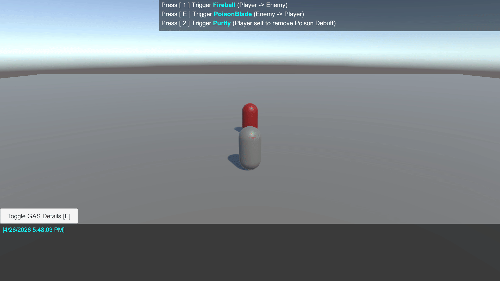
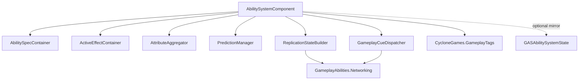
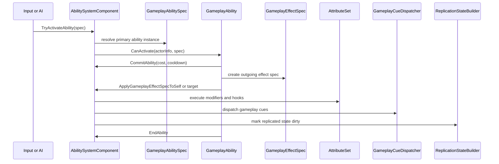

# CycloneGames.GameplayAbilities

[English](./README.md) | 简体中文

`CycloneGames.GameplayAbilities` 是一个受 Unreal Engine Gameplay Ability System 设计目标启发的 Unity Gameplay Ability 框架。它提供一套可复用基础能力，用于管理 ability、attribute、gameplay effect、gameplay tag、gameplay cue、prediction、replication state 和 Editor authoring。

该包面向动作 RPG、多人共斗、Roguelike 地牢刷怪、大型 Boss 战、局域网房间制游戏，以及其他需要数据驱动、可扩展、可观察并能承受较高运行时压力的战斗系统。

本文既是模块说明，也是上手教程。它解释什么是 GAS、为什么要使用这种架构、当前包如何组织，以及如何循序渐进地制作一个 gameplay ability。

## 示例预览与资源

- 示例项目: [https://github.com/MaiKuraki/UnityGameplayAbilitySystemSample](https://github.com/MaiKuraki/UnityGameplayAbilitySystemSample)
  - 

- 包内示例场景: [In-Package Smaple](./Samples)
  - 

## 目录

- [CycloneGames.GameplayAbilities](#cyclonegamesgameplayabilities)
  - [示例预览与资源](#示例预览与资源)
  - [目录](#目录)
  - [GAS 解决的问题](#gas-解决的问题)
  - [适用场景](#适用场景)
  - [程序集边界](#程序集边界)
  - [核心概念](#核心概念)
  - [运行时架构](#运行时架构)
  - [Unreal GAS 对照](#unreal-gas-对照)
  - [激活与 Effect 流程](#激活与-effect-流程)
  - [教程：制作一个最小 Ability](#教程制作一个最小-ability)
    - [步骤 1：定义 Tag 词汇](#步骤-1定义-tag-词汇)
    - [步骤 2：创建 AttributeSet](#步骤-2创建-attributeset)
    - [步骤 3：创建并持有 ASC](#步骤-3创建并持有-asc)
    - [步骤 4：定义 Effect](#步骤-4定义-effect)
    - [步骤 5：实现 Ability](#步骤-5实现-ability)
    - [步骤 6：授予并激活 Ability](#步骤-6授予并激活-ability)
  - [GameplayTags 使用指南](#gameplaytags-使用指南)
  - [ScriptableObject Authoring 工作流](#scriptableobject-authoring-工作流)
  - [Cost、Cooldown、Buff、Debuff 与 Passive](#costcooldownbuffdebuff-与-passive)
  - [AbilityTask](#abilitytask)
  - [Targeting 系统](#targeting-系统)
  - [Execution Calculation](#execution-calculation)
  - [DataTable 驱动数值调优](#datatable-驱动数值调优)
  - [GameplayCue](#gameplaycue)
  - [示例演练](#示例演练)
  - [网络](#网络)
  - [性能模型](#性能模型)
  - [线程策略](#线程策略)
  - [Editor 工具](#editor-工具)
  - [与其他 CycloneGames 模块集成](#与其他-cyclonegames-模块集成)
  - [持久化](#持久化)
  - [常见问题与故障排除](#常见问题与故障排除)
  - [依赖项](#依赖项)

## GAS 解决的问题

在小型游戏中，一个技能可以写成一个脚本：检查输入、扣 mana、进入 cooldown、播放 VFX、对目标造成伤害、刷新 UI。到了大型项目，这种写法很快会难以维护，因为每个功能都需要知道太多其他功能的细节。

GAS 将战斗拆成稳定概念：

| 概念 | 含义 |
| --- | --- |
| Ability | 可被授予、激活、阻塞、取消、预测和复制的玩法动作。例如 fireball、dodge、heal、combo attack、boss slam。 |
| Attribute | 由 actor 持有的数值型玩法状态。例如 health、mana、attack power、defense、movement speed。 |
| Gameplay Effect | 应用到 Ability System Component 的数据驱动变化。Effect 处理伤害、治疗、Buff、Debuff、Cooldown、Cost、周期伤害、Stack、Tag 和临时授予 Ability。 |
| Gameplay Tag | 描述状态和规则的层级标识符。例如 `State.Stunned`、`Ability.Fire.Fireball`、`Cooldown.Fireball`、`Damage.Type.Fire`。 |
| Gameplay Cue | 与 gameplay state 绑定的表现事件。Cue 驱动 VFX、SFX、camera shake、hit reaction 等表现层行为，但不拥有玩法权威。 |
| Prediction | 客户端临时执行，用于保持本地操作响应，同时服务端仍保持权威。 |
| Replication State | 可跨网络发送或用于 full-state recovery 的紧凑 gameplay change 表示。 |

Unreal Engine 的 GAS 将这套模型推广到生产项目中，因为它能让战斗规则保持可组合。Stun effect 可以通过 tag 阻塞 ability。Cooldown 可以表示为一个授予 cooldown tag 的 duration effect。Damage-over-time debuff 可以表示为一个带 period 的 duration effect。Passive aura 可以表示为一个 infinite effect，用来授予 tag 或 ability。这些场景都走同一套 runtime pipeline。

CycloneGames 将这些思想适配到 Unity：

- Unity authoring data 使用 `ScriptableObject` asset 表示。
- Runtime state 存放在由 `AbilitySystemComponent` 拥有的 C# object 中。
- Core state contract 尽可能保持不依赖 Unity。
- 可选网络由 `CycloneGames.GameplayAbilities.Networking` 实现。
- 项目级可选集成应放在 integration assembly 中，不反向污染 core runtime。

| 关注点 | 传统 Skill Manager | GAS-style 架构 |
| --- | --- | --- |
| Ability 内容 | 常硬编码在 character 或 controller script 中。 | Ability asset 和 runtime definition 可授予任何兼容 ASC。 |
| 状态管理 | Boolean flag 和手写 timer 分散在多个 script 中。 | Active gameplay effect 自己持有 duration、period、stack count、granted tag 和 removal。 |
| Ability 阻塞 | 每种状态组合都写自定义 `if` 分支。 | Tag 表达 activation requirement 和 block rule。 |
| Attribute 变化 | 多个系统直接写数值。 | Gameplay effect 通过统一 attribute pipeline 应用 modifier。 |
| VFX/SFX | Gameplay code 直接生成表现对象。 | Gameplay cue 将 presentation 与 authority 解耦。 |
| 多人网络 | 每个技能都需要自定义 replication 和 correction logic。 | Prediction key、effect spec、state delta 和 full-state recovery 共享同一模型。 |
| 扩展规模 | 新交互会增加系统耦合。 | 新内容通过 tag、effect、attribute 和 cue 组合。 |

## 适用场景

当项目需要以下能力时，适合使用本包：

- 大量 ability 共享 cost、cooldown、tag、target、effect 和 cue 规则。
- Buff 和 Debuff 需要 stack、expire、periodic tick、grant tag 或 grant ability。
- 清晰分离 gameplay authority 和 presentation。
- 面向策划的可调数据资产，以及面向程序的扩展点。
- 面向多人游戏的 state contract 和 deterministic-friendly raw fixed value。
- 对 Unreal GAS 熟悉的开发者能快速理解的框架风格。

不建议为了单次脚本事件、简单 UI 动作，或完全不需要 attribute、effect、tag、prediction、replication 的系统引入完整 GAS 层。

## 程序集边界

| Assembly | 职责 |
| --- | --- |
| `CycloneGames.GameplayAbilities.Core` | 不依赖 Unity 的 deterministic state、prediction key、replication DTO、definition registry、service interface 和 fixed-value 逻辑。 |
| `CycloneGames.GameplayAbilities.Runtime` | Unity-facing ability runtime、`AbilitySystemComponent`、ScriptableObject bridge、target data、gameplay cue、object pool、runtime diagnostics 和 runtime debug overlay。 |
| `CycloneGames.GameplayAbilities.Runtime.Integrations.DataTable` | 从 `CycloneGames.DataTable` 行数据到 GAS modifier magnitude 和 attribute initialization 的可选桥接层。由 `CYCLONEGAMES_HAS_DATA_TABLE` 启用。 |
| `CycloneGames.GameplayAbilities.Editor` | Editor inspector、debug window、property drawer、menu item 和 authoring validation。 |
| `CycloneGames.GameplayAbilities.Tests.Editor` | 面向 deterministic state、runtime lifecycle、pooling 和 regression behavior 的 EditMode 测试。 |

Core assembly 必须保持无 `UnityEngine` 和 `UnityEditor` 引用。Unity-facing 行为应放在 Runtime、Editor、Samples 或 integration assembly。

## 核心概念

| 类型 | 职责 |
| --- | --- |
| `AbilitySystemComponent` | 运行时 ability state 的主 facade 和 owner。它授予 ability、持有 attribute、应用 effect、追踪 tag、管理 prediction、tick effect，并暴露 replication capture API。 |
| `GameplayAbility` | 单个动作的 runtime definition 和执行逻辑。通过重写 `ActivateAbility`、`CanActivate`、`InputPressed`、`InputReleased` 和 `CancelAbility` 实现自定义行为。 |
| `GameplayAbilitySO` | Unity authoring asset，用于创建和初始化 runtime `GameplayAbility`。 |
| `GameplayAbilitySpec` | 一个 ASC 上已授予的 ability。它保存 level、handle、active state、owning ASC、granted-by-effect 关系，以及需要时的 stateful ability instance。 |
| `AttributeSet` | 一组相关 `GameplayAttribute`，并承载 clamp、meta attribute 和 post-effect 逻辑。 |
| `GameplayAttribute` | 带 name 的数值，包含 base value 和 current value。数值也以 raw fixed value 保存，用于 deterministic-friendly 路径。 |
| `GameplayEffect` | Instant、duration 或 infinite effect 的 runtime definition。它描述 modifier、tag、stacking、granted ability、cue、custom requirement 和 overflow behavior。 |
| `GameplayEffectSO` | Unity authoring asset，用于创建 runtime `GameplayEffect`。 |
| `GameplayEffectSpec` | 一次 effect application 的 runtime instance。它捕获 source、target、context、level、duration、modifier magnitude、dynamic tag 和 SetByCaller magnitude。 |
| `ActiveGameplayEffect` | 当前已经应用在 ASC 上的 live effect。它拥有 remaining time、period、stack count、granted tag 和 runtime bookkeeping。 |
| `AbilityTask` | 由 active ability 拥有的池化 latent operation。用于等待、targeting、delay 和其他多帧 ability 行为。 |
| `GameplayCueManager` / `GameplayCueDispatcher` | Service-backed cue routing，用于由 gameplay state 驱动 presentation event。 |

## 运行时架构

`AbilitySystemComponent` 保持 public entry point，延续 Unreal GAS 熟悉的使用方式。内部状态所有权拆分到专用协作者中，避免所有热路径 bookkeeping 都堆在一个超大类里。

| 协作者 | 职责 |
| --- | --- |
| `AbilitySpecContainer` | 已授予的 ability spec、spec handle index、ticking spec，以及由 active effect 授予的 ability。 |
| `ActiveEffectContainer` | Active gameplay effect、network id lookup、stacking index、granted tag index，以及 ability-applied effect tracking。 |
| `AttributeAggregator` | Attribute set、registered attribute，以及 dirty attribute aggregation queue。 |
| `PredictionManager` | Prediction window、window index、pending predicted effect、local input sequence、dependent-window lookup、timeout selection，以及 closed prediction transaction history。 |
| `ReplicationStateBuilder` | Dirty replicated state、state version、tag delta folding、delta capture lifecycle、removed effect id、removed ability definition 和 scratch array。 |
| `GameplayCueDispatcher` | Local gameplay cue dispatch、prediction cue accounting，以及 server-side cue broadcast routing。 |


```mermaid
flowchart TB
    ASC["AbilitySystemComponent"]
    Specs["AbilitySpecContainer"]
    Effects["ActiveEffectContainer"]
    Attrs["AttributeAggregator"]
    Prediction["PredictionManager"]
    Replication["ReplicationStateBuilder"]
    Cues["GameplayCueDispatcher"]
    Tags["CycloneGames.GameplayTags"]
    Core["GASAbilitySystemState"]
    Network["GameplayAbilities.Networking"]

    ASC --> Specs
    ASC --> Effects
    ASC --> Attrs
    ASC --> Prediction
    ASC --> Replication
    ASC --> Cues
    ASC --> Tags
    ASC -. optional mirror .-> Core
    Replication --> Network
    Cues --> Network
```

`AbilitySystemComponent` 拥有 Unity gameplay runtime 的唯一真相源。`GASAbilitySystemState` 是可选的 Unity-free mirror，用于 deterministic diagnostics、snapshot capture、checksum validation 和纯 C# simulation tooling。不要把两套 graph 当作彼此独立的可变状态。Runtime gameplay 代码应只通过 ASC API 修改状态；Core-only simulation 应直接使用 `GASAbilitySystemState` 和 `GASAbilitySystemFacade`，不需要构造 ASC。

| 模式 | 适用场景 | Runtime 行为 |
| --- | --- | --- |
| `GASCoreStateMode.MirrorRuntime` | 默认兼容模式、deterministic validation、tooling、checksum capture 和 migration testing。 | ASC 写入 runtime graph，并把已支持的 grant、attribute、active effect 和 prediction data mirror 到 Core state。 |
| `GASCoreStateMode.RuntimeOnly` | 高密度 gameplay actor、低端客户端、纯表现客户端，以及不需要为每个 ASC 启用 Core diagnostics 的 server shard。 | ASC 只保留 runtime graph。`TryGetCoreState`、`TryGetCoreFacade` 和 `TryGetCoreSpecHandle` 返回 `false`；`CoreState` 和 `Core` 不可用。 |

```csharp
AbilitySystemComponent mirroredAsc = new AbilitySystemComponent(
    new GameplayEffectContextFactory());

AbilitySystemComponent runtimeOnlyAsc = new AbilitySystemComponent(
    new GameplayEffectContextFactory(),
    GASAbilitySystemRuntimeOptions.RuntimeOnly);
```

当前 collaborator split 已经接管最容易出错的 list、dictionary、prediction 和 replication bookkeeping：ability grant/removal、ticking spec 成员关系、effect swap-back removal、network id lookup、stacking lookup、granted tag lookup、ability-applied effect cleanup、prediction window index、pending predicted effect removal、closed prediction record、replicated dirty flag、removed id tracking、tag edge folding、state version advancement 和 delta capture cleanup。

`AbilitySystemComponent` 仍然负责协调 gameplay policy、activation decision、rollback side effect、event、高层 network send decision 和 attribute side effect。后续迁移应继续以小步、可验证的方式推进。

## Unreal GAS 对照

| Unreal GAS 概念 | CycloneGames 概念 |
| --- | --- |
| `UAbilitySystemComponent` | `AbilitySystemComponent` facade |
| `FGameplayAbilitySpecContainer` | `AbilitySpecContainer` |
| `FActiveGameplayEffectsContainer` | `ActiveEffectContainer` |
| `FScopedPredictionWindow` | `GASPredictionScope` 和 `PredictionManager` |
| `UGameplayAbility` | `GameplayAbility` 和 `GameplayAbilitySO` |
| `UGameplayEffect` | `GameplayEffect` 和 `GameplayEffectSO` |
| `FGameplayEffectSpec` | `GameplayEffectSpec` |
| `FActiveGameplayEffect` | `ActiveGameplayEffect` |
| `FGameplayTagContainer` | `CycloneGames.GameplayTags.Core.GameplayTagContainer` |
| Gameplay cue notify routing | `GameplayCueManager` 和 `GameplayCueDispatcher` |
| Fast array replication 和 RPC state | `ReplicationStateBuilder`、`GASAbilitySystemStateDeltaBuffer` 和 networking package |

本包保留有助于 Unreal GAS 开发者快速迁移的词汇，但不会复制 Unreal 的 UObject 模型。Unity asset、纯 C# runtime object 和 Unity-free core contract 保持分离。

## 激活与 Effect 流程


```mermaid
sequenceDiagram
    participant Input as Input or AI
    participant ASC as AbilitySystemComponent
    participant Spec as GameplayAbilitySpec
    participant Ability as GameplayAbility
    participant Effect as GameplayEffectSpec
    participant Attr as AttributeSet
    participant Cue as GameplayCueDispatcher
    participant Net as ReplicationStateBuilder

    Input->>ASC: TryActivateAbility(spec)
    ASC->>Spec: resolve primary ability instance
    ASC->>Ability: CanActivate(actorInfo, spec)
    Ability->>ASC: CommitAbility(cost, cooldown)
    Ability->>Effect: create outgoing effect spec
    Ability->>ASC: ApplyGameplayEffectSpecToSelf or target
    ASC->>Attr: execute modifiers and hooks
    ASC->>Cue: dispatch gameplay cues
    ASC->>Net: mark replicated state dirty
    Ability->>ASC: EndAbility
```

典型 activation sequence：

1. 通过 `AbilitySystemComponent.GrantAbility` 授予 ability。
2. `AbilitySpecContainer` 保存 `GameplayAbilitySpec`，并按 handle 建立索引。
3. `TryActivateAbility` 校验 tag、cost、cooldown、prediction policy、authority policy 和 ability block rule。
4. `GameplayAbility.ActivateAbility` commit cost 和 cooldown，创建 task，并应用 effect。
5. `ActiveEffectContainer` 追踪 active effect、stacking、granted tag、network id 和 ability-applied effect cleanup。
6. `AttributeAggregator` 使用 additive、multiplicative、division 和 override aggregation 重算 dirty attribute。
7. `PredictionManager` 追踪 prediction window 和 predicted side effect。
8. `GameplayCueDispatcher` 在本地和配置的 network bridge 上发出 cue event。
9. `ReplicationStateBuilder` 记录 dirty state，并 capture delta 用于 replication 或 full-state recovery。

## 教程：制作一个最小 Ability

本教程使用 runtime C# 示例，因为它更适合在文档中阅读。生产项目通常会把同样的 runtime class 与 `GameplayAbilitySO`、`GameplayEffectSO` asset 组合起来，让策划在 Inspector 中配置数据。

### 步骤 1：定义 Tag 词汇

Gameplay tag 是 GAS 的规则语言。Tag 名称应稳定，并在代码、资产、网络 registry 和调试工具之间保持一致。

推荐命名方式：

```text
Ability.Fire.Fireball
Cooldown.Fireball
Cost.Mana
Damage.Type.Fire
GameplayCue.Fireball.Impact
State.Stunned
State.Dead
Data.DamageMultiplier
Attribute.Health
Attribute.Mana
```

Runtime 代码可以从 `CycloneGames.GameplayTags` 请求 tag：

```csharp
using CycloneGames.GameplayTags.Core;

public static class CombatTags
{
    public static readonly GameplayTag CooldownFireball =
        GameplayTagManager.RequestTag("Cooldown.Fireball");

    public static readonly GameplayTag DamageTypeFire =
        GameplayTagManager.RequestTag("Damage.Type.Fire");

    public static readonly GameplayTag DataDamageMultiplier =
        GameplayTagManager.RequestTag("Data.DamageMultiplier");
}
```

Tag 用来表达规则，不用来保存可变数值。Health、mana、attack power、defense 应放在 attribute 中。

### 步骤 2：创建 AttributeSet

`AttributeSet` 负责组织 attribute，并持有 attribute-specific rule，例如 clamp 和 meta attribute 处理。

```csharp
using CycloneGames.GameplayAbilities.Runtime;

public sealed class CombatAttributeSet : AttributeSet
{
    public GameplayAttribute Health { get; } = new GameplayAttribute("Health");
    public GameplayAttribute MaxHealth { get; } = new GameplayAttribute("MaxHealth");
    public GameplayAttribute Mana { get; } = new GameplayAttribute("Mana");
    public GameplayAttribute MaxMana { get; } = new GameplayAttribute("MaxMana");
    public GameplayAttribute Damage { get; } = new GameplayAttribute("Damage");

    public CombatAttributeSet()
    {
        Health.SetBaseValue(100f);
        Health.SetCurrentValue(100f);
        MaxHealth.SetBaseValue(100f);
        MaxHealth.SetCurrentValue(100f);
        Mana.SetBaseValue(50f);
        Mana.SetCurrentValue(50f);
        MaxMana.SetBaseValue(50f);
        MaxMana.SetCurrentValue(50f);
    }

    public override void PreAttributeChange(GameplayAttribute attribute, ref GASFixedValue newValue)
    {
        if (attribute == Health)
        {
            newValue = GASFixedValue.Clamp(newValue, GASFixedValue.Zero, MaxHealth.CurrentFixedValue);
        }
        else if (attribute == Mana)
        {
            newValue = GASFixedValue.Clamp(newValue, GASFixedValue.Zero, MaxMana.CurrentFixedValue);
        }
    }

    protected override bool PreProcessInstantEffect(GameplayEffectModCallbackData data)
    {
        GameplayAttribute attribute = GetAttribute(data.Modifier.AttributeName);
        if (attribute != Damage)
        {
            return false;
        }

        float currentHealth = Health.CurrentValue;
        float newHealth = System.Math.Max(0f, currentHealth - data.EvaluatedMagnitude);

        SetBaseValue(Health, newHealth);
        SetCurrentValue(Health, newHealth);
        return true;
    }
}
```

`Damage` 这类 meta attribute 适合承载中间值。目标可以在收到 damage 后结合 defense、shield、vulnerability、immunity 等规则换算成最终 health loss。

### 步骤 3：创建并持有 ASC

`AbilitySystemComponent` 是纯 runtime object。Unity `MonoBehaviour` 应只负责生命周期和场景引用，不承载复杂战斗规则。

```csharp
using CycloneGames.GameplayAbilities.Runtime;
using UnityEngine;

public sealed class CombatantAbilitySystem : MonoBehaviour
{
    public AbilitySystemComponent AbilitySystem { get; private set; }
    public CombatAttributeSet Attributes { get; private set; }

    private void Awake()
    {
        AbilitySystem = new AbilitySystemComponent(new GameplayEffectContextFactory());
        AbilitySystem.InitAbilityActorInfo(owner: this, avatar: gameObject);

        AbilitySystem.ReserveRuntimeCapacity(
            abilityCapacity: 16,
            attributeCapacity: 16,
            activeEffectCapacity: 64,
            predictionWindowCapacity: 8,
            coreModifierCapacity: 128,
            maxSetByCallerPerEffect: 8,
            targetDataObjectCapacity: 16);

        Attributes = new CombatAttributeSet();
        AbilitySystem.AddAttributeSet(Attributes);
    }

    private void Update()
    {
        AbilitySystem.Tick(Time.deltaTime, isServer: true);
    }

    private void OnDestroy()
    {
        AbilitySystem?.Dispose();
    }
}
```

如果项目使用 `CycloneGames.GameplayFramework`，可选 integration extension 可以从 `Actor` 初始化 actor info，同时保持 GameplayFramework core assembly 不依赖 GameplayAbilities。

### 步骤 4：定义 Effect

Effect 是 GAS 数据驱动能力的核心。

```csharp
using System.Collections.Generic;
using CycloneGames.GameplayAbilities.Runtime;
using CycloneGames.GameplayTags.Core;

public static class CombatEffects
{
    public static GameplayEffect CreateFireballDamage()
    {
        return new GameplayEffect(
            name: "GE_FireballDamage",
            durationPolicy: EDurationPolicy.Instant,
            modifiers: new List<ModifierInfo>
            {
                new ModifierInfo("Damage", EAttributeModifierOperation.Add, new ScalableFloat(35f, 5f))
            },
            assetTags: CreateContainer(CombatTags.DamageTypeFire),
            gameplayCues: CreateContainer(
                GameplayTagManager.RequestTag("GameplayCue.Fireball.Impact")));
    }

    public static GameplayEffect CreateFireballCost()
    {
        return new GameplayEffect(
            name: "GE_Cost_Fireball",
            durationPolicy: EDurationPolicy.Instant,
            modifiers: new List<ModifierInfo>
            {
                new ModifierInfo("Mana", EAttributeModifierOperation.Add, new ScalableFloat(-10f))
            });
    }

    public static GameplayEffect CreateFireballCooldown()
    {
        return new GameplayEffect(
            name: "GE_Cooldown_Fireball",
            durationPolicy: EDurationPolicy.HasDuration,
            duration: 3f,
            grantedTags: CreateContainer(CombatTags.CooldownFireball));
    }

    private static GameplayTagContainer CreateContainer(GameplayTag tag)
    {
        var container = new GameplayTagContainer();
        container.AddTag(tag);
        return container;
    }
}
```

`Instant` effect 适合 damage、healing 和 cost。`HasDuration` effect 适合 timed buff、debuff 和 cooldown。`Infinite` effect 适合 passive、equipment bonus 和 aura，直到显式移除。

### 步骤 5：实现 Ability

Ability 持有 activation logic。它应通过 ASC pipeline commit cost/cooldown，再通过 effect spec 应用 effect。

```csharp
using CycloneGames.GameplayAbilities.Runtime;

public sealed class FireballAbility : GameplayAbility
{
    private readonly GameplayEffect _damageEffect;
    private readonly System.Func<AbilitySystemComponent> _targetResolver;

    public FireballAbility(GameplayEffect damageEffect, System.Func<AbilitySystemComponent> targetResolver)
    {
        _damageEffect = damageEffect;
        _targetResolver = targetResolver;
    }

    public override void ActivateAbility(
        GameplayAbilityActorInfo actorInfo,
        GameplayAbilitySpec spec,
        GameplayAbilityActivationInfo activationInfo)
    {
        CommitAbility(actorInfo, spec);

        AbilitySystemComponent target = _targetResolver?.Invoke();
        if (target != null && CanApplyToTarget(target))
        {
            GameplayEffectSpec damageSpec = MakeOutgoingGameplayEffectSpec(_damageEffect, spec.Level);
            damageSpec.SetSetByCallerMagnitude(CombatTags.DataDamageMultiplier, 1.0f);
            ApplyGameplayEffectSpecToTarget(damageSpec, target);
        }

        EndAbility();
    }

    public override GameplayAbility CreatePoolableInstance()
    {
        var ability = new FireballAbility(_damageEffect, _targetResolver);
        ability.Initialize(
            Name,
            InstancingPolicy,
            NetExecutionPolicy,
            CostEffectDefinition,
            CooldownEffectDefinition,
            AbilityTags,
            ActivationBlockedTags,
            ActivationRequiredTags,
            CancelAbilitiesWithTag,
            BlockAbilitiesWithTag);
        return ability;
    }
}
```

面向数据驱动 authoring 时，用 `GameplayAbilitySO` 包装 ability：

```csharp
using CycloneGames.GameplayAbilities.Runtime;
using UnityEngine;

[CreateAssetMenu(
    fileName = "GA_Fireball",
    menuName = "CycloneGames/GameplayAbilities/Ability/Fireball")]
public sealed class FireballAbilitySO : GameplayAbilitySO
{
    public GameplayEffectSO DamageEffect;

    public override GameplayAbility CreateAbility()
    {
        GameplayEffect damage = DamageEffect != null ? DamageEffect.GetGameplayEffect() : null;
        var ability = new FireballAbility(damage, targetResolver: null);
        InitializeAbility(ability);
        return ability;
    }
}
```

项目通常通过 ability task、targeting service、combat query，或项目专用 ability subclass 提供 target resolution。

### 步骤 6：授予并激活 Ability

```csharp
using CycloneGames.GameplayAbilities.Runtime;

public sealed class FireballGrantExample
{
    private readonly AbilitySystemComponent _asc;
    private readonly GameplayAbilitySO _fireballAsset;

    public FireballGrantExample(AbilitySystemComponent asc, GameplayAbilitySO fireballAsset)
    {
        _asc = asc;
        _fireballAsset = fireballAsset;
    }

    public GameplayAbilitySpec Grant()
    {
        GameplayAbility ability = _fireballAsset.CreateAbility();
        return _asc.GrantAbility(ability, level: 1);
    }

    public bool Activate(GameplayAbilitySpec spec)
    {
        return _asc.TryActivateAbility(spec);
    }
}
```

不要每帧创建新的 ability definition。应在 setup 阶段创建或加载 ability asset，然后在角色初始化、装备变化、passive effect 或 gameplay reward 中授予 ability。

## GameplayTags 使用指南

Tag 是独立系统之间通信的规则语言，可以避免硬引用。

| 用途 | 推荐 Tag 模式 |
| --- | --- |
| Ability identity | `Ability.Mage.Fireball`、`Ability.Hunter.Dash` |
| Cooldown ownership | `Cooldown.Fireball`、`Cooldown.Dash` |
| State blocking | `State.Stunned`、`State.Silenced`、`State.Rooted` |
| Damage typing | `Damage.Type.Fire`、`Damage.Type.Poison` |
| Cue routing | `GameplayCue.Fireball.Cast`、`GameplayCue.Fireball.Impact` |
| SetByCaller data | `Data.DamageMultiplier`、`Data.ChargeTime` |
| Gameplay event | `Event.Hit.Critical`、`Event.Kill`、`Event.Combo.WindowOpened` |

推荐规则：

- Boolean 和 categorical state 放在 tag 中。
- Numeric state 放在 attribute 或 SetByCaller magnitude 中。
- 使用 cooldown tag，不要自造 cooldown bool。
- 使用 `ActivationBlockedTags` 表达 stun、silence 等通用阻塞。
- 使用 `ActivationRequiredTags` 表达 form、weapon、stance 或 phase 要求。
- 使用 `TargetRequiredTags` 和 `TargetBlockedTags` 表达 target legality。
- 网络游戏中保持 tag 名称在不同 peer 上稳定。

## ScriptableObject Authoring 工作流

典型 authoring workflow：

1. 在项目使用的 `CycloneGames.GameplayTags` workflow 中创建或注册 gameplay tag。
2. 创建 `GameplayEffectSO` asset，用于 cost、cooldown、damage、healing、buff、debuff 和 passive。
3. 创建 `GameplayAbilitySO` asset，并引用这些 effect。
4. 为 presentation tag 创建 cue asset 或 cue handler。
5. 为 character、pawn、monster、boss 或 player state runtime object 添加 `AbilitySystemComponent` owner。
6. 添加一个或多个 `AttributeSet`。
7. 在 spawn、possession、equipment change 或 passive effect application 中授予 ability asset。
8. 通过 input、AI、gameplay event、tag change 或 scripted encounter 激活 ability。

需要行为逻辑时使用 runtime C# subclass。需要策划调参的数据放在 asset 中：name、tag、cost effect、cooldown effect、duration、stack limit、magnitude、cue tag 和 application requirement。

## Cost、Cooldown、Buff、Debuff 与 Passive

| 功能 | GAS 表示方式 |
| --- | --- |
| Mana 或 stamina cost | 带负资源 modifier 的 instant gameplay effect。 |
| Cooldown | 授予 `Cooldown.*` tag 的 duration gameplay effect。 |
| 临时 Buff | 带 modifier 和 granted tag 的 duration gameplay effect。 |
| 永久 Passive | Infinite gameplay effect；如果需要逻辑运行，也可以使用 `ActivateAbilityOnGranted` 的 ability。 |
| Damage over time | `Period > 0` 的 duration gameplay effect。 |
| Stun | 授予 `State.Stunned` 的 duration gameplay effect，然后 ability asset 使用 `ActivationBlockedTags`。 |
| 装备属性加成 | 装备时应用、卸下时移除的 infinite gameplay effect。 |
| 可叠加 Poison | 带 `GameplayEffectStacking` 的 duration gameplay effect。 |
| 临时授予技能 | 带 `GrantedAbilities` 的 duration 或 infinite effect。 |

这种统一表示是 GAS 能扩展的核心原因。Cooldown、poison、aura、equipment bonus 和 temporary skill grant 本质上都是不同数据配置的 effect。

## AbilityTask

`AbilityTask` 是本包的 latent ability operation 模型。当 ability 不能在一个方法调用中结束时使用 task：等待 target data、等待 input release、延迟 hit frame、追踪 channel duration，或监听 gameplay event。

当前 task 规则：

- 从 active ability 通过 `NewAbilityTask<T>()` 或 task-specific static factory 创建 task。
- 配置 delegate 和必需数据后调用 `Activate()`。
- 完成时调用 `EndTask()`。
- Owning ability 被取消时调用 `CancelTask()`。
- 重写 `OnDestroy()` 时清理 delegate 和 transient reference，然后调用 `base.OnDestroy()`。
- 只有确实需要每帧更新时才实现 `IAbilityTaskTick`。

使用 `AbilityTask_WaitTargetData` 的示例：

```csharp
using CycloneGames.GameplayAbilities.Runtime;

public sealed class TargetedStrikeAbility : GameplayAbility
{
    private readonly ITargetActor _targetActor;
    private readonly GameplayEffect _damageEffect;

    public TargetedStrikeAbility(ITargetActor targetActor, GameplayEffect damageEffect)
    {
        _targetActor = targetActor;
        _damageEffect = damageEffect;
    }

    public override void ActivateAbility(
        GameplayAbilityActorInfo actorInfo,
        GameplayAbilitySpec spec,
        GameplayAbilityActivationInfo activationInfo)
    {
        CommitAbility(actorInfo, spec);

        AbilityTask_WaitTargetData task =
            AbilityTask_WaitTargetData.WaitTargetData(this, _targetActor);

        task.OnValidData += data =>
        {
            if (data is not GameplayAbilityTargetData_ActorArray actorData)
            {
                EndAbility();
                return;
            }

            for (int i = 0; i < actorData.Actors.Count; i++)
            {
                if (actorData.Actors[i].TryGetComponent(out CombatantAbilitySystem target))
                {
                    ApplyGameplayEffectToTarget(_damageEffect, target.AbilitySystem, spec.Level);
                }
            }

            EndAbility();
        };

        task.OnCancelled += CancelAbility;
        task.Activate();
    }

    public override GameplayAbility CreatePoolableInstance()
    {
        var ability = new TargetedStrikeAbility(_targetActor, _damageEffect);
        ability.Initialize(
            Name,
            InstancingPolicy,
            NetExecutionPolicy,
            CostEffectDefinition,
            CooldownEffectDefinition,
            AbilityTags,
            ActivationBlockedTags,
            ActivationRequiredTags,
            CancelAbilitiesWithTag,
            BlockAbilitiesWithTag);
        return ability;
    }
}
```

Task 是池化对象。Task 结束后不要继续保留它的引用。

## Targeting 系统

Targeting 与 ability execution 明确分离。Ability 向 target actor 或 targeting service 请求 `TargetData`，不需要知道目标来自 raycast、sphere overlap、cone query、lock-on target、ground select，还是 server-side validation pass。

核心 targeting 类型：

| 类型 | 作用 |
| --- | --- |
| `ITargetActor` | Target acquisition contract。它配置 ability、开始 targeting、confirm、cancel，并清理自身。 |
| `AbilityTask_WaitTargetData` | 等待 `ITargetActor` 产出 `TargetData` 的 ability task。 |
| `TargetData` | Runtime target data base object，带 prediction 和 ability-spec stamp。 |
| `TargetDataNetworkData` | Target-data replication bridge 使用的 network-safe projection。 |
| `IGASTargetDataNetworkBridge` | Predicted target-data RPC 的可选 bridge contract。 |

`Samples/Scripts/TargetActor/` 下提供 line trace、sphere overlap 和 cone trace 示例。生产项目应替换为自己的 targeting service，用于处理 team、layer、server authority、lag compensation、hit validation 和项目碰撞规则。

## Execution Calculation

简单 effect 使用带 `ScalableFloat` 的 `ModifierInfo`。复杂战斗公式应放在 `GameplayEffectExecutionCalculation`。

以下情况适合使用 execution calculation：

- 最终伤害依赖 attack power、defense、elemental resistance、level 和 critical state。
- Boss shield damage 随 phase 缩放。
- Healing 被 debuff 削弱。
- Poison damage snapshot source attack，但 live 读取 target resistance。

Execution asset 通过 `GameplayEffectExecutionCalculationSO` 作为 Unity authoring bridge：

```csharp
using System.Collections.Generic;
using CycloneGames.GameplayAbilities.Runtime;
using UnityEngine;

[CreateAssetMenu(
    fileName = "Exec_Damage",
    menuName = "CycloneGames/GameplayAbilities/Execution/Damage")]
public sealed class DamageExecutionSO : GameplayEffectExecutionCalculationSO
{
    public override GameplayEffectExecutionCalculation CreateExecution()
    {
        return new DamageExecution();
    }
}

public sealed class DamageExecution : GameplayEffectExecutionCalculation
{
    public override void Execute(GameplayEffectSpec spec, ref List<ModifierInfo> executionOutput)
    {
        float damage = spec.GetSetByCallerMagnitude(
            CombatTags.DataDamageMultiplier,
            warnIfNotFound: false,
            defaultValue: 1f) * 25f;

        executionOutput.Add(
            new ModifierInfo("Damage", EAttributeModifierOperation.Add, new ScalableFloat(damage)));
    }
}
```

多人游戏中，复杂 execution calculation 应在 authority path 上运行，除非每个 peer 都能获得完全相同的输入和 deterministic math。

## DataTable 驱动数值调优

当大量数值由策划维护时，使用 `CycloneGames.DataTable`：level curve、ability damage table、monster stat、Boss phase value、resistance table、upgrade cost、职业初始 attribute 等。`GameplayAbilitySO`、`GameplayEffectSO`、tag 和 cue 继续负责 Unity 内可发现的玩法身份、规则和表现绑定。这样可以让 Excel/Luban 管理批量平衡数据，同时保留 GAS asset 的 authoring 入口。

集成程序集位于：

```text
Runtime/Integrations/DataTable/
CycloneGames.GameplayAbilities.Runtime.Integrations.DataTable
```

编译条件：

| 导入模式 | 行为 |
| --- | --- |
| 只导入 `GameplayAbilities`，不导入 `DataTable` | GameplayAbilities core assembly 正常编译；DataTable integration assembly 和专项测试被跳过。 |
| 两个包都通过 UPM 导入 | integration asmdef 通过 `com.cyclone-games.data-table` 的 `versionDefines` 自动定义 `CYCLONEGAMES_HAS_DATA_TABLE`。 |
| 两个包都放在 `Assets/ThirdParty` 下 | Unity 不读取嵌套 `package.json` 的 dependency metadata。若本地 DataTable 包需要启用该集成，项目必须通过可见 build configuration 定义 `CYCLONEGAMES_HAS_DATA_TABLE`。 |

不要把 DataTable reference 加进 core runtime。所有 DataTable 相关代码必须留在 integration assembly，或放在显式同时依赖两个模块的项目 assembly 中。

核心类型：

| 类型 | 作用 |
| --- | --- |
| `DataTableLevelValueProvider<TRow>` | 将 `IDataTable<TRow>` 或 `TryGet` delegate 转换为带 level 的 GAS 数值。 |
| `DataTableMagnitudeCalculation` | 基于 `IGASLevelValueProvider` 的 `GameplayModMagnitudeCalculation`。 |
| `DataTableModifierFactory` | 从表格行创建 `ModifierInfo`，避免 ability class 直接感知表格代码。 |
| `DataTableAttributeInitializer<TRow>` | 将策划配置的初始 attribute value 应用到 `AttributeSet`。 |

非生成表的示例行类型：

```csharp
using CycloneGames.DataTable;

public sealed class SkillMagnitudeRow : IDataRow
{
    public int Id { get; set; }
    public float BaseValue { get; set; }
    public float ScalePerLevel { get; set; }
}

public sealed class AttributeInitRow : IDataRow
{
    public int Id { get; set; }
    public string AttributeName { get; set; }
    public float BaseValue { get; set; }
    public float CurrentValue { get; set; }
}
```

从表格创建 level-scaled modifier：

```csharp
using CycloneGames.DataTable;
using CycloneGames.GameplayAbilities.Runtime;
using CycloneGames.GameplayAbilities.Runtime.Integrations.DataTable;

IDataTable<SkillMagnitudeRow> skillValues = DataTableRegistry.Get<DataTable<SkillMagnitudeRow>>();

ModifierInfo damageModifier = DataTableModifierFactory.CreateLinearModifier(
    skillValues,
    rowId: 1001,
    attributeName: "Damage",
    operation: EAttributeModifierOperation.Add,
    baseValueAccessor: row => row.BaseValue,
    scalingFactorAccessor: row => row.ScalePerLevel);
```

从策划表初始化 attribute：

```csharp
IDataTable<AttributeInitRow> startingAttributes = DataTableRegistry.Get<DataTable<AttributeInitRow>>();

var initializer = DataTableAttributeInitializer<AttributeInitRow>.FromTable(
    startingAttributes,
    attributeNameAccessor: row => row.AttributeName,
    baseValueAccessor: row => row.BaseValue,
    currentValueAccessor: row => row.CurrentValue);

initializer.ApplyAll(characterAttributes);
```

如果 Luban 生成表或项目自定义表没有实现 `IDataTable<TRow>`，把生成表的查询 API 包成同形状的 delegate：

```csharp
GASDataTableTryGetRow<SkillMagnitudeRow> tryGetSkillRow = projectSkillLookup.TryGetValue;

ModifierInfo bossPhaseDamage = DataTableModifierFactory.CreateEvaluatedModifier<SkillMagnitudeRow>(
    tryGetRow: tryGetSkillRow,
    rowId: 3007,
    attributeName: "Damage",
    operation: EAttributeModifierOperation.Add,
    valueEvaluator: (row, level, spec) => row.BaseValue * level + row.ScalePerLevel);
```

生产规则：

- 启动阶段加载并注册 DataTable 内容，然后缓存 table 或 provider 到 ability/effect factory。不要在每帧 ability 逻辑里调用 `DataTableRegistry.Get<T>()`。
- 表格注册后应视为 immutable。Runtime buff、cooldown、stack、prediction window 和临时战斗值属于 GAS runtime state，不应写回表格行。
- 多人游戏中，所有需要计算相同预测值的 peer 必须使用同一份表格构建。服务端权威路径应在进入房间时校验 table version、table hash 或 content bundle version。
- 网络复制稳定 id、level、SetByCaller value 和 authority state delta。不要信任客户端提交的 DataTable 派生 magnitude。
- 少量简单常量用 `ScalableFloat`；大规模策划数值矩阵用 DataTable；依赖多个 runtime attribute 或战斗规则的结果用 `GameplayEffectExecutionCalculation`。

## GameplayCue

Gameplay cue 是由 gameplay state 驱动的表现事件。Gameplay effect 表示“某个 cue 发生了”，cue system 决定播放什么视觉或音频反馈。

Cue 适合用于：

- Impact VFX 和 hit sound。
- Casting start 和 casting end presentation。
- Persistent aura loop。
- Buff 或 Debuff 的屏幕效果。
- Camera shake 和 controller feedback。

不要把 damage、healing、tag grant 或 authority decision 放入 cue code。Cue 应该可以在低端客户端上被 suppress、replay 或 skip，而不改变 gameplay result。

Cue 相关 runtime 类型：

| 类型 | 作用 |
| --- | --- |
| `GameplayCueSO` | Cue asset 的 ScriptableObject base。可重写 `OnExecutedAsync`、`OnActiveAsync` 或 `OnRemovedAsync`。 |
| `GameplayCueParameters` | Cue handler 使用的 runtime presentation context。 |
| `IGameplayCueHandler` | 可以按 tag 处理 cue event 的 runtime object。 |
| `IPersistentGameplayCue` | 创建并追踪 persistent instance 的可选 cue contract。 |
| `GameplayCueManager` | 将 cue tag 解析为 cue behavior 的 service。 |
| `GameplayCueDispatcher` | 负责 cue dispatch 和 prediction accounting 的 ASC collaborator。 |

One-shot cue 示例：

```csharp
using Cysharp.Threading.Tasks;
using CycloneGames.GameplayAbilities.Runtime;
using UnityEngine;

[CreateAssetMenu(
    fileName = "GC_FireballImpact",
    menuName = "CycloneGames/GameplayAbilities/Cue/Fireball Impact")]
public sealed class FireballImpactCueSO : GameplayCueSO
{
    public GameObject Prefab;

    public override UniTask OnExecutedAsync(
        GameplayCueParameters parameters,
        IGameObjectPoolManager poolManager)
    {
        if (Prefab != null && parameters.TargetObject != null)
        {
            UnityEngine.Object.Instantiate(
                Prefab,
                parameters.TargetObject.transform.position,
                Quaternion.identity);
        }

        return UniTask.CompletedTask;
    }
}
```

生产 cue code 应使用项目 pooling 和 asset loading service，不要在热路径直接实例化。

## 示例演练

本包在 `Samples/` 下提供可运行 sample project。该目录在当前仓库中保持可见，以支持直接 `Assets/ThirdParty` 使用；`package.json` 也通过 `samples` entry 暴露该目录，供 package workflow 使用。

打开 `Samples/SampleScene.unity`，点击 Play，并按照 `Samples/README.SCH.md` 中的按键说明运行。示例场景使用 Player 和 Enemy prefab、预配置 ability/effect asset、sample tag、target actor、GameplayCue 示例和一个小型 UI logger。

| Sample | 演示内容 |
| --- | --- |
| `CharacterAttributeSet` | Primary、secondary 和 meta attribute；clamping；damage conversion；experience hook。 |
| `GA_Fireball_SO` | 应用 instant damage 和 burn debuff 的 ability asset。 |
| `GA_PoisonBlade_SO` | Ability-driven debuff application。 |
| `GA_ShieldOfLight_SO` | Defensive buff pattern。 |
| `GA_Berserk_SO` | Self-buff style ability。 |
| `GA_Purify_SO` | 按 tag 移除 effect。 |
| `GA_ArmorStack_SO` | Stack behavior 和 stack debugging。 |
| `ExecCalc_Burn` 和 `ExecCalcSO_Burn` | Runtime execution calculation 和 ScriptableObject execution bridge。 |
| `AbilityTask_WaitTargetData_SpawnedActor` | Target actor 与 target-data task 集成。 |
| `TargetActor/*` | Line trace、sphere overlap 和 cone trace targeting 示例。 |
| `GASPoolInitializer` | Sample scene 的 pool setup。 |
| `GASSampleTags` | Sample tag constant 和命名风格。 |
| `Integrate/Setup/GASManualSetup` | Manual non-DI cue manager startup pattern。 |
| `Integrate/Setup/GASServerSetup` | 使用 `NullGameplayCueManager` 的 server/headless startup pattern。 |
| `Integrate/DI/VContainer/GASLifetimeScope` | 可选 VContainer composition pattern，仅在 VContainer 存在时编译。 |

应将 sample 作为框架使用模式来阅读。进入生产前，把项目专用逻辑移动到自己的 assembly。

## 网络

本包拥有 transport-neutral state 和 runtime hook。独立的 `CycloneGames.GameplayAbilities.Networking` 包负责把这些 contract 接到 `CycloneGames.Networking`。

推荐多人模型：

- Effect、attribute、tag、ability grant 和 state delta 由服务端权威。
- 客户端 prediction 只用于本地响应。
- Full-state sync 用于 late join、reconnect 和 drift recovery。
- 私有 attribute 默认只发 owner，除非显式注册为 public observer attribute。
- Ability definition、effect definition、attribute、gameplay tag 和 ASC network id 必须来自稳定 registry。
- Interest management 放在 ASC 外部，让 room、team、owner、spectator 和 visibility system 先选择 observer，再 capture state。

对于高压力共斗游戏，GAS 只复制 gameplay state。Movement、animation state、monster AI perception、physics、room discovery 和 matchmaking 应由独立系统负责。

## 性能模型

运行时代码以预分配后的 low-GC 为目标。进入战斗前应显式 reserve capacity：

```csharp
asc.ReserveRuntimeCapacity(
    abilityCapacity: 64,
    attributeCapacity: 128,
    activeEffectCapacity: 512,
    predictionWindowCapacity: 64,
    coreModifierCapacity: 1024,
    maxSetByCallerPerEffect: 16,
    targetDataObjectCapacity: 128);

asc.PrewarmRuntimePools(
    grantedAbilitySpecLists: 32,
    abilityAppliedEffectLists: 32);
```

共享服务器模拟、大型 Boss 战和大量怪物房间应使用更高 capacity。容量 miss 可通过 `GetRuntimeDiagnostics()` 和 `GetRuntimeListPoolStatistics()` 观察。

按 actor class 或 simulation role 选择 Core state mode：

- 玩家角色、authority debugging、deterministic replay validation、QA build，以及需要 Core checksum 或 Core snapshot 的系统使用 `MirrorRuntime`。
- 大量简单怪物、projectile、临时 summon、cosmetic-only ASC，以及不需要为这些 actor 启用 Core diagnostics 的低端客户端使用 `RuntimeOnly`。
- 非 Unity deterministic simulation、rollback lab、CLI validation 或不需要 Unity-facing ability 与 ScriptableObject authoring 的 server-side tool，直接使用纯 `GASAbilitySystemState` 加 `GASAbilitySystemFacade`。

热路径规则：

- 战斗前预分配 ability、effect、attribute、prediction、SetByCaller、target data 和 pool capacity。
- 只有启用 Core mirroring 时，`coreModifierCapacity` 才会产生实际意义。
- 避免在战斗峰值中临时创建 ability、effect、target actor 和 cue asset。
- 变量幅度优先使用 `GameplayEffectSpec` SetByCaller value，而不是临时 runtime object。
- 领域计算放在 Core 或纯 runtime class 中，不放在 `MonoBehaviour` update loop。
- 需要确定性时，network payload 使用 id 和 raw fixed-value。
- 大型房间中使用 central tick owner 管理大量 ASC，不要把重逻辑散落到许多 behaviour 中。

## 线程策略

`AbilitySystemComponent` 由运行时线程拥有。模拟线程启动时调用 `BindRuntimeThreadToCurrent()`，并通过 `RuntimeThreadPolicy` 配置诊断：

```csharp
asc.RuntimeThreadPolicy = GASRuntimeThreadPolicy.Throw;
asc.BindRuntimeThreadToCurrent();
```

Unity-facing Runtime 代码默认应运行在 Unity 主线程。若纯 C# server simulation 拥有 ASC，必须避免 Unity object，并提供 deterministic time、random 和 registry service。

不要从多个线程同时修改同一个 ASC。如果 input、AI、networking 和 presentation 运行在不同线程，应使用 command queue 或明确的 simulation ownership。

## Editor 工具

该包包含 custom inspector、property drawer、debugger window、runtime overlay 和 validation-oriented UI，用于 ability/effect authoring 与 debugging。

推荐校验目标：

- 缺失 effect definition 或 ability definition。
- 一个 ASC 中重复注册 attribute。
- 无效 stack policy、duration、period、overflow effect 或 periodic setting。
- Gameplay cue tag 没有注册 cue handler。
- Runtime capacity 低于目标 combat profile。
- Network id 或 registry id 在不同 peer 上不稳定。
- Ability asset 引用了未在 tag database 中注册的 cost、cooldown 或 target tag。

可用的 Editor 入口：

```text
Tools > CycloneGames > GameplayAbilities > Debugger
Tools > CycloneGames > GameplayAbilities > Networking > Diagnostics
Tools > CycloneGames > GameplayAbilities > Networking > Run Diagnostics Check
```

菜单是否可见取决于当前项目导入了哪些 assembly。

## 与其他 CycloneGames 模块集成

| 模块 | 集成作用 |
| --- | --- |
| `CycloneGames.GameplayTags` | 为 tag container、tag requirement、cue tag、cooldown tag、state tag 和 event tag 提供基础能力。 |
| `CycloneGames.DataTable` | 可选 integration source，用于 Excel/Luban 驱动的 magnitude、attribute initialization 和大型数值平衡表。 |
| `CycloneGames.DeterministicMath` | 用于 deterministic-friendly fixed value 和 raw value conversion path。 |
| `CycloneGames.Hash` | 在 networking integration 中用于 stable checksum 和 network identity path。 |
| `CycloneGames.Factory` | 适合生成 cue presentation object、target actor、pooled projectile 和项目专用 gameplay object。 |
| `CycloneGames.GameplayFramework` | 可选 integration 将 framework actor 映射到 ability actor info，同时保持 core framework 独立。 |
| `CycloneGames.GameplayFramework.Networking` | 可将 actor 投影为 network id、owner、team、layer 和 interest position，用于 GAS replication planning。 |
| `CycloneGames.Networking` | 为 networking package 提供 transport-neutral messaging、replication planning、send budget、serializer 和 network diagnostics。 |

Cyclone package 可以放在 `Assets/ThirdParty` 下使用，也可以作为 UPM package 引入。必需依赖应通过 asmdef reference 表达。可选 integration 应隔离在 integration assembly 或 integration package 中；当 assembly 必须在缺依赖时自然消失时，使用正向 capability symbol。

DataTable bridge 使用 `CYCLONEGAMES_HAS_DATA_TABLE` 作为 capability symbol。UPM 导入时，如果安装了 `com.cyclone-games.data-table`，asmdef 的 `versionDefines` 会自动定义该 symbol。`Assets/ThirdParty` 本地包导入时，Unity 无法自动检测兄弟目录中的 `package.json`；希望启用本地 DataTable bridge 的项目必须在可见的项目构建配置中定义同名 symbol。若 symbol 不存在，该 bridge 和对应测试不会参与编译。

## 持久化

本包不会主动写 runtime save data。Runtime state、pool、prediction window 和 replication builder 都是创建方拥有的内存数据。

Authoring data 存在 Unity asset 中：

| 数据 | 位置 | 是否纳入版本控制 |
| --- | --- | --- |
| Ability definition | `GameplayAbilitySO` asset | 是 |
| Effect definition | `GameplayEffectSO` asset | 是 |
| Cue definition | `GameplayCueSO` asset | 是 |
| Editor diagnostics preset | 用户显式创建的 asset | 由项目决定 |

Runtime save game 应由单独 save service 实现，并包含 schema version、migration、integrity check、atomic write、corruption recovery 和平台存储策略。

## 常见问题与故障排除

| 现象 | 常见原因 | 修复方式 |
| --- | --- | --- |
| Ability 无法激活 | Blocked tag、缺少 required tag、cost 不足、cooldown 生效，或其他 active ability 通过 tag 阻塞。 | 检查 `CanActivate`、ability tag、cooldown granted tag 和 debugger output。 |
| Cost 没有扣除 | 未调用 `CommitAbility`，或 cost effect 没有有效 modifier。 | 在 ability outcome 被接受后调用一次 `CommitAbility`。确认 cost effect 修改的 attribute name 正确。 |
| Cooldown 永不结束 | Cooldown effect duration 或 tick ownership 配置错误。 | 使用 `EDurationPolicy.HasDuration`，设置正 duration，并在 authority simulation tick ASC。 |
| Damage 没有改变 Health | Effect 写入 meta attribute，但目标 `AttributeSet` 没有处理它。 | 为 meta attribute 实现 `PreProcessInstantEffect` 或 `PostGameplayEffectExecute`。 |
| Gameplay cue 不播放 | Cue tag 未注册、cue manager 未初始化，或 effect suppress cues。 | 检查 cue tag、cue manager setup 和 `SuppressGameplayCues`。 |
| Buff 没有叠加 | Stacking policy 为 `None`，或 source/target aggregation mode 与预期不符。 | 在 effect 上配置 `GameplayEffectStacking`。 |
| Late join 缺失状态 | Observer 存在前 delta capture 已被消费，或没有发送 full-state request。 | Capture 前先解析 observer，并对 late join 或 relevance 变化使用 full-state recovery。 |
| 战斗中产生分配 | 没有 reserve capacity、pool 未 warm，或 asset 按需创建。 | 调用 `ReserveRuntimeCapacity`、`PrewarmRuntimePools`，并在战斗前加载 asset。 |

## 依赖项

必需依赖由当前 asmdef 和 package metadata 表达。在当前分支中，GameplayAbilities runtime 使用：

| 依赖 | 作用 |
| --- | --- |
| `CycloneGames.GameplayTags` | Tag container、requirement、ability tag、effect tag、cue tag、cooldown tag 和 state tag。 |
| `CycloneGames.DeterministicMath` | Fixed-value 和 deterministic-friendly numeric path。 |
| `CycloneGames.Hash` | 相关 networking workflow 使用的 stable hash/checksum path。 |
| `CycloneGames.Factory` | 周边 Cyclone module 和 sample 使用的 factory contract 与 object creation support。 |
| `Cysharp UniTask` | Async cue 和 Unity-facing async operation。 |
| Unity Editor assemblies | Editor inspector、debug window、property drawer 和 asset authoring tool。 |

Optional integration 应放在 integration assembly 中。将 package 放在 `Assets/ThirdParty` 下的项目，不应只依赖 UPM `versionDefines`；通过 UPM 引入 package 的项目，可以使用 integration package 或 asmdef-level condition 表达 optional relationship。

可选 integration 依赖：

| 依赖 | Capability Symbol | Assembly |
| --- | --- | --- |
| `CycloneGames.DataTable` | `CYCLONEGAMES_HAS_DATA_TABLE` | `CycloneGames.GameplayAbilities.Runtime.Integrations.DataTable` |
