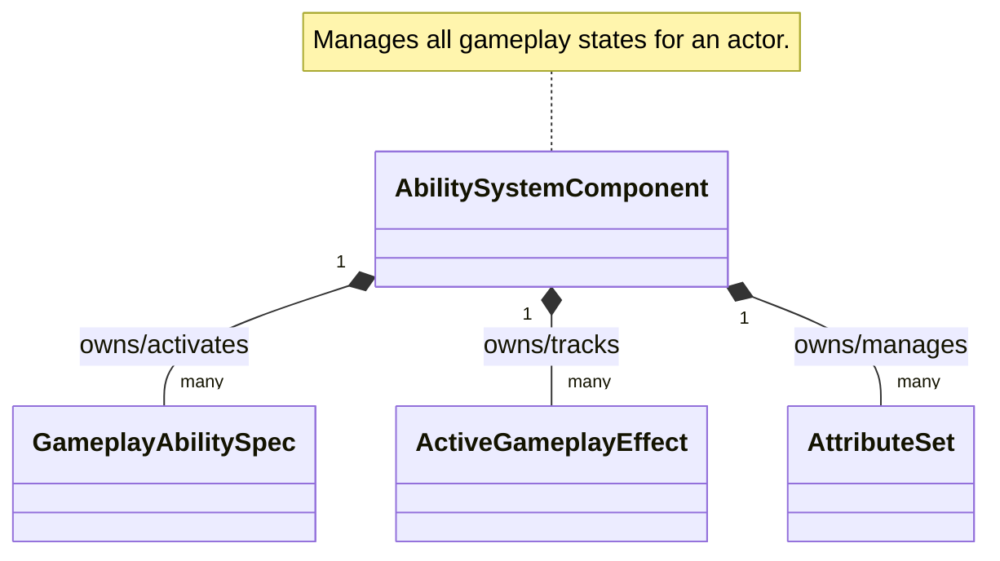
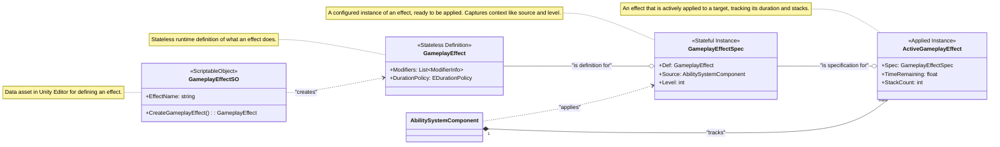
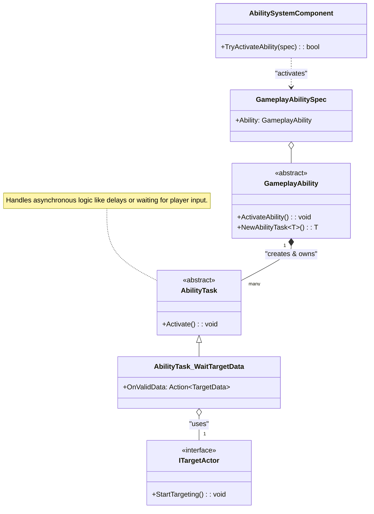
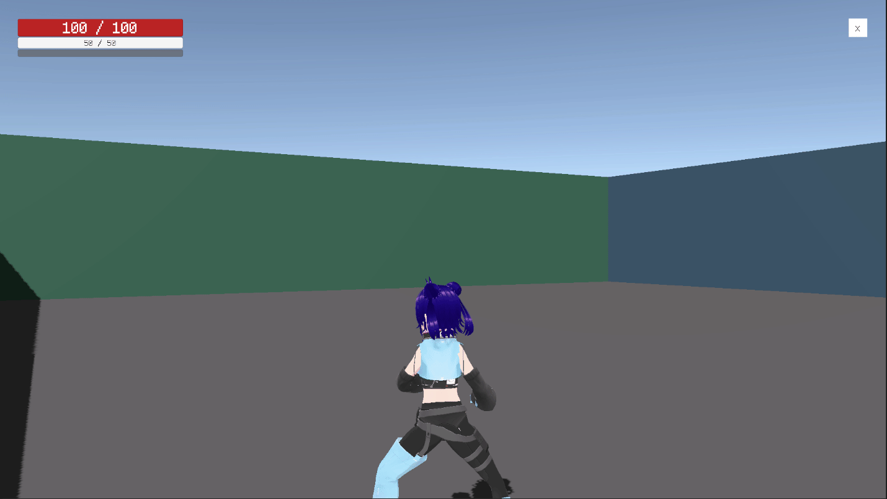
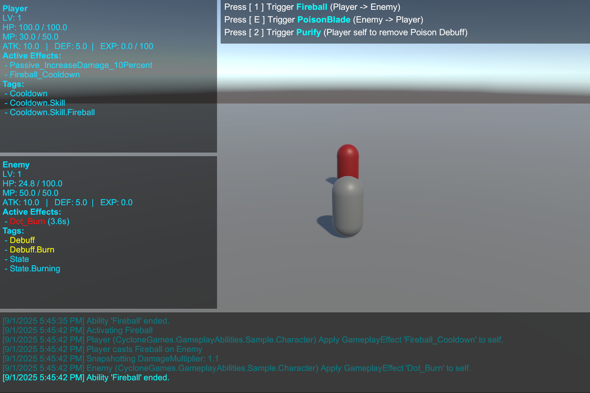

> **Note:** This document was written with AI assistance. If you are looking for absolute accuracy, please read the source code directly. Both the **source code** and the **examples** were written by the author.

[**English**] | [**简体中文**](README.SCH.md)

# CycloneGames.GameplayAbilities

A powerful, data-driven Gameplay Ability System for Unity, inspired by Unreal Engine's GAS.

---

## ✨ Key Features

| Feature                      | Description                                                       |
| ---------------------------- | ----------------------------------------------------------------- |
| 🎮 **Data-Driven Abilities** | Define abilities in ScriptableObjects, no code changes needed     |
| ⚡ **GameplayEffects**       | Instant/Duration/Infinite effects with stacking & periodic ticks  |
| 🏷️ **Tag-Based System**      | Decouple logic with GameplayTags for abilities, states, cooldowns |
| 🎯 **Targeting System**      | Built-in sphere overlap, line trace, and ground select actors     |
| 📊 **AttributeSets**         | Flexible character stats with validation hooks                    |
| 🎨 **GameplayCues**          | Separate VFX/SFX from gameplay logic                              |
| ⏱️ **AbilityTasks**          | Async ability logic (delays, targeting, animations)               |
| 🔄 **Object Pooling**        | Zero-GC operation with automatic pooling                          |

---

## 📚 Table of Contents

### Getting Started

1. [Why GAS?](#the-gas-philosophy-a-paradigm-shift-for-skill-systems) — Traditional vs GAS approach
2. [Architecture](#architecture-deep-dive) — Core component diagrams
3. [Quick Start](#comprehensive-quick-start-guide) — Build a Heal ability from scratch

### Core Concepts

4. [GameplayTags](#gameplay-tags) — Universal language of GAS
5. [GameplayEffects](#gameplay-effects) — Modifiers, duration, stacking
6. [AttributeSets](#attribute-sets) — Character stats system
7. [Ability Lifecycle](#ability-lifecycle) — Grant → Activate → Commit → End

### Advanced Features

8. [AbilityTasks](#abilitytasks) — Async operations in abilities
9. [Targeting System](#targeting-system-overview) — Find and select targets
10. [GameplayCues](#gameplaycue-system) — VFX/SFX management
11. [Execution Calculations](#execution-calculations) — Complex damage formulas

### Reference

12. [Samples Walkthrough](#sample-walkthrough) — Fireball, Purify, Leveling
13. [FAQ](#frequently-asked-questions-faq) — Common questions answered
14. [Troubleshooting](#troubleshooting-guide) — Debug checklist
15. [Performance](#performance-optimization) — Zero-GC tips

---

## The GAS Philosophy: A Paradigm Shift for Skill Systems

Before diving into the technical details, it's crucial to understand _why_ a system like GAS exists and how it fundamentally differs from traditional approaches.

### The Trouble with Traditional Systems

In many projects, ability logic starts simple but quickly spirals out of control. A typical evolution of problems looks like this:

1.  **Hard-coded Abilities:** A `PlayerController` has a function like `UseFireball()`. This is simple, but what if an enemy needs to use it? You copy the code. What if a trap needs to use it? You copy it again. The logic is tightly coupled to the character.
2.  **The "God" Controller:** To manage complexity, developers create a monolithic `SkillManager` or expand the `PlayerController` to handle every skill, buff, and interaction. This class becomes a massive state machine, full of boolean flags (`isStunned`, `isPoisoned`, `isBurning`), timers in `Update()`, and long `switch` or `if/else` chains. It becomes fragile, difficult to debug, and a bottleneck for team collaboration.
3.  **Data & Logic Tangled:** Game designers want to tweak a skill's damage or duration. In traditional systems, this often means they have to venture into complex code files, risking the introduction of bugs. The data (`damage = 10`) is inseparable from the logic (`target.TakeDamage(damage)`).

This approach is not scalable. The number of potential interactions between skills and states grows exponentially, leading to what is commonly known as "spaghetti code."

### The GAS Solution: Abilities and Effects as Data

GAS solves these problems by treating abilities and effects not as functions, but as **data**. This is the core paradigm shift.

- **GameplayAbilities are Data Assets (`GameplayAbilitySO`):** An "ability" is a `ScriptableObject` that encapsulates its logic and links to other data assets that define its cost, cooldown, and effects. Your character doesn't know what "Fireball" is; it just knows it has an ability identified by a `GameplayTag`.
- **Status Effects are Data Assets (`GameplayEffectSO`):** A character is no longer just `isPoisoned`. Instead, they have an **active instance** of a "Poison" `GameplayEffect` asset. This asset _is_ the poison. It contains all relevant data: its duration, its periodic damage, the gameplay tags it applies (`Status.Debuff.Poison`), and even how it stacks with other poison effects. The system manages its entire lifecycle automatically.
- **Decoupling through Tags (`GameplayTag`):** Tags are the universal language of GAS. They are used to identify everything: abilities (`Ability.Skill.Fireball`), cooldowns (`Cooldown.Skill.Fireball`), status effects (`Status.Debuff.Poison`), character states (`State.Stunned`), and even damage types (`Damage.Type.Fire`). The system uses tags to ask questions like, "Does the ability owner have the `Cooldown.Skill.Fireball` tag?" or "Is the target immune to the `Damage.Type.Fire` tag?" This creates a powerful, decoupled system where different parts can interact without direct references.

This data-centric approach empowers designers, promotes reusability, simplifies debugging (you inspect data assets, not complex call stacks), and creates a robust, scalable foundation for your game's mechanics.

### Comparison: Traditional vs. GAS

| Aspect                  | Traditional System (The "Pain Points")                                                                                                                 | CycloneGames.GameplayAbilities (The "Solution")                                                                                                                                                           |
| :---------------------- | :----------------------------------------------------------------------------------------------------------------------------------------------------- | :-------------------------------------------------------------------------------------------------------------------------------------------------------------------------------------------------------- |
| **Architecture**        | Monolithic (`PlayerController`, `SkillManager`) with hard-coded logic.                                                                                 | Decoupled components (`AbilitySystemComponent`) and data assets (`GameplayAbilitySO`).                                                                                                                    |
| **Data & Logic**        | **Tightly Coupled.** Skill logic (`UseFireball()`) and data (`damage = 10`) are mixed in the same C# file. Designers cannot safely balance the game.   | **Strictly Separated.** Data is stored in `ScriptableObject` assets (`GameplayAbilitySO`). Logic is in the runtime `GameplayAbility` class. Designers work with assets, programmers work with code.       |
| **State Management**    | **Manual & Fragile.** Relies on boolean flags (`isStunned`), manual timers in `Update()`, and complex state machines that are hard to debug and scale. | **Automated & Robust.** Status effects are self-contained `GameplayEffect` instances. The system automatically manages their duration, periodic application, and cleanup. State is an object, not a flag. |
| **Extensibility**       | **Invasive.** Adding a new skill or status effect often requires modifying multiple core classes, increasing the risk of regression bugs.              | **Modular.** Add a new ability by creating a new `GameplayAbilitySO` asset and its corresponding `GameplayAbility` class. No changes to existing code are needed.                                         |
| **Reusability**         | **Low.** A skill written for the Player must often be rewritten for an AI, as it's tied to the `PlayerController`.                                     | **High.** The same `GameplayAbilitySO` asset can be granted to any `AbilitySystemComponent`, whether it's on a player, an AI, or even a breakable barrel.                                                 |
| **Complexity Handling** | **Exponential.** As skills and effects are added, the number of `if/else` checks for interactions grows exponentially, leading to unmaintainable code. | **Linear & Tag-Driven.** Interactions are managed by `GameplayTags`. An ability checks "Do I have `Cooldown.Fireball`?" instead of `if (skillManager.fireball_cooldown > 0)`. This scales cleanly.        |

## Architecture Deep Dive

### Core Interaction Overview



### Gameplay Effect Lifecycle



### Ability Activation & Tasks



## Comprehensive Quick-Start Guide

This comprehensive guide will walk you through creating a complete "Heal" ability from scratch, step by step. By the end, you'll understand the core concepts and be ready to create your own abilities.

### Prerequisites

Before starting, ensure you have:

- Unity 2021.3 or later
- The `CycloneGames.GameplayAbilities` package installed
- All dependencies installed (`GameplayTags`, `Logger`, `AssetManagement`, `Factory`, `Service`)

### Step 1: Project Setup

**1.1 Create Folder Structure**

Organize your project with a clear folder structure. In your `Assets` folder, create:

```
Assets/
└── _Project/
    ├── Scripts/
    │   ├── Attributes/
    │   ├── Abilities/
    │   └── Characters/
    ├── Data/
    │   ├── Effects/
    │   └── Abilities/
    └── Prefabs/
```

This structure keeps your code organized and makes it easy to find assets later.

> **Note on Gameplay Tags**: The `CycloneGames.GameplayTags` system automatically registers tags at runtime. Tags can be defined in JSON files in `ProjectSettings/GameplayTags/` or through code attributes. When you use `GameplayTagManager.RequestTag("Ability.Action.Heal")`, it will automatically find and use the tag if it's been defined. You don't need to manually register tags in code.

### Step 2: Create the Attribute Set

The Attribute Set defines what stats your characters have. This is the foundation of your character system.

**2.1 Create PlayerAttributeSet.cs**

In `_Project/Scripts/Attributes/`, create `PlayerAttributeSet.cs`:

```csharp
// _Project/Scripts/Attributes/PlayerAttributeSet.cs
using CycloneGames.GameplayAbilities.Runtime;
using UnityEngine;

/// <summary>
/// Defines all attributes for a player character.
/// Attributes are the core stats that abilities and effects modify.
/// </summary>
public class PlayerAttributeSet : AttributeSet
{
    // Health attributes
    public readonly GameplayAttribute Health = new GameplayAttribute("Player.Attribute.Health");
    public readonly GameplayAttribute MaxHealth = new GameplayAttribute("Player.Attribute.MaxHealth");

    // Mana attributes
    public readonly GameplayAttribute Mana = new GameplayAttribute("Player.Attribute.Mana");
    public readonly GameplayAttribute MaxMana = new GameplayAttribute("Player.Attribute.MaxMana");

    /// <summary>
    /// Called before an attribute value changes. Use this to clamp values or apply constraints.
    /// </summary>
    public override void PreAttributeChange(GameplayAttribute attribute, ref float newValue)
    {
        // Clamp health between 0 and MaxHealth
        if (attribute.Name == "Player.Attribute.Health")
        {
            float maxHealth = GetCurrentValue(MaxHealth);
            newValue = Mathf.Clamp(newValue, 0, maxHealth);
        }

        // Clamp mana between 0 and MaxMana
        if (attribute.Name == "Player.Attribute.Mana")
        {
            float maxMana = GetCurrentValue(MaxMana);
            newValue = Mathf.Clamp(newValue, 0, maxMana);
        }
    }

    /// <summary>
    /// Called after an attribute value changes. Use this for side effects like death detection.
    /// </summary>
    public override void PostAttributeChange(GameplayAttribute attribute, float oldValue, float newValue)
    {
        // Example: Check for death when health reaches 0
        if (attribute.Name == "Player.Attribute.Health" && newValue <= 0 && oldValue > 0)
        {
            Debug.Log("Player has died!");
            // Trigger death logic here
        }
    }
}
```

**Key Points:**

- Attributes are defined as `readonly GameplayAttribute` fields
- Use `PreAttributeChange` to validate and clamp values
- Use `PostAttributeChange` for side effects like death detection
- Attribute names are strings - consider using constants or a centralized tag system

### Step 3: Create the Character Controller

The character controller initializes the Ability System Component and grants abilities to the character.

**3.1 Create PlayerCharacter.cs**

In `_Project/Scripts/Characters/`, create `PlayerCharacter.cs`:

```csharp
// _Project/Scripts/Characters/PlayerCharacter.cs
using CycloneGames.GameplayAbilities.Runtime;
using UnityEngine;

/// <summary>
/// Main character controller that manages the Ability System Component.
/// This component must be on the same GameObject as AbilitySystemComponentHolder.
/// </summary>
[RequireComponent(typeof(AbilitySystemComponentHolder))]
public class PlayerCharacter : MonoBehaviour
{
    [Header("Abilities")]
    [Tooltip("The heal ability asset to grant to this character.")]
    [SerializeField] private GameplayAbilitySO healAbilitySO;

    [Header("Initial Attributes")]
    [Tooltip("Initial attribute values applied on Start.")]
    [SerializeField] private float initialHealth = 100f;
    [SerializeField] private float initialMaxHealth = 100f;
    [SerializeField] private float initialMana = 50f;
    [SerializeField] private float initialMaxMana = 50f;

    // Component references
    private AbilitySystemComponentHolder ascHolder;
    private PlayerAttributeSet playerAttributes;

    void Awake()
    {
        // Get the Ability System Component Holder
        // This component wraps the AbilitySystemComponent and provides MonoBehaviour integration
        ascHolder = GetComponent<AbilitySystemComponentHolder>();

        if (ascHolder == null)
        {
            Debug.LogError("AbilitySystemComponentHolder not found! Add it to the GameObject.");
        }
    }

    void Start()
    {
        // CRITICAL: Initialize the Ability System Component
        // This tells the ASC who owns it (this script) and what the avatar is (this GameObject)
        ascHolder.AbilitySystemComponent.InitAbilityActorInfo(this, this.gameObject);

        // Create and add the Attribute Set
        // This is where all character stats are defined
        playerAttributes = new PlayerAttributeSet();
        ascHolder.AbilitySystemComponent.AddAttributeSet(playerAttributes);

        // Set initial attribute values
        SetInitialAttributes();

        // Grant abilities
        GrantInitialAbilities();
    }

    /// <summary>
    /// Sets the initial values for all attributes.
    /// </summary>
    private void SetInitialAttributes()
    {
        // Create a temporary effect to set initial values
        // This is a common pattern for initializing attributes
        var initialEffect = new GameplayEffect(
            "GE_InitialAttributes",
            EDurationPolicy.Instant, // Instant means it applies once and is done
            0, // No duration needed for instant
            0, // No period needed for instant
            new System.Collections.Generic.List<ModifierInfo>
            {
                new ModifierInfo(playerAttributes.MaxHealth, EAttributeModifierOperation.Override, initialMaxHealth),
                new ModifierInfo(playerAttributes.Health, EAttributeModifierOperation.Override, initialHealth),
                new ModifierInfo(playerAttributes.MaxMana, EAttributeModifierOperation.Override, initialMaxMana),
                new ModifierInfo(playerAttributes.Mana, EAttributeModifierOperation.Override, initialMana)
            }
        );

        var spec = GameplayEffectSpec.Create(initialEffect, ascHolder.AbilitySystemComponent);
        ascHolder.AbilitySystemComponent.ApplyGameplayEffectSpecToSelf(spec);
    }

    /// <summary>
    /// Grants all initial abilities to this character.
    /// </summary>
    private void GrantInitialAbilities()
    {
        if (healAbilitySO != null)
        {
            // Create the ability instance from the ScriptableObject
            var ability = healAbilitySO.CreateAbility();

            // Grant it to this character's Ability System Component
            ascHolder.AbilitySystemComponent.GrantAbility(ability);

            Debug.Log($"Granted ability: {healAbilitySO.AbilityName}");
        }
    }

    void Update()
    {
        // Example: Activate heal ability with 'H' key
        if (Input.GetKeyDown(KeyCode.H))
        {
            ActivateHealAbility();
        }
    }

    /// <summary>
    /// Finds and activates the heal ability by its tag.
    /// </summary>
    private void ActivateHealAbility()
    {
        // Get all activatable abilities
        var abilities = ascHolder.AbilitySystemComponent.GetActivatableAbilities();

        // Find the heal ability by its tag
        foreach (var spec in abilities)
        {
            // Check if this ability has the heal tag
            if (spec.Ability.AbilityTags.HasTag("Ability.Action.Heal"))
            {
                // Try to activate it
                bool success = ascHolder.AbilitySystemComponent.TryActivateAbility(spec);

                if (success)
                {
                    Debug.Log("Heal ability activated!");
                }
                else
                {
                    Debug.LogWarning("Failed to activate heal ability. Check cost, cooldown, or tag requirements.");
                }

                return; // Found and attempted activation, exit
            }
        }

        Debug.LogWarning("Heal ability not found. Make sure it's granted and has the correct tag.");
    }

    /// <summary>
    /// Helper method to get current health (useful for UI, etc.)
    /// </summary>
    public float GetCurrentHealth()
    {
        return playerAttributes?.GetCurrentValue(playerAttributes.Health) ?? 0f;
    }

    /// <summary>
    /// Helper method to get current mana (useful for UI, etc.)
    /// </summary>
    public float GetCurrentMana()
    {
        return playerAttributes?.GetCurrentValue(playerAttributes.Mana) ?? 0f;
    }
}
```

**Key Points:**

- Always call `InitAbilityActorInfo()` before using the ASC
- Create and add Attribute Sets before granting abilities
- Use `GrantAbility()` to give characters abilities
- Find abilities by their tags using `GetActivatableAbilities()`
- Use `TryActivateAbility()` to activate abilities (it checks cost, cooldown, etc. automatically)

### Step 4: Create the Heal Ability

Now we'll create the actual ability. An ability has two parts:

1. **Runtime Logic** (`HealAbility.cs`) - The code that runs when activated
2. **Data Asset** (`HealAbilitySO.cs`) - The ScriptableObject that designers configure

**4.1 Create the Runtime Logic**

In `_Project/Scripts/Abilities/`, create `HealAbility.cs`:

```csharp
// _Project/Scripts/Abilities/HealAbility.cs
using CycloneGames.GameplayAbilities.Runtime;
using CycloneGames.Logger;

/// <summary>
/// A simple instant heal ability that restores health to the caster.
/// This is an "instant" ability - it applies its effect immediately and ends.
/// </summary>
public class HealAbility : GameplayAbility
{
    /// <summary>
    /// Called when the ability is activated.
    /// This is where you put the ability's main logic.
    /// </summary>
    public override void ActivateAbility(
        GameplayAbilityActorInfo actorInfo,
        GameplayAbilitySpec spec,
        GameplayAbilityActivationInfo activationInfo)
    {
        CLogger.LogInfo($"[HealAbility] Activated by {actorInfo.OwnerActor}");

        // CRITICAL: Commit the ability
        // This applies the Cost and Cooldown effects defined in the ScriptableObject
        // It also applies any "Commit Gameplay Effects" defined in the SO
        CommitAbility(actorInfo, spec);

        // For an instant heal, the actual healing is done by the "Commit Gameplay Effects"
        // defined in the ScriptableObject asset. If you need custom logic here, you can
        // create and apply GameplayEffectSpecs manually.

        // End the ability immediately since it's instant
        EndAbility();
    }

    /// <summary>
    /// Required for object pooling. Returns a new instance of this ability.
    /// The pooling system uses this to create ability instances efficiently.
    /// </summary>
    public override GameplayAbility CreatePoolableInstance()
    {
        return new HealAbility();
    }
}
```

**4.2 Create the ScriptableObject Factory**

In `_Project/Scripts/Abilities/`, create `HealAbilitySO.cs`:

```csharp
// _Project/Scripts/Abilities/HealAbilitySO.cs
using UnityEngine;
using CycloneGames.GameplayAbilities.Runtime;

/// <summary>
/// ScriptableObject factory for creating Heal ability instances.
/// This bridges the gap between editor data (configured in Inspector) and runtime logic.
/// </summary>
[CreateAssetMenu(fileName = "GA_Heal", menuName = "CycloneGames/Abilities/Heal")]
public class HealAbilitySO : GameplayAbilitySO
{
    /// <summary>
    /// Factory method that creates a runtime ability instance from this ScriptableObject.
    /// This is called when the ability is granted to a character.
    /// </summary>
    public override GameplayAbility CreateAbility()
    {
        // Create a new instance of the runtime ability class
        var abilityInstance = new HealAbility();

        // Initialize it with all the data configured in the Inspector
        // This includes: name, tags, cost, cooldown, etc.
        abilityInstance.Initialize(
            AbilityName,                    // Name of the ability
            InstancingPolicy,               // How the ability is instantiated
            NetExecutionPolicy,             // Network execution policy
            CostEffect?.GetGameplayEffect(), // Effect that defines the cost (e.g., mana)
            CooldownEffect?.GetGameplayEffect(), // Effect that defines the cooldown
            AbilityTags,                    // Tags that identify this ability
            ActivationBlockedTags,          // Tags that prevent activation
            ActivationRequiredTags,         // Tags required for activation
            CancelAbilitiesWithTag,         // Abilities to cancel when this activates
            BlockAbilitiesWithTag           // Abilities to block when this is active
        );

        return abilityInstance;
    }
}
```

**Key Points:**

- The runtime class (`HealAbility`) contains the logic
- The SO class (`HealAbilitySO`) is the data asset
- Always call `CommitAbility()` in `ActivateAbility()` - this applies cost and cooldown
- Use `CreatePoolableInstance()` for object pooling support
- The `Initialize()` method connects editor data to runtime logic

### Step 5: Create the Gameplay Effects

Gameplay Effects define what happens when abilities are used. We need:

1. **Heal Effect** - Restores health
2. **Cost Effect** - Consumes mana (optional)
3. **Cooldown Effect** - Prevents spam (optional)

**5.1 Create the Heal Effect**

1. In Unity, navigate to `_Project/Data/Effects/`
2. Right-click → `Create → CycloneGames → GameplayAbilities → GameplayEffect`
3. Name it `GE_Heal`
4. Configure it in the Inspector:
   - **Effect Name:** `Heal Effect`
   - **Duration Policy:** `Instant` (heals immediately, no duration)
   - **Modifiers:**
     - Click `+` to add a modifier
     - **Attribute:** `PlayerAttributeSet.Health` (or type the path manually)
     - **Operation:** `Add` (adds to current health)
     - **Magnitude:** `25` (heals 25 HP)

**5.2 Create the Cost Effect (Optional)**

1. Create another GameplayEffect named `GE_Heal_Cost`
2. Configure it:
   - **Duration Policy:** `Instant`
   - **Modifiers:**
     - **Attribute:** `PlayerAttributeSet.Mana`
     - **Operation:** `Add`
     - **Magnitude:** `-10` (negative = consumes 10 mana)

**5.3 Create the Cooldown Effect (Optional)**

1. Create another GameplayEffect named `GE_Heal_Cooldown`
2. Configure it:
   - **Duration Policy:** `HasDuration`
   - **Duration:** `5.0` (5 second cooldown)
   - **Granted Tags:**
     - Click `+` and add `Cooldown.Skill.Heal`
   - **Modifiers:** None (cooldowns don't modify attributes, they just grant tags)

**Key Points:**

- **Instant** effects apply once and are done
- **HasDuration** effects last for a set time
- **Infinite** effects last until manually removed
- Use **Granted Tags** to mark effects (like cooldowns)
- Negative magnitudes reduce values (for costs/damage)

### Step 6: Create the Ability Asset

Now we'll create the ScriptableObject asset that ties everything together.

**6.1 Create the Ability Asset**

1. In Unity, navigate to `_Project/Data/Abilities/`
2. Right-click → `Create → CycloneGames → Abilities → Heal`
3. Name it `GA_Heal`
4. Configure it in the Inspector:

   **Basic Settings:**

   - **Ability Name:** `Simple Heal`
   - **Instancing Policy:** `InstancedPerActor` (one instance per character, reused)
   - **Net Execution Policy:** `LocalPredicted` (for single-player, `LocalOnly` is fine)

   **Tags:**

   - **Ability Tags:**
     - Click `+` and add `Ability.Action.Heal`
   - **Activation Blocked Tags:** (leave empty for now)
   - **Activation Required Tags:** (leave empty for now)

   **Effects:**

   - **Cost Effect:** Drag `GE_Heal_Cost` here (or leave null if no cost)
   - **Cooldown Effect:** Drag `GE_Heal_Cooldown` here (or leave null if no cooldown)
   - **Commit Gameplay Effects:**
     - Click `+` and drag `GE_Heal` here
     - This effect is applied when `CommitAbility()` is called

**Key Points:**

- **Instancing Policy:** `InstancedPerActor` is most common
- **Ability Tags** identify the ability (used to find it)
- **Cost Effect** is checked before activation
- **Cooldown Effect** prevents rapid reuse
- **Commit Gameplay Effects** are applied when the ability commits

### Step 7: Set Up the Character in Unity

**7.1 Create the Player GameObject**

1. In your scene, create an empty GameObject named `Player`
2. Add the `Ability System Component Holder` component
3. Add the `Player Character` component (you created this earlier)
4. In the `Player Character` component:
   - Drag `GA_Heal` from your project into the `Heal Ability SO` field
   - Set initial attribute values if desired

**7.2 Create a Prefab**

1. Drag the `Player` GameObject from Hierarchy to `_Project/Prefabs/`
2. This creates a prefab you can reuse

### Step 8: Test Your Ability

**8.1 Run the Scene**

1. Press Play
2. Press `H` to activate the heal ability
3. Check the Console for logs

**8.2 Debug Tips**

If the ability doesn't work:

1. **Check Console Logs:** Look for error messages
2. **Verify Ability is Granted:**
   ```csharp
   // Add this to PlayerCharacter.Update() temporarily
   var abilities = ascHolder.AbilitySystemComponent.GetActivatableAbilities();
   Debug.Log($"Granted abilities: {abilities.Count}");
   ```
3. **Check Tags:** Make sure tags are registered
4. **Check Cost:** If mana cost is too high, ability won't activate
5. **Check Cooldown:** If on cooldown, ability won't activate

**8.3 View Attributes (Optional)**

To see attributes in the Inspector, you can add a debug component:

```csharp
// _Project/Scripts/Debug/AttributeDebugger.cs
using CycloneGames.GameplayAbilities.Runtime;
using UnityEngine;

public class AttributeDebugger : MonoBehaviour
{
    [SerializeField] private AbilitySystemComponentHolder holder;

    void OnGUI()
    {
        if (holder == null) return;

        var asc = holder.AbilitySystemComponent;
        if (asc == null) return;

        // Get attributes (adjust names to match your AttributeSet)
        var healthAttr = asc.GetAttribute("Player.Attribute.Health");
        var manaAttr = asc.GetAttribute("Player.Attribute.Mana");

        if (healthAttr != null)
        {
            GUI.Label(new Rect(10, 10, 200, 20), $"Health: {healthAttr.CurrentValue}");
        }
        if (manaAttr != null)
        {
            GUI.Label(new Rect(10, 30, 200, 20), $"Mana: {manaAttr.CurrentValue}");
        }
    }
}
```

## Core Concepts

### Gameplay Tags

Gameplay Tags are the universal language of GAS. They identify everything without hard-coded references.

**Common Tag Patterns:**

- `Ability.Skill.Fireball` - Identifies an ability
- `Cooldown.Skill.Fireball` - Marks a cooldown state
- `Status.Debuff.Poison` - Identifies a status effect
- `Damage.Type.Fire` - Identifies damage type
- `Faction.Player` - Identifies faction/team

**Using Tags:**

```csharp
// Check if character has a tag
if (asc.CombinedTags.HasTag("Status.Debuff.Poison"))
{
    // Character is poisoned
}

// Create a tag container
var poisonTag = GameplayTagContainer.FromTag("Status.Debuff.Poison");

// Remove all effects with a tag
targetASC.RemoveActiveEffectsWithGrantedTags(poisonTag);
```

### Advanced Tag Features

Beyond simple identification, tags control powerful gameplay logic:

#### ActivationOwnedTags (On Ability)

Tags that are **automatically granted** to the ability owner while the ability is active.

- **Use Case**: When casting "Meteor", grant `State.Casting`. This can be used to play animations or block other abilities.
- **Duration**: Persists only as long as the ability is active.

#### ImmunityTags (On AbilitySystemComponent)

Tags that grant **total immunity** to specific GameplayEffects.

- **How it works**: If the ASC has `ImmunityTags` (e.g., `State.DebuffImmune`), any incoming GameplayEffect with a matching **AssetTag** or **GrantedTag** (`State.Debuff.Poison`) will be **blocked** completely.
- **Use Case**: A "Divine Shield" ability grants an immunity tag to preventing all negative status effects.

### Gameplay Effects

Gameplay Effects are the building blocks of abilities. They modify attributes, grant tags, and create status effects.

**Duration Policies:**

- **Instant:** Applies once and is done (damage, healing, costs)
- **HasDuration:** Lasts for a set time (buffs, debuffs, cooldowns)
- **Infinite:** Lasts until manually removed (equipment stats, auras)

**Modifiers:**
Modifiers change attribute values:

- **Override:** Sets value to exact amount
- **Add:** Adds to current value
- **Multiply:** Multiplies current value
- **Divide:** Divides current value

**Example - Damage Over Time:**

```csharp
// Create a poison DoT effect
var poisonEffect = new GameplayEffect(
    "Poison DoT",
    EDurationPolicy.HasDuration, // Lasts 10 seconds
    10f,                         // Duration: 10 seconds
    1f,                          // Period: damage every 1 second
    new List<ModifierInfo>
    {
        new ModifierInfo(healthAttr, EAttributeModifierOperation.Add, -5f) // -5 HP per tick
    }
);
```

### Ability Lifecycle

1. **Grant:** Ability is given to a character (`GrantAbility()`)
2. **Activate:** Player/AI tries to use it (`TryActivateAbility()`)
3. **CanActivate Check:** System checks cost, cooldown, tags
4. **Commit:** Cost and cooldown are applied (`CommitAbility()`)
5. **Execute:** Ability logic runs (`ActivateAbility()`)
6. **End:** Ability finishes (`EndAbility()`)

### Attribute Sets

Attribute Sets define character stats. They:

- Define attributes as `GameplayAttribute` fields
- Validate changes in `PreAttributeChange()`
- React to changes in `PostAttributeChange()`
- Can have derived attributes (calculated from base attributes)

**Example - Derived Attribute:**

```csharp
public override float GetCurrentValue(GameplayAttribute attribute)
{
    if (attribute.Name == "Player.Attribute.HealthPercent")
    {
        float health = GetCurrentValue(Health);
        float maxHealth = GetCurrentValue(MaxHealth);
        return maxHealth > 0 ? health / maxHealth : 0f;
    }
    return base.GetCurrentValue(attribute);
}
```

## Advanced Features

### AbilityTasks

AbilityTasks handle asynchronous operations in abilities. They're essential for complex abilities.

**Built-in Tasks:**

- `AbilityTask_WaitDelay` - Wait for a duration
- `AbilityTask_WaitTargetData` - Wait for targeting input

**Example - Charged Attack:**

```csharp
public override async void ActivateAbility(...)
{
    CommitAbility(actorInfo, spec);

    // Wait 2 seconds for charge
    var chargeTask = NewAbilityTask<AbilityTask_WaitDelay>();
    chargeTask.WaitTime = 2.0f;
    await chargeTask.ActivateAsync();

    // Apply damage after charge
    ApplyDamage();
    EndAbility();
}
```

See the [AbilityTask Deep Dive](#abilitytask-deep-dive) section for more details.

### Targeting System Overview

The targeting system finds and selects targets for abilities.

**Built-in Target Actors:**

- `GameplayAbilityTargetActor_SphereOverlap` - Finds targets in radius
- `GameplayAbilityTargetActor_SingleLineTrace` - Raycast targeting
- `GameplayAbilityTargetActor_ConeTrace` - Cone-shaped targeting

**Example:**

```csharp
var targetActor = new GameplayAbilityTargetActor_SphereOverlap(
    5f, // 5 unit radius
    GameplayTagContainer.FromTag("Faction.Enemy") // Only target enemies
);

var task = AbilityTask_WaitTargetData.WaitTargetData(this, targetActor);
task.OnValidData = (targetData) =>
{
    foreach (var targetASC in targetData.AbilitySystemComponents)
    {
        ApplyDamageTo(targetASC);
    }
    EndAbility();
};
task.Activate();
```

### Execution Calculations

For complex damage formulas, use Execution Calculations instead of simple modifiers.

**When to Use:**

- Damage = AttackPower _ 1.5 - Defense _ 0.5
- Healing = BaseHeal + SpellPower \* 0.3
- Any formula involving multiple attributes

**Example:**

```csharp
public class ExecCalc_Damage : GameplayEffectExecutionCalculation
{
    public override void Execute(GameplayEffectExecutionCalculationContext context)
    {
        var source = context.Spec.Source;
        var target = context.Target;

        float attackPower = source.GetAttribute("AttackPower")?.CurrentValue ?? 0f;
        float defense = target.GetAttribute("Defense")?.CurrentValue ?? 0f;

        float damage = attackPower * 1.5f - defense * 0.5f;

        context.AddOutputModifier(new ModifierInfo(
            target.GetAttribute("Health"),
            EAttributeModifierOperation.Add,
            -damage // Negative for damage
        ));
    }
}
```

### GameplayCue System

GameplayCues handle visual and audio effects, completely separated from gameplay logic.

**Cue Events:**

- **Executed:** Instant effects (impact VFX, hit sounds)
- **OnActive:** When effect starts (buff glow, status icon)
- **WhileActive:** Continuous while active (burning particles)
- **Removed:** When effect ends (fade-out VFX)

**Example:**

```csharp
[CreateAssetMenu(menuName = "CycloneGames/GameplayCues/Fireball Impact")]
public class GC_Fireball_Impact : GameplayCueSO
{
    public string ImpactVFXPrefab;
    public string ImpactSound;

    public override async UniTask OnExecutedAsync(GameplayCueParameters parameters, IGameObjectPoolManager poolManager)
    {
        // Spawn VFX
        var vfx = await poolManager.GetAsync(ImpactVFXPrefab, parameters.TargetObject.transform.position, Quaternion.identity);

        // Play sound
        var audioClip = await GameplayCueManager.Instance.ResourceLocator.LoadAssetAsync<AudioClip>(ImpactSound);
        AudioSource.PlayClipAtPoint(audioClip, parameters.TargetObject.transform.position);
    }
}
```

See the [GameplayCue System](#gameplaycue-system) section for more details.

## Sample Walkthrough

The `Samples` folder contains a practical scene demonstrating several key features of the Gameplay Ability System, including complex abilities and a leveling system. This provides a hands-on look at how the data-driven architecture works in practice.

### Sample Scene Overview

The `SampleScene.unity` features a **Player** and an **Enemy** character, each equipped with an `AbilitySystemComponentHolder` (the MonoBehaviour wrapper) which manages their underlying `AbilitySystemComponent` and `CharacterAttributeSet` instances. The `SampleCombatManager` script handles player input and updates the UI to reflect the real-time status of each character, including their attributes, active gameplay effects, and gameplay tags.

- **Player Controls:**
  - **[1] Key:** Cast **Fireball** on the Enemy.
  - **[2] Key:** Cast **Purify** to remove poison debuffs from self.
  - **[Space] Key:** Grant self 50 XP for testing the leveling system.
- **Enemy Controls:**
  - **[E] Key:** Force the Enemy to cast **PoisonBlade** on the Player.

### Featured Abilities

#### 1. Fireball (Direct Damage + Damage over Time)

Fireball is an offensive ability that deals instant damage and applies a lingering burn effect. It demonstrates:

- **Data-Driven Design**: The ability is defined by `GA_Fireball_SO`. This ScriptableObject links to other `GameplayEffectSO` assets for its mana **cost**, **cooldown**, instant **impact damage**, and the **burn DoT**.
- **Complex Attribute Interaction**: The final damage isn't just a simple number. When the damage `GameplayEffect` is applied, the target's `CharacterAttributeSet` intercepts it in its `PreProcessInstantEffect` method. It then calculates damage mitigation based on the target's `Defense` attribute before applying the final health reduction.
- **Stat Snapshotting (`SetSetByCallerMagnitude`):** When Fireball is cast, it "snapshots" the player's `BonusDamageMultiplier` attribute at that moment. This value is passed into the `GameplayEffectSpec`, ensuring that the damage calculation uses the stats from the time of casting, not the time of impact.

#### 2. PoisonBlade (Direct Damage + Debuff)

This is the Enemy's primary attack. It's a straightforward example of an ability that applies both instant damage and a persistent poison debuff.

- **Applying Multiple Effects:** The `GA_PoisonBlade` ability applies two separate `GameplayEffect`s in sequence: one for the initial weapon hit and another to apply the `Debuff.Poison` tag and its associated damage-over-time.

#### 3. Purify (Area of Effect Dispel)

Purify is a defensive ability that removes poison effects from the caster. It showcases several advanced concepts:

- **Asynchronous Abilities:** Purify does not execute instantly. It uses an `AbilityTask_WaitTargetData` to perform its logic over time.
- **Targeting Actors:** It uses a `GameplayAbilityTargetActor_SphereOverlap` to find all valid targets within a radius.
- **Faction Filtering:** The ability is configured in its `SO` asset to only affect friendly targets (those with the `Faction.Player` tag), demonstrating how to use tags for targeting.
- **Removing Effects by Tag:** The core logic of the dispel is a single line of code: `RemoveActiveEffectsWithGrantedTags`. It removes any active `GameplayEffect` on the target that grants the `Debuff.Poison` tag.

### Leveling System

The sample includes a fully functional leveling system driven by `GameplayEffect`s.

- **Gaining Experience:** When the Enemy dies, its `BountyEffect` is applied to the Player. This effect, `GE_Bounty_Enemy.asset`, simply grants a set amount of the `Experience` attribute.
- **Triggering a Level Up:** The `CharacterAttributeSet` listens for changes to the `Experience` attribute. When XP is gained, it calls the `CheckForLevelUp` method on the `Character`.
- **Applying Level Up Stats:** The `CheckForLevelUp` logic calculates how many levels were gained and dynamically creates a new, temporary `GameplayEffect` in code. This effect contains modifiers to increase `Level`, `MaxHealth`, `MaxMana`, and other stats, demonstrating the system's flexibility to create and apply effects on the fly.

## GameplayCue System

The **GameplayCue System** is the GAS way of handling **cosmetic effects** like VFX, SFX, camera shakes, and screen effects. It completely separates gameplay logic from presentation, allowing artists and designers to work independently on visual feedback without touching ability code.

> **🎨 Key Concept**: GameplayCues are **presentation-only**. They should never affect gameplay state (health, damage, etc.). They exist purely to communicate what's happening to the player through visuals and audio.

### Why GameplayCues?

In traditional systems, you might see code like this inside an ability:

```csharp
// ❌ BAD: Presentation tightly coupled with logic
void DealDamage(Target target, float damage)
{
    target.Health -= damage;
    Instantiate(explosionVFX, target.Position);  // VFX creation mixed with damage
    PlaySound(impactSound);       // Audio mixed with logic
}
```

With GAS, this becomes:

```csharp
// ✅ GOOD: Logic and presentation separated
void DealDamage(Target target, float damage)
{
    var damageEffect = CreateDamageEffect(damage);
    damageEffect.GameplayCues.Add("GameplayCue.Impact.Explosion"); // Just a tag reference
    target.ASC.ApplyGameplayEffectSpecToSelf(damageEffect);
}
```

The `GameplayCueManager` sees the `"GameplayCue.Impact.Explosion"` tag and handles all VFX/SFX automatically.

### Core Components

- **`GameplayCueManager`**: Singleton that handles cue registration, loading, and execution
- **`GameplayCueSO`**: ScriptableObject base class for defining cue assets
- **`GameplayCueParameters`**: Data struct passed to cues containing context (target, source, magnitude, etc.)
- **`EGameplayCueEvent`**: Enum defining when a cue fires: `Executed`, `OnActive`, `WhileActive`, `Removed`

### Cue Event Types

| Event           | When It Fires                                           | Use Case                                 |
| :-------------- | :------------------------------------------------------ | :--------------------------------------- |
| **Executed**    | Instant effects (like damage) or periodic ticks         | Impact VFX, hit sounds, damage numbers   |
| **OnActive**    | When a duration/infinite effect is first applied        | Buff activation glow, status effect icon |
| **WhileActive** | Continuously while a duration/infinite effect is active | Looping fire particles for a burn debuff |
| **Removed**     | When a duration/infinite effect expires or is removed   | Buff fade-out VFX, debuff cleanse sound  |

### Example 1: Instant Impact Cue (Fireball)

The sample includes `GC_Fireball_Impact`, which plays VFX and SFX when the Fireball effect hits:

```csharp
// GC_Fireball_Impact.cs (simplified)
[CreateAssetMenu(menuName = "CycloneGames/GameplayCues/Fireball Impact")]
public class GC_Fireball_Impact : GameplayCueSO
{
    public string ImpactVFXPrefab;
    public float VFXLifetime = 2.0f;
    public string ImpactSound;

    public override async UniTask OnExecutedAsync(GameplayCueParameters parameters, IGameObjectPoolManager poolManager)
    {
        if (parameters.TargetObject == null) return;

        // Spawn VFX from pool at target location
        if (!string.IsNullOrEmpty(ImpactVFXPrefab))
        {
            var vfx = await poolManager.GetAsync(ImpactVFXPrefab, parameters.TargetObject.transform.position, Quaternion.identity);
            if (vfx != null)
            {
                // Return to pool after lifetime
                ReturnToPoolAfterDelay(poolManager, vfx, VFXLifetime).Forget();
            }
        }

        // Play sound at impact point
        if (!string.IsNullOrEmpty(ImpactSound))
        {
            var audioClip = await GameplayCueManager.Instance.ResourceLocator.LoadAssetAsync<AudioClip>(ImpactSound);
            if (audioClip)
            {
                AudioSource.PlayClipAtPoint(audioClip, parameters.TargetObject.transform.position);
            }
        }
    }
}
```

**To use it:**

1. Create the `GC_Fireball_Impact` asset in the Editor
2. Configure `ImpactVFXPrefab` and `ImpactSound` paths
3. In your `GameplayEffectSO` (e.g., `GE_Fireball_Damage`), add the tag `"GameplayCue.Impact.Fireball"` to the `GameplayCues` container
4. Register the cue: `GameplayCueManager.Instance.RegisterStaticCue("GameplayCue.Impact.Fireball", cueAsset)`

Now, whenever Fireball damage is applied, the VFX and SFX play automatically—**no code changes needed in the ability!**

### Example 2: Persistent Looping Cue (Burn Effect)

For ongoing effects like a fire DoT, you want looping particles that persist for the duration:

```csharp
[CreateAssetMenu(menuName = "CycloneGames/GameplayCues/Burn Loop")]
public class GC_Burn_Loop : GameplayCueSO, IPersistentGameplayCue
{
    public string BurnVFXPrefab;

    // Called when the burn effect is first applied
    public async UniTask<GameObject> OnActiveAsync(GameplayCueParameters parameters, IGameObjectPoolManager poolManager)
    {
        if (parameters.TargetObject == null) return null;

        // Spawn looping VFX attached to the target
        var vfxInstance = await poolManager.GetAsync(BurnVFXPrefab, parameters.TargetObject.transform.position, Quaternion.identity);
        if (vfxInstance != null)
        {
            vfxInstance.transform.SetParent(parameters.TargetObject.transform);
        }
        return vfxInstance; // GameplayCueManager tracks this instance
    }

    // Called when the burn effect is removed
    public async UniTask OnRemovedAsync(GameObject instance, GameplayCueParameters parameters)
    {
        if (instance != null)
        {
            // Optional: Play a "puff of smoke" effect before destroying
            // Then release back to pool
            poolManager.Release(instance);
        }
    }
}
```

By implementing `IPersistentGameplayCue`, the system automatically tracks and cleans up the VFX instance when the effect ends.

### Registering Cues

**Static Registration** (at game start):

```csharp
// In your game's initialization code
GameplayCueManager.Instance.Initialize(resourceLocator, gameObjectPoolManager);

GameplayCueManager.Instance.RegisterStaticCue("GameplayCue.Impact.Fireball", fireballImpactCueAsset);
GameplayCueManager.Instance.RegisterStaticCue("GameplayCue.Buff.Burn", burnLoopCueAsset);
```

**Dynamic Runtime Registration** (for code-driven cues):

```csharp
public class MyCustomCueHandler : IGameplayCueHandler
{
    public void HandleCue(GameplayTag cueTag, EGameplayCueEvent eventType, GameplayCueParameters parameters)
    {
        if (eventType == EGameplayCueEvent.Executed)
        {
            Debug.Log($"Custom cue triggered: {cueTag}");
            // Your custom VFX/SFX logic here
        }
    }
}

// Register it
var handler = new MyCustomCueHandler();
GameplayCueManager.Instance.RegisterRuntimeHandler(GameplayTagManager.RequestTag("GameplayCue.Custom.Test"), handler);
```

### Best Practices

1.  **Use Descriptive Tag Names**: `"GameplayCue.Impact.Fire"`, `"GameplayCue.Buff.Shield"`, `"GameplayCue.Debuff.Poison"`
2.  **Pool Your VFX**: Always use object pooling for performance (the system supports this natively)
3.  **Keep Cues Stateless**: Each cue should work independently without relying on external state
4.  **Test in Isolation**: Create a test scene where you can trigger cues manually to verify they work
5.  **Separate Concerns**: Artists can iterate on VFX/SFX without needing to recompile code

### Debugging Cues

If a cue isn't playing:

- Check that the cue tag is added to the `GameplayEffect`'s `GameplayCues` container
- Verify the cue is registered with `GameplayCueManager`
- Ensure `GameplayCueManager.Initialize()` was called
- Check console logs—the manager logs when it can't find a cue
- Verify the target `GameplayEffectSpec` has a valid target object in `parameters.TargetObject`

## Networking Architecture

CycloneGames.GameplayAbilities is designed with a **Network-Architected** approach, meaning the core classes (`GameplayAbility`, `AbilitySystemComponent`) are structured to support replication and prediction, but it is **transport-agnostic**.

> [!IMPORTANT] > **Integration Required**: This package does **not** include a built-in networking layer (like Mirror, Netcode for GameObjects, or Photon). You must implement the `ServerTryActivateAbility` and `ClientActivateAbilitySucceed/Failed` bridges yourself using your chosen networking solution.

#### Execution Policies (`ENetExecutionPolicy`)

- **LocalOnly**: Runs only on the client. Good for UI or cosmetic abilities.
- **ServerOnly**: Client requests activation; Server runs it. Secure, but has latency.
- **LocalPredicted**: Client runs immediately (predicts success) while sending a request to the Server.
  - **Success**: Server confirms, client keeps the result.
  - **Failure**: Server rejects, client **rolls back** (undoes) the ability's effects.

#### Prediction Keys

The system uses `PredictionKey` to track predicted actions. When a client activates a predicted ability, it generates a key. If the server validates it, that key is "approved." If not, all effects tied to that key are removed.

## AbilityTask Deep Dive

**AbilityTasks** are the key to creating complex, asynchronous abilities. They handle operations that take time or wait for input, such as delays, waiting for player targeting, waiting for animation events, or complex multi-stage ability logic.

> **🔑 Key Concept**: Without AbilityTasks, all ability logic would need to run synchronously in `ActivateAbility()`. Tasks allow you to break complex abilities into manageable, asynchronous steps.

### Why Use AbilityTasks?

Consider a "Charge Attack" ability:

1. Play charging animation (wait 2 seconds)
2. Wait for player to confirm target location
3. Dash to location
4. Deal AoE damage
5. End ability

Doing this without tasks would require messy coroutines or state machines. With `AbilityTask`, it's clean:

```csharp
public override async void ActivateAbility(...)
{
    CommitAbility(actorInfo, spec);

    // Step 1: Wait for charge time
    var waitTask = NewAbilityTask<AbilityTask_WaitDelay>();
    waitTask.WaitTime = 2.0f;
    await waitTask.ActivateAsync();

    // Step 2: Wait for player to pick target
    var targetTask = NewAbilityTask<AbilityTask_WaitTargetData>();
    targetTask.TargetActor = new GroundTargetActor();
    var targetData = await targetTask.ActivateAsync();

    // Step 3-5: Execute logic with the target data
    DashAndDamage(targetData);

    EndAbility();
}
```

### Built-In Tasks

#### 1. AbilityTask_WaitDelay

Waits for a specified duration before continuing.

```csharp
public class GA_DelayedHeal : GameplayAbility
{
    public override void ActivateAbility(GameplayAbilityActorInfo actorInfo, GameplayAbilitySpec spec, GameplayAbilityActivationInfo activationInfo)
    {
        var waitTask = NewAbilityTask<AbilityTask_WaitDelay>();
        waitTask.WaitTime = 1.5f;
        waitTask.OnFinished = () =>
        {
            // Apply heal after delay
            var healSpec = GameplayEffectSpec.Create(healEffect, AbilitySystemComponent, spec.Level);
            AbilitySystemComponent.ApplyGameplayEffectSpecToSelf(healSpec);
            EndAbility();
        };
        waitTask.Activate();
    }
}
```

#### 2. AbilityTask_WaitTargetData

Waits for targeting data from an `ITargetActor`. This is how abilities like Purify get their target list.

**Complete Example from Samples (`GA_Purify`):**

```csharp
public class GA_Purify : GameplayAbility
{
    private readonly float radius;
    private readonly GameplayTagContainer requiredTags; // e.g., Faction.Player

    public override void ActivateAbility(...)
    {
        CommitAbility(actorInfo, spec);

        // Create a sphere overlap target actor
        var targetActor = new GameplayAbilityTargetActor_SphereOverlap(radius, requiredTags);

        // Create the task that waits for targeting
        var targetTask = AbilityTask_WaitTargetData.WaitTargetData(this, targetActor);

        targetTask.OnValidData = (targetData) =>
        {
            // Process each target found
            foreach (var targetASC in targetData.AbilitySystemComponents)
            {
                // Remove all effects that grant the "Debuff.Poison" tag
                targetASC.RemoveActiveEffectsWithGrantedTags(GameplayTagContainer.FromTag("Debuff.Poison"));
            }
            EndAbility();
        };

        targetTask.OnCancelled = () =>
        {
            CLogger.LogInfo("Purify cancelled");
            EndAbility();
        };

        targetTask.Activate();
    }
}
```

### Creating Custom AbilityTasks

To create a custom task, inherit from `AbilityTask` and override lifecycle methods:

```csharp
public class AbilityTask_WaitForAttributeChange : AbilityTask
{
    public Action<float> OnAttributeChanged;
    private GameplayAttribute attributeToWatch;
    private AbilitySystemComponent targetASC;

    public static AbilityTask_WaitForAttributeChange WaitForAttributeChange(
        GameplayAbility ability,
        AbilitySystemComponent target,
        GameplayAttribute attribute)
    {
        var task = ability.NewAbilityTask<AbilityTask_WaitForAttributeChange>();
        task.attributeToWatch = attribute;
        task.targetASC = target;
        return task;
    }

    protected override void OnActivate()
    {
        // Subscribe to attribute changes
        // (Note: You'd need to add this event to AttributeSet in a real implementation)
        targetASC.OnAttributeChangedEvent += HandleAttributeChange;
    }

    private void HandleAttributeChange(GameplayAttribute attribute, float oldValue, float newValue)
    {
        if (attribute.Name == attributeToWatch.Name)
        {
            OnAttributeChanged?.Invoke(newValue);
            EndTask(); // Task completes after one change
        }
    }

    protected override void OnDestroy()
    {
        if (targetASC != null)
        {
            targetASC.OnAttributeChangedEvent -= HandleAttributeChange;
        }
        OnAttributeChanged = null;
    }
}
```

**Usage:**

```csharp
var task = AbilityTask_WaitForAttributeChange.WaitForAttributeChange(this, targetASC, targetASC.GetAttribute("Health"));
task.OnAttributeChanged = (newHealth) =>
{
    CLogger.LogInfo($"Health changed to: {newHealth}");
};
task.Activate();
```

### Task Lifecycle

1. **Creation**: Call `NewAbilityTask<T>()` on the owning ability
2. **Configuration**: Set properties and subscribe to events (e.g., `OnFinished`, `OnValidData`)
3. **Activation**: Call `task.Activate()` to start execution
4. **Execution**: Task logic runs (waiting, checking conditions, etc.)
5. **Completion**: Task calls `EndTask()` when done
6. **Cleanup**: `OnDestroy()` is called, task is returned to pool
7. **Owner Cleanup**: When ability ends, all active tasks are forcibly ended

### Pooling and Performance

All tasks are **automatically pooled** for zero-GC operation:

```csharp
// ✅ GOOD: Uses the pool
var task = NewAbilityTask<AbilityTask_WaitDelay>(); // Retrieved from pool

// ❌ BAD: Never create tasks manually
var task = new AbilityTask_WaitDelay(); // Bypasses pooling!
```

The `AbilityTask` base class handles pooling automatically. When a task ends, it's returned to the pool for reuse.

### Best Practices

1. **Always Use `NewAbilityTask<T>()`**: Never instantiate tasks with `new`
2. **Clean Up Events**: Unsubscribe from all events in `OnDestroy()`
3. **End Tasks Explicitly**: Call `EndTask()` when task logic completes
4. **Check `IsActive`**: Before executing logic, ensure `IsActive` is true
5. **Handle Cancellation**: Abilities can be interrupted; handle cleanup gracefully

### Common Patterns

**Pattern 1: Wait for Multiple Conditions**

```csharp
var task1 = NewAbilityTask<AbilityTask_WaitDelay>();
var task2 = NewAbilityTask<AbilityTask_WaitForInput>();
// When both complete, proceed
```

**Pattern 2: Task Chain**

```csharp
taskA.OnFinished = () =>
{
    var taskB = NewAbilityTask<NextTask>();
    taskB.OnFinished = () => EndAbility();
    taskB.Activate();
};
```

**Pattern 3: Timeout**

```csharp
var targetTask = NewAbilityTask<AbilityTask_WaitTargetData>();
var timeoutTask = NewAbilityTask<AbilityTask_WaitDelay>();
timeoutTask.WaitTime = 5.0f;
timeoutTask.OnFinished = () =>
{
    targetTask.Cancel(); // Cancel targeting if timeout
    EndAbility();
};
```

### Targeting System Deep Dive

The targeting system allows abilities to find and select targets based on spatial queries, tag requirements, and custom filter logic. It works seamlessly with `AbilityTask_WaitTargetData` for async targeting workflows.

### ITargetActor Interface

All targeting actors implement `ITargetActor`:

```csharp
public interface ITargetActor
{
    void StartTargeting(GameplayAbilityActorInfo actorInfo, onTargetDataReadyDelegate onReady);
    void ConfirmTargeting();
    void CancelTargeting();
    void Destroy();
}
```

### Built-In Target Actors

#### 1. GameplayAbilityTargetActor_SphereOverlap

Finds all targets within a sphere radius.

```csharp
public class GameplayAbilityTargetActor_SphereOverlap : ITargetActor
{
    private readonly float radius;
    private readonly GameplayTagRequirements filter; // Optional tag filtering

    public GameplayAbilityTargetActor_SphereOverlap(float radius, GameplayTagContainer requiredTags = null)
    {
        this.radius = radius;
        if (requiredTags != null)
        {
            filter = new GameplayTagRequirements { RequireTags = requiredTags };
        }
    }

    public void StartTargeting(GameplayAbilityActorInfo actorInfo, Action<TargetData> onReady)
    {
        var casterPosition = (actorInfo.AvatarActor as GameObject).transform.position;
        var hits = Physics.OverlapSphere(casterPosition, radius);

        var targetData = new TargetData();
        foreach (var hit in hits)
        {
            if (hit.TryGetComponent<AbilitySystemComponentHolder>(out var holder))
            {
                // Optional: Filter by tags
                if (filter != null && !filter.RequirementsMet(holder.AbilitySystemComponent.CombinedTags))
                {
                    continue; // Skip targets that don't meet tag requirements
                }

                targetData.AbilitySystemComponents.Add(holder.AbilitySystemComponent);
                targetData.HitResults.Add(new RaycastHit()); // Can add actual hit data if needed
            }
        }

        onReady?.Invoke(targetData);
    }
}
```

**Usage in Ability:**

```csharp
var targetActor = new GameplayAbilityTargetActor_SphereOverlap(5f, GameplayTagContainer.FromTag("Faction.Player"));
var task = AbilityTask_WaitTargetData.WaitTargetData(this, targetActor);
task.OnValidData = (data) => {
    // Process targets
};
task.Activate();
```

#### 2. GameplayAbilityTargetActor_GroundSelect (From Samples)

Allows player to select a ground location, then finds targets in that area.

```csharp
public class GameplayAbilityTargetActor_GroundSelect : MonoBehaviour, ITargetActor
{
    public float radius = 5f;
    public GameObject visualIndicatorPrefab;

    private GameObject indicator;
    private Action<TargetData> onTargetDataReady;
    private bool isActive;

    public void StartTargeting(GameplayAbilityActorInfo actorInfo, Action<TargetData> onReady)
    {
        onTargetDataReady = onReady;
        isActive = true;

        // Spawn visual indicator
        indicator = Instantiate(visualIndicatorPrefab);
        indicator.transform.localScale = Vector3.one * radius * 2;
    }

    private void Update()
    {
        if (!isActive) return;

        // Move indicator to mouse position via raycast
        Ray ray = Camera.main.ScreenPointToRay(Input.mousePosition);
        if (Physics.Raycast(ray, out RaycastHit hit))
        {
            indicator.transform.position = hit.point;
        }

        // Confirm on mouse click
        if (Input.GetMouseButtonDown(0))
        {
            ConfirmTargeting();
        }
    }

    public void ConfirmTargeting()
    {
        if (!isActive) return;

        var targetData = new TargetData();
        targetData.TargetLocation = indicator.transform.position;

        // Find all targets at location
        var hits = Physics.OverlapSphere(indicator.transform.position, radius);
        foreach (var hit in hits)
        {
            if (hit.TryGetComponent<AbilitySystemComponentHolder>(out var holder))
            {
                targetData.AbilitySystemComponents.Add(holder.AbilitySystemComponent);
            }
        }

        onTargetDataReady?.Invoke(targetData);
        Destroy();
    }

    public void Destroy()
    {
        if (indicator != null) Destroy(indicator);
        Destroy(gameObject);
    }
}
```

### Custom Targeting Filters

Create sophisticated targeting logic with custom filters:

```csharp
public class GameplayAbilityTargetActor_LineTrace : ITargetActor
{
    private readonly float maxDistance;
    private readonly Func<GameObject, bool> customFilter;

    public GameplayAbilityTargetActor_LineTrace(float distance, Func<GameObject, bool> filter = null)
    {
        maxDistance = distance;
        customFilter = filter;
    }

    public void StartTargeting(GameplayAbilityActorInfo actorInfo, Action<TargetData> onReady)
    {
        var caster =  (actorInfo.AvatarActor as GameObject);
        var ray = new Ray(caster.transform.position, caster.transform.forward);

        if (Physics.Raycast(ray, out RaycastHit hit, maxDistance))
        {
            // Custom filter logic
            if (customFilter != null && !customFilter(hit.collider.gameObject))
            {
                onReady?.Invoke(new TargetData()); // Empty target data
                return;
            }

            var targetData = new TargetData();
            if (hit.collider.TryGetComponent<AbilitySystemComponentHolder>(out var holder))
            {
                targetData.AbilitySystemComponents.Add(holder.AbilitySystemComponent);
                targetData.HitResults.Add(hit);
            }
            onReady?.Invoke(targetData);
        }
    }
}
```

**Usage:**

```csharp
// Only target enemies with low health
var targetActor = new GameplayAbilityTargetActor_LineTrace(10f, (go) =>
{
    if (go.TryGetComponent<AbilitySystemComponentHolder>(out var holder))
    {
        var healthAttr = holder.AbilitySystemComponent.GetAttribute("Health");
        return healthAttr?.CurrentValue < 50f;
    }
    return false;
});
```

## Execution Calculations

For complex, multi-attribute calculations that go beyond simple modifiers, use `GameplayEffectExecutionCalculation`.

### When to Use Execution Calculations vs Modifiers

| Feature         | Simple Modifiers         | Execution Calculations                         |
| :-------------- | :----------------------- | :--------------------------------------------- |
| **Use Case**    | Single attribute changes | Complex formulas involving multiple attributes |
| **Predictable** | Yes (client can predict) | No (server-authoritative)                      |
| **Performance** | Faster                   | Slightly slower                                |
| **Complexity**  | Low                      | High                                           |
| **Example**     | Heal for 50 HP           | Damage = AttackPower _ 1.5 - Defense _ 0.5     |

### Example: Burn Damage Calculation

From the samples, `ExecCalc_Burn` demonstrates a calculation that factors in both source and target attributes:

```csharp
public class ExecCalc_Burn : GameplayEffectExecutionCalculation
{
    public override void Execute(GameplayEffectExecutionCalculationContext context)
    {
        var spec = context.Spec;
        var target = context.Target;
        var source = spec.Source;

        // Capture source's spell power
        float spellPower = source.GetAttributeSet<CharacterAttributeSet>()?.GetCurrentValue(
            source.GetAttributeSet<CharacterAttributeSet>().SpellPower) ?? 0f;

        // Capture target's magic resistance
        float magicResist = target.GetAttributeSet<CharacterAttributeSet>()?.GetCurrentValue(
            target.GetAttributeSet<CharacterAttributeSet>().MagicResistance) ?? 0f;

        // Calculate final burn damage
        float baseDamage = 10f; // Base burn damage per tick
        float finalDamage = (baseDamage + spellPower * 0.2f) * (1f - magicResist / 100f);

        // Apply damage to health
        var healthAttr = target.GetAttribute("Character.Attribute.Health");
        if (healthAttr != null)
        {
            context.AddOutputModifier(new ModifierInfo
            {
                Attribute = healthAttr,
                ModifierOp = EAttributeModOp.Add,
                Magnitude = -finalDamage // Negative for damage
            });
        }
    }
}
```

**Creating the ScriptableObject:**

```csharp
[CreateAssetMenu(menuName = "GAS/Execution Calculations/Burn")]
public class ExecCalcSO_Burn : GameplayEffectExecutionCalculationSO
{
    public override GameplayEffectExecutionCalculation CreateExecutionCalculation()
    {
        return new ExecCalc_Burn();
    }
}
```

**Using in GameplayEffect:**

In your `GameplayEffectSO`, assign the `ExecCalcSO_Burn` asset to the `Execution` field instead of using simple `Modifiers`.

### Best Practices

- Use modifiers for straightforward attribute changes
- Use executions for damage formulas, complex buff scaling, or conditional logic
- Executions are **not network-predicted**—they always run server-side in multiplayer

## Frequently Asked Questions (FAQ)

### Q: When should I use Instant vs Duration vs Infinite effects?

- **Instant**: One-time changes (damage, healing, mana cost, instant stat boost)
- **HasDuration**: Temporary buffs/debuffs with a fixed time (speed boost for 10s, stun for 2s)
- **Infinite**: Passive effects or states that last until removed (equipment stats, auras, persistent debuffs)

### Q: How do I debug why my ability won't activate?

1. Check `CanActivate()` return value—add logs to each check:
   ```csharp
   if (!CheckTagRequirements(...)) { CLogger.LogWarning("Tag requirements failed"); return false; }
   if (!CheckCost(...)) { CLogger.LogWarning("Cost check failed"); return false; }
   if (!CheckCooldown(...)) { CLogger.LogWarning("Cooldown active"); return false; }
   ```
2. Verify the ability is granted: `ASC.GetActivatableAbilities()` should contain your ability
3. Check that `AbilityTags` match what you're checking for
4. Ensure `AbilitySystemComponent.InitAbilityActorInfo()` was called

### Q: What's the difference between AbilityTags, AssetTags, and GrantedTags?

- **AbilityTags**: Identity of the ability itself (e.g., `"Ability.Skill.Fireball"`)
- **AssetTags** (on GameplayEffect): Metadata describing the effect (e.g., `"Damage.Type.Fire"`)
- **GrantedTags** (on GameplayEffect): Tags given to the target while effect is active (e.g., `"Status.Burning"`)

### Q: How do I create a damage-over-time (DoT) effect?

Create a `GameplayEffect` with:

- `DurationPolicy = HasDuration` (e.g., 10 seconds)
- `Period = 1.0f` (damage every 1 second)
- `Modifiers` targeting Health with negative magnitude

The system automatically applies the modifiers every `Period` seconds for the effect's `Duration`.

### Q: Why use tags instead of direct component references?

Tags provide **loose coupling**:

- Abilities don't need to know specific enemy types
- Effects can target "anything with tag X" without hard-coded references
- Easy to add new content without modifying existing code
- Supports data-driven design—designers can configure interactions in the Inspector

### Q: How do I handle ability cooldowns?

Cooldowns are just `GameplayEffect`s that grant a cooldown tag:

1. Create a `GE_Cooldown_Fireball` effect:
   - `DurationPolicy = HasDuration`, `Duration = 5.0f`
   - `GrantedTags = ["Cooldown.Skill.Fireball"]`
2. In your ability's `GameplayAbilitySO`, assign this as the `CooldownEffect`
3. The ability's `CanActivate()` automatically checks if the owner has the cooldown tag

### Q: What are performance considerations?

- **Object Pooling**: Abilities, effects, and specs are all pooled—zero GC during gameplay
- **Tag Lookups**: Tag queries are fast (hash-based), but avoid excessive nested checks in hot paths
- **AttributeSet Size**: Keep attribute sets focused—don't create monolithic sets with 100+ attributes
- **Cue Pooling**: Always use pooled VFX/SFX via `IGameObjectPoolManager`

## Troubleshooting Guide

### Ability Not Activating

**Checklist:**

- [ ] Is the ability granted? Check `ASC.GetActivatableAbilities()`
- [ ] Does the ability pass tag requirements? Log `CanActivate()` checks
- [ ] Is there sufficient resource for cost? Check mana/stamina values
- [ ] Is the ability on cooldown? Check for cooldown tags on owner
- [ ] Was `InitAbilityActorInfo()` called on the ASC?

**Common Mistake:** Forgetting to call `CommitAbility()` in `ActivateAbility()`, so cost/cooldown aren't applied.

### Effect Not Applying

**Checklist:**

- [ ] Does the target meet `ApplicationTagRequirements`?
- [ ] Is the effect spec created correctly? Verify `GameplayEffectSpec.Create()`
- [ ] Is the target's ASC initialized?
- [ ] Are there conflicting `RemoveGameplayEffectsWithTags` removing it instantly?

**Common Mistake:** Applying an effect with `ApplicationTagRequirements` that the target doesn't have.

### Tags Not Working as Expected

**Checklist:**

- [ ] Are tags defined? Tags are automatically registered from JSON files or code attributes, but they must be defined first
- [ ] Are you checking `CombinedTags` on the ASC (not just `GrantedTags` on a single effect)?
- [ ] Is the effect active? Check `ActiveGameplayEffects` list
- [ ] For tag requirements, are you using `RequireTags` vs `IgnoreTags` correctly?

**Common Mistake:** Checking tags on the `GameplayEffect` instead of on the `AbilitySystemComponent.CombinedTags`.

### GameplayCue Not Playing

**Checklist:**

- [ ] Is the cue registered with `GameplayCueManager`?
- [ ] Is `GameplayCueManager.Initialize()` called at game start?
- [ ] Is the cue tag added to the effect's `GameplayCues` container?
- [ ] Does `parameters.TargetObject` exist and have a valid transform?

**Common Mistake:** Adding the cue tag to `AssetTags` instead of `GameplayCues`.

## Performance Optimization

The system is designed for high-performance, zero-GC gameplay. Here are key strategies:

### Object Pooling

Every major object is pooled:

- `GameplayAbilitySpec` - Pooled when abilities are granted/removed
- `GameplayEffectSpec` - Pooled when effects are created/destroyed
- `ActiveGameplayEffect` - Pooled during effect lifecycle
- `AbilityTask` - Pooled during task execution

**You must use the pool APIs:**

```csharp
// ✅ GOOD
var spec = GameplayEffectSpec.Create(effect, source, level); // From pool
source.ApplyGameplayEffectSpecToSelf(spec); // Returned to pool automatically

// ❌ BAD
var spec = new GameplayEffectSpec(); // Bypasses pool, creates garbage!
```

### Tag Lookup Optimization

- Tags use hash-based lookups (O(1) average case)
- `CombinedTags` is cached and updated only when effects change
- Avoid rebuilding `GameplayTagContainer` in hot paths:

```csharp
// ✅ GOOD: Cache tag containers
private static readonly GameplayTagContainer poisonTag = GameplayTagContainer.FromTag("Debuff.Poison");

public void RemovePoison(AbilitySystemComponent target)
{
    target.RemoveActiveEffectsWithGrantedTags(poisonTag); // Reuses cached container
}

// ❌ BAD: Creates new container every call
public void RemovePoison(AbilitySystemComponent target)
{
    target.RemoveActiveEffectsWithGrantedTags(GameplayTagContainer.FromTag("Debuff.Poison")); // Allocates!
}
```

### Attribute Dirty Flagging

- Attributes are only recalculated when marked dirty
- Modifications are batched during effect application
- `RecalculateDirtyAttributes()` is called once per frame, not per effect

### VFX/SFX Pooling

Always use `IGameObjectPoolManager` for cues:

```csharp
var vfx = await poolManager.GetAsync(prefabPath, position, rotation); // From pool
// ... use VFX ...
poolManager.Release(vfx); // Return to pool
```

### Profiling Tips

1. **Check GC Allocations**: Use Unity Profiler's GC Alloc column—should be zero during gameplay
2. **Monitor Tag Updates**: `UpdateCombinedTags()` should only run when effects are applied/removed
3. **Watch Effect Count**: Hundreds of active effects on one actor can slow recalculation; consider effect stacking limits

### Pool Management with GASPoolUtility

The system includes a centralized pool management utility with platform-adaptive defaults:

```csharp
// Configure pools for different scenarios
GASPoolUtility.ConfigureForHighPerformance(); // Large battles, bullet hell
GASPoolUtility.ConfigureForBalanced();        // Standard gameplay
GASPoolUtility.ConfigureForLowEnd();          // Mobile, WebGL

// Pre-warm pools during loading screens (reduces first-frame hitches)
GASPoolUtility.WarmAllPools();                // Default counts
GASPoolUtility.WarmAllPools(64, 128, 64);     // Custom counts

// Scene transitions: release memory
GASPoolUtility.AggressiveShrinkAll();         // Shrink to minimum capacity
GASPoolUtility.ClearAllPools();               // Complete reset (use with caution)
```

### Pool Statistics and Health Monitoring

Debug pool performance in development builds:

```csharp
// Log statistics for all pools
GASPoolUtility.LogAllStatistics();

// Check pool health (hit rate > 80% is healthy)
if (!GASPoolUtility.CheckPoolHealth(out string report))
{
    Debug.LogWarning(report); // Suggests increasing MinCapacity or WarmPool count
}

// Individual pool statistics
var stats = GameplayEffectSpec.GetStatistics();
Debug.Log($"Pool: {stats.PoolSize}, Active: {stats.ActiveCount}, HitRate: {stats.HitRate:P1}");
```

### Platform-Adaptive Pool Limits

Pools automatically configure optimal sizes based on platform:

| Platform          | Max Capacity | Min Capacity | Rationale                 |
| ----------------- | ------------ | ------------ | ------------------------- |
| **Mobile/Switch** | Lower        | Lower        | Conservative memory usage |
| **PC/Console**    | Higher       | Higher       | Better cache hit rates    |
| **Default**       | Medium       | Medium       | Balanced fallback         |

### Best Practices Summary

- Cache tag containers and reuse them
- Use pooling APIs exclusively (never `new` for specs/tasks)
- Limit attribute set size (20-30 attributes max per set)
- Use execution calculations sparingly (they're slower than modifiers)
- Profile regularly—the system is designed for 0GC, verify this in your use case

---

## Sample Walkthrough

For a comprehensive guide to the included samples (Fireball, Purification, Leveling), please read the **[Samples Documentation](Samples/README.md)**.

- DemoLink: [https://github.com/MaiKuraki/UnityGameplayAbilitySystemSample](https://github.com/MaiKuraki/UnityGameplayAbilitySystemSample)
- 
- 

## Dependencies

This package relies on the following external and internal packages:

- `com.cysharp.unitask`: For asynchronous operations.
- `com.cyclone-games.assetmanagement`: For loading assets.
- `com.cyclone-games.gameplay-tags`: For the underlying `GameplayTag` system.
- `com.cyclone-games.logger`: For debug logging.
- `com.cyclone-games.factory`: For object creation and pooling.
