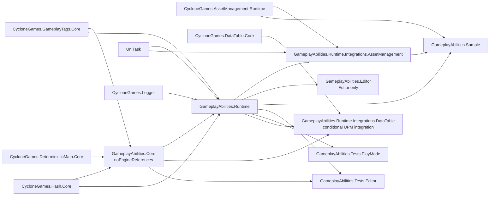
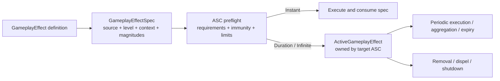

# CycloneGames.GameplayAbilities

English | [简体中文](./README.SCH.md)

Modelled on Unreal Engine's Gameplay Ability System (GAS), CycloneGames.GameplayAbilities brings attribute-driven ability activation, tag-based state blocking, stacked gameplay effects, prediction bookkeeping, and cosmetic cues to Unity. If you've built with GAS before, you'll recognize the division between `AbilitySystemComponent`, `GameplayAbility`, `GameplayEffect`, `AttributeSet`, and `AbilityTask` — the core concepts map directly, but the implementation is built for Unity's ecosystem with a Unity-free state model that works in headless sims, CLI tests, and Dedicated Server builds.

## Table of Contents

- [Overview](#overview)
- [Architecture](#architecture)
- [Quick Start](#quick-start)
- [Core Concepts](#core-concepts)
- [Usage Guide](#usage-guide)
- [Advanced Topics](#advanced-topics)
- [Common Scenarios](#common-scenarios)
- [Performance and Memory](#performance-and-memory)
- [Troubleshooting](#troubleshooting)

## Overview

Every action-heavy game hits the same questions: can the player use this skill right now? What does it cost? How does it change character stats? When does the effect wear off? What blocks what? GAS answers these with a consistent pipeline — abilities check tags and attributes before activation, effects modify attributes over time, and everything leaves a prediction trail the authority can commit or roll back.

Use this package when gameplay actions need one or more of: reusable activation rules, costs, cooldowns, and cancellation; numeric attributes modified by instant, duration, infinite, or periodic effects; tag-driven state such as stun, immunity, or cooldown; stacking, dispel, and effect execution calculations; local prediction bookkeeping with explicit commit and rollback; cosmetic cues that live outside authoritative state; and reusable targeting tasks with bounded target counts.

Input, transport, save files, matchmaking, and animation live in their own modules — this framework handles the rules layer and only the rules layer.

## Architecture

| Path | Responsibility |
| --- | --- |
| `Core/` | Unity-free fixed-point data, state/facade APIs, stable IDs, prediction records, registries, process-local reconciliation buffers, and authoritative activation results |
| `Runtime/` | `AbilitySystemComponent`, abilities, effects, attributes, tasks, target data, cues, Unity authoring bridges, and runtime diagnostics |
| `Editor/` | Inspectors, property drawers, debugger, trace window, and overlay configuration tooling |
| `Runtime/Integrations/AssetManagement/` | Active adapter from `CycloneGames.AssetManagement` handles to the cue-facing `IResourceLocator` contract |
| `Runtime/Integrations/DataTable/` | Optional UPM-gated DataTable adapters, isolated behind an integration assembly |
| `Samples/` | Playable examples, authoring assets, target actors, manual composition, headless composition, and optional DI composition |
| `Tests/Editor/` | Core hardening, deterministic behavior, attribute registration, lease/cache, Runtime contract, and integration tests |
| `Tests/PlayMode/` | Runtime overlay registration, capacity, cleanup, and Unity lifecycle tests |

The assembly dependency direction is:


```mermaid
flowchart LR
    Tags["CycloneGames.GameplayTags.Core"]
    Math["CycloneGames.DeterministicMath.Core"]
    Hash["CycloneGames.Hash.Core"]
    Core["GameplayAbilities.Core<br/>noEngineReferences"]
    Asset["CycloneGames.AssetManagement.Runtime"]
    AssetIntegration["GameplayAbilities.Runtime.Integrations.AssetManagement"]
    DataTableCore["CycloneGames.DataTable.Core"]
    UniTask["UniTask"]
    Logger["CycloneGames.Logger"]
    Runtime["GameplayAbilities.Runtime"]
    Editor["GameplayAbilities.Editor<br/>Editor only"]
    DataTable["GameplayAbilities.Runtime.Integrations.DataTable<br/>conditional UPM integration"]
    Samples["GameplayAbilities.Sample"]
    Tests["GameplayAbilities.Tests.Editor"]
    PlayTests["GameplayAbilities.Tests.PlayMode"]

    Tags --> Core
    Math --> Core
    Hash --> Core
    Core --> Runtime
    Tags --> Runtime
    Hash --> Runtime
    UniTask --> Runtime
    Logger --> Runtime
    Asset --> AssetIntegration
    UniTask --> AssetIntegration
    Runtime --> AssetIntegration
    DataTableCore --> DataTable
    Core --> DataTable
    Runtime --> Editor
    Runtime --> Samples
    Asset --> Samples
    AssetIntegration --> Samples
    Core --> Tests
    Runtime --> Tests
    Runtime --> PlayTests
    Runtime --> DataTable
```

`CycloneGames.GameplayAbilities.Core` has `noEngineReferences: true` and does not expose `UnityEngine` types. `CycloneGames.GameplayAbilities.Runtime` is the Unity adapter and authoring layer. Runtime code must not be moved into Core merely to share an implementation.

`AbilitySpecContainer`, `PredictionManager`, and `ReplicationStateBuilder` are internal Runtime assembly implementation types. Public consumers use the `AbilitySystemComponent` facade, stable `GASReadOnlyListView<T>`, `GASReadOnlySetView<T>`, and `GASReadOnlyTagView` instances, query methods, and diagnostics; they do not receive mutable container or builder access. These internal types are not extension points. Consolidating mutation authority in the ASC narrows the public API and long-term compatibility surface.

The package metadata declares its direct package requirements. In an `Assets/ThirdParty` checkout, `package.json` is descriptive metadata; Unity compilation is determined by the actual asmdef graph, installed packages, constraints, and symbols. The main Runtime assembly does not reference AssetManagement or DataTable; those dependencies terminate in their integration assemblies.

## Runtime model

The main types follow a GAS-style division of responsibility:

| Type | Responsibility |
| --- | --- |
| `GASRuntimeContext` | Composition root and owner of authority/replica role, services, registries, entity IDs, thread policy, one-shot runtime lease accounting, and bounded internal backing storage for one simulation world or partition |
| `AbilitySystemComponent` (ASC) | Stable facade for one gameplay entity: granted abilities, active effects, attributes, tags, prediction, replication state, and events |
| `AttributeSet` | Explicitly registered attributes and attribute-specific validation or post-processing |
| `GameplayAbility` | Once-initialized immutable definition configuration plus executable runtime behavior on owned instances |
| `GameplayAbilitySpec` | ASC-local granted state: handle, level, active state, template, instance, and granting effect |
| `GameplayEffect` | Immutable reusable runtime definition for modifiers, duration, tags, stacking, requirements, cues, and granted abilities |
| `GameplayEffectSpec` | Leased per-application data: source, target, level, calculated magnitudes, context, prediction key, SetByCaller values, and dynamic tags |
| `ActiveGameplayEffect` | A duration or infinite effect owned by the target ASC |
| `AbilityTask` | Ability-owned asynchronous or multi-frame work |
| `TargetData` | Callback-scoped or explicitly transferred one-shot target payload with prediction metadata |
| `IGameplayCueManager` | Presentation boundary for cosmetic cues |
| `GASRuntimeAuthorityMode` | Immutable `Authority` or `Replica` role selected when the runtime context is constructed |
| `GASAuthorityActivationResult` | Allocation-free terminal decision returned by the authority-owned `TryExecuteAuthorityAbility` boundary |

An ASC is a plain C# object, not a `MonoBehaviour`. A project component may own it and forward Unity lifecycle events:

```csharp
public sealed class AbilitySystemHost : MonoBehaviour
{
    public AbilitySystemComponent ASC { get; private set; }

    private void Awake()
    {
        ASC = new AbilitySystemComponent();
        ASC.InitAbilityActorInfo(this, gameObject);
    }

    private void Update()
    {
        ASC.Tick(Time.deltaTime, isServer: true);
    }

    private void OnDestroy()
    {
        ASC?.Dispose();
    }
}
```

The parameterless constructor owns a private authoritative `GASRuntimeContext`. It is convenient for isolated actors, offline play, and tests. Interacting actors should normally share one explicit context so they share role, context-local IDs, registries, process-local reconciliation references, cues, and memory policy. Applying an effect across different contexts is rejected. A remote replica must use an explicitly constructed context with `GASRuntimeAuthorityMode.Replica`.

### Core state modes

`GASAbilitySystemRuntimeOptions` selects how an ASC uses the Unity-free state model:

- `RuntimeOnly` is the default. It omits the mirror when a project does not consume Core state, reducing duplicate state and synchronization work.
- `MirrorRuntime` must be selected explicitly. Runtime remains authoritative while locally generated ability, attribute, effect, and modifier changes are mirrored into `GASAbilitySystemState` for Core diagnostics and state checksums.

Select the state mode at composition time. Do not switch state ownership between models during a session. The current verification set does not establish complete synchronization of a process-local `GASAbilitySystemStateDeltaBuffer` application into the Core mirror. Do not rely on `MirrorRuntime` as proof that a reconciled receiver's Core state remains complete without project-specific parity tests.

## Composition and lifetime

### Explicit construction without DI

Create one context for a gameplay world, inject it into every participating ASC, and dispose in reverse ownership order:

```csharp
var cacheProfile = new GASRuntimeCacheProfile(
    effectSpecBackingCapacity: 128);

var limits = new GASRuntimeLimits(
    maxAttributeSets: 32,
    maxAttributes: 512,
    maxGrantedAbilities: 256,
    maxActiveEffects: 1024,
    maxPredictionWindows: 128,
    maxTargetsPerTargetData: 128,
    maxPeriodicEffectExecutionsPerTick: 8,
    maxAbilityTaskRepeatExecutionsPerTick: 8);

var options = new GASAbilitySystemRuntimeOptions(
    coreStateMode: GASCoreStateMode.RuntimeOnly,
    limits: limits);

var context = new GASRuntimeContext(
    authorityMode: GASRuntimeAuthorityMode.Authority,
    threadPolicy: GASRuntimeThreadPolicy.Throw,
    cacheProfile: cacheProfile);

var playerASC = new AbilitySystemComponent(context, options);
var enemyASC = new AbilitySystemComponent(context, options);

// During shutdown:
enemyASC.Dispose();
playerASC.Dispose();
context.Dispose();
```

`GASRuntimeCacheProfile` controls only the bounded internal backing cache used by `GameplayEffectSpec`; it never retains a public runtime object. `GASRuntimeLimits` controls hard gameplay and payload bounds. They solve different problems and should be configured separately. `cacheProfile` is the optional final `GASRuntimeContext` constructor parameter; `null` selects `GASRuntimeCacheProfile.Default`, which retains at most `64` backing records. An explicit capacity may be `0..4096`.

### GameplayCue composition

A visual client can initialize a `GameplayCueManager` with an explicit GameObject pool policy and inject it into the context:

```csharp
var cuePoolConfig = new GameObjectPoolManager.PoolConfig(
    maxAssetPools: 128,
    maxActiveLeases: 2048,
    maxActiveLeasesPerPool: 256,
    maxRetainedInstancesPerPool: 128,
    minRetainedInstancesPerPool: 0,
    idleExpirationTime: 60f,
    maxTotalRetainedInstances: 1024);

IResourceLocator cueResources =
    new AssetManagementResourceLocator(assetPackage);

var cueManager = new GameplayCueManager(cuePoolConfig);
cueManager.Initialize(cueResources);

var context = new GASRuntimeContext(cueManager: cueManager);
```

The `AssetManagementResourceLocator` type belongs to `CycloneGames.GameplayAbilities.Runtime.Integrations.AssetManagement`; the main Runtime assembly knows only `IResourceLocator`. A project using another asset system supplies another adapter. The concrete resource boundary is `GameplayCueManager.Initialize(IResourceLocator)`; the Core `IGameplayCueManager` contract does not expose `Initialize`. The caller owns injected services. Dispose every ASC, then the context, then `GameplayCueManager`. A headless process should inject `NullGameplayCueManager.Instance` and avoid loading visual assets.

### DI composition

No runtime type depends on a DI container. Register concrete instances in the project composition root:

```csharp
builder.Register<IResourceLocator>(
    _ => new AssetManagementResourceLocator(assetPackage),
    Lifetime.Singleton);

builder.Register(
        resolver =>
        {
            var manager = new GameplayCueManager(cuePoolConfig);
            manager.Initialize(resolver.Resolve<IResourceLocator>());
            return manager;
        },
        Lifetime.Singleton)
    .As<GameplayCueManager>();

    builder.Register(
        resolver => new GASRuntimeContext(
            authorityMode: GASRuntimeAuthorityMode.Authority,
            cueManager: resolver.Resolve<GameplayCueManager>(),
            cacheProfile: cacheProfile),
        Lifetime.Singleton)
    .As<GASRuntimeContext>();
```

Container disposal must preserve the same order: ASC owners first, then context, then injected services. `GASRuntimeContext.Dispose()` refuses to run while ASCs remain registered.

Construct a separate `Replica` context for remote replicated state. Authority and replica instances must not share one mutable context, and the role cannot change during that context's lifetime. Network sessions, transports, connection state, and endpoint lifetimes belong to product composition, not to `GASRuntimeContext`.

## Tutorial: a complete minimal ability

This example creates a health attribute, a reusable healing effect, an ability, and one ASC without any scene dependency.

### 1. Define an AttributeSet

Attribute registration is explicit. It does not scan properties with reflection.

```csharp
using CycloneGames.GameplayAbilities.Core;
using CycloneGames.GameplayAbilities.Runtime;

public sealed class CombatAttributes : AttributeSet
{
    public GameplayAttribute Health { get; } =
        new GameplayAttribute("Attribute.Vital.Health");

    public GameplayAttribute MaxHealth { get; } =
        new GameplayAttribute("Attribute.Vital.MaxHealth");

    protected override void RegisterAttributes()
    {
        RegisterAttribute(Health);
        RegisterAttribute(MaxHealth);
    }

    public override void PreAttributeChange(
        GameplayAttribute attribute,
        ref GASFixedValue newValue)
    {
        if (attribute == Health)
        {
            newValue = GASFixedValue.Clamp(
                newValue,
                GASFixedValue.Zero,
                MaxHealth.CurrentFixedValue);
        }
    }
}
```

Every attribute name must be non-empty and unique inside the set. Add the set before an effect or ability attempts to resolve its attributes.

`GameplayAttribute.ActiveModifierSourceCount` is a diagnostic count of active modifier contributors. `RemoveAttributeSet` rejects detachment while an attribute is referenced by an active effect or an open prediction snapshot; use the count together with active-effect and prediction diagnostics when investigating a rejected detach. The count is observability data, not an authority or synchronization primitive.

### 2. Define an effect

Runtime definitions are reusable and should be treated as immutable after construction:

```csharp
using System.Collections.Generic;
using CycloneGames.GameplayAbilities.Runtime;

var healEffect = new GameplayEffect(
    name: "GE_Heal",
    durationPolicy: EDurationPolicy.Instant,
    modifiers: new List<ModifierInfo>
    {
        new ModifierInfo(
            "Attribute.Vital.Health",
            EAttributeModifierOperation.Add,
            new ScalableFloat(baseValue: 25f, scalingFactorPerLevel: 5f))
    });
```

`Instant` effects execute immediately. `HasDuration` effects become active for a positive duration. `Infinite` effects remain until explicitly removed. An instant effect cannot have a period.

### 3. Implement an ability

`CommitAbility` performs the cost/cooldown preflight and returns a structured result. Stop gameplay execution when commit fails.

```csharp
using CycloneGames.GameplayAbilities.Runtime;
using CycloneGames.GameplayTags.Core;

public sealed class HealAbility : GameplayAbility
{
    private readonly GameplayEffect healEffect;

    public HealAbility(GameplayEffect healEffect)
    {
        this.healEffect = healEffect;

        Initialize(
            name: "GA_Heal",
            instancingPolicy: EGameplayAbilityInstancingPolicy.InstancedPerExecution,
            executionPolicy: EAbilityExecutionPolicy.LocalOnly,
            cost: null,
            cooldown: null,
            abilityTags: new GameplayTagContainer(),
            activationBlockedTags: new GameplayTagContainer(),
            activationRequiredTags: new GameplayTagContainer(),
            cancelAbilitiesWithTag: new GameplayTagContainer(),
            blockAbilitiesWithTag: new GameplayTagContainer());
    }

    public override void ActivateAbility(
        GameplayAbilityActorInfo actorInfo,
        GameplayAbilitySpec spec,
        GameplayAbilityActivationInfo activationInfo)
    {
        GameplayAbilityCommitResult commit = CommitAbility(actorInfo, spec);
        if (!commit.Succeeded)
        {
            EndAbility();
            return;
        }

        GameplayEffectApplicationResult result =
            ApplyGameplayEffectToOwner(healEffect, spec.Level);

        if (!result.Succeeded)
        {
            // Project code may translate result.Code into UI or telemetry.
        }

        EndAbility();
    }

    public override GameplayAbility CreateRuntimeInstance()
    {
        return new HealAbility(healEffect);
    }
}
```

### 4. Grant and activate

```csharp
using var context = new GASRuntimeContext();
using var asc = new AbilitySystemComponent(context);

var attributes = new CombatAttributes();
asc.AddAttributeSet(attributes);
attributes.MaxHealth.SetBaseValue(100f);
attributes.MaxHealth.SetCurrentValue(100f);
attributes.Health.SetBaseValue(50f);
attributes.Health.SetCurrentValue(50f);

asc.InitAbilityActorInfo(owner: playerModel, avatar: playerGameObject);

GameplayAbilitySpec spec = asc.GrantAbility(
    new HealAbility(healEffect),
    level: 1);

bool activationStarted = asc.TryActivateAbility(spec);
```

The ASC owns the granted spec. Call `ClearAbility(spec)` to revoke it; do not retain a spec after it is cleared or its ASC is disposed.

## Ability workflow

### Granting and instancing

`GameplayAbility.Initialize` publishes configuration exactly once. Tag inputs use `IReadOnlyGameplayTagContainer`; initialization never requires or retains mutation authority over the caller's container. Before any property is committed, it validates a non-empty name no longer than `MaxNameLength` (`256`), known instancing and network policies, valid tag data within the aggregate `MaxAggregateTagCount` (`256`), and no more than `MaxTriggerCount` (`64`) valid triggers. A trigger pair with the same tag and source is rejected as a duplicate. Only after all validation succeeds does it copy tag inputs into immutable `GameplayDefinitionTagSet` values, snapshot triggers into a read-only collection, and expose configuration through private-set properties. A second initialization throws, and `GrantAbility` rejects a definition that was never initialized. Construct the complete definition before registration; runtime activation state belongs to an instance, not to the shared definition.

`GrantAbility` allocates an ASC-local handle and returns a `GameplayAbilitySpec`. The same ability definition may be granted more than once; address the grant by its spec or handle rather than by list position.

Instancing policies are:

- `NonInstanced`: reserved for stateless simulation in the Unity-free Core model. Unity Runtime `GrantAbility` rejects this policy because a shared `GameplayAbility` object cannot safely own ASC, activation, or task state.
- `InstancedPerActor`: one runtime instance owns execution state for the lifetime of the grant and is invalidated when the grant is cleared.
- `InstancedPerExecution`: every activation receives a distinct runtime instance that is invalidated when that activation ends.

Unity Runtime abilities must use `InstancedPerActor` or `InstancedPerExecution`. Pure Core consumers may use `GASInstancingPolicy.NonInstanced` only for commands that keep all mutable state outside the shared definition. The runtime memory owner calls `CreateRuntimeInstance()` for each runtime lease, requires a distinct object of the same runtime type, and copies the sealed base configuration from the definition. The factory must not capture scene ownership that outlives the ASC.

Each runtime instance retains the exact definition/template reference that created it. Two definitions of the same derived type can therefore carry different immutable configuration without sharing runtime state. Runtime instances are one-shot lease objects: release invalidates and discards the object instead of making it available to another grant or activation.

Derived abilities that own mutable references or sensitive state should override `ResetRuntimeState()` to close that state when the runtime lease is released:

```csharp
protected override void ResetRuntimeState()
{
    chargeSeconds = 0f;
    cachedTargetIds.Clear();
}
```

The base release path always clears `Spec`, `AbilitySystemComponent`, `ActorInfo`, activation data, and task tracking. `ResetRuntimeState()` must not release shared definition data. An `InstancedPerActor` ability must also reset activation-specific fields in its normal end workflow when those fields must not cross activations; the final release hook alone is not an activation reset. If the hook throws, the lease still becomes invalid and the object is discarded, while `ReleaseFailures` records the cleanup failure. Treat that exception as a lifecycle defect.

### Activation checks

`TryActivateAbility` evaluates:

- ASC disposal, spec validity, and active state;
- execution policy and local ownership;
- required and blocked ability tags;
- source and target tag requirements;
- ability blocking and cancellation relationships;
- cooldown tags;
- cost affordability;
- the ability's `CanActivate` override.

`CanActivate` should be deterministic and free of externally visible side effects. Reserve irreversible work for activation after a successful commit.

### Commit, cost, and cooldown

The commit contract is two-phase:

1. Construct cost and cooldown specs.
2. Validate definitions, tags, limits, custom requirements, cooldown, and affordability.
3. Apply the cooldown.
4. Apply the instant cost.
5. Remove the applied cooldown if cost application is rejected.
6. Publish `OnAbilityCommitted` only after success.

A cost definition must be `Instant`. A cooldown definition must be `HasDuration` or `Infinite` and normally grants a cooldown tag. Override `CreateCostEffectSpec` or `CreateCooldownEffectSpec` when the ability must add SetByCaller data before validation.

`GameplayAbilityCommitResult.Code` distinguishes missing ownership, invalid definitions, insufficient cost, active cooldown, and effect rejection. `EffectResult` preserves the underlying effect rejection code.

Always call `EndAbility()` or `CancelAbility()` on every terminal path. Ending cancels owned tasks, removes configured ability-owned effects, releases owned tags, and invalidates and discards the instanced-per-execution runtime instance.

### Input and events

The project input adapter should map input actions to granted specs and call `TryActivateAbility`, `InputPressed`, or `InputReleased` on the simulation owner thread. Gameplay events use `GameplayEventData` and tag-keyed callbacks; event tags describe gameplay intent and should not carry transport-specific objects.

### Runtime callbacks and observer ordering

ASC ability/effect/prediction/replication events, tag callbacks, gameplay-event callbacks, and ASC-bound `GameplayAttribute` value events use owner-thread-confined typed callback lists. Subscription and removal are cold-path operations: multicast expansion, dictionary insertion, and list growth can allocate. Register stable delegates during composition or ability/task activation, remove them during the matching teardown, and do not subscribe every Tick.

Dispatch captures the current callback count. Removing a subscriber during dispatch tombstones its current entry, so it will not run later in that dispatch; adding a subscriber appends it for the next dispatch. The outermost dispatch compacts tombstones in place. Each subscriber is invoked through an independent exception boundary, so one failure is logged and later subscribers still run. Attribute, ability, effect, prediction-closure, replication, and tag observers run only after their corresponding authoritative state is committed. Steady-state dispatch can avoid managed allocation after capacity is established, but exception logging and subscription changes are outside that result.

The ASC's internal count-container callbacks perform committed-state reconciliation for tag-trigger activation, ongoing-effect inhibition, attribute dirtiness, and replication tracking. If that reconciliation throws, the count container still delivers later subscribers and then returns an `AggregateException` stating that tag state is already committed. Treat this as an integrity incident: do not retry the tag mutation; stop further authority changes for the entity and recover from a validated authoritative snapshot or shut the entity down.

`GameplayEvent` observers are intent listeners rather than authority. They run before tag-matched authority triggers; an observer failure is isolated and does not prevent the trigger from activating its ability. Observer callbacks cannot dispose the ASC while dispatch is active. The current spec cannot be cleared during its ability override or `OnAbilityActivated` delivery, and the ending spec cannot be cleared during the complete end window, including `OnAbilityEndedEvent` delivery and per-execution instance cleanup. Re-entering end for the same spec lease also fails fast. Defer those destructive operations until the current activation or end call returns.

## GameplayEffect workflow

### Definition, spec, and active effect

A `GameplayEffect` is a reusable definition. A `GameplayEffectSpec` is a leased application request. An `ActiveGameplayEffect` is target-owned persistent state.

The `GameplayEffect` constructor validates its complete definition before publication: non-empty name; known duration and stacking policies; finite duration, period, and magnitude inputs; positive duration and stack limits where required; valid modifier operations, capture policies, calculations, and SetByCaller keys; non-null requirements and overflow entries; and compatible granted abilities. Instant definitions cannot be periodic or grant abilities, and Runtime-granted abilities cannot use `NonInstanced`. Definition collections, modifier records, and tag containers are copied for runtime use.

Ability and effect levels in Runtime state and reconciliation buffers are integers in the inclusive range `1..65535`, with the upper bound exposed as `GASRuntimeDataContract.MaxGameplayLevel`. Ability grant, spec creation, effect reconciliation, and state-delta validation reject values outside that range. Helper overloads that accept `-1` use it only as an instruction to inherit the current ability level and resolve it before creating a spec.

Published collections are exposed as `IReadOnlyList<T>`. Definition tags use `GameplayDefinitionTagSet`, which implements only `IReadOnlyGameplayTagContainer`; Effect requirements use `GameplayEffectTagRequirements` containing the same read-only definition sets. Mutation authority is absent from these public definition values. Call `ToMutableContainer()` or `ToMutableRequirements()` only to build an isolated authoring or composition value, then construct another definition. Referenced strategy objects such as executions, custom magnitude calculations, and application requirements are shared rather than deep-cloned, so their implementations must remain stateless after definition construction.

`GameplayEffectSpec.DynamicGrantedTags` and `DynamicAssetTags` return `GameplayEffectSpecTagView`, a generation-checked `readonly struct` view over storage owned by the current spec lease. Every read and mutation validates the originating lease generation; mutation additionally requires caller ownership. A captured view throws after the spec is consumed or discarded and never owns or extends the backing storage lifetime.


```mermaid
flowchart LR
    Definition["GameplayEffect definition"] --> Spec["GameplayEffectSpec<br/>source + level + context + magnitudes"]
    Spec --> Validate["ASC preflight<br/>requirements + immunity + limits"]
    Validate -->|"Instant"| Execute["Execute and consume spec"]
    Validate -->|"Duration / Infinite"| Active["ActiveGameplayEffect<br/>owned by target ASC"]
    Active --> Tick["Periodic execution / aggregation / expiry"]
    Active --> Remove["Removal / dispel / shutdown"]
```

`GameplayEffectSpec.Create` returns a caller-owned spec. Configure SetByCaller values, dynamic tags, context metadata, and reserved capacity only while that caller ownership is current. `ApplyGameplayEffectSpecToSelf` attempts to transfer ownership immediately and consumes the spec on every accepted transfer path, including rejection results. After passing a spec to that method, do not mutate, discard, or submit it again. If a caller-owned spec will never be submitted, call its public `Discard()` method exactly once; there is no public memory-owner release API.

`GameplayEffectSpec` owns its concrete, inheritable `GameplayEffectContext`. `GameplayEffectSpec.Create`, `GameplayEffectSpec.Context`, `AbilitySystemComponent.MakeEffectContext`, and `IGameplayEffectContextFactory.Create` all use this type. The base context carries only `Instigator`, `AbilityInstance`, and `PredictionKey`; targeting data remains in the separate AbilityTask and TargetData lease workflow. Supplying a context to `GameplayEffectSpec.Create` attaches it to the spec. The base context records that exact owning spec as its ownership token; after attachment, only the same spec may update prediction state or release the context, while caller mutation, `Reset`, and `Dispose` throw. The caller may dispose only an independently created context that was never attached. Derived contexts may override protected `ResetCustomState()` to clear only their own mutable fields; the base class remains responsible for base metadata and ownership state, and the hook must not release the context. Discarding or consuming the spec releases its context; a duration/infinite application transfers the spec and context into the target-owned active effect until removal. Do not share one context between specs or retain it from a cue callback.

An `ActiveGameplayEffect` returned by an application result or ASC query is borrowed state owned exclusively by the target ASC. Consumers cannot release it directly. Request removal through owner APIs such as `TryRemoveActiveEffect`, or let stacking, expiry, clear, and ASC disposal remove it. After removal, neither the active effect nor its spec/context may be accessed.

`ActiveEffectContainer` is internal implementation state. Public enumeration goes through the stable `GASReadOnlyListView<ActiveGameplayEffect>` returned by `AbilitySystemComponent.ActiveEffects`, while detailed inspection uses public debugger and diagnostic APIs. The view and every element are borrowed; consumers must not depend on internal indexes, stacking maps, or mutation order.

`ModifierMagnitudes`, `ModifierMagnitudeRawValues`, and `TargetAttributes` are borrowed `ReadOnlySpan<T>` views over spec-owned buffers. They avoid exposing mutable arrays and are valid only while that spec lease remains valid. Read or copy required values before submitting the spec or otherwise ending its lease; never retain a span or derive a long-lived reference from it.

`GameplayEffectApplicationResult.Code` is the complete application outcome contract:

| Outcome group | Codes |
| --- | --- |
| Committed success | `Applied`, `Executed`, `Stacked` |
| Invalid input or context | `InvalidSpec`, `InvalidDefinition`, `RuntimeContextMismatch` |
| Runtime state or phase rejection | `StateResyncRequired`, `ReentrantMutationRejected` |
| Rule rejection | `BlockedByImmunity`, `MissingRequiredTags`, `BlockedByForbiddenTags`, `BlockedByCustomRequirement` |
| Capacity or prediction rejection | `ActiveEffectLimitReached`, `PredictionLimitReached`, `PredictionUnsupported`, `GrantedAbilityLimitReached` |
| Execution or commit failure | `ExecutionFailed`, `DurationCommitFailed` |

Use `CanApplyGameplayEffectSpec` for preflight. It checks framework-owned requirements and budgets but cannot prove that project callbacks will not throw. Custom application requirements called from preflight must be pure because they may run more than once.

Effect application follows phase-scoped failure-atomic rules for framework-owned ASC state. Validation and capacity failures occur before mutation. Instant execution snapshots every touched attribute and restores those values if execution or an attribute hook throws. A failed first insertion of a duration effect removes the uncommitted effect from indexes, Core state, granted abilities, tags, and modifier links, then invalidates its one-shot lease before returning `DurationCommitFailed`. Removal-tag processing and cue dispatch occur only after the corresponding effect operation commits.

Definition-granted tags and spec dynamic-granted tags are separate ownership edges. Effect removal, rollback, and ASC shutdown attempt each edge independently against both effect-owned and combined tag state. A failure in one tag-removal callback or cleanup step is recorded without skipping the remaining definition or dynamic-tag cleanup, modifier/index cleanup, or effect lease release. Effect observers are then delivered per subscriber after the authoritative removal has committed.

Effect mutation transactions and active-effect iteration are non-reentrant phases. A direct apply, remove, update, internal reconciliation apply, `Tick`, ASC `Dispose`, or ability end issued from inside those phases is rejected immediately through that API's result, `false`, or `InvalidOperationException` contract. A reentrant `ApplyGameplayEffectSpecToSelf` consumes and releases a caller-owned spec when ownership transfer succeeds, then returns `ReentrantMutationRejected`; after submission, do not call `Discard()`, mutate, or resubmit that spec. Queue unrelated work for a later owner-thread phase.

Activation requested by `ActivateAbilityOnGranted`, `OwnedTagAdded`, `OwnedTagRemoved`, or a `GameplayEvent` trigger uses a bounded deferred path while either phase is active. Requests are deduplicated by spec identity, bounded by `MaxGrantedAbilities`, and flushed only after the outer mutation or iteration has committed. A flush uses the same bounded budget and logs and discards any remainder. This path does not make arbitrary callbacks or effect mutations reentrant.

This is not a transaction over an entire effect graph. Stacking and overflow apply child operations in order; a child that already committed is not undone if later stacking work fails. Atomicity also does not cover irreversible work performed by project callbacks, custom calculations, observers, logs, network sends, or external services. Keep those hooks side-effect-free until commit, or provide project compensation. A reported rollback-cleanup failure is an integrity incident; stop further authority changes for that entity and recover from a validated authoritative snapshot.

### SetByCaller

SetByCaller values provide per-application magnitudes without mutating the shared definition:

```csharp
GameplayTag damageTag =
    GameplayTagManager.RequestTag("Data.Damage");

GameplayEffectSpec spec =
    GameplayEffectSpec.Create(damageEffect, sourceASC, level: 3);

spec.SetSetByCallerMagnitude(damageTag, 85f);

GameplayEffectApplicationResult result =
    targetASC.ApplyGameplayEffectSpecToSelf(spec);
```

Tag keys are preferred for stable gameplay contracts. Name keys are available for local cases. The combined number of tag and name entries is bounded by `MaxSetByCallerEntries`. SetByCaller changes recalculate affected modifier magnitudes.

Internal magnitude initialization reads missing SetByCaller inputs without logging. When submission successfully transfers ownership, the spec performs one bounded pass over its authored SetByCaller modifiers and emits the configured missing-key warnings once. A failed transfer or caller `Discard()` does not perform this warning pass. An explicit `GetSetByCallerMagnitude(..., warnIfNotFound: true)` remains an immediate diagnostic read and can warn independently.

### Magnitudes, aggregation, and execution

Modifier operations are `Add`, `Multiply`, `Division`, and `Override`. Magnitudes can be:

- `ScalableFloat`, using level-based fixed input;
- `AttributeBased`, using source or target capture with snapshot policy;
- `SetByCaller`;
- `CustomCalculation` for bounded calculation logic.

Evaluation channels provide ordered aggregation when effects need independent modifier lanes. Execution calculations support multi-attribute instant or periodic logic. Keep execution calculations deterministic when they participate in prediction, and do not perform transport, asset loading, or unbounded allocation inside them.

`GameplayEffectExecutionCalculation.Execute` receives a stack-only `GameplayEffectExecutionOutput`. Call `Add` for each result; null results and additions beyond `GASRuntimeLimits.MaxModifiersPerEffect` fail before attribute mutation begins. The output cannot be retained or replaced by the calculation. Its backing scratch and instant-effect rollback scratch are owned by the target ASC, cleared in `finally`, and released during ASC disposal. Scratch lists that grow beyond 256 entries are discarded after the operation instead of retaining an exceptional peak for the ASC lifetime.

### Stacking and ongoing state

`GameplayEffectStacking` selects no stacking, aggregation by source, or aggregation by target; it also defines stack limit, duration refresh, and expiration behavior. Overflow effects and denial policy handle applications at the limit.

Application requirements run before insertion. Ongoing requirements control whether an active effect contributes while tags change. Removal tags support dispel behavior. Duration and infinite effects may grant tags and abilities for their active lifetime.

## GameplayTags

Tags are the shared vocabulary for activation, blocking, cancellation, immunity, effect identity, granted state, cooldowns, events, cues, and SetByCaller data.

Recommended namespaces include:

```text
Ability.Attack.Primary
Ability.Movement.Dash
Cooldown.Ability.Dash
State.CrowdControl.Stunned
State.Immune.Fire
Effect.Damage.Fire
GameplayCue.Fire.Impact
Data.Damage
Attribute.Vital.Health
```

`CombinedTags` aggregates loose tags and tags granted by active effects. It and `ImmunityTags` are query-only `GASReadOnlyTagView` instances; mutation remains on ASC methods such as `AddLooseGameplayTag`, `RemoveLooseGameplayTag`, `AddImmunityTag`, and `RemoveImmunityTag`. Loose tags are explicitly owned by project code: every `AddLooseGameplayTag` must have a defined removal path. Effect-granted tags are owned by the active effect and are removed with it.

Ability and effect construction snapshots tag queries used by hot paths. Treat runtime definitions as immutable; create or reload an authoring asset when configuration changes.

## AbilityTasks and target data

AbilityTasks provide ability-owned work such as delays, repeats, tag waits, attribute waits, gameplay event waits, effect waits, confirmation/cancellation, and targeting. Create them with the ability factory, subscribe, then activate according to the task API. The ability owns cancellation and final release of each task.

Terminal callbacks do not own task teardown. One-shot, cancellation, target-data, delay, repeat, tag, attribute, gameplay-event, effect, and ability-wait tasks record terminal ownership before invoking project code and close through guarded cleanup. `AbilityTask_WaitTargetData` nests TargetData release and task teardown so `EndTask` is still attempted when either the consumer callback or TargetData reset throws. Callback exceptions are not swallowed and can still propagate to the caller, but the tested task lease is removed from active ownership. A reentrant second terminal signal is ignored.

Every AbilityTask is freshly constructed for one lease. Terminal `finally` blocks, `Activate` failure cleanup, Tick failure cleanup, prediction-cancellation snapshots, and task initialization compare the captured internal lease generation before ending or registering the task. Generation exhaustion and post-release access fail closed. The generation is internal bookkeeping rather than a public handle; retain neither the task nor its mutable callback state after `EndTask`, cancellation, ability end, or owner disposal. The released object is discarded and is never issued for a later lease, so a stale task reference cannot alias another operation through sequential object reuse.

`AbilityTask_WaitGameplayTagAdded` and `AbilityTask_WaitGameplayTagRemoved` subscribe before inspecting current tag state, so an edge cannot be lost between the check and registration. With `triggerOnce: false`, an already-satisfied state is reported immediately after subscription and that callback is the final operation of the activation frame. If it ends the task, the earlier stack performs no later field write, and generation-checked activation failure cleanup cannot operate on the released lease.

`EndAbility` marks the ability as ending before cancellation, preventing cancellation callbacks from creating another task. It attempts cancellation and release for every active task even when individual callbacks throw, clears task indexes, and reports the first failure only after teardown has been attempted. During ASC shutdown, every granted spec runs its removal path before active effects are removed, and spec release remains in `finally`; effect state therefore remains available while ability-owned task and effect cleanup runs.

### TargetData lease rule

`ITargetActor.Configure(ability, onTargetDataReady, onCancelled)` is a single-operation request/response boundary. It wires exactly one completion callback and one cancellation callback. For each configured operation, the TargetActor must invoke exactly one of those terminal callbacks exactly once; it must not expose, combine, or invoke them as multicast notifications. Completion transfers one `TargetData` lease to the task exactly once. The TargetActor must not retain, release, reuse, or publish that lease after transfer; cancellation transfers no lease.

`AbilityTask_WaitTargetData` is the sole owner of the transferred lease. `OnValidData` receives only callback-scoped borrowed access, and the task calls `TargetData.Release()` in a `finally` block immediately after that callback. Assign one result consumer rather than combining delegates, then read or copy all durable information inside the callback:

```csharp
task.OnValidData = data =>
{
    var actors = (GameplayAbilityTargetData_ActorArray)data;
    for (int i = 0; i < actors.ActorCount; i++)
    {
        stableTargetIds.Add(targetIdResolver(actors.GetActor(i)));
    }

    // Do not retain data or actor references through the TargetData lease.
};
```

Lease-protected operations throw after release. Every `TargetData` object, including a standalone public construction, is one-shot and becomes permanently invalid when `Release()` succeeds, so a stale raw reference cannot become valid for a later operation. This closes sequential raw-reference ABA, but it does not extend the callback lifetime: never retain or access `TargetData`, actor references obtained from it, or mutable payload state after the callback or an explicit `Release()`. Target arrays are bounded by `MaxTargetsPerTargetData`. Runtime TargetActors should use `AbilitySystemComponent.RentTargetData<T>()` so the context owns lease accounting and applies its configured target limit; standalone construction is not included in context memory statistics.

### Local TargetData validation

`TargetData` and `AbilitySystemComponent.TryValidateTargetData` remain local Runtime APIs. Validation enforces the owning ASC/spec/prediction relationship, configured target count, object lifetime, finite coordinates, and the caller's finite non-negative range before gameplay consumes the one-shot lease. The data remains owned by exactly one local workflow on the context owner thread, must be released exactly once by its owner, and must not be published through multicast or retained after its scope.

Local `TargetData` leases are never serialized. The optional `CycloneGames.GameplayAbilities.Networking` package provides bounded `ActorList` and `SingleHit` wire records plus confirm/cancel commands. Its authority handler receives stable identities and portable values, not Unity objects or local leases. Product authorization and authoritative range, visibility, collision, faction, lifetime, and rate checks remain mandatory before gameplay consumes the intent.

## GameplayCues

GameplayCues are presentation events. They must not decide damage, cost, cooldown, authority, or any other gameplay invariant.

Events are:

- `OnActive`: a persistent effect becomes active;
- `WhileActive`: active presentation;
- `Executed`: an instant or periodic execution;
- `Removed`: persistent presentation ends.

`AbilitySystemComponent.OnGameplayCueCommitted` is the synchronous owner-thread observation boundary for non-presentation consumers. It publishes a readonly, strongly typed `GameplayCueCommitted` value only after the corresponding effect mutation has committed. Instant `Executed` cues carry a zero active-effect reconciliation ID; `OnActive`, `Removed`, and each actual periodic `Executed` occurrence carry the same positive process-local reconciliation ID for that active effect. Source ability policy, source spec handle, prediction key, and the target ASC state version are captured before a long-lived effect releases its borrowed ability-instance reference.

Each committed-cue observer is invoked independently. An exception is logged and cannot undo the committed effect or suppress later observers; a local `IGameplayCueManager` failure likewise does not suppress committed observation. The callback is not a transport or global event bus. Its ASC and effect references are borrowed for the synchronous call; consumers that cross a lifetime or thread boundary must copy only the stable values they own. Subscription, removal, and dispatch use the ASC owner thread, and warmed dispatch uses the existing callback buffer without a per-cue observer collection allocation.

`GameplayCueManager` supports static address registration, runtime handlers, persistent instance tracking, prediction commit/rollback, async loading, and bounded GameObject pooling. Concurrent requests for the same static address share one in-flight load. After every await, the manager revalidates registration, target lifetime, cue reference state, cancellation, and lease ownership; a late or invalid result is not published. Async dispatch copies immutable cue parameters instead of retaining an effect-context reference past its valid lifetime.

`GameObjectPoolManager.PoolConfig` explicitly bounds asset pools, total active leases, leases per pool, retained instances per pool, `MaxTotalRetainedInstances` across all pools, minimum retention, and idle expiration. Different asset keys may prewarm concurrently, but each asset pool permits at most one in-flight `PrewarmPoolAsync`; another unsatisfied prewarm for that key throws. Every prewarm reserves from the global retained budget before awaiting, so operations across different keys cannot collectively oversubscribe it. Global `AggressiveShrink()` skips an in-flight pool, while targeted shrink or `ClearPool` for that key throws. A returned instance that exceeds either retention bound is destroyed.

`GetAsync`, `PrewarmPoolAsync`, and shared handle loading enter through the Unity main thread. An external cancellation can resume an awaiting continuation on a worker, so their `finally` paths switch back to the main thread without the canceled token before changing pool accounting. `GetAsync` releases its pending lease-request count; prewarm clears its in-flight flag and returns every unused retained-instance reservation; shared-load waiters decrement their count. Canceling one waiter does not cancel a load still needed by another waiter; the shared load is canceled only when the final waiter leaves. Shutdown cancellation and load failure dispose an acquired resource handle on the main thread.

Persistent cue activation has the same ownership closure. Once `CreateInstanceAsync` has successfully returned a lease, a worker-thread fault or cancellation in `OnActiveAsync` or `OnWhileActiveAsync` switches cleanup to the main thread and releases that lease unless ownership already transferred to the tracker. If `CreateInstanceAsync` itself acquires a lease and then fails before returning it, that implementation must release the lease because the workflow never received the ownership token. Persistent removal owns a release record and returns the tracked lease in `finally` after success, cancellation, or handler failure.

Pooled prefabs can implement `IGameObjectPoolLifecycle`. The manager discovers and caches handlers when the instance is created, invokes `OnRentFromPool` before activation, and invokes `OnReturnToPool` in reverse order before deactivation, reparenting to the pool root, and local-scale restoration. A lifecycle callback failure quarantines and destroys that instance instead of retaining uncertain state. Lifecycle callbacks must reset all component-owned transient state and must not recursively release their lease.

`GameObjectLease` is the ownership token for a rented cue object. The issuing manager records owner identity, instance ID, raw instance reference, and a monotonically increasing generation. `Release` accepts only the exact outstanding tuple and rejects foreign-manager, duplicate, and stale-generation returns. This prevents a copied lease from releasing the same instance after that instance has been returned and rented again—the GameObject pool's ABA release hazard.

`GameObjectLease.IsValid` reports only that the value is structurally issued; a copied value can remain structurally valid after its lease was returned. Every `GameObjectLease.Instance` access delegates to its issuing manager and performs an average `O(1)` active-lease lookup. The manager validates Unity main-thread affinity, shutdown state, authority/owner identity, non-zero instance ID and generation, the exact active `(instance ID, generation, raw reference)` tuple, and Unity object liveness before returning the object. Access after release or shutdown fails closed.

The returned `GameObject` is borrowed only while that lease remains outstanding. If a consumer stores the raw `GameObject` separately, the lease cannot revoke or intercept that cached reference. The consumer is responsible for discarding it at the lease boundary and must never mutate, deactivate, destroy, or reparent it after release.

Persistent cue activation and removal are cancellation-owned workflows. `IPersistentGameplayCue.CreateInstanceAsync` creates and returns the lease; `OnActiveAsync`, `OnWhileActiveAsync`, and `OnRemovedAsync` operate on the manager-owned instance lifecycle. If an implementation acquires a lease and observes cancellation before returning it, that implementation must release it. After `CreateInstanceAsync` returns, the dispatch workflow owns the lease and either transfers it into the tracker after all activation checks succeed or releases it in `finally`. `OnRemovedAsync` receives only a borrowed raw instance; the manager releases the tracked lease after completion, cancellation, or failure.

Persistent occurrences are reference-counted by target and cue tag. Only the first occurrence starts one activation workflow and creates one tracked instance; additional occurrences share it. Removal cancels and releases presentation only after the final matching occurrence is removed. Prediction commit marks matching occurrences as committed, so later rollback cleanup ignores them; rollback removes only provisional occurrences carrying that prediction key. This reference model and the shared load path prevent duplicate persistent instances during overlapping effects or concurrent first loads.

The AssetManagement integration wraps each loaded `IAssetHandle<T>` in one `IResourceHandle<T>` owner. Disposal clears and disposes that one underlying handle at most once. The wrapper is not pooled, shared ownership is not implied, and the consumer that receives it must transfer or dispose it exactly once. Cue caches and asset pools dispose their owned wrappers during eviction or shutdown.

Register static cue addresses during composition:

```csharp
var cueTag = GameplayTagManager.RequestTag("GameplayCue.Fire.Impact");
cueManager.RegisterStaticCue(cueTag, "GameplayCues/GC_FireImpact");
```

A dedicated server should use `NullGameplayCueManager.Instance`. Visual clients must call `GameplayCueManager.Dispose()` during orderly shutdown.

## Prediction and replication

### Local prediction lifecycle

Prediction records, keys, rollback snapshots, and closure ordering remain local Runtime mechanisms. They use simulation frames rather than Unity render-frame identity, have explicit capacity limits, and close owned state before publishing terminal callbacks. Predicted effect application still rejects ambiguous stacking, overlapping attribute ownership, unsupported custom execution, and exhausted prediction budgets before mutation.

The authority/replica role is explicit. `LocalOnly` executes only in the current runtime. `AuthorityOnly` executes on an `Authority` context. `LocalPredicted` opens optimistic work on a replica and is executed again through the authority boundary after command validation. Prediction windows end through `CommitPredictionWindow` or `RollbackPredictionWindow`; commit preserves accepted local work while clearing prediction bookkeeping, and rollback reverts tracked effects, attributes, tasks, cues, and ability activity.

### Authority activation boundary

Choose the immutable role when constructing the context:

```csharp
var serverContext = new GASRuntimeContext(
    authorityMode: GASRuntimeAuthorityMode.Authority);

var replicaContext = new GASRuntimeContext(
    authorityMode: GASRuntimeAuthorityMode.Replica);
```

For an `Activate` command, a product endpoint may invoke this public authority boundary after it has authenticated the sender, verified target ownership, enforced replay/rate/work budgets, and resolved an authority-issued grant ID to the current local `GameplayAbilitySpec`:

```csharp
GASAuthorityActivationResult result =
    authorityASC.TryExecuteAuthorityAbility(resolvedLocalSpec);

switch (result.Status)
{
    case GASAuthorityActivationStatus.Activated:
        // Encode one correlated terminal response.
        break;
    case GASAuthorityActivationStatus.MissingOrStaleGrant:
    case GASAuthorityActivationStatus.WrongExecutionPolicy:
    case GASAuthorityActivationStatus.AbilityRejected:
    case GASAuthorityActivationStatus.RuntimeUnavailable:
        // Map to a stable protocol result without retrying reentrantly.
        break;
}
```

Cancellation and input-edge commands use `TryCancelAbility` and `TrySetAbilityInputPressed`. Target confirmation and cancellation pass through the product-owned `IGASNetworkTargetCommandHandler`. Each path remains explicit; none bypasses authentication, ownership, replay, rate, or world validation.

`TryExecuteAuthorityAbility` requires an authoritative context and the exact live spec owned and registered by that ASC. It accepts `AuthorityOnly` and `LocalPredicted`, rejects active or otherwise unavailable abilities, respects mutation/resync guards, returns the current authoritative state version, owns no transport state, allocates no operation object, and sends no packet. Its correlation-key overload propagates a validated command sequence into effects and cues created by the authority activation.

`GASRuntimeAuthorityMode.Invalid` and the default `GASAuthorityActivationResult` fail closed. The context role does not establish connection authority: authentication and permission remain endpoint responsibilities.

### Optional Networking integration

`CycloneGames.GameplayAbilities.Networking` version `1.0.0` is the backend-neutral network integration. It supplies:

- stable entity, grant, effect, content, and tag identities;
- a fail-closed protocol/content/tags/wire-schema handshake;
- activation, cancellation, input, bounded TargetData, terminal-result, state, acknowledgement, resync, and GameplayCue contracts;
- explicit little-endian `Span` codecs and structural validators;
- bounded replay, authority identity maps, replica identity maps, state buffers, delta/chunk planning, and semantic checksums;
- `GASNetworkEndpoint` for handler ownership, handshake gating, direction checks, dispatch, and failure reporting;
- authority/replica ASC state adapters, exact command processing, local prediction control, and a deterministic runtime content resolver;
- `GASNetworkContentCatalogAsset` with a validated custom Inspector.

The integration uses `CycloneGames.Networking.INetworkMessageEndpoint` and does not depend on Mirror, Mirage, or Nakama. Product code still owns authentication, connection-to-account mapping, entity ownership, permission, rate policy, interest management, world-dependent target checks, timeout scheduling, reconnect policy, and owner-thread marshaling.

The network state covers grants and their granting effects, active/input flags, attributes, active effects, source grants, inhibition, stack/timer state, SetByCaller values, dynamic tags, and exact loose-tag counts. Static definitions are resolved through the compatible content catalog. See [`CycloneGames.GameplayAbilities.Networking/README.md`](../CycloneGames.GameplayAbilities.Networking/README.md) for the complete composition and validation contract.

### Process-local reconciliation transaction

`GASAbilitySystemStateDeltaBuffer` remains a process-local reconciliation scratch structure. It contains counted arrays, local identities, and runtime object references; it is not a wire DTO, cannot cross processes safely, and must not be retained as an asynchronous message.

Each ASC assigns a positive process-local reconciliation identity when an active effect is created. The identity is unique within that ASC and immutable for the effect lifetime. It exists only so capture/apply can correlate local objects; it is not a wire ID and external protocols translate it through their identity maps.

`PreparePendingStateDeltaNonAlloc` and `CommitPreparedStateDelta` form a prepare/copy-or-encode/commit transaction over the authority's pending-change tracker:

```csharp
authorityASC.PreparePendingStateDeltaNonAlloc(delta);

// Product code must synchronously copy or encode every counted range into
// its own bounded, versioned DTO and map every identity to a stable wire ID.
bool encoded = EncodeIntoProductOwnedWireBuffer(delta);
if (encoded)
{
    if (!authorityASC.CommitPreparedStateDelta(delta))
    {
        // Source state changed; pending changes remain dirty for a new capture.
    }
}
```

The convenience capture path may prepare and commit locally, but it does not send anything. A rejected encode, exception, or source-version mismatch must leave pending changes available for a later capture. State and attribute-registry versions are monotonic but not guaranteed contiguous because a reserved version can remain consumed after later work rejects the mutation.

`ApplyStateDelta` and `TryApplyStateDelta` remain public process-local reconciliation APIs; their visibility does not make them transport endpoints. They validate schema, masks, sequences, baselines, count/array pairs, capacities, process-local definition/source references, reconciliation IDs, tag edges, SetByCaller slices, and checksum before application. Validation failure does not mutate state. Application or checksum failure enters resync-required mode because the multi-section apply is not a cross-system atomic transaction. Active-effect application consumes the references already carried by `GASActiveEffectStateData`; it does not allocate hidden IDs or consult a global resolver. StateDelta updates or creates effects strictly by reconciliation ID; it never promotes or confirms an unbound local effect by prediction key. Do not mix replicated-state-changing `LocalOnly` mutations into the same reconciled ASC; a resulting checksum conflict fails closed and requires an explicit baseline resync.

`GASAbilitySystemStateDeltaBuffer` and `GASAbilitySystemFullStateBuffer` remain process-local bridge structures. The Networking integration maps them to stable wire records, validates and prepares complete receiver state, resolves every runtime reference, and only then invokes the ASC apply boundary on its owner thread. Never serialize either process-local buffer directly.


## Memory, performance, and capacity

### Managed runtime memory

Each `GASRuntimeContext` owns lifetime accounting for seven public runtime object groups: `GameplayEffectSpec`, `ActiveGameplayEffect`, `GameplayEffectContext`, `GameplayAbilitySpec`, runtime `GameplayAbility`, `AbilityTask`, and `TargetData`. Every context acquisition constructs a fresh public object. The applicable owner terminal operation—such as caller discard or final spec consumption, active-effect removal, grant clear, per-execution ability end, task end, explicit `TargetData.Release()`, or owner disposal—invalidates that one lease and discards the object permanently. An `InstancedPerActor` ability remains valid across its normal activation ends and is released when its grant is cleared. Each type rejects an internal attempt to acquire another lease after its first lifetime. Released operations fail closed; the same public object is never issued again, which prevents a stale raw reference from aliasing a later sequential lease. Context memory statistics count only context-owned acquisitions.

Only `GameplayEffectSpec` has reusable internal storage. A public spec attaches one private `GameplayEffectSpecBacking` record while active. Release clears all sensitive and mutable fields before the backing can enter the bounded per-context cache; cleanup failure discards the backing. The cache never contains a public spec, context, active effect, ability spec, ability, task, or target-data object.

Configure and observe that cache through the context owner thread:

```csharp
var cacheProfile = new GASRuntimeCacheProfile(
    effectSpecBackingCapacity: 128); // 0..4096; default is 64

using var context = new GASRuntimeContext(
    cacheProfile: cacheProfile);

GASRuntimeCacheStatistics cache = context.GetCacheStatistics();
// cache.Retained, Capacity, Hits, Misses, Discards

context.TrimCaches(); // discards every retained backing record
```

`GASRuntimeLeaseStatistics` reports `Active`, `PeakActive`, `Acquisitions`, `InvalidReleases`, and `ReleaseFailures` for one object group. `context.GetMemoryStatistics()` returns `GASRuntimeMemoryStatistics` containing `EffectSpecs`, `ActiveEffects`, `EffectContexts`, `AbilitySpecs`, `Tasks`, `Abilities`, `TargetData`, and their summed `OutstandingLeases`. `context.GetCacheStatistics()` independently reports backing-cache `Retained`, `Capacity`, `Hits`, `Misses`, and `Discards`. `TrimCaches()` clears retained backing records without invalidating active specs. These APIs validate context ownership and disposal; they are diagnostics and explicit cache control, not active-lease recovery.

Under `Throw`, cross-thread access throws immediately. Under `LogWarning`, runtime-memory access logs and still throws before mutation. `Disabled` removes only that diagnostic and adds no synchronization. Capacity should come from hardware composition profiles and measured telemetry rather than platform compiler symbols.

No package-wide zero-allocation claim is made. Cache hits can reuse cleared spec backing buffers, but every public runtime acquisition still creates its one-shot object. First use, dictionary or buffer growth, event subscriptions, project callbacks, warnings/errors, authoring conversion, and external adapters can allocate. Successful hot-path ability/effect/prediction events, including committed effect removal and ability cancellation, use the optional `GASTrace` ring rather than emitting a log for every success. `GASTraceEvent.AbilityDefinition` stores the stable ability definition, never a released runtime instance. Trace capacity defaults to `4096`; `SetCapacity` accepts only `1..65536` and resets the ring. Verify representative gameplay with the Unity Profiler and allocation call stacks.

### Stable public collection and tag views

ASC collection and tag queries return cached live views instead of a backing `List<T>`, `HashSet<T>`, or mutable tag container:

| ASC surface | Public type |
| --- | --- |
| `AttributeSets`, `ActiveEffects`, `GetActivatableAbilities()` | `GASReadOnlyListView<T>` |
| `DirtyAttributeNames`, `PendingAddedTags`, `PendingRemovedTags` | `GASReadOnlySetView<T>` |
| `DirtyAttributeValueSnapshots` | `GASReadOnlyListView<GameplayAttribute>` |
| `CombinedTags`, `ImmunityTags` | `GASReadOnlyTagView` |

These are stable object identities and live views, not copied snapshots. They expose no backing collection, implicit conversion, mutation method, tag callback registration, or raw container. Every count, index, query, and enumeration step checks ASC owner-thread affinity and disposal, including a view captured before its ASC is disposed. Do not enumerate while synchronously mutating the same owner; copy the required stable IDs or values when a snapshot is required.

Concrete `foreach` over these view types uses value-type enumerators. The focused allocation guard observed zero current-thread bytes for the tested concrete-view enumeration path after warmup. Enumeration through `IEnumerable<T>` or another interface can box the struct enumerator and is not covered by that result.

### Consumed and borrowed managed references

One-shot runtime lease objects are exposed as raw class references for GAS-style ergonomics. Their ownership contract, not garbage-collector reachability, determines validity:

| Reference | Owner while valid | Invalidating operation |
| --- | --- | --- |
| `GameplayEffectSpec` | Caller before submission; ASC after submission; then the target active effect for duration/infinite applications | Caller `Discard()` before submission, `ApplyGameplayEffectSpecToSelf` on transfer, or active-effect removal |
| `GameplayEffectContext` | Independent caller before attach; then exactly one owning spec | Caller `Dispose()` before attach, or matching owning-spec discard, consumption, and active-effect removal; only the owning spec may update prediction state or release it after attach |
| `ActiveGameplayEffect` | Target ASC; consumer access is borrowed | Owner `TryRemoveActiveEffect`, effect clear/expiry, or ASC disposal; no direct consumer release operation |
| `GameplayAbilitySpec` | Owning ASC | `ClearAbility`, effect-grant removal, authoritative reconciliation replacement, or ASC disposal |
| Runtime `GameplayAbility` instance | Its spec/activation | Ability end, clear, removal, or ASC disposal according to instancing policy |
| `AbilityTask` | Active ability | `EndTask`, cancellation, ability end, clear, or ASC disposal |
| `TargetData` | Explicit renter/receiver, or the AbilityTask while dispatching `OnValidData`; the callback consumer is borrowed only | Owner `Release()` or task callback completion |

A consumed reference must not be read, compared for current identity, mutated, returned again, or stored for later use. A borrowed reference must not outlive its owner. `GameplayEffectApplicationResult.ActiveEffect`, debugger collections, and ASC read-only lists expose borrowed objects, not ownership transfer.

Context-owned `GameplayEffectSpec`, `GameplayEffectContext`, `ActiveGameplayEffect`, `GameplayAbilitySpec`, runtime `GameplayAbility` instances, `AbilityTask`, and `TargetData` receive one lease per object. The release path invalidates and discards each object instead of reissuing it, so sequential raw-reference ABA is closed for these public types. Released-object guards, ownership checks, and invalid-release counters fail closed when stale code calls back into the API. They do not make a stale reference useful or extend a borrowed lifetime: copy stable IDs or immutable values when data must survive `Discard`, `Clear`, `Remove`, ability end, task end, target-data release, or owner disposal.

Internal lease generations still protect framework cleanup against reentrant or out-of-order work within the current lifetime. They are not consumer identity and do not change the rule that a released raw reference must be discarded.

### Hard limits

`GASRuntimeLimits` bounds attribute sets, attributes, granted abilities, active effects, prediction windows, targets, SetByCaller entries, modifiers per effect, Core modifiers, outstanding predicted attribute snapshots, tag changes per delta, and per-tick catch-up work. `GASAbilitySystemLimits` applies corresponding state limits to the Unity-free state.

`MaxPeriodicEffectExecutionsPerTick` and `MaxAbilityTaskRepeatExecutionsPerTick` both default to `8` and must be positive. Each active periodic effect and repeat task executes no more than its configured budget in one tick. Excess elapsed intervals remain in the timer as deterministic backlog and are processed on later ticks; the runtime does not silently drop or merge repetitions. This bounds each catch-up loop without changing elapsed-time ordering. Projects must still budget the aggregate cost of all active effects and tasks.

There is no retained public AbilityTask pool and no task-cache capacity that limits concurrent tasks. Each ability must bound the tasks it can own through its workflow and project limits, and product stress tests must cover the maximum authored concurrency.

Limit failures are operational signals. Record them with entity, ability/effect definition ID, current count, configured limit, and authority role without logging sensitive payload content.

### Complexity guidance

- Attribute lookup and spec/effect handle lookup use indexed maps after registration.
- Tag operations depend on tag-container implementation and query size.
- Stacking lookups use maintained indexes by target/source.
- ASC ability ticking copies the current ticking-spec set into a reusable snapshot, then checks live membership before each dispatch. A spec removed before its turn is skipped, a spec activated during the pass starts on the next simulation frame, and each initially live spec is dispatched at most once. Nested ASC Tick and ASC disposal from a tick callback are rejected. With `T` ticking specs, the snapshot pass is `O(T)` with average `O(1)` membership checks and `O(T)` retained snapshot capacity. `ReserveRuntimeCapacity(tickingAbilityCapacity: ...)` moves expected growth to composition; cold growth can still allocate.
- Inside one ability, task removal during iteration writes a tombstone and immediately removes the task from the membership index. A `finally` pass compacts tombstones in place. A task created during the pass is deferred to the next task tick, a removed sibling is skipped, ability end stops traversal through the activation-generation guard, and nested task ticking is rejected. Traversal is `O(K)` for `K` initially tickable tasks; a pass with removals adds an `O(K)` in-place compaction and no scratch collection. Task-list capacity is retained by the ability instance and can grow on cold use.
- Active-effect Tick cost grows with active effects and periodic work. The preallocated ASC snapshot and task tombstone paths observed zero current-thread allocation in their focused steady-state tests; this is not a package-wide Tick or zero-GC guarantee.
- Broad callbacks, custom requirements, calculations, and cue handlers remain project-controlled cost.

For 10,000+ simple simulation entities, use the Unity-free Core data model or a project DOD/batch simulation and bridge only presentation-relevant entities to Runtime ASCs. Do not create one Unity-facing ASC with per-frame tasks for every data-only entity without profiling.

## Threading and safety

`GASRuntimeContext` captures its owner managed-thread ID. ASC public surfaces, stable views, tag/event registration and dispatch, capacity reservation, and runtime-list-pool controls check disposal and thread ownership before access. The ASC thread policy is:

- `Throw`: fail fast on cross-thread access;
- `LogWarning`: write a diagnostic and then reject the access before mutation;
- `Disabled`: skip only the ASC-specific thread-ID check, without making state thread-safe or disabling the owning `GASRuntimeContext` check.

Mutable context, ASC, StateDelta application, and runtime memory use owner-thread confinement instead of broad locking. Definition and attribute registries protect only their own maps; that does not make ASC or Runtime APIs safe for cross-thread use. `Disabled` is suitable only when the caller already proves confinement and understands that disabling checks does not add synchronization.

ASC effect-removal, execution-output, rollback, and prediction-task scratch belong to the owning ASC or runtime ability instance. They are not process-global pools, so separate contexts on different owner threads do not share those mutable lists. `GameplayCueManager` owns private scratch-list pools inside its asserted Unity-main-thread boundary. Each closed element type retains at most four inactive lists; outstanding leases and retained element capacity are bounded by the relevant `PoolConfig` limits. Return clears references, generation checks reject foreign, stale, or duplicate returns, oversized or excess inactive entries are discarded, and shutdown rejects new leases while allowing already-issued leases to return only for clearing and discard. Internal counters retain outstanding, peak, discard, and invalid-return diagnostics; shutdown reports any lease still outstanding. This is a local scratch policy, not a thread-safety guarantee and not a dependency on a general-purpose factory module.

Unity Runtime objects, `GameObject` targeting, ScriptableObject authoring, cue loading, cue handlers, and GameObject pools have Unity main-thread affinity. Network and file callbacks must marshal validated data before invoking Runtime APIs. Separate contexts may be owned by separate simulation threads only when their consumers do not touch Unity-affine objects and no mutable service is shared across contexts. Proving that boundary is a project validation responsibility, not a package-wide thread-safety guarantee.

ASC disposal fails fast while a runtime mutation, state transmission, Tick, or typed-observer dispatch is active. During an accepted shutdown it continues across individual cleanup failures: active abilities attempt complete task cancellation before their specs are released; active effects independently remove Core/index/modifier ownership and both definition-granted and dynamic-granted tags before their leases are released; callback stores and retained internal list pools are then cleared. Cleanup failures are aggregated for diagnostics instead of stopping the remaining ownership closure.

Dispose closes ownership, cancellation, and lease accounting; it does not keep any consumed or borrowed reference valid:

1. stop input and inbound transport delivery;
2. cancel or finish abilities and tasks;
3. release explicitly owned target data and call `Discard()` on every unsubmitted caller-owned spec;
4. dispose every ASC;
5. verify memory statistics do not show unexpected outstanding leases;
6. dispose the context;
7. dispose cue and transport services owned by composition.

APIs throw or reject use after disposal. Do not swallow these signals during development.

## ScriptableObject authoring

`GameplayAbilitySO`, `GameplayEffectSO`, execution-calculation assets, cue assets, and `GASOverlayConfig` are Unity authoring bridges. Runtime rules still live in C# objects.

Create an effect through:

`Assets > Create > CycloneGames > GameplayAbilities > Definitions > Gameplay Effect`

The effect inspector groups duration, modifiers, stacking, tags, granted abilities, cues, and advanced policies. A `GameplayEffectSO` lazily creates a reusable runtime definition on the Unity main thread. Validation and deserialization clear the cache; `ClearCache()` is available to explicit authoring tools. Do not mutate the cached definition during gameplay.

`GameplayAbilitySO.GetGameplayAbility()` lazily creates and returns one reusable immutable definition per loaded asset revision. Custom assets implement `CreateGameplayAbility()`, construct the derived ability with only its derived immutable inputs, then call `InitializeAbility(ability)` exactly once so every base tag, trigger, cost, cooldown, and policy is validated and transferred consistently. Validation and deserialization clear the definition cache. `CreateRuntimeInstance()` reconstructs only activation-state inputs; Runtime copies the sealed base configuration from the cached definition and must not invoke `InitializeAbility` again.

Asset configuration should use stable tag and attribute names. Renaming a serialized type, field, tag, or definition identity requires a project migration plan and fixture coverage.

## Editor tools

The Editor assembly is isolated to the Editor platform.

| Menu | Use |
| --- | --- |
| `Tools/CycloneGames/GameplayAbilities/Debugger` | Inspect one selected ASC: attributes, abilities, effects, tags, prediction, one-shot lease accounting, and EffectSpec backing-cache statistics; trim retained backing records explicitly on the owner thread |
| `Tools/CycloneGames/GameplayAbilities/Debugger (Multi-Target)` | Compare explicitly selected ASCs |
| `Tools/CycloneGames/GameplayAbilities/Trace` | Inspect bounded GAS trace events |
| `Tools/CycloneGames/GameplayAbilities/Overlay/Select Or Create Config` | Select or create overlay configuration |
| `Tools/CycloneGames/GameplayAbilities/Overlay/Toggle In Play Mode` | Toggle the runtime diagnostics overlay for the live ASCs exposed by the selected GameObjects; multi-selection is supported |

The debugger uses selection or explicit refresh rather than periodic whole-scene scanning. Trace selection is sequence-based so ring-buffer movement does not silently change the selected event.

Custom inspectors edit serialized fields through `SerializedObject`/`SerializedProperty` and support Unity Undo, Prefab overrides, and multi-object editing where applicable. Diagnostics are observability tools, not proof of Player, IL2CPP, platform, or allocation behavior.

`AbilitySystemComponent` is a pure C# runtime object rather than a `UnityEngine.Object`, so Unity does not draw an Inspector for it directly. The sample's `AbilitySystemComponentHolder` Inspector exposes Play Mode-only controls for its hosted ASC. Select one or more holders, then use **Add / Update Selected & Show**, **Remove Selected**, **Show Overlay**, or **Hide Overlay**. These commands change transient runtime diagnostics state only: they do not serialize a debug flag, create a Prefab override, own or dispose an ASC, call `ClearTargets`, remove unselected ASCs, or destroy the overlay singleton. The registry contains one shared entry per ASC, so adding, updating, or removing a selected ASC changes that entry regardless of which caller registered it.

Projects that provide a different ASC host can expose the same workflow from their own Custom Inspector by calling `TryAddTarget`, `IsTargetRegistered`, `RemoveTarget`, and `SetEnabled`. Keep registration at an explicit host or composition boundary; do not discover ASCs by scanning the scene on every Inspector repaint.

The optional runtime overlay accepts a bounded, explicitly registered set of live ASCs. It performs no whole-scene discovery and no reflection in the Runtime assembly. It is not created automatically during Runtime startup:

```csharp
GASDebugOverlay.Initialize(enableAtStart: false, dontDestroyOnLoad: false);

GASDebugOverlay.TryAddTarget(
    playerASC,
    owner: playerGameObject,
    trackTarget: playerGameObject.transform,
    displayName: "Player");
GASDebugOverlay.TryAddTarget(
    enemyASC,
    owner: enemyGameObject,
    trackTarget: enemyGameObject.transform,
    displayName: "Enemy");

GASDebugOverlay.SetEnabled(true);

// Each registration owner removes only its own targets.
GASDebugOverlay.RemoveTarget(enemyASC);

// Only the composition owner destroys the singleton at diagnostics shutdown.
GASDebugOverlay.Cleanup();
```

`TryAddTarget` uses ASC reference identity. Registering the same ASC again updates its owner, tracking target, and display name without consuming another slot. The overlay does not own or dispose ASCs, owners, or transforms; callers must remove their registrations before those owners shut down. Disposed ASCs are pruned defensively. `ClearTargets` is reserved for a composition owner that intentionally replaces the complete set.

Target registration and visibility are independent. `TryAddTarget`, `RemoveTarget`, and `ClearTargets` do not toggle the overlay; `SetEnabled` does not change registrations. `IsTargetRegistered` reports whether one live ASC is currently registered. `BoundTargetCount` reports live registrations. `TargetCapacity` reports the current instance's fixed registration budget. The budget is read from `GASOverlayConfig.MaxPanels` when the overlay initializes, defaults to 8, and is clamped to 1 through 32. `TryAddTarget` returns `false` for a null or disposed ASC, or when the bounded set is full; it never evicts another target. Recreate the overlay to apply a changed `MaxPanels` value.

`Toggle` remains a single-target convenience API: it replaces the complete target set with the supplied live ASC and toggles visibility. The Editor menu collects live ASCs only from the exact selected GameObjects before replacing its target set; it does not scan the scene. The sample registers Player and Enemy explicitly.

All overlay APIs are Unity-main-thread diagnostics APIs. Registration is a bounded cold path with a maximum linear scan of 32 targets. The enabled IMGUI presentation formats diagnostic text and is not a zero-allocation gameplay path. Keep it absent or disabled in release and headless compositions unless runtime diagnostics are an explicit product requirement.

## Platform guidance

The table describes static design compatibility. A platform is verified only after the project runs its target Player build and tests on representative hardware.

| Platform | Static design guidance | Required project verification |
| --- | --- | --- |
| Windows, Linux, macOS | Core has no Unity dependency; Runtime uses managed Unity APIs and UniTask | Mono/IL2CPP choice, dedicated/client build, profiler captures, long-session soak |
| iOS | Explicit IDs and registration avoid runtime code generation requirements | IL2CPP, stripping, memory warning behavior, suspend/resume, thermal/device tiers |
| Android | EffectSpec backing-cache and cue-retention profiles are composition inputs rather than platform constants | IL2CPP, low-memory tiers, lifecycle pause/resume, thermal throttling, vendor devices |
| WebGL | Runtime does not require background worker threads; owner-thread confinement fits the single-thread profile | WebSocket/HTTP transport adapter, async asset behavior, browser memory ceiling, tab suspend |
| Dedicated Server | Core is Unity-free; Runtime can use `NullGameplayCueManager` | Headless build, transport adapter, tick scheduling, state checksum/recovery, soak |
| Future consoles | Core/Runtime asmdefs disable unsafe code; attribute registration is explicit and the runtime path does not require reflection or a native plugin | SDK/compiler restrictions, AOT/stripping, suspend/resume, memory budgets, certification requirements |

Use hardware quality profiles to supply `GASRuntimeCacheProfile` backing capacity and GameplayCue pool retention. A low-memory device may retain fewer internal EffectSpec backing records and fewer cue instances while preserving the same public one-shot lease and gameplay-limit contracts. Platform-specific optimizations belong in adapters or composition profiles, not in common gameplay contracts.

The Core/Runtime source and asmdefs contain no `UnityEditor` dependency in Runtime, unsafe code, reflection-based registration, native plugin, platform-name-based tuning, background-worker requirement, or runtime code-generation path. Core has `noEngineReferences: true`; Runtime contains the Unity-facing adapters. These are static portability facts, not execution evidence. Windows, Linux, macOS, iOS, Android, WebGL, dedicated-server, and console profiles still require their own Player build, IL2CPP/AOT and stripping checks where applicable, representative-device profiling, lifecycle tests, memory-pressure tests, and long-session soak results.

## Integration assemblies

### AssetManagement

`CycloneGames.GameplayAbilities.Runtime.Integrations.AssetManagement` is connected through direct asmdef references. It depends on `CycloneGames.AssetManagement.Runtime` and the main GameplayAbilities Runtime assembly, and contains `AssetManagementResourceLocator`.

The main Runtime assembly owns only `IResourceLocator` and `IResourceHandle<T>`; it has no AssetManagement asmdef reference. The Sample assembly references the integration explicitly and constructs the adapter from its `IAssetPackage`. At assembly level, a project that excludes AssetManagement can keep Core and Runtime and provide another `IResourceLocator`; it must also exclude the AssetManagement integration and any sample composition that references it. `package.json` declares AssetManagement as a direct requirement, so a UPM packaging profile that omits it must update that metadata coherently.

### DataTable

DataTable adapter source is present under `Runtime/Integrations/DataTable`. Its integration asmdef directly references `CycloneGames.DataTable.Core`, `CycloneGames.GameplayAbilities.Core`, and `CycloneGames.GameplayAbilities.Runtime`.

`CycloneGames.GameplayAbilities.Runtime.Integrations.DataTable` is enabled only when Unity Package Manager resolves `com.cyclone-games.data-table` in the supported `[1.0.0,2.0.0)` range. Its asmdef maps that package version to the assembly-local `CYCLONEGAMES_HAS_DATA_TABLE` capability through `versionDefines`, then requires the same capability through `defineConstraints`. The focused Editor test asmdef repeats the condition because version-defined symbols do not propagate between assemblies. Missing or unsupported DataTable packages exclude both integration assemblies from compilation while Core and the main Runtime assembly continue to compile.

The integration uses `autoReferenced: false`. Add explicit references to `CycloneGames.GameplayAbilities.Runtime.Integrations.DataTable` and the DataTable assemblies used by the application from a dedicated composition asmdef. If that consumer assembly must also disappear when DataTable is absent, repeat the same package version define and constraint in the consumer asmdef. Do not add `CYCLONEGAMES_HAS_DATA_TABLE` manually to PlayerSettings.

A `package.json` inside an `Assets/ThirdParty` sibling folder is not an installed UPM package and does not activate `versionDefines`. The integration remains inactive unless Unity Package Manager resolves both packages under the supported conditions. Validate the active path in a project that installs both packages through UPM.

The integration provides attribute initialization, level value providers, modifier factories, and magnitude calculations. Core and Runtime do not depend on it.

### VContainer sample

The VContainer composition sample is isolated in `CycloneGames.GameplayAbilities.Sample.Integrations.VContainer`. Its assembly compiles only when the `VCONTAINER_PRESENT` condition is active.

Projects using another container should reproduce the explicit lifetime graph, not add container references to Core or Runtime.