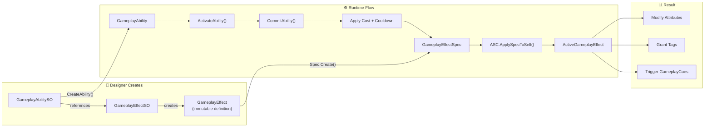
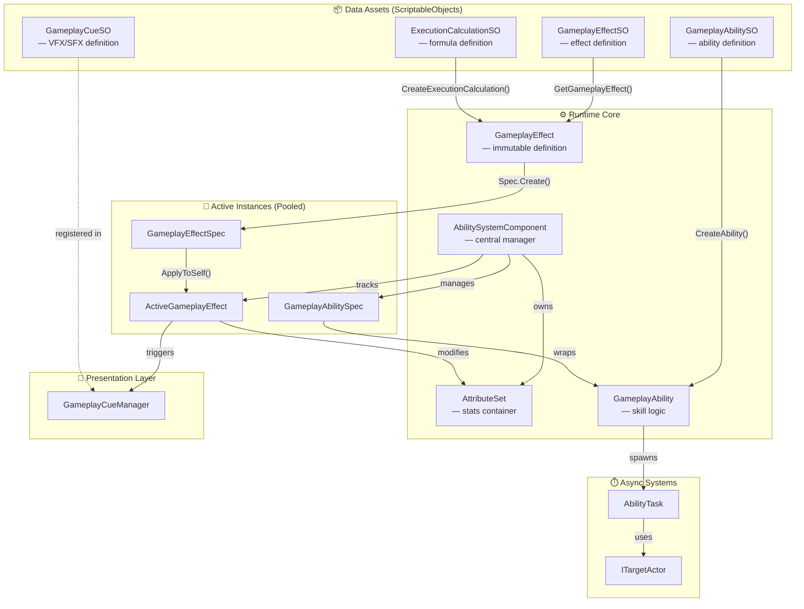
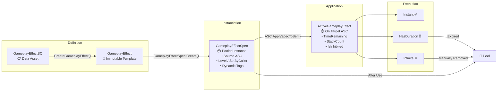
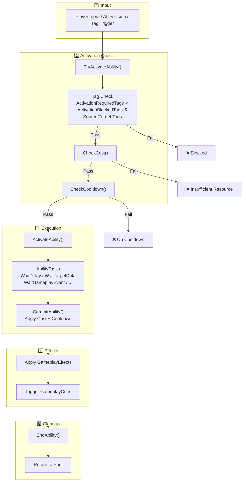
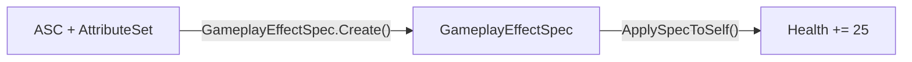

> **Note:** This document was written with AI assistance. If you are looking for absolute accuracy, please read the source code directly. Both the **source code** and the **examples** were written by the author.

[**English**] | [**简体中文**](README.SCH.md)

# CycloneGames.GameplayAbilities

A powerful, data-driven Gameplay Ability System (GAS) for Unity, inspired by Unreal Engine 5's GAS architecture.

Whether you are building an RPG, MOBA, action game, or any project with complex character abilities, buffs, and stats — this framework provides a production-ready, scalable foundation.

---

## Key Features

| Feature                    | Description                                                                                   |
| -------------------------- | --------------------------------------------------------------------------------------------- |
| **Data-Driven Abilities**  | Define abilities entirely in ScriptableObjects — designers iterate without code changes       |
| **GameplayEffects**        | Instant / Duration / Infinite effects with stacking, periodic ticks, and overflow policies    |
| **Tag-Based Architecture** | Decouple all logic through hierarchical GameplayTags — abilities, states, cooldowns, factions |
| **Attribute System**       | Flexible character stats with validation hooks, derived attributes, and modifier aggregation  |
| **AbilityTasks**           | 10+ built-in async tasks — delays, event waits, attribute watches, targeting, repeats         |
| **Targeting System**       | Sphere overlap, line trace, cone trace, ground select — or write your own `ITargetActor`      |
| **GameplayCues**           | VFX/SFX completely separated from gameplay logic — artists iterate independently              |
| **Execution Calculations** | Complex multi-attribute damage formulas as reusable data assets                               |
| **Object Pooling**         | Zero-GC runtime with three-tier adaptive pools, platform-aware sizing, and health monitoring  |
| **Network-Ready**          | Transport-agnostic prediction keys and execution policies (Local / Server / Predicted)        |

---

## Table of Contents

**I. Understanding GAS**

1. [Why GAS?](#1-why-gas) — The problem it solves
2. [Mental Model](#2-mental-model) — Glossary and how pieces fit together
3. [Architecture](#3-architecture) — System diagrams

**II. Getting Started** 4. [Quick Start](#4-quick-start-build-a-heal-ability) — Build a Heal ability from scratch

**III. Core Systems** 5. [GameplayTags](#5-gameplaytags) — The universal language 6. [Attributes & AttributeSets](#6-attributes--attributesets) — Character stats 7. [GameplayEffects](#7-gameplayeffects) — Modifiers, duration, stacking 8. [GameplayAbilities](#8-gameplayabilities) — The ability lifecycle

**IV. Advanced Systems** 9. [AbilityTasks](#9-abilitytasks) — Async ability logic 10. [Targeting System](#10-targeting-system) — Finding and selecting targets 11. [Execution Calculations](#11-execution-calculations) — Complex formulas 12. [GameplayCues](#12-gameplaycues) — VFX/SFX management 13. [Networking](#13-networking) — Prediction and replication

**V. Production** 14. [Object Pooling & Performance](#14-object-pooling--performance) — Zero-GC strategies 15. [Editor Tools & Debugging](#15-editor-tools--debugging) — Inspector, debugger window, runtime overlay 16. [Samples Walkthrough](#16-samples-walkthrough) — Fireball, Purify, Leveling 17. [FAQ & Troubleshooting](#17-faq--troubleshooting) 18. [Dependencies](#18-dependencies)

---

# I. Understanding GAS

## 1. Why GAS?

### The Problem

Ability systems in games tend to start simple — a `UseFireball()` method, a few boolean flags — but quickly grow into unmanageable complexity:

| Stage       | What Happens                                                                  | The Pain                                                                         |
| ----------- | ----------------------------------------------------------------------------- | -------------------------------------------------------------------------------- |
| **Early**   | `PlayerController.UseFireball()` hard-coded                                   | Works for 1 character, but enemies need the same skill → copy-paste              |
| **Growing** | A monolithic `SkillManager` with `isStunned`, `isPoisoned`, `isBurning` flags | Fragile state machine; every new interaction adds exponential `if/else` branches |
| **Late**    | Designers can't tweak `damage = 10` without touching C# code                  | Iteration speed drops; bugs from mixing data and logic in one file               |

This trajectory is unsustainable. The number of potential interactions between N skills and M status effects grows as O(N×M), creating the classic "spaghetti code" problem.

### The GAS Solution

GAS solves this by treating abilities and effects as **data**, not functions:

- **Abilities are data assets** — a `ScriptableObject` defines what an ability is (cost, cooldown, tags, effects). Your character merely "has" an ability identified by a tag.
- **Status effects are data objects** — a character is not `isPoisoned`; instead it has an active instance of a "Poison" `GameplayEffect` that carries its own duration, periodic tick, tag grants, and stacking rules. The system manages its lifecycle automatically.
- **Tags replace booleans** — instead of `if (isCasting && !isStunned)`, the system asks "does the owner have `State.Casting`?" and "does the owner lack `State.Stunned`?". Tags are hierarchical, queryable, and entirely data-driven.

### Comparison

| Aspect                  | Traditional System                 | GAS                                                 |
| ----------------------- | ---------------------------------- | --------------------------------------------------- |
| **Architecture**        | Monolithic `SkillManager`          | Decoupled `AbilitySystemComponent` + data assets    |
| **Data & Logic**        | Mixed in one C# file               | Strictly separated — SO for data, class for logic   |
| **State Management**    | Boolean flags + manual timers      | Self-managing `GameplayEffect` instances            |
| **Extensibility**       | Modify core classes to add content | Add new SO assets — zero existing code changes      |
| **Reusability**         | Player-specific code               | Same ability asset works on Player, AI, or a barrel |
| **Interaction Scaling** | O(N×M) if/else branches            | O(1) tag lookups                                    |

---

## 2. Mental Model

If you have never used Unreal Engine's GAS, this section maps every key concept so you can build a clear mental picture before reading any code.

### Glossary

| Concept                          | What It Is                                                                                                           | Analogy                                |
| -------------------------------- | -------------------------------------------------------------------------------------------------------------------- | -------------------------------------- |
| **AbilitySystemComponent (ASC)** | The central manager on each actor. Owns abilities, effects, attributes, and tags.                                    | The actor's "ability brain"            |
| **GameplayAbility**              | A discrete action an actor can perform (attack, heal, dash). Contains activation logic.                              | A "skill card" in the actor's hand     |
| **GameplayAbilitySO**            | ScriptableObject that defines an ability's data (name, tags, cost, cooldown). Creates the runtime `GameplayAbility`. | The "card template" designers edit     |
| **GameplayAbilitySpec**          | Runtime wrapper that tracks a granted ability's state (level, active status).                                        | The actor's "equipped card slot"       |
| **GameplayEffect**               | Immutable definition of something that happens to an actor — modifies attributes, grants tags, ticks periodically.   | A "recipe" written on a card           |
| **GameplayEffectSO**             | ScriptableObject for designers to configure a GameplayEffect in the Inspector.                                       | The "recipe card template"             |
| **GameplayEffectSpec**           | A stamped-out, mutable instance of a GameplayEffect carrying context (source, level, SetByCaller values).            | A filled-out "recipe order"            |
| **ActiveGameplayEffect**         | A GameplayEffectSpec that is currently applied to an ASC — tracks time remaining, stack count, inhibition.           | The "recipe cooking on the stove"      |
| **GameplayAttribute**            | A single numeric stat (Health, Mana, AttackPower). Floats modified by GameplayEffects.                               | One line on a character sheet          |
| **AttributeSet**                 | A grouped collection of related GameplayAttributes with validation hooks.                                            | A page on the character sheet          |
| **GameplayTag**                  | A hierarchical string identifier (`Ability.Skill.Fireball`, `Status.Debuff.Poison`).                                 | A sticky label                         |
| **GameplayTagContainer**         | A set of GameplayTags, used for queries (`HasTag`, `HasAll`, `HasAny`).                                              | A collection of sticky labels          |
| **AbilityTask**                  | An async operation inside an ability — wait for time, wait for input, watch for tag changes.                         | A "step" in a recipe                   |
| **ITargetActor**                 | An object that performs spatial queries (sphere overlap, raycast) to find targets.                                   | A "radar scanner"                      |
| **TargetData**                   | The result of a targeting query — contains hit actors and physics info.                                              | The "scan results"                     |
| **GameplayCue**                  | A VFX/SFX triggered by tag, completely decoupled from gameplay logic.                                                | A "special effect sticker" on a recipe |
| **ExecutionCalculation**         | A code class that computes complex multi-attribute formulas (damage = ATK × 1.5 − DEF × 0.5).                        | A "calculator subroutine"              |

### How the Pieces Fit Together


```mermaid
flowchart LR
    subgraph Designer["🎨 Designer Creates"]
        direction TB
        AbilitySO["GameplayAbilitySO"]
        EffectSO["GameplayEffectSO"]
        EffectDef["GameplayEffect<br/>(immutable definition)"]
        AbilitySO -->|references| EffectSO
        EffectSO -->|creates| EffectDef
    end

    subgraph Runtime["⚙️ Runtime Flow"]
        direction TB
        Ability["GameplayAbility"]
        Activate["ActivateAbility()"]
        Commit["CommitAbility()"]
        CostCD["Apply Cost + Cooldown"]
        Spec["GameplayEffectSpec"]
        Apply["ASC.ApplySpecToSelf()"]
        ActiveGE["ActiveGameplayEffect"]
        Ability --> Activate --> Commit --> CostCD
        CostCD --> Spec --> Apply --> ActiveGE
    end

    subgraph Result["📊 Result"]
        direction TB
        ModAttr["Modify Attributes"]
        GrantTag["Grant Tags"]
        TrigCue["Trigger GameplayCues"]
    end

    AbilitySO -->|"CreateAbility()"| Ability
    EffectDef -->|"Spec.Create()"| Spec
    ActiveGE --> ModAttr
    ActiveGE --> GrantTag
    ActiveGE --> TrigCue
```

---

## 3. Architecture

### System Architecture Overview


```mermaid
flowchart TB
    subgraph Data["📦 Data Assets (ScriptableObjects)"]
        GAbilitySO["GameplayAbilitySO<br/>― ability definition"]
        GEffectSO["GameplayEffectSO<br/>― effect definition"]
        GCueSO["GameplayCueSO<br/>― VFX/SFX definition"]
        ExecCalcSO["ExecutionCalculationSO<br/>― formula definition"]
    end

    subgraph Runtime["⚙️ Runtime Core"]
        ASC["AbilitySystemComponent<br/>― central manager"]
        AttrSet["AttributeSet<br/>― stats container"]
        GAbility["GameplayAbility<br/>― skill logic"]
        GEffect["GameplayEffect<br/>― immutable definition"]
    end

    subgraph Active["🔄 Active Instances (Pooled)"]
        GSpec["GameplayAbilitySpec"]
        GESpec["GameplayEffectSpec"]
        ActiveGE["ActiveGameplayEffect"]
    end

    subgraph Async["⏱️ Async Systems"]
        Task["AbilityTask"]
        Target["ITargetActor"]
    end

    subgraph Cue["🎨 Presentation Layer"]
        CueMgr["GameplayCueManager"]
    end

    GAbilitySO -->|"CreateAbility()"| GAbility
    GEffectSO -->|"GetGameplayEffect()"| GEffect
    ExecCalcSO -->|"CreateExecutionCalculation()"| GEffect

    ASC -->|owns| AttrSet
    ASC -->|manages| GSpec
    ASC -->|tracks| ActiveGE

    GSpec -->|wraps| GAbility
    GAbility -->|spawns| Task
    Task -->|uses| Target

    GEffect -->|"Spec.Create()"| GESpec
    GESpec -->|"ApplyToSelf()"| ActiveGE
    ActiveGE -->|modifies| AttrSet
    ActiveGE -->|triggers| CueMgr

    GCueSO -.->|registered in| CueMgr
```

### GameplayEffect Lifecycle


```mermaid
flowchart LR
    subgraph Def["Definition"]
        SO["GameplayEffectSO<br/>📋 Data Asset"]
        GE["GameplayEffect<br/>📝 Immutable Template"]
    end

    subgraph Inst["Instantiation"]
        Spec["GameplayEffectSpec<br/>📦 Pooled Instance<br/>• Source ASC<br/>• Level / SetByCaller<br/>• Dynamic Tags"]
    end

    subgraph Apply["Application"]
        Active["ActiveGameplayEffect<br/>⏱️ On Target ASC<br/>• TimeRemaining<br/>• StackCount<br/>• IsInhibited"]
    end

    subgraph Exec["Execution"]
        Instant["Instant ✅"]
        Duration["HasDuration ⏳"]
        Infinite["Infinite ♾️"]
    end

    SO -->|"CreateGameplayEffect()"| GE
    GE -->|"GameplayEffectSpec.Create()"| Spec
    Spec -->|"ASC.ApplySpecToSelf()"| Active

    Active --> Instant
    Active --> Duration
    Active --> Infinite

    Duration -->|"Expired"| Pool["🔄 Pool"]
    Infinite -->|"Manually Removed"| Pool
    Spec -->|"After Use"| Pool
```

### Ability Execution Flow


```mermaid
flowchart TB
    subgraph Input["1️⃣ Input"]
        Trigger["Player Input / AI Decision / Tag Trigger"]
    end

    subgraph Check["2️⃣ Activation Check"]
        Try["TryActivateAbility()"]
        Tags["Tag Check<br/>ActivationRequiredTags ✓<br/>ActivationBlockedTags ✗<br/>Source/Target Tags"]
        Cost["CheckCost()"]
        CD["CheckCooldown()"]
    end

    subgraph Run["3️⃣ Execution"]
        Activate["ActivateAbility()"]
        Tasks["AbilityTasks<br/>WaitDelay / WaitTargetData<br/>WaitGameplayEvent / ..."]
        Commit["CommitAbility()<br/>Apply Cost + Cooldown"]
    end

    subgraph Effects["4️⃣ Effects"]
        ApplyGE["Apply GameplayEffects"]
        Cues["Trigger GameplayCues"]
    end

    subgraph End["5️⃣ Cleanup"]
        EndAbility["EndAbility()"]
        ReturnPool["Return to Pool"]
    end

    Trigger --> Try
    Try --> Tags
    Tags -->|Pass| Cost
    Tags -->|Fail| Blocked["❌ Blocked"]
    Cost -->|Pass| CD
    Cost -->|Fail| NoCost["❌ Insufficient Resource"]
    CD -->|Pass| Activate
    CD -->|Fail| OnCD["❌ On Cooldown"]

    Activate --> Tasks
    Tasks --> Commit
    Commit --> ApplyGE
    ApplyGE --> Cues
    Cues --> EndAbility
    EndAbility --> ReturnPool
```

---

# II. Getting Started

## 4. Quick Start: Build a Heal Ability

This step-by-step tutorial creates a fully functional Heal ability from scratch. By the end you will understand all core concepts.

### The Simplest GAS Flow (No Abilities Needed)

Before building a full ability, understand the absolute minimum data flow. You can modify attributes with **just an ASC, an AttributeSet, and a GameplayEffect** — no ability required:

```csharp
// 1. Get the ASC
var asc = GetComponent<AbilitySystemComponentHolder>().AbilitySystemComponent;
asc.InitAbilityActorInfo(this, gameObject);

// 2. Add attributes
var attrs = new PlayerAttributeSet();
asc.AddAttributeSet(attrs);

// 3. Create an effect and apply it — done!
var healEffect = new GameplayEffect("Heal", EDurationPolicy.Instant, 0, 0,
    new() { new ModifierInfo(attrs.Health, EAttributeModifierOperation.Add, 25f) });
asc.ApplyGameplayEffectSpecToSelf(GameplayEffectSpec.Create(healEffect, asc));
// Health is now +25. That's it — 3 lines of real logic.
```


```mermaid
flowchart LR
    A["ASC + AttributeSet"] -->|"GameplayEffectSpec.Create()"| B["GameplayEffectSpec"]
    B -->|"ApplySpecToSelf()"| C["Health += 25"]
```

**GameplayAbilities add structure on top of this flow** — activation checks, cost/cooldown, async tasks, targeting — but the core data path is always: **Effect → Spec → Apply → Attribute changes**.

### Prerequisites

- Unity 2021.3+
- `CycloneGames.GameplayAbilities` package installed
- Dependencies installed: `GameplayTags`, `Logger`, `AssetManagement`, `Factory`

### Step 1 — Create an AttributeSet

An `AttributeSet` holds character stats. Every attribute is a `GameplayAttribute` — a named float that effects can modify.

```csharp
using CycloneGames.GameplayAbilities.Runtime;
using UnityEngine;

public class PlayerAttributeSet : AttributeSet
{
    public readonly GameplayAttribute Health    = new("Player.Attribute.Health");
    public readonly GameplayAttribute MaxHealth = new("Player.Attribute.MaxHealth");
    public readonly GameplayAttribute Mana      = new("Player.Attribute.Mana");
    public readonly GameplayAttribute MaxMana   = new("Player.Attribute.MaxMana");

    // Called BEFORE a value changes — use for clamping
    public override void PreAttributeChange(GameplayAttribute attribute, ref float newValue)
    {
        if (attribute.Name == Health.Name)
            newValue = Mathf.Clamp(newValue, 0, GetCurrentValue(MaxHealth));
        if (attribute.Name == Mana.Name)
            newValue = Mathf.Clamp(newValue, 0, GetCurrentValue(MaxMana));
    }

    // Called AFTER a value changes — use for side effects
    public override void PostAttributeChange(GameplayAttribute attribute, float oldValue, float newValue)
    {
        if (attribute.Name == Health.Name && newValue <= 0 && oldValue > 0)
            Debug.Log("Character died!");
    }
}
```

### Step 2 — Set Up the Character

```csharp
using CycloneGames.GameplayAbilities.Runtime;
using UnityEngine;

[RequireComponent(typeof(AbilitySystemComponentHolder))]
public class PlayerCharacter : MonoBehaviour
{
    [SerializeField] private GameplayAbilitySO healAbilitySO;

    private AbilitySystemComponentHolder ascHolder;
    private PlayerAttributeSet attributes;

    void Awake()
    {
        ascHolder = GetComponent<AbilitySystemComponentHolder>();
    }

    void Start()
    {
        var asc = ascHolder.AbilitySystemComponent;

        // 1. Initialize actor info (required before any ASC operation)
        asc.InitAbilityActorInfo(this, gameObject);

        // 2. Add attributes
        attributes = new PlayerAttributeSet();
        asc.AddAttributeSet(attributes);

        // 3. Set initial values via an Instant effect
        var initEffect = new GameplayEffect("GE_Init", EDurationPolicy.Instant, 0, 0,
            new() {
                new ModifierInfo(attributes.MaxHealth, EAttributeModifierOperation.Override, 100),
                new ModifierInfo(attributes.Health,    EAttributeModifierOperation.Override, 100),
                new ModifierInfo(attributes.MaxMana,   EAttributeModifierOperation.Override, 50),
                new ModifierInfo(attributes.Mana,      EAttributeModifierOperation.Override, 50),
            });
        asc.ApplyGameplayEffectSpecToSelf(GameplayEffectSpec.Create(initEffect, asc));

        // 4. Grant abilities
        if (healAbilitySO != null)
            asc.GrantAbility(healAbilitySO.CreateAbility());
    }

    void Update()
    {
        if (Input.GetKeyDown(KeyCode.H))
        {
            var asc = ascHolder.AbilitySystemComponent;
            foreach (var spec in asc.GetActivatableAbilities())
            {
                if (spec.Ability.AbilityTags.HasTag("Ability.Action.Heal"))
                {
                    asc.TryActivateAbility(spec);
                    break;
                }
            }
        }
    }
}
```

### Step 3 — Create the Ability (Runtime Logic)

```csharp
using CycloneGames.GameplayAbilities.Runtime;

public class HealAbility : GameplayAbility
{
    public override void ActivateAbility(
        GameplayAbilityActorInfo actorInfo,
        GameplayAbilitySpec spec,
        GameplayAbilityActivationInfo activationInfo)
    {
        // CommitAbility applies cost, cooldown, and commit effects
        CommitAbility(actorInfo, spec);
        EndAbility();
    }

    public override GameplayAbility CreatePoolableInstance() => new HealAbility();
}
```

### Step 4 — Create the Ability (ScriptableObject)

```csharp
using UnityEngine;
using CycloneGames.GameplayAbilities.Runtime;

[CreateAssetMenu(fileName = "GA_Heal", menuName = "GAS/Abilities/Heal")]
public class HealAbilitySO : GameplayAbilitySO
{
    public override GameplayAbility CreateAbility()
    {
        var ability = new HealAbility();
        InitializeAbility(ability); // Copies all Inspector data to the runtime instance
        return ability;
    }
}
```

### Step 5 — Create GameplayEffect Assets

In the Unity Editor, create three `GameplayEffectSO` assets:

| Asset Name         | Duration Policy  | Modifiers  | Granted Tags          |
| ------------------ | ---------------- | ---------- | --------------------- |
| `GE_Heal`          | Instant          | Health +25 | —                     |
| `GE_Heal_Cost`     | Instant          | Mana −10   | —                     |
| `GE_Heal_Cooldown` | HasDuration (5s) | —          | `Cooldown.Skill.Heal` |

### Step 6 — Configure the Ability Asset

Create a `GA_Heal` asset and configure in Inspector:

- **Ability Tags**: `Ability.Action.Heal`
- **Cost Effect**: `GE_Heal_Cost`
- **Cooldown Effect**: `GE_Heal_Cooldown`
- **Commit Gameplay Effects**: `GE_Heal`

### Step 7 — Wire Up in Scene

1. Create a GameObject with `AbilitySystemComponentHolder` + your `PlayerCharacter` component
2. Drag `GA_Heal` into the `healAbilitySO` field
3. Press Play, press **H** — the character heals, spends mana, and enters cooldown

---

# III. Core Systems

## 5. GameplayTags

GameplayTags are the **universal language** of GAS. Every interaction — activation rules, immunities, cooldowns, targeting filters — is expressed through tags rather than direct code references.

### Tag Conventions

```
Ability.Skill.Fireball          ← identifies an ability
Ability.Passive.Regeneration    ← passive ability
Cooldown.Skill.Fireball         ← applied during cooldown
Status.Debuff.Poison            ← status effect
Status.Buff.Shield              ← buff
State.Casting                   ← transient state
State.Dead                      ← permanent state
Damage.Type.Fire                ← damage classification
Faction.Player                  ← faction membership
GameplayCue.Impact.Fireball     ← VFX/SFX trigger
Event.Character.LeveledUp       ← gameplay event
```

### Using Tags

```csharp
// Check if character has a tag
if (asc.CombinedTags.HasTag("Status.Debuff.Poison"))
{
    // Character is poisoned
}

// Remove all poison effects by their granted tag
var poisonTag = GameplayTagContainer.FromTag("Status.Debuff.Poison");
targetASC.RemoveActiveEffectsWithGrantedTags(poisonTag);
```

### Tag Containers on Different Objects

| Container                         | Where           | Purpose                                                               |
| --------------------------------- | --------------- | --------------------------------------------------------------------- |
| **AbilityTags**                   | GameplayAbility | Identifies the ability (`Ability.Skill.Fireball`)                     |
| **AssetTags**                     | GameplayEffect  | Metadata describing the effect (`Damage.Type.Fire`)                   |
| **GrantedTags**                   | GameplayEffect  | Tags applied to target while effect is active (`Status.Burning`)      |
| **ActivationBlockedTags**         | GameplayAbility | If owner has ANY of these → ability cannot activate                   |
| **ActivationRequiredTags**        | GameplayAbility | Owner must have ALL of these → otherwise blocked                      |
| **ActivationOwnedTags**           | GameplayAbility | Tags granted to owner while ability is active                         |
| **CancelAbilitiesWithTag**        | GameplayAbility | Active abilities with these tags are cancelled                        |
| **BlockAbilitiesWithTag**         | GameplayAbility | Abilities with these tags cannot activate                             |
| **SourceRequiredTags**            | GameplayAbility | Source (caster's ASC) must have all these tags                        |
| **SourceBlockedTags**             | GameplayAbility | Source must NOT have any of these tags                                |
| **TargetRequiredTags**            | GameplayAbility | Target's ASC must have all these tags                                 |
| **TargetBlockedTags**             | GameplayAbility | Target must NOT have any of these tags                                |
| **ApplicationTagRequirements**    | GameplayEffect  | Target must satisfy tag requirements for effect to apply              |
| **OngoingTagRequirements**        | GameplayEffect  | Effect is inhibited if requirements stop being met                    |
| **RemoveGameplayEffectsWithTags** | GameplayEffect  | On application, remove effects whose GrantedTags match                |
| **ImmunityTags**                  | ASC             | Incoming effects with matching Asset/GrantedTags are blocked entirely |
| **GameplayCues**                  | GameplayEffect  | Tags that trigger VFX/SFX through GameplayCueManager                  |

### Tag Events

You can react to tag changes on any ASC:

```csharp
asc.RegisterTagEventCallback("Status.Debuff.Poison", (tag, newCount) =>
{
    if (newCount > 0) ShowPoisonIcon();
    else              HidePoisonIcon();
});
```

---

## 6. Attributes & AttributeSets

### GameplayAttribute

A `GameplayAttribute` is a named float value with two layers:

- **BaseValue** — permanent, set by Instant effects or direct assignment
- **CurrentValue** — BaseValue plus all active modifiers from Duration/Infinite effects

```csharp
// Listen to value changes
attribute.OnCurrentValueChanged += (oldVal, newVal) => UpdateHealthBar(newVal);
attribute.OnBaseValueChanged    += (oldVal, newVal) => { /* ... */ };
```

### AttributeSet

Group related attributes and add validation logic:

```csharp
public class CharacterAttributeSet : AttributeSet
{
    public readonly GameplayAttribute Health      = new("Character.Health");
    public readonly GameplayAttribute MaxHealth   = new("Character.MaxHealth");
    public readonly GameplayAttribute AttackPower = new("Character.AttackPower");
    public readonly GameplayAttribute Defense     = new("Character.Defense");

    // Clamp before change
    public override void PreAttributeChange(GameplayAttribute attribute, ref float newValue)
    {
        if (attribute.Name == Health.Name)
            newValue = Mathf.Clamp(newValue, 0, GetCurrentValue(MaxHealth));
    }

    // React after change
    public override void PostAttributeChange(GameplayAttribute attr, float oldVal, float newVal) { }

    // Intercept instant effects (e.g., apply armor reduction to damage)
    public override void PreProcessInstantEffect(GameplayEffectSpec spec) { }
    public override void PostGameplayEffectExecute(GameplayEffectModCallbackData data) { }

    // Derived attribute example
    public override float GetCurrentValue(GameplayAttribute attribute)
    {
        if (attribute.Name == "Character.HealthPercent")
        {
            float max = GetCurrentValue(MaxHealth);
            return max > 0 ? GetCurrentValue(Health) / max : 0f;
        }
        return base.GetCurrentValue(attribute);
    }
}
```

### Accessing Attributes

```csharp
var healthAttr = asc.GetAttribute("Character.Health");
float current  = healthAttr.CurrentValue;
float baseVal  = healthAttr.BaseValue;
```

---

## 7. GameplayEffects

GameplayEffects are the **building blocks** of GAS. They modify attributes, grant tags, trigger cues, and manage their own lifecycle.

### Duration Policies

| Policy          | Behavior                                     | Use Cases                        |
| --------------- | -------------------------------------------- | -------------------------------- |
| **Instant**     | Applies modifiers once, immediately consumed | Damage, healing, mana cost       |
| **HasDuration** | Active for a fixed time, then auto-removed   | Buffs, debuffs, cooldowns, DoTs  |
| **Infinite**    | Active until manually removed                | Equipment stats, auras, passives |

### Modifiers

Each modifier targets one attribute with an operation:

| Operation    | Effect                      |
| ------------ | --------------------------- |
| **Add**      | `CurrentValue += Magnitude` |
| **Multiply** | `CurrentValue *= Magnitude` |
| **Division** | `CurrentValue /= Magnitude` |
| **Override** | `CurrentValue = Magnitude`  |

> **Duration/Infinite modifiers** are aggregated — they modify `CurrentValue` while `BaseValue` stays unchanged. When the effect is removed, the modifier is automatically reversed.
>
> **Instant modifiers** permanently change `BaseValue`.

### Creating Effects in Code

```csharp
// Poison DoT: -5 HP every 1s for 10s
var poison = new GameplayEffect(
    name: "Poison DoT",
    durationPolicy: EDurationPolicy.HasDuration,
    duration: 10f,
    period: 1f,
    modifiers: new() { new ModifierInfo(healthAttr, EAttributeModifierOperation.Add, -5f) },
    grantedTags: new GameplayTagContainer { "Status.Debuff.Poison" }
);
```

### Stacking

Configure how multiple applications of the same effect interact:

| Property             | Options                                                                        | Description                       |
| -------------------- | ------------------------------------------------------------------------------ | --------------------------------- |
| **StackingType**     | `None` / `AggregateBySource` / `AggregateByTarget`                             | Grouping axis                     |
| **StackLimit**       | int                                                                            | Maximum stack count               |
| **DurationPolicy**   | `RefreshOnSuccessfulApplication` / `NeverRefresh`                              | Whether new stacks reset duration |
| **ExpirationPolicy** | `ClearEntireStack` / `RemoveSingleStackAndRefreshDuration` / `RefreshDuration` | What happens when a stack expires |

### Overflow Effects

When an effect would be applied but the target has already reached `StackLimit`:

- **OverflowEffects** — a list of secondary GameplayEffects to apply instead
- **DenyOverflowApplication** — if `true`, the original effect is not applied at all (only overflow effects fire)

### OngoingTagRequirements & Inhibition

Duration/Infinite effects can be temporarily **inhibited** (suppressed) rather than removed:

- Define `OngoingTagRequirements` on the effect
- If the target's tags stop meeting the requirements, the effect's modifiers are suspended
- When requirements are met again, modifiers resume
- The `ActiveGameplayEffect.IsInhibited` property and `OnInhibitionChanged` event expose this state

### ExecutePeriodicEffectOnApplication

Set to `true` to trigger the first periodic tick immediately when the effect is applied, rather than waiting one full period.

### SetByCaller Magnitudes

Pass dynamic values into an effect at runtime:

```csharp
var spec = GameplayEffectSpec.Create(damageEffect, sourceASC);
spec.SetByCallerMagnitude("Damage.Base", 50f);
asc.ApplyGameplayEffectSpecToSelf(spec);
```

### DynamicGrantedTags & DynamicAssetTags

Add extra tags to a specific `GameplayEffectSpec` instance at runtime, beyond what the base definition provides:

```csharp
spec.DynamicGrantedTags.AddTag("Status.Buff.Empowered");
spec.DynamicAssetTags.AddTag("Source.Player");
```

### Custom Application Requirements

Implement `ICustomApplicationRequirement` to add arbitrary logic gates:

```csharp
public class RequireMinHealth : ICustomApplicationRequirement
{
    public bool CanApplyGameplayEffect(GameplayEffectSpec spec, AbilitySystemComponent target)
    {
        var health = target.GetAttribute("Character.Health");
        return health != null && health.CurrentValue > 10f;
    }
}
```

### Attribute Snapshotting

Modifiers can capture attribute values at different times:

- **Snapshot** — the source's attribute value is captured at effect creation time
- **NotSnapshot** — the source's attribute value is read live when recalculating

Configure via `EGameplayEffectAttributeCaptureSnapshot` on `ModifierInfo`.

---

## 8. GameplayAbilities

### Lifecycle

```
GrantAbility()          → Ability is added to the ASC
  └─ OnGiveAbility()    → (optional) called once when granted

TryActivateAbility()    → Runs all checks
  ├─ Tag requirements   → ActivationRequired/Blocked/Source/Target Tags
  ├─ CheckCost()        → Sufficient resources?
  └─ CheckCooldown()    → No cooldown tag present?

ActivateAbility()       → Your logic runs here
  ├─ AbilityTasks       → Async operations (delays, targeting, etc.)
  └─ CommitAbility()    → Applies Cost + Cooldown effects

EndAbility()            → Cleanup, return to pool
  └─ ASC fires OnAbilityEndedEvent
```

### Creating an Ability

Every ability needs two classes:

**1. Runtime Logic** — extends `GameplayAbility`:

```csharp
public class GA_Fireball : GameplayAbility
{
    private GameplayEffect damageEffect;
    private float damageMultiplier;

    public void SetupData(GameplayEffect damage, float multiplier)
    {
        damageEffect = damage;
        damageMultiplier = multiplier;
    }

    public override void ActivateAbility(
        GameplayAbilityActorInfo actorInfo,
        GameplayAbilitySpec spec,
        GameplayAbilityActivationInfo activationInfo)
    {
        CommitAbility(actorInfo, spec);

        // Create spec & pass dynamic data
        var dmgSpec = MakeOutgoingGameplayEffectSpec(damageEffect, spec.Level);
        dmgSpec.SetByCallerMagnitude("Damage.Multiplier", damageMultiplier);

        // Apply to target
        var targetASC = FindTarget();
        ApplyGameplayEffectToTarget(dmgSpec, targetASC);

        EndAbility();
    }

    public override GameplayAbility CreatePoolableInstance() => new GA_Fireball();
}
```

**2. ScriptableObject** — extends `GameplayAbilitySO`:

```csharp
[CreateAssetMenu(menuName = "GAS/Abilities/Fireball")]
public class GA_Fireball_SO : GameplayAbilitySO
{
    [SerializeField] private GameplayEffectSO damageEffectSO;
    [SerializeField] private float damageMultiplier = 1.5f;

    public override GameplayAbility CreateAbility()
    {
        var ability = new GA_Fireball();
        InitializeAbility(ability); // Copies tags, cost, cooldown from Inspector
        ability.SetupData(damageEffectSO.GetGameplayEffect(), damageMultiplier);
        return ability;
    }
}
```

### Ability Triggers

Abilities can auto-activate in response to events or tag changes:

```csharp
// In GameplayAbilitySO Inspector, add an AbilityTriggerData:
// TriggerTag: "Event.Character.Hit"
// TriggerSource: GameplayEvent

// Or configure programmatically:
ability.AbilityTriggers = new List<AbilityTriggerData>
{
    new() { TriggerTag = "Event.Character.Hit", TriggerSource = EAbilityTriggerSource.GameplayEvent },
    new() { TriggerTag = "Status.Debuff.Poison", TriggerSource = EAbilityTriggerSource.OwnedTagAdded },
};
```

| TriggerSource     | When It Fires                                                    |
| ----------------- | ---------------------------------------------------------------- |
| `GameplayEvent`   | When `ASC.HandleGameplayEvent()` is called with the matching tag |
| `OwnedTagAdded`   | When the trigger tag is added to the ASC's combined tags         |
| `OwnedTagRemoved` | When the trigger tag is removed from the ASC                     |

### Source/Target Tags

Beyond standard `ActivationRequired/BlockedTags` (which check the **owner's** tags), abilities support four additional tag containers:

| Container              | Checks Against | Purpose                                                  |
| ---------------------- | -------------- | -------------------------------------------------------- |
| **SourceRequiredTags** | Caster's ASC   | Caster must have all of these to activate                |
| **SourceBlockedTags**  | Caster's ASC   | Caster must NOT have any of these                        |
| **TargetRequiredTags** | Target's ASC   | Target must have all of these (via `CanApplyToTarget()`) |
| **TargetBlockedTags**  | Target's ASC   | Target must NOT have any of these                        |

**Use case**: A healing ability might require `SourceRequiredTags = State.InHealingStance` (caster check) and `TargetBlockedTags = State.Dead` (can't heal dead targets).

### InputPressed / InputReleased

Virtual hooks for input-driven abilities (e.g., charged attacks, hold-to-channel):

```csharp
public override void InputPressed(GameplayAbilitySpec spec)
{
    // Called when the bound input action is pressed while ability is active
    StartCharging();
}

public override void InputReleased(GameplayAbilitySpec spec)
{
    // Called when released
    ReleaseCharge();
    EndAbility();
}
```

These methods are deliberately **input-agnostic** — they don't reference any specific input system. Your input layer (Unity Input System, CycloneGames.InputSystem's R3 Observables, etc.) calls them.

### Lifecycle Events on ASC

```csharp
asc.OnAbilityActivated += (ability) => { /* fired on activation */ };
asc.OnAbilityCommitted += (ability) => { /* fired on commit   */ };
asc.OnAbilityEndedEvent += (ability) => { /* fired on end      */ };
```

### Instancing Policies

| Policy                  | Behavior                                        | Use Case                              |
| ----------------------- | ----------------------------------------------- | ------------------------------------- |
| `NonInstanced`          | Shared instance, no per-actor state             | Simple instant abilities              |
| `InstancedPerActor`     | One instance per ASC, reused across activations | Most abilities                        |
| `InstancedPerExecution` | New instance per activation                     | Abilities with overlapping executions |

---

# IV. Advanced Systems

## 9. AbilityTasks

AbilityTasks enable **asynchronous, multi-step ability logic**. Without them, everything would run synchronously inside `ActivateAbility()`.

### Built-In Tasks

| Task                              | Purpose                                            |
| --------------------------------- | -------------------------------------------------- |
| `AbilityTask_WaitDelay`           | Wait for a time duration                           |
| `AbilityTask_WaitTargetData`      | Wait for targeting to provide target data          |
| `AbilityTask_WaitGameplayEvent`   | Wait for a gameplay event with a specific tag      |
| `AbilityTask_WaitGameplayTag`     | Wait for a tag to be added or removed from the ASC |
| `AbilityTask_WaitGameplayEffect`  | Wait for an effect to be applied or removed        |
| `AbilityTask_WaitAttributeChange` | Wait for an attribute's value to change            |
| `AbilityTask_WaitConfirmCancel`   | Wait for external confirm/cancel signals           |
| `AbilityTask_WaitAbilityActivate` | Wait for another ability to activate               |
| `AbilityTask_WaitAbilityEnd`      | Wait for another ability to end                    |
| `AbilityTask_Repeat`              | Repeatedly execute logic at an interval            |

### Usage Patterns

**Callback style:**

```csharp
public override void ActivateAbility(...)
{
    CommitAbility(actorInfo, spec);

    var waitTask = NewAbilityTask<AbilityTask_WaitDelay>();
    waitTask.WaitTime = 2.0f;
    waitTask.OnFinished = () =>
    {
        ApplyDamage();
        EndAbility();
    };
    waitTask.Activate();
}
```

**Async/await style:**

```csharp
public override async void ActivateAbility(...)
{
    CommitAbility(actorInfo, spec);

    // Step 1: Charge up
    var chargeTask = NewAbilityTask<AbilityTask_WaitDelay>();
    chargeTask.WaitTime = 2.0f;
    await chargeTask.ActivateAsync();

    // Step 2: Pick target
    var targetTask = NewAbilityTask<AbilityTask_WaitTargetData>();
    // ... configure target actor ...
    var targetData = await targetTask.ActivateAsync();

    // Step 3: Apply
    ApplyDamageToTargets(targetData);
    EndAbility();
}
```

**Task chaining:**

```csharp
taskA.OnFinished = () =>
{
    var taskB = NewAbilityTask<NextTask>();
    taskB.OnFinished = () => EndAbility();
    taskB.Activate();
};
taskA.Activate();
```

**Timeout pattern:**

```csharp
var targetTask = NewAbilityTask<AbilityTask_WaitTargetData>();
var timeoutTask = NewAbilityTask<AbilityTask_WaitDelay>();
timeoutTask.WaitTime = 5.0f;
timeoutTask.OnFinished = () =>
{
    targetTask.Cancel();
    EndAbility();
};
timeoutTask.Activate();
targetTask.Activate();
```

### Creating Custom Tasks

```csharp
public class AbilityTask_WaitForInput : AbilityTask, IAbilityTaskTick
{
    public Action OnJumpPressed;

    protected override void OnActivate() { /* subscribe */ }

    public void Tick(float deltaTime)
    {
        if (!IsActive) return;
        if (Input.GetKeyDown(KeyCode.Space))
        {
            OnJumpPressed?.Invoke();
            EndTask();
        }
    }

    protected override void OnDestroy()
    {
        OnJumpPressed = null;
    }
}
```

### Rules

1. **Always** create tasks via `NewAbilityTask<T>()` (never `new` — pools are bypassed)
2. Clean up event subscriptions in `OnDestroy()`
3. Call `EndTask()` when done
4. Check `IsActive` before executing logic
5. All active tasks are force-ended when the ability ends

---

## 10. Targeting System

The targeting system decouples "how to find targets" from "what to do with targets".

### ITargetActor Interface

```csharp
public interface ITargetActor
{
    event Action<TargetData> OnTargetDataReady;
    event Action OnCanceled;

    void Configure(GameplayAbility ability, Action<TargetData> onReady, Action onCancelled);
    void StartTargeting();
    void ConfirmTargeting();
    void CancelTargeting();
    void Destroy();
}
```

### Built-In Target Actors

| Actor                                        | Behavior                                                |
| -------------------------------------------- | ------------------------------------------------------- |
| `GameplayAbilityTargetActor_SphereOverlap`   | Finds all targets in a sphere radius with tag filtering |
| `GameplayAbilityTargetActor_SingleLineTrace` | Single raycast to the first hit                         |
| `GameplayAbilityTargetActor_ConeTrace`       | Cone/sweep shaped detection                             |
| `GameplayAbilityTargetActor_GroundSelect`    | Interactive ground placement with visual indicator      |

### Target Data Types

| Type                                        | Description                             |
| ------------------------------------------- | --------------------------------------- |
| `GameplayAbilityTargetData_ActorArray`      | List of target actors                   |
| `GameplayAbilityTargetData_SingleTargetHit` | Single target with `RaycastHit` details |
| `GameplayAbilityTargetData_MultiTarget`     | Multiple targets from bulk physics      |

### Example: Sphere Overlap in an Ability

```csharp
public override void ActivateAbility(...)
{
    CommitAbility(actorInfo, spec);

    var targetActor = new GameplayAbilityTargetActor_SphereOverlap(
        radius: 5f,
        requiredTags: GameplayTagContainer.FromTag("Faction.Player")
    );

    var task = AbilityTask_WaitTargetData.WaitTargetData(this, targetActor);
    task.OnValidData = (targetData) =>
    {
        // Process each target
        // Apply effects, remove debuffs, etc.
        EndAbility();
    };
    task.OnCancelled = () => EndAbility();
    task.Activate();
}
```

---

## 11. Execution Calculations

For formulas that involve multiple attributes from both source and target, use `GameplayEffectExecutionCalculation`.

### When to Use

| Scenario                              | Use                   |
| ------------------------------------- | --------------------- |
| Heal 50 HP                            | Simple Modifier       |
| Damage = ATK × 1.5 − DEF × 0.5        | Execution Calculation |
| Healing = BaseHeal + SpellPower × 0.3 | Execution Calculation |

### Example

```csharp
public class ExecCalc_Damage : GameplayEffectExecutionCalculation
{
    public override void Execute(GameplayEffectExecutionCalculationContext context)
    {
        var source = context.Spec.Source;
        var target = context.Target;

        float atk = source.GetAttribute("Character.AttackPower")?.CurrentValue ?? 0;
        float def = target.GetAttribute("Character.Defense")?.CurrentValue ?? 0;
        float dmg = Mathf.Max(0, atk * 1.5f - def * 0.5f);

        var healthAttr = target.GetAttribute("Character.Health");
        if (healthAttr != null)
        {
            context.AddOutputModifier(new ModifierInfo(
                healthAttr, EAttributeModifierOperation.Add, -dmg
            ));
        }
    }
}
```

Create a `GameplayEffectExecutionCalculationSO` wrapper and assign it to your `GameplayEffectSO`'s Execution field.

---

## 12. GameplayCues

GameplayCues separate **presentation** (VFX, SFX, camera shakes) from **gameplay logic** completely.

### Why?

```csharp
// ❌ Coupled: VFX mixed with logic
void DealDamage(float dmg) {
    target.Health -= dmg;
    Instantiate(explosionVFX, target.Position);
}

// ✅ Decoupled: VFX triggered by tag
var spec = GameplayEffectSpec.Create(damageEffect, sourceASC);
// damageEffect has GameplayCues tag "GameplayCue.Impact.Fire"
targetASC.ApplyGameplayEffectSpecToSelf(spec);
// GameplayCueManager handles VFX automatically
```

### Cue Event Types

| Event         | When                                     | Example                |
| ------------- | ---------------------------------------- | ---------------------- |
| `Executed`    | Instant effect applied, or periodic tick | Impact VFX, hit sound  |
| `OnActive`    | Duration/Infinite effect first applied   | Buff glow, status icon |
| `WhileActive` | Continuous while effect is active        | Looping fire particles |
| `Removed`     | Effect expires or is removed             | Fade-out VFX           |

### Creating a Cue

```csharp
[CreateAssetMenu(menuName = "GAS/Cues/Fireball Impact")]
public class GC_Fireball_Impact : GameplayCueSO
{
    public string ImpactVFXPrefab;
    public string ImpactSound;

    public override async UniTask OnExecutedAsync(
        GameplayCueParameters parameters, IGameObjectPoolManager poolManager)
    {
        if (parameters.TargetObject == null) return;

        var vfx = await poolManager.GetAsync(
            ImpactVFXPrefab, parameters.TargetObject.transform.position, Quaternion.identity);

        // Return to pool after lifetime
        ReturnToPoolAfterDelay(poolManager, vfx, 2f).Forget();
    }
}
```

### Persistent Cues

For looping effects (burn particles, shield glow), implement `IPersistentGameplayCue`:

```csharp
public class GC_Burn_Loop : GameplayCueSO, IPersistentGameplayCue
{
    public string BurnVFXPrefab;

    public async UniTask<GameObject> OnActiveAsync(GameplayCueParameters parameters, IGameObjectPoolManager poolManager)
    {
        var vfx = await poolManager.GetAsync(BurnVFXPrefab, parameters.TargetObject.transform.position, Quaternion.identity);
        vfx.transform.SetParent(parameters.TargetObject.transform);
        return vfx; // Tracked by manager
    }

    public async UniTask OnRemovedAsync(GameObject instance, GameplayCueParameters parameters)
    {
        poolManager.Release(instance); // Auto-cleanup
    }
}
```

### Registering & Debugging

```csharp
// At game start
GameplayCueManager.Instance.Initialize(resourceLocator, poolManager);
GameplayCueManager.Instance.RegisterStaticCue("GameplayCue.Impact.Fireball", cueAsset);
```

**Cue not playing?** Check: (1) tag in effect's `GameplayCues` container, (2) cue registered with manager, (3) `Initialize()` called, (4) valid `TargetObject`.

---

## 13. Networking

The system is **network-architected** but **transport-agnostic** — it provides prediction infrastructure without locking you into a specific networking library.

> **Integration Required:** You must bridge `ServerTryActivateAbility` and `ClientActivateAbilitySucceed/Failed` using your networking solution (Mirror, Netcode, Photon, etc.).

### Execution Policies

| Policy           | Behavior                                                                      |
| ---------------- | ----------------------------------------------------------------------------- |
| `LocalOnly`      | Client-only; no server involvement (UI abilities, cosmetics)                  |
| `ServerOnly`     | Client requests, server runs; secure but latent                               |
| `LocalPredicted` | Client runs immediately (predicts), server validates; rolls back on rejection |

### Prediction Keys

Each predicted activation generates a `PredictionKey`. Effects applied under that key are tracked. If the server rejects the activation, all effects tied to that key are automatically rolled back.

---

# V. Production

## 14. Object Pooling & Performance

### Zero-GC Design

Every major runtime object is pooled:

| Type                    | Pool                                                  |
| ----------------------- | ----------------------------------------------------- |
| `GameplayAbilitySpec`   | Automatic                                             |
| `GameplayEffectSpec`    | `GameplayEffectSpec.Create()` / auto-return           |
| `ActiveGameplayEffect`  | `ActiveGameplayEffect.Create()` / auto-return         |
| `AbilityTask`           | `NewAbilityTask<T>()` / auto-return                   |
| `GameplayEffectContext` | `GameplayEffectContextFactory.Create()` / auto-return |

**Critical rule:** Never use `new` to create these objects — always use the factory/pool APIs.

### Pool Configuration

```csharp
// Choose a preset matching your game scale
GASPoolUtility.ConfigureUltra();     // Bullet hell (2000+ entities)
GASPoolUtility.ConfigureHigh();      // Vampire Survivors / RTS
GASPoolUtility.ConfigureMedium();    // Action RPG (default)
GASPoolUtility.ConfigureLow();       // Adventure / casual
GASPoolUtility.ConfigureMinimal();   // Minimal footprint
GASPoolUtility.ConfigureMobile();    // Mobile-optimized

// Pre-warm during loading screens
GASPoolUtility.WarmAllPools();

// Scene transitions
GASPoolUtility.AggressiveShrinkAll();
```

### GameObject Pool Integration (W-TinyLFU)

The `GameObjectPoolManager` integrates with asset management caching:

- **`IdleExpirationTime > 0`** — pool auto-destructs after N seconds of complete inactivity, releasing asset handles back to the W-TinyLFU cache for eviction
- **`IdleExpirationTime <= 0`** — immortal pool, never auto-decays (use for core abilities like main weapon VFX)

### Performance Tips

```csharp
// ✅ Cache tag containers
private static readonly GameplayTagContainer PoisonTag =
    GameplayTagContainer.FromTag("Debuff.Poison");

// ❌ Creates new container every call (allocation!)
target.RemoveActiveEffectsWithGrantedTags(GameplayTagContainer.FromTag("Debuff.Poison"));
```

- Attributes only recalculate when marked dirty (batched once per frame)
- Tag lookups are O(1) hash-based
- Pool health monitoring: `GASPoolUtility.CheckPoolHealth(out string report)` — aim for >80% hit rate

---

## 15. Editor Tools & Debugging

The framework ships with a suite of editor extensions and a runtime debug overlay to streamline development and debugging.

### Tool Overview

| Tool | Type | Access | Purpose |
|---|---|---|---|
| **GAS Debugger** | Editor Window | `Tools > CycloneGames > GameplayAbilities > GAS Debugger` | Deep inspection of a selected ASC — effects, attributes, abilities, tags, immunity, pool stats, event log |
| **GAS Debug Overlay** | Runtime IMGUI | `Tools > CycloneGames > GameplayAbilities > GAS Overlay (Play Mode)` or `GASDebugOverlay.Toggle()` | Live heads-up overlay — auto-discovers all ASCs in scene, world-position tracking, collapsible panels |
| **GAS Overlay Config** | ScriptableObject | `Tools > CycloneGames > GameplayAbilities > GAS Overlay Config` | Configure overlay appearance — tag colors, effect colors, panel settings, primary attribute priority |
| **GameplayEffectSO Inspector** | Custom Editor | Automatic (select any `GameplayEffectSO` asset) | Organized layout with validation, summaries, conditional field visibility, and derived-type support |
| **GameplayAbilitySO Inspector** | Custom Editor | Automatic (select any `GameplayAbilitySO` asset) | Structured tag overview, activation rules summary, cost/cooldown validation |
| **Stacking Drawer** | Property Drawer | Automatic (in `GameplayEffectSO` Inspector) | Shows Limit / DurationPolicy / ExpirationPolicy fields only when stacking type is not `None` |
| **AttributeNameSelector** | Property Drawer | Add `[AttributeNameSelector]` to a `string` field | Dropdown populated from a constants class — replaces manual tag string entry |

### GAS Debugger (Editor Window)

A comprehensive editor window for inspecting any `AbilitySystemComponent` in real-time during Play Mode.

**Open:** `Tools > CycloneGames > GameplayAbilities > GAS Debugger`

**Features:**

- **ASC Picker** — dropdown listing all scene ASCs, auto-refreshes
- **Toolbar** — pause/resume, configurable refresh rate, [Select GameObject] button
- **Active Effects** — expandable rows showing duration bars, stack counts, modifiers, granted tags, inhibition status
- **Attributes** — mini health-bar visualization with base / current values
- **Abilities** — active, on-cooldown, or ready status with cooldown progress bars
- **Tags** — all combined tags with color coding and reference counts
- **Immunity Tags** — tags that block incoming effects
- **Pool Stats** — pool size / active / hit rate for specs, effects, tasks, and contexts
- **Event Log** — rolling log of ability activations, commits, and endings (capped at 64 entries)

### GAS Debug Overlay (Runtime)

A zero-dependency runtime IMGUI overlay that renders floating debug panels for all discovered ASCs directly in the Game view.

**Toggle in Play Mode:**

```csharp
// Via code
GASDebugOverlay.Toggle();

// Via menu
// Tools > CycloneGames > GameplayAbilities > GAS Overlay (Play Mode)
```

**Features:**

- **Auto-Discovery** — reflects on all `MonoBehaviour` instances to find `AbilitySystemComponent` properties/fields; reflection results are cached per type for zero-GC on subsequent scans
- **World Tracking** — panels follow their owner's screen-projected position with connecting lines
- **Collapsible Panels** — click panel header to toggle between expanded (attributes, effects, abilities, tags) and collapsed (single-line summary) views
- **Runtime Controls** — in-overlay config panel for alpha, scale, section visibility, min priority filter, and collapse/expand all
- **DPI-Adaptive** — dual-scale architecture: `baseScale` (DPI/resolution) for config UI, `scale` (baseScale × runtimeScale) for data panels
- **Zero-GC Design** — `StringBuilder` reuse, `AppendInt` / `AppendFloat1` char-arithmetic formatting, dictionary-cached hex colors and short names, cached reflection metadata

**Priority System:**

```csharp
// Prioritize important ASCs (higher priority = shown first)
GASDebugOverlay.SetPriority(playerASC, 100);
GASDebugOverlay.SetPriority(bossASC, 50);

// Filter out low-priority ASCs at runtime via the overlay's MinPriority slider
```

### GAS Overlay Config

A `ScriptableObject` that controls the overlay's visual appearance and behavior.

**Setup:** Create via `Assets > Create > CycloneGames > GAS Overlay Config`, name it `GASOverlayConfig`, and place it in a `Resources` folder.

| Setting | Default | Description |
|---|---|---|
| **TagColorRules** | (empty) | Ordered list of substring→color rules for tag display. First match wins. |
| **DebuffTagSubstrings** | (empty) | Substrings to identify debuff effects (e.g., `"Debuff"`) |
| **PrimaryAttributeSubstrings** | Health, HP, Shield, Mana, MP, Stamina, SP, Energy | Priority list for selecting which attribute to show in collapsed panel summary |
| **PanelAlpha** | 0.8 | Background transparency (adjustable at runtime) |
| **MaxPanels** | 8 | Maximum simultaneous panels |
| **PanelWidthRatio** | 0.20 | Panel width as fraction of screen width |
| **TrackWorldPosition** | true | Panels follow owner's world position |

### Custom Inspectors

**GameplayEffectSO** — the custom inspector organizes the effect's properties into collapsible sections:

- **Core** — name, duration policy, duration/period (auto-hidden when irrelevant)
- **Modifiers** — modifier list with validation warnings
- **Tags** — all tag containers in a dedicated section
- **Cosmetics** — GameplayCue references
- **Advanced** — overflow effects, periodic-on-application toggle
- **Summary** — auto-generated text summary of the complete effect definition
- **Derived Fields** — properties added by subclasses are automatically grouped separately

**GameplayAbilitySO** — structured view of ability configuration:

- **Basic** — name, instancing policy, network execution, cost/cooldown effect references
- **Activation** — activate-on-granted toggle, trigger data
- **Tags** — identity tags, activation requirements, interaction rules, source/target filters
- **Summary** — tag overview showing all configured tag containers at a glance

---

## 16. Samples Walkthrough

The `Samples` folder provides a complete combat scenario with a **Player** and an **Enemy**.

**Controls:**

- **[1]** — Fireball (damage + burn DoT)
- **[2]** — Purify (AoE dispel)
- **[Space]** — Grant 50 XP
- **[E]** — Enemy PoisonBlade attack

### Fireball

Demonstrates: data-driven design, complex attribute interaction via `PreProcessInstantEffect`, stat snapshotting via `SetByCallerMagnitude`.

### PoisonBlade

Demonstrates: applying multiple effects in sequence (weapon hit + persistent poison debuff).

### Purify

Demonstrates: async ability with `AbilityTask_WaitTargetData`, `SphereOverlap` targeting with faction filtering, removing effects by tag (`RemoveActiveEffectsWithGrantedTags`).

### Leveling System

Demonstrates: attribute-driven events, dynamic effect creation in code, multi-modifier instant effects.

### Sample Abilities Reference

| Ability        | Type      | Key Features                              |
| -------------- | --------- | ----------------------------------------- |
| Fireball       | Offensive | DoT, snapshotting, execution calculations |
| PoisonBlade    | Offensive | Multi-effect, periodic damage             |
| Purify         | Defensive | AoE targeting, tag-based dispel           |
| Meteor         | Offensive | Area effect, ActivationOwnedTags          |
| ChainLightning | Offensive | Multi-target chaining                     |
| ShieldOfLight  | Defensive | Duration buff                             |
| Berserk        | Buff      | Self-buff with trade-offs                 |
| ArmorStack     | Defensive | Stackable effect                          |
| SlamAttack     | Offensive | Melee AoE                                 |
| Execute        | Offensive | Conditional execution                     |
| Shockwave      | Offensive | Knockback AoE                             |

- Demo: [https://github.com/MaiKuraki/UnityGameplayAbilitySystemSample](https://github.com/MaiKuraki/UnityGameplayAbilitySystemSample)
- 
- 

---

## 17. FAQ & Troubleshooting

### Frequently Asked Questions

**Q: Instant vs Duration vs Infinite — when to use which?**

| Type        | Use When                                                  |
| ----------- | --------------------------------------------------------- |
| Instant     | One-time: damage, heal, cost, instant stat set            |
| HasDuration | Temporary: speed buff (10s), stun (2s), cooldown (5s)     |
| Infinite    | Permanent until removed: equipment stats, auras, passives |

**Q: What's the difference between AbilityTags, AssetTags, and GrantedTags?**

- **AbilityTags** — identity of the ability (`Ability.Skill.Fireball`)
- **AssetTags** — metadata on a GameplayEffect (`Damage.Type.Fire`)
- **GrantedTags** — tags applied to target while effect is active (`Status.Burning`)

**Q: How do cooldowns work?**
A cooldown is simply a `HasDuration` GameplayEffect that grants a cooldown tag (e.g., `Cooldown.Skill.Fireball`). The ability's `CheckCooldown()` checks if the owner has that tag.

**Q: Why tags instead of direct references?**
Tags provide loose coupling — abilities don't need to know concrete types. New content can be added without modifying existing code. Designers configure interactions in the Inspector.

**Q: How to create a DoT?**
Create a `HasDuration` effect with a `Period` and a negative `Add` modifier on Health.

### Troubleshooting Checklist

**Ability won't activate:**

- [ ] `InitAbilityActorInfo()` called?
- [ ] Ability granted via `GrantAbility()`?
- [ ] Tag requirements satisfied? (log `CanActivate()` checks)
- [ ] Sufficient resources for cost?
- [ ] Not on cooldown?
- [ ] `CommitAbility()` called in `ActivateAbility()`?

**Effect not applying:**

- [ ] `ApplicationTagRequirements` met?
- [ ] Target ASC initialized?
- [ ] `RemoveGameplayEffectsWithTags` not removing it immediately?
- [ ] `ICustomApplicationRequirement` returning `true`?

**Tags not working:**

- [ ] Tags defined in project settings or code?
- [ ] Checking `ASC.CombinedTags` (not individual effect tags)?
- [ ] Effect actually active? Check active effects list

**Cue not playing:**

- [ ] Tag in effect's `GameplayCues` container (not `AssetTags`)?
- [ ] Cue registered with `GameplayCueManager`?
- [ ] `GameplayCueManager.Initialize()` called?
- [ ] `parameters.TargetObject` valid?

---

## 18. Dependencies

| Package                             | Purpose                     |
| ----------------------------------- | --------------------------- |
| `com.cysharp.unitask`               | Async operations            |
| `com.cyclone-games.gameplay-tags`   | GameplayTag system          |
| `com.cyclone-games.assetmanagement` | Asset loading               |
| `com.cyclone-games.logger`          | Debug logging               |
| `com.cyclone-games.factory`         | Object creation and pooling |
