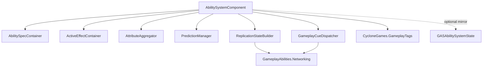
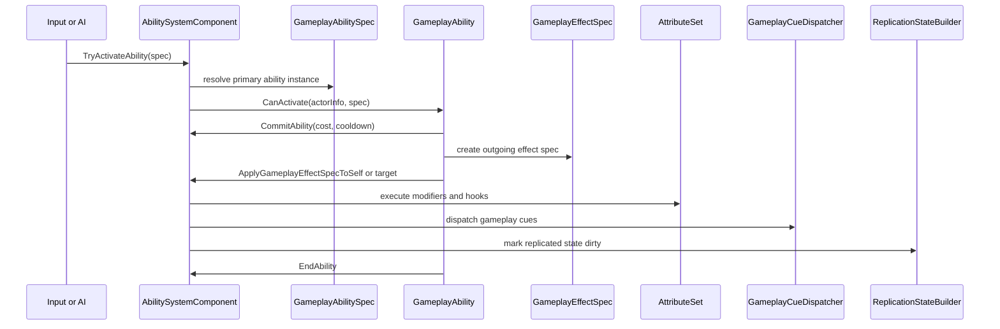

# CycloneGames.GameplayAbilities

English | [简体中文](./README.SCH.md)

`CycloneGames.GameplayAbilities` is a Unity gameplay ability framework inspired by the design goals of Unreal Engine's Gameplay Ability System. It provides a reusable foundation for abilities, attributes, gameplay effects, gameplay tags, gameplay cues, prediction, replication state, and editor authoring.

The package is intended for action RPGs, cooperative combat games, roguelike dungeon crawlers, multiplayer boss fights, LAN room-based games, and other projects where combat rules must be data-driven, extensible, observable, and suitable for high runtime pressure.

This document is both a module reference and an onboarding guide. It explains what GAS is, why this architecture exists, how the current package is organized, and how to build gameplay abilities step by step.

## Sample Preview And Assets

- Sample Project: [https://github.com/MaiKuraki/UnityGameplayAbilitySystemSample](https://github.com/MaiKuraki/UnityGameplayAbilitySystemSample)
  - 

- In-Package Smaple: [In-Package Smaple](./Samples)
  - 

## Table Of Contents

- [CycloneGames.GameplayAbilities](#cyclonegamesgameplayabilities)
  - [Sample Preview And Assets](#sample-preview-and-assets)
  - [Table Of Contents](#table-of-contents)
  - [What GAS Solves](#what-gas-solves)
  - [When To Use It](#when-to-use-it)
  - [Assembly Boundary](#assembly-boundary)
  - [Core Concepts In This Package](#core-concepts-in-this-package)
  - [Runtime Architecture](#runtime-architecture)
  - [Unreal GAS Mapping](#unreal-gas-mapping)
  - [Activation And Effect Flow](#activation-and-effect-flow)
  - [Tutorial: Build A Minimal Ability](#tutorial-build-a-minimal-ability)
    - [Step 1: Define A Tag Vocabulary](#step-1-define-a-tag-vocabulary)
    - [Step 2: Create An AttributeSet](#step-2-create-an-attributeset)
    - [Step 3: Create And Own An ASC](#step-3-create-and-own-an-asc)
    - [Step 4: Define Effects](#step-4-define-effects)
    - [Step 5: Implement An Ability](#step-5-implement-an-ability)
    - [Step 6: Grant And Activate The Ability](#step-6-grant-and-activate-the-ability)
  - [GameplayTags Usage Guide](#gameplaytags-usage-guide)
  - [ScriptableObject Authoring Workflow](#scriptableobject-authoring-workflow)
  - [Cost, Cooldown, Buffs, Debuffs, And Passives](#cost-cooldown-buffs-debuffs-and-passives)
  - [AbilityTasks](#abilitytasks)
  - [Targeting System](#targeting-system)
  - [Execution Calculations](#execution-calculations)
  - [DataTable-Driven Tuning](#datatable-driven-tuning)
  - [GameplayCues](#gameplaycues)
  - [Samples Walkthrough](#samples-walkthrough)
  - [Networking](#networking)
  - [Performance Model](#performance-model)
  - [Threading](#threading)
  - [Editor Tooling](#editor-tooling)
  - [Integration With Other CycloneGames Modules](#integration-with-other-cyclonegames-modules)
  - [Persistence](#persistence)
  - [FAQ And Troubleshooting](#faq-and-troubleshooting)
  - [Dependencies](#dependencies)

## What GAS Solves

In a small game, a skill can be implemented as one script that checks input, subtracts mana, starts a cooldown, spawns VFX, damages a target, and updates UI. In a large game, that style becomes hard to maintain because every feature needs to know too much about every other feature.

GAS separates combat into stable concepts:

| Concept | Meaning |
| --- | --- |
| Ability | A gameplay action that can be granted, activated, blocked, cancelled, predicted, and replicated. Examples: fireball, dodge, heal, combo attack, boss slam. |
| Attribute | A numeric gameplay value owned by an actor. Examples: health, mana, attack power, defense, movement speed. |
| Gameplay Effect | A data-driven change applied to an Ability System Component. Effects handle damage, healing, buffs, debuffs, cooldowns, costs, periodic damage, stacks, tags, and temporary ability grants. |
| Gameplay Tag | A hierarchical identifier used to describe state and rules. Examples: `State.Stunned`, `Ability.Fire.Fireball`, `Cooldown.Fireball`, `Damage.Type.Fire`. |
| Gameplay Cue | A cosmetic event tied to gameplay state. Cues drive VFX, SFX, camera shake, hit reactions, and other presentation without owning gameplay authority. |
| Prediction | Client-side temporary execution used to keep local controls responsive while the server remains authoritative. |
| Replication State | A compact representation of gameplay changes that can be sent across the network or rebuilt during full-state recovery. |

Unreal Engine's GAS popularized this model for production games because it keeps combat rules composable. A stun effect can block abilities through tags. A cooldown can be represented as a timed effect that grants a cooldown tag. A damage-over-time debuff can be a duration effect with a period. A passive aura can be an infinite effect that grants tags or abilities. The same runtime pipeline handles all of those cases.

CycloneGames adapts the same ideas to Unity:

- Unity authoring data is represented by `ScriptableObject` assets.
- Runtime state lives in C# objects owned by `AbilitySystemComponent`.
- Core state contracts remain Unity-free where possible.
- Optional networking is implemented in `CycloneGames.GameplayAbilities.Networking`.
- Optional project integration should live in integration assemblies, not in the core runtime.

| Concern | Traditional Skill Manager | GAS-style Architecture |
| --- | --- | --- |
| Ability content | Often hard-coded into character or controller scripts. | Ability assets and runtime definitions are granted to any compatible ASC. |
| Status state | Boolean flags and hand-written timers spread across many scripts. | Active gameplay effects own duration, period, stack count, granted tags, and removal. |
| Ability blocking | Custom `if` branches for each state combination. | Tags express activation requirements and block rules. |
| Attribute changes | Direct numeric writes from many systems. | Gameplay effects apply modifiers through a common attribute pipeline. |
| VFX/SFX | Gameplay code often spawns presentation objects directly. | Gameplay cues decouple presentation from authority. |
| Multiplayer | Each skill needs custom replication and correction logic. | Prediction keys, effect specs, state deltas, and full-state recovery share a common model. |
| Scaling | New interactions increase coupling between systems. | New content composes through tags, effects, attributes, and cues. |

## When To Use It

Use this package when a project needs:

- Many abilities that share cost, cooldown, tag, target, effect, and cue rules.
- Buffs and debuffs that can stack, expire, tick periodically, grant tags, or grant abilities.
- A clear split between gameplay authority and presentation.
- Designer-friendly data assets with programmer-defined extension points.
- Multiplayer-ready state contracts and deterministic-friendly raw fixed values.
- A framework style familiar to developers with Unreal GAS experience.

Avoid using the full GAS layer for one-off scripted events, simple UI-only actions, or systems that do not need attributes, effects, tags, prediction, or replication.

## Assembly Boundary

| Assembly | Role |
| --- | --- |
| `CycloneGames.GameplayAbilities.Core` | Unity-free deterministic state, prediction keys, replication DTOs, definition registries, service interfaces, and fixed-value logic. |
| `CycloneGames.GameplayAbilities.Runtime` | Unity-facing ability runtime, `AbilitySystemComponent`, ScriptableObject bridges, target data, gameplay cues, object pools, runtime diagnostics, and runtime debug overlay. |
| `CycloneGames.GameplayAbilities.Runtime.Integrations.DataTable` | Optional bridge from `CycloneGames.DataTable` rows to GAS modifier magnitudes and attribute initialization. Enabled by `CYCLONEGAMES_HAS_DATA_TABLE`. |
| `CycloneGames.GameplayAbilities.Editor` | Editor inspectors, debug windows, property drawers, menu items, and authoring validation. |
| `CycloneGames.GameplayAbilities.Tests.Editor` | EditMode coverage for deterministic state, runtime lifecycle, pooling, and regression behavior. |

The Core assembly must remain free of `UnityEngine` and `UnityEditor` references. Unity-facing behavior belongs in Runtime, Editor, Samples, or integration assemblies.

## Core Concepts In This Package

| Type | Responsibility |
| --- | --- |
| `AbilitySystemComponent` | Main facade and owner of runtime ability state. It grants abilities, owns attributes, applies effects, tracks tags, manages prediction, ticks effects, and exposes replication capture APIs. |
| `GameplayAbility` | Runtime definition and execution logic for one action. Override `ActivateAbility`, `CanActivate`, `InputPressed`, `InputReleased`, and `CancelAbility` for custom behavior. |
| `GameplayAbilitySO` | Unity authoring asset that creates and initializes a runtime `GameplayAbility`. |
| `GameplayAbilitySpec` | A granted ability on one ASC. It stores level, handle, active state, owning ASC, granted-by-effect relation, and the stateful ability instance when required. |
| `AttributeSet` | A group of related `GameplayAttribute` objects and the place for clamping, meta attributes, and post-effect logic. |
| `GameplayAttribute` | A named numeric value with base and current values. Values are also stored as raw fixed values for deterministic-friendly paths. |
| `GameplayEffect` | Runtime definition for instant, duration, or infinite effects. It describes modifiers, tags, stacking, granted abilities, cues, custom requirements, and overflow behavior. |
| `GameplayEffectSO` | Unity authoring asset that creates a runtime `GameplayEffect`. |
| `GameplayEffectSpec` | Runtime instance of an effect application. It captures source, target, context, level, duration, modifier magnitudes, dynamic tags, and SetByCaller magnitudes. |
| `ActiveGameplayEffect` | A live effect currently applied to an ASC. It owns remaining time, period, stack count, granted tags, and runtime bookkeeping. |
| `AbilityTask` | A pooled latent operation owned by an active ability. Use tasks for waits, targeting, delays, and other multi-frame ability work. |
| `GameplayCueManager` / `GameplayCueDispatcher` | Service-backed cue routing for presentation events driven by gameplay state. |

## Runtime Architecture

`AbilitySystemComponent` remains the public entry point, matching the familiar Unreal GAS usage style. Internally, state ownership is split into dedicated collaborators so that hot-path bookkeeping does not stay as one oversized class.

| Collaborator | Responsibility |
| --- | --- |
| `AbilitySpecContainer` | Granted ability specs, spec handle index, ticking specs, and abilities granted by active effects. |
| `ActiveEffectContainer` | Active gameplay effects, network id lookup, stacking indexes, granted tag indexes, and ability-applied effect tracking. |
| `AttributeAggregator` | Attribute sets, registered attributes, and dirty attribute aggregation queues. |
| `PredictionManager` | Prediction windows, window indexes, pending predicted effects, local input sequence, dependent-window lookup, timeout selection, and closed prediction transaction history. |
| `ReplicationStateBuilder` | Dirty replicated state, state versioning, tag delta folding, delta capture lifecycle, removed effect ids, removed ability definitions, and scratch arrays. |
| `GameplayCueDispatcher` | Local gameplay cue dispatch, prediction cue accounting, and server-side cue broadcast routing. |


```mermaid
flowchart TB
    ASC["AbilitySystemComponent"]
    Specs["AbilitySpecContainer"]
    Effects["ActiveEffectContainer"]
    Attrs["AttributeAggregator"]
    Prediction["PredictionManager"]
    Replication["ReplicationStateBuilder"]
    Cues["GameplayCueDispatcher"]
    Tags["CycloneGames.GameplayTags"]
    Core["GASAbilitySystemState"]
    Network["GameplayAbilities.Networking"]

    ASC --> Specs
    ASC --> Effects
    ASC --> Attrs
    ASC --> Prediction
    ASC --> Replication
    ASC --> Cues
    ASC --> Tags
    ASC -. optional mirror .-> Core
    Replication --> Network
    Cues --> Network
```

`AbilitySystemComponent` owns the runtime source of truth for Unity gameplay. `GASAbilitySystemState` is an optional Unity-free mirror used for deterministic diagnostics, snapshot capture, checksum validation, and pure C# simulation tooling. Do not treat both graphs as independent mutable state. Runtime gameplay code should mutate the ASC APIs; Core-only simulations should use `GASAbilitySystemState` and `GASAbilitySystemFacade` directly without constructing an ASC.

| Mode | Use case | Runtime behavior |
| --- | --- | --- |
| `GASCoreStateMode.MirrorRuntime` | Default compatibility mode, deterministic validation, tooling, checksum capture, and migration testing. | ASC writes the runtime graph and mirrors supported grants, attributes, active effects, and prediction data into Core state. |
| `GASCoreStateMode.RuntimeOnly` | High-density gameplay actors, low-end clients, pure presentation clients, and server shards that do not need Core diagnostics for every ASC. | ASC keeps only the runtime graph. `TryGetCoreState`, `TryGetCoreFacade`, and `TryGetCoreSpecHandle` return `false`; `CoreState` and `Core` are unavailable. |

```csharp
AbilitySystemComponent mirroredAsc = new AbilitySystemComponent(
    new GameplayEffectContextFactory());

AbilitySystemComponent runtimeOnlyAsc = new AbilitySystemComponent(
    new GameplayEffectContextFactory(),
    GASAbilitySystemRuntimeOptions.RuntimeOnly);
```

The current collaborator split owns the most error-sensitive list, dictionary, prediction, and replication bookkeeping: ability grants and removals, ticking spec membership, effect swap-back removal, network id lookup, stacking lookup, granted tag lookup, ability-applied effect cleanup, prediction window indexes, pending predicted effect removal, closed prediction records, replicated dirty flags, removed id tracking, tag edge folding, state version advancement, and delta capture cleanup.

`AbilitySystemComponent` still coordinates gameplay policy, activation decisions, rollback side effects, events, high-level network send decisions, and attribute side effects. Further migration should continue in small verified steps.

## Unreal GAS Mapping

| Unreal GAS Concept | CycloneGames Concept |
| --- | --- |
| `UAbilitySystemComponent` | `AbilitySystemComponent` facade |
| `FGameplayAbilitySpecContainer` | `AbilitySpecContainer` |
| `FActiveGameplayEffectsContainer` | `ActiveEffectContainer` |
| `FScopedPredictionWindow` | `GASPredictionScope` and `PredictionManager` |
| `UGameplayAbility` | `GameplayAbility` and `GameplayAbilitySO` |
| `UGameplayEffect` | `GameplayEffect` and `GameplayEffectSO` |
| `FGameplayEffectSpec` | `GameplayEffectSpec` |
| `FActiveGameplayEffect` | `ActiveGameplayEffect` |
| `FGameplayTagContainer` | `CycloneGames.GameplayTags.Core.GameplayTagContainer` |
| Gameplay cue notify routing | `GameplayCueManager` and `GameplayCueDispatcher` |
| Fast array replication and RPC state | `ReplicationStateBuilder`, `GASAbilitySystemStateDeltaBuffer`, and the networking package |

The package keeps Unreal-style vocabulary where it helps experienced GAS developers move quickly. It does not copy Unreal's UObject model. Unity assets, pure C# runtime objects, and Unity-free core contracts are kept separate.

## Activation And Effect Flow


```mermaid
sequenceDiagram
    participant Input as Input or AI
    participant ASC as AbilitySystemComponent
    participant Spec as GameplayAbilitySpec
    participant Ability as GameplayAbility
    participant Effect as GameplayEffectSpec
    participant Attr as AttributeSet
    participant Cue as GameplayCueDispatcher
    participant Net as ReplicationStateBuilder

    Input->>ASC: TryActivateAbility(spec)
    ASC->>Spec: resolve primary ability instance
    ASC->>Ability: CanActivate(actorInfo, spec)
    Ability->>ASC: CommitAbility(cost, cooldown)
    Ability->>Effect: create outgoing effect spec
    Ability->>ASC: ApplyGameplayEffectSpecToSelf or target
    ASC->>Attr: execute modifiers and hooks
    ASC->>Cue: dispatch gameplay cues
    ASC->>Net: mark replicated state dirty
    Ability->>ASC: EndAbility
```

Typical activation sequence:

1. Grant an ability through `AbilitySystemComponent.GrantAbility`.
2. `AbilitySpecContainer` stores the `GameplayAbilitySpec` and indexes it by handle.
3. `TryActivateAbility` validates tags, cost, cooldown, prediction policy, authority policy, and ability block rules.
4. `GameplayAbility.ActivateAbility` commits cost and cooldown, creates tasks, and applies effects.
5. `ActiveEffectContainer` tracks active effects, stacking, granted tags, network ids, and ability-applied effect cleanup.
6. `AttributeAggregator` recalculates dirty attributes using additive, multiplicative, division, and override aggregation.
7. `PredictionManager` tracks prediction windows and predicted side effects.
8. `GameplayCueDispatcher` emits cue events locally and through the configured network bridge.
9. `ReplicationStateBuilder` records dirty state and captures deltas for replication or full-state recovery.

## Tutorial: Build A Minimal Ability

This tutorial uses runtime C# examples because they are easy to read in documentation. In production, teams usually pair the same runtime classes with `GameplayAbilitySO` and `GameplayEffectSO` assets so designers can author data in the Inspector.

### Step 1: Define A Tag Vocabulary

Gameplay tags are the rule language of GAS. Use stable names and keep them consistent across code, assets, networking registries, and debugging tools.

Recommended naming style:

```text
Ability.Fire.Fireball
Cooldown.Fireball
Cost.Mana
Damage.Type.Fire
GameplayCue.Fireball.Impact
State.Stunned
State.Dead
Data.DamageMultiplier
Attribute.Health
Attribute.Mana
```

Runtime code can request tags from `CycloneGames.GameplayTags`:

```csharp
using CycloneGames.GameplayTags.Core;

public static class CombatTags
{
    public static readonly GameplayTag CooldownFireball =
        GameplayTagManager.RequestTag("Cooldown.Fireball");

    public static readonly GameplayTag DamageTypeFire =
        GameplayTagManager.RequestTag("Damage.Type.Fire");

    public static readonly GameplayTag DataDamageMultiplier =
        GameplayTagManager.RequestTag("Data.DamageMultiplier");
}
```

Use tags for rules, not for mutable numeric values. Health, mana, attack power, and defense belong in attributes.

### Step 2: Create An AttributeSet

An `AttributeSet` groups attributes and owns attribute-specific rules such as clamping and meta-attribute handling.

```csharp
using CycloneGames.GameplayAbilities.Runtime;

public sealed class CombatAttributeSet : AttributeSet
{
    public GameplayAttribute Health { get; } = new GameplayAttribute("Health");
    public GameplayAttribute MaxHealth { get; } = new GameplayAttribute("MaxHealth");
    public GameplayAttribute Mana { get; } = new GameplayAttribute("Mana");
    public GameplayAttribute MaxMana { get; } = new GameplayAttribute("MaxMana");
    public GameplayAttribute Damage { get; } = new GameplayAttribute("Damage");

    public CombatAttributeSet()
    {
        Health.SetBaseValue(100f);
        Health.SetCurrentValue(100f);
        MaxHealth.SetBaseValue(100f);
        MaxHealth.SetCurrentValue(100f);
        Mana.SetBaseValue(50f);
        Mana.SetCurrentValue(50f);
        MaxMana.SetBaseValue(50f);
        MaxMana.SetCurrentValue(50f);
    }

    public override void PreAttributeChange(GameplayAttribute attribute, ref GASFixedValue newValue)
    {
        if (attribute == Health)
        {
            newValue = GASFixedValue.Clamp(newValue, GASFixedValue.Zero, MaxHealth.CurrentFixedValue);
        }
        else if (attribute == Mana)
        {
            newValue = GASFixedValue.Clamp(newValue, GASFixedValue.Zero, MaxMana.CurrentFixedValue);
        }
    }

    protected override bool PreProcessInstantEffect(GameplayEffectModCallbackData data)
    {
        GameplayAttribute attribute = GetAttribute(data.Modifier.AttributeName);
        if (attribute != Damage)
        {
            return false;
        }

        float currentHealth = Health.CurrentValue;
        float newHealth = System.Math.Max(0f, currentHealth - data.EvaluatedMagnitude);

        SetBaseValue(Health, newHealth);
        SetCurrentValue(Health, newHealth);
        return true;
    }
}
```

Meta attributes such as `Damage` are useful when an effect should carry an intermediate value that the target converts into final health loss after defense, shields, vulnerability, or immunity rules.

### Step 3: Create And Own An ASC

`AbilitySystemComponent` is a pure runtime object. A Unity `MonoBehaviour` should own lifecycle and scene references, not combat rules.

```csharp
using CycloneGames.GameplayAbilities.Runtime;
using UnityEngine;

public sealed class CombatantAbilitySystem : MonoBehaviour
{
    public AbilitySystemComponent AbilitySystem { get; private set; }
    public CombatAttributeSet Attributes { get; private set; }

    private void Awake()
    {
        AbilitySystem = new AbilitySystemComponent(new GameplayEffectContextFactory());
        AbilitySystem.InitAbilityActorInfo(owner: this, avatar: gameObject);

        AbilitySystem.ReserveRuntimeCapacity(
            abilityCapacity: 16,
            attributeCapacity: 16,
            activeEffectCapacity: 64,
            predictionWindowCapacity: 8,
            coreModifierCapacity: 128,
            maxSetByCallerPerEffect: 8,
            targetDataObjectCapacity: 16);

        Attributes = new CombatAttributeSet();
        AbilitySystem.AddAttributeSet(Attributes);
    }

    private void Update()
    {
        AbilitySystem.Tick(Time.deltaTime, isServer: true);
    }

    private void OnDestroy()
    {
        AbilitySystem?.Dispose();
    }
}
```

For projects using `CycloneGames.GameplayFramework`, the optional integration extension can initialize actor info from an `Actor` and still keep the core GameplayFramework assembly independent from GameplayAbilities.

### Step 4: Define Effects

Effects are the data-driven heart of GAS.

```csharp
using System.Collections.Generic;
using CycloneGames.GameplayAbilities.Runtime;
using CycloneGames.GameplayTags.Core;

public static class CombatEffects
{
    public static GameplayEffect CreateFireballDamage()
    {
        return new GameplayEffect(
            name: "GE_FireballDamage",
            durationPolicy: EDurationPolicy.Instant,
            modifiers: new List<ModifierInfo>
            {
                new ModifierInfo("Damage", EAttributeModifierOperation.Add, new ScalableFloat(35f, 5f))
            },
            assetTags: CreateContainer(CombatTags.DamageTypeFire),
            gameplayCues: CreateContainer(
                GameplayTagManager.RequestTag("GameplayCue.Fireball.Impact")));
    }

    public static GameplayEffect CreateFireballCost()
    {
        return new GameplayEffect(
            name: "GE_Cost_Fireball",
            durationPolicy: EDurationPolicy.Instant,
            modifiers: new List<ModifierInfo>
            {
                new ModifierInfo("Mana", EAttributeModifierOperation.Add, new ScalableFloat(-10f))
            });
    }

    public static GameplayEffect CreateFireballCooldown()
    {
        return new GameplayEffect(
            name: "GE_Cooldown_Fireball",
            durationPolicy: EDurationPolicy.HasDuration,
            duration: 3f,
            grantedTags: CreateContainer(CombatTags.CooldownFireball));
    }

    private static GameplayTagContainer CreateContainer(GameplayTag tag)
    {
        var container = new GameplayTagContainer();
        container.AddTag(tag);
        return container;
    }
}
```

Use `Instant` effects for damage, healing, and costs. Use `HasDuration` effects for timed buffs, debuffs, and cooldowns. Use `Infinite` effects for passives, equipment bonuses, and auras that last until explicitly removed.

### Step 5: Implement An Ability

An ability owns activation logic. It should ask the ASC pipeline to commit cost and cooldown, then apply effects through effect specs.

```csharp
using CycloneGames.GameplayAbilities.Runtime;

public sealed class FireballAbility : GameplayAbility
{
    private readonly GameplayEffect _damageEffect;
    private readonly System.Func<AbilitySystemComponent> _targetResolver;

    public FireballAbility(GameplayEffect damageEffect, System.Func<AbilitySystemComponent> targetResolver)
    {
        _damageEffect = damageEffect;
        _targetResolver = targetResolver;
    }

    public override void ActivateAbility(
        GameplayAbilityActorInfo actorInfo,
        GameplayAbilitySpec spec,
        GameplayAbilityActivationInfo activationInfo)
    {
        CommitAbility(actorInfo, spec);

        AbilitySystemComponent target = _targetResolver?.Invoke();
        if (target != null && CanApplyToTarget(target))
        {
            GameplayEffectSpec damageSpec = MakeOutgoingGameplayEffectSpec(_damageEffect, spec.Level);
            damageSpec.SetSetByCallerMagnitude(CombatTags.DataDamageMultiplier, 1.0f);
            ApplyGameplayEffectSpecToTarget(damageSpec, target);
        }

        EndAbility();
    }

    public override GameplayAbility CreatePoolableInstance()
    {
        var ability = new FireballAbility(_damageEffect, _targetResolver);
        ability.Initialize(
            Name,
            InstancingPolicy,
            NetExecutionPolicy,
            CostEffectDefinition,
            CooldownEffectDefinition,
            AbilityTags,
            ActivationBlockedTags,
            ActivationRequiredTags,
            CancelAbilitiesWithTag,
            BlockAbilitiesWithTag);
        return ability;
    }
}
```

For data-driven authoring, wrap the ability in a `GameplayAbilitySO`:

```csharp
using CycloneGames.GameplayAbilities.Runtime;
using UnityEngine;

[CreateAssetMenu(
    fileName = "GA_Fireball",
    menuName = "CycloneGames/GameplayAbilities/Ability/Fireball")]
public sealed class FireballAbilitySO : GameplayAbilitySO
{
    public GameplayEffectSO DamageEffect;

    public override GameplayAbility CreateAbility()
    {
        GameplayEffect damage = DamageEffect != null ? DamageEffect.GetGameplayEffect() : null;
        var ability = new FireballAbility(damage, targetResolver: null);
        InitializeAbility(ability);
        return ability;
    }
}
```

Projects usually provide target resolution through an ability task, a targeting service, a combat query, or a project-specific ability subclass.

### Step 6: Grant And Activate The Ability

```csharp
using CycloneGames.GameplayAbilities.Runtime;

public sealed class FireballGrantExample
{
    private readonly AbilitySystemComponent _asc;
    private readonly GameplayAbilitySO _fireballAsset;

    public FireballGrantExample(AbilitySystemComponent asc, GameplayAbilitySO fireballAsset)
    {
        _asc = asc;
        _fireballAsset = fireballAsset;
    }

    public GameplayAbilitySpec Grant()
    {
        GameplayAbility ability = _fireballAsset.CreateAbility();
        return _asc.GrantAbility(ability, level: 1);
    }

    public bool Activate(GameplayAbilitySpec spec)
    {
        return _asc.TryActivateAbility(spec);
    }
}
```

Do not create new ability definitions every frame. Create or load ability assets during setup, then grant ability instances as part of character initialization, equipment changes, passive effects, or gameplay rewards.

## GameplayTags Usage Guide

Tags are how independent systems communicate without direct references.

| Use Case | Recommended Tag Pattern |
| --- | --- |
| Ability identity | `Ability.Mage.Fireball`, `Ability.Hunter.Dash` |
| Cooldown ownership | `Cooldown.Fireball`, `Cooldown.Dash` |
| State blocking | `State.Stunned`, `State.Silenced`, `State.Rooted` |
| Damage typing | `Damage.Type.Fire`, `Damage.Type.Poison` |
| Cue routing | `GameplayCue.Fireball.Cast`, `GameplayCue.Fireball.Impact` |
| SetByCaller data | `Data.DamageMultiplier`, `Data.ChargeTime` |
| Gameplay events | `Event.Hit.Critical`, `Event.Kill`, `Event.Combo.WindowOpened` |

Recommended rules:

- Put boolean and categorical state in tags.
- Put numeric state in attributes or SetByCaller magnitudes.
- Use cooldown tags instead of custom cooldown booleans.
- Use `ActivationBlockedTags` for general blocks such as stun or silence.
- Use `ActivationRequiredTags` for form, weapon, stance, or phase requirements.
- Use `TargetRequiredTags` and `TargetBlockedTags` for target legality.
- Keep tag names stable across peers in networked games.

## ScriptableObject Authoring Workflow

Typical authoring workflow:

1. Create or register gameplay tags in the `CycloneGames.GameplayTags` workflow used by the project.
2. Create `GameplayEffectSO` assets for cost, cooldown, damage, healing, buffs, debuffs, and passives.
3. Create `GameplayAbilitySO` assets for abilities that reference those effects.
4. Create cue assets or cue handlers for presentation tags.
5. Add an `AbilitySystemComponent` owner to the character, pawn, monster, boss, or player state runtime object.
6. Add one or more `AttributeSet` instances.
7. Grant ability assets during spawn, possession, equipment changes, or passive effect application.
8. Activate abilities from input, AI, gameplay events, tag changes, or scripted encounters.

Use runtime C# subclasses for behavior that requires logic. Use assets for data that designers need to tune: names, tags, cost effects, cooldown effects, durations, stack limits, magnitudes, cue tags, and application requirements.

## Cost, Cooldown, Buffs, Debuffs, And Passives

| Feature | GAS Representation |
| --- | --- |
| Mana or stamina cost | Instant gameplay effect with negative resource modifier. |
| Cooldown | Duration gameplay effect that grants a `Cooldown.*` tag. |
| Temporary buff | Duration gameplay effect with modifiers and granted tags. |
| Permanent passive | Infinite gameplay effect, or ability with `ActivateAbilityOnGranted` when logic must run. |
| Damage over time | Duration gameplay effect with `Period > 0`. |
| Stun | Duration gameplay effect that grants `State.Stunned`, then ability assets use `ActivationBlockedTags`. |
| Equipment stat bonus | Infinite gameplay effect removed when equipment is unequipped. |
| Stackable poison | Duration gameplay effect with `GameplayEffectStacking`. |
| Temporary granted skill | Duration or infinite effect with `GrantedAbilities`. |

This uniform representation is the main reason GAS scales. A cooldown, poison, aura, equipment bonus, and temporary skill grant are all effects with different data.

## AbilityTasks

`AbilityTask` is the package's latent ability operation model. Use tasks when an ability cannot finish in one method call: waiting for target data, waiting for input release, delaying a hit frame, tracking a channel duration, or listening for a gameplay event.

Current task rules:

- Create tasks from an active ability through `NewAbilityTask<T>()` or a task-specific static factory.
- Call `Activate()` after delegates and required data are configured.
- End the task with `EndTask()` when it completes.
- Cancel the task with `CancelTask()` when the owning ability is cancelled.
- Override `OnDestroy()` to clear delegates and transient references, then call `base.OnDestroy()`.
- Implement `IAbilityTaskTick` only when the task truly needs per-frame updates.

Example using `AbilityTask_WaitTargetData`:

```csharp
using CycloneGames.GameplayAbilities.Runtime;

public sealed class TargetedStrikeAbility : GameplayAbility
{
    private readonly ITargetActor _targetActor;
    private readonly GameplayEffect _damageEffect;

    public TargetedStrikeAbility(ITargetActor targetActor, GameplayEffect damageEffect)
    {
        _targetActor = targetActor;
        _damageEffect = damageEffect;
    }

    public override void ActivateAbility(
        GameplayAbilityActorInfo actorInfo,
        GameplayAbilitySpec spec,
        GameplayAbilityActivationInfo activationInfo)
    {
        CommitAbility(actorInfo, spec);

        AbilityTask_WaitTargetData task =
            AbilityTask_WaitTargetData.WaitTargetData(this, _targetActor);

        task.OnValidData += data =>
        {
            if (data is not GameplayAbilityTargetData_ActorArray actorData)
            {
                EndAbility();
                return;
            }

            for (int i = 0; i < actorData.Actors.Count; i++)
            {
                if (actorData.Actors[i].TryGetComponent(out CombatantAbilitySystem target))
                {
                    ApplyGameplayEffectToTarget(_damageEffect, target.AbilitySystem, spec.Level);
                }
            }

            EndAbility();
        };

        task.OnCancelled += CancelAbility;
        task.Activate();
    }

    public override GameplayAbility CreatePoolableInstance()
    {
        var ability = new TargetedStrikeAbility(_targetActor, _damageEffect);
        ability.Initialize(
            Name,
            InstancingPolicy,
            NetExecutionPolicy,
            CostEffectDefinition,
            CooldownEffectDefinition,
            AbilityTags,
            ActivationBlockedTags,
            ActivationRequiredTags,
            CancelAbilitiesWithTag,
            BlockAbilitiesWithTag);
        return ability;
    }
}
```

Tasks are pooled. Do not keep task references after they end.

## Targeting System

Targeting is intentionally separated from ability execution. An ability asks a target actor or targeting service for `TargetData`; it does not need to know whether the target came from a raycast, sphere overlap, cone query, lock-on target, ground select, or server-side validation pass.

Core targeting types:

| Type | Purpose |
| --- | --- |
| `ITargetActor` | Contract for target acquisition. It configures against an ability, starts targeting, confirms, cancels, and cleans itself up. |
| `AbilityTask_WaitTargetData` | Ability task that waits for an `ITargetActor` to produce `TargetData`. |
| `TargetData` | Base runtime target data object stamped with prediction and ability-spec information. |
| `TargetDataNetworkData` | Network-safe target data projection used by target-data replication bridges. |
| `IGASTargetDataNetworkBridge` | Optional bridge contract for predicted target-data RPCs. |

Sample target actors are provided under `Samples/Scripts/TargetActor/`, including line trace, sphere overlap, and cone trace examples. Projects should replace sample target actors with production targeting services that understand teams, layers, server authority, lag compensation, hit validation, and project-specific collision rules.

## Execution Calculations

Simple effects use `ModifierInfo` with a `ScalableFloat`. Complex combat math belongs in `GameplayEffectExecutionCalculation`.

Use an execution calculation when a value depends on several attributes or external rules, such as:

- Final damage from attack power, defense, elemental resistance, level, and critical state.
- Boss shield damage that scales with phase.
- Healing reduced by debuffs.
- Poison damage that snapshots source attack but reads target resistance live.

Execution assets use `GameplayEffectExecutionCalculationSO` as the Unity authoring bridge:

```csharp
using System.Collections.Generic;
using CycloneGames.GameplayAbilities.Runtime;
using UnityEngine;

[CreateAssetMenu(
    fileName = "Exec_Damage",
    menuName = "CycloneGames/GameplayAbilities/Execution/Damage")]
public sealed class DamageExecutionSO : GameplayEffectExecutionCalculationSO
{
    public override GameplayEffectExecutionCalculation CreateExecution()
    {
        return new DamageExecution();
    }
}

public sealed class DamageExecution : GameplayEffectExecutionCalculation
{
    public override void Execute(GameplayEffectSpec spec, ref List<ModifierInfo> executionOutput)
    {
        float damage = spec.GetSetByCallerMagnitude(
            CombatTags.DataDamageMultiplier,
            warnIfNotFound: false,
            defaultValue: 1f) * 25f;

        executionOutput.Add(
            new ModifierInfo("Damage", EAttributeModifierOperation.Add, new ScalableFloat(damage)));
    }
}
```

In multiplayer, complex execution calculations should run on the authority path unless the exact same inputs and deterministic math are available on every peer.

## DataTable-Driven Tuning

Use `CycloneGames.DataTable` when designers own large numeric surfaces: level curves, ability damage tables, monster stats, boss phase values, resistance tables, upgrade costs, and class starting attributes. Use `GameplayAbilitySO`, `GameplayEffectSO`, tags, and cues for authored gameplay identity and behavior. This split keeps content discoverable in Unity while letting Excel/Luban own bulk balancing data.

The integration assembly is:

```text
Runtime/Integrations/DataTable/
CycloneGames.GameplayAbilities.Runtime.Integrations.DataTable
```

Compile conditions:

| Import Mode | Behavior |
| --- | --- |
| `GameplayAbilities` imported without `DataTable` | Core GameplayAbilities assemblies compile. The DataTable integration assembly and its tests are skipped. |
| Both packages imported through UPM | The integration asmdef uses `versionDefines` for `com.cyclone-games.data-table` and automatically defines `CYCLONEGAMES_HAS_DATA_TABLE`. |
| Both packages imported under `Assets/ThirdParty` | Unity does not read nested `package.json` dependency metadata. Define `CYCLONEGAMES_HAS_DATA_TABLE` through a project-visible build configuration if the local DataTable package should enable this integration. |

Do not add DataTable references to the core runtime. All DataTable-specific code must stay in the integration assembly or in project assemblies that explicitly depend on both modules.

Core types:

| Type | Purpose |
| --- | --- |
| `DataTableLevelValueProvider<TRow>` | Converts an `IDataTable<TRow>` or `TryGet` delegate into level-aware GAS values. |
| `DataTableMagnitudeCalculation` | `GameplayModMagnitudeCalculation` backed by an `IGASLevelValueProvider`. |
| `DataTableModifierFactory` | Creates `ModifierInfo` instances from table rows without exposing table code in ability classes. |
| `DataTableAttributeInitializer<TRow>` | Applies designer-authored starting attribute values to an `AttributeSet`. |

Example row types for a non-generated test table:

```csharp
using CycloneGames.DataTable;

public sealed class SkillMagnitudeRow : IDataRow
{
    public int Id { get; set; }
    public float BaseValue { get; set; }
    public float ScalePerLevel { get; set; }
}

public sealed class AttributeInitRow : IDataRow
{
    public int Id { get; set; }
    public string AttributeName { get; set; }
    public float BaseValue { get; set; }
    public float CurrentValue { get; set; }
}
```

Create a level-scaled modifier from a table:

```csharp
using CycloneGames.DataTable;
using CycloneGames.GameplayAbilities.Runtime;
using CycloneGames.GameplayAbilities.Runtime.Integrations.DataTable;

IDataTable<SkillMagnitudeRow> skillValues = DataTableRegistry.Get<DataTable<SkillMagnitudeRow>>();

ModifierInfo damageModifier = DataTableModifierFactory.CreateLinearModifier(
    skillValues,
    rowId: 1001,
    attributeName: "Damage",
    operation: EAttributeModifierOperation.Add,
    baseValueAccessor: row => row.BaseValue,
    scalingFactorAccessor: row => row.ScalePerLevel);
```

Initialize attributes from designer data:

```csharp
IDataTable<AttributeInitRow> startingAttributes = DataTableRegistry.Get<DataTable<AttributeInitRow>>();

var initializer = DataTableAttributeInitializer<AttributeInitRow>.FromTable(
    startingAttributes,
    attributeNameAccessor: row => row.AttributeName,
    baseValueAccessor: row => row.BaseValue,
    currentValueAccessor: row => row.CurrentValue);

initializer.ApplyAll(characterAttributes);
```

For Luban-generated or project-specific table types that do not implement `IDataTable<TRow>`, wrap the generated lookup API in a delegate with the same shape:

```csharp
GASDataTableTryGetRow<SkillMagnitudeRow> tryGetSkillRow = projectSkillLookup.TryGetValue;

ModifierInfo bossPhaseDamage = DataTableModifierFactory.CreateEvaluatedModifier<SkillMagnitudeRow>(
    tryGetRow: tryGetSkillRow,
    rowId: 3007,
    attributeName: "Damage",
    operation: EAttributeModifierOperation.Add,
    valueEvaluator: (row, level, spec) => row.BaseValue * level + row.ScalePerLevel);
```

Production rules:

- Load and register DataTable content during startup, then cache the table or provider in ability/effect factories. Do not call `DataTableRegistry.Get<T>()` in per-frame ability logic.
- Keep table rows immutable after registration. Runtime buffs, cooldowns, stacks, prediction windows, and temporary combat values belong in GAS runtime state, not in table rows.
- In multiplayer, all peers that calculate the same predicted value must use the same table build. Server-authoritative paths should validate table version, table hash, or content bundle version during room join.
- Replicate stable ids, levels, SetByCaller values, and authoritative state deltas. Do not trust client-supplied DataTable-derived magnitudes.
- Prefer `ScalableFloat` for a few simple constants, DataTable rows for large designer-owned numeric matrices, and `GameplayEffectExecutionCalculation` when the result depends on several runtime attributes or combat rules.

## GameplayCues

Gameplay cues are presentation events driven by gameplay state. The gameplay effect says "a cue happened"; the cue system decides which visual or audio response to play.

Use cues for:

- Impact VFX and hit sounds.
- Casting start and casting end presentation.
- Persistent aura loops.
- Buff or debuff screen effects.
- Camera shake and controller feedback.

Do not put damage, healing, tag grants, or authority decisions in cue code. Cues should be safe to suppress, replay, or skip on low-end clients without changing gameplay results.

Cue-related runtime types:

| Type | Purpose |
| --- | --- |
| `GameplayCueSO` | ScriptableObject base for cue assets. Override `OnExecutedAsync`, `OnActiveAsync`, or `OnRemovedAsync`. |
| `GameplayCueParameters` | Runtime presentation context for cue handlers. |
| `IGameplayCueHandler` | Runtime object that can handle cue events by tag. |
| `IPersistentGameplayCue` | Optional contract for cues that create tracked persistent instances. |
| `GameplayCueManager` | Service that resolves cue tags to cue behavior. |
| `GameplayCueDispatcher` | ASC collaborator that routes cue dispatch and prediction accounting. |

Example one-shot cue:

```csharp
using Cysharp.Threading.Tasks;
using CycloneGames.GameplayAbilities.Runtime;
using UnityEngine;

[CreateAssetMenu(
    fileName = "GC_FireballImpact",
    menuName = "CycloneGames/GameplayAbilities/Cue/Fireball Impact")]
public sealed class FireballImpactCueSO : GameplayCueSO
{
    public GameObject Prefab;

    public override UniTask OnExecutedAsync(
        GameplayCueParameters parameters,
        IGameObjectPoolManager poolManager)
    {
        if (Prefab != null && parameters.TargetObject != null)
        {
            UnityEngine.Object.Instantiate(
                Prefab,
                parameters.TargetObject.transform.position,
                Quaternion.identity);
        }

        return UniTask.CompletedTask;
    }
}
```

Production cue code should use project pooling and asset loading services instead of raw instantiation on hot paths.

## Samples Walkthrough

The package includes a playable sample project under `Samples/`. The folder remains visible in this repository to support direct `Assets/ThirdParty` usage. The package manifest also exposes it through the `samples` entry for package-based workflows.

Open `Samples/SampleScene.unity`, press Play, and use the controls documented in `Samples/README.md`. The sample scene uses Player and Enemy prefabs, preconfigured ability/effect assets, sample tags, target actors, GameplayCue examples, and a small UI logger.

| Sample | Demonstrates |
| --- | --- |
| `CharacterAttributeSet` | Primary, secondary, and meta attributes; clamping; damage conversion; experience hooks. |
| `GA_Fireball_SO` | Ability asset that applies instant damage and a burn debuff. |
| `GA_PoisonBlade_SO` | Ability-driven debuff application. |
| `GA_ShieldOfLight_SO` | Defensive buff pattern. |
| `GA_Berserk_SO` | Self-buff style ability. |
| `GA_Purify_SO` | Removing effects by tags. |
| `GA_ArmorStack_SO` | Stack behavior and stack debugging. |
| `ExecCalc_Burn` and `ExecCalcSO_Burn` | Runtime execution calculation and ScriptableObject execution bridge. |
| `AbilityTask_WaitTargetData_SpawnedActor` | Target-data task integration with spawned target actors. |
| `TargetActor/*` | Line trace, sphere overlap, and cone trace targeting examples. |
| `GASPoolInitializer` | Pool setup for sample scenes. |
| `GASSampleTags` | Sample tag constants and naming style. |
| `Integrate/Setup/GASManualSetup` | Manual non-DI startup pattern for cue manager setup. |
| `Integrate/Setup/GASServerSetup` | Server/headless startup pattern using `NullGameplayCueManager`. |
| `Integrate/DI/VContainer/GASLifetimeScope` | Optional VContainer composition pattern, compiled only when VContainer is present. |

Read samples as patterns for using the framework. Move project-specific logic into your own assemblies before production.

## Networking

This package owns transport-neutral state and runtime hooks. The separate `CycloneGames.GameplayAbilities.Networking` package connects those contracts to `CycloneGames.Networking`.

Recommended multiplayer model:

- Server authoritative effects, attributes, tags, ability grants, and state deltas.
- Client-side prediction only for local responsiveness.
- Full-state sync for late join, reconnect, and drift recovery.
- Owner-only private attributes unless explicitly registered as public observer attributes.
- Stable registry ids for ability definitions, effect definitions, attributes, gameplay tags, and ASC network ids.
- Interest management outside the ASC, so room, team, owner, spectator, and visibility systems choose observers before state capture.

For high-pressure cooperative games, replicate gameplay state through GAS and keep movement, animation state, monster AI perception, physics, room discovery, and matchmaking in their own systems.

## Performance Model

Runtime code is designed for low-GC operation when capacity is reserved before combat:

```csharp
asc.ReserveRuntimeCapacity(
    abilityCapacity: 64,
    attributeCapacity: 128,
    activeEffectCapacity: 512,
    predictionWindowCapacity: 64,
    coreModifierCapacity: 1024,
    maxSetByCallerPerEffect: 16,
    targetDataObjectCapacity: 128);

asc.PrewarmRuntimePools(
    grantedAbilitySpecLists: 32,
    abilityAppliedEffectLists: 32);
```

Use larger capacities for shared server simulations, boss encounters, and rooms with many monsters. Capacity misses are visible through `GetRuntimeDiagnostics()` and `GetRuntimeListPoolStatistics()`.

Choose the Core state mode per actor class or simulation role:

- Use `MirrorRuntime` for player characters, authority debugging, deterministic replay validation, QA builds, and systems that need Core checksums or Core snapshots.
- Use `RuntimeOnly` for large numbers of simple monsters, projectiles, temporary summons, cosmetic-only ASCs, and low-end clients when Core diagnostics are not required for those actors.
- Use pure `GASAbilitySystemState` plus `GASAbilitySystemFacade` for non-Unity deterministic simulation, rollback labs, CLI validation, or server-side tools that do not need Unity-facing abilities or ScriptableObject authoring.

Hot-path rules:

- Reserve ability, effect, attribute, prediction, SetByCaller, target data, and pool capacity before combat starts.
- Reserve `coreModifierCapacity` only matters when Core mirroring is enabled.
- Avoid creating abilities, effects, target actors, and cue assets during combat spikes.
- Use `GameplayEffectSpec` SetByCaller values instead of ad hoc runtime objects for variable magnitudes.
- Keep domain calculations in Core or pure runtime classes, not in `MonoBehaviour` update loops.
- Keep networking payloads id-based and raw fixed-value based when deterministic behavior matters.
- Use a central tick owner for many ASCs in large rooms rather than scattering heavy logic across many behaviours.

## Threading

`AbilitySystemComponent` is runtime-thread owned. Call `BindRuntimeThreadToCurrent()` on the simulation thread and configure `RuntimeThreadPolicy` for diagnostics:

```csharp
asc.RuntimeThreadPolicy = GASRuntimeThreadPolicy.Throw;
asc.BindRuntimeThreadToCurrent();
```

Unity-facing Runtime code should run on the Unity main thread unless a pure C# server simulation owns the ASC and avoids Unity objects. Core state can be used by headless or deterministic simulations when callers provide deterministic time, random, and registry services.

Do not mutate the same ASC from multiple threads. Use command queues or simulation ownership if input, AI, networking, and presentation run on different threads.

## Editor Tooling

The package includes custom inspectors, property drawers, debugger windows, runtime overlays, and validation-oriented UI for ability/effect authoring and debugging.

Recommended validation targets:

- Missing effect definitions or ability definitions.
- Duplicate attributes in one ASC.
- Invalid stack policies, durations, periods, overflow effects, or periodic settings.
- Gameplay cue tags without registered cue handlers.
- Runtime capacities that are too small for the intended combat profile.
- Network ids or registry ids that are not stable across peers.
- Ability assets that reference cost, cooldown, or target tags that are not registered in the tag database.

Useful editor entry points:

```text
Tools > CycloneGames > GameplayAbilities > Debugger
Tools > CycloneGames > GameplayAbilities > Networking > Diagnostics
Tools > CycloneGames > GameplayAbilities > Networking > Run Diagnostics Check
```

Menu availability depends on the assemblies imported in the current project.

## Integration With Other CycloneGames Modules

| Module | Integration Role |
| --- | --- |
| `CycloneGames.GameplayTags` | Required for tag containers, tag requirements, cue tags, cooldown tags, state tags, and event tags. |
| `CycloneGames.DataTable` | Optional integration source for Excel/Luban-driven magnitudes, attribute initialization, and large numeric balancing tables. |
| `CycloneGames.DeterministicMath` | Used by deterministic-friendly fixed values and raw value conversion paths. |
| `CycloneGames.Hash` | Used by stable checksum and network identity paths in networking integration. |
| `CycloneGames.Factory` | Useful for spawning cue presentation objects, target actors, pooled projectiles, and project-specific gameplay objects. |
| `CycloneGames.GameplayFramework` | Optional integration maps framework actors to ability actor info while keeping the core framework independent. |
| `CycloneGames.GameplayFramework.Networking` | Can project actors into network ids, owner, team, layer, and interest position data for GAS replication planning. |
| `CycloneGames.Networking` | Provides transport-neutral messaging, replication planning, send budgets, serializers, and network diagnostics for the networking package. |

Cyclone packages may be imported under `Assets/ThirdParty` or as UPM packages. Required dependencies should be expressed by asmdef references. Optional integrations should be isolated in integration assemblies or integration packages, with positive capability symbols when an assembly must disappear cleanly.

The DataTable bridge uses `CYCLONEGAMES_HAS_DATA_TABLE` as its capability symbol. UPM imports define it automatically through asmdef `versionDefines` when `com.cyclone-games.data-table` is installed. `Assets/ThirdParty` local package imports cannot auto-detect sibling `package.json` files, so projects that want the local DataTable bridge must define the same symbol in a visible project build configuration. If the symbol is absent, the bridge and its tests are not compiled.

## Persistence

This package does not write runtime save data by itself. Runtime state, pools, prediction windows, and replication builders are in-memory data owned by the code that creates the ASC.

Authoring data is stored in Unity assets:

| Data | Location | Version Control |
| --- | --- | --- |
| Ability definitions | `GameplayAbilitySO` assets | Yes |
| Effect definitions | `GameplayEffectSO` assets | Yes |
| Cue definitions | `GameplayCueSO` assets | Yes |
| Editor diagnostics presets | Explicitly created assets | Project choice |

Runtime save games should be implemented by a separate save service with schema versioning, migration, integrity checks, atomic writes, corruption recovery, and platform-specific storage policy.

## FAQ And Troubleshooting

| Symptom | Likely Cause | Fix |
| --- | --- | --- |
| Ability does not activate | Blocked tags, missing required tags, insufficient cost, active cooldown, or another active ability blocking by tag. | Check `CanActivate`, ability tags, cooldown granted tags, and debugger output. |
| Cost is not applied | `CommitAbility` was not called, or cost effect has no valid modifier. | Call `CommitAbility` once the ability outcome is accepted. Verify the cost effect modifies the expected attribute name. |
| Cooldown never ends | Cooldown effect duration or tick ownership is wrong. | Use `EDurationPolicy.HasDuration`, set a positive duration, and tick the ASC on the authority simulation. |
| Damage does not change health | The effect writes to a meta attribute but the target `AttributeSet` does not process it. | Implement `PreProcessInstantEffect` or `PostGameplayEffectExecute` for the meta attribute. |
| Gameplay cue does not play | Cue tag is not registered, cue manager is not initialized, or the effect suppresses cues. | Check cue tags, cue manager setup, and `SuppressGameplayCues`. |
| Buff does not stack | Stacking policy is `None` or the source/target aggregation mode does not match the intended behavior. | Configure `GameplayEffectStacking` on the effect. |
| Late join misses state | Delta capture was consumed before observers existed, or no full-state request was sent. | Resolve observers before capture and use full-state recovery for late join or relevance changes. |
| Runtime allocates during combat | Capacity was not reserved, pools were not warmed, or assets are created on demand. | Call `ReserveRuntimeCapacity`, `PrewarmRuntimePools`, and load assets before combat starts. |

## Dependencies

Required package dependencies are expressed by the current asmdef and package metadata. In this branch, the GameplayAbilities runtime uses:

| Dependency | Role |
| --- | --- |
| `CycloneGames.GameplayTags` | Tag containers, requirements, ability tags, effect tags, cue tags, cooldown tags, and state tags. |
| `CycloneGames.DeterministicMath` | Fixed-value and deterministic-friendly numeric paths. |
| `CycloneGames.Hash` | Stable hash/checksum paths used by related networking workflows. |
| `CycloneGames.Factory` | Factory contracts and object creation support used by surrounding Cyclone modules and samples. |
| `Cysharp UniTask` | Async cue and Unity-facing async operations. |
| Unity Editor assemblies | Editor inspectors, debug windows, property drawers, and asset authoring tools. |

Optional integrations should live in integration assemblies. A project that imports packages under `Assets/ThirdParty` should not depend on UPM `versionDefines` alone; a project that imports packages as UPM packages can use integration packages or asmdef-level conditions to express optional relationships.

Optional integration dependencies:

| Dependency | Capability Symbol | Assembly |
| --- | --- | --- |
| `CycloneGames.DataTable` | `CYCLONEGAMES_HAS_DATA_TABLE` | `CycloneGames.GameplayAbilities.Runtime.Integrations.DataTable` |
