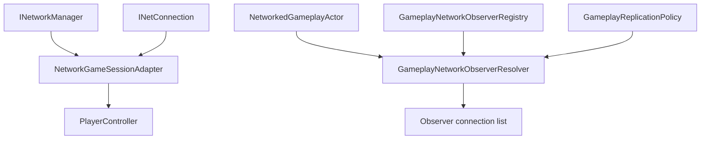

# CycloneGames.GameplayFramework.Networking

[English](./README.md) | 简体中文

`CycloneGames.GameplayFramework.Networking` 将 `CycloneGames.GameplayFramework` 接入 `CycloneGames.Networking`。它提供 `GameSession` adapter、actor migration 序列化 helper、消息 catalog 注册、authority role 解析，以及 owner、team、area、always-relevant replication 所需的 observer 选择数据。

基础包 `CycloneGames.GameplayFramework` 保持网络无关。只有当 GameplayFramework 对象需要进入 Cyclone Networking 流程时，才需要引用本桥接包。

## 包结构

```text
CycloneGames.GameplayFramework.Networking/
  Core/
    CycloneGames.GameplayFramework.Networking.Core.asmdef
    ActorMigrationNetworkingExtensions.cs
    GameplayFrameworkNetworkProtocol.cs
    GameplayNetworkObserverRegistry.cs
    GameplayNetworkReplication.cs
    NetworkGameSessionAdapter.cs
  Tests/Editor/
    CycloneGames.GameplayFramework.Networking.Tests.Editor.asmdef
    GameplayNetworkReplicationTests.cs
```

## 程序集边界

| Assembly | 职责 | Unity 依赖 |
| --- | --- | --- |
| `CycloneGames.GameplayFramework.Networking.Core` | Session bridge、协议注册、actor migration 序列化、authority helper、observer registry 和 observer resolver。 | 有 |
| `CycloneGames.GameplayFramework.Networking.Tests.Editor` | 覆盖 replication 和 session bridge 行为的 EditMode 测试。 | 有 |

Core assembly 引用 `CycloneGames.GameplayFramework.Runtime` 和 `CycloneGames.Networking.Core`。它不绑定 Mirror、Mirage、Nakama、Photon、Steam 或特定 DI 容器。

## 核心概念

| 类型 | 作用 |
| --- | --- |
| `NetworkGameSessionAdapter` | 继承 `GameSession`，将 `PlayerController` 与 `INetConnection` 绑定。 |
| `GameplayFrameworkNetworkProtocol` | 注册 GameplayFramework module message range 和 actor migration message descriptor。 |
| `GameplayNetworkAuthorityRole` | 描述 actor 的 server authority、autonomous proxy、simulated proxy 或无 authority 状态。 |
| `ServerAuthoritativeGameplayAuthorityResolver` | 根据本地 server/client 状态和 actor ownership 解析 authority role。 |
| `NetworkedGameplayActor` | 将 `Actor` 映射为 network id、owner、team、layer、relevance 和 interest position 数据。 |
| `GameplayReplicationPolicy` | 描述 visibility、channel、distance、tick interval、priority、layer mask、owner inclusion 和 authentication requirement。 |
| `GameplayNetworkObserverRegistry` | 按 connection id 保存 `NetworkInterestObserver` 数据。 |
| `GameplayNetworkObserverResolver` | 按 owner、team、area 和 always-relevant policy 过滤 candidate connections。 |

## Session 与 Observer 流程



## 协议

`GameplayFrameworkNetworkProtocol` 在 Cyclone module range 中拥有 `11000-11999` 消息 ID。

| Message | ID | Channel | Payload |
| --- | ---: | --- | --- |
| `MsgActorMigrationState` | `11000` | Reliable | Actor migration state payload descriptor |

在 composition root 中注册协议：

```csharp
using CycloneGames.GameplayFramework.Networking;
using CycloneGames.Networking;

public static class GameplayFrameworkNetworkInstaller
{
    public static void Configure(INetworkMessageCatalog catalog)
    {
        GameplayFrameworkNetworkProtocol.RegisterMessageCatalog(catalog);
    }
}
```

当 manager 暴露包含 `INetworkMessageCatalog` 的 `INetworkRuntimeContextProvider` 时，`NetworkGameSessionAdapter.SetNetworkManager()` 也会尝试注册 catalog。

## Session Bridge 流程

1. 在 GameplayFramework session 的 owner 位置创建或放置 `NetworkGameSessionAdapter`。
2. 将当前 `INetworkManager` 传入 `SetNetworkManager`。
3. 将每个已生成的 `PlayerController` 绑定到对应 `INetConnection`。
4. 通过 `ApproveLogin`、`RegisterPlayer`、`KickPlayer` 和 `BanPlayer` 应用 session 规则。
5. 玩家移除或连接关闭时解绑。

```csharp
using CycloneGames.GameplayFramework.Networking;
using CycloneGames.GameplayFramework.Runtime;
using CycloneGames.Networking;

public sealed class SessionNetworkBinder
{
    private readonly NetworkGameSessionAdapter _session;

    public SessionNetworkBinder(NetworkGameSessionAdapter session, INetworkManager manager)
    {
        _session = session;
        _session.SetNetworkManager(manager);
    }

    public void Bind(PlayerController controller, INetConnection connection)
    {
        _session.BindConnection(controller, connection);
    }
}
```

## Observer Resolution 流程

使用 `GameplayNetworkObserverRegistry` 发布 observer 位置，再使用 replication context 调用 `GameplayNetworkObserverResolver.ResolveObservers`：

```csharp
using System.Collections.Generic;
using CycloneGames.GameplayFramework.Networking;
using CycloneGames.Networking;

public sealed class ActorReplicationSelector
{
    private readonly GameplayNetworkObserverRegistry _registry = new GameplayNetworkObserverRegistry();
    private readonly GameplayNetworkObserverResolver _resolver = new GameplayNetworkObserverResolver();

    public int Resolve(
        NetworkedGameplayActor actor,
        IReadOnlyList<INetConnection> candidates,
        IList<INetConnection> results)
    {
        GameplayReplicationPolicy policy = GameplayReplicationPolicy.AreaUnreliable(40f);
        var context = new GameplayReplicationContext(actor, policy);
        return _resolver.ResolveObservers(context, candidates, _registry, results);
    }
}
```

## 扩展点

- 实现 `IGameplayNetworkAuthorityResolver` 来接入自定义 authority 规则。
- 当 observer 数据不存放在 `GameplayNetworkObserverRegistry` 中时，实现 `IGameplayNetworkObserverSource`。
- 项目自有 GameplayFramework 消息通过项目拥有的 `NetworkMessageKind.User` manifest 添加。
- 具体后端 SDK 代码放在 backend adapter 中，由 adapter 将 `INetworkManager`、`INetConnection` 和 observer 数据传入本包。

## 持久化

本包不写入文件、资产、偏好设置、缓存或运行时存档。Session adapter 和 observer registry 只在内存中保存运行时状态。

## 验证

修改本包后运行以下检查：

```text
Unity Test Runner > EditMode > CycloneGames.GameplayFramework.Networking.Tests.Editor
Unity Test Runner > EditMode > CycloneGames.GameplayFramework.Tests.Editor
Unity Test Runner > EditMode > CycloneGames.Networking.Tests.Editor
```
