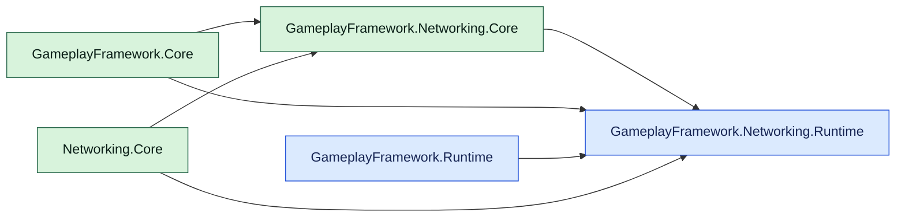

# CycloneGames.GameplayFramework.Networking

`CycloneGames.GameplayFramework.Networking` 将 `CycloneGames.Networking` 中与引擎无关的网络基础能力接入 Unity GameplayFramework Runtime。模块提供有界 wire contract、显式消息安全策略、服务端权威伤害校验、面向共享复制规划器的 Actor 采样、Actor 转移快照，以及具备网络连接管理能力的 GameSession adapter。

模块包含两个 assembly 层：


```mermaid
flowchart LR
    GFC["GameplayFramework.Core"] --> NC["GameplayFramework.Networking.Core"]
    N["Networking.Core"] --> NC
    NC --> NR["GameplayFramework.Networking.Runtime"]
    GFC --> NR
    GFR["GameplayFramework.Runtime"] --> NR
    N --> NR

    classDef core fill:#d8f3dc,stroke:#2d6a4f,color:#081c15
    classDef unity fill:#dbeafe,stroke:#1d4ed8,color:#172554
    class GFC,N,NC core
    class GFR,NR unity
```

- `CycloneGames.GameplayFramework.Networking.Core` 启用 `noEngineReferences: true`。协议定义、codec、安全策略组合、校验和网络 value type 均不依赖 `UnityEngine`。
- `CycloneGames.GameplayFramework.Networking.Runtime` 包含 `Actor`、`PlayerController`、`GameSession` 和 Unity `Vector3` adapter。

## 安装

Unity 项目需要安装：

- `com.cyclone-games.gameplay-framework`
- `com.cyclone-games.networking`
- `com.cyclone-games.gameplay-framework-networking`

Integration package 已在 `package.json` 中声明前两个依赖。如果 package 以内嵌方式放在 `Assets/` 下，必须保证对应 asmdef 同时存在，因为 Unity 不会在该位置解析本地 `package.json` 依赖。

模块不要求 Scripting Define Symbol、全局 Service Locator 或隐藏 Editor 偏好。

## 快速开始

### 注册协议

在接收 GameplayFramework 消息前注册 module manifest：

```csharp
GameplayFrameworkNetworkProtocol.RegisterMessageCatalog(messageCatalog);
```

调用 `NetworkGameSessionAdapter.SetMessageEndpoint` 时，也会通过 `INetworkMessageEndpoint` 尝试注册协议。

接收流量前，需要在 endpoint 的安全配置中安装 GameplayFramework 策略。客户端交接、服务端交接与 peer-hosted 产品的信任边界不同，因此迁移方向必须显式传入：

```csharp
GameplayFrameworkNetworkSecurityPolicies.Configure(
    securityConfigurable,
    migrationDirections: NetworkMessageDirectionMask.ServerToClient,
    requireEncryptedTransport: true,
    requireSignature: true);
```

伤害请求只接受 `ClientToServer`；伤害结果接受 `ServerToClient` 和 `ServerBroadcast`。所有 GameplayFramework 消息都要求已认证连接、replay protection 和协议声明的精确 payload 上限。加密与签名属于部署选项，必须与 transport 和 signer 配置一致。

### 配置网络 GameSession

在 gameplay World 的 owner thread 创建 adapter：

```csharp
var session = new NetworkGameSessionAdapter(
    maxPlayers: 64,
    maxSpectators: 8);

session.SetMessageEndpoint(messageEndpoint);
```

显式 composition 可以传入任意 `IGameSession` 实现：

```csharp
IGameSession gameplaySession = new GameSession(64, 8);
var session = new NetworkGameSessionAdapter(gameplaySession);
```

该 adapter 是 sealed 类型，玩法 roster 行为委托给传入的 session。它只拥有网络连接 staging、connection-player binding、地址封禁、endpoint 注册和断线协调职责。`maximumBannedAddressCount` 配置每个 session 的内存处罚预算，且不能超过实现安全上限。

Transport callback 必须先进入有界 owner-thread queue，再访问 adapter。所有涉及 collection 的 adapter 操作都会拒绝其他线程调用。这样可以在不引入 lock 或并发 collection 的情况下保持 GameplayFramework 单 owner mutation model。

### 暂存远程连接

玩法登录之前先暂存已经完成认证的 transport connection：

```csharp
if (!session.TryStageConnection(playerId, connection, out string stageError))
{
    RejectConnection(stageError);
    return;
}

var request = new PlayerLoginRequest(
    playerId,
    playerName,
    remoteAddress: connection.RemoteAddress);

if (!session.ApproveLogin(in request, out string loginError))
{
    session.RemoveStagedConnection(playerId, connection);
    RejectConnection(loginError);
}
```

在 gameplay session 接受请求之前，模块会校验 connection 状态、认证状态、玩家身份、地址长度、staging 容量、重复 connection ID 和地址封禁。Transport `ConnectionId` 必须为正数。Staging 会冻结已验证的 ID 与地址；如果 connection identity 在提交前发生变化，approval 与 binding 会拒绝该 connection。

Staging 会在发布任何条目之前同时为两份 identity index 预留容量。注册事务先提交组合的 `IGameSession`，再将暂存 connection 的验证与绑定作为同一 adapter 事务完成。提交后的任何拒绝或异常都会先回滚组合 session，再返回或重新抛出。如果自定义 session 无法完成回滚，adapter 会保留唯一的 recovery owner、报告 `HasRegistrationRollbackFault`，并拒绝后续注册。修复自定义 session 后，应在 owner thread 调用 `TryRecoverRegistrationRollback()`。该有界 fail-closed 状态可防止未绑定 participant 静默占用 gameplay roster。

## 共享复制规划器

复制策略、observer 求值、优先级、tick 间隔、channel 选择和字节/消息预算统一由 `CycloneGames.Networking.Replication` 提供。GameplayFramework 不维护第二套复制模型，其 Runtime assembly 仅将 Unity Actor 状态采样为共享的不可变输入值：

```csharp
NetworkReplicationPolicy policy = NetworkReplicationPolicy.OwnerOrArea(
    maxDistance: 80f,
    channel: NetworkChannel.UnreliableSequenced,
    minIntervalTicks: 2,
    priority: 10f);

NetworkReplicatedObject replicatedActor = actor.CaptureReplicationObject(
    objectId,
    policy,
    ownerConnectionId,
    ownerPlayerId,
    teamId,
    interestLayerMask,
    isDirty,
    requiresFullState,
    lastSentTick,
    estimatedPayloadBytes);
```

服务端根据已认证连接状态构造一个 `NetworkReplicationObserver`，再把 Actor 快照交给 `NetworkReplicationPlanner`：

```csharp
var observer = new NetworkReplicationObserver(
    connectionId,
    playerId,
    teamId,
    observerPosition,
    viewRadius,
    interestLayerMask,
    isAuthenticated,
    connectionQuality);

var budget = new NetworkSendBudget(maxBytes: 32_768, maxMessages: 256);
Span<NetworkReplicationSelection> selections = stackalloc NetworkReplicationSelection[256];
int count = replicationPlanner.BuildPlan(
    observer,
    replicatedObjects,
    serverTick,
    ref budget,
    selections);
```

共享 value constructor 会拒绝不允许的零值/负数 connection 与 object 身份、负数 team ID、未定义 enum 或 flag、非有限 position、distance、radius 与 priority、非法 last-sent tick，以及负数 payload 估算。`OwnerConnectionId == 0` 和 `OwnerPlayerId == 0` 表示不存在 owner 身份。规划器应用认证、owner、team、area、layer、dirty state、tick interval、priority 和 send budget 规则，不持有 Unity object。

## Actor 转移状态

`ActorMigrationState` 是不可变且与引擎无关的快照，用于在权威 World 或服务器实例间转移 Actor runtime state。Transform 使用 `NetworkVector3` 和 `NetworkQuaternion`。内容身份使用 `PrefabDefinitionId`，不假设 Unity asset path。

从 Unity Actor 捕获状态：

```csharp
ActorMigrationState state = actor.CaptureMigrationState(
    prefabDefinitionId: "actors/player/warrior",
    ownerConnectionId,
    instigatorActorId);
```

通过共享 networking primitive 序列化：

```csharp
writer.WriteMigrationState(in state);
ActorMigrationState state = reader.ReadMigrationState();
```

目标 World 完成 Actor spawn 和 registration 后应用已经校验的状态：

```csharp
destinationActor.ApplyMigrationState(in state);
```

Unity 状态发生任何变化前，模块会先校验完整快照。Definition ID 必须非空；transform 必须有限；quaternion 必须已归一化且非退化；lifespan 必须非负且有限；tag 必须按 ordinal 唯一，并满足数量、字符长度与内容限制；内容 ID、名称和 tag 必须满足 strict UTF-8 byte budget。无效 Unicode 会被拒绝，不会被替换。Unity capture 会先归一化有限 quaternion，再构造严格的 Core value。快照构造时复制 tag，并通过无分配的只读索引接口访问。

Owner 与 instigator 字段是稳定网络标识符。零表示没有 owner 或没有 instigator，负数 ID 会被拒绝。Boolean 只允许 wire byte `0` 或 `1`，reader 会拒绝截断或带 trailing bytes 的 payload。`ReadMigrationState(maxRuntimeTagCount)` 将零解释为禁用 runtime tag 的 deployment 策略，拒绝负数预算，并将正数预算限制在 Core tag 上限内。目标 World 创建对应 runtime object 后，由网络层完成标识符解析。`ActorMigrationNetworkingExtensions.MaximumEncodedSize` 是合法 payload 的精确最大值 26,045 bytes，protocol descriptor 使用相同上限。Deployment 必须为其实际允许的最大 state 配置足够的 route payload/fragmentation budget。

## 服务端权威伤害

`DamageRequestMessage` 表示不可信客户端意图。服务端将权威 ownership、transform、range、damage cap、target state、clock 和 cooldown 数据传给 `DefaultServerDamageValidator` 或项目自定义 `IServerDamageValidator`。

```csharp
ServerDamageValidationResult validation = processor.Process(
    in validationRequest,
    out DamageResultMessage result,
    requestSequence,
    damageEventType,
    hitLocation);
```

默认 validator 对以下情况执行 fail closed：

- 非正数 Actor 或 connection ID；
- 非有限 position、damage、clock、range 或 cooldown；
- 负数 damage、clock、range 或 cooldown（未知 last-accepted-time sentinel 使用 `double.NegativeInfinity`）；
- ownership 不匹配；
- target 不可受伤；
- 请求超出距离；
- 请求处于权威 cooldown 窗口内。

`ServerAuthoritativeDamageProcessor` 总是先执行默认 fail-closed baseline，再调用自定义 validator。自定义 validator 可以拒绝 baseline 已批准的请求或降低批准伤害，但不能绕过 baseline，也不能将伤害提高到权威上限之上。Processor 不信任调用方提供的 `LastAcceptedTimeSeconds`，而是根据自身 `DamageCooldownTracker` 重建该值。权威时间戳与 cooldown duration 使用 `double`，可在长期运行后继续保留亚秒 cooldown 分辨率；已接受时间戳保持单调，不允许向后回退。

`DamageCooldownTracker` 绑定 owner thread，并接收最大 instigator 数量。`GetAdmissionSnapshot()` 提供 tracked count、容量和拒绝次数。预算已满时，新 instigator 的已接受请求会以 `CooldownCapacityReached` fail closed；该结果与游戏规则的 `Custom` 拒绝明确区分。Actor teardown 时移除 instigator，session shutdown 时清空 tracker。

`ServerDamageValidationResult.Accept` 只接受有限且非负的 damage；`Reject` 只接受已定义的 rejection reason。Processor 会把自定义 validator 返回的畸形结果，或超过 baseline 批准值的伤害，转换为 `Custom` rejection。在提交 cooldown 状态前，Processor 会验证完整的 outbound result。已接受结果要求 instigator 和 target Actor ID 均为正数且不相同，applied damage 有限且非负，hit location 有限。被拒绝的结果不能携带非零 damage。非法 hit location 会在自定义验证之前失败，并仅在 rejection payload 中替换为 zero，使 fail-closed 结果仍可序列化。

`GameplayFrameworkNetworkSecurityPolicies` 配置认证、精确 payload limit、replay policy 和方向。共享安全管线提供已配置的 rate limiter、replay guard、signer、加密检查与 transport abuse protection。

该 float 路径面向服务端权威战斗。确定性 ability effect 应使用 GameplayAbilities networking pipeline，并且同一次命中不能同时通过两个路径应用。

## Wire protocol

`GameplayFrameworkNetworkProtocol` 拥有 `11000` 至 `11999` 的消息 ID 范围。当前 catalog 包含：

| 消息 | ID | Channel | 用途 |
| --- | ---: | --- | --- |
| `ActorMigrationState:v1` | `11000` | Reliable | 有界 Actor 转移状态 |
| `DamageRequestMessage:v1` | `11001` | Reliable | 客户端伤害意图 |
| `DamageResultMessage:v2` | `11002` | Reliable | 权威处理结果，包含 cooldown 容量拒绝 |

协议只支持 module version 2。所有 primitive field 都按固定顺序显式序列化。测试固定了 protocol ID、schema identity、消息长度、result code 和 fingerprint。Deserializer 会拒绝非规范 boolean、非法身份、非有限数值、截断、trailing bytes 和超出 runtime budget 的数据。

## 性能与内存

- 共享 replication descriptor、selection 和 validation request 使用 value type。
- Replication planner 写入调用方拥有的 span，并消耗显式 send budget。
- Damage cooldown tracker 和 GameSession adapter 的有界 dictionary 在 composition 与 admission 时分配，不在每次 hit 中分配。
- Actor 转移是冷路径。快照构造时复制一次 tag 以建立不可变 ownership。
- 较小的转移字符串使用 stack buffer，较大字符串使用 `ArrayPool<byte>`。
- Actor replication capture 是显式操作；模块不增加持有状态的 Unity/Core 同步层。

产品代码必须为每个 deployment profile 配置 replication result、cooldown tracker、participant、staged connection、inbound queue、rate limit、replay 与 transport payload budget。

## 线程与生命周期

- Core protocol value 和纯 validator 没有 Unity thread affinity。
- `DamageCooldownTracker` 捕获 owner thread 并拒绝其他线程访问；server simulation owner 必须串行化访问。
- `NetworkGameSessionAdapter` 在构造时捕获 owner thread，其他线程访问 collection 时会抛出异常。`MaximumSupportedBannedAddressCount` 是实现上限，`MaximumBannedAddressCount` 表示注入的每 session 预算。
- `ActorNetworkingExtensions` 调用 Actor live API。每个已初始化 Actor 都会验证其在 `Awake` 捕获的不可迁移 owner thread；已绑定 Actor 还会验证所属 World 的 owner thread，尚未初始化的 Actor 则 fail closed。
- Transport shutdown 应在 owner thread 移除 staged/bound connection 后再替换 message endpoint。

## 持久化

模块不写入文件、PlayerPrefs、EditorPrefs、registry 或隐藏项目状态。封禁地址和 connection binding 都是内存 session state。需要持久化处罚记录的产品必须提供专用 persistence service，并显式定义存储、隐私、保留、完整性与恢复策略。

## 测试与验证

测试按依赖边界分离：

- `CycloneGames.GameplayFramework.Networking.Core.Tests.Editor`：不依赖 UnityEngine，覆盖 protocol fingerprint、安全策略、严格 codec、有界 cooldown admission、长期运行 damage timing 和 damage processing。
- `CycloneGames.GameplayFramework.Networking.Runtime.Tests.Editor`：覆盖 Actor capture/apply adapter、共享 replication capture、网络 session composition、endpoint 行为和 owner-thread enforcement。

最小 Unity 验证步骤：

1. 等待 Unity 重新导入 package，确认 Console 无编译错误。
2. 运行上述两个 EditMode test assembly。
3. 启动 host/server 配置，验证 staged login、disconnect、安全拒绝诊断和 replication planning 均运行在其文档规定的 owner thread。
4. 通过选定 transport round-trip 一次 Actor 转移，并在 spawn 后解析 owner/instigator 标识符。
5. 对所有支持目标执行 Player/IL2CPP build；Editor test 不能证明 AOT、stripping 或 native transport compatibility。

## 故障排查

### Core assembly 报告引擎引用

协议代码应使用 `NetworkVector3`、`NetworkQuaternion` 和 GameplayFramework Core contract。Unity `Vector3`、`Actor`、`PlayerController` 与 `GameSession` 只能位于 Runtime assembly。

### Transport callback 抛出 owner-thread 异常

将 callback 放入有界 main/World-thread dispatcher，并在该队列被消费时调用 `NetworkGameSessionAdapter`。不要禁用检查或增加未同步的 collection 访问。

### Actor 转移被拒绝

写入或应用快照前检查有限 transform、lifespan、非负 owner/instigator ID、规范 boolean byte、`PrefabDefinitionId`、名称 UTF-8 大小、tag 数量、tag 字符长度、空白 tag 和精确 payload 长度。

### Observer 未被选中

检查共享 `NetworkReplicationPolicy`、connection/认证状态、正数 observer connection ID、owner identity、team ID、layer mask 交集、有限 radius、Actor position、dirty/full-state flag、最小 tick interval、result span 容量和剩余 send budget。
