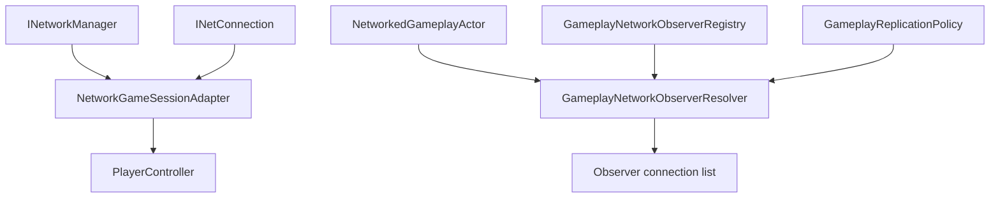

# CycloneGames.GameplayFramework.Networking

English | [Simplified Chinese](./README.SCH.md)

`CycloneGames.GameplayFramework.Networking` connects `CycloneGames.GameplayFramework` to `CycloneGames.Networking`. It provides a `GameSession` adapter, actor migration serialization helpers, message catalog registration, authority role resolution, and observer selection data for owner, team, area, and always-relevant replication.

The base `CycloneGames.GameplayFramework` package remains network-agnostic. This bridge is only needed when GameplayFramework objects participate in Cyclone Networking flows.

## Package Layout

```text
CycloneGames.GameplayFramework.Networking/
  Core/
    CycloneGames.GameplayFramework.Networking.Core.asmdef
    ActorMigrationNetworkingExtensions.cs
    GameplayFrameworkNetworkProtocol.cs
    GameplayNetworkObserverRegistry.cs
    GameplayNetworkReplication.cs
    NetworkGameSessionAdapter.cs
  Tests/Editor/
    CycloneGames.GameplayFramework.Networking.Tests.Editor.asmdef
    GameplayNetworkReplicationTests.cs
```

## Assembly Boundary

| Assembly | Role | Unity dependency |
| --- | --- | --- |
| `CycloneGames.GameplayFramework.Networking.Core` | Session bridge, protocol registration, actor migration serialization, authority helpers, observer registry, and observer resolver. | Yes |
| `CycloneGames.GameplayFramework.Networking.Tests.Editor` | EditMode coverage for replication and session bridge behavior. | Yes |

The core assembly references `CycloneGames.GameplayFramework.Runtime` and `CycloneGames.Networking.Core`. It does not bind to Mirror, Mirage, Nakama, Photon, Steam, or a DI container.

## Core Concepts

| Type | Purpose |
| --- | --- |
| `NetworkGameSessionAdapter` | Extends `GameSession` and binds `PlayerController` instances to `INetConnection`. |
| `GameplayFrameworkNetworkProtocol` | Registers the GameplayFramework module message range and actor migration message descriptor. |
| `GameplayNetworkAuthorityRole` | Describes server authority, autonomous proxy, simulated proxy, or no authority for an actor. |
| `ServerAuthoritativeGameplayAuthorityResolver` | Resolves authority roles from local server/client state and actor ownership. |
| `NetworkedGameplayActor` | Projects an `Actor` into network id, owner, team, layer, relevance, and interest position data. |
| `GameplayReplicationPolicy` | Describes visibility, channel, distance, tick interval, priority, layer mask, owner inclusion, and authentication requirement. |
| `GameplayNetworkObserverRegistry` | Stores `NetworkInterestObserver` data by connection id. |
| `GameplayNetworkObserverResolver` | Filters candidate connections by owner, team, area, and always-relevant policy. |

## Session And Observer Flow



## Protocol

`GameplayFrameworkNetworkProtocol` owns message ids `11000-11999` in the Cyclone module range.

| Message | ID | Channel | Payload |
| --- | ---: | --- | --- |
| `MsgActorMigrationState` | `11000` | Reliable | Actor migration state payload descriptor |

Register the protocol in a composition root:

```csharp
using CycloneGames.GameplayFramework.Networking;
using CycloneGames.Networking;

public static class GameplayFrameworkNetworkInstaller
{
    public static void Configure(INetworkMessageCatalog catalog)
    {
        GameplayFrameworkNetworkProtocol.RegisterMessageCatalog(catalog);
    }
}
```

`NetworkGameSessionAdapter.SetNetworkManager()` also attempts catalog registration when the manager exposes an `INetworkRuntimeContextProvider` containing an `INetworkMessageCatalog`.

## Session Bridge Workflow

1. Create or place a `NetworkGameSessionAdapter` where the GameplayFramework session is owned.
2. Pass the active `INetworkManager` to `SetNetworkManager`.
3. Bind each spawned `PlayerController` to its `INetConnection`.
4. Let `ApproveLogin`, `RegisterPlayer`, `KickPlayer`, and `BanPlayer` apply the session rules.
5. Unbind on player removal or connection teardown.

```csharp
using CycloneGames.GameplayFramework.Networking;
using CycloneGames.GameplayFramework.Runtime;
using CycloneGames.Networking;

public sealed class SessionNetworkBinder
{
    private readonly NetworkGameSessionAdapter _session;

    public SessionNetworkBinder(NetworkGameSessionAdapter session, INetworkManager manager)
    {
        _session = session;
        _session.SetNetworkManager(manager);
    }

    public void Bind(PlayerController controller, INetConnection connection)
    {
        _session.BindConnection(controller, connection);
    }
}
```

## Observer Resolution Workflow

Use `GameplayNetworkObserverRegistry` to publish observer positions, then call `GameplayNetworkObserverResolver.ResolveObservers` with a replication context:

```csharp
using System.Collections.Generic;
using CycloneGames.GameplayFramework.Networking;
using CycloneGames.Networking;

public sealed class ActorReplicationSelector
{
    private readonly GameplayNetworkObserverRegistry _registry = new GameplayNetworkObserverRegistry();
    private readonly GameplayNetworkObserverResolver _resolver = new GameplayNetworkObserverResolver();

    public int Resolve(
        NetworkedGameplayActor actor,
        IReadOnlyList<INetConnection> candidates,
        IList<INetConnection> results)
    {
        GameplayReplicationPolicy policy = GameplayReplicationPolicy.AreaUnreliable(40f);
        var context = new GameplayReplicationContext(actor, policy);
        return _resolver.ResolveObservers(context, candidates, _registry, results);
    }
}
```

## Extension Points

- Implement `IGameplayNetworkAuthorityResolver` for custom authority rules.
- Implement `IGameplayNetworkObserverSource` when observer data lives outside `GameplayNetworkObserverRegistry`.
- Add project-specific GameplayFramework messages through a project-owned `NetworkMessageKind.User` manifest.
- Keep concrete backend SDK code in a backend adapter that feeds `INetworkManager`, `INetConnection`, and observer data into this package.

## Persistence

This package does not write files, assets, preferences, caches, or runtime save data. Runtime state is held in memory by the session adapter and observer registry.

## Validation

Run these checks after changing the package:

```text
Unity Test Runner > EditMode > CycloneGames.GameplayFramework.Networking.Tests.Editor
Unity Test Runner > EditMode > CycloneGames.GameplayFramework.Tests.Editor
Unity Test Runner > EditMode > CycloneGames.Networking.Tests.Editor
```
