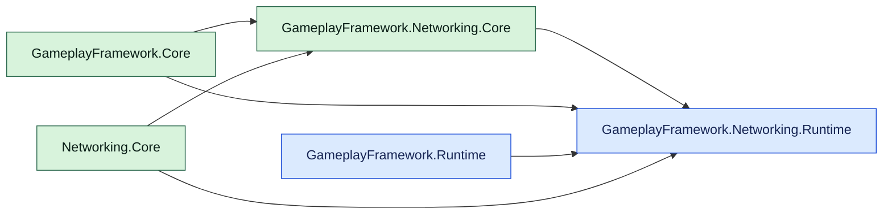

# CycloneGames.GameplayFramework.Networking

`CycloneGames.GameplayFramework.Networking` connects the engine-independent networking primitives in `CycloneGames.Networking` to the Unity-facing GameplayFramework runtime. The package supplies bounded wire contracts, server-authoritative damage validation, replication authority and observer policies, actor transfer snapshots, and a network-aware game-session adapter.

The package has two assembly layers:


```mermaid
flowchart LR
    GFC["GameplayFramework.Core"] --> NC["GameplayFramework.Networking.Core"]
    N["Networking.Core"] --> NC
    NC --> NR["GameplayFramework.Networking.Runtime"]
    GFC --> NR
    GFR["GameplayFramework.Runtime"] --> NR
    N --> NR

    classDef core fill:#d8f3dc,stroke:#2d6a4f,color:#081c15
    classDef unity fill:#dbeafe,stroke:#1d4ed8,color:#172554
    class GFC,N,NC core
    class GFR,NR unity
```

- `CycloneGames.GameplayFramework.Networking.Core` has `noEngineReferences: true`. Protocol definitions, codecs, validation, authority policy, observer resolution, and network value types can run without `UnityEngine`.
- `CycloneGames.GameplayFramework.Networking.Runtime` contains the Unity adapters for `Actor`, `PlayerController`, `GameSession`, and `Vector3`.

## Installation

Install these packages in the Unity project:

- `com.cyclone-games.gameplay-framework`
- `com.cyclone-games.networking`
- `com.cyclone-games.gameplay-framework-networking`

The integration package declares the first two dependencies in `package.json`. Projects that embed packages under `Assets/` must keep the corresponding assembly definitions available because Unity does not resolve local `package.json` dependencies there.

No scripting define symbol, global service locator, or hidden Editor preference is required.

## Quick start

### Register the protocol

Register the module manifest before accepting GameplayFramework messages:

```csharp
GameplayFrameworkNetworkProtocol.RegisterMessageCatalog(messageCatalog);
```

`NetworkGameSessionAdapter.SetMessageEndpoint` also attempts registration through an `INetworkMessageEndpoint`.

### Configure a network-aware session

Create the adapter on the gameplay World's owner thread:

```csharp
var session = new NetworkGameSessionAdapter(
    maxPlayers: 64,
    maxSpectators: 8);

session.SetMessageEndpoint(messageEndpoint);
```

For explicit composition, supply any `IGameSession` implementation:

```csharp
IGameSession gameplaySession = new GameSession(64, 8);
var session = new NetworkGameSessionAdapter(gameplaySession);
```

The adapter is sealed and delegates gameplay roster behavior to the supplied session. It owns only network connection staging, connection-to-player binding, address bans, endpoint registration, and disconnect coordination. `maximumBannedAddressCount` configures the in-memory sanction budget per session and cannot exceed the implementation safety ceiling.

Transport callbacks must enter a bounded owner-thread queue before accessing the adapter. Every collection-backed adapter operation rejects access from another thread. This preserves the GameplayFramework single-owner mutation model without locks or concurrent collections.

### Stage a remote connection

An authenticated transport connection is staged before gameplay login:

```csharp
if (!session.TryStageConnection(playerId, connection, out string stageError))
{
    RejectConnection(stageError);
    return;
}

var request = new PlayerLoginRequest(
    playerId,
    playerName,
    remoteAddress: connection.RemoteAddress);

if (!session.ApproveLogin(in request, out string loginError))
{
    session.RemoveStagedConnection(playerId, connection);
    RejectConnection(loginError);
}
```

Connection state, authentication, player identity, address length, staged capacity, duplicate connection IDs, and configured bans are validated before the gameplay session accepts the request. Transport `ConnectionId` values must be positive. Staging freezes the validated ID and address; approval and binding reject a connection whose identity changes before commit.

## Replication authority and observers

`NetworkedGameplayActor` is an engine-independent replication descriptor. It contains network identity, owner identity, team, interest layer, relevance policy, and a `NetworkVector3` interest position. It does not retain a Unity `Actor` reference.

Unity code samples the current Actor position explicitly:

```csharp
NetworkedGameplayActor target = actor.ToNetworkedGameplayActor(
    networkId,
    ownerConnectionId,
    ownerPlayerId,
    teamId,
    interestLayerMask,
    alwaysRelevant: false);
```

`ServerAuthoritativeGameplayAuthorityResolver` returns one of these roles:

- `ServerAuthority`
- `AutonomousProxy`
- `SimulatedProxy`
- `None` for an invalid descriptor or a context that is neither server nor client

Owner matching requires both IDs to be positive. `OwnerConnectionId == 0` represents an unowned Actor and never matches `LocalConnectionId == 0`.

`GameplayNetworkObserverResolver` applies owner, team, area, layer, authentication, and always-relevant rules to a caller-provided candidate list. It deduplicates positive connection IDs with a reusable scratch set and stops at its configured `MaximumResultCount`. Area visibility uses the smaller of the replication policy distance and the observer radius. A zero observer radius disables area visibility but does not disable team visibility. The caller owns and reuses the result list, so steady-state resolution does not allocate.

```csharp
var resolver = new GameplayNetworkObserverResolver(
    initialCapacity: 64,
    maximumResultCount: 512);
```

`GameplayNetworkObserverRegistry` accepts both an initial dictionary capacity and a product budget:

```csharp
var observers = new GameplayNetworkObserverRegistry(
    initialCapacity: 64,
    maximumObserverCount: 512);
```

The product budget exposed by `MaximumObserverCount` cannot exceed `MaximumSupportedObserverCount`. Admission diagnostics are available through `GetAdmissionSnapshot()`, whose `MaximumObserverCount` reports the same instance budget rather than dictionary allocation capacity. Position and radius inputs must be finite, radius must be non-negative, and observer connection IDs must be positive.

Core code registers observers with `NetworkVector3`. Unity code can use the Runtime adapter overload:

```csharp
observers.SetObserver(connection, cameraPosition, radius, layerMask, teamId);
```

## Actor transfer state

`ActorMigrationState` is an immutable, engine-independent snapshot used to transfer Actor runtime state between authoritative Worlds or server instances. Its transform uses `NetworkVector3` and `NetworkQuaternion`. Content identity uses `PrefabDefinitionId`; it does not assume a Unity asset path.

Capture state from a Unity Actor:

```csharp
ActorMigrationState state = actor.CaptureMigrationState(
    prefabDefinitionId: "actors/player/warrior",
    ownerConnectionId,
    instigatorActorId);
```

Serialize it through the shared networking primitives:

```csharp
writer.WriteMigrationState(in state);
ActorMigrationState state = reader.ReadMigrationState();
```

Apply a validated state after the destination World has spawned and registered the Actor:

```csharp
destinationActor.ApplyMigrationState(in state);
```

The complete snapshot is validated before any Unity state changes. Validation requires a non-empty definition ID, finite transforms, a normalized non-degenerate quaternion, non-negative finite lifespan, content ID and name byte budgets, unique ordinal tags, tag count, tag character length, tag content, and strict UTF-8. Invalid Unicode is rejected instead of being replaced. Unity capture normalizes a finite quaternion before constructing the strict Core value. Tags are copied when the snapshot is constructed and exposed through allocation-free indexed read access.

The owner and instigator fields are stable network identifiers. The network layer resolves them after the destination World has created the relevant runtime objects. `ActorMigrationNetworkingExtensions.MaximumEncodedSize` is the exact maximum legal payload, 26,045 bytes, and the protocol descriptor advertises that same limit. A deployment must configure a route payload/fragmentation budget large enough for the largest state it actually permits.

## Server-authoritative damage

`DamageRequestMessage` represents untrusted client intent. The server supplies authoritative ownership, transform, range, damage cap, target state, clock, and cooldown data to `DefaultServerDamageValidator` or a project-specific `IServerDamageValidator`.

```csharp
ServerDamageValidationResult validation = processor.Process(
    in validationRequest,
    out DamageResultMessage result,
    requestSequence,
    damageEventType,
    hitLocation);
```

The default validator fails closed for:

- non-positive Actor or connection IDs;
- non-finite positions, damage, clock, range, or cooldown values;
- negative damage, clock, range, or cooldown values (the unknown last-accepted-time sentinel is `float.NegativeInfinity`);
- ownership mismatch;
- non-damageable targets;
- out-of-range requests;
- requests inside the authoritative cooldown window.

`ServerAuthoritativeDamageProcessor` always runs the default fail-closed baseline before a custom validator. The custom validator can reject a baseline-approved request or reduce its approved damage, but it cannot bypass the baseline or raise damage above the authoritative cap. The processor ignores the caller-provided `LastAcceptedTimeSeconds` and rebuilds it from its own `DamageCooldownTracker`; accepted timestamps are monotonic and cannot move backward.

`ServerDamageValidationResult.Accept` accepts only finite non-negative damage, while `Reject` accepts only defined rejection reasons. The processor converts malformed custom-validator results, or damage above the baseline-approved amount, into a `Custom` rejection. Before committing cooldown state, it validates the complete outbound result. An accepted result requires positive, distinct instigator and target Actor IDs, finite non-negative applied damage, and a finite hit location. Rejected results cannot carry non-zero damage. Invalid hit locations fail before custom validation and are replaced with zero only in the rejection payload so that the fail-closed result remains serializable.

The shared networking security pipeline remains responsible for authentication, payload limits, rate limiting, replay policy, and transport-level abuse protection.

This float-based path targets server-authoritative combat. Deterministic ability effects should use the GameplayAbilities networking pipeline and must not apply the same hit through both paths.

## Wire protocol

`GameplayFrameworkNetworkProtocol` owns message IDs `11000` through `11999`. The current catalog contains:

| Message | ID | Channel | Purpose |
| --- | ---: | --- | --- |
| `ActorMigrationState:v1` | `11000` | Reliable | Bounded Actor transfer state |
| `DamageRequestMessage:v1` | `11001` | Reliable | Client damage intent |
| `DamageResultMessage:v1` | `11002` | Reliable | Authoritative result |

All primitive fields are serialized explicitly in a fixed order. Protocol IDs, schema identities, message sizes, result codes, and fingerprints are covered by frozen-contract tests. Deserializers reject data that exceeds runtime budgets or contains non-finite numeric values.

## Performance and memory

- Core replication descriptors and validation requests are value types.
- Observer resolution writes into caller-owned lists and reuses a bounded connection-ID set for deduplication.
- The observer registry and game-session adapter allocate their bounded dictionaries during composition, not per tick.
- Actor transfer is a cold path. Snapshot construction copies tags once to establish immutable ownership.
- Small transfer strings use stack buffers; larger strings use `ArrayPool<byte>`.
- The package does not create a parallel per-Actor model or add a per-tick Unity/Core synchronization layer.

Product code must configure observer, participant, staged connection, inbound queue, and transport payload budgets for each deployment profile.

## Threading and lifecycle

- Core protocol values and pure validators have no Unity thread affinity.
- Mutable registries and the observer resolver capture their owner thread and reject access from other threads; their owner must serialize access.
- `NetworkGameSessionAdapter` captures its owner thread at construction and rejects collection access from other threads. `MaximumSupportedBannedAddressCount` is the implementation ceiling, while `MaximumBannedAddressCount` reports the injected per-session budget.
- `ActorNetworkingExtensions` invokes Unity APIs. A bound Actor validates its owning World thread before any state read or write. An unbound authoring Actor has no World owner to validate, so its caller must invoke the adapter on the Unity main thread.
- Transport shutdown removes staged and bound connections on the owner thread before replacing the message endpoint.

## Persistence

This package does not write files, PlayerPrefs, EditorPrefs, registry entries, or hidden project state. Banned addresses and connection bindings are in-memory session state. Products that require durable sanctions must supply a dedicated persistence service with explicit storage, privacy, retention, integrity, and recovery policies.

## Tests and validation

The package separates tests by dependency boundary:

- `CycloneGames.GameplayFramework.Networking.Core.Tests.Editor`: protocol fingerprints, codecs, bounded validation, damage processing, authority rules, observer budgets, and observer resolution without UnityEngine.
- `CycloneGames.GameplayFramework.Networking.Runtime.Tests.Editor`: Actor capture/apply adapters, Actor replication conversion, network-aware session composition, endpoint behavior, and owner-thread enforcement.

Minimum Unity validation:

1. Allow Unity to reimport the package and confirm that the Console has no compilation errors.
2. Run both EditMode test assemblies above.
3. Start a host/server configuration and verify staged login, disconnect, and observer updates on the World owner thread.
4. Round-trip an Actor transfer through the selected transport and resolve owner/instigator identifiers after spawn.
5. Validate Player/IL2CPP builds for every supported target because Editor tests do not prove AOT, stripping, or native transport compatibility.

## Troubleshooting

### Core assembly reports an engine reference

Ensure protocol code references `NetworkVector3`, `NetworkQuaternion`, and GameplayFramework Core contracts. Unity `Vector3`, `Actor`, `PlayerController`, and `GameSession` belong in the Runtime assembly.

### A transport callback throws an owner-thread exception

Queue the callback in a bounded main/World-thread dispatcher and invoke `NetworkGameSessionAdapter` when that queue is drained. Do not disable the check or add unsynchronized collection access.

### Actor transfer is rejected

Check finite transform values, lifespan, `PrefabDefinitionId`, name UTF-8 size, tag count, tag character length, and empty/whitespace tags before writing or applying the snapshot.

### An observer is not selected

Check connection/authentication state, policy visibility, owner ID, team ID, observer presence, layer-mask intersection, finite radius, and the squared distance from the Actor interest position.
